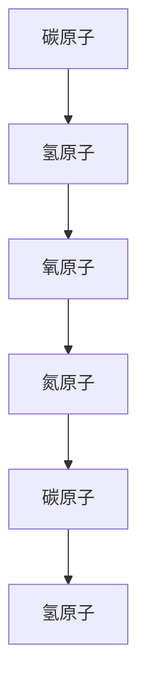
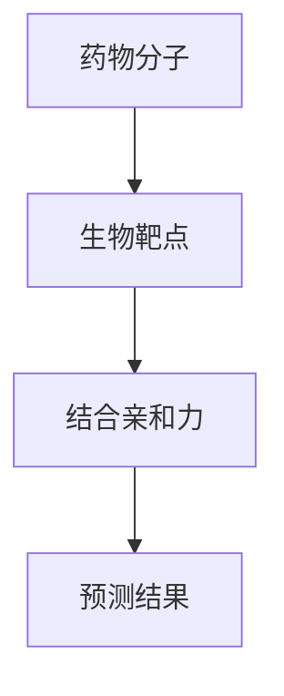
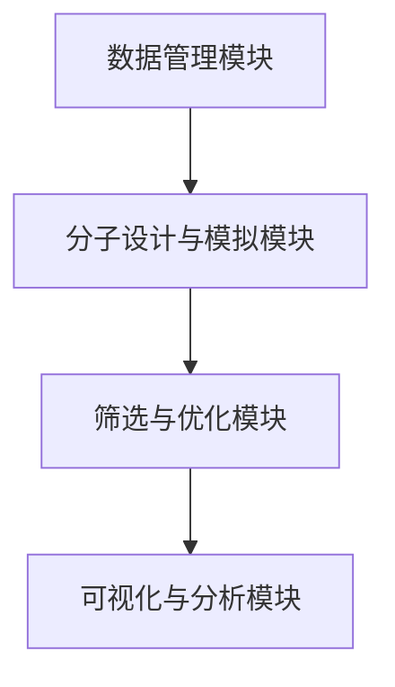
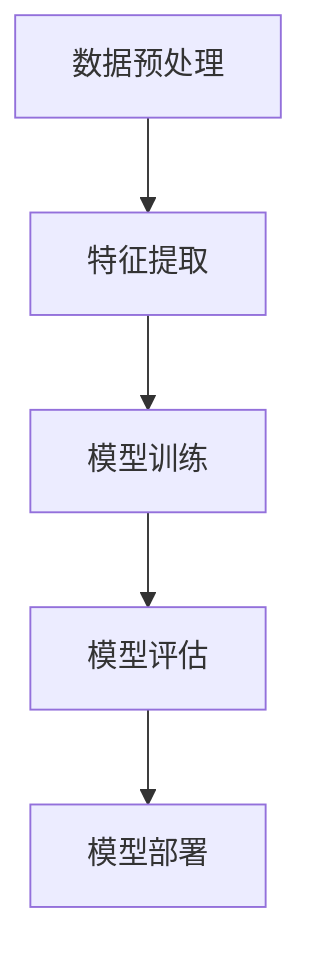
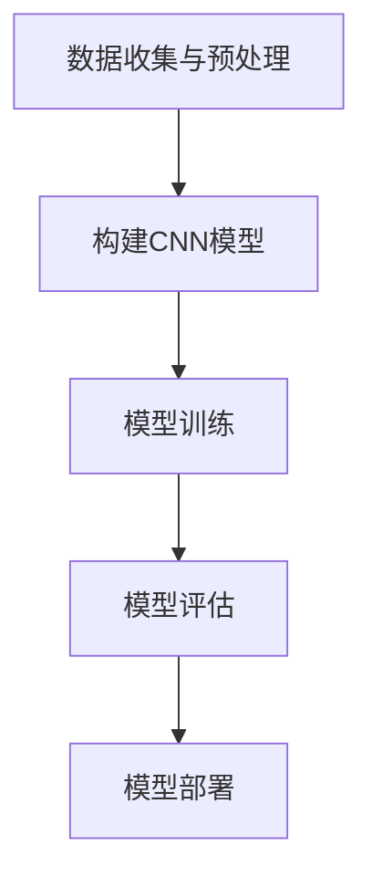

                 

### AI辅助新药研发：加速医药创新

> 关键词：人工智能、新药研发、医药创新、深度学习、算法、系统架构、最佳实践

> 摘要：本文将从背景分析、核心概念、应用实例、系统设计与实现、最佳实践等方面，详细探讨AI辅助新药研发的潜力及其在加速医药创新中的作用。通过对AI技术在新药研发各个阶段的深入分析，揭示AI如何通过技术创新推动医药行业的变革。

---

#### 目录

----------------------------------------------------------------
# 第一部分: AI在新药研发中的应用背景

## 第1章: 新药研发的现状与挑战

### 1.1 新药研发的过程概述

### 1.2 新药研发中的挑战

### 1.3 AI技术在药物研发中的潜力

## 第2章: AI核心概念与技术

### 2.1 机器学习基础

#### 2.1.1 监督学习

#### 2.1.2 无监督学习

#### 2.1.3 强化学习

### 2.2 深度学习技术

#### 2.2.1 卷积神经网络

#### 2.2.2 递归神经网络

#### 2.2.3 自编码器

## 第3章: AI在新药筛选中的应用

### 3.1 药物分子设计与模拟

#### 3.1.1 药物分子结构的表示方法

#### 3.1.2 药物-靶点相互作用预测

### 3.2 药物筛选平台介绍

#### 3.2.1 AI驱动的药物筛选平台

#### 3.2.2 数据处理与模型训练

## 第4章: AI在药物开发阶段的应用

### 4.1 药物毒性预测

#### 4.1.1 毒性预测模型

#### 4.1.2 数据集与评价指标

### 4.2 药物代谢动力学建模

#### 4.2.1 药物代谢动力学的数学模型

#### 4.2.2 代谢路径分析

## 第5章: AI在临床试验与监管中的应用

### 5.1 临床试验数据挖掘

#### 5.1.1 临床试验数据的收集与管理

#### 5.1.2 数据挖掘技术

### 5.2 监管科学中的AI应用

#### 5.2.1 AI在药品监管中的作用

#### 5.2.2 AI在药物监管流程中的应用

## 第6章: AI辅助新药研发的最佳实践

### 6.1 AI辅助新药研发案例分析

### 6.2 新药研发项目实施策略

### 6.3 AI在新药研发中的未来趋势

## 第7章: 小结与展望

### 7.1 小结

### 7.2 注意事项

### 7.3 拓展阅读

----------------------------------------------------------------

#### 第1章: 新药研发的现状与挑战

在新药研发领域，科学家们面临着一系列复杂的挑战，这些挑战不仅影响到新药的研发进度，也关系到新药的安全性和有效性。以下是新药研发过程中常见的一些挑战：

1. **研发成本高昂**：新药研发是一个耗时且昂贵的进程，从药物发现到临床试验，再到药物批准，每个阶段都需要大量的资金投入。据估计，一个新药从研发到上市平均需要超过10亿美元的费用。

2. **研发周期漫长**：新药从概念验证到最终上市通常需要10-15年的时间。这一漫长的周期不仅增加了研发成本，还可能导致药物在市场上市时已失去了部分商业价值。

3. **失败率高**：新药研发中的失败率非常高，据统计，只有约10%的候选药物能够成功通过临床试验，最终获得批准上市。

4. **靶点选择难度大**：新药研发的关键在于选择合适的药物靶点。然而，许多疾病机制复杂，靶点选择困难，导致研发进程受阻。

5. **临床试验难度大**：临床试验是验证新药安全性和有效性的关键步骤，但患者招募、数据收集和试验设计等方面的挑战，常常导致临床试验进度缓慢或失败。

6. **药物毒性预测困难**：药物在开发过程中，需要确保其安全性和有效性。然而，预测药物在人体内的毒性反应具有很大的挑战性，往往需要大量的人力和时间进行实验。

为了解决这些挑战，科学家们开始探索使用AI技术来辅助新药研发。AI技术可以通过大数据分析、机器学习算法和深度学习模型，提供以下几方面的帮助：

1. **加速药物筛选**：AI技术可以通过对大量药物分子和生物信息数据的分析，快速筛选出具有潜力的药物候选分子。

2. **提高研发效率**：AI技术可以帮助科学家们更快地识别疾病机制和药物靶点，从而提高研发效率。

3. **预测药物毒性**：AI技术可以通过学习大量的药物副作用数据，预测新药的潜在毒性，减少临床试验的风险。

4. **优化临床试验设计**：AI技术可以帮助设计更高效、更科学的临床试验方案，提高临床试验的成功率。

5. **提升药物代谢动力学研究**：AI技术可以帮助研究者更准确地预测药物在人体内的代谢路径和动力学特性。

综上所述，AI技术在辅助新药研发方面具有巨大的潜力，能够有效解决当前新药研发中的许多挑战。接下来，我们将进一步探讨AI技术在新药研发各个阶段的具体应用。

#### 第2章: AI核心概念与技术

要理解AI技术如何辅助新药研发，我们首先需要了解AI的核心概念和技术。AI技术主要包括机器学习和深度学习，下面将分别介绍这两种技术的基本概念和它们在药物研发中的应用。

##### 2.1 机器学习基础

机器学习是AI的核心组成部分，它使计算机系统能够从数据中学习，并对新数据做出预测或决策。机器学习可以分为三类：监督学习、无监督学习和强化学习。

###### 2.1.1 监督学习

监督学习是最常见的一种机器学习技术，它使用带有标签的训练数据集来训练模型，然后使用这个模型对新数据进行预测。监督学习包括回归和分类两种类型。

- **回归**：回归分析用于预测连续的数值输出，例如预测药物在人体内的浓度。
- **分类**：分类分析用于预测离散的类别输出，例如判断某个药物分子是否具有特定活性。

监督学习在药物研发中的应用包括：

1. **药物-靶点相互作用预测**：通过训练模型，预测药物分子与生物靶点的相互作用，从而快速筛选出具有潜在治疗作用的药物分子。

2. **药物毒性预测**：使用历史药物副作用数据，训练模型预测新药的潜在毒性，减少临床试验中的风险。

###### 2.1.2 无监督学习

无监督学习不需要标签数据，主要任务是发现数据中的隐含结构或模式。常见的无监督学习算法包括聚类和降维。

- **聚类**：聚类算法将数据分为多个组，每个组内的数据相似度较高。在药物研发中，聚类可以用于发现新药物分子的相似性和差异性。

- **降维**：降维技术用于减少数据维度，使得数据更容易处理和理解。在药物研发中，降维可以用于处理高维生物信息数据。

无监督学习在药物研发中的应用包括：

1. **药物分子结构分析**：通过聚类分析药物分子结构，可以发现类似结构的药物分子，从而指导新药设计。

2. **生物信息数据分析**：使用降维技术处理复杂的生物信息数据，有助于揭示生物机制和疾病关联。

###### 2.1.3 强化学习

强化学习是机器学习中的一种技术，通过交互式环境中的反馈信号来学习如何完成特定任务。强化学习通常用于需要决策的复杂问题，如游戏、机器人控制等。

在药物研发中，强化学习可以用于：

1. **药物合成路径优化**：通过学习历史合成数据，强化学习可以指导如何优化药物合成路径，提高合成效率和产率。

2. **药物设计自动化**：强化学习可以用于自动化药物设计，通过不断迭代优化，找到最佳药物分子结构。

##### 2.2 深度学习技术

深度学习是机器学习的一个分支，它使用多层神经网络来模拟人脑的学习过程，能够处理大量复杂数据。深度学习在药物研发中具有广泛的应用，其中最常用的模型包括卷积神经网络（CNN）、递归神经网络（RNN）和自编码器（Autoencoder）。

###### 2.2.1 卷积神经网络（CNN）

卷积神经网络是一种用于图像处理和计算机视觉的深度学习模型。它通过卷积层、池化层和全连接层，逐层提取图像特征。

在药物研发中，CNN可以用于：

1. **药物分子结构可视化**：通过CNN，可以将药物分子结构转化为图像，从而更直观地分析分子特征。

2. **药物分子相似性比较**：使用CNN，可以自动识别药物分子中的相似结构，指导新药设计。

###### 2.2.2 递归神经网络（RNN）

递归神经网络是一种用于处理序列数据的深度学习模型，它可以捕捉序列中的时间依赖性。

在药物研发中，RNN可以用于：

1. **药物代谢路径分析**：通过分析药物在体内的代谢路径，RNN可以帮助预测药物的效果和毒性。

2. **临床试验数据挖掘**：使用RNN，可以从临床试验数据中挖掘出潜在的关联和规律，为药物研发提供指导。

###### 2.2.3 自编码器（Autoencoder）

自编码器是一种无监督学习模型，它通过编码和解码两个阶段，将输入数据编码为低维特征表示，再解码还原为原始数据。

在药物研发中，自编码器可以用于：

1. **药物分子特征提取**：通过自编码器，可以从大量的药物分子数据中提取出有用的特征，用于后续分析。

2. **药物筛选**：使用自编码器提取的特征，可以用于快速筛选出具有潜在治疗作用的药物分子。

通过以上对AI核心概念和技术的介绍，我们可以看到，AI技术在药物研发中具有广泛的应用前景。接下来，我们将探讨AI技术在新药筛选、药物开发、临床试验和监管等方面的具体应用。

#### 第3章: AI在新药筛选中的应用

在新药研发的早期阶段，药物筛选是至关重要的一步。AI技术通过机器学习和深度学习模型，能够大幅提高药物筛选的效率和质量。以下是AI技术在新药筛选中的一些具体应用：

##### 3.1 药物分子设计与模拟

药物分子设计与模拟是药物筛选的基础。AI技术通过分析大量的药物分子结构数据，可以预测新药物分子的活性、稳定性和毒性。

###### 3.1.1 药物分子结构的表示方法

为了进行药物分子设计与模拟，首先需要将药物分子结构转化为计算机可以处理的形式。常用的药物分子结构表示方法包括：

- **原子图表示**：将药物分子中的每个原子表示为一个节点，原子之间的化学键表示为边。这种方法可以捕捉药物分子的化学结构信息。
- **指纹表示**：指纹是一种简化的结构表示方法，通过计算分子中的各种子结构模式，生成一个高维特征向量。这种方法可以高效地捕捉分子中的活性信息。

以下是一个原子图表示的示例：

在这个示例中，每个节点代表一个原子，边表示化学键。

###### 3.1.2 药物-靶点相互作用预测

药物-靶点相互作用预测是药物筛选的关键步骤。AI技术可以通过训练模型，预测新药物分子与特定生物靶点的结合能力。

使用机器学习算法，如卷积神经网络（CNN）和图神经网络（Graph Neural Network, GNN），可以处理复杂的分子结构数据，并预测药物与靶点的相互作用。以下是一个使用GNN进行药物-靶点相互作用预测的示例：

在这个示例中，药物分子和生物靶点通过图结构进行表示，结合亲和力是预测的相互作用强度。

##### 3.2 药物筛选平台介绍

为了充分利用AI技术进行药物筛选，许多研究机构和制药公司开发了专门的药物筛选平台。以下是一个典型的AI药物筛选平台的架构：

###### 3.2.1 AI驱动的药物筛选平台

AI驱动的药物筛选平台通常包括以下几个关键组成部分：

- **数据管理模块**：用于存储和管理药物分子、生物靶点以及相关的实验数据。
- **分子设计与模拟模块**：使用AI算法进行药物分子设计、模拟和预测。
- **筛选与优化模块**：根据药物分子的预测结果，进行筛选和优化，选择具有潜在治疗作用的药物分子。
- **可视化与分析模块**：用于展示和解析药物筛选的结果，帮助研究人员进行数据分析和决策。

以下是一个AI药物筛选平台的架构图：

###### 3.2.2 数据处理与模型训练

在AI药物筛选平台中，数据处理和模型训练是核心环节。以下是一个数据处理与模型训练的流程：

1. **数据预处理**：清洗和格式化药物分子和生物靶点的数据，使其适合模型训练。
2. **特征提取**：使用各种技术，如指纹表示和原子图表示，提取药物分子的特征。
3. **模型训练**：使用训练数据集，训练深度学习模型，如CNN和GNN，预测药物-靶点相互作用。
4. **模型评估**：使用验证数据集，评估模型的预测性能，并进行模型调优。
5. **模型部署**：将训练好的模型部署到药物筛选平台，进行实际应用。

以下是一个数据处理与模型训练的流程图：

通过以上对AI技术在新药筛选中的应用介绍，我们可以看到，AI技术不仅能够提高药物筛选的效率，还能够提高筛选的质量。接下来，我们将进一步探讨AI技术在药物开发阶段的应用。

#### 第4章: AI在药物开发阶段的应用

药物开发阶段是整个新药研发过程中最为关键和复杂的一步，涉及到多个学科和技术手段。AI技术在药物开发阶段的应用主要体现在以下几个方面：

##### 4.1 药物毒性预测

药物毒性预测是药物开发过程中的一项重要任务，目的是在药物进入临床试验之前，预测其潜在毒性，以减少临床试验的风险和成本。AI技术在这一领域具有显著优势。

###### 4.1.1 毒性预测模型

毒性预测模型通常基于机器学习和深度学习算法，通过学习大量的药物副作用数据，预测新药的潜在毒性。以下是一些常见的毒性预测模型：

1. **基于规则的方法**：这种方法使用专家知识构建规则来预测毒性，如基于结构的毒性预测（SST）模型，它基于药物分子结构预测毒性。

2. **基于统计的方法**：这种方法使用统计模型来预测毒性，如贝叶斯网络和逻辑回归。

3. **基于机器学习的方法**：这种方法使用机器学习算法，如支持向量机（SVM）和随机森林（RF），来预测毒性。

4. **基于深度学习的方法**：这种方法使用深度学习模型，如卷积神经网络（CNN）和长短期记忆网络（LSTM），来预测毒性。

以下是一个基于CNN的毒性预测模型的工作流程：

###### 4.1.2 数据集与评价指标

在毒性预测中，数据集的质量和评价指标的选择对模型的性能至关重要。常见的数据集包括：

- **Tox21数据集**：这是一个包含2000多个药物分子的数据集，用于预测21种毒性。
- **ChEMBL数据集**：这是一个包含超过600万个药物分子和生物靶点相互作用的数据库。

常见的评价指标包括：

- **准确率（Accuracy）**：预测为有毒性的药物中，实际为有毒性的比例。
- **精确率（Precision）**：预测为有毒性的药物中，正确预测为有毒性的比例。
- **召回率（Recall）**：实际为有毒性的药物中，正确预测为有毒性的比例。
- **F1分数（F1 Score）**：精确率和召回率的加权平均，用于综合评价模型的性能。

以下是一个毒

