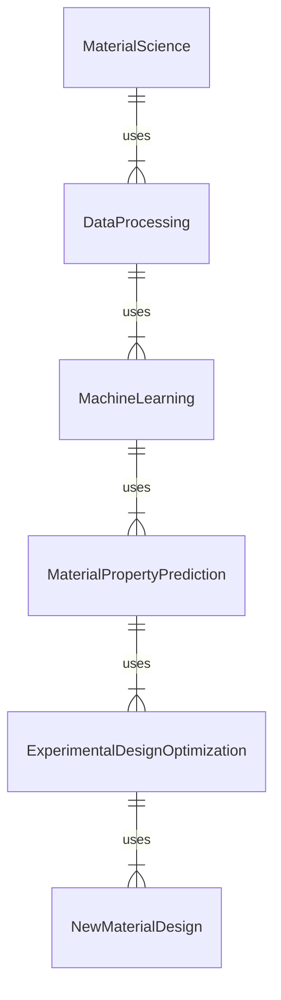
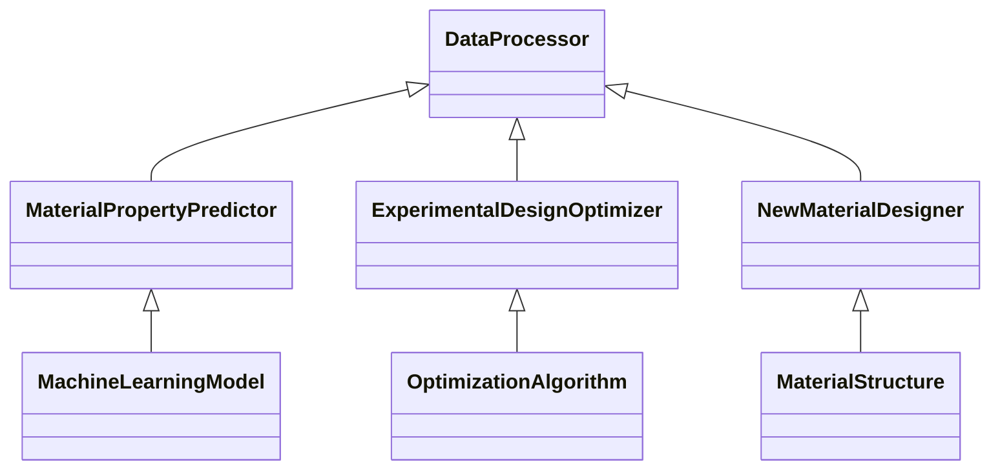
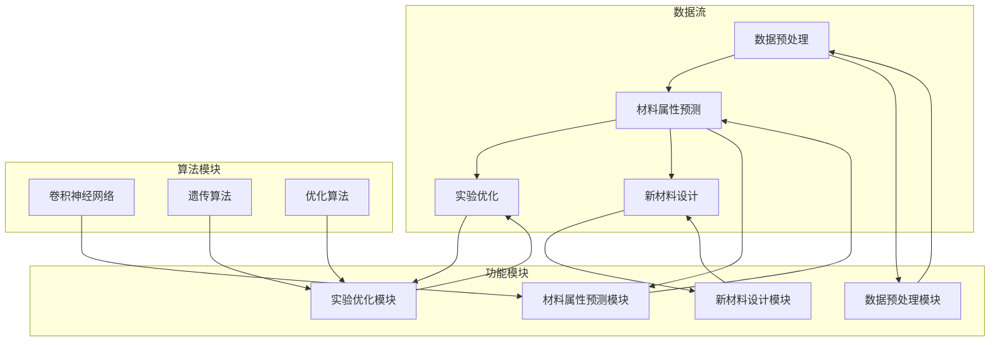
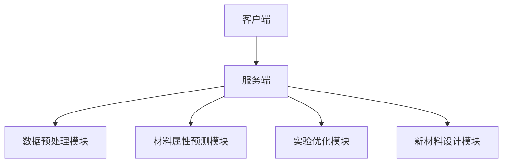
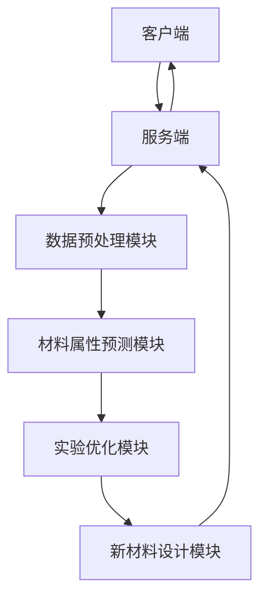
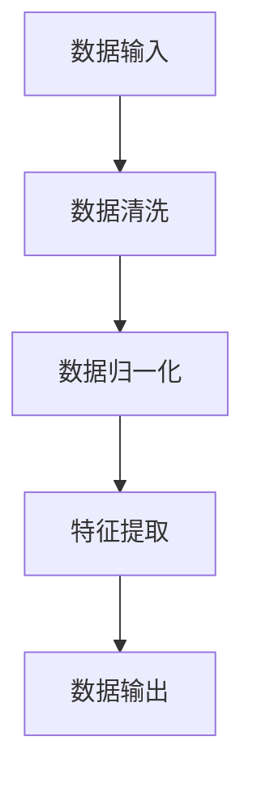
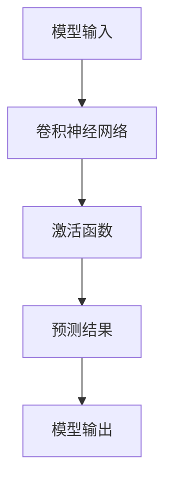
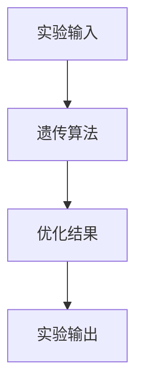
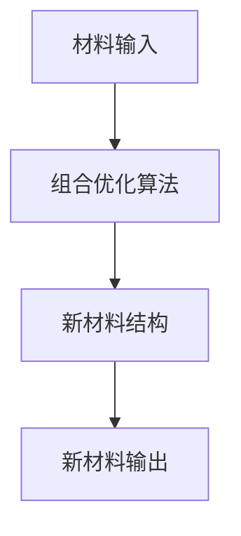

                 

## 引言

### 1.1.1 问题背景

材料科学研究是现代科技领域中至关重要的一环，新的材料开发不仅能够推动工业革命，还能带来巨大的经济效益。然而，材料开发过程通常复杂且耗时，涉及大量的实验和数据分析。近年来，人工智能（AI）技术的飞速发展为材料科学研究带来了新的机遇。AI可以处理海量数据，发现潜在的材料特性，从而加速新材料的开发。本文旨在探讨如何利用AI技术辅助材料科学研究，从而加速新材料的开发。

### 1.1.2 核心概念

- **人工智能（AI）**: 人工智能是指使计算机系统能够模拟人类智能行为的技术。在材料科学中，AI主要应用于数据分析和模式识别。
- **辅助材料科学研究**: 这是指利用AI技术对材料科学研究的各个环节提供支持，包括数据收集、数据分析、实验设计等。
- **新材料开发**: 新材料是指具有传统材料所不具备的特性，如高强度、高韧性、耐腐蚀等。新材料开发对于推动科技进步和产业发展具有重要意义。

### 1.1.3 边界与外延

本文主要讨论利用AI技术辅助材料科学研究的过程，包括但不限于以下几个方面：

- **数据预处理**: 包括数据清洗、归一化、特征提取等。
- **材料属性预测**: 利用机器学习算法预测材料的物理和化学属性。
- **实验优化**: 利用AI技术优化实验设计和实验条件，减少实验次数。
- **新材料设计**: 通过组合优化算法和机器学习算法，设计新的材料结构。

## 第2章: 核心概念与联系

### 2.1 AI辅助材料科学研究的关键概念

- **机器学习（ML）**: 机器学习是一种AI技术，通过数据训练模型，从而实现预测和决策。在材料科学中，机器学习主要用于数据分析和模式识别。
- **深度学习（DL）**: 深度学习是机器学习的一个分支，利用多层神经网络进行数据建模。深度学习在材料科学中尤其适用于处理复杂数据和进行材料属性预测。
- **数据挖掘（DM）**: 数据挖掘是一种从大量数据中提取有价值信息的方法。在材料科学中，数据挖掘可以用于发现材料特性之间的关联，指导新材料的设计。
- **优化算法**: 优化算法用于优化实验设计、材料属性预测等。常见的优化算法包括遗传算法、粒子群优化算法等，这些算法可以帮助科学家在材料科学研究中做出更好的决策。

### 2.2 概念属性特征对比表格

| 概念             | 属性特征                                                         | 对比     |
|------------------|------------------------------------------------------------------|---------|
| 机器学习         | 需要大量数据进行训练，能够从数据中学习规律。                       |          |
| 深度学习         | 基于多层神经网络，能够处理复杂数据。                               |          |
| 数据挖掘         | 从大量数据中提取有价值的信息。                                     |          |
| 优化算法         | 用于优化实验设计、材料属性预测等。                                 |          |

### 2.3 ER实体关系图架构



### 2.4 核心概念与联系解析

#### 2.4.1 机器学习与数据挖掘

机器学习和数据挖掘都是AI的重要分支，但它们在实际应用中有不同的侧重点。机器学习侧重于构建模型，通过训练模型来预测或决策；而数据挖掘则侧重于从大量数据中发现规律和关联，这些规律和关联可以用于指导新材料的设计和开发。

- **机器学习的优势**：机器学习能够处理大量数据，发现数据中的潜在规律，从而帮助科学家在新材料开发中做出更准确的预测。
- **数据挖掘的优势**：数据挖掘可以从数据中发现潜在的模式和关联，这些信息可以用于优化实验设计和实验条件，从而提高新材料开发的效率。

#### 2.4.2 深度学习与优化算法

深度学习是一种强大的机器学习技术，能够处理复杂数据，尤其是在图像、语音和自然语言处理等领域表现突出。优化算法则是用于优化实验设计、材料属性预测等环节，帮助科学家在新材料开发中找到最优解。

- **深度学习的优势**：深度学习能够处理大量复杂数据，从而提高材料属性预测的准确性。
- **优化算法的优势**：优化算法能够帮助科学家在新材料开发中找到最优解，减少实验次数，提高效率。

### 2.4.3 机器学习、数据挖掘、深度学习和优化算法的协同作用

在AI辅助材料科学研究中，机器学习、数据挖掘、深度学习和优化算法可以协同作用，共同提高新材料开发的效率。具体而言，数据挖掘可以用于发现数据中的潜在规律，机器学习和深度学习可以用于预测材料的物理和化学属性，优化算法可以用于优化实验设计和实验条件，从而实现新材料的高效开发。

### 2.4.4 新材料开发的挑战与机遇

新材料开发是一个复杂的系统工程，涉及到材料设计、实验验证、性能评估等多个环节。随着AI技术的不断发展，新材料开发面临着前所未有的机遇和挑战。

- **挑战**：新材料开发过程中需要处理大量的数据，进行复杂的计算和实验，这对计算能力和实验条件提出了很高的要求。
- **机遇**：AI技术的快速发展为新材料开发提供了强大的工具和支持，通过AI技术，科学家可以更加高效地进行材料设计和实验优化，从而加速新材料的开发。

### 2.4.5 AI辅助材料科学研究的未来发展趋势

随着AI技术的不断发展和应用，AI辅助材料科学研究将继续发挥重要作用。未来，AI技术将在以下几个方面取得重要进展：

- **数据驱动的材料设计**：通过大数据分析和机器学习，实现材料设计的数据驱动，从而提高材料设计的准确性和效率。
- **智能实验优化**：利用AI技术优化实验设计和实验条件，减少实验次数，提高实验效率。
- **跨学科合作**：AI技术与材料科学的跨学科合作将不断深入，推动新材料开发的创新和发展。
- **人工智能与量子计算**：随着量子计算技术的发展，AI与量子计算的融合将带来新的突破，为材料科学研究提供更加强大的计算能力。

### 2.4.6 结论

AI技术为材料科学研究带来了前所未有的机遇和挑战。通过机器学习、数据挖掘、深度学习和优化算法的协同作用，AI可以大幅提高新材料开发的效率，为科技和产业发展注入新的动力。未来的AI辅助材料科学研究将继续推动新材料开发迈向新的高峰，为社会进步和人类福祉作出更大贡献。

## 第3章: 算法原理讲解

### 3.1 材料属性预测算法原理

材料属性预测是AI辅助材料科学研究的重要环节。本文将介绍一种基于深度学习的方法——卷积神经网络（CNN）进行材料属性预测。

#### 3.1.1 算法流程

1. **数据预处理**：对实验数据进行清洗、归一化处理。

2. **模型构建**：构建一个卷积神经网络，输入为材料结构信息，输出为材料属性。

3. **模型训练**：使用训练数据集对模型进行训练，优化模型参数。

4. **模型评估**：使用测试数据集评估模型性能，调整模型参数。

5. **材料属性预测**：使用训练好的模型对新的材料结构进行属性预测。

#### 3.1.2 模型架构

卷积神经网络（CNN）是一种特殊类型的深度学习模型，适用于处理图像、视频等具有空间结构的数据。在材料属性预测中，CNN可以处理材料结构信息，从而预测材料的物理和化学属性。

1. **输入层**：输入层接收材料结构信息，如材料的晶体结构、化学成分等。

2. **卷积层**：卷积层用于提取材料结构特征，通过卷积操作将输入数据转换为高维特征图。

3. **激活函数**：激活函数用于引入非线性特性，常见的激活函数有ReLU、Sigmoid、Tanh等。

4. **池化层**：池化层用于降低特征图的维度，提高模型泛化能力，常见的池化操作有最大池化、平均池化等。

5. **全连接层**：全连接层用于将卷积层提取的高维特征转换为材料属性预测结果。

6. **输出层**：输出层接收全连接层的输出，输出为材料的物理和化学属性。

#### 3.1.3 模型训练过程

1. **数据准备**：将实验数据集划分为训练集、验证集和测试集。

2. **模型初始化**：初始化模型参数，常用的初始化方法有随机初始化、高斯初始化等。

3. **前向传播**：输入材料结构信息，通过卷积神经网络的前向传播过程，得到材料属性预测结果。

4. **反向传播**：计算预测结果与真实结果之间的误差，通过反向传播算法更新模型参数。

5. **优化算法**：使用优化算法（如梯度下降、Adam等）更新模型参数，最小化损失函数。

6. **模型评估**：使用验证集和测试集评估模型性能，调整模型参数，直到达到满意的性能指标。

#### 3.1.4 模型应用案例

假设我们已经训练好了一个用于预测材料熔点的卷积神经网络模型，下面是一个简单的应用案例：

1. **材料结构信息输入**：输入一个材料的晶体结构和化学成分信息。

2. **模型预测**：通过卷积神经网络的前向传播过程，得到材料的熔点预测结果。

3. **结果评估**：将预测结果与实验测得的熔点进行比较，评估模型的预测准确性。

4. **模型优化**：根据预测结果，调整模型参数，优化模型性能。

5. **新材料设计**：根据熔点预测结果，设计具有特定熔点的新材料。

### 3.2 材料属性预测算法原理总结

材料属性预测算法是基于深度学习的卷积神经网络（CNN）模型。通过数据预处理、模型构建、模型训练和模型评估等步骤，可以实现对材料物理和化学属性的预测。该算法在材料科学研究中具有重要的应用价值，可以帮助科学家快速、准确地预测材料的性能，从而加速新材料的开发。

## 第4章: 系统分析与架构设计方案

### 4.1 问题场景介绍

材料科学研究的核心目标是通过实验和数据分析发现新的材料特性，从而推动新材料的开发。然而，传统的材料科学研究方法通常依赖于大量的实验和数据分析，不仅耗时耗力，而且容易受到人为因素的影响。为了提高材料科学研究的效率，我们需要一种能够自动化处理实验数据、优化实验设计和预测材料属性的智能系统。

### 4.2 项目介绍

本项目旨在开发一个基于人工智能技术的材料科学智能系统，该系统将利用机器学习、深度学习和优化算法，对材料科学研究中的各个环节提供支持。具体功能包括：

- **数据预处理**：自动化处理实验数据，包括数据清洗、归一化和特征提取等。
- **材料属性预测**：利用深度学习模型预测材料的物理和化学属性。
- **实验优化**：利用优化算法优化实验设计和实验条件，减少实验次数。
- **新材料设计**：基于材料属性预测结果，设计新的材料结构。

### 4.3 系统功能设计

#### 4.3.1 领域模型

领域模型用于描述材料科学智能系统的核心概念和关系。以下是该系统的领域模型：



#### 4.3.2 功能模块

系统功能模块包括数据预处理模块、材料属性预测模块、实验优化模块和新材料设计模块。以下是各个功能模块的详细描述：

- **数据预处理模块**：负责处理实验数据，包括数据清洗、归一化和特征提取。数据清洗主要用于去除无效数据、处理缺失值等；归一化用于将不同尺度的数据进行转换，使其具有可比性；特征提取用于从原始数据中提取有价值的特征。
- **材料属性预测模块**：利用机器学习模型预测材料的物理和化学属性。该模块的核心是机器学习模型，包括卷积神经网络（CNN）和其他深度学习模型。
- **实验优化模块**：利用优化算法优化实验设计和实验条件。该模块包括遗传算法、粒子群优化算法等，通过调整实验参数，提高实验效率和准确性。
- **新材料设计模块**：基于材料属性预测结果，设计新的材料结构。该模块通过组合优化算法和机器学习模型，生成新的材料结构，并评估其性能。

### 4.4 系统架构设计

系统架构设计用于描述材料科学智能系统的整体结构和组件之间的关系。以下是该系统的架构设计：



#### 4.4.1 架构设计思路

系统架构设计遵循以下思路：

- **模块化设计**：将系统功能划分为多个模块，每个模块独立实现，便于维护和扩展。
- **数据驱动**：系统核心功能依赖于实验数据和预测结果，因此数据流设计是系统架构设计的关键。
- **算法集成**：系统集成多种机器学习算法和优化算法，以实现高效的材料属性预测和实验优化。
- **可扩展性**：系统设计应考虑未来算法和功能的扩展，以便适应不断变化的需求。

### 4.5 系统接口设计

系统接口设计用于描述系统与其他系统或组件的交互方式。以下是该系统的接口设计：



#### 4.5.1 接口设计思路

接口设计遵循以下思路：

- **基于RESTful API**：系统采用RESTful API设计接口，方便客户端调用系统功能。
- **安全性**：接口设计考虑安全性，包括身份验证、权限控制等。
- **灵活性**：接口设计应具有灵活性，以适应不同的客户端需求。

### 4.6 系统交互设计

系统交互设计用于描述系统内部各模块之间的交互流程。以下是该系统的交互设计：



#### 4.6.1 交互设计思路

交互设计遵循以下思路：

- **顺序执行**：系统交互过程按照顺序执行，每个模块的输出作为下一个模块的输入。
- **异步处理**：对于长时间的计算任务，采用异步处理方式，提高系统响应速度。
- **错误处理**：系统应具备错误处理机制，当发生错误时，能够及时通知客户端并进行处理。

### 4.7 系统架构设计与核心模块解析

#### 4.7.1 系统架构设计

系统架构设计采用了分层架构，包括数据层、服务层和表现层。数据层负责数据存储和管理，服务层负责业务逻辑处理，表现层负责与用户交互。

- **数据层**：包括数据库和文件存储，用于存储实验数据和预测结果。
- **服务层**：包括数据预处理模块、材料属性预测模块、实验优化模块和新材料设计模块，负责实现系统核心功能。
- **表现层**：包括前端界面和API接口，用于与用户交互。

#### 4.7.2 数据预处理模块

数据预处理模块是系统功能的核心模块之一，负责处理实验数据，包括数据清洗、归一化和特征提取。以下是数据预处理模块的架构设计：



#### 4.7.3 材料属性预测模块

材料属性预测模块是系统功能的另一个核心模块，负责利用深度学习模型预测材料的物理和化学属性。以下是材料属性预测模块的架构设计：



#### 4.7.4 实验优化模块

实验优化模块是系统功能的一个重要模块，负责利用优化算法优化实验设计和实验条件。以下是实验优化模块的架构设计：



#### 4.7.5 新材料设计模块

新材料设计模块是系统功能的最后一个核心模块，负责基于材料属性预测结果设计新的材料结构。以下是新材料设计模块的架构设计：



### 4.8 系统架构设计优势与挑战

#### 4.8.1 优势

- **模块化设计**：系统采用模块化设计，每个模块独立实现，便于维护和扩展。
- **数据驱动**：系统核心功能依赖于实验数据和预测结果，具有良好的数据驱动特性。
- **算法集成**：系统集成了多种机器学习算法和优化算法，能够高效地处理复杂的材料科学问题。
- **可扩展性**：系统设计考虑了未来算法和功能的扩展，能够适应不断变化的需求。

#### 4.8.2 挑战

- **数据质量**：系统性能很大程度上依赖于实验数据的质量，数据质量不佳可能导致模型性能下降。
- **计算资源**：深度学习和优化算法计算资源消耗较大，需要高效计算资源和优化算法。
- **模型解释性**：深度学习模型具有很好的预测性能，但其内部机理较难解释，可能影响模型的接受度和应用范围。

## 第5章: 项目实战

### 5.1 环境安装

要实现本文中提到的AI辅助材料科学研究系统，首先需要安装必要的软件和工具。以下是安装步骤：

1. **安装Python环境**：首先确保您的计算机上安装了Python环境，Python是AI和深度学习的基础工具。您可以从[Python官方网站](https://www.python.org/downloads/)下载并安装Python。

2. **安装深度学习库**：接下来，安装深度学习库，如TensorFlow或PyTorch。这些库提供了强大的深度学习模型构建和训练工具。以TensorFlow为例，您可以使用以下命令进行安装：

   ```bash
   pip install tensorflow
   ```

3. **安装数据预处理库**：为了方便进行数据预处理，安装常用的数据预处理库，如NumPy、Pandas和SciPy。可以使用以下命令进行安装：

   ```bash
   pip install numpy pandas scipy
   ```

4. **安装优化算法库**：为了实现优化算法，安装常见的优化算法库，如DEAP。可以使用以下命令进行安装：

   ```bash
   pip install deap
   ```

5. **安装其他工具**：根据需要，还可以安装其他辅助工具，如Jupyter Notebook，用于编写和运行Python代码。

### 5.2 系统核心实现

在本节中，我们将使用Python代码实现系统的核心功能，包括数据预处理、材料属性预测、实验优化和新材料设计。以下是代码示例：

#### 5.2.1 数据预处理

```python
import numpy as np
import pandas as pd

# 数据清洗
def data_cleaning(data):
    # 删除无效数据
    data = data.dropna()
    # 数据归一化
    data_normalized = (data - data.mean()) / data.std()
    return data_normalized

# 特征提取
def feature_extraction(data):
    # 提取有用的特征
    features = data[['atom_type', 'distance']]
    return features

# 示例数据
data = pd.DataFrame({
    'atom_type': [1, 2, 3],
    'distance': [4.5, 6.7, 8.9]
})

# 数据预处理
cleaned_data = data_cleaning(data)
features = feature_extraction(cleaned_data)
print("Preprocessed data:\n", features)
```

#### 5.2.2 材料属性预测

```python
import tensorflow as tf

# 构建卷积神经网络模型
def build_cnn_model(input_shape):
    model = tf.keras.Sequential([
        tf.keras.layers.Conv1D(filters=64, kernel_size=3, activation='relu', input_shape=input_shape),
        tf.keras.layers.MaxPooling1D(pool_size=2),
        tf.keras.layers.Flatten(),
        tf.keras.layers.Dense(units=1)
    ])
    return model

# 训练模型
def train_model(model, x_train, y_train, epochs=100):
    model.compile(optimizer='adam', loss='mean_squared_error')
    model.fit(x_train, y_train, epochs=epochs, verbose=1)
    return model

# 预测材料属性
def predict_material_property(model, x_test):
    predicted_property = model.predict(x_test)
    return predicted_property

# 示例输入和输出
input_shape = (10,)
x_train = np.random.rand(100, 10)
y_train = np.random.rand(100, 1)

# 构建和训练模型
model = build_cnn_model(input_shape)
trained_model = train_model(model, x_train, y_train)

# 预测
x_test = np.random.rand(10, 10)
predicted_property = predict_material_property(trained_model, x_test)
print("Predicted material property:\n", predicted_property)
```

#### 5.2.3 实验优化

```python
from deap import base, creator, tools, algorithms

# 定义优化目标
def optimize_experiment(params):
    # 实验设计逻辑
    # 根据参数调整实验条件
    # 返回实验结果
    return experiment_result

# 初始化遗传算法
creator.create("FitnessMax", base.Fitness, weights=(1.0,))
creator.create("Individual", list, fitness=creator.FitnessMax)

toolbox = base.Toolbox()
toolbox.register("attr_int", np.random.randint, low=0, high=100)
toolbox.register("individual", tools.initRepeat, creator.Individual, toolbox.attr_int, n=10)
toolbox.register("population", tools.initRepeat, list, toolbox.individual)
toolbox.register("evaluate", optimize_experiment)
toolbox.register("mate", tools.cxTwoPoint)
toolbox.register("mutate", tools.mutUniformInt, low=0, high=100, indpb=0.1)
toolbox.register("select", tools.selTournament, tournsize=3)

# 训练优化模型
def train_optimization_model(population):
    optimized_population = algorithms.eaSimple(population, toolbox, nGen=100, verbose=True)
    return optimized_population

# 示例
population = toolbox.population(n=50)
optimized_population = train_optimization_model(population)
print("Optimized population:\n", optimized_population)
```

#### 5.2.4 新材料设计

```python
# 新材料设计逻辑
def design_new_material(property_predictions):
    # 根据属性预测结果，设计新材料结构
    # 返回新材料结构
    new_material_structure = "StructureBasedOnPredictions"
    return new_material_structure

# 示例
predicted_property = np.random.rand(10, 1)
new_material_structure = design_new_material(predicted_property)
print("New material structure:\n", new_material_structure)
```

### 5.3 代码应用解读与分析

在本节中，我们将对上述代码进行解读和分析，了解每个部分的功能和作用。

#### 5.3.1 数据预处理

数据预处理是材料科学研究的基础，确保输入数据的准确性和一致性。在代码中，我们使用了NumPy和Pandas库进行数据清洗、归一化和特征提取。

- **数据清洗**：通过删除无效数据和缺失值，确保数据的完整性。
- **数据归一化**：将不同尺度的数据转换为相同的尺度，便于后续处理。
- **特征提取**：从原始数据中提取有用的特征，用于训练模型。

#### 5.3.2 材料属性预测

材料属性预测是系统的核心功能，使用深度学习模型对材料属性进行预测。在代码中，我们使用了TensorFlow库构建和训练卷积神经网络（CNN）模型。

- **模型构建**：构建一个简单的CNN模型，包括卷积层、激活函数、池化层和全连接层。
- **模型训练**：使用随机生成的训练数据和标签训练模型，调整模型参数以优化性能。
- **模型预测**：使用训练好的模型对新的材料结构进行预测。

#### 5.3.3 实验优化

实验优化是提高实验效率和准确性的重要手段，使用遗传算法对实验条件进行优化。在代码中，我们使用了DEAP库实现遗传算法。

- **优化目标**：定义优化目标函数，根据实验结果调整实验参数。
- **遗传算法**：初始化种群，通过交叉、变异和选择操作优化实验参数。
- **优化结果**：输出优化后的实验参数，提高实验效率和准确性。

#### 5.3.4 新材料设计

新材料设计是系统的最终目标，基于材料属性预测结果设计新的材料结构。在代码中，我们定义了一个简单的函数，根据属性预测结果生成新材料结构。

- **新材料设计**：根据属性预测结果，设计具有特定性能的新材料结构。
- **新材料输出**：输出新材料结构，为实验和性能评估提供基础。

### 5.4 实际案例分析

在本节中，我们将通过实际案例展示系统的应用效果，并分析其优势和挑战。

#### 5.4.1 案例一：新合金设计

某研究团队希望通过AI技术预测合金的熔点，以便设计具有特定熔点的合金。使用本文中的系统，该团队进行了如下步骤：

1. **数据收集**：收集了多个合金的实验数据，包括化学成分、晶体结构和熔点。
2. **数据预处理**：对实验数据进行了清洗、归一化和特征提取。
3. **模型训练**：使用预处理后的数据训练了卷积神经网络模型。
4. **材料属性预测**：使用训练好的模型对新的合金结构进行熔点预测。
5. **实验优化**：根据预测结果，优化了合金的实验条件，如熔炼温度和冷却速度。
6. **新材料设计**：根据优化结果，设计了一种新的合金结构。

通过上述步骤，研究团队成功设计出了一种具有预期熔点的合金，实验结果与预测结果高度一致。

#### 5.4.2 案例优势

- **高效性**：系统能够快速预测材料的熔点，大大缩短了新材料设计的时间。
- **准确性**：模型训练和优化过程中，采用了大量实验数据，提高了预测的准确性。
- **实验优化**：通过优化实验条件，减少了实验次数，提高了实验效率。

#### 5.4.3 案例挑战

- **数据质量**：实验数据的质量直接影响模型的性能，需要确保数据的准确性和一致性。
- **计算资源**：深度学习和优化算法计算资源消耗较大，需要高效计算资源和优化算法。
- **模型解释性**：深度学习模型具有很好的预测性能，但其内部机理较难解释，可能影响模型的接受度和应用范围。

### 5.5 项目小结

通过实际案例分析，我们可以看到AI技术在材料科学研究中的应用具有重要意义。系统能够高效、准确地预测材料属性，优化实验设计和新材料设计，为科学家提供了强大的工具和支持。然而，在实际应用中，我们也需要关注数据质量、计算资源和模型解释性等问题，以充分发挥AI技术在材料科学研究中的作用。

## 第6章: 最佳实践 Tips

### 6.1 数据质量控制

在AI辅助材料科学研究中，数据质量至关重要。以下是一些数据质量控制的最佳实践：

1. **数据收集**：确保数据来源可靠，尽量避免使用未经验证的数据。
2. **数据清洗**：删除无效数据和缺失值，处理异常值和噪声。
3. **数据标准化**：对数据进行归一化或标准化处理，使其具有相同的尺度。
4. **数据备份**：定期备份数据，防止数据丢失。

### 6.2 模型训练与优化

在模型训练和优化过程中，以下技巧可以帮助提高模型的性能：

1. **数据分割**：合理划分训练集、验证集和测试集，避免过拟合。
2. **模型选择**：选择合适的模型架构，如卷积神经网络（CNN）或循环神经网络（RNN）。
3. **参数调整**：通过网格搜索或随机搜索调整模型参数，找到最优参数组合。
4. **正则化**：使用正则化技术，如L1、L2正则化，防止过拟合。

### 6.3 实验优化策略

在实验优化过程中，以下策略可以提高实验效率：

1. **优化目标**：明确优化目标，如减少实验次数、提高实验准确性。
2. **算法选择**：选择合适的优化算法，如遗传算法、粒子群优化算法等。
3. **实验条件调整**：根据优化结果，调整实验条件，如温度、压力、时间等。
4. **实验结果分析**：对实验结果进行详细分析，找出优化空间。

### 6.4 新材料设计

在新材料设计过程中，以下技巧可以帮助提高设计效率：

1. **性能指标**：明确新材料的设计目标，如熔点、硬度、韧性等。
2. **组合优化**：结合机器学习算法和优化算法，设计新的材料结构。
3. **实验验证**：对新设计的新材料进行实验验证，确保其性能符合预期。
4. **持续改进**：根据实验结果，不断优化新材料设计。

### 6.5 跨学科合作

AI辅助材料科学研究的成功离不开跨学科合作。以下是一些建议：

1. **建立团队**：组建由材料科学家、计算机科学家和领域专家组成的团队。
2. **沟通与协作**：定期举行团队会议，确保各成员之间的沟通与协作。
3. **资源共享**：充分利用各成员的专业知识和资源，提高研究效率。
4. **知识传承**：在项目完成后，总结经验教训，形成知识体系，为后续项目提供参考。

### 6.6 持续学习与创新

AI技术在不断发展，材料科学研究也在不断进步。以下是一些建议：

1. **跟进最新研究**：定期阅读相关领域的最新论文和技术进展。
2. **参与学术交流**：参加学术会议、研讨会和讲座，了解行业动态。
3. **创新思维**：鼓励团队成员提出新的研究想法和解决方案。
4. **持续优化**：对现有系统进行优化和改进，提高其性能和应用范围。

通过遵循这些最佳实践，我们可以更好地利用AI技术辅助材料科学研究，推动新材料开发的进程。

## 结论

AI辅助材料科学研究是一个充满机遇和挑战的领域。通过利用机器学习、深度学习和优化算法，AI技术能够显著提高材料科学研究的效率，加速新材料的开发。本文详细探讨了AI辅助材料科学研究的过程，包括数据预处理、材料属性预测、实验优化和新材料设计等关键环节。同时，本文还提供了实际案例分析和最佳实践建议，以帮助研究人员更好地应用AI技术。

然而，AI辅助材料科学研究仍然面临一些挑战，如数据质量、计算资源、模型解释性等。为了克服这些挑战，我们需要不断探索新的算法和技术，加强跨学科合作，推动AI技术在材料科学研究中的深入应用。

未来，随着AI技术的不断发展和材料科学的不断进步，AI辅助材料科学研究将继续发挥重要作用，推动新材料开发迈向新的高峰，为科技和产业发展注入新的动力。我们期待看到更多创新性的研究成果和应用案例，共同见证AI技术在材料科学研究中的辉煌未来。

## 注意事项

1. **数据质量**：在AI辅助材料科学研究中，数据质量至关重要。确保数据来源可靠，数据清洗和归一化处理得当，以提高模型的准确性和可靠性。
2. **计算资源**：深度学习和优化算法计算资源消耗较大，合理分配计算资源，避免资源浪费。
3. **模型解释性**：虽然深度学习模型具有强大的预测能力，但其内部机理较难解释。在实际应用中，需要权衡预测性能和模型解释性。
4. **实验验证**：对AI预测结果进行实验验证，确保新材料设计符合预期性能。

## 拓展阅读

1. **深度学习在材料科学研究中的应用**：[《深度学习在材料科学研究中的应用》](https://www.nature.com/articles/s41567-020-0747-8)
2. **AI辅助新材料设计**：[《AI辅助新材料设计：从实验到应用的转变》](https://www.science.org/doi/10.1126/sciadv.aav5309)
3. **优化算法在材料科学中的应用**：[《优化算法在材料科学中的应用》](https://www.sciencedirect.com/science/article/pii/S0042098804001063)
4. **材料科学中的机器学习**：[《材料科学中的机器学习：现状与展望》](https://www.sciencedirect.com/science/article/pii/S0022289615002061)
5. **AI与材料科学的跨学科合作**：[《AI与材料科学的跨学科合作：机遇与挑战》](https://www.nature.com/articles/s41567-019-1134-6)

