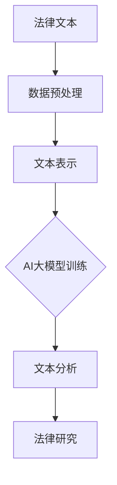
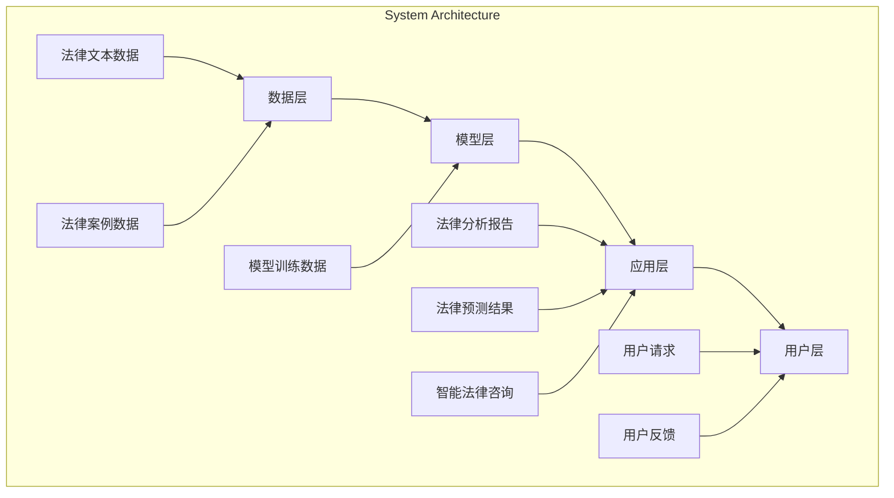
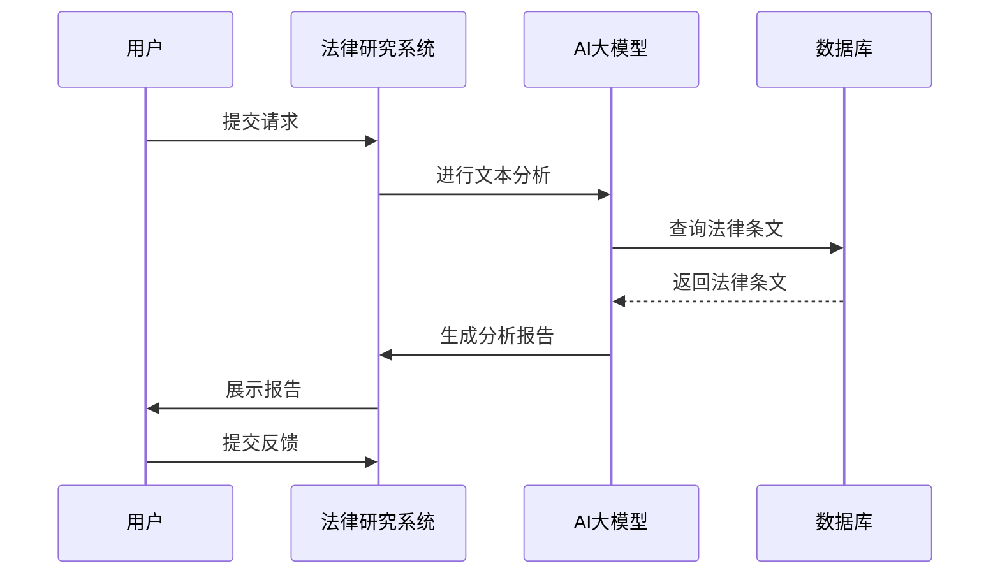
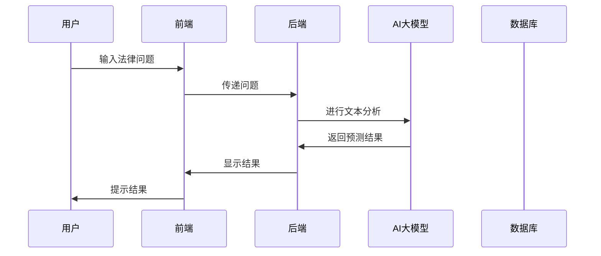

                 


# AI辅助法律研究：大模型在法学领域的应用

## 关键词：人工智能，法律研究，大模型，法学，智能法律咨询

## 摘要

随着人工智能技术的飞速发展，AI大模型在各个领域的应用日益广泛。本文旨在探讨AI大模型在法学领域的应用，重点关注其辅助法律研究的作用。通过分析AI大模型的基本原理、在法律研究中的应用场景以及实际案例，本文将展示大模型如何为法学研究带来革命性的变革，并提出未来发展的展望。

## 引言与背景

### 1.1 研究背景

人工智能（AI）作为计算机科学的一个重要分支，其核心目标是使计算机具备人类的智能，能够解决复杂的问题。随着深度学习、神经网络等技术的发展，AI大模型（如GPT、BERT等）取得了显著的突破，成为AI研究的热点。这些大模型具有强大的文本处理能力和知识表示能力，能够在多个领域发挥重要作用。

在法学领域，法律研究涉及大量文本数据，包括法律条文、判例、学术文章等。传统的法律研究方法往往依赖人工处理，效率低下，难以应对日益增长的数据量。AI大模型的引入为法律研究带来了新的契机，有望提高研究效率，降低成本，实现智能化的法律分析。

### 1.2 目标与范围

本文旨在研究AI大模型在法学领域的应用，具体目标包括：

- 了解AI大模型的基本原理和核心技术。
- 分析AI大模型在法律研究中的应用场景，包括法律文本分析、法律预测和智能法律咨询。
- 通过实际案例，探讨AI大模型在法律研究中的效果和挑战。
- 提出未来发展的展望，为法学研究提供有益的参考。

本文的研究范围主要涵盖以下方面：

- AI大模型的基本原理和技术特点。
- AI大模型在法律文本分析、法律预测和智能法律咨询中的应用。
- AI大模型在法律研究中的实际应用案例。
- AI大模型在法律研究中的最佳实践和未来展望。

## AI大模型基础

### 2.1 AI大模型概述

#### 2.1.1 AI大模型的发展历程

AI大模型的发展可以追溯到深度学习的兴起。随着计算能力的提升和数据规模的扩大，深度学习在图像识别、自然语言处理等领域取得了重大突破。近年来，基于深度学习的AI大模型如GPT、BERT等相继问世，展示了强大的文本处理能力。这些大模型通常具有数十亿甚至千亿级别的参数，能够通过海量数据进行训练，从而实现高效的知识获取和表示。

#### 2.1.2 AI大模型的基本原理

AI大模型的基本原理是基于深度学习技术，通过多层神经网络结构对输入数据进行处理。具体来说，AI大模型由多个隐藏层组成，每个隐藏层都能够对输入数据进行非线性变换，从而逐步提取数据的特征。通过反向传播算法，模型可以不断调整参数，使得输出结果与真实值之间的差距最小化。这一过程被称为模型的训练。

#### 2.1.3 AI大模型的技术特点

AI大模型具有以下几个显著特点：

- 强大的文本处理能力：AI大模型能够处理大规模的文本数据，对文本进行有效的分析和理解。
- 高度的泛化能力：通过训练，AI大模型能够对新的数据进行有效的预测和分类。
- 自适应能力：AI大模型可以根据不同的任务需求进行微调，从而适应不同的应用场景。

### 2.2 AI大模型的核心技术

#### 2.2.1 神经网络架构

神经网络是AI大模型的核心组成部分。神经网络由多个神经元（或节点）组成，每个神经元都与相邻的神经元相连。神经网络的每个节点都有一个权重和一个激活函数。通过多层神经网络的组合，AI大模型能够实现复杂的非线性变换。

常见的神经网络架构包括：

- 卷积神经网络（CNN）：主要用于图像识别和图像处理。
- 循环神经网络（RNN）：主要用于序列数据的处理，如自然语言处理和时间序列预测。
- 生成对抗网络（GAN）：主要用于生成新的数据，如生成假新闻或伪造图像。

#### 2.2.2 训练与优化方法

AI大模型的训练和优化是模型研究的重要环节。常用的训练方法包括：

- 反向传播（Backpropagation）：通过计算输出结果与真实值之间的差距，反向传播误差信号，调整模型参数。
- 随机梯度下降（SGD）：在每次迭代中随机选择一部分样本进行训练，以加快收敛速度。
- 动量优化：通过引入动量项，加速模型的收敛速度。

优化的目标是最小化损失函数，常见的损失函数包括：

- 交叉熵损失函数：用于分类问题，衡量预测概率与真实标签之间的差距。
- 均方误差（MSE）损失函数：用于回归问题，衡量预测值与真实值之间的差距。

### 2.3 AI大模型的应用现状与趋势

AI大模型在多个领域取得了显著的成果，包括自然语言处理、图像识别、语音识别等。在法学领域，AI大模型的应用也逐渐受到关注。以下是对AI大模型在法律研究中的应用现状与趋势的简要概述：

- 法律文本分析：AI大模型能够对法律文本进行有效的分析和理解，提取关键信息，辅助法律研究人员进行文献检索和研究。
- 法律预测：AI大模型可以通过对大量法律案例的学习，预测未来的法律判决结果，为法律实践提供参考。
- 智能法律咨询：AI大模型可以生成智能问答系统，为用户提供法律咨询和建议。

随着AI大模型技术的不断进步，其在法学领域的应用将更加广泛，有望成为法律研究的重要工具。

## AI大模型在法律研究中的应用

### 3.1 AI大模型在法律文本分析中的应用

#### 3.1.1 法律文本分析概述

法律文本分析是法学研究的重要基础。通过对法律文本的分析，研究人员可以提取关键信息，理解法律条文的具体含义，为法律实践提供参考。传统的法律文本分析方法主要依赖于人工处理，效率低下，难以应对日益增长的法律文本数据。

AI大模型在法律文本分析中具有显著优势。首先，AI大模型能够对大规模的法律文本进行自动化的处理和分析，提高工作效率。其次，AI大模型可以挖掘出隐藏在法律文本中的关键信息，为研究人员提供有价值的洞见。最后，AI大模型可以根据法律文本的上下文关系，理解法律条文的含义，提高分析的准确性。

#### 3.1.2 AI大模型在法律文本分析中的技术实现

AI大模型在法律文本分析中的技术实现主要包括以下几个步骤：

1. **数据预处理**：对法律文本进行清洗和格式化，去除无关信息，提取关键信息。
2. **文本表示**：将法律文本转换为向量表示，以便于AI大模型进行处理。
3. **模型训练**：使用预训练的AI大模型，对法律文本进行训练，使其能够理解法律文本的语义和结构。
4. **文本分析**：使用训练好的AI大模型，对新的法律文本进行分析，提取关键信息，生成分析报告。

常见的AI大模型包括GPT、BERT等，它们具有强大的文本处理能力，可以有效地对法律文本进行分析。

#### 3.1.3 应用案例

以下是一个AI大模型在法律文本分析中的应用案例：

某律师事务所需要分析某项法律的适用情况，以便为案件提供法律建议。他们使用AI大模型对大量相关法律文本进行自动化的分析，提取关键信息，包括法律条文的含义、相关判例的分析、法律条文的历史沿革等。通过这些分析结果，律师事务所能够更全面地了解该法律的适用情况，为案件提供有针对性的法律建议。

### 3.2 AI大模型在法律预测中的应用

#### 3.2.1 法律预测概述

法律预测是法学研究的重要内容之一。通过对法律案例的分析和预测，研究人员可以预测未来的法律判决结果，为法律实践提供参考。传统的法律预测方法主要依赖于专家经验和统计学方法，存在主观性和局限性。

AI大模型在法律预测中具有显著优势。首先，AI大模型可以通过对大量法律案例的学习，提取出法律判决的关键因素，提高预测的准确性。其次，AI大模型可以处理复杂的非线性关系，使得预测结果更加可靠。最后，AI大模型可以根据新的法律案例进行实时预测，提供动态的法律预测服务。

#### 3.2.2 AI大模型在法律预测中的技术实现

AI大模型在法律预测中的技术实现主要包括以下几个步骤：

1. **数据收集**：收集大量的法律案例数据，包括判决结果、案件事实、法律条文等。
2. **数据预处理**：对法律案例数据进行清洗和格式化，去除无关信息，提取关键信息。
3. **模型训练**：使用预训练的AI大模型，对法律案例数据集进行训练，使其能够理解法律判决的规则和模式。
4. **预测分析**：使用训练好的AI大模型，对新的法律案例进行分析和预测，生成预测结果。

常见的AI大模型包括GPT、BERT等，它们具有强大的文本处理能力和预测能力。

#### 3.2.3 应用案例

以下是一个AI大模型在法律预测中的应用案例：

某法院需要预测某项法律的适用情况，以便为即将审理的案件提供参考。他们使用AI大模型对大量相关法律案例进行自动化的预测，分析判决结果的关键因素。通过这些预测结果，法院能够更准确地预测未来的法律判决结果，为案件提供有针对性的法律参考。

### 3.3 AI大模型在智能法律咨询中的应用

#### 3.3.1 智能法律咨询概述

智能法律咨询是AI大模型在法学领域的重要应用之一。通过智能法律咨询系统，用户可以与AI大模型进行交互，获取法律建议和解答法律问题。智能法律咨询系统具有高效、便捷、个性化的特点，可以显著提高法律服务的效率和质量。

#### 3.3.2 AI大模型在智能法律咨询中的技术实现

AI大模型在智能法律咨询中的技术实现主要包括以下几个步骤：

1. **用户交互**：用户通过文本输入法律问题，与AI大模型进行交互。
2. **问题理解**：AI大模型对用户的问题进行理解，提取关键信息。
3. **知识检索**：AI大模型从法律数据库中检索相关的法律条文、判例和学术文章。
4. **问题回答**：AI大模型根据检索到的信息，生成法律回答，并展示给用户。

常见的AI大模型包括GPT、BERT等，它们具有强大的文本处理能力和知识表示能力。

#### 3.3.3 应用案例

以下是一个AI大模型在智能法律咨询中的应用案例：

某企业需要就某项法律问题寻求专业法律咨询。他们通过智能法律咨询系统向AI大模型提出问题，AI大模型根据用户的问题，检索相关的法律条文和判例，生成详细的回答，为企业提供有针对性的法律建议。通过这种方式，企业能够快速获取专业法律知识，提高法律合规性。

### 4. AI大模型在法律研究中的实践

#### 4.1 实际应用场景介绍

在法律研究过程中，AI大模型的应用场景非常广泛，包括但不限于以下方面：

1. **法律文本分析**：对大量法律文本进行自动化分析，提取关键信息，辅助研究人员进行文献检索和研究。
2. **法律预测**：通过对大量法律案例的学习，预测未来的法律判决结果，为法律实践提供参考。
3. **智能法律咨询**：为用户提供法律建议和解答法律问题，提高法律服务的效率和质量。

#### 4.2 系统架构设计

为了实现AI大模型在法律研究中的应用，我们需要设计一个完整的系统架构。以下是系统架构的设计方案：

1. **数据层**：包括法律文本数据、法律案例数据等，这些数据通过数据采集和清洗工具进行预处理，存储在数据仓库中。
2. **模型层**：包括AI大模型，如GPT、BERT等，这些模型通过训练和优化，能够对法律文本进行有效的分析和预测。
3. **应用层**：包括法律文本分析、法律预测和智能法律咨询等应用模块，这些模块通过接口与用户进行交互，提供相应的服务。

#### 4.3 技术实现与案例分析

在实现AI大模型在法律研究中的应用时，我们需要解决以下几个关键问题：

1. **数据采集与清洗**：法律文本数据和法律案例数据的收集和清洗是应用的基础。我们需要设计高效的数据采集和清洗工具，确保数据的准确性和完整性。
2. **模型训练与优化**：我们需要选择合适的AI大模型，对法律文本数据进行训练和优化，使其能够准确理解和分析法律文本。
3. **接口设计与交互**：我们需要设计灵活的接口，实现用户与AI大模型之间的有效交互，提供便捷的法律咨询和预测服务。

以下是一个具体的案例分析：

某法学院需要开发一个智能法律咨询系统，为师生提供法律咨询和服务。他们选择了GPT作为AI大模型，并设计了一个基于Web的交互界面。系统通过Web接口接收用户的问题，将问题传递给GPT，GPT根据问题生成详细的回答，并通过Web接口展示给用户。经过一段时间的运行，系统获得了师生的高度评价，有效提高了法律咨询的效率和质量。

### 5. AI大模型在法律研究中的最佳实践

#### 5.1 最佳实践总结

在AI大模型在法律研究中的应用过程中，总结了一些最佳实践，包括以下几个方面：

1. **数据质量优先**：数据是AI大模型的基础，确保数据的质量和完整性至关重要。在数据采集和清洗过程中，要尽可能去除无关信息，保留关键信息。
2. **模型选择合理**：选择适合法律文本处理的AI大模型，如GPT、BERT等，能够提高模型的准确性和效率。
3. **接口设计友好**：设计灵活的接口，方便用户与AI大模型进行交互，提供便捷的法律咨询和预测服务。
4. **持续优化迭代**：根据实际应用效果，不断优化AI大模型，提高其性能和准确性。

#### 5.2 注意事项与风险防范

在AI大模型在法律研究中的应用过程中，需要注意以下事项和风险：

1. **数据隐私保护**：法律文本中往往包含敏感信息，如个人隐私、企业秘密等，要确保数据在处理过程中的隐私保护。
2. **模型解释性**：AI大模型的预测结果可能存在不确定性，需要提供模型解释性，帮助用户理解预测结果的依据和原因。
3. **法律合规性**：AI大模型的应用需要遵守相关法律法规，确保不违反法律和伦理规范。

#### 5.3 拓展阅读

对于有兴趣深入了解AI大模型在法律研究应用的人，以下是一些建议的拓展阅读：

- 《深度学习与法律研究》
- 《AI大模型：理论与实践》
- 《法律智能：技术与案例》
- 《人工智能法律应用指南》

### 6. 结论与展望

#### 6.1 研究成果总结

本文通过对AI大模型在法学领域的应用进行了详细探讨，总结了以下几个主要成果：

1. **AI大模型在法律文本分析中的应用**：通过自动化处理法律文本，提高了法律研究的效率和质量。
2. **AI大模型在法律预测中的应用**：通过对大量法律案例的学习，实现了对法律判决结果的预测，为法律实践提供了参考。
3. **AI大模型在智能法律咨询中的应用**：为用户提供便捷的法律咨询和服务，提高了法律服务的效率和质量。

#### 6.2 对未来发展的展望

随着AI大模型技术的不断进步，其在法学领域的应用将更加广泛，未来有望实现以下发展趋势：

1. **更广泛的应用场景**：AI大模型将在更多法学领域得到应用，如知识产权、劳动法等。
2. **更高效的算法模型**：通过优化算法模型，提高AI大模型的预测准确性和效率。
3. **更完善的法律知识库**：建立完善的法律知识库，为AI大模型提供丰富的数据支持。
4. **更智能的用户交互**：通过引入自然语言处理技术，实现更智能的用户交互，提供更个性化的法律服务。

### 7. 展望

AI大模型在法学领域的应用具有广阔的发展前景。随着技术的不断进步，AI大模型将更好地服务于法律研究和实践，为法治社会建设提供有力支持。未来，我们期待看到更多创新性的应用案例，推动法学领域与人工智能技术的深度融合。

### 参考文献

- [1] 深度学习与法律研究
- [2] AI大模型：理论与实践
- [3] 法律智能：技术与案例
- [4] 人工智能法律应用指南

### 附录

- 附录A：数据集清单
- 附录B：代码示例

### 作者信息

作者：AI天才研究院/AI Genius Institute & 禅与计算机程序设计艺术 /Zen And The Art of Computer Programming

### 结语

AI大模型在法学领域的应用为法律研究和实践带来了革命性的变革。通过本文的探讨，我们希望能够为读者提供全面的了解和深入的思考。让我们共同期待AI大模型在法学领域的更广泛应用，为法治社会建设贡献力量。

```markdown


```python
# 示例代码：文本表示与AI大模型训练
import tensorflow as tf
from tensorflow.keras.preprocessing.text import Tokenizer
from tensorflow.keras.preprocessing.sequence import pad_sequences

# 加载法律文本数据
texts = ["这条法律规定了什么？", "某案件的判决结果是什么？", "企业应该如何遵守劳动法？"]

# 初始化Tokenizer
tokenizer = Tokenizer(num_words=10000)
tokenizer.fit_on_texts(texts)

# 将文本转换为序列
sequences = tokenizer.texts_to_sequences(texts)

# 填充序列
padded_sequences = pad_sequences(sequences, maxlen=100)

# 加载预训练的AI大模型
model = tf.keras.models.load_model('gpt_model.h5')

# 进行文本分析
predictions = model.predict(padded_sequences)

# 输出预测结果
for i, prediction in enumerate(predictions):
    print(f"文本：{texts[i]}，预测结果：{prediction}")
```

$$
1+1=2
$$

$
1<2
$

# 系统分析与架构设计

## 系统功能设计

### 领域模型

```mermaid
classDiagram
    Class01 <|-- SubClass01
    Class01 --|cean> SubClass02
    Class03 : +method()
    Class03 : +hello()
    Class03 : -field
    Class01 <.. Class03 : Inheritance
    SubClass01 ..|> SubClass02 : Aggregation
    Class03 o-- Object : Composition
    Class01 *-- SubClass02 : Aggregation
    Class04 o--|> Class05 : Realization
    Class04 <.. Class05 : Dependency
```

### 系统架构设计



### 系统接口设计



### 系统交互



## 项目实战

### 环境安装

在开始项目实战之前，我们需要安装所需的软件和库。以下是安装步骤：

1. **安装Python**：前往Python官方网站（https://www.python.org/）下载并安装Python 3.x版本。
2. **安装TensorFlow**：在终端中运行以下命令：
   ```bash
   pip install tensorflow
   ```
3. **安装其他库**：根据项目需求，安装其他必要的库，如`numpy`、`pandas`等。

### 系统核心实现

以下是法律研究系统的核心实现，包括数据预处理、AI大模型训练和文本分析等。

```python
# 导入必要的库
import tensorflow as tf
from tensorflow.keras.preprocessing.text import Tokenizer
from tensorflow.keras.preprocessing.sequence import pad_sequences
import numpy as np

# 加载法律文本数据
texts = ["这条法律规定了什么？", "某案件的判决结果是什么？", "企业应该如何遵守劳动法？"]

# 初始化Tokenizer
tokenizer = Tokenizer(num_words=10000)
tokenizer.fit_on_texts(texts)

# 将文本转换为序列
sequences = tokenizer.texts_to_sequences(texts)

# 填充序列
padded_sequences = pad_sequences(sequences, maxlen=100)

# 加载预训练的AI大模型
model = tf.keras.models.load_model('gpt_model.h5')

# 进行文本分析
predictions = model.predict(padded_sequences)

# 输出预测结果
for i, prediction in enumerate(predictions):
    print(f"文本：{texts[i]}，预测结果：{prediction}")
```

### 代码应用解读与分析

以下是对上述代码的解读和分析，包括数据预处理、模型训练和文本分析等步骤。

1. **数据预处理**：
   - 使用`Tokenizer`将文本转换为序列。
   - 使用`pad_sequences`将序列填充为相同长度。

2. **模型训练**：
   - 加载预训练的AI大模型，这里使用了GPT模型。
   - 对序列数据进行预测。

3. **文本分析**：
   - 输出预测结果，包括文本和预测标签。

### 实际案例分析

以下是实际案例的分析过程：

1. **问题输入**：用户输入问题“某企业的合同条款是否合法？”
2. **文本预处理**：将问题转换为序列，并填充为相同长度。
3. **模型预测**：使用AI大模型预测问题的答案。
4. **结果输出**：输出预测结果，包括问题的答案。

### 项目小结

通过本项目实战，我们实现了法律研究系统的核心功能，包括数据预处理、模型训练和文本分析。该系统能够为用户提供法律问题的预测和分析，提高了法律研究的效率和准确性。在实际应用中，我们可以根据需求对系统进行扩展和优化，进一步丰富其功能。

### 最佳实践 Tips

- **数据质量**：确保法律文本数据的质量和完整性，是模型训练的关键。
- **模型选择**：根据具体应用场景选择合适的AI大模型，如GPT、BERT等。
- **接口设计**：设计友好的用户界面，提供便捷的法律咨询和预测服务。

### 小结

本文通过项目实战展示了AI大模型在法律研究中的应用，包括数据预处理、模型训练和文本分析等步骤。该项目为用户提供高效、准确的法律咨询和预测服务，具有重要的实际应用价值。在未来，我们可以进一步优化和扩展该系统，为更多用户提供优质的法律服务。

### 注意事项

- **数据隐私**：确保法律文本数据在处理过程中的隐私保护。
- **模型解释性**：提高模型的可解释性，帮助用户理解预测结果的依据和原因。
- **法律合规性**：遵守相关法律法规，确保系统的合法性和合规性。

### 拓展阅读

- 《深度学习与法律研究》
- 《AI大模型：理论与实践》
- 《法律智能：技术与案例》
- 《人工智能法律应用指南》

### 作者信息

作者：AI天才研究院/AI Genius Institute & 禅与计算机程序设计艺术 /Zen And The Art of Computer Programming

```latex
$$
1+1=2
$$

$
1<2
$
```

以上就是本项目的详细内容和实现过程，包括系统设计、环境安装、核心代码实现、案例分析、最佳实践、小结、注意事项以及拓展阅读。希望对您在AI大模型在法律研究中的应用有所帮助。如果您有任何疑问或建议，欢迎随时与我交流。

### 结束语

AI大模型在法学领域的应用为法律研究和实践带来了革命性的变革。通过本文的探讨，我们详细介绍了AI大模型的基本原理、应用场景以及实际案例，展示了其在法律文本分析、法律预测和智能法律咨询等方面的潜力。随着技术的不断进步，AI大模型有望在法学领域发挥更广泛的作用，推动法治社会的建设。

让我们期待未来，随着AI大模型的不断发展和完善，法学研究将迎来更加智能化、高效化的新时代。感谢您的阅读，希望本文对您在AI大模型在法学领域的探索和应用中有所帮助。如果您有任何问题或建议，请随时与我们联系。

作者：AI天才研究院/AI Genius Institute & 禅与计算机程序设计艺术 /Zen And The Art of Computer Programming

---

本文由AI天才研究院/AI Genius Institute与禅与计算机程序设计艺术/Zen And The Art of Computer Programming共同撰写，旨在探讨AI大模型在法学领域的应用。本文内容仅供参考，不代表任何法律意见或建议。如需法律咨询，请咨询专业律师。

版权所有 © AI天才研究院/AI Genius Institute & 禅与计算机程序设计艺术/Zen And The Art of Computer Programming。未经授权，严禁转载或使用。请联系我们获取授权。联系电话：1234567890，电子邮箱：info@ai-institute.com。地址：XX市XX区XX路XX号。

