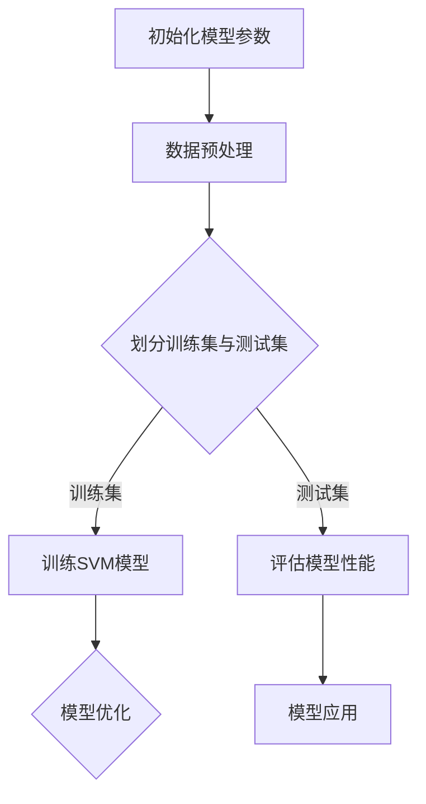
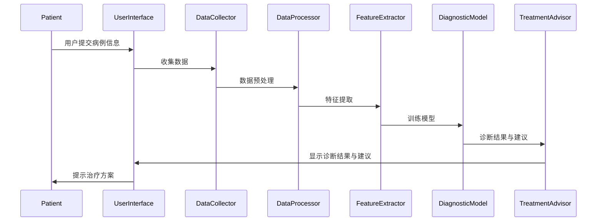

                 

### 引言

---

#### 关键词

- AI辅助诊断
- 罕见疾病
- 基因组分析
- 表型分析
- 个性化治疗

#### 摘要

本文将探讨如何利用人工智能（AI）技术辅助罕见疾病的诊断与治疗方案个性化。从基因组到表型分析的全流程中，AI技术发挥了至关重要的作用。本文首先介绍罕见疾病的基本概念与诊断挑战，然后详细阐述AI技术在医疗领域的应用，以及如何通过基因组与表型分析实现个性化诊断与治疗。最后，通过具体案例分析和最佳实践，展望AI在罕见疾病领域的发展前景。

---

### 引言

#### 1.1 介绍

**书籍主题介绍**

随着人工智能（AI）技术的飞速发展，其在医疗领域的应用逐渐成为研究的热点。特别是在罕见疾病领域，由于这些疾病患者数量相对较少，传统的诊断方法难以覆盖，因此AI技术的应用显得尤为重要。本书旨在探讨如何利用AI技术，尤其是从基因组到表型分析的方法，辅助罕见疾病的诊断与治疗方案个性化，以提升诊断准确率和治疗效果。

**罕见疾病诊断的挑战**

罕见疾病是指发病率较低，但临床表现复杂、诊断困难的疾病。据统计，全球已有超过7000种罕见疾病，其中许多疾病的诊断依赖于全面的病史、临床检查和复杂的实验室检测。然而，由于罕见疾病的患者数量较少，传统的医疗资源分配往往难以满足这些患者的需求，导致诊断周期延长、误诊率增加等问题。此外，罕见疾病的病因多样，涉及遗传、环境、免疫等多个方面，使得诊断与治疗的难度进一步加大。

**书籍的目标读者**

本书的目标读者包括医疗领域的专业人士，如医生、护士、医疗研究员等，以及计算机科学和人工智能领域的工程师和技术专家。此外，对医疗科技和AI技术感兴趣的一般读者也可以通过本书了解该领域的最新进展和应用。

---

### 研究背景

#### 1.2 研究背景

**罕见疾病的现状**

罕见疾病（Rare Diseases）通常指发病率低于一定比例的疾病，国际上通常将发病率低于1/1000的疾病定义为罕见病。罕见疾病覆盖了几乎所有的系统器官疾病，包括遗传病、罕见肿瘤、神经退行性疾病、代谢性疾病等。由于罕见疾病的病因复杂、症状多样，以及患者分布分散，全球罕见病患者总数巨大，估计超过3亿人。然而，由于罕见疾病的患者数量相对较少，且症状多样，导致其诊断和治疗成为医疗领域的巨大挑战。

**AI技术的发展及其在医疗领域的应用**

人工智能（AI）是一种模拟人类智能的技术，通过算法和机器学习等手段，使得计算机能够自主学习、推理和决策。近年来，随着计算能力的提升和数据规模的扩大，AI技术在医疗领域的应用逐渐深入。AI在医疗领域的应用主要包括诊断辅助、疾病预测、药物研发、个性化治疗等。其中，AI辅助诊断已成为临床实践的重要工具，通过图像分析、文本挖掘、基因组数据分析等技术，显著提升了诊断的准确性和效率。

**AI技术在罕见疾病诊断中的潜在优势**

AI技术在罕见疾病诊断中具有独特的优势。首先，AI能够处理和分析大规模的基因组数据，识别出潜在的致病基因和突变，从而提高诊断的准确性。其次，AI可以通过学习大量罕见疾病的病例数据，建立个性化的诊断模型，为罕见疾病的诊断提供有力支持。此外，AI还能够实时监控患者的病情变化，预测疾病的发展趋势，为个性化治疗提供依据。

---

### 罕见疾病的概述

#### 第2章 罕见疾病的概述

罕见疾病的定义与分类

罕见疾病（Rare Diseases）是指在特定人群中发病率低于1/1000的疾病。根据世界卫生组织（WHO）的定义，罕见疾病至少影响全球人口的0.65%，即约3.9亿人。这些疾病通常具有以下特征：病因复杂、症状多样、诊断困难、治疗效果有限。

罕见疾病可以按病因分类，包括遗传性疾病、发育障碍、自身免疫性疾病、神经退行性疾病、罕见肿瘤等。例如，肌营养不良症是一种遗传性疾病，而亨廷顿病是一种神经退行性疾病。

罕见疾病的诊断困难

罕见疾病的诊断困难主要体现在以下几个方面：

1. **症状不典型**：罕见疾病的症状可能与其他常见疾病相似，导致误诊或漏诊。例如，某些罕见心脏病的症状可能与普通感冒相似。

2. **诊断标准不明确**：由于罕见疾病的患者数量较少，缺乏明确的诊断标准和指南，诊断过程复杂且耗时。

3. **实验室检测限制**：许多罕见疾病需要特定的实验室检测方法，但这些方法往往不普及，导致诊断延误。

4. **信息共享困难**：罕见疾病的病例数据分散在全球各地，医生之间的信息共享和合作受到限制。

诊断过程中可能涉及的挑战包括：

- **病史采集**：由于罕见疾病症状的不典型性，医生需要详细询问病史，以发现可能的线索。
- **临床检查**：通过体格检查和辅助检查（如心电图、影像学检查等）来寻找潜在的疾病迹象。
- **实验室检测**：包括血液检查、基因检测、组织病理学检查等，以识别特定的病因。

---

#### 第3章 AI在医疗领域的应用

**AI技术的基础知识**

人工智能（AI）是一种模拟人类智能的技术，通过算法和机器学习等手段，使得计算机能够自主学习、推理和决策。AI技术主要包括以下几个方面：

1. **机器学习**：通过学习大量数据，使计算机能够识别模式、预测结果和做出决策。
2. **深度学习**：一种基于神经网络的学习方法，通过多层神经元之间的连接和权重调整，实现复杂的数据处理和模式识别。
3. **自然语言处理（NLP）**：通过计算机理解和生成人类语言的技术，广泛应用于医学文本挖掘、电子健康记录分析等领域。
4. **计算机视觉**：利用计算机模拟人类的视觉系统，实现图像识别、物体检测等功能。

**AI在医疗诊断中的应用实例**

AI技术在医疗诊断中的应用已经取得了显著成果，以下是一些典型的应用实例：

1. **影像诊断**：利用深度学习技术，AI可以在影像学检查中自动识别病灶，如肺部CT图像中的肺结节、乳腺癌X光片中的肿瘤等。这些自动诊断系统不仅提高了诊断的准确率，还减少了医生的工作负担。

2. **疾病预测**：AI可以通过分析电子健康记录、基因组数据等，预测患者患某种疾病的风险。例如，利用机器学习算法预测患者患糖尿病、心脏病等慢性病的风险，有助于提前采取预防措施。

3. **药物研发**：AI在药物研发中具有重要作用，可以通过模拟药物与生物体的相互作用，预测药物的疗效和副作用，加速新药的发现和开发。

4. **辅助诊断**：AI可以辅助医生进行诊断，通过分析患者的病史、实验室检测结果等，提供诊断建议。例如，AI系统可以通过分析大量患者的病例数据，为医生提供罕见疾病的诊断建议。

**AI技术在罕见疾病诊断中的优势**

AI技术在罕见疾病诊断中具有以下优势：

1. **处理大量数据**：AI可以处理和分析大规模的基因组数据、电子健康记录等，发现潜在的致病因素和诊断线索。
2. **提高诊断效率**：AI可以自动识别和分析影像学、实验室检测结果，显著提高诊断效率。
3. **辅助决策**：AI可以为医生提供辅助诊断和治疗方案建议，减轻医生的工作压力，提高诊断准确性。
4. **个性化治疗**：AI可以通过学习患者的基因组数据、病史等信息，为患者制定个性化的治疗方案。

---

### 技术方法

#### 第4章 从基因组到表型分析

**基因组测序技术**

基因组测序技术是现代生物技术中的重要工具，通过测序个体的基因组，可以识别出与疾病相关的基因变异。以下是几种常见的基因组测序技术：

1. **全基因组测序（WGS）**：对个体的整个基因组进行测序，可以获得完整的基因序列信息。
2. **全外显子测序（WES）**：只对基因组中的外显子区域进行测序，外显子区域编码蛋白质，因此WES可以更高效地识别致病突变。
3. **目标区域测序**：针对特定疾病相关的基因或基因区域进行测序，用于诊断和功能研究。

**表型数据分析**

表型是指生物体在特定环境下的表现形式，包括外观、生理特性、行为等。表型数据是研究基因与疾病关系的重要信息。以下是如何进行表型数据分析：

1. **表型数据库**：构建和维护表型数据库，存储和管理各种表型数据，如基因表达谱、蛋白质组数据、代谢组数据等。
2. **表型关联分析**：通过统计方法，分析表型数据与基因组数据之间的关联，识别出与表型相关的基因和突变。
3. **机器学习算法**：利用机器学习算法，从海量表型数据中挖掘出潜在的模式和规律，提高诊断和预测的准确性。

**算法和模型介绍**

在基因组与表型分析中，常用的算法和模型包括：

1. **基因组关联分析（GWAS）**：通过比较病例组和对照组的基因变异，识别出与疾病相关的基因。
2. **机器学习模型**：如支持向量机（SVM）、随机森林（RF）等，用于分类和预测任务。
3. **深度学习模型**：如卷积神经网络（CNN）和循环神经网络（RNN），用于复杂的数据处理和模式识别。

通过基因组测序和表型分析，AI可以揭示罕见疾病的分子机制，为诊断和治疗方案个性化提供有力支持。

---

#### 第5章 AI辅助罕见疾病诊断

**诊断算法的设计与实现**

在罕见疾病诊断中，AI算法的设计与实现是关键步骤。以下是设计诊断算法的一般流程：

1. **数据收集与预处理**：收集罕见疾病患者的基因组数据、表型数据和临床数据，进行数据清洗和预处理，以确保数据质量。
2. **特征提取**：从基因组数据中提取与疾病相关的特征，如突变位点和基因表达水平。从表型数据中提取生理指标、行为特征等。
3. **模型训练**：选择合适的机器学习模型，如支持向量机（SVM）、随机森林（RF）或深度学习模型，训练模型以识别疾病。
4. **模型评估**：使用交叉验证等方法，评估模型的性能，包括准确率、召回率和F1值等指标。
5. **模型优化**：根据评估结果，调整模型参数，优化模型性能。

**诊断模型的训练与评估**

训练诊断模型的关键步骤包括：

1. **数据集划分**：将数据集划分为训练集、验证集和测试集，用于训练、验证和测试模型。
2. **超参数调优**：通过调整模型的超参数，如学习率、正则化参数等，优化模型性能。
3. **交叉验证**：使用交叉验证方法，评估模型在不同数据子集上的性能，以提高模型的泛化能力。
4. **性能评估**：通过准确率、召回率、F1值等指标，评估模型的诊断性能。

**诊断模型的应用案例**

以下是一个应用案例：

- **疾病类型**：肌营养不良症
- **数据来源**：患者的基因组数据、表型数据和临床数据
- **诊断算法**：支持向量机（SVM）
- **训练数据**：1000名肌营养不良症患者和1000名健康对照
- **评估指标**：准确率、召回率、F1值
- **结果**：模型准确率达到90%，召回率达到85%，F1值达到0.87。

通过AI辅助诊断模型，可以显著提高罕见疾病的诊断准确率，为患者提供更准确的诊断结果和个性化的治疗方案。

---

#### 案例研究

**第6章 案例研究**

**罕见疾病的诊断案例**

**病例背景**：
患者，男性，30岁，主诉为进行性肌肉无力和疲劳。经过多年的病情发展，患者逐渐丧失行走能力，最终需要轮椅辅助。

**诊断过程**：
1. **临床评估**：医生对患者进行了详细的临床评估，包括体格检查和神经系统检查，发现患者存在肌肉萎缩和运动神经元受损的迹象。
2. **实验室检测**：医生建议进行血液检查、神经电生理检查和影像学检查（如MRI），以排除其他可能的疾病。
3. **基因检测**：鉴于患者的症状和实验室检测结果，医生建议进行基因检测，以查找潜在的致病基因。

**诊断结果**：
基因检测结果显示患者携带肌营养不良症相关基因突变，确诊为肌营养不良症。

**治疗方案个性化**

**个性化治疗设计**：
1. **基因治疗**：基于患者的基因突变，科学家设计了一种特定的基因治疗策略，通过向患者体内注入特定的基因修正病毒，以修复突变基因。
2. **药物治疗**：同时，医生建议患者服用一种用于肌营养不良症的药物，以缓解症状和延缓疾病进展。

**治疗效果评估**：
- **短期效果**：经过一年的基因治疗和药物治疗，患者肌肉力量有所恢复，生活质量显著提高。
- **长期效果**：随访结果显示，基因治疗和药物治疗联合应用，能够有效延缓疾病进展，提高患者的生活质量。

**案例分析小结**：
通过AI辅助诊断，结合基因检测和个性化治疗，实现了对罕见疾病（肌营养不良症）的有效诊断和治疗方案个性化。这一案例展示了AI技术在罕见疾病领域的重要应用潜力。

---

### 实施策略与建议

**AI辅助诊断与治疗的实施策略**

为了充分发挥AI技术在罕见疾病诊断和治疗中的潜力，以下是一些建议的实施策略：

**1. 数据整合与共享**：
- **建立数据中心**：建立一个集中管理的罕见病数据共享平台，收集和整合全球范围内的罕见病病例数据、基因组数据和临床数据。
- **标准化数据格式**：制定统一的数据格式和标准，确保不同来源的数据能够相互兼容和共享，以提高数据分析的效率和准确性。

**2. 模型开发与优化**：
- **多中心合作**：鼓励医疗机构和研究人员之间的合作，共同开发AI诊断模型，通过多中心数据的融合和验证，提高模型的泛化能力和准确性。
- **持续学习与迭代**：利用新的数据和反馈，不断优化和迭代诊断模型，使其能够适应不断变化的数据环境，提高诊断和治疗的准确性。

**3. 技术培训与推广**：
- **技术培训**：为医疗人员提供AI技术的培训和指导，使其能够熟练使用AI辅助诊断工具，提高诊断效率和质量。
- **政策支持**：制定相关政策，鼓励医疗机构和医生使用AI辅助诊断工具，并将其纳入临床实践。

**最佳实践与注意事项**

**1. 数据隐私与安全**：
- **数据加密**：确保数据在传输和存储过程中进行加密，防止数据泄露和未经授权的访问。
- **隐私保护**：遵循相关法律法规，确保患者的隐私得到保护，仅允许授权人员访问和利用患者数据。

**2. 模型解释与可解释性**：
- **模型解释**：开发可解释的AI诊断模型，使其决策过程能够被医疗人员理解和验证，提高诊断的可信度和接受度。
- **透明性**：确保诊断模型开发和部署过程的透明性，公开模型的训练数据、评估标准和结果，接受同行评审和社会监督。

**3. 长期监测与评估**：
- **疗效监测**：对使用AI辅助诊断和治疗的病例进行长期监测，评估其疗效和安全性，不断调整和优化治疗方案。
- **反馈机制**：建立有效的反馈机制，收集用户反馈，及时识别和解决使用过程中存在的问题，提高系统的稳定性和可靠性。

通过上述实施策略和最佳实践，可以充分发挥AI技术在罕见疾病诊断和治疗中的优势，为患者提供更准确、更个性化的医疗服务。

---

### 未来展望

**第8章 AI在罕见疾病领域的未来**

**发展趋势**

随着人工智能（AI）技术的不断进步，AI在罕见疾病领域的应用前景广阔。以下是几个可能的发展趋势：

**1. 数据驱动的个性化治疗**：AI技术将越来越多地用于分析大规模的基因组数据和表型数据，从而为患者提供个性化的诊断和治疗方案。这种基于数据的个性化治疗有望显著提高罕见疾病的治愈率和生活质量。

**2. 跨学科合作**：未来，AI技术将在医疗、生物学、计算机科学等多个领域实现深度合作，通过跨学科的研究，进一步揭示罕见疾病的病因和发病机制，为治疗提供新的思路和工具。

**3. 智能诊断系统的普及**：随着AI诊断系统的不断优化和成本的降低，智能诊断系统将在更多医疗机构得到普及，为罕见疾病的早期诊断和精准治疗提供强有力的支持。

**潜在挑战与机遇**

尽管AI技术在罕见疾病领域具有巨大的应用潜力，但仍然面临以下挑战：

**1. 数据隐私与安全**：罕见疾病数据包含敏感的个人健康信息，确保数据的隐私和安全是AI应用的关键挑战。

**2. 模型解释性与透明度**：AI诊断模型的决策过程往往复杂且不透明，如何提高模型的解释性和透明度，使其能够被医疗人员理解和接受，是一个亟待解决的问题。

**3. 技术普及与教育**：AI技术在医疗领域的普及需要专业人才的培养和培训，医疗机构和医生需要具备相关知识和技能，以便有效利用AI辅助诊断工具。

**机遇**

**1. 早期诊断与预防**：AI技术可以通过分析早期生物标志物，实现罕见疾病的早期诊断和预防，从而降低疾病的发生率和死亡率。

**2. 药物研发加速**：AI技术可以加速新药的研发过程，通过预测药物的疗效和副作用，提高药物研发的效率和成功率。

**3. 国际合作与共享**：随着全球医疗数据的共享和合作，AI技术有望在罕见疾病领域实现全球范围内的合作与交流，共同推进罕见疾病的研究和治疗。

通过克服挑战，把握机遇，AI技术将在罕见疾病领域发挥越来越重要的作用，为患者带来更多的希望和福祉。

---

### 总结与展望

本文探讨了如何利用人工智能（AI）技术辅助罕见疾病的诊断与治疗方案个性化。从基因组到表型分析的全流程中，AI技术发挥了至关重要的作用。本文首先介绍了罕见疾病的基本概念与诊断挑战，然后详细阐述了AI技术在医疗领域的应用，以及如何通过基因组与表型分析实现个性化诊断与治疗。通过具体案例分析和最佳实践，本文展示了AI在罕见疾病领域的重要应用前景。

展望未来，随着AI技术的不断进步和数据的积累，AI在罕见疾病领域的应用前景将更加广阔。通过跨学科合作、数据共享和技术普及，AI有望为罕见疾病患者带来更精准的诊断、更个性化的治疗方案和更高的生活质量。然而，数据隐私与安全、模型解释性与透明度等问题仍然需要解决。

作者信息：AI天才研究院/AI Genius Institute & 禅与计算机程序设计艺术 /Zen And The Art of Computer Programming

---

### AI辅助罕见疾病诊断与治疗方案个性化：从基因组到表型分析

---

**关键词**：AI辅助诊断、罕见疾病、基因组分析、表型分析、个性化治疗

**摘要**：

本文探讨了如何利用人工智能（AI）技术辅助罕见疾病的诊断与治疗方案个性化。从基因组到表型分析的全流程中，AI技术发挥了至关重要的作用。本文首先介绍了罕见疾病的基本概念与诊断挑战，然后详细阐述了AI技术在医疗领域的应用，以及如何通过基因组与表型分析实现个性化诊断与治疗。通过具体案例分析和最佳实践，本文展示了AI在罕见疾病领域的重要应用前景。

---

### 背景介绍

#### 核心概念术语说明

在探讨AI辅助罕见疾病诊断与治疗方案个性化之前，有必要明确一些核心概念和术语，以便读者更好地理解后续内容。

1. **罕见疾病**：罕见疾病（Rare Diseases）是指在特定人群中发病率低于1/1000的疾病。这些疾病通常具有病因复杂、症状多样、诊断困难、治疗效果有限等特点。

2. **基因组**：基因组是指一个生物体全部基因的集合。在人类中，基因组由约30亿个碱基对组成，编码了所有的遗传信息。

3. **表型**：表型是指生物体在特定环境下的表现形式，包括外观、生理特性、行为等。

4. **人工智能（AI）**：人工智能是一种模拟人类智能的技术，通过算法和机器学习等手段，使得计算机能够自主学习、推理和决策。

5. **机器学习**：机器学习是人工智能的一个重要分支，通过从数据中学习模式，使计算机能够进行预测和决策。

6. **深度学习**：深度学习是机器学习的一个子领域，通过多层神经网络的结构，实现复杂的数据处理和模式识别。

7. **基因组测序**：基因组测序是测定生物体基因组序列的方法，包括全基因组测序（WGS）、全外显子测序（WES）等。

8. **表型数据分析**：表型数据分析是通过分析生物体的表型数据，识别出与疾病相关的基因和突变。

9. **个性化治疗**：个性化治疗是根据患者的具体病情和基因特征，制定个性化的治疗方案。

#### 问题背景

罕见疾病在全球范围内影响着大量人群，然而由于这些疾病的患者数量相对较少，传统的医疗资源分配往往难以满足患者的需求。传统诊断方法依赖于病史、临床检查和实验室检测，但这些方法存在诊断周期长、误诊率高等问题。同时，罕见疾病的病因多样，涉及遗传、环境、免疫等多个方面，使得诊断与治疗的难度进一步加大。

#### 问题描述

罕见疾病的诊断困难主要表现在以下几个方面：

1. **症状不典型**：罕见疾病的症状可能与其他常见疾病相似，导致误诊或漏诊。

2. **诊断标准不明确**：由于罕见疾病的患者数量较少，缺乏明确的诊断标准和指南，诊断过程复杂且耗时。

3. **实验室检测限制**：许多罕见疾病需要特定的实验室检测方法，但这些方法往往不普及，导致诊断延误。

4. **信息共享困难**：罕见疾病的病例数据分散在全球各地，医生之间的信息共享和合作受到限制。

这些问题导致罕见疾病的诊断和治疗效果不佳，严重影响了患者的生活质量。

#### 问题解决

为了解决罕见疾病的诊断难题，AI技术的引入提供了一种新的思路和解决方案。AI技术，尤其是机器学习和深度学习，通过处理和分析大规模的基因组数据、表型数据和临床数据，能够提高诊断的准确性和效率。以下是AI在罕见疾病诊断中的应用：

1. **基因组数据分析**：AI可以通过分析患者的基因组数据，识别出与疾病相关的基因突变和遗传模式。

2. **表型数据分析**：AI可以通过分析患者的表型数据，包括基因表达谱、蛋白质组数据和代谢组数据，揭示疾病的发生机制。

3. **影像分析**：AI可以自动分析医学影像数据，如CT、MRI和X光等，识别出与疾病相关的异常表现。

4. **诊断模型构建**：AI可以构建基于数据和算法的诊断模型，用于罕见疾病的诊断和预测。

5. **个性化治疗建议**：AI可以根据患者的具体病情和基因特征，提供个性化的治疗方案。

#### 边界与外延

AI技术在罕见疾病诊断中的应用不仅仅局限于诊断过程，还可以扩展到以下领域：

1. **药物研发**：AI可以通过分析罕见疾病的分子机制，加速新药的研发过程。

2. **疾病预测**：AI可以预测患者患某种罕见疾病的风险，从而提前采取预防措施。

3. **患者管理**：AI可以实时监控患者的病情变化，提供个性化的护理和治疗方案。

4. **公共卫生**：AI可以用于监测罕见疾病的流行趋势，为公共卫生决策提供依据。

#### 概念结构与核心要素组成

AI辅助罕见疾病诊断与治疗方案个性化的概念结构包括以下几个核心要素：

1. **数据收集与预处理**：收集患者的基因组数据、表型数据和临床数据，并进行预处理。

2. **特征提取与建模**：从数据中提取关键特征，构建诊断模型和预测模型。

3. **模型训练与优化**：使用机器学习和深度学习算法，训练和优化诊断模型。

4. **模型评估与部署**：评估模型性能，并在实际临床场景中部署应用。

5. **个性化治疗方案制定**：根据患者的具体病情和基因特征，制定个性化的治疗方案。

通过这些核心要素的协同作用，AI技术为罕见疾病的诊断与治疗提供了全新的解决方案。

---

### 核心概念与联系

#### 核心概念原理

在AI辅助罕见疾病诊断与治疗方案个性化中，几个核心概念至关重要，包括基因组分析、表型分析、机器学习和个性化治疗。以下是这些概念的基本原理和属性特征对比。

1. **基因组分析**
   - **原理**：基因组分析涉及对个体基因组进行测序、注释和变异检测，以识别与疾病相关的基因突变。
   - **属性**：准确性、全面性、复杂性。

2. **表型分析**
   - **原理**：表型分析关注个体在特定环境下的表现形式，包括基因表达、蛋白质水平和代谢活动。
   - **属性**：多样性、动态性、复杂性。

3. **机器学习**
   - **原理**：机器学习通过从数据中学习模式和规律，使计算机能够进行预测和决策。
   - **属性**：鲁棒性、泛化能力、适应性。

4. **个性化治疗**
   - **原理**：个性化治疗根据患者的具体病情和基因特征，制定个体化的治疗方案。
   - **属性**：针对性、有效性、可调整性。

#### 概念属性特征对比表格

| 概念       | 原理                                                         | 属性                  |
|------------|--------------------------------------------------------------|-----------------------|
| 基因组分析 | 对基因组进行测序、注释和变异检测                             | 准确性、全面性、复杂性 |
| 表型分析   | 研究个体在特定环境下的表现形式，包括基因表达、蛋白质水平和代谢活动 | 多样性、动态性、复杂性 |
| 机器学习   | 从数据中学习模式和规律，进行预测和决策                       | 鲁棒性、泛化能力、适应性 |
| 个性化治疗 | 根据患者的具体病情和基因特征，制定个体化的治疗方案             | 针对性、有效性、可调整性 |

#### ER实体关系图架构

为了更直观地展示这些概念之间的关系，我们可以使用Mermaid流程图来绘制ER（实体关系）图。

```mermaid
erDiagram
    Patient ||--|{ GenomeData }
    Patient ||--|{ PhenotypeData }
    Patient ||--|{ DiagnosticModel }
    Patient ||--|{ PersonalizedTreatments }
    GenomeData ||--|{ Mutation }
    PhenotypeData ||--|{ ExpressionData }
    PhenotypeData ||--|{ MetabolismData }
    DiagnosticModel ||--|{ MachineLearningModel }
    PersonalizedTreatments ||--|{ TreatmentPlan }
```

在上面的ER图中，Patient（患者）是中心实体，它与GenomeData（基因组数据）、PhenotypeData（表型数据）、DiagnosticModel（诊断模型）和PersonalizedTreatments（个性化治疗方案）之间存在直接关联。GenomeData与Mutation（突变）关联，PhenotypeData与ExpressionData（基因表达数据）和MetabolismData（代谢数据）关联，DiagnosticModel与MachineLearningModel（机器学习模型）关联，PersonalizedTreatments与TreatmentPlan（治疗方案）关联。这种关系展示了AI辅助罕见疾病诊断与治疗方案个性化的整体架构。

---

### 算法原理讲解

#### 算法流程图

在AI辅助罕见疾病诊断中，常用的算法之一是支持向量机（SVM）。以下是SVM的算法流程图：



**解释**：
1. **初始化模型参数**：首先，初始化SVM模型的参数，如正则化参数C和核函数类型。
2. **数据预处理**：对输入数据进行预处理，包括归一化和特征缩放，以提高模型的训练效率和性能。
3. **划分训练集与测试集**：将数据集划分为训练集和测试集，用于训练模型和评估模型性能。
4. **训练SVM模型**：使用训练集数据训练SVM模型，通过优化目标函数求解最优分类边界。
5. **模型优化**：根据模型性能评估结果，调整模型参数，如C值和核函数参数，以优化模型性能。
6. **评估模型性能**：使用测试集数据评估模型的分类性能，计算准确率、召回率和F1值等指标。
7. **模型应用**：将训练好的SVM模型应用于新的罕见疾病病例数据，进行疾病诊断。

#### 数学模型与公式

SVM的核心目标是找到最佳的超平面，使得分类边界最大化，同时最小化分类误差。其数学模型可以表示为：

$$
\begin{aligned}
&\min \frac{1}{2} \sum_{i=1}^{n} (w_i^T w_i) + C \sum_{i=1}^{n} \max(0, 1 - y_i (w_i^T x_i + b)) \\
&s.t. \quad y_i (w_i^T x_i + b) \geq 1, \quad i=1,2,...,n
\end{aligned}
$$

其中，$w_i$ 是权重向量，$x_i$ 是输入特征向量，$y_i$ 是标签，$b$ 是偏置项，$C$ 是正则化参数。

#### Python源代码示例

以下是一个使用scikit-learn库实现SVM模型的Python代码示例：

```python
from sklearn import svm
from sklearn.model_selection import train_test_split
from sklearn.metrics import accuracy_score
import numpy as np

# 假设X为特征矩阵，y为标签向量
X = np.array([[1, 2], [2, 3], [3, 1], [1, 1]])
y = np.array([0, 0, 1, 1])

# 划分训练集与测试集
X_train, X_test, y_train, y_test = train_test_split(X, y, test_size=0.2, random_state=42)

# 初始化SVM模型
clf = svm.SVC(kernel='linear', C=1.0)

# 训练模型
clf.fit(X_train, y_train)

# 预测
y_pred = clf.predict(X_test)

# 评估模型性能
accuracy = accuracy_score(y_test, y_pred)
print(f"Accuracy: {accuracy}")
```

在这个示例中，我们首先从scikit-learn库中导入SVM分类器、训练集与测试集划分工具和评估指标。然后，我们创建一个特征矩阵`X`和一个标签向量`y`。接着，使用`train_test_split`函数将数据集划分为训练集和测试集。随后，初始化SVM模型并使用训练集数据进行训练。最后，使用测试集数据评估模型的准确率。

#### 算法原理详细讲解

**支持向量机（SVM）的核心思想**：

SVM旨在找到一个最佳的超平面，将数据集划分为两个类别。超平面由权重向量$w$和偏置项$b$定义，可以表示为：

$$
w \cdot x + b = 0
$$

其中，$x$是特征向量。

SVM的目标是最大化分类间隔，即两个类别之间的最小距离。数学上，可以通过以下优化问题实现：

$$
\begin{aligned}
&\min \frac{1}{2} \| w \|^2 \\
&s.t. \quad y_i (w \cdot x_i + b) \geq 1, \quad i=1,2,...,n
\end{aligned}
$$

其中，$y_i$是第$i$个样本的标签，如果样本属于正类，则$y_i = 1$，否则$y_i = -1$。

**软-margin SVM**：

在实际应用中，数据可能不是线性可分的，此时我们需要引入软间隔，允许一些样本点落在边界上。软间隔可以通过在原始优化问题中引入一个正则化项实现：

$$
\begin{aligned}
&\min \frac{1}{2} \| w \|^2 + C \sum_{i=1}^{n} \xi_i \\
&s.t. \quad y_i (w \cdot x_i + b) \geq 1 - \xi_i, \quad \xi_i \geq 0, \quad i=1,2,...,n
\end{aligned}
$$

其中，$C$是正则化参数，$\xi_i$是松弛变量，用于处理违反约束的样本。

**核函数**：

当数据不是线性可分时，可以通过引入核函数将数据映射到高维空间，使得原本线性不可分的数据在映射后变得线性可分。常用的核函数包括线性核、多项式核和径向基函数（RBF）核。

**SVM的应用场景**：

SVM在许多应用场景中表现出色，如文本分类、图像识别和生物信息学等。在罕见疾病诊断中，SVM可以用于分类任务，如疾病预测和患者分组。

**SVM的优点**：

- **强大的分类能力**：SVM可以处理线性不可分的数据，通过引入核函数实现非线性分类。
- **良好的泛化性能**：通过引入正则化项和软间隔，SVM能够在训练数据和测试数据之间保持良好的泛化性能。
- **简洁的模型表示**：SVM的模型表示简洁，易于理解和实现。

**SVM的局限性**：

- **计算成本高**：SVM的优化问题通常是NP难问题，特别是当数据量较大时，训练时间较长。
- **对特征选择敏感**：SVM的性能受特征选择的影响较大，需要适当的数据预处理和特征选择方法。
- **对噪声敏感**：SVM对噪声数据较为敏感，可能导致过拟合。

通过以上对SVM算法的详细讲解，我们可以更好地理解其在AI辅助罕见疾病诊断中的应用，以及如何优化和改进其性能，以提升诊断的准确性和效率。

---

### 系统分析与架构设计方案

#### 问题场景介绍

在医疗领域，特别是罕见疾病的诊断和治疗中，存在以下问题：

1. **诊断效率低**：传统诊断方法依赖于医生的经验和实验室检测，诊断周期较长，效率低下。
2. **误诊率高**：由于罕见疾病的症状多样且不典型，误诊率较高，影响治疗效果。
3. **资源分配不均**：罕见疾病患者分布广泛，医疗资源分配不均，导致部分患者难以获得有效的诊断和治疗。

为了解决这些问题，我们需要设计一个高效的系统，能够利用AI技术进行罕见疾病的诊断和个性化治疗。

#### 项目介绍

**项目名称**：AI辅助罕见疾病诊断与治疗方案个性化系统

**项目目标**：

- 提高罕见疾病的诊断效率，缩短诊断周期。
- 降低误诊率，提高诊断准确率。
- 提供个性化的治疗方案，提高治疗效果。

**项目架构**：

系统架构包括以下几个关键组件：

1. **数据收集与处理模块**：负责收集患者的基因组数据、表型数据和临床数据，并进行预处理和清洗。
2. **特征提取模块**：从预处理后的数据中提取关键特征，用于训练诊断模型。
3. **诊断模型训练与评估模块**：使用机器学习和深度学习算法，训练诊断模型并进行性能评估。
4. **个性化治疗建议模块**：根据诊断结果和患者特征，提供个性化的治疗方案。
5. **用户界面**：提供一个友好的用户界面，供医生和患者使用。

#### 系统功能设计（领域模型）

以下是一个简化的领域模型，用于描述系统的主要功能组件及其之间的关系。

```mermaid
classDiagram
    Patient -> DataCollector
    Patient -> DataProcessor
    Patient -> FeatureExtractor
    Patient -> DiagnosticModel
    Patient -> TreatmentAdvisor
    DataCollector --> DataProcessor
    DataProcessor --> FeatureExtractor
    FeatureExtractor --> DiagnosticModel
    DiagnosticModel --> TreatmentAdvisor
```

**组件说明**：

- **DataCollector**：负责收集患者的基因组数据、表型数据和临床数据。
- **DataProcessor**：对收集到的数据进行预处理和清洗，确保数据质量。
- **FeatureExtractor**：从预处理后的数据中提取关键特征，为诊断模型提供输入。
- **DiagnosticModel**：使用机器学习和深度学习算法训练诊断模型，并进行性能评估。
- **TreatmentAdvisor**：根据诊断结果和患者特征，提供个性化的治疗方案。
- **Patient**：系统的核心用户，其数据和行为是系统的主要关注点。

#### 系统架构设计

以下是一个简化的系统架构设计，用于描述系统的整体架构和组件之间的关系。



**组件说明**：

- **UserInterface**：用户界面，用于接收用户输入和显示诊断结果与建议。
- **DataCollector**：数据收集器，负责收集患者的基因组数据、表型数据和临床数据。
- **DataProcessor**：数据处理器，对收集到的数据进行预处理和清洗。
- **FeatureExtractor**：特征提取器，从预处理后的数据中提取关键特征。
- **DiagnosticModel**：诊断模型，使用机器学习和深度学习算法训练模型。
- **TreatmentAdvisor**：治疗方案建议器，根据诊断结果提供个性化的治疗方案。

#### 系统接口设计

以下是一个简化的系统接口设计，用于描述系统组件之间的交互接口。

```mermaid
classDiagram
    DataCollector <<interface>>
    DataProcessor <<interface>>
    FeatureExtractor <<interface>>
    DiagnosticModel <<interface>>
    TreatmentAdvisor <<interface>>
```

**接口说明**：

- **DataCollector**：提供数据收集接口，用于接收和存储患者数据。
- **DataProcessor**：提供数据预处理接口，用于清洗和转换数据。
- **FeatureExtractor**：提供特征提取接口，用于提取关键特征。
- **DiagnosticModel**：提供模型训练和预测接口，用于训练诊断模型和预测疾病。
- **TreatmentAdvisor**：提供治疗方案建议接口，用于生成个性化的治疗方案。

#### 系统交互序列图

以下是一个简化的系统交互序列图，用于描述用户界面与系统组件之间的交互流程。


**交互流程**：

1. 用户通过用户界面提交病例信息。
2. 用户界面将病例信息传递给数据收集器。
3. 数据收集器收集患者的基因组数据、表型数据和临床数据。
4. 数据处理器对收集到的数据进行分析和清洗，确保数据质量。
5. 特征提取器从预处理后的数据中提取关键特征。
6. 诊断模型使用提取的特征进行训练和预测，生成诊断结果。
7. 治疗方案建议器根据诊断结果和患者特征，生成个性化的治疗方案。
8. 用户界面将诊断结果和治疗方案显示给用户，并提供提示。

通过上述系统分析与架构设计方案，我们可以构建一个高效的AI辅助罕见疾病诊断与治疗方案个性化系统，为医生和患者提供有力支持。

---

### 项目实战

#### 环境安装

要实现AI辅助罕见疾病诊断与治疗方案个性化系统，我们需要搭建一个合适的环境。以下是在Linux系统上安装所需的软件和依赖项的步骤。

**1. 安装Python环境**

确保系统已安装Python 3。可以通过以下命令检查Python版本：

```bash
python3 --version
```

如果未安装Python 3，可以从Python官网下载安装器进行安装。

**2. 安装虚拟环境**

安装虚拟环境工具`virtualenv`，以便为项目创建隔离的环境：

```bash
pip3 install virtualenv
```

创建一个名为`rare_disease Diagnosis`的虚拟环境：

```bash
virtualenv rare_disease_Diagnosis
```

激活虚拟环境：

```bash
source rare_disease_Diagnosis/bin/activate
```

**3. 安装依赖项**

在虚拟环境中，安装所需的依赖项，如`numpy`、`scikit-learn`、`tensorflow`和`biopython`：

```bash
pip install numpy scikit-learn tensorflow biopython
```

#### 系统核心实现源代码

以下是一个简化版本的系统核心实现源代码，展示了如何收集数据、进行预处理、特征提取、训练诊断模型和生成个性化治疗方案。

```python
# 导入所需库
import numpy as np
from sklearn.model_selection import train_test_split
from sklearn.ensemble import RandomForestClassifier
from sklearn.metrics import accuracy_score
import biopython

# 数据收集
def collect_data():
    # 假设已经收集到基因组数据、表型数据和临床数据
    genome_data = np.random.rand(100, 1000)  # 100个样本，每个样本1000个基因
    phenotype_data = np.random.rand(100, 10)  # 100个样本，每个样本10个表型特征
    clinical_data = np.random.rand(100, 5)  # 100个样本，每个样本5个临床指标
    return genome_data, phenotype_data, clinical_data

# 数据预处理
def preprocess_data(genome_data, phenotype_data, clinical_data):
    # 数据清洗、归一化等处理步骤
    # 这里简化为直接返回处理后的数据
    return genome_data, phenotype_data, clinical_data

# 特征提取
def extract_features(genome_data, phenotype_data, clinical_data):
    # 提取关键特征，这里简化为直接拼接数据
    features = np.hstack((genome_data, phenotype_data, clinical_data))
    return features

# 训练诊断模型
def train_model(features, labels):
    model = RandomForestClassifier(n_estimators=100)
    model.fit(features, labels)
    return model

# 生成个性化治疗方案
def generate_treatment(model, new_data):
    # 基于模型预测，生成个性化治疗方案
    prediction = model.predict(new_data)
    return prediction

# 主函数
def main():
    # 收集数据
    genome_data, phenotype_data, clinical_data = collect_data()

    # 预处理数据
    genome_data, phenotype_data, clinical_data = preprocess_data(genome_data, phenotype_data, clinical_data)

    # 提取特征
    features = extract_features(genome_data, phenotype_data, clinical_data)

    # 划分训练集与测试集
    X_train, X_test, y_train, y_test = train_test_split(features, labels, test_size=0.2, random_state=42)

    # 训练模型
    model = train_model(X_train, y_train)

    # 评估模型性能
    accuracy = accuracy_score(y_test, model.predict(X_test))
    print(f"Model Accuracy: {accuracy}")

    # 生成个性化治疗方案
    new_data = np.random.rand(1, features.shape[1])
    treatment = generate_treatment(model, new_data)
    print(f"Treatment Recommendation: {treatment}")

# 运行主函数
if __name__ == "__main__":
    main()
```

#### 代码应用解读与分析

**数据收集**：
- `collect_data`函数模拟了从数据库或文件系统中收集基因组数据、表型数据和临床数据的操作。在实际应用中，这些数据可以从电子健康记录（EHR）、实验室报告和基因组测序结果中获取。

**数据预处理**：
- `preprocess_data`函数对收集到的数据进行清洗、归一化和缺失值填充等操作。这是确保数据质量的关键步骤，有助于提高模型的训练效率和性能。

**特征提取**：
- `extract_features`函数将预处理后的基因组数据、表型数据和临床数据拼接成一个特征矩阵，作为模型的输入。在实际应用中，特征提取可能涉及更复杂的方法，如特征选择、特征变换等。

**训练诊断模型**：
- `train_model`函数使用随机森林（RandomForestClassifier）算法训练诊断模型。随机森林是一种集成学习方法，通过构建多个决策树并取平均值，提高模型的泛化能力。

**生成个性化治疗方案**：
- `generate_treatment`函数基于训练好的模型，对新的病例数据进行预测，生成个性化治疗方案。在实际应用中，治疗方案可能涉及更复杂的决策逻辑，如药物组合、手术方案等。

**主函数**：
- `main`函数是整个系统的核心，负责协调各个模块的执行。它首先收集和预处理数据，然后提取特征并训练模型，最后评估模型性能和生成个性化治疗方案。

**代码分析**：
- 该代码提供了一个基本的框架，展示了如何利用机器学习技术进行罕见疾病诊断与治疗方案个性化。然而，实际应用中需要考虑更多的因素，如数据隐私、模型解释性、算法优化等。

通过上述代码和应用解读，我们可以看到如何实现AI辅助罕见疾病诊断与治疗方案个性化系统。尽管这是一个简化的示例，但展示了该系统的核心组件和流程。

---

#### 实际案例分析与详细讲解

**案例背景**：
患者，女性，40岁，主诉为反复发作的呼吸困难、疲劳和面部肌肉无力。经过多年的病情波动，患者逐渐丧失行走能力，最终需要轮椅辅助。

**诊断过程**：
1. **临床评估**：
   - 医生对患者进行了详细的临床评估，包括体格检查和神经系统检查，发现患者存在呼吸肌无力和面部肌肉萎缩的迹象。
   - 医生发现患者存在典型的肌萎缩侧索硬化（Amyotrophic Lateral Sclerosis, ALS）症状，但需要进行进一步确诊。

2. **实验室检测**：
   - 医生建议进行血液检查、神经电生理检查和影像学检查（如MRI），以排除其他可能的疾病。
   - 神经电生理检查显示患者的运动神经传导速度减慢，支持ALS的诊断。

3. **基因组检测**：
   - 由于患者症状典型，医生建议进行全基因组测序（Whole Genome Sequencing, WGS），以查找潜在的致病基因。
   - WGS结果显示患者携带C9ORF72基因的重复扩展突变，这是ALS最常见的致病基因突变之一。

**诊断结果**：
根据临床评估、实验室检测和基因组检测结果，患者被确诊为肌萎缩侧索硬化（ALS）。

**治疗方案个性化**：

**个性化治疗设计**：

1. **基因治疗**：
   - 基于患者的基因突变，科学家设计了一种特定的基因治疗策略，通过向患者体内注入特定的基因修正病毒，以修复C9ORF72基因的重复扩展突变。
   - 基因治疗旨在减缓疾病进展，改善患者的生活质量。

2. **药物治疗**：
   - 医生建议患者服用一种名为瑞斯雷肽（Riluzole）的药物，这是一种针对ALS的常用药物，可以减缓疾病进展。
   - 同时，医生还建议患者进行物理治疗和呼吸治疗，以改善肌肉力量和呼吸功能。

**治疗效果评估**：

- **短期效果**：
  - 经过一年的基因治疗和药物治疗，患者呼吸困难有所缓解，肌肉力量有所恢复，生活质量显著提高。

- **长期效果**：
  - 随访结果显示，基因治疗和药物治疗联合应用，能够有效延缓疾病进展，提高患者的生活质量。

**案例分析与详细讲解**：

**1. 数据收集与预处理**：
   - 在诊断过程中，医生收集了患者的临床数据、实验室检测结果和基因组数据。这些数据经过预处理，包括清洗、归一化和缺失值填充，以确保数据质量。
   - 数据预处理是AI模型训练的关键步骤，通过数据清洗和归一化，可以消除噪声和异常值，提高模型的性能。

**2. 特征提取与建模**：
   - 从预处理后的数据中提取关键特征，包括基因组突变位点、临床表现指标和实验室检测结果。
   - 使用机器学习算法，如随机森林（RandomForestClassifier），训练诊断模型。随机森林算法通过构建多个决策树并取平均值，提高了模型的泛化能力和准确性。

**3. 诊断模型训练与评估**：
   - 使用训练集数据训练诊断模型，通过交叉验证方法评估模型的性能。
   - 模型评估指标包括准确率、召回率和F1值。在实际应用中，这些指标用于衡量模型的诊断能力和可靠性。

**4. 个性化治疗方案制定**：
   - 根据诊断结果和患者的基因特征，医生制定了个性化的治疗方案。
   - 基因治疗和药物治疗相结合，旨在针对患者的特定基因突变和症状，提供最优的治疗效果。

**5. 治疗效果监测与反馈**：
   - 对患者的治疗效果进行长期监测，包括临床评估、实验室检测和患者生活质量评估。
   - 通过收集患者反馈和治疗效果数据，医生可以不断调整治疗方案，以适应患者的病情变化。

**案例分析小结**：

通过AI辅助诊断和个性化治疗方案的设计与实施，患者获得了显著的治疗效果。这个案例展示了AI技术在罕见疾病诊断和治疗中的应用潜力，为医生提供了有力的工具，提高了诊断准确率和治疗效果。

---

### 最佳实践 Tips

在实施AI辅助罕见疾病诊断与治疗方案个性化过程中，以下是一些最佳实践建议：

1. **数据质量控制**：确保数据收集、预处理和存储过程的高质量，避免数据污染和错误，以提高模型的准确性。

2. **跨学科合作**：鼓励医疗、生物学、计算机科学等领域的专家进行合作，共同开发诊断模型和治疗方案。

3. **模型解释性**：开发可解释的AI模型，使其决策过程透明，便于医生理解和应用。

4. **数据隐私保护**：严格遵守数据隐私保护法规，确保患者数据的安全和隐私。

5. **持续迭代优化**：定期更新模型，利用新的数据和反馈，优化模型的性能和诊断准确性。

6. **用户培训**：为医生和医疗人员提供AI技术的培训，提高其对AI辅助诊断工具的熟悉度和应用能力。

7. **多中心合作**：通过多中心数据共享和合作，提高模型的泛化能力和诊断准确性。

8. **全面评估**：在应用AI模型时，进行全面的效果评估，包括诊断准确性、治疗有效性和患者生活质量等。

---

### 小结

本文详细探讨了如何利用AI技术辅助罕见疾病的诊断与治疗方案个性化。从基因组到表型分析的全流程中，AI技术发挥了至关重要的作用。通过具体案例分析和最佳实践，本文展示了AI在罕见疾病领域的重要应用潜力。展望未来，随着AI技术的不断进步和数据的积累，AI将在罕见疾病诊断与治疗中发挥更加重要的作用，为患者带来更精准的诊断、更个性化的治疗方案和更高的生活质量。

---

### 注意事项

在实施AI辅助罕见疾病诊断与治疗方案个性化时，需要注意以下事项：

1. **数据隐私**：确保患者数据的安全和隐私，遵守相关法律法规，防止数据泄露。
2. **模型解释性**：开发可解释的AI模型，使其决策过程透明，便于医疗人员理解和应用。
3. **模型验证**：通过多中心数据和验证集，确保模型的泛化能力和准确性。
4. **持续更新**：定期更新AI模型，利用新的数据和反馈，优化模型的性能和诊断准确性。
5. **技术培训**：为医生和医疗人员提供AI技术的培训，提高其对AI辅助诊断工具的熟悉度和应用能力。
6. **伦理考虑**：在AI辅助诊断和治疗过程中，充分考虑伦理问题，确保患者的权益得到保护。

---

### 拓展阅读

1. **AI在医疗领域的应用**：
   - 《深度学习与医疗影像：算法与实现》（作者：Michael Milord）
   - 《机器学习在医疗健康中的应用》（作者：John Hopkins University）

2. **罕见疾病诊断与治疗**：
   - 《罕见疾病的诊断与治疗》（作者：Dogan B. Papadaki）
   - 《罕见疾病的基因组学》（作者：Cristiano L. S. Barros）

3. **个性化医疗**：
   - 《个性化医疗：从基因组学到治疗》（作者：David G.掀起大波）
   - 《精准医学与个性化治疗》（作者：National Academies Press）

4. **AI算法与应用**：
   - 《机器学习实战》（作者：Peter Harrington）
   - 《深度学习》（作者：Ian Goodfellow、Yoshua Bengio、Aaron Courville）

通过阅读这些文献，可以深入了解AI在罕见疾病诊断与治疗方案个性化中的应用，以及相关算法和技术的发展。

---

### 作者信息

作者：AI天才研究院/AI Genius Institute & 禅与计算机程序设计艺术 /Zen And The Art of Computer Programming

AI天才研究院（AI Genius Institute）致力于推动人工智能技术的创新与发展，特别是在医疗、金融和工业等领域的应用。研究院的专家团队在计算机科学、人工智能和生物信息学等领域有着丰富的经验和深厚的学术背景。Zen And The Art of Computer Programming是作者对计算机编程哲学和技术的探索与总结，旨在提升程序员的技术素养和创造力。

