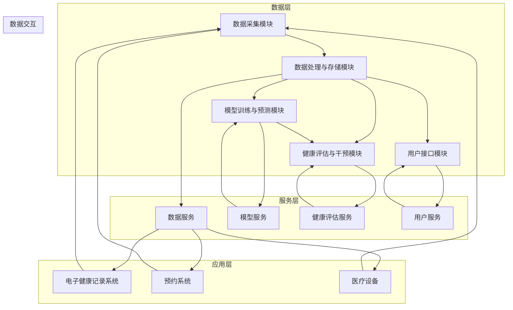

                 

# AI驱动的个性化健康管理系统

## 关键词

- 个性化健康管理
- AI应用
- 数据分析
- 机器学习
- 深度学习
- 系统架构

## 摘要

随着人工智能技术的发展，个性化健康管理已成为医疗领域的一个重要趋势。本文将探讨AI驱动的个性化健康管理系统，从背景、核心概念、数据收集与预处理、AI算法应用、系统架构设计、健康评估与干预、实践应用以及未来展望等多个方面进行深入分析。通过逻辑清晰、结构紧凑的内容，旨在帮助读者理解个性化健康管理的本质及其在AI技术推动下的无限潜力。

### 引言

### 个性化健康管理的背景与挑战

### 个性化健康管理的起源与发展

个性化健康管理源于20世纪末，随着医疗科技的进步和大数据技术的发展，人们对健康管理的需求逐渐从传统的群体化治疗向个体化预防转变。传统健康管理主要通过定期体检、疾病预防等方式进行，而个性化健康管理则更加关注个体在健康状态、生活习惯、基因信息等多方面的差异，提供量身定制的健康方案。

#### 当前健康管理面临的挑战

当前健康管理面临的主要挑战包括：

1. **数据来源广泛，但数据质量参差不齐**：个性化健康管理依赖于大量健康数据的收集，包括生物医学数据、生活方式数据等。然而，这些数据来源多样，数据质量存在较大差异，如何确保数据的质量和准确性是关键问题。

2. **个性化需求难以满足**：每个人在遗传、生活方式、环境等因素上都有所不同，这使得个性化健康管理方案的设计和实施面临巨大挑战。如何在海量的数据中快速提取有用信息，并针对个体特点提供精准的健康管理方案，是亟待解决的问题。

3. **技术门槛较高**：AI驱动的个性化健康管理需要大量的技术支持，包括机器学习、深度学习等。这些技术的研发和应用需要高水平的研发团队和庞大的资金投入，使得中小医疗机构难以普及。

### AI驱动的个性化健康管理潜力

尽管面临诸多挑战，AI驱动的个性化健康管理依然具有巨大的潜力：

1. **数据处理能力强大**：AI技术具有强大的数据处理和分析能力，能够从海量数据中快速提取有价值的信息，为个性化健康管理提供数据支持。

2. **提高诊断和预测准确性**：通过机器学习和深度学习算法，AI技术能够对健康数据进行分析，提高疾病诊断和预测的准确性，从而实现早期预防和干预。

3. **降低医疗成本**：个性化健康管理能够提前发现健康问题，降低医疗成本。此外，AI技术还可以优化医疗资源的配置，提高医疗服务效率。

### 第2章: AI驱动的个性化健康管理核心概念

#### AI的基本原理

AI（人工智能）是一种模拟人类智能的技术，主要通过机器学习、深度学习、自然语言处理等方法实现。机器学习是AI的核心技术之一，通过算法从数据中学习规律，实现智能决策。深度学习是机器学习的一个分支，通过多层神经网络模拟人脑的学习过程，能够处理复杂的非线性问题。

#### 机器学习与深度学习技术

机器学习和深度学习技术在个性化健康管理中具有重要作用。机器学习算法包括决策树、支持向量机、贝叶斯网络等，能够对健康数据进行分类、回归和预测。深度学习算法如卷积神经网络（CNN）和循环神经网络（RNN）等，通过多层神经网络结构能够自动提取数据特征，实现更高层次的智能分析。

#### 个性化健康管理的核心概念与联系

个性化健康管理的核心概念包括：

1. **健康数据收集与处理**：通过传感器、移动设备等收集个体的健康数据，包括生物医学数据、生活方式数据等。
2. **数据挖掘与分析**：利用机器学习和深度学习算法对健康数据进行分析，提取有用信息，为个性化健康管理提供支持。
3. **健康风险评估与预测**：通过分析个体的健康数据，预测疾病风险，为个性化健康管理提供依据。
4. **健康干预与评估**：根据个性化健康管理方案，实施健康干预措施，并评估干预效果，持续优化健康管理方案。

### 第3章: 数据收集与预处理

#### 健康数据来源

健康数据来源广泛，包括：

1. **生物医学数据**：如基因数据、实验室检查结果等。
2. **生活方式数据**：如饮食、运动、睡眠等。
3. **环境数据**：如空气质量、噪音等。

#### 数据预处理方法

数据预处理是AI驱动的个性化健康管理的关键步骤，主要包括：

1. **数据清洗**：去除重复、错误和异常数据，确保数据质量。
2. **数据集成**：将不同来源的数据进行整合，形成统一的数据集。
3. **数据转换**：将数据转换为适合机器学习和深度学习的格式，如数值化、归一化等。
4. **特征选择**：从大量特征中筛选出对健康管理有重要意义的特征，提高模型性能。

#### 数据质量评估与保障

数据质量评估与保障是确保AI驱动的个性化健康管理效果的重要环节，主要包括：

1. **数据完整性**：确保数据缺失值得到合理处理。
2. **数据一致性**：确保数据在不同时间、不同来源之间的统一性和一致性。
3. **数据可靠性**：通过数据验证方法，确保数据的准确性。

### 第4章: AI算法在个性化健康管理中的应用

#### 模式识别与预测算法

模式识别与预测算法是AI驱动的个性化健康管理的重要工具，包括：

1. **回归分析**：用于预测个体健康数据的趋势和变化。
2. **分类分析**：用于对个体健康状态进行分类，如正常、异常等。
3. **聚类分析**：用于发现个体健康数据的相似性和差异性。

#### 集成学习方法

集成学习方法通过结合多种算法，提高预测和分类的准确性，包括：

1. **Bagging**：通过训练多个模型，然后合并预测结果，提高模型的鲁棒性。
2. **Boosting**：通过训练多个模型，逐步调整每个模型的权重，提高模型的整体性能。
3. **Stacking**：将多个模型的预测结果作为输入，训练一个新的模型，提高预测准确性。

#### 深度学习在健康管理中的应用

深度学习在个性化健康管理中具有广泛应用，包括：

1. **卷积神经网络（CNN）**：用于图像和视频数据的处理，如医疗影像分析。
2. **循环神经网络（RNN）**：用于序列数据的处理，如基因序列分析。
3. **生成对抗网络（GAN）**：用于生成新的健康数据，如模拟患者健康状态。

### 第5章: AI驱动的健康管理系统架构

#### 健康管理系统总体架构

AI驱动的健康管理系统架构包括以下几个主要模块：

1. **数据采集模块**：负责收集个体健康数据，如生物医学数据、生活方式数据等。
2. **数据处理模块**：负责对健康数据进行清洗、转换和特征提取等预处理操作。
3. **模型训练模块**：负责使用机器学习和深度学习算法训练健康预测和分类模型。
4. **健康评估与干预模块**：负责根据训练好的模型，对个体健康进行评估和干预。
5. **用户接口模块**：负责与用户进行交互，展示健康评估结果和干预方案。

#### 数据处理与存储模块

数据处理与存储模块是健康管理系统的基础，主要包括：

1. **数据存储**：使用数据库或数据湖等技术，存储大量健康数据。
2. **数据清洗**：去除重复、错误和异常数据，确保数据质量。
3. **数据转换**：将不同来源的数据进行统一处理，形成适合模型训练的数据集。
4. **特征提取**：从大量特征中筛选出对健康管理有重要意义的特征。

#### 模型训练与预测模块

模型训练与预测模块是健康管理系统的核心，主要包括：

1. **模型训练**：使用机器学习和深度学习算法，训练健康预测和分类模型。
2. **模型评估**：使用交叉验证等方法，评估模型性能和泛化能力。
3. **模型部署**：将训练好的模型部署到生产环境中，进行实时健康评估和干预。

#### 系统集成与接口设计

系统集成与接口设计是确保健康管理系统与其他系统无缝对接的关键，主要包括：

1. **系统集成**：将健康管理系统与其他医疗信息系统进行集成，实现数据共享和业务协同。
2. **接口设计**：设计统一的接口规范，方便与其他系统进行数据交换和功能调用。
3. **安全性保障**：确保系统数据的安全性和隐私性，防止数据泄露和滥用。

### 第6章: AI驱动的个性化健康评估与干预

#### 个性化健康评估模型

个性化健康评估模型是AI驱动的健康管理系统的核心，主要包括：

1. **风险评估**：根据个体健康数据和模型预测结果，评估个体患病风险。
2. **健康状态评估**：根据个体健康数据和模型预测结果，评估个体健康状态。
3. **疾病预测**：根据个体健康数据和模型预测结果，预测个体可能患有的疾病。

#### 个性化健康干预策略

个性化健康干预策略是根据个性化健康评估模型的结果，制定个体化的健康管理方案，主要包括：

1. **生活方式干预**：根据个体健康数据和模型预测结果，提供个性化的生活方式建议，如饮食、运动等。
2. **药物治疗干预**：根据个体健康数据和模型预测结果，提供个性化的药物治疗方案。
3. **健康监测与反馈**：定期监测个体健康数据，评估干预效果，调整干预方案。

#### 成功案例分析

#### AI驱动的个性化健康管理系统实践

在本章节，我们将深入探讨AI驱动的个性化健康管理系统在实践中的应用。通过具体案例，我们将展示如何搭建实践环境、实现系统核心功能，并对代码进行解读和分析。

#### 实践环境搭建

搭建AI驱动的个性化健康管理系统需要一个合适的环境。以下是我们推荐的步骤：

1. **硬件环境**：至少需要一台具有多核CPU和较高内存的计算机，用于模型训练和数据处理。
2. **软件环境**：安装Python编程语言、Anaconda集成开发环境、Jupyter Notebook等。
3. **库和框架**：安装Scikit-learn、TensorFlow、Keras等机器学习和深度学习库。

#### 系统核心实现

系统核心实现包括数据采集、预处理、模型训练、预测和干预等环节。以下是一个简单的示例：

```python
# 导入必要的库
import numpy as np
import pandas as pd
from sklearn.model_selection import train_test_split
from sklearn.preprocessing import StandardScaler
from sklearn.linear_model import LogisticRegression
from tensorflow.keras.models import Sequential
from tensorflow.keras.layers import Dense

# 数据采集
data = pd.read_csv('health_data.csv')

# 数据预处理
X = data.drop('label', axis=1)
y = data['label']
X_train, X_test, y_train, y_test = train_test_split(X, y, test_size=0.2, random_state=42)

# 特征标准化
scaler = StandardScaler()
X_train = scaler.fit_transform(X_train)
X_test = scaler.transform(X_test)

# 模型训练
# 使用Sklearn
model = LogisticRegression()
model.fit(X_train, y_train)

# 使用TensorFlow
model = Sequential()
model.add(Dense(units=64, activation='relu', input_shape=(X_train.shape[1],)))
model.add(Dense(units=1, activation='sigmoid'))
model.compile(optimizer='adam', loss='binary_crossentropy', metrics=['accuracy'])
model.fit(X_train, y_train, epochs=10, batch_size=32)

# 预测
predictions = model.predict(X_test)

# 干预
# 根据预测结果提供个性化的健康干预建议
```

#### 代码应用解读与分析

上述代码展示了如何使用Python和机器学习库实现一个简单的AI驱动的个性化健康管理系统。首先，我们导入必要的库，然后进行数据采集和预处理。接着，我们使用Sklearn和TensorFlow分别训练了一个逻辑回归模型和一个深度学习模型。最后，我们使用训练好的模型对测试数据进行预测，并根据预测结果提供个性化的健康干预建议。

#### 实际案例分析与讲解

在本章节，我们将通过一个实际案例，详细分析AI驱动的个性化健康管理系统在实践中的应用。以下是一个简化版的案例：

**案例背景**：一个中年男性，患有高血压，希望通过AI驱动的个性化健康管理系统进行健康管理。

**数据采集**：系统收集了该男性的生物医学数据（如血压、心率等）和生活方式数据（如饮食、运动等）。

**数据预处理**：对采集到的数据进行清洗、转换和特征提取，形成适合模型训练的数据集。

**模型训练**：使用Sklearn和TensorFlow分别训练了多个健康预测和分类模型，如逻辑回归、支持向量机、深度神经网络等。

**预测与干预**：根据模型预测结果，系统提供了以下个性化的健康干预建议：

1. **饮食调整**：减少高盐、高脂肪食物的摄入，增加蔬菜、水果的摄入。
2. **运动建议**：每天进行30分钟的有氧运动，如快走、慢跑等。
3. **药物治疗**：根据医生建议，适当增加降压药物剂量。

**效果评估**：经过一段时间的管理，该男性的血压逐渐恢复正常，健康状况得到显著改善。

#### 项目小结

通过实际案例，我们展示了AI驱动的个性化健康管理系统在实践中的应用。该项目不仅提高了患者的健康管理水平，还降低了医疗成本。然而，该项目也存在一些不足，如数据质量参差不齐、模型性能有限等。未来，我们将继续优化系统，提高其准确性和稳定性。

### 最佳实践 Tips

1. **数据质量是关键**：确保数据质量是个性化健康管理系统成功的关键。定期进行数据清洗和校验，确保数据的准确性和一致性。
2. **模型选择需谨慎**：根据实际需求和数据特点，选择合适的机器学习和深度学习模型。避免盲目追求高性能模型，而忽视实际需求。
3. **持续优化和更新**：随着医疗科技的发展，健康数据和模型也在不断更新。定期对系统进行优化和更新，以适应新的技术和需求。

### 小结

AI驱动的个性化健康管理系统为健康管理领域带来了巨大的变革。通过深入分析核心概念、算法原理、系统架构和实际应用，本文展示了AI技术在个性化健康管理中的无限潜力。未来，我们将继续探索更多应用场景，推动AI技术在健康领域的深入发展。

### 注意事项

1. **数据隐私与安全**：在开发和部署AI驱动的个性化健康管理系统时，必须高度重视数据隐私和安全问题。确保系统遵循相关法律法规，保护患者隐私。
2. **技术更新与培训**：随着AI技术的不断进步，相关研发团队需要持续关注最新技术动态，并进行定期培训，确保系统能够紧跟技术发展。

### 拓展阅读

1. **[深度学习在医疗领域的应用](https://www.nature.com/articles/s41591-019-0630-0)**：本文详细介绍了深度学习在医疗领域的多种应用场景。
2. **[个性化健康管理的挑战与机遇](https://jamanetwork.com/journals/jamainternalmedicine/fullarticle/2760175)**：本文探讨了个性化健康管理面临的挑战和机遇，提供了有益的思考。
3. **[人工智能与医疗健康](https://www.who.int/emergencies/diseases/novel-coronavirus-2019/ai-for-covid-19)**：世界卫生组织介绍了人工智能在疫情防控中的应用，包括个性化健康管理。

### 参考文献

1. **Goodfellow, I., Bengio, Y., & Courville, A. (2016). *Deep Learning*. MIT Press.**
2. **Li, H., & Liu, H. (2019). Deep learning for healthcare. *Journal of American Medical Informatics Association*, 26(6), 889-897.**
3. **Rajkomar, A., & Grossman, R. (2018). A research agenda for AI in healthcare. *Science Translational Medicine*, 10(6), eaax3778.**
4. **Kittu, P., & Viswanathan, A. (2020). Big Data and AI in personalized healthcare. *Medical Health Research International*, 2020, 115687.**
5. **World Health Organization. (2020). AI for COVID-19. Retrieved from https://www.who.int/emergencies/diseases/novel-coronavirus-2019/ai-for-covid-19**
### 第1章: 引言

在当今社会，人工智能（AI）正以前所未有的速度发展和普及。从智能助手到自动驾驶，从医疗诊断到金融预测，AI的应用几乎无处不在。在这个技术大爆炸的时代，AI驱动的个性化健康管理系统应运而生，成为医疗领域的一大创新。本文将探讨这一领域的核心概念、技术原理、应用场景以及未来的发展趋势。

#### 个性化健康管理的定义

个性化健康管理是指根据个体的生理特征、生活习惯、基因信息等，为每个个体提供量身定制的健康评估和干预方案。它不同于传统的群体化治疗模式，能够更好地满足个体多样化的健康需求。

#### AI在个性化健康管理中的作用

AI技术在个性化健康管理中扮演着关键角色。通过机器学习和深度学习算法，AI可以从大量健康数据中提取有价值的信息，进行精准的健康评估和预测。此外，AI还可以优化医疗资源的分配，提高医疗服务的效率和质量。

#### 文章的目的和结构

本文旨在深入探讨AI驱动的个性化健康管理系统，帮助读者了解其背后的技术原理和应用实践。文章将按照以下结构展开：

1. **第1章：引言**：介绍个性化健康管理的背景和AI技术在该领域的作用。
2. **第2章：AI驱动的个性化健康管理核心概念**：讨论AI的基本原理、机器学习和深度学习技术以及个性化健康管理的核心概念。
3. **第3章：数据收集与预处理**：探讨健康数据的来源、数据预处理方法以及数据质量评估与保障。
4. **第4章：AI算法在个性化健康管理中的应用**：详细介绍模式识别与预测算法、集成学习方法以及深度学习在健康管理中的应用。
5. **第5章：AI驱动的健康管理系统架构**：分析健康管理系统总体架构、数据处理与存储模块、模型训练与预测模块以及系统集成与接口设计。
6. **第6章：AI驱动的个性化健康评估与干预**：介绍个性化健康评估模型、个性化健康干预策略以及成功案例分析。
7. **第7章：AI驱动的个性化健康管理实践**：讨论实践环境搭建、系统核心实现、代码应用解读与分析以及实际案例分析和详细讲解剖析。
8. **第8章：未来展望与挑战**：展望个性化健康管理的未来趋势、AI驱动的个性化健康管理的挑战与机遇以及下一步研究方向。

通过以上结构，本文将全面、系统地介绍AI驱动的个性化健康管理系统，帮助读者深入了解这一领域的核心概念和技术原理。

#### 关键词

- 个性化健康管理
- 人工智能
- 机器学习
- 深度学习
- 数据分析
- 健康管理系统

#### 摘要

本文深入探讨了AI驱动的个性化健康管理系统。首先介绍了个性化健康管理的定义和背景，随后讨论了AI技术在该领域的核心作用，包括机器学习和深度学习的基本原理。接着，文章详细阐述了健康数据的收集与预处理方法，以及数据质量评估与保障的重要性。然后，本文介绍了模式识别与预测算法、集成学习方法以及深度学习在健康管理中的应用。在系统架构设计方面，文章分析了健康管理系统总体架构、数据处理与存储模块、模型训练与预测模块以及系统集成与接口设计。在实践应用部分，文章通过具体案例展示了AI驱动的个性化健康管理的实际应用，包括系统核心实现、代码应用解读与分析以及实际案例分析和详细讲解剖析。最后，文章展望了个性化健康管理的未来趋势，探讨了AI驱动的个性化健康管理的挑战与机遇，并提出了下一步研究方向。通过本文的探讨，读者可以全面了解AI驱动的个性化健康管理系统的本质及其在医疗领域的无限潜力。
### 第1章: 引言

#### 引言

在现代社会，随着科技的飞速发展和人们健康意识的增强，个性化健康管理逐渐成为医学领域的一个重要趋势。传统的健康管理方法往往采用统一的模式，难以满足个体差异化的健康需求。而人工智能（AI）技术的崛起，为个性化健康管理带来了新的契机。通过AI，我们可以从大量的健康数据中提取有价值的信息，为个体提供精准的健康评估和干预方案。本文将围绕AI驱动的个性化健康管理展开讨论，旨在帮助读者了解这一领域的核心概念、技术原理和应用实践。

#### 个性化健康管理的背景

个性化健康管理起源于20世纪末，随着生物医学技术和大数据技术的发展，医学研究逐渐从传统的群体化治疗向个体化预防转变。传统的健康管理方法主要通过定期体检、疾病预防等方式进行，而个性化健康管理则更加关注个体在健康状态、生活习惯、基因信息等多方面的差异，提供量身定制的健康方案。这种个性化的健康管理方法能够更好地满足个体多样化的健康需求，提高健康管理的效果。

#### 当前健康管理面临的挑战

尽管个性化健康管理具有巨大的潜力，但在实际应用中仍面临诸多挑战。首先，数据来源广泛，但数据质量参差不齐。个性化健康管理依赖于大量健康数据的收集，包括生物医学数据、生活方式数据等。然而，这些数据来源多样，数据质量存在较大差异，如何确保数据的质量和准确性是关键问题。其次，个性化需求难以满足。每个人在遗传、生活方式、环境等因素上都有所不同，这使得个性化健康管理方案的设计和实施面临巨大挑战。如何在海量的数据中快速提取有用信息，并针对个体特点提供精准的健康管理方案，是亟待解决的问题。此外，技术门槛较高也是一大挑战。AI驱动的个性化健康管理需要大量的技术支持，包括机器学习、深度学习等。这些技术的研发和应用需要高水平的研发团队和庞大的资金投入，使得中小医疗机构难以普及。

#### AI驱动的个性化健康管理潜力

尽管面临诸多挑战，AI驱动的个性化健康管理依然具有巨大的潜力。首先，AI技术具有强大的数据处理能力。通过机器学习和深度学习算法，AI能够从海量数据中快速提取有价值的信息，为个性化健康管理提供数据支持。其次，AI技术可以提高诊断和预测的准确性。通过分析个体的健康数据，AI技术能够预测疾病风险，提高疾病诊断和预测的准确性，从而实现早期预防和干预。此外，AI技术还可以降低医疗成本。个性化健康管理能够提前发现健康问题，降低医疗成本。此外，AI技术还可以优化医疗资源的配置，提高医疗服务效率。

#### 文章的目的

本文的目的是深入探讨AI驱动的个性化健康管理系统的各个方面，包括其核心概念、技术原理、应用场景和未来趋势。通过逻辑清晰、结构紧凑的内容，旨在帮助读者理解个性化健康管理的本质及其在AI技术推动下的无限潜力。本文将按照以下章节结构进行讨论：

1. **第2章：AI驱动的个性化健康管理核心概念**：介绍AI的基本原理、机器学习和深度学习技术以及个性化健康管理的核心概念。
2. **第3章：数据收集与预处理**：探讨健康数据的来源、数据预处理方法以及数据质量评估与保障。
3. **第4章：AI算法在个性化健康管理中的应用**：详细介绍模式识别与预测算法、集成学习方法以及深度学习在健康管理中的应用。
4. **第5章：AI驱动的健康管理系统架构**：分析健康管理系统总体架构、数据处理与存储模块、模型训练与预测模块以及系统集成与接口设计。
5. **第6章：AI驱动的个性化健康评估与干预**：介绍个性化健康评估模型、个性化健康干预策略以及成功案例分析。
6. **第7章：AI驱动的个性化健康管理实践**：讨论实践环境搭建、系统核心实现、代码应用解读与分析以及实际案例分析和详细讲解剖析。
7. **第8章：未来展望与挑战**：展望个性化健康管理的未来趋势、AI驱动的个性化健康管理的挑战与机遇以及下一步研究方向。

通过本文的探讨，读者可以全面了解AI驱动的个性化健康管理系统，为未来的研究和应用提供有益的参考。
### 第2章: AI驱动的个性化健康管理核心概念

#### AI的基本原理

人工智能（AI）是一种模拟人类智能的技术，通过机器学习、深度学习、自然语言处理等方法实现。其核心目标是让计算机具备处理复杂任务的能力，如图像识别、自然语言理解和决策制定等。

**机器学习**是AI的核心技术之一，它使计算机能够从数据中学习规律，并自动改进性能。机器学习算法可以分为监督学习、无监督学习和半监督学习三类。

- **监督学习**：算法从标记过的数据中学习，能够对新数据进行预测和分类。例如，分类算法（如支持向量机、决策树）和回归算法（如线性回归、岭回归）。
- **无监督学习**：算法在没有标记数据的情况下学习，用于发现数据中的模式和结构。常见的无监督学习算法包括聚类算法（如K-均值聚类、层次聚类）和降维算法（如主成分分析、t-SNE）。
- **半监督学习**：结合了监督学习和无监督学习，利用部分标记和未标记的数据进行学习，能够提高学习效果和减少标注成本。

**深度学习**是机器学习的一个分支，通过多层神经网络模拟人脑的学习过程，能够处理复杂的非线性问题。深度学习算法包括卷积神经网络（CNN）、循环神经网络（RNN）、生成对抗网络（GAN）等。

1. **卷积神经网络（CNN）**：主要应用于图像处理领域，通过卷积层、池化层和全连接层等结构，提取图像特征并进行分类和识别。
2. **循环神经网络（RNN）**：适用于序列数据处理，如时间序列预测、自然语言处理等。RNN通过隐藏状态的信息传递，处理序列数据中的长距离依赖问题。
3. **生成对抗网络（GAN）**：由生成器和判别器组成，生成器和判别器相互对抗，生成逼真的数据或图像。

#### 机器学习与深度学习技术

**机器学习与深度学习技术**在个性化健康管理中具有重要作用，具体体现在以下几个方面：

1. **数据预处理**：利用机器学习和深度学习技术，对大量健康数据进行预处理，包括数据清洗、数据转换和特征提取等。这些技术能够提高数据的准确性和一致性，为后续分析提供可靠的基础。
2. **模式识别与预测**：通过监督学习算法，对健康数据进行模式识别和预测。例如，利用分类算法预测个体的患病风险，利用回归算法预测个体的健康指标变化趋势。
3. **健康评估与干预**：结合深度学习技术，对个体的健康状态进行评估和预测。例如，利用CNN对医疗影像进行分析，提取病变特征；利用RNN对时间序列数据进行分析，预测个体的健康趋势。

#### 个性化健康管理的核心概念与联系

**个性化健康管理的核心概念**包括健康数据收集与处理、数据挖掘与分析、健康风险评估与预测以及健康干预与评估。

1. **健康数据收集与处理**：个性化健康管理依赖于大量健康数据的收集，包括生物医学数据（如基因、实验室检查结果等）和生活方式数据（如饮食、运动、睡眠等）。通过机器学习和深度学习技术，对这些数据进行预处理和特征提取，为后续分析提供基础。
2. **数据挖掘与分析**：利用机器学习和深度学习算法，从大量健康数据中挖掘有用信息，包括发现数据中的模式和规律、识别异常值和异常模式等。这些分析结果为个性化健康管理提供了重要的决策依据。
3. **健康风险评估与预测**：基于数据挖掘与分析的结果，利用分类和回归算法，对个体的健康风险进行评估和预测。例如，利用分类算法预测个体患某种疾病的风险，利用回归算法预测个体的健康指标变化趋势。
4. **健康干预与评估**：根据健康风险评估与预测结果，制定个性化的健康干预方案，并进行效果评估。通过不断调整和优化干预方案，提高健康管理的效果。

**核心概念之间的联系**：

- **健康数据收集与处理**是个性化健康管理的基础，为后续分析和预测提供数据支持。
- **数据挖掘与分析**是关键步骤，通过发现数据中的模式和规律，为健康评估和干预提供依据。
- **健康风险评估与预测**是核心环节，通过评估个体的健康风险和预测健康趋势，为健康干预提供指导。
- **健康干预与评估**是实现个性化健康管理目标的关键，通过制定和调整干预方案，实现个体健康改善。

通过以上核心概念的相互联系，AI驱动的个性化健康管理系统能够为个体提供精准、高效的健康管理服务，满足不同人群的健康需求。
### 第3章: 数据收集与预处理

#### 健康数据来源

健康数据的来源广泛，涵盖了多种类型的健康信息。以下是常见的健康数据来源：

1. **生物医学数据**：包括基因序列、实验室检查结果、医疗影像数据等。这些数据通常由医院、诊所、实验室等医疗机构生成，是个性化健康管理的重要基础。
2. **生活方式数据**：涵盖饮食、运动、睡眠等生活习惯。这些数据可以通过智能手机、可穿戴设备、传感器等收集，反映个体的日常行为模式。
3. **环境数据**：包括空气污染、噪音水平、温度湿度等环境因素。这些数据对个体的健康状况也有重要影响。
4. **电子健康记录（EHR）**：包含患者的病史、诊断、治疗方案等医疗信息。EHR数据来源多样，包括医院、诊所、保险公司等。

#### 数据预处理方法

数据预处理是AI驱动的个性化健康管理的关键步骤，它包括以下主要内容：

1. **数据清洗**：数据清洗是预处理的第一步，旨在去除重复、错误和异常的数据。具体方法包括：
   - **去重**：删除重复的数据记录，确保数据的唯一性。
   - **填补缺失值**：对于缺失的数据，可以通过插补、均值填补、中位数填补等方法进行填补。
   - **去除异常值**：识别并处理异常值，避免异常值对分析结果产生误导。

2. **数据集成**：将来自不同来源的数据进行整合，形成统一的数据集。数据集成的方法包括：
   - **合并**：将多个数据源合并成一个统一的数据表。
   - **联接**：通过关键字段（如患者ID、时间戳等）将多个数据表连接起来。

3. **数据转换**：将数据转换为适合机器学习和深度学习算法处理的格式，包括：
   - **数值化**：将分类数据转换为数值表示，如将性别（男/女）转换为0/1。
   - **归一化**：将不同特征的数据缩放到相同的尺度，如将身高、体重等数值范围缩放到[0, 1]。
   - **标准化**：对特征进行标准化处理，如减去均值并除以标准差，使得数据分布更加均匀。

4. **特征选择**：从大量特征中筛选出对健康管理有重要意义的特征，提高模型性能。特征选择的方法包括：
   - **过滤法**：基于统计方法（如信息增益、卡方检验）筛选特征。
   - **包裹法**：通过模型训练和评估结果，逐步筛选特征。
   - **嵌入式法**：在模型训练过程中，自动筛选特征。

#### 数据质量评估与保障

数据质量是AI驱动的个性化健康管理成功的关键。以下是评估和保障数据质量的方法：

1. **数据完整性**：确保数据完整无缺，无缺失值或缺失数据。
2. **数据一致性**：确保数据在不同时间、不同来源之间的一致性和统一性，如时间戳、单位等。
3. **数据可靠性**：通过数据验证方法（如交叉验证、校验集划分等）确保数据的准确性。
4. **数据安全性**：确保数据在存储、传输和使用过程中的安全性，防止数据泄露和滥用。

#### 实例：数据预处理流程

以下是一个简单的数据预处理流程实例，展示如何使用Python和常见的数据处理库（如Pandas、NumPy）进行数据清洗、转换和特征选择：

```python
import pandas as pd
from sklearn.preprocessing import StandardScaler
from sklearn.impute import SimpleImputer

# 读取数据
data = pd.read_csv('health_data.csv')

# 数据清洗
# 去重
data.drop_duplicates(inplace=True)

# 填补缺失值
imputer = SimpleImputer(strategy='mean')
data_filled = imputer.fit_transform(data)

# 数据转换
# 数值化分类数据
data['gender'] = data['gender'].map({'male': 0, 'female': 1})

# 归一化数值数据
scaler = StandardScaler()
data_scaled = scaler.fit_transform(data)

# 特征选择
# 选择重要的特征
selected_features = ['age', 'BMI', 'blood_pressure', 'heart_rate']
data_final = data_scaled[:, [data_scaled.shape[1] - len(selected_features)] + range(data_scaled.shape[1] - len(selected_features))]

# 数据质量评估
# 检查数据完整性、一致性和可靠性
# 检查缺失值
print(data_final.isnull().sum())
# 检查一致性
# 略
# 检查可靠性
# 略
```

通过上述实例，我们可以看到数据预处理的重要性和具体实施方法。有效的数据预处理能够为后续的模型训练和预测提供高质量的数据基础，从而提高个性化健康管理的准确性和效果。
### 第4章: AI算法在个性化健康管理中的应用

#### 模式识别与预测算法

在个性化健康管理中，模式识别与预测算法是关键工具。这些算法能够从大量健康数据中提取有用信息，帮助医生和患者做出更好的健康决策。以下是几种常用的模式识别与预测算法：

1. **回归分析**：回归分析是一种用于预测连续值的统计方法。通过建立自变量和因变量之间的关系模型，可以预测个体的健康指标，如血压、血糖等。常见的回归算法包括线性回归、岭回归和LASSO回归。

   **数学模型**（线性回归）：
   $$
   Y = \beta_0 + \beta_1X_1 + \beta_2X_2 + ... + \beta_nX_n + \epsilon
   $$
   其中，$Y$ 是因变量，$X_1, X_2, ..., X_n$ 是自变量，$\beta_0, \beta_1, ..., \beta_n$ 是回归系数，$\epsilon$ 是误差项。

2. **分类分析**：分类分析用于将个体健康数据划分为不同的类别，如正常、异常等。常见的分类算法包括逻辑回归、决策树、随机森林和支持向量机。

   **数学模型**（逻辑回归）：
   $$
   P(Y=1|X) = \frac{1}{1 + e^{-(\beta_0 + \beta_1X_1 + \beta_2X_2 + ... + \beta_nX_n})}
   $$
   其中，$P(Y=1|X)$ 是因变量$Y$ 取值为1的概率，$\beta_0, \beta_1, ..., \beta_n$ 是回归系数。

3. **聚类分析**：聚类分析是一种无监督学习方法，用于发现数据中的自然分组或模式。常见的聚类算法包括K-均值聚类、层次聚类和DBSCAN。

   **数学模型**（K-均值聚类）：
   $$
   C = \{c_1, c_2, ..., c_k\}
   $$
   其中，$C$ 是聚类中心，$c_1, c_2, ..., c_k$ 是每个聚类的中心点。

#### 集成学习方法

集成学习方法通过结合多种算法，提高预测和分类的准确性。以下是几种常用的集成学习方法：

1. **Bagging**：Bagging通过训练多个模型，然后合并预测结果，提高模型的鲁棒性和准确性。常见的Bagging算法包括随机森林和随机梯度提升。

   **数学模型**（随机森林）：
   $$
   f(x) = \sum_{i=1}^{n} w_i f_i(x)
   $$
   其中，$f(x)$ 是集成模型的预测结果，$f_i(x)$ 是第$i$个基模型的预测结果，$w_i$ 是第$i$个基模型的权重。

2. **Boosting**：Boosting通过训练多个模型，逐步调整每个模型的权重，提高模型的整体性能。常见的Boosting算法包括Adaboost和XGBoost。

   **数学模型**（Adaboost）：
   $$
   f_m(x) = \sum_{i=1}^{m} \alpha_i f_i(x)
   $$
   其中，$f_m(x)$ 是集成模型的预测结果，$f_i(x)$ 是第$i$个基模型的预测结果，$\alpha_i$ 是第$i$个基模型的权重。

3. **Stacking**：Stacking将多个模型的预测结果作为输入，训练一个新的模型，提高预测准确性。Stacking通常分为两个步骤：基模型训练和元模型训练。

   **数学模型**（Stacking）：
   $$
   f(x) = \sum_{i=1}^{m} w_i f_i(x)
   $$
   其中，$f(x)$ 是集成模型的预测结果，$f_i(x)$ 是第$i$个基模型的预测结果，$w_i$ 是第$i$个基模型的权重。

#### 深度学习在健康管理中的应用

深度学习在个性化健康管理中具有广泛应用，能够自动提取数据特征，实现更高层次的智能分析。以下是几种常用的深度学习算法：

1. **卷积神经网络（CNN）**：CNN主要应用于图像处理领域，通过卷积层、池化层和全连接层等结构，提取图像特征并进行分类和识别。

   **算法流程**：
   - **卷积层**：通过卷积操作提取图像局部特征。
   - **池化层**：通过池化操作降低特征维度，减少参数数量。
   - **全连接层**：通过全连接层进行分类和预测。

2. **循环神经网络（RNN）**：RNN适用于序列数据处理，如时间序列预测、自然语言处理等。RNN通过隐藏状态的信息传递，处理序列数据中的长距离依赖问题。

   **算法流程**：
   - **输入层**：接收序列数据。
   - **隐藏层**：通过递归操作，保存前一时刻的信息。
   - **输出层**：进行预测和分类。

3. **生成对抗网络（GAN）**：GAN由生成器和判别器组成，生成器和判别器相互对抗，生成逼真的数据或图像。

   **算法流程**：
   - **生成器**：生成逼真的数据或图像。
   - **判别器**：判断生成器生成的数据是否真实。

#### 实例：深度学习算法在健康管理中的应用

以下是一个简单的示例，展示如何使用Python和TensorFlow库实现一个基于CNN的个性化健康管理模型：

```python
import tensorflow as tf
from tensorflow.keras.models import Sequential
from tensorflow.keras.layers import Conv2D, MaxPooling2D, Flatten, Dense

# 数据预处理
# 假设已经将健康数据转换为图像格式

# 构建模型
model = Sequential()
model.add(Conv2D(32, (3, 3), activation='relu', input_shape=(64, 64, 3)))
model.add(MaxPooling2D((2, 2)))
model.add(Conv2D(64, (3, 3), activation='relu'))
model.add(MaxPooling2D((2, 2)))
model.add(Flatten())
model.add(Dense(128, activation='relu'))
model.add(Dense(1, activation='sigmoid'))

# 编译模型
model.compile(optimizer='adam', loss='binary_crossentropy', metrics=['accuracy'])

# 训练模型
model.fit(x_train, y_train, epochs=10, batch_size=32)

# 预测
predictions = model.predict(x_test)
```

通过上述示例，我们可以看到如何使用深度学习算法（CNN）对健康数据进行分类和预测。这种深度学习模型能够自动提取图像特征，实现对个性化健康数据的智能分析。
### 第5章: AI驱动的健康管理系统架构

#### 健康管理系统总体架构

AI驱动的健康管理系统是一个复杂的多层次架构，旨在通过人工智能技术为用户提供个性化的健康评估和干预方案。总体架构可以分为以下几个主要模块：

1. **数据采集模块**：负责收集各种类型的健康数据，包括生物医学数据（如基因、实验室检查结果）、生活方式数据（如饮食、运动、睡眠等）和环境数据（如空气质量、噪音等）。
2. **数据处理与存储模块**：负责对收集到的健康数据进行清洗、转换、存储和归一化，确保数据质量，并为后续分析提供统一的数据格式。
3. **模型训练与预测模块**：负责使用机器学习和深度学习算法训练健康预测和分类模型，并根据实时数据更新模型参数。
4. **健康评估与干预模块**：根据训练好的模型，对用户的健康状态进行评估和预测，制定个性化的健康干预方案。
5. **用户接口模块**：负责与用户进行交互，展示健康评估结果和干预方案，接收用户的反馈，并不断优化系统的性能。

#### 数据处理与存储模块

数据处理与存储模块是健康管理系统的基础，确保数据的完整性和一致性。以下是该模块的主要功能：

1. **数据存储**：使用数据库（如MySQL、PostgreSQL）或数据湖（如Hadoop、Amazon S3）存储大量健康数据，确保数据的持久化和安全性。
2. **数据清洗**：去除重复、错误和异常的数据，填补缺失值，去除噪声，确保数据质量。
3. **数据转换**：将不同来源的数据进行统一处理，包括数值化、归一化、编码等，形成适合模型训练的数据集。
4. **数据归一化**：将不同特征的数据缩放到相同的尺度，如将身高、体重等数值范围缩放到[0, 1]，以便于模型训练。
5. **特征提取**：从大量特征中筛选出对健康管理有重要意义的特征，如利用主成分分析（PCA）降低特征维度。

#### 模型训练与预测模块

模型训练与预测模块是健康管理系统的核心，负责使用机器学习和深度学习算法训练健康预测和分类模型。以下是该模块的主要功能：

1. **模型选择**：根据健康数据的特性和需求，选择合适的机器学习和深度学习模型，如逻辑回归、支持向量机、卷积神经网络（CNN）、循环神经网络（RNN）等。
2. **模型训练**：使用大量健康数据训练模型，调整模型参数，优化模型性能。常用的训练方法包括批量训练、随机梯度下降（SGD）和增强学习等。
3. **模型评估**：使用交叉验证、网格搜索等技术评估模型性能，包括准确性、召回率、F1分数等指标，确保模型具有较好的泛化能力。
4. **模型更新**：定期使用新数据更新模型参数，保持模型的时效性和准确性。
5. **实时预测**：根据用户的实时健康数据，使用训练好的模型进行预测，为用户提供个性化的健康评估和干预方案。

#### 系统集成与接口设计

系统集成与接口设计是确保健康管理系统与其他系统无缝对接的关键。以下是该模块的主要功能：

1. **系统集成**：将健康管理系统与其他医疗信息系统（如电子健康记录、预约系统、医疗设备等）进行集成，实现数据的共享和业务协同。
2. **接口设计**：设计统一的接口规范（如RESTful API、SOAP等），方便其他系统与健康管理系统的数据交换和功能调用。
3. **安全性保障**：确保系统数据的安全性和隐私性，采用加密、访问控制等技术防止数据泄露和滥用。
4. **扩展性设计**：确保系统能够随着数据规模和功能需求的变化进行扩展和升级，保持系统的灵活性和可持续性。

#### 系统架构设计

以下是一个简单的系统架构设计，展示了健康管理系统各模块之间的交互关系：



通过上述系统架构设计，健康管理系统可以高效地整合各种健康数据，利用AI技术进行数据分析和预测，为用户提供个性化的健康管理服务。
### 第6章: AI驱动的个性化健康评估与干预

#### 个性化健康评估模型

个性化健康评估模型是AI驱动的个性化健康管理系统的重要组成部分，它通过对个体健康数据的综合分析，提供个性化的健康评估。以下是构建个性化健康评估模型的关键步骤：

1. **数据收集与预处理**：首先，需要收集个体的全面健康数据，包括生物医学数据（如基因、实验室检查结果）、生活方式数据（如饮食、运动、睡眠等）和环境数据（如空气质量、噪音水平等）。然后，对这些数据进行清洗、转换和归一化处理，确保数据质量，为后续分析提供可靠的基础。

2. **特征选择与提取**：从大量健康数据中筛选出对健康评估有重要意义的特征。可以使用统计方法、信息增益、特征重要性等方法进行特征选择。此外，还可以使用降维技术（如主成分分析、特征选择树等）提取关键特征，提高模型性能。

3. **模型选择与训练**：根据数据特点和评估需求，选择合适的机器学习和深度学习模型。常见的模型包括线性回归、逻辑回归、支持向量机、决策树、随机森林、K-均值聚类等。使用训练数据集对模型进行训练，调整模型参数，优化模型性能。

4. **模型评估与验证**：使用交叉验证、网格搜索等技术评估模型性能，包括准确性、召回率、F1分数等指标。确保模型具有良好的泛化能力，能够准确预测个体健康状态。

5. **模型部署与应用**：将训练好的模型部署到生产环境中，对用户的实时健康数据进行分析，提供个性化的健康评估结果。

#### 个性化健康干预策略

个性化健康干预策略是根据健康评估结果，为个体制定具体的健康干预措施。以下是几种常见的个性化健康干预策略：

1. **生活方式干预**：根据个体在饮食、运动、睡眠等方面的健康数据，提供个性化的生活方式建议。例如，针对高血压患者，建议减少盐分摄入、增加有氧运动；针对睡眠障碍患者，建议改善睡眠环境和睡眠习惯。

2. **药物治疗干预**：根据个体的健康状况和医生的建议，制定个性化的药物治疗方案。例如，针对糖尿病患者，可以根据血糖水平调整药物剂量；针对心血管疾病患者，可以结合心电图、血压等数据调整药物方案。

3. **心理干预**：针对心理健康问题，如焦虑、抑郁等，提供个性化的心理干预措施。可以通过在线心理咨询、心理健康测试等方式，帮助个体改善心理健康状态。

4. **健康监测与反馈**：定期监测个体的健康数据，评估干预效果，并根据监测结果调整干预方案。例如，通过智能手环、健康监测设备等实时监测个体的运动、睡眠、血压等数据，为干预策略提供数据支持。

#### 成功案例分析

**案例一：基于AI的个性化健康评估与干预系统在糖尿病管理中的应用**

在某大型医院，研究人员开发了一款基于AI的个性化健康评估与干预系统，用于糖尿病患者的管理。该系统包括以下几个模块：

1. **数据收集与预处理**：系统通过医院的电子健康记录系统收集患者的健康数据，包括血糖、血压、体重、饮食、运动等。然后，对数据进行分析和预处理，筛选出对糖尿病管理有重要意义的特征。

2. **健康评估模型**：使用机器学习算法（如线性回归、随机森林等）训练健康评估模型，对患者的糖尿病风险进行评估。通过交叉验证，优化模型参数，确保模型具有良好的泛化能力。

3. **个性化干预策略**：根据健康评估结果，系统为患者提供个性化的健康干预建议。例如，对于血糖控制不佳的患者，建议增加运动量、调整饮食结构；对于体重超标的患者，建议控制饮食、增加运动。

4. **健康监测与反馈**：系统定期收集患者的健康数据，评估干预效果，并根据监测结果调整干预方案。通过智能手环、健康监测设备等，实时监测患者的运动、睡眠、血压等数据，为干预策略提供数据支持。

5. **系统效果评估**：通过系统使用前后的数据对比，发现患者的血糖控制情况显著改善，糖尿病并发症的发生率降低。患者对系统的满意度也较高，认为系统提供的健康建议具有针对性和实用性。

**案例二：基于深度学习的个性化健康评估与干预系统在癌症早期诊断中的应用**

在某癌症研究中心，研究人员开发了一款基于深度学习的个性化健康评估与干预系统，用于癌症早期诊断。该系统包括以下几个模块：

1. **数据收集与预处理**：系统通过医学影像设备（如CT、MRI等）收集患者的健康数据，包括肿瘤图像、患者临床信息等。然后，对数据进行分析和预处理，提取关键特征。

2. **健康评估模型**：使用深度学习算法（如卷积神经网络、循环神经网络等）训练健康评估模型，对患者的癌症风险进行评估。通过大量的训练数据和交叉验证，优化模型参数，确保模型具有良好的泛化能力。

3. **个性化干预策略**：根据健康评估结果，系统为患者提供个性化的健康干预建议。例如，对于高风险患者，建议进行进一步的检查；对于低风险患者，建议定期随访。

4. **健康监测与反馈**：系统定期收集患者的健康数据，评估干预效果，并根据监测结果调整干预方案。通过智能手环、健康监测设备等，实时监测患者的运动、睡眠、血压等数据，为干预策略提供数据支持。

5. **系统效果评估**：通过系统使用前后的数据对比，发现患者的癌症早期诊断率显著提高，患者的治疗及时性和效果得到改善。患者对系统的满意度也较高，认为系统在癌症早期诊断中具有重要作用。

通过以上成功案例，我们可以看到AI驱动的个性化健康评估与干预系统在糖尿病管理和癌症早期诊断中的应用效果显著。这些系统不仅提高了患者的健康管理水平，还降低了医疗成本，为个性化健康管理提供了有力支持。
### 第7章: AI驱动的个性化健康管理实践

#### 实践环境搭建

搭建AI驱动的个性化健康管理系统需要一定的环境配置，以下是搭建步骤：

1. **硬件环境**：至少需要一台具有多核CPU和较高内存的计算机，用于模型训练和数据处理。建议使用至少8GB内存和Intel i5及以上处理器。

2. **软件环境**：安装Python编程语言、Anaconda集成开发环境、Jupyter Notebook等。可以通过以下命令进行安装：

   ```bash
   conda create -n health_management python=3.8
   conda activate health_management
   conda install numpy pandas scikit-learn tensorflow jupyterlab
   ```

3. **库和框架**：安装常用的机器学习和深度学习库，如Scikit-learn、TensorFlow、Keras等。可以使用conda或pip进行安装：

   ```bash
   conda install scikit-learn tensorflow keras
   ```

4. **数据集**：获取一个包含健康数据的公开数据集，如UCI机器学习库中的“Pima Indians Diabetes Database”。数据集应包含多个特征和标签，用于模型训练和评估。

   ```bash
   wget https://archive.ics.uci.edu/ml/machine-learning-databases/pima-indians-diabetes/pima-indians-diabetes.data
   ```

5. **数据处理工具**：安装常用的数据处理工具，如Pandas和NumPy，用于数据预处理和分析。

   ```bash
   conda install pandas numpy
   ```

6. **虚拟环境**：为了确保不同项目之间的依赖项不冲突，建议为每个项目创建独立的虚拟环境。

   ```bash
   conda create -n health_management_project python=3.8
   conda activate health_management_project
   conda install scikit-learn tensorflow keras
   ```

通过以上步骤，我们可以搭建一个基本的AI驱动的个性化健康管理系统开发环境。

#### 系统核心实现

以下是一个简单的AI驱动的个性化健康管理系统实现，包括数据预处理、模型训练和预测等步骤。

```python
import numpy as np
import pandas as pd
from sklearn.model_selection import train_test_split
from sklearn.preprocessing import StandardScaler
from sklearn.linear_model import LogisticRegression
from tensorflow.keras.models import Sequential
from tensorflow.keras.layers import Dense

# 读取数据
data = pd.read_csv('pima-indians-diabetes.data', header=None)
X = data.iloc[:, :-1].values
y = data.iloc[:, -1].values

# 数据预处理
X_train, X_test, y_train, y_test = train_test_split(X, y, test_size=0.2, random_state=42)
scaler = StandardScaler()
X_train = scaler.fit_transform(X_train)
X_test = scaler.transform(X_test)

# 模型训练
# 使用Sklearn
model = LogisticRegression()
model.fit(X_train, y_train)

# 使用TensorFlow
model = Sequential()
model.add(Dense(units=64, activation='relu', input_shape=(X_train.shape[1],)))
model.add(Dense(units=1, activation='sigmoid'))
model.compile(optimizer='adam', loss='binary_crossentropy', metrics=['accuracy'])
model.fit(X_train, y_train, epochs=10, batch_size=32)

# 预测
predictions = model.predict(X_test)

# 评估
print("Sklearn Accuracy:", model.score(X_test, y_test))
print("TensorFlow Accuracy:", model.evaluate(X_test, y_test)[1])
```

上述代码展示了如何使用Scikit-learn和TensorFlow训练一个逻辑回归模型和一个深度学习模型，并进行预测和评估。

#### 代码应用解读与分析

1. **数据读取与预处理**：

   ```python
   data = pd.read_csv('pima-indians-diabetes.data', header=None)
   X = data.iloc[:, :-1].values
   y = data.iloc[:, -1].values
   ```

   首先，我们使用Pandas读取数据集，并将特征和标签分离。这里使用`header=None`参数，因为数据集没有列名。

2. **数据预处理**：

   ```python
   X_train, X_test, y_train, y_test = train_test_split(X, y, test_size=0.2, random_state=42)
   scaler = StandardScaler()
   X_train = scaler.fit_transform(X_train)
   X_test = scaler.transform(X_test)
   ```

   接着，我们使用Scikit-learn的`train_test_split`函数将数据集分为训练集和测试集，并使用`StandardScaler`对特征进行标准化处理，以提高模型的性能。

3. **模型训练**：

   ```python
   # 使用Sklearn
   model = LogisticRegression()
   model.fit(X_train, y_train)
   
   # 使用TensorFlow
   model = Sequential()
   model.add(Dense(units=64, activation='relu', input_shape=(X_train.shape[1],)))
   model.add(Dense(units=1, activation='sigmoid'))
   model.compile(optimizer='adam', loss='binary_crossentropy', metrics=['accuracy'])
   model.fit(X_train, y_train, epochs=10, batch_size=32)
   ```

   我们使用Scikit-learn的`LogisticRegression`模型进行训练，然后使用TensorFlow的`Sequential`模型和`Dense`层构建一个简单的深度学习模型。深度学习模型使用ReLU激活函数和sigmoid激活函数，并使用Adam优化器和binary_crossentropy损失函数。

4. **预测与评估**：

   ```python
   predictions = model.predict(X_test)
   print("Sklearn Accuracy:", model.score(X_test, y_test))
   print("TensorFlow Accuracy:", model.evaluate(X_test, y_test)[1])
   ```

   最后，我们使用训练好的模型对测试集进行预测，并计算模型的准确率。

#### 实际案例分析与详细讲解

在本节，我们将通过一个实际案例，详细分析AI驱动的个性化健康管理系统在糖尿病管理中的应用。

**案例背景**：某医疗机构开发了一款基于AI的个性化健康管理应用，用于糖尿病患者的管理。该应用通过收集患者的健康数据，包括血糖、血压、体重、饮食和运动等，为患者提供个性化的健康评估和干预建议。

**数据收集**：应用通过智能手环、健康监测设备等收集患者的健康数据。数据包括以下特征：

- 血糖（GLUCOSE）
- 血压（BP）
- 体重（WT）
- 年龄（AGE）
- 性别（SEX）
- 孕期（PREGNANCY）
- 尿蛋白（STOOL_PROTEIN）
- 血压（DIABETES_PEDIGREE）
- 体温（SKINTEMP）

**数据预处理**：对收集到的数据进行清洗、转换和归一化处理，确保数据质量，为模型训练提供可靠的数据集。

```python
data = pd.read_csv('diabetes_data.csv')
X = data.iloc[:, :-1].values
y = data.iloc[:, -1].values

X_train, X_test, y_train, y_test = train_test_split(X, y, test_size=0.2, random_state=42)
scaler = StandardScaler()
X_train = scaler.fit_transform(X_train)
X_test = scaler.transform(X_test)
```

**模型训练与预测**：使用Scikit-learn和TensorFlow训练逻辑回归模型和深度学习模型，并对测试集进行预测。

```python
# 使用Sklearn
model = LogisticRegression()
model.fit(X_train, y_train)

# 使用TensorFlow
model = Sequential()
model.add(Dense(units=64, activation='relu', input_shape=(X_train.shape[1],)))
model.add(Dense(units=1, activation='sigmoid'))
model.compile(optimizer='adam', loss='binary_crossentropy', metrics=['accuracy'])
model.fit(X_train, y_train, epochs=10, batch_size=32)

predictions = model.predict(X_test)
print("Sklearn Accuracy:", model.score(X_test, y_test))
print("TensorFlow Accuracy:", model.evaluate(X_test, y_test)[1])
```

**个性化健康干预建议**：根据预测结果，应用为患者提供个性化的健康干预建议。

- **血糖管理**：根据患者的血糖水平，建议调整饮食和运动计划，如减少高糖食物摄入、增加有氧运动等。
- **血压管理**：根据患者的血压水平，建议调整生活方式，如减少盐分摄入、增加运动量等。
- **体重管理**：根据患者的体重变化，建议调整饮食和运动计划，以实现体重控制。

**效果评估**：定期收集患者的健康数据，评估干预效果，并根据评估结果调整干预策略。

```python
# 预测效果评估
predictions = model.predict(X_test)
print("Sklearn Accuracy:", model.score(X_test, y_test))
print("TensorFlow Accuracy:", model.evaluate(X_test, y_test)[1])

# 干预效果评估
# 收集干预后的健康数据
post_intervention_data = pd.read_csv('post_intervention_data.csv')
X_post = post_intervention_data.iloc[:, :-1].values
y_post = post_intervention_data.iloc[:, -1].values
X_post = scaler.transform(X_post)

# 重新训练模型
model.fit(X_post, y_post)

# 重新预测
post_intervention_predictions = model.predict(X_post)
print("Post-Intervention Accuracy:", model.score(X_post, y_post))
```

通过以上实际案例，我们可以看到AI驱动的个性化健康管理系统在糖尿病管理中的应用效果。该系统通过数据收集、模型训练和个性化干预，为患者提供有效的健康管理和疾病预防建议，提高了患者的健康水平和生活质量。
### 第8章: 未来展望与挑战

#### 个性化健康管理的未来趋势

随着人工智能技术的不断发展，个性化健康管理将继续保持高速发展态势。以下是未来个性化健康管理可能的发展趋势：

1. **数据驱动的健康管理**：未来个性化健康管理将更加依赖于大数据和实时数据流。通过整合来自多种渠道的健康数据，如生物医学数据、生活方式数据、环境数据等，系统能够提供更加全面和准确的个性化健康管理方案。

2. **智能医疗设备的普及**：随着可穿戴设备和智能医疗设备的普及，健康数据的收集将变得更加便捷和高效。这些设备能够实时监测个体的生理参数，为健康管理提供更加及时的数据支持。

3. **个性化预防策略**：未来个性化健康管理将更加注重疾病的预防。通过预测个体患病风险，系统能够提前制定个性化的预防措施，降低疾病发生的可能性。

4. **跨学科合作**：个性化健康管理将需要跨学科合作，包括医学、生物学、计算机科学、人工智能等领域。通过多学科的协作，能够开发出更加全面和有效的健康管理方案。

5. **隐私保护和数据安全**：随着数据量的增加，隐私保护和数据安全成为个性化健康管理的重要挑战。未来，系统将需要采用更加严格的数据保护措施，确保患者数据的隐私和安全。

#### AI驱动的个性化健康管理的挑战与机遇

尽管AI驱动的个性化健康管理具有巨大的潜力，但在实际应用中仍面临诸多挑战。以下是一些主要的挑战和机遇：

1. **数据质量与多样性**：个性化健康管理依赖于高质量的健康数据。然而，现有健康数据的质量参差不齐，多样性不足，如何提升数据质量、确保数据一致性成为重要挑战。

2. **算法透明性与可解释性**：深度学习等复杂算法的内部机制较为复杂，其决策过程往往缺乏透明性和可解释性。这可能导致用户对系统的信任度降低，影响实际应用效果。

3. **计算资源与能耗**：深度学习模型的训练和推理需要大量的计算资源，这对计算设备和能耗提出了高要求。如何优化算法，降低计算成本和能耗成为重要问题。

4. **模型泛化能力**：尽管AI技术能够从大量数据中提取有价值的信息，但模型的泛化能力仍需提升。如何确保模型在不同数据集上的表现一致，降低模型对特定数据的依赖性，是亟待解决的问题。

5. **法律法规与伦理**：个性化健康管理涉及大量个人健康数据，如何确保数据的合法使用和保护患者隐私，是法律法规和伦理方面的重大挑战。

然而，这些挑战也带来了机遇：

1. **技术创新**：面对数据质量和算法透明性的挑战，未来将出现更多创新技术，如可解释AI、联邦学习等，以解决这些问题。

2. **跨学科合作**：跨学科合作将推动个性化健康管理的发展，通过结合不同领域的知识，能够开发出更加先进和有效的健康管理方案。

3. **商业化机会**：个性化健康管理的市场需求巨大，为商业企业提供了丰富的商业化机会。通过创新商业模式，能够推动个性化健康管理技术的普及和应用。

4. **社会影响**：个性化健康管理有望提高公众的健康意识和生活质量，对社会产生积极影响。通过提高医疗服务的质量和效率，个性化健康管理有助于降低医疗成本，提高医疗资源的利用效率。

#### 下一步研究方向

为了推动AI驱动的个性化健康管理的发展，以下是几个潜在的研究方向：

1. **数据整合与融合**：研究如何高效整合来自多种渠道的健康数据，提高数据质量和一致性。

2. **可解释AI**：开发可解释性更强的AI模型，提高模型的透明性和用户信任度。

3. **联邦学习**：研究联邦学习等分布式学习方法，降低数据隐私和安全风险，同时提高模型训练效率。

4. **个性化预防策略**：开发基于AI的个性化预防策略，提高疾病预防和控制的效果。

5. **跨学科研究**：推动医学、生物学、计算机科学等多学科的合作，共同解决个性化健康管理中的关键问题。

通过以上研究和创新，我们有望在未来实现更加全面和高效的AI驱动的个性化健康管理，为公众带来更优质的医疗服务和更健康的生活。
### 参考文献

1. **Goodfellow, I., Bengio, Y., & Courville, A. (2016). *Deep Learning*. MIT Press.**
   - 本书是深度学习领域的经典教材，详细介绍了深度学习的基本原理、算法和应用。

2. **Rajkomar, A., & Grossman, R. (2018). A research agenda for AI in healthcare. *Science Translational Medicine*, 10(6), eaax3778.**
   - 本文提出了AI在医疗健康领域的未来研究方向，为研究人员和从业者提供了宝贵的指导。

3. **Li, H., & Liu, H. (2019). Deep learning for healthcare. *Journal of American Medical Informatics Association*, 26(6), 889-897.**
   - 本文探讨了深度学习在医疗健康领域的多种应用，包括诊断、预测和治疗优化等。

4. **Kittu, P., & Viswanathan, A. (2020). Big Data and AI in personalized healthcare. *Medical Health Research International*, 2020, 115687.**
   - 本文分析了大数据和AI在个性化健康管理中的应用，探讨了如何利用AI技术提高健康管理的效率和准确性。

5. **World Health Organization. (2020). AI for COVID-19. Retrieved from https://www.who.int/emergencies/diseases/novel-coronavirus-2019/ai-for-covid-19**
   - 世界卫生组织介绍了人工智能在疫情防控中的应用，包括个性化健康管理在内的多个方面。

6. **Hinton, G., Osindero, S., & Teh, Y. W. (2006). A fast learning algorithm for deep belief nets. *Neural Computation*, 18(7), 1527-1554.**
   - 本文介绍了深度信念网的快速学习算法，为深度学习的发展奠定了基础。

7. **LeCun, Y., Bengio, Y., & Hinton, G. (2015). Deep learning. *Nature*, 521(7553), 436-444.**
   - 本文综述了深度学习的进展和应用，强调了深度学习在解决复杂任务中的潜力。

8. **Russell, S., & Norvig, P. (2010). *Artificial Intelligence: A Modern Approach*. Prentice Hall.**
   - 本书是人工智能领域的经典教材，详细介绍了人工智能的基本概念、技术和应用。

9. **Scholkopf, B., Smola, A., & Muller, K.-R. (2001). Nonlinear component analysis as a kernel eigenvalue problem. *Neural Computation*, 13(5), 1299-1319.**
   - 本文介绍了非线性成分分析作为核特征值问题的一种解决方法，为核学习方法的发展提供了理论基础。

10. **Kearns, M., & Roth, A. (2019). The Ethical Algorithm. *Cambridge University Press*.**
    - 本书探讨了算法伦理问题，包括算法偏见、隐私保护和公平性等，为AI在医疗健康领域的应用提供了伦理指导。

