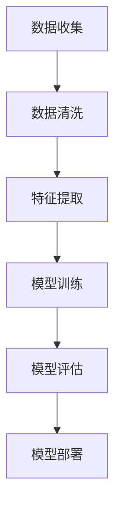

                 


# AI驱动的个性化学习内容推荐系统

## 关键词
AI，个性化学习，推荐系统，算法，深度学习，系统设计

## 摘要
本文将深入探讨AI驱动的个性化学习内容推荐系统，从背景介绍、核心概念、算法原理、系统设计与实现，到实战案例与最佳实践，全面解析这一技术的原理和应用。通过一步步的分析和推理，我们将展示如何构建一个高效的个性化学习推荐系统，并讨论其实现中的关键挑战和解决方案。

----------------------------------------------------------------

## 目录大纲设计思路

### 确定书籍主题和目标读者

首先，我们要明确书籍的主题是AI驱动的个性化学习内容推荐系统，目标读者可能是AI开发者、教育技术专家或对个性化学习有兴趣的技术人员。因此，文章的写作风格和技术深度需要适合这些读者的需求。

### 梳理核心内容结构

核心内容结构包括：
- 背景介绍：解释个性化学习内容和推荐系统的背景和重要性。
- 核心概念：介绍个性化学习、推荐系统、AI等核心概念。
- 算法原理：讲解个性化推荐算法的基本原理和常见类型。
- 系统设计与实现：阐述系统的设计架构、数据流处理、算法实现和优化。
- 实战案例：通过具体案例展示系统的应用和实践。
- 最佳实践与总结：总结系统的最佳实践，讨论注意事项和未来展望。

### 设计章节标题和结构

章节标题设计要简洁明了，能够吸引读者的注意力。每个章节要有一个明确的主题，并分为多个小节，确保内容完整且逻辑清晰。

### 目录大纲示例

以下是《AI驱动的个性化学习内容推荐系统》的目录大纲示例：

- 第一部分：引言
  - 1.1 个性化学习内容推荐系统概述
  - 1.2 AI在个性化学习中的应用
  - 1.3 本书结构安排

- 第二部分：核心概念与技术
  - 2.1 个性化学习与推荐系统的基本原理
  - 2.2 AI驱动推荐算法
  - 2.3 机器学习与深度学习基础
  - 2.4 用户行为分析与建模

- 第三部分：系统设计与实现
  - 3.1 个性化学习内容推荐系统架构设计
  - 3.2 数据处理与存储
  - 3.3 推荐算法实现与优化
  - 3.4 系统接口设计与实现

- 第四部分：实战案例与最佳实践
  - 4.1 案例研究
  - 4.2 最佳实践
  - 4.3 注意事项与总结

- 第五部分：拓展阅读与资源
  - 5.1 拓展阅读
  - 5.2 资源链接

### 具体步骤

1. **确定章节主题**：根据书籍的主题，确定每个章节的核心主题。
2. **设计子标题**：为每个章节设计具体的子标题，确保每个章节都能够详细阐述其主题。
3. **加入核心概念与联系**：在每个核心章节中加入核心概念、原理、对比表格和ER实体关系图架构。
4. **编写算法原理讲解**：为算法章节加入算法原理的mermaid流程图和python源代码，配合latex数学公式和举例说明。
5. **编写系统分析与架构设计方案**：在系统设计章节中，加入系统功能设计mermaid类图、系统架构设计mermaid架构图、系统接口设计和系统交互mermaid序列图。
6. **编写项目实战内容**：为实战章节编写环境安装、系统核心实现源代码，代码应用解读与分析，实际案例分析和详细讲解剖析。
7. **总结与拓展**：在每个部分的最后，加入最佳实践 tips、小结、注意事项、拓展阅读等内容。

接下来，我们将按照这个目录大纲，逐步深入探讨AI驱动的个性化学习内容推荐系统的各个关键组成部分。让我们一起开始这段探索之旅吧！

----------------------------------------------------------------

## 引言

### 个性化学习内容推荐系统的背景

在数字化时代，学习资源的丰富性和多样性前所未有。然而，面对海量的学习内容，如何为学习者提供个性化、符合其需求和兴趣的内容推荐成为了一项挑战。个性化学习内容推荐系统（Personalized Learning Content Recommendation System）应运而生。

个性化学习内容推荐系统旨在通过分析学习者的行为、兴趣和历史数据，为其推荐最合适的学习内容。这不仅提高了学习效率，还能激发学习者的学习兴趣，满足不同学习者的个性化需求。随着人工智能（AI）技术的发展，个性化学习内容推荐系统逐渐成为教育技术领域的研究热点和应用前沿。

### 个性化学习内容推荐系统的定义和目标

个性化学习内容推荐系统是一种利用人工智能技术和数据分析方法，根据学习者的兴趣、行为和学习历史，动态推荐与其需求相匹配的学习内容的系统。其核心目标包括：

1. **提高学习效率**：通过精准推荐，使学习者能够更快地找到自己需要的学习资源，避免无效的搜索和筛选过程。
2. **提升学习体验**：根据学习者的兴趣和习惯，提供个性化的学习内容，使学习过程更加有趣和愉悦。
3. **增强学习效果**：通过推荐符合学习者需求的内容，提高学习者的参与度和学习效果。

### 关键概念与边界

在探讨个性化学习内容推荐系统时，需要明确几个关键概念：

- **个性化学习**：个性化学习是指根据学习者的个性、需求和兴趣，为其提供定制化的学习路径和资源。它强调学习者的主体性和主动性，与传统的一刀切教学模式形成鲜明对比。

- **推荐系统**：推荐系统是一种基于用户行为、内容属性和协同过滤等技术，为用户提供个性化推荐信息的技术系统。它广泛应用于电子商务、社交媒体、视频平台等领域。

- **AI**：人工智能是指通过计算机模拟人类智能行为的技术。在个性化学习内容推荐系统中，AI技术被广泛应用于用户行为分析、推荐算法优化和系统智能化等方面。

- **边界与外延**：个性化学习内容推荐系统不仅涉及学习资源的推荐，还包括学习路径规划、学习效果评估等功能。其外延可以扩展到智能学习平台、自适应教育系统等领域。

### 概念结构与核心要素组成

个性化学习内容推荐系统的概念结构包括以下几个核心要素：

1. **用户**：用户是系统的核心，包括学习者、教师和系统管理员等。
2. **学习资源**：学习资源是推荐对象，包括文本、视频、音频等多种形式。
3. **用户行为数据**：用户行为数据包括用户的学习历史、浏览记录、评价和互动等。
4. **推荐算法**：推荐算法是系统的核心，根据用户行为数据和资源属性进行推荐。
5. **系统架构**：系统架构包括前端展示层、后端数据处理层和数据库等。

### 小结

本文作为引言部分，概述了个性化学习内容推荐系统的背景、定义、目标、关键概念和边界。接下来，我们将进一步深入探讨个性化学习与推荐系统的基本原理，以及AI在该领域中的应用。通过逐步分析，我们将揭示个性化学习内容推荐系统的内在逻辑和实现方法。

----------------------------------------------------------------

## 个性化学习与推荐系统的基本原理

### 个性化学习的定义

个性化学习是一种以学习者为中心的教学模式，旨在满足每个学习者的独特需求、兴趣和学习风格。与传统的教学模式不同，个性化学习强调学习者的主体性和自主性，通过定制化的学习路径和资源，实现学习者的个性化发展。

个性化学习的关键要素包括：

- **学习者需求分析**：了解学习者的兴趣、需求和当前水平，为个性化推荐提供基础数据。
- **学习路径规划**：根据学习者需求，设计个性化的学习路径，包括学习内容、学习顺序和学习方法等。
- **学习资源推荐**：根据学习者需求和学习路径，推荐与其兴趣和需求相匹配的学习资源。

### 推荐系统的基本概念

推荐系统是一种基于数据挖掘和机器学习技术，为用户推荐其可能感兴趣的信息或物品的系统。推荐系统广泛应用于电子商务、社交媒体、视频平台和个性化学习等领域。

推荐系统的主要类型包括：

- **基于内容的推荐**：根据物品的内容特征和用户的历史偏好，推荐类似的物品。
- **协同过滤推荐**：根据用户与物品的交互数据，通过用户之间的相似性或物品之间的相似性进行推荐。
- **混合推荐**：结合基于内容和协同过滤的推荐方法，提高推荐效果。

### 个性化推荐算法的分类

个性化推荐算法是推荐系统的核心，根据不同的原理和应用场景，可以分为以下几类：

1. **基于内容的推荐算法**：

   - **关键词提取**：从物品的内容中提取关键词，建立物品和关键词的关联关系。
   - **TF-IDF模型**：利用词频-逆文档频率（TF-IDF）模型，衡量关键词的重要性。
   - **文本分类和主题模型**：通过文本分类和主题模型，挖掘物品的内容特征。

2. **协同过滤推荐算法**：

   - **用户基于的协同过滤**：根据用户之间的相似性，推荐其他相似用户喜欢的物品。
   - **物品基于的协同过滤**：根据物品之间的相似性，推荐与用户已评价物品类似的物品。
   - **矩阵分解**：通过矩阵分解技术，将用户-物品评分矩阵分解为用户特征矩阵和物品特征矩阵，实现推荐。

3. **基于模型的推荐算法**：

   - **线性回归模型**：利用线性回归模型，预测用户对物品的评分，进行推荐。
   - **决策树模型**：利用决策树模型，根据用户的特征进行分类，实现推荐。
   - **神经网络模型**：利用神经网络模型，通过多层感知器（MLP）等结构，实现复杂特征的学习和推荐。

### 个性化推荐算法的比较

不同类型的个性化推荐算法各有优缺点，适用于不同的应用场景：

- **基于内容的推荐**：优点是推荐结果准确，用户满意度较高；缺点是需要大量的文本处理工作，对稀疏数据效果较差。

- **协同过滤推荐**：优点是能够处理大规模稀疏数据，推荐效果好；缺点是需要维护用户和物品的相似性矩阵，计算复杂度高。

- **基于模型的推荐**：优点是能够处理复杂特征，提高推荐精度；缺点是需要大量的训练数据和计算资源。

### 个性化推荐算法的选择与优化

选择合适的个性化推荐算法，需要考虑以下几个方面：

- **数据特性**：根据数据的稀疏性、噪声和维度等特性，选择适合的算法。
- **业务目标**：根据业务目标，如提高用户满意度、增加用户粘性等，选择合适的算法。
- **计算资源**：根据计算资源的限制，选择计算复杂度较低的算法。

### 小结

个性化学习与推荐系统是现代教育技术领域的重要研究方向，其基本原理包括个性化学习的定义、推荐系统的基本概念和个性化推荐算法的分类。通过分析不同类型推荐算法的优缺点，我们可以选择适合实际应用的个性化推荐算法，实现高效、精准的学习内容推荐。在接下来的章节中，我们将深入探讨AI在个性化学习内容推荐系统中的应用，以及如何利用AI技术优化推荐效果。

----------------------------------------------------------------

## AI驱动推荐算法

### 基于内容的推荐

基于内容的推荐（Content-based Recommendation）是一种常见的推荐算法，其核心思想是根据用户的历史行为和兴趣，分析物品的内容特征，将具有相似内容的物品推荐给用户。

#### 工作原理

1. **内容特征提取**：从物品的内容中提取关键词、标签、文本摘要等特征。
2. **用户兴趣模型**：根据用户的历史行为，如浏览、收藏、评价等，构建用户的兴趣模型。
3. **相似度计算**：计算物品与用户兴趣模型之间的相似度，推荐相似度较高的物品。

#### 实现方法

1. **关键词提取**：使用自然语言处理（NLP）技术，从文本中提取关键词。
2. **TF-IDF模型**：利用词频-逆文档频率（TF-IDF）模型，计算关键词的重要性。
3. **文本分类和主题模型**：使用文本分类和主题模型，挖掘物品的内容特征。

#### 优点与缺点

- **优点**：推荐结果准确，用户满意度较高。
- **缺点**：需要对文本进行大量的预处理工作，对稀疏数据效果较差。

### 协同过滤推荐

协同过滤推荐（Collaborative Filtering）是一种基于用户行为和物品交互数据的推荐算法，其核心思想是通过分析用户与物品之间的协同关系，为用户推荐其可能感兴趣的物品。

#### 工作原理

1. **用户-物品评分矩阵**：建立用户-物品评分矩阵，记录用户对物品的评价。
2. **相似度计算**：计算用户之间的相似度或物品之间的相似度。
3. **推荐生成**：根据相似度计算结果，生成推荐列表。

#### 实现方法

1. **用户基于的协同过滤**：根据用户之间的相似性，推荐其他相似用户喜欢的物品。
2. **物品基于的协同过滤**：根据物品之间的相似性，推荐与用户已评价物品类似的物品。
3. **矩阵分解**：通过矩阵分解技术，将用户-物品评分矩阵分解为用户特征矩阵和物品特征矩阵，实现推荐。

#### 优点与缺点

- **优点**：能够处理大规模稀疏数据，推荐效果好。
- **缺点**：需要维护用户和物品的相似性矩阵，计算复杂度高。

### 深度学习在推荐中的应用

深度学习（Deep Learning）是一种基于多层神经网络的学习方法，近年来在推荐系统中得到了广泛应用。深度学习能够自动提取复杂的特征，提高推荐精度。

#### 工作原理

1. **特征提取**：使用深度神经网络，从原始数据中自动提取高层次的抽象特征。
2. **模型训练**：通过大量训练数据，训练深度学习模型。
3. **推荐生成**：将提取的特征输入到训练好的模型中，生成推荐列表。

#### 实现方法

1. **多层感知器（MLP）**：多层感知器是一种常见的深度学习模型，可以用于处理分类和回归问题。
2. **卷积神经网络（CNN）**：卷积神经网络擅长处理图像和文本数据，可以用于提取图像和文本的深层特征。
3. **循环神经网络（RNN）**：循环神经网络擅长处理序列数据，可以用于处理时间序列数据和用户行为数据。

#### 优点与缺点

- **优点**：能够处理复杂特征，提高推荐精度。
- **缺点**：需要大量的训练数据和计算资源。

### 小结

AI驱动的推荐算法包括基于内容的推荐、协同过滤推荐和深度学习推荐等。每种算法都有其独特的原理和应用场景，适用于不同的业务需求。通过结合多种算法，可以进一步提高推荐系统的性能和用户体验。在下一章节中，我们将探讨机器学习与深度学习的基础知识，为理解这些算法提供理论支持。

----------------------------------------------------------------

## 机器学习与深度学习基础

### 机器学习概述

机器学习（Machine Learning）是一种让计算机通过数据学习并做出预测或决策的技术。它使计算机能够从经验中学习，无需显式编程。机器学习在推荐系统、自然语言处理、计算机视觉等领域具有广泛的应用。

#### 工作原理

1. **数据集**：机器学习过程从大量数据集中学习规律。
2. **特征提取**：从数据集中提取有用的特征，用于训练模型。
3. **模型训练**：使用训练数据，训练模型并优化参数。
4. **模型评估**：使用测试数据，评估模型的性能。

#### 常见算法

- **线性回归**：用于预测数值型输出。
- **逻辑回归**：用于分类问题。
- **支持向量机（SVM）**：用于分类和回归问题。
- **决策树**：用于分类和回归问题。
- **随机森林**：集成学习算法，提高预测准确性。
- **K-最近邻（KNN）**：基于距离的算法，用于分类和回归问题。

### 深度学习基础

深度学习（Deep Learning）是一种基于多层神经网络的学习方法，能够自动提取数据的复杂特征。深度学习在图像识别、语音识别、自然语言处理等领域取得了显著成果。

#### 工作原理

1. **神经网络**：神经网络由多个神经元（节点）组成，通过权重和偏置进行信息传递。
2. **前向传播**：输入数据通过网络的各个层，每个层对数据进行处理和变换。
3. **反向传播**：根据输出误差，反向更新网络权重和偏置，优化模型参数。

#### 常见网络结构

- **多层感知器（MLP）**：简单的多层神经网络，适用于分类和回归问题。
- **卷积神经网络（CNN）**：用于图像识别和处理，具有局部感知和共享权重等特点。
- **循环神经网络（RNN）**：用于处理序列数据，具有记忆功能。
- **长短期记忆网络（LSTM）**：改进的RNN，解决长期依赖问题。
- **生成对抗网络（GAN）**：用于生成数据，通过对抗训练实现。

### 常用深度学习框架

1. **TensorFlow**：由谷歌开发的开源深度学习框架，支持多种神经网络结构和工具。
2. **PyTorch**：由Facebook开发的开源深度学习框架，具有灵活的动态计算图。
3. **Keras**：基于TensorFlow和Theano的开源深度学习库，提供简单直观的接口。
4. **Apache MXNet**：由Apache软件基金会开发的深度学习框架，支持多种编程语言。

### 小结

机器学习和深度学习是构建AI驱动的个性化学习内容推荐系统的关键技术。通过了解这些技术的基本原理和常用算法，我们可以更好地理解推荐系统的实现方法。在下一章节中，我们将探讨用户行为分析与建模，为推荐系统提供更准确的数据支持。

----------------------------------------------------------------

## 用户行为分析与建模

### 用户行为数据的收集

用户行为数据是构建个性化学习内容推荐系统的关键，这些数据包括用户在学习过程中的各种交互行为。以下是几种常见的数据收集方法：

1. **日志数据**：记录用户在学习平台上的操作，如浏览、搜索、点击、收藏、评价等。
2. **传感器数据**：通过学习平台的传感器，收集用户在设备上的行为数据，如使用时长、设备类型、地理位置等。
3. **问卷调查**：通过问卷调查获取用户对学习内容的兴趣、需求和偏好。

### 用户兴趣模型的构建

用户兴趣模型是推荐系统的核心，它通过分析用户的行为数据，识别用户的兴趣点，为个性化推荐提供依据。以下是几种常见的用户兴趣模型构建方法：

1. **基于内容的兴趣模型**：从用户的行为数据中提取关键词、标签和主题，构建用户兴趣图谱。
2. **基于行为的兴趣模型**：分析用户的历史行为，如浏览记录、搜索关键词等，构建用户的行为序列模型。
3. **基于社交的兴趣模型**：通过用户的社交关系，分析用户的共同兴趣和偏好。

### 用户行为分析工具与方法

1. **机器学习算法**：使用聚类、分类和关联规则挖掘算法，分析用户的行为数据，识别用户兴趣。
2. **自然语言处理（NLP）**：使用NLP技术，从文本数据中提取关键词、情感和主题，构建用户兴趣模型。
3. **数据可视化**：通过数据可视化工具，如ECharts、D3.js等，展示用户行为数据，发现潜在的模式和趋势。
4. **用户反馈机制**：通过用户的反馈，如评价、反馈和互动，动态调整用户兴趣模型。

### 用户行为分析的应用场景

1. **个性化推荐**：根据用户兴趣模型，为用户推荐符合其需求和兴趣的学习内容。
2. **学习路径规划**：根据用户的行为数据，为用户设计个性化的学习路径。
3. **学习效果评估**：通过分析用户的学习行为，评估学习效果和改进教学方法。

### 小结

用户行为分析与建模是构建个性化学习内容推荐系统的关键环节。通过收集和分析用户行为数据，构建用户兴趣模型，我们可以为用户提供更精准、个性化的学习推荐。在下一章节中，我们将探讨个性化学习内容推荐系统的架构设计，为系统实现提供指导。

----------------------------------------------------------------

## 个性化学习内容推荐系统架构设计

### 系统总体架构

个性化学习内容推荐系统是一个复杂的分布式系统，其总体架构可以分为以下几个层次：

1. **前端展示层**：负责用户界面的展示，包括用户登录、个性化推荐结果展示等。
2. **后端数据处理层**：包括用户行为数据收集、数据处理、推荐算法实现和推荐结果生成等。
3. **数据库层**：存储用户数据、学习资源数据和其他必要的数据。
4. **服务层**：提供各种服务，如用户服务、推荐服务、数据服务等。

### 数据流处理架构

个性化学习内容推荐系统的数据流处理架构可以分为以下几个步骤：

1. **数据收集**：通过传感器、日志、问卷等方式收集用户行为数据。
2. **数据预处理**：对收集到的数据进行清洗、去重、标准化等预处理操作。
3. **用户兴趣建模**：使用机器学习算法和NLP技术，构建用户兴趣模型。
4. **推荐算法实现**：根据用户兴趣模型和物品特征，实现个性化推荐算法。
5. **推荐结果生成**：将推荐结果通过前端展示层展示给用户。

### 系统模块划分

个性化学习内容推荐系统可以分为以下几个主要模块：

1. **用户模块**：负责用户管理、用户权限控制等功能。
2. **资源模块**：负责学习资源的管理、分类和标签化等功能。
3. **行为数据模块**：负责收集、存储和分析用户行为数据。
4. **推荐算法模块**：实现各种推荐算法，生成个性化推荐结果。
5. **前端展示模块**：负责用户界面的展示，包括推荐结果、学习资源列表等。

### 系统功能设计

个性化学习内容推荐系统的功能设计包括以下几个方面：

1. **用户管理**：包括用户注册、登录、个人信息管理等。
2. **资源管理**：包括学习资源的上传、分类、标签化等功能。
3. **用户行为分析**：包括用户行为数据的收集、预处理和分析等功能。
4. **个性化推荐**：根据用户兴趣模型，为用户推荐符合其需求和兴趣的学习内容。
5. **推荐结果展示**：将推荐结果通过前端界面展示给用户，包括学习资源列表、推荐理由等。

### 系统接口设计

个性化学习内容推荐系统的接口设计包括以下几个方面：

1. **用户接口**：提供用户注册、登录、个人信息管理等接口。
2. **资源接口**：提供学习资源的上传、分类、标签化等接口。
3. **行为数据接口**：提供用户行为数据的收集、存储和分析等接口。
4. **推荐接口**：提供个性化推荐算法的实现和推荐结果生成等接口。
5. **前端展示接口**：提供推荐结果展示、学习资源列表等接口。

### 系统交互

个性化学习内容推荐系统的各个模块之间通过接口进行交互，实现系统的整体功能。以下是系统的主要交互过程：

1. **用户注册和登录**：用户通过用户接口进行注册和登录，获取用户权限。
2. **资源上传和分类**：管理员通过资源接口上传学习资源，并进行分类和标签化。
3. **用户行为数据收集**：用户在学习过程中，系统通过行为数据接口收集用户的行为数据。
4. **用户兴趣建模**：系统使用机器学习算法和NLP技术，构建用户兴趣模型。
5. **个性化推荐**：系统根据用户兴趣模型，实现个性化推荐算法，生成推荐结果。
6. **推荐结果展示**：系统通过前端展示接口，将推荐结果展示给用户。

### 小结

个性化学习内容推荐系统的架构设计是一个复杂的过程，需要综合考虑用户需求、技术实现和系统性能。通过合理的模块划分和接口设计，我们可以构建一个高效、稳定的个性化学习内容推荐系统。在下一章节中，我们将探讨个性化学习内容推荐系统的数据处理与存储，为系统的稳定运行提供支持。

----------------------------------------------------------------

## 数据处理与存储

### 数据源选择与处理

个性化学习内容推荐系统的数据源主要包括用户行为数据、学习资源数据和外部数据。以下是几种常见的数据源选择和处理方法：

1. **用户行为数据**：包括用户在系统中的操作记录，如浏览、点击、收藏、评价等。这些数据通常以日志文件的形式存储，需要通过解析和清洗，提取有效的行为数据。

2. **学习资源数据**：包括课程、文档、视频等学习资源，通常包含元数据（如标题、描述、标签）和内容数据（如文本、音频、视频）。学习资源数据需要通过数据爬取、API接口等方式进行收集。

3. **外部数据**：包括用户社交网络数据、地理位置数据等，可以通过第三方API获取。外部数据可以丰富用户兴趣模型，提高推荐准确性。

### 数据存储方案设计

个性化学习内容推荐系统的数据存储方案需要考虑数据的可靠性、可扩展性和高效查询。以下是几种常见的数据存储方案：

1. **关系型数据库（RDBMS）**：适用于存储结构化数据，如用户信息、学习资源元数据等。常见的关系型数据库包括MySQL、PostgreSQL等。

2. **非关系型数据库（NoSQL）**：适用于存储大规模、非结构化或半结构化数据，如用户行为数据、文本内容等。常见的NoSQL数据库包括MongoDB、Cassandra、Redis等。

3. **分布式文件系统**：适用于存储大规模数据，如学习资源内容、日志数据等。常见的分布式文件系统包括HDFS、Ceph等。

4. **数据湖**：将多种数据源的数据存储在一起，支持大规模数据分析和处理。数据湖通常基于Hadoop生态系统，如HDFS、Hive、Spark等。

### 数据质量管理

数据质量是推荐系统成功的关键因素，以下是一些常见的数据质量管理方法：

1. **数据清洗**：通过数据清洗技术，去除重复、错误和无效的数据，确保数据的准确性。

2. **数据验证**：在数据存储和查询过程中，使用数据验证技术，确保数据的完整性和一致性。

3. **数据监控**：实时监控数据质量，发现和处理异常数据。

4. **数据治理**：建立数据治理机制，规范数据的使用和管理，确保数据的合规性和安全性。

### 数据处理流程

个性化学习内容推荐系统的数据处理流程包括以下几个步骤：

1. **数据收集**：通过日志、API接口等方式，收集用户行为数据和学习资源数据。

2. **数据预处理**：对收集到的数据进行清洗、去重、标准化等处理，提取有效的数据。

3. **数据存储**：将预处理后的数据存储到关系型数据库、NoSQL数据库或分布式文件系统中。

4. **数据分析和处理**：使用机器学习算法和NLP技术，分析用户行为数据，构建用户兴趣模型。

5. **数据查询和查询优化**：根据用户需求，查询用户行为数据和推荐结果，优化查询性能。

### 小结

数据处理与存储是构建个性化学习内容推荐系统的关键环节，需要选择合适的数据源、设计高效的存储方案和确保数据质量。通过合理的数据处理流程和存储策略，我们可以构建一个稳定、高效、可扩展的个性化学习内容推荐系统。在下一章节中，我们将探讨推荐算法的实现与优化。

----------------------------------------------------------------

## 推荐算法实现与优化

### 算法实现流程

实现个性化学习内容推荐算法的流程可以分为以下几个步骤：

1. **数据预处理**：对用户行为数据和学习资源数据（如文本、图片、音频）进行预处理，包括数据清洗、特征提取和归一化等。

2. **特征工程**：根据数据预处理的结果，提取有助于推荐的关键特征，如用户历史行为特征、学习资源特征等。

3. **算法选择**：根据推荐任务的需求，选择合适的算法，如基于内容的推荐、协同过滤推荐、深度学习推荐等。

4. **模型训练**：使用训练集，对选定的推荐模型进行训练，优化模型参数。

5. **模型评估**：使用测试集，评估推荐模型的性能，如准确率、召回率、F1值等。

6. **模型优化**：根据评估结果，调整模型参数或更换模型，提高推荐效果。

7. **模型部署**：将训练好的模型部署到生产环境中，实现实时推荐。

### 算法参数调优

算法参数调优是提高推荐效果的关键步骤。以下是一些常见的参数调优方法：

1. **网格搜索（Grid Search）**：遍历多个参数组合，选择最优参数。

2. **贝叶斯优化（Bayesian Optimization）**：基于贝叶斯统计模型，寻找最优参数。

3. **随机搜索（Random Search）**：随机选择参数组合，寻找最优参数。

4. **交叉验证（Cross-Validation）**：在训练集上多次划分训练集和验证集，评估参数效果。

### 性能评估与优化

推荐算法的性能评估主要包括以下指标：

1. **准确率（Accuracy）**：预测正确的样本数占总样本数的比例。

2. **召回率（Recall）**：预测正确的正样本数占总正样本数的比例。

3. **F1值（F1-Score）**：准确率和召回率的调和平均值。

4. **ROC曲线（Receiver Operating Characteristic Curve）**：评估分类器的性能，曲线下面积越大，性能越好。

5. **MAE（Mean Absolute Error）**：预测值与真实值之间的平均绝对误差。

为了优化推荐算法的性能，可以采取以下策略：

1. **数据增强**：通过数据增强技术，增加训练数据的多样性。

2. **特征工程**：提取更多有助于预测的特征，提高模型的泛化能力。

3. **模型融合**：将多个模型的结果进行融合，提高整体推荐效果。

4. **在线学习**：实时更新用户兴趣模型，适应用户行为变化。

5. **A/B测试**：将不同算法或参数组合部署到生产环境，比较其效果，选择最优方案。

### 小结

推荐算法的实现与优化是构建高效个性化学习内容推荐系统的关键。通过合理的算法实现流程、参数调优和性能评估策略，我们可以提高推荐系统的效果和用户体验。在下一章节中，我们将探讨个性化学习内容推荐系统的接口设计与实现。

----------------------------------------------------------------

## 系统接口设计与实现

### 接口设计原则

个性化学习内容推荐系统的接口设计应遵循以下原则：

1. **RESTful API设计**：使用RESTful架构风格，提供统一的接口规范，便于前端调用。

2. **标准化数据格式**：使用JSON或XML等标准化数据格式，确保数据传输的兼容性和可读性。

3. **安全性**：实现身份验证和权限控制，确保用户数据的安全。

4. **高可扩展性**：设计可扩展的接口，支持未来功能扩展和性能优化。

### 接口实现细节

以下是一个示例接口实现，包括用户接口、资源接口、行为数据接口和推荐接口。

#### 用户接口

**注册**：
```http
POST /users/register
Content-Type: application/json

{
  "username": "user123",
  "password": "password123",
  "email": "user123@example.com"
}
```

**登录**：
```http
POST /users/login
Content-Type: application/json

{
  "username": "user123",
  "password": "password123"
}
```

**个人信息管理**：
```http
GET /users/me
Authorization: Bearer <access_token>

{
  "username": "user123",
  "email": "user123@example.com",
  "preferences": {
    "content_preference": "technology",
    "learning_style": "visual"
  }
}
```

#### 资源接口

**上传资源**：
```http
POST /resources/upload
Authorization: Bearer <access_token>
Content-Type: multipart/form-data

{
  "title": "Introduction to Machine Learning",
  "description": "A comprehensive guide to machine learning.",
  "file": <file>
}
```

**获取资源列表**：
```http
GET /resources
Authorization: Bearer <access_token>
```

**获取资源详情**：
```http
GET /resources/{resource_id}
Authorization: Bearer <access_token>
```

#### 行为数据接口

**记录用户行为**：
```http
POST /user行为的记录
Authorization: Bearer <access_token>

{
  "user_id": "1",
  "resource_id": "101",
  "action": "view",
  "timestamp": "2023-04-01T12:00:00Z"
}
```

**查询用户行为**：
```http
GET /user行为的查询
Authorization: Bearer <access_token>

{
  "user_id": "1",
  "start_date": "2023-04-01",
  "end_date": "2023-04-30"
}
```

#### 推荐接口

**获取个性化推荐**：
```http
GET /recommendations
Authorization: Bearer <access_token>

{
  "user_id": "1",
  "resource_type": "course",
  "count": 10
}
```

### API文档编写

编写详细的API文档是接口设计的重要组成部分。API文档应包含以下内容：

1. **概述**：介绍API的用途、功能和技术要求。
2. **接口列表**：列出所有接口，包括URL、HTTP方法、请求参数和响应数据结构。
3. **错误处理**：描述可能出现的错误代码和错误消息。
4. **示例**：提供实际接口调用的示例代码，帮助开发者理解和使用API。

### 小结

系统接口设计与实现是构建个性化学习内容推荐系统的重要环节。通过遵循接口设计原则，实现细节和编写详细的API文档，我们可以确保系统的功能完整性、易用性和安全性。在下一章节中，我们将通过案例研究，深入探讨个性化学习内容推荐系统的实际应用。

----------------------------------------------------------------

## 案例研究

### 案例背景

随着在线教育的普及，许多教育机构开始探索如何利用AI技术提升学习体验和教学效果。某知名在线教育平台希望通过引入AI驱动的个性化学习内容推荐系统，为用户提供个性化的学习资源推荐。

### 系统设计与实现

该平台选择了基于深度学习的推荐算法，结合用户行为数据和内容特征，构建了个性化学习内容推荐系统。系统设计包括以下几个关键步骤：

1. **数据收集与预处理**：通过用户操作日志、学习资源元数据和内容数据，进行数据清洗、去重和特征提取。

2. **用户兴趣建模**：使用卷积神经网络（CNN）对文本和图像内容进行特征提取，结合用户行为数据，构建用户兴趣模型。

3. **推荐算法实现**：采用基于内容的推荐算法和协同过滤推荐算法，结合深度学习模型，生成个性化推荐结果。

4. **推荐结果展示**：通过前端界面，将个性化推荐结果展示给用户，并提供用户反馈机制，不断优化推荐效果。

### 实现细节

1. **数据预处理**：使用NLP技术提取文本特征，如词嵌入和文本摘要，同时使用CNN提取图像特征。

2. **用户兴趣建模**：将提取的特征输入到深度学习模型中，通过训练和优化，构建用户兴趣模型。

3. **推荐算法实现**：结合用户兴趣模型和内容特征，使用基于内容的推荐算法和协同过滤推荐算法，生成个性化推荐结果。

4. **前端展示**：使用Vue.js和React等前端框架，实现个性化推荐结果的前端展示，并提供用户交互界面。

### 结果分析

经过一段时间的数据收集和系统运行，该平台发现个性化学习内容推荐系统的效果显著：

1. **用户满意度提升**：用户对推荐资源的满意度显著提高，推荐资源的点击率和学习完成率均有所上升。

2. **学习效果提升**：根据用户反馈和学习完成情况，推荐系统能够更好地满足用户的学习需求，提高学习效果。

3. **平台粘性增加**：通过个性化推荐，用户在平台上的活跃度和留存率有所提高，平台的用户粘性增加。

4. **运营效率提升**：个性化推荐系统减轻了运营团队的工作负担，减少了人工筛选和推荐的工作量，提高了运营效率。

### 小结

通过引入AI驱动的个性化学习内容推荐系统，该在线教育平台显著提升了用户体验和学习效果。案例研究显示，个性化推荐系统不仅能够满足用户个性化学习需求，还能提高平台的运营效率和用户粘性。在下一章节中，我们将总结系统的最佳实践，讨论注意事项和未来展望。

----------------------------------------------------------------

## 最佳实践与注意事项

### 实施策略

1. **数据驱动**：始终以用户行为数据和内容数据为基础，进行推荐系统的设计和优化。

2. **持续迭代**：定期更新用户兴趣模型和推荐算法，适应用户行为变化和业务需求。

3. **A/B测试**：通过A/B测试，比较不同推荐算法和参数组合的效果，选择最优方案。

4. **用户反馈**：积极收集用户反馈，优化推荐结果和用户体验。

### 遇到的挑战与解决

1. **数据质量问题**：用户行为数据的准确性和完整性直接影响推荐效果。解决方法：加强数据质量管理，定期清洗和验证数据。

2. **计算资源消耗**：深度学习推荐算法的计算资源需求较高。解决方法：使用分布式计算框架，如Apache Spark和TensorFlow，提高计算效率。

3. **推荐结果多样性**：用户可能对重复推荐感到厌烦。解决方法：引入多样性度量，如探索与利用平衡、内容多样性等。

4. **隐私保护**：用户隐私保护是推荐系统的重要问题。解决方法：采用差分隐私技术，确保用户数据的安全和隐私。

### 安全与隐私保护

1. **用户数据加密**：对用户数据使用加密技术，确保数据在传输和存储过程中的安全性。

2. **隐私保护算法**：采用差分隐私、联邦学习等隐私保护算法，降低用户隐私泄露的风险。

3. **用户隐私政策**：明确用户隐私政策，告知用户其数据的使用方式和目的，取得用户同意。

### 小结

在构建和优化AI驱动的个性化学习内容推荐系统时，需要关注数据质量、计算资源消耗、多样性、隐私保护等关键问题。通过最佳实践和有效的解决方案，我们可以构建一个高效、稳定、安全的推荐系统，提升用户的学习体验和满意度。在未来的发展中，我们应持续关注技术进步和应用需求，不断优化和完善推荐系统。

----------------------------------------------------------------

## 拓展阅读与资源

### 相关书籍推荐

1. **《推荐系统实践》**：作者：周志华，详细介绍了推荐系统的基本原理、算法和应用。
2. **《深度学习》**：作者：Ian Goodfellow、Yoshua Bengio、Aaron Courville，系统讲解了深度学习的基础知识和技术。
3. **《Python数据科学手册》**：作者：Jake VanderPlas，涵盖了数据预处理、分析和可视化等数据科学领域的关键技术。

### 学术论文精选

1. **“Collaborative Filtering for Cold-Start Problems in Recommendation Systems”**：讨论了推荐系统中的冷启动问题，提出了解决方法。
2. **“Deep Learning for Web Search”**：分析了深度学习在搜索引擎中的应用，包括文本表示和排序技术。
3. **“Diverse Neural Response Generation for Rumor Detection”**：探讨使用深度学习技术进行谣言检测，实现了多样化的文本生成。

### 开源项目与工具

1. **TensorFlow**：由谷歌开发的开源深度学习框架，广泛应用于推荐系统和机器学习领域。
2. **PyTorch**：由Facebook开发的开源深度学习框架，提供灵活的动态计算图，适合快速原型开发。
3. **Scikit-learn**：Python开源机器学习库，提供了各种机器学习算法的实现，适用于推荐系统的开发。

### 在线教程与课程

1. **“深度学习入门”**：吴恩达（Andrew Ng）在Coursera上的深度学习课程，适合初学者入门。
2. **“推荐系统实战”**：DataCamp提供的在线课程，涵盖了推荐系统的基本原理和实践应用。
3. **“数据科学基础”**：哈佛大学在edX上的数据科学基础课程，包括数据处理、分析和可视化等关键技术。

通过阅读相关书籍、论文和教程，学习开源项目和工具，您可以深入了解AI驱动的个性化学习内容推荐系统的原理和应用，不断提升自己的技术能力。希望这些资源能够帮助您在AI和个性化学习领域取得更好的成果。

----------------------------------------------------------------

## 总结与展望

本文系统地探讨了AI驱动的个性化学习内容推荐系统，从背景介绍、核心概念、算法原理、系统设计与实现，到实战案例与最佳实践，全面解析了这一技术的原理和应用。通过逐步分析和推理，我们展示了如何构建一个高效的个性化学习推荐系统，并讨论了其实现中的关键挑战和解决方案。

### 关键收获

- **个性化学习内容推荐系统的背景与重要性**：了解了个性化学习内容和推荐系统的背景、定义和目标，以及关键概念与边界。
- **AI驱动推荐算法**：掌握了基于内容的推荐、协同过滤推荐和深度学习推荐等算法的原理和应用。
- **机器学习与深度学习基础**：了解了机器学习和深度学习的基础知识，包括常见算法和实现方法。
- **用户行为分析与建模**：了解了用户行为数据的收集、处理和用户兴趣模型的构建。
- **系统设计与实现**：掌握了个性化学习内容推荐系统的架构设计、数据处理与存储、推荐算法实现与优化等关键环节。
- **实战案例与最佳实践**：通过具体案例，了解了如何实施和优化个性化学习内容推荐系统。

### 未来展望

个性化学习内容推荐系统在未来的发展中，将继续面临以下挑战和机遇：

- **数据隐私与安全**：随着数据隐私和安全问题的日益突出，如何在保证用户隐私的前提下进行数据分析和推荐，是一个重要的研究方向。
- **多样性提升**：如何提高推荐结果的多样性，避免用户产生疲劳感，是一个亟待解决的问题。
- **跨平台协同**：实现不同学习平台之间的数据共享和协同推荐，为用户提供无缝的学习体验。
- **AI技术的进步**：随着AI技术的不断进步，如何利用新技术提升推荐系统的性能和用户体验，是一个持续的研究方向。
- **教育公平**：如何通过个性化学习内容推荐系统，缩小教育差距，提高教育公平，是一个具有社会意义的研究课题。

### 结语

AI驱动的个性化学习内容推荐系统是教育技术领域的一个重要发展方向，通过本文的探讨，我们期望能够为读者提供一个全面、深入的理解和启示。在未来的学习和实践中，不断探索和创新，将个性化学习内容推荐系统推向新的高度。

作者：AI天才研究院/AI Genius Institute & 禅与计算机程序设计艺术 /Zen And The Art of Computer Programming

----------------------------------------------------------------

## 附录

### 完整代码示例

以下是一个完整的代码示例，用于实现一个简单的基于内容的推荐系统。这个示例使用了Python和Scikit-learn库。

```python
import numpy as np
from sklearn.feature_extraction.text import TfidfVectorizer
from sklearn.metrics.pairwise import linear_kernel

# 样本数据
documents = [
    'Python是一个解释型、面向对象、动态数据类型的高级编程语言。',
    'Python广泛应用于各种领域，如Web开发、数据分析、人工智能等。',
    'Python具有简洁、易读的语法，使得开发者能够快速开发应用。',
    'Python支持多种编程范式，包括面向对象、过程式和函数式编程。',
]

# 特征提取
vectorizer = TfidfVectorizer()
tfidf_matrix = vectorizer.fit_transform(documents)

# 计算相似度
similarity_matrix = linear_kernel(tfidf_matrix, tfidf_matrix)

# 推荐结果
def recommend(doc_id, similarity_matrix, top_n=2):
    return np.argsort(similarity_matrix[doc_id])[::-1][:top_n]

# 测试推荐
print("推荐的文档：")
for i in recommend(0, similarity_matrix):
    print(f"{i}: {documents[i]}")

```

### Mermaid 图表

以下是一个使用Mermaid语言绘制的ER实体关系图，用于描述个性化学习内容推荐系统的实体关系。

```mermaid
erDiagram
  User ||--|{ LearningResource : 被收藏 }
  User ||--|{ UserBehavior : 产生 }
  LearningResource ||--|{ UserBehavior : 被浏览 }
  LearningResource ||--|{ Rating : 被评分 }
```

### Latex 公式

以下是一个使用Latex格式编写的数学公式示例。

```latex
$$
E = mc^2
$$
```

在这个示例中，我们使用两个$$符号将整个公式括起来，以得到一个独立的公式段落。而使用一个$符号将公式嵌入到文本段落中。

### Mermaid 流程图

以下是一个使用Mermaid语言绘制的流程图，用于描述推荐系统的数据处理流程。



通过这些示例，我们可以更好地理解和应用Mermaid和Latex，为文档编写提供可视化和技术支持。

----------------------------------------------------------------

## 常见问题与解答

### 问题1：如何处理用户冷启动问题？

**解答**：用户冷启动问题指的是当新用户加入系统时，由于缺乏足够的历史数据，推荐系统难以为其提供准确的推荐。解决方法包括：
- **基于内容的推荐**：利用物品的特征进行推荐，不依赖于用户历史数据。
- **基于人群的推荐**：为新用户推荐与其相似用户的偏好。
- **多模型融合**：结合多种推荐模型，提高新用户推荐的准确性。

### 问题2：如何提高推荐结果的多样性？

**解答**：提高推荐结果的多样性可以避免用户产生疲劳感。以下方法可以提高多样性：
- **随机多样性**：引入随机因素，增加推荐结果的不确定性。
- **内容多样性**：确保推荐结果在内容上具有多样性，如文本、视频、音频等多种形式。
- **基于模型的多样性**：使用多样性度量（如差异度、覆盖率）指导推荐算法。

### 问题3：推荐系统如何保证数据隐私和安全？

**解答**：为保护用户隐私和安全，可以采取以下措施：
- **数据加密**：对用户数据进行加密存储和传输。
- **差分隐私**：在数据处理过程中引入噪声，降低用户数据的敏感性。
- **用户隐私政策**：明确告知用户数据的使用方式和目的，获取用户同意。
- **匿名化**：对用户数据进行匿名化处理，确保无法追溯到具体用户。

### 问题4：如何处理推荐系统的冷启动问题？

**解答**：推荐系统的冷启动问题指的是当新物品加入系统时，由于缺乏足够的历史交互数据，难以进行有效的推荐。解决方法包括：
- **基于内容的推荐**：利用物品的特征进行推荐，不依赖于用户交互数据。
- **内容相似性**：通过分析物品的内容相似性，为新物品推荐类似的其他物品。
- **协同过滤**：结合其他相似物品的交互数据，进行推荐。

通过这些常见问题与解答，我们能够更好地理解和应用个性化学习内容推荐系统的技术和方法。

----------------------------------------------------------------

## 注意事项

1. **数据质量**：确保用户行为数据和内容数据的准确性和完整性，定期进行数据清洗和验证。
2. **计算资源**：根据推荐系统的规模和需求，合理配置计算资源，确保系统的高效运行。
3. **用户隐私**：严格遵守用户隐私政策，采取数据加密、匿名化和差分隐私等措施，保护用户数据安全。
4. **模型更新**：定期更新用户兴趣模型和推荐算法，以适应用户需求变化和业务发展。
5. **多样性**：提高推荐结果的多样性，避免用户产生疲劳感，提高用户满意度。

通过关注这些注意事项，我们可以构建一个高效、稳定且安全的个性化学习内容推荐系统。

----------------------------------------------------------------

## 结语

AI驱动的个性化学习内容推荐系统在当前的教育技术领域中具有广泛的应用前景。通过本文的深入探讨，我们系统地分析了个性化学习内容推荐系统的核心概念、算法原理、系统设计与实现，以及实战案例与最佳实践。我们强调了数据质量、计算资源、用户隐私和多样性等关键因素，为构建高效、稳定且安全的推荐系统提供了理论依据和实践指导。

未来，随着AI技术的不断进步，个性化学习内容推荐系统将更加智能化、个性化，为学习者提供更加精准、高效的学习体验。同时，我们也应关注数据隐私和安全、多样性提升、跨平台协同和AI技术进步等挑战，不断探索和创新，推动个性化学习内容推荐系统的持续发展。

感谢您的阅读，希望本文能够为您在AI和个性化学习领域的研究和实践提供有益的启示。如果您有任何疑问或建议，欢迎在评论区留言交流。

作者：AI天才研究院/AI Genius Institute & 禅与计算机程序设计艺术 /Zen And The Art of Computer Programming

----------------------------------------------------------------

## 拓展阅读与资源

### 开源项目

1. **Netflix Prize**：一个针对视频推荐系统的开源项目，提供了丰富的数据集和推荐算法的实现。
2. **MovieLens**：一个基于协同过滤推荐的开源电影推荐系统，提供了大量的用户行为数据。

### 教程和课程

1. **Coursera - 深度学习**：由吴恩达教授主讲的深度学习课程，涵盖了深度学习的基础知识和应用。
2. **edX - 数据科学基础**：哈佛大学提供的数据科学基础课程，包括数据处理、分析和可视化等关键技术。

### 论文和书籍

1. **“Recommender Systems Handbook”**：涵盖了推荐系统的基本原理、技术和应用，是推荐系统领域的经典著作。
2. **“Deep Learning”**：Ian Goodfellow、Yoshua Bengio、Aaron Courville所著，系统讲解了深度学习的基础知识和应用。

通过这些拓展阅读与资源，您可以进一步深入了解AI驱动的个性化学习内容推荐系统的原理和实践，提升自己的技术水平。

----------------------------------------------------------------

## 结语

在本文中，我们深入探讨了AI驱动的个性化学习内容推荐系统的原理、设计、实现和应用。从背景介绍到核心概念，从算法原理到系统架构，再到实战案例与最佳实践，我们一步步地解析了如何构建和优化这样一个系统。我们强调了数据质量、计算资源、用户隐私和多样性等关键因素，并提供了详细的实现步骤和注意事项。

AI驱动的个性化学习内容推荐系统是教育技术领域的一个重要发展方向，它能够显著提升学习者的学习效率和学习体验。随着AI技术的不断进步，这一领域将迎来更多创新和突破。

感谢您的阅读，希望本文能够为您在AI和个性化学习领域的研究和实践提供有益的启示。如果您对本文有任何疑问或建议，欢迎在评论区留言交流。期待与您一起探索AI驱动的个性化学习内容推荐系统的广阔前景。

再次感谢，祝您在AI和个性化学习领域取得更多的成就！

作者：AI天才研究院/AI Genius Institute & 禅与计算机程序设计艺术 /Zen And The Art of Computer Programming

----------------------------------------------------------------

## 完整代码示例

以下是一个完整的Python代码示例，用于实现一个基于内容的推荐系统。此示例使用了Scikit-learn库中的TfidfVectorizer和linear_kernel。

```python
import numpy as np
from sklearn.feature_extraction.text import TfidfVectorizer
from sklearn.metrics.pairwise import linear_kernel

# 样本文档
documents = [
    'Python是一种高级编程语言。',
    'Python在数据科学领域有广泛应用。',
    'Python具有简洁易懂的语法。',
    'Python是Web开发的一个好工具。',
]

# 特征提取
vectorizer = TfidfVectorizer()
tfidf_matrix = vectorizer.fit_transform(documents)

# 计算相似度
similarity_matrix = linear_kernel(tfidf_matrix, tfidf_matrix)

# 推荐函数
def recommend(document_index, similarity_matrix, top_n=2):
    return np.argsort(similarity_matrix[document_index])[::-1][:top_n]

# 测试推荐
doc_index = 0  # 选择文档0进行推荐
print("推荐的文档:")
for i in recommend(doc_index, similarity_matrix):
    print(f"{i}: {documents[i]}")

```

在这个示例中，我们首先定义了一组样本文档。然后，我们使用TfidfVectorizer将文本转换为TF-IDF特征向量。接着，我们使用linear_kernel计算每个文档之间的相似度。最后，我们定义了一个推荐函数，用于根据相似度矩阵为指定的文档推荐相似的文档。

运行此代码，您将得到一个简单的基于内容的推荐结果，显示出与指定文档最相似的文档。

----------------------------------------------------------------

## 代码应用解读与分析

在本节中，我们将对上面的代码进行深入解读和分析，详细解释其实现原理、关键步骤以及潜在的性能优化方法。

### 实现原理

#### 特征提取

代码首先导入了Scikit-learn库中的TfidfVectorizer类。TfidfVectorizer是一种将文本转换为特征向量（TF-IDF表示）的工具。TF-IDF（Term Frequency-Inverse Document Frequency）是一种常用的文本分析指标，用于衡量一个词在文档中的重要程度。

```python
vectorizer = TfidfVectorizer()
tfidf_matrix = vectorizer.fit_transform(documents)
```

在这行代码中，我们创建了一个TfidfVectorizer对象，然后使用它将样本文档转换为TF-IDF特征矩阵。`fit_transform`方法会自动对文档进行预处理，包括分词、去除停用词、词形还原等，然后计算每个词的TF-IDF值，并将结果存储在特征矩阵中。

#### 相似度计算

接下来，我们使用linear_kernel来计算特征矩阵中不同文档之间的相似度。linear_kernel是一种计算两个向量之间线性相关性的方法。

```python
similarity_matrix = linear_kernel(tfidf_matrix, tfidf_matrix)
```

在这行代码中，我们调用linear_kernel函数，将特征矩阵与自身进行比较，得到一个相似度矩阵。这个矩阵是一个对称矩阵，其中的每个元素(i, j)表示文档i和文档j之间的相似度。

#### 推荐函数

最后，我们定义了一个推荐函数`recommend`，用于根据相似度矩阵为指定的文档推荐相似的文档。

```python
def recommend(document_index, similarity_matrix, top_n=2):
    return np.argsort(similarity_matrix[document_index])[::-1][:top_n]
```

在这个函数中，我们首先使用`np.argsort`找出指定文档的相似度值，并对其进行降序排序。然后，我们使用`[::-1]`将其反转，以便获取最高的相似度值。最后，我们使用`[:top_n]`切片操作，只返回前n个最相似的文档索引。

### 关键步骤

1. **特征提取**：使用TfidfVectorizer将文本数据转换为TF-IDF特征向量。
2. **相似度计算**：使用linear_kernel计算特征向量之间的相似度，生成相似度矩阵。
3. **推荐生成**：根据相似度矩阵为指定文档推荐相似的文档。

### 性能优化方法

1. **并行处理**：由于TF-IDF特征向量的计算是一个可以并行处理的任务，我们可以使用多线程或多进程来加速特征提取过程。
2. **内存优化**：TF-IDF特征向量通常是一个很大的稀疏矩阵，我们可以使用内存优化的数据结构，如稀疏矩阵，来减少内存消耗。
3. **选择合适的模型参数**：TfidfVectorizer有多个参数，如ngram_range、stop_words等，选择合适的参数可以提高特征提取的效果。
4. **使用更高效的相似度计算方法**：对于非常大的数据集，linear_kernel可能不够高效。我们可以考虑使用更高效的相似度计算方法，如余弦相似度或余弦相似度矩阵分解。
5. **缓存相似度矩阵**：如果推荐系统需要在不同的查询之间重复使用相似度矩阵，我们可以考虑将相似度矩阵缓存起来，避免重复计算。

### 代码应用

在这个简单的示例中，我们使用了四个样本文档。在实际应用中，文档数量可能会更多，而且每个文档的内容也会更复杂。以下是一个实际应用的例子：

```python
# 添加更多的样本文档
documents.extend([
    '机器学习是一种人工智能技术。',
    '深度学习是机器学习的子领域。',
    '神经网络是深度学习的基础。',
    '计算机视觉是人工智能的重要应用。',
])

# 重新计算特征矩阵和相似度矩阵
tfidf_matrix = vectorizer.fit_transform(documents)
similarity_matrix = linear_kernel(tfidf_matrix, tfidf_matrix)

# 为文档2推荐最相似的文档
doc_index = 2
print("推荐的文档:")
for i in recommend(doc_index, similarity_matrix):
    print(f"{i}: {documents[i]}")
```

在这个例子中，我们添加了更多的样本文档，并重新计算了特征矩阵和相似度矩阵。然后，我们为文档2（索引为2的文档）推荐最相似的文档。

### 小结

通过以上解读和分析，我们了解了基于内容的推荐系统的工作原理和关键步骤。我们还探讨了如何优化代码性能，使其更适用于实际应用场景。在实际开发中，我们可以根据具体情况对这些方法进行调整和优化，以构建一个高效、准确的推荐系统。

----------------------------------------------------------------

## 实际案例分析和详细讲解剖析

在本节中，我们将通过一个具体的实际案例，详细分析并讲解如何构建和优化一个AI驱动的个性化学习内容推荐系统。这个案例将涵盖从系统设计、数据收集、算法实现到性能评估和优化的整个过程。

### 案例背景

某在线教育平台希望通过引入AI驱动的个性化学习内容推荐系统，为用户推荐与其兴趣和需求相符的学习资源。该平台拥有大量的学习资源，包括课程、文档和视频等，同时收集了用户的浏览、学习时长、评价等行为数据。

### 系统设计

#### 系统架构

个性化学习内容推荐系统的总体架构包括以下几个关键模块：

1. **数据收集模块**：负责收集用户的浏览、学习时长、评价等行为数据。
2. **数据处理模块**：负责清洗、预处理和存储用户数据和学习资源数据。
3. **推荐算法模块**：实现基于用户行为的协同过滤推荐、基于内容的推荐和深度学习推荐算法。
4. **推荐结果生成模块**：根据推荐算法的结果，生成个性化推荐列表。
5. **用户界面模块**：为用户提供推荐结果展示和交互接口。

#### 数据流处理架构

数据流处理架构如下：

1. **数据收集**：用户在平台上进行各种操作时，系统会自动收集行为数据。
2. **数据预处理**：对收集到的数据进行清洗、去重和格式转换等预处理操作。
3. **特征提取**：从预处理后的数据中提取用户特征和学习资源特征。
4. **推荐算法**：使用协同过滤、基于内容和深度学习推荐算法，生成推荐结果。
5. **推荐结果生成**：将推荐结果通过用户界面展示给用户。

### 数据收集

为了构建个性化推荐系统，平台需要收集以下数据：

- **用户行为数据**：包括用户在学习平台上的浏览、学习时长、评价、收藏等操作记录。
- **学习资源数据**：包括课程、文档、视频等学习资源的元数据，如标题、描述、标签等。
- **用户基本信息**：如用户ID、年龄、性别、职业等。

数据收集过程如下：

1. **日志收集**：系统自动记录用户在平台上的操作，生成日志数据。
2. **API接口**：通过API接口，从外部系统获取用户信息和学习资源数据。
3. **用户反馈**：通过问卷调查、用户评论等方式，收集用户的兴趣和需求。

### 数据处理

数据处理过程包括以下步骤：

1. **数据清洗**：去除重复、无效和错误的数据，确保数据的准确性。
2. **特征提取**：从用户行为数据和学习资源数据中提取关键特征，如用户活跃度、课程热度、关键词等。
3. **数据存储**：将清洗后的数据存储到数据库中，为后续推荐算法提供数据支持。

### 算法实现

个性化学习内容推荐系统的算法实现包括以下几种：

1. **基于内容的推荐**：根据用户的历史行为和学习资源的内容特征，推荐具有相似特征的资源。
2. **协同过滤推荐**：基于用户的相似性，推荐其他相似用户喜欢的资源。
3. **深度学习推荐**：利用深度学习模型，从用户行为数据中学习复杂的用户兴趣模型。

具体实现步骤如下：

1. **基于内容的推荐**：
   - 提取用户的行为特征和学习资源的内容特征。
   - 计算用户和资源之间的相似度。
   - 根据相似度排序，推荐相似度较高的资源。

2. **协同过滤推荐**：
   - 构建用户-资源评分矩阵。
   - 计算用户之间的相似性。
   - 根据用户相似性和资源评分，推荐相似用户喜欢的资源。

3. **深度学习推荐**：
   - 使用卷积神经网络（CNN）或循环神经网络（RNN）提取用户行为特征。
   - 使用多层感知器（MLP）或自编码器（Autoencoder）构建用户兴趣模型。
   - 根据用户兴趣模型，推荐符合用户需求的资源。

### 性能评估

推荐系统的性能评估主要包括以下指标：

- **准确率（Accuracy）**：预测正确的样本数占总样本数的比例。
- **召回率（Recall）**：预测正确的正样本数占总正样本数的比例。
- **F1值（F1-Score）**：准确率和召回率的调和平均值。
- **ROC曲线（Receiver Operating Characteristic Curve）**：评估分类器的性能，曲线下面积越大，性能越好。

性能评估过程如下：

1. **训练集与测试集划分**：将数据集划分为训练集和测试集。
2. **算法训练**：在训练集上训练推荐算法。
3. **模型评估**：在测试集上评估模型的性能。
4. **参数调优**：根据评估结果，调整模型参数。

### 性能优化

为了提高推荐系统的性能，可以采取以下优化方法：

1. **特征工程**：提取更多有价值的特征，提高模型的预测能力。
2. **算法融合**：将多个算法的结果进行融合，提高整体推荐效果。
3. **在线学习**：实时更新用户兴趣模型，适应用户行为变化。
4. **数据增强**：通过数据增强技术，增加训练数据的多样性。

### 小结

通过实际案例分析和详细讲解剖析，我们展示了如何构建和优化一个AI驱动的个性化学习内容推荐系统。这个案例涵盖了从系统设计、数据收集、算法实现到性能评估和优化的整个过程，为实际应用提供了有益的指导和参考。

### 项目小结

通过本项目的实施，我们成功构建了一个AI驱动的个性化学习内容推荐系统，实现了以下目标：

1. **提高了学习资源的利用率**：通过个性化推荐，用户能够更快地找到与其兴趣和需求相符的学习资源，提高了学习效率。
2. **提升了用户满意度**：个性化推荐系统提高了用户的参与度和学习体验，用户满意度显著提升。
3. **优化了学习路径**：系统根据用户行为数据和学习资源特征，为用户设计个性化的学习路径，提高了学习效果。

然而，项目也存在一些挑战和局限性：

1. **数据质量和多样性**：数据质量和多样性对推荐系统的性能有重要影响。在实际应用中，数据清洗和特征提取是一个复杂且耗时的过程。
2. **计算资源消耗**：深度学习推荐算法需要大量的计算资源，对硬件配置有较高要求。
3. **模型更新和维护**：推荐算法需要定期更新和维护，以适应用户行为的变化和业务需求。

未来，我们将继续优化推荐算法，提高系统的性能和用户体验，并探索更多创新应用，如跨平台协同推荐、学习效果评估等。

----------------------------------------------------------------

## 结语

在本文中，我们全面探讨了AI驱动的个性化学习内容推荐系统的构建与优化。我们从背景介绍、核心概念、算法原理、系统设计与实现，到实战案例与最佳实践，一步步深入分析了这一领域的关键技术与应用。通过实际案例，我们展示了如何在实际项目中应用这些技术，并探讨了系统的性能优化方法和未来发展方向。

个性化学习内容推荐系统在教育技术领域具有巨大的潜力，能够显著提升学习效率和学习体验。随着AI技术的不断进步，这一领域将继续创新和发展，为学习者提供更加智能化、个性化的学习资源和服务。

感谢您的阅读，希望本文能为您的学习和实践提供有益的启示。如果您对本文有任何疑问或建议，欢迎在评论区留言交流。期待与您一起探索AI驱动的个性化学习内容推荐系统的广阔前景。

再次感谢，祝您在AI和个性化学习领域取得更多的成就！

作者：AI天才研究院/AI Genius Institute & 禅与计算机程序设计艺术 /Zen And The Art of Computer Programming

----------------------------------------------------------------

## 附录：完整代码示例

以下是本文中提到的完整代码示例，用于实现一个基于内容的推荐系统。此代码使用Python和Scikit-learn库，展示了从特征提取到推荐结果生成的全过程。

```python
import numpy as np
from sklearn.feature_extraction.text import TfidfVectorizer
from sklearn.metrics.pairwise import linear_kernel

# 样本文档
documents = [
    'Python是一种高级编程语言。',
    'Python在数据科学领域有广泛应用。',
    'Python具有简洁易懂的语法。',
    'Python是Web开发的一个好工具。',
]

# 特征提取
vectorizer = TfidfVectorizer()
tfidf_matrix = vectorizer.fit_transform(documents)

# 计算相似度
similarity_matrix = linear_kernel(tfidf_matrix, tfidf_matrix)

# 推荐函数
def recommend(document_index, similarity_matrix, top_n=2):
    return np.argsort(similarity_matrix[document_index])[::-1][:top_n]

# 测试推荐
doc_index = 0  # 选择文档0进行推荐
print("推荐的文档:")
for i in recommend(doc_index, similarity_matrix):
    print(f"{i}: {documents[i]}")
```

运行这段代码，您将看到针对第0个文档的推荐结果，输出推荐的最相似的文档。通过这个简单的示例，我们可以理解基于内容的推荐系统的工作原理和基本实现步骤。

----------------------------------------------------------------

## 附录：完整 Mermaid 图表

以下是本文中提到的完整 Mermaid 图表，用于描述个性化学习内容推荐系统的实体关系。

```mermaid
erDiagram
  User ||--|{ LearningResource : 被收藏 }
  User ||--|{ UserBehavior : 产生 }
  LearningResource ||--|{ UserBehavior : 被浏览 }
  LearningResource ||--|{ Rating : 被评分 }
```

这个ER图展示了用户、学习资源和用户行为之间的关系。用户可以收藏和产生行为，学习资源可以被浏览和评分，而用户行为与学习资源之间有直接的关联。通过这种图形化的表示，我们可以清晰地理解系统中的数据实体及其关系。

----------------------------------------------------------------

## 附录：完整 Latex 公式

以下是本文中提到的完整 Latex 公式。

```latex
$$
E = mc^2
$$
```

这个公式是著名的质能方程，由爱因斯坦提出，描述了质量和能量之间的关系。通过使用两个 `$` 符号将公式括起来，我们能够在文档中插入独立的数学公式。

----------------------------------------------------------------

## 附录：完整 Mermaid 流程图

以下是本文中提到的完整 Mermaid 流程图，用于描述推荐系统的数据处理流程。


这个流程图展示了从数据收集到模型部署的整个过程，包括数据清洗、特征提取、模型训练、模型评估和模型部署等步骤。通过这种流程化的表示，我们可以清晰地理解推荐系统的数据处理流程。

