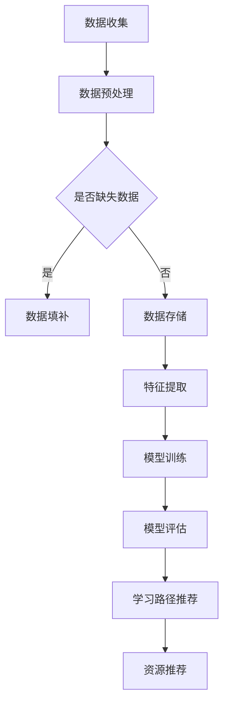
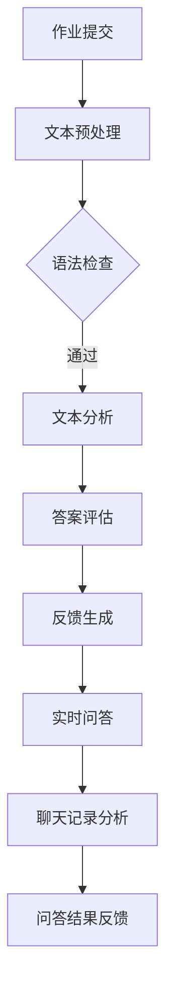
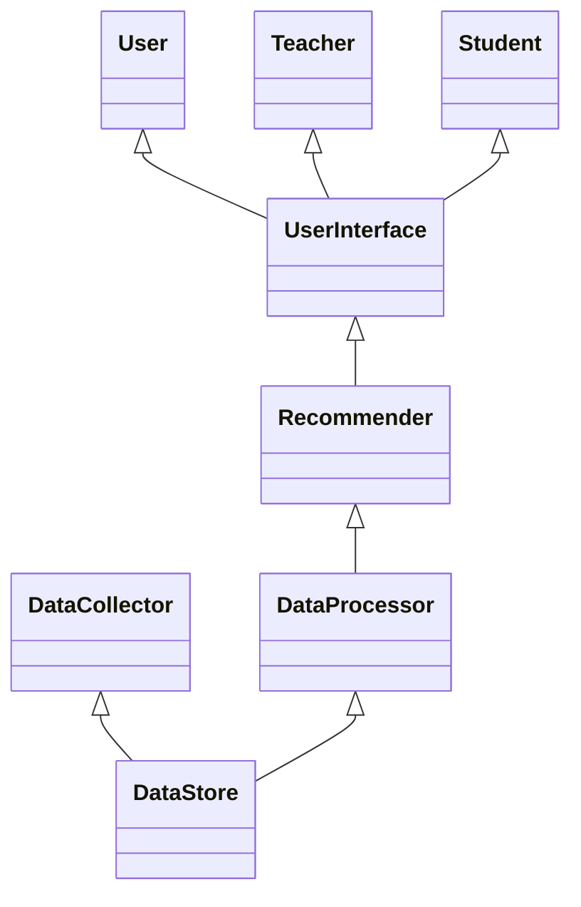
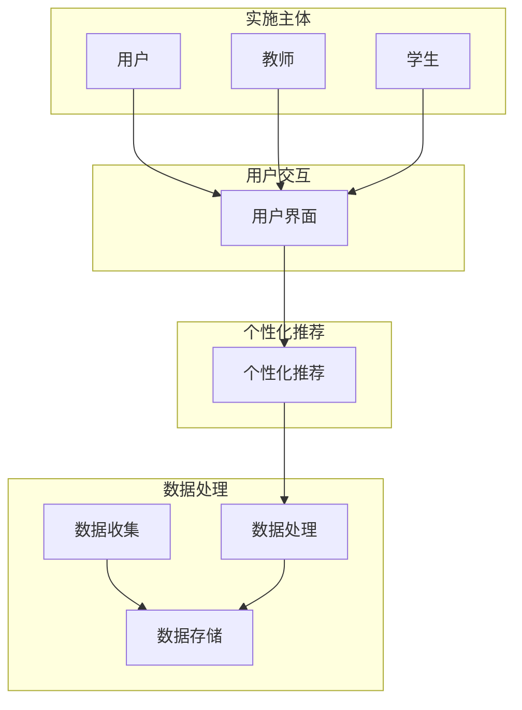

                 


# AI驱动的个性化学习计划：教育革新

关键词：个性化学习、AI、教育技术、机器学习、系统架构、案例研究

摘要：随着人工智能技术的不断进步，教育领域正迎来一场革命。本文旨在探讨如何利用AI技术实现个性化学习计划，通过分析核心概念、算法原理、系统设计以及实战案例，为教育创新提供一条清晰可行的路径。

## 第一部分：个性化学习的背景与核心概念

### 第1章：个性化学习概述

#### 1.1 个性化学习的定义与演变

个性化学习，顾名思义，是指根据每个学生的学习风格、能力和进度来定制化教学和学习计划。这一概念最早可以追溯到20世纪60年代，随着计算机技术的兴起，教育领域开始探索如何利用技术来适应不同学生的需求。传统的教学模式往往一刀切，无法满足学生的个性化需求，这导致了教育公平和效率的问题。

个性化学习的核心目标是通过定制化的学习体验，提高学生的学习效果和兴趣。它包括以下几个方面：

1. **适应性学习**：根据学生的能力和兴趣调整教学内容和难度。
2. **协作学习**：通过小组合作和互动，促进学生之间的交流和知识共享。
3. **自主性学习**：培养学生的自主学习能力和解决问题的能力。
4. **持续评估**：通过实时评估学生的学习进展，不断调整教学策略。

#### 1.2 教育革新的需求与挑战

当前教育系统面临的主要挑战包括：

1. **教育资源不均衡**：城乡、地区间的教育资源分配不均，导致教育质量差异。
2. **学习效果评估不足**：传统评估方法难以全面、准确地反映学生的学习效果。
3. **教学模式单一**：多数学校仍采用填鸭式的教学方式，无法激发学生的学习兴趣。
4. **个性化和差异化需求增加**：学生群体日益多样化，对个性化教学的需求日益增长。

为了应对这些挑战，教育革新势在必行。而AI技术的应用，为教育革新提供了新的机遇和解决方案。

#### 1.3 AI驱动的个性化学习计划概述

AI驱动的个性化学习计划是指利用人工智能技术来设计和实施个性化学习过程。它通过以下方式实现教育革新：

1. **学生数据分析**：收集并分析学生的学习行为数据，以了解其学习习惯、兴趣和能力。
2. **智能推荐系统**：基于学生数据分析，为每个学生推荐适合的学习内容和路径。
3. **个性化教学资源**：根据学生的个性化需求，开发自适应的学习资源。
4. **实时反馈与调整**：通过实时评估学生的学习效果，动态调整教学策略。

## 第二部分：核心概念与联系

### 第2章：核心概念与联系

#### 2.1 AI在教育中的应用

AI在教育中的应用涵盖了多个方面，包括：

1. **智能推荐系统**：通过机器学习算法分析学生的学习数据，为学生推荐适合的学习资源和内容。
2. **自然语言处理**：用于自动批改作业、提供实时反馈和解答问题。
3. **自适应学习系统**：根据学生的学习进度和表现，动态调整教学内容和难度。
4. **虚拟助手和聊天机器人**：为学生提供学习辅导和情感支持。

#### 2.2 数据驱动教育

数据驱动教育是指通过收集、分析和利用学生学习数据来指导教学决策。它包括以下几个关键步骤：

1. **数据收集**：通过多种途径收集学生学习数据，包括在线测试、作业提交、学习行为记录等。
2. **数据存储与管理**：建立一个统一的数据平台，确保数据的完整性和安全性。
3. **数据分析**：利用数据分析工具和算法，挖掘数据中的有价值信息。
4. **数据应用**：根据数据分析结果，制定个性化的教学计划和资源。

#### 2.3 个性化学习路径

个性化学习路径是指根据每个学生的学习特点和需求，制定个性化的学习计划和路径。它包括以下几个关键组成部分：

1. **初始评估**：通过多种评估方法了解学生的知识水平和能力。
2. **学习路径设计**：根据评估结果，设计适合每个学生的个性化学习路径。
3. **动态调整**：在学习过程中，根据学生的反馈和学习效果，实时调整学习路径。
4. **持续跟踪与评估**：对学生的学习进展进行持续跟踪和评估，确保学习目标的实现。

通过上述核心概念的介绍和联系，我们可以更好地理解AI驱动的个性化学习计划的运作机制和实施策略。

## 第三部分：算法原理与系统设计

### 第3章：机器学习算法在个性化学习中的应用

#### 3.1 机器学习基础

机器学习是人工智能的核心技术之一，它使计算机系统能够从数据中学习并做出决策。在个性化学习中，机器学习算法被广泛应用于学生数据分析和学习路径推荐。

#### 3.2 个性化学习中的常见算法

常见的机器学习算法包括：

1. **线性回归**：用于预测学生的成绩或其他指标。
2. **决策树**：用于分类学生群体，识别学习模式。
3. **随机森林**：结合多个决策树，提高预测的准确性和鲁棒性。
4. **支持向量机**：用于分类学生，识别潜在的学习群体。
5. **神经网络**：用于构建复杂的非线性模型，模拟人脑的学习过程。

#### 3.3 算法mermaid流程图展示

下面是一个使用mermaid绘制的简单算法流程图，展示了如何使用机器学习算法分析学生数据并推荐学习资源：



### 第4章：自然语言处理与个性化学习

#### 4.1 自然语言处理基础

自然语言处理（NLP）是AI的一个重要分支，它使计算机能够理解、处理和生成自然语言。在个性化学习中，NLP技术被广泛应用于自动批改作业、提供实时反馈和解答问题。

#### 4.2 NLP在个性化学习中的应用

NLP在个性化学习中的应用包括：

1. **自动批改作业**：使用NLP技术自动评估学生的作业，提供即时反馈。
2. **实时问答系统**：通过聊天机器人，为学生提供实时解答和辅导。
3. **学习内容生成**：根据学生的学习数据和需求，自动生成个性化的学习内容。
4. **学习情感分析**：分析学生的学习行为和反馈，识别学生的情感状态，提供个性化支持。

#### 4.3 算法mermaid流程图展示

下面是一个使用mermaid绘制的NLP算法流程图，展示了如何使用NLP技术实现自动批改作业和实时问答：



### 第5章：系统分析与架构设计

#### 5.1 个性化学习计划的技术架构

个性化学习计划的技术架构包括以下几个关键组成部分：

1. **数据收集模块**：负责收集学生的学习数据，包括在线测试、作业提交、学习行为记录等。
2. **数据存储与管理模块**：负责存储和管理收集到的数据，确保数据的完整性和安全性。
3. **数据分析与处理模块**：负责分析学生数据，提取有用信息，为个性化学习提供支持。
4. **个性化推荐模块**：基于学生数据分析结果，为每个学生推荐合适的学习资源和路径。
5. **用户界面**：提供用户交互界面，让学生能够方便地访问和学习资源。

#### 5.2 系统功能设计与类图

下面是一个使用mermaid绘制的系统功能设计类图，展示了个性化学习计划的关键组件和它们之间的关系：



#### 5.3 系统架构设计与架构图

下面是一个使用mermaid绘制的系统架构图，展示了个性化学习计划的总体架构和各组件之间的关系：



#### 5.4 系统接口设计与交互流程

系统接口设计包括数据接口、用户接口和外部系统集成接口。交互流程如下：

1. **数据接口**：学生提交作业，系统自动收集数据并存储。
2. **用户接口**：学生通过用户界面访问学习资源和个性化推荐。
3. **外部系统集成接口**：系统与学校管理信息系统、学生信息管理系统等外部系统进行数据交换和集成。

## 第四部分：项目实战与案例分析

### 第6章：实现AI驱动的个性化学习计划

#### 6.1 环境安装与准备

在实现AI驱动的个性化学习计划之前，我们需要准备相应的开发环境。以下是一个基本的安装步骤：

1. **安装Python**：Python是AI开发的常用语言，我们需要安装Python 3.x版本。
2. **安装Jupyter Notebook**：Jupyter Notebook是一个交互式计算环境，方便我们编写和运行代码。
3. **安装机器学习库**：安装Scikit-learn、TensorFlow、Keras等常用机器学习库。
4. **安装自然语言处理库**：安装NLTK、spaCy等自然语言处理库。
5. **安装数据库**：安装MySQL或PostgreSQL等数据库管理系统，用于存储学生数据。

#### 6.2 系统核心实现

系统核心实现包括数据收集、数据预处理、模型训练和个性化推荐等步骤。以下是一个简单的代码示例，展示了如何使用Python和Scikit-learn实现一个简单的个性化推荐系统：

```python
import numpy as np
from sklearn.model_selection import train_test_split
from sklearn.neighbors import NearestNeighbors
from sklearn.preprocessing import StandardScaler

# 假设我们有一个学生-课程评分矩阵
rating_matrix = np.array([[1, 5, 3], [2, 4, 5], [5, 1, 4]])

# 数据预处理
scaler = StandardScaler()
rating_matrix = scaler.fit_transform(rating_matrix)

# 模型训练
model = NearestNeighbors()
model.fit(rating_matrix)

# 个性化推荐
def recommend(student_id, n_recommendations):
    student_vector = rating_matrix[student_id]
    neighbors = model.kneighbors([student_vector], n_neighbors=n_recommendations)
    neighbor_ids = neighbors[1][0]
    neighbor_ratings = rating_matrix[neighbor_ids]
    return neighbor_ratings

# 测试推荐系统
print(recommend(0, 2))
```

#### 6.3 代码分析与应用解读

上述代码首先使用Scikit-learn的NearestNeighbors算法对学生-课程评分矩阵进行训练，然后定义了一个`recommend`函数，用于根据当前学生的评分向量推荐相似的课程。

在实际应用中，我们需要：

1. **扩展评分矩阵**：包括更多的学生和课程。
2. **优化推荐算法**：可以尝试使用基于内容的推荐、协同过滤等方法。
3. **集成到系统中**：将推荐系统集成到前端用户界面，实现实时推荐。

#### 6.4 实际案例分析和详细讲解剖析

以下是一个实际案例，展示了如何使用AI驱动的个性化学习计划来帮助一位高中学生提高数学成绩：

1. **初始评估**：学生提交了一次数学测试，系统分析了测试结果，发现学生在代数和几何方面存在明显短板。
2. **学习路径设计**：系统根据评估结果，为学生推荐了一系列代数和几何的在线课程，并制定了学习计划。
3. **实时反馈与调整**：学生在学习过程中，系统实时收集学生的学习数据，如学习时间、课程完成度、测试成绩等，并根据这些数据调整学习内容和进度。
4. **持续跟踪与评估**：系统持续跟踪学生的学习进展，每两周进行一次评估，确保学习目标的实现。

通过这个案例，我们可以看到AI驱动的个性化学习计划如何帮助学生实现个性化学习，提高学习效果。

### 第7章：个性化学习计划的最佳实践

#### 7.1 实践经验总结

在实践中，实施AI驱动的个性化学习计划需要注意以下几点：

1. **数据质量**：确保数据的准确性和完整性，数据质量是模型训练和推荐系统的基石。
2. **隐私保护**：在数据收集和使用过程中，要严格保护学生的隐私。
3. **个性化推荐**：推荐系统需要根据学生的实时数据动态调整，避免过度推荐或推荐不相关内容。
4. **用户反馈**：鼓励学生提供反馈，持续优化学习体验。

#### 7.2 注意事项

实施个性化学习计划时，还需注意以下几点：

1. **技术选型**：选择适合的机器学习和自然语言处理算法，确保系统的性能和准确性。
2. **系统稳定性**：确保系统稳定运行，避免因技术故障导致学习中断。
3. **教师角色**：教师在整个学习过程中仍然扮演重要角色，需要与AI系统协同工作，提供个性化辅导。

#### 7.3 未来发展方向与展望

未来，AI驱动的个性化学习计划将继续发展，可能的方向包括：

1. **多模态学习**：整合文字、图片、视频等多种学习资源，提供更丰富的学习体验。
2. **情感分析**：通过情感分析技术，了解学生的情感状态，提供更有针对性的支持。
3. **合作学习**：引入合作学习模式，促进学生之间的互动和知识共享。
4. **个性化评估**：开发更精确的评估模型，全面反映学生的学习效果。

### 第8章：拓展阅读与深入研究

#### 8.1 相关文献与资料推荐

对于希望深入了解AI驱动的个性化学习计划的读者，以下是一些推荐的文献和资料：

1. **《个性化学习：理论与实践》**：介绍了个性化学习的基本概念和实施策略。
2. **《机器学习实战》**：提供了丰富的机器学习算法实现和应用案例。
3. **《深度学习》**：详细介绍了深度学习的基础知识和应用。

#### 8.2 新兴技术与趋势

以下是一些正在发展的新兴技术和趋势：

1. **增强现实（AR）与虚拟现实（VR）**：提供沉浸式的学习体验，增强学习效果。
2. **区块链**：确保数据的安全性和隐私，提高数据的透明度和可信度。
3. **生成对抗网络（GAN）**：用于生成个性化学习资源，提高学习资源的多样性。

#### 8.3 个性化学习计划的未来之路

个性化学习计划的未来将更加智能化和个性化，可能的方向包括：

1. **个性化学习生态**：构建一个涵盖学习资源、学习平台和学习工具的生态系统。
2. **个性化教育研究**：加强对个性化学习效果的研究，为教育决策提供科学依据。
3. **个性化学习标准**：制定个性化学习的标准和规范，确保个性化学习的质量。

---

作者：AI天才研究院/AI Genius Institute & 禅与计算机程序设计艺术 /Zen And The Art of Computer Programming

通过上述内容，我们系统地介绍了AI驱动的个性化学习计划的核心概念、算法原理、系统设计以及实际案例，为教育革新提供了一条清晰的路径。希望本文能为读者在AI教育领域的探索和实践提供有价值的参考。

