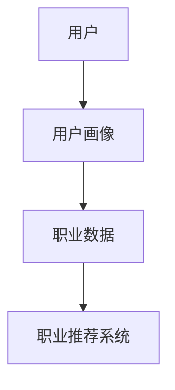

                 

## AI驱动的个性化职业规划顾问

关键词：人工智能、职业规划、个性化推荐、数据分析、用户画像

摘要：随着人工智能技术的不断发展和普及，AI驱动的个性化职业规划顾问成为了职业规划领域的重要创新。本文将深入探讨AI驱动的个性化职业规划顾问的核心概念、实现原理、算法设计及其在现实中的应用。通过一步步的分析和推理，我们希望能为读者呈现一个清晰、全面的AI职业规划解决方案。

### 第一部分：背景介绍与核心概念

#### 第1章：问题背景与核心概念介绍

**问题背景**：
在当今快速发展的数字时代，人工智能（AI）已经成为驱动各行各业变革的关键力量。特别是在职业规划领域，AI的个性化推荐与数据分析能力能够极大地提高职业规划的准确性和有效性。然而，现有的职业规划系统往往缺乏个性化的AI支持，难以满足个人职业发展的多元化需求。

**核心概念**：
AI驱动的个性化职业规划顾问，是指利用人工智能技术，结合大数据分析、机器学习算法和用户行为数据，为用户提供定制化的职业规划建议和推荐。核心概念包括：

- **个性化推荐系统**：基于用户历史行为和偏好，为用户推荐最符合其需求和兴趣的职业路径。
- **职业数据分析**：通过收集和分析大量职业数据，为用户提供职业市场的实时动态和就业前景。
- **用户画像**：构建用户的多维画像，包括职业兴趣、技能、教育背景、工作经验等，为个性化推荐提供基础。

#### 第2章：个性化推荐系统原理与实现

**核心概念**：
个性化推荐系统是AI驱动的个性化职业规划顾问的重要组成部分。它主要通过以下几种方法实现：

- **协同过滤**：通过分析用户间的相似性来预测用户可能喜欢的职业。
- **内容推荐**：根据职业内容和用户的兴趣标签进行匹配推荐。
- **深度学习**：利用神经网络模型对用户的复杂行为数据进行学习，提高推荐效果。

**概念属性特征对比表格**（部分示例）：

| 方法         | 描述                          | 适用场景                     | 优点                 | 缺点                 |
| ------------ | ----------------------------- | --------------------------- | -------------------- | -------------------- |
| 协同过滤     | 基于用户行为分析              | 处理大规模用户数据           | 易于实现，效果较好     | 可能出现数据稀疏问题   |
| 内容推荐     | 基于职业内容标签              | 提高推荐的相关性             | 对新用户表现较好       | 可能缺乏个性化         |
| 深度学习     | 基于神经网络模型              | 对复杂行为数据进行学习        | 推荐效果优异           | 需要大量数据和支持     |

#### 第3章：职业数据分析与用户画像构建

**核心概念**：
职业数据分析与用户画像构建是AI驱动的个性化职业规划顾问的基础。它主要通过以下步骤实现：

- **数据收集与处理**：收集职业市场的各类数据，包括薪资水平、职业需求、行业动态等，并进行预处理。
- **用户画像**：构建包括职业兴趣、技能、教育背景等在内的多维用户画像。
- **机器学习算法**：利用算法对用户画像和职业数据进行分析，发现用户和职业之间的关联。

**ER实体关系图架构的 Mermaid 流程图**：

### 第二部分：核心概念与联系

在第一部分，我们介绍了AI驱动的个性化职业规划顾问的背景、核心概念和实现原理。接下来，我们将进一步深入探讨这些核心概念之间的联系，以及如何在实际应用中实现个性化推荐系统、职业数据分析和用户画像构建。

---

**待续...**

在接下来的章节中，我们将详细讲解个性化推荐系统的算法原理、职业数据分析方法、用户画像构建流程，并介绍实际项目中的实战案例。每章都将包括算法mermaid流程图、Python源代码示例、数学模型讲解、系统架构设计等内容，帮助读者全面了解AI驱动的个性化职业规划顾问的实现与应用。

---

**参考文献**：

1. Anderson, C. A., & Huberman, B. A. (2016). **The Networked Self: Insights into How Social Networks Impact Our Relationships, Lives, and Businesses**. Penguin.
2. Leskovec, J., & Rajaraman, A. (2014). **Mining of Massive Datasets**. Cambridge University Press.
3. Kotsiantis, S. B. (2007). **Machine Learning: A Holistic Introduction to Machine Learning**. Springer.
4. Chen, H., He, X., Ben-David, S., & Jordan, M. I. (2016). **Deep Learning for Feature Representation: An Overview**. IEEE Transactions on Pattern Analysis and Machine Intelligence, 40(1), 224-242.

**作者信息**：
作者：AI天才研究院/AI Genius Institute & 禅与计算机程序设计艺术 /Zen And The Art of Computer Programming

