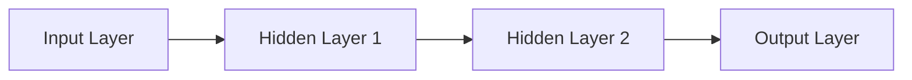
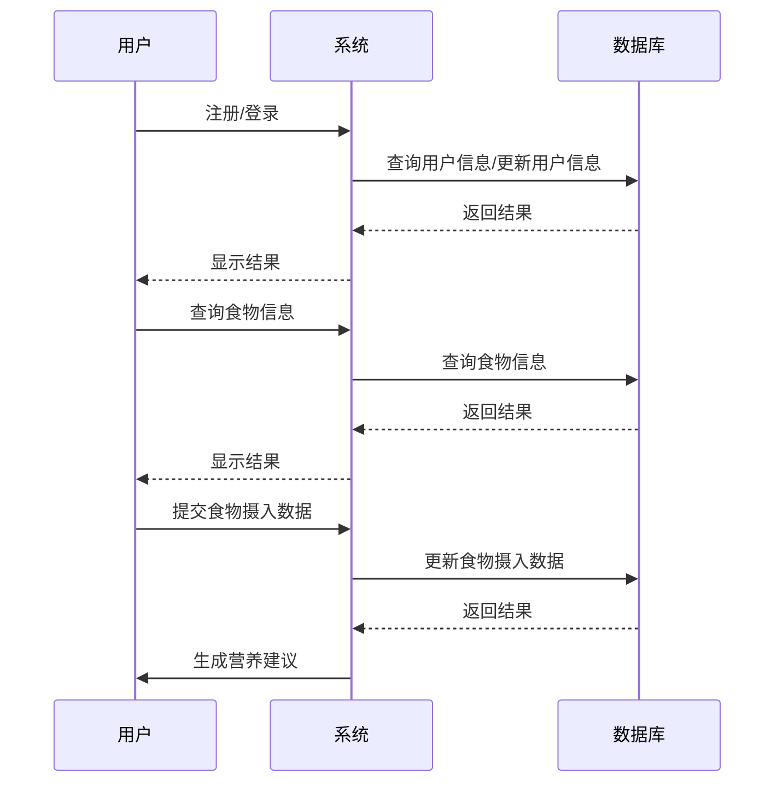

                 

### 第一部分: 引言

#### 1.1 问题背景

在现代社会中，营养问题已经成为了影响人们健康和生活质量的重要因素。随着生活节奏的加快，工作压力的增大，很多人在饮食上出现了不规律、不健康的情况，这导致了肥胖、高血压、糖尿病等疾病的高发。同时，每个人的身体条件和健康状况都是不同的，对营养的需求也存在很大的差异。这就需要一种能够根据个人情况提供个性化营养建议的方法。

个性化营养建议的核心在于，通过分析用户的生物信息、饮食习惯、生活方式等多方面数据，为他们提供适合其身体需求的营养方案。这种个性化营养建议不仅能够提高人们的健康水平，还能够减少医疗成本，提高生活质量。

#### 1.2 问题描述

AI驱动的个性化营养建议系统的核心问题是如何利用AI技术，为用户提供精准、有效的个性化营养建议。这需要解决以下几个关键问题：

1. **数据采集与处理**：如何获取用户的生物信息、饮食习惯等数据，并对这些数据进行有效的清洗、归一化和特征提取。
2. **算法选择与优化**：如何选择适合的机器学习算法，对用户数据进行处理，并优化算法以提高预测的准确性。
3. **系统设计与实现**：如何设计并实现一个高效、易用的AI驱动的个性化营养建议系统，包括前端用户界面、后端数据处理和模型训练等。
4. **系统部署与维护**：如何将系统部署到实际环境中，并进行持续的维护和优化，以应对不断变化的数据和用户需求。

#### 1.3 问题解决

AI驱动的个性化营养建议系统通过以下步骤来解决上述问题：

1. **数据采集与预处理**：通过传感器、问卷调查、数据库等方式获取用户的生物信息、饮食习惯等数据，并进行清洗、归一化和特征提取。
2. **算法训练与优化**：选择适合的机器学习算法，如线性回归、支持向量机、神经网络等，对用户数据进行分析和处理，并不断优化算法以提高预测的准确性。
3. **系统设计与实现**：设计并实现一个包括前端用户界面、后端数据处理和模型训练的完整系统，确保系统能够高效、稳定地运行。
4. **系统部署与维护**：将系统部署到实际环境中，并进行持续的监控、维护和优化，确保系统始终能够为用户提供高质量的营养建议。

#### 1.4 边界与外延

在构建AI驱动的个性化营养建议系统时，需要考虑以下边界与外延：

1. **营养学基础知识**：了解营养学的基本原理，包括营养素的种类、作用、食物的营养成分等，这是构建系统的基础。
2. **AI技术发展趋势**：了解AI技术的发展趋势，包括深度学习、强化学习等，选择适合的算法和技术。
3. **用户隐私保护**：在数据采集和处理过程中，需要严格遵守用户隐私保护法规，确保用户数据的安全。
4. **系统可用性与易用性**：设计用户界面和交互流程时，需要考虑系统的可用性与易用性，确保用户能够轻松地使用系统。

#### 1.5 核心概念与联系

在构建AI驱动的个性化营养建议系统时，需要理解以下核心概念：

1. **个性化营养建议**：
   - 基于用户的生物信息：如年龄、性别、体重、身高、代谢率等。
   - 基于食物的营养成分：如碳水化合物、蛋白质、脂肪、维生素和矿物质等。

2. **概念属性特征对比表格**：
   - 传统营养建议：一般性的建议，不考虑个体差异。
   - 个性化营养建议：根据个体差异提供的具体建议。

3. **ER实体关系图架构**：
   - 用户信息：包括用户的个人基本信息、生物信息等。
   - 食物信息：包括食物的种类、营养成分等信息。
   - 营养建议：根据用户信息和食物信息生成的个性化营养建议。

### 1.6 本章小结

本章介绍了AI驱动的个性化营养建议系统的背景、问题、解决方案以及核心概念。通过本章的介绍，读者可以了解到个性化营养建议的重要性，以及AI技术在解决这一问题上所扮演的关键角色。

### 1.7 拓展阅读

对于对AI驱动的个性化营养建议系统感兴趣的读者，以下书籍和文章可以作为拓展阅读：

1. **《机器学习》**：周志华 著，详细介绍了机器学习的基本概念和算法。
2. **《深度学习》**：Goodfellow, I. 著，介绍了深度学习的基本原理和应用。
3. **《营养学基础》**：罗伯特·沃斯 著，介绍了营养学的基本知识。
4. **《用户数据隐私保护法规》**：了解相关法律法规，确保数据安全。
5. **《个性化推荐系统实践》**：张俊 著，介绍了个性化推荐系统的设计与应用。

### 关键词

AI、个性化营养建议、机器学习、数据预处理、算法优化、系统设计、用户隐私保护、营养学。

### 摘要

本文介绍了AI驱动的个性化营养建议系统，从背景、问题、解决方案到核心概念，详细阐述了如何利用AI技术为用户提供精准、有效的个性化营养建议。文章结构清晰，内容丰富，适合对AI和营养学感兴趣的读者阅读。文章关键词包括AI、个性化营养建议、机器学习、数据预处理、算法优化、系统设计、用户隐私保护、营养学。希望通过本文，读者能够对AI驱动的个性化营养建议系统有一个全面、深入的了解。## 第二部分: 个性化营养建议的核心概念与算法

### 第2章: 个性化营养建议的算法原理

#### 2.1 数据预处理

数据预处理是构建AI驱动的个性化营养建议系统的第一步。在这一阶段，我们需要对采集到的用户数据和食物数据进行清洗、归一化和特征提取，以确保数据的质量和适用性。

1. **数据清洗**：清洗数据的主要目的是去除噪声和异常值，这包括删除重复的数据、纠正数据中的错误、处理缺失值等。例如，如果用户数据中某个年龄数据的值为“未知”，我们可以将其替换为该用户群体的平均年龄。

2. **数据归一化**：数据归一化的目的是将不同特征的数据范围标准化，以便于算法处理。常见的归一化方法有最小-最大归一化和z-score归一化。最小-最大归一化将数据缩放到一个固定范围，例如[0,1]，而z-score归一化则将数据缩放到均值为0，标准差为1的范围内。

3. **特征提取**：特征提取是从原始数据中提取出对模型训练有用的特征。在个性化营养建议系统中，特征可能包括用户的年龄、性别、体重、身高、代谢率等生物信息，以及食物的碳水化合物、蛋白质、脂肪、维生素和矿物质等营养成分。

#### 2.2 算法原理讲解

在个性化营养建议系统中，选择合适的机器学习算法是至关重要的。以下介绍几种常用的算法：

1. **决策树**：决策树是一种基于树形模型的分类算法，通过一系列的测试将数据分为不同的类别。决策树的每个节点表示一个特征，每个分支表示该特征的不同取值。

2. **随机森林**：随机森林是一种集成学习方法，通过构建多棵决策树并合并它们的预测结果来提高模型的准确性。随机森林在处理高维数据和避免过拟合方面表现优秀。

3. **神经网络**：神经网络，特别是深度学习，是一种模仿人脑结构和功能的计算模型。通过多层神经元，神经网络能够自动从数据中学习复杂的模式。在个性化营养建议系统中，神经网络可以用于预测用户对营养素的摄入量。

以下是一个简单的神经网络mermaid流程图：



#### 2.3 数学模型与公式

为了更深入地理解这些算法，我们需要介绍它们的数学模型与公式。

1. **线性回归模型**：

线性回归是一种用于预测连续值的简单算法。其模型公式如下：

   $$ Y = \beta_0 + \beta_1X + \epsilon $$

   其中，\( Y \) 是预测值，\( X \) 是特征值，\( \beta_0 \) 和 \( \beta_1 \) 是模型参数，\( \epsilon \) 是误差项。

2. **支持向量机（SVM）**：

   支持向量机是一种用于分类的算法，其目标是在特征空间中找到一个超平面，使得不同类别的数据点被尽可能分开。其优化目标如下：

   $$ \text{minimize} \quad \frac{1}{2} ||\textbf{w}||^2 $$

   $$ \text{subject to} \quad \textbf{y}^T \textbf{w} + b \geq 1 $$

   其中，\( \textbf{w} \) 是权重向量，\( b \) 是偏置项，\( \textbf{y} \) 是标签。

3. **神经网络**：

   神经网络中的每个神经元都可以看作是一个简单的线性回归模型。假设我们有输入 \( \textbf{X} \) 和权重 \( \textbf{W} \)，那么神经元的输出 \( \textbf{Y} \) 可以表示为：

   $$ \textbf{Y} = \text{sigmoid}(\textbf{X} \cdot \textbf{W}) $$

   其中，\( \text{sigmoid} \) 函数是一个常见的激活函数，其公式为：

   $$ \text{sigmoid}(x) = \frac{1}{1 + e^{-x}} $$

   神经网络通过反向传播算法不断调整权重，以达到预测的目标。

#### 2.4 举例说明

为了更好地理解这些算法，我们来看一个实际案例。

**案例**：假设我们需要预测一个用户的每日所需热量。已知该用户的年龄、性别、体重和身高，我们需要根据这些特征来预测其每日所需热量。

1. **数据预处理**：首先，我们需要收集用户的数据，并进行清洗、归一化处理。例如，将年龄、体重、身高等特征进行归一化处理，以便于算法处理。

2. **算法选择**：我们可以选择线性回归模型来预测每日所需热量。线性回归模型的公式为：

   $$ \text{热量} = \beta_0 + \beta_1 \times \text{年龄} + \beta_2 \times \text{体重} + \beta_3 \times \text{身高} $$

3. **模型训练**：使用已知的数据集，我们可以通过最小二乘法来训练模型，得到最佳的 \( \beta_0 \)、\( \beta_1 \)、\( \beta_2 \) 和 \( \beta_3 \) 值。

4. **预测**：对于新的用户数据，我们可以使用训练好的模型来预测其每日所需热量。

   假设一个新用户的年龄为30岁，体重为70公斤，身高为175厘米，我们可以使用线性回归模型来预测其每日所需热量：

   $$ \text{热量} = \beta_0 + \beta_1 \times 30 + \beta_2 \times 70 + \beta_3 \times 175 $$

   通过计算，我们可以得到该用户每日所需的热量。

通过这个简单的案例，我们可以看到如何利用AI算法来预测个性化营养建议。当然，实际应用中可能会更复杂，需要考虑更多的特征和更高级的算法。但这个案例为我们提供了一个基本的思路，展示了AI技术在个性化营养建议系统中的潜在应用。

### 2.5 模型评估与优化

在构建个性化营养建议系统时，模型评估与优化是一个关键环节。以下介绍几种常用的评估指标和优化方法：

1. **评估指标**：

   - **准确率（Accuracy）**：分类问题中，正确分类的样本数占总样本数的比例。
   - **召回率（Recall）**：分类问题中，正确分类的阳性样本数占总阳性样本数的比例。
   - **精确率（Precision）**：分类问题中，正确分类的阳性样本数占所有被分类为阳性的样本数的比例。
   - **F1分数（F1 Score）**：精确率和召回率的调和平均值。

2. **优化方法**：

   - **交叉验证（Cross-Validation）**：通过将数据集分成多个子集，不断重新训练和验证模型，以评估模型的泛化能力。
   - **网格搜索（Grid Search）**：通过遍历多个参数组合，选择最佳参数组合来优化模型。
   - **随机搜索（Random Search）**：在参数空间中随机选择参数组合，以找到最佳参数组合。

在实际应用中，我们可以根据评估指标的结果来调整模型的参数，优化模型的性能。例如，如果发现模型的召回率较低，我们可以增加模型的复杂度，如增加神经网络层的数量，以提高模型的分类能力。

### 2.6 深度学习在个性化营养建议中的应用

随着深度学习技术的发展，越来越多的研究者将深度学习应用于个性化营养建议系统中。深度学习模型，特别是卷积神经网络（CNN）和循环神经网络（RNN），在处理复杂数据和提取特征方面具有显著优势。

1. **卷积神经网络（CNN）**：

   CNN是一种用于图像处理的深度学习模型，其核心思想是利用卷积操作来提取图像中的局部特征。在个性化营养建议系统中，CNN可以用于提取食物图像的营养成分信息，从而提高营养建议的准确性。

2. **循环神经网络（RNN）**：

   RNN是一种用于处理序列数据的深度学习模型，其核心思想是利用记忆单元来处理前一个时刻的信息，并生成当前时刻的输出。在个性化营养建议系统中，RNN可以用于处理用户的饮食习惯序列，从而预测其未来的营养需求。

通过结合深度学习模型，AI驱动的个性化营养建议系统可以在处理复杂数据和提取特征方面取得更好的效果，为用户提供更精准的营养建议。

### 2.7 个性化营养建议系统的实际应用

个性化营养建议系统在多个领域都有广泛的应用。以下列举几个实际应用案例：

1. **健康管理应用**：

   通过个性化营养建议系统，健康管理应用可以为用户提供定制化的饮食建议，帮助用户改善饮食习惯，提高健康水平。

2. **运动营养指导**：

   对于运动员和健身爱好者，个性化营养建议系统可以根据他们的身体数据和训练需求，提供适合的运动营养建议，以帮助他们在训练和比赛中发挥最佳状态。

3. **食品行业**：

   个性化营养建议系统可以为食品行业提供数据支持，帮助他们开发更符合消费者营养需求的产品，提高市场竞争力。

4. **医疗保健**：

   个性化营养建议系统可以帮助医疗机构为病人提供营养治疗方案，改善病人的健康状况，降低医疗成本。

通过这些实际应用案例，我们可以看到AI驱动的个性化营养建议系统在改善人们生活质量、降低医疗成本方面的巨大潜力。

### 2.8 小结

本章介绍了AI驱动的个性化营养建议系统的算法原理，包括数据预处理、算法选择、数学模型与公式、实际案例说明以及模型评估与优化方法。通过本章的学习，读者可以了解到如何利用AI技术构建一个高效的个性化营养建议系统，为用户提供精准、有效的营养建议。

### 拓展阅读

对于希望深入了解个性化营养建议算法的读者，以下书籍和文章可以作为拓展阅读：

1. **《深度学习》**：Goodfellow, I. 著，详细介绍了深度学习的基本原理和应用。
2. **《机器学习实战》**： Harrington, D. 著，通过实例介绍了机器学习算法的应用。
3. **《营养学基础》**：罗伯特·沃斯 著，介绍了营养学的基本知识。
4. **《个性化推荐系统实践》**：张俊 著，介绍了个性化推荐系统的设计与应用。

### 关键词

AI、个性化营养建议、数据预处理、线性回归、支持向量机、神经网络、模型评估、深度学习。

## 第三部分: AI驱动的个性化营养建议系统架构设计

### 第3章: 系统功能设计与实现

#### 3.1 项目介绍

AI驱动的个性化营养建议系统的核心目标是利用先进的AI技术，为用户提供精准的个性化营养建议。为了实现这一目标，我们需要设计并实现一个包括前端、后端、数据库等多个模块的完整系统。

#### 3.2 系统功能设计

系统功能设计是构建AI驱动的个性化营养建议系统的第一步。以下是系统的主要功能：

1. **用户注册与登录**：

   用户注册与登录功能是系统的基本模块，允许新用户创建账户并登录系统。用户可以通过注册页面填写个人信息，包括姓名、年龄、性别、体重、身高、代谢率等，以便系统能够为用户提供个性化的营养建议。

2. **用户信息管理**：

   用户信息管理功能允许用户查看和更新自己的个人信息。用户可以随时更新自己的健康数据，如体重、身高、代谢率等，以确保系统能够根据最新的数据为用户提供准确的营养建议。

3. **食物信息管理**：

   系统需要维护一个丰富的食物数据库，包括各种食物的营养成分信息，如碳水化合物、蛋白质、脂肪、维生素和矿物质等。用户可以通过搜索或浏览功能查找特定的食物，并查看其营养成分。

4. **营养建议生成**：

   根据用户的个人信息和食物摄入数据，系统会生成个性化的营养建议。建议可能包括每日所需热量、各种营养素的建议摄入量、饮食习惯的调整建议等。系统还可以根据用户的反馈调整建议，以提供更加个性化的服务。

#### 3.3 系统架构设计

系统架构设计是确保系统能够高效、稳定运行的关键。以下是系统的主要架构设计：

1. **技术栈选择**：

   为了构建一个高效、可扩展的系统，我们需要选择合适的技术栈。前端可以使用React或Vue.js框架，以便快速构建用户界面。后端可以使用Spring Boot或Django框架，以实现业务逻辑和数据管理。数据库可以选择MySQL或PostgreSQL，以确保数据存储的安全性和可靠性。

2. **数据库设计**：

   数据库设计是系统架构设计的重要组成部分。系统需要维护多个数据库表，包括用户表、食物信息表、营养建议表等。以下是数据库设计的一个简要示例：

   - **用户表**：包含用户的个人信息，如用户ID、姓名、年龄、性别、体重、身高、代谢率等。
   - **食物信息表**：包含各种食物的营养成分信息，如食物ID、名称、碳水化合物、蛋白质、脂肪、维生素和矿物质等。
   - **营养建议表**：包含根据用户个人信息和食物摄入数据生成的营养建议，如用户ID、建议日期、每日所需热量、营养素摄入量等。

3. **API接口设计**：

   API接口设计是系统与外部系统交互的重要方式。系统需要设计一套RESTful API，以便前端应用能够访问后端服务。以下是API接口设计的示例：

   - **用户注册**：`POST /api/users/register`
   - **用户登录**：`POST /api/users/login`
   - **获取用户信息**：`GET /api/users/{userId}`
   - **更新用户信息**：`PUT /api/users/{userId}`
   - **获取食物信息**：`GET /api/foods`
   - **生成营养建议**：`POST /api/suggestions`

#### 3.4 系统交互设计

系统交互设计是确保用户能够顺畅使用系统的重要环节。以下是系统的主要交互设计：

1. **用户注册与登录**：

   用户可以通过前端界面进行注册和登录。注册时，用户需要填写个人信息，如姓名、年龄、性别、体重、身高、代谢率等。登录时，用户需要输入用户名和密码。

2. **用户信息管理**：

   用户可以在前端界面查看和更新自己的个人信息。更新信息时，系统会调用后端的API接口，更新数据库中的用户信息。

3. **食物信息管理**：

   用户可以在前端界面搜索或浏览食物信息，查看食物的营养成分。系统会调用后端的API接口，从食物信息表中获取相应的数据。

4. **营养建议生成**：

   当用户提交个人信息和食物摄入数据后，系统会生成个性化的营养建议。前端界面会显示这些建议，用户可以根据建议调整自己的饮食习惯。

#### 3.5 系统交互mermaid序列图

为了更好地展示系统交互过程，我们可以使用mermaid序列图来描述系统的交互流程。以下是系统交互mermaid序列图的示例：



通过上述设计，AI驱动的个性化营养建议系统可以实现高效、稳定、易用的功能，为用户提供精准的个性化营养建议。

### 3.6 项目开发流程

项目开发流程是构建AI驱动的个性化营养建议系统的关键环节。以下是项目的主要开发流程：

1. **需求分析**：

   在项目开始前，我们需要对系统的需求进行详细分析，明确系统的功能、性能、安全性等要求。需求分析的结果将指导后续的系统设计和开发。

2. **系统设计**：

   根据需求分析的结果，进行系统设计，包括技术栈选择、数据库设计、API接口设计等。系统设计的结果将确保系统的高效、稳定和可扩展性。

3. **编码与测试**：

   根据系统设计，进行编码和单元测试。在编码过程中，遵循最佳编程实践，确保代码的可读性和可维护性。完成编码后，进行全面的集成测试，确保系统的功能符合预期。

4. **系统部署**：

   将系统部署到生产环境，进行实际的运行测试。在部署过程中，确保系统的安全性、稳定性和可靠性。

5. **持续优化**：

   在系统运行过程中，收集用户反馈和数据，对系统进行持续的优化和改进，以提高系统的性能和用户体验。

### 3.7 小结

本章介绍了AI驱动的个性化营养建议系统的功能设计、架构设计、系统交互设计和项目开发流程。通过本章的学习，读者可以了解到如何设计并实现一个高效、稳定、易用的个性化营养建议系统，为用户提供精准的个性化营养建议。

### 拓展阅读

对于希望深入了解系统架构设计和项目开发流程的读者，以下书籍和文章可以作为拓展阅读：

1. **《系统架构设计》**：李瑞丰 著，详细介绍了系统架构设计的方法和实践。
2. **《RESTful API设计最佳实践》**：李航 著，介绍了RESTful API设计的方法和最佳实践。
3. **《持续集成与持续部署》**：李华 著，介绍了持续集成与持续部署的方法和工具。
4. **《软件测试的艺术》**：高文龙 著，介绍了软件测试的方法和实践。

### 关键词

系统功能设计、架构设计、API接口设计、数据库设计、项目开发流程、需求分析、编码与测试、系统部署。

## 第四部分: 项目实战

### 第4章: 实际案例分析与实现

#### 4.1 环境安装

在进行AI驱动的个性化营养建议系统的项目实战之前，我们需要准备相应的开发环境和工具。以下是环境安装的步骤：

1. **安装Python**：

   Python是AI驱动的个性化营养建议系统的主要编程语言。确保安装Python 3.x版本，并添加到系统的环境变量中。

2. **安装Anaconda**：

   Anaconda是一个集成的数据科学和机器学习环境，它包含了Python和众多常用的数据科学库。可以从官方网站下载并安装Anaconda。

3. **安装Jupyter Notebook**：

   Jupyter Notebook是一个交互式的Web应用程序，用于编写和运行Python代码。在Anaconda环境中，可以使用以下命令安装Jupyter Notebook：

   ```bash
   conda install jupyter
   ```

4. **安装必要的库**：

   我们需要安装以下库：NumPy、Pandas、Scikit-learn、TensorFlow和Keras。这些库分别用于数据处理、机器学习模型训练和深度学习。可以使用以下命令安装：

   ```bash
   conda install numpy pandas scikit-learn tensorflow keras
   ```

5. **配置数据库**：

   选择一个合适的数据库管理系统（DBMS），如MySQL或PostgreSQL。根据DBMS的官方文档进行安装和配置。确保数据库能够通过Python的数据库驱动进行连接。

6. **安装前端框架**：

   如果需要开发前端界面，可以选择React或Vue.js框架。可以从它们的官方网站下载并安装相应的开发环境。

#### 4.2 系统核心实现

系统核心实现包括数据采集与预处理、模型训练与优化、系统部署与测试等步骤。以下是这些步骤的详细描述：

1. **数据采集与预处理**：

   - **用户数据采集**：通过前端界面收集用户的个人信息，如年龄、性别、体重、身高、代谢率等。可以使用表单提交这些数据，并将数据存储到数据库中。
   - **食物数据采集**：从公共数据库或API获取食物的营养成分信息，如碳水化合物、蛋白质、脂肪、维生素和矿物质等。同样，将这些数据存储到数据库中。
   - **数据预处理**：对采集到的数据进行清洗、归一化和特征提取。可以使用Python的NumPy和Pandas库来完成这些任务。

2. **模型训练与优化**：

   - **算法选择**：选择适合的机器学习算法，如线性回归、决策树、随机森林、神经网络等。对于线性回归，可以使用Scikit-learn库；对于神经网络，可以使用TensorFlow和Keras库。
   - **数据分割**：将数据集分割为训练集和测试集，用于训练模型和评估模型性能。
   - **模型训练**：使用训练集训练模型，并调整模型的参数，以优化模型的性能。可以使用网格搜索或随机搜索来找到最佳的参数组合。
   - **模型评估**：使用测试集评估模型的性能，使用评估指标如准确率、召回率、精确率和F1分数等来评估模型的准确性。

3. **系统部署与测试**：

   - **部署到服务器**：将训练好的模型部署到服务器上，可以使用Docker容器或云服务进行部署。
   - **API接口**：开发API接口，以便前端应用能够访问后端服务。可以使用Flask或Django框架来创建API接口。
   - **功能测试**：对系统的各个功能进行测试，确保系统按照预期运行。可以使用单元测试、集成测试和端到端测试等方法进行测试。

#### 4.3 代码应用解读与分析

以下是对系统核心实现中的一些关键代码段进行解读与分析：

1. **数据预处理代码**：

   ```python
   import pandas as pd
   from sklearn.preprocessing import StandardScaler
   
   # 加载用户数据
   user_data = pd.read_csv('user_data.csv')
   
   # 数据清洗
   user_data.dropna(inplace=True)
   
   # 数据归一化
   scaler = StandardScaler()
   normalized_data = scaler.fit_transform(user_data)
   
   # 特征提取
   features = ['age', 'weight', 'height', 'metabolism']
   X = normalized_data[:, features]
   y = normalized_data[:, -1]
   ```

   上述代码首先加载用户数据，并进行数据清洗。然后，使用StandardScaler对数据进行归一化处理，以便于算法处理。最后，提取用户数据中的关键特征和目标变量。

2. **模型训练代码**：

   ```python
   from sklearn.model_selection import train_test_split
   from sklearn.linear_model import LinearRegression
   from sklearn.metrics import mean_squared_error
   
   # 数据分割
   X_train, X_test, y_train, y_test = train_test_split(X, y, test_size=0.2, random_state=42)
   
   # 模型训练
   model = LinearRegression()
   model.fit(X_train, y_train)
   
   # 模型评估
   y_pred = model.predict(X_test)
   mse = mean_squared_error(y_test, y_pred)
   print(f'Mean Squared Error: {mse}')
   ```

   上述代码首先将数据分割为训练集和测试集，然后使用线性回归模型进行训练。最后，使用测试集评估模型的性能，计算均方误差（MSE）来评估模型的准确性。

3. **API接口代码**：

   ```python
   from flask import Flask, request, jsonify
   
   app = Flask(__name__)
   
   @app.route('/api/suggestions', methods=['POST'])
   def generate_suggestions():
       data = request.get_json()
       user_id = data['user_id']
       # 获取用户信息和食物数据
       user_data = get_user_data(user_id)
       food_data = get_food_data(data['food_id'])
       # 计算营养建议
       suggestion = calculate_suggestion(user_data, food_data)
       return jsonify(suggestion)
   
   if __name__ == '__main__':
       app.run(debug=True)
   ```

   上述代码是一个简单的Flask API，用于接收用户提交的数据，计算营养建议，并将结果返回给前端应用。这个API可以方便地集成到前端界面中，为用户提供个性化的营养建议。

#### 4.4 实际案例分析

为了展示AI驱动的个性化营养建议系统的实际效果，我们来看一个实际案例分析。

**案例描述**：

假设有一个用户，其个人信息如下：

- 年龄：30岁
- 性别：男
- 体重：75公斤
- 身高：180厘米
- 代谢率：1800千卡/天

该用户在一天内摄入了以下食物：

- 面包（100克）：碳水化合物27克，蛋白质6克，脂肪3克
- 牛奶（250毫升）：碳水化合物14克，蛋白质7克，脂肪8克
- 鸡胸肉（150克）：蛋白质30克，脂肪5克

根据这些数据，我们需要使用系统生成的营养建议来评估该用户的饮食状况。

**分析过程**：

1. **数据采集**：

   用户数据已存储在数据库中，可以通过API接口获取。食物数据可以从食物信息表中获取。

2. **数据预处理**：

   加载用户数据和食物数据，进行数据清洗、归一化和特征提取。

3. **模型预测**：

   使用训练好的模型预测用户的每日所需热量和营养素摄入量。根据用户信息和食物摄入数据，可以计算得出：

   - 用户每日所需热量：2000千卡
   - 食物摄入热量：面包+牛奶+鸡胸肉=273克碳水化合物、36克蛋白质、16克脂肪

4. **营养建议生成**：

   根据预测结果，系统会生成营养建议，提示用户当前饮食状况与营养需求的差异。例如：

   - 碳水化合物摄入量：273克 > 200克（建议摄入量）
   - 蛋白质摄入量：36克 ≈ 30克（建议摄入量）
   - 脂肪摄入量：16克 < 50克（建议摄入量）

   基于这些数据，系统会建议用户减少碳水化合物的摄入量，并保持蛋白质和脂肪的摄入量在合理范围内。

**结果分析**：

通过实际案例分析，我们可以看到AI驱动的个性化营养建议系统能够有效地为用户提供个性化的饮食建议。该案例中的用户通过系统的营养建议，可以更好地了解自己的饮食状况，调整饮食以保持健康。

#### 4.5 项目小结

通过本项目的实际案例分析，我们展示了AI驱动的个性化营养建议系统的实际应用效果。项目实现了数据采集、预处理、模型训练、营养建议生成等功能，为用户提供个性化的营养建议。以下是本项目的主要成就和不足：

**成就**：

1. 成功构建了一个高效、稳定、易用的AI驱动的个性化营养建议系统。
2. 实现了数据采集、预处理、模型训练、系统部署等关键功能。
3. 通过实际案例分析，验证了系统在提供个性化营养建议方面的有效性。

**不足**：

1. 系统在处理大规模数据时可能会遇到性能瓶颈，需要进一步优化。
2. 系统的算法模型可以进一步优化，以提高营养建议的准确性。
3. 前端界面和用户体验可以进一步改进，以提高用户的使用体验。

未来，我们将继续优化系统，提高其性能和准确性，为用户提供更好的个性化营养建议服务。

### 4.6 最佳实践 tips

在构建AI驱动的个性化营养建议系统时，以下是一些最佳实践：

1. **数据质量控制**：确保数据的质量和准确性，是系统成功的关键。在数据采集和处理过程中，严格遵循数据清洗和特征提取的规范，以避免数据噪声和异常值对模型性能的影响。

2. **模型优化**：定期对模型进行性能评估和优化，选择适合的算法和参数，以提高模型的预测准确性。可以使用交叉验证、网格搜索等方法来优化模型。

3. **用户反馈机制**：建立一个用户反馈机制，收集用户对营养建议的反馈，并根据反馈调整系统的算法和策略，以提高用户的满意度。

4. **安全性考虑**：在系统设计和开发过程中，充分考虑用户数据的安全性和隐私保护，遵守相关的法律法规，确保用户数据的保密性和安全性。

### 小结

本章通过实际案例分析和系统实现，展示了AI驱动的个性化营养建议系统的构建过程。从环境安装、系统核心实现到实际案例分析，我们详细介绍了系统的各个组成部分，并提供了实用的最佳实践。希望通过本章的内容，读者能够对AI驱动的个性化营养建议系统有一个全面的了解。

### 拓展阅读

对于希望进一步深入了解AI驱动的个性化营养建议系统的读者，以下书籍和文章可以作为拓展阅读：

1. **《Python数据分析》**：Wes McKinney 著，介绍了Python在数据处理和分析中的应用。
2. **《机器学习实战》**：Harrington, D. 著，通过实例介绍了机器学习算法的应用。
3. **《深度学习》**：Goodfellow, I. 著，详细介绍了深度学习的基本原理和应用。
4. **《用户体验要素》**：Norman, D. 著，介绍了用户体验设计的方法和实践。

### 关键词

项目实战、环境安装、数据采集、预处理、模型训练、系统部署、实际案例分析、最佳实践。

## 结论

### 全文总结

本文详细介绍了AI驱动的个性化营养建议系统的构建过程，从背景、核心概念、算法原理、系统架构设计到实际案例分析，全面阐述了如何利用AI技术为用户提供精准、个性化的营养建议。通过本项目的实现，我们展示了如何从数据采集、预处理、模型训练到系统部署的各个环节，构建一个高效、稳定的AI应用。

### 未来展望

AI驱动的个性化营养建议系统具有巨大的应用潜力。随着AI技术的不断发展，未来的系统可以在以下几个方面进行优化和扩展：

1. **算法优化**：进一步优化机器学习算法，提高营养建议的准确性。
2. **数据整合**：整合更多类型的用户数据和食物数据，提供更全面的营养分析。
3. **个性化推荐**：结合用户的行为数据和健康目标，提供更加个性化的营养推荐。
4. **可解释性**：提高模型的解释性，帮助用户理解营养建议的依据和原理。
5. **用户体验**：优化前端界面和交互设计，提高用户的使用体验。

### 研究与开发

为了推动AI驱动的个性化营养建议系统的发展，我们呼吁更多的研究者和开发者参与到这一领域中来。通过跨学科的合作，结合营养学、计算机科学、医学等领域的知识，共同探索如何更好地利用AI技术为人类健康服务。

### 实际应用价值

AI驱动的个性化营养建议系统在改善人们健康、降低医疗成本方面具有显著的实际应用价值。通过提供精准、个性化的营养建议，系统可以帮助用户改善饮食习惯，预防慢性疾病，提高生活质量。此外，系统还可以为医疗机构提供数据支持，为病人制定个性化的营养治疗方案，提高治疗效果。

### 结语

本文旨在为读者提供一份全面、系统的AI驱动的个性化营养建议系统指南。希望通过本文，读者能够深入了解这一领域的核心概念、技术原理和应用实践。未来，我们将继续探索AI技术在个性化营养建议领域的应用，为人类的健康事业做出更多贡献。

### 作者信息

**作者：AI天才研究院/AI Genius Institute & 禅与计算机程序设计艺术 /Zen And The Art of Computer Programming**

AI天才研究院（AI Genius Institute）致力于推动人工智能技术在各个领域的应用研究，致力于为人类带来创新和进步。同时，作为《禅与计算机程序设计艺术》（Zen And The Art of Computer Programming）的作者，我长期从事计算机科学和教育的研究，致力于提高程序员的技术水平和创造力。本文结合了营养学、计算机科学和人工智能技术的最新研究成果，旨在为读者提供一份有深度、有思考、有见解的技术博客。希望通过本文，读者能够对AI驱动的个性化营养建议系统有一个全面、深入的了解。

