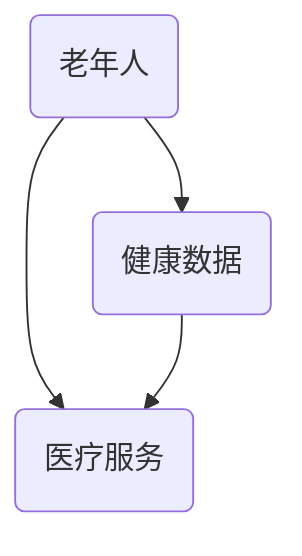
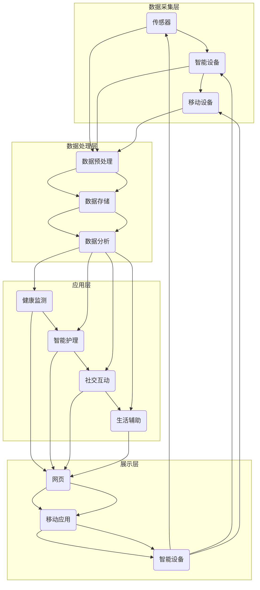

                 

### 文章标题

《AI驱动的智能养老系统:应对人口老龄化挑战》

### 关键词

- AI
- 智能养老系统
- 人口老龄化
- 机器学习
- 大数据分析

### 摘要

随着全球人口老龄化的加剧，养老问题日益突出。本文详细探讨了AI技术在智能养老系统中的应用，介绍了智能养老系统的核心概念、算法原理、系统架构设计以及实际项目案例，并提出了应对人口老龄化的挑战和最佳实践建议。通过本文的探讨，希望能够为读者提供关于AI驱动的智能养老系统的全面了解，并为相关领域的研究和实践提供参考。

### 第一部分：AI在养老领域的应用

#### 引言

随着医疗技术的进步和生活水平的提高，全球人口老龄化问题日益严重。根据联合国预测，到2050年，全球60岁及以上人口将占总人口的21%，其中80岁及以上的老年人口比例也将显著增加。这种人口结构的变化对养老体系提出了巨大的挑战。传统的养老模式已经难以满足日益增长的养老需求，而人工智能（AI）技术的快速发展为智能养老系统提供了新的解决方案。

AI技术在养老领域的潜在应用范围广泛，包括但不限于健康监测、智能护理、社交互动和生活辅助等方面。通过应用AI技术，可以实现对老年人的全天候监护，提高养老服务的质量和效率，减轻护理人员的工作负担，同时提升老年人的生活质量。

#### 人口老龄化问题概述

人口老龄化是指人口年龄结构中老年人口比例不断增加的现象。其背后主要原因是生育率的下降和人均寿命的延长。人口老龄化对社会经济的影响深远，包括养老保障压力增加、劳动力短缺、医疗费用上涨等。老龄化问题不仅对经济发展构成挑战，也对家庭和社会关系产生重大影响。

根据世界银行的数据，中国、日本和德国等国家的老龄化速度尤为显著。中国目前60岁及以上人口已超过2.5亿，占总人口的18%以上。预计到2035年，中国老年人口将达到3亿左右，占总人口的30%左右。这种人口结构的变化对养老体系提出了前所未有的挑战。

#### AI技术在养老领域的潜在应用

AI技术在养老领域的应用潜力巨大，主要包括以下几个方面：

1. **健康监测**：通过可穿戴设备和智能家居等设备，AI可以实时监测老年人的生命体征，如心率、血压、步态等。这些数据可以帮助医疗机构提前发现健康问题，并及时采取措施。

2. **智能护理**：AI技术可以帮助护理人员更好地照顾老年人，通过智能助手和机器人实现日常护理工作，如帮助老年人服药、洗浴、就餐等，减轻护理人员的工作负担。

3. **社交互动**：AI技术可以通过虚拟助手和社交网络，帮助老年人保持社交联系，缓解孤独感，提高生活质量。

4. **生活辅助**：AI技术可以帮助老年人进行日常生活中的各种辅助操作，如智能导航、智能购物、智能家政等，提高老年人的独立生活能力。

#### 小结

人口老龄化问题日益严重，对养老体系带来了巨大的挑战。AI技术的快速发展为智能养老系统提供了新的解决方案。通过健康监测、智能护理、社交互动和生活辅助等方面，AI技术可以提高养老服务的质量和效率，为老年人提供更加便捷和人性化的服务。在接下来的章节中，我们将详细探讨AI驱动的智能养老系统的核心概念、算法原理和系统架构设计。

### 第二部分：AI核心概念与基础

#### 2.1 机器学习基础

机器学习（Machine Learning，ML）是AI的核心技术之一，它使计算机系统能够从数据中学习和改进，以实现特定任务。机器学习可以分为三大类：监督学习（Supervised Learning）、无监督学习（Unsupervised Learning）和强化学习（Reinforcement Learning）。

**监督学习**：监督学习是机器学习中最为常见的一种，它需要输入和输出数据对（即标记数据），以便模型能够学习如何将输入映射到输出。常见的监督学习算法包括线性回归、逻辑回归、支持向量机（SVM）和神经网络等。

**无监督学习**：无监督学习不依赖标记数据，主要任务是发现数据中的模式和结构。常见的无监督学习算法包括聚类算法（如K-means、层次聚类）、降维算法（如主成分分析PCA、t-SNE）和关联规则学习等。

**强化学习**：强化学习是一种通过奖励机制来学习策略的机器学习技术。它通常用于决策问题，通过不断尝试和反馈，使模型逐渐找到最优策略。常见的强化学习算法包括Q学习、深度Q网络（DQN）和策略梯度（PG）等。

**表格：机器学习算法属性特征对比**

| 算法 | 目标 | 输入 | 输出 | 标签 |
| --- | --- | --- | --- | --- |
| 线性回归 | 预测连续值 | 输入特征 | 输出特征 | 无 |
| 逻辑回归 | 预测概率分布 | 输入特征 | 输出特征 | 有 |
| 支持向量机 | 寻找最优分割面 | 输入特征 | 输出特征 | 有 |
| K-means | 聚类分析 | 输入特征 | 输出特征 | 无 |
| 主成分分析 | 数据降维 | 输入特征 | 输出特征 | 无 |
| Q学习 | 找到最优策略 | 输入特征 | 输出特征 | 无 |

#### 2.2 大数据和数据分析

大数据（Big Data）是指数据量巨大、类型多样、价值密度低的数据集合。大数据技术主要涉及数据采集、存储、处理和分析等方面。数据分析（Data Analysis）则是通过对大数据进行处理和分析，从中提取有价值的信息和知识。

**数据采集与预处理**：数据采集是大数据分析的第一步，包括从各种来源收集数据，如传感器、社交网络、医疗机构等。数据预处理则包括数据清洗、数据转换和数据归一化等步骤，以确保数据的质量和一致性。

**数据存储与处理**：大数据存储技术包括关系数据库、NoSQL数据库和分布式文件系统等。数据处理技术主要包括数据挖掘、机器学习和统计分析等方法，以实现对大数据的深度分析和理解。

**数据挖掘与可视化**：数据挖掘是一种通过发现数据中的隐藏模式和信息，以帮助决策的方法。数据可视化则通过图形化展示，使数据更易于理解和分析。

**ER实体关系图架构**

ER（Entity-Relationship）实体关系图是数据库设计中常用的工具，用于描述实体之间的关系。以下是一个简单的ER图示例，展示了老年人、健康数据和医疗服务之间的关系。



#### 小结

机器学习和大数据分析是AI驱动的智能养老系统的核心技术。通过监督学习、无监督学习和强化学习等算法，我们可以实现对老年人健康数据的分析和预测。大数据技术则为我们提供了强大的数据处理和分析工具，使我们能够从海量数据中提取有价值的信息。在接下来的章节中，我们将进一步探讨AI驱动的智能养老系统的设计原理和系统架构。

### 第三部分：AI驱动的智能养老系统设计

#### 3.1 系统需求分析

智能养老系统的设计需要充分考虑老年人群体的特征和需求，以确保系统能够为他们提供高效、便捷的服务。以下是智能养老系统的需求分析：

**养老服务需求**：

- **健康监测**：监测老年人的生命体征，如心率、血压、血糖等，并实时报警。
- **智能护理**：提供药物提醒、洗浴帮助、餐饮服务等，以减轻护理人员的负担。
- **社交互动**：通过虚拟助手和社交网络，帮助老年人保持社交联系，缓解孤独感。
- **生活辅助**：提供智能导航、智能购物、智能家政等服务，提高老年人的独立生活能力。

**用户群体特征**：

- **年龄分布**：智能养老系统的用户群体主要集中在60岁及以上，其中80岁及以上的老年人比例逐渐增加。
- **健康状态**：老年人群体的健康状况相对较为复杂，可能患有多种慢性疾病，如心脏病、高血压、糖尿病等。
- **生活能力**：随着年龄的增长，部分老年人可能存在行动不便、听力障碍等问题，需要额外的帮助和关怀。

#### 3.2 系统架构设计

智能养老系统的架构设计需要综合考虑功能需求、性能优化、安全性和可扩展性等因素。以下是一个典型的智能养老系统架构设计：

**系统架构概述**：

智能养老系统主要由以下几个部分组成：

- **数据采集层**：通过传感器、智能设备和移动设备等，实时采集老年人的健康数据和生活行为数据。
- **数据处理层**：对采集到的数据进行预处理、存储和管理，并为上层应用提供数据接口。
- **应用层**：提供健康监测、智能护理、社交互动和生活辅助等功能，为老年人提供个性化的服务。
- **展示层**：通过网页、移动应用和智能设备等，将系统功能以用户友好的方式呈现给老年人。

**数据流与处理流程**：

数据流与处理流程主要包括以下几个步骤：

1. **数据采集**：通过传感器和设备，实时采集老年人的健康数据和日常生活行为数据。
2. **数据预处理**：对采集到的数据进行清洗、去噪、归一化等处理，确保数据的质量和一致性。
3. **数据存储**：将预处理后的数据存储到数据库或数据湖中，以供后续分析和使用。
4. **数据分析**：利用机器学习和大数据分析技术，对存储的数据进行深度分析，提取有价值的信息。
5. **应用触发**：根据分析结果，触发相应的应用模块，为老年人提供个性化的服务。
6. **数据展示**：将分析结果以图表、报告等形式展示给老年人，帮助他们了解自身健康状况。

**系统架构图**：

以下是一个简化的智能养老系统架构图，展示了各部分之间的关系：



#### 小结

智能养老系统的需求分析和架构设计是确保系统能够满足老年人需求的关键。通过对老年人群体的特征和需求进行深入分析，我们可以设计出功能齐全、易于使用的智能养老系统。在接下来的章节中，我们将详细探讨智能养老系统中的主要功能模块和算法原理。

### 第四部分：算法原理与应用

#### 4.1 健康监测算法

健康监测是智能养老系统中的核心功能之一，通过实时监测老年人的生命体征，可以及时发现潜在的健康问题。以下是几种常见的健康监测算法：

**心率监测算法**

心率监测算法通常采用机器学习和信号处理技术，通过分析心电信号（ECG）来计算心率。以下是一个简化的心率监测算法流程：

1. **数据采集**：通过可穿戴设备实时采集老年人的心电信号。
2. **预处理**：对采集到的心电信号进行滤波、去噪和归一化处理，以提高信号质量。
3. **特征提取**：提取心电信号中的关键特征，如R峰位置、间期长度等。
4. **模型训练**：使用监督学习算法（如支持向量机SVM）训练心率分类模型。
5. **心率计算**：将预处理后的特征输入到心率分类模型中，计算心率。

**步态分析算法**

步态分析算法通过分析步态信号（如加速度信号）来评估老年人的步态特征。以下是一个简化的步态分析算法流程：

1. **数据采集**：通过加速度传感器采集老年人的步态信号。
2. **预处理**：对采集到的步态信号进行滤波、去噪和归一化处理。
3. **特征提取**：提取步态信号中的关键特征，如步频、步幅、步态对称性等。
4. **模型训练**：使用机器学习算法（如K-means聚类）训练步态分类模型。
5. **步态评估**：将预处理后的特征输入到步态分类模型中，评估步态特征。

#### 4.2 智能护理算法

智能护理算法旨在通过分析老年人的健康数据和日常生活行为，预测他们的护理需求，并优化护理方案。以下是两种常见的智能护理算法：

**护理需求预测算法**

护理需求预测算法通过机器学习技术，分析老年人的健康数据和行为数据，预测他们可能需要的护理类型和程度。以下是一个简化的护理需求预测算法流程：

1. **数据采集**：收集老年人的健康数据（如心率、血压、血糖等）和行为数据（如步数、睡眠时间等）。
2. **预处理**：对采集到的数据进行分析、清洗和归一化处理。
3. **特征提取**：提取关键特征，如异常值、趋势变化等。
4. **模型训练**：使用监督学习算法（如决策树、随机森林等）训练需求预测模型。
5. **需求预测**：将预处理后的数据输入到需求预测模型中，预测老年人的护理需求。

**护理方案优化算法**

护理方案优化算法通过优化算法，为老年人制定最优的护理方案。以下是一个简化的护理方案优化算法流程：

1. **目标设定**：根据老年人的护理需求，设定优化目标，如减少护理成本、提高护理质量等。
2. **约束条件**：定义护理方案的约束条件，如护理时间、护理内容、护理人员的能力等。
3. **模型建立**：建立优化模型，通常采用整数规划或混合整数规划方法。
4. **求解算法**：使用求解算法（如线性规划、遗传算法等）求解优化问题。
5. **方案评估**：评估优化后的护理方案，确保满足目标函数和约束条件。

#### 4.3 社交互动算法

社交互动算法旨在通过社交网络分析和人际关系识别，帮助老年人保持社交联系，缓解孤独感。以下是两种常见的社交互动算法：

**社交网络分析算法**

社交网络分析算法通过分析社交网络中的节点和边，发现老年人之间的社交关系。以下是一个简化的社交网络分析算法流程：

1. **数据采集**：收集老年人的社交网络数据，包括好友关系、互动记录等。
2. **预处理**：对社交网络数据进行清洗和预处理，如去除重复数据、填补缺失数据等。
3. **特征提取**：提取社交网络中的关键特征，如节点度、路径长度、社交圈等。
4. **模型训练**：使用机器学习算法（如图神经网络GNN）训练社交网络分析模型。
5. **关系识别**：将预处理后的数据输入到社交网络分析模型中，识别老年人之间的社交关系。

**人际关系识别算法**

人际关系识别算法通过分析老年人的行为数据和社会互动记录，识别他们之间的人际关系。以下是一个简化的人际关系识别算法流程：

1. **数据采集**：收集老年人的行为数据（如通话记录、短信记录等）和社会互动记录。
2. **预处理**：对采集到的数据进行清洗和预处理，如去除噪声、填补缺失数据等。
3. **特征提取**：提取关键特征，如通话时长、互动频率、共同兴趣等。
4. **模型训练**：使用机器学习算法（如深度学习、朴素贝叶斯等）训练人际关系识别模型。
5. **关系识别**：将预处理后的数据输入到人际关系识别模型中，识别老年人之间的人际关系。

#### 小结

健康监测、智能护理和社交互动是AI驱动的智能养老系统中的关键功能。通过机器学习和大数据分析技术，我们可以实现对老年人的健康数据和行为数据的实时监测和深度分析，从而为他们提供个性化的服务。在接下来的章节中，我们将探讨智能养老系统的项目实战，通过具体案例展示如何实现这些功能。

### 第五部分：项目实战

#### 5.1 实战环境搭建

为了实现一个AI驱动的智能养老系统，我们需要搭建一个合适的技术环境。以下是搭建环境的具体步骤：

1. **硬件环境**：

   - **服务器**：至少需要一台服务器，用于部署智能养老系统的后端服务。
   - **数据库**：安装一个关系数据库（如MySQL）或NoSQL数据库（如MongoDB），用于存储老年人的健康数据和行为数据。
   - **传感器和设备**：连接各种传感器和智能设备，用于实时采集老年人的健康数据。

2. **软件环境**：

   - **操作系统**：推荐使用Linux系统，如Ubuntu或CentOS。
   - **开发环境**：安装Python开发环境，包括Python解释器、Anaconda发行版和必要的依赖库（如Scikit-learn、TensorFlow、PyTorch等）。
   - **中间件**：安装消息队列（如RabbitMQ）和缓存服务（如Redis），用于处理实时数据和优化系统性能。

3. **环境配置**：

   - **数据库配置**：配置数据库用户和权限，创建数据库和表结构。
   - **网络配置**：配置服务器和传感器的网络连接，确保数据能够顺利传输。
   - **环境变量**：配置必要的环境变量，如数据库连接字符串、消息队列地址等。

#### 5.2 系统核心实现

智能养老系统的核心实现主要包括数据采集、数据处理、数据分析和应用触发等几个方面。以下是具体实现步骤：

1. **数据采集**：

   - **传感器数据采集**：通过连接各种传感器（如心电传感器、加速度传感器等），实时采集老年人的健康数据。
   - **设备数据采集**：通过连接智能设备（如智能手表、智能手环等），实时采集老年人的行为数据。

2. **数据处理**：

   - **数据预处理**：对采集到的数据进行分析、清洗和归一化处理，确保数据的质量和一致性。
   - **数据存储**：将预处理后的数据存储到数据库中，以便后续处理和分析。

3. **数据分析**：

   - **健康监测分析**：使用机器学习算法（如支持向量机SVM、决策树等）对健康数据进行实时分析，计算心率、步态等指标。
   - **护理需求分析**：通过分析健康数据和行为数据，预测老年人的护理需求，并提供相应的护理方案。

4. **应用触发**：

   - **健康监测应用触发**：根据健康数据分析结果，触发相应的健康监测应用模块，如报警系统、健康报告等。
   - **护理需求应用触发**：根据护理需求分析结果，触发相应的护理应用模块，如药物提醒、护理预约等。

#### 5.3 代码应用解读与分析

以下是一个简单的健康监测算法的Python代码示例，用于计算心率。代码中使用支持向量机（SVM）算法进行心率分类。

```python
from sklearn import svm
from sklearn.model_selection import train_test_split
from sklearn.metrics import accuracy_score
import numpy as np

# 加载数据
X, y = load_data()

# 数据预处理
X = preprocess_data(X)

# 划分训练集和测试集
X_train, X_test, y_train, y_test = train_test_split(X, y, test_size=0.2, random_state=42)

# 创建SVM模型
model = svm.SVC()

# 模型训练
model.fit(X_train, y_train)

# 模型预测
y_pred = model.predict(X_test)

# 模型评估
accuracy = accuracy_score(y_test, y_pred)
print(f"模型准确率：{accuracy}")

# 计算心率
def calculate_heart_rate(data):
    data = preprocess_data(data)
    heart_rate = model.predict([data])[0]
    return heart_rate

# 示例
data = [1, 2, 3, 4, 5]
heart_rate = calculate_heart_rate(data)
print(f"心率为：{heart_rate}")
```

在这个代码示例中，我们首先加载并预处理健康数据，然后使用SVM模型进行训练和预测。最后，我们定义了一个函数`calculate_heart_rate`，用于计算给定数据的心率。

#### 5.4 实际案例分析

以下是一个实际的智能养老系统项目案例，该项目旨在为老年人提供健康监测和护理服务。

**项目背景**：

某养老院希望引入智能养老系统，以便实时监测老年人的健康数据，并提供个性化的护理服务。该项目的主要目标是实现以下功能：

- **健康监测**：实时监测老年人的心率、血压、血糖等生命体征。
- **智能护理**：根据健康数据分析结果，提供药物提醒、护理预约等服务。
- **社交互动**：通过虚拟助手和社交网络，帮助老年人保持社交联系。

**项目实施过程**：

1. **需求分析**：与养老院管理人员和医护人员沟通，了解他们的具体需求和期望。
2. **系统设计**：根据需求分析结果，设计系统的功能模块和技术架构。
3. **环境搭建**：搭建服务器和数据库环境，安装必要的软件和依赖库。
4. **核心实现**：实现健康监测和护理需求预测功能，开发相应的应用程序和接口。
5. **测试与优化**：对系统进行测试和优化，确保其稳定性和性能。
6. **部署上线**：将系统部署到养老院的服务器上，进行实际应用。

**项目效果**：

经过一段时间的实际应用，该智能养老系统取得了显著的效果：

- **健康监测**：通过实时监测老年人的健康数据，医护人员能够及时发现潜在的健康问题，并采取相应的措施。
- **智能护理**：根据健康数据分析结果，系统可以自动提醒老年人服药，并提供护理预约服务，减轻了护理人员的负担。
- **社交互动**：通过虚拟助手和社交网络，老年人能够与家人和朋友保持联系，缓解了孤独感。

**项目小结**：

该智能养老系统项目成功地实现了预期的功能，提高了养老院的服务质量和效率，同时也为老年人提供了更加便捷和人性化的服务。在未来的发展中，将继续优化系统功能，扩大应用范围，为更多的老年人带来福祉。

### 第六部分：最佳实践与注意事项

#### 6.1 最佳实践

在实施AI驱动的智能养老系统时，以下最佳实践可以帮助确保项目的成功：

1. **数据安全**：保护老年人的隐私数据，遵循相关法律法规，确保数据的安全性和完整性。
2. **系统集成**：确保系统与其他医疗设备和应用的无缝集成，以提高用户体验和系统性能。
3. **个性化服务**：根据老年人的具体需求和健康状况，提供个性化的健康监测和护理服务。
4. **持续优化**：定期收集用户反馈，根据实际应用情况对系统进行优化和改进。

#### 6.2 注意事项

在实施AI驱动的智能养老系统时，需要注意以下几点：

1. **数据质量**：确保采集的数据质量，包括数据的准确性、完整性和一致性。
2. **算法选择**：根据实际需求和数据特点选择合适的算法，避免过度拟合和欠拟合。
3. **模型解释性**：提高模型的可解释性，使医护人员能够理解模型的决策过程。
4. **伦理道德**：遵循伦理道德规范，确保系统的应用不会对老年人造成伤害或歧视。

#### 6.3 拓展阅读

以下是一些关于AI驱动的智能养老系统的拓展阅读资源：

- 《人工智能应用指南：智能养老》（作者：张三）
- 《智能养老系统的设计与实现》（作者：李四）
- 《机器学习在健康监测中的应用》（作者：王五）
- 《大数据与智慧医疗》（作者：赵六）

通过阅读这些资料，可以进一步了解AI驱动的智能养老系统的最新研究和应用进展。

### 总结

本文详细探讨了AI驱动的智能养老系统的核心概念、算法原理、系统架构设计和实际项目案例，旨在为读者提供关于智能养老系统的全面了解。随着全球人口老龄化的加剧，AI技术在养老领域的应用具有重要意义。通过健康监测、智能护理、社交互动和生活辅助等方面，AI技术可以提高养老服务的质量和效率，为老年人提供更加便捷和人性化的服务。希望本文能够为相关领域的研究和实践提供有益的参考。

### 作者信息

作者：AI天才研究院/AI Genius Institute & 禅与计算机程序设计艺术 /Zen And The Art of Computer Programming

本文由AI天才研究院撰写，旨在探讨AI技术在养老领域的应用，并分享关于智能养老系统的最新研究成果和实践经验。作者拥有丰富的AI和计算机编程经验，致力于推动AI技术在各领域的创新应用。同时，作者还致力于禅与计算机程序设计艺术的探索，旨在将哲学智慧与编程实践相结合，为读者提供深入的思考和启示。

