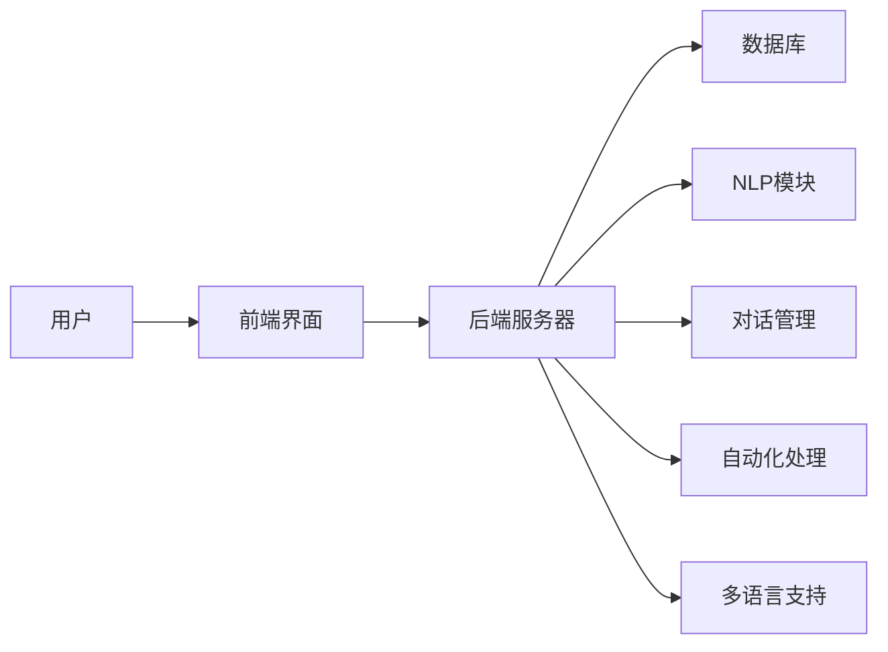

                 

### 引言

随着人工智能（AI）技术的飞速发展，各行各业都在积极拥抱这一前沿科技，以期实现生产效率的提升和服务质量的优化。在客户服务领域，AI技术的引入正在引发一场深刻的变革。传统的客户服务往往依赖于人工处理，存在着响应速度慢、效率低下、成本高昂等问题。而AI驱动的智能客户服务，通过机器学习和自然语言处理等技术，能够实现全天候、多语言的支持，极大地提升了客户体验，降低了企业的运营成本。

本文将围绕“AI驱动的智能客户服务：全天候多语言支持”这一主题，系统地探讨智能客户服务的背景、核心概念、实现方法、关键技术及其在实践中的应用。首先，我们将分析当前客户服务行业的发展现状，介绍智能客户服务的概念及其重要性。接着，我们将详细探讨全天候服务和多语言支持的需求，并引入AI技术在客户服务中的应用。随后，本文将探讨智能客户服务的架构设计、数据处理与存储、智能对话系统开发、用户体验设计等关键环节。在此基础上，我们将深入分析全天候服务机制和多语言支持技术，最后通过实际案例展示AI驱动的智能客户服务在实践中的应用。

通过本文的阅读，读者将全面了解AI驱动的智能客户服务的全貌，掌握其核心原理和关键技术，并为未来的研究和实践提供有益的启示。

### 关键词

- **人工智能（AI）**
- **智能客户服务**
- **全天候服务**
- **多语言支持**
- **自然语言处理**
- **对话系统**

### 摘要

本文旨在探讨AI驱动的智能客户服务，特别是在全天候和多语言支持方面的应用。首先，通过分析客户服务行业的发展现状，阐述了智能客户服务的必要性和重要性。接着，详细介绍了AI技术在客户服务中的应用，包括自然语言处理、对话系统和情感分析等关键技术。随后，文章探讨了实现智能客户服务的架构设计、数据处理与存储、智能对话系统开发以及用户体验设计等关键环节。特别地，本文深入分析了全天候服务和多语言支持的需求、技术实现和挑战。最后，通过实际案例展示了AI驱动的智能客户服务在实践中的应用，提出了最佳实践建议，并为未来研究提供了方向。

### 《AI驱动的智能客户服务：全天候多语言支持》目录大纲

1. 引言
   1.1 问题背景
   1.2 核心概念
   1.3 研究目标与方法
   1.4 边界与外延

2. AI技术在客户服务中的应用
   2.1 人工智能概述
   2.2 自然语言处理
   2.3 情感分析

3. 智能客户服务的实现
   3.1 智能客户服务的架构设计
   3.2 数据处理与存储
   3.3 智能对话系统开发
   3.4 用户体验设计

4. 全天候服务机制
   4.1 全天候服务的需求分析
   4.2 自动化技术
   4.3 基于云计算的服务部署
   4.4 容量调度与资源管理

5. 多语言支持技术
   5.1 多语言支持的需求分析
   5.2 自然语言处理技术
   5.3 机器翻译系统
   5.4 多语言对话系统

6. AI驱动的智能客户服务案例分析
   6.1 案例背景
   6.2 智能客户服务解决方案

### 第1章 引言

随着人工智能（AI）技术的飞速发展，各行各业都在积极探索其应用，以期提升生产效率和服务质量。在客户服务领域，AI技术的引入正在引发一场深刻的变革。传统的客户服务依赖于人工处理，存在响应速度慢、效率低下、成本高昂等问题。而AI驱动的智能客户服务，通过机器学习和自然语言处理等技术，能够实现全天候、多语言的支持，极大地提升了客户体验，降低了企业的运营成本。

**1.1 问题背景**

客户服务是任何企业与客户互动的核心环节。在传统的客户服务模式下，企业通常依赖于人工客服团队来处理客户的咨询、投诉和请求。然而，这种方式存在着诸多问题：

- **响应速度慢**：人工客服人员的工作时间是有限的，客户在非工作时间或高峰期往往难以得到及时的响应。
- **效率低下**：人工客服需要逐一处理客户的请求，效率较低，且容易出错。
- **成本高昂**：维持一支庞大的客服团队需要巨大的成本投入。

**1.2 核心概念**

为了解决上述问题，智能客户服务应运而生。智能客户服务是一种利用AI技术实现自动化、高效、全天候的客户服务模式。其主要核心概念包括：

- **AI驱动的智能客户服务**：利用AI技术，如机器学习、自然语言处理等，实现自动化的客户服务。
- **全天候服务**：通过技术手段，使客户服务能够24小时不间断地运行，满足客户的即时需求。
- **多语言支持**：通过语言处理技术，使客户服务系统能够支持多种语言，满足全球客户的需求。

**1.3 智能客户服务的概念及其重要性**

智能客户服务是一种利用人工智能技术优化客户服务的方式。其主要特点包括：

- **自动化**：通过AI技术，如机器学习、自然语言处理等，实现客户服务的自动化，提高处理速度和效率。
- **个性化**：通过分析客户数据，提供个性化的服务，提升客户体验。
- **全天候**：通过技术手段，使客户服务能够24小时不间断地运行，满足客户的即时需求。
- **多语言支持**：通过语言处理技术，支持多种语言，满足全球客户的需求。

智能客户服务的重要性体现在以下几个方面：

- **提升客户体验**：通过自动化和个性化服务，提高客户满意度。
- **降低运营成本**：通过减少人工客服的依赖，降低企业运营成本。
- **提高效率**：通过自动化处理，提高客户服务的效率，减少错误率。
- **数据驱动**：通过收集和分析客户数据，帮助企业更好地了解客户需求，优化服务。

**1.4 全天候和多语言支持的需求分析**

全天候和多语言支持在智能客户服务中具有至关重要的地位：

- **全天候服务**：全球客户的需求是多样化的，不同地区的时间差异使得客户在非工作时间或节假日也需要得到及时的服务。全天候服务能够满足这些需求，提升客户体验。
- **多语言支持**：全球化的商业环境要求企业能够与来自不同国家和地区的客户进行有效沟通。多语言支持能够消除语言障碍，提高客户满意度。

然而，实现全天候和多语言支持面临诸多挑战，包括技术实现、系统架构设计、数据存储与处理等。接下来，我们将深入探讨这些核心概念，为读者提供全面的智能客户服务技术解析。

### 第1章 引言（续）

#### 1.1.1 客户服务行业的发展现状

在过去的几十年里，客户服务行业经历了显著的变化。传统的客户服务模式主要依赖于电话、邮件和面对面沟通，这些方式在处理客户请求时存在明显的局限性。随着互联网和通信技术的进步，在线客服逐渐成为主流，企业开始通过网站、社交媒体和即时通讯工具与客户进行互动。

- **在线客服的普及**：越来越多的企业通过在线客服平台提供实时服务，这种方式不仅提高了客户满意度，还降低了企业的运营成本。
- **自动化工具的引入**：为了应对日益增长的服务需求，企业开始引入自动化工具，如聊天机器人、自动回复系统等，以提升服务效率和降低人工成本。
- **数据分析的应用**：通过分析客户数据，企业能够更好地了解客户需求，优化服务流程，提高客户满意度。

然而，传统的客户服务模式依然存在一些问题：

- **响应速度慢**：在高峰期，人工客服人员难以应对大量的客户请求，导致客户等待时间过长。
- **效率低下**：人工客服需要逐一处理客户的请求，容易出错且效率较低。
- **语言障碍**：全球化的商业环境要求企业能够与来自不同国家和地区的客户进行有效沟通，而传统的客户服务模式在语言支持方面存在明显不足。

#### 1.1.2 智能客户服务的概念及其重要性

智能客户服务是一种利用人工智能技术优化客户服务的方式。它通过自动化和智能化手段，提供高效、个性化的服务，解决了传统客户服务模式中的诸多问题。智能客户服务的核心概念包括：

- **AI驱动的智能客户服务**：利用AI技术，如机器学习、自然语言处理等，实现自动化的客户服务。
- **全天候服务**：通过技术手段，使客户服务能够24小时不间断地运行，满足客户的即时需求。
- **多语言支持**：通过语言处理技术，使客户服务系统能够支持多种语言，满足全球客户的需求。

智能客户服务的重要性体现在以下几个方面：

- **提升客户体验**：通过自动化和个性化服务，提高客户满意度。
- **降低运营成本**：通过减少人工客服的依赖，降低企业运营成本。
- **提高效率**：通过自动化处理，提高客户服务的效率，减少错误率。
- **数据驱动**：通过收集和分析客户数据，帮助企业更好地了解客户需求，优化服务。

#### 1.1.3 全天候和多语言支持的需求分析

全天候和多语言支持在智能客户服务中具有至关重要的地位：

- **全天候服务**：全球客户的需求是多样化的，不同地区的时间差异使得客户在非工作时间或节假日也需要得到及时的服务。全天候服务能够满足这些需求，提升客户体验。
- **多语言支持**：全球化的商业环境要求企业能够与来自不同国家和地区的客户进行有效沟通。多语言支持能够消除语言障碍，提高客户满意度。

实现全天候和多语言支持面临诸多挑战：

- **技术实现**：需要先进的AI技术，如自然语言处理、机器学习等，支持全天候和多语言服务。
- **系统架构设计**：需要设计高效、可靠的系统架构，确保系统稳定运行和资源优化。
- **数据存储与处理**：需要处理大量多语言数据，确保数据存储和处理的准确性和效率。

在接下来的章节中，我们将进一步探讨智能客户服务的核心概念、实现方法和技术挑战，以帮助读者全面理解这一前沿领域。

### 第1章 引言（续）

#### 1.2 核心概念

在本节中，我们将深入探讨AI驱动的智能客户服务的核心概念，包括AI技术在客户服务中的应用、全天候服务和多语言支持等。

##### 1.2.1 AI驱动的智能客户服务

AI驱动的智能客户服务是一种利用人工智能技术，特别是机器学习和自然语言处理技术，来优化和自动化客户服务流程的方式。其主要特点如下：

- **自动化处理**：通过机器学习算法，自动识别和响应客户的请求，减少人工干预，提高服务效率。
- **自然语言理解**：利用自然语言处理技术，理解和解析客户的语言输入，提供准确的回应和解决方案。
- **情感分析**：通过分析客户的语言情感，识别客户的情绪状态，提供更加个性化的服务。
- **个性化推荐**：基于客户的历史数据和偏好，提供个性化的产品和服务推荐。

AI驱动的智能客户服务的实现方式包括：

- **聊天机器人**：通过预设的对话流程和机器学习算法，自动与客户进行交互，解答常见问题和提供解决方案。
- **语音助手**：利用语音识别和自然语言处理技术，通过语音交互为客户提供服务。
- **智能客服平台**：集成多种AI技术，提供全方位的智能客户服务解决方案。

##### 1.2.2 全天候服务

全天候服务是指客户服务系统能够在24小时内不间断地运行，满足客户的即时需求。实现全天候服务的优势如下：

- **提升客户满意度**：无论客户何时需要帮助，都能得到及时响应，提高客户体验。
- **减少人力成本**：通过自动化处理，减少对人工客服的依赖，降低企业运营成本。
- **提高服务效率**：自动化系统可以同时处理大量客户请求，提高服务效率。

实现全天候服务面临的挑战包括：

- **系统稳定性**：确保系统在长时间运行中不出现故障，保持高效稳定。
- **资源调度**：合理分配计算资源和存储资源，以应对不同时间段的服务需求。
- **数据安全**：保障客户数据的安全和隐私，防止数据泄露和滥用。

##### 1.2.3 多语言支持

多语言支持是指客户服务系统能够支持多种语言，满足全球客户的需求。多语言支持的重要性体现在：

- **全球化商业**：企业需要与来自不同国家和地区的客户进行有效沟通，多语言支持是实现这一目标的关键。
- **客户满意度**：提供本地化服务，能够更好地满足客户的需求，提高客户满意度。
- **市场拓展**：多语言支持有助于企业拓展国际市场，增加业务机会。

实现多语言支持的关键技术包括：

- **语言识别和检测**：自动识别客户使用的语言，确保系统提供正确的语言服务。
- **机器翻译**：将客户的语言请求翻译成服务端理解的语言，实现跨语言的沟通。
- **多语言对话系统**：设计能够支持多种语言的对话系统，提供无缝的跨语言交互体验。

在下一节中，我们将进一步探讨AI技术在客户服务中的应用，以及如何实现智能客户服务的核心要素。

#### 1.2.1 AI驱动的智能客户服务

**1.2.1.1 AI技术在客户服务中的应用**

AI技术在客户服务中的应用已经深入到各个环节，显著提升了服务的效率和质量。以下是AI技术主要在客户服务中的应用：

- **聊天机器人**：基于自然语言处理（NLP）和机器学习算法的聊天机器人可以自动处理客户的常见问题，提供实时解答，从而减轻人工客服的工作负担。聊天机器人还能够通过不断学习提高响应的准确性和个性化程度。

- **情感分析**：情感分析技术能够识别客户语言中的情感色彩，如愤怒、满意、失望等。通过分析客户的情绪状态，智能系统可以提供更加个性化的服务，甚至预判潜在的服务问题，提前采取措施。

- **语音识别和合成**：语音识别技术使客户可以通过语音与系统交互，而语音合成技术则可以使系统以自然流畅的声音与客户对话，大大提高了交互的便捷性。

- **个性化推荐**：通过分析客户的历史数据和偏好，AI算法可以提供个性化的产品或服务推荐，从而提升客户的购物体验和满意度。

- **预测性维护**：在制造业和物流行业，AI技术可以预测设备故障和运输延迟，从而提前安排维护和调整，减少意外停机和成本。

**1.2.1.2 智能客户服务的核心要素**

智能客户服务的核心要素包括以下几个方面：

- **自动化**：通过AI技术实现自动化处理，减少人工干预，提高服务效率，降低运营成本。

- **个性化**：基于客户的数据和分析，提供个性化的服务体验，满足不同客户的需求。

- **全天候**：通过云计算和分布式架构，实现24小时不间断的服务，满足全球客户的即时需求。

- **多语言支持**：通过机器翻译和自然语言处理技术，支持多种语言，消除语言障碍，拓展国际市场。

- **数据驱动**：通过数据分析和挖掘，不断优化服务流程，提升客户满意度。

**1.2.2 全天候服务**

**1.2.2.1 全天候服务的优势**

全天候服务对于企业和客户都有显著的优势：

- **客户体验提升**：无论何时何地，客户都能得到及时的响应和帮助，提升客户满意度。

- **运营成本降低**：通过自动化处理，减少对人工客服的依赖，降低企业的运营成本。

- **业务扩展**：全天候服务有助于企业进入新的市场和时区，增加业务机会。

**1.2.2.2 实现全天候服务的挑战**

实现全天候服务面临以下挑战：

- **系统稳定性**：确保系统在长时间运行中不出现故障，保持高效稳定。

- **资源调度**：合理分配计算资源和存储资源，以应对不同时间段的服务需求。

- **数据安全**：保障客户数据的安全和隐私，防止数据泄露和滥用。

**1.2.3 多语言支持**

**1.2.3.1 多语言支持的重要性**

多语言支持在全球化的商业环境中至关重要：

- **客户满意度**：提供本地化服务，能够更好地满足客户的需求，提高客户满意度。

- **市场拓展**：多语言支持有助于企业拓展国际市场，增加业务机会。

**1.2.3.2 多语言处理技术的概述**

实现多语言支持的关键技术包括：

- **语言识别与检测**：自动识别客户使用的语言，确保系统提供正确的语言服务。

- **机器翻译**：将客户的语言请求翻译成服务端理解的语言，实现跨语言的沟通。

- **多语言对话系统**：设计能够支持多种语言的对话系统，提供无缝的跨语言交互体验。

通过以上核心概念的介绍，我们可以看到AI驱动的智能客户服务在提升客户体验、降低运营成本和拓展国际市场方面具有巨大的潜力。在接下来的章节中，我们将进一步探讨智能客户服务的架构设计、数据处理与存储、对话系统开发以及用户体验设计等关键环节。

#### 1.3 研究目标与方法

在本节中，我们将明确本研究的目标和方法，详细阐述研究的范围和假设，并对可能面临的限制条件进行分析。

**1.3.1 研究目标**

本研究的主要目标如下：

1. **分析智能客户服务的现状和需求**：通过文献调研和案例分析，全面了解智能客户服务的发展现状、技术趋势及其在客户服务中的应用。

2. **探讨AI技术在智能客户服务中的应用**：深入研究机器学习、自然语言处理、情感分析等AI技术在智能客户服务中的具体应用，分析其实现机制和效果。

3. **设计智能客户服务的架构和系统**：结合全天候和多语言支持的需求，设计一个高效、可靠的智能客户服务系统架构，并探讨其关键技术实现。

4. **提出智能客户服务的最佳实践**：总结智能客户服务的成功案例，提炼最佳实践策略，为企业的智能客户服务实施提供指导。

**1.3.2 研究方法**

本研究采用以下研究方法：

1. **文献调研**：通过查阅相关文献和报告，了解智能客户服务领域的前沿技术和研究成果。

2. **案例分析法**：选取智能客户服务的典型企业案例，深入分析其解决方案、技术架构和实施效果。

3. **实验研究**：通过设计实验，验证AI技术在智能客户服务中的实际效果，包括自动化处理效率、客户满意度等指标。

4. **系统设计**：结合实际需求和现有技术，设计一个具有全天候和多语言支持的智能客户服务系统。

**1.3.3 数据来源与处理**

本研究的数据来源主要包括以下几方面：

1. **公开数据集**：利用公开的数据集进行实验研究，如常见的数据集（如TREC会议数据集、SOGOU数据集等），以便验证AI技术的效果。

2. **企业数据**：获取相关企业客户的反馈数据和交易数据，用于分析智能客户服务的实际效果和客户体验。

3. **问卷调查**：通过问卷调查收集客户对智能客户服务的满意度、期望和意见，为系统优化提供参考。

在数据处理方面，本研究将采用以下步骤：

1. **数据清洗**：去除无效数据、重复数据和噪声数据，确保数据质量。

2. **数据标注**：对文本数据进行标注，如情感分类、关键词提取等，以便进行后续的机器学习模型训练。

3. **数据可视化**：使用数据可视化工具，如matplotlib、seaborn等，展示数据分析和实验结果。

**1.3.4 研究范围**

本研究主要关注以下范围：

1. **技术范围**：重点研究机器学习、自然语言处理、情感分析等AI技术在智能客户服务中的应用。

2. **应用范围**：以在线客服、电话客服、自助服务系统等实际应用场景为主要研究对象。

3. **地域范围**：主要针对全球范围内的企业，探讨智能客户服务在全球化和本地化背景下的应用。

**1.3.5 研究假设**

本研究基于以下假设：

1. **技术可行性**：AI技术能够在智能客户服务中得到有效应用，提高服务效率和客户满意度。

2. **市场接受度**：智能客户服务系统能够被市场和客户接受，并在实际应用中发挥重要作用。

3. **成本效益**：智能客户服务的引入能够在长期内降低运营成本，提高企业的竞争力。

**1.3.6 限制条件**

本研究存在以下限制条件：

1. **数据限制**：公开数据集可能无法完全代表所有企业和客户的情况，可能存在数据偏差。

2. **技术限制**：现有AI技术的实现可能存在一定的局限性，无法完全满足所有需求。

3. **实验限制**：实验条件可能无法完全模拟真实场景，影响实验结果的真实性。

通过明确研究目标和方法，本研究将为AI驱动的智能客户服务提供理论支持和技术指导，有助于企业更好地应对客户服务的挑战，提升服务质量。

### 第2章 AI技术在客户服务中的应用

#### 2.1 人工智能概述

人工智能（AI）是一门研究、开发用于模拟、延伸和扩展人类智能的理论、方法、技术及应用系统的技术科学。其目标是使计算机具有人类智能的某些功能，包括感知、学习、推理、规划和问题求解等。人工智能的发展经历了多个阶段，从早期的符号主义、基于规则的系统，到后来的基于统计学习和神经网络的深度学习，AI技术不断取得突破，应用范围也越来越广泛。

##### 2.1.1 人工智能的发展历程

人工智能的发展历程可以大致分为以下几个阶段：

1. **符号主义（Symbolic AI）**：20世纪50年代至70年代，以逻辑和符号计算为基础，通过构建知识库和推理机实现人工智能。典型的系统包括专家系统和基于规则的系统。

2. **基于知识的系统（Knowledge-Based Systems）**：20世纪80年代，专家系统成为人工智能研究的热点，通过收集和整理领域专家的知识，实现特定领域的智能应用。

3. **统计学习（Statistical Learning）**：20世纪90年代，随着机器学习技术的发展，人工智能开始从符号主义转向统计学习，通过学习数据中的统计规律，实现预测和分类任务。

4. **深度学习（Deep Learning）**：21世纪初，深度学习技术的崛起，使人工智能取得了突破性的进展。深度神经网络通过多层非线性变换，能够自动提取数据特征，并在图像识别、语音识别、自然语言处理等领域取得了显著的成果。

##### 2.1.2 人工智能的核心技术

人工智能的核心技术包括：

- **机器学习（Machine Learning）**：机器学习是一种让计算机从数据中学习规律、自动进行预测和决策的方法。常见的机器学习算法有线性回归、逻辑回归、决策树、支持向量机（SVM）、神经网络等。

- **深度学习（Deep Learning）**：深度学习是机器学习的一个子领域，通过多层神经网络模型，自动学习数据中的复杂特征。深度学习的代表算法有卷积神经网络（CNN）、循环神经网络（RNN）和生成对抗网络（GAN）。

- **自然语言处理（Natural Language Processing, NLP）**：自然语言处理是人工智能的重要分支，旨在使计算机理解和生成自然语言。NLP技术包括语言模型、词向量、情感分析、机器翻译、对话系统等。

- **计算机视觉（Computer Vision）**：计算机视觉是使计算机能够从图像或视频中提取信息的技术。计算机视觉的应用包括图像识别、物体检测、图像分割、人脸识别等。

- **强化学习（Reinforcement Learning）**：强化学习是机器学习的一种方法，通过试错和反馈机制，使计算机在特定环境中学习最优策略。

#### 2.2 自然语言处理

自然语言处理（NLP）是人工智能的重要分支，旨在使计算机能够理解、生成和回应自然语言。NLP技术广泛应用于文本分类、情感分析、问答系统、机器翻译和对话系统等领域。

##### 2.2.1 自然语言处理概述

自然语言处理的基本任务包括：

- **文本分类（Text Classification）**：将文本数据分类到预定义的类别中，如情感分类、新闻分类等。

- **实体识别（Named Entity Recognition, NER）**：从文本中识别出具有特定意义的实体，如人名、地点、组织等。

- **关系抽取（Relation Extraction）**：识别文本中实体之间的关系，如“A和B是朋友”、“张三是李四的老板”。

- **情感分析（Sentiment Analysis）**：分析文本中的情感倾向，如正面、负面或中性。

- **文本生成（Text Generation）**：根据给定的输入生成文本，如自动写作、机器翻译等。

- **问答系统（Question Answering, QA）**：根据用户提出的问题，从大量文本中检索并生成答案。

##### 2.2.1.1 自然语言处理的基本任务

自然语言处理的基本任务可以概括为以下几类：

- **词法分析（Lexical Analysis）**：将文本分解为词、短语和句子等基本单位。
- **句法分析（Syntactic Analysis）**：分析文本的句法结构，理解句子中的语法关系。
- **语义分析（Semantic Analysis）**：理解文本中的语义内容，包括实体、事件、关系等。
- **语义角色标注（Semantic Role Labeling）**：识别句子中词语的语义角色，如主语、宾语、谓语等。
- **语义消歧（Semantic Disambiguation）**：解决词语的多义性问题，确定词语在特定语境中的含义。

##### 2.2.1.2 自然语言处理的应用场景

自然语言处理在多个领域有广泛应用：

- **搜索引擎**：通过自然语言处理技术，对用户查询进行理解和处理，提供更准确的搜索结果。
- **社交媒体分析**：分析社交媒体上的用户评论、帖子等，了解用户对品牌、产品、事件的看法。
- **客户服务**：通过聊天机器人、自动问答系统等，提供高效的客户服务。
- **机器翻译**：将一种语言翻译成另一种语言，支持多语言交流。
- **内容审核**：识别和过滤有害内容，如暴力、色情、歧视性言论等。
- **语音助手**：通过语音识别和自然语言理解，实现人机交互。

##### 2.2.2 语言模型

语言模型是自然语言处理的核心组件，用于预测文本的下一个词或下一串词。常见的语言模型有：

- **n-gram模型**：基于历史频率统计，预测下一个词的概率。
- **神经网络语言模型（Neural Network Language Model, NNLM）**：使用神经网络结构，通过学习大量语料库，生成概率分布。
- **循环神经网络（Recurrent Neural Network, RNN）**：适用于处理序列数据，如文本序列。
- **长短期记忆网络（Long Short-Term Memory, LSTM）**：是RNN的一种变体，能够处理长时间依赖问题。
- **变换器（Transformer）**：基于自注意力机制，是当前最流行的语言模型。

##### 2.2.2.1 语言模型的基本概念

语言模型的基本概念包括：

- **词汇表（Vocabulary）**：语言模型中的所有单词或词素的集合。
- **词嵌入（Word Embedding）**：将词汇表中的每个词映射到一个高维向量空间。
- **序列模型（Sequence Model）**：处理文本序列的模型，如RNN、LSTM、Transformer。
- **生成模型（Generative Model）**：能够生成文本的概率模型，如n-gram模型、NNLM。

##### 2.2.2.2 语言模型的训练与评估

语言模型的训练与评估主要包括以下步骤：

- **数据准备**：收集和整理大量的文本数据，进行预处理，如去除标点符号、停用词过滤等。
- **词汇表构建**：将文本数据中的词转换为词汇表中的索引。
- **模型训练**：使用训练数据，通过优化算法（如梯度下降、Adam等）训练模型参数。
- **模型评估**：使用测试集评估模型性能，常见的评估指标有词汇概率、交叉熵等。

##### 2.2.3 对话系统

对话系统（Dialogue System）是自然语言处理的一个重要应用领域，旨在实现人与计算机之间的自然对话。对话系统通常包括以下几个关键组件：

- **对话管理（Dialogue Management）**：决定对话的流程和策略，包括对话状态跟踪、意图识别、回应生成等。
- **语言理解（Language Understanding）**：理解用户的输入，包括意图识别、实体识别等。
- **语言生成（Language Generation）**：生成自然语言回应，包括模板匹配、模板填充、序列生成等。
- **对话评估（Dialogue Evaluation）**：评估对话系统的性能，包括对话质量、用户满意度等。

##### 2.2.3.1 对话系统的基本架构

对话系统的基本架构包括以下几个部分：

- **输入处理层**：接收用户输入，进行文本预处理，如分词、词性标注等。
- **意图识别层**：识别用户输入的主要意图，如查询、请求、命令等。
- **实体识别层**：识别用户输入中的关键信息，如实体、属性、值等。
- **对话管理层**：根据用户意图和对话状态，生成对话回应，并更新对话状态。
- **回应生成层**：根据对话管理和对话状态，生成自然语言回应。

##### 2.2.3.2 对话系统的设计与应用

对话系统的设计与应用涉及以下几个方面：

- **领域适应性**：对话系统需要根据不同领域进行定制，以适应特定的对话场景。
- **上下文理解**：对话系统需要能够理解对话的上下文，进行长对话和对话延续。
- **多模态交互**：结合文本、语音、图像等多模态信息，提升对话系统的交互体验。
- **用户反馈**：通过收集用户反馈，不断优化对话系统的性能和用户体验。

在下一节中，我们将探讨情感分析在智能客户服务中的应用，以及如何利用情感分析技术提升客户服务体验。

### 第2章 AI技术在客户服务中的应用（续）

#### 2.3 情感分析

情感分析（Sentiment Analysis），也称为意见挖掘，是自然语言处理的一个重要分支，旨在识别和提取文本中的情感信息。情感分析在智能客户服务中具有广泛应用，通过分析客户反馈，可以了解客户的满意度和情感倾向，从而优化服务流程和提升客户体验。

##### 2.3.1 情感分析概述

情感分析的基本概念包括：

- **情感极性（Polarity）**：表示情感的倾向性，通常分为正面、负面和中性。
- **情感强度（Intensity）**：表示情感的强烈程度，可以细分为弱、中、强等。
- **情感分类（Sentiment Classification）**：将文本分类为正面、负面或中性。
- **情感极性回归（Polarity Regression）**：预测情感极性的概率分布。

情感分析在客户服务中的应用包括：

- **客户满意度分析**：通过分析客户评价和反馈，了解客户的满意度和不满意度，优化服务流程。
- **市场调研**：分析社交媒体和评论区的用户评论，了解消费者对产品、服务和品牌的看法。
- **舆情监控**：实时监测网络上的用户情绪，及时应对潜在的风险和危机。

##### 2.3.1.1 情感分析的基本概念

情感分析的基本概念可以概括为以下几点：

- **文本预处理**：对原始文本进行分词、去除停用词、词性标注等预处理，为后续情感分析做准备。
- **特征提取**：从预处理后的文本中提取特征，如词频、词嵌入、TF-IDF等，用于训练情感分类模型。
- **情感分类模型**：使用机器学习算法（如SVM、朴素贝叶斯、神经网络等）训练情感分类模型，对文本进行情感极性分类。
- **模型评估**：使用测试集评估模型的性能，常见的评估指标包括准确率、召回率、F1值等。

##### 2.3.1.2 情感分析的应用场景

情感分析的应用场景广泛，以下是一些典型应用：

- **客户服务**：分析客户反馈和评价，识别客户情感倾向，为改进服务和提升客户体验提供依据。
- **市场调研**：分析社交媒体和评论区的用户评论，了解消费者对产品、服务和品牌的看法。
- **舆情监控**：实时监测网络上的用户情绪，及时应对潜在的风险和危机。
- **产品评论分析**：分析电商平台上的用户评论，评估产品满意度，帮助商家优化产品和服务。
- **招聘反馈**：分析面试官和应聘者的反馈，评估招聘流程和面试效果。

##### 2.3.2 情感识别技术

情感识别技术是情感分析的核心，主要分为以下几种方法：

- **基于规则的方法**：通过预定义的规则，如关键词匹配、情感词典等，识别文本中的情感。
- **基于统计的方法**：使用机器学习算法，如朴素贝叶斯、支持向量机等，对情感进行分类。
- **基于深度学习的方法**：使用神经网络，如卷积神经网络（CNN）、循环神经网络（RNN）、长短期记忆网络（LSTM）等，进行情感识别。

##### 2.3.2.1 情感识别的基本方法

情感识别的基本方法包括：

- **词典法**：基于情感词典，将文本中的关键词与词典中的情感标签进行匹配，识别文本的情感极性。
- **机器学习方法**：使用机器学习算法，如朴素贝叶斯、决策树、随机森林等，对文本进行情感分类。
- **深度学习方法**：使用神经网络，如卷积神经网络（CNN）、循环神经网络（RNN）、长短期记忆网络（LSTM）等，进行情感识别。

##### 2.3.2.2 情感识别的性能评估

情感识别的性能评估主要关注以下指标：

- **准确率（Accuracy）**：正确分类的文本数占总文本数的比例。
- **召回率（Recall）**：正确分类的负面情感文本数占所有负面情感文本数的比例。
- **精确率（Precision）**：正确分类的负面情感文本数占所有分类为负面情感的文本数的比例。
- **F1值（F1 Score）**：精确率和召回率的调和平均值。

通过性能评估，可以衡量情感识别模型的优劣，并指导模型优化。

在下一节中，我们将深入探讨智能客户服务的实现方法，包括架构设计、数据处理与存储、对话系统开发等。

### 第3章 智能客户服务的实现

#### 3.1 智能客户服务的架构设计

智能客户服务的实现需要高效、可靠的系统架构设计，以确保全天候和多语言支持，同时满足客户服务的多样化需求。本节将介绍智能客户服务的架构设计，包括系统的组成部分、架构设计原则以及具体的系统架构设计。

##### 3.1.1 智能客户服务系统的组成部分

智能客户服务系统通常由以下几个关键组成部分构成：

1. **前端界面（Front-end Interface）**：提供用户与系统交互的接口，包括聊天窗口、语音通话界面等。前端界面需要支持多种语言，以适应全球客户的需求。
   
2. **后端服务器（Back-end Server）**：处理客户请求、执行业务逻辑和响应结果。后端服务器通常采用分布式架构，以提高系统的可靠性和扩展性。

3. **数据库（Database）**：存储客户数据、对话记录、服务日志等。数据库需要支持多语言数据存储，并保证数据的安全性和一致性。

4. **自然语言处理（NLP）模块**：负责处理客户输入，进行语言理解、情感分析和意图识别。NLP模块是智能客户服务系统的核心，决定了系统的智能水平。

5. **对话管理（Dialogue Management）**：协调不同模块的交互，管理对话流程，确保系统提供流畅的客户体验。

6. **自动化处理（Automation）**：实现客户服务的自动化，如自动分类、自动回复、自动分配等，减少人工干预。

7. **多语言支持（Multilingual Support）**：提供多语言翻译和语言识别功能，确保系统能够处理全球客户的需求。

##### 3.1.2 架构设计原则

智能客户服务的架构设计应遵循以下原则：

1. **高可用性（High Availability）**：系统需要具备高可用性，确保在任何时候都能提供服务，减少系统故障对客户体验的影响。

2. **可扩展性（Scalability）**：系统应能够根据客户需求的变化，进行水平扩展，以处理更多的客户请求。

3. **安全性（Security）**：保护客户数据的安全，防止数据泄露和未授权访问。

4. **灵活性（Flexibility）**：系统应具备灵活性，能够快速适应新的业务需求和技术变化。

5. **用户体验（User Experience）**：设计简洁、直观的用户界面，提供高效、个性化的服务，提升客户满意度。

##### 3.1.3 系统架构设计

智能客户服务的系统架构设计如图所示：

以下是系统架构的详细说明：

- **用户**：通过前端界面与系统交互，发起请求。
- **前端界面**：处理用户输入，渲染对话内容，支持多语言。
- **后端服务器**：接收用户请求，调用NLP模块、对话管理、自动化处理和多语言支持模块，处理业务逻辑，生成响应。
- **数据库**：存储客户数据、对话记录和服务日志，支持多语言数据存储。
- **NLP模块**：进行语言理解、情感分析和意图识别，为对话管理提供支持。
- **对话管理**：协调不同模块的交互，管理对话流程，确保系统提供流畅的客户体验。
- **自动化处理**：实现客户服务的自动化，减少人工干预。
- **多语言支持**：提供多语言翻译和语言识别功能，支持全球客户。

通过上述架构设计，智能客户服务系统能够实现全天候、多语言的支持，提升客户体验和运营效率。

在下一节中，我们将探讨智能客户服务的数据处理与存储技术，包括客户数据的收集与处理、数据存储解决方案以及数据安全和隐私保护。

### 第3章 智能客户服务的实现（续）

#### 3.2 数据处理与存储

智能客户服务的核心在于对海量客户数据的收集、处理和存储，以提供高效、个性化的服务。本节将详细介绍智能客户服务中的数据处理与存储技术，包括客户数据的收集与处理、数据存储解决方案以及数据安全和隐私保护。

##### 3.2.1 客户数据的收集与处理

客户数据的收集是智能客户服务的基础，数据的质量和完整性直接影响系统的性能和效果。客户数据的收集主要来自以下几个方面：

1. **客户互动数据**：包括客户的咨询记录、投诉信息、满意度调查结果等。这些数据反映了客户的需求和反馈，是优化服务的重要依据。
   
2. **行为数据**：包括客户的访问行为、页面浏览、点击路径等。通过分析这些数据，可以了解客户的兴趣和行为模式，提供个性化的服务。

3. **交易数据**：包括客户的购买记录、订单详情、支付信息等。这些数据有助于分析客户的购买行为，优化营销策略。

客户数据的处理包括以下几个步骤：

1. **数据清洗**：去除无效数据、重复数据和噪声数据，确保数据质量。数据清洗是数据处理的关键步骤，可以显著提高后续分析的效果。

2. **数据整合**：将来自不同渠道的数据进行整合，形成一个统一的视图，便于后续分析。数据整合可以通过数据仓库或数据湖实现。

3. **特征提取**：从原始数据中提取有用的特征，如情感标签、关键词、用户类别等。特征提取是数据驱动的核心，决定了模型的输入和效果。

4. **数据建模**：使用机器学习算法（如分类、聚类、回归等）对客户数据进行分析，提取有价值的信息。数据建模可以帮助识别客户行为模式、预测客户需求等。

##### 3.2.2 数据存储解决方案

智能客户服务系统需要高效、可靠的数据存储方案来存储和管理海量客户数据。以下是一些常见的数据存储解决方案：

1. **关系型数据库**：如MySQL、PostgreSQL等，适合存储结构化数据，支持事务处理和复杂查询。

2. **非关系型数据库**：如MongoDB、Cassandra等，适合存储大量半结构化或非结构化数据，提供高性能的数据读写能力。

3. **数据仓库**：如Snowflake、Google BigQuery等，适合进行大规模数据分析和数据挖掘，支持多种数据处理和分析工具。

4. **数据湖**：如Hadoop、Docker等，适合存储海量原始数据，提供灵活的数据处理和分析能力。

数据存储方案的选择取决于数据类型、规模、查询需求以及成本考虑。在实际应用中，企业通常会结合使用多种存储方案，以实现最佳的数据管理效果。

##### 3.2.3 数据安全与隐私保护

数据安全和隐私保护是智能客户服务的核心关注点之一。以下是一些关键措施：

1. **数据加密**：对存储和传输的数据进行加密，防止数据泄露和未授权访问。常用的加密算法包括AES、RSA等。

2. **访问控制**：通过用户认证和权限管理，确保只有授权用户才能访问和操作数据。访问控制可以基于角色、部门和权限等级进行设置。

3. **日志审计**：记录系统操作的日志，包括用户访问、数据修改等，以便在发生异常时进行追溯和审计。

4. **数据备份和恢复**：定期备份数据，并制定数据恢复策略，以应对数据丢失和系统故障。

5. **安全培训**：对员工进行数据安全和隐私保护培训，提高员工的安全意识和操作规范。

通过以上措施，可以有效保障客户数据的安全和隐私，增强客户对智能客户服务的信任。

在下一节中，我们将探讨智能对话系统的开发，包括对话系统开发流程、对话管理和对话内容生成。

### 第3章 智能客户服务的实现（续）

#### 3.3 智能对话系统开发

智能对话系统是智能客户服务的核心组件，通过自然语言处理和机器学习技术，与客户进行自然、流畅的对话，提供个性化的服务。本节将详细讨论智能对话系统的开发，包括开发流程、对话管理和对话内容生成。

##### 3.3.1 对话系统开发流程

智能对话系统的开发流程通常包括以下几个阶段：

1. **需求分析**：明确系统需要实现的功能和性能要求，如支持的语言、响应时间、错误率等。需求分析是开发流程的基础，决定了系统设计的方向和目标。

2. **系统设计**：设计系统的架构和模块，确定数据流和交互方式。系统设计包括前端界面设计、后端服务器设计、数据库设计等。

3. **模块开发**：根据系统设计，开发各个模块的功能，如自然语言处理模块、对话管理模块、多语言支持模块等。

4. **集成测试**：将各个模块集成到一起，进行功能测试和性能测试，确保系统按预期运行。

5. **用户测试**：邀请真实用户参与测试，收集用户反馈，优化系统界面和交互流程。

6. **部署上线**：将系统部署到生产环境，确保系统稳定、可靠地运行。

##### 3.3.2 对话管理

对话管理是智能对话系统的关键部分，负责协调各个模块的交互，确保对话流程的流畅和自然。对话管理的主要任务包括：

1. **意图识别**：根据客户的输入，识别客户的意图，如查询、请求、投诉等。意图识别是自然语言处理的核心任务，决定了系统的响应策略。

2. **上下文维护**：在对话过程中，维护上下文信息，确保对话连贯性。上下文维护包括历史对话记录、当前对话状态等。

3. **对话策略**：根据客户意图和上下文信息，生成对话策略，决定系统的回应方式。对话策略可以是固定的模板匹配，也可以是动态生成的。

4. **对话延续**：在对话过程中，系统需要能够理解客户的后续问题，并继续提供相关服务。对话延续需要基于上下文理解和意图识别，提供连续的对话体验。

##### 3.3.3 对话内容生成

对话内容生成是智能对话系统的另一个关键任务，负责生成自然、流畅的对话回应。对话内容生成主要包括以下几个步骤：

1. **语言理解**：对客户的输入进行语言理解，识别关键词、短语和句子结构，理解客户的意图和需求。

2. **意图分类**：将客户的输入分类为不同的意图，如查询、请求、投诉等。意图分类是对话内容生成的基础，决定了对话的回应方式。

3. **内容生成**：根据客户的意图和上下文信息，生成相应的对话内容。内容生成可以通过模板匹配、自然语言生成（NLG）或混合方法实现。

4. **回应优化**：对生成的回应进行优化，确保语言的自然流畅和准确。回应优化可以基于语言模型、语义分析和情感分析等技术。

5. **多语言支持**：支持多语言对话，根据客户的语言偏好，生成相应的对话内容。多语言支持需要基于机器翻译和自然语言处理技术。

通过以上步骤，智能对话系统能够生成自然、流畅的对话回应，提供高效的客户服务。

在下一节中，我们将讨论用户体验设计，包括用户体验设计原则、用户界面设计和用户反馈机制。

### 第3章 智能客户服务的实现（续）

#### 3.4 用户体验设计

用户体验（User Experience, UX）设计在智能客户服务中扮演着至关重要的角色。良好的用户体验可以提升客户满意度，降低客户流失率，从而为企业带来长期的收益。本节将介绍用户体验设计的原则、用户界面设计以及用户反馈机制。

##### 3.4.1 用户体验设计原则

用户体验设计应遵循以下原则：

1. **用户中心设计**：以用户的需求和体验为核心，设计时应充分考虑用户的使用习惯、需求和心理。

2. **简洁性**：界面设计应简洁明了，避免过多的干扰元素，确保用户能够轻松地找到所需的功能和服务。

3. **易用性**：界面应易于使用，操作流程简单直观，减少用户的认知负荷。

4. **响应性**：界面设计应能够适应不同的设备和屏幕尺寸，提供一致的用户体验。

5. **个性化**：根据用户的行为和偏好，提供个性化的服务和建议，增强用户的归属感。

6. **可访问性**：确保所有用户，包括残障人士，都能无障碍地使用系统。

7. **反馈及时**：用户操作后，应提供及时的反馈，让用户了解系统处理状态和结果。

##### 3.4.2 用户界面设计

用户界面设计（User Interface Design, UI Design）是用户体验设计的关键环节，直接影响到用户对系统的第一印象和使用体验。以下是一些用户界面设计的要点：

1. **布局设计**：界面布局应清晰、有序，遵循一致性原则，确保用户在不同页面之间切换时能够迅速找到所需信息。

2. **色彩与字体**：选择合适的色彩和字体，以提升界面的美观度和可读性。色彩应有助于传达信息和情感，字体应清晰易读。

3. **图标与图形**：使用简洁、直观的图标和图形，帮助用户快速理解界面元素的功能。

4. **交互设计**：设计直观的交互元素，如按钮、下拉菜单、滚动条等，确保用户能够轻松操作。

5. **反馈机制**：通过视觉、听觉或动效等方式，为用户的操作提供即时反馈，增强用户的信心和满意度。

6. **动画与过渡**：适当地使用动画和过渡效果，提升用户的操作体验，减少用户的不适感。

##### 3.4.3 用户反馈机制

用户反馈机制是收集用户意见和建议的重要手段，有助于持续改进系统的用户体验。以下是一些用户反馈机制的要点：

1. **反馈渠道**：提供多种反馈渠道，如在线反馈表单、客服热线、社交媒体等，方便用户提出意见和建议。

2. **实时反馈**：在用户使用过程中，通过弹窗、提示信息等方式，收集用户的实时反馈。

3. **用户调研**：定期开展用户调研，了解用户的满意度、需求和改进建议。

4. **数据分析**：通过数据分析，识别用户行为模式、常见问题和改进机会。

5. **反馈处理**：及时处理用户反馈，及时回应用户的问题和建议，提升用户满意度。

6. **持续优化**：根据用户反馈和数据分析结果，持续优化系统的功能和界面设计。

通过以上用户体验设计原则、用户界面设计要点和用户反馈机制，智能客户服务系统能够提供更加人性化、高效和愉悦的用户体验。

在下一章中，我们将探讨全天候服务机制，包括全天候服务的需求分析、自动化技术、基于云计算的服务部署和容量调度与资源管理。

### 第4章 全天候服务机制

#### 4.1 全天候服务的需求分析

全天候服务在当今全球化和信息化时代变得愈发重要。企业需要不断满足全球客户的需求，无论客户处于哪个时区，都期望能够在任何时间获得及时的服务。这种需求不仅来自于大型跨国企业，也适用于各种规模的企业。以下从几个方面分析全天候服务的需求：

##### 4.1.1 24/7服务模式的优点

1. **提升客户满意度**：全天候服务能够确保客户在任何时间都能得到帮助，提高客户满意度和忠诚度。

2. **增强竞争力**：在竞争激烈的市场环境中，提供全天候服务是企业区别于竞争对手的重要手段之一。

3. **减少客户流失**：对于紧急问题的快速响应可以减少客户因无法及时得到帮助而流失。

4. **提高运营效率**：通过自动化和智能化的手段，全天候服务可以减少对人工客服的依赖，降低运营成本，提高工作效率。

5. **业务扩展**：全天候服务有助于企业进入新的市场和时区，增加业务机会。

##### 4.1.2 全天候服务的挑战

尽管全天候服务具有众多优点，但其实现也面临诸多挑战：

1. **技术实现**：需要先进的技术支持，包括高性能服务器、云计算和分布式架构等，以确保系统的高可用性和稳定性。

2. **成本控制**：全天候服务需要持续的技术投入和维护，成本相对较高。

3. **人员安排**：虽然自动化和智能化可以减少对人工客服的依赖，但仍需一部分人员在特殊情况下进行干预和监督。

4. **数据安全**：全天候服务需要确保客户数据的安全和隐私，防止数据泄露和滥用。

5. **系统稳定性**：系统需要能够长时间稳定运行，避免故障和中断。

##### 4.1.3 全天候服务的需求分析

全天候服务在不同场景下具有不同的需求：

1. **客户服务行业**：对于银行、保险、电信等需要与客户频繁互动的行业，全天候服务是基本的业务需求。

2. **电子商务**：电子商务企业需要确保客户在购物过程中能够随时获得帮助，特别是在高峰购物季。

3. **医疗保健**：医疗保健机构需要提供全天候的医疗咨询服务，以便患者能够随时获得医疗建议。

4. **制造业**：制造业企业需要全天候的技术支持，确保生产线的高效运行和快速响应。

5. **应急响应**：在紧急情况下，如自然灾害、事故等，全天候服务能够提供及时的帮助，减少损失。

通过以上分析，我们可以看到全天候服务在当今社会的重要性以及其面临的挑战。在下一节中，我们将探讨如何通过自动化技术实现全天候服务。

### 第4章 全天候服务机制（续）

#### 4.2 自动化技术

自动化技术在实现全天候服务中扮演着关键角色，通过自动化的工具和系统，企业能够有效地降低成本、提高效率和客户满意度。以下将详细讨论自动化技术的应用场景、主要类型以及实现策略。

##### 4.2.1 自动化技术的应用场景

自动化技术在客户服务中具有广泛的应用场景，以下是一些典型应用：

1. **客服自动化**：通过聊天机器人、自动回复系统和智能客服平台，自动处理客户的咨询、投诉和请求，提高响应速度和效率。

2. **预约和调度**：自动化系统可以根据客户需求和时间安排，自动处理预约和调度任务，减少人为错误和等待时间。

3. **订单处理**：自动化系统可以自动处理订单生成、订单跟踪和支付确认等流程，提高订单处理的效率和准确性。

4. **问题诊断与维护**：在技术支持和服务行业中，自动化系统可以通过故障诊断和远程维护，快速识别和解决客户的问题。

5. **数据分析与报告**：自动化系统可以实时收集和分析客户数据，生成业务报告和趋势分析，帮助企业做出更明智的决策。

##### 4.2.2 自动化技术的主要类型

自动化技术主要包括以下几种类型：

1. **流程自动化**：通过软件工具（如RPA、工作流管理软件等）自动执行重复性的业务流程，减少人工干预。

2. **机器人流程自动化（Robotic Process Automation, RPA）**：使用软件机器人模拟人类操作，自动完成各种任务，如数据录入、审批流程等。

3. **智能客服系统**：结合自然语言处理和机器学习技术，提供智能客服解决方案，包括聊天机器人、语音助手和智能问答系统。

4. **机器学习自动化**：利用机器学习算法，自动识别和预测客户需求，优化服务流程和资源分配。

5. **区块链自动化**：通过区块链技术，实现自动化交易、合同执行和审计，提高业务流程的透明度和安全性。

##### 4.2.3 自动化技术的实现策略

实现自动化技术需要遵循以下策略：

1. **需求分析**：明确自动化技术的需求，包括具体的业务场景、目标和预期效果。

2. **系统设计**：设计自动化系统的整体架构，确定技术实现方案和关键模块。

3. **技术选型**：选择合适的自动化工具和技术，如RPA软件、机器学习框架等。

4. **系统集成**：将自动化系统与其他业务系统（如ERP、CRM等）进行集成，确保数据流和信息共享。

5. **测试与优化**：进行系统测试，验证自动化流程的稳定性和性能，持续优化系统。

6. **培训与支持**：对相关人员进行自动化技术的培训，提供技术支持和维护服务。

通过自动化技术，企业能够实现全天候服务，提高运营效率，降低成本，并提升客户满意度。

在下一节中，我们将探讨基于云计算的服务部署，包括云计算的基本概念、应用以及部署与运维策略。

### 第4章 全天候服务机制（续）

#### 4.3 基于云计算的服务部署

云计算作为现代信息技术的重要创新，为全天候服务提供了强有力的技术支持。通过云计算，企业可以实现灵活的资源管理、高可用性和可扩展性，从而满足全球客户的需求。以下将详细探讨云计算的基本概念、在智能客户服务中的应用以及服务部署与运维策略。

##### 4.3.1 云计算的基本概念

云计算是一种通过网络提供计算资源的服务模式，包括计算能力、存储能力和其他资源，用户可以根据需求灵活地租用和配置资源。云计算的主要类型包括：

1. **基础设施即服务（Infrastructure as a Service, IaaS）**：提供虚拟化的计算资源，如虚拟机、存储和网络等，用户可以根据需求进行配置和扩展。

2. **平台即服务（Platform as a Service, PaaS）**：提供开发平台和工具，用户可以在平台上开发、运行和管理应用。

3. **软件即服务（Software as a Service, SaaS）**：提供完整的软件应用服务，用户无需关心底层基础设施和平台，只需使用应用即可。

##### 4.3.2 云计算在智能客户服务中的应用

云计算在智能客户服务中具有广泛的应用：

1. **弹性扩展**：云计算可以根据客户请求的动态变化，自动扩展或缩减资源，确保系统的高可用性和性能。

2. **多区域部署**：通过在多个地理区域部署服务，云计算可以实现全球覆盖，确保客户在任何地点都能获得快速、可靠的服务。

3. **低成本**：云计算通过按需付费的方式，降低了企业的初始投资和运营成本。

4. **数据存储和处理**：云计算提供大规模的数据存储和处理能力，支持智能客户服务中的大数据分析和机器学习任务。

5. **安全性与合规性**：云服务提供商通常具有严格的数据安全和隐私保护措施，满足合规性要求。

##### 4.3.3 云服务的部署与运维

云服务的部署与运维需要考虑以下几个方面：

1. **部署策略**：根据业务需求，选择合适的部署模式，如公有云、私有云或混合云。同时，需要设计冗余和备份策略，确保系统的可靠性。

2. **资源管理**：通过自动化工具和策略，实现资源的动态分配和优化，提高资源利用率。

3. **监控与告警**：实时监控系统性能和资源使用情况，设置告警机制，及时发现和处理问题。

4. **安全性**：采取严格的安全措施，如身份验证、访问控制、数据加密等，确保系统的安全性和数据隐私。

5. **运维自动化**：通过自动化工具和脚本，实现系统配置、升级、备份等运维任务，提高运维效率。

6. **服务优化**：根据性能监控和用户反馈，持续优化系统和服务，提升用户体验。

通过基于云计算的服务部署，企业能够实现全天候、高效和可靠的智能客户服务，满足全球客户的需求。

在下一节中，我们将探讨容量调度与资源管理，包括容量调度的目的与方法、资源管理策略以及预测与优化。

### 第4章 全天候服务机制（续）

#### 4.4 容量调度与资源管理

在全天候服务中，容量调度与资源管理是确保系统稳定性和性能的关键环节。通过合理的容量调度和资源管理策略，企业可以最大限度地利用资源，确保系统在高负载情况下仍能保持良好的性能。以下将详细探讨容量调度的目的与方法、资源管理策略以及预测与优化。

##### 4.4.1 容量调度的目的与方法

1. **容量调度的目的**

容量调度的主要目的是确保系统在不同负载情况下能够保持良好的性能和稳定性。具体目标包括：

- **资源利用率最大化**：通过合理分配和调度资源，使系统资源得到充分利用，避免资源闲置。
- **服务质量（QoS）保障**：确保系统在高负载情况下仍能提供高质量的服务，避免响应时间过长或系统崩溃。
- **成本控制**：通过优化资源使用，降低系统运营成本。

2. **容量调度的方法**

容量调度主要采用以下方法：

- **水平扩展（Scaling Out）**：通过增加系统中的节点数，提高系统的处理能力。水平扩展适用于负载增加较为平稳的场景。
- **垂直扩展（Scaling Up）**：通过增加单个节点的计算能力和存储容量，提高系统的处理能力。垂直扩展适用于负载增长较为剧烈的场景。
- **动态扩展**：通过实时监控系统的负载情况，自动调整资源的分配。动态扩展能够根据实际需求灵活调整资源，提高系统的弹性。

##### 4.4.2 资源管理策略

1. **资源分配策略**

资源分配策略旨在确保系统中的资源能够公平、高效地分配给各个任务。常见的资源分配策略包括：

- **公平共享**：确保每个任务都能获得相同份额的资源，避免某个任务占用过多资源。
- **优先级分配**：根据任务的优先级分配资源，优先处理高优先级任务，保证关键业务的正常运行。
- **资源预留**：为某些关键任务预留一定量的资源，确保其能够得到足够的资源支持。

2. **资源回收策略**

资源回收策略旨在释放不再使用的资源，以提高系统的整体资源利用率。常见的资源回收策略包括：

- **定时回收**：定期检查系统中空闲的资源，并回收这些资源。
- **触发回收**：当系统负载降低时，自动释放部分资源，以应对未来负载的波动。
- **资源分级回收**：根据资源的闲置时间或使用率，对资源进行分级回收，优先回收闲置时间较长或使用率较低的资源。

##### 4.4.3 预测与优化

1. **预测技术**

预测技术用于预测未来的负载情况和资源需求，以便提前进行调整。常见的预测技术包括：

- **时间序列分析**：通过分析历史数据中的时间序列模式，预测未来的负载趋势。
- **回归分析**：通过建立历史数据与未来负载之间的回归模型，预测未来的负载情况。
- **机器学习预测**：利用机器学习算法，如ARIMA、LSTM等，建立预测模型，预测未来的负载。

2. **优化策略**

优化策略旨在根据预测结果，动态调整资源分配和调度策略，以提高系统的整体性能。常见的优化策略包括：

- **动态资源调整**：根据预测的负载情况，动态调整资源的分配，确保系统在高负载情况下仍能保持良好的性能。
- **资源预分配**：根据预测的负载情况，提前分配资源，以应对即将到来的高负载。
- **自适应调度**：通过实时监控系统的运行状态，自适应地调整调度策略，优化系统性能。

通过容量调度与资源管理，企业能够确保全天候服务的稳定性和性能，为全球客户提供高效、可靠的服务。在下一章中，我们将探讨多语言支持技术，包括需求分析、自然语言处理技术、机器翻译系统和多语言对话系统。

### 第5章 多语言支持技术

#### 5.1 多语言支持的需求分析

在全球化商业环境中，企业需要与来自不同国家和地区的客户进行沟通，因此多语言支持成为智能客户服务的关键需求。以下是多语言支持的重要性及其关键挑战的分析。

##### 5.1.1 多语言支持的重要性

多语言支持在智能客户服务中具有重要性，主要体现在以下几个方面：

1. **全球化市场拓展**：企业通过多语言支持，可以更好地进入国际市场，与全球客户进行有效沟通，增加业务机会。

2. **提升客户满意度**：提供本地化的服务，能够更好地满足客户的需求，提升客户满意度和忠诚度。

3. **增强品牌形象**：多语言支持体现了企业的全球化视野和专业性，有助于增强品牌形象和竞争力。

4. **降低沟通障碍**：消除语言障碍，使客户能够轻松地获取信息和提出问题，提高客户体验。

##### 5.1.2 多语言支持的关键挑战

尽管多语言支持具有显著的优势，但其实现也面临诸多挑战：

1. **技术复杂性**：多语言支持需要复杂的技术实现，包括语言识别、机器翻译和自然语言处理等。

2. **资源需求**：多语言支持需要大量的语言资源，如词典、语料库和翻译模型等，资源的需求增加了系统的复杂性和成本。

3. **一致性维护**：确保多语言版本的一致性是难点，特别是在文化差异较大的语言之间，需要特别关注。

4. **性能优化**：多语言支持系统需要在多种语言环境下保持高性能，这对系统的设计和优化提出了高要求。

5. **数据安全与隐私**：多语言支持系统需要处理多种语言的数据，确保数据的安全和隐私保护至关重要。

在下一节中，我们将探讨自然语言处理技术，包括语言识别与检测、语言翻译技术和语言理解与生成。

### 第5章 多语言支持技术（续）

#### 5.2 自然语言处理技术

自然语言处理（NLP）是多语言支持技术的核心，旨在使计算机能够理解、生成和回应自然语言。NLP技术在智能客户服务中发挥着至关重要的作用，包括语言识别与检测、语言翻译技术和语言理解与生成等方面。以下将详细介绍这些技术及其在多语言支持中的应用。

##### 5.2.1 语言识别与检测

语言识别与检测是NLP技术的第一步，旨在自动识别文本的语言类型。这对于提供多语言支持系统至关重要，因为它决定了系统能够理解和响应哪些语言。以下是语言识别与检测的关键技术：

1. **语言模型**：基于大量文本数据，构建不同语言的语言模型，用于概率估计和语言识别。

2. **特征提取**：从文本中提取语言特征，如词频、词嵌入和语法结构等，用于训练和评估语言识别模型。

3. **分类算法**：使用分类算法（如朴素贝叶斯、支持向量机等）训练模型，根据特征进行语言分类。

4. **多语言特征融合**：结合多种特征提取方法，提高语言识别的准确性和鲁棒性。

语言识别与检测的应用场景包括：

- **自动翻译**：识别输入文本的语言，选择正确的翻译模型。
- **多语言搜索**：根据语言类型，将用户查询转换为相应的语言进行处理和响应。
- **个性化服务**：根据客户语言偏好，提供定制化的服务和内容。

##### 5.2.2 语言翻译技术

语言翻译技术是实现多语言支持的关键，旨在将一种语言的文本自动翻译成另一种语言。以下介绍几种常见的语言翻译技术：

1. **基于规则的方法**：使用预定义的规则和语法结构，进行词汇和句子的翻译。

2. **基于统计的方法**：通过统计文本中的词汇和短语出现频率，进行翻译预测。

3. **基于神经网络的深度学习方法**：使用神经网络（如卷积神经网络、循环神经网络等）进行端到端翻译。

4. **数据驱动的方法**：结合大量双语语料库，训练翻译模型，提高翻译质量。

语言翻译技术的主要挑战包括：

- **准确性**：翻译结果需要高度准确，确保语义不变。
- **流畅性**：翻译文本需要保持流畅自然，避免生硬的翻译。
- **文化适应性**：不同语言和文化背景下的翻译需要适应目标语言的文化和习惯。

语言翻译技术的应用场景包括：

- **智能客服**：为客户提供多语言支持，提高服务范围和效率。
- **国际化网站**：将网站内容翻译成多种语言，满足全球用户的访问需求。
- **跨国通信**：帮助用户与来自不同国家和地区的合作伙伴进行有效沟通。

##### 5.2.3 语言理解与生成

语言理解与生成是NLP技术的核心，旨在使计算机能够理解人类语言，并生成自然流畅的回应。以下是语言理解与生成的主要技术：

1. **语言模型**：通过大量文本数据，训练语言模型，预测文本的下一个词或句子。

2. **词嵌入**：将词汇映射到高维向量空间，用于表示词语的意义和关系。

3. **句法分析**：分析文本的语法结构，理解句子中的语法关系和句法角色。

4. **语义分析**：理解文本中的语义内容，包括实体、事件和关系等。

5. **语义生成**：根据语义信息，生成自然流畅的语言回应。

语言理解与生成的应用场景包括：

- **对话系统**：构建能够理解和回应多语言客户请求的智能对话系统。
- **文本生成**：自动生成新闻报道、产品描述等文本内容。
- **语音助手**：提供多语言语音交互能力，实现自然的人机对话。

通过语言识别与检测、语言翻译技术和语言理解与生成，NLP技术为多语言支持提供了坚实的基础，使智能客户服务能够更好地满足全球客户的需求。

在下一节中，我们将探讨机器翻译系统，包括机器翻译的基本概念、类型和实现策略。

### 第5章 多语言支持技术（续）

#### 5.3 机器翻译系统

机器翻译系统是智能客户服务中实现多语言支持的关键技术之一。通过机器翻译，系统能够自动将客户的输入文本翻译成目标语言，从而提供跨语言服务。以下是机器翻译系统的基本概念、类型和实现策略的详细探讨。

##### 5.3.1 机器翻译的基本概念

机器翻译（Machine Translation, MT）是指使用计算机程序将一种自然语言（源语言）自动翻译成另一种自然语言（目标语言）的技术。机器翻译系统的主要组成部分包括：

1. **源语言分析器**：负责分析源语言文本，将其分解为单词、短语和句子等基本单位，并提取语法和语义信息。

2. **翻译模型**：基于大量双语语料库，训练翻译模型，用于预测源语言文本中的词汇和短语在目标语言中的对应表达。

3. **目标语言生成器**：根据翻译模型生成的翻译结果，生成自然流畅的目标语言文本。

##### 5.3.2 机器翻译的类型

机器翻译可以分为以下几种类型：

1. **基于规则的机器翻译（Rule-Based Machine Translation, RBMT）**：
   - **工作原理**：使用预定义的语法规则、词典和句法规则进行翻译。
   - **优点**：可控性强，翻译结果相对稳定。
   - **缺点**：灵活性较差，难以处理复杂的语言现象。

2. **基于统计的机器翻译（Statistical Machine Translation, SMT）**：
   - **工作原理**：使用统计方法，如概率模型和翻译模型，从大量双语语料库中学习翻译规律。
   - **优点**：能够处理复杂的语言现象，灵活性较高。
   - **缺点**：翻译结果可能不够精确，依赖于高质量的双语语料库。

3. **基于神经网络的机器翻译（Neural Machine Translation, NMT）**：
   - **工作原理**：使用深度学习模型，如循环神经网络（RNN）和变换器（Transformer），进行端到端的翻译。
   - **优点**：翻译结果更加精确，灵活性高，能够处理长距离依赖问题。
   - **缺点**：训练时间较长，对计算资源要求较高。

##### 5.3.3 机器翻译的实现策略

实现机器翻译系统通常遵循以下策略：

1. **数据准备**：
   - **双语语料库**：收集和整理大量高质量的双语语料库，作为训练数据。
   - **数据预处理**：对语料库进行清洗、分词和句法分析等预处理，为训练模型做准备。

2. **模型训练**：
   - **词嵌入**：将源语言和目标语言的词汇映射到高维向量空间，表示词汇的意义和关系。
   - **翻译模型训练**：使用深度学习模型（如RNN、Transformer等）对翻译模型进行训练，学习源语言和目标语言之间的翻译规律。

3. **模型评估与优化**：
   - **评估指标**：使用BLEU、METEOR、ROUGE等评估指标，评估翻译模型的质量。
   - **优化策略**：通过调整模型参数、增加训练数据和使用迁移学习等技术，优化翻译模型的性能。

4. **系统部署与维护**：
   - **系统部署**：将训练好的翻译模型部署到生产环境中，提供在线翻译服务。
   - **系统维护**：定期更新双语语料库和模型参数，确保翻译系统的持续优化。

通过机器翻译系统的实现策略，智能客户服务系统能够支持多种语言，提供无缝的跨语言交互体验，满足全球客户的需求。

在下一节中，我们将探讨多语言对话系统的设计原则、架构和实现。

### 第5章 多语言支持技术（续）

#### 5.4 多语言对话系统

多语言对话系统是智能客户服务的重要组成部分，旨在支持多种语言，提供无缝的跨语言交互体验。以下将探讨多语言对话系统的设计原则、架构和实现，包括设计原则、架构设计和实现方法。

##### 5.4.1 设计原则

多语言对话系统的设计应遵循以下原则：

1. **一致性**：确保不同语言的对话体验一致，避免因语言差异导致用户体验差异。
2. **适应性**：系统能够适应不同语言的语法、文化和表达习惯，提供本地化的交互体验。
3. **可扩展性**：支持动态增加新语言，以适应业务需求的变化。
4. **高效性**：确保系统在处理多语言对话时，保持良好的响应速度和性能。
5. **安全性**：保护用户数据的安全和隐私，防止数据泄露和滥用。

##### 5.4.2 架构设计

多语言对话系统的架构设计应考虑以下几个方面：

1. **前端交互层**：处理用户输入，渲染对话界面，支持多种语言的界面显示。前端交互层可以使用Web技术栈（如HTML、CSS、JavaScript等）实现。

2. **自然语言处理层**：处理多语言的自然语言理解（NLU）和语言生成（NLG）。自然语言处理层通常包括以下组件：

   - **语言识别与检测**：自动识别用户输入的语言，选择正确的语言处理模型。
   - **意图识别**：解析用户输入，识别用户的意图和需求。
   - **实体识别**：从用户输入中提取关键信息，如人名、地点、时间等。
   - **对话管理**：管理对话流程，确保对话的连贯性和一致性。
   - **语言生成**：根据用户的意图和上下文信息，生成自然流畅的回复。

3. **翻译层**：实现多语言翻译功能，将用户输入和系统回复翻译成不同的目标语言。翻译层通常包括以下组件：

   - **翻译模型**：基于双语语料库，训练翻译模型，实现端到端的机器翻译。
   - **翻译接口**：提供API接口，方便系统调用翻译模型进行翻译。
   - **翻译缓存**：存储常见的翻译结果，提高翻译效率。

4. **后端服务层**：处理业务逻辑和数据存储，支持多语言数据存储和查询。后端服务层通常包括以下组件：

   - **业务逻辑处理**：处理用户请求，执行特定的业务操作，如订单处理、问题解答等。
   - **数据存储**：存储对话记录、用户数据和系统日志，支持多语言数据存储。
   - **安全与隐私**：确保用户数据的安全和隐私保护。

##### 5.4.3 实现方法

多语言对话系统的实现方法包括以下步骤：

1. **需求分析与系统设计**：根据业务需求，明确系统的功能、性能和安全要求，设计系统架构和模块。

2. **语言处理模块开发**：开发自然语言处理模块，包括语言识别与检测、意图识别、实体识别和对话管理等功能。

3. **翻译模块开发**：开发翻译模块，包括翻译模型训练、翻译接口和翻译缓存等功能。

4. **前端界面开发**：开发前端界面，支持多语言显示和交互。

5. **后端服务开发**：开发后端服务，包括业务逻辑处理、数据存储和安全与隐私保护等功能。

6. **系统集成与测试**：将各个模块集成到一起，进行功能测试和性能测试，确保系统按预期运行。

7. **部署与运维**：将系统部署到生产环境，进行持续运维和优化，确保系统稳定、可靠地运行。

通过以上设计原则、架构设计和实现方法，多语言对话系统能够提供无缝的跨语言交互体验，满足全球客户的需求。

在下一章中，我们将通过案例分析，探讨AI驱动的智能客户服务在实际应用中的具体实现和效果。

### 第6章 AI驱动的智能客户服务案例分析

#### 6.1 案例背景

在本节中，我们将深入分析一个实际案例，以展示AI驱动的智能客户服务如何在实践中得到应用，并取得显著效果。案例企业为一家全球知名的电子商务公司，该公司在其客户服务中引入了AI技术，以实现全天候、多语言的支持，提升客户体验和运营效率。

##### 6.1.1 案例企业概况

该电子商务公司成立于2000年，是全球领先的在线零售平台，业务覆盖全球200多个国家和地区，年销售额超过100亿美元。公司提供多样化的商品和服务，包括电子产品、服装、家居用品等，拥有数百万活跃用户。为了应对全球化市场和快速增长的客户需求，该公司决定引入AI驱动的智能客户服务系统。

##### 6.1.2 案例服务需求分析

在引入AI驱动的智能客户服务之前，该公司的客户服务面临以下挑战：

1. **全球客户需求多样**：公司需要为来自不同国家和地区的客户提供服务，客户需求多样化，包括产品咨询、订单查询、支付问题等。
2. **语言障碍**：由于全球业务范围广泛，公司需要提供多种语言的支持，以消除语言障碍，提高客户满意度。
3. **全天候服务**：全球客户分布在不同的时区，期望在任何时间都能获得及时的服务。公司需要实现24/7全天候服务，以满足客户的即时需求。
4. **响应速度和效率**：传统的人工客服方式响应速度慢，效率低下，无法在高峰期处理大量客户请求。

为了解决上述问题，公司决定引入AI驱动的智能客户服务系统，实现全天候、多语言的支持，提升客户服务质量和效率。

#### 6.2 智能客户服务解决方案

该电子商务公司采用了以下解决方案，以实现AI驱动的智能客户服务：

##### 6.2.1 系统架构设计

公司设计了一套分布式架构的智能客户服务系统，包括前端界面、后端服务器、数据库和自然语言处理（NLP）模块等。具体架构设计如下：

1. **前端界面**：提供多语言支持，用户可以通过网页、移动应用或社交媒体与系统进行交互。前端界面采用React框架，支持多种语言的界面显示和交互。
2. **后端服务器**：负责处理用户请求，调用NLP模块和翻译模块，生成响应。后端服务器采用Node.js和Express框架，实现高并发处理和快速响应。
3. **数据库**：存储客户数据、对话记录和服务日志，支持多语言数据存储。数据库采用MongoDB，提供灵活的数据存储和查询能力。
4. **NLP模块**：实现语言理解、情感分析和意图识别等功能，为对话管理提供支持。NLP模块采用TensorFlow和PyTorch框架，训练和部署深度学习模型。
5. **翻译模块**：实现多语言翻译功能，将用户输入和系统回复翻译成目标语言。翻译模块采用Google翻译API，支持多种语言的机器翻译。

##### 6.2.2 数据处理与存储

公司采用以下数据处理与存储策略：

1. **数据收集**：通过网站、移动应用和社交媒体等渠道收集客户互动数据，包括咨询记录、反馈、投诉等。
2. **数据预处理**：对原始数据进行清洗、去重和分词等预处理，提取有效信息。
3. **数据存储**：使用MongoDB数据库存储客户数据和对话记录，支持多语言数据存储和查询。
4. **数据安全**：采用数据加密、访问控制和日志审计等安全措施，确保客户数据的安全和隐私。

##### 6.2.3 智能对话系统开发

公司开发了智能对话系统，包括以下关键组件：

1. **意图识别**：使用NLP技术，识别客户的意图，如查询、请求、投诉等。
2. **对话管理**：管理对话流程，确保对话的连贯性和一致性。
3. **情感分析**：分析客户的情感倾向，提供个性化服务。
4. **多语言对话**：支持多种语言的对话，提供本地化的服务体验。

##### 6.2.4 用户体验设计

公司在用户体验设计方面采取了以下措施：

1. **简洁界面**：设计简洁、直观的用户界面，确保用户能够轻松找到所需功能。
2. **个性化服务**：根据客户的行为和偏好，提供个性化的服务和推荐。
3. **实时反馈**：提供实时反馈，确保用户在使用过程中能够获得及时的帮助。

##### 6.2.5 全天候服务机制

公司通过以下机制实现全天候服务：

1. **自动化处理**：使用聊天机器人、自动回复系统和智能问答系统，自动处理客户请求。
2. **云计算部署**：将智能客户服务系统部署在云端，实现弹性扩展和高可用性。
3. **资源调度**：通过实时监控和资源调度，确保系统在高负载情况下仍能保持良好的性能。
4. **多区域部署**：在多个地理区域部署服务，确保全球客户能够获得快速、可靠的服务。

#### 6.3 实施效果

通过引入AI驱动的智能客户服务系统，该公司取得了显著效果：

1. **客户满意度提升**：智能客服系统能够快速响应客户请求，提供个性化的服务，客户满意度显著提升。
2. **运营成本降低**：通过自动化处理，减少了人工客服的依赖，运营成本大幅降低。
3. **服务效率提高**：智能客服系统能够同时处理大量客户请求，服务效率显著提高。
4. **全球化覆盖**：多语言支持使公司能够更好地进入国际市场，拓展业务范围。

#### 6.4 案例小结

该案例展示了AI驱动的智能客户服务在实际应用中的成功经验，通过系统架构设计、数据处理与存储、智能对话系统开发、用户体验设计和全天候服务机制等多方面的优化，实现了全天候、多语言的支持，提升了客户服务质量和效率。这一案例为其他企业提供了宝贵的参考，展示了AI技术在客户服务中的应用潜力和价值。

### 案例小结

通过本案例的分析，我们可以看到AI驱动的智能客户服务在实际应用中的显著成效。以下是对案例的总结和经验教训：

1. **系统架构设计**：分布式架构和云计算部署使得系统能够实现弹性扩展和高可用性，确保全天候服务的高性能。

2. **数据处理与存储**：多语言数据存储和加密措施确保了数据安全和隐私保护，提升了客户信任。

3. **智能对话系统**：通过自然语言处理和情感分析，智能对话系统提供了个性化、连贯的客户体验，提高了客户满意度。

4. **用户体验设计**：简洁直观的界面设计和实时反馈机制，提升了用户的互动体验。

5. **全天候服务机制**：自动化处理和资源调度策略，使系统在高峰期仍能保持良好的性能，满足了全球客户的即时需求。

然而，本案例也暴露了一些值得注意的问题：

- **技术复杂性**：多语言支持技术需要复杂的实现，对企业的技术能力和资源要求较高。
- **数据安全**：多语言环境中，确保数据安全和隐私保护是一个持续挑战。
- **文化差异**：多语言服务需要特别关注文化差异，确保翻译和对话内容符合目标语言的文化习惯。

对于未来的研究和实践，以下是一些建议：

1. **优化算法**：持续优化自然语言处理和机器学习算法，提升翻译质量和对话系统性能。

2. **跨领域应用**：探索AI驱动的智能客户服务在其他行业中的应用，如医疗保健、金融等。

3. **用户反馈**：通过用户反馈机制，不断改进系统功能和用户体验。

4. **数据安全**：加强数据安全和隐私保护措施，确保系统合规性。

通过不断优化和改进，AI驱动的智能客户服务将在未来发挥更大的作用，为企业带来持续的价值。

### 注意事项

在本章中，我们通过案例分析展示了AI驱动的智能客户服务在实际应用中的成功经验，但在实际部署过程中，企业需要注意以下几个关键点：

1. **技术选型**：选择适合企业需求的AI技术，如自然语言处理、机器学习和深度学习等，并确保技术成熟、稳定。

2. **数据安全**：在处理多语言数据时，必须采取严格的数据安全措施，包括数据加密、访问控制和隐私保护，确保客户数据的安全。

3. **系统性能**：确保系统能够在高负载情况下保持良好的性能和稳定性，通过资源调度和优化策略，避免系统崩溃或响应时间过长。

4. **用户体验**：在设计和开发智能客户服务系统时，应充分考虑用户体验，确保界面简洁、操作直观，提供良好的互动体验。

5. **多语言支持**：在实现多语言支持时，需特别注意语言和文化差异，确保翻译和对话内容符合目标语言的文化习惯。

6. **持续优化**：通过用户反馈和数据分析，不断优化系统功能和性能，提升客户满意度。

### 拓展阅读

1. **《智能客户服务技术》**：详细介绍了智能客户服务的基本概念、技术架构和实现方法，包括自然语言处理、机器学习和对话系统等。

2. **《人工智能：一种现代的方法》**：全面讲解了人工智能的基本理论和应用，适合对AI技术有深入兴趣的读者。

3. **《深度学习》**：由Ian Goodfellow等作者编写的经典教材，系统地介绍了深度学习的基础知识和应用。

4. **《自然语言处理综合教程》**：全面覆盖了自然语言处理的基础知识、工具和技术，适合对NLP有深入研究的读者。

5. **《云计算：概念、技术和应用》**：详细介绍了云计算的基本概念、架构和技术，有助于理解智能客户服务中的云计算应用。

通过阅读上述书籍，读者可以进一步深入了解智能客户服务的技术原理和应用，为实际部署提供有力的理论支持。

