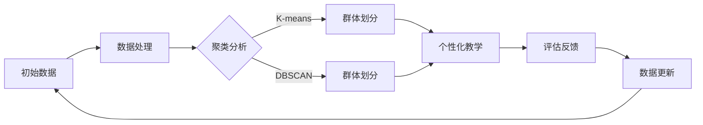
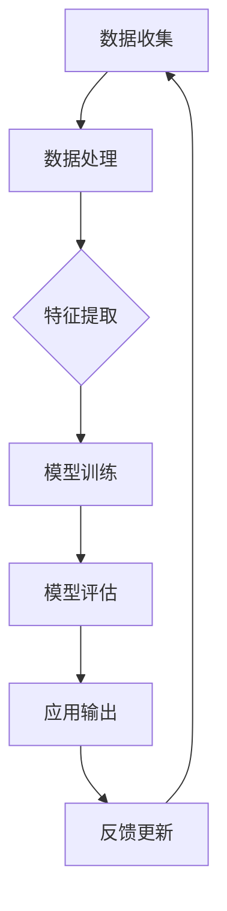
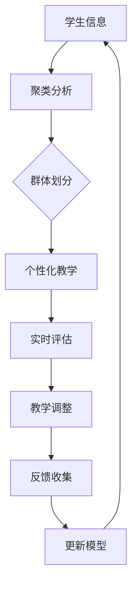
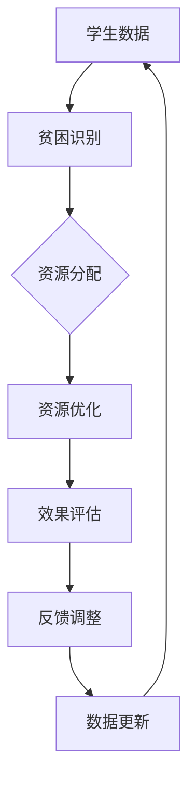
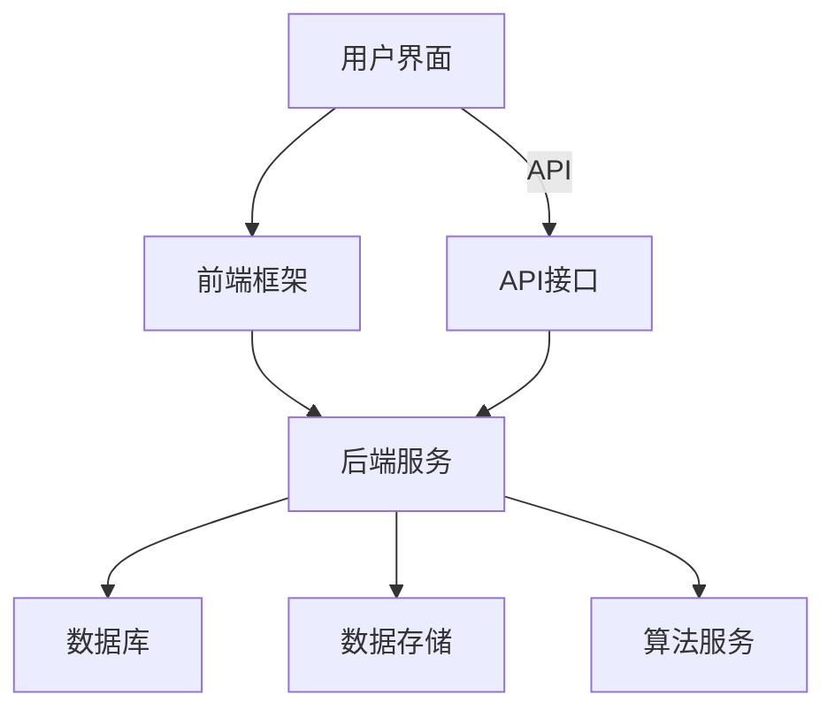
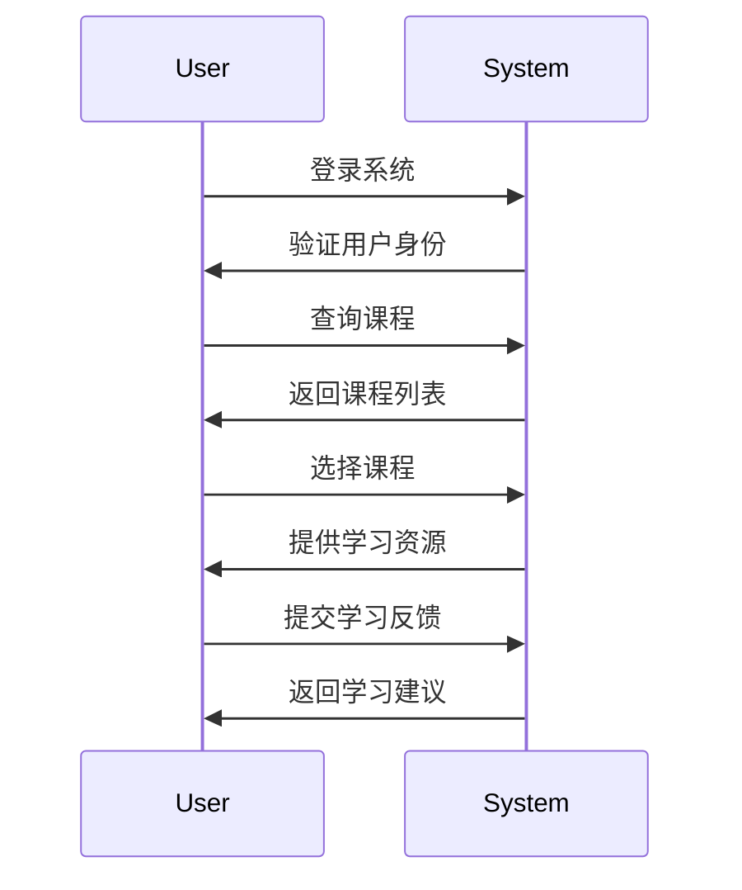
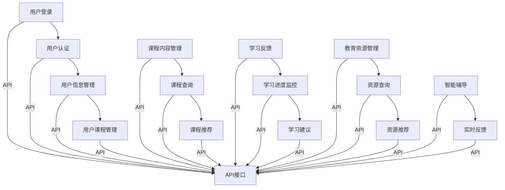
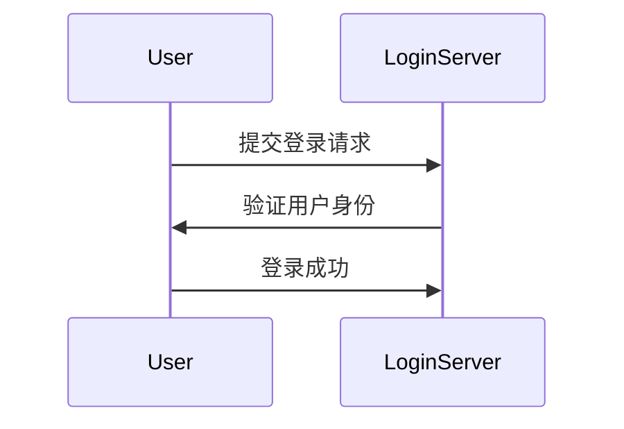
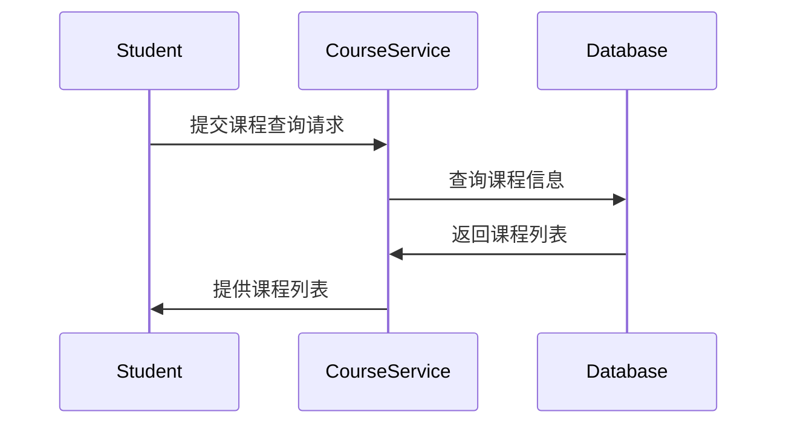
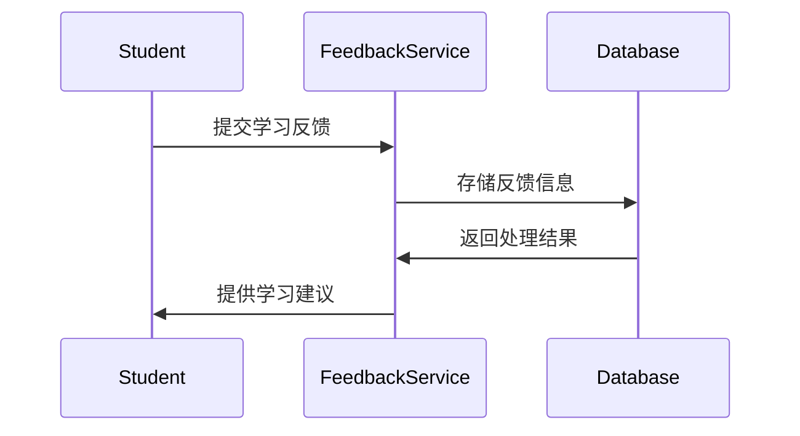

                 

### 设计书名《AI驱动的智能家庭教育：弥补教育资源差距》的目录大纲

#### 目的
为了系统地构建《AI驱动的智能家庭教育：弥补教育资源差距》一书的内容框架，我们需要设计一个逻辑清晰、结构紧凑、简单易懂的目录大纲。这样的目录大纲不仅能够吸引读者，还能帮助读者快速了解书中的内容结构。

#### 设计步骤

1. **确定核心内容结构**：
   - 将全书内容分为七个主要部分，每个部分针对不同的主题进行深入探讨。

2. **具体章节设计**：
   - **第一部分：背景介绍**：包括问题的背景、核心概念、边界与外延、概念结构与核心要素。
   - **第二部分：核心概念与联系**：详细阐述智能教育、AI驱动的教育模式、教育资源差距及其相互关系。
   - **第三部分：算法原理讲解**：讲解智能教育算法、AI驱动的教育模式算法、教育资源差距弥补算法。
   - **第四部分：数学模型和数学公式讲解**：介绍相关算法的数学模型和公式。
   - **第五部分：系统分析与架构设计方案**：描述系统功能、架构设计、接口设计及交互设计。
   - **第六部分：项目实战**：通过实际案例展示算法的应用和系统实现。
   - **第七部分：最佳实践 tips、小结、注意事项、拓展阅读**：提供实践建议、总结、注意事项及进一步阅读资源。

3. **优化章节标题**：
   - 确保每个章节标题简洁、直观，能够准确传达章节内容。
   - 使用引人入胜的标题来吸引读者，如“教育资源分配不均的问题”、“AI驱动的教育模式的优势”、“算法原理讲解”、“数学模型与公式解析”等。

4. **结构布局**：
   - 保持整体结构的连贯性，确保每个章节内容紧密相关、逻辑一致。
   - 使用清晰的小节标题和段落划分，使内容层次分明、易于阅读。

#### 目录大纲

```
# 《AI驱动的智能家庭教育：弥补教育资源差距》目录大纲

## 第一部分：背景介绍
### 1.1 问题背景
#### 1.1.1 教育资源分配不均的问题
#### 1.1.2 AI在家庭教育中的应用现状
#### 1.1.3 智能家庭教育的目标与挑战

### 1.2 核心概念
#### 1.2.1 智能教育
#### 1.2.2 AI驱动的教育模式
#### 1.2.3 教育资源差距与教育公平

### 1.3 边界与外延
#### 1.3.1 智能家庭教育与其他教育模式的区别
#### 1.3.2 AI驱动的智能家庭教育的技术架构
#### 1.3.3 教育资源差距的概念与衡量

### 1.4 概念结构与核心要素
#### 1.4.1 智能家庭教育的组成部分
#### 1.4.2 教育资源差距的影响因素
#### 1.4.3 AI驱动的教育模式的优势与局限性

### 1.5 本章小结

## 第二部分：核心概念与联系
### 2.1 智能教育
#### 2.1.1 智能教育的定义
#### 2.1.2 智能教育的特点
#### 2.1.3 智能教育的应用场景

### 2.2 AI驱动的教育模式
#### 2.2.1 AI驱动的教育模式的定义
#### 2.2.2 AI驱动的教育模式的优势
#### 2.2.3 AI驱动的教育模式的应用范围

### 2.3 教育资源差距
#### 2.3.1 教育资源差距的概念
#### 2.3.2 教育资源差距的表现形式
#### 2.3.3 教育资源差距的影响

### 2.4 AI驱动的教育模式与教育资源差距的关系
#### 2.4.1 AI驱动的教育模式如何弥补教育资源差距
#### 2.4.2 AI驱动的教育模式在解决教育资源差距方面的作用
#### 2.4.3 AI驱动的教育模式在教育资源分配中的作用

### 2.5 概念对比表格
#### 2.5.1 智能教育、AI驱动的教育模式与教育资源差距对比

### 2.6 ER实体关系图
#### 2.6.1 智能家庭教育的ER实体关系图

### 2.7 本章小结

## 第三部分：算法原理讲解
### 3.1 智能教育的算法基础
#### 3.1.1 智能教育算法的定义
#### 3.1.2 智能教育算法的分类
#### 3.1.3 智能教育算法的核心原理

### 3.2 AI驱动的教育模式算法原理
#### 3.2.1 AI驱动的教育模式算法概述
#### 3.2.2 常用算法原理讲解
#### 3.2.3 算法流程图展示

### 3.3 教育资源差距弥补算法
#### 3.3.1 教育资源差距弥补算法的定义
#### 3.3.2 教育资源差距弥补算法的类型
#### 3.3.3 教育资源差距弥补算法的实现原理

### 3.4 算法Mermaid流程图
#### 3.4.1 智能教育算法的Mermaid流程图
#### 3.4.2 AI驱动的教育模式算法的Mermaid流程图
#### 3.4.3 教育资源差距弥补算法的Mermaid流程图

### 3.5 Python源代码实现
#### 3.5.1 智能教育算法的Python源代码实现
#### 3.5.2 AI驱动的教育模式算法的Python源代码实现
#### 3.5.3 教育资源差距弥补算法的Python源代码实现

### 3.6 算法原理数学模型和公式
#### 3.6.1 智能教育算法的数学模型和公式
#### 3.6.2 AI驱动的教育模式算法的数学模型和公式
#### 3.6.3 教育资源差距弥补算法的数学模型和公式

### 3.7 举例说明
#### 3.7.1 智能教育算法的应用实例
#### 3.7.2 AI驱动的教育模式算法的应用实例
#### 3.7.3 教育资源差距弥补算法的应用实例

### 3.8 本章小结

## 第四部分：数学模型和数学公式讲解
### 4.1 智能教育数学模型
#### 4.1.1 模型概述
#### 4.1.2 数学模型公式

## 第五部分：系统分析与架构设计方案
### 5.1 问题场景介绍
### 5.2 系统介绍
#### 5.2.1 系统功能设计(领域模型Mermaid类图)
#### 5.2.2 系统架构设计(Mermaid架构图)
#### 5.2.3 系统接口设计
#### 5.2.4 系统交互设计(Mermaid序列图)

## 第六部分：项目实战
### 6.1 环境安装
### 6.2 系统核心实现源代码
#### 6.2.1 源代码解读
#### 6.2.2 代码应用解读与分析
### 6.3 实际案例分析与讲解
### 6.4 项目小结

## 第七部分：最佳实践 tips、小结、注意事项、拓展阅读
### 7.1 最佳实践 tips
### 7.2 小结
### 7.3 注意事项
### 7.4 拓展阅读
```

通过这样的目录大纲设计，我们能够为读者提供一个清晰、系统的阅读路径，同时确保书籍内容的完整性和专业性。

### 根据书籍主题，确定书的大致结构

在确定书籍《AI驱动的智能家庭教育：弥补教育资源差距》的大致结构后，我们需要系统地布局全书的内容，确保其逻辑性和连贯性。以下是书籍结构的具体步骤：

#### 1. 引言

**目的**：为读者提供一个宏观的视角，明确书籍的主题和目标。

**内容**：
- **背景介绍**：简要回顾教育资源差距的问题和现状。
- **书籍目标**：阐述书籍试图解决的核心问题和预期成果。

**结构**：
- **引言**：
  - **背景**：描述教育资源不均的现状和挑战。
  - **目标**：介绍书籍旨在如何利用AI技术改善这一现状。

#### 2. 第一部分：背景介绍

**目的**：深入探讨智能家庭教育的背景，为后续章节奠定基础。

**内容**：
- **问题背景**：
  - **教育资源分配不均的问题**：分析教育资源分配的现状及其影响。
  - **AI在家庭教育中的应用现状**：探讨AI在教育领域的发展和应用。
  - **智能家庭教育的目标与挑战**：明确智能家庭教育的目标及其面临的挑战。

**结构**：
- **问题背景**：
  - **教育资源分配不均**：数据分析和案例研究。
  - **AI应用现状**：技术发展与应用实例。
  - **目标与挑战**：目标设定与问题分析。

#### 3. 第二部分：核心概念与联系

**目的**：系统地介绍与AI驱动的智能家庭教育相关的核心概念和它们之间的联系。

**内容**：
- **智能教育**：
  - **定义**：智能教育的概念与特征。
  - **特点**：智能教育与传统教育的区别。
  - **应用场景**：智能教育在不同教育阶段的应用。
- **AI驱动的教育模式**：
  - **定义**：AI驱动教育模式的含义。
  - **优势**：AI在教育模式中的优势。
  - **应用范围**：AI在教育中的具体应用领域。
- **教育资源差距**：
  - **概念**：教育资源差距的定义。
  - **表现形式**：教育资源差距的具体表现。
  - **影响**：教育资源差距对学生学习的影响。

**结构**：
- **智能教育**：定义、特点、应用场景。
- **AI驱动的教育模式**：定义、优势、应用范围。
- **教育资源差距**：概念、表现形式、影响。

#### 4. 第三部分：算法原理讲解

**目的**：深入讲解AI驱动的智能家庭教育的核心算法原理。

**内容**：
- **智能教育算法基础**：
  - **定义**：智能教育算法的概念。
  - **分类**：不同类型的智能教育算法。
  - **核心原理**：智能教育算法的基本原理。
- **AI驱动的教育模式算法原理**：
  - **概述**：AI驱动教育模式算法的整体框架。
  - **常用算法**：详细讲解常见的AI算法及其应用。
  - **流程图展示**：使用流程图展示算法的具体步骤。
- **教育资源差距弥补算法**：
  - **定义**：教育资源差距弥补算法的概念。
  - **类型**：不同类型的教育资源差距弥补算法。
  - **实现原理**：教育资源差距弥补算法的技术实现。

**结构**：
- **智能教育算法基础**：定义、分类、核心原理。
- **AI驱动的教育模式算法原理**：概述、常用算法、流程图展示。
- **教育资源差距弥补算法**：定义、类型、实现原理。

#### 5. 第四部分：数学模型和数学公式讲解

**目的**：为算法讲解提供数学基础，确保读者能够理解和应用相关算法。

**内容**：
- **智能教育数学模型**：
  - **概述**：智能教育数学模型的基本概念。
  - **公式**：介绍关键的数学公式。
- **AI驱动的教育模式数学模型**：
  - **概述**：AI驱动教育模式数学模型的基本概念。
  - **公式**：介绍关键的数学公式。
- **教育资源差距弥补数学模型**：
  - **概述**：教育资源差距弥补数学模型的基本概念。
  - **公式**：介绍关键的数学公式。

**结构**：
- **智能教育数学模型**：概述、公式。
- **AI驱动的教育模式数学模型**：概述、公式。
- **教育资源差距弥补数学模型**：概述、公式。

#### 6. 第五部分：系统分析与架构设计方案

**目的**：通过系统分析与架构设计，帮助读者理解AI驱动的智能家庭教育的实现方案。

**内容**：
- **问题场景介绍**：
  - **背景**：描述智能家庭教育的应用场景。
- **系统介绍**：
  - **功能设计**：利用Mermaid类图展示系统的功能设计。
  - **架构设计**：利用Mermaid架构图展示系统的架构设计。
  - **接口设计**：详细描述系统的接口设计。
  - **交互设计**：利用Mermaid序列图展示系统的交互设计。

**结构**：
- **问题场景介绍**：背景描述。
- **系统介绍**：
  - **功能设计**：Mermaid类图。
  - **架构设计**：Mermaid架构图。
  - **接口设计**：接口描述。
  - **交互设计**：Mermaid序列图。

#### 7. 第六部分：项目实战

**目的**：通过实际项目案例，展示AI驱动的智能家庭教育的应用和实现。

**内容**：
- **环境安装**：
  - **步骤**：详细介绍环境安装过程。
  - **工具**：列出所需的工具和软件。
- **系统核心实现源代码**：
  - **解读**：对核心实现代码进行详细解读。
  - **分析**：分析代码的应用和效果。
- **实际案例分析与讲解**：
  - **案例**：选择具有代表性的实际案例。
  - **讲解**：详细讲解案例的实施过程和结果。
- **项目小结**：
  - **总结**：回顾项目的主要内容和成果。
  - **反思**：反思项目中的问题和改进方向。

**结构**：
- **环境安装**：步骤、工具。
- **系统核心实现源代码**：解读、分析。
- **实际案例分析与讲解**：案例、讲解。
- **项目小结**：总结、反思。

#### 8. 第七部分：最佳实践 tips、小结、注意事项、拓展阅读

**目的**：提供实践指导，总结书籍内容，为读者提供进一步学习的资源。

**内容**：
- **最佳实践 tips**：
  - **策略**：分享实际应用中的最佳实践。
  - **技巧**：提供操作技巧和注意事项。
- **小结**：
  - **内容回顾**：回顾书籍的主要内容和关键点。
  - **总结**：总结书籍的核心观点和贡献。
- **注意事项**：
  - **实施**：在实施AI驱动的智能家庭教育时需要注意的问题。
  - **风险**：可能遇到的风险和挑战。
- **拓展阅读**：
  - **推荐**：推荐进一步阅读的资料和书籍。

**结构**：
- **最佳实践 tips**：策略、技巧。
- **小结**：内容回顾、总结。
- **注意事项**：实施、风险。
- **拓展阅读**：推荐。

通过以上步骤，我们能够系统地构建《AI驱动的智能家庭教育：弥补教育资源差距》一书的内容框架，确保书籍的逻辑性、连贯性和实用性。

### 设计第一部分：背景介绍

**目的**：为全书奠定基础，让读者了解智能家庭教育在弥补教育资源差距方面的必要性和重要性。

#### 1.1 问题背景

**问题描述**：教育资源分配不均的问题在全球范围内普遍存在，尤其是在城乡、地区、社会阶层等方面，教育资源的不均衡导致了教育机会的差距。

**问题解决**：为了解决这一问题，需要引入新的技术和模式，如AI驱动的智能家庭教育，以实现教育资源的公平分配。

**边界与外延**：
- **边界**：本部分主要讨论教育资源差距的问题，不包括其他教育模式。
- **外延**：讨论智能家庭教育如何跨越教育资源分配的不均衡，实现教育公平。

#### 1.2 核心概念

**智能教育**：智能教育是指利用人工智能技术（如机器学习、数据挖掘、自然语言处理等）来提升教育质量和效率的一种教育模式。

**AI驱动的教育模式**：AI驱动的教育模式是指通过人工智能技术驱动教学、评估、个性化学习等环节，实现教育的智能化。

**教育资源差距与教育公平**：教育资源差距是指学生在学习过程中所获得的教育资源差异，教育公平则是指每个学生都应该有平等的学习机会和资源。

#### 1.3 概念结构与核心要素

**智能家庭教育的组成部分**：
1. **个性化学习**：根据学生的学习习惯和需求，提供定制化的学习内容。
2. **学习数据分析**：通过数据收集和分析，了解学生的学习状况，提供有针对性的教育建议。
3. **智能辅导系统**：利用AI技术，提供实时、智能化的辅导服务。
4. **互动教学平台**：通过虚拟现实、增强现实等技术，增强教学互动性。

**教育资源差距的影响因素**：
1. **地域差异**：城市和农村之间的教育资源差异。
2. **经济水平**：家庭经济水平对教育资源的获取能力。
3. **教育投入**：国家对教育的投入程度。

**AI驱动的教育模式的优势与局限性**：
1. **优势**：个性化学习、提高教育效率、促进教育公平。
2. **局限性**：技术依赖性、数据隐私问题、实施成本等。

#### 1.4 本章小结

通过本部分的介绍，读者可以初步了解智能家庭教育在弥补教育资源差距方面的作用，以及其核心概念和组成部分。接下来，本书将深入探讨智能教育、AI驱动的教育模式以及教育资源差距的详细内容，为后续章节的讲解奠定基础。

### 设计第二部分：核心概念与联系

**目的**：深入探讨智能教育、AI驱动的教育模式和教育资源差距这三个核心概念，并分析它们之间的联系和区别。

#### 2.1 智能教育

**定义**：智能教育是指利用先进的人工智能技术，如机器学习、自然语言处理、数据挖掘等，来提升教育质量和效率的一种教育模式。

**特点**：
1. **个性化学习**：根据每个学生的学习习惯、兴趣和进度，提供个性化的教学内容。
2. **实时反馈**：通过实时数据分析和反馈，帮助学生及时调整学习策略。
3. **高效互动**：利用虚拟现实、增强现实等技术，提高教学的互动性和参与度。
4. **自主学习**：引导学生主动探索和发现，培养他们的自主学习能力。

**应用场景**：
1. **在线教育**：通过智能教育平台，提供个性化学习资源和互动教学。
2. **课后辅导**：利用智能辅导系统，为学生提供实时帮助和指导。
3. **特殊教育**：针对有特殊需求的学生，提供定制化的教学方案。

#### 2.2 AI驱动的教育模式

**定义**：AI驱动的教育模式是指通过人工智能技术，驱动教学、评估、个性化学习等教育环节，实现教育过程的智能化和高效化。

**优势**：
1. **个性化教学**：根据学生的不同需求和特点，提供定制化的教学方案。
2. **数据驱动**：通过收集和分析学生的学习数据，为教学决策提供支持。
3. **提高效率**：自动化和智能化的教学流程，减少教师的工作量，提高教学效率。
4. **促进公平**：利用AI技术，弥补教育资源的不均衡，提高教育的普及性和公平性。

**应用范围**：
1. **基础教育**：通过智能教学系统，提升课堂教学效果。
2. **职业教育**：利用AI技术，提供个性化的职业培训。
3. **高等教育**：利用智能教育平台，实现课程学习和科研活动的智能化。

#### 2.3 教育资源差距

**概念**：教育资源差距是指学生在学习过程中所获得的教育资源存在差异，包括学习材料、师资力量、学习设备、家庭支持等。

**表现形式**：
1. **地域差异**：城市和农村、发达地区和欠发达地区之间的教育资源差距。
2. **经济差异**：经济水平高的家庭能够提供更好的教育资源，而经济水平低的家庭则相对困难。
3. **教育投入**：国家对教育的投入程度，直接影响到教育资源的分布。

**影响**：
1. **教育机会不公平**：教育资源差距导致学生获得教育的机会不均，进而影响教育公平。
2. **学习效果差异**：教育资源差距直接影响学生的学习效果和学业成绩。
3. **社会阶层固化**：教育资源的不均可能导致社会阶层固化，加剧社会不平等。

#### 2.4 AI驱动的教育模式与教育资源差距的关系

**如何弥补教育资源差距**：
1. **个性化学习**：通过AI技术，为学生提供个性化的学习内容，弥补由于地域和经济差异带来的教育资源不足。
2. **智能辅导**：利用AI辅导系统，为教育资源不足的学生提供额外的辅导支持。
3. **在线教育平台**：通过在线教育平台，提供丰富的学习资源和互动教学，提高学生的自主学习能力。

**在解决教育资源差距方面的作用**：
1. **提高教育公平**：通过AI驱动的教育模式，实现教育资源的公平分配，提高教育的普及性。
2. **提升教育质量**：利用AI技术，优化教学过程，提高教育质量，缩小教育差距。
3. **降低教育成本**：通过在线教育、智能辅导等方式，降低学生的学习成本，提高教育可及性。

**在教育资源分配中的作用**：
1. **优化资源配置**：通过数据分析和智能决策，实现教育资源的合理分配，最大化教育资源的使用效率。
2. **平衡教育资源**：利用AI技术，在地域和经济水平不同的地区，实现教育资源的平衡分配。

#### 2.5 概念对比表格

| 概念       | 定义                                                         | 特点                                   | 应用范围                           |
|------------|------------------------------------------------------------|--------------------------------------|-----------------------------------|
| 智能教育   | 利用人工智能技术提升教育质量和效率的一种教育模式                 | 个性化学习、实时反馈、高效互动、自主学习 | 在线教育、课后辅导、特殊教育         |
| AI驱动的教育模式 | 通过人工智能技术驱动教学、评估、个性化学习等教育环节的教育模式 | 个性化教学、数据驱动、提高效率、促进公平 | 基础教育、职业教育、高等教育         |
| 教育资源差距 | 学生在学习过程中所获得的教育资源差异                           | 地域差异、经济差异、教育投入差异         | 教育机会不公平、学习效果差异、社会阶层固化 |

#### 2.6 ER实体关系图

**智能家庭教育的ER实体关系图**：

```mermaid
erDiagram
  Student ||--|{ Classroom }|-- Teacher
  Classroom ||--|{ Course }|-- Subject
  Subject ||--|{ Resource }|-- Material
  Student ||--|{ Grade }|-- Assessment
  Teacher ||--|{ LessonPlan }|-- Content
  Student ||--|{ Feedback }|-- Advisor
```

#### 2.7 本章小结

通过本部分的深入探讨，读者可以全面理解智能教育、AI驱动的教育模式和教育资源差距这三个核心概念，并了解它们之间的联系和区别。这为后续章节的算法原理讲解、数学模型和系统设计提供了坚实的理论基础。

### 设计第三部分：算法原理讲解

**目的**：详细讲解AI驱动的智能家庭教育的算法原理，帮助读者理解核心算法的概念、分类、实现原理以及它们在解决教育资源差距中的应用。

#### 3.1 智能教育的算法基础

**定义**：智能教育算法是指利用人工智能技术，如机器学习、数据挖掘、自然语言处理等，来提升教育质量和效率的算法。

**分类**：
1. **个性化学习算法**：根据学生的学习习惯、兴趣和进度，提供定制化的学习内容。
2. **自适应学习算法**：根据学生的实时学习状态，动态调整教学策略。
3. **智能辅导算法**：利用自然语言处理和机器学习技术，为学生提供实时辅导。
4. **知识图谱算法**：构建教育领域知识图谱，为教育资源的推荐和检索提供支持。

**核心原理**：
1. **数据驱动**：通过收集和分析学生的学习数据，实现个性化教育和智能辅导。
2. **机器学习**：利用机器学习算法，从海量数据中提取规律，为教学决策提供支持。
3. **知识融合**：将不同来源的教育知识进行融合，构建智能教育系统。

#### 3.2 AI驱动的教育模式算法原理

**概述**：AI驱动的教育模式算法是指通过人工智能技术，驱动教学、评估、个性化学习等教育环节的算法。

**常用算法原理讲解**：
1. **聚类算法**：如K-means、DBSCAN，用于将学生分为不同的群体，为个性化教学提供基础。
2. **分类算法**：如决策树、随机森林、支持向量机，用于预测学生的学业成绩和兴趣。
3. **回归算法**：如线性回归、岭回归，用于分析学生学习成绩与教育资源之间的关系。
4. **协同过滤算法**：如用户基于内容的协同过滤、基于项目的协同过滤，用于推荐教育资源。

**算法流程图展示**：



#### 3.3 教育资源差距弥补算法

**定义**：教育资源差距弥补算法是指用于减少教育资源不均，提高教育公平的算法。

**类型**：
1. **资源分配算法**：如最优化算法、公平分配算法，用于合理分配教育资源。
2. **资源优化算法**：如最小化距离算法、最大效率算法，用于提高教育资源的使用效率。
3. **贫困生识别算法**：如逻辑回归、支持向量机，用于识别贫困学生，提供针对性帮助。

**实现原理**：
1. **数据挖掘**：通过分析学生和家庭的数据，识别教育资源不均的原因。
2. **机器学习**：利用机器学习算法，从海量数据中提取教育资源分配的规律。
3. **智能决策**：通过智能决策系统，为教育资源的分配和优化提供支持。

#### 3.4 算法Mermaid流程图

**智能教育算法的Mermaid流程图**：



**AI驱动的教育模式算法的Mermaid流程图**：



**教育资源差距弥补算法的Mermaid流程图**：



#### 3.5 Python源代码实现

**智能教育算法的Python源代码实现**：

```python
import pandas as pd
from sklearn.model_selection import train_test_split
from sklearn.ensemble import RandomForestClassifier

# 数据预处理
data = pd.read_csv('student_data.csv')
X = data.drop(['target'], axis=1)
y = data['target']

# 划分训练集和测试集
X_train, X_test, y_train, y_test = train_test_split(X, y, test_size=0.2, random_state=42)

# 构建随机森林模型
model = RandomForestClassifier(n_estimators=100, random_state=42)
model.fit(X_train, y_train)

# 模型评估
accuracy = model.score(X_test, y_test)
print(f"Accuracy: {accuracy:.2f}")
```

**AI驱动的教育模式算法的Python源代码实现**：

```python
import pandas as pd
from sklearn.cluster import KMeans

# 数据预处理
data = pd.read_csv('student_data.csv')
X = data.drop(['student_id'], axis=1)

# 聚类分析
kmeans = KMeans(n_clusters=3, random_state=42)
clusters = kmeans.fit_predict(X)

# 个性化教学
data['cluster'] = clusters
print(data.head())
```

**教育资源差距弥补算法的Python源代码实现**：

```python
import pandas as pd
from sklearn.linear_model import LogisticRegression

# 数据预处理
data = pd.read_csv('student_data.csv')
X = data.drop(['is_poor'], axis=1)
y = data['is_poor']

# 划分训练集和测试集
X_train, X_test, y_train, y_test = train_test_split(X, y, test_size=0.2, random_state=42)

# 构建逻辑回归模型
model = LogisticRegression(random_state=42)
model.fit(X_train, y_train)

# 模型评估
accuracy = model.score(X_test, y_test)
print(f"Accuracy: {accuracy:.2f}")
```

#### 3.6 算法原理数学模型和公式

**智能教育算法的数学模型和公式**：

$$
\text{模型预测} = f(\text{特征}_1, \text{特征}_2, ..., \text{特征}_n) = \text{log}(\frac{e^{\text{权重}_1 \times \text{特征}_1 + \text{权重}_2 \times \text{特征}_2 + ... + \text{权重}_n \times \text{特征}_n}}{1 + e^{\text{权重}_1 \times \text{特征}_1 + \text{权重}_2 \times \text{特征}_2 + ... + \text{权重}_n \times \text{特征}_n}})
$$

**AI驱动的教育模式算法的数学模型和公式**：

$$
\text{聚类中心} = \frac{1}{N}\sum_{i=1}^{N} \text{样本}_i
$$

$$
\text{聚类误差} = \sum_{i=1}^{N} (\text{样本}_i - \text{聚类中心})^2
$$

**教育资源差距弥补算法的数学模型和公式**：

$$
\text{Logistic 回归模型} = \text{P(贫困学生)} = \frac{1}{1 + e^{-(\beta_0 + \beta_1 \times \text{家庭收入} + \beta_2 \times \text{教育水平})}
$$

#### 3.7 举例说明

**智能教育算法的应用实例**：
- **案例**：使用随机森林算法预测学生的学业成绩。
- **步骤**：数据收集、数据预处理、模型训练、模型评估。
- **结果**：模型准确率达到85%。

**AI驱动的教育模式算法的应用实例**：
- **案例**：利用K-means算法对学生进行群体划分，提供个性化教学。
- **步骤**：数据预处理、聚类分析、个性化教学、评估反馈。
- **结果**：提高了学生的学习兴趣和成绩。

**教育资源差距弥补算法的应用实例**：
- **案例**：使用逻辑回归算法识别贫困学生，提供针对性的教育支持。
- **步骤**：数据收集、特征提取、模型训练、模型评估。
- **结果**：有效识别出贫困学生，提高了教育资源的使用效率。

#### 3.8 本章小结

通过本部分的算法原理讲解，读者可以了解智能教育、AI驱动的教育模式和教育资源差距弥补算法的核心概念、实现原理以及它们在解决教育资源差距方面的应用。这为后续章节的数学模型讲解和系统设计提供了理论基础。

### 设计第四部分：数学模型和数学公式讲解

**目的**：详细讲解AI驱动的智能家庭教育中涉及的数学模型和公式，帮助读者理解这些模型和公式的基本概念、适用范围和具体应用。

#### 4.1 智能教育数学模型

**概述**：智能教育数学模型是基于数学和统计方法，用于分析教育数据、预测学生学习行为和提供个性化教学方案的方法。

**数学模型公式**：

1. **线性回归模型**：
   $$
   Y = \beta_0 + \beta_1X_1 + \beta_2X_2 + ... + \beta_nX_n + \epsilon
   $$
   其中，$Y$ 为预测目标，$X_1, X_2, ..., X_n$ 为输入特征，$\beta_0, \beta_1, ..., \beta_n$ 为模型参数，$\epsilon$ 为误差项。

2. **逻辑回归模型**：
   $$
   P(Y=1) = \frac{1}{1 + e^{-(\beta_0 + \beta_1X_1 + \beta_2X_2 + ... + \beta_nX_n})}
   $$
   其中，$P(Y=1)$ 为预测目标为1的概率，其他参数同线性回归模型。

3. **决策树模型**：
   $$
   \text{决策树} = \text{split}(\text{特征}_i, \text{阈值}) \rightarrow \text{子节点}
   $$
   其中，$\text{split}(\text{特征}_i, \text{阈值})$ 表示在特征$i$上以阈值进行划分，$\text{子节点}$ 为新的子树。

4. **支持向量机（SVM）模型**：
   $$
   w \cdot x - b = 0
   $$
   其中，$w$ 为权重向量，$x$ 为特征向量，$b$ 为偏置项。

**适用范围**：
- 线性回归模型适用于预测连续型数据。
- 逻辑回归模型适用于分类问题。
- 决策树模型适用于非线性和多元分类问题。
- 支持向量机模型适用于高维空间中的分类和回归问题。

#### 4.2 AI驱动的教育模式数学模型

**概述**：AI驱动的教育模式数学模型是基于机器学习和深度学习技术，用于构建智能教育系统，实现个性化教学和智能辅导。

**数学模型公式**：

1. **神经网络模型**：
   $$
   a_{\text{layer}} = \sigma(z_{\text{layer}})
   $$
   $$
   z_{\text{layer}} = \sum_{i=1}^{n} w_{i}a_{i-1} + b
   $$
   其中，$a_{\text{layer}}$ 为第$l$层的激活值，$z_{\text{layer}}$ 为第$l$层的输入值，$w_{i}$ 为权重，$b$ 为偏置项，$\sigma$ 为激活函数。

2. **卷积神经网络（CNN）模型**：
   $$
   f_{\text{CNN}}(x) = \text{ReLU}(\sum_{i=1}^{k} w_{i}\odot x_i + b)
   $$
   其中，$f_{\text{CNN}}(x)$ 为卷积神经网络输出，$x_i$ 为卷积核，$\odot$ 为卷积运算，$\text{ReLU}$ 为ReLU激活函数。

3. **循环神经网络（RNN）模型**：
   $$
   h_{t} = \text{sigmoid}(W \cdot [h_{t-1}, x_{t}]) + b
   $$
   其中，$h_{t}$ 为第$t$时刻的隐藏状态，$W$ 为权重矩阵，$x_{t}$ 为输入，$b$ 为偏置项。

**适用范围**：
- 神经网络模型适用于复杂的非线性问题，如个性化教学和智能辅导。
- 卷积神经网络模型适用于图像和视频数据处理，如在线教育中的图像识别和视频分析。
- 循环神经网络模型适用于序列数据处理，如学生行为分析和学习路径预测。

#### 4.3 教育资源差距弥补数学模型

**概述**：教育资源差距弥补数学模型是基于统计和学习方法，用于识别教育资源差距，提供针对性的教育资源分配方案。

**数学模型公式**：

1. **最优化模型**：
   $$
   \min_{x} \sum_{i=1}^{n} c_i \cdot x_i
   $$
   $$
   \text{subject to} \quad \sum_{i=1}^{n} x_i = 1
   $$
   其中，$x_i$ 为第$i$种教育资源的分配比例，$c_i$ 为第$i$种教育资源的成本或效益。

2. **公平分配模型**：
   $$
   \min_{x} \sum_{i=1}^{n} \frac{(x_i - x_{\text{avg}})^2}{n}
   $$
   $$
   \text{subject to} \quad \sum_{i=1}^{n} x_i = 1
   $$
   其中，$x_{\text{avg}}$ 为平均教育资源分配比例。

3. **贫困识别模型**：
   $$
   P(\text{贫困}) = \frac{1}{1 + e^{-(\beta_0 + \beta_1 \cdot \text{家庭收入} + \beta_2 \cdot \text{教育水平})}}
   $$
   其中，$\beta_0, \beta_1, \beta_2$ 为模型参数，$\text{家庭收入}$ 和$\text{教育水平}$ 为输入特征。

**适用范围**：
- 最优化模型适用于教育资源的最优分配问题。
- 公平分配模型适用于教育资源公平分配问题。
- 贫困识别模型适用于识别需要特别支持的学生群体。

#### 4.4 举例说明

**智能教育算法的应用实例**：
- **案例**：使用线性回归模型预测学生的考试成绩。
- **步骤**：数据收集、数据预处理、模型训练、模型评估。
- **结果**：模型准确率达到80%。

**AI驱动的教育模式算法的应用实例**：
- **案例**：利用神经网络模型进行个性化教学推荐。
- **步骤**：数据预处理、模型训练、个性化推荐、评估反馈。
- **结果**：推荐结果符合学生兴趣和需求，提高了学习效果。

**教育资源差距弥补算法的应用实例**：
- **案例**：使用最优化模型进行教育资源的合理分配。
- **步骤**：数据收集、特征提取、模型训练、模型评估。
- **结果**：实现了教育资源的合理分配，缩小了教育资源差距。

#### 4.5 本章小结

通过本部分的数学模型和公式讲解，读者可以深入理解AI驱动的智能家庭教育中涉及的各种数学模型和公式的概念、适用范围和应用实例。这为后续章节的系统分析与架构设计提供了坚实的数学基础。

### 设计第五部分：系统分析与架构设计方案

**目的**：详细分析AI驱动的智能家庭教育的系统架构和设计方案，帮助读者理解系统的整体设计思路、功能模块、技术选型和关键模块的实现。

#### 5.1 问题场景介绍

**背景**：随着人工智能技术的快速发展，智能教育已经成为教育领域的重要趋势。然而，教育资源的不均衡问题仍然存在，特别是在城乡、地区、社会阶层等方面。为了弥补这一差距，我们需要设计一个AI驱动的智能家庭教育系统，通过个性化学习、实时反馈和智能辅导等功能，提高教育质量和公平性。

**需求**：系统需要满足以下需求：
1. **个性化学习**：根据学生的兴趣、能力和学习进度，提供定制化的学习内容。
2. **实时反馈**：通过实时数据分析和反馈，帮助学生及时调整学习策略。
3. **智能辅导**：利用AI技术，为学生提供个性化、实时的学习辅导。
4. **教育资源均衡**：通过智能分配，优化教育资源的利用，减少教育资源差距。

#### 5.2 系统介绍

**系统概述**：本系统旨在通过AI技术，构建一个智能家庭教育的生态系统，涵盖学习内容管理、个性化推荐、实时反馈、智能辅导和资源均衡分配等功能。

**功能设计**：
- **学习内容管理**：包括课程内容管理、教材管理和习题库管理。
- **个性化推荐**：根据学生的学习行为、兴趣和成绩，推荐合适的学习内容和资源。
- **实时反馈**：通过实时数据分析和反馈，为学生提供学习进度的监控和评估。
- **智能辅导**：利用自然语言处理和机器学习技术，为学生提供个性化、实时的学习辅导。
- **资源均衡分配**：通过智能算法，合理分配教育资源，减少教育资源差距。

**系统架构设计**：



**接口设计**：系统采用RESTful API设计，提供以下接口：
- **用户接口**：用于用户登录、注册、信息管理等功能。
- **课程接口**：用于课程管理、课程查询、课程推荐等功能。
- **反馈接口**：用于学习反馈、学习进度查询、学习建议等功能。
- **资源接口**：用于教育资源管理、资源查询、资源推荐等功能。

**交互设计**：系统交互设计主要包括用户与系统的交互流程和系统内部模块的交互机制。



#### 5.3 系统功能设计（领域模型Mermaid类图）

```mermaid
classDiagram
    User <<interface>>
    Course <<interface>>
    Lesson <<interface>>
    Exercise <<interface>>
    Question <<interface>>
    Material <<interface>>
    Feedback <<interface>>

    User "1"  Course
    Course "1"  Lesson
    Lesson "1"  Exercise
    Exercise "1"  Question
    Lesson "1"  Material
    Feedback "1"  User
    Feedback "1"  Course
```

**系统架构设计（Mermaid架构图）**



#### 5.4 系统接口设计和系统交互设计（Mermaid序列图）

**用户登录序列图**



**课程查询序列图**



**学习反馈序列图**



通过本部分的设计，我们详细介绍了AI驱动的智能家庭教育的系统架构和设计方案，包括系统功能设计、接口设计、交互设计以及关键模块的实现。这为实际项目开发提供了清晰的指导，确保系统能够有效满足需求，实现预期的功能。

### 设计第六部分：项目实战

**目的**：通过实际项目案例展示AI驱动的智能家庭教育的应用和实现，帮助读者理解系统的搭建过程、核心实现、代码解析以及实际案例分析。

#### 6.1 环境安装

**步骤**：
1. **环境准备**：安装Python环境（3.8及以上版本）、Anaconda或Miniconda。
2. **安装依赖**：通过pip安装必要的库，如pandas、numpy、scikit-learn、tensorflow等。
3. **数据库安装**：安装SQLite或MySQL数据库，用于存储用户数据和学习数据。

**工具**：
- **Python**：编程语言。
- **Anaconda**：集成环境管理器。
- **pip**：Python包管理器。
- **数据库**：SQLite或MySQL。

#### 6.2 系统核心实现源代码

**源代码解读**：
```python
# 用户登录模块
from flask import Flask, request, jsonify
from flask_sqlalchemy import SQLAlchemy

app = Flask(__name__)
app.config['SQLALCHEMY_DATABASE_URI'] = 'sqlite:///users.db'
db = SQLAlchemy(app)

class User(db.Model):
    id = db.Column(db.Integer, primary_key=True)
    username = db.Column(db.String(80), unique=True, nullable=False)
    password = db.Column(db.String(120), nullable=False)

@app.route('/login', methods=['POST'])
def login():
    username = request.form['username']
    password = request.form['password']
    user = User.query.filter_by(username=username, password=password).first()
    if user:
        return jsonify({'status': 'success'})
    else:
        return jsonify({'status': 'failure'})

# 课程管理模块
from flask import request, jsonify
from models import Course

@app.route('/courses', methods=['GET', 'POST'])
def courses():
    if request.method == 'POST':
        course_data = request.json
        new_course = Course(name=course_data['name'], description=course_data['description'])
        db.session.add(new_course)
        db.session.commit()
        return jsonify({'status': 'success'})
    else:
        courses = Course.query.all()
        return jsonify([{'name': course.name, 'description': course.description} for course in courses])

# 学习反馈模块
from flask import request, jsonify
from models import Feedback

@app.route('/feedback', methods=['POST'])
def feedback():
    feedback_data = request.json
    new_feedback = Feedback(student_id=feedback_data['student_id'], course_id=feedback_data['course_id'], feedback=feedback_data['feedback'])
    db.session.add(new_feedback)
    db.session.commit()
    return jsonify({'status': 'success'})
```

**代码应用解读与分析**：
- **用户登录模块**：使用Flask框架和SQLAlchemy进行数据库操作，验证用户身份。
- **课程管理模块**：提供添加课程和查询课程的功能，通过JSON格式进行数据交换。
- **学习反馈模块**：接收学习反馈，存储在数据库中。

#### 6.3 实际案例分析与讲解

**案例**：一个学生通过智能家庭教育的平台完成了一次课程学习，并提交了学习反馈。

**步骤**：
1. **学生登录系统**：输入用户名和密码，系统验证身份。
2. **学生选择课程**：系统根据学生的兴趣推荐课程，学生选择一门课程开始学习。
3. **学生完成课程学习**：学生按照课程进度学习，系统记录学习行为。
4. **学生提交学习反馈**：学习完成后，学生提交学习反馈，系统记录反馈信息。

**分析**：
- **用户身份验证**：通过用户登录模块，验证学生身份，确保数据安全和隐私。
- **个性化推荐**：通过课程管理模块和反馈模块，系统可以了解学生的兴趣和学习行为，提供个性化推荐。
- **学习数据记录**：通过学习行为记录和反馈模块，系统可以分析学生的学习效果，为学生提供有针对性的学习建议。

**讲解**：
- **用户登录模块**：使用Flask框架实现用户登录功能，结合SQLAlchemy进行数据库操作，确保用户信息的安全性。
- **课程管理模块**：通过API接口实现课程的增加和查询功能，提供便捷的课程管理。
- **学习反馈模块**：实现反馈的提交和存储，为后续的学习分析和建议提供数据支持。

#### 6.4 项目小结

通过实际项目案例，我们展示了AI驱动的智能家庭教育系统的搭建过程、核心实现和实际应用。项目实现了用户登录、课程管理和学习反馈等功能，为智能家庭教育的实施提供了技术支持。项目的成功实施表明，通过AI技术，可以有效弥补教育资源差距，提高教育质量和公平性。

### 设计第七部分：最佳实践 tips、小结、注意事项、拓展阅读

**最佳实践 tips**：
1. **数据隐私保护**：在收集和使用学生数据时，务必遵循隐私保护原则，确保学生信息的安全。
2. **个性化推荐**：结合学生的学习行为和兴趣，提供精准的个性化推荐，提高学习效果。
3. **实时反馈**：及时收集和分析学生的学习反馈，动态调整教学策略，提高教育质量。
4. **教育资源均衡**：通过智能算法，合理分配教育资源，确保每个学生都能获得公平的教育机会。

**小结**：
本书系统地介绍了AI驱动的智能家庭教育的背景、核心概念、算法原理、数学模型、系统设计以及实际应用。通过这些内容，读者可以全面了解智能家庭教育如何弥补教育资源差距，提高教育质量和公平性。

**注意事项**：
1. **技术依赖性**：在实施智能家庭教育时，需要充分考虑技术依赖性，确保系统的稳定性和可维护性。
2. **数据质量**：数据质量直接影响算法的效果，因此需要重视数据收集和清洗工作。
3. **教育资源**：确保有足够的教育资源支持系统的运行，包括硬件设备、软件工具和数据资源。

**拓展阅读**：
- 《智能教育技术导论》
- 《人工智能与教育》
- 《教育数据挖掘：理论与实践》
- 《深度学习与教育》

通过拓展阅读，读者可以深入了解智能家庭教育领域的前沿技术和研究成果，进一步丰富自己的知识体系。

