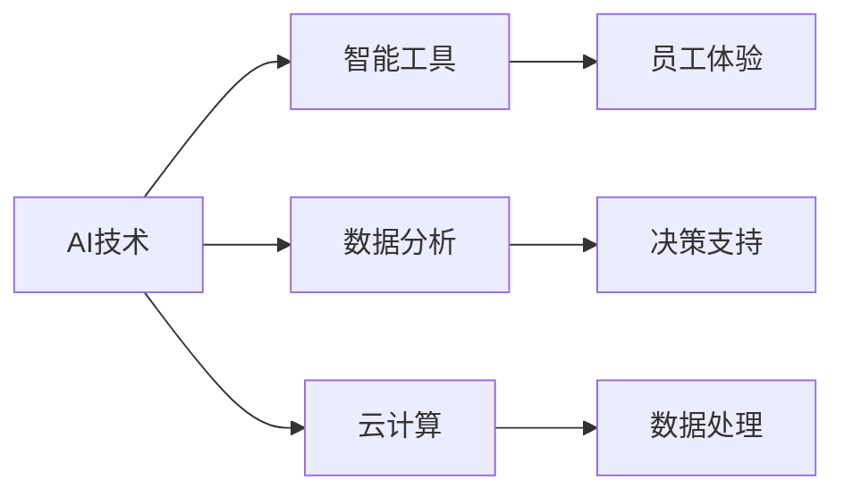

                 

# AI驱动的智能工作场所：提高生产力与员工满意度

## 关键词
- 智能工作场所
- AI技术
- 生产力
- 员工满意度
- 自动化
- 数据分析
- 云计算
- 个性化推荐

## 摘要
本文将探讨AI驱动的智能工作场所的概念，分析其在提高生产力和员工满意度方面的应用，并通过具体案例展示AI技术如何优化工作流程，提升员工体验。

### 引言和背景介绍

在全球化、信息化迅速发展的今天，现代工作场所面临着诸多挑战。首先，生产力低下成为企业普遍面临的问题。繁琐的工作流程、重复性的任务以及信息孤岛现象，都导致了工作效率的下降，增加了运营成本。其次，员工满意度低也是困扰许多企业的难题。枯燥的工作环境、缺乏创新和动力，使得员工的工作积极性不高，影响了整体的工作氛围和员工的工作满意度。最后，工作效率问题也日益突出。由于信息不畅、沟通困难，企业决策往往滞后，影响了整体的工作效率。

为了解决上述问题，AI技术的引入为智能工作场所带来了新的机遇。AI驱动的智能工作场所有助于通过自动化流程、智能调度和预测分析，提高工作效率；通过个性化工作推荐、智能沟通工具等，提升员工的工作体验；通过智能分析和预测，帮助企业做出更明智的决策。本文将围绕这些核心概念，详细探讨AI驱动的智能工作场所的应用场景和实际效果。

### Step 1: 引言和背景介绍

#### 问题背景

随着全球化、信息化的快速发展，现代工作场所面临诸多挑战，如生产力提升、员工满意度、工作效率等。传统的工作方式已难以满足日益复杂的工作需求。

#### 问题描述

这些挑战体现在以下几个方面：
1. **生产力低下**：工作流程繁琐，效率低下，导致企业运营成本增加。
2. **员工满意度低**：工作环境枯燥，缺乏创新和动力，影响员工的积极性和工作满意度。
3. **工作效率问题**：信息孤岛，沟通不畅，导致决策延迟，影响工作效率。

#### 问题解决

AI技术的引入，为解决上述问题提供了新的思路。AI驱动的智能工作场所有助于：
1. **提升生产力**：通过自动化流程、智能调度和预测分析，提高工作效率。
2. **提高员工满意度**：通过个性化工作推荐、智能沟通工具等，提升员工的工作体验。
3. **优化工作效率**：通过智能分析和预测，帮助企业做出更明智的决策。

#### 边界与外延

AI驱动的智能工作场所涵盖的领域包括：人工智能、大数据、云计算等，旨在通过技术手段优化工作流程，提升工作效率和员工满意度。

#### 概念结构与核心要素组成

AI驱动的智能工作场所的核心要素包括：
1. **AI技术**：包括机器学习、深度学习、自然语言处理等。
2. **智能工具**：如聊天机器人、智能推荐系统、虚拟现实等。
3. **数据分析**：通过对海量数据的分析，为企业提供决策支持。
4. **云计算**：提供强大的计算能力和存储能力，支持大规模数据分析和处理。

### Step 2: AI驱动的智能工作场所的核心概念与联系

#### 核心概念介绍

##### 1. AI技术

AI技术是AI驱动的智能工作场所的核心。它包括机器学习、深度学习、自然语言处理等，能够实现自动化决策和智能交互。

##### 2. 智能工具

智能工具如聊天机器人、智能推荐系统、虚拟现实等，能够为员工提供更加便捷、高效的工作体验。

##### 3. 数据分析

数据分析通过对海量数据的分析，为企业提供洞察力和决策支持。

##### 4. 云计算

云计算提供强大的计算能力和存储能力，支持大规模数据分析和处理。

#### 概念属性特征对比表格

| 概念       | 特征                                       |
|------------|------------------------------------------|
| AI技术     | 自动化决策、智能交互、学习与适应能力          |
| 智能工具   | 方便快捷、个性化推荐、沉浸式体验              |
| 数据分析   | 数据挖掘、模式识别、预测分析                  |
| 云计算     | 弹性扩展、高可用性、高效数据存储与处理能力    |

#### ER实体关系图架构

通过上述表格和ER实体关系图，可以清晰地看出AI驱动的智能工作场所中各个核心概念之间的联系，以及它们在提升工作效率和员工满意度方面的重要作用。

### Step 3: AI驱动的智能工作场所的应用场景

#### 提高生产力

##### 自动化流程

通过AI技术，可以自动化处理大量的重复性工作，如邮件筛选、数据整理等，从而提高工作效率。例如，企业可以部署智能客服系统，自动化处理客户的咨询和投诉，减轻人工负担。

##### 智能调度

利用AI技术进行智能调度，可以优化资源分配，提高工作流程的效率。例如，在物流领域，AI算法可以根据实时交通状况、天气等因素，智能规划配送路线，提高配送效率。

##### 预测分析

通过对历史数据的分析，AI技术可以预测未来的趋势，帮助企业做出更明智的决策。例如，在销售领域，AI算法可以根据历史销售数据、市场趋势等，预测未来的销售量，从而优化库存管理。

#### 提升员工满意度

##### 个性化工作推荐

AI驱动的智能工作场所可以通过分析员工的工作习惯和偏好，为其推荐个性化工作内容，提高工作满意度。例如，在软件开发领域，AI系统可以根据员工的技术特长和项目需求，智能匹配合适的工作任务，提升工作效率。

##### 智能沟通工具

智能沟通工具如聊天机器人、智能会议助手等，能够提高员工之间的沟通效率。例如，企业可以部署智能会议助手，自动化安排会议时间、记录会议内容，提高会议的效率和质量。

##### 虚拟现实培训

利用虚拟现实技术，企业可以进行沉浸式的培训，提高员工的专业技能和工作体验。例如，在制造业，企业可以通过虚拟现实技术，模拟实际工作场景，让员工进行虚拟操作训练，提高工作效率和安全意识。

### Step 4: AI驱动的智能工作场所的实际案例

#### 案例一：零售行业

某大型零售企业引入AI驱动的智能工作场所，通过智能推荐系统，根据消费者的购买历史和行为数据，为其推荐个性化的商品。同时，利用智能客服系统，自动化处理消费者的咨询和投诉，提高了客户满意度。通过预测分析，企业能够准确预测销售趋势，优化库存管理，降低了运营成本。

#### 案例二：金融行业

某金融企业通过引入AI驱动的智能工作场所，实现了自动化审批流程和智能风险管理。利用自然语言处理技术，智能处理客户的申请文件，提高了审批效率。同时，通过数据分析，企业能够实时监控风险，提高决策的准确性，降低了风险损失。

#### 案例三：制造业

某制造业企业通过虚拟现实技术，进行了沉浸式的员工培训。员工可以在虚拟环境中进行操作训练，提高实际工作技能。同时，通过智能调度系统，优化生产计划，提高了生产效率。

### 总结

AI驱动的智能工作场所通过自动化流程、智能调度和预测分析，大大提高了工作效率和生产力；通过个性化推荐、智能沟通工具和虚拟现实培训，提升了员工的工作体验和满意度。随着AI技术的不断发展和应用，智能工作场所将成为未来企业竞争的重要优势。

### 作者信息

作者：AI天才研究院/AI Genius Institute & 禅与计算机程序设计艺术 /Zen And The Art of Computer Programming

### 最佳实践 tips

- **持续学习**：紧跟AI技术的发展趋势，不断更新知识体系，确保企业能够充分利用AI技术提升工作场所的智能化水平。
- **数据安全**：在引入AI技术的同时，注重数据安全和隐私保护，确保企业的数据安全。
- **员工参与**：鼓励员工参与到智能工作场所的建设中，提高员工的参与度和积极性，共同推动企业的发展。

### 小结

AI驱动的智能工作场所是未来工作发展的趋势，通过提高生产力和员工满意度，为企业带来巨大的价值。随着技术的不断进步，智能工作场所将为企业和员工创造更加美好的工作环境。希望本文能够为读者提供有价值的参考，激发更多对智能工作场所的探索和实践。在未来的工作中，让我们共同迎接AI带来的变革，共创智能工作新未来。

