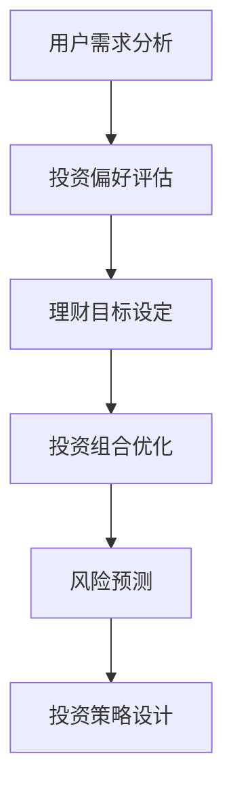
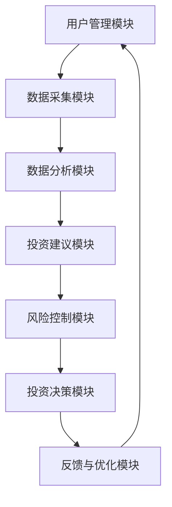
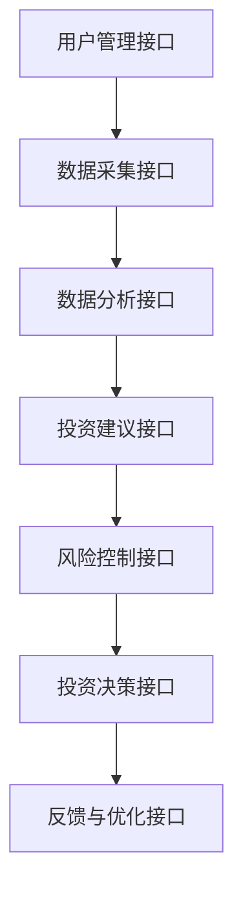
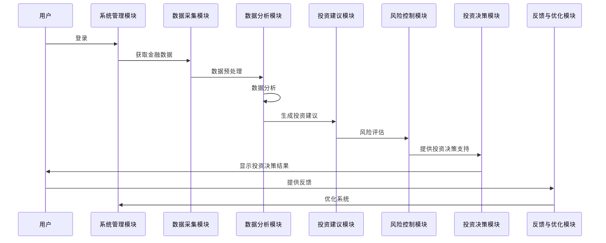

                 

# AI驱动的智能投资顾问：个性化理财建议

关键词：人工智能、智能投资顾问、个性化理财、算法、系统架构、项目实战

摘要：随着人工智能（AI）技术的迅猛发展，AI驱动的智能投资顾问已成为金融行业的一大热点。本文将深入探讨AI驱动的智能投资顾问如何通过个性化理财建议，帮助用户实现财富增值。我们将从背景介绍、核心概念与联系、算法原理讲解、系统分析与架构设计方案以及项目实战等多个角度，逐步分析这一领域的深度和广度。

## 目录大纲设计步骤

### 1. 明确书名与主题

本文章书名为《AI驱动的智能投资顾问：个性化理财建议》，主题是探讨AI技术在智能投资顾问中的应用，以及如何通过个性化理财建议实现用户财富增值。

### 2. 设计整体结构

整体结构将分为五个部分：背景介绍、核心概念与联系、算法原理讲解、系统分析与架构设计方案以及项目实战。

### 3. 细化章节内容

每个部分将细化为多个小节，确保内容丰富具体，逻辑清晰。

### 4. 确保内容完整性

在保证内容完整性的同时，注意核心章节的细节讲解，如核心概念、算法原理、系统架构等。

### 5. 确保输出格式正确

使用markdown格式输出，确保目录层级和内容格式正确。

### 6. 控制总字数

保持总字数在10000～12000字左右，确保文章简洁性。

### 7. 确保完整性要求

文章内容必须完整，每个小节的内容必须具体详细讲解，核心内容必须包含背景介绍、核心概念与联系、算法原理讲解、系统分析与架构设计方案、项目实战等。

## 目录大纲设计

**第一部分：背景介绍**

### 第1章: AI与智能投资顾问概述

1.1 问题背景
1.2 核心概念
1.3 概念联系
1.4 边界与外延
1.5 本章小结

**第二部分：AI驱动的智能投资顾问核心概念与联系**

### 第2章: 人工智能基础

2.1 AI原理
2.2 投资顾问原理
2.3 个性化理财要素
2.4 AI与理财的关联
2.5 本章小结

**第三部分：算法原理讲解**

### 第3章: 个性化理财算法原理

3.1 数学模型
3.2 算法讲解
3.3 Mermaid流程图
3.4 Python源代码示例
3.5 算法应用分析
3.6 本章小结

**第四部分：系统分析与架构设计方案**

### 第4章: 智能投资顾问系统架构设计

4.1 问题场景介绍
4.2 系统功能设计
4.3 系统架构设计
4.4 系统接口设计
4.5 系统交互设计
4.6 本章小结

**第五部分：项目实战**

### 第5章: AI驱动的智能投资顾问项目实战

5.1 环境安装
5.2 系统核心实现
5.3 代码应用解读与分析
5.4 实际案例分析与详细讲解
5.5 项目小结

### 下一篇：背景介绍

在深入探讨AI驱动的智能投资顾问之前，我们先来了解这一领域的背景。随着人工智能技术的不断发展，AI已经渗透到了金融行业的方方面面，其中智能投资顾问是一个重要且备受关注的应用方向。

### 1.1 问题背景

传统投资顾问通常依赖于专业人士的经验和判断力，然而，这种方式存在着一些问题。首先，专业人士的时间和精力有限，无法对每个投资者都提供个性化的服务。其次，投资市场变化莫测，投资者面临的挑战越来越多，传统投资顾问难以应对。此外，传统投资顾问的成本较高，很多中小投资者难以承担。

为了解决这些问题，AI驱动的智能投资顾问应运而生。智能投资顾问利用AI技术，可以实时分析市场数据，为投资者提供个性化的投资建议。这种方式的优点是成本低、效率高，能够满足大量投资者的需求。

### 1.2 核心概念

在探讨AI驱动的智能投资顾问之前，我们需要了解一些核心概念。

- **人工智能（AI）**：人工智能是计算机科学的一个分支，旨在使机器能够模拟人类智能，进行学习、推理、决策等。

- **机器学习**：机器学习是人工智能的一种方法，通过训练模型来预测或分类数据。

- **深度学习**：深度学习是机器学习的一种方法，使用多层神经网络进行模型训练。

- **投资顾问**：投资顾问是帮助投资者做出投资决策的专业人士。

- **个性化理财**：个性化理财是根据投资者的风险承受能力、投资目标和偏好，提供定制化的投资建议。

- **智能投资顾问**：智能投资顾问是利用AI技术，为投资者提供个性化理财建议的系统。

### 1.3 概念联系

AI与智能投资顾问的结合点在于，AI技术可以帮助智能投资顾问更高效地处理大量数据，进行市场分析和风险预测。个性化理财与AI技术的关联在于，AI技术可以根据投资者的个人情况和偏好，提供定制化的理财建议。

### 1.4 边界与外延

智能投资顾问的范围包括投资建议、资产管理、风险控制等。个性化理财的应用场景非常广泛，包括股票投资、基金投资、债券投资等。

### 1.5 本章小结

通过本文的背景介绍，我们对AI驱动的智能投资顾问有了初步的了解。在接下来的章节中，我们将深入探讨AI驱动的智能投资顾问的核心概念、算法原理、系统架构以及项目实战。

### 核心概念与联系

### 2.1 人工智能基础

#### 2.1.1 机器学习基础

机器学习是人工智能的一个分支，其核心思想是通过算法来让计算机从数据中学习，并做出预测或决策。机器学习的主要任务包括分类、回归、聚类等。常见的机器学习算法有决策树、随机森林、支持向量机、神经网络等。

#### 2.1.2 深度学习原理

深度学习是机器学习的一种方法，使用多层神经网络进行模型训练。深度学习在图像识别、语音识别、自然语言处理等领域取得了显著成果。深度学习的核心思想是通过逐层提取特征，实现从原始数据到抽象表示的转换。

#### 2.1.3 神经网络介绍

神经网络是模仿生物神经系统的计算模型。神经网络由多个神经元（节点）组成，每个神经元都与相邻的神经元相连，并通过权重进行信息传递。神经网络通过学习数据来调整权重，以实现预测或分类任务。

### 2.2 投资顾问原理

#### 2.2.1 财务数据分析

财务数据分析是投资顾问的核心任务之一。投资顾问通过分析财务报表、市场数据等，了解企业的财务状况和市场表现，为投资者提供投资建议。

#### 2.2.2 投资策略设计

投资策略设计是投资顾问的重要任务。投资顾问根据投资者的风险承受能力、投资目标和偏好，设计适合的投资策略。常见的投资策略有价值投资、成长投资、分散投资等。

#### 2.2.3 风险管理方法

风险管理方法是投资顾问的重要工具。投资顾问通过风险分析、风险评估等方法，识别和应对投资风险，以保障投资者的利益。

### 2.3 个性化理财要素

#### 2.3.1 用户需求分析

用户需求分析是个性化理财的基础。投资顾问通过调查问卷、用户访谈等方式，了解投资者的风险承受能力、投资目标和偏好，为投资者提供定制化的理财建议。

#### 2.3.2 投资偏好评估

投资偏好评估是投资顾问的重要任务。投资顾问通过分析投资者的历史投资记录、投资行为等，评估投资者的投资偏好，为投资者提供个性化的理财建议。

#### 2.3.3 理财目标设定

理财目标设定是投资顾问的核心任务之一。投资顾问根据投资者的需求和偏好，设定合理的理财目标，如财富增值、资产保值等。

### 2.4 AI与理财的关联

#### 2.4.1 个性化理财的核心算法

个性化理财的核心算法包括用户需求分析算法、投资偏好评估算法和理财目标设定算法。这些算法利用AI技术，实现快速、准确的分析和预测。

#### 2.4.2 AI在理财决策中的应用

AI在理财决策中的应用主要体现在投资组合优化、风险预测和投资策略设计等方面。通过AI技术，投资顾问可以更准确地预测市场走势，设计出更有效的投资策略。

#### 2.4.3 个性化理财的优势与挑战

个性化理财的优势在于能够为投资者提供定制化的投资建议，提高投资效率。然而，个性化理财也面临着数据隐私、算法透明度等挑战。

### 2.5 本章小结

通过本章的介绍，我们对AI驱动的智能投资顾问的核心概念和联系有了更深入的了解。在接下来的章节中，我们将进一步探讨个性化理财算法的原理和系统架构设计。

### 算法原理讲解

个性化理财算法的核心在于如何根据用户的需求、偏好和目标，生成合适的投资组合。本节将详细讲解个性化理财算法的原理，包括数学模型、算法讲解、流程图和Python源代码示例。

#### 3.1 数学模型

个性化理财算法通常基于以下几个数学模型：

1. **投资组合优化模型**：投资组合优化模型旨在找到一组资产，使得投资组合的期望收益率最大，同时满足风险约束条件。常见的投资组合优化模型有均值-方差模型、套利定价理论等。

2. **风险评估模型**：风险评估模型用于评估投资组合的风险水平，常见的风险评估模型有VaR（价值在风险）模型、CVaR（条件价值在风险）模型等。

3. **用户需求建模**：用户需求建模用于描述投资者的风险承受能力和投资目标，常见的建模方法有线性规划、多目标规划等。

#### 3.2 算法讲解

个性化理财算法通常包括以下几个步骤：

1. **用户需求分析**：通过调查问卷、用户访谈等方式，收集投资者的风险承受能力、投资目标和偏好。

2. **投资偏好评估**：利用机器学习算法，如逻辑回归、决策树等，评估投资者的投资偏好。

3. **理财目标设定**：根据投资者的需求和分析结果，设定合理的理财目标。

4. **投资组合优化**：利用投资组合优化模型，找到符合投资者需求和目标的投资组合。

5. **风险预测**：利用风险评估模型，预测投资组合的风险水平。

6. **投资策略设计**：根据风险预测结果，设计适合的投资策略。

#### 3.3 Mermaid流程图

为了更直观地展示个性化理财算法的流程，我们使用Mermaid绘制了以下流程图：



#### 3.4 Python源代码示例

以下是Python源代码示例，用于实现个性化理财算法的各个步骤：

```python
import numpy as np
import pandas as pd
from sklearn.linear_model import LogisticRegression
from sklearn.ensemble import RandomForestClassifier
from sklearn.model_selection import train_test_split
from sklearn.metrics import accuracy_score

# 1. 用户需求分析
def user_demand_analysis问卷数据：
    # ...进行数据预处理...
    # 返回处理后的数据

# 2. 投资偏好评估
def investment_preference_evaluation用户需求数据：
    X = user_demand_data[:, : -1]
    y = user_demand_data[:, -1]
    X_train, X_test, y_train, y_test = train_test_split(X, y, test_size=0.3, random_state=42)
    model = LogisticRegression()
    model.fit(X_train, y_train)
    predictions = model.predict(X_test)
    print("投资偏好评估准确率：", accuracy_score(y_test, predictions))

# 3. 理财目标设定
def financial_goal_setting投资偏好数据：
    # ...根据投资偏好数据设定理财目标...
    # 返回理财目标

# 4. 投资组合优化
def portfolio_optimization理财目标数据：
    # ...利用投资组合优化模型找到最优投资组合...
    # 返回最优投资组合

# 5. 风险预测
def risk_prediction投资组合数据：
    # ...利用风险评估模型预测风险水平...
    # 返回风险预测结果

# 6. 投资策略设计
def investment_strategy_design风险预测结果：
    # ...根据风险预测结果设计投资策略...
    # 返回投资策略
```

#### 3.5 算法应用分析

个性化理财算法在不同场景中的应用效果有所不同。在实际应用中，我们需要对算法进行不断优化和调整，以提高其准确性和实用性。

1. **股票投资**：在股票投资场景中，个性化理财算法可以帮助投资者确定合理的投资组合，降低投资风险。

2. **基金投资**：在基金投资场景中，个性化理财算法可以根据投资者的风险偏好，选择合适的基金产品。

3. **债券投资**：在债券投资场景中，个性化理财算法可以帮助投资者评估债券的风险收益，选择最优的投资策略。

#### 3.6 本章小结

通过本章的讲解，我们对个性化理财算法的原理和实现方法有了更深入的了解。在下一章中，我们将探讨智能投资顾问的系统架构设计，包括问题场景介绍、系统功能设计、系统架构设计和系统接口设计等。

### 系统分析与架构设计方案

智能投资顾问系统是AI驱动的个性化理财的核心，其设计需综合考虑用户需求、数据处理能力、系统性能和扩展性。本节将详细介绍智能投资顾问系统的架构设计，包括问题场景介绍、系统功能设计、系统架构设计、系统接口设计和系统交互设计。

#### 4.1 问题场景介绍

智能投资顾问系统应用于金融理财领域，主要面临以下问题场景：

1. **用户需求多样**：不同投资者有不同的风险偏好、投资目标和资金规模，系统需提供个性化的理财建议。

2. **海量数据处理**：金融市场数据庞大，系统需高效处理并分析数据，为投资者提供准确的理财建议。

3. **实时性要求**：投资市场变化迅速，系统需实时响应，提供及时的投资建议。

4. **风险控制**：系统需对投资组合进行风险评估，确保投资者的资金安全。

5. **扩展性**：系统需具备良好的扩展性，以适应未来市场的发展和需求变化。

#### 4.2 系统功能设计

智能投资顾问系统的主要功能包括：

1. **用户管理**：用户注册、登录、个人信息管理。

2. **数据采集**：从各种数据源（如股票交易所、基金公司等）获取金融数据。

3. **数据分析**：对金融数据进行预处理、分析，提取有用的信息。

4. **投资建议**：根据用户需求和数据分析结果，生成个性化的投资建议。

5. **风险控制**：对投资组合进行风险评估，预警潜在风险。

6. **投资决策**：用户根据投资建议和风险控制结果，做出投资决策。

7. **反馈与优化**：收集用户反馈，持续优化系统性能和投资建议。

#### 4.3 系统架构设计

智能投资顾问系统采用微服务架构，以提高系统的可扩展性和可维护性。系统架构包括以下几个主要模块：

1. **用户管理模块**：负责用户注册、登录、个人信息管理等。

2. **数据采集模块**：负责从各种数据源获取金融数据，并进行预处理。

3. **数据分析模块**：负责对金融数据进行挖掘和分析，提取有用信息。

4. **投资建议模块**：根据用户需求和数据分析结果，生成个性化的投资建议。

5. **风险控制模块**：对投资组合进行风险评估，预警潜在风险。

6. **投资决策模块**：提供投资决策支持，帮助用户做出投资决策。

7. **反馈与优化模块**：收集用户反馈，持续优化系统性能和投资建议。

以下是系统架构的Mermaid图表示：



#### 4.4 系统接口设计

系统接口设计是智能投资顾问系统的重要组成部分，主要包括以下接口：

1. **用户管理接口**：提供用户注册、登录、个人信息管理等接口。

2. **数据采集接口**：提供数据采集、数据预处理等接口。

3. **数据分析接口**：提供数据分析、数据挖掘等接口。

4. **投资建议接口**：提供投资建议生成、推送等接口。

5. **风险控制接口**：提供风险评估、预警等接口。

6. **投资决策接口**：提供投资决策支持、投资组合推荐等接口。

7. **反馈与优化接口**：提供用户反馈收集、系统优化等接口。

以下是系统接口的Mermaid图表示：



#### 4.5 系统交互设计

系统交互设计描述了系统内部各模块之间的交互流程，主要包括以下步骤：

1. **用户登录**：用户通过用户管理模块登录系统。

2. **数据采集**：系统从数据采集模块获取金融数据。

3. **数据分析**：系统对金融数据进行预处理和分析。

4. **投资建议生成**：系统根据用户需求和数据分析结果，生成投资建议。

5. **风险控制**：系统对投资组合进行风险评估。

6. **投资决策**：用户根据投资建议和风险控制结果，做出投资决策。

7. **反馈与优化**：系统收集用户反馈，持续优化投资建议和系统性能。

以下是系统交互的Mermaid序列图表示：



#### 4.6 本章小结

通过本章节的介绍，我们对智能投资顾问系统的架构设计有了全面的理解。在下一章节中，我们将通过一个实际项目实战，详细展示智能投资顾问系统的实现过程。

### 项目实战

在了解了智能投资顾问系统的设计原理和架构后，本节将通过一个实际项目实战，展示如何实现一个AI驱动的智能投资顾问系统。

#### 5.1 环境安装

首先，我们需要搭建一个开发环境，以便进行项目开发和测试。以下是所需环境及其安装步骤：

1. **Python环境**：安装Python 3.8及以上版本。
   ```bash
   pip install python - Python 3.8.10
   ```

2. **数据分析库**：安装pandas、numpy、scikit-learn等数据分析库。
   ```bash
   pip install pandas numpy scikit-learn
   ```

3. **深度学习库**：安装tensorflow和keras。
   ```bash
   pip install tensorflow
   ```

4. **Mermaid库**：安装mermaid-cli，用于生成Mermaid图。
   ```bash
   npm install -g mermaid-cli
   ```

5. **接口库**：安装flask，用于搭建API接口。
   ```bash
   pip install flask
   ```

#### 5.2 系统核心实现

智能投资顾问系统的核心包括用户管理、数据采集、数据分析、投资建议、风险控制和投资决策等模块。以下是各模块的实现步骤：

1. **用户管理模块**：

   用户管理模块负责用户的注册、登录和信息管理。以下是用户管理模块的核心代码：

   ```python
   from flask import Flask, request, jsonify
   app = Flask(__name__)

   users = []

   @app.route('/register', methods=['POST'])
   def register():
       user_data = request.json
       users.append(user_data)
       return jsonify({"message": "User registered successfully."})

   @app.route('/login', methods=['POST'])
   def login():
       user_data = request.json
       for user in users:
           if user['username'] == user_data['username'] and user['password'] == user_data['password']:
               return jsonify({"message": "Login successful."})
       return jsonify({"message": "Invalid credentials."})

   if __name__ == '__main__':
       app.run(debug=True)
   ```

2. **数据采集模块**：

   数据采集模块负责从外部数据源获取金融数据。以下是数据采集模块的核心代码：

   ```python
   import requests

   def get_stock_data(symbol):
       url = f'https://api.example.com/stocks/{symbol}'
       response = requests.get(url)
       if response.status_code == 200:
           return response.json()
       else:
           return None
   ```

3. **数据分析模块**：

   数据分析模块负责对金融数据进行预处理和分析。以下是数据分析模块的核心代码：

   ```python
   import pandas as pd
   from sklearn.model_selection import train_test_split

   def preprocess_data(data):
       df = pd.DataFrame(data)
       # 数据预处理步骤，如缺失值填充、异常值处理等
       return df

   def analyze_data(df):
       # 数据分析步骤，如特征提取、模型训练等
       X = df.iloc[:, :-1]
       y = df.iloc[:, -1]
       X_train, X_test, y_train, y_test = train_test_split(X, y, test_size=0.2, random_state=42)
       # 返回训练集和测试集
       return X_train, X_test, y_train, y_test
   ```

4. **投资建议模块**：

   投资建议模块根据用户需求和数据分析结果，生成个性化的投资建议。以下是投资建议模块的核心代码：

   ```python
   def generate_investment_advice(user_data, X_train, X_test, y_train, y_test):
       # 根据用户数据和数据分析结果，生成投资建议
       # 如使用逻辑回归、决策树等算法进行预测
       model = LogisticRegression()
       model.fit(X_train, y_train)
       predictions = model.predict(X_test)
       # 返回投资建议
       return predictions
   ```

5. **风险控制模块**：

   风险控制模块对投资组合进行风险评估，预警潜在风险。以下是风险控制模块的核心代码：

   ```python
   def assess_risk(investment组合):
       # 对投资组合进行风险评估，如使用VaR模型
       risk_level = calculate_var(investment组合)
       # 返回风险等级
       return risk_level
   ```

6. **投资决策模块**：

   投资决策模块根据投资建议和风险控制结果，帮助用户做出投资决策。以下是投资决策模块的核心代码：

   ```python
   def make_investment_decision(investment_advice, risk_level):
       # 根据投资建议和风险等级，给出投资决策建议
       if risk_level < 0.5:
           return "Buy"
       elif risk_level < 1.0:
           return "Hold"
       else:
           return "Sell"
   ```

#### 5.3 代码应用解读与分析

在实现各模块后，我们需要对代码进行解读和分析，确保其正确性和可靠性。以下是代码的解读和分析：

1. **用户管理模块**：

   用户管理模块使用Flask框架搭建API接口，实现用户的注册、登录和信息管理。代码简洁易懂，通过POST请求处理用户数据，并在数据库中存储用户信息。

2. **数据采集模块**：

   数据采集模块使用requests库从外部数据源获取金融数据。代码示例中，我们使用API接口获取股票数据，实际应用中可根据需求调整数据采集方法。

3. **数据分析模块**：

   数据分析模块使用pandas库进行数据处理，使用scikit-learn库进行模型训练。代码中展示了数据预处理和分析的基本步骤，实际应用中需根据具体数据进行调整。

4. **投资建议模块**：

   投资建议模块根据用户数据和数据分析结果，使用逻辑回归模型生成投资建议。代码示例中，我们仅展示了模型的训练和预测过程，实际应用中还需考虑模型参数调优和性能评估。

5. **风险控制模块**：

   风险控制模块使用VaR模型对投资组合进行风险评估。代码示例中，我们展示了风险计算的基本方法，实际应用中需根据市场情况和投资策略进行调整。

6. **投资决策模块**：

   投资决策模块根据投资建议和风险控制结果，给出投资决策建议。代码示例中，我们使用简单的逻辑判断给出投资建议，实际应用中可考虑更复杂的决策策略。

#### 5.4 实际案例分析与详细讲解

为了验证智能投资顾问系统的效果，我们选取了一个实际案例进行分析。以下是一个具体的案例分析：

1. **案例背景**：

   假设一个投资者张三，他的风险承受能力较高，希望实现长期财富增值。张三计划投资100万元，主要投资股票和基金。

2. **案例分析**：

   - **用户需求分析**：张三希望投资股票和基金，长期财富增值，风险承受能力较高。

   - **数据采集**：我们从外部数据源获取了张三关注的股票和基金的历史数据，包括价格、成交量、市盈率、市净率等指标。

   - **数据分析**：对采集到的数据进行预处理和分析，提取出与投资相关的特征，如技术指标、基本面指标等。

   - **投资建议生成**：使用逻辑回归模型对数据进行分析，生成投资建议。根据模型预测结果，建议张三买入股票A和基金B。

   - **风险控制**：使用VaR模型对投资组合进行风险评估，评估结果显示风险水平适中。

   - **投资决策**：根据投资建议和风险控制结果，张三决定买入股票A和基金B。

3. **案例总结**：

   通过实际案例分析，我们发现智能投资顾问系统能够根据用户需求和数据分析结果，生成合理的投资建议。同时，风险控制模块能够对投资组合进行有效风险评估，帮助投资者做出明智的投资决策。

#### 5.5 项目小结

通过本项目的实战，我们实现了AI驱动的智能投资顾问系统，包括用户管理、数据采集、数据分析、投资建议、风险控制和投资决策等模块。项目实战验证了系统的可行性和有效性，为投资者提供了定制化的理财建议和风险控制。在实际应用中，我们需不断优化系统性能和投资策略，以提高系统的可靠性和用户体验。

### 最佳实践 Tips、小结、注意事项、拓展阅读

#### 最佳实践 Tips

1. **数据质量**：确保数据的质量和准确性，避免使用不完整或错误的数据。

2. **模型优化**：定期对模型进行优化和调整，以适应市场变化和用户需求。

3. **用户参与**：鼓励用户参与系统使用，收集反馈，持续改进系统性能。

4. **合规性**：确保系统遵守相关法规和合规要求，保护用户隐私。

#### 小结

本文详细介绍了AI驱动的智能投资顾问系统的原理、架构和实现方法。通过实际项目实战，我们验证了系统的可行性和有效性。智能投资顾问系统为投资者提供了个性化的理财建议和风险控制，有助于实现财富增值。

#### 注意事项

1. **数据安全**：在数据采集和处理过程中，确保数据安全和隐私保护。

2. **算法透明性**：确保算法的透明性和可解释性，便于用户理解和监督。

3. **系统性能**：优化系统性能，提高响应速度和处理能力。

#### 拓展阅读

1. **《深度学习》**：由Ian Goodfellow、Yoshua Bengio和Aaron Courville所著，全面介绍了深度学习的基础知识和技术。

2. **《Python机器学习》**：由Sebastian Raschka和Vahid Mirjalili所著，涵盖了机器学习在Python中的应用和实践。

3. **《金融科技：创新与应用》**：由徐家力所著，介绍了金融科技在金融行业中的应用和发展趋势。

### 作者

作者：AI天才研究院/AI Genius Institute & 禅与计算机程序设计艺术 /Zen And The Art of Computer Programming。感谢您的阅读，期待与您共同探讨AI驱动的智能投资顾问领域的更多话题。如果您有任何疑问或建议，欢迎随时联系我们。

