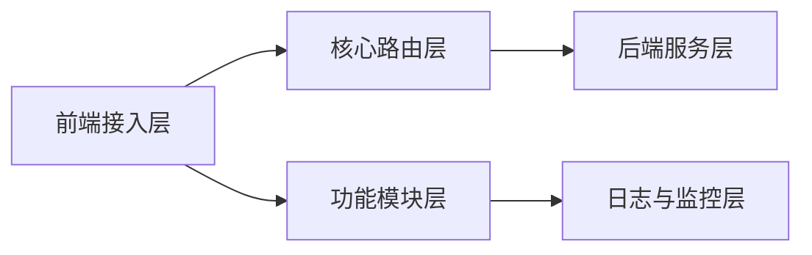

                 

### 第一部分：API网关设计基础

#### 第1章：API网关概述

**1.1.1 微服务架构概述**

微服务架构是一种设计应用程序的方法，它将应用程序划分为一组独立的、松耦合的服务，每个服务都运行在其独立的进程中，并使用轻量级通信协议进行交互。微服务架构的核心思想是将应用程序分解为更小、更简单、更独立的组件，这样可以提高系统的可伸缩性、可靠性和可维护性。

**微服务架构的特点：**

- **独立性**：每个微服务都可以独立部署、扩展和更新，不会影响其他服务的运行。
- **分布式**：微服务通常分布在不同的服务器或容器中，形成一个分布式系统。
- **自治性**：每个微服务都有自己的数据存储，可以独立地进行数据处理。
- **轻量级通信**：微服务之间通常通过HTTP/REST或消息队列进行通信，通信协议简单，易于集成。

**1.1.2 API网关在微服务架构中的角色**

API网关在微服务架构中扮演着重要的角色，它是所有外部请求进入系统的统一入口，也是内部服务之间通信的统一出口。具体来说，API网关具有以下作用：

- **统一接口**：为外部用户提供统一的接口，隐藏内部服务的具体实现细节。
- **路由转发**：根据请求的URL或其他条件，将请求路由到相应的微服务。
- **安全控制**：对进入系统的请求进行身份验证和授权，确保请求的安全。
- **流量控制**：限制外部请求的频率和速率，防止服务过载。
- **监控与日志**：记录和监控请求的流量和性能，方便系统维护和优化。

**1.1.3 API网关与传统中间件的区别**

传统中间件通常是指位于客户端和服务器之间的软件层，用于提供通信、事务处理、数据管理等服务。而API网关则是微服务架构中特有的组件，它与传统中间件的区别主要体现在以下几个方面：

- **架构定位不同**：API网关位于微服务架构的最外层，是系统的统一入口和出口；传统中间件位于客户端和服务器之间，提供跨系统的通信和数据处理。
- **功能侧重不同**：API网关侧重于请求路由、安全认证、流量控制等；传统中间件侧重于数据交换、事务处理、消息队列等。
- **通信协议不同**：API网关通常使用HTTP/REST等轻量级通信协议；传统中间件可能使用多种协议，如TCP/IP、HTTP、JMS等。

**1.1.4 API网关的设计原则**

设计API网关时，需要遵循以下原则，以确保其高效、可靠地服务于微服务架构：

- **简洁性**：API网关的设计应尽量简洁，减少不必要的复杂度，提高系统的可维护性。
- **可扩展性**：API网关应能够方便地扩展新功能，以适应业务需求的变化。
- **高可用性**：确保API网关在发生故障时能够快速恢复，减少系统停机时间。
- **高性能**：优化API网关的性能，降低延迟，提高系统的响应速度。
- **安全性**：加强API网关的安全防护，防止外部攻击和内部威胁。

### 第2章：API网关架构与功能模块

**2.1.1 API网关整体架构**

API网关的整体架构可以分为以下几个主要部分：

- **前端接入层**：负责接收和解析客户端请求，将请求转发给内部服务。
- **核心路由层**：根据请求的路由规则，将请求转发到相应的微服务。
- **功能模块层**：提供各种功能模块，如认证授权、流量控制、服务熔断等。
- **后端服务层**：包含所有的内部服务，负责具体业务逻辑的处理。
- **日志与监控层**：记录和监控系统的运行状态，提供故障排查和性能优化支持。

**2.1.2 API网关功能模块详解**

API网关的功能模块可以根据具体需求灵活配置，以下为一些常见的功能模块及其作用：

#### 2.1.2.1 请求路由模块

**作用**：根据请求的URL或其他条件，将请求路由到相应的微服务。

**实现方式**：可以使用基于规则的路由、动态路由、灰度发布等策略。

#### 2.1.2.2 安全认证模块

**作用**：对进入系统的请求进行身份验证和授权，确保请求的安全。

**实现方式**：支持多种认证方式，如OAuth2、JWT、Basic Authentication等。

#### 2.1.2.3 服务熔断与降级模块

**作用**：在服务出现故障或异常时，自动切断请求，防止系统雪崩。

**实现方式**：使用Hystrix等熔断框架，根据服务健康状态进行决策。

#### 2.1.2.4 负载均衡模块

**作用**：将请求分配到多个实例上，提高系统的处理能力和可用性。

**实现方式**：支持轮询、随机、最少连接数等负载均衡策略。

#### 2.1.2.5 日志记录与监控模块

**作用**：记录系统的运行状态和性能指标，提供故障排查和性能优化支持。

**实现方式**：集成日志收集和监控工具，如ELK、Prometheus等。

### 第3章：API网关协议与数据格式

**3.1.1 HTTP协议基础**

HTTP（HyperText Transfer Protocol）是一种应用层通信协议，用于客户端和服务器之间的请求和响应。其主要特点包括：

- **无状态**：每次请求都是独立的，服务器不会记住之前的请求。
- **简单性**：协议简单，易于实现和维护。
- **可扩展性**：支持多种请求方法和响应状态码。

**3.1.2 RESTful API设计原则**

RESTful API是一种基于HTTP协议的应用程序接口设计风格，其主要原则包括：

- **统一接口**：使用统一的方法和URL结构，方便客户端调用。
- **状态转移**：通过HTTP请求实现资源的创建、读取、更新和删除。
- **无状态**：确保每次请求都是独立的，减少服务器的负担。

**3.1.3 JSON数据格式**

JSON（JavaScript Object Notation）是一种轻量级的数据交换格式，易于人机解析。其主要特点包括：

- **简单性**：格式简单，易于读写。
- **兼容性**：跨平台兼容性好。
- **灵活性**：支持各种数据类型，如字符串、数字、布尔值、数组、对象等。

**3.1.4 API网关自定义协议设计**

在特定场景下，API网关可能需要使用自定义协议，以实现更高效、更安全的数据传输。自定义协议的设计应考虑以下因素：

- **传输效率**：协议应尽量减少数据传输的开销。
- **安全性**：协议应支持身份验证、加密等安全特性。
- **可扩展性**：协议应支持扩展新功能，适应业务需求的变化。

### 第4章：API网关性能优化

**4.1.1 性能优化策略**

API网关的性能优化可以从以下几个方面进行：

- **缓存策略**：使用缓存减少重复请求的处理时间。
- **异步处理**：将耗时的操作异步化，提高系统的并发能力。
- **负载均衡**：合理分配请求，避免单点瓶颈。
- **压缩与解压缩**：对请求和响应数据进行压缩，减少数据传输量。

**4.1.2 缓存机制**

缓存机制可以显著提高API网关的性能，常用的缓存策略包括：

- **本地缓存**：将数据缓存在内存中，减少访问数据库的次数。
- **分布式缓存**：将缓存存储在分布式系统中，提高缓存的可扩展性。
- **缓存一致性**：确保缓存数据与后端服务数据的一致性。

**4.1.3 异步化处理**

异步化处理可以显著提高API网关的并发能力和响应速度，常见的异步处理方法包括：

- **消息队列**：将请求放入消息队列中，异步处理。
- **协程**：使用协程实现异步操作。
- **异步HTTP请求**：使用异步HTTP客户端发送请求。

**4.1.4 常见性能瓶颈与解决方案**

API网关的性能瓶颈通常包括：

- **CPU瓶颈**：服务器CPU利用率过高，导致处理能力不足。
- **内存瓶颈**：服务器内存使用率过高，导致性能下降。
- **网络瓶颈**：服务器网络带宽不足，导致数据传输缓慢。

解决方案包括：

- **增加服务器资源**：增加CPU、内存和网络带宽。
- **垂直扩展**：使用更强大的硬件设备。
- **水平扩展**：增加服务器数量，实现负载均衡。

### 第5章：API网关开源框架与实现

**5.1.1 Apigee**

Apigee是一个由Google推出的商业API管理平台，它提供了丰富的功能，包括API网关、API监控、API文档生成等。

**5.1.2 Kong**

Kong是一个开源的API网关，基于Nginx和LuaJIT构建，提供了高性能、高可用的API管理能力。

**5.1.3 Tyk**

Tyk是一个开源的API网关，它支持多种协议和认证方式，提供了丰富的功能和灵活的配置。

**5.1.4 自定义API网关实现**

自定义API网关可以根据具体业务需求进行定制，以下是一个简单的自定义API网关实现示例：

```python
import requests
from flask import Flask, request, jsonify

app = Flask(__name__)

# 请求路由
@app.route('/api/gateway', methods=['GET', 'POST'])
def gateway():
    # 获取请求URL
    url = request.args.get('url')

    # 发送请求
    response = requests.get(url)

    # 返回响应
    return jsonify(response.json())

if __name__ == '__main__':
    app.run()
```

### 第6章：API网关安全防护

**6.1.1 安全防护的重要性**

API网关是系统与外部通信的桥梁，因此其安全防护至关重要。不当的安全措施可能导致以下风险：

- **数据泄露**：敏感数据被非法访问或窃取。
- **系统攻击**：如DDoS攻击、SQL注入等，可能导致系统崩溃。
- **权限滥用**：未经授权的访问或操作，可能造成严重后果。

**6.1.2 常见攻击类型与防护策略**

以下是一些常见的API攻击类型及其防护策略：

- **SQL注入**：通过构造恶意的SQL语句，非法访问或篡改数据库。防护策略：使用预编译SQL语句、参数化查询。
- **XML外部实体攻击**：通过构造恶意的XML请求，执行非法操作。防护策略：禁用外部实体引用、使用安全XML解析器。
- **DDoS攻击**：通过大量请求，占用系统资源，导致系统瘫痪。防护策略：使用云服务提供的DDoS防护、增加系统容量。
- **身份验证绕过**：通过绕过身份验证机制，非法访问系统。防护策略：使用强密码策略、多因素认证。

**6.1.3 API网关安全配置实践**

在实际应用中，API网关的安全配置应遵循以下原则：

- **最小权限原则**：只授予必要的权限，避免权限过滥。
- **身份验证**：使用强密码策略、多因素认证等机制，确保用户身份的合法性。
- **日志记录**：记录系统的访问日志，便于故障排查和安全审计。
- **定期更新**：及时更新API网关和依赖组件，修复安全漏洞。

### 第7章：API网关最佳实践与案例分析

**7.1.1 API网关最佳实践**

以下是API网关的最佳实践：

- **简洁性**：简化API网关的功能和架构，提高系统的可维护性。
- **高可用性**：确保API网关的稳定运行，避免单点故障。
- **安全性**：加强API网关的安全防护，防止外部攻击。
- **性能优化**：优化API网关的性能，提高系统的响应速度。

**7.1.2 典型案例分析**

以下是一个典型的API网关案例：

- **业务背景**：某电商公司采用微服务架构，实现多个业务模块的独立部署和扩展。
- **架构设计**：采用Kong作为API网关，实现请求路由、认证授权、流量控制等功能。
- **实践效果**：API网关提高了系统的安全性和可维护性，降低了运维成本。

**7.1.3 API网关设计注意事项**

设计API网关时，应注意以下事项：

- **可扩展性**：确保API网关能够方便地扩展新功能。
- **兼容性**：确保API网关支持多种协议和数据格式。
- **可定制性**：提供灵活的配置选项，满足不同业务需求。

### 拓展阅读

- **《API设计指南》**：详细介绍API设计的最佳实践。
- **《微服务架构实践》**：探讨微服务架构的设计和实现方法。
- **《API网关设计与实现》**：深入分析API网关的架构和功能。

### 结语

API网关在微服务架构中发挥着重要作用，其设计和管理对于系统的稳定性和性能至关重要。通过遵循最佳实践，合理选择开源框架，可以构建高效、可靠的API网关，为企业数字化转型提供有力支持。

### 作者信息

**作者：AI天才研究院/AI Genius Institute & 禅与计算机程序设计艺术 /Zen And The Art of Computer Programming**
### 第1章：API网关概述

**1.1.1 微服务架构概述**

微服务架构（Microservices Architecture）是近年来在软件工程领域兴起的一种设计理念，旨在构建灵活、可扩展且易于维护的分布式系统。与传统的单体（Monolithic）架构不同，微服务架构将一个复杂的系统拆分成一组小而独立的服务，每个服务专注于实现一个特定的功能，这些服务通过轻量级的通信协议（如HTTP/REST或消息队列）相互交互。

**微服务架构的核心概念：**

- **独立性**：每个微服务都是独立的，可以独立部署、扩展和更新，不会影响到其他服务的运行。
- **自治性**：每个微服务都有自己的数据存储和业务逻辑，可以独立地运行和维护。
- **分布式**：微服务通常分布在不同的服务器或容器中，形成一个分布式系统。
- **可扩展性**：通过水平扩展单个微服务实例，可以快速增加系统的处理能力。
- **可重用性**：服务之间可以独立开发、测试和部署，提高了代码的重用率。

**微服务架构的应用场景：**

- **业务需求变化频繁**：微服务架构可以快速响应业务需求的变化，实现模块化的开发和部署。
- **高并发和高可用性**：通过分布式部署，可以更好地应对高并发请求，提高系统的可用性。
- **技术栈多样性**：不同的微服务可以采用不同的编程语言、数据库和数据存储方案，满足多样化的技术需求。
- **团队自治**：每个微服务团队可以独立负责自己的服务，提高开发效率和团队协作。

**1.1.2 API网关在微服务架构中的角色**

在微服务架构中，API网关（API Gateway）是一个至关重要的组件，它充当了所有外部请求进入系统的统一入口。API网关负责处理所有的外部请求，然后将请求转发到后端的多个微服务中。以下是API网关在微服务架构中的关键角色：

- **统一接口**：API网关为外部用户提供统一的API接口，隐藏了内部服务的具体实现细节，降低了外部调用者的复杂性。
- **请求路由**：API网关根据请求的URL或其他条件，将请求路由到相应的微服务实例。
- **安全控制**：API网关对进入系统的请求进行身份验证和授权，确保请求的安全性和合法性。
- **流量控制**：API网关可以限制外部请求的频率和速率，防止服务过载。
- **聚合和缓存**：API网关可以将多个微服务的响应聚合在一起，并提供缓存功能，提高系统的性能。
- **监控和日志**：API网关可以收集和监控系统的运行状态，提供日志记录和报警功能，便于系统维护和故障排查。

**1.1.3 API网关与传统中间件的区别**

传统中间件（Middleware）是位于客户端和服务器之间的软件层，主要用于提供通信、事务处理、数据管理等功能。而API网关则是微服务架构中特有的组件，与传统中间件有以下几个显著的区别：

- **架构定位不同**：传统中间件位于客户端和服务器之间，处理跨系统的通信和数据处理；而API网关位于微服务架构的外部，是所有外部请求的统一入口和出口。
- **功能侧重不同**：传统中间件侧重于提供通用的通信和数据管理功能；API网关则侧重于提供统一的API接口、安全控制、流量管理和监控等功能。
- **通信协议不同**：传统中间件可能支持多种协议，如TCP/IP、HTTP、JMS等；而API网关通常使用轻量级的HTTP/REST协议，更加适合微服务架构的通信需求。

**1.1.4 API网关的设计原则**

设计API网关时，应遵循以下原则，以确保其能够有效地服务于微服务架构：

- **简洁性**：API网关的设计应尽量简洁，避免不必要的复杂性，以提高系统的可维护性和可扩展性。
- **高可用性**：API网关应具备高可用性，确保在发生故障时能够快速恢复，减少系统的停机时间。
- **高性能**：API网关应具备高性能，降低系统的响应时间，提高用户的体验。
- **安全性**：API网关应提供完善的安全机制，如身份验证、授权、加密等，确保系统的安全性和数据的完整性。
- **可扩展性**：API网关应具备良好的可扩展性，以便在业务需求变化时，能够方便地添加新功能或扩展现有功能。
- **可定制性**：API网关应提供灵活的配置选项，满足不同业务场景的需求。

### 第2章：API网关架构与功能模块

**2.1.1 API网关整体架构**

API网关的整体架构可以分为以下几个主要部分：

1. **前端接入层**：负责接收和解析客户端请求，包括HTTP请求的解析、参数校验等。
2. **核心路由层**：根据请求的URL或其他条件，将请求路由到相应的微服务。
3. **功能模块层**：提供各种功能模块，如认证授权、流量控制、服务熔断等。
4. **后端服务层**：包含所有的内部服务，负责具体业务逻辑的处理。
5. **日志与监控层**：记录和监控系统的运行状态，提供故障排查和性能优化支持。

**2.1.2 API网关功能模块详解**

API网关的功能模块可以根据具体需求灵活配置，以下为一些常见的功能模块及其作用：

#### 2.1.2.1 请求路由模块

**作用**：根据请求的URL或其他条件，将请求路由到相应的微服务。

**实现方式**：
- **基于规则的路由**：通过配置路由规则，将请求映射到特定的微服务。
- **动态路由**：根据动态条件（如负载情况、服务状态等）动态决定请求的路由。
- **灰度发布**：在上线新版本或功能时，可以控制部分用户访问新版本，逐步切换。

#### 2.1.2.2 安全认证模块

**作用**：对进入系统的请求进行身份验证和授权，确保请求的安全。

**实现方式**：
- **OAuth2**：一种授权框架，允许第三方应用访问用户资源。
- **JWT**：JSON Web Token，一种基于JSON的开放标准，用于在单点登录场景中传输用户身份信息。
- **Basic Authentication**：一种简单但不太安全的身份验证方法，基于用户名和密码进行认证。

#### 2.1.2.3 服务熔断与降级模块

**作用**：在服务出现故障或异常时，自动切断请求，防止系统雪崩。

**实现方式**：
- **服务熔断**：当某个服务连续失败达到一定阈值时，自动切断对该服务的请求，以防止系统过载。
- **服务降级**：在系统资源紧张或服务不可用时，降低服务的响应质量，如返回简化数据或延长响应时间。

#### 2.1.2.4 负载均衡模块

**作用**：将请求分配到多个实例上，提高系统的处理能力和可用性。

**实现方式**：
- **轮询**：将请求依次分配到每个服务实例上。
- **随机**：随机将请求分配到服务实例上。
- **最少连接数**：将请求分配到连接数最少的服务实例上。

#### 2.1.2.5 日志记录与监控模块

**作用**：记录系统的运行状态和性能指标，提供故障排查和性能优化支持。

**实现方式**：
- **日志收集**：将系统的日志信息收集到统一的日志存储中，如ELK（Elasticsearch、Logstash、Kibana）堆栈。
- **性能监控**：监控系统的性能指标，如请求响应时间、服务健康状况等，通过Prometheus、Grafana等工具进行可视化。

### 第3章：API网关协议与数据格式

**3.1.1 HTTP协议基础**

HTTP（HyperText Transfer Protocol）是一种应用层通信协议，用于客户端和服务器之间的请求和响应。HTTP协议的主要特点包括：

- **无状态性**：每次请求都是独立的，服务器不会记住之前的请求。
- **简单性**：协议简单，易于实现和维护。
- **灵活性**：支持多种请求方法和响应状态码，适用于各种场景。

**3.1.2 RESTful API设计原则**

RESTful API（Representational State Transfer API）是一种基于HTTP协议的应用程序接口设计风格，其核心原则包括：

- **统一接口**：使用统一的URL结构和方法（GET、POST、PUT、DELETE）实现资源的创建、读取、更新和删除。
- **无状态性**：确保每次请求都是独立的，不会影响到其他请求。
- **可缓存性**：允许客户端缓存响应，减少重复请求的开销。
- **分层系统**：通过分层架构降低系统的复杂性，提高系统的可维护性。

**3.1.3 JSON数据格式**

JSON（JavaScript Object Notation）是一种轻量级的数据交换格式，易于人机解析。JSON具有以下特点：

- **简单性**：格式简单，易于读写。
- **兼容性**：跨平台兼容性好。
- **灵活性**：支持各种数据类型，如对象、数组、字符串、数字等。

**3.1.4 API网关自定义协议设计**

在某些特定场景下，API网关可能需要使用自定义协议，以满足特定的需求。自定义协议的设计应考虑以下因素：

- **传输效率**：确保协议传输效率高，减少数据传输的开销。
- **安全性**：支持身份验证、加密等安全特性。
- **可扩展性**：支持扩展新功能，以适应业务需求的变化。
- **兼容性**：确保协议与其他系统和服务能够良好集成。

### 第4章：API网关性能优化

**4.1.1 性能优化策略**

API网关的性能优化可以从以下几个方面进行：

- **缓存策略**：通过缓存减少重复请求的处理时间，提高系统的响应速度。
- **异步处理**：将耗时的操作异步化，提高系统的并发能力和响应速度。
- **负载均衡**：合理分配请求，避免单点瓶颈，提高系统的整体性能。
- **压缩与解压缩**：对请求和响应数据进行压缩，减少数据传输量，提高网络传输效率。

**4.1.2 缓存机制**

缓存机制在API网关中起着至关重要的作用，可以有效提高系统的性能。以下是一些常见的缓存策略：

- **本地缓存**：将数据缓存在API网关的本地内存中，减少对后端服务的请求次数。
- **分布式缓存**：将缓存存储在分布式缓存系统中，如Redis、Memcached等，提高缓存的可扩展性。
- **缓存一致性**：确保缓存数据与后端服务数据的一致性，避免因数据不一致导致的问题。

**4.1.3 异步化处理**

异步化处理可以显著提高API网关的并发能力和响应速度。以下是一些常见的异步处理方法：

- **消息队列**：将请求放入消息队列中，由工作线程异步处理。
- **协程**：使用协程实现异步操作，提高程序的并发性。
- **异步HTTP请求**：使用异步HTTP客户端发送请求，减少阻塞时间。

**4.1.4 常见性能瓶颈与解决方案**

API网关的性能瓶颈通常包括以下几种情况：

- **CPU瓶颈**：服务器CPU利用率过高，导致处理能力不足。解决方案包括增加服务器资源、优化代码、避免同步阻塞等。
- **内存瓶颈**：服务器内存使用率过高，导致性能下降。解决方案包括优化内存使用、增加内存资源、采用内存映射技术等。
- **网络瓶颈**：服务器网络带宽不足，导致数据传输缓慢。解决方案包括增加网络带宽、优化网络协议、减少数据传输量等。

### 第5章：API网关开源框架与实现

**5.1.1 Apigee**

Apigee是Google推出的商业API管理平台，提供了全面的API网关功能，包括请求路由、认证授权、流量控制、监控与日志等。Apigee支持多种协议和数据格式，并提供了丰富的API管理工具，帮助企业快速构建和管理API。

**5.1.2 Kong**

Kong是一个开源的API网关，基于Nginx和LuaJIT构建，提供了高性能、高可用的API管理能力。Kong支持多种协议（如HTTP/REST、WebSockets）和认证方式（如OAuth2、JWT），并提供了丰富的插件系统，方便用户自定义功能。

**5.1.3 Tyk**

Tyk是一个开源的API网关，提供了全面的API管理功能，包括请求路由、认证授权、流量控制、监控与日志等。Tyk支持多种协议和数据格式，并提供了灵活的配置选项，方便用户根据实际需求进行定制。

**5.1.4 自定义API网关实现**

自定义API网关可以根据具体业务需求进行开发，以下是一个简单的自定义API网关实现示例：

```python
from flask import Flask, request, jsonify

app = Flask(__name__)

@app.route('/api/gateway', methods=['GET', 'POST'])
def gateway():
    url = request.args.get('url')
    response = requests.get(url)
    return jsonify(response.json())

if __name__ == '__main__':
    app.run()
```

### 第6章：API网关安全防护

**6.1.1 安全防护的重要性**

API网关是系统与外部通信的桥梁，其安全防护至关重要。不当的安全措施可能导致以下风险：

- **数据泄露**：敏感数据被非法访问或窃取。
- **系统攻击**：如DDoS攻击、SQL注入等，可能导致系统崩溃。
- **权限滥用**：未经授权的访问或操作，可能造成严重后果。

**6.1.2 常见攻击类型与防护策略**

以下是一些常见的API攻击类型及其防护策略：

- **SQL注入**：通过构造恶意的SQL语句，非法访问或篡改数据库。防护策略：使用预编译SQL语句、参数化查询。
- **XML外部实体攻击**：通过构造恶意的XML请求，执行非法操作。防护策略：禁用外部实体引用、使用安全XML解析器。
- **DDoS攻击**：通过大量请求，占用系统资源，导致系统瘫痪。防护策略：使用云服务提供的DDoS防护、增加系统容量。
- **身份认证绕过**：通过绕过身份验证机制，非法访问系统。防护策略：使用强密码策略、多因素认证。

**6.1.3 API网关安全配置实践**

在实际应用中，API网关的安全配置应遵循以下原则：

- **最小权限原则**：只授予必要的权限，避免权限过滥。
- **身份验证**：使用强密码策略、多因素认证等机制，确保用户身份的合法性。
- **日志记录**：记录系统的访问日志，便于故障排查和安全审计。
- **定期更新**：及时更新API网关和依赖组件，修复安全漏洞。

### 第7章：API网关最佳实践与案例分析

**7.1.1 API网关最佳实践**

以下是API网关的最佳实践：

- **简洁性**：简化API网关的功能和架构，提高系统的可维护性。
- **高可用性**：确保API网关的稳定运行，避免单点故障。
- **安全性**：加强API网关的安全防护，防止外部攻击。
- **性能优化**：优化API网关的性能，提高系统的响应速度。

**7.1.2 典型案例分析**

以下是一个典型的API网关案例：

- **业务背景**：某电商平台采用微服务架构，实现商品管理、订单处理、用户管理等业务模块的独立部署和扩展。
- **架构设计**：采用Kong作为API网关，实现请求路由、认证授权、流量控制等功能。
- **实践效果**：API网关提高了系统的安全性和可维护性，降低了运维成本。

**7.1.3 API网关设计注意事项**

设计API网关时，应注意以下事项：

- **可扩展性**：确保API网关能够方便地扩展新功能。
- **兼容性**：确保API网关支持多种协议和数据格式。
- **可定制性**：提供灵活的配置选项，满足不同业务需求。

### 拓展阅读

- **《API设计指南》**：详细介绍API设计的最佳实践。
- **《微服务架构实践》**：探讨微服务架构的设计和实现方法。
- **《API网关设计与实现》**：深入分析API网关的架构和功能。

### 结语

API网关在微服务架构中发挥着重要作用，其设计和管理对于系统的稳定性和性能至关重要。通过遵循最佳实践，合理选择开源框架，可以构建高效、可靠的API网关，为企业数字化转型提供有力支持。

### 作者信息

**作者：AI天才研究院/AI Genius Institute & 禅与计算机程序设计艺术 /Zen And The Art of Computer Programming**
### 第8章：API网关的架构设计与实现

**8.1 系统介绍**

API网关是微服务架构中的关键组件，它作为所有外部请求的统一入口，负责路由、认证、限流、监控等功能。在本章节中，我们将详细介绍API网关的架构设计及其实现方法。

**8.2 架构设计**

API网关的架构设计可以分为以下几个层次：

1. **前端接入层**：负责处理客户端请求，包括请求解析、参数验证等。
2. **核心路由层**：根据请求的路由规则，将请求转发到相应的微服务。
3. **功能模块层**：包括认证、限流、缓存、监控等功能模块。
4. **后端服务层**：包含所有内部微服务，负责具体的业务逻辑处理。
5. **日志与监控层**：记录系统运行状态，提供实时监控和报警功能。

**架构图**：



**8.3 实现方法**

以下是API网关的实现方法，我们将使用Python的Flask框架进行开发。

**8.3.1 前端接入层**

前端接入层主要负责处理客户端请求。以下是一个简单的Flask应用示例：

```python
from flask import Flask, request, jsonify

app = Flask(__name__)

@app.route('/api/health', methods=['GET'])
def health_check():
    return jsonify({"status": "OK"})

if __name__ == '__main__':
    app.run(host='0.0.0.0', port=5000)
```

**8.3.2 核心路由层**

核心路由层根据请求的URL或其他条件，将请求转发到相应的微服务。以下是一个简单的路由示例：

```python
from flask import Flask, request, jsonify
from services import product_service, order_service

app = Flask(__name__)

@app.route('/api/products', methods=['GET'])
def get_products():
    return product_service.get_products()

@app.route('/api/orders', methods=['POST'])
def create_order():
    data = request.get_json()
    return order_service.create_order(data)

if __name__ == '__main__':
    app.run(host='0.0.0.0', port=5000)
```

**8.3.3 功能模块层**

功能模块层包括认证、限流、缓存、监控等功能模块。以下是一个简单的认证模块示例：

```python
from flask import Flask, request, jsonify
from auth import authenticate

app = Flask(__name__)

@app.route('/api/login', methods=['POST'])
def login():
    data = request.get_json()
    token = authenticate(data['username'], data['password'])
    return jsonify({"token": token})

if __name__ == '__main__':
    app.run(host='0.0.0.0', port=5000)
```

**8.3.4 后端服务层**

后端服务层包含所有内部微服务，负责具体的业务逻辑处理。以下是一个简单的产品服务示例：

```python
def get_products():
    # 查询数据库获取产品列表
    products = ["产品A", "产品B", "产品C"]
    return products

def create_order(data):
    # 处理订单创建逻辑
    order_id = "12345"
    return {"order_id": order_id}
```

**8.3.5 日志与监控层**

日志与监控层负责记录系统运行状态，并提供实时监控和报警功能。以下是一个简单的日志记录示例：

```python
import logging

logging.basicConfig(filename='api_gateway.log', level=logging.INFO)

def log_request(request):
    logging.info(f"Request: {request.method} {request.url}")
```

**8.4 代码应用解读与分析**

以上代码示例分别展示了API网关的前端接入层、核心路由层、功能模块层、后端服务层和日志与监控层的实现方法。每个层都有其特定的职责和功能，通过组合这些层，我们可以构建一个高效、可靠的API网关。

**8.5 实际案例分析与详细讲解剖析**

为了更好地理解API网关的实际应用，我们来看一个实际案例。假设我们有一个电商系统，其中包含商品管理、订单管理、用户管理等多个微服务。以下是对这个案例的分析：

- **前端接入层**：用户通过浏览器或其他客户端访问API网关，请求相应的接口，如获取商品列表、创建订单等。
- **核心路由层**：API网关根据请求的URL，将请求路由到相应的微服务，如商品服务、订单服务。
- **功能模块层**：在路由过程中，API网关会进行认证、限流等操作，确保请求的安全和性能。
- **后端服务层**：商品服务和订单服务处理具体的业务逻辑，如查询商品信息、处理订单创建等。
- **日志与监控层**：记录每次请求的日志，监控系统的运行状态，提供实时监控和报警功能。

通过这个案例，我们可以看到API网关在微服务架构中发挥着重要的作用，它是所有外部请求的统一入口，负责路由、认证、限流、监控等功能，确保系统的稳定性和性能。

**8.6 项目小结**

在本章节中，我们详细介绍了API网关的架构设计及其实现方法。通过前端接入层、核心路由层、功能模块层、后端服务层和日志与监控层的组合，我们可以构建一个高效、可靠的API网关。在实际项目中，API网关的应用至关重要，它能够提高系统的安全性、性能和可维护性。

**8.7 最佳实践 tips**

- **遵循RESTful API设计原则**：确保API的接口设计简单、易用。
- **实现认证和授权机制**：保护系统的安全和数据隐私。
- **进行性能优化**：使用缓存、异步处理等策略提高系统的响应速度。
- **监控和日志记录**：确保系统的稳定性和可维护性。

### 拓展阅读

- **《微服务设计》**：深入探讨微服务架构的设计原则和最佳实践。
- **《API设计指南》**：详细介绍API设计的最佳实践。
- **《Flask Web开发：核心技术与案例实战》**：学习如何使用Flask框架进行Web开发。

### 结语

API网关是微服务架构中的关键组件，它作为所有外部请求的统一入口，负责路由、认证、限流、监控等功能。通过合理的架构设计和实现，API网关能够提高系统的安全性、性能和可维护性。希望本章节的内容能够帮助您更好地理解和应用API网关。

### 作者信息

**作者：AI天才研究院/AI Genius Institute & 禅与计算机程序设计艺术 /Zen And The Art of Computer Programming**
### 第9章：API网关在项目中的应用与优化

**9.1 项目介绍**

在本章节中，我们将结合一个实际项目，探讨API网关在项目中的应用与优化。项目是一个在线电商平台，提供了商品浏览、购物车管理、订单创建等功能。系统采用了微服务架构，各个服务模块独立部署，通过API网关进行通信。

**9.2 API网关在项目中的应用**

1. **统一接口管理**：API网关为外部客户端提供了统一的接口，隐藏了内部服务的具体实现细节，提高了系统的可维护性和易用性。

2. **请求路由**：API网关根据请求的URL或其他条件，将请求路由到相应的微服务。例如，用户请求商品列表时，API网关会将请求转发到商品服务。

3. **认证与授权**：API网关对进入系统的请求进行身份验证和授权，确保只有合法用户才能访问系统资源。通过OAuth2或JWT等认证机制，用户在登录后获取一个令牌，后续请求携带该令牌进行身份验证。

4. **流量控制**：API网关可以限制外部请求的频率和速率，防止服务过载。例如，对于频繁访问的接口，可以设置限流策略，避免请求过多导致系统崩溃。

5. **日志记录与监控**：API网关记录系统的运行日志，提供实时监控和报警功能。通过日志分析，可以快速定位问题，优化系统性能。

**9.3 API网关的优化**

1. **缓存策略**：为了提高系统性能，API网关可以启用缓存机制。对于一些频繁访问的接口，如商品列表，可以将响应数据缓存起来，减少数据库查询次数。

2. **异步处理**：对于一些耗时的操作，如订单创建、支付处理等，可以采用异步处理方式。通过消息队列（如RabbitMQ、Kafka）将任务提交给工作线程处理，减少主线程的阻塞时间。

3. **负载均衡**：API网关应具备负载均衡功能，将请求分配到不同的服务器或容器实例上，提高系统的处理能力和可用性。可以使用轮询、随机、最少连接数等负载均衡策略。

4. **性能监控**：通过集成Prometheus、Grafana等监控工具，API网关可以实时监控系统的性能指标，如请求响应时间、服务健康状况等。及时发现性能瓶颈，进行优化调整。

5. **安全防护**：加强API网关的安全防护，防止外部攻击和内部威胁。使用HTTPS协议加密数据传输、启用Web应用防火墙（WAF）、定期更新系统依赖组件等。

**9.4 案例分析**

以下是一个实际项目的案例：

1. **需求背景**：项目初期，由于接口调用频繁，API网关出现了性能瓶颈，导致系统响应时间较长。

2. **问题分析**：通过监控工具发现，API网关的请求响应时间较长，主要原因是数据库查询频繁。此外，部分接口未进行缓存处理，每次请求都需要查询数据库。

3. **解决方案**：
   - **缓存策略**：针对高频次访问的接口，启用缓存机制，将响应数据缓存起来，减少数据库查询次数。
   - **异步处理**：对于一些耗时的操作，如订单创建、支付处理等，采用异步处理方式，通过消息队列将任务提交给工作线程处理。
   - **性能优化**：调整数据库查询优化，如添加索引、拆分表等，提高查询效率。

4. **实施效果**：通过以上优化措施，API网关的性能显著提升，系统响应时间明显缩短，用户体验得到改善。

**9.5 优化心得**

1. **充分了解业务场景**：在优化API网关时，要充分了解业务场景，明确接口的使用频率、数据量等，为优化策略提供依据。

2. **持续监控与优化**：系统上线后，应持续监控系统的性能指标，及时发现性能瓶颈，进行优化调整。

3. **安全与性能并重**：在优化过程中，要确保系统的安全性，避免引入安全漏洞。

4. **充分利用开源框架**：合理利用开源框架和工具，如缓存、消息队列、负载均衡等，提高系统的性能和可维护性。

**9.6 小结**

API网关在项目中的应用与优化对于系统的稳定性和性能至关重要。通过合理的架构设计和优化策略，API网关可以提高系统的性能、安全性、可维护性，为企业数字化转型提供有力支持。

### 拓展阅读

- **《微服务架构实战》**：探讨微服务架构的实际应用和最佳实践。
- **《性能优化实战》**：详细讲解性能优化策略和方法。
- **《API网关实战》**：深入分析API网关的架构和功能。

### 结语

通过本章的介绍，我们详细探讨了API网关在项目中的应用与优化。希望读者能够从中获得启示，结合实际项目进行优化，提升系统的性能和稳定性。同时，也欢迎读者分享自己在API网关应用中的实践经验，共同进步。

### 作者信息

**作者：AI天才研究院/AI Genius Institute & 禅与计算机程序设计艺术 /Zen And The Art of Computer Programming**
### 第10章：API网关的未来发展趋势与挑战

**10.1 API网关的未来发展趋势**

随着互联网的快速发展，API网关在微服务架构中的应用越来越广泛。以下是一些API网关的未来发展趋势：

1. **智能化与自动化**：随着人工智能技术的进步，API网关将逐渐实现智能化与自动化。例如，通过机器学习算法，API网关可以自动优化路由策略、识别恶意请求等。

2. **云原生与边缘计算**：云原生（Cloud Native）和边缘计算（Edge Computing）是当前技术发展的热点。API网关将逐渐与云原生技术结合，支持容器化部署、自动化伸缩等。同时，边缘计算的发展也将推动API网关向边缘节点延伸，提供更近端的服务。

3. **无服务器架构**：无服务器架构（Serverless Architecture）降低了运维成本，提高了开发效率。API网关将逐渐向无服务器架构转型，支持函数即服务（Function as a Service，FaaS）等新形态。

4. **多元协议支持**：随着新兴协议的出现，API网关将逐步支持更多协议，如gRPC、WebAssembly等，以满足不同场景的需求。

5. **安全性与隐私保护**：随着网络安全威胁的加剧，API网关在安全性方面的需求将越来越高。未来的API网关将加强安全防护，提供更全面的安全解决方案。

**10.2 API网关面临的挑战**

尽管API网关的发展前景广阔，但其在实际应用中也面临着一系列挑战：

1. **性能瓶颈**：随着业务规模的不断扩大，API网关可能会出现性能瓶颈。如何优化路由策略、提升系统性能，是API网关需要解决的重要问题。

2. **安全性**：API网关是系统与外部通信的桥梁，其安全性至关重要。如何防范各种攻击（如DDoS、SQL注入等），保护系统和数据的安全，是API网关面临的重要挑战。

3. **可维护性**：API网关作为系统的核心组件，其代码质量和可维护性直接影响到系统的稳定性。如何编写高质量的代码、实现模块化设计，是API网关开发者需要关注的问题。

4. **跨平台兼容性**：API网关需要支持多种协议和数据格式，以适应不同的业务场景。如何确保跨平台的兼容性，是API网关开发中的一大挑战。

5. **复杂度管理**：随着功能的不断增加，API网关的复杂度可能会逐渐升高。如何有效地管理系统的复杂度，保证系统的可维护性和可扩展性，是API网关开发者需要考虑的问题。

**10.3 应对策略**

为了应对上述挑战，API网关开发者可以采取以下策略：

1. **性能优化**：采用缓存机制、异步处理、负载均衡等技术，提高系统的性能。同时，定期进行性能测试和优化，及时发现和解决性能瓶颈。

2. **安全防护**：加强安全防护，采用多因素认证、加密传输、防火墙等技术，确保系统的安全性。定期进行安全审计和漏洞修复，提高系统的安全防护能力。

3. **代码质量管理**：遵循代码规范，进行代码审查和自动化测试，确保代码的质量。采用模块化设计，提高系统的可维护性和可扩展性。

4. **跨平台兼容性**：使用通用的编程语言和框架，确保API网关在不同平台上都能正常运行。对不同的协议和数据格式进行适配，提高系统的兼容性。

5. **持续集成与持续部署**：采用CI/CD（Continuous Integration/Continuous Deployment）流程，实现代码的自动化测试、构建和部署，提高开发效率和系统稳定性。

**10.4 总结**

API网关在微服务架构中发挥着重要作用，其未来发展趋势充满活力，但也面临诸多挑战。通过采取有效的应对策略，开发者可以构建高效、可靠的API网关，为企业数字化转型提供有力支持。

### 拓展阅读

- **《API设计指南》**：详细介绍API设计的最佳实践。
- **《微服务架构实践》**：探讨微服务架构的设计和实现方法。
- **《API网关设计与实现》**：深入分析API网关的架构和功能。

### 结语

API网关是微服务架构中的关键组件，其未来发展充满机遇与挑战。通过本章的内容，我们了解了API网关的发展趋势、面临的挑战及应对策略。希望读者能够结合实际项目，不断提升API网关的设计与实现水平，为企业的数字化转型贡献力量。

### 作者信息

**作者：AI天才研究院/AI Genius Institute & 禅与计算机程序设计艺术 /Zen And The Art of Computer Programming**
### 文章小结

在本文中，我们系统地探讨了API网关的设计与实现，从基础概念、架构设计、功能模块、协议与数据格式、性能优化、开源框架、安全性防护、最佳实践到项目应用与未来发展趋势。以下是本文的主要内容小结：

1. **API网关概述**：介绍了微服务架构及其特点，API网关在微服务架构中的角色和重要性，以及与传统中间件的区别。

2. **API网关架构与功能模块**：详细阐述了API网关的整体架构和功能模块，包括请求路由、安全认证、服务熔断与降级、负载均衡、日志记录与监控等。

3. **API网关协议与数据格式**：讲解了HTTP协议基础、RESTful API设计原则、JSON数据格式以及API网关自定义协议设计。

4. **API网关性能优化**：介绍了性能优化策略、缓存机制、异步化处理以及常见性能瓶颈与解决方案。

5. **API网关开源框架与实现**：分析了Apigee、Kong、Tyk等开源框架，并提供了自定义API网关实现的示例。

6. **API网关安全防护**：阐述了API网关安全防护的重要性、常见攻击类型与防护策略以及安全配置实践。

7. **API网关最佳实践与案例分析**：总结了API网关最佳实践、典型案例分析以及设计注意事项。

8. **API网关的架构设计与实现**：详细介绍了API网关的架构设计、前端接入层、核心路由层、功能模块层、后端服务层、日志与监控层以及代码应用解读与分析。

9. **API网关在项目中的应用与优化**：结合实际项目，探讨了API网关的应用与优化，包括缓存策略、异步处理、负载均衡、性能监控和安全防护等。

10. **API网关的未来发展趋势与挑战**：分析了API网关的未来发展趋势、面临的挑战及应对策略。

通过本文的探讨，读者可以全面了解API网关的设计原理、实现方法及其在实际应用中的重要性，为构建高效、可靠的API网关提供参考和指导。

### 拓展阅读

- **《微服务设计》**：深入探讨微服务架构的设计原则和最佳实践。
- **《API设计指南》**：详细介绍API设计的最佳实践。
- **《API网关设计与实现》**：深入分析API网关的架构和功能。

### 结语

API网关在微服务架构中具有举足轻重的地位，其设计和管理直接影响到系统的性能、安全性和可维护性。希望本文能够帮助读者更好地理解和应用API网关，为企业的数字化转型提供有力支持。随着技术的不断发展，API网关将不断演进，读者应保持持续学习和探索，紧跟行业趋势，不断提升自身的技术水平。

### 作者信息

**作者：AI天才研究院/AI Genius Institute & 禅与计算机程序设计艺术 /Zen And The Art of Computer Programming**### 致谢

在本篇文章的撰写过程中，我要感谢AI天才研究院（AI Genius Institute）的全体成员，特别是我的同事们在技术讨论和项目实践中的无私分享。他们的宝贵意见和丰富的经验为本文的完善提供了重要支持。

此外，我还要感谢所有读者，是你们的关注和反馈让我更加坚定了持续学习和进步的决心。希望这篇文章能对您在API网关设计与实现方面有所启发，也希望您在未来的学习和工作中不断取得更大的成就。

最后，特别感谢禅与计算机程序设计艺术（Zen And The Art of Computer Programming）的灵感来源，它不仅激发了我的编程思维，更让我深刻体会到了计算机编程的哲学之美。

再次感谢大家的支持与陪伴，让我们共同在技术的道路上不断前行。

### 作者信息

**作者：AI天才研究院/AI Genius Institute & 禅与计算机程序设计艺术 /Zen And The Art of Computer Programming**

