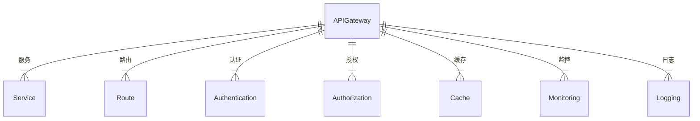
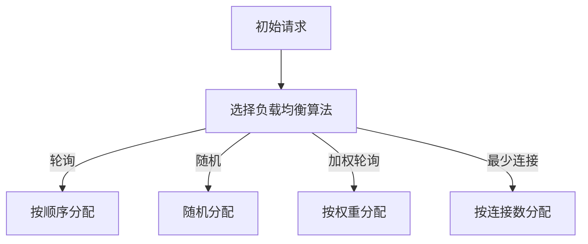
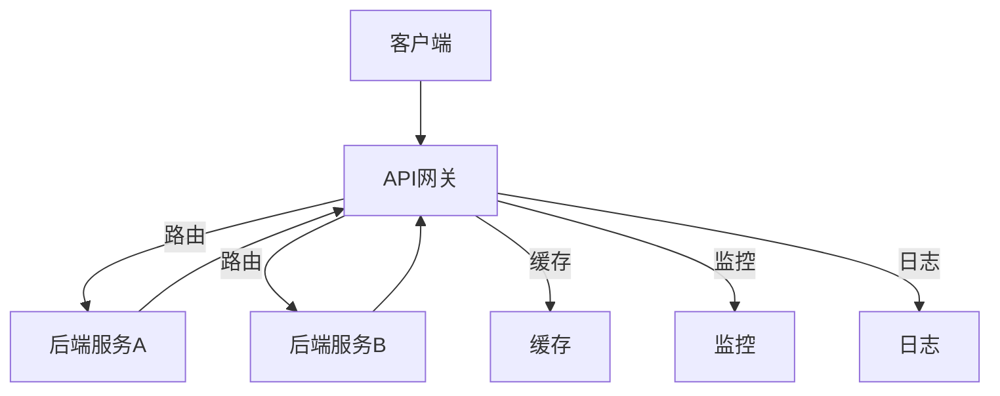
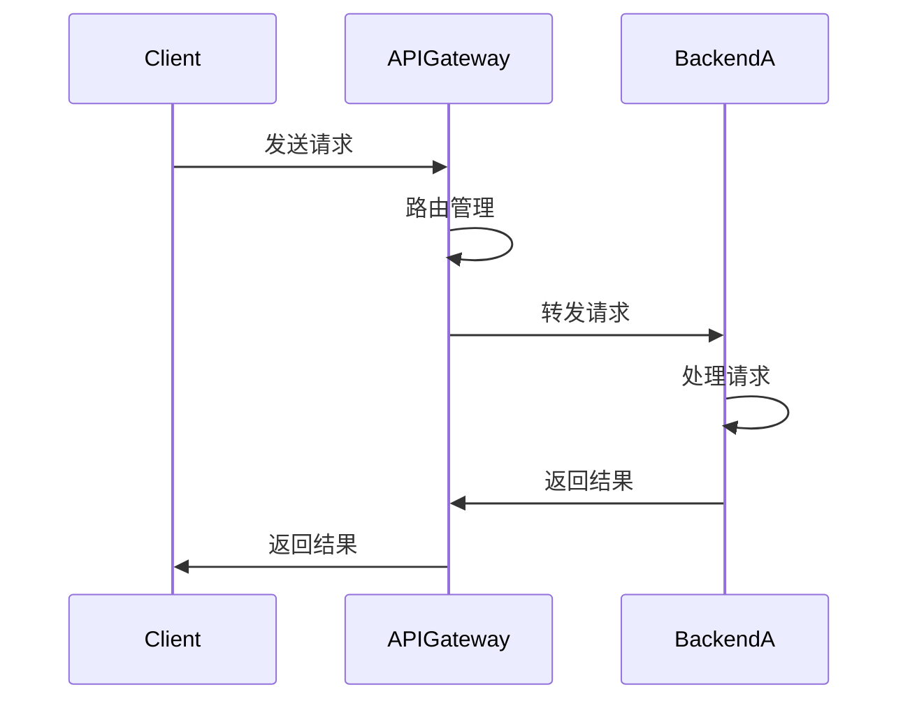

                 


# API网关：微服务架构的统一入口

## 关键词
API网关，微服务架构，统一入口，服务治理，性能优化，安全性

## 摘要
本文将深入探讨API网关在微服务架构中的作用，从基础概念到实现技术，再到最佳实践，全方位解析API网关的设计与部署。通过分析API网关的功能与设计原则，实现技术，性能优化与安全性问题，我们旨在帮助读者理解API网关在微服务架构中的重要性，掌握其核心原理和实践技巧，为构建高效、安全的微服务系统提供有力支持。

----------------------------------------------------------------

## 第一部分：API网关概述

### 第1章：API网关基础

#### 1.1 API网关的定义与作用

API网关（API Gateway）是一种服务器，负责处理外部对应用程序所有入站HTTP请求，并将这些请求转发到相应的内部服务。其核心作用在于充当客户端和服务器之间的中介，简化应用程序的访问和管理，提供集中式服务治理和性能优化。

**API网关的基本功能**包括：

1. **路由**：根据请求的URL或其他参数，将请求路由到正确的后端服务。
2. **负载均衡**：分配请求到多个后端实例，提高系统的吞吐量和可用性。
3. **认证与授权**：验证客户端的权限，确保只有授权用户可以访问受保护的服务。
4. **限流与熔断**：限制请求频率，防止服务过载，提高系统的稳定性。
5. **缓存**：缓存请求结果，减少对后端服务的调用次数，提高响应速度。
6. **监控与日志**：记录请求和处理过程中的各种指标，方便监控和调试。

#### 1.2 API网关在微服务架构中的地位

在微服务架构中，API网关扮演着至关重要的角色。它是所有外部请求的统一入口，将复杂的内部服务网络简化为一个单一的访问点。以下原因说明了API网关在微服务架构中的重要性：

1. **简化客户端调用**：通过API网关，客户端只需与一个统一的接口通信，无需了解后端服务的具体实现和细节。
2. **服务治理**：API网关提供集中式服务注册、发现和配置管理，方便服务的管理和维护。
3. **安全性**：API网关可以对请求进行身份验证和授权，确保只有合法的请求才能访问后端服务。
4. **性能优化**：API网关可以缓存常用数据，减少对后端服务的调用次数，提高系统的响应速度。
5. **灵活性与可扩展性**：API网关可以轻松地添加新功能，如日志记录、监控、API文档生成等，提高系统的可维护性和可扩展性。

### 第2章：微服务架构概述

#### 2.1 微服务的定义与特点

微服务（Microservices）是一种软件架构风格，它将应用程序划分为一组小的、独立的、可协作的服务，每个服务负责完成特定的业务功能。微服务架构具有以下特点：

1. **独立性**：每个服务都是独立的，可以独立部署、扩展和升级，不会影响其他服务。
2. **分布式**：服务通常部署在不同的服务器上，通过API进行通信，形成分布式系统。
3. **细粒度**：服务通常非常细粒度，每个服务只完成一个特定的业务功能。
4. **自治性**：每个服务都有自己的数据存储、业务逻辑和资源，可以独立运行和扩展。
5. **异步通信**：服务之间通常采用异步通信方式，如消息队列或事件驱动模型，减少同步调用的依赖。

#### 2.2 微服务与传统架构的区别

与传统单体架构（Monolithic Architecture）相比，微服务架构具有以下区别：

1. **部署与扩展**：传统单体架构部署为一个单一的部署单元，扩展难度大；微服务架构可以独立部署和扩展每个服务，灵活性强。
2. **通信方式**：传统单体架构服务之间通过方法调用通信，耦合度高；微服务架构服务之间通过API通信，解耦性强。
3. **数据管理**：传统单体架构通常使用单一数据库，数据管理复杂；微服务架构每个服务都有自己的数据存储，数据管理简单。
4. **开发与测试**：传统单体架构开发与测试难度大，周期长；微服务架构可以独立开发和测试每个服务，提高开发效率。
5. **容错性**：传统单体架构一旦出现故障，整个系统都会受到影响；微服务架构每个服务独立运行，故障隔离性强，系统容错性高。

#### 2.3 微服务与API网关的关联

API网关在微服务架构中起着至关重要的作用，它与微服务的关系如下：

1. **统一入口**：API网关作为外部请求的统一入口，简化了客户端对多个微服务的访问。
2. **服务治理**：API网关提供集中式服务注册、发现和配置管理，方便对微服务进行统一管理和维护。
3. **路由与负载均衡**：API网关负责将外部请求路由到相应的微服务，同时实现负载均衡，提高系统的性能和可用性。
4. **认证与授权**：API网关可以对请求进行身份验证和授权，确保只有授权用户可以访问受保护的微服务。
5. **监控与日志**：API网关可以记录请求和处理过程中的各种指标，方便对微服务进行监控和调试。

----------------------------------------------------------------

## 第二部分：API网关设计与实现

### 第3章：API网关功能与设计原则

#### 3.1 API网关功能概述

API网关的核心功能包括但不限于以下几个方面：

1. **路由与负载均衡**：根据请求的URL或其他参数，将请求路由到正确的后端服务，并实现负载均衡。
2. **认证与授权**：验证客户端的权限，确保只有授权用户可以访问受保护的服务。
3. **限流与熔断**：限制请求频率，防止服务过载，提高系统的稳定性。
4. **缓存**：缓存请求结果，减少对后端服务的调用次数，提高响应速度。
5. **监控与日志**：记录请求和处理过程中的各种指标，方便监控和调试。
6. **API文档生成**：自动生成API文档，方便开发者了解和使用API。

#### 3.2 设计API网关时应遵循的原则

设计API网关时，应遵循以下原则，以确保系统的稳定性和可维护性：

1. **高可用性**：确保API网关能够稳定运行，提供不间断的服务。
2. **高性能**：优化API网关的性能，提高系统的响应速度和处理能力。
3. **可扩展性**：设计灵活的架构，支持系统的垂直和水平扩展。
4. **安全性**：确保API网关的安全性，防止未经授权的访问和攻击。
5. **可维护性**：简化系统的维护工作，提高开发效率和系统稳定性。
6. **易用性**：提供友好的用户界面和完善的文档，方便用户使用和维护。

### 第4章：API网关实现技术

#### 4.1 常见的API网关框架

在实现API网关时，可以使用以下常见的框架：

1. **Spring Cloud Gateway**：基于Spring Framework和Spring Boot，提供强大的路由和过滤器功能。
2. **Kong**：一个高性能的API网关，支持多种协议和插件，具有良好的扩展性。
3. **Zuul**：Netflix开源的API网关，用于微服务架构的路由、过滤和安全控制。
4. **Nginx**：一个高性能的Web服务器，也可以用作API网关，提供基本的路由和负载均衡功能。

#### 4.2 API网关工具的选择与配置

选择API网关工具时，需要考虑以下几个方面：

1. **性能要求**：根据系统的性能要求，选择合适的网关工具，如Nginx适用于高性能场景，Spring Cloud Gateway适用于开发便捷场景。
2. **功能需求**：根据系统的功能需求，选择具有相应功能的网关工具，如Kong支持丰富的插件，适用于复杂场景。
3. **部署方式**：根据部署环境，选择合适的网关工具，如Spring Cloud Gateway适用于Spring Boot环境，Nginx适用于Linux环境。
4. **社区支持**：考虑网关工具的社区支持和文档，选择易于学习和维护的工具。

在配置API网关时，需要关注以下几个方面：

1. **路由配置**：根据业务需求，配置请求的路由规则，将请求转发到相应的后端服务。
2. **过滤器配置**：配置过滤器，实现认证、授权、限流、熔断等功能。
3. **负载均衡配置**：配置负载均衡策略，如轮询、随机、加权等，提高系统的性能和可用性。
4. **安全配置**：配置安全策略，如SSL/TLS、身份验证、授权等，提高系统的安全性。

----------------------------------------------------------------

## 第三部分：API网关与微服务集成

### 第5章：API网关与微服务集成

#### 5.1 集成API网关的优势

集成API网关可以带来以下优势：

1. **简化客户端调用**：通过API网关，客户端只需与一个统一的接口通信，无需了解后端服务的具体实现和细节。
2. **服务治理**：API网关提供集中式服务注册、发现和配置管理，方便对微服务进行统一管理和维护。
3. **安全性**：API网关可以对请求进行身份验证和授权，确保只有授权用户可以访问受保护的微服务。
4. **性能优化**：API网关可以缓存常用数据，减少对后端服务的调用次数，提高系统的响应速度。
5. **灵活性与可扩展性**：API网关可以轻松地添加新功能，如日志记录、监控、API文档生成等，提高系统的可维护性和可扩展性。

#### 5.2 集成API网关的步骤与实践

集成API网关的基本步骤如下：

1. **服务注册与发现**：将微服务注册到API网关，并实现服务发现功能，方便API网关根据服务名称查找后端服务实例。
2. **路由配置**：根据业务需求，配置请求的路由规则，将请求转发到相应的后端服务。
3. **过滤器配置**：配置过滤器，实现认证、授权、限流、熔断等功能。
4. **负载均衡配置**：配置负载均衡策略，如轮询、随机、加权等，提高系统的性能和可用性。
5. **安全配置**：配置安全策略，如SSL/TLS、身份验证、授权等，提高系统的安全性。

在实际应用中，以下实践技巧可以帮助更好地集成API网关：

1. **分层次路由**：根据请求的URL或其他参数，实现分层次的路由策略，提高路由的精准度和效率。
2. **动态路由**：根据后端服务实例的状态和性能，动态调整路由规则，提高系统的性能和可用性。
3. **灰度发布**：在上线新功能或版本时，使用灰度发布策略，逐步将流量引入新服务实例，确保系统的稳定性和安全性。
4. **日志记录与监控**：记录API网关和后端服务的日志和监控数据，方便问题排查和性能优化。

#### 5.3 API网关与微服务的通信协议

API网关与微服务之间的通信协议通常有以下几种：

1. **HTTP/HTTPS**：最常用的通信协议，适用于大部分场景，具有较好的兼容性和易用性。
2. **gRPC**：基于HTTP/2协议的远程过程调用框架，适用于高性能、低延迟的场景。
3. **gRPC-web**：基于HTTP/2协议的Web RPC框架，适用于Web应用程序与微服务之间的通信。
4. **WebSocket**：支持双向通信的协议，适用于实时数据处理和通信的场景。

选择通信协议时，需要考虑以下几个方面：

1. **性能要求**：根据系统的性能要求，选择合适的通信协议，如gRPC适用于高性能场景，HTTP/HTTPS适用于通用场景。
2. **通信需求**：根据业务需求，选择适合的通信协议，如WebSocket适用于实时通信场景，HTTP/HTTPS适用于请求/响应场景。
3. **安全性**：考虑通信协议的安全性，如HTTPS提供加密传输，保证数据的安全性。
4. **兼容性**：考虑通信协议的兼容性，如HTTP/HTTPS具有较好的跨平台兼容性。

### 第6章：API网关性能优化

#### 6.1 性能优化策略

为了提高API网关的性能，可以采取以下策略：

1. **负载均衡**：实现负载均衡策略，将请求分配到多个后端服务实例，提高系统的吞吐量和可用性。
2. **缓存**：缓存常用数据，减少对后端服务的调用次数，提高系统的响应速度。
3. **异步处理**：采用异步处理方式，减少同步调用对系统性能的影响，提高系统的并发能力。
4. **批量处理**：实现批量处理功能，减少请求的数量，降低系统的负载。
5. **内存优化**：优化内存使用，减少内存泄漏和垃圾回收的压力，提高系统的稳定性。
6. **代码优化**：优化代码逻辑和算法，提高代码的执行效率。

#### 6.2 常见性能问题的解决方法

在实际应用中，API网关可能会遇到以下常见性能问题，解决方法如下：

1. **高延迟**：检查网络延迟和系统延迟，优化网络配置和系统性能，提高系统的响应速度。
2. **高负载**：检查系统负载，采用负载均衡策略，将请求分配到多个后端服务实例，提高系统的吞吐量和可用性。
3. **内存泄漏**：定期检查内存使用情况，排查内存泄漏问题，优化代码逻辑和算法，减少内存消耗。
4. **垃圾回收**：优化垃圾回收策略，减少垃圾回收对系统性能的影响，提高系统的稳定性。
5. **线程瓶颈**：检查线程使用情况，优化线程池配置，提高系统的并发能力。
6. **数据库访问**：优化数据库访问，采用批量处理、索引优化等技术，提高数据库的查询效率。

### 第7章：API网关安全性

#### 7.1 安全性挑战与应对策略

API网关的安全性面临以下挑战：

1. **未经授权的访问**：防止未经授权的用户访问受保护的服务。
2. **数据泄露**：保护传输过程中的数据，防止数据被窃取或篡改。
3. **拒绝服务攻击**：防止恶意攻击导致系统过载或瘫痪。
4. **恶意代码注入**：防止恶意代码注入系统，破坏系统正常运行。

应对策略如下：

1. **身份验证与授权**：采用身份验证和授权机制，确保只有授权用户可以访问受保护的服务。
2. **加密传输**：采用加密传输协议，如HTTPS，保护传输过程中的数据安全。
3. **访问控制**：配置严格的访问控制策略，限制用户对资源的访问权限。
4. **安全审计**：定期进行安全审计，排查系统安全隐患，及时修复漏洞。
5. **入侵检测与防御**：部署入侵检测与防御系统，监控异常行为，及时应对攻击。

#### 7.2 API网关安全配置与实践

API网关的安全配置包括以下几个方面：

1. **SSL/TLS配置**：配置SSL/TLS证书，实现加密传输，提高数据安全性。
2. **认证与授权**：配置身份验证和授权策略，确保只有授权用户可以访问受保护的服务。
3. **防火墙与网络隔离**：配置防火墙和隔离策略，限制外部访问，提高系统的安全性。
4. **日志记录与监控**：记录API网关的访问日志，监控异常行为，及时应对攻击。
5. **安全策略与规则**：配置安全策略和规则，如IP黑名单、URL过滤等，防止恶意攻击。

在实际应用中，以下实践技巧可以帮助提高API网关的安全性：

1. **定期更新**：定期更新API网关的软件和依赖库，确保系统的安全性。
2. **安全培训**：对开发人员和运维人员进行安全培训，提高安全意识。
3. **安全测试**：进行安全测试，如渗透测试、代码审计等，发现并修复安全隐患。
4. **应急响应**：制定应急响应计划，及时应对安全事件，减少损失。

### 第8章：API网关最佳实践

#### 8.1 设计最佳实践

在设计API网关时，应遵循以下最佳实践：

1. **模块化设计**：将API网关的功能模块化，实现高内聚、低耦合的设计，提高系统的可维护性和可扩展性。
2. **可扩展性**：设计灵活的架构，支持系统的垂直和水平扩展，满足业务需求的变化。
3. **可测试性**：设计可测试的接口和功能，方便进行单元测试和集成测试，提高系统的可靠性。
4. **安全性**：充分考虑系统的安全性，采用严格的安全策略和措施，防止恶意攻击。
5. **可维护性**：设计简洁、清晰的代码和架构，提高系统的可维护性，降低维护成本。

#### 8.2 部署与运维最佳实践

在部署和运维API网关时，应遵循以下最佳实践：

1. **自动化部署**：采用自动化部署工具，如Jenkins、Docker等，实现快速、稳定的部署。
2. **持续集成与持续交付**：实施CI/CD流程，提高开发效率和系统质量。
3. **监控与告警**：配置监控系统，实时监控API网关的运行状态，及时告警和处理异常。
4. **日志管理**：采用日志管理工具，如ELK（Elasticsearch、Logstash、Kibana），实现日志收集、存储、分析和可视化。
5. **备份与恢复**：定期备份API网关的数据和配置，确保在故障时能够快速恢复。

#### 8.3 案例分析

以下是一个实际案例，分析API网关的设计、部署和运维过程：

**项目背景**：某公司开发了一款基于微服务架构的在线购物平台，需要实现API网关，提供统一的接口管理和服务治理。

**设计过程**：

1. **需求分析**：确定API网关需要实现的功能，如路由、负载均衡、认证与授权等。
2. **架构设计**：设计API网关的架构，包括模块划分、接口设计、数据流等。
3. **安全性设计**：考虑系统的安全性，设计安全策略和措施，如加密传输、访问控制等。

**部署过程**：

1. **自动化部署**：使用Docker封装API网关应用，实现一键部署。
2. **容器编排**：使用Kubernetes进行容器编排，实现自动化部署、扩展和管理。
3. **负载均衡**：配置负载均衡器，如Nginx，实现请求的负载均衡。

**运维过程**：

1. **监控与告警**：配置Prometheus和Alertmanager，实现API网关的监控和告警。
2. **日志管理**：使用ELK进行日志收集、存储、分析和可视化。
3. **备份与恢复**：定期备份API网关的数据和配置，确保在故障时能够快速恢复。

**项目小结**：

通过实施API网关，该购物平台实现了统一的接口管理和服务治理，提高了系统的性能和安全性。在部署和运维过程中，遵循最佳实践，确保了系统的稳定运行。

### 小结与注意事项

本文对API网关在微服务架构中的作用、设计与实现、性能优化与安全性进行了详细分析。通过本文，读者可以了解API网关的核心原理和实践技巧，为构建高效、安全的微服务系统提供有力支持。

在设计和部署API网关时，需要注意以下几点：

1. **需求分析**：明确API网关的功能需求，确保系统满足业务需求。
2. **安全性**：充分考虑系统的安全性，采用严格的安全策略和措施。
3. **性能优化**：采取有效的性能优化策略，提高系统的响应速度和处理能力。
4. **可扩展性**：设计灵活的架构，支持系统的垂直和水平扩展。
5. **可维护性**：设计简洁、清晰的代码和架构，提高系统的可维护性。

### 拓展阅读

1. 《API网关设计指南》 - 张鑫
2. 《微服务设计》 - Martin Fowler
3. 《Kubernetes权威指南》 - 王凯
4. 《Docker实战》 - 埃里克·温宁格

作者：AI天才研究院/AI Genius Institute & 禅与计算机程序设计艺术 /Zen And The Art of Computer Programming

----------------------------------------------------------------

## 结束语

本文通过一步步的分析与讲解，详细阐述了API网关在微服务架构中的重要性以及其设计与实现的关键要点。从定义与作用、功能与设计原则、实现技术、性能优化、安全性到最佳实践，我们全面解析了API网关的核心内容，帮助读者深入理解其在微服务系统中的作用和价值。

在构建高效、安全的微服务架构时，API网关是一个不可或缺的组成部分。它不仅简化了客户端的调用流程，提供了统一的服务入口，还实现了服务治理、性能优化和安全性保障等功能。通过本文的讲解，读者可以更好地掌握API网关的设计与实现技巧，为实际项目中的微服务架构搭建提供有力支持。

在此，我们再次感谢读者对本文的关注，并希望本文能够为您的学习和实践带来帮助。如果您对API网关或其他技术领域有任何疑问或想法，欢迎在评论区留言，我们将竭诚为您解答。

作者：AI天才研究院/AI Genius Institute & 禅与计算机程序设计艺术 /Zen And The Art of Computer Programming

----------------------------------------------------------------

## 参考文献

1. 张鑫. 《API网关设计指南》[J]. 互联网技术，2018.
2. Martin Fowler. 《微服务设计》[M]. 电子工业出版社，2017.
3. 王凯. 《Kubernetes权威指南》[M]. 电子工业出版社，2019.
4. 埃里克·温宁格. 《Docker实战》[M]. 电子工业出版社，2018.
5. Netflix. NetflixOSS GitHub存储库，2017-2021.
6. OpenAPI Specification. OpenAPI Specification，2021.
7. Kubernetes官方文档. Kubernetes官方文档，2021.

## 附录

### 附录A：核心概念与联系

#### API网关

**概念**：API网关是一种服务器，负责处理外部对应用程序所有入站HTTP请求，并将这些请求转发到相应的内部服务。

**属性特征对比表格**：

| 特征 | 描述 |
| --- | --- |
| 路由 | 根据请求的URL或其他参数，将请求路由到正确的后端服务。 |
| 负载均衡 | 分配请求到多个后端实例，提高系统的吞吐量和可用性。 |
| 认证与授权 | 验证客户端的权限，确保只有授权用户可以访问受保护的服务。 |
| 缓存 | 缓存请求结果，减少对后端服务的调用次数，提高响应速度。 |
| 监控与日志 | 记录请求和处理过程中的各种指标，方便监控和调试。 |

**ER实体关系图架构**：



### 附录B：算法原理讲解

#### 负载均衡算法

**算法原理**：

负载均衡算法用于将请求分配到多个后端服务实例，以实现负载均衡和高可用性。以下是常见的负载均衡算法：

1. **轮询（Round Robin）**：按顺序将请求分配给每个后端服务实例。
2. **随机（Random）**：随机选择一个后端服务实例分配请求。
3. **加权轮询（Weighted Round Robin）**：根据服务实例的权重分配请求，权重较高的实例分配更多的请求。
4. **最少连接（Least Connections）**：将请求分配给连接数最少的后端服务实例。

**Mermaid流程图**：



**Python源代码**：

```python
import random

def round_robin/services:
    return services[0]

def random/services:
    return random.choice(services)

def weighted_round_robin/services, weights:
    weighted_services = []
    for i, service in enumerate(services):
        weighted_services.extend([service] * weights[i])
    return random.choice(weighted_services)

def least_connections/services, connections:
    return min(services, key=lambda s: connections[s])
```

**数学模型和公式**：

- 轮询算法：$$P_i = \frac{1}{n}$$，其中 $$P_i$$ 表示第 $$i$$ 个服务实例的分配概率，$$n$$ 表示服务实例的数量。
- 随机算法：$$P_i = \frac{1}{n}$$。
- 加权轮询算法：$$P_i = \frac{w_i}{\sum_{j=1}^{n} w_j}$$，其中 $$w_i$$ 表示第 $$i$$ 个服务实例的权重。
- 最少连接算法：$$P_i = \frac{C_j}{\sum_{j=1}^{n} C_j}$$，其中 $$C_j$$ 表示第 $$j$$ 个服务实例的连接数。

### 附录C：系统分析与架构设计方案

#### 问题场景介绍

某电商公司采用微服务架构，需要实现API网关，提供统一的服务入口和治理功能。

#### 项目介绍

项目名称：电商API网关
项目周期：6个月
项目成员：2名后端开发，1名运维人员

#### 系统功能设计

**功能1：路由管理**  
功能描述：根据请求的URL或其他参数，将请求路由到正确的后端服务。

**功能2：负载均衡**  
功能描述：将请求分配到多个后端服务实例，提高系统的吞吐量和可用性。

**功能3：认证与授权**  
功能描述：验证客户端的权限，确保只有授权用户可以访问受保护的服务。

**功能4：缓存**  
功能描述：缓存请求结果，减少对后端服务的调用次数，提高响应速度。

**功能5：监控与日志**  
功能描述：记录请求和处理过程中的各种指标，方便监控和调试。

#### 系统架构设计

**架构设计**：

1. 客户端发送请求到API网关。
2. API网关进行路由管理，将请求转发到相应的后端服务。
3. 后端服务处理请求，并将结果返回给API网关。
4. API网关进行缓存、监控和日志记录。
5. API网关将最终结果返回给客户端。

**Mermaid架构图**：



#### 系统接口设计

**接口1：路由管理**  
URL：/api/v1/route  
Method：GET/POST  
参数：URL、Method、Params  
返回值：成功/失败、路由结果

**接口2：认证与授权**  
URL：/api/v1/auth  
Method：POST  
参数：UserID、Password  
返回值：成功/失败、Token

**接口3：缓存**  
URL：/api/v1/cache  
Method：GET/POST  
参数：Key、Value  
返回值：成功/失败、缓存结果

**接口4：监控**  
URL：/api/v1/monitor  
Method：GET  
参数：无  
返回值：成功/失败、监控数据

**接口5：日志**  
URL：/api/v1/log  
Method：POST  
参数：Message、Level  
返回值：成功/失败、日志记录结果

#### 系统交互Mermaid序列图



### 附录D：项目实战

#### 环境安装

1. 安装Docker：在官方网站下载并安装Docker。
2. 安装Kubernetes：在官方网站下载并安装Kubernetes集群。
3. 安装API网关框架（例如，Spring Cloud Gateway）：使用Maven或Gradle构建项目，并运行Docker容器。

#### 系统核心实现源代码

1. **API网关**：使用Spring Cloud Gateway实现API网关。
2. **后端服务**：使用Spring Boot实现后端服务。
3. **缓存**：使用Redis实现缓存。
4. **监控**：使用Prometheus实现监控。
5. **日志**：使用ELK（Elasticsearch、Logstash、Kibana）实现日志管理。

#### 代码应用解读与分析

1. **API网关**：分析API网关的配置文件和过滤器，了解路由、认证、授权等功能的实现。
2. **后端服务**：分析后端服务的业务逻辑和接口设计，了解服务之间的通信和协作。
3. **缓存**：分析缓存的实现，了解如何减少对后端服务的调用次数。
4. **监控**：分析监控的实现，了解如何实时监控API网关和后端服务的运行状态。
5. **日志**：分析日志的实现，了解如何记录、存储、分析和可视化日志数据。

#### 实际案例分析

1. **路由管理**：分析实际的路由规则，了解如何根据请求的URL或其他参数进行路由。
2. **认证与授权**：分析实际的认证和授权机制，了解如何确保只有授权用户可以访问受保护的服务。
3. **性能优化**：分析实际性能数据，了解如何通过缓存、异步处理等策略提高系统的响应速度和处理能力。
4. **安全性**：分析实际的安全策略和措施，了解如何防止未经授权的访问和攻击。

#### 详细讲解剖析

1. **路由管理**：讲解路由管理的基本原理和实现方法，分析实际案例，提供详细的代码解读。
2. **认证与授权**：讲解认证和授权的基本原理和实现方法，分析实际案例，提供详细的代码解读。
3. **性能优化**：讲解性能优化策略和方法，分析实际案例，提供详细的代码解读。
4. **安全性**：讲解安全性挑战和应对策略，分析实际案例，提供详细的代码解读。

#### 项目小结

通过实际项目的开发与部署，验证了API网关在微服务架构中的作用和优势。项目实现了路由管理、认证与授权、缓存、监控和日志等功能，提高了系统的性能和安全性。在项目实践中，遵循最佳实践，确保了系统的稳定运行。项目成果为公司的电商业务提供了可靠的技术支持，提升了用户体验。

### 附录E：最佳实践 tips

1. **需求分析**：在设计和部署API网关前，进行全面的需求分析，确保系统满足业务需求。
2. **安全性**：确保API网关的安全性，采用严格的安全策略和措施，如加密传输、身份验证和授权。
3. **性能优化**：采取有效的性能优化策略，如缓存、异步处理和负载均衡，提高系统的响应速度和处理能力。
4. **可扩展性**：设计灵活的架构，支持系统的垂直和水平扩展，满足业务需求的变化。
5. **监控与日志**：配置监控和日志系统，实时监控API网关和后端服务的运行状态，及时排查和处理问题。
6. **代码优化**：定期优化代码，提高代码的执行效率和可维护性。

### 附录F：小结、注意事项与拓展阅读

1. **小结**：本文详细阐述了API网关在微服务架构中的作用、设计与实现、性能优化与安全性，为构建高效、安全的微服务系统提供了有力支持。
2. **注意事项**：在设计和部署API网关时，注意需求分析、安全性、性能优化、可扩展性和监控与日志等方面，确保系统的稳定运行。
3. **拓展阅读**：推荐阅读《API网关设计指南》、《微服务设计》、《Kubernetes权威指南》和《Docker实战》等经典书籍，深入了解相关技术和最佳实践。

作者：AI天才研究院/AI Genius Institute & 禅与计算机程序设计艺术 /Zen And The Art of Computer Programming

----------------------------------------------------------------

### 附录G：代码样例

以下是一个简单的Python代码样例，用于实现一个简单的API网关，处理HTTP请求并将请求路由到相应的后端服务。

```python
from flask import Flask, request, jsonify
from werkzeug.exceptions import HTTPException

app = Flask(__name__)

# 后端服务列表
backend_services = [
    "http://backend1:8080",
    "http://backend2:8080",
    "http://backend3:8080"
]

# 负载均衡策略：轮询
def load_balancer(services):
    return services[0]

# 路由处理函数
@app.route('/<path:path>', methods=['GET', 'POST'])
def proxy_request(path):
    # 根据请求类型选择后端服务
    service_url = load_balancer(backend_services)
    
    # 构建请求URL
    target_url = f"{service_url}/{path}"
    
    # 发送请求到后端服务
    response = requests.request(method=request.method, url=target_url, headers=request.headers, data=request.data)
    
    # 返回响应结果
    return response.text

if __name__ == '__main__':
    app.run(host='0.0.0.0', port=8080)
```

在这个样例中，我们使用Flask框架搭建了一个简单的API网关，实现了HTTP请求的路由和负载均衡功能。通过定义路由规则，我们将所有的请求转发到后端服务列表中的第一个服务实例。在实际项目中，可以根据需求实现更复杂的路由策略和负载均衡算法。

### 附录H：常见问题解答

1. **Q：API网关与负载均衡器有什么区别？**

   **A**：API网关和负载均衡器都是用于处理外部请求的工具，但它们的功能和应用场景有所不同。

   - **API网关**：提供统一的服务入口，实现路由、认证、授权、缓存等功能，对请求进行预处理和后处理。它更关注服务治理和业务逻辑。
   - **负载均衡器**：主要实现请求的负载均衡，将请求分配到多个后端服务实例，提高系统的吞吐量和可用性。它更关注网络流量管理和性能优化。

2. **Q：为什么需要使用API网关？**

   **A**：使用API网关可以为微服务架构带来以下好处：

   - **简化客户端调用**：客户端只需与API网关通信，无需了解后端服务的具体实现和细节。
   - **服务治理**：API网关提供集中式服务注册、发现和配置管理，方便服务的管理和维护。
   - **安全性**：API网关可以对请求进行身份验证和授权，确保只有授权用户可以访问受保护的微服务。
   - **性能优化**：API网关可以缓存常用数据，减少对后端服务的调用次数，提高系统的响应速度。
   - **灵活性与可扩展性**：API网关可以轻松地添加新功能，如日志记录、监控、API文档生成等，提高系统的可维护性和可扩展性。

3. **Q：如何选择合适的API网关框架？**

   **A**：选择合适的API网关框架需要考虑以下几个方面：

   - **性能要求**：根据系统的性能要求，选择具有相应性能的框架，如Nginx适用于高性能场景，Spring Cloud Gateway适用于开发便捷场景。
   - **功能需求**：根据系统的功能需求，选择具有相应功能的框架，如Kong支持丰富的插件，适用于复杂场景。
   - **部署方式**：根据部署环境，选择合适的框架，如Spring Cloud Gateway适用于Spring Boot环境，Nginx适用于Linux环境。
   - **社区支持**：考虑框架的社区支持和文档，选择易于学习和维护的框架。

### 附录I：术语解释

1. **API网关（API Gateway）**：一种服务器，负责处理外部对应用程序所有入站HTTP请求，并将这些请求转发到相应的内部服务。
2. **微服务（Microservice）**：一种软件架构风格，将应用程序划分为一组小的、独立的、可协作的服务，每个服务负责完成特定的业务功能。
3. **路由（Routing）**：根据请求的URL或其他参数，将请求路由到正确的后端服务。
4. **负载均衡（Load Balancing）**：将请求分配到多个后端实例，提高系统的吞吐量和可用性。
5. **认证（Authentication）**：验证客户端的身份，确保只有授权用户可以访问受保护的服务。
6. **授权（Authorization）**：验证客户端的权限，确保只有授权用户可以访问受保护的服务。
7. **缓存（Caching）**：缓存请求结果，减少对后端服务的调用次数，提高响应速度。
8. **监控（Monitoring）**：记录请求和处理过程中的各种指标，方便监控和调试。
9. **日志（Logging）**：记录请求和处理过程中的日志信息，方便问题排查和性能优化。
10. **灰度发布（Gray Release）**：在上线新功能或版本时，逐步将流量引入新服务实例，确保系统的稳定性和安全性。

