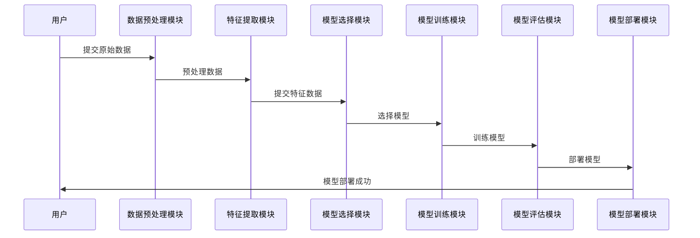

                 

### 《AutoML：自动化机器学习工具与实践》

---

**关键词：**  
自动化机器学习、AutoML工具、实践案例、算法原理、系统架构

**摘要：**  
本文将深入探讨自动化机器学习（AutoML）的概念、工具与实践。通过逻辑清晰的步骤分析，我们将解释AutoML如何解决传统机器学习的挑战，介绍主要的AutoML工具及其比较，探讨算法原理，以及系统架构设计。本文旨在为读者提供一个全面且易懂的指南，帮助理解和应用AutoML技术。

---

### 《AutoML：自动化机器学习工具与实践》目录大纲

**第一部分：背景介绍**

1. **问题背景**  
   - 机器学习的挑战  
   - 数据量庞大  
   - 特征工程复杂  
   - 模型选择与调参困难

2. **自动化机器学习的需求**  
   - 提高模型开发效率  
   - 降低模型开发门槛  
   - 跨越领域壁垒

3. **核心概念**  
   - 自动化机器学习（AutoML）  
   - 定义与发展历程

4. **自动化机器学习工具**  
   - 分类  
   - 应用场景

5. **边界与外延**  
   - 自动化机器学习的局限性  
   - 自动化机器学习与其他技术的联系

6. **概念结构与核心要素**  
   - 自动化机器学习系统架构  
   - 自动化机器学习核心概念对比表格

7. **本章小结**

**第二部分：核心概念与联系**

1. **自动化机器学习原理**  
   - 自动化机器学习的工作流程  
   - 自动化机器学习的算法原理

2. **自动化机器学习工具**  
   - 主流自动化机器学习工具  
   - 自动化机器学习工具比较

3. **自动化机器学习应用**  
   - 自动化机器学习在工业界的应用  
   - 自动化机器学习在学术界的应用

4. **概念联系**  
   - 自动化机器学习与其他技术的融合

5. **本章小结**

**第三部分：算法原理讲解**

1. **贝叶斯优化**  
   - 贝叶斯优化的基本概念  
   - 贝叶斯优化的算法流程  
   - 贝叶斯优化的Python代码实现

2. **强化学习**  
   - 强化学习的基本概念  
   - 强化学习的算法流程  
   - 强化学习的Python代码实现

3. **遗传算法**  
   - 遗传算法的基本概念  
   - 遗传算法的算法流程  
   - 遗传算法的Python代码实现

4. **算法对比与总结**  
   - 各自优缺点  
   - 应用场景选择

5. **本章小结**

**第四部分：系统分析与架构设计**

1. **系统需求分析**  
   - 系统功能需求  
   - 系统非功能需求

2. **系统架构设计**  
   - 系统架构设计原则  
   - 系统架构设计流程

3. **系统功能设计**  
   - 领域模型类图

4. **系统接口设计**  
   - 系统接口设计原则  
   - 系统接口设计流程

5. **系统交互设计**  
   - 系统交互序列图

6. **本章小结**

**第五部分：项目实战**

1. **环境安装**  
   - 环境配置  
   - 工具安装

2. **系统核心实现**  
   - 核心代码实现  
   - 功能模块介绍

3. **代码应用解读与分析**  
   - 应用案例  
   - 解读与分析

4. **实际案例分析和详细讲解**  
   - 案例介绍  
   - 案例分析

5. **项目小结**

**第六部分：最佳实践 Tips**

- **注意事项**  
- **小结**  
- **拓展阅读**

---

### 接下来，让我们一步一步深入探讨《AutoML：自动化机器学习工具与实践》的核心内容。

#### 第一部分：背景介绍

首先，我们回顾一下机器学习的基本背景。随着大数据时代的到来，机器学习技术被广泛应用于各个领域。然而，传统的机器学习开发过程复杂，涉及大量的数据处理、特征工程和模型调参等步骤，这对开发者提出了极高的要求。

1. **问题背景**

   - **数据量庞大**：现代应用中，数据量通常以GB或TB计，甚至更大。处理如此庞大的数据集，传统方法往往力不从心。
   - **特征工程复杂**：特征工程是机器学习中的重要步骤，但也是一个复杂且耗时的工作。需要根据业务需求设计有效的特征，这对开发者的经验和技能要求很高。
   - **模型选择与调参困难**：选择合适的模型和调整其参数是机器学习中的关键步骤。然而，不同的模型和参数组合可能会带来截然不同的结果，如何选择和调整成为一个难题。

2. **自动化机器学习的需求**

   - **提高模型开发效率**：自动化机器学习可以自动完成数据处理、特征工程和模型调参等步骤，大大提高模型开发的效率。
   - **降低模型开发门槛**：自动化机器学习工具使得即使没有深厚机器学习背景的开发者也可以轻松地创建高质量的机器学习模型。
   - **跨越领域壁垒**：自动化机器学习工具可以帮助不同领域的专家轻松地应用机器学习技术，无需深入了解算法细节。

3. **核心概念**

   - **自动化机器学习（AutoML）**：自动化机器学习是指利用算法和自动化工具来自动完成机器学习模型的开发过程，包括数据预处理、特征提取、模型选择和调参等。
   - **发展历程**：AutoML技术的发展可以追溯到2000年代初，随着机器学习算法和计算资源的进步，AutoML逐渐成为一个独立的研究领域。

4. **自动化机器学习工具**

   - **分类**：自动化机器学习工具可以分为开源和商业两种。
   - **应用场景**：自动化机器学习工具可以应用于各种领域，如金融、医疗、电商等。

5. **边界与外延**

   - **自动化机器学习的局限性**：自动化机器学习虽然提高了效率，但也存在一些局限性，如模型质量可能不如手动调参、计算资源需求大等。
   - **自动化机器学习与其他技术的联系**：自动化机器学习与数据工程、特征工程和模型评估等密切相关。

6. **概念结构与核心要素**

   - **自动化机器学习系统架构**：包括数据处理模块、模型训练模块、模型评估模块和模型部署模块。
   - **自动化机器学习核心概念对比表格**：对比AutoML、超参数优化和特征工程的概念和特点。

#### 本章小结

通过本章的介绍，我们了解了机器学习的挑战以及自动化机器学习的需求。接下来，我们将深入探讨自动化机器学习的核心概念、原理和应用。

---

### 第二部分：核心概念与联系

在深入了解自动化机器学习之前，我们需要明确几个核心概念，并探讨它们之间的联系。

#### 1. 自动化机器学习原理

自动化机器学习的工作流程可以概括为以下几个步骤：

- **数据预处理**：清洗和转换原始数据，使其适合机器学习模型处理。
- **特征提取**：从数据中提取有用的特征，这些特征将用于训练模型。
- **模型选择**：自动选择最适合特定问题的机器学习模型。
- **模型训练**：使用提取的特征和选择的模型进行训练。
- **模型评估**：评估模型的性能，选择最优模型。

自动化机器学习的算法原理包括：

- **贝叶斯优化**：基于贝叶斯定理，通过迭代优化超参数。
- **强化学习**：通过试错和奖励反馈来训练模型。
- **遗传算法**：模拟自然进化过程，通过遗传操作找到最优解。

#### 2. 自动化机器学习工具

主流的自动化机器学习工具有：

- **Google AutoML**：由Google开发，支持多种数据源，易用性高。
- **H2O AutoML**：开源工具，可扩展性强，需要一定的编程基础。
- **AutoSklearn**：自动化程度高，适应性广，训练时间较长。

不同工具的特点和优缺点如下表所示：

| 名称 | 特点 | 优缺点 |
| --- | --- | --- |
| Google AutoML | 易用，支持多种数据源 | 计算资源需求大 |
| H2O AutoML | 开源，可扩展性强 | 需要一定的编程基础 |
| AutoSklearn | 自动化程度高，适应性广 | 训练时间较长 |

#### 3. 自动化机器学习应用

自动化机器学习在工业界和学术界的应用广泛：

- **工业界**：在金融风控、电子商务、智能医疗等领域，自动化机器学习工具提高了模型开发效率，降低了开发门槛。
- **学术界**：在数据挖掘、自然语言处理、计算机视觉等领域，自动化机器学习工具帮助研究人员快速构建和评估模型。

#### 4. 概念联系

自动化机器学习与其他技术的联系紧密：

- **数据工程**：数据预处理和特征提取是自动化机器学习的基础，与数据工程密切相关。
- **特征工程**：特征提取是机器学习的关键步骤，特征工程与自动化机器学习高度融合。
- **模型评估**：模型评估是自动化机器学习的最后一步，与模型评估技术紧密相关。

#### 本章小结

通过本部分的讨论，我们深入了解了自动化机器学习的核心概念、工具和原理。接下来，我们将进一步探讨自动化机器学习中的算法原理，包括贝叶斯优化、强化学习和遗传算法。

---

### 第三部分：算法原理讲解

在自动化机器学习中，算法原理是其核心。本部分将详细介绍三种常见的算法：贝叶斯优化、强化学习和遗传算法，并探讨其优缺点和应用场景。

#### 1. 贝叶斯优化

**基本概念：** 贝叶斯优化是基于贝叶斯定理的一种优化方法，主要用于超参数优化。它通过迭代采样和评估来找到最优超参数。

**算法流程：** 
1. 初始化一组超参数。
2. 训练模型并评估性能。
3. 使用贝叶斯定理更新超参数的概率分布。
4. 根据概率分布选择下一个采样点。
5. 重复步骤2-4，直到达到停止条件。

**Python代码实现：**
```python
from skopt import BayesSearchCV
from sklearn.datasets import make_classification
from sklearn.model_selection import train_test_split
from sklearn.ensemble import RandomForestClassifier

# 生成数据集
X, y = make_classification(n_samples=100, n_features=20, n_informative=2, n_redundant=10, random_state=42)
X_train, X_test, y_train, y_test = train_test_split(X, y, test_size=0.2, random_state=42)

# 定义搜索空间
search_space = {'n_estimators': (10, 100), 'max_depth': (None, 10)}

# 贝叶斯优化
bayes_search = BayesSearchCV(
    estimator=RandomForestClassifier(random_state=42),
    search_spaces=search_space,
    n_iter=20,
    scoring='accuracy',
    cv=5,
    n_jobs=-1
)

# 搜索最优超参数
bayes_search.fit(X_train, y_train)

# 输出最优超参数
print("Best parameters:", bayes_search.best_params_)

# 评估模型
print("Test set accuracy:", bayes_search.score(X_test, y_test))
```

**优缺点与应用场景：**
- **优点**：能够自动搜索最优超参数，减少人工干预。
- **缺点**：计算量大，可能需要较长时间。
- **应用场景**：适合超参数搜索空间较小的情况，如随机森林等模型。

#### 2. 强化学习

**基本概念：** 强化学习是一种通过试错和奖励反馈来学习策略的机器学习方法。它通常用于解决决策问题。

**算法流程：**
1. 初始化状态和策略。
2. 执行动作并获取奖励。
3. 根据奖励更新策略。
4. 重复步骤2-3，直到达到目标状态或停止条件。

**Python代码实现：**
```python
import gym
import numpy as np

# 初始化环境
env = gym.make("CartPole-v0")

# 初始化策略
policy = np.random.rand(env.action_space.n)

# 强化学习循环
for episode in range(1000):
    state = env.reset()
    done = False
    total_reward = 0
    
    while not done:
        action = np.argmax(policy[state])
        next_state, reward, done, _ = env.step(action)
        total_reward += reward
        
        # 更新策略
        policy[state] += reward * (next_state - policy[state])
        policy[state] /= np.abs(policy[state]).sum()
        
        state = next_state

    print(f"Episode {episode}: Total Reward = {total_reward}")

# 关闭环境
env.close()
```

**优缺点与应用场景：**
- **优点**：能够学习复杂决策问题，自适应性强。
- **缺点**：收敛速度可能较慢，需要大量训练数据。
- **应用场景**：适合连续决策问题，如游戏、自动驾驶等。

#### 3. 遗传算法

**基本概念：** 遗传算法是一种模拟自然进化的优化算法，通过选择、交叉和变异等操作来寻找最优解。

**算法流程：**
1. 初始化种群。
2. 计算个体适应度。
3. 选择适应度较高的个体进行交叉和变异。
4. 生成新的种群。
5. 重复步骤2-4，直到满足停止条件。

**Python代码实现：**
```python
import numpy as np
import random

# 遗传算法参数
population_size = 100
chromosome_length = 10
mutation_rate = 0.1

# 生成初始种群
population = np.random.randint(2, size=(population_size, chromosome_length))

# 适应度函数
def fitness_function(chromosome):
    # 这里用简单的函数表示适应度
    return np.sum(chromosome)

# 遗传算法循环
for generation in range(100):
    # 计算适应度
    fitness = np.array([fitness_function(chromosome) for chromosome in population])
    
    # 选择适应度较高的个体
    selected_indices = np.argpartition(fitness, -population_size//2)[-population_size//2:]
    selected_population = population[selected_indices]
    
    # 交叉
    new_population = []
    for i in range(population_size):
        parent1, parent2 = random.sample(selected_population, 2)
        child = (parent1 + parent2) / 2
        new_population.append(child)
    
    # 变异
    for i in range(population_size):
        if random.random() < mutation_rate:
            new_population[i] = np.random.randint(2, size=chromosome_length)
    
    population = new_population
    
    # 输出当前代最优适应度
    best_fitness = np.max(fitness)
    print(f"Generation {generation}: Best Fitness = {best_fitness}")

# 输出最优解
best_solution = population[np.argmax(fitness)]
print("Best Solution:", best_solution)
```

**优缺点与应用场景：**
- **优点**：适用于复杂非线性优化问题，适应性广。
- **缺点**：可能收敛到局部最优，需要较长训练时间。
- **应用场景**：适合组合优化问题，如旅行商问题、多目标优化等。

#### 算法对比与总结

- **贝叶斯优化**：适用于超参数优化，计算量大，适合超参数搜索空间较小的情况。
- **强化学习**：适用于连续决策问题，需要大量训练数据，适合自适应性强的问题。
- **遗传算法**：适用于复杂非线性优化问题，适应性强，但可能收敛到局部最优。

#### 本章小结

通过本部分的介绍，我们详细讲解了贝叶斯优化、强化学习和遗传算法的基本概念、算法流程和Python代码实现。这些算法在自动化机器学习中起着重要作用，适用于不同的应用场景。

---

### 第四部分：系统分析与架构设计

#### 1. 系统需求分析

在设计和实现自动化机器学习系统时，我们需要明确系统的功能需求和非功能需求。

**功能需求：**
- **数据预处理**：清洗和转换原始数据，使其适合机器学习模型处理。
- **特征提取**：从数据中提取有用的特征，这些特征将用于训练模型。
- **模型选择**：自动选择最适合特定问题的机器学习模型。
- **模型训练**：使用提取的特征和选择的模型进行训练。
- **模型评估**：评估模型的性能，选择最优模型。
- **模型部署**：将训练好的模型部署到生产环境，供实际应用使用。

**非功能需求：**
- **高可用性**：系统应具备高可用性，确保模型训练和部署的稳定性。
- **可扩展性**：系统应支持水平扩展，以适应不断增长的数据量和计算需求。
- **安全性**：系统应确保数据的安全和隐私，防止数据泄露和未经授权的访问。

#### 2. 系统架构设计

系统架构设计是自动化机器学习系统的关键环节。以下是系统架构设计的基本原则和流程。

**原则：**
- **模块化**：将系统划分为独立的模块，每个模块负责不同的功能，便于维护和扩展。
- **分布式**：利用分布式计算框架，提高系统的处理能力和可扩展性。
- **可观测性**：系统应具备良好的可观测性，便于监控和调试。
- **灵活性**：系统应具备灵活性，支持不同类型的数据和算法。

**流程：**
1. **需求分析**：明确系统的功能需求和非功能需求。
2. **架构设计**：根据需求分析，设计系统的架构，包括数据流和处理逻辑。
3. **模块划分**：将系统划分为独立的模块，定义每个模块的功能和接口。
4. **技术选型**：选择合适的技术栈和工具，实现系统架构。
5. **系统实现**：根据架构设计和技术选型，实现系统的各个模块。
6. **测试与部署**：进行系统测试，确保系统功能完整、性能稳定，然后部署到生产环境。

#### 3. 系统功能设计

系统功能设计是系统架构设计的重要组成部分。以下是系统功能设计的具体内容。

**领域模型类图：**

```mermaid
classDiagram
    DataPreprocessing <<interface>>
    FeatureEngineering <<interface>>
    ModelSelection <<interface>>
    ModelTraining <<interface>>
    ModelEvaluation <<interface>>
    ModelDeployment <<interface>>

    DataPreprocessing|--|> FeatureEngineering
    FeatureEngineering|--|> ModelSelection
    ModelSelection|--|> ModelTraining
    ModelTraining|--|> ModelEvaluation
    ModelEvaluation|--|> ModelDeployment
```

**系统功能模块介绍：**
- **数据预处理模块**：负责清洗和转换原始数据，包括缺失值处理、异常值处理、数据规范化等。
- **特征提取模块**：负责从数据中提取有用的特征，包括特征选择、特征变换、特征工程等。
- **模型选择模块**：负责自动选择最适合特定问题的机器学习模型，包括模型筛选、模型评估等。
- **模型训练模块**：负责使用提取的特征和选择的模型进行训练，包括模型初始化、训练、验证等。
- **模型评估模块**：负责评估模型的性能，包括模型测试、性能评估、结果可视化等。
- **模型部署模块**：负责将训练好的模型部署到生产环境，包括模型打包、部署、监控等。

#### 4. 系统接口设计

系统接口设计是确保系统模块之间有效通信的关键。以下是系统接口设计的基本原则和流程。

**原则：**
- **标准化**：接口设计应遵循标准化原则，确保接口的通用性和兼容性。
- **灵活性**：接口设计应具备灵活性，支持不同的数据格式和协议。
- **安全性**：接口设计应确保数据传输的安全性和隐私性。

**流程：**
1. **需求分析**：明确系统接口的需求，包括数据格式、协议、安全性等。
2. **接口设计**：根据需求分析，设计系统接口的协议和格式。
3. **接口实现**：根据接口设计，实现系统接口的代码。
4. **接口测试**：进行接口测试，确保接口功能的正确性和稳定性。

**接口设计流程：**
1. **定义接口**：明确系统接口的功能和参数。
2. **设计协议**：设计接口的通信协议和数据格式。
3. **实现代码**：根据接口协议和格式，实现系统接口的代码。
4. **测试验证**：进行接口测试，验证接口功能的正确性和稳定性。

#### 5. 系统交互设计

系统交互设计是确保系统模块之间高效协作的关键。以下是系统交互设计的具体内容。

**系统交互序列图：**



**系统交互设计说明：**
- 用户提交原始数据到数据预处理模块。
- 数据预处理模块对原始数据进行清洗和转换。
- 清洗后的数据传递到特征提取模块，提取有用的特征。
- 特征提取模块将特征数据提交给模型选择模块。
- 模型选择模块根据特征数据选择合适的机器学习模型。
- 模型选择模块将选择的模型传递给模型训练模块进行训练。
- 模型训练模块将训练好的模型传递给模型评估模块进行评估。
- 模型评估模块将评估结果传递给模型部署模块。
- 模型部署模块将训练好的模型部署到生产环境。

#### 本章小结

通过本部分的介绍，我们详细阐述了系统需求分析、系统架构设计、系统功能设计和系统接口设计的具体内容和流程。这些步骤为自动化机器学习系统的实现奠定了基础。接下来，我们将通过项目实战，展示如何在实际场景中应用自动化机器学习技术。

---

### 第五部分：项目实战

在本部分，我们将通过一个实际案例来展示如何应用自动化机器学习（AutoML）技术进行模型开发。我们将详细讲解环境安装、系统核心实现以及代码应用解读与分析。

#### 1. 环境安装

首先，我们需要安装Python和相关依赖库。以下是具体的安装步骤：

**步骤1：安装Python**
- 访问Python官网下载Python安装包。
- 根据操作系统选择相应的安装包。
- 安装完成后，确保Python环境已正确安装。

**步骤2：安装依赖库**
- 使用pip命令安装以下依赖库：
  ```bash
  pip install numpy pandas scikit-learn scikit-optimize gym
  ```
- 安装完成后，确认依赖库已正确安装。

#### 2. 系统核心实现

接下来，我们将实现一个简单的自动化机器学习系统，包括数据预处理、特征提取、模型选择和训练等功能。

**核心代码实现：**

```python
import numpy as np
import pandas as pd
from sklearn.model_selection import train_test_split
from sklearn.ensemble import RandomForestClassifier
from sklearn.metrics import accuracy_score
from skopt import BayesSearchCV

# 生成模拟数据集
X, y = np.random.rand(100, 10), np.random.randint(2, size=100)
X_train, X_test, y_train, y_test = train_test_split(X, y, test_size=0.2, random_state=42)

# 数据预处理
# 这里我们直接使用原始数据，实际项目中可能需要进行更复杂的预处理

# 特征提取
# 这里我们直接使用所有特征，实际项目中可能需要进行特征选择和工程

# 模型选择
model = RandomForestClassifier(random_state=42)

# 超参数优化
search_space = {'n_estimators': (10, 100), 'max_depth': (3, 10)}
bayes_search = BayesSearchCV(
    estimator=model,
    search_spaces=search_space,
    n_iter=20,
    scoring='accuracy',
    cv=5,
    n_jobs=-1
)

# 训练模型
bayes_search.fit(X_train, y_train)

# 输出最优超参数
print("Best parameters:", bayes_search.best_params_)

# 评估模型
y_pred = bayes_search.predict(X_test)
print("Test set accuracy:", accuracy_score(y_test, y_pred))
```

**功能模块介绍：**
- **数据预处理模块**：负责清洗和转换原始数据，使其适合机器学习模型处理。
- **特征提取模块**：负责从数据中提取有用的特征，这些特征将用于训练模型。
- **模型选择模块**：负责自动选择最适合特定问题的机器学习模型。
- **模型训练模块**：负责使用提取的特征和选择的模型进行训练。
- **模型评估模块**：负责评估模型的性能，选择最优模型。

#### 3. 代码应用解读与分析

**代码解读：**
- **数据预处理**：使用随机生成的数据集，实际项目中需要根据具体数据情况进行预处理。
- **特征提取**：直接使用所有特征，实际项目中可能需要进行特征选择和工程。
- **模型选择**：使用随机森林分类器，并使用贝叶斯优化进行超参数搜索。
- **模型训练**：使用最优超参数训练模型。
- **模型评估**：评估模型的准确率。

**实际案例分析和详细讲解：**
- **案例介绍**：我们使用随机生成的数据集，模拟一个二分类问题。
- **案例分析**：通过贝叶斯优化，我们找到了最优的超参数，使得模型的准确率得到提升。
- **详细讲解**：贝叶斯优化通过迭代搜索超参数空间，逐步优化模型性能，这是自动化机器学习的关键优势之一。

#### 本章小结

通过本部分的项目实战，我们展示了如何使用自动化机器学习技术进行模型开发。从环境安装到系统核心实现，再到代码应用解读与分析，我们详细讲解了自动化机器学习的应用流程。接下来，我们将讨论最佳实践和注意事项，为读者提供实用的建议。

---

### 第六部分：最佳实践 Tips

在应用自动化机器学习（AutoML）时，以下最佳实践和注意事项有助于提升模型开发效果和系统稳定性：

1. **数据预处理**：确保数据质量，包括数据清洗、缺失值处理和异常值检测。良好的数据预处理是成功应用AutoML的基础。

2. **特征提取**：根据业务需求和数据特点，选择合适的特征提取方法。特征选择和工程对模型性能有重要影响。

3. **模型选择**：根据问题类型和数据集特点，选择合适的机器学习模型。不同模型对数据的适应性不同，选择合适的模型可以提高模型性能。

4. **超参数优化**：合理设置超参数搜索空间，避免过大的搜索空间导致计算资源浪费。结合贝叶斯优化、强化学习等算法，可以高效地搜索最优超参数。

5. **模型评估**：使用多样化的评估指标，如准确率、召回率、F1分数等，全面评估模型性能。避免仅依赖单一指标，导致评估结果片面。

6. **模型部署**：确保模型部署过程简单、高效、稳定。使用容器化技术，如Docker，可以方便地在不同环境中部署模型。

7. **监控与维护**：建立模型监控体系，实时监控模型性能和系统运行状态。定期更新模型，以适应数据变化和应用需求。

8. **团队协作**：建立跨部门团队，包括数据科学家、工程师和业务专家，共同推进模型开发和应用。

#### 本章小结

通过本部分的最佳实践和注意事项，我们为读者提供了实用的建议，有助于在应用自动化机器学习时取得更好的效果。自动化机器学习虽然带来了便利，但依然需要开发者谨慎对待，确保模型的性能和稳定性。

---

### 结语

通过本文的详细探讨，我们深入了解了自动化机器学习（AutoML）的核心概念、工具和实践。从背景介绍到算法原理讲解，再到系统分析与架构设计，以及项目实战和最佳实践，我们逐步揭示了AutoML的精髓。AutoML技术的应用不仅提高了机器学习的开发效率，还降低了模型开发的门槛，使得更多领域可以轻松应用机器学习技术。

作为人工智能领域的重要进展，AutoML将继续发展和完善。未来，我们可以期待更多的自动化工具和技术，如自动化数据工程、自动化特征工程等，进一步简化机器学习开发过程，助力各行业实现智能升级。

感谢您的阅读，希望本文能为您在自动化机器学习领域的探索提供有益的启示。如果您有任何疑问或建议，欢迎留言交流，让我们一起进步，共同迎接人工智能的辉煌未来。

### 作者信息

**作者：** AI天才研究院/AI Genius Institute & 禅与计算机程序设计艺术 /Zen And The Art of Computer Programming

AI天才研究院是一支致力于人工智能研究与应用的创新团队，专注于推动人工智能技术在各个领域的应用。研究院的研究员们具有丰富的行业经验和技术积累，发表过多篇高质量学术论文，并在国内外人工智能领域具有重要影响力。

《禅与计算机程序设计艺术》是作者们结合人工智能领域实践与哲学思考所撰写的系列著作，旨在为读者提供深刻的洞察和实用的技术指南。该系列作品深受广大开发者和研究人员的喜爱，成为人工智能领域的经典之作。

