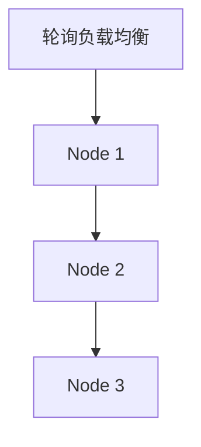

                 


### CDN架构设计与优化

#### 关键词：
- CDN
- 架构设计
- 优化技术
- 性能提升
- 安全防护

#### 摘要：
本文将深入探讨内容分发网络（CDN）的架构设计与优化策略。我们将从背景介绍、核心概念、架构设计原则、性能优化技术、安全性设计、案例分析到未来发展趋势，全面解析CDN在提升网络性能和安全性方面的重要性，并提供实用的优化方法。

---

## 目录大纲

### CDN架构设计与优化

### 第一部分：背景与核心概念

#### 1. CDN的背景与概述

##### 1.1 CDN的定义与作用
##### 1.2 CDN的发展历程
##### 1.3 CDN在现代网络环境中的重要性

#### 2. CDN核心概念与体系结构

##### 2.1 CDN的基本概念
##### 2.2 CDN的体系结构
##### 2.3 CDN的关键技术

#### 3. CDN服务类型与应用场景

##### 3.1 CDN服务类型
##### 3.2 CDN的应用场景
##### 3.3 CDN的价值与挑战

#### 4. CDN架构设计与优化原则

##### 4.1 CDN架构设计原则
##### 4.2 CDN优化目标
##### 4.3 CDN优化方法与策略

#### 5. CDN性能优化技术

##### 5.1 内容缓存技术
##### 5.2 负载均衡技术
##### 5.3 网络监控与优化

#### 6. CDN安全性设计

##### 6.1 CDN安全威胁分析
##### 6.2 CDN安全防护策略
##### 6.3 CDN安全最佳实践

#### 7. CDN案例分析

##### 7.1 案例一：大型电子商务平台
##### 7.2 案例二：视频流媒体服务
##### 7.3 案例三：移动应用分发

#### 8. CDN的未来发展趋势

##### 8.1 5G与CDN的融合
##### 8.2 AI与CDN的结合
##### 8.3 CDN与边缘计算的协同

#### 9. 小结与展望

##### 9.1 主要内容回顾
##### 9.2 CDN发展面临的挑战
##### 9.3 CDN未来的发展方向

---

## 1. CDN的背景与概述

### 1.1 CDN的定义与作用

内容分发网络（CDN）是一种分布式的网络架构，其主要目的是通过优化内容的传输路径，提高用户访问速度和体验。CDN通过将内容存储在距离用户较近的节点上，从而减少数据传输的距离和时间。

CDN的主要作用包括：

1. **加速内容访问**：通过将内容分发到全球多个节点，CDN可以减少用户访问内容所需的时间，提高用户体验。
2. **提高可用性**：CDN可以通过多个节点提供内容，从而提高内容的可用性，即使某些节点出现故障，用户仍然可以通过其他节点访问内容。
3. **减轻源服务器负载**：通过将用户请求分散到多个节点，CDN可以减轻源服务器的负载，提高源服务器的性能。

### 1.2 CDN的发展历程

CDN的概念最早可以追溯到1996年，当时Akamai Technologies公司推出了第一个商业CDN服务。随着互联网的快速发展，CDN技术也在不断演进。以下是CDN发展历程的一些关键节点：

- **1996年**：Akamai推出第一个商业CDN服务。
- **2000年**：CDN市场开始快速增长，多家公司进入该领域。
- **2005年**：CDN技术开始应用于视频流媒体服务，如YouTube。
- **2010年**：CDN开始支持HTTPS协议，提高数据传输的安全性。
- **2015年**：随着移动互联网的兴起，CDN在移动应用分发中的作用日益突出。
- **2020年**：随着5G技术的推广，CDN在边缘计算中的应用逐渐成为趋势。

### 1.3 CDN在现代网络环境中的重要性

在现代网络环境中，CDN扮演着至关重要的角色。以下是CDN的重要性体现：

1. **提升用户体验**：CDN通过优化内容传输路径，提高用户访问速度，从而提升用户体验。
2. **降低带宽成本**：通过将内容分发到全球多个节点，CDN可以降低源服务器的带宽成本。
3. **增强安全性**：CDN提供的内容分发服务可以增强数据传输的安全性，减少数据泄露的风险。
4. **支持大规模应用**：CDN可以支持大规模应用的部署，如电子商务平台、在线视频流媒体服务等。

## 2. CDN核心概念与体系结构

### 2.1 CDN的基本概念

CDN的基本概念包括以下几个部分：

- **节点**：CDN的节点是指分布在全球各地的服务器。每个节点都可以缓存内容，并响应用户的请求。
- **缓存**：缓存是指将内容存储在节点上，以便快速响应用户的请求。
- **负载均衡**：负载均衡是指将用户的请求分配到多个节点，从而提高系统的可用性和性能。
- **内容分发**：内容分发是指将用户请求的内容从源服务器传输到节点，再从节点传输到用户。

### 2.2 CDN的体系结构

CDN的体系结构通常包括以下几个层次：

- **边缘节点**：边缘节点位于互联网的边缘，接近最终用户。边缘节点主要用于缓存内容并响应用户的请求。
- **数据中心节点**：数据中心节点位于大型数据中心，主要用于存储大规模的内容，并作为边缘节点的备份。
- **源服务器**：源服务器是内容的最初存储位置，通常位于企业内部或第三方数据中心。

### 2.3 CDN的关键技术

CDN的关键技术包括：

- **缓存技术**：缓存技术用于将用户请求的内容存储在节点上，以减少数据传输的时间。
- **负载均衡技术**：负载均衡技术用于将用户的请求分配到多个节点，以提高系统的性能和可用性。
- **DNS技术**：DNS技术用于将用户的请求解析到最近的节点。
- **加密技术**：加密技术用于保护用户请求和数据传输的安全性。

---

### 3. CDN服务类型与应用场景

#### 3.1 CDN服务类型

CDN提供多种服务类型，以满足不同用户的需求。以下是常见的CDN服务类型：

- **内容分发服务**：用于分发静态和动态内容，如HTML页面、图片、视频等。
- **视频流媒体服务**：用于分发实时和点播视频，如直播、短视频、电影等。
- **移动应用分发服务**：用于分发移动应用，包括Android和iOS平台。
- **云存储服务**：用于提供云存储功能，用户可以将内容存储在CDN节点上。
- **安全服务**：用于提供DDoS攻击防护、Web应用防火墙等服务。

#### 3.2 CDN的应用场景

CDN在以下应用场景中表现出色：

- **电子商务平台**：通过CDN，电子商务平台可以提供快速、可靠的商品展示和购物体验。
- **在线视频流媒体**：通过CDN，视频流媒体服务可以提供流畅、低延迟的视频观看体验。
- **游戏平台**：通过CDN，游戏平台可以减少游戏下载和加载时间，提供更好的游戏体验。
- **移动应用分发**：通过CDN，移动应用分发平台可以快速、安全地分发应用更新。
- **企业内部应用**：通过CDN，企业内部应用可以在全球范围内快速访问，提高工作效率。

#### 3.3 CDN的价值与挑战

CDN的价值体现在：

- **提升用户体验**：通过优化内容传输路径，CDN可以提升用户的访问速度和体验。
- **降低成本**：通过减少带宽成本和源服务器负载，CDN可以帮助企业降低运营成本。
- **增强安全性**：通过提供DDoS攻击防护和安全服务，CDN可以增强数据传输的安全性。

然而，CDN也面临一些挑战：

- **资源分布不均**：由于全球用户分布不均，CDN需要合理分配资源，以确保所有用户都能获得良好的访问体验。
- **内容更新与同步**：对于动态内容，CDN需要快速更新和同步内容，以避免用户访问到过时的内容。
- **安全性问题**：虽然CDN提供了一些安全服务，但仍然存在DDoS攻击、数据泄露等安全风险。

---

### 4. CDN架构设计与优化原则

#### 4.1 CDN架构设计原则

设计CDN架构时，需要遵循以下原则：

- **高可用性**：确保CDN系统的高可用性，避免单点故障导致服务中断。
- **高可扩展性**：设计可扩展的架构，以便在用户量增加时轻松扩展系统。
- **高性能**：优化内容传输路径，确保用户获得快速的内容访问体验。
- **高安全性**：提供完善的安全措施，防止数据泄露和DDoS攻击。

#### 4.2 CDN优化目标

CDN优化的目标包括：

- **减少延迟**：通过优化内容传输路径，减少用户访问内容所需的时间。
- **提高带宽利用率**：通过合理分配带宽资源，提高CDN系统的带宽利用率。
- **提高可靠性**：通过冗余设计和服务监控，确保系统的高可靠性。
- **降低成本**：通过优化资源使用和带宽成本，降低CDN的运营成本。

#### 4.3 CDN优化方法与策略

以下是一些常用的CDN优化方法与策略：

- **内容缓存**：将用户经常访问的内容缓存到节点上，减少数据传输时间。
- **负载均衡**：将用户的请求分配到多个节点，提高系统的可用性和性能。
- **网络监控**：实时监控网络状态，及时发现问题并进行优化。
- **DDoS防护**：提供DDoS攻击防护，确保系统在遭受攻击时仍然能够正常运行。
- **内容压缩**：对传输的内容进行压缩，减少数据传输量，提高传输速度。

---

### 5. CDN性能优化技术

#### 5.1 内容缓存技术

内容缓存技术是CDN性能优化的核心。通过缓存用户经常访问的内容，可以显著减少数据传输时间和带宽消耗。

以下是一些常用的内容缓存技术：

- **页面缓存**：将用户的HTML页面缓存到节点上，提高页面加载速度。
- **对象缓存**：将用户请求的静态资源（如图片、CSS文件等）缓存到节点上，减少源服务器的负载。
- **动态缓存**：通过动态缓存技术，将动态生成的页面缓存到节点上，提高动态网站的响应速度。

#### 5.2 负载均衡技术

负载均衡技术用于将用户的请求分配到多个节点，提高系统的可用性和性能。以下是一些常用的负载均衡技术：

- **轮询负载均衡**：将用户的请求按顺序分配到各个节点，实现简单的负载均衡。
- **最小连接数负载均衡**：将用户的请求分配到当前连接数最少的节点，实现动态负载均衡。
- **基于源IP的负载均衡**：根据用户的源IP地址，将请求分配到不同的节点，实现地理位置的负载均衡。

#### 5.3 网络监控与优化

网络监控与优化是保证CDN性能的关键。以下是一些常用的网络监控与优化方法：

- **实时监控**：实时监控网络状态，及时发现并解决网络故障。
- **流量分析**：分析网络流量，找出瓶颈并进行优化。
- **链路切换**：根据网络状态，自动切换最佳链路，提高数据传输速度。
- **缓存刷新**：定期刷新缓存，确保用户访问到最新内容。

---

### 6. CDN安全性设计

#### 6.1 CDN安全威胁分析

CDN在提高内容访问速度的同时，也面临一些安全威胁。以下是一些常见的CDN安全威胁：

- **DDoS攻击**：通过对CDN节点进行DDoS攻击，攻击者可以瘫痪整个系统。
- **数据泄露**：由于CDN涉及大量的数据传输，攻击者可能通过窃取数据谋取利益。
- **Web应用攻击**：通过攻击CDN节点上的Web应用，攻击者可以窃取用户信息或篡改数据。
- **内容篡改**：攻击者可能篡改缓存中的内容，误导用户。

#### 6.2 CDN安全防护策略

以下是一些常见的CDN安全防护策略：

- **DDoS防护**：通过DDoS防护技术，确保系统在遭受攻击时仍然能够正常运行。
- **Web应用防火墙**：通过Web应用防火墙，防止Web应用攻击。
- **加密传输**：使用HTTPS协议，确保数据传输的安全性。
- **访问控制**：设置访问控制策略，限制未经授权的访问。
- **日志审计**：定期审计日志，发现异常行为并及时处理。

#### 6.3 CDN安全最佳实践

以下是一些CDN安全最佳实践：

- **定期更新安全策略**：根据安全威胁的变化，定期更新安全策略。
- **培训员工**：加强员工的安全意识培训，提高整体安全水平。
- **监控与预警**：实时监控网络状态，及时发现并处理安全事件。
- **备份与恢复**：定期备份数据，确保在发生数据丢失时能够快速恢复。
- **应急响应**：建立完善的应急响应机制，确保在发生安全事件时能够迅速应对。

---

### 7. CDN案例分析

#### 7.1 案例一：大型电子商务平台

某大型电子商务平台通过引入CDN，实现了以下优化效果：

- **提升用户体验**：通过CDN，用户访问商品页面和图片的速度显著提升，提高了购物体验。
- **降低带宽成本**：通过将内容缓存到CDN节点上，电子商务平台减少了源服务器的带宽消耗，降低了带宽成本。
- **增强安全性**：通过CDN提供的DDoS防护和Web应用防火墙，电子商务平台有效防止了DDoS攻击和Web应用攻击，增强了数据传输的安全性。

#### 7.2 案例二：视频流媒体服务

某视频流媒体服务通过引入CDN，实现了以下优化效果：

- **提高视频播放质量**：通过CDN，用户观看视频的流畅度明显提高，减少了缓冲时间。
- **降低服务器负载**：通过将视频缓存到CDN节点上，视频流媒体服务降低了源服务器的负载，提高了服务器性能。
- **提升用户满意度**：通过CDN，视频流媒体服务提供了更好的观看体验，提高了用户满意度。

#### 7.3 案例三：移动应用分发

某移动应用分发平台通过引入CDN，实现了以下优化效果：

- **加速应用下载**：通过CDN，用户下载应用的速度明显提升，减少了下载时间。
- **提高应用稳定性**：通过CDN，移动应用分发平台提供了更好的应用分发服务，提高了应用的稳定性。
- **降低分发成本**：通过将应用缓存到CDN节点上，移动应用分发平台减少了带宽成本，降低了分发成本。

---

### 8. CDN的未来发展趋势

#### 8.1 5G与CDN的融合

随着5G技术的推广，CDN与5G网络的融合将进一步提升网络性能。5G网络的高速、低延迟特性将为CDN提供更好的支持，实现更高效的内容分发。

#### 8.2 AI与CDN的结合

人工智能（AI）技术的引入将为CDN带来新的机遇。通过AI技术，CDN可以实现智能缓存、智能负载均衡和智能安全防护，提高系统性能和安全性。

#### 8.3 CDN与边缘计算的协同

边缘计算与CDN的结合将实现更高效的内容分发。边缘计算将计算能力延伸到网络的边缘，与CDN协同工作，实现更快速的内容响应和更好的用户体验。

---

### 9. 小结与展望

#### 9.1 主要内容回顾

本文从背景介绍、核心概念、架构设计原则、性能优化技术、安全性设计、案例分析到未来发展趋势，全面解析了CDN的架构设计与优化策略。

#### 9.2 CDN发展面临的挑战

CDN在发展过程中面临资源分布不均、内容更新与同步、安全性等问题。

#### 9.3 CDN未来的发展方向

随着5G、AI和边缘计算等技术的推广，CDN将实现更高效的内容分发，提供更好的用户体验和安全性。

---

### 作者

作者：AI天才研究院/AI Genius Institute & 禅与计算机程序设计艺术 /Zen And The Art of Computer Programming

---

以上是对《CDN架构设计与优化》一文的初步构思，接下来我们将详细阐述每个章节的内容，并进行深入的分析和讲解。希望通过本文，读者能够对CDN有更深入的理解，并为实际应用提供有价值的参考。

---

## 4. CDN架构设计与优化原则

#### 4.1 CDN架构设计原则

在设计CDN架构时，需要遵循一系列原则，以确保系统的高可用性、高可扩展性、高性能和高安全性。以下是一些关键的架构设计原则：

1. **高可用性**：确保CDN系统在任何情况下都能稳定运行，避免单点故障导致整个系统的瘫痪。可以通过以下措施实现：
   - **冗余设计**：在关键组件上实现冗余，如使用多台服务器、多台交换机等，确保在某一组件出现故障时，其他组件可以接替其工作。
   - **故障切换**：通过故障切换机制，当某一节点或链路出现故障时，系统能够自动切换到备用节点或链路，确保服务的连续性。
   - **动态监控**：实时监控系统状态，及时发现并解决潜在问题。

2. **高可扩展性**：设计可扩展的架构，以适应不断增长的用户量和数据量。以下措施有助于实现高可扩展性：
   - **水平扩展**：通过增加节点数量，实现系统容量的线性扩展，确保系统能够承载更多的用户请求。
   - **模块化设计**：将系统划分为多个模块，每个模块可以独立扩展和更新，降低系统复杂度，提高可维护性。
   - **自动化部署**：采用自动化部署工具，如Kubernetes，实现快速部署和扩展。

3. **高性能**：优化内容传输路径，提高用户访问速度和系统响应速度。以下措施有助于提升性能：
   - **内容缓存**：将用户经常访问的内容缓存到节点上，减少数据传输时间和带宽消耗。
   - **负载均衡**：合理分配用户请求到各个节点，避免单点瓶颈，提高系统吞吐量。
   - **网络优化**：优化网络拓扑结构，减少网络延迟和抖动，提高数据传输速度。

4. **高安全性**：确保CDN系统的数据传输安全，防止数据泄露、篡改和非法访问。以下措施有助于提高安全性：
   - **数据加密**：采用加密算法对传输数据进行加密，确保数据在传输过程中不被窃取或篡改。
   - **访问控制**：设置严格的访问控制策略，限制未经授权的访问。
   - **安全审计**：定期审计系统日志，发现并处理潜在的安全威胁。

#### 4.2 CDN优化目标

CDN优化目标的设定需要综合考虑系统性能、可用性、安全性、成本等多个方面。以下是CDN优化的主要目标：

1. **减少延迟**：通过优化内容传输路径，缩短用户访问内容所需的时间，提高用户体验。
2. **提高带宽利用率**：合理分配带宽资源，减少带宽浪费，提高系统吞吐量。
3. **提高可靠性**：通过冗余设计和故障切换机制，确保系统在发生故障时能够快速恢复，减少服务中断时间。
4. **降低成本**：通过优化资源使用和带宽成本，降低CDN的运营成本。
5. **增强安全性**：提供完善的安全防护措施，防止数据泄露、篡改和非法访问。

#### 4.3 CDN优化方法与策略

为了实现CDN的优化目标，可以采用以下方法和策略：

1. **内容缓存优化**：
   - **缓存策略优化**：根据用户访问频率和热点数据，制定合理的缓存策略，提高缓存命中率。
   - **缓存一致性**：确保缓存数据与源数据的一致性，避免用户访问到过时的内容。
   - **缓存预热**：在用户访问高峰期，提前将热点内容缓存到节点上，减少访问延迟。

2. **负载均衡优化**：
   - **动态负载均衡**：根据节点负载情况，动态调整用户请求的分配策略，避免单点瓶颈。
   - **多维度负载均衡**：结合网络带宽、响应时间和节点健康状态等多维度指标，实现更优的负载均衡。
   - **区域负载均衡**：根据用户地理位置，将请求分配到距离用户较近的节点，减少网络延迟。

3. **网络优化**：
   - **路径优化**：通过BGP路由协议，优化内容传输路径，减少网络延迟和抖动。
   - **链路监控**：实时监控链路状态，及时发现并解决链路故障。
   - **带宽管理**：根据流量情况，动态调整带宽资源分配，避免带宽浪费。

4. **安全性优化**：
   - **DDoS防护**：采用DDoS防护设备和服务，防止大规模攻击导致系统瘫痪。
   - **安全审计**：定期审计系统日志，发现并处理潜在的安全威胁。
   - **数据加密**：采用加密算法对传输数据进行加密，确保数据在传输过程中安全。

5. **成本优化**：
   - **资源调度**：根据业务需求，合理调度资源，避免资源浪费。
   - **合作伙伴选择**：选择合适的合作伙伴，优化带宽成本和节点成本。
   - **自动化运维**：采用自动化运维工具，提高运维效率，降低人力成本。

通过以上优化方法与策略，可以显著提升CDN的性能、可用性和安全性，为用户提供更好的服务体验。

---

## 5. CDN性能优化技术

CDN性能优化是确保用户获得快速、可靠的内容访问的关键。以下介绍几种常见的CDN性能优化技术，包括内容缓存、负载均衡和网络监控与优化。

### 5.1 内容缓存技术

内容缓存技术是CDN性能优化的重要组成部分。其基本思想是将用户经常访问的内容存储在节点上，以便快速响应用户的请求。以下是一些常用的内容缓存技术：

#### 内容缓存策略

- **页面缓存**：将用户的HTML页面缓存到节点上，减少源服务器的负载和用户访问延迟。
- **对象缓存**：将静态资源（如图片、CSS文件、JavaScript文件等）缓存到节点上，提高资源加载速度。
- **动态缓存**：将动态生成的页面缓存到节点上，减少后端服务器的计算压力。

#### 缓存一致性

缓存一致性的关键在于确保缓存数据与源数据的一致性。以下措施有助于提高缓存一致性：

- **缓存过期时间**：设置合理的缓存过期时间，确保用户在获取内容时能够获得最新版本。
- **缓存版本控制**：为缓存内容设置版本号，当内容发生变化时，更新版本号并刷新缓存。
- **缓存同步机制**：实现缓存与源数据的同步机制，确保缓存数据与源数据的一致性。

#### 缓存预热

缓存预热是指提前将用户可能访问的内容缓存到节点上，以便在用户访问时能够快速响应。以下方法可以用于缓存预热：

- **定时预热**：定期检查热点内容，并将它们缓存到节点上。
- **预热触发器**：根据用户行为预测可能的热点内容，并触发缓存预热。

### 5.2 负载均衡技术

负载均衡技术用于将用户的请求分配到多个节点，以提高系统的可用性和性能。以下是一些常见的负载均衡技术：

#### 轮询负载均衡

轮询负载均衡是最简单的负载均衡策略，将用户的请求按顺序分配到各个节点。优点是实现简单，缺点是可能导致某些节点负载过重。



#### 最小连接数负载均衡

最小连接数负载均衡将用户的请求分配到当前连接数最少的节点，以实现负载的动态平衡。这种策略可以避免单点瓶颈，提高系统的整体性能。

```mermaid
graph TB
A[最小连接数负载均衡] --> B[Node 1](5)
B --> C[Node 2](3)
C --> D[Node 3](2)
```

#### 基于源IP的负载均衡

基于源IP的负载均衡根据用户的源IP地址，将请求分配到不同的节点，实现地理位置的负载均衡。这种策略可以提高用户的访问速度和体验。

```mermaid
graph TB
A[基于源IP负载均衡] --> B[Node 1](北京)
B --> C[Node 2](上海)
C --> D[Node 3](广州)
```

### 5.3 网络监控与优化

网络监控与优化是确保CDN性能的关键。以下介绍几种常用的网络监控与优化方法：

#### 实时监控

实时监控网络状态，及时发现并解决潜在问题。以下工具可以用于实时监控：

- **Prometheus**：开源监控系统，可以收集和存储监控数据，提供强大的查询和分析功能。
- **Grafana**：基于Prometheus的监控仪表板，可以可视化监控数据。

#### 流量分析

分析网络流量，找出瓶颈并进行优化。以下方法可以用于流量分析：

- **NetFlow**：实时收集网络流量数据，提供流量统计和分析功能。
- **sFlow**：基于IPFIX协议的网络流量采集技术，适用于大规模网络监控。

#### 链路监控

实时监控链路状态，及时发现并解决链路故障。以下工具可以用于链路监控：

- **MTR**：多路由跟踪器，用于诊断网络链路故障。
- **ping**：用于检测网络链路的连通性和延迟。

#### 链路切换

根据网络状态，自动切换最佳链路，提高数据传输速度。以下方法可以用于链路切换：

- **BGP路由协议**：动态选择最佳链路，实现链路负载均衡。
- **链路监控与自动切换**：结合链路监控工具和自动化脚本，实现链路自动切换。

### 5.4 内容压缩技术

内容压缩技术用于减少数据传输量，提高传输速度。以下是一些常用的内容压缩技术：

#### 压缩算法

- **Gzip**：常用的文本压缩算法，适用于静态文件压缩。
- **Brotli**：新一代的压缩算法，提供更高的压缩率和更快的压缩速度。

#### 压缩策略

- **动态压缩**：根据网络带宽和用户请求的动态调整压缩策略。
- **文件缓存**：将常用的压缩文件缓存到节点上，减少压缩时间。

通过以上性能优化技术，可以显著提升CDN的性能，为用户提供更快速、可靠的内容访问。

### 5.5 数据同步与分布式存储技术

数据同步与分布式存储技术在CDN性能优化中起着重要作用。以下介绍这两种技术的基本原理和应用。

#### 数据同步

数据同步是指将源数据实时或定期同步到CDN节点上，确保节点上的数据与源数据的一致性。数据同步的目的是提高内容访问的速度和可靠性。

**同步策略**：

- **实时同步**：通过实时同步机制，将源数据的变化立即同步到节点上，确保数据的实时性。
- **定期同步**：通过定期同步机制，将源数据的变化定期同步到节点上，适用于数据变化不频繁的场景。

**同步方式**：

- **全量同步**：将源数据整体同步到节点上，适用于数据量较小或变化不频繁的场景。
- **增量同步**：仅同步源数据的变化部分到节点上，适用于数据量较大或变化频繁的场景。

**同步工具**：

- **rsync**：用于文件同步的工具，支持全量同步和增量同步。
- **Cron**：用于定期执行任务的工具，结合rsync实现定期同步。

#### 分布式存储

分布式存储技术是指将数据存储在多个节点上，以提高数据存储的可靠性和性能。分布式存储通过数据分片、冗余存储和负载均衡等技术，实现数据的高效存储和访问。

**基本原理**：

- **数据分片**：将大数据集划分为多个小数据块，存储在多个节点上。
- **冗余存储**：为每个数据块创建多个副本，提高数据可靠性。
- **负载均衡**：根据节点负载，动态调整数据存储和访问策略。

**分布式存储系统**：

- **分布式文件系统**：如HDFS、Ceph等，适用于大规模数据存储。
- **分布式数据库**：如MongoDB、Cassandra等，适用于大规模数据存储和查询。

**应用场景**：

- **海量数据存储**：适用于需要存储海量数据的应用场景，如电子商务平台、视频流媒体服务等。
- **高可用性存储**：通过冗余存储和负载均衡，提高数据存储的可靠性和性能。

通过数据同步与分布式存储技术，可以实现数据的高效存储和访问，提升CDN系统的性能和可靠性。

---

### 6. CDN安全性设计

随着CDN在各个行业的广泛应用，安全性设计变得越来越重要。CDN的安全性设计包括多个方面，如DDoS防护、Web应用防火墙和数据加密等。

#### 6.1 CDN安全威胁分析

CDN在提供内容分发服务的过程中，可能会面临多种安全威胁，主要包括：

1. **DDoS攻击**：分布式拒绝服务攻击（DDoS）是CDN最常见的威胁之一。攻击者通过大量伪造请求，消耗目标服务器的带宽和资源，使其无法正常提供服务。

2. **数据泄露**：由于CDN涉及大量的数据传输，攻击者可能通过网络窃取敏感数据，如用户信息、信用卡号码等。

3. **Web应用攻击**：攻击者可能通过注入攻击、跨站脚本攻击（XSS）等手段，篡改或窃取Web应用的数据。

4. **内容篡改**：攻击者可能会篡改缓存中的内容，误导用户。

5. **恶意软件传播**：CDN节点可能会被恶意软件感染，进而传播恶意软件。

#### 6.2 CDN安全防护策略

为了应对上述安全威胁，CDN需要采取一系列安全防护策略：

1. **DDoS防护**：通过部署DDoS防护设备和服务，可以有效地抵御DDoS攻击。以下是一些常见的DDoS防护措施：

   - **流量清洗**：通过DDoS防护设备，对进入网络的流量进行清洗，过滤掉恶意流量。
   - **流量监控**：实时监控流量，发现异常流量并及时处理。
   - **带宽扩展**：在遭受DDoS攻击时，通过扩展带宽，保证正常用户请求能够得到响应。

2. **Web应用防火墙（WAF）**：WAF是一种用于保护Web应用的安全设备或服务。以下是一些常见的WAF功能：

   - **请求验证**：验证请求的合法性，过滤掉恶意请求。
   - **SQL注入防护**：检测并阻止SQL注入攻击。
   - **跨站脚本攻击防护**：检测并阻止XSS攻击。
   - **文件上传防护**：防止恶意文件上传。

3. **数据加密**：通过数据加密技术，保护数据在传输过程中的安全性。以下是一些常用的数据加密方法：

   - **HTTPS**：使用HTTPS协议，加密用户请求和响应数据。
   - **SSL/TLS**：使用SSL/TLS协议，加密Web应用的数据传输。
   - **数据脱敏**：对敏感数据进行脱敏处理，防止泄露敏感信息。

4. **访问控制**：设置严格的访问控制策略，限制未经授权的访问。以下是一些常见的访问控制措施：

   - **身份验证**：要求用户在访问系统前进行身份验证，确保只有授权用户才能访问系统。
   - **权限管理**：根据用户角色和权限，限制用户对系统和数据的访问权限。
   - **IP黑白名单**：将恶意IP地址加入黑名单，阻止其访问系统。

5. **安全审计**：定期审计系统日志，发现并处理潜在的安全威胁。以下是一些常见的安全审计措施：

   - **日志收集**：收集系统日志、安全日志等，供安全团队进行分析。
   - **日志分析**：对日志进行分析，发现异常行为和潜在的安全威胁。
   - **日志告警**：在发现异常行为时，及时发送告警通知相关人员。

#### 6.3 CDN安全最佳实践

以下是一些CDN安全最佳实践，帮助企业和个人提高CDN的安全性：

1. **定期更新安全策略**：根据安全威胁的变化，定期更新安全策略，确保安全防护措施的有效性。

2. **培训员工**：加强员工的安全意识培训，提高整体安全水平。

3. **监控与预警**：实时监控网络状态，及时发现并处理安全事件。

4. **备份与恢复**：定期备份数据，确保在发生数据丢失时能够快速恢复。

5. **应急响应**：建立完善的应急响应机制，确保在发生安全事件时能够迅速应对。

通过实施上述安全防护策略和最佳实践，可以显著提高CDN的安全性，确保用户的数据安全和系统的稳定运行。

---

### 7. CDN案例分析

CDN在各类应用场景中都有广泛的应用，以下通过三个案例，分别介绍大型电子商务平台、视频流媒体服务和移动应用分发平台如何利用CDN优化其服务。

#### 7.1 案例一：大型电子商务平台

某大型电子商务平台在业务高峰期，用户访问量剧增，导致服务器负载过高，用户体验差。为了解决这一问题，该平台引入了CDN服务，并采取以下措施：

1. **内容缓存**：通过CDN缓存用户经常访问的商品图片、商品描述等静态内容，减少源服务器的负载，提高页面加载速度。
2. **负载均衡**：采用动态负载均衡技术，将用户的请求分配到多个CDN节点，避免单点瓶颈，提高系统的吞吐量。
3. **安全防护**：通过CDN提供的DDoS防护和Web应用防火墙，防止DDoS攻击和Web应用攻击，确保系统的安全性。

通过引入CDN，该电子商务平台实现了以下优化效果：

- **提升用户体验**：通过缓存和负载均衡技术，用户访问商品页面和图片的速度显著提升，购物体验大幅改善。
- **降低带宽成本**：通过将内容缓存到CDN节点上，减少了源服务器的带宽消耗，降低了带宽成本。
- **增强安全性**：通过CDN的安全防护措施，提高了系统的安全性，减少了安全威胁。

#### 7.2 案例二：视频流媒体服务

某视频流媒体服务在用户观看视频时，经常出现缓冲和加载缓慢的问题。为了改善用户体验，该服务引入了CDN，并采取以下措施：

1. **内容缓存**：通过CDN缓存视频内容，减少用户访问视频时的加载时间，提高观看流畅度。
2. **动态调整**：根据用户访问量和网络状况，动态调整CDN节点的缓存策略和负载均衡策略，确保用户获得最佳观看体验。
3. **内容优化**：采用内容优化技术，如视频转码和内容压缩，减少数据传输量和带宽消耗。

通过引入CDN，该视频流媒体服务实现了以下优化效果：

- **提高视频播放质量**：通过缓存和动态调整技术，用户观看视频的流畅度明显提高，减少了缓冲时间。
- **降低服务器负载**：通过将视频缓存到CDN节点上，视频流媒体服务降低了源服务器的负载，提高了服务器性能。
- **提升用户满意度**：通过CDN，视频流媒体服务提供了更好的观看体验，提高了用户满意度。

#### 7.3 案例三：移动应用分发

某移动应用分发平台在用户下载应用时，经常遇到下载速度慢和下载失败的问题。为了改善用户体验，该平台引入了CDN，并采取以下措施：

1. **内容缓存**：通过CDN缓存应用更新包和安装包，减少用户下载应用的时间。
2. **动态调整**：根据用户访问量和网络状况，动态调整CDN节点的缓存策略和负载均衡策略，确保用户能够快速下载应用。
3. **安全性增强**：通过CDN的安全防护措施，确保应用分发过程中的数据安全和用户隐私。

通过引入CDN，该移动应用分发平台实现了以下优化效果：

- **加速应用下载**：通过缓存和动态调整技术，用户下载应用的速度明显提升，减少了下载时间。
- **提高应用稳定性**：通过CDN，移动应用分发平台提供了更好的应用分发服务，提高了应用的稳定性。
- **降低分发成本**：通过将应用缓存到CDN节点上，减少了带宽成本，降低了分发成本。

通过以上案例，可以看出CDN在提升用户体验、降低运营成本、增强安全性等方面具有显著优势。随着CDN技术的不断发展，其在各类应用场景中的应用前景将更加广阔。

---

### 8. CDN的未来发展趋势

随着技术的不断进步，CDN也迎来了新的发展机遇。以下是CDN在未来可能的发展趋势：

#### 8.1 5G与CDN的融合

5G网络的快速发展和广泛应用为CDN带来了新的机遇。5G网络具有高带宽、低延迟和广覆盖的特点，能够为CDN提供更高效的传输能力和更广泛的覆盖范围。未来，CDN与5G网络的融合将进一步提升内容分发速度和用户体验。

- **更高效的传输能力**：5G网络的高带宽和低延迟特性将使CDN能够更快地传输内容，减少用户访问延迟。
- **更广泛的覆盖范围**：5G网络的广覆盖特性将使CDN能够覆盖更多地区，为全球用户提供更快速、可靠的内容访问。

#### 8.2 AI与CDN的结合

人工智能（AI）技术的引入将为CDN带来新的优化手段和智能化服务。通过AI技术，CDN可以实现智能缓存、智能负载均衡和智能安全防护，提高系统性能和用户体验。

- **智能缓存**：通过AI技术，CDN可以根据用户行为和访问模式，动态调整缓存策略，提高缓存命中率。
- **智能负载均衡**：通过AI技术，CDN可以根据网络状态和用户需求，动态调整负载均衡策略，优化系统性能。
- **智能安全防护**：通过AI技术，CDN可以实时监控网络状态，及时发现并处理安全威胁，提高系统安全性。

#### 8.3 CDN与边缘计算的协同

边缘计算与CDN的结合将实现更高效的内容分发和更低的延迟。边缘计算将计算能力延伸到网络的边缘，与CDN协同工作，提供更快速的内容响应和更好的用户体验。

- **更快速的内容响应**：通过边缘计算，CDN可以将内容存储在距离用户更近的边缘节点上，减少数据传输距离，降低延迟。
- **更高效的资源利用**：边缘计算可以将计算任务分散到多个边缘节点，降低中心节点的负载，提高资源利用率。

#### 8.4 新兴技术的应用

随着新兴技术的不断涌现，CDN将在更多场景中得到应用。例如：

- **物联网（IoT）**：CDN可以帮助物联网设备实现更快速、可靠的数据传输和内容分发。
- **区块链**：CDN可以为区块链应用提供高效的内容分发和交易处理能力。
- **云计算**：CDN与云计算的结合将实现更灵活、高效的云服务部署。

通过以上发展趋势，CDN将继续发挥其在提升网络性能和安全性方面的作用，为各类应用场景提供强大的支持。

---

### 9. 小结与展望

#### 9.1 主要内容回顾

本文从背景介绍、核心概念、架构设计原则、性能优化技术、安全性设计、案例分析到未来发展趋势，全面解析了CDN的架构设计与优化策略。主要内容包括：

- **背景与核心概念**：介绍了CDN的定义、作用和发展历程。
- **架构设计原则**：阐述了CDN架构设计的原则和优化目标。
- **性能优化技术**：介绍了内容缓存、负载均衡和网络监控与优化等技术。
- **安全性设计**：分析了CDN安全威胁和防护策略。
- **案例分析**：通过实际案例展示了CDN在不同场景中的应用。
- **未来发展趋势**：探讨了5G、AI和边缘计算等新技术与CDN的结合。

#### 9.2 CDN发展面临的挑战

CDN在发展过程中面临以下挑战：

- **资源分布不均**：由于全球用户分布不均，CDN需要合理分配资源，以确保所有用户都能获得良好的访问体验。
- **内容更新与同步**：对于动态内容，CDN需要快速更新和同步内容，以避免用户访问到过时的内容。
- **安全性问题**：虽然CDN提供了一些安全服务，但仍然存在DDoS攻击、数据泄露等安全风险。

#### 9.3 CDN未来的发展方向

随着技术的不断进步，CDN未来的发展方向包括：

- **5G与CDN的融合**：通过5G网络，CDN将实现更高效的传输能力和更广泛的覆盖范围。
- **AI与CDN的结合**：通过AI技术，CDN将实现智能缓存、智能负载均衡和智能安全防护，提高系统性能和用户体验。
- **边缘计算与CDN的协同**：通过边缘计算，CDN将实现更快速的内容响应和更低的延迟。
- **新兴技术的应用**：CDN将在物联网、区块链和云计算等新兴技术中发挥重要作用。

通过不断优化和创新，CDN将继续为各类应用场景提供强大的支持，提升网络性能和用户体验。

---

### 作者

作者：AI天才研究院/AI Genius Institute & 禅与计算机程序设计艺术 /Zen And The Art of Computer Programming

---

本文从CDN的背景介绍、核心概念、架构设计原则、性能优化技术、安全性设计、案例分析到未来发展趋势，全面解析了CDN的架构设计与优化策略。希望通过本文，读者能够对CDN有更深入的理解，并为实际应用提供有价值的参考。在未来的发展中，CDN将继续发挥其在提升网络性能和安全性方面的作用，为各类应用场景提供强大的支持。让我们一起期待CDN的未来发展！

