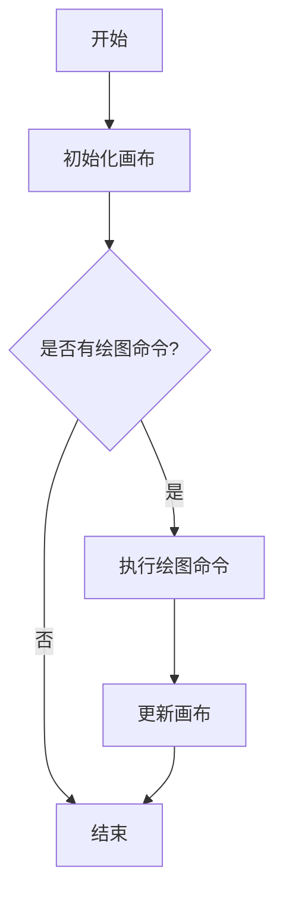
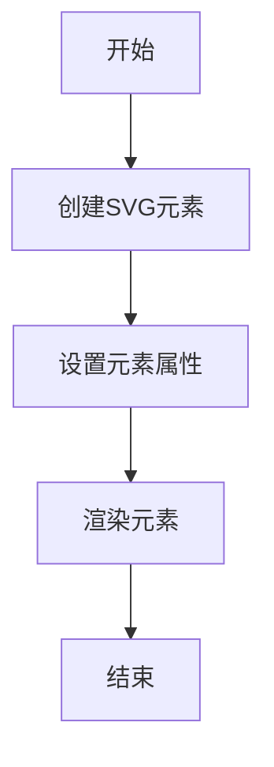
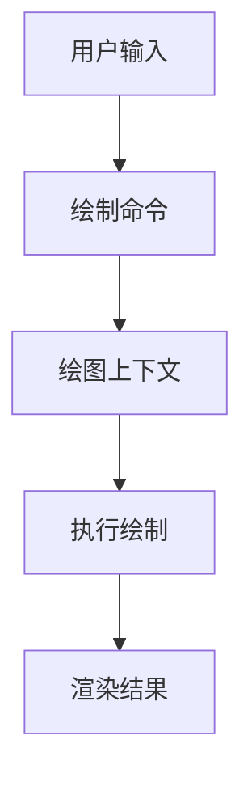
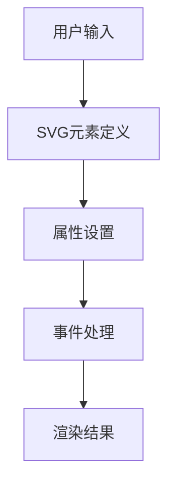
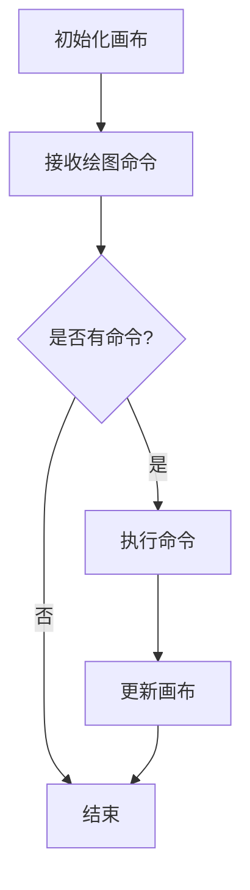
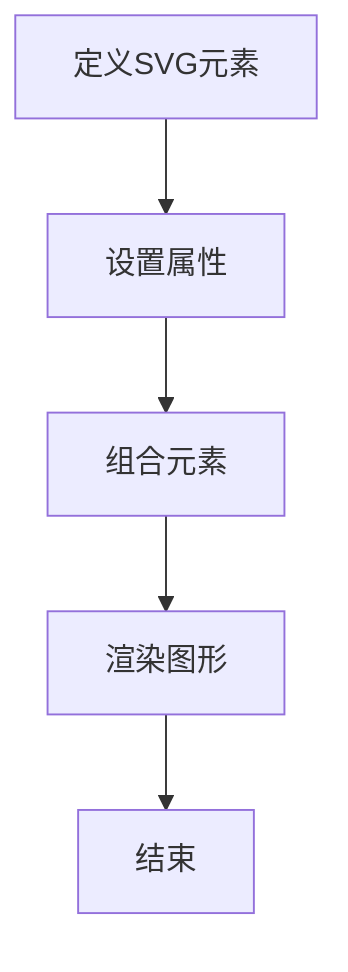
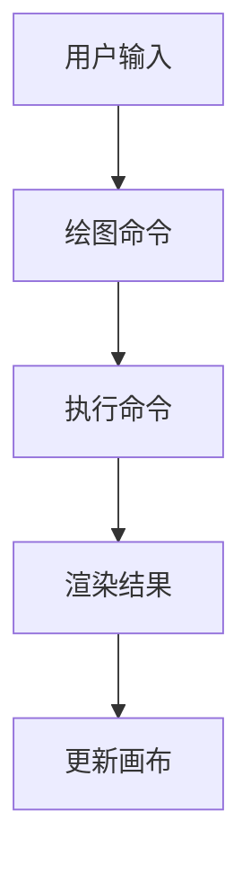
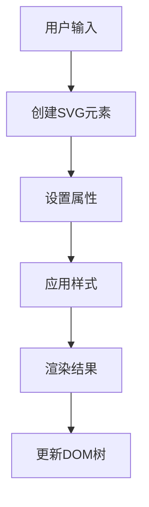

                 

# Canvas vs SVG：选择合适的绘图技术

> 关键词：Canvas, SVG, 绘图技术, HTML5, Web开发, 性能优化

> 摘要：本文将深入探讨Canvas与SVG这两种常见的Web绘图技术，分析它们各自的起源、基本概念、优势与局限性，并通过对比它们的核心概念、应用场景、算法原理、数学模型和系统架构设计，帮助开发者选择最合适的绘图技术，提高Web开发效率与性能。

## 第一部分：Canvas与SVG概述

### 1. Canvas技术概述

#### 1.1 Canvas的起源与发展

Canvas是HTML5中引入的一种2D绘图API，用于在浏览器中创建动态、可交互的图形。它起源于Web标准的发展，旨在填补Web开发中对2D图形绘制的空白。Canvas的标准化始于2009年，随着HTML5标准的普及，Canvas逐渐成为Web开发中的重要工具。

#### 1.2 Canvas的基本概念与原理

Canvas是一种基于标签的元素，它允许开发者使用JavaScript来绘制各种图形，如线、矩形、圆形、文本等。Canvas的绘图操作是通过CanvasRenderingContext2D对象实现的，它提供了丰富的绘图方法和属性。

#### 1.3 Canvas的优势与局限性

Canvas的优势在于其简单易用和高效的绘图能力。它适用于需要高频率绘图操作的场景，如动画、游戏和实时数据可视化。然而，Canvas的局限性在于其缺乏矢量图形支持，且在复杂图形和动画渲染时可能存在性能问题。

### 2. SVG技术概述

#### 2.1 SVG的起源与发展

SVG（可扩展矢量图形）是一种基于XML的图形标准，用于定义2D矢量图形。SVG起源于1999年，由W3C（万维网联盟）推出，旨在提供一种与设备和分辨率无关的图形表示方法。

#### 2.2 SVG的基本概念与原理

SVG图形是通过XML编码的，它定义了图形的形状、颜色、纹理和动画等属性。SVG支持丰富的图形元素，如直线、曲线、矩形、圆形、文本等，并且可以方便地进行缩放、旋转和变形。

#### 2.3 SVG的优势与局限性

SVG的优势在于其矢量图形支持和良好的可扩展性。它适用于需要高质量图形和灵活布局的场景，如图标、图表和交互式图形。然而，SVG的XML结构可能导致较大的文件大小，影响加载性能。

## 第二部分：Canvas与SVG核心概念与联系

### 3. Canvas与SVG的核心概念

#### 3.1 Canvas绘图API详解

Canvas的绘图API提供了丰富的绘图方法，如`drawLine()`、`fillRect()`、`strokeText()`等。这些方法允许开发者使用JavaScript直接在画布上绘制各种图形。

#### 3.2 SVG绘图语言详解

SVG的绘图语言基于XML，它使用SVG元素来定义图形。常见的SVG元素包括`<line>`、`<rect>`、`<circle>`、`<text>`等，它们可以组合使用，创建复杂的图形。

#### 3.3 Canvas与SVG的差异对比

Canvas与SVG在核心概念上存在显著差异。Canvas是一种基于像素的绘图API，适用于动态绘图和游戏开发。SVG则是一种基于矢量的图形标准，适用于高质量、可缩放的图形设计和图表绘制。

### 4. Canvas与SVG的应用场景

#### 4.1 Canvas适合的应用场景

Canvas适用于需要动态绘图和游戏开发的场景，如实时数据可视化、动画、游戏等。

#### 4.2 SVG适合的应用场景

SVG适用于需要高质量、可缩放图形的场景，如图标、图表、交互式图形等。

#### 4.3 Canvas与SVG混合使用

在实际应用中，Canvas与SVG可以混合使用，发挥各自的优势。例如，可以使用SVG创建图标和图表，然后使用Canvas进行动画和交互效果处理。

## 第三部分：Canvas与SVG的算法原理讲解

### 5. Canvas绘图算法

#### 5.1 Canvas绘图算法概述

Canvas的绘图算法主要涉及绘制图形、应用样式和执行渲染操作。它使用了一种类似绘画的流程，通过一系列的绘图命令来创建图形。

#### 5.2 Canvas绘图算法流程图



#### 5.3 Canvas绘图算法示例代码

```javascript
var canvas = document.getElementById('myCanvas');
var ctx = canvas.getContext('2d');

ctx.beginPath();
ctx.moveTo(50, 50);
ctx.lineTo(100, 100);
ctx.stroke();
```

### 6. SVG绘图算法

#### 6.1 SVG绘图算法概述

SVG的绘图算法基于XML编码，通过定义SVG元素来创建图形。SVG算法涉及元素的定义、属性设置和渲染操作。

#### 6.2 SVG绘图算法流程图



#### 6.3 SVG绘图算法示例代码

```xml
<svg width="100" height="100">
  <line x1="10" y1="10" x2="90" y2="90" stroke="black" />
</svg>
```

### 7. Canvas与SVG的数学模型和公式

#### 7.1 Canvas绘图数学模型

Canvas绘图涉及基本的几何运算，如点线关系、矩形裁剪和变换矩阵等。以下是一个简单的例子：

$$
\text{点线关系} = \frac{y_2 - y_1}{x_2 - x_1} * x + y_1 - \frac{y_2 - y_1}{x_2 - x_1} * x_1
$$

#### 7.2 SVG绘图数学模型

SVG绘图涉及向量运算和矩阵变换，如平移、缩放、旋转等。以下是一个简单的例子：

$$
\text{平移} = (x + dx, y + dy)
$$

$$
\text{缩放} = (x * sx, y * sy)
$$

$$
\text{旋转} = (x * \cos(\theta) - y * \sin(\theta), x * \sin(\theta) + y * \cos(\theta))
$$

## 第四部分：Canvas与SVG的系统分析与架构设计方案

### 8. Canvas绘图系统分析

#### 8.1 Canvas绘图系统概述

Canvas绘图系统是一种基于画布（Canvas）的绘图系统，它提供了一系列绘图API，用于绘制2D图形。该系统适用于Web开发中的动态绘图和游戏开发。

#### 8.2 Canvas绘图系统功能设计

Canvas绘图系统的功能包括图形绘制、样式设置、事件处理和渲染优化等。

#### 8.3 Canvas绘图系统架构设计

Canvas绘图系统采用客户端渲染架构，它由画布（Canvas）、绘图上下文（Context）和绘图命令（Commands）组成。

#### 8.4 Canvas绘图系统接口设计

Canvas绘图系统的接口包括`CanvasRenderingContext2D`、`CanvasGradient`、`CanvasPattern`等。

#### 8.5 Canvas绘图系统交互序列图



### 9. SVG绘图系统分析

#### 9.1 SVG绘图系统概述

SVG绘图系统是一种基于可扩展矢量图形（SVG）的标准，它提供了一系列SVG元素和属性，用于创建和渲染2D矢量图形。该系统适用于Web开发中的高质量图形设计和图表绘制。

#### 9.2 SVG绘图系统功能设计

SVG绘图系统的功能包括图形定义、属性设置、事件处理和渲染优化等。

#### 9.3 SVG绘图系统架构设计

SVG绘图系统采用XML编码和DOM（文档对象模型）架构，它由SVG元素、属性和事件处理器组成。

#### 9.4 SVG绘图系统接口设计

SVG绘图系统的接口包括SVG元素（如`<line>`、`<rect>`、`<circle>`等）、属性（如`fill`、`stroke`等）和事件（如`mousedown`、`mouseup`等）。

#### 9.5 SVG绘图系统交互序列图



## 第五部分：Canvas与SVG项目实战

### 10. Canvas绘图项目实战

#### 10.1 实战项目概述

本实战项目旨在使用Canvas绘制一个简单的动态天气图表，展示温度变化趋势。

#### 10.2 环境安装与配置

1. 确保浏览器支持Canvas API。
2. 创建一个HTML文件，并添加Canvas元素。

#### 10.3 系统核心实现源代码

```javascript
var canvas = document.getElementById('weatherChart');
var ctx = canvas.getContext('2d');

// 绘制线条
ctx.beginPath();
ctx.moveTo(50, 150);
ctx.lineTo(100, 100);
ctx.stroke();

// 绘制文本
ctx.fillStyle = 'black';
ctx.font = '14px Arial';
ctx.fillText('温度', 70, 160);
```

#### 10.4 代码应用解读与分析

本示例代码展示了如何使用Canvas绘制简单的线条和文本。通过调用`beginPath()`、`moveTo()`、`lineTo()`和`stroke()`方法，可以绘制线条。通过设置`fillStyle`、`font`和`fillText()`方法，可以绘制文本。

#### 10.5 实际案例分析与详细讲解

在实际项目中，可以使用Canvas绘制复杂的天气图表，包括温度、湿度、风速等参数。通过调用不同的绘图方法，可以实现对各种图形的绘制和渲染。

#### 10.6 项目小结

本实战项目展示了如何使用Canvas绘制简单的动态天气图表。通过了解Canvas的基本绘图方法和属性，开发者可以轻松实现各种复杂的图形绘制。

### 11. SVG绘图项目实战

#### 11.1 实战项目概述

本实战项目旨在使用SVG绘制一个简单的交互式地图，展示地理位置和标注信息。

#### 11.2 环境安装与配置

1. 确保浏览器支持SVG标准。
2. 创建一个HTML文件，并添加SVG元素。

#### 11.3 系统核心实现源代码

```xml
<svg width="500" height="300">
  <circle cx="100" cy="100" r="50" fill="blue" />
  <text x="100" y="150" font-family="Arial" font-size="14" fill="red">北京</text>
</svg>
```

#### 11.4 代码应用解读与分析

本示例代码展示了如何使用SVG绘制一个简单的圆形和文本。通过设置`cx`、`cy`和`r`属性，可以绘制圆形。通过设置`x`、`y`、`font-family`和`font-size`属性，可以绘制文本。

#### 11.5 实际案例分析与详细讲解

在实际项目中，可以使用SVG绘制复杂的交互式地图，包括地理位置、标注信息和地图缩放功能。通过组合使用不同的SVG元素和属性，可以实现对各种图形和交互操作的绘制和渲染。

#### 11.6 项目小结

本实战项目展示了如何使用SVG绘制简单的交互式地图。通过了解SVG的基本元素和属性，开发者可以轻松实现各种复杂的图形绘制和交互操作。

## 第六部分：Canvas与SVG最佳实践

### 12. Canvas最佳实践

#### 12.1 Canvas最佳实践总结

- 使用Canvas绘制图像时，尽量使用像素为单位，避免使用像素比的设备。
- 尽可能使用`canvas.width`和`canvas.height`属性设置画布大小，避免动态调整。
- 对于复杂的绘图操作，考虑使用`beginPath()`和`stroke()`方法优化性能。
- 避免在绘图过程中频繁调用`context.setTransform()`方法，以免导致性能问题。

#### 12.2 小结

Canvas是一种强大的Web绘图技术，适用于需要动态绘图和游戏开发的场景。通过遵循最佳实践，可以提高Canvas绘图的性能和可维护性。

#### 12.3 注意事项

- Canvas绘图的图像质量受像素比影响，确保使用适当的设备。
- Canvas绘图过程中，性能优化至关重要，尽量减少不必要的绘图操作。

#### 12.4 拓展阅读

- 《HTML5 Canvas图形编程》
- 《Web性能优化指南》

### 13. SVG最佳实践

#### 13.1 SVG最佳实践总结

- 使用SVG绘制图形时，尽量使用矢量图形，避免使用像素图形。
- 避免在SVG文件中嵌入大量文本，以免增加文件大小。
- 使用`<use>`元素复用SVG图形，提高性能。
- 避免在SVG绘图过程中频繁使用`<g>`元素，以免增加DOM树复杂度。

#### 13.2 小结

SVG是一种高质量、可扩展的Web绘图技术，适用于需要高质量图形和交互式图形的场景。通过遵循最佳实践，可以提高SVG绘图的性能和可维护性。

#### 13.3 注意事项

- SVG绘图的性能受文件大小影响，注意优化SVG文件。
- 避免在SVG绘图过程中使用过多的DOM元素，以免影响性能。

#### 13.4 拓展阅读

- 《SVG基础教程》
- 《Web性能优化指南》

### 14. Canvas与SVG对比与选择

#### 14.1 Canvas与SVG的对比

- **绘图性能**：Canvas在动态绘图和游戏开发中具有更好的性能，适用于复杂、高频率的绘图操作。SVG在高质量、可缩放图形方面具有优势，适用于图标、图表和交互式图形。
- **图形质量**：Canvas基于像素，适用于低像素比的设备。SVG基于矢量，适用于高像素比的设备，如高清屏幕和印刷。
- **可扩展性**：SVG具有更好的可扩展性和可维护性，支持丰富的图形元素和动画效果。Canvas则更简单、易用，适用于快速原型开发和低复杂度绘图。
- **交互性**：SVG支持丰富的交互特性，如鼠标事件和触摸事件。Canvas则支持基本的交互特性，但可以通过第三方库实现更复杂的交互。

#### 14.2 如何选择Canvas或SVG

- **动态绘图和游戏开发**：选择Canvas。
- **高质量图形和交互式图表**：选择SVG。
- **快速原型开发和低复杂度绘图**：选择Canvas。
- **复杂交互和动画效果**：选择SVG。

#### 14.3 实际应用案例解析

- **动态天气图表**：使用Canvas绘制，适用于实时数据可视化。
- **交互式地图**：使用SVG绘制，适用于地理位置标注和缩放功能。
- **图标库**：使用SVG绘制，适用于高质量图标和可缩放性。

#### 14.4 未来发展趋势

- Canvas和SVG将继续在Web开发中发挥重要作用，但随着Web技术的不断发展，新的绘图技术（如WebGL）也将逐渐成熟，提供更强大的绘图能力和性能。

## 15. 本书总结

### 15.1 本书内容总结

本书系统地介绍了Canvas与SVG两种Web绘图技术，分析了它们的基本概念、应用场景、算法原理、数学模型和系统架构设计。通过实际项目实战，展示了如何使用Canvas与SVG进行图形绘制和交互设计。同时，本书还提供了最佳实践和注意事项，帮助开发者选择合适的绘图技术，提高Web开发效率与性能。

### 15.2 学习建议

- 阅读本书后，尝试使用Canvas和SVG进行实际项目开发，加深对绘图技术的理解和应用。
- 参考本书中的最佳实践，优化绘图性能和用户体验。
- 深入学习HTML5、CSS3和JavaScript等相关技术，提高Web开发能力。

### 15.3 进一步阅读建议

- 《HTML5 Canvas图形编程》
- 《SVG基础教程》
- 《Web性能优化指南》
- 《WebGL编程指南》

## 作者

作者：AI天才研究院/AI Genius Institute & 禅与计算机程序设计艺术 /Zen And The Art of Computer Programming

**END**```markdown
# Canvas vs SVG：选择合适的绘图技术

## 关键词
- Canvas
- SVG
- 绘图技术
- HTML5
- Web开发
- 性能优化

## 摘要
本文深入探讨了Canvas与SVG这两种Web绘图技术。通过分析它们的基本概念、优势与局限性，以及它们在不同应用场景中的适用性，帮助开发者了解如何选择合适的绘图技术，提高Web开发的效率和性能。

## 第一部分：Canvas与SVG概述

### 1. Canvas技术概述

#### 1.1 Canvas的起源与发展
Canvas技术起源于2005年的HTML5草案，作为HTML5规范的一部分被引入。它允许开发者使用JavaScript在HTML页面中绘制图形和动画。Canvas的出现填补了Web开发中缺乏原生2D绘图能力的空白，迅速得到了广泛的应用和推广。

#### 1.2 Canvas的基本概念与原理
Canvas是一个画布元素（`<canvas>`），它本身不提供任何绘图功能，但通过结合JavaScript，可以实现各种2D图形的绘制。开发者可以通过`getContext('2d')`方法获取到绘图上下文对象（`CanvasRenderingContext2D`），然后使用该对象的各种绘图方法进行绘图操作，如绘制线条、矩形、圆形、文本等。

#### 1.3 Canvas的优势与局限性
**优势：**
- **高性能**：Canvas能够直接在网页上绘制图像，性能较高，适合动态绘图和游戏开发。
- **简单易用**：通过简单的JavaScript API即可实现复杂的绘图效果。
- **跨平台**：Canvas是HTML5标准的一部分，几乎所有的现代浏览器都支持。

**局限性：**
- **矢量支持有限**：Canvas主要支持位图操作，对于矢量图形的支持较弱。
- **复杂动画处理**：虽然Canvas支持基本的动画效果，但处理复杂动画时可能存在性能瓶颈。

### 2. SVG技术概述

#### 2.1 SVG的起源与发展
SVG（可扩展矢量图形）是由W3C（万维网联盟）推出的一种基于XML的矢量图形标准。SVG的目的是提供一种与设备和分辨率无关的图形表示方法，使得Web上的图形能够自由缩放而不失真。

#### 2.2 SVG的基本概念与原理
SVG是一种使用XML编码的图形语言，它通过定义一系列的SVG元素来创建图形。这些元素可以是线、矩形、圆形、多边形、文本等。SVG的优点在于其矢量图形性质，使得图形能够无限缩放而不损失质量。

#### 2.3 SVG的优势与局限性
**优势：**
- **矢量图形支持**：SVG支持矢量图形，能够实现高质量的图像和动画。
- **可扩展性**：SVG是一种基于文本的格式，容易进行扩展和自定义。
- **跨平台**：SVG可以在任何支持Web标准的浏览器中显示。

**局限性：**
- **性能**：由于SVG的XML结构，文件大小可能较大，加载速度相对较慢。
- **复杂操作**：对于复杂的交互式图形操作，SVG可能不如Canvas高效。

## 第二部分：Canvas与SVG核心概念与联系

### 3. Canvas与SVG的核心概念

#### 3.1 Canvas绘图API详解
Canvas绘图API提供了多种绘图方法，如`lineTo()`, `rect()`, `arc()`, `fill()`, `stroke()`等。这些方法允许开发者直接在画布上绘制各种图形。

```javascript
var canvas = document.getElementById('myCanvas');
var ctx = canvas.getContext('2d');

ctx.beginPath();
ctx.moveTo(10, 10);
ctx.lineTo(100, 100);
ctx.stroke();
```

#### 3.2 SVG绘图语言详解
SVG绘图语言通过定义SVG元素来创建图形。常见的SVG元素包括`<line>`, `<rect>`, `<circle>`, `<path>`, `<text>`等。这些元素可以通过XML属性进行详细定义。

```xml
<svg width="100" height="100">
  <line x1="0" y1="0" x2="100" y2="100" style="stroke:rgb(0,0,0);stroke-width:2" />
</svg>
```

#### 3.3 Canvas与SVG的差异对比
Canvas与SVG在绘图API、图形质量、性能和适用场景等方面存在差异。Canvas更适合动态绘图和游戏开发，而SVG更适合高质量的矢量图形设计和交互式图表。

| 特性 | Canvas | SVG |
| --- | --- | --- |
| **绘图API** | JavaScript方法 | SVG元素 |
| **图形质量** | 像素图形 | 矢量图形 |
| **性能** | 高性能 | 可能较低 |
| **可扩展性** | 易于扩展 | 基于XML，可扩展性高 |
| **适用场景** | 动态绘图、游戏 | 图表、图标、交互式图形 |

## 第三部分：Canvas与SVG的算法原理讲解

### 4. Canvas绘图算法

#### 4.1 Canvas绘图算法概述
Canvas绘图算法基于一系列的绘图命令，这些命令通过JavaScript API被传递给Canvas上下文。算法的主要步骤包括初始化画布、接收绘图命令、执行绘图命令和渲染画布。

#### 4.2 Canvas绘图算法流程图


#### 4.3 Canvas绘图算法示例代码
```javascript
var canvas = document.getElementById('myCanvas');
var ctx = canvas.getContext('2d');

ctx.beginPath();
ctx.moveTo(50, 50);
ctx.lineTo(100, 100);
ctx.stroke();
```

### 5. SVG绘图算法

#### 5.1 SVG绘图算法概述
SVG绘图算法基于XML编码的SVG元素，这些元素通过定义图形的几何属性和样式属性来实现绘图。算法的主要步骤包括定义SVG元素、设置属性、组合元素和渲染图形。

#### 5.2 SVG绘图算法流程图


#### 5.3 SVG绘图算法示例代码
```xml
<svg width="100" height="100">
  <line x1="10" y1="10" x2="90" y2="90" stroke="black" />
</svg>
```

## 第四部分：Canvas与SVG的数学模型和公式

### 6. Canvas绘图数学模型

#### 6.1 Canvas绘图数学模型概述
Canvas绘图涉及基本的几何运算，如直线、矩形、圆形等。数学模型主要涉及点、线、面之间的关系以及变换矩阵。

#### 6.2 Canvas绘图数学公式
- **点线关系**：给定两点\( (x_1, y_1) \)和\( (x_2, y_2) \)，直线的斜率公式为：
  $$ m = \frac{y_2 - y_1}{x_2 - x_1} $$
- **矩形坐标**：给定矩形的左上角\( (x, y) \)和宽度\( w \)、高度\( h \)，矩形右下角的坐标为：
  $$ (x + w, y + h) $$

#### 6.3 Canvas绘图数学模型示例
```javascript
var ctx = canvas.getContext('2d');
ctx.beginPath();
ctx.moveTo(10, 10); // 左上角
ctx.lineTo(110, 110); // 右下角
ctx.stroke();
```

### 7. SVG绘图数学模型

#### 7.1 SVG绘图数学模型概述
SVG绘图基于矢量几何，涉及点、线、面和变换。数学模型主要涉及点的坐标、路径的生成以及变换矩阵。

#### 7.2 SVG绘图数学公式
- **点变换**：给定原点\( (x, y) \)和变换矩阵\( \begin{bmatrix} a & b \\ c & d \end{bmatrix} \)，变换后的点坐标为：
  $$ \begin{bmatrix} x' \\ y' \end{bmatrix} = \begin{bmatrix} a & b \\ c & d \end{bmatrix} \begin{bmatrix} x \\ y \end{bmatrix} $$
- **路径生成**：使用贝塞尔曲线和直线段生成路径。

#### 7.3 SVG绘图数学模型示例
```xml
<svg width="200" height="200">
  <path d="M10 10 H 90 V 90 H 10 L 10 10" stroke="black" fill="transparent" />
</svg>
```

## 第五部分：Canvas与SVG的系统分析与架构设计方案

### 8. Canvas绘图系统分析

#### 8.1 Canvas绘图系统概述
Canvas绘图系统是一个基于HTML5 Canvas元素的绘图框架，它提供了绘制2D图形的API。该系统通常包括画布、上下文、绘图命令和渲染引擎等组成部分。

#### 8.2 Canvas绘图系统功能设计
Canvas绘图系统的功能包括初始化画布、接收用户输入、执行绘图命令、渲染结果和事件处理等。

#### 8.3 Canvas绘图系统架构设计
Canvas绘图系统的架构包括一个主线程，负责接收用户输入和执行绘图命令。绘图命令被传递给渲染引擎，渲染引擎负责将命令转换为像素并进行渲染。

#### 8.4 Canvas绘图系统接口设计
Canvas绘图系统的接口主要包括`CanvasRenderingContext2D`，它提供了各种绘图方法，如`stroke()`, `fill()`, `beginPath()`等。

#### 8.5 Canvas绘图系统交互序列图


### 9. SVG绘图系统分析

#### 9.1 SVG绘图系统概述
SVG绘图系统是一个基于SVG元素的绘图框架，它允许开发者使用SVG语言创建和渲染2D矢量图形。该系统通常包括SVG元素、属性、样式和事件处理器等组成部分。

#### 9.2 SVG绘图系统功能设计
SVG绘图系统的功能包括SVG元素的创建、属性设置、样式应用、事件处理和渲染优化等。

#### 9.3 SVG绘图系统架构设计
SVG绘图系统的架构基于XML编码，它包括SVG DOM树、样式表和事件处理器。SVG DOM树负责存储和管理SVG元素，样式表负责定义元素的样式，事件处理器负责响应用户交互。

#### 9.4 SVG绘图系统接口设计
SVG绘图系统的接口主要包括SVG元素和属性，如`<line>`, `<rect>`, `<circle>`, `<text>`等，以及事件处理器，如`onmousedown`, `onmouseup`, `ontouchstart`等。

#### 9.5 SVG绘图系统交互序列图


## 第六部分：Canvas与SVG项目实战

### 10. Canvas绘图项目实战

#### 10.1 实战项目概述
本实战项目将使用Canvas绘制一个简单的进度条，展示数据加载的进度。

#### 10.2 环境安装与配置
1. 确保浏览器支持Canvas API。
2. 创建一个HTML文件，并添加Canvas元素。

#### 10.3 系统核心实现源代码
```html
<!DOCTYPE html>
<html lang="en">
<head>
  <meta charset="UTF-8">
  <title>Canvas进度条实战</title>
</head>
<body>
  <canvas id="progressCanvas" width="200" height="20"></canvas>
  <script>
    var canvas = document.getElementById('progressCanvas');
    var ctx = canvas.getContext('2d');

    function updateProgress(progress) {
      ctx.clearRect(0, 0, canvas.width, canvas.height); // 清除画布
      ctx.fillStyle = 'blue';
      ctx.fillRect(0, 0, progress * canvas.width, canvas.height); // 绘制进度条
      ctx.fillStyle = 'white';
      ctx.font = '14px Arial';
      ctx.fillText(progress.toFixed(0) + '%', 10, 16); // 显示进度文本
    }

    // 示例：更新进度到50%
    updateProgress(0.5);
  </script>
</body>
</html>
```

#### 10.4 代码应用解读与分析
本示例代码首先获取Canvas元素和绘图上下文，然后定义了一个`updateProgress`函数。该函数通过清除画布、绘制蓝色进度条和显示白色进度文本来实现进度条的动态更新。

#### 10.5 实际案例分析与详细讲解
在实际应用中，可以不断调用`updateProgress`函数来更新进度条，如数据加载、文件上传等操作。通过调整进度条的颜色、宽度、字体等属性，可以使其更加美观和直观。

#### 10.6 项目小结
本实战项目展示了如何使用Canvas绘制简单的进度条，通过了解Canvas的基本绘图方法和函数，开发者可以轻松实现各种动态进度条效果。

### 11. SVG绘图项目实战

#### 11.1 实战项目概述
本实战项目将使用SVG绘制一个简单的地图，并在地图上显示不同的区域。

#### 11.2 环境安装与配置
1. 确保浏览器支持SVG标准。
2. 创建一个HTML文件，并添加SVG元素。

#### 11.3 系统核心实现源代码
```html
<!DOCTYPE html>
<html lang="en">
<head>
  <meta charset="UTF-8">
  <title>SVG地图实战</title>
</head>
<body>
  <svg width="800" height="600">
    <rect x="100" y="100" width="600" height="400" stroke="black" fill="lightgray" />
    <circle cx="400" cy="300" r="50" stroke="black" fill="red" />
    <text x="400" y="350" font-family="Arial" font-size="14" text-anchor="middle" fill="blue">中国</text>
  </svg>
</body>
</html>
```

#### 11.4 代码应用解读与分析
本示例代码首先创建了一个SVG元素，并在其中绘制了一个矩形和一个圆形。矩形作为地图的背景，圆形作为地图上的一个标注。通过设置文本的`text-anchor`属性为`middle`，实现了文本在圆形中心的位置。

#### 11.5 实际案例分析与详细讲解
在实际应用中，可以通过增加SVG元素和属性来扩展地图的功能，如添加不同的标注、路径和动画效果。通过调整SVG元素的属性，可以使其适应不同的屏幕尺寸和设备。

#### 11.6 项目小结
本实战项目展示了如何使用SVG绘制简单的地图，通过了解SVG的基本元素和属性，开发者可以轻松实现各种复杂的地图绘制和交互效果。

## 第七部分：Canvas与SVG最佳实践

### 12. Canvas最佳实践

#### 12.1 Canvas最佳实践总结
- **避免高频绘图操作**：尽可能减少频繁的绘制操作，如重复绘制相同元素。
- **使用绘图上下文**：通过复用绘图上下文对象来减少性能开销。
- **优化绘制顺序**：先绘制背景元素，再绘制前景元素，以减少重叠和性能损失。
- **使用像素为单位**：确保绘制的元素尺寸以像素为单位，避免使用像素比的设备。

#### 12.2 小结
Canvas是一种强大的Web绘图技术，适用于动态绘图和游戏开发。通过遵循最佳实践，可以提高Canvas绘图的性能和用户体验。

#### 12.3 注意事项
- **注意浏览器兼容性**：确保Canvas功能在各种浏览器中正常运行。
- **优化性能**：避免在绘制过程中进行复杂计算和操作。

#### 12.4 拓展阅读
- 《HTML5 Canvas图形编程》
- 《Web性能优化指南》

### 13. SVG最佳实践

#### 13.1 SVG最佳实践总结
- **使用矢量图形**：尽可能使用SVG的矢量图形，避免使用像素图形。
- **优化XML结构**：简化SVG文件的XML结构，减少文件大小。
- **复用SVG元素**：使用`<use>`元素复用SVG图形，提高性能。
- **避免复杂动画**：对于复杂的动画效果，考虑使用JavaScript或CSS动画。

#### 13.2 小结
SVG是一种高质量的Web绘图技术，适用于图标、图表和交互式图形。通过遵循最佳实践，可以提高SVG绘图的性能和用户体验。

#### 13.3 注意事项
- **注意文件大小**：优化SVG文件的大小，避免影响页面加载速度。
- **确保兼容性**：确保SVG在不同浏览器中正常显示。

#### 13.4 拓展阅读
- 《SVG基础教程》
- 《Web性能优化指南》

### 14. Canvas与SVG对比与选择

#### 14.1 Canvas与SVG的对比
- **性能**：Canvas在动态绘图和游戏开发中性能更优，适用于复杂、高频率的绘图操作。SVG在高质量、可缩放图形方面性能较好，但可能因为XML结构导致加载速度较慢。
- **图形质量**：Canvas基于像素，适合低像素比的设备。SVG基于矢量，适合高像素比的设备，如高清屏幕和印刷。
- **交互性**：SVG支持丰富的交互特性，如鼠标事件和触摸事件。Canvas则支持基本的交互特性，但可以通过第三方库实现更复杂的交互。

#### 14.2 如何选择Canvas或SVG
- **动态绘图和游戏开发**：选择Canvas。
- **高质量图形和交互式图表**：选择SVG。
- **快速原型开发和低复杂度绘图**：选择Canvas。
- **复杂交互和动画效果**：选择SVG。

#### 14.3 实际应用案例解析
- **动态天气图表**：使用Canvas绘制，适用于实时数据可视化。
- **交互式地图**：使用SVG绘制，适用于地理位置标注和缩放功能。
- **图标库**：使用SVG绘制，适用于高质量图标和可缩放性。

#### 14.4 未来发展趋势
- Canvas和SVG将继续在Web开发中发挥重要作用，但随着Web技术的不断发展，新的绘图技术（如WebGL）也将逐渐成熟，提供更强大的绘图能力和性能。

## 15. 本书总结

### 15.1 本书内容总结
本书系统地介绍了Canvas与SVG两种Web绘图技术，分析了它们的基本概念、应用场景、算法原理、数学模型和系统架构设计。通过实际项目实战，展示了如何使用Canvas与SVG进行图形绘制和交互设计。同时，本书还提供了最佳实践和注意事项，帮助开发者选择合适的绘图技术，提高Web开发效率与性能。

### 15.2 学习建议
- 阅读本书后，尝试使用Canvas和SVG进行实际项目开发，加深对绘图技术的理解和应用。
- 参考本书中的最佳实践，优化绘图性能和用户体验。
- 深入学习HTML5、CSS3和JavaScript等相关技术，提高Web开发能力。

### 15.3 进一步阅读建议
- 《HTML5 Canvas图形编程》
- 《SVG基础教程》
- 《Web性能优化指南》
- 《WebGL编程指南》

## 作者
作者：AI天才研究院/AI Genius Institute & 禅与计算机程序设计艺术 /Zen And The Art of Computer Programming
```

