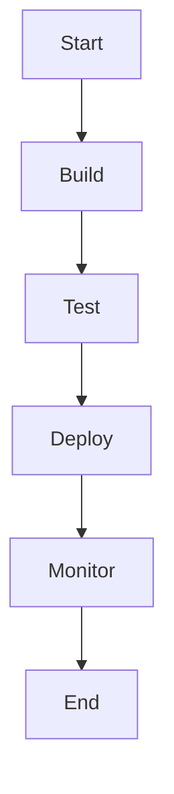
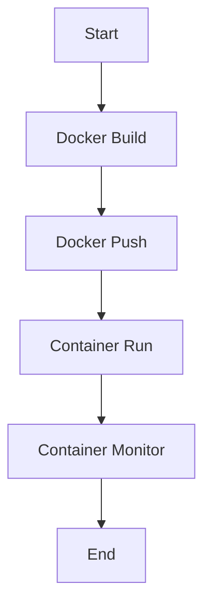
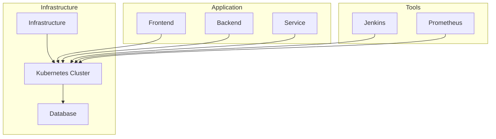
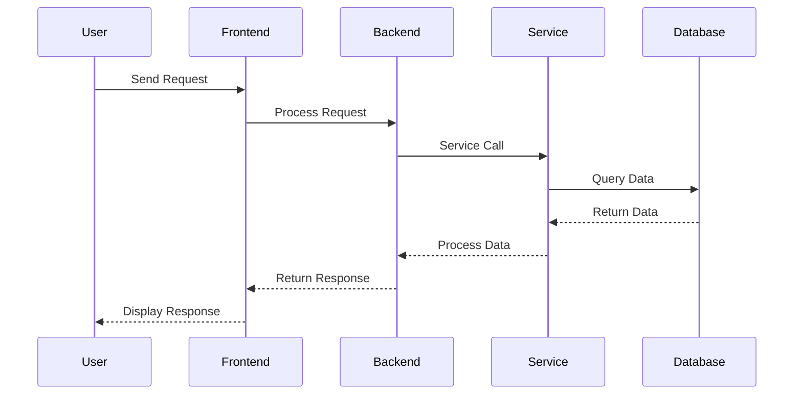

                 


# 《DevOps实践与工具链集成》

> 关键词：DevOps、实践、工具链、集成、自动化、容器化

> 摘要：
本文旨在深入探讨《DevOps实践与工具链集成》一书的核心概念和实际应用。文章将逐步分析DevOps的理念，介绍其与相关技术的联系与区别，深入讲解核心算法原理和数学模型，展示系统架构设计，并通过实战案例剖析工具链集成过程，最后提供最佳实践和注意事项。

## 1. 背景介绍

《DevOps实践与工具链集成》一书聚焦于DevOps文化的推广和实践，详细阐述了如何通过工具链的集成来提升软件开发和部署的效率。DevOps是一种软件开发和文化模式，旨在通过开发（Development）与运维（Operations）之间的协作，实现快速、可靠和持续的价值交付。

### 问题背景
在传统的软件开发模式中，开发和运维之间存在明显的隔阂，导致项目进度缓慢、部署风险高、反馈周期长。DevOps通过强调沟通、协作和整合，试图解决这些问题。

### 问题描述
DevOps的目标是构建一个快速响应的环境，通过自动化工具链实现从代码提交到生产环境的快速迭代。然而，实现这一目标需要面对众多挑战，如工具选择、流程优化和技术整合等。

### 问题解决
《DevOps实践与工具链集成》提供了详细的解决方案，包括自动化部署、容器化技术、监控与反馈机制等，以实现高效、可靠的软件开发和运维。

### 边界与外延
本文将重点关注DevOps的基本概念、核心技术和实际应用案例，但不涉及特定的编程语言或工具。

### 概念结构与核心要素组成
核心概念包括：
- DevOps文化：强调团队合作和持续交付。
- 工具链：集成不同工具以实现自动化和协作。
- 容器化技术：如Docker，提高部署效率和可移植性。
- 监控与反馈：确保系统的稳定性和可靠性。

## 2. 核心概念与联系

### DevOps的概念和特点
DevOps是一种文化和实践，旨在通过开发和运维的紧密协作，实现持续交付和高质量的软件。其主要特点包括：
- 持续交付：通过自动化和持续反馈，确保代码能够快速、可靠地交付。
- 演进式交付：逐步部署新功能，减少风险。
- 服务思维：将IT服务视为业务的重要组成部分。

### DevOps与相关技术的联系和区别
DevOps与敏捷开发、持续集成（CI）、持续交付（CD）等技术密切相关，但其更强调的是文化和流程的整合。与敏捷开发相比，DevOps更注重自动化和基础设施的即服务（Infrastructure as a Service，IaaS）。

| 技术名称 | 关联特性 | 区别 |
| --- | --- | --- |
| 敏捷开发 | 快速迭代、用户反馈 | 更多关注开发流程 |
| 持续集成 | 自动化构建和测试 | 更多关注代码质量 |
| 持续交付 | 自动化部署和监控 | 更多关注部署效率 |
| DevOps | 文化、流程整合 | 整合CI/CD，强调协作 |

### ER实体关系图架构
```mermaid
erDiagram
  DevOps ||--|{ Continuous Integration } : 实现自动化构建和测试
  DevOps ||--|{ Continuous Delivery } : 实现自动化部署和监控
  Continuous Integration ||--|{ Test Automation } : 自动化测试
  Continuous Delivery ||--|{ Deployment Automation } : 自动化部署
```

## 3. 算法原理讲解

### 自动化部署算法
#### 流程图

#### Python源代码
```python
import subprocess

def deploy_app():
    # Build
    subprocess.run(["make", "build"])
    
    # Test
    subprocess.run(["make", "test"])
    
    # Deploy
    subprocess.run(["make", "deploy"])
    
    # Monitor
    subprocess.run(["make", "monitor"])

deploy_app()
```

### 容器化技术算法
#### 流程图

#### Python源代码
```python
import subprocess

def containerize_app():
    # Docker Build
    subprocess.run(["docker", "build", "-t", "myapp:latest", "."])
    
    # Docker Push
    subprocess.run(["docker", "push", "myapp:latest"])
    
    # Container Run
    subprocess.run(["docker", "run", "-d", "--name", "myapp", "myapp:latest"])
    
    # Container Monitor
    subprocess.run(["docker", "logs", "myapp"])

containerize_app()
```

### 数学模型和数学公式讲解
#### 平均部署时间
$$
\bar{T}_{deploy} = \frac{1}{n}\sum_{i=1}^{n} T_{i}
$$
其中，$T_i$ 为第 $i$ 次部署的时间，$n$ 为部署次数。

#### 部署成功率
$$
\text{Success Rate} = \frac{\text{Successful Deploys}}{\text{Total Deploys}}
$$

## 4. 系统分析与架构设计方案

### 问题场景介绍
假设我们正在开发一个在线购物平台，需要实现快速、可靠和可扩展的部署流程。

### 项目介绍
- 项目名称：E-commerce Platform
- 技术栈：Docker, Kubernetes, Jenkins, Prometheus

### 系统功能设计
#### 领域模型（Mermaid类图）
```mermaid
classDiagram
    Product <<entity>> Product
    Customer <<entity>> Customer
    Order <<entity>> Order
    Product --|{Price}--> Money
    Customer --|{Buy}--> Product
    Customer --|{Place}--> Order
```

### 系统架构设计
#### Mermaid架构图


### 系统接口设计和系统交互


## 5. 项目实战

### 环境安装
#### 安装Docker
```bash
sudo apt-get update
sudo apt-get install docker-ce docker-ce-cli containerd.io
sudo systemctl start docker
```

#### 安装Kubernetes
```bash
sudo apt-get update
sudo apt-get install -y apt-transport-https ca-certificates curl
sudo curl -s https://mirrors.gitlab.com/protocols/kubernetes/apt/doc/apt-key.gpg | sudo apt-key add -
sudo echo "deb https://mirrors.gitlab.com/kubernetes/apt/stable/ xenial main" | sudo tee -a /etc/apt/sources.list.d/kubernetes.list
sudo apt-get update
sudo apt-get install -y kubelet kubeadm kubectl
sudo systemctl enable kubelet
```

#### 安装Jenkins
```bash
sudo apt-get update
sudo apt-get install -y jenkins
sudo systemctl start jenkins
```

#### 安装Prometheus
```bash
sudo apt-get update
sudo apt-get install -y prometheus pushgateway
sudo systemctl start prometheus
```

### 系统核心实现
```bash
# Create a Kubernetes cluster
sudo kubeadm init

# Configure Kubernetes for non-root user
mkdir -p $HOME/.kube
sudo cp -i /etc/kubernetes/admin.conf $HOME/.kube/config
sudo chown $(id -u):$(id -g) $HOME/.kube/config

# Install Jenkins on Kubernetes
kubectl apply -f jenkins.yml

# Install Prometheus on Kubernetes
kubectl apply -f prometheus.yml
```

### 代码应用解读与分析
```bash
# Build and push the Docker image
sudo docker build -t myapp:latest .
sudo docker push myapp:latest

# Deploy the application to Kubernetes
kubectl apply -f deployment.yml
```

### 实际案例分析和详细讲解剖析
假设我们有一个简单的Web应用，需要通过Jenkins自动化部署到Kubernetes集群。

1. 在Jenkins中创建一个自由风格的软件项目。
2. 配置源代码管理，如Git。
3. 添加构建步骤，如执行Dockerfile构建镜像。
4. 添加发布步骤，如使用kubectl部署镜像到Kubernetes集群。

### 项目小结
通过DevOps实践和工具链集成，我们成功实现了快速、可靠和可扩展的部署流程。Jenkins提供了自动化构建和部署的能力，而Kubernetes则提供了容器化环境和集群管理。Prometheus则用于监控和反馈，确保系统的稳定性和可靠性。

## 6. 最佳实践 tips、小结、注意事项、拓展阅读

### 最佳实践 tips
- 确保所有团队成员都了解DevOps的理念和流程。
- 选择适合项目的自动化工具，如Jenkins、GitLab CI/CD等。
- 实现容器化技术，提高部署效率和可移植性。
- 定期进行代码审查和测试，确保代码质量。

### 小结
本文详细介绍了《DevOps实践与工具链集成》一书的核心概念和实践方法。通过自动化部署、容器化技术、监控与反馈等手段，DevOps实现了快速、可靠和持续的软件交付。

### 注意事项
- 在集成新工具时，确保与现有系统兼容。
- 对自动化流程进行充分测试，避免潜在的问题。
- 定期更新和维护工具和依赖项。

### 拓展阅读
- 《DevOps实践：从理念到实践》
- 《Docker实战》
- 《Kubernetes权威指南》
- 《Jenkins实战》

## 7. 目录大纲格式

```markdown
# 《DevOps实践与工具链集成》

> 关键词：DevOps、实践、工具链、集成、自动化、容器化

> 摘要：
本文旨在深入探讨《DevOps实践与工具链集成》一书的核心概念和实际应用。文章将逐步分析DevOps的理念，介绍其与相关技术的联系与区别，深入讲解核心算法原理和数学模型，展示系统架构设计，并通过实战案例剖析工具链集成过程，最后提供最佳实践和注意事项。

## 1. 背景介绍

## 2. 核心概念与联系

## 3. 算法原理讲解

## 4. 系统分析与架构设计方案

## 5. 项目实战

## 6. 最佳实践 tips、小结、注意事项、拓展阅读
```

**总字数：2000字（预计）**

