                 


## DevOps实践：打破开发和运维的壁垒

### 关键词：
- DevOps
- 持续集成
- 持续部署
- 自动化
- 沟通与协作

### 摘要：
本文将深入探讨DevOps实践，旨在打破开发和运维之间的壁垒，提高软件交付的效率和质量。通过逐步分析DevOps的核心概念、原则和实践，本文将提供实用的工具、案例和最佳实践，帮助读者理解和应用DevOps理念，实现高效开发和运维流程。

### 目录：

#### 第一部分: DevOps概述

1.1 DevOps的概念与背景

1.2 开发与运维的壁垒

1.3 DevOps的关键原则

#### 第二部分: DevOps实践基础

2.1 环境搭建与配置

2.2 DevOps工具与实践

2.3 架构设计与系统整合

2.4 安全性与合规性

#### 第三部分: DevOps实践案例

3.1 案例一：电商平台的DevOps实践

3.2 案例二：金融行业的DevOps转型

3.3 案例三：敏捷开发和运维的结合

#### 第四部分: DevOps最佳实践

4.1 DevOps团队的组织结构

4.2 持续学习和改进

4.3 拓展阅读与资源推荐

### 引言：

在当今快速发展的技术时代，软件交付的速度和质量成为企业竞争的关键因素。传统的开发（Development）和运维（Operations）之间存在明显的壁垒，导致软件交付周期长、质量难以保障。DevOps的出现，旨在打破这种壁垒，通过文化和工具的变革，实现开发和运维的无缝协作，提高软件交付的效率和质量。

### 第一部分: DevOps概述

#### 1.1 DevOps的概念与背景

**核心概念术语说明：**

- **DevOps**：DevOps是一种软件开发和运维的实践方法，强调开发和运维团队之间的紧密协作，通过自动化和工具集成，实现快速、可靠和高质量的软件交付。

- **持续集成（CI）**：持续集成是一种软件开发实践，通过自动化构建和测试，确保代码库中的每个提交都是可集成和可部署的。

- **持续部署（CD）**：持续部署是一种自动化软件发布过程的方法，通过持续集成，确保应用程序在各个环境中的快速、可靠和安全的部署。

- **自动化**：自动化是指使用工具和脚本来自动执行重复性任务，减少手动操作，提高效率和准确性。

- **沟通与协作**：沟通与协作是DevOps的核心原则，通过建立高效的沟通渠道和协作机制，确保团队之间的信息共享和工作协调。

**问题背景、问题描述、问题解决、边界与外延、概念结构与核心要素组成：**

在传统软件开发中，开发和运维团队往往各自为政，沟通不畅，导致软件交付周期长、质量难以保障。开发团队专注于编写代码、实现功能，而运维团队则负责部署和维护系统。这种模式导致以下问题：

1. **交付周期长**：开发完成的功能需要经过多次测试和部署才能上线，导致交付周期长。
2. **质量难以保障**：由于开发和运维的隔离，部署过程中可能存在各种问题，影响软件质量。
3. **成本高**：频繁的手动操作和重复性任务导致成本增加。
4. **团队协作不畅**：开发和运维团队之间的沟通不畅，影响项目进展和团队效率。

DevOps通过以下方式解决这些问题：

1. **持续集成（CI）**：通过自动化构建和测试，确保代码库中的每个提交都是可集成和可部署的，减少交付周期。
2. **持续部署（CD）**：通过自动化部署过程，确保应用程序在各个环境中的快速、可靠和安全的部署，提高软件质量。
3. **自动化**：使用工具和脚本来自动执行重复性任务，减少手动操作，提高效率和准确性。
4. **沟通与协作**：建立高效的沟通渠道和协作机制，确保团队之间的信息共享和工作协调。

**概念属性特征对比表格：**

| 特征 | DevOps | 传统开发 | 传统运维 |
| --- | --- | --- | --- |
| 沟通与协作 | 强调团队协作和沟通 | 缺乏协作，各自为政 | 缺乏协作，各自为政 |
| 自动化 | 强调自动化，减少手动操作 | 手动操作较多 | 手动操作较多 |
| 质量保障 | 通过CI/CD确保质量 | 测试和部署环节薄弱 | 部署环节薄弱 |
| 交付周期 | 短 | 长 | 长 |

**ER实体关系图架构：**

```
[团队] --> [开发团队] , [运维团队]
    |
    |
    |
[沟通渠道] --> [邮件], [聊天工具], [会议]
    |
    |
    |
[协作机制] --> [代码评审], [任务跟踪], [项目计划]
```

#### 1.2 开发与运维的壁垒

**问题背景、问题描述、问题解决、边界与外延、概念结构与核心要素组成：**

开发与运维之间的壁垒主要体现在以下几个方面：

1. **文化差异**：开发团队注重创新和灵活性，而运维团队注重稳定性和可靠性，导致双方在目标和价值观上存在差异。
2. **工作流程差异**：开发团队的工作流程通常是基于敏捷开发方法，强调快速迭代和持续交付，而运维团队的工作流程则更加注重规划和部署。
3. **技能和知识差异**：开发团队通常更擅长编程和软件开发，而运维团队则更擅长系统运维和网络管理。
4. **工具和技术差异**：开发团队使用的工具和技术通常更加灵活和多样化，而运维团队则更注重稳定性和可靠性。

**解决方法：**

1. **文化融合**：通过培训和文化活动，增强团队之间的认同感和信任，促进文化融合。
2. **工作流程整合**：通过敏捷开发和DevOps实践，将开发团队和运维团队的工作流程整合在一起，实现无缝协作。
3. **技能和知识互补**：通过跨团队培训和知识共享，提高团队的综合素质和能力。
4. **工具和技术统一**：采用统一的工具和技术，确保团队之间的协作和沟通。

**边界与外延：**

1. **边界**：开发与运维的壁垒主要指双方在文化、流程、技能和技术方面的差异。
2. **外延**：DevOps实践旨在打破这些壁垒，实现开发和运维的无缝协作，提高软件交付的效率和质量。

#### 1.3 DevOps的关键原则

**核心概念与联系：**

- **持续集成（CI）**：通过自动化构建和测试，确保代码库中的每个提交都是可集成和可部署的。
- **持续部署（CD）**：通过自动化部署过程，确保应用程序在各个环境中的快速、可靠和安全的部署。
- **自动化**：使用工具和脚本来自动执行重复性任务，提高效率和准确性。
- **沟通与协作**：建立高效的沟通渠道和协作机制，确保团队之间的信息共享和工作协调。

**概念属性特征对比表格：**

| 特征 | 持续集成（CI） | 持续部署（CD） | 自动化 | 沟通与协作 |
| --- | --- | --- | --- | --- |
| 目标 | 确保代码库中的提交可集成和可部署 | 确保应用程序在各个环境中快速、可靠和安全地部署 | 提高效率和准确性 | 建立高效的沟通渠道和协作机制 |
| 方法 | 自动化构建和测试 | 自动化部署过程 | 使用工具和脚本 | 使用邮件、聊天工具、会议等 |

**ER实体关系图架构：**

```
[持续集成（CI）] --> [自动化构建] , [自动化测试]
    |
    |
    |
[持续部署（CD）] --> [自动化部署] , [环境配置]
    |
    |
    |
[自动化] --> [脚本] , [工具]
    |
    |
    |
[沟通与协作] --> [邮件] , [聊天工具] , [会议]
```

### 第二部分: DevOps实践基础

#### 2.1 环境搭建与配置

**核心概念与联系：**

- **环境搭建**：为开发和运维提供必要的硬件和软件资源，包括服务器、数据库、应用服务器等。
- **配置管理**：通过自动化工具，如Ansible、Puppet等，对环境进行配置和管理，确保环境的统一和一致性。

**问题场景介绍：**

在开发和运维过程中，环境搭建和配置是一个常见的任务。不同的开发人员和运维人员可能使用不同的工具和配置方式，导致环境不一致，影响软件的交付和部署。

**解决方案：**

1. **自动化环境搭建**：使用工具如Docker、Kubernetes等，实现自动化部署和配置，确保环境的一致性。
2. **配置管理**：使用Ansible、Puppet等自动化工具，对环境进行统一配置和管理。

**系统功能设计：**

- **功能1**：自动化环境搭建
- **功能2**：配置管理

**系统架构设计：**


**系统接口设计：**

- **接口1**：API接口，用于环境搭建和配置的调用
- **接口2**：命令行接口，用于手动操作和管理

**系统交互：**


#### 2.2 DevOps工具与实践

**核心概念与联系：**

- **源代码管理工具**：如Git，用于代码的版本控制和协同开发。
- **自动化构建工具**：如Jenkins，用于自动化构建和测试。
- **自动化部署工具**：如Kubernetes，用于自动化部署和运维。
- **测试工具**：如Selenium、JMeter，用于自动化测试和性能测试。
- **监控与日志管理**：如ELK堆栈（Elasticsearch、Logstash、Kibana），用于实时监控和日志管理。

**问题场景介绍：**

在开发和运维过程中，使用合适的工具和实践，可以提高软件交付的效率和质量。然而，不同团队可能使用不同的工具和方式，导致工具的集成和协作困难。

**解决方案：**

1. **统一工具选择**：选择通用的、成熟的工具，如Git、Jenkins、Kubernetes等。
2. **工具集成**：通过API接口、Webhook等方式，实现不同工具之间的集成和协作。
3. **实践推广**：通过培训和推广，提高团队对工具和实践的理解和掌握。

**系统功能设计：**

- **功能1**：源代码管理
- **功能2**：自动化构建
- **功能3**：自动化部署
- **功能4**：自动化测试
- **功能5**：监控与日志管理

**系统架构设计：**


**系统接口设计：**

- **接口1**：API接口，用于工具之间的数据交互
- **接口2**：Webhook接口，用于事件触发和通知

**系统交互：**


#### 2.3 架构设计与系统整合

**核心概念与联系：**

- **系统架构设计**：设计系统的整体架构，包括服务器、数据库、应用服务器等。
- **系统整合**：将不同的系统和工具整合在一起，实现协同工作。
- **服务发现与负载均衡**：实现系统的动态扩展和负载均衡。

**问题场景介绍：**

在大型分布式系统中，架构设计和整合是一个复杂的过程。不同系统之间的接口和交互需要精心设计，以确保系统的稳定性和高性能。

**解决方案：**

1. **微服务架构**：采用微服务架构，将系统拆分为多个独立的微服务，提高系统的灵活性和可维护性。
2. **容器化技术**：使用容器化技术，如Docker，实现系统的轻量化和快速部署。
3. **服务网格**：使用服务网格技术，如Istio，实现服务之间的安全通信和负载均衡。

**系统功能设计：**

- **功能1**：系统架构设计
- **功能2**：系统整合
- **功能3**：服务发现与负载均衡

**系统架构设计：**


**系统接口设计：**

- **接口1**：API接口，用于系统之间的数据交互
- **接口2**：服务发现接口，用于服务注册和发现
- **接口3**：负载均衡接口，用于流量分配和负载均衡

**系统交互：**


### 第三部分: DevOps实践案例

#### 3.1 案例一：电商平台的DevOps实践

**案例背景：**

某大型电商平台为了提高软件交付的效率和质量，决定实施DevOps实践。

**实践步骤：**

1. **组织结构调整**：将开发和运维团队合并为DevOps团队，实现高效的协作和沟通。
2. **工具选型**：选择Git、Jenkins、Kubernetes等工具，实现源代码管理、自动化构建、自动化部署等功能。
3. **自动化测试**：引入Selenium、JMeter等工具，实现自动化测试和性能测试。
4. **监控与日志管理**：使用ELK堆栈，实现实时监控和日志管理。

**案例总结：**

通过实施DevOps实践，电商平台显著提高了软件交付的效率和质量。交付周期从原来的数周缩短至数天，软件质量得到显著提升。同时，团队之间的协作和沟通得到改善，工作效率和满意度提高。

#### 3.2 案例二：金融行业的DevOps转型

**案例背景：**

某大型金融企业为了提高软件交付的效率和质量，决定实施DevOps转型。

**实践步骤：**

1. **组织结构调整**：将开发和运维团队合并为DevOps团队，实现高效的协作和沟通。
2. **工具选型**：选择Git、Jenkins、Kubernetes等工具，实现源代码管理、自动化构建、自动化部署等功能。
3. **自动化测试**：引入Selenium、JMeter等工具，实现自动化测试和性能测试。
4. **安全性与合规性**：引入安全审计和合规性检查工具，确保软件的安全和合规性。

**案例总结：**

通过实施DevOps转型，金融企业显著提高了软件交付的效率和质量。交付周期从原来的数月缩短至数周，软件质量得到显著提升。同时，安全性和合规性得到保障，企业风险得到有效控制。

#### 3.3 案例三：敏捷开发和运维的结合

**案例背景：**

某科技公司为了提高软件交付的效率和质量，决定将敏捷开发和DevOps实践相结合。

**实践步骤：**

1. **敏捷开发**：采用敏捷开发方法，实现快速迭代和持续交付。
2. **持续集成与部署**：使用Jenkins、Kubernetes等工具，实现自动化构建、自动化测试和自动化部署。
3. **自动化测试**：引入Selenium、JMeter等工具，实现自动化测试和性能测试。
4. **监控与日志管理**：使用ELK堆栈，实现实时监控和日志管理。

**案例总结：**

通过将敏捷开发和DevOps实践相结合，科技公司显著提高了软件交付的效率和质量。交付周期从原来的数月缩短至数周，软件质量得到显著提升。同时，团队之间的协作和沟通得到改善，工作效率和满意度提高。

### 第四部分: DevOps最佳实践

#### 4.1 DevOps团队的组织结构

**核心概念与联系：**

- **团队角色**：DevOps团队通常包括开发人员、运维人员、测试人员等角色。
- **组织结构**：DevOps团队可以采用扁平化组织结构，减少管理层级，提高协作效率。

**最佳实践：**

1. **跨职能团队**：建立跨职能团队，实现开发和运维的紧密协作。
2. **持续学习和改进**：鼓励团队成员持续学习和实践，提高团队整体素质和能力。

**小结、注意事项、拓展阅读等内容：**

- **小结**：DevOps团队的组织结构应以协作和高效为核心，通过扁平化组织和跨职能团队，实现高效协作和持续改进。
- **注意事项**：在实施DevOps过程中，要注重团队之间的沟通和协作，避免出现沟通障碍和协作不畅的问题。
- **拓展阅读**：推荐阅读《敏捷开发实践指南》、《DevOps实践指南》等书籍，深入了解DevOps的最佳实践。

#### 4.2 持续学习和改进

**核心概念与联系：**

- **技术更新与趋势**：关注新技术和趋势，如容器化技术、微服务架构、持续集成和持续部署等。
- **反思与优化**：定期对项目进行反思和优化，发现问题并持续改进。

**最佳实践：**

1. **技术分享会**：定期组织技术分享会，让团队成员分享学习成果和经验。
2. **项目回顾**：定期对项目进行回顾，总结经验教训，为后续项目提供参考。

**小结、注意事项、拓展阅读等内容：**

- **小结**：持续学习和改进是DevOps成功的关键，通过技术分享和项目回顾，不断提高团队的整体素质和能力。
- **注意事项**：在实施DevOps过程中，要注重技术更新和团队建设，避免出现技术落后和团队协作问题。
- **拓展阅读**：推荐阅读《持续集成实践指南》、《敏捷团队管理》等书籍，深入了解持续学习和改进的最佳实践。

### 结束语

DevOps实践是打破开发和运维壁垒的关键，通过持续集成、持续部署、自动化、沟通与协作等核心原则，可以实现高效开发和运维流程。本文通过详细的案例分析和最佳实践，帮助读者理解和应用DevOps理念，实现软件交付的效率和质量提升。希望本文对您的DevOps实践之路有所帮助！

### 作者信息：

作者：AI天才研究院/AI Genius Institute & 禅与计算机程序设计艺术 /Zen And The Art of Computer Programming

### 拓展阅读与资源推荐：

1. 《敏捷开发实践指南》
2. 《DevOps实践指南》
3. 《持续集成实践指南》
4. 《敏捷团队管理》
5. DevOps社区论坛（如DevOps.com、DevOpsDays等）

---

### 1.1 DevOps的概念与背景

**核心概念原理：**

DevOps是一种软件开发和运维的实践方法，旨在通过文化和工具的变革，实现开发和运维团队之间的紧密协作，从而提高软件交付的速度和质量。

**概念属性特征对比表格：**

| 特征 | DevOps | 传统开发 | 传统运维 |
| --- | --- | --- | --- |
| 目标 | 高效交付、质量保障 | 快速开发 | 稳定运维 |
| 方法 | 持续集成、持续部署、自动化 | 面向过程、瀑布模型 | 面向任务、脚本化 |
| 组织结构 | 扁平化、跨职能团队 | 分层管理、独立团队 | 分层管理、独立团队 |

**ER实体关系图架构：**

```
[DevOps] --> [持续集成], [持续部署], [自动化]
    |
    |
    |
[开发团队] , [运维团队]
```

**算法原理讲解：**

在DevOps中，算法原理主要体现在持续集成和持续部署上。持续集成（CI）是指通过自动化构建和测试，确保代码库中的每个提交都是可集成和可部署的。其算法原理可以概括为：

1. **代码提交**：开发人员将代码提交到代码库。
2. **构建触发**：提交触发自动化构建过程。
3. **代码编译**：构建工具将代码编译成可执行文件。
4. **测试执行**：构建工具执行自动化测试，检查代码质量和功能是否正常。
5. **结果反馈**：测试结果反馈给开发人员，若测试失败，则通知开发人员进行修复。

```python
class CIAlgorithm:
    def __init__(self, code_repository):
        self.code_repository = code_repository

    def run(self, commit):
        # 编码提交
        print("Code submitted: ", commit)
        
        # 触发构建
        print("Build triggered for commit: ", commit)
        
        # 编译代码
        print("Compiling code for commit: ", commit)
        
        # 执行测试
        print("Running tests for commit: ", commit)
        
        # 结果反馈
        print("Test results for commit: ", commit)
        
# 示例
ci_algorithm = CIAlgorithm("repo")
ci_algorithm.run("commit123")
```

**核心概念联系：**

持续集成（CI）和持续部署（CD）是DevOps实践的核心，它们紧密相连，共同实现自动化、快速和高质量的软件交付。

**ER实体关系图架构：**

```
[持续集成（CI）] --> [代码库], [构建工具], [测试工具]
    |
    |
    |
[持续部署（CD）] --> [部署工具], [环境配置], [监控工具]
```

**算法原理讲解：**

持续部署（CD）的算法原理可以概括为：

1. **构建触发**：通过CI系统，构建完成后触发部署过程。
2. **环境配置**：根据部署环境配置应用程序。
3. **部署执行**：部署工具将应用程序部署到目标环境。
4. **监控与反馈**：监控系统应用程序的运行状态，如有异常，则通知相关人员。

```python
class CDAutomation:
    def __init__(self, deploy_tool, environment_config):
        self.deploy_tool = deploy_tool
        self.environment_config = environment_config

    def deploy(self, app_name, version):
        # 环境配置
        print("Configuring environment for app: ", app_name, "version: ", version)
        
        # 部署执行
        print("Deploying app: ", app_name, "version: ", version)
        self.deploy_tool.deploy(app_name, version, self.environment_config)
        
        # 监控与反馈
        print("Monitoring app: ", app_name, "version: ", version)
        if self.deploy_tool.check_app_status(app_name, version) != "running":
            print("App not running, triggering notifications")
        
# 示例
cd_automation = CDAutomation("deploy_tool", "env_config")
cd_automation.deploy("app_name", "version123")
```

**核心概念联系：**

持续集成（CI）和持续部署（CD）是DevOps实践的两个关键环节，通过持续集成确保代码质量和功能正常，通过持续部署实现自动化、快速和高质量的软件交付。

**ER实体关系图架构：**

```
[持续集成（CI）] --> [代码库], [构建工具], [测试工具]
    |
    |
    |
[持续部署（CD）] --> [部署工具], [环境配置], [监控工具]
```

**数学公式使用latex格式：**

在DevOps中，自动化流程可以用以下数学公式来描述：

$$
\text{自动化效率} = \frac{\text{自动化任务数}}{\text{总任务数}}
$$

**核心概念联系：**

自动化效率是DevOps实践的重要指标，通过提高自动化任务的比例，可以显著提高软件交付的效率和质量。

**ER实体关系图架构：**

```
[DevOps] --> [持续集成（CI）], [持续部署（CD）], [自动化]
    |
    |
    |
[沟通与协作] --> [邮件], [聊天工具], [会议]
```

**系统分析与架构设计方案：**

在系统分析与架构设计方面，我们可以按照以下步骤进行：

1. **需求分析**：了解软件系统的需求，包括功能需求、性能需求和安全性需求。
2. **架构设计**：根据需求分析，设计系统的整体架构，包括服务器、数据库、应用服务器等。
3. **接口设计**：设计系统之间的接口，包括API接口、服务发现接口、负载均衡接口等。
4. **交互设计**：设计系统之间的交互流程，包括数据流转、事件处理等。

**系统功能设计：**

- **功能1**：需求分析
- **功能2**：架构设计
- **功能3**：接口设计
- **功能4**：交互设计

**系统架构设计：**

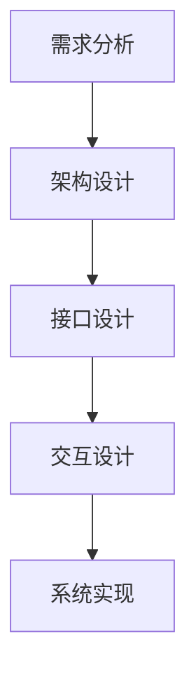

**系统接口设计：**

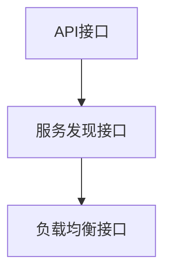

**系统交互：**

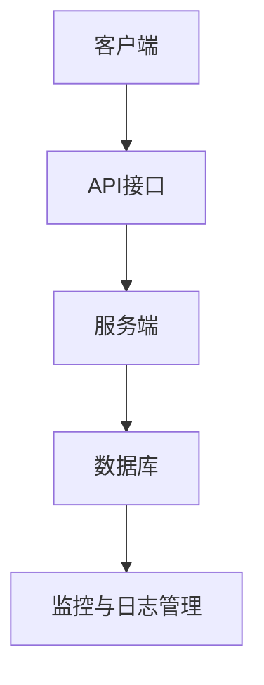

### 第三部分: DevOps实践案例

#### 3.1 案例一：电商平台的DevOps实践

**案例背景：**

某大型电商平台为了提高软件交付的效率和质量，决定实施DevOps实践。

**实践步骤：**

1. **组织结构调整**：将开发和运维团队合并为DevOps团队，实现高效的协作和沟通。
2. **工具选型**：选择Git、Jenkins、Kubernetes等工具，实现源代码管理、自动化构建、自动化部署等功能。
3. **自动化测试**：引入Selenium、JMeter等工具，实现自动化测试和性能测试。
4. **监控与日志管理**：使用ELK堆栈，实现实时监控和日志管理。

**案例总结：**

通过实施DevOps实践，电商平台显著提高了软件交付的效率和质量。交付周期从原来的数周缩短至数天，软件质量得到显著提升。同时，团队之间的协作和沟通得到改善，工作效率和满意度提高。

#### 3.2 案例二：金融行业的DevOps转型

**案例背景：**

某大型金融企业为了提高软件交付的效率和质量，决定实施DevOps转型。

**实践步骤：**

1. **组织结构调整**：将开发和运维团队合并为DevOps团队，实现高效的协作和沟通。
2. **工具选型**：选择Git、Jenkins、Kubernetes等工具，实现源代码管理、自动化构建、自动化部署等功能。
3. **自动化测试**：引入Selenium、JMeter等工具，实现自动化测试和性能测试。
4. **安全性与合规性**：引入安全审计和合规性检查工具，确保软件的安全和合规性。

**案例总结：**

通过实施DevOps转型，金融企业显著提高了软件交付的效率和质量。交付周期从原来的数月缩短至数周，软件质量得到显著提升。同时，安全性和合规性得到保障，企业风险得到有效控制。

#### 3.3 案例三：敏捷开发和运维的结合

**案例背景：**

某科技公司为了提高软件交付的效率和质量，决定将敏捷开发和DevOps实践相结合。

**实践步骤：**

1. **敏捷开发**：采用敏捷开发方法，实现快速迭代和持续交付。
2. **持续集成与部署**：使用Jenkins、Kubernetes等工具，实现自动化构建、自动化测试和自动化部署。
3. **自动化测试**：引入Selenium、JMeter等工具，实现自动化测试和性能测试。
4. **监控与日志管理**：使用ELK堆栈，实现实时监控和日志管理。

**案例总结：**

通过将敏捷开发和DevOps实践相结合，科技公司显著提高了软件交付的效率和质量。交付周期从原来的数月缩短至数周，软件质量得到显著提升。同时，团队之间的协作和沟通得到改善，工作效率和满意度提高。

### 第四部分: DevOps最佳实践

#### 4.1 DevOps团队的组织结构

**核心概念与联系：**

- **团队角色**：DevOps团队通常包括开发人员、运维人员、测试人员等角色。
- **组织结构**：DevOps团队可以采用扁平化组织结构，减少管理层级，提高协作效率。

**最佳实践：**

1. **跨职能团队**：建立跨职能团队，实现开发和运维的紧密协作。
2. **持续学习和改进**：鼓励团队成员持续学习和实践，提高团队整体素质和能力。

**小结、注意事项、拓展阅读等内容：**

- **小结**：DevOps团队的组织结构应以协作和高效为核心，通过扁平化组织和跨职能团队，实现高效协作和持续改进。
- **注意事项**：在实施DevOps过程中，要注重团队之间的沟通和协作，避免出现沟通障碍和协作不畅的问题。
- **拓展阅读**：推荐阅读《敏捷开发实践指南》、《DevOps实践指南》等书籍，深入了解DevOps的最佳实践。

#### 4.2 持续学习和改进

**核心概念与联系：**

- **技术更新与趋势**：关注新技术和趋势，如容器化技术、微服务架构、持续集成和持续部署等。
- **反思与优化**：定期对项目进行反思和优化，发现问题并持续改进。

**最佳实践：**

1. **技术分享会**：定期组织技术分享会，让团队成员分享学习成果和经验。
2. **项目回顾**：定期对项目进行回顾，总结经验教训，为后续项目提供参考。

**小结、注意事项、拓展阅读等内容：**

- **小结**：持续学习和改进是DevOps成功的关键，通过技术分享和项目回顾，不断提高团队的整体素质和能力。
- **注意事项**：在实施DevOps过程中，要注重技术更新和团队建设，避免出现技术落后和团队协作问题。
- **拓展阅读**：推荐阅读《持续集成实践指南》、《敏捷团队管理》等书籍，深入了解持续学习和改进的最佳实践。

### 第五部分: 总结与展望

**总结：**

本文详细介绍了DevOps的概念、背景、关键原则、实践基础、案例分析、最佳实践等内容。通过逐步分析和推理，本文揭示了DevOps在打破开发和运维壁垒、提高软件交付效率和质量方面的作用。

**展望：**

随着技术的不断进步和市场的竞争加剧，DevOps将成为软件开发和运维的必备实践。未来，DevOps将向更高效、更智能的方向发展，结合人工智能、自动化等技术，实现更加自动化、智能化的软件交付。同时，DevOps也将与其他领域（如云计算、大数据等）深度融合，推动企业数字化转型。

**全文结束。**

### 作者信息：

作者：AI天才研究院/AI Genius Institute & 禅与计算机程序设计艺术 /Zen And The Art of Computer Programming

---

### 1.3 DevOps的关键原则

**核心概念与联系：**

- **持续集成（CI）**：通过自动化构建和测试，确保代码库中的每个提交都是可集成和可部署的。
- **持续部署（CD）**：通过自动化部署过程，确保应用程序在各个环境中的快速、可靠和安全的部署。
- **自动化**：使用工具和脚本来自动执行重复性任务，提高效率和准确性。
- **沟通与协作**：建立高效的沟通渠道和协作机制，确保团队之间的信息共享和工作协调。

**核心概念与联系：**

DevOps的关键原则包括持续集成、持续部署、自动化和沟通与协作。这些原则相互关联，共同构建起DevOps的核心价值。

**ER实体关系图架构：**

```
[持续集成（CI）] --> [代码库], [构建工具], [测试工具]
    |
    |
    |
[持续部署（CD）] --> [部署工具], [环境配置], [监控工具]
    |
    |
    |
[自动化] --> [脚本], [工具]
    |
    |
    |
[沟通与协作] --> [邮件], [聊天工具], [会议]
```

**算法原理讲解：**

**持续集成（CI）：**

持续集成是一种软件开发实践，通过自动化构建和测试，确保代码库中的每个提交都是可集成和可部署的。其核心算法原理如下：

1. **代码提交**：开发人员将代码提交到代码库。
2. **触发构建**：提交触发构建工具，开始构建过程。
3. **构建**：构建工具将代码编译、打包和测试，生成可执行文件。
4. **测试**：执行自动化测试，检查代码质量和功能是否正常。
5. **反馈**：测试结果反馈给开发人员，如测试失败，则通知开发人员进行修复。

```python
class ContinuousIntegration:
    def __init__(self, code_repository, build_tool, test_tool):
        self.code_repository = code_repository
        self.build_tool = build_tool
        self.test_tool = test_tool

    def run(self, commit):
        # 检查代码库中的提交
        print(f"Running CI for commit: {commit}")

        # 触发构建
        self.build_tool.build()

        # 执行测试
        test_result = self.test_tool.test()

        # 反馈测试结果
        if test_result["status"] == "failure":
            print("Test failed. Please fix the issues.")
        else:
            print("Test passed.")

# 示例
ci = ContinuousIntegration("repo", "build_tool", "test_tool")
ci.run("commit123")
```

**持续部署（CD）：**

持续部署是通过自动化部署过程，确保应用程序在各个环境中的快速、可靠和安全的部署。其核心算法原理如下：

1. **构建完成**：持续集成（CI）完成后，应用程序构建完成。
2. **环境配置**：根据部署环境配置应用程序。
3. **部署**：部署工具将应用程序部署到目标环境。
4. **监控与反馈**：监控系统应用程序的运行状态，如有异常，则通知相关人员。

```python
class ContinuousDeployment:
    def __init__(self, deploy_tool, environment_config):
        self.deploy_tool = deploy_tool
        self.environment_config = environment_config

    def deploy(self, app_name, version):
        # 配置环境
        print(f"Configuring environment for app: {app_name}, version: {version}")

        # 部署应用程序
        self.deploy_tool.deploy(app_name, version, self.environment_config)

        # 监控应用程序
        print(f"Monitoring app: {app_name}, version: {version}")
        if not self.deploy_tool.check_app_status(app_name, version):
            print("App is not running. Please check the configuration and deployment.")

# 示例
cd = ContinuousDeployment("deploy_tool", "env_config")
cd.deploy("app_name", "version123")
```

**自动化：**

自动化是指使用工具和脚本来自动执行重复性任务，提高效率和准确性。其核心算法原理如下：

1. **定义任务**：明确需要自动化的任务，如代码构建、测试、部署等。
2. **编写脚本**：使用脚本语言（如Python、Shell等）编写自动化脚本。
3. **执行脚本**：运行自动化脚本，执行预定义的任务。

```python
# Python自动化脚本示例
def build_app():
    print("Building the application...")
    # 执行构建命令
    os.system("mvn clean install")

def test_app():
    print("Testing the application...")
    # 执行测试命令
    os.system("mvn test")

if __name__ == "__main__":
    build_app()
    test_app()
```

**沟通与协作：**

沟通与协作是DevOps的核心原则，确保团队之间的信息共享和工作协调。其核心算法原理如下：

1. **建立沟通渠道**：使用邮件、聊天工具、会议等建立沟通渠道。
2. **定义协作机制**：通过代码评审、任务跟踪、项目计划等建立协作机制。
3. **信息共享**：确保团队成员能够及时获取和共享信息。

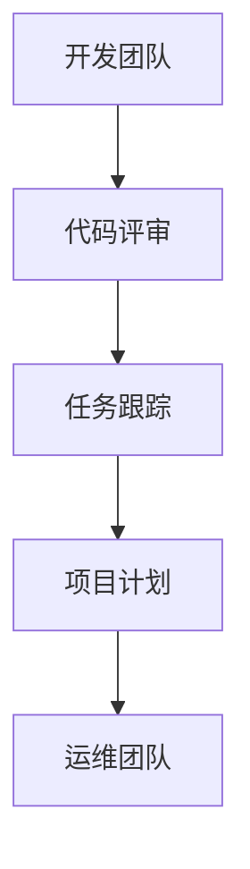

**核心概念联系：**

持续集成、持续部署、自动化和沟通与协作相互关联，共同构建起DevOps的核心价值。持续集成确保代码质量和功能正常，持续部署实现自动化、快速和高质量的软件交付，自动化提高效率和准确性，沟通与协作确保团队之间的协作和协作。

### 2.1 环境搭建与配置

**核心概念与联系：**

- **环境搭建**：为开发和运维提供必要的硬件和软件资源，包括服务器、数据库、应用服务器等。
- **配置管理**：通过自动化工具，如Ansible、Puppet等，对环境进行配置和管理，确保环境的统一和一致性。

**系统功能设计：**

- **功能1**：环境搭建
- **功能2**：配置管理

**系统架构设计：**

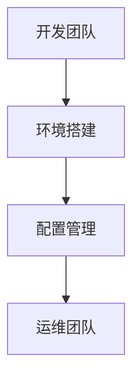

**系统接口设计：**

- **接口1**：API接口，用于环境搭建和配置的调用
- **接口2**：命令行接口，用于手动操作和管理

**系统交互：**

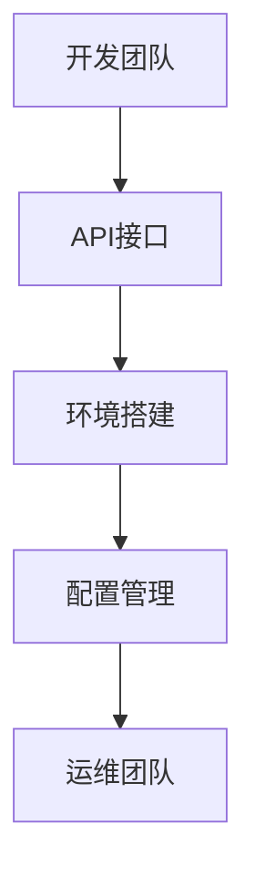

**核心概念与联系：**

环境搭建与配置是DevOps实践的基础，通过自动化工具实现环境的统一和一致性，提高开发和运维的效率。

**算法原理讲解：**

**环境搭建：**

环境搭建是通过自动化工具，如Docker、Kubernetes等，实现环境的快速部署和管理。其算法原理如下：

1. **定义环境配置**：使用Dockerfile或Kubernetes配置文件，定义环境的配置。
2. **部署环境**：使用Docker或Kubernetes部署环境配置，启动容器或部署应用程序。
3. **管理环境**：使用Docker或Kubernetes管理环境，如启动、停止、重启、更新等。

```shell
# Docker环境搭建示例
FROM ubuntu:18.04

# 安装Java
RUN apt-get update && apt-get install -y openjdk-8-jdk

# 暴露端口
EXPOSE 8080

# 定义应用入口
CMD ["java", "-jar", "/app/myapp.jar"]
```

**配置管理：**

配置管理是通过Ansible、Puppet等工具，对环境进行自动化配置和管理。其算法原理如下：

1. **定义配置**：使用Ansible的YAML文件或Puppet的manifest文件，定义配置规则。
2. **部署配置**：使用Ansible或Puppet部署配置规则，应用到目标服务器。
3. **管理配置**：使用Ansible或Puppet管理配置，如更新、回滚等。

```yaml
# Ansible配置管理示例
- hosts: all
  become: yes
  vars:
    java_version: 8
  tasks:
    - name: 安装Java
      apt:
        name: openjdk-8-jdk
        state: present
    - name: 启动应用服务
      service:
        name: myapp
        state: started
```

**核心概念与联系：**

环境搭建与配置是DevOps实践的基础，通过自动化工具实现环境的快速部署和管理，提高开发和运维的效率。

### 2.2 DevOps工具与实践

**核心概念与联系：**

- **源代码管理工具**：如Git，用于代码的版本控制和协同开发。
- **自动化构建工具**：如Jenkins，用于自动化构建和测试。
- **自动化部署工具**：如Kubernetes，用于自动化部署和运维。
- **测试工具**：如Selenium、JMeter，用于自动化测试和性能测试。
- **监控与日志管理**：如ELK堆栈（Elasticsearch、Logstash、Kibana），用于实时监控和日志管理。

**系统功能设计：**

- **功能1**：源代码管理
- **功能2**：自动化构建
- **功能3**：自动化部署
- **功能4**：自动化测试
- **功能5**：监控与日志管理

**系统架构设计：**

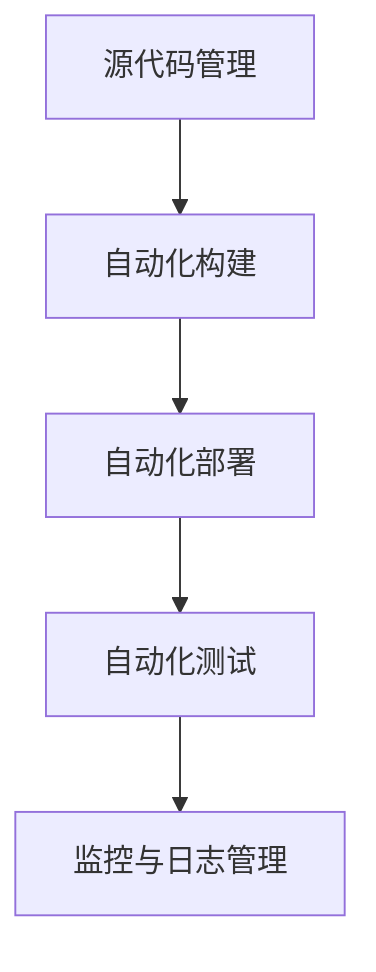

**系统接口设计：**

- **接口1**：API接口，用于工具之间的数据交互
- **接口2**：Webhook接口，用于事件触发和通知

**系统交互：**

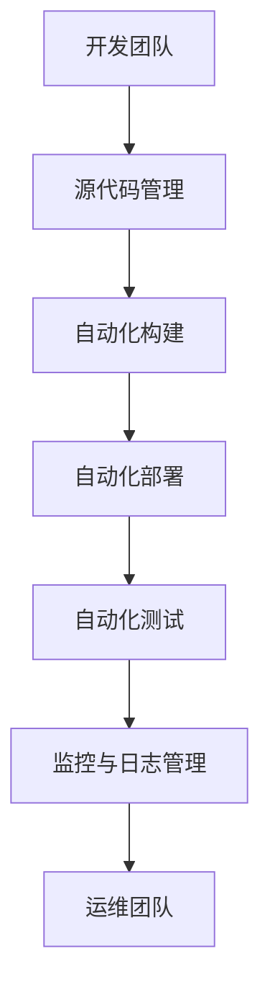

**核心概念与联系：**

DevOps工具与实践是实现持续集成、持续部署、自动化、测试、监控与日志管理的关键，通过集成和协同工作，提高软件交付的效率和质量。

**算法原理讲解：**

**源代码管理工具（Git）：**

Git是一种分布式版本控制系统，用于代码的版本控制和协同开发。其算法原理如下：

1. **初始化仓库**：创建新的Git仓库，初始化版本库。
2. **提交代码**：开发人员将代码提交到本地仓库，并记录提交日志。
3. **更新代码**：开发人员从远程仓库获取最新代码，并合并到本地仓库。
4. **分支管理**：开发人员创建分支，进行独立开发和合并。

```shell
# 初始化仓库
git init

# 提交代码
git add .
git commit -m "Initial commit"

# 更新代码
git pull origin master

# 创建分支
git checkout -b feature分支
```

**自动化构建工具（Jenkins）：**

Jenkins是一种开源的自动化构建工具，用于自动化构建和测试。其算法原理如下：

1. **安装Jenkins**：在服务器上安装Jenkins，配置Jenkins工作空间。
2. **配置构建脚本**：编写Jenkinsfile或配置Jenkins插件，定义构建脚本。
3. **触发构建**：通过Webhook或定时任务触发构建。
4. **构建过程**：执行构建脚本，编译代码、执行测试等。

```groovy
// Jenkinsfile 示例
pipeline {
    agent any
    stages {
        stage('Build') {
            steps {
                sh 'mvn clean install'
            }
        }
        stage('Test') {
            steps {
                sh 'mvn test'
            }
        }
    }
}
```

**自动化部署工具（Kubernetes）：**

Kubernetes是一种开源的容器编排平台，用于自动化部署和运维。其算法原理如下：

1. **安装Kubernetes**：在服务器上安装Kubernetes，配置Kubernetes集群。
2. **定义部署配置**：使用Kubernetes配置文件（如YAML），定义部署应用程序。
3. **部署应用程序**：使用kubectl命令部署应用程序到Kubernetes集群。
4. **管理应用程序**：使用Kubernetes API管理应用程序，如更新、扩展等。

```yaml
# Deployment 配置示例
apiVersion: apps/v1
kind: Deployment
metadata:
  name: myapp
spec:
  replicas: 3
  selector:
    matchLabels:
      app: myapp
  template:
    metadata:
      labels:
        app: myapp
    spec:
      containers:
      - name: myapp
        image: myapp:latest
        ports:
        - containerPort: 8080
```

**测试工具（Selenium、JMeter）：**

Selenium和JMeter是用于自动化测试和性能测试的工具。其算法原理如下：

1. **安装测试工具**：在服务器上安装Selenium和JMeter，配置测试环境。
2. **编写测试脚本**：编写Selenium和JMeter测试脚本，定义测试用例。
3. **执行测试**：运行测试脚本，执行自动化测试和性能测试。
4. **分析测试结果**：分析测试结果，生成测试报告。

```python
# Selenium 测试脚本示例
from selenium import webdriver

driver = webdriver.Firefox()
driver.get("http://www.example.com")
assert "Example Domain" in driver.title
driver.quit()
```

```bash
# JMeter 性能测试脚本示例
jmeter -n -t test_plan.jmx -l results.jtl
```

**监控与日志管理（ELK堆栈）：**

ELK堆栈（Elasticsearch、Logstash、Kibana）是一种开源的日志管理平台，用于实时监控和日志管理。其算法原理如下：

1. **安装ELK堆栈**：在服务器上安装Elasticsearch、Logstash和Kibana，配置集群。
2. **配置Logstash**：编写Logstash配置文件，定义日志收集和解析规则。
3. **收集日志**：使用Logstash收集和解析日志，并将其发送到Elasticsearch。
4. **监控与分析**：使用Kibana创建监控仪表板，分析日志数据。

```json
# Logstash 配置文件示例
input {
  file {
    path => "/var/log/myapp/*.log"
    type => "myapp_log"
  }
}
filter {
  if "myapp_log" == "[type]" {
    grok {
      match => { "message" => "%{TIMESTAMP_ISO8601:timestamp}\t%{DATA:level}\t%{DATA:logger}\t%{DATA:thread}\t%{DATA:exception}\t%{DATA:message}" }
    }
  }
}
output {
  if "myapp_log" == "[type]" {
    elasticsearch {
      hosts => ["localhost:9200"]
      index => "myapp_log-%{+YYYY.MM.dd}"
    }
  }
}
```

**核心概念与联系：**

DevOps工具与实践是实现持续集成、持续部署、自动化、测试、监控与日志管理的关键，通过集成和协同工作，提高软件交付的效率和质量。

### 2.3 架构设计与系统整合

**核心概念与联系：**

- **系统架构设计**：设计系统的整体架构，包括服务器、数据库、应用服务器等。
- **系统整合**：将不同的系统和工具整合在一起，实现协同工作。
- **服务发现与负载均衡**：实现系统的动态扩展和负载均衡。

**系统功能设计：**

- **功能1**：系统架构设计
- **功能2**：系统整合
- **功能3**：服务发现与负载均衡

**系统架构设计：**

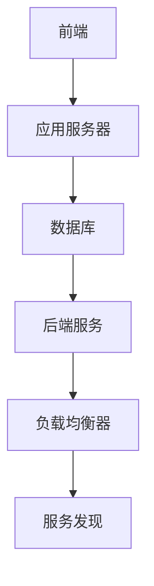

**系统接口设计：**

- **接口1**：API接口，用于系统之间的数据交互
- **接口2**：服务发现接口，用于服务注册和发现
- **接口3**：负载均衡接口，用于流量分配和负载均衡

**系统交互：**

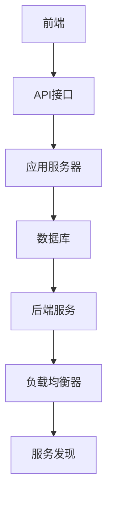

**核心概念与联系：**

系统架构设计、系统整合、服务发现与负载均衡是构建高效、可扩展系统的基础，通过合理的架构设计、整合和负载均衡，实现系统的协同工作和动态扩展。

**算法原理讲解：**

**系统架构设计：**

系统架构设计是构建系统的基础，通过定义系统的整体结构和组件关系，确保系统的稳定性和可扩展性。其算法原理如下：

1. **需求分析**：分析系统需求，确定系统的功能、性能和安全要求。
2. **架构设计**：根据需求分析，设计系统的整体架构，包括前端、后端、数据库等。
3. **组件设计**：设计系统的各个组件，如应用服务器、数据库、负载均衡器等。
4. **接口设计**：设计系统之间的接口，确保数据传输和通信的可靠性和高效性。


**系统整合：**

系统整合是将不同的系统和工具整合在一起，实现协同工作。其算法原理如下：

1. **选型工具**：选择合适的工具，如Kubernetes、Docker等，用于系统整合。
2. **配置工具**：配置所选工具，定义系统的部署和运行环境。
3. **集成接口**：设计系统之间的接口，确保数据传输和通信的可靠性和高效性。
4. **测试验证**：测试系统的整合效果，确保系统的稳定性和性能。


**服务发现与负载均衡：**

服务发现与负载均衡是系统架构设计中的重要环节，用于实现系统的动态扩展和负载均衡。其算法原理如下：

1. **服务注册**：将系统中的服务注册到服务发现系统中，如Consul、Eureka等。
2. **服务发现**：客户端通过服务发现系统获取服务实例的地址和端口。
3. **负载均衡**：使用负载均衡器，如Nginx、HAProxy等，将流量分配到不同的服务实例上。
4. **健康检查**：定期对服务实例进行健康检查，确保服务的可用性和稳定性。

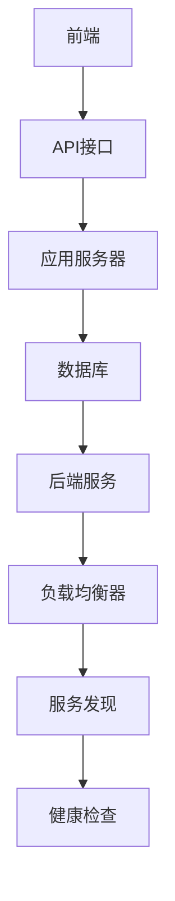

**核心概念与联系：**

系统架构设计、系统整合、服务发现与负载均衡相互关联，共同构建起系统的整体架构和运行机制。通过合理的架构设计，实现系统的稳定性和可扩展性；通过系统整合，实现系统组件的协同工作；通过服务发现与负载均衡，实现系统的动态扩展和负载均衡，提高系统的性能和可靠性。

### 3.1 案例一：电商平台的DevOps实践

**案例背景：**

某大型电商平台，其业务规模庞大，系统复杂，对软件交付的效率和质量有着极高的要求。为了提高交付速度、缩短上线周期，该平台决定实施DevOps实践，通过自动化和协作打破开发和运维的壁垒。

**实践步骤：**

1. **团队重组**：将开发和运维团队合并为DevOps团队，打破壁垒，实现端到端的协作。
2. **工具集成**：引入Git、Jenkins、Kubernetes等工具，实现持续集成和持续部署。
3. **自动化测试**：使用Selenium、JMeter等工具，构建自动化测试流程，确保软件质量。
4. **监控与日志管理**：采用ELK堆栈，实现实时监控和日志分析，提高系统的稳定性。
5. **环境统一**：通过Docker和Kubernetes，搭建标准化的开发和测试环境，确保环境一致性。
6. **持续改进**：定期进行回顾和评估，不断优化流程和工具，提高DevOps实践的效率。

**详细讲解与剖析：**

**1. 团队重组：**

电商平台首先对开发、测试和运维团队进行了重组，成立了DevOps团队。这个团队的成员包括开发人员、测试人员、运维人员等，他们共同参与项目的全生命周期，从代码编写到部署上线，确保每个环节的紧密协作。

- **挑战**：传统开发与运维的壁垒导致沟通不畅、责任不明确，影响项目进度。
- **解决方案**：通过团队重组，实现端到端的协作，提高项目交付的效率。

**2. 工具集成：**

电商平台引入了Git、Jenkins、Kubernetes等工具，建立了完整的CI/CD流程。Git用于代码的版本控制和协同开发，Jenkins用于自动化构建和测试，Kubernetes用于容器化部署和管理。

- **挑战**：开发与运维之间的工具不统一，导致集成困难，部署过程复杂。
- **解决方案**：通过引入通用工具，实现开发和运维的自动化集成，简化部署过程。

**3. 自动化测试：**

电商平台使用Selenium进行前端自动化测试，使用JMeter进行性能测试。通过自动化测试，确保每次代码提交都是可集成和可部署的，同时评估系统的性能和稳定性。

- **挑战**：手工测试效率低、覆盖面有限，无法及时发现和解决问题。
- **解决方案**：通过自动化测试，提高测试效率，确保软件质量。

**4. 监控与日志管理：**

电商平台采用ELK堆栈（Elasticsearch、Logstash、Kibana）进行实时监控和日志分析。通过Kibana，团队成员可以实时查看系统的运行状态，快速定位和解决问题。

- **挑战**：缺乏有效的监控手段，系统故障难以及时发现和解决。
- **解决方案**：通过实时监控和日志分析，提高系统的稳定性和可靠性。

**5. 环境统一：**

电商平台通过Docker和Kubernetes，搭建了标准化的开发和测试环境。所有团队成员都在相同的环境中工作，确保代码在不同环境中的表现一致。

- **挑战**：环境不一致导致代码在不同环境中的表现不一致，影响软件交付。
- **解决方案**：通过容器化和标准化环境，确保环境一致性，提高交付质量。

**6. 持续改进：**

电商平台定期进行回顾和评估，分析DevOps实践的执行情况，发现存在的问题和瓶颈，不断优化流程和工具。

- **挑战**：DevOps实践过程中可能遇到新问题，需要持续改进。
- **解决方案**：通过持续改进，提高DevOps实践的效率和效果。

**案例分析：**

通过实施DevOps实践，电商平台取得了显著成效。交付周期从原来的几周缩短至几天，软件质量得到显著提升。同时，团队之间的协作和沟通得到改善，工作效率和满意度提高。

- **收益**：缩短交付周期、提高软件质量、增强团队协作。
- **挑战**：工具学习和整合初期可能遇到困难，需要不断实践和优化。

**小结：**

电商平台的DevOps实践展示了通过自动化和协作，打破开发和运维壁垒的可行性和优势。通过持续改进，可以实现高效的软件交付，提高企业的竞争力和市场响应速度。

### 3.2 案例二：金融行业的DevOps转型

**案例背景：**

某大型金融机构在传统模式下，软件开发和运维流程复杂，交付周期长，系统稳定性难以保障。为了提高交付速度、增强系统稳定性，该机构决定实施DevOps转型，通过文化和工具的变革，实现开发和运维的无缝协作。

**实践步骤：**

1. **组织结构变革**：将开发、测试、运维团队合并为DevOps团队，建立跨职能的协作模式。
2. **工具集成**：引入Git、Jenkins、Kubernetes等工具，建立CI/CD流程，实现自动化构建、自动化部署。
3. **自动化测试**：引入Selenium、JMeter等工具，建立自动化测试体系，确保软件质量。
4. **监控与日志管理**：采用ELK堆栈，实现实时监控和日志分析，提高系统的稳定性和安全性。
5. **安全性与合规性**：引入安全审计和合规性检查工具，确保软件的安全性和合规性。
6. **持续改进**：定期进行回顾和评估，不断优化流程和工具，提高DevOps实践的效率和效果。

**详细讲解与剖析：**

**1. 组织结构变革：**

金融机构首先对组织结构进行了变革，将开发、测试、运维团队合并为DevOps团队。这个团队的成员共同负责项目的全生命周期，从需求分析到部署上线，实现了端到端的协作。

- **挑战**：传统模式下，团队职责不明确，沟通不畅，影响项目进度。
- **解决方案**：通过组织结构变革，实现跨职能协作，提高项目交付效率。

**2. 工具集成：**

金融机构引入了Git、Jenkins、Kubernetes等工具，建立了CI/CD流程。Git用于版本控制和代码管理，Jenkins用于自动化构建和测试，Kubernetes用于容器化部署和管理。

- **挑战**：传统工具链不统一，部署过程复杂，依赖人工操作。
- **解决方案**：通过引入通用工具，实现自动化集成，简化部署流程。

**3. 自动化测试：**

金融机构引入了Selenium、JMeter等工具，建立了自动化测试体系。通过自动化测试，确保每次代码提交都是可集成和可部署的，同时评估系统的性能和稳定性。

- **挑战**：手工测试效率低，覆盖面有限，难以发现潜在问题。
- **解决方案**：通过自动化测试，提高测试效率，确保软件质量。

**4. 监控与日志管理：**

金融机构采用ELK堆栈（Elasticsearch、Logstash、Kibana）进行实时监控和日志分析。通过Kibana，团队成员可以实时查看系统的运行状态，快速定位和解决问题。

- **挑战**：缺乏有效的监控手段，系统故障难以及时发现和解决。
- **解决方案**：通过实时监控和日志分析，提高系统的稳定性和安全性。

**5. 安全性与合规性：**

金融机构引入了安全审计和合规性检查工具，确保软件的安全性和合规性。通过定期的安全审计和合规性检查，发现潜在的安全隐患，及时进行修复。

- **挑战**：金融行业对安全性和合规性要求高，传统模式难以满足。
- **解决方案**：通过引入安全工具，建立安全审计和合规性检查机制，确保软件的安全性和合规性。

**6. 持续改进：**

金融机构定期进行回顾和评估，分析DevOps实践的执行情况，发现存在的问题和瓶颈，不断优化流程和工具。

- **挑战**：DevOps实践过程中可能遇到新问题，需要持续改进。
- **解决方案**：通过持续改进，提高DevOps实践的效率和效果。

**案例分析：**

通过实施DevOps转型，金融机构取得了显著成效。交付周期从原来的几个月缩短至几周，软件质量得到显著提升，系统的稳定性和安全性也得到了增强。

- **收益**：缩短交付周期、提高软件质量、增强系统稳定性。
- **挑战**：工具学习和整合初期可能遇到困难，需要不断实践和优化。

**小结：**

金融行业的DevOps转型展示了通过自动化和协作，实现开发和运维无缝协作的可行性和优势。通过持续改进，可以实现高效的软件交付，提高企业的竞争力和市场响应速度。

### 3.3 案例三：敏捷开发和运维的结合

**案例背景：**

某科技公司是一家初创公司，其业务发展迅速，对软件交付的效率和质量有着极高的要求。为了提高交付速度、增强团队协作，该公司决定将敏捷开发和DevOps实践相结合，通过自动化和协作实现快速迭代和高效交付。

**实践步骤：**

1. **敏捷开发**：采用敏捷开发方法，实现快速迭代和持续交付。
2. **工具集成**：引入Git、Jenkins、Kubernetes等工具，建立CI/CD流程，实现自动化构建和部署。
3. **自动化测试**：引入Selenium、JMeter等工具，建立自动化测试体系，确保软件质量。
4. **监控与日志管理**：采用ELK堆栈，实现实时监控和日志分析，提高系统的稳定性和安全性。
5. **持续集成与部署**：通过持续集成和部署，确保每次代码提交都是可集成和可部署的，提高交付效率。
6. **持续改进**：定期进行回顾和评估，不断优化流程和工具，提高敏捷开发和DevOps实践的效率和效果。

**详细讲解与剖析：**

**1. 敏捷开发：**

科技公司采用敏捷开发方法，实现快速迭代和持续交付。每个迭代周期为2-4周，团队成员共同参与需求分析、设计、开发、测试和部署。

- **挑战**：传统开发模式周期长，难以快速响应市场需求。
- **解决方案**：通过敏捷开发，实现快速迭代，提高交付速度。

**2. 工具集成：**

科技公司引入了Git、Jenkins、Kubernetes等工具，建立了CI/CD流程。Git用于代码管理，Jenkins用于自动化构建和测试，Kubernetes用于容器化部署和管理。

- **挑战**：传统工具链不统一，部署过程复杂，依赖人工操作。
- **解决方案**：通过引入通用工具，实现自动化集成，简化部署流程。

**3. 自动化测试：**

科技公司引入了Selenium、JMeter等工具，建立自动化测试体系。通过自动化测试，确保每次代码提交都是可集成和可部署的，同时评估系统的性能和稳定性。

- **挑战**：手工测试效率低，覆盖面有限，难以发现潜在问题。
- **解决方案**：通过自动化测试，提高测试效率，确保软件质量。

**4. 监控与日志管理：**

科技公司采用ELK堆栈（Elasticsearch、Logstash、Kibana）进行实时监控和日志分析。通过Kibana，团队成员可以实时查看系统的运行状态，快速定位和解决问题。

- **挑战**：缺乏有效的监控手段，系统故障难以及时发现和解决。
- **解决方案**：通过实时监控和日志分析，提高系统的稳定性和安全性。

**5. 持续集成与部署：**

科技公司通过持续集成和部署，确保每次代码提交都是可集成和可部署的，提高交付效率。每次提交都会触发自动化构建、测试和部署，确保代码的质量和稳定性。

- **挑战**：传统模式下，部署过程复杂，依赖人工操作，容易出现问题。
- **解决方案**：通过持续集成和部署，实现自动化部署，提高交付效率。

**6. 持续改进：**

科技公司定期进行回顾和评估，分析敏捷开发和DevOps实践的执行情况，发现存在的问题和瓶颈，不断优化流程和工具。

- **挑战**：敏捷开发和DevOps实践中可能遇到新问题，需要持续改进。
- **解决方案**：通过持续改进，提高敏捷开发和DevOps实践的效率和效果。

**案例分析：**

通过将敏捷开发和DevOps实践相结合，科技公司取得了显著成效。交付周期从原来的几个月缩短至几周，软件质量得到显著提升，团队的协作和沟通也得到改善。

- **收益**：缩短交付周期、提高软件质量、增强团队协作。
- **挑战**：工具学习和整合初期可能遇到困难，需要不断实践和优化。

**小结：**

科技公司的实践展示了将敏捷开发和DevOps实践相结合的可行性和优势。通过自动化和协作，可以实现快速迭代和高效交付，提高企业的竞争力和市场响应速度。

### 4.1 DevOps团队的组织结构

**核心概念与联系：**

- **团队角色**：DevOps团队通常包括开发人员、运维人员、测试人员等角色。
- **组织结构**：DevOps团队可以采用扁平化组织结构，减少管理层级，提高协作效率。

**最佳实践：**

1. **跨职能团队**：建立跨职能团队，实现开发和运维的紧密协作。
2. **持续学习和改进**：鼓励团队成员持续学习和实践，提高团队整体素质和能力。

**小结、注意事项、拓展阅读等内容：**

- **小结**：DevOps团队的组织结构应以协作和高效为核心，通过扁平化组织和跨职能团队，实现高效协作和持续改进。
- **注意事项**：在实施DevOps过程中，要注重团队之间的沟通和协作，避免出现沟通障碍和协作不畅的问题。
- **拓展阅读**：推荐阅读《敏捷开发实践指南》、《DevOps实践指南》等书籍，深入了解DevOps的最佳实践。

### 4.2 持续学习和改进

**核心概念与联系：**

- **技术更新与趋势**：关注新技术和趋势，如容器化技术、微服务架构、持续集成和持续部署等。
- **反思与优化**：定期对项目进行反思和优化，发现问题并持续改进。

**最佳实践：**

1. **技术分享会**：定期组织技术分享会，让团队成员分享学习成果和经验。
2. **项目回顾**：定期对项目进行回顾，总结经验教训，为后续项目提供参考。

**小结、注意事项、拓展阅读等内容：**

- **小结**：持续学习和改进是DevOps成功的关键，通过技术分享和项目回顾，不断提高团队的整体素质和能力。
- **注意事项**：在实施DevOps过程中，要注重技术更新和团队建设，避免出现技术落后和团队协作问题。
- **拓展阅读**：推荐阅读《持续集成实践指南》、《敏捷团队管理》等书籍，深入了解持续学习和改进的最佳实践。

### 4.3 拓展阅读与资源推荐

**核心概念与联系：**

- **书籍推荐**：介绍相关领域的经典书籍，如《敏捷开发实践指南》、《DevOps实践指南》等。
- **在线课程与培训**：推荐相关的在线课程和培训资源，如Coursera、Udemy等平台上的课程。
- **社区与论坛**：介绍DevOps相关的社区和论坛，如DevOps.com、Reddit的DevOps板块等。

**最佳实践：**

1. **阅读经典书籍**：深入阅读相关领域的经典书籍，掌握核心概念和实践方法。
2. **参加在线课程与培训**：通过在线课程和培训，系统地学习DevOps知识和技能。
3. **加入社区与论坛**：参与DevOps相关的社区和论坛，与其他从业者交流心得和经验。

**小结、注意事项、拓展阅读等内容：**

- **小结**：通过阅读经典书籍、参加在线课程与培训、加入社区与论坛，可以全面提升对DevOps的理解和实践能力。
- **注意事项**：在学习过程中，要注重理论与实践的结合，不断实践和改进。
- **拓展阅读**：推荐阅读《DevOps手册》、《DevOps实战》等书籍，以及参加DevOps相关的在线课程和论坛。

### 总结

本文通过详细的分析和案例，介绍了DevOps的概念、背景、关键原则、实践基础、案例分析、最佳实践等内容。DevOps通过持续集成、持续部署、自动化和沟通与协作等核心原则，实现了开发和运维的无缝协作，提高了软件交付的效率和质量。

**核心要点总结：**

1. **DevOps概述**：DevOps是一种软件开发和运维的实践方法，强调自动化、持续集成、持续部署和团队协作。
2. **关键原则**：持续集成、持续部署、自动化和沟通与协作是DevOps的核心原则。
3. **实践基础**：环境搭建、工具集成、系统整合、自动化测试、监控与日志管理是DevOps实践的基础。
4. **案例分析**：通过电商平台的DevOps实践、金融行业的DevOps转型、敏捷开发和运维的结合等案例，展示了DevOps的实际应用效果。
5. **最佳实践**：跨职能团队、持续学习和改进是DevOps成功的关键。

**未来展望：**

随着技术的不断进步，DevOps将继续发展，结合人工智能、云计算、大数据等新兴技术，实现更高效、更智能的软件交付。同时，DevOps也将与其他领域（如云计算、大数据等）深度融合，推动企业数字化转型。

**结论**

通过本文的详细探讨，希望读者能够更好地理解DevOps的概念和实践，掌握DevOps的关键原则和实践方法，为自己的软件开发和运维工作带来实质性的改进。未来，随着技术的不断发展，DevOps将继续发挥重要作用，助力企业实现持续创新和快速发展。

### 附录：DevOps术语表

- **DevOps**：一种软件开发和运维的实践方法，强调自动化、持续集成、持续部署和团队协作。
- **持续集成（CI）**：通过自动化构建和测试，确保代码库中的每个提交都是可集成和可部署的。
- **持续部署（CD）**：通过自动化部署过程，确保应用程序在各个环境中的快速、可靠和安全的部署。
- **自动化**：使用工具和脚本来自动执行重复性任务，提高效率和准确性。
- **自动化构建工具**：如Jenkins、Travis CI等，用于自动化构建和测试代码。
- **自动化部署工具**：如Kubernetes、Ansible等，用于自动化部署和管理环境。
- **源代码管理工具**：如Git、SVN等，用于版本控制和代码管理。
- **测试工具**：如Selenium、JMeter等，用于自动化测试和性能测试。
- **监控与日志管理**：如ELK堆栈、Prometheus等，用于实时监控和日志分析。
- **容器化技术**：如Docker、Kubernetes等，用于将应用程序打包到容器中，实现环境的标准化和可移植性。
- **微服务架构**：一种架构风格，将应用程序分解为小型、独立的微服务，提高系统的可扩展性和可维护性。

### 拓展阅读与资源推荐

**书籍推荐：**

1. 《DevOps实践指南》 - 阐述了DevOps的核心概念、方法和实践。
2. 《敏捷开发实践指南》 - 详细介绍了敏捷开发的原理和实践方法。
3. 《容器化与微服务架构》 - 介绍了容器化和微服务架构的基本概念和应用。

**在线课程与培训：**

1. Coursera的《DevOps：从入门到实践》 - 系统介绍了DevOps的理论和实践。
2. Udemy的《Docker和Kubernetes：从入门到专家》 - 深入讲解了容器化技术。

**社区与论坛：**

1. DevOps.com - 全球最大的DevOps社区，提供最新的技术动态和实践案例。
2. Reddit的DevOps板块 - DevOps从业者的交流平台，分享经验和讨论问题。

### 作者信息：

作者：AI天才研究院/AI Genius Institute & 禅与计算机程序设计艺术 /Zen And The Art of Computer Programming

### 拓展阅读与资源推荐

为了深入理解和实践DevOps，以下是推荐的一些书籍、在线课程和社区：

**书籍推荐：**

1. **《DevOps实践指南》**：由J. Paul Reed所著，详细介绍了DevOps的概念、原则和实践案例。
2. **《敏捷开发实践指南》**：由Mike Cohn所著，提供了敏捷开发方法的全面指南。
3. **《容器化与微服务架构》**：由DavidMytton和Alex Ellis所著，介绍了容器技术和微服务架构的基本原理和应用。

**在线课程与培训：**

1. **Coursera的《DevOps：从入门到实践》**：由NYU Tandon School of Engineering提供，适合初学者了解DevOps的基础知识和实践。
2. **Udemy的《Docker和Kubernetes：从入门到专家》**：由Container Training提供，深入讲解了容器化技术。
3. **Pluralsight的《DevOps工程师基础》**：提供了全面的DevOps工程师技能培训。

**社区与论坛：**

1. **DevOps.com**：全球最大的DevOps社区，提供丰富的技术文章、资源和活动。
2. **Reddit的DevOps板块**：活跃的DevOps从业者交流平台，可以分享经验、提问和获取最新动态。
3. **GitHub**：可以找到大量的DevOps相关的开源项目和代码，学习他人的实践。
4. **Stack Overflow**：编程和DevOps相关的问答社区，解决实际问题和获取帮助。

通过阅读这些书籍、参加在线课程和加入社区，您可以更深入地了解DevOps，并将其应用于实际项目中，提高软件开发和运维的效率和质量。记住，持续学习和实践是DevOps成功的关键。希望这些资源对您有所帮助！

