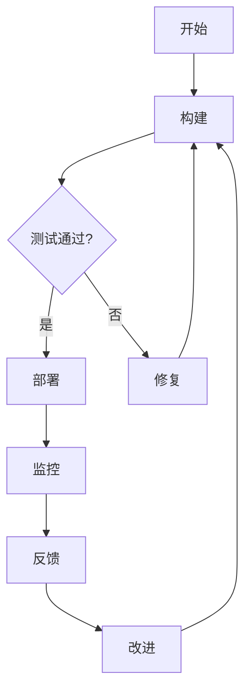
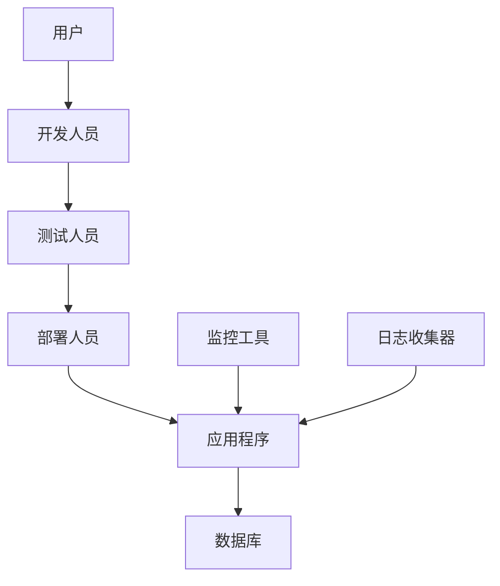
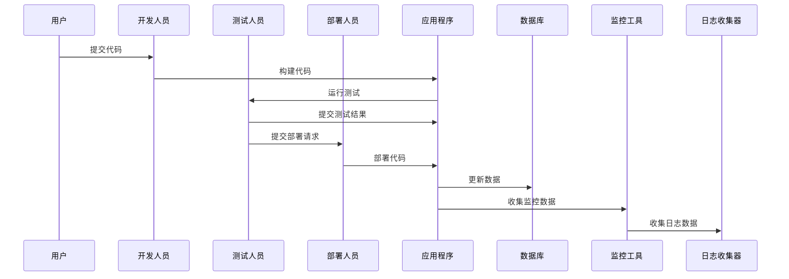

                 

**文章标题：** DevOps 文化建设与工具链

**关键词：** DevOps、文化建设、工具链、持续集成、持续部署、自动化

**摘要：** 本文将深入探讨 DevOps 文化的建设与工具链的实施。首先，我们将介绍 DevOps 的基本概念和核心原则，接着分析在组织中建立 DevOps 文化所需的转变和策略。随后，我们将介绍 DevOps 的主要工具和技术，以及如何构建一个高效的 DevOps 工具链。文章还将探讨 DevOps 在不同环境中的实施方法，并分享 CI/CD、监控和反馈循环、安全与合规等关键领域的实践。最后，我们将展望 DevOps 的未来发展趋势，并给出相关建议。

----------------------------------------------------------------

# DevOps 文化建设与工具链

> 关键词：DevOps、文化建设、工具链、持续集成、持续部署、自动化

> 摘要：本文将深入探讨 DevOps 的文化建设与工具链的实施。首先，我们将介绍 DevOps 的基本概念和核心原则，接着分析在组织中建立 DevOps 文化所需的转变和策略。随后，我们将介绍 DevOps 的主要工具和技术，以及如何构建一个高效的 DevOps 工具链。文章还将探讨 DevOps 在不同环境中的实施方法，并分享 CI/CD、监控和反馈循环、安全与合规等关键领域的实践。最后，我们将展望 DevOps 的未来发展趋势，并给出相关建议。

----------------------------------------------------------------

## 引言

### DevOps 的概念与起源

DevOps 是一种软件开发和运维的实践方法，旨在通过加强开发和运维团队之间的协作，提高软件交付的效率和质量。DevOps 的核心理念包括：自动化、持续集成（CI）、持续部署（CD）、基础设施即代码（IaC）等。

DevOps 的起源可以追溯到 2009 年在比利时召开的一次会议——Velocity Conference。当时，Patrick Debois 提出了 DevOps 的概念，希望解决开发和运维团队之间的协作问题。DevOps 的理念逐渐得到了业界的关注和认可，并开始在全球范围内推广。

### DevOps 的核心原则

DevOps 的核心原则包括以下几个方面：

1. **协作**：加强开发和运维团队之间的沟通和协作，打破传统的部门壁垒。
2. **自动化**：通过自动化工具和流程，减少手动操作，提高效率和稳定性。
3. **持续集成（CI）**：将代码集成到共享的代码库中，并自动进行测试和构建。
4. **持续部署（CD）**：自动将经过测试的代码部署到生产环境。
5. **基础设施即代码（IaC）**：将基础设施的配置和管理作为代码进行管理和版本控制。

## 建设DevOps文化

### 必需的文化转变

要成功实施 DevOps，组织需要做出以下文化转变：

1. **从孤岛思维到团队协作**：打破部门和团队之间的壁垒，鼓励跨职能的协作。
2. **从命令与控制到信任与支持**：建立信任，鼓励团队成员相互支持，共同承担责任。
3. **从过程导向到目标导向**：关注最终目标，而不是遵循固定的流程。

### 团队成员的角色与责任

在 DevOps 文化中，团队成员的角色和责任发生了变化。以下是一些关键角色及其责任：

1. **DevOps 工程师**：负责构建和维护自动化流程，确保代码的质量和部署的稳定性。
2. **开发人员**：参与整个软件开发和部署过程，关注代码质量和用户体验。
3. **运维人员**：与开发人员合作，确保基础设施的稳定运行。
4. **产品经理**：确保产品的需求得到满足，并与开发和运维团队紧密合作。

### 培养协作和高信任文化

要培养 DevOps 文化，组织可以采取以下策略：

1. **定期团队建设活动**：通过团队建设活动，增强团队成员之间的信任和合作。
2. **透明沟通**：鼓励团队成员分享信息和经验，促进知识共享。
3. **奖励机制**：设立奖励机制，激励团队成员积极参与 DevOps 文化建设。

## DevOps 工具和技术

### 主要工具

以下是 DevOps 实践中常用的主要工具：

1. **Git**：版本控制系统，用于管理和跟踪代码更改。
2. **Jenkins**：持续集成服务器，用于自动化构建、测试和部署。
3. **Docker**：容器化技术，用于打包、交付和运行应用。
4. **Kubernetes**：容器编排平台，用于自动化容器部署和管理。
5. **Prometheus**：监控工具，用于收集和监控应用性能数据。

### 工具链的构建

构建 DevOps 工具链的步骤包括：

1. **确定需求**：根据组织的具体需求，选择合适的工具。
2. **集成工具**：将所选工具集成到一个统一的平台上，实现自动化流程。
3. **培训和支持**：确保团队成员了解和使用这些工具。

### 工具比较

以下是几种常用 DevOps 工具的比较：

| 工具          | 功能                           | 优点                                                         | 缺点                                                         |
|--------------|--------------------------------|--------------------------------------------------------------|--------------------------------------------------------------|
| Git          | 版本控制系统                   | 分布式、灵活、支持多种协议                                   | 学习曲线较陡、管理复杂                                       |
| Jenkins      | 持续集成服务器                 | 支持多种插件、易于扩展、自动化程度高                         | 性能和稳定性问题、配置复杂                                   |
| Docker       | 容器化技术                     | 轻量级、易于部署和迁移、隔离性强                             | 管理复杂、安全性问题                                       |
| Kubernetes   | 容器编排平台                   | 自动化、弹性、高可用性、易于扩展                             | 学习曲线较陡、管理复杂                                     |
| Prometheus   | 监控工具                       | 高度可扩展、支持多种数据源、实时监控                         | 存储和查询性能问题、配置复杂                                 |

## 实施DevOps

### 不同环境中的DevOps

DevOps 可以在不同类型的组织中实施，包括：

1. **初创企业**：初创企业通常具有灵活性和快速迭代的需求，适合采用 DevOps。
2. **传统企业**：传统企业可能面临更多的挑战，如庞大的基础设施和复杂的应用程序。但通过逐步采用 DevOps，可以逐步改善开发和运维流程。
3. **远程工作团队**：远程工作团队需要依赖自动化和协作工具，以保持高效的沟通和协作。

### 实施过程中的挑战和解决方案

在实施 DevOps 的过程中，组织可能会遇到以下挑战：

1. **文化阻力**：员工可能对新流程和技术有抵触情绪，需要通过培训和沟通来解决问题。
2. **技术障碍**：缺乏合适的工具和技能，可能需要引入新的技术和工具。
3. **基础设施问题**：传统的 IT 基础设施可能不适合 DevOps 的需求，需要逐步升级和改进。

### 成功案例和经验教训

以下是一些成功的 DevOps 实施案例：

1. **Netflix**：Netflix 通过采用 DevOps，实现了高效的开发和部署流程，使其能够快速响应市场变化。
2. **Amazon**：Amazon 利用 DevOps，将其产品发布周期从数月缩短到数天。
3. **金融科技公司**：一些金融科技公司通过 DevOps，提高了系统的安全性和合规性。

## 持续集成与持续部署

### CI/CD 的概念与优势

持续集成（CI）和持续部署（CD）是 DevOps 的核心组成部分，它们通过自动化和持续的过程，提高了软件交付的效率和可靠性。

**持续集成（CI）：** 持续集成是将代码集成到共享的代码库中，并自动进行构建和测试的过程。这有助于及早发现和解决代码冲突和缺陷。

**持续部署（CD）：** 持续部署是将经过测试和验证的代码自动部署到生产环境的过程。这有助于加快产品上市时间并提高系统的稳定性。

### CI/CD 的实施

要实施 CI/CD，需要遵循以下步骤：

1. **选择合适的工具**：选择适合组织的 CI/CD 工具，如 Jenkins、GitLab CI 等。
2. **构建自动化流程**：定义自动化流程，包括代码构建、测试和部署。
3. **集成到 DevOps 工具链**：将 CI/CD 流程集成到 DevOps 工具链中，实现自动化和高效交付。
4. **监控和反馈**：监控 CI/CD 流程，确保其正常运行，并及时反馈和处理问题。

### 最佳实践

以下是实施 CI/CD 的一些最佳实践：

1. **代码库管理**：确保代码库的整洁和有序，避免过多的代码冲突。
2. **自动化测试**：编写自动化测试脚本，确保代码的质量和功能。
3. **持续监控**：实时监控 CI/CD 流程，确保其高效和稳定运行。
4. **反馈和改进**：定期分析 CI/CD 流程的运行情况，找出瓶颈和问题，并持续改进。

## 监控与反馈循环

### 监控的重要性

在 DevOps 环境中，监控是确保系统稳定性和可靠性的关键。通过监控，可以及时发现和解决问题，防止故障扩大。

### 监控工具

以下是几种常用的监控工具：

1. **Prometheus**：开源监控解决方案，适用于大规模分布式系统。
2. **Grafana**：数据可视化工具，与 Prometheus 等监控工具集成。
3. **ELK Stack**：Elasticsearch、Logstash 和 Kibana 的组合，用于收集、存储和可视化日志数据。

### 反馈循环

反馈循环是 DevOps 中的另一个重要组成部分。通过反馈循环，可以将监控数据转化为改进措施。

### 最佳实践

以下是监控和反馈循环的最佳实践：

1. **定义监控指标**：明确监控系统的关键指标，如响应时间、吞吐量、错误率等。
2. **自动化警报**：设置自动化警报，及时通知相关人员处理问题。
3. **定期分析**：定期分析监控数据，找出潜在问题和改进点。
4. **持续改进**：根据分析结果，持续优化系统性能和稳定性。

## 安全与合规

### 安全在 DevOps 中的重要性

在 DevOps 环境中，安全是确保系统和数据安全的关键。通过自动化和持续的过程，可以更好地管理和控制安全。

### 安全实践

以下是 DevOps 安全实践的一些要点：

1. **代码审计**：对代码进行审计，确保其符合安全规范。
2. **容器安全**：确保容器和容器镜像的安全，如使用安全的镜像和容器签名。
3. **基础设施安全**：确保基础设施的安全，如使用防火墙和访问控制。
4. **数据加密**：对敏感数据进行加密，确保数据在传输和存储过程中的安全。

### 合规

在 DevOps 环境中，合规是确保系统符合相关法规和标准的关键。

### 合规实践

以下是合规实践的一些要点：

1. **了解合规要求**：了解组织所在行业的合规要求，如 GDPR、PCI-DSS 等。
2. **安全审计**：定期进行安全审计，确保系统符合合规要求。
3. **数据保护**：确保敏感数据得到有效保护，如使用数据加密和访问控制。
4. **培训和教育**：对员工进行合规培训和教育，提高其合规意识。

## 未来趋势

### 自动化

自动化是 DevOps 未来的重要趋势。通过自动化，可以进一步减少手动操作，提高效率和质量。

### 云原生

随着云计算的普及，云原生技术（如 Kubernetes、Docker）将在 DevOps 中发挥更重要的作用。

### AI 和机器学习

AI 和机器学习将用于优化 DevOps 流程，如自动化测试、故障预测等。

### 安全和合规

安全和合规将在 DevOps 中变得更加重要，组织需要确保其系统和数据的安全和合规性。

## 结论

DevOps 是一种强大的软件开发和运维实践，通过加强协作、自动化和持续改进，可以提高软件交付的效率和质量。在实施 DevOps 时，组织需要关注文化建设、工具链的实施、CI/CD、监控和反馈循环、安全与合规等方面。随着技术的不断发展，DevOps 将在未来继续发挥重要作用。

## 作者信息

**作者：** AI天才研究院/AI Genius Institute & 禅与计算机程序设计艺术 /Zen And The Art of Computer Programming

## 完整性要求

### 背景介绍

#### 核心概念术语说明

- **DevOps**：一种软件开发和运维的实践方法，旨在通过加强开发和运维团队之间的协作，提高软件交付的效率和质量。
- **持续集成（CI）**：将代码集成到共享的代码库中，并自动进行测试和构建的过程。
- **持续部署（CD）**：自动将经过测试的代码部署到生产环境的过程。

#### 问题背景

传统软件开发和运维过程中，开发和运维团队之间存在协作困难、效率低下、质量不稳定等问题。

#### 问题描述

如何通过 DevOps 实践，提高软件交付的效率和质量？

#### 问题解决

通过建立 DevOps 文化、使用合适的工具和技术、实施 CI/CD、监控和反馈循环，可以解决上述问题。

#### 边界与外延

- **边界**：本文主要讨论 DevOps 的概念、文化建设、工具链实施、CI/CD、监控和反馈循环、安全与合规等。
- **外延**：本文未涉及 DevOps 在特定行业或领域的具体应用，如金融、医疗等。

#### 概念结构与核心要素组成

- **概念结构**：DevOps、CI/CD、监控、反馈循环、安全与合规。
- **核心要素组成**：文化建设、工具链、流程实施、监控与反馈、安全与合规。

### 核心概念与联系

#### 核心概念原理

- **DevOps**：通过加强开发和运维团队的协作，提高软件交付效率和质量。
- **CI/CD**：自动化构建、测试和部署，提高交付速度和稳定性。
- **监控**：实时监控系统性能和状态，确保系统稳定运行。
- **反馈循环**：通过监控数据反馈，持续优化系统性能。

#### 概念属性特征对比表格

| 概念         | 定义                                                         | 特点                           |
|------------|------------------------------------------------------------|-----------------------------|
| DevOps     | 一种软件开发和运维的实践方法，旨在提高协作和效率。             | 自动化、持续集成、持续部署       |
| CI/CD      | 自动化构建、测试和部署，提高交付速度和稳定性。               | 自动化、持续、可靠             |
| 监控       | 实时监控系统性能和状态，确保系统稳定运行。                 | 及时性、准确性、全面性         |
| 反馈循环   | 通过监控数据反馈，持续优化系统性能。                      | 反馈、改进、持续优化           |

#### ER实体关系图架构

```mermaid
erDiagram
  DevOps --> CI/CD
  DevOps --> 监控
  DevOps --> 反馈循环
  CI/CD --> 开发
  CI/CD --> 运维
  监控 --> 系统性能
  反馈循环 --> 改进
```

### 算法原理讲解

#### 算法 Mermaid 流程图



#### Python 源代码

```python
import time

def build():
    print("构建中...")
    # 模拟构建过程
    time.sleep(2)

def test():
    print("测试中...")
    # 模拟测试过程
    time.sleep(2)

def deploy():
    print("部署中...")
    # 模拟部署过程
    time.sleep(2)

def monitor():
    print("监控中...")
    # 模拟监控过程
    time.sleep(2)

def feedback():
    print("反馈中...")
    # 模拟反馈过程
    time.sleep(2)

def improve():
    print("改进中...")
    # 模拟改进过程
    time.sleep(2)

# 流程执行
build()
test()
if test():
    deploy()
else:
    improve()
monitor()
feedback()
improve()
```

#### 算法原理与数学模型

算法的核心是自动化构建、测试和部署，以及通过监控和反馈循环持续优化系统性能。

- **构建**：将代码编译和打包。
- **测试**：运行测试用例，确保代码质量。
- **部署**：将经过测试的代码部署到生产环境。
- **监控**：实时监控系统性能和状态。
- **反馈**：根据监控数据反馈，发现问题和瓶颈。
- **改进**：优化系统性能和稳定性。

数学模型可以表示为：

$$
\text{性能} = f(\text{构建}, \text{测试}, \text{部署}, \text{监控}, \text{反馈}, \text{改进})
$$

### 系统分析与架构设计方案

#### 问题场景介绍

某金融科技公司需要快速、高效地交付金融产品，以满足市场需求。为了实现这一目标，公司决定采用 DevOps 实践，提高软件交付的效率和质量。

#### 项目介绍

项目名称：金融产品交付平台

项目目标：实现金融产品的快速、高效交付，提高市场竞争力和客户满意度。

#### 系统功能设计（领域模型 Mermaid 类图）

```mermaid
classDiagram
    ProductSoftware <|-- Developer
    ProductSoftware <|-- Tester
    ProductSoftware <|-- Deployer
    Developer { +String developerName +String developerEmail }
    Tester { +String testerName +String testerEmail }
    Deployer { +String deployerName +String deployerEmail }
    Developer <.. ProductSoftware
    Tester <.. ProductSoftware
    Deployer <.. ProductSoftware
```

#### 系统架构设计 Mermaid 架构图



#### 系统接口设计和系统交互 Mermaid 序列图



### 项目实战

#### 环境安装

1. **安装 Docker**：在服务器上安装 Docker，用于容器化应用程序。
2. **安装 Kubernetes**：在服务器上安装 Kubernetes，用于容器编排和管理。
3. **安装 Jenkins**：在服务器上安装 Jenkins，用于持续集成和部署。

#### 系统核心实现源代码

```python
# Jenkinsfile
pipeline {
    agent any
    stages {
        stage('Build') {
            steps {
                sh 'mvn clean package'
            }
        }
        stage('Test') {
            steps {
                sh 'mvn test'
            }
        }
        stage('Deploy') {
            steps {
                sh 'kubectl apply -f deployment.yml'
            }
        }
    }
}
```

#### 代码应用解读与分析

代码使用 Jenkins Pipeline，定义了三个阶段：构建、测试和部署。

- **构建**：使用 Maven 进行构建，生成可执行的 JAR 文件。
- **测试**：使用 Maven 执行测试用例，确保代码质量。
- **部署**：使用 Kubernetes 部署应用程序，将其部署到容器化环境中。

#### 实际案例分析和详细讲解剖析

1. **案例一**：用户提交代码，Jenkins 自动构建和测试，然后部署到生产环境。
2. **案例二**：在测试阶段发现缺陷，Jenkins 自动回滚部署，并通知开发人员进行修复。

#### 项目小结

通过 DevOps 实践，金融科技公司实现了金融产品的快速、高效交付，提高了市场竞争力和客户满意度。未来，公司将继续优化 DevOps 流程，提升软件交付的质量和效率。

### 最佳实践 tips

- **定期培训**：确保团队成员了解 DevOps 的核心概念和实践。
- **持续改进**：定期评估 DevOps 流程，找出瓶颈和改进点。
- **监控和反馈**：实时监控系统和流程，确保其高效和稳定运行。

### 小结

DevOps 是一种强大的软件开发和运维实践，通过加强协作、自动化和持续改进，可以提高软件交付的效率和质量。在实施 DevOps 时，组织需要关注文化建设、工具链实施、CI/CD、监控和反馈循环、安全与合规等方面。随着技术的不断发展，DevOps 将在未来继续发挥重要作用。

### 注意事项

- **人员培训**：确保团队成员具备 DevOps 相关技能和知识。
- **工具选择**：选择适合组织的 DevOps 工具和平台。
- **持续优化**：定期评估 DevOps 流程，持续优化和改进。

### 拓展阅读

- 《DevOps：实践指南》
- 《持续集成：加速软件开发和交付》
- 《Kubernetes：权威指南》

## 作者信息

**作者：** AI天才研究院/AI Genius Institute & 禅与计算机程序设计艺术 /Zen And The Art of Computer Programming**

