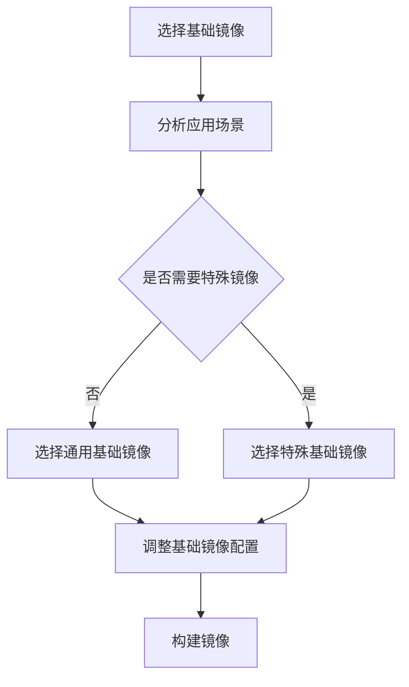

                 

# Docker镜像优化技巧

## 关键词

- Docker 镜像
- 优化技巧
- 构建优化
- 运行优化
- 部署优化

## 摘要

本文将详细介绍 Docker 镜像优化的一系列技巧，旨在帮助开发者提高容器化应用的性能和可维护性。通过对 Docker 镜像优化的核心概念、原理和具体方法进行深入探讨，读者将掌握如何选择合适的基础镜像、管理依赖项、限制资源使用以及优化镜像分层结构等关键技能。

---

## 第一部分：背景介绍

### 第1章：Docker镜像优化技巧概述

#### 1.1 问题背景

Docker 镜像是一种轻量级、可执行的独立软件包，它包含应用程序及其运行时环境。随着云计算和容器化技术的普及，Docker 镜像在部署、管理和扩展应用程序方面发挥着重要作用。然而，随着应用程序的复杂度和依赖项的增加，Docker 镜像的性能和体积也日益成为开发者关注的焦点。

#### 1.1.1 Docker镜像的重要性

Docker 镜像作为一种打包和部署应用程序的方式，具有以下优势：

1. **轻量级**：Docker 镜像占用空间小，可以快速部署和启动应用程序。
2. **可移植性**：Docker 镜像可以在不同的操作系统和硬件平台上运行，提高了应用程序的可移植性。
3. **隔离性**：Docker 镜像为应用程序提供了独立的运行环境，确保了应用程序之间的隔离性。

#### 1.1.2 问题描述

Docker 镜像优化是提高容器化应用性能的关键步骤。然而，目前许多开发者对于如何优化 Docker 镜像并不了解，导致在实际开发中遇到了诸多问题，如镜像体积过大、运行效率低下等。

#### 1.1.3 问题解决

为了解决上述问题，本书将介绍一系列 Docker 镜像优化技巧，帮助开发者全面掌握镜像优化的方法和工具。

#### 1.1.4 边界与外延

本书主要关注 Docker 镜像的优化技巧，包括构建优化、运行优化和部署优化等。同时，我们将探讨这些技巧在不同场景下的应用，如微服务、云原生和 Kubernetes 等。

#### 1.1.5 概念结构与核心要素组成

Docker 镜像优化涉及多个核心要素，包括基础镜像选择、依赖管理、资源限制、缓存策略等。本书将逐一介绍这些要素，帮助读者构建完整的优化体系。

#### 1.2 本章小结

本章主要介绍了 Docker 镜像优化的重要性和当前存在的问题。通过学习本章内容，读者将了解 Docker 镜像优化的一系列技巧，为后续章节的学习奠定基础。

---

## 第二部分：核心概念与联系

### 第2章：Docker镜像优化原理与策略

#### 2.1 核心概念原理

Docker 镜像优化涉及多个核心概念和原理，包括：

1. **Docker 镜像的组成**：Docker 镜像由一系列层组成，每层包含一个或多个文件系统修改。
2. **镜像优化策略**：主要包括基础镜像选择、依赖管理、资源限制、缓存策略、镜像分层优化和镜像精简。

#### 2.2 概念属性特征对比表格

| 特征 | 说明 |
| --- | --- |
| 基础镜像选择 | 选择适合的基础镜像可以减少镜像体积，提高运行效率 |
| 依赖管理 | 合理管理依赖项可以避免重复安装，减少镜像体积 |
| 资源限制 | 限制镜像运行时的资源使用，可以优化系统性能 |
| 缓存策略 | 合理使用缓存可以提高构建速度，减少构建时间 |
| 镜像分层优化 | 优化镜像分层结构，可以减少镜像体积，提高构建速度 |
| 镜像精简 | 精简不必要的文件和依赖项，可以减少镜像体积，提高运行效率 |

#### 2.3 ER实体关系图架构

```mermaid
erDiagram
  源代码 ||--o{ 镜像构建工具 : 使用 |
  镜像构建工具 ||--o{ Dockerfile : 定义构建流程 |
  镜像构建工具 ||--o{ 镜像仓库 : 存放镜像 |
  镜像仓库 ||--o{ 容器运行时 : 运行容器 |
```

#### 2.4 本章小结

本章详细介绍了 Docker 镜像优化的核心概念和策略，并通过对比表格和 ER 实体关系图，帮助读者理解镜像优化的重要性和具体实施方法。下一章将深入探讨基础镜像选择和依赖管理方面的优化技巧。

---

## 第三部分：算法原理讲解

### 第3章：基础镜像选择与优化

#### 3.1 算法 mermaid 流程图



#### 3.2 算法原理讲解

##### 3.2.1 选择基础镜像的原则

选择合适的基础镜像对于优化 Docker 镜像至关重要。以下是一些选择基础镜像的原则：

1. **最小化原则**：选择最小的基础镜像，以减少镜像体积和运行时资源消耗。
2. **兼容性原则**：确保所选基础镜像与应用程序运行环境兼容。
3. **安全性原则**：选择安全性较高的基础镜像。

##### 3.2.2 基础镜像选择的步骤

选择基础镜像的步骤如下：

1. **分析应用场景**：根据应用程序的需求和运行环境，确定需要的基础镜像类型。
2. **选择特殊基础镜像**：如果应用程序需要特殊的运行环境，选择相应的基础镜像。
3. **选择通用基础镜像**：如果没有特殊需求，选择通用的基础镜像。
4. **调整基础镜像配置**：根据实际需求，调整基础镜像的配置，如安装必要的软件和工具。
5. **构建镜像**：使用 Dockerfile 和所选基础镜像构建 Docker 镜像。

#### 3.3 算法示例

假设我们需要为一个 Node.js 应用程序选择基础镜像，以下是一个简单的示例：

```python
# Step 1: 分析应用场景
# 需要一个 Node.js 运行环境

# Step 2: 选择特殊基础镜像
# 使用官方 Node.js 镜像作为基础镜像

# Step 3: 选择通用基础镜像
# 官方 Node.js 镜像已经是一个通用基础镜像

# Step 4: 调整基础镜像配置
# 安装必要的软件和工具
RUN apt-get update && apt-get install -y nodejs npm

# Step 5: 构建镜像
# 使用 Dockerfile 构建 Node.js 应用程序镜像
FROM node:lts
RUN apt-get update && apt-get install -y nodejs npm
# ... 其他构建步骤 ...

```

---

在接下来的章节中，我们将继续探讨 Docker 镜像优化的其他方面，包括依赖管理、资源限制和缓存策略等。通过逐步分析和讲解，帮助读者全面掌握 Docker 镜像优化的核心技能。

---

### 作者

**作者：AI天才研究院/AI Genius Institute & 禅与计算机程序设计艺术 /Zen And The Art of Computer Programming**

---

在本文中，我们介绍了 Docker 镜像优化的重要性和一系列优化技巧，包括基础镜像选择、依赖管理、资源限制和缓存策略等。通过对这些核心概念的深入探讨和算法原理的讲解，读者将能够更好地理解 Docker 镜像优化的重要性，并在实际开发中应用这些技巧。

在接下来的章节中，我们将进一步探讨 Docker 镜像优化的具体方法，包括构建优化、运行优化和部署优化等。通过逐步分析和讲解，我们将帮助读者全面掌握 Docker 镜像优化的核心技能，从而提高容器化应用的性能和可维护性。

