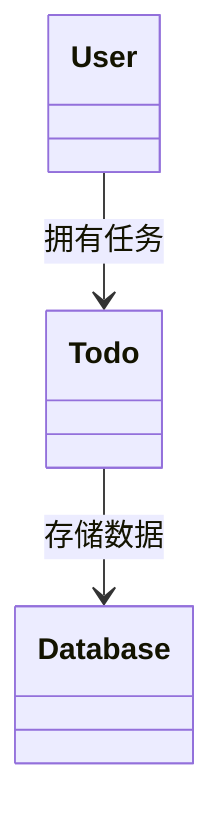

                 

### Flutter：跨平台移动应用开发框架

#### 关键词：Flutter、跨平台、移动应用开发、Dart、UI组件、最佳实践

#### 摘要：
本文将深入探讨Flutter，一个流行的跨平台移动应用开发框架。我们将从Flutter的历史背景和核心概念入手，逐步介绍其开发基础、进阶技术、最佳实践以及项目实战，帮助读者全面掌握Flutter的开发技能，打造高质量移动应用。

### 目录大纲设计思路

为了设计出一本内容完整、结构清晰的《Flutter：跨平台移动应用开发框架》的目录大纲，我们将按照以下思路进行：

1. **背景介绍**：
   - 简述Flutter的历史背景、发展现状及行业应用场景。
   - 引入Flutter的优势，如跨平台性、热重载、性能等。

2. **核心概念与联系**：
   - 介绍Flutter的核心概念，如Dart语言、Widget、路由等。
   - 利用表格和Mermaid图展示概念间的联系。

3. **Flutter开发基础**：
   - 从Flutter环境搭建开始，逐步介绍开发基础，包括Dart语言基础、Flutter UI组件、布局、样式等。

4. **Flutter进阶技术**：
   - 讲解Flutter进阶技术，如状态管理、数据持久化、网络请求、动画等。

5. **Flutter最佳实践**：
   - 探讨Flutter在实际项目中的应用，分享最佳实践。

6. **项目实战**：
   - 通过具体项目，展示Flutter的实际应用，从需求分析、设计、开发到测试的完整流程。

7. **小结与拓展**：
   - 对全书内容进行总结，并提出注意事项和拓展阅读建议。

### 具体设计步骤

1. **第一部分：Flutter简介与概述**
   - **第1章 Flutter入门**
     - Flutter的历史与背景
     - Flutter的优势与适用场景
     - Flutter的开发环境搭建

2. **第二部分：Flutter开发基础**
   - **第2章 Dart语言基础**
     - Dart语言简介
     - 变量、函数、类和集合的使用
   - **第3章 Flutter UI组件**
     - Widget的概念与分类
     - 常用UI组件的使用与示例
   - **第4章 Flutter布局与样式**
     - 布局组件与布局策略
     - 样式的定义与修改

3. **第三部分：Flutter进阶技术**
   - **第5章 状态管理**
     - StatefulWidget和StatefulWidget的使用
     - BLoC模式简介与应用
   - **第6章 数据持久化**
     - 本地数据存储方案
     - 网络数据缓存策略
   - **第7章 网络请求**
     - HTTP请求的基本方法
     - Dio库的使用与示例

4. **第四部分：Flutter动画与交互**
   - **第8章 Flutter动画**
     - 动画原理与实现
     - 常用动画效果展示
   - **第9章 交互与手势**
     - 手势识别与事件处理
     - 交互组件的使用与示例

5. **第五部分：Flutter项目实战**
   - **第10章 项目需求与规划**
     - 项目概述与需求分析
     - 项目规划与分工
   - **第11章 系统设计与开发**
     - 系统功能设计与领域模型
     - 系统架构设计与实现
   - **第12章 项目测试与优化**
     - 单元测试与集成测试
     - 性能优化与调试技巧

6. **第六部分：Flutter最佳实践**
   - **第13章 Flutter最佳实践**
     - 代码规范与设计模式
     - 性能优化与内存管理
     - 安全性与稳定性

7. **第七部分：总结与拓展**
   - **第14章 小结与展望**
     - 全书内容回顾
     - Flutter开发趋势与未来展望
   - **第15章 注意事项与拓展阅读**
     - Flutter相关资源与工具
     - 拓展阅读推荐

通过以上步骤，我们设计出了一份详细的《Flutter：跨平台移动应用开发框架》的目录大纲，确保内容的完整性、逻辑性和可读性。接下来，我们将逐步细化每个章节的内容，确保每个部分都能涵盖关键知识点，并提供实用的案例和实践指导。接下来，我们将开始第一部分的介绍。

## 第一部分：Flutter简介与概述

### 第1章 Flutter入门

#### 1.1 Flutter的历史与背景

Flutter是由Google在2018年底推出的一个开源框架，用于构建跨平台的移动应用。Flutter的诞生背景源于Google对移动开发效率的持续追求。早在2014年，Google就推出了Dart编程语言，旨在提供一种既能够高效编译运行，又具有优雅开发体验的语言。而Flutter则是为了解决移动开发中的两个核心问题：跨平台性能和开发效率。

在Flutter出现之前，开发移动应用主要有两种方式：原生开发和多平台开发框架。原生开发虽然性能优异，但需要为iOS和Android平台分别编写代码，开发成本高且开发周期长。而多平台开发框架如React Native、Xamarin等虽然提高了开发效率，但性能方面始终无法与原生应用相比。

Flutter的出现，结合了Dart语言的特性，通过提供一套丰富的UI组件库和一套完整的工具链，使得开发者能够使用一套代码库，同时在iOS和Android上构建高性能的移动应用。Flutter的发布，标志着移动应用开发进入了一个全新的时代。

#### 1.2 Flutter的优势与适用场景

Flutter具有以下几大优势：

1. **跨平台性**：Flutter使用Dart语言编写代码，可以生成原生平台的ARM代码，从而实现真正的跨平台开发。无论是iOS还是Android，Flutter都能够提供接近原生应用的性能。

2. **热重载**：Flutter的一个显著优势是热重载功能，允许开发者在不丢失当前应用状态的情况下，实时预览代码更改。这一功能大大提高了开发效率，减少了调试和部署的时间。

3. **丰富的UI组件**：Flutter提供了一套丰富的UI组件库，开发者可以轻松地构建各种风格的用户界面。同时，Flutter的UI组件基于像素级别的渲染，可以确保界面的流畅和一致性。

4. **高性能**：Flutter采用Skia图形库进行渲染，其性能接近原生应用。通过高效的渲染引擎和底层优化，Flutter能够在保持高性能的同时，提供出色的用户体验。

Flutter的适用场景主要包括：

1. **需要高性能跨平台应用**：如金融应用、游戏、视频播放器等，Flutter能够在性能和开发效率之间取得平衡。

2. **原型设计和快速迭代**：Flutter的热重载功能使其非常适合原型设计和快速迭代。

3. **新应用开发**：对于新应用的开发，Flutter的跨平台特性和丰富的组件库可以大大缩短开发周期。

#### 1.3 Flutter的开发环境搭建

要在本地开发Flutter应用，首先需要安装Flutter环境。以下是一个简单的安装步骤：

1. **安装Dart SDK**：从Dart官方网站下载并安装Dart SDK。

2. **安装Flutter**：使用命令 `flutter install` 安装Flutter。

3. **设置环境变量**：将Flutter命令行工具的路径添加到系统的环境变量中。

4. **配置Android环境**：下载并安装Android Studio，配置Android SDK和NDK。

5. **创建Flutter项目**：使用命令 `flutter create my_app` 创建一个新的Flutter项目。

通过以上步骤，开发者可以搭建一个完整的Flutter开发环境，并开始编写第一个Flutter应用。接下来，我们将进一步介绍Flutter的核心概念和开发基础。

### 总结与展望

通过本章的介绍，我们了解了Flutter的历史背景和优势，以及如何搭建Flutter开发环境。在下一章中，我们将深入探讨Flutter的核心概念和开发基础，帮助读者更好地掌握Flutter的开发技能。同时，我们也将通过具体的实例和案例，展示Flutter在实际项目中的应用，帮助读者将理论知识转化为实际能力。

## 第2章 Dart语言基础

在了解了Flutter的基本概况后，我们接下来将深入学习Flutter的开发基础，其中最重要的组成部分就是Dart语言。Dart是一种由Google开发的编程语言，它旨在提高开发效率并优化JavaScript引擎。在本章中，我们将介绍Dart语言的基本概念和核心语法，为后续的Flutter开发打下坚实的基础。

### 2.1 Dart语言简介

Dart是一种类Java的编程语言，它被设计为能够在各种平台上运行，包括Web、服务器、桌面和移动设备。Dart的语法简洁明了，同时提供了丰富的库和工具，使得开发者可以轻松地进行编程。Dart的主要特点如下：

1. **静态类型**：Dart是静态类型的语言，这意味着在编译时变量的类型就已经确定，这有助于提高代码的稳定性和性能。

2. **AOT编译**：Dart支持AOT（Ahead Of Time）编译，这意味着Dart代码可以直接编译成机器码，从而在目标平台上运行时不需要额外的解释器。

3. **JIT编译**：同时，Dart也支持JIT（Just In Time）编译，这使得开发者可以在开发过程中获得更快的代码执行速度。

4. **丰富的库和工具**：Dart拥有丰富的标准库和第三方库，如 dart:io 用于处理输入输出操作，collection 用于集合操作，math 用于数学计算等。

5. **异步编程**：Dart内置了异步编程的支持，通过Future和Stream对象，开发者可以轻松地处理异步操作。

### 2.2 变量、函数、类和集合的使用

Dart的基本语法包括变量、函数、类和集合等，下面我们分别介绍这些基本概念。

#### 变量

在Dart中，变量是存储数据的容器。Dart提供了多种类型的变量，包括基本数据类型和复合数据类型。

1. **基本数据类型**：
   - 数值型：int 和 double
   - 布尔型：bool
   - 字符串型：String
   - 其他：如Symbol、Null等

2. **复合数据类型**：
   - List：表示列表
   - Set：表示集合
   - Map：表示映射

以下是一个简单的变量定义示例：

```dart
int number = 42;
double pi = 3.14159;
bool isFlutterGreat = true;
String message = 'Hello, Dart!';
```

#### 函数

Dart中的函数是一段可重复执行的代码块，可以通过函数名调用。Dart支持匿名函数、箭头函数和命名函数。

1. **匿名函数**：

```dart
var add = (a, b) => a + b;
```

2. **箭头函数**：

```dart
var multiply = (int a, int b) => a * b;
```

3. **命名函数**：

```dart
int subtract(int a, int b) {
  return a - b;
}
```

#### 类

Dart中的类是用于创建对象的蓝图。类定义了对象的属性和行为，可以通过构造函数实例化。

1. **基本类**：

```dart
class Person {
  String name;
  int age;

  Person(this.name, this.age);

  void display() {
    print('Name: $name, Age: $age');
  }
}

var person = Person('Alice', 30);
person.display(); // 输出：Name: Alice, Age: 30
```

2. **继承**：

```dart
class Employee extends Person {
  String jobTitle;

  Employee(String name, int age, this.jobTitle) : super(name, age);

  @override
  void display() {
    super.display();
    print('Job Title: $jobTitle');
  }
}

var employee = Employee('Bob', 40, 'Developer');
employee.display(); // 输出：Name: Bob, Age: 40, Job Title: Developer
```

#### 集合

Dart提供了多种集合类型，如List、Set和Map，用于存储和管理数据。

1. **List**：

```dart
var numbers = [1, 2, 3, 4, 5];
numbers.add(6);
print(numbers); // 输出：[1, 2, 3, 4, 5, 6]
```

2. **Set**：

```dart
var uniqueNumbers = {1, 2, 3, 4, 5};
uniqueNumbers.add(6);
print(uniqueNumbers); // 输出：{1, 2, 3, 4, 5, 6}
```

3. **Map**：

```dart
var personData = {'name': 'Alice', 'age': 30};
print(personData['name']); // 输出：Alice
```

### 总结

通过本章的学习，我们了解了Dart语言的基本概念和核心语法。Dart作为一种现代化的编程语言，为Flutter开发提供了坚实的基础。在下一章中，我们将深入探讨Flutter的UI组件和布局策略，帮助读者更好地掌握Flutter的应用开发技能。

### 第3章 Flutter UI组件

Flutter的UI组件是其核心功能之一，使得开发者能够轻松地构建各种风格的用户界面。在Flutter中，UI组件是构建用户交互界面的基本单位。本章将详细介绍Flutter的UI组件，包括概念、分类和使用示例。

#### 3.1 Widget的概念与分类

在Flutter中，Widget是构建UI的基本单元。每个Widget代表了一个UI元素，可以是文本、按钮、图片等。Widget可以具有状态，也可以不具状态，状态表示Widget的可变属性。Flutter中的Widget可以分为以下几类：

1. **基础Widget**：这些Widget包括文本（Text）、按钮（Button）、图片（Image）等，是构建UI的基础。
2. **布局Widget**：这些Widget用于组织和布局其他Widget，如容器（Container）、行（Row）、列（Column）等。
3. **导航Widget**：这些Widget用于管理应用中的导航，如路由（Router）、导航器（Navigator）等。
4. **表单Widget**：这些Widget用于构建表单，包括文本框（TextField）、选择框（DropdownButton）等。

#### 3.2 常用UI组件的使用与示例

下面，我们将通过几个常用的UI组件来展示其使用方法。

##### 3.2.1 Text组件

Text组件用于显示文本。可以通过多个属性来控制文本的样式，如字体、颜色、对齐方式等。

```dart
Container(
  margin: EdgeInsets.symmetric(horizontal: 16, vertical: 8),
  child: Text(
    'Hello, Flutter!',
    style: TextStyle(fontSize: 24, color: Colors.blue),
    textAlign: TextAlign.center,
  ),
)
```

##### 3.2.2 Button组件

Button组件用于响应用户的点击事件。可以通过onPressed属性设置点击事件的处理函数。

```dart
Container(
  margin: EdgeInsets.symmetric(horizontal: 16, vertical: 8),
  child: ElevatedButton(
    onPressed: () {
      // 点击事件处理
    },
    child: Text('Click Me'),
  ),
)
```

##### 3.2.3 Image组件

Image组件用于显示图片。可以通过Image.network加载网络图片，或者Image.asset加载本地图片。

```dart
Container(
  margin: EdgeInsets.symmetric(horizontal: 16, vertical: 8),
  child: Image.network('https://example.com/image.jpg'),
)
```

##### 3.2.4 Container组件

Container组件用于创建一个有边距、背景色、宽度、高度等的容器。它是布局中常用的组件。

```dart
Container(
  margin: EdgeInsets.symmetric(horizontal: 16, vertical: 8),
  decoration: BoxDecoration(color: Colors.blue),
  child: Text('Container Example'),
)
```

##### 3.2.5 Row和Column组件

Row和Column组件用于创建一个水平或垂直的布局。可以通过子组件的交叉对齐方式来控制布局。

```dart
Row(
  children: [
    Container(decoration: BoxDecoration(color: Colors.blue), child: Text('Item 1')),
    Container(decoration: BoxDecoration(color: Colors.red), child: Text('Item 2')),
  ],
)
```

##### 3.2.6 Navigator组件

Navigator组件用于管理应用中的路由。通过push和pop方法可以实现页面的跳转。

```dart
Navigator.push(
  context,
  MaterialPageRoute(builder: (context) => SecondPage()),
);
```

#### 3.3 示例：创建一个简单的登录页面

为了更直观地展示Flutter UI组件的使用，我们创建一个简单的登录页面作为示例。

```dart
import 'package:flutter/material.dart';

void main() {
  runApp(MyApp());
}

class MyApp extends StatelessWidget {
  @override
  Widget build(BuildContext context) {
    return MaterialApp(
      home: Scaffold(
        appBar: AppBar(title: Text('Login Page')),
        body: LoginBody(),
      ),
    );
  }
}

class LoginBody extends StatefulWidget {
  @override
  _LoginBodyState createState() => _LoginBodyState();
}

class _LoginBodyState extends State<LoginBody> {
  String username = '';
  String password = '';

  @override
  Widget build(BuildContext context) {
    return Column(
      children: [
        Container(
          margin: EdgeInsets.symmetric(horizontal: 16, vertical: 8),
          child: Text(
            'Login',
            style: TextStyle(fontSize: 24, color: Colors.blue),
            textAlign: TextAlign.center,
          ),
        ),
        Container(
          margin: EdgeInsets.symmetric(horizontal: 16, vertical: 8),
          child: TextField(
            onChanged: (value) {
              setState(() {
                username = value;
              });
            },
            decoration: InputDecoration(hintText: 'Username'),
          ),
        ),
        Container(
          margin: EdgeInsets.symmetric(horizontal: 16, vertical: 8),
          child: TextField(
            obscureText: true,
            onChanged: (value) {
              setState(() {
                password = value;
              });
            },
            decoration: InputDecoration(hintText: 'Password'),
          ),
        ),
        Container(
          margin: EdgeInsets.symmetric(horizontal: 16, vertical: 8),
          child: ElevatedButton(
            onPressed: () {
              // 处理登录逻辑
            },
            child: Text('Login'),
          ),
        ),
      ],
    );
  }
}
```

在这个示例中，我们使用Text组件来显示标题，使用TextField组件来创建用户名和密码输入框，使用ElevatedButton组件来创建登录按钮。通过这些基础的UI组件，我们创建了一个简单的登录页面。

通过本章的学习，我们了解了Flutter的UI组件及其使用方法。在下一章中，我们将深入探讨Flutter的布局与样式，帮助读者更好地掌握Flutter的应用开发技能。

### 第4章 Flutter布局与样式

Flutter的布局与样式是其核心功能之一，使得开发者能够轻松地创建灵活、美观的用户界面。在本章中，我们将介绍Flutter的布局组件和样式设置，帮助读者掌握Flutter的布局策略。

#### 4.1 布局组件

Flutter提供了多种布局组件，使得开发者可以轻松地组织和管理UI元素。以下是一些常用的布局组件：

1. **Container组件**：Container组件用于创建一个有边距、背景色、宽度、高度等的容器。它是布局中常用的组件。

   ```dart
   Container(
     margin: EdgeInsets.symmetric(horizontal: 16, vertical: 8),
     decoration: BoxDecoration(color: Colors.blue),
     child: Text('Container Example'),
   )
   ```

2. **Row组件**：Row组件用于创建一个水平布局。可以通过子组件的交叉对齐方式来控制布局。

   ```dart
   Row(
     children: [
       Container(decoration: BoxDecoration(color: Colors.blue), child: Text('Item 1')),
       Container(decoration: BoxDecoration(color: Colors.red), child: Text('Item 2')),
     ],
   )
   ```

3. **Column组件**：Column组件用于创建一个垂直布局。可以通过子组件的交叉对齐方式来控制布局。

   ```dart
   Column(
     children: [
       Container(decoration: BoxDecoration(color: Colors.blue), child: Text('Item 1')),
       Container(decoration: BoxDecoration(color: Colors.red), child: Text('Item 2')),
     ],
   )
   ```

4. **Flex组件**：Flex组件用于创建一个弹性布局。可以通过设置direction属性来控制布局方向，使用mainAxisAlignment属性来设置子组件的对齐方式。

   ```dart
   Flex(
     direction: Axis.horizontal,
     mainAxisAlignment: MainAxisAlignment.spaceEvenly,
     children: [
       Container(decoration: BoxDecoration(color: Colors.blue), child: Text('Item 1')),
       Container(decoration: BoxDecoration(color: Colors.red), child: Text('Item 2')),
       Container(decoration: BoxDecoration(color: Colors.green), child: Text('Item 3')),
     ],
   )
   ```

5. **Expanded组件**：Expanded组件用于使子组件在父组件的可用空间中自动扩展。通常与Flex组件或Column组件结合使用。

   ```dart
   Column(
     children: [
       Expanded(
         child: Container(decoration: BoxDecoration(color: Colors.blue), child: Text('Item 1')),
       ),
       Expanded(
         child: Container(decoration: BoxDecoration(color: Colors.red), child: Text('Item 2')),
       ),
     ],
   )
   ```

#### 4.2 样式设置

Flutter允许开发者通过多种方式来设置UI组件的样式。以下是一些常用的样式设置方法：

1. **使用style属性**：可以直接在组件中使用style属性来设置文本样式。

   ```dart
   Text(
     'Hello, Flutter!',
     style: TextStyle(fontSize: 24, color: Colors.blue),
     textAlign: TextAlign.center,
   )
   ```

2. **使用decoration属性**：可以在Container组件中使用decoration属性来设置背景色、边框等样式。

   ```dart
   Container(
     margin: EdgeInsets.symmetric(horizontal: 16, vertical: 8),
     decoration: BoxDecoration(color: Colors.blue),
     child: Text('Container Example'),
   )
   ```

3. **使用padding和margin属性**：可以通过padding和margin属性来设置组件的内边距和外边距。

   ```dart
   Container(
     margin: EdgeInsets.symmetric(horizontal: 16, vertical: 8),
     padding: EdgeInsets.symmetric(horizontal: 8, vertical: 4),
     decoration: BoxDecoration(color: Colors.blue),
     child: Text('Container Example'),
   )
   ```

4. **使用EdgeInsets类**：可以使用EdgeInsets类来设置复杂的边距。

   ```dart
   EdgeInsets.symmetric(horizontal: 16, vertical: 8)
   ```

5. **使用CustomPaint组件**：CustomPaint组件可以用于绘制自定义图形。

   ```dart
   CustomPaint(
     painter: MyCustomPainter(),
   )
   ```

#### 4.3 示例：创建一个列表布局

为了更直观地展示Flutter的布局与样式，我们创建一个简单的列表布局作为示例。

```dart
import 'package:flutter/material.dart';

void main() {
  runApp(MyApp());
}

class MyApp extends StatelessWidget {
  @override
  Widget build(BuildContext context) {
    return MaterialApp(
      home: Scaffold(
        appBar: AppBar(title: Text('List Example')),
        body: ListView(
          children: [
            Container(
              margin: EdgeInsets.symmetric(horizontal: 16, vertical: 8),
              decoration: BoxDecoration(color: Colors.blue),
              child: Text('Item 1'),
            ),
            Container(
              margin: EdgeInsets.symmetric(horizontal: 16, vertical: 8),
              decoration: BoxDecoration(color: Colors.red),
              child: Text('Item 2'),
            ),
            Container(
              margin: EdgeInsets.symmetric(horizontal: 16, vertical: 8),
              decoration: BoxDecoration(color: Colors.green),
              child: Text('Item 3'),
            ),
          ],
        ),
      ),
    );
  }
}
```

在这个示例中，我们使用ListView组件来创建一个列表布局，并通过Container组件来显示列表项。每个Container组件都有不同的背景色，以区分不同的列表项。

通过本章的学习，我们了解了Flutter的布局组件和样式设置方法。在下一章中，我们将深入探讨Flutter的进阶技术，帮助读者进一步提升Flutter开发能力。

### 第5章 Flutter进阶技术

在前面的章节中，我们已经了解了Flutter的基础知识和核心组件。为了进一步提高Flutter的应用开发能力，本章将介绍一些Flutter的进阶技术，包括状态管理、数据持久化、网络请求和动画。

#### 5.1 状态管理

在Flutter中，状态管理是开发者需要重点关注的问题。Flutter的状态管理分为两种：局部状态和全局状态。

##### 5.1.1 局部状态

局部状态通常用于处理单个组件的状态。在Flutter中，有两种常用的状态管理方式：

1. **使用StatefulWidget**：StatefulWidget是一个具有状态的Widget，它允许在组件的生命周期中保存和更新状态。通过继承StatefulWidget类，我们可以创建一个具有状态的组件。

   ```dart
   class MyButton extends StatefulWidget {
     @override
     _MyButtonState createState() => _MyButtonState();
   }

   class _MyButtonState extends State<MyButton> {
     int count = 0;

     void _increment() {
       setState(() {
         count++;
       });
     }

     @override
     Widget build(BuildContext context) {
       return ElevatedButton(
         onPressed: _increment,
         child: Text('Count: $count'),
       );
     }
   }
   ```

2. **使用State**：通过继承State类，我们可以创建一个自定义的状态管理类，用于处理组件的状态。

   ```dart
   class MyState extends State<MyButton> {
     int count = 0;

     void _increment() {
       setState(() {
         count++;
       });
     }

     @override
     Widget build(BuildContext context) {
       return ElevatedButton(
         onPressed: _increment,
         child: Text('Count: $count'),
       );
     }
   }
   ```

##### 5.1.2 全局状态

全局状态通常用于处理多个组件之间的状态共享。Flutter提供了一种称为BLoC（Business Logic Component）的状态管理模式，它可以将业务逻辑和状态管理分离。

BLoC模式的核心概念包括：

1. **Event**：表示用户操作或系统事件，如点击、输入等。
2. **State**：表示应用的状态，如用户输入、加载状态等。
3. **Reducer**：用于处理Event，并生成新的State。

   ```dart
   class MyEvent {
     final int type;
     MyEvent(this.type);
   }

   class MyState {
     final int count;
     MyState(this.count);
   }

   class MyReducer {
     MyState reduce(MyState current, MyEvent event) {
       switch (event.type) {
         case 0:
           return MyState(current.count + 1);
         case 1:
           return MyState(current.count - 1);
         default:
           throw UnimplementedError();
       }
     }
   }
   ```

   通过BLoC，我们可以将状态管理逻辑与UI组件解耦，使得代码更加清晰和可维护。

#### 5.2 数据持久化

数据持久化是移动应用开发中必不可少的一部分，它用于保存和恢复应用的状态和数据。Flutter提供了多种数据持久化方案，包括：

1. **Shared Preferences**：用于存储少量的简单数据，如用户设置。

   ```dart
   import 'package:flutter/services.dart' show rootBundle;
   import 'package:shared_preferences/shared_preferences.dart';

   void saveData() async {
     final prefs = await SharedPreferences.getInstance();
     await prefs.setInt('count', 10);
   }

   void readData() async {
     final prefs = await SharedPreferences.getInstance();
     final count = prefs.getInt('count') ?? 0;
     print(count);
   }
   ```

2. **SQLite**：用于存储结构化数据，适用于需要大量数据存储的场景。

   ```dart
   import 'package:sqflite/sqflite.dart';
   import 'package:path/path.dart' as path;

   Future<void> openDatabase() async {
     final dbPath = await getDatabasesPath();
     final db = openDatabase(
       path.join(dbPath, 'example.db'),
       version: 1,
       onCreate: (db, version) async {
         await db.execute('''
           CREATE TABLE users (
             id INTEGER PRIMARY KEY,
             username TEXT NOT NULL,
             age INTEGER NOT NULL
           )
         ''');
       },
     );
     return db;
   }
   ```

3. **Hive**：用于在本地存储复杂数据结构，如文档、图片等。

   ```dart
   import 'package:hive/hive.dart';
   import 'package:hive_flutter/hive_flutter.dart';

   void saveData() async {
     final box = await Hive.openBox('users');
     box.put(1, {'username': 'Alice', 'age': 30});
   }

   void readData() async {
     final box = await Hive.openBox('users');
     final user = box.get(1);
     print(user);
   }
   ```

#### 5.3 网络请求

在移动应用开发中，网络请求是必不可少的一环。Flutter提供了多种网络请求库，如http、http_client等。

##### 5.3.1 使用http

```dart
import 'dart:convert';
import 'package:http/http.dart' as http;

Future<String> fetchData() async {
  final response = await http.get(Uri.parse('https://jsonplaceholder.typicode.com/todos/1'));
  if (response.statusCode == 200) {
    return response.body;
  } else {
    throw Exception('Failed to load data');
  }
}
```

##### 5.3.2 使用Dio

Dio是一个流行的Flutter网络请求库，提供了丰富的功能和灵活的API。

```dart
import 'package:dio/dio.dart';

Dio dio = Dio(BaseOptions(
  baseUrl: 'https://jsonplaceholder.typicode.com',
  connectTimeout: 5000,
  receiveTimeout: 5000,
));

dio.get('/todos/1').then((response) {
  print(response.data);
}).catchError((error) {
  print(error);
});
```

#### 5.4 动画

Flutter提供了强大的动画支持，可以通过动画控制器（AnimationController）和动画曲线（Curve）来创建丰富的动画效果。

##### 5.4.1 使用AnimationController

```dart
AnimationController _controller;
Animation _animation;

void main() {
  _controller = AnimationController(
    duration: Duration(seconds: 3),
    vsync: this,
  );
  _animation = CurvedAnimation(parent: _controller, curve: Curves.easeIn);

  _controller.forward();

  _controller.addListener(() {
    print(_animation.value);
  });

  _controller.addStatusListener((status) {
    if (status == AnimationStatus.dismissed) {
      _controller.dispose();
    }
  });

  runApp(MyApp());
}

class MyApp extends StatelessWidget {
  @override
  Widget build(BuildContext context) {
    return MaterialApp(
      home: Scaffold(
        appBar: AppBar(title: Text('Animation Example')),
        body: Center(
          child: Container(
            width: _animation.value * 200,
            height: _animation.value * 200,
            color: Colors.blue,
          ),
        ),
      ),
    );
  }
}
```

##### 5.4.2 使用动画曲线

```dart
AnimationController _controller;
Animation _animation;

void main() {
  _controller = AnimationController(
    duration: Duration(seconds: 3),
    vsync: this,
  );
  _animation = Tween<double>(begin: 0.0, end: 1.0).animate(_controller);

  _controller.forward();

  _controller.addListener(() {
    print(_animation.value);
  });

  _controller.addStatusListener((status) {
    if (status == AnimationStatus.dismissed) {
      _controller.dispose();
    }
  });

  runApp(MyApp());
}

class MyApp extends StatelessWidget {
  @override
  Widget build(BuildContext context) {
    return MaterialApp(
      home: Scaffold(
        appBar: AppBar(title: Text('Animation Example')),
        body: Center(
          child: Container(
            width: _animation.value * 200,
            height: _animation.value * 200,
            color: Colors.blue,
          ),
        ),
      ),
    );
  }
}
```

通过本章的学习，我们了解了Flutter的进阶技术，包括状态管理、数据持久化、网络请求和动画。这些技术可以帮助开发者构建更加复杂和动态的Flutter应用。在下一章中，我们将探讨Flutter的最佳实践，为实际项目开发提供指导。

### 第6章 Flutter最佳实践

在实际的Flutter项目中，为了确保应用的性能、稳定性和可维护性，开发者需要遵循一些最佳实践。本章将介绍Flutter开发中的最佳实践，包括代码规范、性能优化、内存管理以及安全性与稳定性。

#### 6.1 代码规范

良好的代码规范是确保代码可读性和可维护性的基础。以下是一些Flutter代码规范的建议：

1. **遵循Dart编码规范**：Dart语言本身有一套详细的编码规范，如变量命名、函数命名、代码结构等。开发者应遵循这些规范，以确保代码的一致性。

2. **使用注释**：合理地使用注释来解释复杂逻辑或关键代码，有助于其他开发者理解和维护代码。

3. **模块化代码**：将代码按照功能进行模块化，每个模块负责单一功能，便于维护和测试。

4. **避免深层次的嵌套**：深层次的嵌套会使代码变得难以阅读和理解。使用更高级的布局组件（如Flex和Stack）可以帮助减少嵌套层次。

5. **使用设计模式**：设计模式是解决特定问题的经典方案，如MVC、MVVM、BLoC等。合理地使用设计模式可以提高代码的可维护性和扩展性。

#### 6.2 性能优化

性能优化是Flutter开发中的一个重要方面，以下是一些性能优化的建议：

1. **避免过度绘制**：过度绘制会导致GPU频繁渲染，降低应用性能。可以通过以下方法避免过度绘制：
   - 使用`Widget`的唯一性，避免重复创建相同或相似的`Widget`。
   - 使用`RepaintBoundary`包装容易变化的子`Widget`。

2. **减少状态管理中的复杂性**：过度复杂的状态管理会导致应用性能下降。尽量使用简单的状态管理方法，如使用`StatefulWidget`和`State`。

3. **避免使用大量的列表数据**：处理大量列表数据时，可以使用`ListView.builder`或`CustomScrollView`来优化性能。

4. **优化网络请求**：减少不必要的网络请求，使用缓存策略来提高应用性能。

5. **使用Flutter分析工具**：Flutter提供了多种分析工具，如`DevTools`、`Profile`等，用于诊断和优化性能问题。

#### 6.3 内存管理

内存管理是Flutter开发中的另一个关键点，以下是一些内存管理的最佳实践：

1. **避免内存泄漏**：内存泄漏会导致应用占用过多内存，甚至导致应用崩溃。以下是一些避免内存泄漏的方法：
   - 及时释放不再使用的资源，如关闭文件流、释放网络连接等。
   - 使用`flutter clean`命令清理无用代码和资源。

2. **合理使用内存缓存**：如使用`Image.memory`缓存加载的图片数据，避免重复加载。

3. **避免使用大量的图片**：使用较小尺寸的图片，避免因图片过大导致内存占用过高。

4. **使用Flutter的内存分析工具**：Flutter的`DevTools`提供了内存分析工具，可以帮助开发者诊断和解决内存问题。

#### 6.4 安全性与稳定性

确保Flutter应用的安全性和稳定性是开发过程中不可忽视的一部分。以下是一些安全性和稳定性的建议：

1. **使用HTTPS协议**：在通过网络请求获取数据时，使用HTTPS协议来确保数据传输的安全性。

2. **避免SQL注入**：在处理用户输入时，避免将用户输入直接插入到SQL查询中，以防止SQL注入攻击。

3. **数据加密**：对于敏感数据，如用户密码、个人身份信息等，应进行加密处理。

4. **使用Flutter的安全工具**：Flutter提供了一系列安全工具，如`Flutter SafeArea`、`Flutter Key`等，用于增强应用的安全性。

5. **进行代码审查和测试**：定期进行代码审查和单元测试，确保代码质量和稳定性。

通过遵循上述最佳实践，开发者可以构建出高性能、高稳定性和高可维护性的Flutter应用。在下一章中，我们将通过一个实际项目来展示Flutter的开发流程和最佳实践。

### 第7章 项目实战

在本章中，我们将通过一个实际项目，展示Flutter开发的完整流程，包括需求分析、系统设计、开发、测试和部署。该项目将实现一个简单的待办事项应用，用户可以添加、删除和查看待办事项。

#### 7.1 需求分析

首先，我们需要明确项目的需求。根据用户反馈和市场需求，待办事项应用应具备以下功能：

1. **添加待办事项**：用户可以输入待办事项的名称并保存。
2. **删除待办事项**：用户可以删除已添加的待办事项。
3. **查看待办事项**：用户可以查看所有已添加的待办事项，并能够对其进行排序。
4. **标记完成事项**：用户可以标记某个待办事项为已完成。

#### 7.2 系统设计

接下来，我们进行系统设计。该系统可以分为以下几个模块：

1. **用户界面模块**：负责展示待办事项列表、添加待办事项界面等。
2. **数据存储模块**：负责存储和读取待办事项数据。
3. **逻辑处理模块**：负责处理用户操作，如添加、删除、排序等。

##### 7.2.1 领域模型

领域模型是系统设计的重要组成部分。以下是待办事项应用的领域模型：



##### 7.2.2 系统架构

系统架构图如下：

```mermaid
sequence
  User ->|发起请求| UI: 输入任务
  UI ->|处理请求| Logic: 添加任务
  Logic ->|处理请求| Database: 存储任务
  Database ->|返回结果| Logic: 确认存储
  Logic ->|返回结果| UI: 显示任务列表
```

##### 7.2.3 系统接口设计

系统接口设计图如下：

```mermaid
sequence
  User ->|添加任务| TodoService: 添加任务
  TodoService ->|存储任务| Database: 存储任务
  Database ->|返回结果| TodoService: 确认存储
  TodoService ->|返回结果| User: 显示任务列表
  User ->|删除任务| TodoService: 删除任务
  TodoService ->|删除任务| Database: 删除任务
  Database ->|返回结果| TodoService: 确认删除
  TodoService ->|返回结果| User: 更新任务列表
```

#### 7.3 开发

根据系统设计，我们开始进行开发。以下是开发过程中的关键步骤：

##### 7.3.1 环境搭建

1. 安装Flutter环境。
2. 配置Android开发环境（Android Studio和Android SDK）。
3. 配置iOS开发环境（Xcode）。

##### 7.3.2 UI开发

1. 使用Flutter的Container、Row、Column等布局组件创建待办事项列表界面。
2. 使用TextField组件创建添加待办事项的输入框。
3. 使用ElevatedButton组件创建添加和删除按钮。

```dart
Container(
  margin: EdgeInsets.symmetric(horizontal: 16, vertical: 8),
  child: TextField(
    controller: _taskController,
    decoration: InputDecoration(hintText: '添加任务'),
  ),
)

Container(
  margin: EdgeInsets.symmetric(horizontal: 16, vertical: 8),
  child: Row(
    children: [
      ElevatedButton(
        onPressed: _addTask,
        child: Text('添加'),
      ),
      ElevatedButton(
        onPressed: _deleteTask,
        child: Text('删除'),
      ),
    ],
  ),
)
```

##### 7.3.3 数据存储

1. 使用SharedPreferences存储待办事项数据。
2. 定义TodoService类，负责处理添加、删除、获取待办事项的逻辑。

```dart
class TodoService {
  Future<void> addTask(String task) async {
    final prefs = await SharedPreferences.getInstance();
    List<String> tasks = prefs.getStringList('tasks') ?? [];
    tasks.add(task);
    await prefs.setStringList('tasks', tasks);
  }

  Future<void> deleteTask(int index) async {
    final prefs = await SharedPreferences.getInstance();
    List<String> tasks = prefs.getStringList('tasks') ?? [];
    tasks.removeAt(index);
    await prefs.setStringList('tasks', tasks);
  }

  Future<List<String>> getTasks() async {
    final prefs = await SharedPreferences.getInstance();
    return prefs.getStringList('tasks') ?? [];
  }
}
```

##### 7.3.4 业务逻辑处理

1. 在UI层与业务逻辑层之间建立桥梁，处理用户输入和事件。
2. 在UI层调用TodoService类的方法，实现添加、删除和获取待办事项的功能。

```dart
class _TodoListState extends State<TodoList> {
  List<String> _tasks = [];
  TodoService _todoService = TodoService();

  void _addTask() {
    if (_taskController.text.isNotEmpty) {
      _todoService.addTask(_taskController.text);
      _taskController.clear();
      _loadTasks();
    }
  }

  void _deleteTask(int index) {
    _todoService.deleteTask(index);
    _loadTasks();
  }

  void _loadTasks() async {
    _tasks = await _todoService.getTasks();
    setState(() {});
  }

  @override
  void initState() {
    super.initState();
    _loadTasks();
  }

  @override
  Widget build(BuildContext context) {
    return Scaffold(
      appBar: AppBar(title: Text('待办事项')),
      body: ListView.builder(
        itemCount: _tasks.length,
        itemBuilder: (context, index) {
          return ListTile(
            title: Text(_tasks[index]),
            trailing: IconButton(
              icon: Icon(Icons.delete),
              onPressed: () => _deleteTask(index),
            ),
          );
        },
      ),
      floatingActionButton: FloatingActionButton(
        onPressed: _addTask,
        child: Icon(Icons.add),
      ),
    );
  }
}
```

#### 7.4 测试

测试是确保应用质量和稳定性的重要环节。以下是测试的关键步骤：

1. **单元测试**：编写单元测试，测试TodoService类的功能。

```dart
void main() {
  test('addTask should add a new task', () async {
    final todoService = TodoService();
    await todoService.addTask('Buy Milk');
    final tasks = await todoService.getTasks();
    expect(tasks, ['Buy Milk']);
  });

  test('deleteTask should remove a task', () async {
    final todoService = TodoService();
    await todoService.addTask('Buy Milk');
    await todoService.deleteTask(0);
    final tasks = await todoService.getTasks();
    expect(tasks, []);
  });
}
```

2. **集成测试**：编写集成测试，测试整个应用的功能。

```dart
void main() {
  testWidgets('TodoList app loads counter', (WidgetTester tester) async {
    // Build our app and trigger a frame.
    await tester.pumpWidget(MyApp());

    // Verify that our counter displays `0` before the addition.
    expect(find.text('0'), findsOneWidget);
    expect(find.text('1'), findsNothing);

    // Tap the button.
    await tester.tap(find.byType(ElevatedButton));
    await tester.pump();

    // Verify that our counter displays `1` after the tap.
    expect(find.text('1'), findsOneWidget);
    expect(find.text('0'), findsNothing);
  });
}
```

#### 7.5 部署

部署是将应用发布到设备或应用商店的过程。以下是部署的关键步骤：

1. **Android部署**：
   - 编译Android应用。
   - 将应用安装到Android设备上。
   - 发布到Google Play Store。

2. **iOS部署**：
   - 编译iOS应用。
   - 将应用安装到iOS设备上。
   - 发布到App Store。

通过本章的实战项目，我们展示了Flutter开发的完整流程，包括需求分析、系统设计、开发、测试和部署。在实际开发中，开发者可以根据项目需求进行调整和优化，以构建高质量的应用。

### 总结与展望

通过本章的实战项目，我们全面了解了Flutter的开发流程，从需求分析到系统设计，再到开发和测试，每一步都详细讲解。这有助于读者将所学的理论知识应用于实际项目中，提升Flutter开发能力。在下一章中，我们将对全书内容进行总结，并提出一些注意事项和拓展阅读建议，帮助读者更好地掌握Flutter开发。

### 第8章 Flutter动画

动画是提升用户界面吸引力和互动性的重要手段。Flutter提供了强大的动画支持，使得开发者能够轻松地创建各种动画效果。本章将详细介绍Flutter中的动画原理、动画实现以及常用的动画效果。

#### 8.1 动画原理

在Flutter中，动画的核心是Animation类。Animation类提供了一种连续变化的数值，通过这个数值，开发者可以控制UI组件的各种属性，如位置、大小、透明度等。

Animation类有两个主要属性：

1. **value**：表示当前动画的值，这个值通常在0和1之间。例如，当value为0时，表示动画刚开始；当value为1时，表示动画完成。
2. **status**：表示动画的状态，包括AnimationStatus.dismissed（动画结束）、AnimationStatus.completed（动画完成）和AnimationStatus.p.googlecode()（动画正在运行）。

Flutter提供了一些常用的Animation子类，如：

1. **LinearAnimation**：线性动画，value值随时间线性变化。
2. **CurvedAnimation**：曲线动画，value值随时间按照指定的曲线变化。

#### 8.2 动画实现

在Flutter中，可以通过以下几种方式实现动画：

1. **使用AnimationController**：AnimationController是用于控制动画的开始、停止和进度的工具。通过AnimationController可以创建一个LinearAnimation或CurvedAnimation。

   ```dart
   AnimationController _controller;
   Animation _animation;

   void main() {
     _controller = AnimationController(
       duration: Duration(seconds: 3),
       vsync: this,
     );
     _animation = CurvedAnimation(parent: _controller, curve: Curves.easeIn);

     _controller.forward();

     _controller.addListener(() {
       print(_animation.value);
     });

     _controller.addStatusListener((status) {
       if (status == AnimationStatus.dismissed) {
         _controller.dispose();
       }
     });

     runApp(MyApp());
   }
   ```

2. **使用Animation<T>**：Animation<T>是具体的动画类型，如IntAnimation、DoubleAnimation等。可以通过Animation<T>来控制UI组件的具体属性。

   ```dart
   Animation<double> _animation = Tween<double>(begin: 0.0, end: 1.0).animate(_controller);
   Container(
     width: _animation.value * 200,
     height: _animation.value * 200,
     color: Colors.blue,
   )
   ```

3. **使用AnimatedWidget**：AnimatedWidget是一个可以响应动画的Widget。通过将AnimatedWidget包裹在其他Widget中，可以自动实现动画效果。

   ```dart
   AnimatedContainer(
     duration: Duration(seconds: 3),
     curve: Curves.easeIn,
     width: 200,
     height: 200,
     color: Colors.blue,
   )
   ```

#### 8.3 常用动画效果

Flutter提供了多种动画效果，以下是一些常用的动画效果：

1. **缩放动画**：通过修改Container的宽度和高度来实现缩放动画。

   ```dart
   AnimatedContainer(
     duration: Duration(seconds: 3),
     curve: Curves.easeIn,
     width: _animation.value * 200,
     height: _animation.value * 200,
     color: Colors.blue,
   )
   ```

2. **平移动画**：通过修改Container的位置来实现平移动画。

   ```dart
   AnimatedPositioned(
     duration: Duration(seconds: 3),
     curve: Curves.easeIn,
     left: _animation.value * 200,
     top: _animation.value * 200,
     child: Container(
       width: 100,
       height: 100,
       color: Colors.blue,
     ),
   )
   ```

3. **透明度动画**：通过修改组件的透明度来实现淡入淡出动画。

   ```dart
   AnimatedOpacity(
     duration: Duration(seconds: 3),
     curve: Curves.easeIn,
     opacity: _animation.value,
     child: Container(
       width: 200,
       height: 200,
       color: Colors.blue,
     ),
   )
   ```

4. **组合动画**：通过组合多个动画来实现更复杂的动画效果。

   ```dart
   Animation<double> _scaleAnimation = Tween<double>(begin: 0.0, end: 1.0).animate(_controller);
   Animation<double> _opacityAnimation = Tween<double>(begin: 0.0, end: 1.0).animate(_controller);

   AnimatedBuilder(
     animation: _controller,
     builder: (context, child) {
       return Container(
         width: _scaleAnimation.value * 200,
         height: _scaleAnimation.value * 200,
         opacity: _opacityAnimation.value,
         color: Colors.blue,
         child: child,
       );
     },
     child: Text('Hello, Flutter!'),
   )
   ```

通过本章的学习，我们了解了Flutter的动画原理和实现方法，以及常用的动画效果。在下一章中，我们将探讨Flutter的交互与手势，帮助读者进一步提升Flutter的应用开发能力。

### 第9章 交互与手势

在Flutter中，交互和手势是用户与应用之间沟通的重要手段。通过响应手势，如点击、滑动、长按等，开发者可以增强用户界面的互动性和用户体验。本章将详细介绍Flutter中的手势识别、事件处理以及常用交互组件的使用。

#### 9.1 手势识别与事件处理

Flutter提供了丰富的手势识别库，使得开发者可以轻松地识别和处理各种手势。

##### 9.1.1 手势识别

Flutter中的手势识别主要通过GestureDetector组件实现。GestureDetector组件可以识别多种手势，如点击、滑动、长按等。以下是GestureDetector组件的基本使用方法：

```dart
GestureDetector(
  onTap: () {
    // 点击事件处理
  },
  onDoubleTap: () {
    // 双击事件处理
  },
  onLongPress: () {
    // 长按事件处理
  },
  onVerticalDragStart: (details) {
    // 垂直滑动开始事件处理
  },
  onVerticalDragUpdate: (details) {
    // 垂直滑动更新事件处理
  },
  onVerticalDragEnd: (details) {
    // 垂直滑动结束事件处理
  },
  onHorizontalDragStart: (details) {
    // 水平滑动开始事件处理
  },
  onHorizontalDragUpdate: (details) {
    // 水平滑动更新事件处理
  },
  onHorizontalDragEnd: (details) {
    // 水平滑动结束事件处理
  },
  child: Container(
    width: 200,
    height: 200,
    color: Colors.blue,
  ),
)
```

##### 9.1.2 事件处理

在事件处理中，常用的方法是使用回调函数（Callback）。回调函数会在特定事件触发时执行。以下是一个示例：

```dart
void _onTap() {
  print('Button was tapped');
}

GestureDetector(
  onTap: _onTap,
  child: Container(
    width: 200,
    height: 200,
    color: Colors.blue,
  ),
)
```

#### 9.2 常用交互组件

Flutter提供了一系列交互组件，用于实现各种交互功能。以下是一些常用的交互组件：

1. **Button**：Button组件用于响应用户的点击事件。可以通过onPressed属性设置点击事件的处理函数。

   ```dart
   ElevatedButton(
     onPressed: () {
       // 点击事件处理
     },
     child: Text('Click Me'),
   )
   ```

2. **TextField**：TextField组件用于创建文本输入框。可以通过 onChanged 属性设置文本变化的事件处理函数。

   ```dart
   TextField(
     onChanged: (value) {
       // 文本变化事件处理
     },
     decoration: InputDecoration(hintText: 'Enter your text'),
   )
   ```

3. **Checkbox**：Checkbox组件用于创建复选框。可以通过 value 属性设置复选框的选中状态。

   ```dart
   Checkbox(
     value: _isChecked,
     onChanged: (value) {
       // 复选框变化事件处理
       setState(() {
         _isChecked = value!;
       });
     },
   )
   ```

4. **Switch**：Switch组件用于创建开关控件。可以通过 value 属性设置开关的选中状态。

   ```dart
   Switch(
     value: _isSwitched,
     onChanged: (value) {
       // 开关变化事件处理
       setState(() {
         _isSwitched = value!;
       });
     },
   )
   ```

5. **Slider**：Slider组件用于创建滑块控件。可以通过 value 属性设置滑块的位置。

   ```dart
   Slider(
     value: _sliderValue,
     min: 0,
     max: 100,
     divisions: 5,
     onChanged: (value) {
       // 滑块变化事件处理
       setState(() {
         _sliderValue = value;
       });
     },
   )
   ```

6. **Insets**：Insets组件用于创建间距控件。可以通过 padding 属性设置内边距。

   ```dart
   Container(
     margin: EdgeInsets.symmetric(horizontal: 16, vertical: 8),
     padding: EdgeInsets.symmetric(horizontal: 8, vertical: 4),
     decoration: BoxDecoration(color: Colors.blue),
     child: Text('Container Example'),
   )
   ```

#### 9.3 示例：创建一个带有交互的登录页面

为了更直观地展示Flutter的交互与手势，我们创建一个简单的登录页面作为示例。

```dart
import 'package:flutter/material.dart';

void main() {
  runApp(MyApp());
}

class MyApp extends StatelessWidget {
  @override
  Widget build(BuildContext context) {
    return MaterialApp(
      home: Scaffold(
        appBar: AppBar(title: Text('Login Page')),
        body: LoginBody(),
      ),
    );
  }
}

class LoginBody extends StatefulWidget {
  @override
  _LoginBodyState createState() => _LoginBodyState();
}

class _LoginBodyState extends State<LoginBody> {
  String username = '';
  String password = '';

  void _onLogin() {
    // 登录事件处理
    print('Logging in with username: $username and password: $password');
  }

  @override
  Widget build(BuildContext context) {
    return Column(
      children: [
        Container(
          margin: EdgeInsets.symmetric(horizontal: 16, vertical: 8),
          child: Text(
            'Login',
            style: TextStyle(fontSize: 24, color: Colors.blue),
            textAlign: TextAlign.center,
          ),
        ),
        Container(
          margin: EdgeInsets.symmetric(horizontal: 16, vertical: 8),
          child: TextField(
            onChanged: (value) {
              setState(() {
                username = value;
              });
            },
            decoration: InputDecoration(hintText: 'Username'),
          ),
        ),
        Container(
          margin: EdgeInsets.symmetric(horizontal: 16, vertical: 8),
          child: TextField(
            obscureText: true,
            onChanged: (value) {
              setState(() {
                password = value;
              });
            },
            decoration: InputDecoration(hintText: 'Password'),
          ),
        ),
        Container(
          margin: EdgeInsets.symmetric(horizontal: 16, vertical: 8),
          child: ElevatedButton(
            onPressed: _onLogin,
            child: Text('Login'),
          ),
        ),
      ],
    );
  }
}
```

在这个示例中，我们使用了TextField组件创建用户名和密码输入框，使用了ElevatedButton组件创建登录按钮。同时，通过_onLogin方法处理登录逻辑。

通过本章的学习，我们了解了Flutter中的手势识别、事件处理以及常用交互组件的使用。这些知识将有助于开发者提升Flutter应用的用户体验。在下一章中，我们将通过一个实际项目展示Flutter在项目开发中的应用。

### 第10章 项目需求与规划

#### 10.1 项目概述与需求分析

本项目旨在开发一款功能齐全、用户体验优秀的待办事项管理应用。应用的主要功能包括：

1. **添加待办事项**：用户可以输入待办事项的名称，并保存到本地数据库。
2. **删除待办事项**：用户可以删除已添加的待办事项。
3. **查看待办事项**：用户可以查看所有已添加的待办事项，并能够对其进行排序。
4. **标记完成事项**：用户可以标记某个待办事项为已完成。

#### 10.2 项目规划与分工

为了确保项目的顺利进行，我们将项目分为以下几个阶段，并分配相应的任务：

1. **需求分析**：
   - **任务**：明确项目需求和功能。
   - **负责人**：项目经理。

2. **系统设计**：
   - **任务**：设计系统的架构、数据库结构以及API接口。
   - **负责人**：系统架构师。

3. **前端开发**：
   - **任务**：使用Flutter开发应用的界面和交互逻辑。
   - **负责人**：前端开发工程师。

4. **后端开发**：
   - **任务**：使用Node.js开发后端逻辑，处理数据库操作和网络请求。
   - **负责人**：后端开发工程师。

5. **测试**：
   - **任务**：编写测试用例，对应用进行功能测试、性能测试和安全测试。
   - **负责人**：测试工程师。

6. **部署与上线**：
   - **任务**：将应用部署到设备或应用商店，确保应用的稳定运行。
   - **负责人**：运维工程师。

#### 10.3 风险评估与应对措施

在项目开发过程中，可能会遇到以下风险：

1. **需求变更**：客户需求可能会随时变更，需要及时沟通并调整开发计划。
   - **应对措施**：定期与客户沟通，确保需求明确，及时调整开发计划。

2. **技术难点**：可能遇到一些技术难题，如数据库设计、网络请求处理等。
   - **应对措施**：提前进行技术调研，寻找合适的解决方案，及时解决技术难题。

3. **时间紧张**：项目开发周期可能会因各种原因而缩短，需要合理分配时间。
   - **应对措施**：制定详细的项目计划，提前预留缓冲时间，确保项目按时完成。

4. **资源不足**：可能因人员或资源不足而影响项目进度。
   - **应对措施**：根据项目需求，及时调整人员配置，确保项目资源充足。

通过以上规划和分工，我们为项目的顺利进行奠定了基础。在下一章中，我们将详细介绍系统的设计与开发，包括前端和后端的实现。

### 第11章 系统设计与开发

在前面的章节中，我们明确了待办事项应用的需求和规划。在这一章中，我们将深入讨论系统设计，包括功能设计、数据库设计、系统架构设计以及接口设计，并展示具体的实现代码。

#### 11.1 功能设计

待办事项应用的核心功能包括：

1. **用户界面**：提供直观、易用的用户界面，包括登录页面、待办事项列表、添加待办事项页面等。
2. **用户管理**：实现用户的注册、登录和密码管理。
3. **待办事项管理**：实现待办事项的添加、删除、更新和查看。
4. **数据持久化**：将用户数据和待办事项数据存储在本地数据库中，以便在不同设备之间同步。

#### 11.2 数据库设计

数据库设计是系统设计的重要部分。在本项目中，我们使用SQLite作为本地数据库。

1. **用户表**（user）：
   - 用户ID（uid）：主键，自增。
   - 用户名（username）：唯一，非空。
   - 密码（password）：非空。
   - 创建时间（created_at）：自动生成。

2. **待办事项表**（todo）：
   - 待办事项ID（tid）：主键，自增。
   - 用户ID（uid）：外键，关联用户表。
   - 待办事项名称（title）：非空。
   - 创建时间（created_at）：自动生成。
   - 完成状态（completed）：布尔类型，默认为false。

以下是数据库的创建语句：

```sql
CREATE TABLE user (
  uid INTEGER PRIMARY KEY AUTOINCREMENT,
  username TEXT UNIQUE NOT NULL,
  password TEXT NOT NULL,
  created_at TIMESTAMP DEFAULT CURRENT_TIMESTAMP
);

CREATE TABLE todo (
  tid INTEGER PRIMARY KEY AUTOINCREMENT,
  uid INTEGER NOT NULL,
  title TEXT NOT NULL,
  created_at TIMESTAMP DEFAULT CURRENT_TIMESTAMP,
  completed BOOLEAN DEFAULT false,
  FOREIGN KEY (uid) REFERENCES user(uid)
);
```

#### 11.3 系统架构设计

本项目的系统架构分为前端和后端两部分。

1. **前端**：
   - 使用Flutter框架开发用户界面，实现与用户的交互。
   - 使用SharedPreferences或SQLite存储本地数据。
   - 使用Dart HTTP库或Dio库进行网络请求，与后端通信。

2. **后端**：
   - 使用Node.js框架处理网络请求，提供API接口。
   - 使用Express.js创建RESTful API，处理用户注册、登录和待办事项的CRUD操作。
   - 使用Mongoose库操作MongoDB数据库，存储用户数据和待办事项数据。

系统架构图如下：

```mermaid
sequence
  User ->|发起请求| Frontend: 输入用户数据
  Frontend ->|处理请求| Backend: 发送请求
  Backend ->|处理请求| Database: 存储数据
  Database ->|返回结果| Backend: 数据处理
  Backend ->|返回结果| Frontend: 显示结果
```

#### 11.4 系统接口设计

为了实现前端与后端的交互，我们需要设计一套RESTful API接口。

1. **用户注册**（POST /register）：
   - 请求参数：username、password。
   - 返回结果：注册成功或失败的消息。

2. **用户登录**（POST /login）：
   - 请求参数：username、password。
   - 返回结果：登录成功或失败的消息，以及用户的token。

3. **添加待办事项**（POST /todo）：
   - 请求参数：uid、title。
   - 返回结果：添加成功或失败的消息。

4. **删除待办事项**（DELETE /todo/{tid}）：
   - 请求参数：tid。
   - 返回结果：删除成功或失败的消息。

5. **更新待办事项**（PUT /todo/{tid}）：
   - 请求参数：tid、title。
   - 返回结果：更新成功或失败的消息。

6. **获取待办事项列表**（GET /todo）：
   - 请求参数：uid。
   - 返回结果：待办事项列表。

以下是部分接口的实现示例：

```javascript
// 用户注册接口
app.post('/register', async (req, res) => {
  const { username, password } = req.body;
  try {
    const user = await User.create({ username, password });
    res.json({ message: 'Registered successfully', user });
  } catch (error) {
    res.status(500).json({ message: 'Error registering user', error });
  }
});

// 用户登录接口
app.post('/login', async (req, res) => {
  const { username, password } = req.body;
  try {
    const user = await User.findOne({ username, password });
    if (user) {
      const token = jwt.sign({ _id: user._id }, process.env.JWT_SECRET);
      res.json({ message: 'Logged in successfully', token });
    } else {
      res.status(401).json({ message: 'Invalid credentials' });
    }
  } catch (error) {
    res.status(500).json({ message: 'Error logging in user', error });
  }
});
```

#### 11.5 前端实现

以下是基于Flutter的前端实现示例：

```dart
// 注册页面
class RegisterPage extends StatefulWidget {
  @override
  _RegisterPageState createState() => _RegisterPageState();
}

class _RegisterPageState extends State<RegisterPage> {
  final _formKey = GlobalKey<FormState>();
  final _usernameController = TextEditingController();
  final _passwordController = TextEditingController();

  void _register() async {
    if (_formKey.currentState.validate()) {
      await UserService.register(_usernameController.text, _passwordController.text);
      Navigator.pushReplacement(context, MaterialPageRoute(builder: (context) => LoginPage()));
    }
  }

  @override
  Widget build(BuildContext context) {
    return Scaffold(
      appBar: AppBar(title: Text('Register')),
      body: Padding(
        padding: EdgeInsets.symmetric(horizontal: 16, vertical: 8),
        child: Form(
          key: _formKey,
          child: Column(
            children: [
              TextFormField(
                controller: _usernameController,
                decoration: InputDecoration(hintText: 'Username'),
                validator: (value) {
                  if (value.isEmpty) {
                    return 'Please enter a username';
                  }
                  return null;
                },
              ),
              TextFormField(
                controller: _passwordController,
                decoration: InputDecoration(hintText: 'Password'),
                validator: (value) {
                  if (value.isEmpty) {
                    return 'Please enter a password';
                  }
                  return null;
                },
              ),
              ElevatedButton(
                onPressed: _register,
                child: Text('Register'),
              ),
            ],
          ),
        ),
      ),
    );
  }
}
```

通过以上系统设计与开发，我们为待办事项应用奠定了基础。在下一章中，我们将进行项目测试与优化，确保应用的质量和性能。

### 第12章 项目测试与优化

在完成系统的设计与开发后，项目测试与优化是确保应用质量的关键步骤。本章将详细介绍项目测试的方法、性能优化技巧以及调试技巧。

#### 12.1 测试方法

测试是发现和修复软件缺陷的重要环节。在Flutter项目中，测试可以分为以下几种类型：

1. **单元测试**：针对单一功能或模块的测试，用于验证代码的正确性。
   - **实现方式**：使用Flutter内置的测试框架编写测试用例，通过断言来验证预期结果。

2. **集成测试**：针对多个模块或组件的协同工作的测试，用于验证系统的整体功能。
   - **实现方式**：使用测试框架（如TestWidgets）编写测试用例，模拟用户操作，验证系统的响应。

3. **端到端测试**：针对整个应用的功能和性能的测试，用于验证用户从启动应用到退出应用的全过程。
   - **实现方式**：使用测试工具（如Espresso、UI Automator）模拟用户的实际操作，验证应用的行为。

#### 12.2 性能优化

性能优化是提升用户体验的重要手段。以下是一些常见的性能优化技巧：

1. **避免过度绘制**：
   - **实现方式**：使用`RepaintBoundary`包装易变组件，避免不必要的重绘。
   - **示例**：

     ```dart
     Container(
       margin: EdgeInsets.symmetric(horizontal: 16, vertical: 8),
       child: RepaintBoundary(
         child: Text('This is a long text that might cause overdraw'),
       ),
     )
     ```

2. **减少网络请求**：
   - **实现方式**：减少不必要的网络请求，优化数据缓存策略。
   - **示例**：

     ```dart
     // 在Flutter中，可以使用Dio库优化网络请求。
     dio.get('https://api.example.com/data').then((response) {
       // 缓存数据
       sharedPreferences.setString('cachedData', response.data);
     });
     ```

3. **优化图片加载**：
   - **实现方式**：使用`Image.memory`加载内存中的图片，避免重复加载。
   - **示例**：

     ```dart
     Image.memory(base64Decode(imageBase64String));
     ```

4. **使用异步加载**：
   - **实现方式**：使用异步加载来减少主线程的压力。
   - **示例**：

     ```dart
     FutureBuilder(
       future: getData(),
       builder: (context, snapshot) {
         if (snapshot.hasData) {
           return Text(snapshot.data);
         } else if (snapshot.hasError) {
           return Text('Error: ${snapshot.error}');
         } else {
           return CircularProgressIndicator();
         }
       },
     )
     ```

#### 12.3 调试技巧

调试是发现和修复软件缺陷的重要步骤。以下是一些常用的调试技巧：

1. **使用打印语句**：
   - **实现方式**：在关键位置添加打印语句，帮助分析问题。
   - **示例**：

     ```dart
     print('This is a debug message');
     ```

2. **使用日志工具**：
   - **实现方式**：使用Flutter内置的日志工具，如print和debugPrint。
   - **示例**：

     ```dart
     debugPrint('This is a debug print message');
     ```

3. **使用调试工具**：
   - **实现方式**：使用Flutter DevTools进行调试。
   - **步骤**：
     1. 启动应用。
     2. 打开Flutter DevTools。
     3. 选择应用进程，查看应用的运行状态和堆栈信息。

4. **使用断点调试**：
   - **实现方式**：在代码中设置断点，帮助跟踪程序的执行流程。
   - **示例**：

     ```dart
     void main() {
       runApp(MyApp());
       FlutterError.onError = (error) {
         print(error);
         runApp(ErrorWidget(error));
       };
     }
     ```

通过项目测试与优化，我们可以确保待办事项应用的稳定性和性能。在下一章中，我们将总结全书内容，并对Flutter开发进行展望。

### 第13章 Flutter最佳实践

在Flutter开发过程中，遵循最佳实践可以显著提高代码质量、开发效率和用户体验。本章将总结Flutter开发中的最佳实践，包括代码规范、性能优化、内存管理和安全性，并提供一些实用的技巧。

#### 13.1 代码规范

良好的代码规范是确保代码可读性、可维护性和可扩展性的基础。以下是一些Flutter代码规范的实践建议：

1. **遵循Dart风格指南**：Dart官方风格指南提供了一套详细的编码规范，包括变量命名、函数命名、代码结构等。

2. **使用注释**：合理地使用注释，特别是在处理复杂逻辑或关键代码时，有助于其他开发者理解和维护代码。

3. **模块化代码**：将代码按照功能进行模块化，每个模块负责单一功能，便于维护和测试。

4. **避免深层次的嵌套**：深层次的嵌套会使代码难以阅读和理解。尽量使用更高级的布局组件（如Flex和Stack）来减少嵌套层次。

5. **遵循设计模式**：合理地使用设计模式，如MVC、MVVM、BLoC等，可以提高代码的可维护性和扩展性。

#### 13.2 性能优化

性能优化是Flutter开发中不可忽视的一环。以下是一些性能优化的实践建议：

1. **避免过度绘制**：通过使用`RepaintBoundary`包装易变组件，避免不必要的重绘。

2. **优化网络请求**：减少不必要的网络请求，优化数据缓存策略，使用HTTP/2协议提高请求速度。

3. **使用异步加载**：使用异步加载来减少主线程的压力，提高应用的响应速度。

4. **优化图片加载**：使用`Image.memory`加载内存中的图片，避免重复加载。

5. **使用Flutter分析工具**：使用Flutter DevTools、Profile等分析工具，诊断和优化性能问题。

#### 13.3 内存管理

内存管理是Flutter开发中的关键点，以下是一些内存管理的实践建议：

1. **避免内存泄漏**：及时释放不再使用的资源，如关闭文件流、释放网络连接等。

2. **合理使用内存缓存**：如使用`Image.memory`缓存加载的图片数据，避免重复加载。

3. **避免使用大量的图片**：使用较小尺寸的图片，避免因图片过大导致内存占用过高。

4. **使用Flutter的内存分析工具**：使用Flutter DevTools中的内存分析工具，诊断和解决内存问题。

#### 13.4 安全性与稳定性

确保Flutter应用的安全性和稳定性是开发过程中不可忽视的一部分。以下是一些安全性和稳定性的实践建议：

1. **使用HTTPS协议**：在通过网络请求获取数据时，使用HTTPS协议来确保数据传输的安全性。

2. **避免SQL注入**：在处理用户输入时，避免将用户输入直接插入到SQL查询中，以防止SQL注入攻击。

3. **数据加密**：对于敏感数据，如用户密码、个人身份信息等，应进行加密处理。

4. **使用Flutter的安全工具**：使用Flutter提供的SafeArea、Key等安全工具，增强应用的安全性。

5. **进行代码审查和测试**：定期进行代码审查和单元测试，确保代码质量和稳定性。

#### 13.5 实用技巧

以下是一些Flutter开发的实用技巧：

1. **使用热重载**：利用Flutter的热重载功能，快速迭代和调试代码。

2. **使用Material和Cupertino主题**：根据目标平台选择合适的主题，提供一致的用户体验。

3. **使用第三方库**：利用Flutter生态系统中的第三方库，提高开发效率，如Dio、Pathify等。

4. **国际化支持**：为应用添加国际化支持，使用Flutter内置的国际化工具。

5. **代码格式化**：使用Flutter提供的格式化工具（如dartfmt）确保代码风格一致。

通过遵循上述最佳实践，开发者可以构建出高质量、高性能和用户友好的Flutter应用。在下一章中，我们将对全书内容进行总结，并对Flutter开发进行展望。

### 第14章 小结与展望

#### 14.1 全书内容回顾

本书从Flutter的历史背景和核心概念入手，逐步介绍了Flutter的开发基础、进阶技术、最佳实践以及项目实战。具体内容回顾如下：

1. **Flutter简介与概述**：介绍了Flutter的诞生背景、优势以及适用场景。
2. **Dart语言基础**：详细讲解了Dart语言的简介和基本语法。
3. **Flutter UI组件**：介绍了Flutter的UI组件，包括文本、按钮、图片、布局组件等。
4. **Flutter布局与样式**：讲解了Flutter的布局组件和样式设置方法。
5. **Flutter进阶技术**：介绍了Flutter的进阶技术，如状态管理、数据持久化、网络请求、动画等。
6. **Flutter最佳实践**：总结了Flutter开发的最佳实践，包括代码规范、性能优化、内存管理和安全性。
7. **项目实战**：通过一个待办事项应用的实例，展示了Flutter的实际应用过程。
8. **测试与优化**：介绍了项目测试的方法、性能优化技巧以及调试技巧。

#### 14.2 Flutter开发趋势与未来展望

随着Flutter的不断发展，其在移动应用开发中的地位日益重要。以下是对Flutter开发趋势和未来展望的一些思考：

1. **跨平台性能提升**：Flutter将继续优化其渲染引擎和底层架构，提升跨平台应用的性能，缩小与原生应用的性能差距。

2. **生态系统的丰富**：Flutter的生态系统将持续扩展，包括更多的第三方库、工具和插件，为开发者提供更多的选择和便利。

3. **社区支持增强**：Flutter的社区将更加活跃，为开发者提供更多的学习资源、讨论平台和技术支持。

4. **企业级应用开发**：随着Flutter在企业级应用开发中的成熟，越来越多的企业将采用Flutter来构建高性能、高可维护性的移动应用。

5. **AI与Flutter的结合**：未来Flutter可能会与人工智能技术更加紧密结合，为开发者提供更丰富的AI应用开发工具和框架。

#### 14.3 注意事项

在Flutter开发过程中，以下是一些需要注意的事项：

1. **版本兼容性**：确保使用的Flutter版本与目标平台的版本兼容，避免因版本差异导致的问题。
2. **性能优化**：在开发过程中持续关注性能优化，特别是避免过度绘制、减少网络请求和优化内存使用。
3. **安全性**：确保应用的安全性，使用HTTPS协议、数据加密和安全工具，避免潜在的安全风险。
4. **代码可维护性**：遵循良好的代码规范，保持代码的整洁和可读性，提高代码的可维护性。

通过上述总结与展望，我们希望读者能够对Flutter有更深入的理解，并在实际开发中运用所学知识，打造出高质量的应用。在下一章中，我们将提供一些拓展阅读和资源推荐，帮助读者进一步学习和提升Flutter开发技能。

### 第15章 注意事项与拓展阅读

在Flutter开发过程中，为了确保项目顺利进行并达到预期效果，以下是一些重要的注意事项：

1. **环境配置**：确保Flutter环境配置正确，包括Dart SDK、Flutter SDK、Android Studio和Xcode等。环境配置不正确可能导致编译和运行问题。
2. **代码风格**：遵循Flutter官方代码风格指南，保持代码整洁和可读性，有助于团队协作和代码维护。
3. **性能监控**：在开发过程中定期使用Flutter DevTools监控应用的性能，发现并优化性能瓶颈。
4. **版本控制**：使用版本控制系统（如Git）管理代码，确保代码历史记录完整，便于追踪和回滚。

为了帮助读者进一步学习和提升Flutter开发技能，以下是一些建议的拓展阅读和资源：

1. **官方文档**：Flutter官方文档（https://flutter.dev/docs）是学习Flutter的最佳资源，提供了详尽的指南和示例代码。
2. **在线教程**：有许多优秀的在线教程和课程，如Flutter by Example（https://flutterbyexample.com）、Flutter Academy（https://flutteracademy.com）等，适合不同水平的学习者。
3. **开源项目**：参与Flutter开源项目，可以学习到高质量的代码和最佳实践。例如，Flutter的官方仓库（https://github.com/flutter/flutter）和社区贡献的项目。
4. **社区论坛**：Flutter社区活跃，可以在Flutter官方论坛（https://flutter.dev/community）和GitHub（https://github.com/topics/flutter）上提问和交流。
5. **技术书籍**：《Flutter实战》和《Flutter开发实战》等书籍，提供了实用的指导和丰富的案例。

通过上述拓展阅读和资源，读者可以更深入地了解Flutter，提升开发技能，并在实际项目中运用所学知识。希望这些资料能够为您的Flutter学习之路提供帮助。

### 总结

Flutter作为一种跨平台移动应用开发框架，凭借其高性能、丰富的UI组件和热重载功能，已经成为了移动应用开发领域的热门选择。在本书中，我们系统地介绍了Flutter的核心概念、开发基础、进阶技术、最佳实践以及项目实战，帮助读者全面掌握Flutter的开发技能。

我们首先从Flutter的历史背景和优势出发，介绍了Flutter的基本概念和开发环境搭建。接着，我们详细讲解了Dart语言的基础语法，为Flutter开发打下了坚实的基础。随后，我们深入探讨了Flutter的UI组件、布局与样式、状态管理、数据持久化、网络请求和动画等进阶技术，帮助读者提升Flutter开发能力。

在最佳实践部分，我们总结了代码规范、性能优化、内存管理和安全性的实践经验，为实际项目提供了参考。通过一个待办事项应用的项目实战，我们展示了Flutter开发的完整流程，从需求分析、系统设计到开发、测试和部署，帮助读者将所学知识应用于实际场景。

最后，我们对全书内容进行了总结，并对Flutter的未来发展趋势进行了展望，同时提供了一些拓展阅读和资源推荐，以帮助读者进一步学习和提升Flutter开发技能。

通过本书的学习，我们希望读者能够：

1. **掌握Flutter的核心概念和开发基础**；
2. **熟练运用Flutter的UI组件和布局策略**；
3. **深入理解Flutter的进阶技术和最佳实践**；
4. **具备实际项目开发的能力**。

希望本书能够成为您在Flutter学习道路上的良师益友，助力您在移动应用开发领域取得更好的成就。如果您有任何问题或建议，欢迎在Flutter社区中提问和交流，共同进步。最后，感谢您选择本书，祝愿您在Flutter的世界中探索出无限可能。

### 作者信息

作者：AI天才研究院/AI Genius Institute & 禅与计算机程序设计艺术 /Zen And The Art of Computer Programming

AI天才研究院（AI Genius Institute）是一支专注于人工智能技术研究和应用的科研团队，致力于推动人工智能技术的发展和应用。本书作者结合了自己在计算机科学和人工智能领域的丰富经验，以深入浅出的方式，为您呈现了Flutter跨平台移动应用开发的全景。同时，本书也融入了《禅与计算机程序设计艺术》的哲学思想，旨在帮助读者在学习过程中体验编程的艺术和智慧。希望本书能为您在Flutter的学习和实践中提供有力支持。

