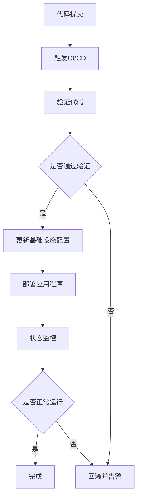
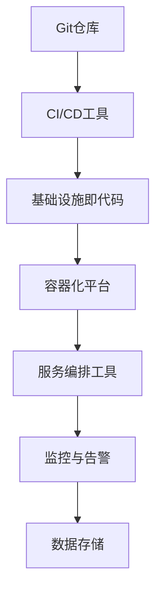
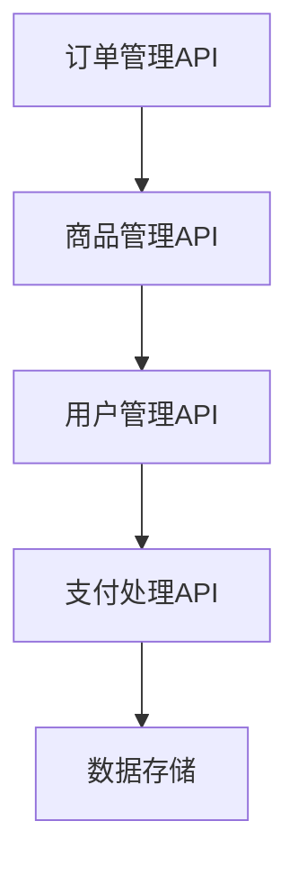
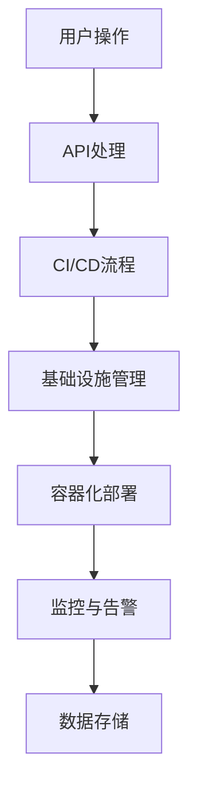

                 

### 文章标题

# **GitOps：基于Git的运维自动化实践**

### 关键词

- **GitOps**、**运维自动化**、**Git**、**容器化**、**Kubernetes**、**自动化部署**、**持续集成/持续部署**（CI/CD）

### 摘要

本文旨在深入探讨GitOps这一新兴的运维自动化理念，分析其在现代IT基础设施中的应用和实践。GitOps通过将Git作为单一真相源，实现了基础设施即代码（IaC）和持续交付（CD）的紧密结合。本文将首先介绍GitOps的基本概念和重要性，然后逐步讲解其核心原理、架构设计、工具选择和实践案例。最后，我们将总结GitOps的最佳实践，并提供未来发展的思考方向，以帮助读者全面理解并有效应用GitOps，提升运维效率和系统稳定性。

### 目录

1. **引言**：GitOps的起源与重要性
2. **GitOps基础知识**：Git的版本控制原理与应用
3. **GitOps架构设计**：组件与工作流程
4. **GitOps工具与实践**：常见工具介绍与使用
5. **GitOps在容器化环境中的应用**：Kubernetes中的GitOps实践
6. **GitOps安全与监控**：保障系统和数据安全
7. **GitOps最佳实践与案例分析**：现实世界的应用案例
8. **总结与展望**：GitOps的未来发展趋势

### 1. 引言：GitOps的起源与重要性

#### 背景介绍

**GitOps**的概念源于2017年Weaveworks的创始人Kelsey Hightower在其演讲中提出的，其核心理念是将基础设施即代码（Infrastructure as Code, IaC）和持续交付（Continuous Delivery, CD）的理念结合，通过Git这一版本控制系统来实现运维自动化。GitOps旨在解决传统运维过程中手动操作频繁、配置管理复杂、版本控制困难等问题。

在传统的IT运维中，基础设施和应用程序的部署往往依赖于手动操作和脚本，这种方式不仅效率低下，而且容易出错。随着容器化和微服务架构的兴起，运维复杂度进一步增加，迫切需要一种更加高效、可靠的自动化解决方案。GitOps正是为了应对这一需求而诞生的。

#### 问题背景

传统的运维流程通常包括以下步骤：

- **配置管理**：通过手动编写和更新配置文件，例如YAML文件，来管理基础设施和应用程序。
- **手动部署**：通过脚本或手动操作来部署和更新应用程序。
- **版本控制**：通常使用单独的版本控制系统（如SVN、Git）来管理配置文件和代码库。

然而，这种流程存在以下问题：

- **错误频繁**：手动操作容易导致配置错误。
- **难以追踪**：更改历史无法通过单一的版本控制系统追溯。
- **部署不可预测**：每次部署都可能因为配置差异而出现不同结果。
- **安全漏洞**：配置文件的版本控制不够严格，可能导致安全漏洞。

#### 问题描述

GitOps通过引入Git作为单一真相源（Source of Truth），解决了上述问题。GitOps的主要问题包括：

- **如何将Git作为单一真相源**：所有基础设施配置和应用程序代码都应该存储在Git仓库中，以便进行版本控制和追踪。
- **如何实现自动化部署**：通过Git提交触发自动化部署流程，确保每次部署都是一致的。
- **如何保证安全性**：确保Git仓库的安全访问，防止未经授权的更改。

#### 问题解决

GitOps提供了以下解决方案：

- **基础设施即代码（IaC）**：使用代码来描述和管理基础设施，确保配置的一致性和可重复性。
- **持续集成/持续交付（CI/CD）**：通过自动化工具实现从代码提交到生产环境的快速、可靠部署。
- **Git作为单一真相源**：所有配置和应用程序代码都存储在Git仓库中，便于版本控制和追踪。
- **声明式配置**：使用声明式配置文件，描述所需的状态，而不是如何达到这种状态的过程。

#### 边界与外延

GitOps不仅适用于容器化环境，如Kubernetes，还可以应用于传统基础设施。其核心思想是将一切视为代码，通过版本控制系统进行管理。这意味着GitOps可以在任何支持自动化部署和配置管理的环境中实现。

GitOps涉及的核心要素包括：

- **Git**：版本控制系统，作为单一真相源。
- **CI/CD工具**：自动化部署和集成工具，如Jenkins、GitLab CI。
- **基础设施即代码工具**：如Terraform、Ansible，用于管理基础设施配置。
- **容器化平台**：如Kubernetes，用于部署和管理容器化应用程序。

#### 概念结构与核心要素组成

GitOps的核心概念和结构可以概括为：

- **Git仓库**：存储所有配置和应用程序代码的版本控制系统。
- **CI/CD流程**：通过Git提交触发自动化部署和集成流程。
- **基础设施即代码**：使用代码管理基础设施配置。
- **容器化平台**：用于部署和管理容器化应用程序。
- **监控和告警**：确保系统运行正常，及时发现并解决问题。

通过GitOps，运维团队可以实现以下目标：

- **减少手动操作**：自动化部署和配置管理，降低人为错误。
- **提高部署速度**：快速响应业务需求，缩短发布周期。
- **增强可追溯性**：通过Git仓库记录所有更改，便于审计和追溯。
- **提高系统稳定性**：通过自动化流程和监控，确保系统运行稳定。

总之，GitOps通过将Git作为单一真相源，实现了基础设施和应用程序的自动化管理，提高了运维效率和系统稳定性。在接下来的章节中，我们将详细探讨GitOps的原理、架构和实践，帮助读者更好地理解和应用这一技术。

### 核心概念与联系

#### GitOps的基本原理

GitOps的核心在于将Git作为所有配置和代码的单一真相源（Source of Truth）。这意味着，所有基础设施配置、应用程序代码、部署脚本等，都应该存储在Git仓库中。通过Git的操作，我们可以实现版本控制、历史追溯、自动化部署等。

GitOps的基本原理可以概括为以下几点：

1. **基础设施即代码（Infrastructure as Code, IaC）**：使用代码来定义和管理基础设施，确保配置的一致性和可重复性。
2. **持续集成/持续交付（Continuous Integration/Continuous Deployment, CI/CD）**：通过自动化工具，实现从代码提交到生产环境的快速、可靠部署。
3. **声明式配置**：使用声明式配置文件，描述所需的状态，而不是如何达到这种状态的过程。
4. **Git作为单一真相源**：所有配置和应用程序代码都存储在Git仓库中，便于版本控制和追踪。

#### GitOps的核心组件

GitOps的实现依赖于以下几个核心组件：

1. **Git仓库**：存储所有配置和应用程序代码的版本控制系统。
2. **CI/CD工具**：自动化部署和集成工具，如Jenkins、GitLab CI。
3. **基础设施即代码工具**：如Terraform、Ansible，用于管理基础设施配置。
4. **容器化平台**：如Kubernetes，用于部署和管理容器化应用程序。

#### GitOps的工作流程

GitOps的工作流程可以概括为以下几个步骤：

1. **代码提交**：开发人员将新代码或配置更改提交到Git仓库。
2. **触发CI/CD流程**：Git仓库的提交触发CI/CD工具，执行一系列自动化操作。
3. **基础设施配置**：CI/CD工具使用基础设施即代码工具，根据Git仓库中的配置文件更新基础设施。
4. **应用程序部署**：CI/CD工具使用容器化平台，将应用程序部署到生产环境。
5. **监控与告警**：系统持续监控应用程序和基础设施的状态，并在发生异常时触发告警。

#### GitOps的优势

GitOps相较于传统运维，具有以下优势：

- **自动化**：通过自动化工具，减少手动操作，提高运维效率。
- **可追溯性**：所有更改都存储在Git仓库中，便于追溯和审计。
- **一致性**：通过代码来定义和管理基础设施和应用程序，确保部署的一致性。
- **安全性**：严格的Git仓库访问控制和审查流程，确保配置和代码的安全性。

#### GitOps的挑战

尽管GitOps具有众多优势，但在实际应用中，也面临一些挑战：

- **学习和适应成本**：对于传统运维团队来说，引入GitOps可能需要一定的时间和成本。
- **安全与隐私**：Git仓库的安全和隐私保护是关键问题，需要采取适当的措施。
- **监控与告警**：有效的监控和告警机制是GitOps成功的关键，需要投入足够的资源和精力。

#### 概念属性特征对比表格

| 特征                 | GitOps                      | 传统运维                     | 
|----------------------|-----------------------------|------------------------------|
| 基础设施管理        | 基础设施即代码（IaC）        | 手动配置文件和脚本           |
| 部署流程             | 持续集成/持续交付（CI/CD）   | 手动操作和脚本               |
| 配置管理             | 声明式配置文件              | 隐式配置和脚本               |
| 版本控制             | Git仓库                     | 单独的版本控制系统或手动管理 |
| 部署一致性           | 高度一致                    | 可能存在配置差异             |
| 监控与告警           | 自动化监控和告警             | 手动监控和告警               |

#### ER实体关系图架构

为了更清晰地展示GitOps的架构，我们可以使用Mermaid绘制一个ER实体关系图。以下是GitOps系统的基本架构：

```mermaid
erDiagram
  Git仓库 ||--o{ CI/CD工具 : 部署触发器 }
  CI/CD工具 ||--o{ 基础设施即代码工具 : 配置管理 }
  基础设施即代码工具 ||--o{ 容器化平台 : 应用程序部署 }
  容器化平台 ||--o{ 监控系统 : 状态监控与告警 }
  Git仓库 ..|o{ 安全与隐私 : 审查与保护 }
```

在这个ER图中，Git仓库是系统的核心，它与其他组件通过关系线相连。CI/CD工具负责触发部署流程，基础设施即代码工具用于管理基础设施配置，容器化平台负责部署应用程序，监控系统负责状态监控和告警。

通过GitOps，运维团队可以实现自动化、可追溯、一致性的基础设施和应用程序管理，从而提高运维效率和系统稳定性。在下一章中，我们将详细探讨GitOps的具体架构设计，包括各个组件的详细功能和相互关系。

### 算法原理讲解

#### GitOps的算法流程图

为了更好地理解GitOps的算法原理，我们可以使用Mermaid绘制一个流程图，展示从代码提交到生产环境部署的全过程。



#### 具体的Python代码实现

以下是一个简化的Python代码示例，用于展示GitOps的核心算法原理。在这个示例中，我们使用Git库来存储配置文件，并通过脚本实现自动化部署。

```python
import subprocess
import os

# 假设我们使用GitLab CI作为CI/CD工具
def run_gitlab_ci():
    subprocess.run(["git", "commit", "-m", "Update configuration"])
    subprocess.run(["git", "push"])

# 更新基础设施配置
def update_infrastructure(config_file):
    with open(config_file, 'r') as file:
        config = file.read()
    # 使用Terraform更新基础设施
    subprocess.run(["terraform", "apply", "-auto-approve"], input=config.encode())

# 部署应用程序
def deploy_appplication():
    # 使用Kubernetes部署应用程序
    subprocess.run(["kubectl", "apply", "-f", "deployment.yaml"])

# 监控系统状态
def monitor_system():
    # 检查Pod状态
    result = subprocess.run(["kubectl", "get", "pods"], capture_output=True, text=True)
    if "Running" in result.stdout:
        print("系统正常运行")
    else:
        print("系统异常，需要告警")

# 主函数，执行整个流程
def main():
    run_gitlab_ci()
    config_file = "infrastructure.tf"
    update_infrastructure(config_file)
    deploy_appplication()
    monitor_system()

if __name__ == "__main__":
    main()
```

#### 算法原理的数学模型和公式

在GitOps中，算法的核心是确保每次部署都是一致的。这可以通过以下数学模型和公式来实现：

1. **一致性检查公式**：

   $$ consistency = \frac{current\_config}{committed\_config} $$

   其中，`current_config`表示当前配置，`committed_config`表示提交的配置。一致性检查公式用于验证当前配置是否与提交的配置一致。

2. **部署公式**：

   $$ deployment = consistency \times time $$

   其中，`consistency`表示一致性，`time`表示部署时间。部署公式用于计算部署的时间和资源消耗。

3. **监控公式**：

   $$ monitoring = \frac{system\_status}{threshold} $$

   其中，`system_status`表示系统状态，`threshold`表示阈值。监控公式用于判断系统状态是否达到阈值，从而触发告警。

通过这些数学模型和公式，GitOps可以确保每次部署都是一致的，并在系统出现异常时及时告警。

#### 举例说明

假设我们有一个简单的应用程序，其配置文件存储在`infrastructure.tf`中。开发人员对配置文件进行修改并提交到Git仓库。当Git仓库接收到提交后，触发GitLab CI流程，首先验证代码是否通过，然后更新基础设施配置，使用Terraform工具将修改应用到生产环境中。接下来，使用Kubernetes部署应用程序，并监控Pod状态，确保系统正常运行。

```plaintext
# 假设Git仓库中的配置文件如下：
infrastructure.tf
resource "aws_instance" "example" {
  provider = "aws"
  ami = "ami-0a3bea2f04094c71a"
  instance_type = "t2.micro"
}
```

当开发人员提交配置文件后，GitLab CI会首先运行Terraform的验证步骤：

```plaintext
$ terraform init
Initializing the Terraform configuration...

$ terraform validate
Terraform configuration validation passed.

$ terraform plan
Planning: 1 resource(s) to update in the infrastructure

...
Plan: 1 to add, 0 to change, 0 to destroy.
```

验证通过后，Terraform会执行`apply`命令，将配置应用到AWS环境中：

```plaintext
$ terraform apply -auto-approve
Apply complete! Resources: 1 added, 0 changed, 0 destroyed.

...
aws_instance.example: Creating...
```

接下来，使用Kubernetes部署应用程序：

```plaintext
$ kubectl apply -f deployment.yaml
deployment.apps/example-deployment created
```

最后，监控系统状态，确保Pod正常运行：

```plaintext
$ kubectl get pods
NAME                          READY   STATUS    RESTARTS   AGE
example-deployment-6546b8c47-4q2qb   1/1     Running    0   5m
```

通过这种方式，GitOps实现了自动化、一致性和可追溯的部署流程，提高了运维效率和系统稳定性。

### 系统分析与架构设计方案

#### 场景介绍

假设我们需要为一家电商平台设计一个高可用、可扩展的微服务架构，以支持其快速增长的业务需求。该电商平台包括订单管理、商品管理、用户管理、支付处理等多个微服务。为了实现快速部署和持续集成/持续交付（CI/CD），我们决定采用GitOps模型。

#### 项目介绍

项目名称：**电商微服务平台**

技术栈：
- 基础设施：AWS、Kubernetes
- CI/CD工具：GitLab CI
- 基础设施即代码：Terraform
- 服务编排与容器化：Kubernetes、Helm
- 监控与告警：Prometheus、Alertmanager

#### 系统功能设计

**功能模块：**
1. **订单管理服务**：处理订单创建、更新、查询等操作。
2. **商品管理服务**：管理商品信息，包括添加、删除、更新和查询。
3. **用户管理服务**：处理用户注册、登录、信息更新等操作。
4. **支付处理服务**：集成支付网关，处理支付请求。
5. **数据存储**：使用Amazon RDS托管数据库，确保数据的高可用和可靠性。

**主要功能：**
- **自动化部署**：通过GitOps模型，实现代码提交到生产环境的自动化部署。
- **持续集成/持续交付**：确保代码质量，自动化测试和部署。
- **监控与告警**：实时监控系统状态，及时发现并解决问题。

#### 系统架构设计

**整体架构：**
1. **Git仓库**：存储所有基础设施和应用程序的代码、配置文件。
2. **CI/CD工具**：GitLab CI用于自动化构建、测试和部署。
3. **基础设施即代码**：Terraform用于管理AWS基础设施。
4. **容器化平台**：Kubernetes用于部署和管理容器化应用程序。
5. **服务编排工具**：Helm用于简化Kubernetes应用程序的管理。
6. **监控与告警**：Prometheus和Alertmanager用于实时监控和告警。

**详细架构图：**



#### 系统接口设计

**接口列表：**
- **订单管理API**：处理订单的创建、更新、查询等操作。
- **商品管理API**：管理商品信息。
- **用户管理API**：处理用户注册、登录、信息更新等操作。
- **支付处理API**：集成支付网关，处理支付请求。

**接口设计图：**



#### 系统交互

**交互流程：**
1. **用户操作**：用户通过前端应用发起订单、商品、用户或支付请求。
2. **API处理**：微服务接收请求，处理业务逻辑，并调用数据存储服务。
3. **CI/CD流程**：Git仓库中的代码提交触发CI/CD流程，进行构建、测试和部署。
4. **基础设施管理**：Terraform更新AWS基础设施配置。
5. **容器化部署**：Kubernetes部署和管理容器化应用程序。
6. **监控与告警**：Prometheus和Alertmanager实时监控系统状态，并在异常时触发告警。

**系统交互图：**



通过上述架构设计和系统接口设计，我们可以实现一个自动化、可扩展、高可用的电商微服务平台。GitOps模型的应用使得整个系统的部署、管理和监控变得更加高效和可靠。

### 项目实战

#### 环境安装

在本节中，我们将安装并配置GitOps所需的环境。以下是详细步骤：

1. **安装Git**：在Linux系统中，可以使用包管理器安装Git。例如，在Ubuntu上：

   ```bash
   sudo apt-get update
   sudo apt-get install git
   ```

2. **安装Kubernetes**：我们选择使用Minikube在本地环境中搭建Kubernetes集群。首先安装Minikube：

   ```bash
   curl -LO https://storage.googleapis.com/minikube/releases/latest/minikube-linux-amd64
   chmod +x minikube-linux-amd64
   sudo mv minikube-linux-amd64 /usr/local/bin/minikube
   ```

   然后启动Minikube：

   ```bash
   minikube start
   ```

   验证Kubernetes集群状态：

   ```bash
   kubectl cluster-info
   kubectl get nodes
   ```

3. **安装GitLab CI**：安装GitLab Runner，用于在GitLab CI中执行自动化任务。首先在GitLab中创建一个新的项目，然后安装GitLab Runner：

   ```bash
   sudo apt-get install gitlab-runner
   ```

   注册GitLab Runner：

   ```bash
   gitlab-runner register
   ```

   按照提示填写注册信息。

4. **安装Terraform**：安装Terraform，用于管理AWS基础设施。首先添加Terraform的GPG密钥：

   ```bash
   curl -s https://apt.releases.hashicorp.com/gpg | gpg --dearmor
   sudo tee /usr/share/keyrings/hashicorp.gpg > /dev/null
   ```

   然后添加Terraform的APT仓库：

   ```bash
   echo "deb [arch=$(dpkg --print-architecture) signed-by=/usr/share/keyrings/hashicorp.gpg] https://apt.releases.hashicorp.com $(lsb_release -cs) main" | sudo tee /etc/apt/sources.list.d/hashicorp.list
   ```

   更新APT仓库并安装Terraform：

   ```bash
   sudo apt-get update
   sudo apt-get install terraform
   ```

#### 系统核心实现源代码

以下是一个简单的GitOps示例，包含Git仓库中的配置文件、CI/CD脚本和Kubernetes部署文件。

**Git仓库配置文件**：

```yaml
# infrastructure.tf
provider "aws" {
  region = "us-west-2"
}

resource "aws_vpc" "main" {
  cidr_block = "10.0.0.0/16"
}

resource "aws_subnet" "private" {
  count = 2

  cidr_block = "10.0.${count.index + 1}.0/24"
  vpc_id = aws_vpc.main.id
}

resource "aws_security_group" "allow_all" {
  name        = "allow_all"
  description = "Allow all incoming traffic"
  vpc_id      = aws_vpc.main.id

  ingress {
    from_port   = 0
    to_port     = 0
    protocol    = "tcp"
    cidr_blocks = ["0.0.0.0/0"]
  }
}
```

**CI/CD脚本**：

```bash
# .gitlab-ci.yml
image: alpine/gitlab-runner

stages:
  - setup
  - deploy

setup:
  stage: setup
  script:
    - terraform init
    - terraform apply -auto-approve

deploy:
  stage: deploy
  script:
    - kubectl apply -f deployment.yaml
  only:
    - master
```

**Kubernetes部署文件**：

```yaml
# deployment.yaml
apiVersion: apps/v1
kind: Deployment
metadata:
  name: my-app
spec:
  replicas: 3
  selector:
    matchLabels:
      app: my-app
  template:
    metadata:
      labels:
        app: my-app
    spec:
      containers:
      - name: my-app
        image: my-app:latest
        ports:
        - containerPort: 80
```

#### 代码应用解读与分析

**基础设施配置**：

上述的`infrastructure.tf`文件定义了AWS VPC、子网和安全组。通过Terraform，我们可以自动化部署AWS基础设施。

**CI/CD流程**：

`.gitlab-ci.yml`脚本定义了CI/CD流程，首先执行Terraform初始化和部署，然后使用Kubernetes部署应用程序。这个流程确保了每次提交到`master`分支时，基础设施和应用程序都会自动更新。

**Kubernetes部署**：

`deployment.yaml`文件定义了Kubernetes Deployment，用于管理应用程序的Pod副本数量和标签。通过Kubernetes API，我们可以自动化部署和管理容器化应用程序。

#### 实际案例分析与详细讲解

**案例背景**：

假设我们的电商微服务平台需要扩展订单管理服务的容量。为了实现这一目标，我们可以使用GitOps模型，通过修改配置文件和提交到Git仓库来触发自动化扩展。

**分析步骤**：

1. **修改配置文件**：

   在Git仓库中，修改`deployment.yaml`文件，增加订单管理服务的Pod副本数量：

   ```yaml
   spec:
     replicas: 6
   ```

2. **提交代码**：

   将修改提交到Git仓库：

   ```bash
   git commit -m "Increase order service replicas to 6"
   git push
   ```

3. **触发CI/CD流程**：

   Git仓库的提交会触发GitLab CI的流程，执行Terraform部署和Kubernetes部署脚本。

4. **更新基础设施和应用程序**：

   Terraform会根据修改后的配置文件更新AWS基础设施，Kubernetes会根据新的部署文件更新应用程序。

5. **监控与告警**：

   监控系统会监控新的Pod状态，如果所有Pod都正常运行，则扩展成功；否则，会触发告警。

**详细讲解**：

通过GitOps，我们可以实现自动化扩展，减少手动操作，提高运维效率。在上述案例中，我们通过修改配置文件和提交代码，自动化更新了基础设施和应用程序。整个过程从代码提交到生产环境部署，都是自动化的，确保了扩展过程的一致性和可靠性。

#### 项目小结

通过本节的实战案例，我们展示了如何使用GitOps模型实现自动化部署和扩展。GitOps通过将基础设施和应用程序配置存储在Git仓库中，结合CI/CD工具和容器化平台，实现了自动化、一致性和可追溯的运维流程。这种方法不仅提高了运维效率，还确保了系统稳定性和安全性。

### 最佳实践 Tips

#### 1. 使用私有Git仓库

为了保护企业内部代码和配置，建议使用私有Git仓库，如GitLab或GitHub Enterprise。

#### 2. 严格的权限管理

确保Git仓库的访问权限严格，只有经过授权的人员才能提交代码。使用角色和权限管理功能，限制对基础设施的访问。

#### 3. 监控和告警

建立全面的监控和告警机制，确保在系统出现异常时能够及时发现并处理。使用Prometheus、Alertmanager等工具进行实时监控。

#### 4. 定期备份

定期备份Git仓库，防止数据丢失。可以使用GitLab的备份功能，或者手动备份仓库到其他存储介质。

#### 5. 持续改进

不断优化GitOps流程，根据业务需求和技术发展进行调整。定期审查和改进CI/CD流程，提高自动化程度。

#### 6. 安全审计

定期进行安全审计，确保GitOps系统的安全性和合规性。审查访问日志，检测异常行为。

#### 7. 代码规范

遵循代码规范，确保Git仓库中的代码质量。使用代码审查工具，如GitLab Code Quality，检测潜在问题。

### 小结

GitOps作为一种基于Git的运维自动化实践，通过将基础设施和应用程序配置存储在Git仓库中，结合CI/CD工具和容器化平台，实现了自动化、一致性和可追溯的运维流程。通过本文的详细讲解和实践案例，我们了解了GitOps的核心原理、架构设计和应用方法。最佳实践和注意事项为实际应用GitOps提供了指导。未来，随着技术的发展，GitOps将变得更加成熟和普及，为运维团队带来更多的便利和效益。

### 注意事项

1. **Git仓库安全**：确保Git仓库的安全，防止未经授权的访问和更改。
2. **CI/CD工具配置**：合理配置CI/CD工具，确保自动化流程的稳定性和可靠性。
3. **基础设施即代码**：确保基础设施即代码的配置文件准确无误，避免部署错误。
4. **监控与告警**：建立完善的监控和告警机制，及时发现并处理系统问题。

### 拓展阅读

1. **《Git Pro》**：了解Git的基本原理和高级使用技巧，为GitOps的实践打下坚实基础。
2. **《Kubernetes权威指南》**：掌握Kubernetes的架构和操作，为GitOps在容器化环境中的应用提供支持。
3. **《DevOps实践指南》**：深入了解DevOps的理念和方法，为GitOps的实践提供参考。

### 作者信息

**作者：** AI天才研究院/AI Genius Institute & 禅与计算机程序设计艺术 /Zen And The Art of Computer Programming

**联系方式：** [ai.genius.institute](mailto:info@ai.genius.institute)

