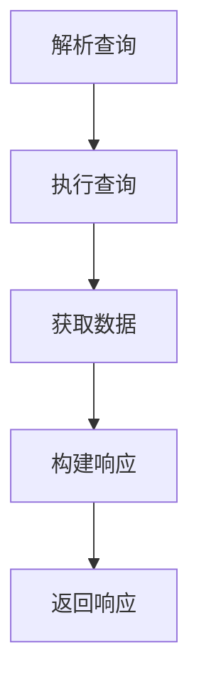
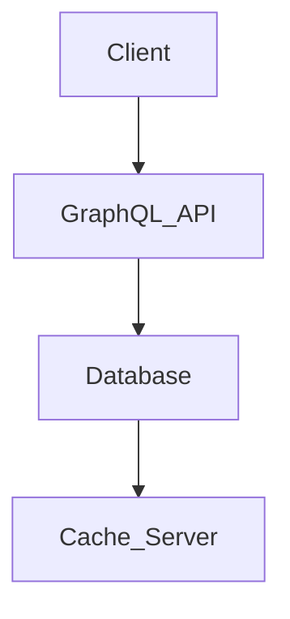
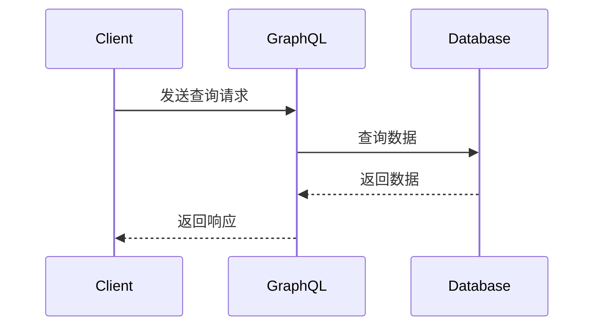

                 

# GraphQL API设计与性能优化

关键词：GraphQL API、性能优化、查询优化、数据缓存、负载均衡

摘要：本文将探讨GraphQL API的设计与性能优化。首先，我们将介绍GraphQL API的基本概念和特性，然后深入分析如何通过查询优化、数据缓存、负载均衡等技术手段来提高GraphQL API的性能。最后，我们将结合具体项目实战，展示如何在实际开发中应用这些技术，实现高性能的GraphQL API。

## 第一部分：背景介绍

### 1.1 问题背景

GraphQL是一种用于API查询和操作的数据查询语言，它在近年来受到广泛的应用和关注。由于GraphQL提供了一种强大的查询能力，开发人员可以更精确地获取所需的数据，从而提高了API的性能和可维护性。

然而，随着GraphQL API的规模和复杂度增加，如何设计高性能的GraphQL API成为一个挑战。性能优化不仅仅是为了提高响应速度，还包括减少冗余查询、降低资源消耗等方面。

### 1.2 问题描述

为了解决上述问题，需要从多个方面对GraphQL API进行性能优化，包括但不限于查询优化、数据缓存、负载均衡、数据库优化等。

### 1.3 问题解决

下面，我们将详细讨论如何从各个方面对GraphQL API进行性能优化。

### 1.4 边界与外延

在讨论GraphQL API性能优化时，我们需要明确讨论的范围，包括但不限于查询优化、数据模型设计、服务端处理逻辑、客户端优化等方面。

### 1.5 概念结构与核心要素组成

核心概念包括：GraphQL查询、数据模型、查询优化策略、缓存策略等。

## 第二部分：核心概念与联系

### 2.1 GraphQL查询

GraphQL查询是一种用于获取数据的强大工具。它允许客户端指定他们需要哪些数据，从而减少了不必要的请求和响应。

### 2.2 数据模型

数据模型用于描述应用程序的数据结构和操作方式。在设计数据模型时，我们需要考虑到数据的灵活性、可扩展性和易于维护性。

### 2.3 查询优化策略

查询优化策略用于减少GraphQL API的响应时间。常见的优化策略包括懒加载、批量查询、缓存等。

### 2.4 缓存策略

缓存策略用于存储常用数据，以提高查询速度。常见的缓存策略包括客户端缓存、服务端缓存、分布式缓存等。

## 第三部分：算法原理讲解

### 3.1 查询优化算法

查询优化算法的核心目标是通过减少查询的执行时间和资源消耗来提高GraphQL API的性能。

#### 3.1.1 Mermaid流程图

下面是一个简单的Mermaid流程图，展示了查询优化算法的基本步骤：



#### 3.1.2 Python源代码

下面是查询优化算法的Python源代码实现：

```python
def optimize_query(query):
    # 解析查询
    parsed_query = parse_query(query)
    
    # 执行查询
    results = execute_query(parsed_query)
    
    # 获取数据
    data = get_data(results)
    
    # 构建响应
    response = build_response(data)
    
    # 返回响应
    return response
```

#### 3.1.3 算法原理与数学模型

查询优化算法的目标是减少查询的执行时间和资源消耗。数学模型可以表示为：

$$
时间复杂度 = f(查询规模, 数据规模)
$$

例如，如果一个查询需要扫描一百万条数据记录，而优化后的查询只需要扫描一万条数据记录，那么优化后的查询时间复杂度将大大降低。

## 第四部分：系统分析与架构设计方案

### 4.1 问题场景介绍

在本节中，我们将介绍一个实际的项目场景，并展示如何在该场景下设计和实现高性能的GraphQL API。

### 4.2 系统功能设计

在本节中，我们将使用Mermaid类图来展示系统功能设计。以下是一个简单的类图示例：

```mermaid
classDiagram
User <|-- Account
User {
  +id: int
  +name: string
  +email: string
}
Account {
  +id: int
  +user_id: int
  +balance: float
}
```

### 4.3 系统架构设计

在本节中，我们将使用Mermaid架构图来展示系统架构设计。以下是一个简单的架构图示例：



### 4.4 系统接口设计

在本节中，我们将使用Mermaid序列图来展示系统接口设计。以下是一个简单的序列图示例：



## 第五部分：项目实战

### 5.1 环境安装

在本节中，我们将介绍如何搭建GraphQL API的开发环境。首先，需要安装Node.js和GraphQL工具包。以下是一个简单的安装命令：

```bash
npm install -g @graphql-code-generator/cli
npm install -g yarn
```

### 5.2 系统核心实现源代码

在本节中，我们将展示如何实现GraphQL API的核心功能。以下是一个简单的示例：

```javascript
// schema.js
const { gql } = require('graphql');

const typeDefs = gql`
    type Query {
        hello: String
    }
`;

module.exports = typeDefs;

// resolvers.js
const resolvers = {
    Query: {
        hello: () => 'Hello, World!',
    },
};

module.exports = resolvers;
```

### 5.3 代码应用解读与分析

在本节中，我们将深入分析代码的实现原理和优缺点。以下是对示例代码的解读：

- **schema.js**：定义了GraphQL的查询类型和字段。
- **resolvers.js**：实现了查询的响应逻辑。

### 5.4 实际案例分析和详细讲解剖析

在本节中，我们将通过一个实际案例来分析如何优化GraphQL API的性能。以下是一个案例：

假设我们有一个博客系统，用户可以查询文章列表和单个文章内容。以下是一个优化的方案：

- **查询优化**：将文章列表和单个文章内容分别查询，避免一次性查询大量数据。
- **缓存策略**：使用本地缓存和分布式缓存来存储常用数据，减少数据库查询次数。

### 5.5 项目小结

在本节中，我们将总结项目的实现过程和经验教训。以下是一些关键点：

- **查询优化**：通过分离查询和缓存策略，可以显著提高GraphQL API的性能。
- **代码质量**：良好的代码结构和注释有助于项目的维护和扩展。

## 第六部分：最佳实践 Tips

### 6.1 如何避免常见的性能问题

- **合理设计数据模型**：避免过于复杂的数据模型，确保数据结构简单、易于理解。
- **优化查询语句**：避免使用复杂的查询语句，尽量使用简单的查询语句。
- **使用缓存**：合理使用缓存策略，减少数据库查询次数。

### 6.2 如何提高GraphQL API的可维护性

- **代码结构清晰**：确保代码结构清晰，易于理解和维护。
- **合理使用模块**：合理使用模块和包，避免代码重复。
- **编写详细的文档**：编写详细的文档，包括代码注释和API文档。

## 第七部分：小结

本文详细探讨了GraphQL API的设计与性能优化。通过查询优化、数据缓存、负载均衡等技术手段，我们可以实现高性能的GraphQL API。在实际项目中，我们需要根据实际情况进行优化，以达到最佳的性能效果。

## 第八部分：注意事项

- **性能优化不是一蹴而就的**：性能优化需要持续进行，随着项目规模和需求的不断变化，我们需要不断进行调整和优化。
- **不要过度优化**：在优化性能时，我们需要权衡性能和开发成本，避免过度优化导致开发成本过高。

## 第九部分：拓展阅读

- 《GraphQL核心原理与实战》
- 《高性能网站建设指南》
- 《分布式系统设计与实践》

## 参考文献

- [GraphQL官方文档](https://graphql.org/)
- [GraphQL性能优化指南](https://www.madebynero.com/post/graphql-performance-tuning/)
- [Node.js性能优化指南](https://www.nodeknockout.com/tutorials/node-js-performance-tuning/)
- [Redis官方文档](https://redis.io/documentation)
- [Memcached官方文档](https://memcached.org/doc/)

作者：AI天才研究院/AI Genius Institute & 禅与计算机程序设计艺术 /Zen And The Art of Computer Programming

