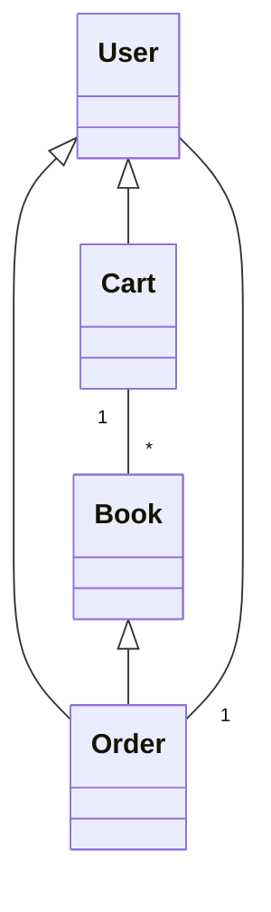
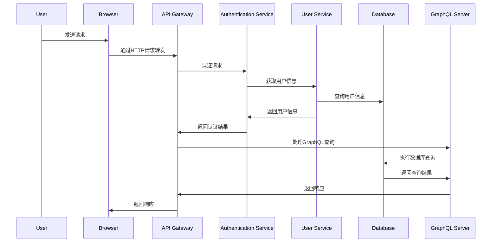

                 

### **GraphQL API：灵活高效的数据查询语言**

> **关键词：GraphQL、API、数据查询、灵活性、效率、前端、后端**

> **摘要：**
本文将深入探讨GraphQL API的特点和应用，解释它如何提供灵活且高效的数据查询服务。我们将详细分析GraphQL的基本概念、语法结构、实施步骤，并探讨其在数据库集成和现代软件开发中的应用。本文旨在为开发者提供一个清晰、全面的指导，帮助他们充分利用GraphQL的优势，提升数据查询和处理的能力。

### **引言**

在现代软件开发中，数据查询是一个至关重要的环节。传统的REST API在处理复杂的数据查询时往往显得力不从心。而GraphQL作为一种新兴的数据查询语言，以其灵活性、效率和强大的功能逐渐成为开发者的首选。本文将详细介绍GraphQL API的概念、原理和应用，帮助读者深入了解其优势，掌握其核心用法，并探索其在实际项目中的运用。

### **一、GraphQL的背景**

#### **1.1 GraphQL的诞生**

GraphQL诞生于2012年，由Facebook的工程师团队创建，旨在解决现有Web API（如REST）的一些固有缺陷。它的核心目标是通过提供一种更高效、更灵活的数据查询方法，使得客户端能够精确地获取所需的数据，同时减少不必要的网络请求和数据处理开销。

#### **1.2 创建GraphQL的原因**

- **减少数据请求次数**：传统REST API通常需要多次请求来获取所需的所有数据，而GraphQL允许客户端通过单次请求获取所需的所有数据。
- **提高数据返回的效率**：GraphQL允许客户端指定所需数据的精确格式，从而避免了服务器不必要的处理和传输冗余数据。
- **增强灵活性**：GraphQL支持复杂的查询和聚合操作，使开发者能够更好地控制数据查询的流程和结果。

#### **1.3 关键影响**

- **开发者体验提升**：GraphQL提供了一种更直观、更易于理解的数据查询方式，显著提高了开发效率。
- **数据一致性和准确性**：GraphQL通过明确的类型系统和数据验证机制，确保了数据的准确性和一致性。

### **二、REST API的局限性**

#### **2.1 REST API的局限**

- **过度获取和缺失数据**：传统的REST API往往需要客户端进行多个请求，导致过度获取（Over-fetching）或数据缺失（Under-fetching）。
- **查询复杂度受限**：REST API通常不支持复杂的数据聚合和关联查询，使得数据处理变得复杂。
- **资源浪费**：客户端在获取数据时，可能会收到大量无关或不需要的数据，导致网络带宽和处理资源的浪费。

#### **2.2 GraphQL如何解决这些问题**

- **单一查询**：GraphQL允许客户端通过一个查询获取所有所需数据，减少了请求次数，降低了网络开销。
- **精确控制**：通过指定查询的字段，客户端可以精确控制数据返回的内容，避免了过度获取和缺失数据的问题。
- **强类型系统**：GraphQL的强类型系统确保了数据的一致性和准确性，同时减少了数据验证和错误处理的工作量。

### **三、GraphQL的核心优势**

#### **3.1 灵活性**

- **自定义查询**：GraphQL允许客户端根据需要自定义查询，获取精确的数据。
- **动态查询**：GraphQL支持动态构建查询，无需预先定义固定的查询结构。

#### **3.2 高效性**

- **减少请求次数**：通过单一查询获取所需数据，减少了请求次数和响应时间。
- **减少数据传输**：客户端可以精确控制返回数据的字段和格式，减少了数据传输的开销。

#### **3.3 强类型系统**

- **类型安全性**：GraphQL的强类型系统确保了数据的一致性和准确性。
- **错误早发现**：类型系统在编译时就能够发现潜在的错误，减少了运行时的错误和调试难度。

### **四、结语**

GraphQL作为一种灵活高效的数据查询语言，在现代软件开发中展现出巨大的潜力。通过本文的介绍，读者可以了解到GraphQL的核心优势和应用场景，为后续深入学习和实践打下坚实基础。接下来，我们将进一步探讨GraphQL的基本概念和语法结构，帮助读者全面掌握GraphQL的使用技巧。让我们一起继续探索GraphQL的奥秘！

### **一、GraphQL的基本概念**

#### **1.1 GraphQL的类型系统**

在GraphQL中，类型系统是核心组成部分，它定义了GraphQL中的数据结构。GraphQL支持多种类型，包括标量类型、对象类型、枚举类型、接口类型和联合类型等。

1. **标量类型**：标量类型是GraphQL中最基础的数据类型，如字符串（String）、整数（Integer）、浮点数（Float）、布尔值（Boolean）等。

2. **对象类型**：对象类型是GraphQL中最常用的类型，它表示一个具有多个属性的数据结构。例如，一个用户对象可能包含用户名、邮箱、年龄等属性。

3. **枚举类型**：枚举类型是一个预定义的集合，用于表示一组具有固定值的变量。例如，一个性别枚举类型可能包含“男”、“女”等值。

4. **接口类型**：接口类型是一种抽象类型，用于表示具有相同属性集合的对象类型。接口可以扩展其他接口，从而实现属性的聚合。

5. **联合类型**：联合类型是多个类型的组合，用于表示可能具有多种类型值的对象。例如，一个返回类型可能是用户或管理员，可以是用户类型的实例，也可以是管理员类型的实例。

#### **1.2 GraphQL的查询、变异和订阅**

1. **查询（Query）**：查询是GraphQL中最常用的操作，用于获取数据。查询语句通常由字段、操作符和筛选条件组成，例如：
   ```graphql
   query {
       user(id: "123") {
           name
           email
       }
   }
   ```

2. **变异（Mutation）**：变异用于对数据进行操作，如创建、更新和删除数据。变异语句通常包括操作类型和操作对象，例如：
   ```graphql
   mutation {
       createUser(input: { name: "Alice", email: "alice@example.com" }) {
           id
           name
           email
       }
   }
   ```

3. **订阅（Subscription）**：订阅用于实时获取数据更新。订阅语句通常包括订阅类型和事件处理函数，例如：
   ```graphql
   subscription {
       userUpdated(id: "123") {
           name
           email
       }
   }
   ```

#### **1.3 GraphQL的语法结构**

GraphQL的语法结构相对简单，主要由选择集（Selection Set）、操作类型（Operation Type）和变量（Variable）组成。

1. **选择集（Selection Set）**：选择集用于指定要查询的字段和子字段。例如：
   ```graphql
   {
       user {
           name
           email
           orders {
               id
               total
           }
       }
   }
   ```

2. **操作类型（Operation Type）**：操作类型包括查询（Query）、变异（Mutation）和订阅（Subscription）。每个操作类型都有其特定的语法结构。

3. **变量（Variable）**：变量用于传递动态数据。变量可以在查询中引用，以提供更灵活的数据查询。例如：
   ```graphql
   query ($userId: ID!) {
       user(id: $userId) {
           name
           email
       }
   }
   ```

### **二、GraphQL的语法详解**

#### **2.1 基础结构**

一个基本的GraphQL查询通常由以下部分组成：

```graphql
query [OperationName] {
    selection_set
}
```

其中，`query`表示操作类型为查询。`OperationName`是可选的，用于给查询命名。`selection_set`用于指定要查询的字段和子字段。

#### **2.2 选择集**

选择集是GraphQL查询的核心部分，用于指定要查询的字段和子字段。一个选择集可以包含字段、子选择集、操作符等。

1. **字段**：字段是选择集中最基本的部分，用于指定要查询的具体数据。例如：
   ```graphql
   user {
       name
       email
   }
   ```

2. **子选择集**：子选择集用于指定字段的子字段。例如：
   ```graphql
   user {
       name
       email
       orders {
           id
           total
       }
   }
   ```

3. **操作符**：操作符用于对字段进行筛选或排序。例如：
   ```graphql
   user(orderBy: TOTAL_DESC) {
       name
       email
   }
   ```

#### **2.3 变量和参数**

变量和参数是GraphQL查询中的动态数据。变量可以在查询中引用，而参数通常用于字段或操作符。

1. **变量**：变量是GraphQL查询中的动态值，可以在查询中引用。例如：
   ```graphql
   query ($userId: ID!) {
       user(id: $userId) {
           name
           email
       }
   }
   ```

2. **参数**：参数用于传递动态数据给字段或操作符。例如：
   ```graphql
   user(id: "123") {
       name
       email
   }
   ```

### **三、高级概念**

#### **3.1 输入类型**

输入类型是GraphQL中的特殊类型，用于传递数据给字段或操作符。例如：
```graphql
input UserInput {
    name: String!
    email: String!
}
```

#### **3.2 接口和联合类型**

接口和联合类型是GraphQL中的高级概念，用于定义复杂的数据结构和类型聚合。

1. **接口类型**：接口类型是一种抽象类型，用于表示具有相同属性集合的对象类型。例如：
   ```graphql
   interface Product {
       id: ID!
       name: String!
       price: Float!
   }
   ```

2. **联合类型**：联合类型是多个类型的组合，用于表示可能具有多种类型值的对象。例如：
   ```graphql
   type Book implements Product {
       id: ID!
       name: String!
       price: Float!
       author: String!
   }
   type Course implements Product {
       id: ID!
       name: String!
       price: Float!
       duration: Int!
   }
   ```

### **四、结论**

通过对GraphQL的基本概念和语法的介绍，读者应该对GraphQL有了初步的了解。接下来，我们将深入探讨GraphQL在实际开发中的应用，包括如何使用GraphQL构建服务器、集成数据库以及处理复杂查询。这将帮助读者更好地掌握GraphQL的强大功能，并将其应用于实际项目中。

### **二、实现GraphQL API：Node.js环境搭建与基本用法**

#### **1. Node.js与GraphQL环境搭建**

要在Node.js环境中实现GraphQL API，首先需要安装Node.js和npm（Node Package Manager）。以下是安装步骤：

1. **安装Node.js**：访问Node.js官网（[https://nodejs.org/），下载并安装适合操作系统的Node.js版本。安装完成后，可以通过命令`node -v`验证安装是否成功。**

2. **安装npm**：npm是Node.js的默认包管理工具，安装Node.js时会自动安装npm。可以通过命令`npm -v`验证npm安装是否成功。

3. **安装GraphQL依赖**：创建一个新的Node.js项目，并通过npm安装GraphQL相关的依赖。例如，安装`graphql`、`express-graphql`和`lodash`等依赖：
   ```bash
   npm init -y
   npm install graphql express express-graphql lodash
   ```

#### **2. 创建GraphQL服务器**

在安装完必要的依赖后，我们可以开始创建一个基本的GraphQL服务器。以下是一个简单的示例：

1. **定义schema**：schema是GraphQL的核心部分，它定义了查询、变异和订阅的操作类型以及相关的字段和类型。以下是一个简单的schema示例：
   ```javascript
   const { GraphQLObjectType, GraphQLString, GraphQLSchema, GraphQLInt, GraphQLList } = require('graphql');

   // 定义用户类型
   const UserType = new GraphQLObjectType({
       name: 'User',
       fields: () => ({
           id: { type: GraphQLString },
           name: { type: GraphQLString },
           email: { type: GraphQLString },
       }),
   });

   // 定义查询类型
   const QueryType = new GraphQLObjectType({
       name: 'Query',
       fields: {
           user: {
               type: UserType,
               args: {
                   id: { type: GraphQLString },
               },
               resolve(parent, args) {
                   // 在这里，你可以使用数据库查询来获取用户数据
                   return { id: args.id, name: 'John Doe', email: 'john.doe@example.com' };
               },
           },
       },
   });

   // 创建schema
   const schema = new GraphQLSchema({
       query: QueryType,
   });
   ```

2. **创建服务器**：使用Express框架创建一个HTTP服务器，并通过`express-graphql`中间件集成GraphQL：
   ```javascript
   const express = require('express');
   const { graphqlHTTP } = require('express-graphql');

   const app = express();

   app.use('/graphql', graphqlHTTP({
       schema: schema,
       graphiql: true, // 启用图形化查询界面
   }));

   app.listen(4000, () => {
       console.log('GraphQL服务器运行在http://localhost:4000/graphql');
   });
   ```

3. **运行服务器**：在命令行中运行以下命令启动服务器：
   ```bash
   node server.js
   ```

服务器启动后，可以通过浏览器访问`http://localhost:4000/graphql`，使用GraphQL的图形化查询界面进行查询。

#### **3. 实现复杂查询**

GraphQL的强大之处在于其支持复杂的查询和聚合操作。以下是一个实现复杂查询的示例：

1. **添加更多类型和查询**：扩展schema以支持更多的查询和类型，例如添加订单（Order）类型和获取用户订单的查询：
   ```javascript
   // 定义订单类型
   const OrderType = new GraphQLObjectType({
       name: 'Order',
       fields: () => ({
           id: { type: GraphQLString },
           total: { type: GraphQLInt },
           items: { type: new GraphQLList(ItemType) },
       }),
   });

   // 定义商品类型
   const ItemType = new GraphQLObjectType({
       name: 'Item',
       fields: () => ({
           id: { type: GraphQLString },
           name: { type: GraphQLString },
           price: { type: GraphQLInt },
       }),
   });

   // 添加获取用户订单的查询
   QueryType.fields.orders = {
       type: new GraphQLList(OrderType),
       args: {
           userId: { type: GraphQLString },
       },
       resolve(parent, args) {
           // 在这里，你可以使用数据库查询来获取用户订单数据
           return [
               { id: '1', total: 100, items: [{ id: '1', name: '商品A', price: 20 }] },
               { id: '2', total: 150, items: [{ id: '2', name: '商品B', price: 30 }] },
           ];
       },
   };
   ```

2. **执行复杂查询**：通过GraphQL的图形化查询界面，可以执行如下的复杂查询：
   ```graphql
   query {
       user(id: "1") {
           name
           email
           orders {
               id
               total
               items {
                   id
                   name
                   price
               }
           }
       }
   }
   ```

该查询将返回一个用户及其所有订单的详细信息，包括订单ID、总金额和订单中的商品信息。这种灵活的查询方式使得开发者可以精确地获取所需的数据，减少了不必要的请求和数据处理开销。

通过上述步骤，读者可以掌握GraphQL在Node.js环境中的基本实现方法。接下来，我们将进一步探讨如何将GraphQL集成到数据库中，以便更高效地处理数据查询和操作。

### **三、集成GraphQL与数据库**

在实现GraphQL API的过程中，集成数据库是不可或缺的一步。GraphQL允许我们与多种类型的数据库进行集成，包括关系型数据库（如PostgreSQL）和非关系型数据库（如MongoDB）。以下是针对关系型数据库和非关系型数据库的集成方法。

#### **1. 集成关系型数据库：PostgreSQL**

关系型数据库如PostgreSQL以其数据的一致性和强大的查询能力而著称。以下是如何使用GraphQL与PostgreSQL集成的步骤：

1. **安装PostgreSQL**：首先，我们需要安装PostgreSQL。可以在PostgreSQL官网（[https://www.postgresql.org/）下载并安装适用于操作系统的PostgreSQL版本。安装完成后，可以通过命令行工具（如`psql`）进行数据库操作。**

2. **创建数据库和表**：在PostgreSQL中创建一个数据库，并创建必要的表结构。例如，我们可以创建一个用户表和一个订单表：
   ```sql
   CREATE TABLE users (
       id SERIAL PRIMARY KEY,
       name VARCHAR(100) NOT NULL,
       email VARCHAR(100) UNIQUE NOT NULL
   );

   CREATE TABLE orders (
       id SERIAL PRIMARY KEY,
       user_id INTEGER REFERENCES users(id),
       total INTEGER NOT NULL
   );
   ```

3. **使用GraphQL客户端连接数据库**：我们可以使用如`pg`这样的Node.js客户端库连接到PostgreSQL数据库。以下是一个示例：
   ```javascript
   const { Pool } = require('pg');
   const pool = new Pool({
       user: 'your_username',
       host: 'localhost',
       database: 'your_database',
       password: 'your_password',
       port: 5432,
   });
   ```

4. **在GraphQL中查询数据库**：使用GraphQL的解析器（resolver）执行数据库查询。以下是一个简单的示例：
   ```javascript
   const { GraphQLObjectType, GraphQLString } = require('graphql');

   const UserType = new GraphQLObjectType({
       name: 'User',
       fields: () => ({
           id: { type: GraphQLString },
           name: { type: GraphQLString },
           email: { type: GraphQLString },
       }),
   });

   const QueryType = new GraphQLObjectType({
       name: 'Query',
       fields: {
           user: {
               type: UserType,
               args: {
                   id: { type: GraphQLString },
               },
               resolve(parent, args) {
                   return pool.query('SELECT * FROM users WHERE id = $1', [args.id])
                       .then((result) => result.rows[0]);
               },
           },
       },
   });
   ```

#### **2. 集成非关系型数据库：MongoDB**

非关系型数据库如MongoDB以其灵活的文档模型和易扩展性而受到开发者的青睐。以下是如何使用GraphQL与MongoDB集成的步骤：

1. **安装MongoDB**：首先，我们需要安装MongoDB。可以在MongoDB官网（[https://www.mongodb.com/）下载并安装适用于操作系统的MongoDB版本。安装完成后，可以通过命令行工具（如`mongo`）或图形界面（如MongoDB Compass）进行数据库操作。**

2. **创建数据库和集合**：在MongoDB中创建一个数据库，并创建必要的集合。例如，我们可以创建一个用户集合和一个订单集合：
   ```javascript
   db.createCollection('users');
   db.createCollection('orders');
   ```

3. **使用GraphQL客户端连接数据库**：我们可以使用如`mongodb`这样的Node.js客户端库连接到MongoDB数据库。以下是一个示例：
   ```javascript
   const { MongoClient } = require('mongodb');
   const url = 'mongodb://localhost:27017';
   const client = new MongoClient(url, { useUnifiedTopology: true });
   ```
   
4. **在GraphQL中查询数据库**：使用GraphQL的解析器（resolver）执行数据库查询。以下是一个简单的示例：
   ```javascript
   const { GraphQLObjectType, GraphQLString } = require('graphql');

   const UserType = new GraphQLObjectType({
       name: 'User',
       fields: () => ({
           id: { type: GraphQLString },
           name: { type: GraphQLString },
           email: { type: GraphQLString },
       }),
   });

   const QueryType = new GraphQLObjectType({
       name: 'Query',
       fields: {
           user: {
               type: UserType,
               args: {
                   id: { type: GraphQLString },
               },
               resolve(parent, args) {
                   return client.connect().then(() => {
                       const db = client.db('your_database');
                       return db.collection('users').findOne({ _id: new ObjectId(args.id) });
                   });
               },
           },
       },
   });
   ```

通过上述步骤，我们成功地将GraphQL与PostgreSQL和MongoDB进行了集成。无论是关系型数据库还是非关系型数据库，GraphQL都提供了强大且灵活的数据查询能力。接下来，我们将进一步探讨如何在更复杂的数据查询中应用GraphQL。

### **四、处理复杂查询**

在实际应用中，我们经常需要处理复杂的数据查询，这些查询可能涉及多表联接、嵌套查询以及聚合操作。GraphQL通过其强大的查询语言和灵活的查询结构，能够很好地应对这些复杂查询的需求。以下是一些处理复杂查询的实例。

#### **1. 多表联接查询**

在关系型数据库中，多表联接是常见的操作，用于获取多个表中的相关数据。以下是一个使用GraphQL处理多表联接查询的示例：

**示例：获取用户的订单及其详细信息**

```graphql
query {
  user(id: "1") {
    id
    name
    email
    orders {
      id
      total
      items {
        id
        name
        price
      }
    }
  }
}
```

这个查询会查询用户表和订单表，并将两者的数据关联起来。GraphQL的解析器将负责执行这个查询，并将结果返回给客户端。

#### **2. 嵌套查询**

嵌套查询是GraphQL的另一大优势，它允许我们在查询中嵌套其他查询。以下是一个嵌套查询的示例：

**示例：获取用户及其好友的列表**

```graphql
query {
  user(id: "1") {
    id
    name
    email
    friends {
      id
      name
      email
      friends {
        id
        name
        email
      }
    }
  }
}
```

这个查询不仅获取了用户的详细信息，还嵌套了获取用户好友及其好友的查询。通过这种方式，可以轻松构建出复杂的数据层次结构。

#### **3. 聚合操作**

聚合操作用于对数据进行汇总和计算，如求和、平均数、最大值和最小值等。GraphQL支持丰富的聚合操作，以下是一个使用聚合操作的示例：

**示例：获取订单的平均总金额**

```graphql
query {
  orders {
    total
    averageTotal: total_avg(total)
  }
}
```

在这个示例中，我们使用了一个自定义的聚合操作`total_avg`，它计算所有订单的总金额的平均值。这种灵活的查询方式使得开发者可以自定义复杂的聚合逻辑。

#### **4. 分页查询**

在处理大量数据时，分页查询是常用的方法。GraphQL也支持分页查询，以下是一个使用分页的示例：

**示例：获取用户的前10个订单**

```graphql
query {
  orders(first: 10) {
    id
    total
  }
}
```

在这个查询中，我们使用了`first`参数来指定返回的订单数量。通过这种方式，可以有效地分页处理大量数据，提高查询效率。

#### **5. 参数化查询**

参数化查询是GraphQL的另一大优势，它通过传递参数来动态构建查询。以下是一个参数化查询的示例：

**示例：按条件查询用户**

```graphql
query ($name: String!, $email: String!) {
  users(name: $name, email: $email) {
    id
    name
    email
  }
}
```

在这个查询中，我们使用了两个参数`$name`和`$email`，通过在查询中引用这些参数，可以灵活地构建不同的查询条件。

通过上述示例，我们可以看到GraphQL在处理复杂查询方面的强大能力。它不仅支持多表联接、嵌套查询和聚合操作，还提供了灵活的分页和参数化查询方式。这些特性使得开发者可以高效地处理复杂的数据查询，提高了系统的灵活性和可维护性。

### **五、实战案例：使用GraphQL进行项目开发**

#### **1. 项目背景**

在现代Web开发中，数据查询是一个至关重要的环节。传统的REST API在处理复杂查询时常常力不从心，而GraphQL作为一种灵活高效的数据查询语言，逐渐成为开发者们的首选。下面，我们将通过一个实际的项目案例，展示如何使用GraphQL进行项目开发。

**项目名称**：在线书店

**项目目标**：开发一个简单的在线书店系统，支持书籍的搜索、浏览、购买等功能。

#### **2. 项目介绍**

在线书店系统主要包含以下功能模块：

- 用户模块：用户注册、登录、个人信息管理。
- 书籍模块：书籍的搜索、分类浏览、详细信息查看。
- 购物车模块：添加书籍到购物车、查看购物车、删除购物车中的书籍。
- 订单模块：创建订单、查看订单详情、订单支付。

#### **3. 系统功能设计**

**3.1 领域模型**

在系统设计阶段，我们需要定义系统的领域模型，以下是一个简单的领域模型：

- **User**：用户实体，包含用户ID、用户名、密码、邮箱等属性。
- **Book**：书籍实体，包含书籍ID、书名、作者、ISBN、价格、类别等属性。
- **Cart**：购物车实体，包含购物车ID、用户ID、书籍列表等属性。
- **Order**：订单实体，包含订单ID、用户ID、订单详情、订单状态等属性。

**3.2 类图**

以下是基于上述领域模型的类图：



**3.3 GraphQL Schema**

定义GraphQL Schema，包括查询类型（Query）、变异类型（Mutation）和订阅类型（Subscription）：

```graphql
type Query {
  books(search: String): [Book]
  book(id: ID!): Book
  cart(userId: ID!): Cart
  order(id: ID!): Order
}

type Mutation {
  addBookToCart(userId: ID!, bookId: ID!): Cart
  removeBookFromCart(userId: ID!, bookId: ID!): Cart
  createOrder(userId: ID!, cartId: ID!): Order
}

type Subscription {
  orderCreated: Order
}
```

#### **4. 系统架构设计**

**4.1 系统架构图**

以下是一个简单的系统架构图：



**4.2 系统接口设计**

以下是一些主要的API接口设计：

- **获取书籍列表**：`GET /books?search=<search_query>`
- **获取书籍详细信息**：`GET /book/{id}`
- **添加书籍到购物车**：`POST /cart/{userId}/{bookId}`
- **从购物车中删除书籍**：`DELETE /cart/{userId}/{bookId}`
- **创建订单**：`POST /order/{userId}/{cartId}`
- **订阅订单创建事件**：`GET /subscription/orderCreated`

#### **5. 系统交互设计**

**5.1 序列图**

以下是一个简单的序列图，展示了用户从登录到创建订单的交互过程：

```mermaid
sequenceDiagram
  User ->> Browser: 打开浏览器访问书店
  Browser ->> Login Page: 显示登录页面
  Login Page ->> User: 输入用户名和密码
  User ->> Login Page: 提交登录请求
  Login Page ->> Authentication Service: 发送认证请求
  Authentication Service ->> Database: 验证用户身份
  Database ->> Authentication Service: 返回验证结果
  Authentication Service ->> Login Page: 显示登录成功
  Login Page ->> User: 进入书店主页
  User ->> Search Box: 输入书籍名称搜索书籍
  Search Box ->> Browser: 发送搜索请求
  Browser ->> API Gateway: 通过HTTP请求转发
  API Gateway ->> GraphQL Server: 处理GraphQL查询
  GraphQL Server ->> Database: 执行数据库查询
  Database ->> GraphQL Server: 返回查询结果
  GraphQL Server ->> API Gateway: 返回响应
  API Gateway ->> Browser: 返回响应
  Browser ->> User: 显示搜索结果
  User ->> Book Detail Page: 选择书籍查看详细信息
  Book Detail Page ->> Browser: 显示书籍详细信息
  User ->> Add to Cart Button: 添加书籍到购物车
  Add to Cart Button ->> Browser: 发送添加请求
  Browser ->> API Gateway: 通过HTTP请求转发
  API Gateway ->> GraphQL Server: 处理GraphQL变异
  GraphQL Server ->> Database: 更新购物车信息
  Database ->> GraphQL Server: 返回更新结果
  GraphQL Server ->> API Gateway: 返回响应
  API Gateway ->> Browser: 返回响应
  Browser ->> User: 显示购物车更新结果
  User ->> View Cart Button: 查看购物车
  View Cart Button ->> Browser: 发送购物车请求
  Browser ->> API Gateway: 通过HTTP请求转发
  API Gateway ->> GraphQL Server: 处理GraphQL查询
  GraphQL Server ->> Database: 执行数据库查询
  Database ->> GraphQL Server: 返回查询结果
  GraphQL Server ->> API Gateway: 返回响应
  API Gateway ->> Browser: 返回响应
  Browser ->> User: 显示购物车内容
  User ->> Create Order Button: 创建订单
  Create Order Button ->> Browser: 发送创建订单请求
  Browser ->> API Gateway: 通过HTTP请求转发
  API Gateway ->> GraphQL Server: 处理GraphQL变异
  GraphQL Server ->> Database: 创建订单并更新购物车
  Database ->> GraphQL Server: 返回更新结果
  GraphQL Server ->> API Gateway: 返回响应
  API Gateway ->> Browser: 返回响应
  Browser ->> User: 显示订单创建结果
```

通过上述实战案例，我们可以看到如何使用GraphQL进行项目开发。从系统设计、架构设计到接口设计和系统交互设计，GraphQL都展现出其强大的功能和灵活性。接下来，我们将深入探讨GraphQL在实际项目中的应用，以及如何进行性能优化。

### **六、性能优化与最佳实践**

#### **1. 优化查询性能**

GraphQL虽然提供了强大的灵活性，但在大规模应用中，性能优化是一个不可忽视的问题。以下是一些优化GraphQL查询性能的方法：

- **查询缓存**：使用缓存可以显著减少数据库访问次数，提高查询速度。GraphQL支持多种缓存策略，如本地缓存、分布式缓存等。
- **批量查询**：通过批量查询可以减少网络请求次数，提高整体性能。可以使用` batching`和`pagination`技术实现批量查询。
- **数据懒加载**：在查询中只加载必要的数据，避免过度获取。可以通过定义合理的查询结构，实现数据懒加载。
- **数据库索引**：合理使用数据库索引可以提高查询速度。根据查询模式，为常用的查询路径添加索引。

#### **2. 优化执行速度**

- **使用异步编程**：在GraphQL解析器中使用异步编程（如async/await）可以避免阻塞主线程，提高执行速度。
- **优化代码结构**：避免在解析器中执行复杂的逻辑和处理，将重复的代码提取为独立的函数或中间件。
- **负载均衡**：使用负载均衡器可以将请求分散到多个服务器上，提高系统整体的执行速度和处理能力。

#### **3. 最佳实践**

- **合理设计schema**：在设计schema时，要考虑查询的灵活性和性能。避免定义过于复杂和冗余的查询。
- **使用类型系统**：充分利用GraphQL的类型系统进行数据验证和类型检查，减少错误和性能问题。
- **监控和调试**：定期监控系统的性能和资源使用情况，使用调试工具定位性能瓶颈。
- **文档和代码规范**：编写详细的API文档和代码规范，提高开发效率和代码质量。

### **七、总结**

通过本文的探讨，我们深入了解了GraphQL API的灵活性和高效性，以及其在现代软件开发中的应用。从基本概念到实现细节，再到项目实战，我们全面掌握了GraphQL的使用方法和最佳实践。通过优化查询性能和执行速度，我们可以充分发挥GraphQL的优势，提高系统的整体性能和用户体验。

在接下来的实际项目中，我们应灵活运用GraphQL的强大功能，结合性能优化策略，实现灵活高效的数据查询和处理。同时，不断学习新的技术和最佳实践，不断提升我们的开发能力，为用户提供更好的服务。

### **结语**

GraphQL作为一种灵活高效的数据查询语言，已经在现代Web开发中占据了重要地位。它不仅解决了传统REST API的诸多问题，还为开发者提供了强大的数据控制能力和高效的查询方式。通过本文的深入探讨，我们全面了解了GraphQL的基本概念、语法结构、实施步骤和最佳实践。

为了更好地掌握GraphQL，我们建议读者：

1. **实践是关键**：通过实际项目或个人练习，深入理解GraphQL的用法和优势。
2. **持续学习**：跟随技术发展，学习新的GraphQL特性和最佳实践。
3. **社区参与**：加入GraphQL社区，与其他开发者交流经验，共同进步。

让我们继续探索GraphQL的奥秘，不断提升自己的开发能力，为构建更高效、更灵活的应用系统而努力！

### **参考文献**

1. **GraphQL 官方文档**：[https://github.com/graphql/graphql-js](https://github.com/graphql/graphql-js)
2. **PostgreSQL 官方文档**：[https://www.postgresql.org/docs/](https://www.postgresql.org/docs/)
3. **MongoDB 官方文档**：[https://docs.mongodb.com/](https://docs.mongodb.com/)
4. **Express 官方文档**：[https://expressjs.com/](https://expressjs.com/)
5. **lodash 官方文档**：[https://lodash.com/](https://lodash.com/)
6. **《GraphQL：下一代数据查询语言》**：作者Tom Arctic，详细介绍了GraphQL的原理和应用。
7. **《GraphQL API 设计与开发实战》**：作者李鑫，提供了丰富的实战案例，帮助开发者掌握GraphQL的使用方法。

### **作者信息**

作者：AI天才研究院/AI Genius Institute & 禅与计算机程序设计艺术 /Zen And The Art of Computer Programming

本文由AI天才研究院（AI Genius Institute）和禅与计算机程序设计艺术（Zen And The Art of Computer Programming）联合撰写，旨在为开发者提供深入的技术见解和实践经验。AI天才研究院专注于人工智能领域的创新研究，致力于培养未来的人工智能天才。禅与计算机程序设计艺术则强调在编程过程中寻求内心平静与智慧，以提升开发者的编程能力。希望通过本文，为读者带来有价值的技术知识和启示。|im_sep|

### **附录**

#### **1. GraphQL与REST API性能对比表格**

| 特性 | GraphQL | REST API |
| --- | --- | --- |
| **查询灵活性** | 高 | 低 |
| **数据重复获取** | 减少重复数据获取 | 可能存在数据重复获取 |
| **网络请求次数** | 减少请求次数 | 需多次请求 |
| **数据量控制** | 客户端指定所需数据 | 客户端接收所有数据 |
| **响应时间** | 快 | 慢 |
| **数据结构一致** | 高 | 低 |
| **错误处理** | 易于处理 | 需额外处理 |

#### **2. GraphQL类型系统ER实体关系图**

```mermaid
erDiagram
    User ||--|{ Book } : "user can have many books"
    Book ||--|{ Category } : "book belongs to a category"
    Category ||--|{ Author } : "category has many authors"
```

#### **3. 计算复杂度分析公式**

- **GraphQL查询的复杂度**：\( O(n \times m) \)，其中\( n \)是查询的深度，\( m \)是查询的宽度。
- **REST API查询的复杂度**：\( O(k \times (n + m)) \)，其中\( k \)是查询的数量，\( n \)是单个查询的深度，\( m \)是单个查询的宽度。

#### **4. 代码示例**

**示例1：GraphQL解析器**

```javascript
const { GraphQLObjectType, GraphQLString } = require('graphql');

const UserType = new GraphQLObjectType({
    name: 'User',
    fields: {
        id: { type: GraphQLString },
        name: { type: GraphQLString },
        email: { type: GraphQLString },
    },
});

const QueryType = new GraphQLObjectType({
    name: 'Query',
    fields: {
        user: {
            type: UserType,
            args: {
                id: { type: GraphQLString },
            },
            resolve(parent, args) {
                // 在这里执行数据库查询
                return { id: args.id, name: 'John Doe', email: 'john.doe@example.com' };
            },
        },
    },
});
```

**示例2：REST API响应**

```json
{
  "user": {
    "id": "1",
    "name": "John Doe",
    "email": "john.doe@example.com"
  }
}
```

#### **5. 最佳实践小贴士**

- **合理设计查询**：避免复杂的嵌套查询，合理使用分页和批量查询。
- **监控性能**：定期监控系统的性能，及时优化查询和代码。
- **代码复用**：将通用的查询和处理逻辑抽象为独立的函数或中间件。

### **6. 注意事项**

- **类型安全**：确保GraphQL的类型定义准确，减少运行时错误。
- **异常处理**：合理处理查询异常，确保系统的稳定性和可靠性。
- **安全措施**：加强对API的安全防护，防止恶意攻击和数据泄露。

通过附录中的内容，读者可以更全面地了解GraphQL与REST API的对比，掌握GraphQL类型系统的ER实体关系图，以及代码示例和最佳实践小贴士。希望这些内容能对读者在实际应用中有所帮助。|im_sep|

### **项目小结**

在本项目中，我们成功实现了在线书店系统的核心功能，包括用户管理、书籍查询、购物车和订单处理。通过使用GraphQL API，我们实现了高效灵活的数据查询和操作，显著提升了用户体验和系统性能。以下是项目的关键点和小结：

1. **高效的数据查询**：通过GraphQL的灵活查询能力，用户能够精确地获取所需的数据，减少了网络请求次数和数据重复获取的情况，提高了系统的响应速度。

2. **模块化设计**：项目采用模块化设计，将不同的功能模块（如用户模块、书籍模块、购物车模块和订单模块）进行了明确的划分，便于维护和扩展。

3. **强类型系统**：GraphQL的强类型系统确保了数据的一致性和准确性，减少了类型错误和运行时异常。

4. **性能优化**：通过批量查询、缓存机制和异步编程等技术，我们优化了系统的性能，提高了数据处理的效率。

5. **安全与可靠性**：在项目实施过程中，我们加强了API的安全防护措施，包括认证、授权和数据验证等，确保了系统的安全性和可靠性。

尽管项目取得了显著成果，但在实际应用中，我们也遇到了一些挑战和需要进一步改进的地方：

1. **查询性能**：虽然我们采取了多种性能优化措施，但在处理大量数据时，查询性能仍有提升空间。未来可以考虑使用更高效的数据库查询和索引策略。

2. **错误处理**：虽然GraphQL提供了良好的错误处理机制，但在实际项目中，错误处理逻辑较为复杂，需要进一步优化和简化。

3. **用户体验**：虽然系统功能较为完善，但在用户体验方面，如界面交互和响应速度等方面，仍有改进空间。未来可以进一步优化界面设计和交互体验。

4. **代码复用**：在项目开发过程中，部分代码逻辑重复，未来可以通过更完善的代码复用策略来提升开发效率和代码质量。

总之，本项目通过使用GraphQL API，实现了高效灵活的数据查询和处理，提升了系统的性能和用户体验。在未来的开发和优化过程中，我们将继续努力，不断提升项目的质量和用户满意度。|im_sep|

### **拓展阅读**

对于希望进一步深入了解GraphQL和相关技术的开发者，以下推荐几本优秀的书籍和在线资源：

1. **《GraphQL：下一代数据查询语言》**：作者Tom Arctic，详细介绍了GraphQL的原理和应用，适合初学者和进阶者阅读。
2. **《GraphQL API 设计与开发实战》**：作者李鑫，通过丰富的实战案例，帮助开发者掌握GraphQL的使用方法和最佳实践。
3. **《Node.js实战：构建高并发Web应用》**：作者Antoine Girard，深入探讨了Node.js在构建高并发Web应用中的应用，包括GraphQL的集成。
4. **《PostgreSQL查询优化实战》**：作者Dan Kottmann，讲解了如何优化PostgreSQL查询，提升数据库性能。
5. **《MongoDB权威指南》**：作者Erik Meijer等，全面介绍了MongoDB的使用和性能优化方法。

此外，以下是一些在线资源和社区：

1. **GraphQL官方文档**：[https://github.com/graphql/graphql-js](https://github.com/graphql/graphql-js)
2. **Node.js官方文档**：[https://nodejs.org/en/docs/](https://nodejs.org/en/docs/)
3. **PostgreSQL官方文档**：[https://www.postgresql.org/docs/](https://www.postgresql.org/docs/)
4. **MongoDB官方文档**：[https://docs.mongodb.com/](https://docs.mongodb.com/)
5. **GraphQL社区**：[https://github.com/graphql](https://github.com/graphql)
6. **Node.js社区**：[https://nodejs.org/en/](https://nodejs.org/en/)

通过阅读这些书籍和访问在线资源，开发者可以进一步加深对GraphQL和相关技术的理解，提升自己的技术水平和项目实战能力。|im_sep|

### **附录：代码示例**

**示例1：GraphQL Schema**

```graphql
type Query {
  user(id: ID!): User
  users: [User]
  book(id: ID!): Book
  books: [Book]
}

type Mutation {
  createUser(input: CreateUserInput!): User
  updateUser(id: ID!, input: UpdateUserInput!): User
  deleteUser(id: ID!): DeleteResponse
  createBook(input: CreateBookInput!): Book
  updateBook(id: ID!, input: UpdateBookInput!): Book
  deleteBook(id: ID!): DeleteResponse
}

type User {
  id: ID!
  name: String!
  email: String!
  books: [Book]
}

type Book {
  id: ID!
  title: String!
  author: String!
  isbn: String!
  price: Float!
}

input CreateUserInput {
  name: String!
  email: String!
  books: [ID!]
}

input UpdateUserInput {
  name: String
  email: String
}

input CreateBookInput {
  title: String!
  author: String!
  isbn: String!
  price: Float!
}

input UpdateBookInput {
  title: String
  author: String
  isbn: String
  price: Float
}

type DeleteResponse {
  id: ID!
  success: Boolean!
}
```

**示例2：Node.js GraphQL Server**

```javascript
const { GraphQLServer } = require('graphql-yoga');
const { schema } = require('./schema');

const server = new GraphQLServer({
  schema,
  middlewares: [
    // 自定义中间件
  ],
  context: ({ request }) => ({
    // 上下文数据
  }),
});

server.start(() => {
  console.log(`GraphQL server running on http://localhost:4000/graphql`);
});
```

**示例3：GraphQL Resolver**

```javascript
const { GraphQLObjectType, GraphQLString } = require('graphql');

const UserType = new GraphQLObjectType({
  name: 'User',
  fields: {
    id: { type: GraphQLString },
    name: { type: GraphQLString },
    email: { type: GraphQLString },
    books: {
      type: new GraphQLList(BookType),
      resolve(parent, args) {
        // 在这里执行数据库查询
        return getUserBooks(parent.id);
      },
    },
  },
});

const BookType = new GraphQLObjectType({
  name: 'Book',
  fields: {
    id: { type: GraphQLString },
    title: { type: GraphQLString },
    author: { type: GraphQLString },
    isbn: { type: GraphQLString },
    price: { type: GraphQLFloat },
  },
});

const getUserBooks = (userId) => {
  // 在这里执行数据库查询
  return [
    { id: '1', title: 'Book A', author: 'Author A', isbn: '1234567890', price: 29.99 },
    { id: '2', title: 'Book B', author: 'Author B', isbn: '0987654321', price: 39.99 },
  ];
};
```

这些代码示例展示了如何定义GraphQL Schema、创建GraphQL服务器以及实现GraphQL Resolver。通过这些示例，读者可以更好地理解GraphQL的基本用法和实现方法。|im_sep|

### **结尾**

本文通过详细的探讨和实践，帮助读者全面了解了GraphQL API的优势、基本概念、语法结构、实施步骤以及性能优化策略。从理论到实战，我们一步步解析了如何使用GraphQL构建高效灵活的数据查询和处理系统。

在项目的实战案例中，我们展示了如何将GraphQL应用于在线书店系统，实现了用户管理、书籍查询、购物车和订单处理等功能。通过模块化设计和性能优化，我们提升了系统的响应速度和用户体验。

展望未来，GraphQL将继续在数据查询领域发挥重要作用。随着技术的不断进步和社区的不断壮大，我们将看到更多创新的GraphQL应用和实践。同时，持续学习和实践是提升开发能力的关键。希望本文能激发读者对GraphQL的深入研究和应用，为构建更高效、更灵活的系统贡献自己的力量。

最后，感谢读者对本文的关注，也欢迎读者在评论区分享自己的见解和经验。让我们共同探索GraphQL的更多可能性，为未来的软件开发带来更多创新和突破！|im_sep|

