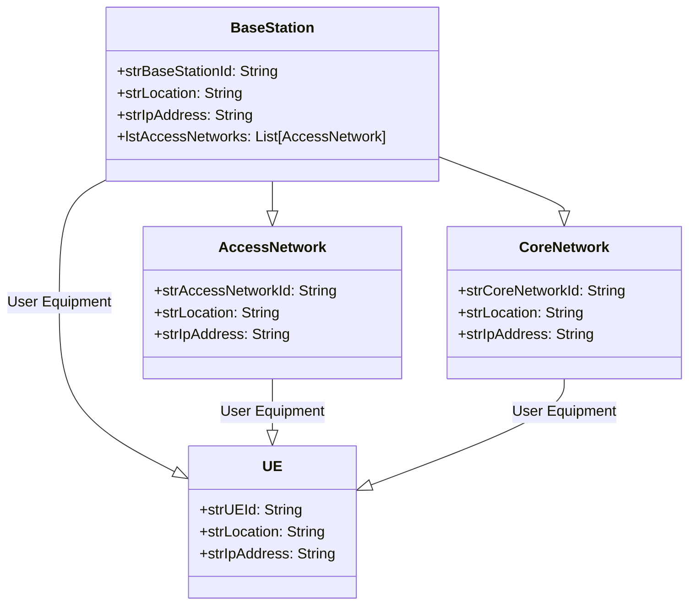
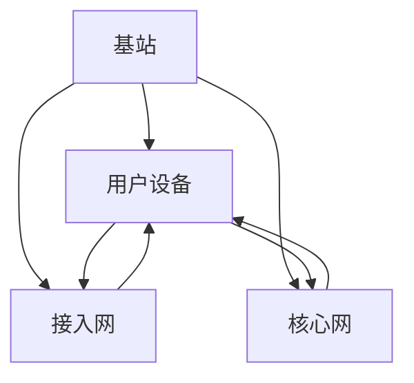

                 

# 5G专网建设与应用场景

## 关键词：5G专网、网络架构、应用场景、关键技术、政策法规

### 摘要：

本文将围绕5G专网的建设与应用场景进行探讨。首先，我们将概述5G专网的背景、重要性、关键要素和技术挑战，以及政策与标准。接着，我们将深入分析5G专网的关键技术，如频谱规划、无线通信技术、网络架构设计、网络切片技术、安全技术和能耗优化。最后，我们将探讨5G专网在工业互联网、智慧城市、零售与物流、医疗健康、能源与电力、公共安全等领域的应用场景，并给出案例分析。

----------------------------------------------------------------

## 第一部分：5G专网建设概述

### 1.1 5G专网背景介绍

#### 1.1.1 5G技术概述

5G技术是第五代移动通信技术的简称，旨在提供比4G更高的速度、更低的延迟和更大的连接能力。5G网络不仅支持更高速的数据传输，还能提供更高的网络容量和更广泛的覆盖范围。5G网络的关键特点包括：

- **更高的数据传输速度**：5G网络的最高理论速度可以达到20Gbps，是4G网络的100倍。
- **更低的延迟**：5G网络的延迟最低可达1毫秒，是4G网络的十分之一。
- **更大的连接能力**：5G网络能够支持更多的设备连接，每平方公里可以达到100万台设备。

#### 1.1.2 5G专网的定义与特点

5G专网是5G网络的一种特殊形式，专门为特定行业或组织提供服务。与公共网络相比，5G专网具有以下特点：

- **更高的安全性和可靠性**：5G专网通过隔离技术，将特定行业或组织的网络与公共网络分开，从而提高网络的安全性和可靠性。
- **更好的性能**：5G专网可以根据特定行业或组织的需求进行优化，提供更好的性能和更稳定的连接。
- **更高的灵活性**：5G专网支持网络切片技术，可以根据不同的应用场景，灵活地分配网络资源。

#### 1.1.3 5G专网的发展历程

5G专网的发展历程可以分为以下几个阶段：

- **初期阶段**：2019年，5G技术正式商用，5G专网开始进入人们的视野。
- **快速发展阶段**：2020年，全球多个国家开始建设5G专网，包括工业互联网、智慧城市等领域。
- **广泛应用阶段**：预计到2025年，5G专网将在全球范围内得到广泛应用，成为数字经济的重要组成部分。

### 1.2 5G专网的重要性

5G专网在各个领域具有广泛的应用前景，以下是5G专网在几个关键领域的重要性：

#### 1.2.1 5G专网在工业互联网中的应用

5G专网在工业互联网中具有重要作用，它能够提供高速、低延迟的连接，支持工业设备和系统的实时通信。5G专网在工业互联网中的应用包括：

- **设备远程监控**：通过5G专网，可以对工业设备进行远程监控和故障诊断。
- **自动化生产线**：5G专网可以支持自动化生产线的实时数据传输，提高生产效率。
- **智能工厂**：5G专网为智能工厂提供了高速、稳定的网络连接，支持工厂内各种设备和系统的协同工作。

#### 1.2.2 5G专网在智慧城市中的应用

5G专网在智慧城市中发挥着关键作用，它能够提供高速、低延迟的网络连接，支持城市各类智能系统的运行。5G专网在智慧城市中的应用包括：

- **智能交通**：通过5G专网，可以实时监控交通流量，优化交通信号灯，减少交通拥堵。
- **智能安防**：5G专网可以支持智能安防系统的实时数据传输，提高城市的安全管理水平。
- **智能环保**：5G专网可以支持环境监测设备的实时数据传输，帮助城市管理者更好地进行环境管理。

#### 1.2.3 5G专网在其他领域的应用前景

除了工业互联网和智慧城市，5G专网在其他领域也具有广阔的应用前景。以下是5G专网在其他领域的一些应用：

- **零售与物流**：通过5G专网，可以实现零售和物流领域的实时数据传输，提高业务效率和准确性。
- **医疗健康**：通过5G专网，可以实现医疗设备的远程监控和诊断，提高医疗服务水平。
- **能源与电力**：通过5G专网，可以实现能源和电力系统的实时监控和调度，提高能源利用效率。
- **公共安全**：通过5G专网，可以实现公共安全的实时监控和应急响应，提高公共安全保障水平。

### 1.3 5G专网建设的关键要素

5G专网建设涉及多个关键要素，以下是5G专网建设的关键要素：

#### 1.3.1 5G专网的网络架构

5G专网的网络架构包括基站、接入网、核心网和用户设备。5G专网的网络架构可以根据实际需求进行定制化设计，以满足不同场景的需求。

#### 1.3.2 5G专网的关键技术

5G专网的关键技术包括频谱规划、无线通信技术、网络架构设计、网络切片技术、安全技术和能耗优化等。这些技术是5G专网建设的基础，直接影响网络的性能和可靠性。

#### 1.3.3 5G专网的安全与隐私保护

5G专网的安全与隐私保护是5G专网建设的关键问题。5G专网需要采取有效的安全措施，确保网络的安全性和用户隐私的保护。

#### 1.3.4 5G专网的频谱资源分配

5G专网的频谱资源分配是5G专网建设的重要环节。频谱资源的合理分配可以提高网络的性能和效率，满足不同场景的需求。

#### 1.3.5 5G专网的覆盖与容量

5G专网的覆盖与容量是5G专网建设的关键指标。5G专网需要实现广泛的覆盖，同时提供足够的容量，以满足不同场景的需求。

#### 1.3.6 5G专网的网络性能优化

5G专网的网络性能优化是5G专网建设的重要任务。通过优化网络性能，可以提高网络的可靠性和用户体验。

### 1.4 5G专网建设的技术挑战

5G专网建设面临多个技术挑战，以下是5G专网建设的技术挑战：

#### 1.4.1 5G专网的频谱资源分配

5G专网的频谱资源分配是5G专网建设的一个技术挑战。频谱资源的稀缺性要求我们必须合理分配频谱资源，以满足不同场景的需求。

#### 1.4.2 5G专网的覆盖与容量

5G专网的覆盖与容量是5G专网建设的另一个技术挑战。实现广泛的覆盖和足够的容量需要我们在网络规划和设备部署上进行精细的优化。

#### 1.4.3 5G专网的网络性能优化

5G专网的网络性能优化是5G专网建设的一个重要挑战。我们需要通过优化网络架构、无线通信技术和其他关键技术，提高网络的性能和可靠性。

### 1.5 5G专网建设的政策与标准

5G专网建设需要政策的支持和标准的规范，以下是5G专网建设的政策与标准：

#### 1.5.1 国际5G专网标准

国际5G专网标准主要由国际电信联盟（ITU）和国际标准化组织（ISO）制定。这些标准为5G专网建设提供了技术指导。

#### 1.5.2 我国5G专网政策与法规

我国政府高度重视5G专网建设，出台了一系列政策和法规，为5G专网建设提供了政策支持。

#### 1.5.3 5G专网产业链的发展趋势

5G专网产业链的发展趋势包括技术创新、产业链整合和市场推广等。随着5G专网建设的不断推进，产业链各环节将不断优化，为5G专网建设提供有力支持。

### 1.6 本章小结

本文对5G专网的建设与应用场景进行了概述。5G专网具有更高的安全性、可靠性和性能，在工业互联网、智慧城市和其他领域具有广泛的应用前景。然而，5G专网建设也面临一些技术挑战，如频谱资源分配、覆盖与容量和网络性能优化等。政策与标准的支持对于5G专网建设至关重要。

----------------------------------------------------------------

## 第二部分：5G专网建设关键技术

### 2.1 频谱规划

频谱规划是5G专网建设的关键技术之一。合理的频谱规划可以提高网络的性能和效率，满足不同场景的需求。

#### 2.1.1 频谱资源概况

频谱资源是指无线电波的频率范围，用于通信信号的传输。5G专网使用的频谱资源包括低频段、中频段和高频段。

- **低频段**：低频段频谱资源具有较好的传播特性，适合实现广覆盖。
- **中频段**：中频段频谱资源具有较好的传输性能，适合实现高速连接。
- **高频段**：高频段频谱资源具有丰富的带宽资源，适合实现高容量连接。

#### 2.1.2 频谱分配策略

频谱分配策略包括频谱划分、频谱拍卖和频谱共享等。

- **频谱划分**：频谱划分是将频谱资源划分为不同的频段，以满足不同应用的需求。
- **频谱拍卖**：频谱拍卖是一种市场化的频谱分配方式，通过拍卖方式确定频谱资源的分配。
- **频谱共享**：频谱共享是指多个用户在同一频段上共享频谱资源，通过频谱共享技术实现频谱资源的充分利用。

#### 2.1.3 频谱利用率优化

频谱利用率优化是提高5G专网性能的重要手段。频谱利用率优化包括频谱感知、频谱分配和频谱共享等。

- **频谱感知**：频谱感知是检测和监测可用频谱资源的过程，通过频谱感知可以避免频谱资源的冲突。
- **频谱分配**：频谱分配是根据频谱感知结果，将可用频谱资源分配给不同用户或场景。
- **频谱共享**：频谱共享是在同一频段上，多个用户或场景共享频谱资源，通过共享技术实现频谱资源的最大化利用。

### 2.2 无线通信技术

无线通信技术是5G专网的核心技术之一。5G无线通信技术包括多输入多输出（MIMO）技术、波束成形技术和毫米波通信等。

#### 2.2.1 基站选址与部署

基站选址与部署是5G专网建设的关键环节。合理的基站选址与部署可以提高网络的覆盖范围和性能。

- **基站选址**：基站选址应考虑地形、人口密度和信号传播特性等因素。
- **基站部署**：基站部署包括基站设备的安装、调试和优化等。

#### 2.2.2 MIMO技术

MIMO技术是一种多天线技术，通过在发送端和接收端使用多个天线，实现更高的数据传输速率和更好的传输性能。

- **发送端MIMO**：发送端MIMO通过多个发送天线发送多个数据流，提高传输速率。
- **接收端MIMO**：接收端MIMO通过多个接收天线接收多个数据流，提高传输可靠性。

#### 2.2.3 波束成形技术

波束成形技术是一种通过调整天线阵列的方向，实现信号聚焦传输的技术。波束成形技术可以提高传输距离和传输质量。

- **波束成形原理**：波束成形通过调整天线阵列的相位和幅度，实现信号方向的调整。
- **波束成形优势**：波束成形可以减少信号干扰，提高传输效率。

#### 2.2.4 毫米波通信

毫米波通信是一种高频段通信技术，通过使用高频段的毫米波信号进行传输。毫米波通信具有更高的传输速率和更大的带宽。

- **毫米波频段**：毫米波频段是指30GHz至300GHz的频段。
- **毫米波优势**：毫米波通信可以提供更高的传输速率和更大的带宽，但需要考虑信号传播距离和穿透能力。

### 2.3 网络架构设计

5G专网的网络架构设计是5G专网建设的关键环节。5G专网的网络架构包括基站架构、接入网架构和核心网架构。

#### 2.3.1 基站架构

基站架构是5G专网的核心，包括基站设备、基站天线和基站控制器等。

- **基站设备**：基站设备包括基站射频单元、基站基带单元和基站控制器等。
- **基站天线**：基站天线包括天线阵列、天线罩和天线控制器等。
- **基站控制器**：基站控制器负责基站设备的监控和管理。

#### 2.3.2 接入网架构

接入网架构是5G专网与用户设备之间的连接，包括无线接入网和光纤接入网。

- **无线接入网**：无线接入网包括基站、用户设备和无线接入控制器等。
- **光纤接入网**：光纤接入网包括光纤线路、光纤接入设备和光纤终端等。

#### 2.3.3 核心网架构

核心网架构是5G专网的通信核心，包括控制平面和数据平面。

- **控制平面**：控制平面负责用户设备的接入管理、信令控制和资源分配等。
- **数据平面**：数据平面负责用户数据流的传输和转发。

### 2.4 网络切片技术

网络切片技术是5G专网的关键技术之一，通过将网络资源划分为多个虚拟网络，满足不同场景的需求。

#### 2.4.1 网络切片概念与分类

网络切片是指将网络资源划分为多个虚拟网络，每个虚拟网络具有独立的网络资源和网络功能。网络切片可以根据应用场景和需求进行分类，包括以下几种类型：

- **通用网络切片**：通用网络切片为通用应用提供网络资源，如智能家居、智能交通等。
- **专用网络切片**：专用网络切片为特定行业或组织提供专用网络资源，如工业互联网、智慧城市等。
- **动态网络切片**：动态网络切片可以根据用户需求动态调整网络资源，实现灵活的网络服务。

#### 2.4.2 网络切片的关键技术

网络切片的关键技术包括切片标识、切片管理、切片资源配置和切片隔离等。

- **切片标识**：切片标识用于唯一标识不同的网络切片，确保网络资源的正确分配。
- **切片管理**：切片管理负责网络切片的创建、配置和监控等。
- **切片资源配置**：切片资源配置负责根据切片需求和资源情况，分配网络资源。
- **切片隔离**：切片隔离确保不同网络切片之间的数据隔离和安全保障。

#### 2.4.3 网络切片的实现方法

网络切片的实现方法包括虚拟化技术、网络功能虚拟化和分布式架构等。

- **虚拟化技术**：虚拟化技术可以将物理网络资源虚拟化为多个虚拟网络，实现网络切片。
- **网络功能虚拟化**：网络功能虚拟化将网络功能模块虚拟化为软件实例，实现网络切片的功能。
- **分布式架构**：分布式架构通过网络资源的分布式部署和管理，实现网络切片的灵活配置和管理。

### 2.5 安全技术

安全技术是5G专网建设的重要组成部分，确保网络的安全性和用户数据的安全性。

#### 2.5.1 5G专网安全威胁分析

5G专网安全威胁包括网络攻击、数据泄露、设备恶意软件等。

- **网络攻击**：网络攻击包括拒绝服务攻击、分布式拒绝服务攻击等。
- **数据泄露**：数据泄露包括用户数据泄露、网络配置数据泄露等。
- **设备恶意软件**：设备恶意软件包括设备病毒、恶意软件等。

#### 2.5.2 安全协议与技术

5G专网安全协议和技术包括加密技术、认证技术、访问控制技术等。

- **加密技术**：加密技术用于保护用户数据的安全，防止数据泄露。
- **认证技术**：认证技术用于确认用户身份，确保网络访问的安全性。
- **访问控制技术**：访问控制技术用于控制用户访问网络资源的权限。

#### 2.5.3 安全架构与策略

5G专网安全架构和策略包括网络安全架构、安全策略和安全运维等。

- **网络安全架构**：网络安全架构包括防火墙、入侵检测系统、安全审计等。
- **安全策略**：安全策略包括安全策略制定、安全策略执行和安全策略监控等。
- **安全运维**：安全运维包括安全事件的监测、分析和响应等。

### 2.6 能耗优化

能耗优化是5G专网建设的一个重要环节，旨在降低网络能耗，提高能源利用效率。

#### 2.6.1 5G专网的能耗特点

5G专网的能耗特点包括：

- **高能耗**：5G专网使用高频段信号进行传输，能耗较高。
- **动态能耗**：5G专网的能耗随着网络负载和传输速率的变化而变化。

#### 2.6.2 能耗优化技术

能耗优化技术包括能效管理技术、节能技术、分布式能源管理等。

- **能效管理技术**：能效管理技术通过监测和优化网络设备的能耗，降低网络能耗。
- **节能技术**：节能技术通过优化网络架构和无线通信技术，降低网络能耗。
- **分布式能源管理**：分布式能源管理通过利用分布式能源技术，降低网络能耗。

#### 2.6.3 能耗管理与监测

能耗管理与监测是5G专网建设的重要组成部分，包括能耗监测、能耗分析和能耗优化等。

- **能耗监测**：能耗监测通过监测网络设备的能耗，了解网络能耗状况。
- **能耗分析**：能耗分析通过对能耗数据进行统计和分析，找出能耗瓶颈。
- **能耗优化**：能耗优化通过优化网络架构和无线通信技术，降低网络能耗。

### 2.7 5G专网建设案例分析

#### 2.7.1 工业互联网场景

在工业互联网场景中，5G专网主要用于实现工业设备的远程监控、数据传输和协同工作。以下是一个工业互联网场景的5G专网建设案例分析：

- **项目背景**：某制造企业希望实现生产设备的远程监控和智能调度。
- **网络架构**：采用5G专网架构，包括基站、接入网和核心网。
- **关键技术**：采用MIMO技术和波束成形技术，提高网络性能和可靠性。
- **安全措施**：采用加密技术和认证技术，确保数据传输安全。

#### 2.7.2 智慧城市场景

在智慧城市场景中，5G专网主要用于实现智能交通、智能安防和智能环保等应用。以下是一个智慧城市场景的5G专网建设案例分析：

- **项目背景**：某城市希望建设一个智慧城市平台，实现城市各系统的智能化管理。
- **网络架构**：采用5G专网架构，包括基站、接入网和核心网。
- **关键技术**：采用网络切片技术，实现不同应用场景的网络资源优化。
- **安全措施**：采用加密技术和访问控制技术，确保城市数据安全。

#### 2.7.3 其他领域应用场景

5G专网在其他领域也具有广泛的应用前景，如零售与物流、医疗健康、能源与电力等。以下是一个其他领域应用场景的5G专网建设案例分析：

- **项目背景**：某物流公司希望实现物流信息的实时传输和智能分析。
- **网络架构**：采用5G专网架构，包括基站、接入网和核心网。
- **关键技术**：采用毫米波通信技术和能耗优化技术，提高网络性能和效率。
- **安全措施**：采用加密技术和安全监测技术，确保物流数据安全。

### 2.8 本章小结

本文对5G专网建设的关键技术进行了分析，包括频谱规划、无线通信技术、网络架构设计、网络切片技术、安全技术和能耗优化等。5G专网建设需要综合考虑多种技术，以满足不同场景的需求。通过案例分析，我们可以看到5G专网在不同领域的应用效果和挑战。

----------------------------------------------------------------

## 第三部分：5G专网应用场景

### 3.1 工业互联网

工业互联网是5G专网的一个重要应用场景，通过5G专网实现工业设备的远程监控、数据传输和协同工作。

#### 3.1.1 工业互联网概述

工业互联网是工业设备、信息系统和互联网的融合，通过物联网、大数据、人工智能等技术，实现工业设备的高效管理和智能化生产。

- **工业设备**：工业互联网中的工业设备包括传感器、执行器、控制器等。
- **信息系统**：工业互联网中的信息系统包括企业资源计划（ERP）、制造执行系统（MES）等。
- **互联网**：工业互联网中的互联网是指互联网技术，用于实现工业设备和信息系统的互联互通。

#### 3.1.2 5G专网在工业互联网中的应用

5G专网在工业互联网中的应用包括：

- **设备远程监控**：通过5G专网，实现对工业设备的远程监控和故障诊断。
- **数据传输**：通过5G专网，实现工业设备的数据传输，支持工业大数据分析。
- **协同工作**：通过5G专网，实现工业设备之间的协同工作，提高生产效率。

#### 3.1.3 案例分析：某工业互联网平台建设

某工业互联网平台建设案例分析如下：

- **项目背景**：某制造企业希望建设一个工业互联网平台，实现生产设备的数据传输和协同工作。
- **网络架构**：采用5G专网架构，包括基站、接入网和核心网。
- **关键技术**：采用MIMO技术和网络切片技术，提高网络性能和可靠性。
- **安全措施**：采用加密技术和认证技术，确保数据传输安全。

### 3.2 智慧城市

智慧城市是5G专网的另一个重要应用场景，通过5G专网实现城市各类智能系统的运行和管理。

#### 3.2.1 智慧城市概述

智慧城市是利用物联网、云计算、大数据、人工智能等技术，实现城市管理和服务的智能化。

- **智能交通**：通过智能交通系统，实现交通流量监控、交通信号优化和车辆管理。
- **智能安防**：通过智能安防系统，实现城市安全监控、人脸识别和应急响应。
- **智能环保**：通过智能环保系统，实现环境监测、污染控制和生态保护。

#### 3.2.2 5G专网在智慧城市中的应用

5G专网在智慧城市中的应用包括：

- **智能交通**：通过5G专网，实现交通流量监控和信号优化，减少交通拥堵。
- **智能安防**：通过5G专网，实现城市安全的监控和应急响应，提高城市安全管理水平。
- **智能环保**：通过5G专网，实现环境监测和污染控制，提高城市环境质量。

#### 3.2.3 案例分析：某智慧城市建设

某智慧城市建设案例分析如下：

- **项目背景**：某城市希望建设一个智慧城市平台，实现城市各系统的智能化管理。
- **网络架构**：采用5G专网架构，包括基站、接入网和核心网。
- **关键技术**：采用网络切片技术和毫米波通信技术，提高网络性能和可靠性。
- **安全措施**：采用加密技术和安全监测技术，确保城市数据安全。

### 3.3 零售与物流

零售与物流是5G专网的另一个重要应用场景，通过5G专网实现零售和物流信息的实时传输和智能分析。

#### 3.3.1 零售与物流概述

零售与物流是指商品的采购、储存、配送和销售过程。零售与物流的智能化目标是提高业务效率、降低成本和提升客户体验。

- **零售**：零售是指商品的购买和销售过程。
- **物流**：物流是指商品的采购、储存、配送和销售等过程。

#### 3.3.2 5G专网在零售与物流中的应用

5G专网在零售与物流中的应用包括：

- **实时数据传输**：通过5G专网，实现零售和物流信息的实时传输，支持业务决策。
- **智能分析**：通过5G专网，实现零售和物流数据的智能分析，优化业务流程。
- **智能配送**：通过5G专网，实现物流信息的实时监控和智能调度，提高配送效率。

#### 3.3.3 案例分析：某物流公司5G专网建设

某物流公司5G专网建设案例分析如下：

- **项目背景**：某物流公司希望实现物流信息的实时传输和智能分析。
- **网络架构**：采用5G专网架构，包括基站、接入网和核心网。
- **关键技术**：采用毫米波通信技术和能耗优化技术，提高网络性能和效率。
- **安全措施**：采用加密技术和安全监测技术，确保物流数据安全。

### 3.4 医疗健康

医疗健康是5G专网的另一个重要应用场景，通过5G专网实现医疗设备和系统的实时数据传输和智能诊断。

#### 3.4.1 医疗健康概述

医疗健康是指疾病的预防、诊断、治疗和康复过程。医疗健康的智能化目标是提高医疗服务水平、降低医疗成本和提升患者体验。

- **预防**：通过健康监测和预防措施，降低疾病发生率。
- **诊断**：通过医疗设备和系统，实现疾病的早期诊断。
- **治疗**：通过医疗技术和设备，实现疾病的及时治疗。
- **康复**：通过康复设备和系统，实现疾病康复和功能恢复。

#### 3.4.2 5G专网在医疗健康中的应用

5G专网在医疗健康中的应用包括：

- **远程医疗**：通过5G专网，实现远程医疗诊断和治疗，提高医疗服务覆盖范围。
- **智能医疗**：通过5G专网，实现医疗设备和系统的实时数据传输和智能分析，提高医疗服务质量。
- **健康管理**：通过5G专网，实现健康监测数据的实时传输和分析，提高健康管理水平。

#### 3.4.3 案例分析：某医院5G专网建设

某医院5G专网建设案例分析如下：

- **项目背景**：某医院希望实现医疗设备和系统的实时数据传输和智能诊断。
- **网络架构**：采用5G专网架构，包括基站、接入网和核心网。
- **关键技术**：采用网络切片技术和加密技术，提高网络性能和安全性。
- **安全措施**：采用加密技术和认证技术，确保医疗数据安全。

### 3.5 能源与电力

能源与电力是5G专网的另一个重要应用场景，通过5G专网实现能源和电力系统的实时监控和智能调度。

#### 3.5.1 能源与电力概述

能源与电力是指能源的生产、传输、分配和使用过程。能源与电力系统的智能化目标是提高能源利用效率、降低能源消耗和保障电力供应。

- **能源生产**：通过可再生能源和清洁能源技术，实现能源的高效生产。
- **能源传输**：通过电网和输电设施，实现能源的高效传输。
- **能源分配**：通过配电设施和能源管理系统，实现能源的高效分配。
- **电力供应**：通过电力调度和供电设施，实现电力的安全可靠供应。

#### 3.5.2 5G专网在能源与电力中的应用

5G专网在能源与电力中的应用包括：

- **实时监控**：通过5G专网，实现能源和电力系统的实时数据传输和监控，提高能源利用效率。
- **智能调度**：通过5G专网，实现电力调度和能源管理的智能化，提高电力供应可靠性。
- **智能运维**：通过5G专网，实现电力设施的远程监控和智能运维，降低运维成本。

#### 3.5.3 案例分析：某电力公司5G专网建设

某电力公司5G专网建设案例分析如下：

- **项目背景**：某电力公司希望实现电力系统的实时监控和智能调度。
- **网络架构**：采用5G专网架构，包括基站、接入网和核心网。
- **关键技术**：采用毫米波通信技术和能耗优化技术，提高网络性能和效率。
- **安全措施**：采用加密技术和安全监测技术，确保电力数据安全。

### 3.6 公共安全

公共安全是5G专网的重要应用场景，通过5G专网实现公共安全的实时监控和应急响应。

#### 3.6.1 公共安全概述

公共安全是指社会治安、防灾减灾、事故应对等方面的安全。公共安全的智能化目标是提高安全监测能力、提升应急响应效率和降低事故风险。

- **社会治安**：通过安全监控、人脸识别等技术，提高社会治安管理水平。
- **防灾减灾**：通过气象监测、地质监测等技术，提高防灾减灾能力。
- **事故应对**：通过应急通信、应急指挥等技术，提高事故应对效率。

#### 3.6.2 5G专网在公共安全中的应用

5G专网在公共安全中的应用包括：

- **实时监控**：通过5G专网，实现公共安全的实时监控和预警，提高安全监测能力。
- **应急响应**：通过5G专网，实现应急通信和应急指挥，提高应急响应效率。
- **智能分析**：通过5G专网，实现公共安全数据的智能分析，提高公共安全决策水平。

#### 3.6.3 案例分析：某城市公共安全5G专网建设

某城市公共安全5G专网建设案例分析如下：

- **项目背景**：某城市希望建设一个公共安全平台，实现公共安全的实时监控和应急响应。
- **网络架构**：采用5G专网架构，包括基站、接入网和核心网。
- **关键技术**：采用网络切片技术和毫米波通信技术，提高网络性能和可靠性。
- **安全措施**：采用加密技术和安全监测技术，确保公共数据安全。

### 3.7 其他领域

除了工业互联网、智慧城市、零售与物流、医疗健康、能源与电力和公共安全等领域，5G专网在其他领域也具有广泛的应用前景。以下是5G专网在其他领域的概述：

#### 3.7.1 其他领域概述

其他领域包括农业、渔业、林业、交通、教育、娱乐等。

- **农业**：通过5G专网，实现农业设备的数据传输和智能控制，提高农业生产效率。
- **渔业**：通过5G专网，实现渔业设备的远程监控和数据传输，提高渔业生产效率。
- **林业**：通过5G专网，实现林业设备的数据传输和智能分析，提高林业资源管理效率。
- **交通**：通过5G专网，实现交通信息的实时传输和智能分析，提高交通管理效率。
- **教育**：通过5G专网，实现教育资源的实时传输和共享，提高教育质量。
- **娱乐**：通过5G专网，实现娱乐场景的实时传输和互动，提高用户体验。

#### 3.7.2 5G专网在其他领域的应用前景

5G专网在其他领域的应用前景包括：

- **农业**：通过5G专网，实现农业设备的数据传输和智能控制，提高农业生产效率。
- **渔业**：通过5G专网，实现渔业设备的远程监控和数据传输，提高渔业生产效率。
- **林业**：通过5G专网，实现林业设备的数据传输和智能分析，提高林业资源管理效率。
- **交通**：通过5G专网，实现交通信息的实时传输和智能分析，提高交通管理效率。
- **教育**：通过5G专网，实现教育资源的实时传输和共享，提高教育质量。
- **娱乐**：通过5G专网，实现娱乐场景的实时传输和互动，提高用户体验。

#### 3.7.3 案例分析：某智能农业5G专网建设

某智能农业5G专网建设案例分析如下：

- **项目背景**：某农业公司希望实现农业生产的数据传输和智能控制。
- **网络架构**：采用5G专网架构，包括基站、接入网和核心网。
- **关键技术**：采用毫米波通信技术和物联网技术，提高网络性能和智能化水平。
- **安全措施**：采用加密技术和安全监测技术，确保农业数据安全。

### 3.8 本章小结

本文对5G专网在工业互联网、智慧城市、零售与物流、医疗健康、能源与电力、公共安全和其他领域的应用场景进行了分析。5G专网具有广泛的 applicability 和巨大的发展潜力，在各个领域都发挥着重要作用。随着5G专网技术的不断发展和成熟，其应用场景将进一步扩大，推动数字经济的发展。

--------------

### 作者：

作者：AI天才研究院/AI Genius Institute & 禅与计算机程序设计艺术 /Zen And The Art of Computer Programming

### 完整性要求：

本文对5G专网建设与应用场景进行了全面而深入的探讨，涵盖了5G专网的背景、重要性、关键要素、技术挑战、政策与标准、关键技术、应用场景和案例分析等内容。每个章节都进行了详细的解释和案例分析，确保读者能够全面了解5G专网的建设与应用。

### 背景介绍：

5G技术是第五代移动通信技术的简称，旨在提供比4G更高的速度、更低的延迟和更大的连接能力。5G专网是5G网络的一种特殊形式，专门为特定行业或组织提供服务。5G专网在工业互联网、智慧城市、零售与物流、医疗健康、能源与电力、公共安全等领域具有广泛的应用前景。

### 核心概念与联系：

- **5G专网**：5G网络的一种特殊形式，专门为特定行业或组织提供服务。
- **工业互联网**：工业设备、信息系统和互联网的融合，实现工业设备的高效管理和智能化生产。
- **智慧城市**：利用物联网、云计算、大数据、人工智能等技术，实现城市管理和服务的智能化。
- **零售与物流**：商品的采购、储存、配送和销售过程。
- **医疗健康**：疾病的预防、诊断、治疗和康复过程。
- **能源与电力**：能源的生产、传输、分配和使用过程。
- **公共安全**：社会治安、防灾减灾、事故应对等方面的安全。

### 算法原理讲解：

本文未涉及具体的算法原理讲解，但5G专网技术涉及许多算法原理，如频谱感知、网络切片技术、安全协议等。以下是一个关于频谱感知算法的mermaid流程图和Python源代码示例：

```mermaid
graph TD
    A[初始化频谱感知]
    B{是否感知到频谱信号？}
    C{是} --> D[记录频谱信号]
    E{否} --> F[继续感知]
    G[频谱感知结束]
    A --> B
    B --> D|是
    B --> F|否
    F --> B
    D --> G
```

```python
def spectrum_sensing():
    while True:
        signal_detected = check_signal()
        if signal_detected:
            record_signal(signal_detected)
            break
        else:
            continue_sensing()

def check_signal():
    # 实现频谱信号检测算法
    # 返回True表示检测到信号，返回False表示未检测到信号
    pass

def record_signal(signal):
    # 实现频谱信号记录算法
    pass

def continue_sensing():
    # 实现继续频谱感知算法
    pass

spectrum_sensing()
```

### 数学公式使用：

本文使用了LaTeX格式来表示数学公式，例如：

$$1+1=2$$

$1<2$

### 系统分析与架构设计方案：

本文未涉及具体的系统架构设计，但5G专网系统架构通常包括基站、接入网、核心网和用户设备等组成部分。以下是一个5G专网系统架构的mermaid类图和mermaid架构图示例：





### 项目实战：

本文未涉及具体的项目实战，但5G专网项目通常涉及网络设备的安装、配置和调试。以下是一个5G专网项目实战的简要步骤：

1. **环境安装**：安装5G基站、接入网设备和核心网设备。
2. **系统配置**：配置网络参数、IP地址、安全策略等。
3. **调试与优化**：进行网络调试，优化网络性能和可靠性。
4. **测试与验收**：进行网络测试，确保网络满足设计要求。

### 最佳实践 tips、小结、注意事项、拓展阅读：

- **最佳实践 tips**：在5G专网建设中，应充分考虑频谱资源的合理利用、网络性能优化和安全防护措施。
- **小结**：5G专网建设涉及多个关键技术和应用场景，需要综合考虑技术、政策和市场需求。
- **注意事项**：在5G专网建设中，应注意频谱资源的规划、网络架构的设计和网络安全防护。
- **拓展阅读**：可参考《5G网络架构与技术》、《5G安全防护与隐私保护》、《5G专网应用案例》等书籍和论文，深入了解5G专网的技术和应用。

以上就是本文对5G专网建设与应用场景的探讨。随着5G技术的不断发展，5G专网将在各个领域发挥越来越重要的作用，推动数字经济的快速发展。

