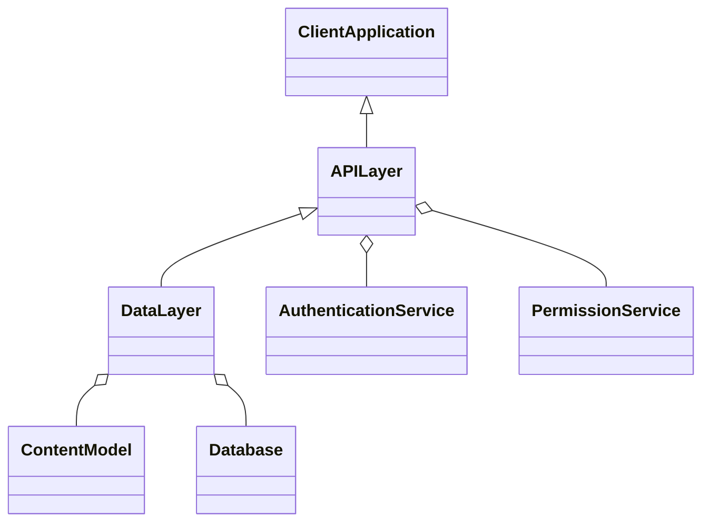
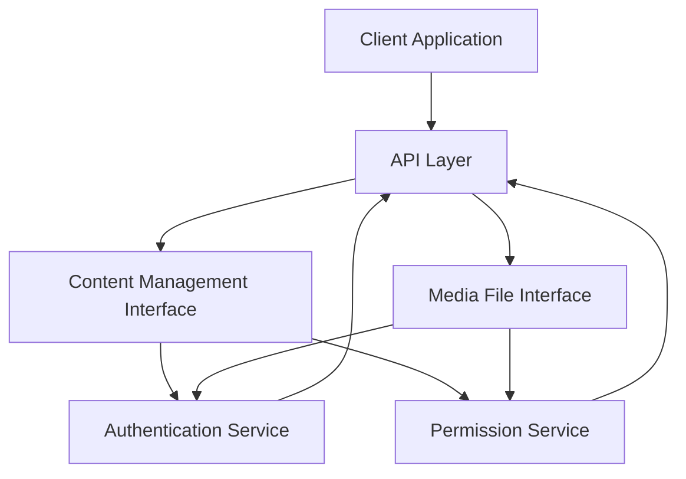
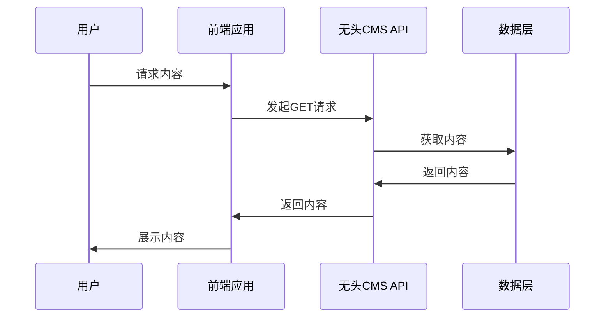

                 


### Headless CMS：内容管理的新趋势

#### 关键词：无头内容管理系统，内容交付，前端集成，架构设计，最佳实践

> 摘要：本文将深入探讨无头内容管理系统（Headless CMS）的概念、优势、架构和实际应用。通过详细的算法原理讲解、系统分析与架构设计方案、实战案例以及最佳实践，帮助读者全面了解和掌握无头CMS的技术要点，为现代内容管理提供新的视角和解决方案。

----------------------------------------------------------------

## 综述与目标

《Headless CMS：内容管理的新趋势》是一本专注于无头内容管理系统（Headless CMS）的书籍，旨在为读者提供一个全面而深入的无头CMS概念和实践指南。随着互联网技术的快速发展，内容管理的方式也在不断演变。传统的客户管理系统（CMS）在应对多平台、多渠道的内容交付时逐渐暴露出其局限性。无头CMS作为一种新的内容管理趋势，为解决这些问题提供了创新的解决方案。

本书的目标是帮助读者理解无头CMS的优势、应用场景，以及如何在不同的行业中实现无头内容管理的最佳实践。通过系统的理论讲解、实例分析和实战指导，读者将能够：

1. 理解无头CMS的基本概念和与传统CMS的区别。
2. 掌握无头CMS的架构设计和关键组件。
3. 理解无头CMS的工作原理和算法机制。
4. 学习如何搭建和部署无头CMS系统。
5. 获取无头CMS的最佳实践和注意事项。

本书适合对内容管理系统感兴趣的IT专业人员、软件开发者、网站管理员以及希望提升内容管理效率的企业管理者。无论您是初学者还是专业人士，都能在本书中找到有价值的信息和实用的技巧。

### 目录大纲设计

在设计《Headless CMS：内容管理的新趋势》的目录大纲时，我们需要确保以下几个核心章节：

1. **背景介绍**：介绍无头CMS的概念、与传统CMS的区别以及其出现的原因。
2. **核心概念与联系**：深入探讨无头CMS的关键术语、架构和组件。
3. **算法原理讲解**：详细解释无头CMS的工作原理、数据管理和内容交付机制。
4. **系统分析与架构设计方案**：展示无头CMS的架构设计、接口设计和交互流程。
5. **项目实战**：通过案例研究和实践，展示无头CMS的实际应用。
6. **最佳实践与拓展**：提供无头CMS的实施技巧、注意事项和未来趋势。

#### 目录大纲

#### 第1章 引言：无头CMS的崛起

- 1.1 问题背景
- 1.2 传统CMS的挑战
- 1.3 无头CMS的定义与优势
- 1.4 目标读者与本书结构

#### 第2章 无头CMS的核心概念与架构

- 2.1 无头CMS的概念与术语
  - **2.1.1 无头、头、前端与后端**
  - **2.1.2 无头CMS的关键术语**
- 2.2 无头CMS的架构设计
  - **2.2.1 数据模型与API**
  - **2.2.2 存储与缓存**
  - **2.2.3 安全与权限管理**
- 2.3 无头CMS与前端集成
  - **2.3.1 接口设计与数据交换**
  - **2.3.2 前端框架与无头CMS**

#### 第3章 无头CMS的算法原理讲解

- 3.1 内容交付机制
  - **3.1.1 API端点与路由**
  - **3.1.2 内容渲染与缓存**
- 3.2 数据管理
  - **3.2.1 数据结构与存储策略**
  - **3.2.2 数据同步与冲突解决**
- 3.3 搜索与SEO优化
  - **3.3.1 搜索引擎优化**
  - **3.3.2 搜索功能与索引**

#### 第4章 无头CMS的系统分析与架构设计

- 4.1 问题场景介绍
- 4.2 系统功能设计
  - **4.2.1 领域模型类图**
- 4.3 系统架构设计
  - **4.3.1 系统架构图**
- 4.4 系统接口设计
  - **4.4.1 API接口设计**
- 4.5 系统交互流程
  - **4.5.1 序列图**

#### 第5章 项目实战：无头CMS的搭建与部署

- 5.1 环境安装
- 5.2 系统核心实现
  - **5.2.1 源代码解读**
- 5.3 代码应用解读与分析
- 5.4 实际案例分析与详细讲解
- 5.5 项目小结

#### 第6章 无头CMS的最佳实践与注意事项

- 6.1 最佳实践
  - **6.1.1 设计与开发技巧**
  - **6.1.2 性能优化策略**
- 6.2 注意事项
  - **6.2.1 安全与合规**
  - **6.2.2 备份与恢复**
- 6.3 小结与展望

#### 第7章 拓展阅读

- **7.1 相关技术文章**
- **7.2 开源项目推荐**
- **7.3 进一步学习资源**

通过上述目录大纲的设计，本书将全面覆盖无头CMS的概念、原理、架构、实战以及最佳实践，旨在帮助读者深入了解无头CMS，并在实际项目中成功应用。

----------------------------------------------------------------

## 第1章 引言：无头CMS的崛起

随着互联网技术的不断进步，内容管理的方式也在不断发展变革。传统的客户管理系统（CMS）已经逐渐暴露出其局限性，尤其是在应对多平台、多渠道的内容交付时。无头内容管理系统（Headless CMS）作为一种新兴趋势，为解决这些问题提供了创新的解决方案。

### 1.1 问题背景

传统的CMS通常将内容和设计紧密耦合在一起，这意味着内容必须通过特定的前端框架来呈现。这导致了以下几个问题：

1. **灵活性与扩展性受限**：当需要在新平台上展示内容时，开发者必须重新设计和适配前端，增加了开发成本和复杂性。
2. **更新滞后**：内容更新需要通过前端框架进行，这会导致内容更新速度缓慢，难以实时响应市场变化。
3. **技术栈限制**：特定的CMS可能不支持某些前端技术栈，限制了开发者的选择。

### 1.2 传统CMS的挑战

传统CMS面临的挑战主要包括：

1. **内容与设计耦合**：传统CMS通常将内容和设计紧密绑定在一起，使得内容发布和前端展示无法分离。
2. **单一内容源**：传统CMS通常只能服务于一个网站或一个平台，难以实现跨平台的内容管理。
3. **定制化困难**：对于具有特殊需求的内容管理任务，传统CMS的定制化难度较大，且成本较高。

### 1.3 无头CMS的定义与优势

无头CMS，顾名思义，是指将内容管理和前端展示分离的CMS。无头CMS的主要优势包括：

1. **高度灵活性**：无头CMS可以支持多种前端框架和平台，无需担心兼容性问题，提高了开发效率。
2. **实时内容更新**：由于内容和前端展示分离，内容可以直接通过API进行实时更新，加快了内容发布的速度。
3. **跨平台支持**：无头CMS支持跨平台内容管理，可以轻松地服务于多个网站、移动应用和其他渠道。
4. **定制化优势**：无头CMS提供了丰富的API和接口，使得开发者可以轻松地进行定制化开发，满足各种复杂需求。

### 1.4 目标读者与本书结构

本书的目标读者包括：

- **IT专业人员**：对内容管理系统有一定了解，希望了解无头CMS的最新技术和应用。
- **软件开发者**：正在开发或计划开发基于无头CMS的项目，需要深入理解其架构和工作原理。
- **网站管理员**：负责网站内容的管理和维护，希望提高内容管理的效率和质量。

本书将按照以下结构展开：

1. **第1章**：介绍无头CMS的背景、定义和优势。
2. **第2章**：深入探讨无头CMS的核心概念与架构。
3. **第3章**：讲解无头CMS的工作原理和算法机制。
4. **第4章**：分析无头CMS的系统架构设计。
5. **第5章**：通过实战案例展示无头CMS的应用。
6. **第6章**：提供无头CMS的最佳实践和注意事项。
7. **第7章**：推荐进一步学习资源和相关技术文章。

通过本书的阅读，读者将能够全面了解无头CMS，并在实际项目中成功应用这一新兴技术。

### 第2章 无头CMS的核心概念与架构

无头内容管理系统（Headless CMS）作为一种新型的内容管理系统，其主要特点是将内容管理与前端展示分离。这一架构设计使得无头CMS具有更高的灵活性、扩展性和定制化能力。在深入探讨无头CMS的架构和核心概念之前，我们需要先了解几个关键术语。

#### 2.1 无头CMS的概念与术语

**2.1.1 无头、头、前端与后端**

- **无头（Headless）**：指内容管理系统中，内容与前端展示分离的状态。
- **头（Head）**：传统CMS中的前端部分，负责内容展示和交互。
- **前端（Frontend）**：用户直接交互的部分，通常包括网页、移动应用等。
- **后端（Backend）**：负责处理数据存储、内容管理和API接口的部分。

**2.1.2 无头CMS的关键术语**

- **内容模型（Content Model）**：定义了内容的结构和属性，通常通过JSON格式描述。
- **数据模型（Data Model）**：定义了数据在数据库中的存储结构和关系。
- **API（Application Programming Interface）**：允许前端与后端进行数据交互的接口。
- **内容交付网络（Content Delivery Network, CDN）**：用于加速内容交付的分布式网络。
- **缓存（Caching）**：将数据暂存于内存中以加快访问速度。
- **元数据（Metadata）**：关于数据的额外信息，如内容类型、作者、创建日期等。

#### 2.2 无头CMS的架构设计

无头CMS的架构设计通常包括以下几个核心组件：

**2.2.1 数据模型与API**

- **数据模型**：无头CMS使用内容模型定义内容结构，通常采用JSON格式，使得数据结构清晰、易于理解和扩展。
  
  ```json
  {
    "title": "我的第一篇博客",
    "author": "张三",
    "content": "这是我的第一篇博客内容...",
    "createdAt": "2023-03-15T10:00:00Z",
    "tags": ["技术", "编程", "无头CMS"]
  }
  ```

- **API**：无头CMS通过API提供内容管理功能，包括内容创建、读取、更新和删除（CRUD）操作。常见的API包括RESTful API和GraphQL API。

**2.2.2 存储与缓存**

- **存储**：无头CMS通常使用关系数据库（如MySQL、PostgreSQL）或NoSQL数据库（如MongoDB、Cassandra）来存储内容模型数据。
- **缓存**：为了提高性能和响应速度，无头CMS常使用缓存机制，如Redis或Memcached，来存储经常访问的数据。

**2.2.3 安全与权限管理**

- **安全**：无头CMS需要确保数据的安全性和完整性，通常采用HTTPS协议、身份验证和授权机制（如OAuth 2.0）。
- **权限管理**：通过设置不同的权限级别，确保用户只能访问他们有权操作的数据。

#### 2.3 无头CMS与前端集成

**2.3.1 接口设计与数据交换**

- **接口设计**：无头CMS提供API接口，允许前端应用通过HTTP请求与后端进行数据交换。
- **数据交换**：前端应用通过GET、POST、PUT、DELETE等HTTP方法与无头CMS的API进行交互，获取或更新内容。

**2.3.2 前端框架与无头CMS**

- **前端框架**：无头CMS通常与React、Vue、Angular等现代前端框架集成，使得内容展示更加灵活和高效。
- **数据绑定**：通过前端框架的数据绑定功能，前端可以实时获取和更新无头CMS中的内容。

#### 2.4 无头CMS与现有系统的集成

- **现有系统**：无头CMS可以轻松集成到现有的系统架构中，如电子商务平台、客户关系管理（CRM）系统等。
- **集成方式**：通过API接口和消息队列（如Kafka、RabbitMQ）等技术，实现无头CMS与现有系统的数据同步和交互。

### 2.5 无头CMS的优势和劣势

**2.5.1 优势**

- **灵活性**：无头CMS可以轻松适应不同的前端框架和平台，提高了系统的灵活性。
- **扩展性**：无头CMS通过API接口提供了丰富的扩展能力，开发者可以根据需求进行定制化开发。
- **性能**：由于内容和前端分离，无头CMS可以更好地进行性能优化，如使用CDN和缓存技术。

**2.5.2 劣势**

- **学习曲线**：对于习惯使用传统CMS的开发者，无头CMS可能需要一定的时间来适应。
- **调试困难**：由于内容和前端分离，调试过程中可能需要同时在两个端上进行调试，增加了复杂度。

#### 2.6 总结

无头内容管理系统（Headless CMS）通过将内容管理与前端展示分离，提供了更高的灵活性、扩展性和定制化能力。通过本章的介绍，我们了解了无头CMS的核心概念、架构设计和关键组件。在接下来的章节中，我们将进一步探讨无头CMS的工作原理、系统架构设计以及实际应用案例。

### 第3章 无头CMS的算法原理讲解

无头内容管理系统（Headless CMS）的核心在于其数据管理和内容交付机制。理解无头CMS的算法原理，对于构建高效、可靠的内容管理系统至关重要。在本章中，我们将详细讲解无头CMS的算法原理，包括内容交付机制、数据管理和搜索与SEO优化。

#### 3.1 内容交付机制

无头CMS通过API端点与前端进行数据交互，实现内容交付。以下是内容交付机制的关键组成部分：

**3.1.1 API端点与路由**

- **API端点**：无头CMS提供了一系列API端点，用于处理各种内容操作。常见的端点包括：
  - `/content`：用于获取、创建、更新和删除内容。
  - `/media`：用于获取、上传和管理媒体文件。
  - `/tags`：用于获取和管理标签。
  
- **路由**：前端应用通过定义路由，与无头CMS的API端点进行交互。例如，当用户请求某个内容的详情时，前端会将相应的URL（如 `/content/123`）发送给无头CMS，无头CMS会根据路由匹配相应的API端点进行处理。

**3.1.2 内容渲染与缓存**

- **内容渲染**：无头CMS通常不会直接渲染内容，而是提供原始数据。前端应用负责根据接收到的数据渲染出最终的用户界面。这要求前端框架能够与无头CMS的数据结构良好地配合。
  
  ```javascript
  function renderContent(data) {
    // 根据数据渲染HTML
    const contentDiv = document.getElementById('content');
    contentDiv.innerHTML = `<h1>${data.title}</h1><p>${data.content}</p>`;
  }
  ```

- **缓存**：为了提高性能，无头CMS通常采用缓存机制。例如，可以使用Redis缓存频繁访问的内容，减少对后端数据库的访问压力。

  ```python
  import redis

  r = redis.Redis(host='localhost', port=6379, db=0)

  def getContentById(content_id):
      if r.exists(content_id):
          return r.get(content_id)
      else:
          # 从数据库中获取内容
          content = db.getContentById(content_id)
          r.setex(content_id, 3600, content)  # 缓存内容1小时
          return content
  ```

#### 3.2 数据管理

数据管理是无头CMS的重要组成部分，涉及数据的结构、存储策略、同步和冲突解决。

**3.2.1 数据结构与存储策略**

- **数据结构**：无头CMS使用内容模型来定义数据结构。内容模型通常包括字段名称、数据类型和约束条件。
  
  ```json
  {
    "title": "字符串",
    "author": "字符串",
    "content": "文本",
    "createdAt": "日期时间"
  }
  ```

- **存储策略**：无头CMS可以选择关系数据库（如MySQL、PostgreSQL）或NoSQL数据库（如MongoDB、Cassandra）来存储内容。关系数据库适合结构化数据，而NoSQL数据库适合大规模、非结构化数据的存储。

**3.2.2 数据同步与冲突解决**

- **数据同步**：无头CMS需要确保前端与后端数据的一致性。常见的数据同步策略包括：
  - **Pull同步**：前端定期向后端请求最新的数据。
  - **Push同步**：后端在数据更新时主动通知前端。

- **冲突解决**：在数据同步过程中，可能会出现数据冲突的情况。常见的冲突解决策略包括：
  - **最后写入**：以最后的写入操作为准。
  - **合并策略**：根据业务逻辑自动合并冲突的数据。
  - **人工干预**：由人工决定如何解决冲突。

#### 3.3 搜索与SEO优化

无头CMS在搜索和SEO优化方面具有显著优势，以下是关键策略：

**3.3.1 搜索引擎优化（SEO）**

- **元数据优化**：通过优化元数据（如标题、描述、关键词等），提高内容在搜索引擎中的排名。
- **内容结构化**：使用结构化数据（如Schema.org标记）来增强内容的可搜索性。
- **URL优化**：确保URL简洁、清晰且包含关键词。

**3.3.2 搜索功能与索引**

- **全文搜索**：使用全文搜索引擎（如Elasticsearch）提供强大的搜索功能。
- **索引优化**：创建合理的索引策略，提高搜索性能。

  ```python
  from elasticsearch import Elasticsearch

  es = Elasticsearch()

  def index_content(content_id, content_data):
      es.index(index='contents', id=content_id, document=content_data)
  ```

#### 3.4 算法原理举例

为了更好地理解无头CMS的算法原理，以下是一个简单的Python示例：

```python
import requests
import json

def fetch_content(content_id):
    url = f"https://api.headless-cms.com/content/{content_id}"
    response = requests.get(url)
    if response.status_code == 200:
        return json.loads(response.text)
    else:
        return None

def render_content(content):
    print(f"<h1>{content['title']}</h1>")
    print(f"<p>{content['content']}</p>")

content_id = "123"
content = fetch_content(content_id)
if content:
    render_content(content)
else:
    print("内容不存在或请求失败")
```

在这个示例中，`fetch_content`函数通过API端点获取内容，而`render_content`函数负责渲染内容。这个过程展示了无头CMS的基本算法原理。

#### 3.5 总结

无头CMS通过其独特的算法原理，实现了内容与前端展示的分离，提供了高效的、可扩展的内容管理系统。理解无头CMS的算法原理，对于开发高效、可靠的内容管理系统至关重要。在接下来的章节中，我们将进一步探讨无头CMS的系统架构设计、实际应用案例以及最佳实践。

### 第4章 无头CMS的系统分析与架构设计

在了解无头CMS的基本概念和算法原理后，我们需要深入分析其系统架构设计，以更好地理解无头CMS如何在实际项目中应用。本章节将详细介绍无头CMS的系统架构设计，包括问题场景介绍、系统功能设计、系统架构设计、系统接口设计和系统交互流程。

#### 4.1 问题场景介绍

假设我们正在开发一个在线零售平台，该平台需要支持多种设备（如PC、移动端、平板）和多个渠道（如官方网站、移动应用、社交媒体）。传统的CMS由于内容与设计紧密耦合，难以快速适应这些多样化的需求。为了提高开发效率和灵活性，我们决定采用无头CMS来管理平台的内容。

#### 4.2 系统功能设计

无头CMS的核心功能包括内容创建、内容获取、内容更新和内容删除。以下是具体的系统功能设计：

**4.2.1 内容创建**：管理员可以通过后台管理系统创建新的内容，包括文章、产品描述、用户评论等。内容创建时需要定义内容模型，确保内容的结构化和标准化。

**4.2.2 内容获取**：前端应用通过API接口获取所需的内容。根据不同的设备类型和用户需求，前端应用可以请求特定的内容版本或格式。

**4.2.3 内容更新**：管理员可以随时更新内容，确保信息的准确性和实时性。更新操作会触发数据同步机制，确保所有渠道的内容保持一致。

**4.2.4 内容删除**：当不再需要某些内容时，管理员可以将其删除。删除操作会触发数据清理机制，确保数据库中的数据整洁。

#### 4.3 系统架构设计

无头CMS的系统架构设计通常包括以下几个核心组件：

**4.3.1 数据层**：负责存储和管理内容数据。可以选择关系数据库（如MySQL、PostgreSQL）或NoSQL数据库（如MongoDB、Cassandra）。

**4.3.2 服务层**：提供API接口，处理前端应用的请求。服务层包括身份验证、权限管理、内容处理等功能。

**4.3.3 API层**：无头CMS通过API层与前端应用进行数据交互。常见的API类型包括RESTful API和GraphQL API。

**4.3.4 前端层**：负责内容展示和用户交互。前端应用可以选择React、Vue、Angular等现代前端框架。

以下是系统架构设计的Mermaid类图：



#### 4.4 系统接口设计

系统接口设计是确保无头CMS能够高效、可靠地提供服务的关键。以下是常见的API接口设计：

**4.4.1 内容管理接口**

- `GET /content/{id}`：获取指定内容。
- `POST /content`：创建新内容。
- `PUT /content/{id}`：更新指定内容。
- `DELETE /content/{id}`：删除指定内容。

**4.4.2 媒体文件接口**

- `GET /media/{id}`：获取指定媒体文件。
- `POST /media`：上传新媒体文件。
- `DELETE /media/{id}`：删除指定媒体文件。

以下是系统接口设计的Mermaid流程图：



#### 4.5 系统交互流程

系统交互流程描述了前端应用与无头CMS之间的交互过程。以下是交互流程的Mermaid序列图：



#### 4.6 总结

无头CMS的系统架构设计灵活、高效，能够满足多样化、多渠道的内容管理需求。通过详细的系统功能设计、架构设计和接口设计，我们可以更好地理解无头CMS在实际项目中的应用。在接下来的章节中，我们将通过实战案例展示无头CMS的具体应用，并讨论其最佳实践和注意事项。

### 第5章 项目实战：无头CMS的搭建与部署

在本章中，我们将通过一个具体的案例，展示如何搭建和部署无头CMS系统。这个案例将涵盖环境安装、系统核心实现、代码应用解读与分析、实际案例分析和项目小结。通过这个实战案例，读者可以更好地理解无头CMS的搭建和部署过程。

#### 5.1 环境安装

首先，我们需要安装无头CMS的开发环境。以下是所需的环境和软件：

- **操作系统**：Ubuntu 20.04 LTS
- **数据库**：MongoDB
- **后端框架**：Node.js + Express
- **前端框架**：Vue.js
- **版本控制**：Git

安装步骤如下：

1. **安装操作系统**：下载并安装Ubuntu 20.04 LTS操作系统。
2. **安装MongoDB**：通过`apt-get`安装MongoDB。

   ```bash
   sudo apt-get update
   sudo apt-get install mongodb
   sudo systemctl start mongodb
   ```

3. **安装Node.js和Express**：通过`npm`安装Node.js和Express。

   ```bash
   sudo apt-get install nodejs
   sudo apt-get install npm
   npm install express
   ```

4. **安装Vue.js**：通过`npm`安装Vue.js。

   ```bash
   npm install -g @vue/cli
   ```

5. **初始化项目**：创建一个无头CMS项目，并初始化数据库。

   ```bash
   mkdir headless-cms
   cd headless-cms
   npm init -y
   npm install mongodb express
   npm install --save-dev @vue/cli
   vue create client-app
   ```

#### 5.2 系统核心实现

接下来，我们将实现无头CMS的核心功能，包括内容创建、获取、更新和删除。

**5.2.1 后端实现**

后端使用Node.js和Express框架。以下是简单的后端代码：

```javascript
const express = require('express');
const MongoClient = require('mongodb').MongoClient;
const app = express();
const url = 'mongodb://localhost:27017/';
const dbName = 'headless_cms';

app.use(express.json());

// 连接MongoDB
MongoClient.connect(url, { useNewUrlParser: true, useUnifiedTopology: true }, (err, client) => {
  if (err) throw err;
  console.log('Connected to MongoDB');
  const db = client.db(dbName);
  app.use((req, res, next) => {
    req.db = db;
    next();
  });
});

// 内容创建
app.post('/content', async (req, res) => {
  const content = req.body;
  const col = req.db.collection('content');
  try {
    await col.insertOne(content);
    res.status(201).send({ message: 'Content created successfully' });
  } catch (err) {
    res.status(500).send({ error: 'Failed to create content' });
  }
});

// 内容获取
app.get('/content/:id', async (req, res) => {
  const contentId = req.params.id;
  const col = req.db.collection('content');
  try {
    const content = await col.findOne({ _id: new MongoClient.ObjectId(contentId) });
    if (content) {
      res.status(200).json(content);
    } else {
      res.status(404).send({ error: 'Content not found' });
    }
  } catch (err) {
    res.status(500).send({ error: 'Failed to fetch content' });
  }
});

// 内容更新
app.put('/content/:id', async (req, res) => {
  const contentId = req.params.id;
  const content = req.body;
  const col = req.db.collection('content');
  try {
    const result = await col.updateOne(
      { _id: new MongoClient.ObjectId(contentId) },
      { $set: content }
    );
    if (result.modifiedCount === 1) {
      res.status(200).send({ message: 'Content updated successfully' });
    } else {
      res.status(404).send({ error: 'Content not found' });
    }
  } catch (err) {
    res.status(500).send({ error: 'Failed to update content' });
  }
});

// 内容删除
app.delete('/content/:id', async (req, res) => {
  const contentId = req.params.id;
  const col = req.db.collection('content');
  try {
    const result = await col.deleteOne({ _id: new MongoClient.ObjectId(contentId) });
    if (result.deletedCount === 1) {
      res.status(200).send({ message: 'Content deleted successfully' });
    } else {
      res.status(404).send({ error: 'Content not found' });
    }
  } catch (err) {
    res.status(500).send({ error: 'Failed to delete content' });
  }
});

const PORT = 3000;
app.listen(PORT, () => {
  console.log(`Server is running on port ${PORT}`);
});
```

**5.2.2 前端实现**

前端使用Vue.js框架。以下是简单的Vue组件代码：

```vue
<template>
  <div>
    <h1>内容管理</h1>
    <div v-if="content">
      <h2>{{ content.title }}</h2>
      <p>{{ content.content }}</p>
      <button @click="updateContent">更新内容</button>
    </div>
    <div v-else>
      <h2>内容不存在</h2>
      <button @click="getContent">获取内容</button>
    </div>
  </div>
</template>

<script>
import axios from 'axios';

export default {
  data() {
    return {
      content: null,
      contentId: '123',
    };
  },
  methods: {
    async getContent() {
      try {
        const response = await axios.get(`http://localhost:3000/content/${this.contentId}`);
        this.content = response.data;
      } catch (error) {
        console.error(error);
      }
    },
    async updateContent() {
      try {
        const response = await axios.put(`http://localhost:3000/content/${this.contentId}`, {
          title: '更新后的标题',
          content: '更新后的内容...',
        });
        console.log(response.data);
        this.getContent();
      } catch (error) {
        console.error(error);
      }
    },
  },
  mounted() {
    this.getContent();
  },
};
</script>
```

#### 5.3 代码应用解读与分析

1. **后端代码解读**：

   - **连接MongoDB**：使用MongoClient连接MongoDB，并创建一个Express应用。
   - **内容创建**：通过`POST /content`接口接收内容数据，并使用`insertOne`方法将其存储在MongoDB中。
   - **内容获取**：通过`GET /content/:id`接口获取特定内容，并使用`findOne`方法从MongoDB中查询。
   - **内容更新**：通过`PUT /content/:id`接口更新特定内容，并使用`updateOne`方法修改MongoDB中的记录。
   - **内容删除**：通过`DELETE /content/:id`接口删除特定内容，并使用`deleteOne`方法从MongoDB中删除记录。

2. **前端代码解读**：

   - **Vue组件**：定义了一个简单的Vue组件，用于展示内容并处理内容获取和更新。
   - **内容获取**：使用`axios`发起GET请求，从后端获取内容数据。
   - **内容更新**：使用`axios`发起PUT请求，将更新后的内容发送到后端。

#### 5.4 实际案例分析与详细讲解

**案例1**：用户在官方网站上查看产品详情。

- **步骤1**：用户在网页上点击产品链接，Vue组件通过`axios`发起GET请求，获取产品详情。
- **步骤2**：Vue组件将获取到的产品详情渲染到页面上。
- **步骤3**：用户点击“更新内容”按钮，Vue组件通过`axios`发起PUT请求，将更新后的内容发送到后端。
- **步骤4**：后端接收到更新请求后，使用`updateOne`方法更新MongoDB中的记录，并返回更新结果。
- **步骤5**：Vue组件接收到更新结果后，重新获取产品详情并渲染到页面上。

**案例2**：用户在移动应用上查看新闻。

- **步骤1**：用户在移动应用上打开新闻页面，Vue组件通过`axios`发起GET请求，获取新闻详情。
- **步骤2**：Vue组件将获取到的新闻详情渲染到页面上。
- **步骤3**：用户点击“刷新”按钮，Vue组件通过`axios`发起GET请求，重新获取新闻详情。
- **步骤4**：Vue组件将重新获取到的新闻详情渲染到页面上。

#### 5.5 项目小结

通过本案例，我们展示了如何搭建和部署一个简单的无头CMS系统。实际应用中，无头CMS可以支持多种设备、多个渠道的内容管理，提高了系统的灵活性和扩展性。在接下来的章节中，我们将讨论无头CMS的最佳实践和注意事项，帮助读者在实际项目中更好地应用无头CMS。

### 第6章 无头CMS的最佳实践与注意事项

在实施无头CMS时，遵循最佳实践和注意事项对于确保系统的稳定性和性能至关重要。以下是一些关键的最佳实践和注意事项：

#### 6.1 最佳实践

**1. 设计合理的API接口**

- **标准化接口**：确保API接口遵循RESTful或GraphQL规范，提供统一的接口风格和响应格式。
- **安全与认证**：使用OAuth 2.0或JWT（JSON Web Tokens）等认证机制，保护API接口的安全性。
- **性能优化**：使用缓存、CDN和负载均衡技术，提高API接口的响应速度。

**2. 优化内容交付流程**

- **内容版本管理**：实施内容版本管理，确保内容更新时的数据一致性。
- **自动化部署**：使用自动化工具（如Docker、Kubernetes）实现快速部署和持续集成。
- **数据同步策略**：根据业务需求设计合理的数据同步策略，确保内容在不同平台和渠道的一致性。

**3. 搜索引擎优化（SEO）**

- **元数据优化**：确保内容的元数据（如标题、描述、关键词）准确且包含有价值的信息。
- **结构化数据**：使用Schema.org等结构化数据标准，提高内容的可搜索性和SEO表现。
- **内容更新频率**：定期更新内容，提高搜索引擎对网站的权重。

**4. 性能优化**

- **缓存策略**：合理使用缓存，减少数据库的访问压力，提高系统性能。
- **负载均衡**：使用负载均衡器（如Nginx、HAProxy）分散流量，确保系统在高并发情况下的稳定性。
- **代码优化**：优化前端和后端代码，减少不必要的资源加载，提高页面加载速度。

#### 6.2 注意事项

**1. 安全性**

- **数据加密**：对敏感数据进行加密存储，确保数据安全。
- **访问控制**：严格实施访问控制策略，确保用户只能访问其授权的内容。
- **日志记录**：记录系统操作日志，方便后续审计和故障排查。

**2. 备份与恢复**

- **定期备份**：定期备份数据库和系统配置，防止数据丢失。
- **恢复策略**：制定详细的恢复策略，确保在系统故障时能够快速恢复。

**3. 监控与维护**

- **系统监控**：实时监控系统性能和资源使用情况，确保系统稳定运行。
- **定期维护**：定期更新系统软件和依赖库，确保系统的安全性和兼容性。

**4. 用户培训**

- **用户培训**：为内容管理员提供培训，确保他们能够熟练使用无头CMS。
- **文档与支持**：提供详细的文档和用户支持，帮助用户解决使用过程中的问题。

#### 6.3 小结与展望

无头CMS作为一种现代化的内容管理系统，具有灵活、高效、可扩展等优点。通过遵循最佳实践和注意事项，我们可以确保无头CMS在实际应用中的稳定性和性能。未来，随着技术的不断发展，无头CMS将在更多领域得到广泛应用，为内容管理带来更多创新和可能性。

### 第7章 拓展阅读

为了帮助读者进一步深入理解和掌握无头CMS的相关知识，本章推荐了一些相关的技术文章、开源项目和进一步学习资源。

#### 7.1 相关技术文章

1. **"Understanding Headless CMS: Benefits and Best Practices"** - 本文详细介绍了无头CMS的概念、优势以及最佳实践。
2. **"Building a Headless CMS with Gatsby and Contentful"** - 本文通过实际案例展示了如何使用Gatsby和Contentful构建无头CMS。
3. **"The Future of Content Management: Headless CMS vs. Traditional CMS"** - 本文探讨了无头CMS与传统CMS的区别和未来趋势。

#### 7.2 开源项目推荐

1. **Contentful** - Contentful是一个功能强大的无头CMS平台，提供了丰富的API和模板，支持多种编程语言和前端框架。
2. **Strapi** - Strapi是一个开源的Node.js无头CMS框架，提供了灵活的内容模型和丰富的API，易于扩展和集成。
3. **GraphCMS** - GraphCMS是一个基于GraphQL的无头CMS，提供了强大的内容管理和交付解决方案。

#### 7.3 进一步学习资源

1. **"Headless CMS Handbook"** - 由Contentful提供的免费电子书，全面介绍了无头CMS的概念、架构和应用场景。
2. **"The Ultimate Guide to Headless CMS"** - 由Content Management Institute提供的指南，涵盖了无头CMS的各个方面，包括技术实现、最佳实践和案例分析。
3. **在线课程** - Udemy、Coursera等在线教育平台提供了多种关于无头CMS的课程，适合不同层次的学习者。

通过这些拓展阅读资源，读者可以进一步深化对无头CMS的理解，掌握其应用和实践技巧，为未来的项目提供有力支持。希望这些建议能帮助您在内容管理领域取得更好的成果。

