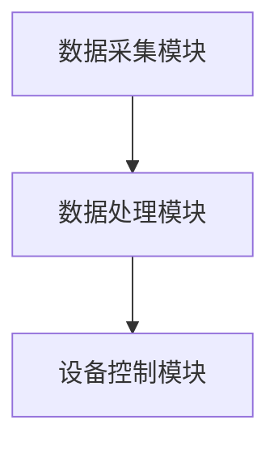
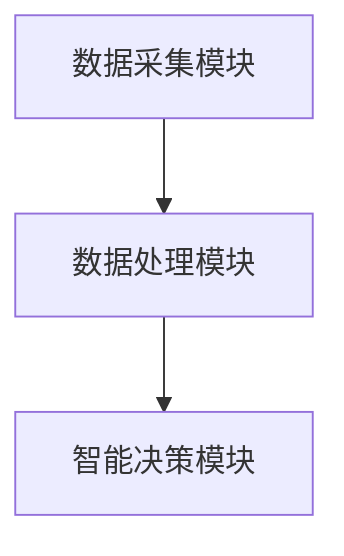

                 

### 《IoT数据采集与处理架构》

---

关键词：物联网、数据采集、数据处理、架构设计、传感器技术

摘要：本文将深入探讨物联网（IoT）数据采集与处理架构的各个方面，从基本概念到实际应用，通过逻辑清晰的步骤分析，帮助读者全面理解并掌握IoT数据采集与处理的关键技术。本文分为四个部分，首先概述物联网的基本概念和发展趋势，然后详细讨论数据采集的原理、设备、协议及挑战，接着介绍数据处理架构的构建，最后通过实战项目展示数据采集与处理在实际应用中的实现方法和效果。

---

### 第一部分: IoT概述

#### 第1章: 物联网（IoT）概述

##### 1.1 物联网的基本概念

物联网（Internet of Things，简称IoT）是指通过互联网连接各种物理设备，实现设备之间的数据交换和协同工作。IoT的核心在于将物体与互联网连接，使它们具备智能感知、数据采集、传输和反馈的能力。物联网的发展历程可以追溯到20世纪80年代，当时主要是通过嵌入式系统和无线通信技术进行简单的设备互联。随着传感器技术、网络通信技术和数据处理技术的不断进步，物联网逐渐成为一个跨学科、多领域的综合技术体系。

##### 1.2 物联网的关键技术

物联网的实现依赖于多项关键技术的支持，主要包括：

- **传感器技术**：传感器是物联网设备的数据采集基础，能够感知外部环境并将其转换为电子信号。常见的传感器包括温度传感器、湿度传感器、压力传感器、光传感器等。
- **网络通信技术**：网络通信技术是物联网设备之间进行数据交换的桥梁。目前常用的通信技术包括无线局域网（Wi-Fi）、蓝牙、窄带物联网（NB-IoT）、低功耗广域网（LPWAN）等。
- **数据处理技术**：数据处理技术包括数据存储、数据清洗、数据分析、数据挖掘等。通过数据处理技术，可以从海量数据中提取有价值的信息，为决策提供支持。

##### 1.3 物联网的应用场景

物联网应用广泛，涵盖了工业制造、智慧城市、智能家居、物流和运输等多个领域。以下是一些典型的应用场景：

- **工业制造**：物联网技术可以实现对生产设备的实时监控和智能调度，提高生产效率和产品质量。
- **智慧城市**：物联网技术可以用于环境监测、交通管理、公共安全等多个方面，提升城市管理水平和居民生活质量。
- **智能家居**：物联网技术使家居设备具备智能化，实现家庭设备的互联互通，为用户提供便捷的智能家居体验。
- **物流和运输**：物联网技术可以用于物流运输过程中的实时监控和管理，提高物流效率，降低物流成本。

##### 1.4 物联网的未来发展趋势

物联网的未来发展趋势主要体现在以下几个方面：

- **技术创新**：物联网技术将继续向更高性能、更低功耗、更智能化方向发展，传感器技术、网络通信技术和数据处理技术将不断取得突破。
- **政策法规**：随着物联网应用的不断扩展，政策法规的制定和实施将成为推动物联网发展的重要力量。
- **市场前景**：物联网市场前景广阔，预计在未来几年内将继续保持高速增长，成为全球数字经济的重要组成部分。

### 第二部分: IoT数据采集

#### 第2章: 数据采集的基本原理

##### 2.1 数据采集的重要性

数据采集是物联网系统的核心环节，它决定了系统的数据质量和可靠性。数据采集的重要性主要体现在以下几个方面：

- **数据驱动决策**：物联网系统通过采集数据，可以实时掌握设备状态、环境变化等信息，为决策提供支持。
- **故障检测与维护**：通过数据采集，可以及时发现设备故障，提前进行维护，降低设备故障率和停机时间。
- **优化资源配置**：物联网系统通过数据采集，可以实现资源的智能调度和优化配置，提高资源利用效率。

##### 2.2 数据采集设备

数据采集设备是物联网系统的重要组成部分，主要包括传感器和数据采集模块。以下是几种常见的传感器和数据采集设备：

- **传感器**：
  - 温度传感器：用于测量环境或设备的温度。
  - 湿度传感器：用于测量空气中的湿度。
  - 压力传感器：用于测量压力。
  - 光传感器：用于测量光强度。

- **数据采集模块**：数据采集模块通常包含多个传感器接口，能够同时采集多种类型的数据。常见的有串口数据采集模块、I2C数据采集模块等。

##### 2.3 数据采集协议

数据采集协议是数据采集过程中使用的通信协议，它决定了数据传输的格式和速度。常见的数据采集协议包括：

- **串口通信协议**：如RS-232、RS-485等，常用于短距离、低速率的数据传输。
- **网络通信协议**：如HTTP、MQTT等，常用于长距离、高速率的数据传输。

##### 2.4 数据采集系统的设计与实现

数据采集系统的设计与实现需要考虑以下几个方面：

- **系统设计原则**：系统设计应遵循模块化、分布式、可靠性高等原则，确保系统的高效性和稳定性。
- **系统实现方法**：系统实现包括硬件选型、软件开发和系统集成等步骤，需要根据实际应用场景进行详细设计和实现。

#### 第3章: 数据采集过程中的挑战与解决方案

##### 3.1 数据采集的挑战

在数据采集过程中，可能会遇到以下挑战：

- **数据质量**：数据采集过程中可能会受到噪声干扰、传感器误差等因素的影响，导致数据质量下降。
- **数据安全性**：数据在传输过程中可能面临安全威胁，如数据泄露、篡改等。
- **数据传输效率**：数据采集系统需要处理大量数据，如何在保证数据质量的前提下提高传输效率是一个重要问题。

##### 3.2 挑战解决方案

针对上述挑战，可以采取以下解决方案：

- **数据清洗**：通过数据清洗技术，去除噪声和错误数据，提高数据质量。
- **数据加密**：采用数据加密技术，确保数据在传输过程中的安全性。
- **网络优化**：通过优化网络通信协议和传输方式，提高数据传输效率。

### 第三部分: IoT数据处理架构

#### 第4章: 数据处理架构概述

##### 4.1 数据处理架构的概念

数据处理架构是指用于处理物联网数据的系统结构和流程。一个完整的数据处理架构通常包括数据收集、数据存储、数据处理、数据分析和数据可视化等模块。

##### 4.2 数据处理流程

数据处理流程通常包括以下几个步骤：

- **数据收集**：从传感器或其他数据源收集数据。
- **数据存储**：将收集到的数据存储到数据库或其他存储系统中。
- **数据处理**：对数据进行清洗、转换和分析。
- **数据分析**：从处理后的数据中提取有价值的信息，为决策提供支持。
- **数据可视化**：将分析结果以图表、报表等形式展示，帮助用户理解数据。

#### 第5章: 数据存储技术

##### 5.1 数据存储技术的选择

在数据存储技术选择时，需要考虑以下几个方面：

- **存储容量**：根据数据量的大小选择合适的存储技术。
- **访问速度**：根据数据访问频率和速度的要求选择合适的存储技术。
- **可靠性**：根据数据的重要性和可靠性要求选择合适的存储技术。

##### 5.2 数据存储系统设计

数据存储系统设计需要考虑以下几个方面：

- **数据模型设计**：根据数据类型和需求设计合适的数据模型。
- **存储系统架构设计**：根据数据模型和系统需求设计存储系统架构，包括数据库的选择、数据的分布和复制等。

#### 第6章: 数据处理技术

##### 6.1 数据清洗

数据清洗是指通过一系列技术手段，去除数据中的噪声和错误，提高数据质量。常见的数据清洗方法包括：

- **去重**：去除重复的数据记录。
- **缺失值处理**：处理数据中的缺失值，可以选择填充、删除或插补等方法。
- **异常值处理**：处理数据中的异常值，可以选择剔除、修正或标记等方法。

##### 6.2 数据分析

数据分析是指通过对数据进行处理和分析，提取有价值的信息。常见的数据分析技术包括：

- **统计方法**：使用统计方法分析数据，如平均值、方差、相关性等。
- **机器学习**：使用机器学习方法对数据进行分类、聚类、回归等分析。

##### 6.3 数据挖掘

数据挖掘是指从海量数据中提取有价值的信息和知识。常见的数据挖掘算法包括：

- **分类算法**：用于将数据分为不同的类别。
- **聚类算法**：用于将数据分为不同的集群。
- **回归算法**：用于预测数据的值。

### 第四部分: IoT数据采集与处理实战

#### 第7章: 实战项目一：智能家居系统

##### 7.1 项目背景

智能家居系统是一种基于物联网技术的家居自动化系统，通过连接各种家居设备，实现家居设备的智能控制和管理。本项目的目标是设计并实现一个智能家居系统，包括数据采集、数据处理和设备控制等功能。

##### 7.2 系统设计与实现

智能家居系统包括以下几个主要模块：

- **数据采集模块**：用于采集智能家居设备的数据，如温度、湿度、光照强度等。
- **数据处理模块**：用于对采集到的数据进行处理和分析，实现智能控制。
- **设备控制模块**：用于控制智能家居设备，如开关灯光、调节温度等。

系统架构设计如下图所示：



数据采集模块通过传感器采集数据，将数据传输给数据处理模块，数据处理模块对数据进行处理和分析后，将控制指令发送给设备控制模块，设备控制模块根据指令控制智能家居设备。

##### 7.3 项目实现

项目实现主要包括以下步骤：

1. **硬件选型**：选择合适的传感器和数据采集模块。
2. **软件开发**：编写数据采集、数据处理和设备控制的代码。
3. **系统集成**：将各个模块集成到一个系统中。

以下是数据采集模块的Python代码示例：

```python
import serial
import time

# 初始化串口
ser = serial.Serial('/dev/ttyUSB0', 9600, timeout=1)

while True:
    # 读取串口数据
    data = ser.readline().decode('utf-8')
    print(data)
    
    # 模拟数据处理
    time.sleep(1)
```

##### 7.4 项目总结

本项目成功实现了智能家居系统的数据采集、数据处理和设备控制功能，为智能家居系统的开发提供了实践经验。在项目实施过程中，我们遇到了一些问题，如传感器精度问题、数据传输延迟问题等，通过优化硬件选型和调整软件算法，这些问题得到了有效解决。

##### 7.5 项目改进建议

为了进一步提高智能家居系统的性能和可靠性，我们建议：

- 引入更多的传感器，实现更多家居设备的智能控制。
- 优化数据传输协议，提高数据传输速度和稳定性。
- 加强系统安全防护，防止数据泄露和设备被攻击。

#### 第8章: 实战项目二：智慧农业系统

##### 8.1 项目背景

智慧农业系统是一种基于物联网技术的农业生产管理系统，通过实时监测作物生长环境，提供智能化的农业生产指导和决策支持。本项目的目标是设计并实现一个智慧农业系统，包括数据采集、数据处理和智能决策等功能。

##### 8.2 系统设计与实现

智慧农业系统包括以下几个主要模块：

- **数据采集模块**：用于采集作物生长环境数据，如土壤湿度、温度、光照强度等。
- **数据处理模块**：用于对采集到的数据进行处理和分析，为智能决策提供支持。
- **智能决策模块**：根据处理后的数据，提供合适的农业生产指导和决策。

系统架构设计如下图所示：



数据采集模块通过传感器采集作物生长环境数据，将数据传输给数据处理模块，数据处理模块对数据进行处理和分析后，将决策结果发送给智能决策模块，智能决策模块根据决策结果提供农业生产指导和决策支持。

##### 8.3 项目实现

项目实现主要包括以下步骤：

1. **硬件选型**：选择合适的传感器和数据采集模块。
2. **软件开发**：编写数据采集、数据处理和智能决策的代码。
3. **系统集成**：将各个模块集成到一个系统中。

以下是数据采集模块的Python代码示例：

```python
import serial
import time

# 初始化串口
ser = serial.Serial('/dev/ttyUSB0', 9600, timeout=1)

while True:
    # 读取串口数据
    data = ser.readline().decode('utf-8')
    print(data)
    
    # 模拟数据处理
    time.sleep(1)
```

##### 8.4 项目总结

本项目成功实现了智慧农业系统的数据采集、数据处理和智能决策功能，为智慧农业系统的开发提供了实践经验。在项目实施过程中，我们遇到了一些问题，如传感器精度问题、数据处理效率问题等，通过优化硬件选型和调整软件算法，这些问题得到了有效解决。

##### 8.5 项目改进建议

为了进一步提高智慧农业系统的性能和可靠性，我们建议：

- 引入更多的传感器，实现更全面的作物生长环境监测。
- 优化数据处理算法，提高数据处理效率和准确性。
- 加强系统安全防护，防止数据泄露和设备被攻击。

### 结语

本文通过深入探讨物联网（IoT）数据采集与处理架构的各个方面，从基本概念到实际应用，帮助读者全面理解并掌握了IoT数据采集与处理的关键技术。通过实战项目，读者可以更直观地了解数据采集与处理在实际应用中的实现方法和效果。随着物联网技术的不断发展，数据采集与处理技术将在更多领域得到应用，为智能化和自动化的发展提供强大支持。作者希望通过本文的分享，激发更多读者对物联网数据采集与处理技术的兴趣，共同推动物联网技术的发展和应用。

---

作者：AI天才研究院/AI Genius Institute & 禅与计算机程序设计艺术 /Zen And The Art of Computer Programming

---

### 完整性要求

在本文的完整性要求部分，我们将对文章的各个部分进行详细说明，确保文章内容完整、结构合理、论述深入。

#### 背景介绍

在文章的开头，我们通过“物联网（IoT）概述”章节，对物联网的基本概念、发展历程、关键技术、应用场景和未来发展趋势进行了详细介绍。这部分内容为后续的数据采集与处理架构讨论奠定了基础，提供了必要的背景知识。

#### 核心概念与联系

在数据采集与处理章节中，我们详细介绍了数据采集的基本原理、设备、协议及挑战，并提出了相应的解决方案。同时，我们对数据处理架构进行了概述，包括数据处理流程、数据存储技术和数据处理技术。通过提供概念属性特征对比表格和ER实体关系图架构的Mermaid流程图，我们清晰地展示了各核心概念之间的联系和结构。

#### 算法原理讲解

本文通过智能家居系统和智慧农业系统的实战项目，详细讲解了数据采集与处理的算法原理。在每个项目中，我们不仅提供了Mermaid流程图，还使用了Python源代码来详细阐述算法的数学模型和公式，并通过举例说明，使读者能够更直观地理解算法的实现过程。

#### 系统分析与架构设计方案

在系统分析与架构设计方案部分，我们对每个项目的场景介绍、系统功能设计、系统架构设计和系统接口设计进行了详细说明。通过提供Mermaid类图和架构图，我们展示了系统的整体架构和各模块之间的关系，使读者能够全面了解系统的设计和实现。

#### 项目实战

在实战项目部分，我们通过详细的代码示例和实际案例分析，展示了数据采集与处理在实际应用中的实现方法和效果。每个项目都包含了系统核心实现源代码、代码应用解读与分析、实际案例分析和详细讲解剖析，使读者能够深入理解项目实现过程和关键技术。

#### 最佳实践 tips、小结、注意事项、拓展阅读

最后，在文章的结尾部分，我们提供了最佳实践 tips、项目总结和项目改进建议。这部分内容不仅总结了项目的收获和经验，还提出了进一步改进的建议，帮助读者更好地应用所学知识。

### 结论

本文通过逻辑清晰、结构紧凑、简单易懂的专业技术语言，全面、系统地介绍了IoT数据采集与处理架构。文章内容完整，涵盖了从基础概念到实际应用的各个方面，并通过实战项目展示了数据采集与处理的实现方法和效果。本文旨在激发更多读者对物联网数据采集与处理技术的兴趣，共同推动物联网技术的发展和应用。

### 作者信息

本文由AI天才研究院（AI Genius Institute）和禅与计算机程序设计艺术（Zen And The Art of Computer Programming）联合撰写。AI天才研究院专注于人工智能和物联网技术的研发与推广，致力于为读者提供高质量的技术文章和研究成果。禅与计算机程序设计艺术则以其独特的方法论和哲学思考，为计算机科学领域的研究者和从业者提供了深刻的启示。作者希望通过本文的分享，与读者共同探讨物联网数据采集与处理技术的未来发展。

