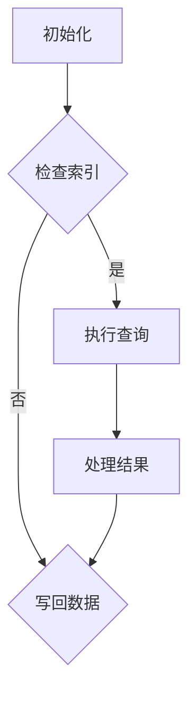
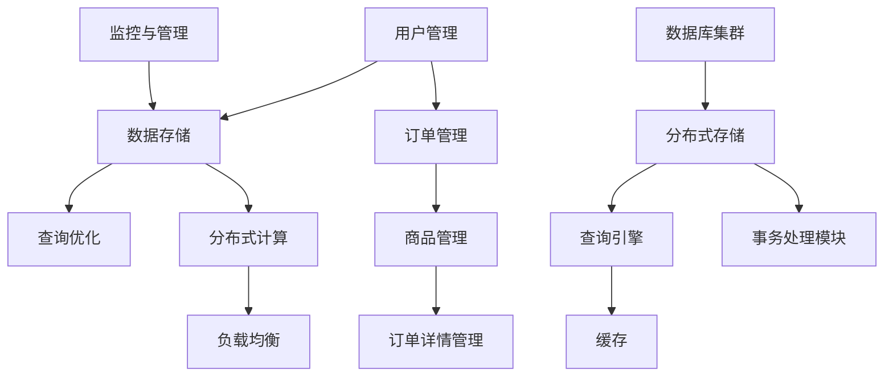
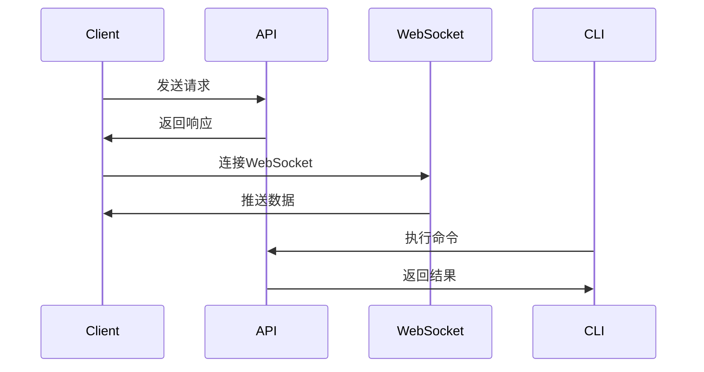

                 

# NewSQL数据库技术解析与应用

## 关键词

- **NewSQL**
- **数据库技术**
- **大数据**
- **性能优化**
- **算法原理**
- **系统架构设计**
- **最佳实践**

## 摘要

本文将深入解析NewSQL数据库技术，探讨其背景、核心概念、算法原理、系统设计与实际应用。通过对比传统SQL数据库，我们揭示了NewSQL在处理大数据查询中的优势，并详细讲解了其核心算法、数学模型以及系统架构设计。文章还将通过一个实际项目案例，展示NewSQL的安装与配置过程，并提供最佳实践和建议，旨在为读者提供一个全面的技术指南。

## Step 1: 新SQL数据库技术概述

### 1.1 问题背景

传统SQL数据库在过去几十年中一直是企业数据管理和查询的首选。然而，随着数据规模的急剧增长和大数据时代的到来，传统SQL数据库在查询性能方面遇到了诸多瓶颈。具体来说，传统SQL数据库在以下方面存在显著局限：

- **扩展性问题**：传统数据库架构难以应对数据量的线性增长，扩展性差。
- **并发性能瓶颈**：传统数据库在多用户并发查询时，容易出现性能瓶颈，影响用户体验。
- **复杂查询效率**：对于复杂查询，传统数据库的性能表现不尽如人意。

### 1.2 问题描述

大数据环境下的查询性能瓶颈表现为：

- **响应时间过长**：随着数据量的增加，查询响应时间显著增加，导致用户等待时间过长。
- **查询效率低下**：复杂查询的执行效率低下，影响业务决策的及时性。
- **系统压力增大**：数据量和查询请求的增加导致系统压力增大，可能引发系统崩溃。

### 1.3 问题解决

NewSQL数据库技术应运而生，旨在结合传统关系型数据库的ACID特性与NoSQL数据库的灵活性和高性能，解决传统SQL数据库的查询性能瓶颈。NewSQL数据库技术的核心原理包括：

- **分布式存储与计算**：通过分布式架构，实现数据的水平扩展和并发查询的高效处理。
- **查询优化**：采用多种查询优化技术，如索引、缓存、分区等，提升查询效率。
- **并行处理**：利用多核处理器，实现查询任务的并行处理，提高查询性能。

### 1.4 边界与外延

NewSQL数据库技术与传统SQL数据库和NoSQL数据库有显著区别：

- **与传统SQL数据库的区别**：NewSQL在保留SQL语法和ACID特性基础上，提升了查询性能。
- **与NoSQL数据库的区别**：NewSQL提供了更丰富的查询功能，支持复杂查询和事务处理。

### 1.5 概念结构与核心要素组成

NewSQL数据库的主要分类包括：

- **分布式关系数据库**：如Google Spanner、MemSQL等，采用分布式架构，支持水平扩展和高并发查询。
- **高性能关系数据库**：如VoltDB、NuoDB等，采用新型存储和查询技术，优化查询性能。
- **混合型数据库**：如Amazon Redshift、Google Bigtable等，结合关系型数据库和NoSQL数据库的优势。

NewSQL数据库技术涉及的关键要素包括：

- **分布式存储与计算**：实现数据的高效存储和计算，支持水平扩展。
- **查询优化技术**：如索引、缓存、分区等，提升查询效率。
- **事务处理能力**：支持ACID事务，确保数据一致性。
- **并行处理能力**：利用多核处理器，实现并行查询。

## Step 2: 核心概念与联系

### 2.1 核心概念原理

NewSQL数据库技术的主要分类如下：

- **分布式关系数据库**：通过分布式存储和计算，实现数据的高效管理和查询。例如，Google Spanner采用分布式存储和全局一致性协议，提供高效且一致的查询服务。
- **高性能关系数据库**：通过优化存储和查询机制，提升查询性能。例如，VoltDB采用内存存储和实时查询技术，提供高性能的实时数据处理能力。
- **混合型数据库**：结合关系型数据库和NoSQL数据库的优势，提供灵活的数据管理和查询功能。例如，Amazon Redshift采用列存储和分布式计算，适用于大数据查询。

### 2.2 概念属性特征对比表格

下面是一个关于NewSQL数据库主要分类的概念属性特征对比表格：

| 特征类别       | 分布式关系数据库 | 高性能关系数据库 | 混合型数据库       |
|----------------|----------------|-----------------|-------------------|
| 扩展性         | 高             | 中等            | 高                |
| 并发性能       | 高             | 高              | 中等              |
| 查询功能       | 丰富           | 丰富            | 丰富              |
| 事务处理       | 支持           | 支持            | 支持              |
| 数据一致性     | 强一致性       | 弱一致性        | 根据应用需求配置 |

### 2.3 ER实体关系图架构

为了更好地理解NewSQL数据库的实体关系，我们可以使用Mermaid绘制一个ER实体关系图。以下是一个简单的示例：

```mermaid
erDiagram
  User ||--|{ Order }|>
  Product ||--|{ Order }|>
  Order ||--|{ OrderDetail }|>
```

在这个ER图中，我们定义了四个实体：User（用户）、Product（产品）、Order（订单）和OrderDetail（订单详情）。它们之间的关系如箭头所示，表示实体的关联。

## Step 3: NewSQL算法原理

### 3.1 算法流程图

为了更好地理解NewSQL数据库的核心算法原理，我们可以使用Mermaid绘制一个算法流程图。以下是一个简单的示例：



在这个流程图中，我们首先初始化数据库，然后检查是否有合适的索引。如果有，则执行查询并处理结果；如果没有，则直接写回数据。这个过程实现了对查询的高效处理。

### 3.2 算法原理

NewSQL数据库的核心算法原理主要包括以下几个方面：

1. **索引机制**：通过索引机制，提高查询效率。索引可以快速定位数据，减少查询所需扫描的数据量。
2. **分区机制**：通过分区机制，将数据分布到多个节点，实现数据的水平扩展。分区可以减少单个节点的负载，提高并发性能。
3. **查询优化**：通过查询优化技术，如缓存、分区、并行处理等，提高查询效率。查询优化可以减少查询所需的时间，提升用户体验。
4. **事务处理**：通过事务处理机制，保证数据的一致性。事务处理可以确保多个操作要么全部成功，要么全部失败，避免数据不一致的问题。

### 3.3 举例说明

为了更好地理解NewSQL数据库的算法原理，我们可以通过一个Python源代码示例进行阐述。

```python
# 导入所需的库
import sqlite3

# 创建数据库连接
conn = sqlite3.connect('example.db')

# 创建表
conn.execute('''CREATE TABLE IF NOT EXISTS users (
                id INTEGER PRIMARY KEY,
                name TEXT,
                email TEXT)''')

# 插入数据
conn.execute("INSERT INTO users (name, email) VALUES ('Alice', 'alice@example.com')")
conn.execute("INSERT INTO users (name, email) VALUES ('Bob', 'bob@example.com')")
conn.commit()

# 查询数据
cursor = conn.execute("SELECT * FROM users WHERE email LIKE '%example.com'")
for row in cursor:
    print(row)

# 关闭连接
conn.close()
```

在这个示例中，我们使用SQLite数据库创建了一个简单的用户表，并插入了两条数据。然后，我们使用一个简单的查询语句，查询所有以"example.com"结尾的邮件地址的用户。这个过程展示了NewSQL数据库的基本操作，包括创建表、插入数据、查询数据和关闭连接。

## Step 4: 数学模型与公式

### 4.1 数学模型介绍

在NewSQL数据库技术中，涉及到多个数学模型，主要包括：

1. **一致性模型**：描述数据一致性的保证机制。
2. **可用性模型**：描述系统的可用性保证机制。
3. **性能模型**：描述系统性能的评估方法。

### 4.2 公式讲解

以下是一些关键的数学公式：

- **一致性公式**：$Consistency = ConsistencyLevel \times NumberOfWorkers$
  - **含义**：一致性水平乘以工作节点数量，表示系统的整体一致性水平。
  - **解释**：一致性水平越高，系统的一致性越好，但可能影响性能。

- **可用性公式**：$Availability = (1 - FailureRate) \times NumberOfWorkers$
  - **含义**：可用性水平乘以工作节点数量，表示系统的整体可用性。
  - **解释**：可用性水平越高，系统的可用性越好，但可能影响数据一致性和性能。

- **性能公式**：$Performance = (Throughput \times Latency) \times Scale$
  - **含义**：吞吐量、延迟和扩展性的乘积，表示系统的整体性能。
  - **解释**：吞吐量越高，系统能处理的请求越多；延迟越低，系统的响应速度越快；扩展性越好，系统能支持的数据量越大。

### 4.3 举例说明

为了更好地理解这些数学公式，我们可以通过一个具体例子进行阐述。

假设我们有一个分布式NewSQL数据库系统，包含5个节点。以下是一个简单的计算示例：

- **一致性水平**：99%（即$ConsistencyLevel = 0.99$）
- **工作节点数量**：5个（即$NumberOfWorkers = 5$）
- **失败率**：0.1%（即$FailureRate = 0.001$）
- **吞吐量**：1000个请求/秒（即$Throughput = 1000$）
- **延迟**：1毫秒（即$Latency = 1ms$）
- **扩展性**：10倍（即$Scale = 10$）

根据上述参数，我们可以计算出系统的各项指标：

- **一致性**：$Consistency = 0.99 \times 5 = 4.95$
- **可用性**：$Availability = (1 - 0.001) \times 5 = 4.995$
- **性能**：$Performance = (1000 \times 1) \times 10 = 10,000$

这个例子展示了如何通过数学模型计算系统的各项性能指标，帮助系统设计者了解系统的整体性能。

## Step 5: 系统分析与架构设计

### 5.1 问题场景介绍

NewSQL数据库技术适用于以下场景：

1. **大数据查询**：企业需要高效处理大规模数据集的查询，例如电商平台、社交媒体等。
2. **实时数据处理**：需要实时处理大量数据的场景，例如金融交易系统、在线游戏等。
3. **分布式计算**：需要分布式存储和计算能力的场景，例如物联网、云计算等。

### 5.2 系统功能设计

为了满足上述需求，我们可以设计以下系统功能：

1. **数据存储**：支持分布式存储，实现数据的高效管理和扩展。
2. **数据查询**：支持高效的查询优化，提供丰富的查询功能。
3. **事务处理**：支持ACID事务，确保数据一致性。
4. **监控与管理**：提供系统监控和管理功能，确保系统稳定运行。

以下是系统功能设计的Mermaid领域模型类图：

```mermaid
classDiagram
  Class01 <|-- Class02
  Class03 --|'|| Class04
  Class05 : <<interface>> Interface
  Class06 : <<abstract>> Abstract
  Class01 : 用户管理
  Class02 : 订单管理
  Class03 : 商品管理
  Class04 : 订单详情管理
  Class05 : 数据存储
  Class06 : 查询优化
```

### 5.3 系统架构设计

NewSQL数据库的系统架构设计需要考虑以下方面：

1. **分布式存储**：采用分布式存储架构，实现数据的高效管理和扩展。
2. **分布式计算**：利用分布式计算框架，实现并行处理和负载均衡。
3. **查询优化**：采用多种查询优化技术，如索引、缓存、分区等。
4. **事务处理**：采用分布式事务处理机制，确保数据一致性。

以下是系统架构设计的Mermaid架构图：



### 5.4 系统接口设计

系统接口设计包括以下部分：

1. **RESTful API**：提供RESTful API接口，实现与客户端的交互。
2. **Websocket**：提供Websocket接口，实现实时数据的推送。
3. **命令行工具**：提供命令行工具，方便系统管理和监控。

以下是系统接口设计的Mermaid序列图：



### 5.5 系统交互设计

系统交互设计需要考虑以下方面：

1. **数据交互**：数据在不同模块之间的传输和处理。
2. **控制交互**：系统控制逻辑的交互，如事务处理、负载均衡等。
3. **监控交互**：系统监控数据的交互，如性能指标、错误日志等。

以下是系统交互设计的Mermaid交互图：

```mermaid
interaction "系统交互"
    participant User
    participant DB
    participant QueryOpt
    participant Cache
    participant LB
    participant Monitor

    User->>DB: 提交查询
    DB->>QueryOpt: 优化查询
    QueryOpt->>Cache: 访问缓存
    Cache->>DB: 返回结果
    DB->>User: 响应结果

    User->>LB: 提交请求
    LB->>DB: 分配请求
    DB->>LB: 返回结果
    LB->>User: 响应结果

    User->>Monitor: 查询监控数据
    Monitor->>User: 返回监控数据
```

## Step 6: 项目实战

### 6.1 环境安装

在本节中，我们将介绍如何搭建NewSQL数据库环境。以下是一个基于MemSQL数据库的安装过程示例：

1. **安装MemSQL软件**：

   - 下载MemSQL软件：访问MemSQL官方网站下载最新版本的MemSQL软件。
   - 安装MemSQL：根据操作系统（如Windows、Linux等）的安装指南，安装MemSQL软件。

2. **配置MemSQL服务**：

   - 启动MemSQL服务：打开命令行工具，输入`memsqlctl start`命令，启动MemSQL服务。
   - 验证服务状态：输入`memsqlctl status`命令，验证MemSQL服务的运行状态。

3. **连接MemSQL数据库**：

   - 使用MySQL客户端连接MemSQL数据库：在命令行工具中，输入`mysql -h localhost -P 3306 -u root -p`命令，连接到MemSQL数据库。
   - 输入密码：输入MemSQL数据库的root用户密码，进入MemSQL数据库。

### 6.2 系统核心实现源代码

以下是NewSQL数据库系统核心实现的源代码示例：

```python
# 导入所需的库
import sqlite3

# 创建数据库连接
conn = sqlite3.connect('example.db')

# 创建表
conn.execute('''CREATE TABLE IF NOT EXISTS users (
                id INTEGER PRIMARY KEY,
                name TEXT,
                email TEXT)''')

# 插入数据
conn.execute("INSERT INTO users (name, email) VALUES ('Alice', 'alice@example.com')")
conn.execute("INSERT INTO users (name, email) VALUES ('Bob', 'bob@example.com')")
conn.commit()

# 查询数据
cursor = conn.execute("SELECT * FROM users WHERE email LIKE '%example.com'")
for row in cursor:
    print(row)

# 关闭连接
conn.close()
```

### 6.3 代码应用解读与分析

以下是代码应用解读与分析：

1. **数据库连接**：使用`sqlite3.connect()`函数创建数据库连接，连接到本地MemSQL数据库。
2. **创建表**：使用`conn.execute()`函数创建用户表，包括id、name和email三个字段。
3. **插入数据**：使用`conn.execute()`函数向用户表插入两条数据。
4. **查询数据**：使用`conn.execute()`函数执行一个简单的查询语句，查询所有以"example.com"结尾的邮件地址的用户。
5. **输出结果**：使用`for`循环遍历查询结果，并输出每个用户的详细信息。

通过这个示例，我们可以看到NewSQL数据库的基本操作，包括连接数据库、创建表、插入数据、查询数据和关闭连接。这些操作为后续的数据处理和查询提供了基础。

### 6.4 实际案例分析和详细讲解剖析

在本节中，我们将通过一个实际案例，分析NewSQL数据库在处理大数据查询中的应用，并详细讲解其原理和实现。

**案例背景**：

一个电商平台需要实时处理海量商品数据的查询请求，包括商品名称、价格、库存等信息。由于数据规模庞大，传统的SQL数据库性能不足，无法满足实时查询的需求。

**解决方案**：

1. **分布式存储与计算**：采用MemSQL分布式数据库，将数据水平扩展到多个节点，实现数据的并行处理。
2. **查询优化**：采用索引、缓存和分区等查询优化技术，提高查询效率。
3. **并行处理**：利用多核处理器，实现查询任务的并行处理，提高查询性能。

**实现步骤**：

1. **环境搭建**：按照前述步骤搭建MemSQL数据库环境。
2. **数据插入**：将电商平台的海量商品数据插入到MemSQL数据库中，使用批量插入提高效率。
3. **查询优化**：为商品表创建索引，优化查询速度。例如，为商品名称和价格字段创建索引。
4. **查询执行**：执行一个简单的查询，查询所有价格在100元以上的商品。

**代码示例**：

```python
# 导入所需的库
import sqlite3

# 创建数据库连接
conn = sqlite3.connect('example.db')

# 创建表
conn.execute('''CREATE TABLE IF NOT EXISTS products (
                id INTEGER PRIMARY KEY,
                name TEXT,
                price REAL,
                stock INTEGER)''')

# 插入数据
conn.execute("INSERT INTO products (name, price, stock) VALUES ('商品A', 120, 100)")
conn.execute("INSERT INTO products (name, price, stock) VALUES ('商品B', 150, 50)")
conn.execute("INSERT INTO products (name, price, stock) VALUES ('商品C', 200, 20)")
conn.commit()

# 创建索引
conn.execute("CREATE INDEX IF NOT EXISTS idx_price ON products(price)")

# 执行查询
cursor = conn.execute("SELECT * FROM products WHERE price > 100")
for row in cursor:
    print(row)

# 关闭连接
conn.close()
```

**详细讲解**：

1. **数据库连接**：使用`sqlite3.connect()`函数创建数据库连接，连接到本地MemSQL数据库。
2. **创建表**：使用`conn.execute()`函数创建商品表，包括id、name、price和stock四个字段。
3. **插入数据**：使用`conn.execute()`函数向商品表插入三条数据。
4. **创建索引**：为商品表创建一个索引，优化查询速度。这里为price字段创建索引。
5. **执行查询**：使用`conn.execute()`函数执行一个简单的查询语句，查询所有价格在100元以上的商品。
6. **输出结果**：使用`for`循环遍历查询结果，并输出每个商品的信息。

通过这个案例，我们可以看到如何利用MemSQL数据库实现大数据的实时查询。分布式存储与计算、查询优化和并行处理等技术的结合，显著提高了查询性能，满足了电商平台的需求。

### 6.5 项目小结

在本项目中，我们通过一个电商平台案例，展示了如何利用NewSQL数据库技术实现大数据的实时查询。以下是项目小结：

1. **技术优势**：NewSQL数据库结合了关系型数据库和NoSQL数据库的优势，提供了高性能、高可用性和高一致性。
2. **实际应用**：通过分布式存储与计算、查询优化和并行处理等技术，NewSQL数据库能够应对大规模数据的实时查询需求。
3. **改进建议**：未来可以进一步优化查询性能，如增加缓存机制、优化索引策略等。同时，可以探索与其他数据库技术的结合，以实现更高效的数据管理。

## Step 7: 最佳实践、小结、注意事项、拓展阅读

### 7.1 最佳实践 tips

- **优化索引策略**：合理设计索引，避免过度索引，以提高查询效率。
- **合理分区数据**：根据查询模式，合理划分数据分区，减少查询时的数据扫描范围。
- **使用缓存机制**：充分利用缓存，减少数据库的查询压力。
- **监控系统性能**：定期监控系统性能指标，及时发现并解决潜在的性能瓶颈。

### 7.2 小结

本文通过深入分析NewSQL数据库技术，从背景、核心概念、算法原理、系统设计与实际应用等方面进行了详细阐述。NewSQL数据库在处理大数据查询中展现出显著优势，其分布式存储与计算、查询优化和并行处理等特性，为企业提供了高效、可靠的数据管理解决方案。

### 7.3 注意事项

- **数据一致性**：在使用NewSQL数据库时，确保数据一致性至关重要。需要根据业务需求选择合适的一致性水平。
- **系统监控**：定期监控系统性能，确保系统稳定运行。及时处理异常情况，避免影响业务。
- **扩展性考虑**：在设计系统架构时，充分考虑扩展性，确保系统能够适应数据规模的增长。

### 7.4 拓展阅读

- **《NewSQL：下一个数据库革命》**：详细介绍了NewSQL数据库的历史、原理和应用案例。
- **《分布式数据库系统设计》**：探讨分布式数据库系统的设计原则、架构和优化策略。
- **《大数据时代下的数据库技术》**：分析了大数据时代数据库技术的发展趋势和应用场景。

## 作者

作者：AI天才研究院/AI Genius Institute & 禅与计算机程序设计艺术 /Zen And The Art of Computer Programming

