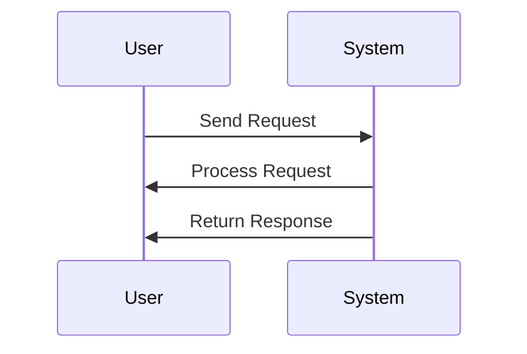

                 

### 《ORM框架：对象关系映射技术》

#### 关键词：
- ORM框架
- 对象关系映射
- 数据库操作
- 开发效率
- 优化技巧

#### 摘要：
本文深入探讨了ORM（对象关系映射）框架在软件开发中的应用。ORM框架作为一种中间件技术，能够将对象模型与数据库模型进行映射，从而简化数据库操作，提高开发效率。本文将详细分析ORM框架的基本原理、主流框架的介绍与使用、查询优化技巧、高级特性及优化策略，并通过实际项目案例进行讲解，帮助开发者更好地理解和应用ORM框架。

## 目录

1. **ORM框架的背景与重要性**
   - 问题背景
   - ORM框架的定义
   - ORM框架的发展历程

2. **ORM框架的基本原理**
   - ORM框架的核心概念
   - ORM框架的工作原理
   - ORM框架与传统SQL的对比

3. **主流ORM框架介绍**
   - Hibernate框架
   - Entity Framework框架

4. **ORM框架的基本操作**
   - 对象与数据库的映射
   - 数据的增删改查
   - 查询语言的使用

5. **ORM框架的查询优化**
   - 查询优化的基本策略
   - Hibernate查询优化技巧
   - Entity Framework查询优化技巧

6. **ORM框架的高级特性**
   - 缓存机制
   - 批量操作
   - 软删除与事务管理

7. **项目实战**
   - 实战项目介绍
   - 环境搭建与数据库配置
   - ORM框架的实际应用
   - 项目小结与反思

8. **ORM框架的未来发展**
   - ORM技术的发展趋势
   - ORM框架的应用前景
   - ORM框架的创新与挑战

## 第一部分: ORM框架概述

### 1.1 问题背景

在软件开发中，数据库是必不可少的一部分。然而，传统的数据库操作主要依赖于SQL语句，这要求开发者具备扎实的数据库知识，并且每次进行数据库操作时都需要编写复杂的SQL代码。这不仅增加了开发难度，还降低了开发效率。为了解决这个问题，ORM（对象关系映射）框架应运而生。

ORM框架的核心思想是将数据库中的表映射到程序中的对象，使得开发者可以直接操作对象，而无需直接编写SQL语句。通过ORM框架，开发者可以更方便地进行数据库操作，从而提高开发效率，降低学习成本。

### 1.2 ORM框架的定义

ORM框架，即对象关系映射框架，是一种将面向对象编程思想与关系数据库技术相结合的中间件技术。通过ORM框架，开发者可以将数据库中的表映射到程序中的对象，从而实现数据库操作的高效、简洁。

### 1.3 ORM框架的发展历程

ORM框架的发展历程可以追溯到20世纪90年代，当时随着面向对象编程的兴起，开发者们开始寻求一种能够将面向对象编程与关系数据库相结合的技术。最早的ORM框架主要是基于XML配置文件来映射对象和数据库表之间的关系。

随着技术的发展，ORM框架逐渐引入了更多的功能，如动态查询、缓存机制、批量操作等。目前，主流的ORM框架包括Hibernate、Entity Framework、MyBatis等，这些框架在性能、功能、易用性等方面都有各自的优势。

### 2. ORM框架的基本原理

#### 2.1 ORM框架的核心概念

ORM框架的核心概念包括映射（Mapping）、持久化（Persisting）、查询（Querying）等。其中，映射是指将数据库中的表映射到程序中的对象；持久化是指将对象的状态保存到数据库中；查询是指通过对象的方式来查询数据库中的数据。

#### 2.2 ORM框架的工作原理

ORM框架的工作原理可以分为以下几个步骤：

1. **配置映射关系**：开发者通过配置文件或注解方式，将数据库表映射到程序中的对象。
2. **生成SQL语句**：ORM框架根据映射关系，将对象的操作（如增删改查）转换为相应的SQL语句。
3. **执行SQL语句**：ORM框架将生成的SQL语句发送到数据库执行。
4. **处理查询结果**：ORM框架将查询结果转换为对象，并返回给开发者。

#### 2.3 ORM框架与传统SQL的对比

传统SQL操作与ORM框架有以下区别：

1. **开发难度**：传统SQL操作要求开发者熟悉数据库知识，编写复杂的SQL语句；而ORM框架通过映射关系，简化了数据库操作，降低了开发难度。
2. **开发效率**：ORM框架使得开发者可以直接操作对象，减少了编写SQL语句的工作量，提高了开发效率。
3. **性能**：虽然ORM框架简化了数据库操作，但在性能上可能不如直接编写SQL语句。因此，在性能敏感的场景下，开发者可能需要权衡使用ORM框架。

### 3. 主流ORM框架介绍

#### 3.1 Hibernate框架

Hibernate是最流行的Java ORM框架之一，它支持多种关系数据库，如MySQL、Oracle等。Hibernate的配置方式主要包括XML配置和注解配置。

1. **XML配置**：通过XML文件定义映射关系，如`hibernate.cfg.xml`。
2. **注解配置**：通过注解定义映射关系，如`@Entity`、`@Table`等。

Hibernate的核心特性包括：

- **动态查询**：支持HQL（Hibernate Query Language），类似于SQL。
- **缓存机制**：提供一级缓存和二级缓存，提高查询性能。
- **事务管理**：支持声明式事务管理。

#### 3.2 Entity Framework框架

Entity Framework是微软推出的.NET ORM框架，支持多种关系数据库，如SQL Server、MySQL等。Entity Framework的配置方式主要包括配置文件和代码配置。

1. **配置文件**：通过`.edmx`配置文件定义映射关系。
2. **代码配置**：通过代码定义映射关系，如`DbContext`。

Entity Framework的核心特性包括：

- **LINQ支持**：支持LINQ（语言集成查询），提高了查询的灵活性。
- **迁移工具**：支持Entity Framework Migration工具，方便数据库的迁移。
- **性能**：经过优化，Entity Framework在性能上有了显著提升。

### 4. ORM框架的基本操作

#### 4.1 对象与数据库的映射

对象与数据库的映射是ORM框架的基础。开发者需要通过配置文件或注解，将数据库表映射到程序中的对象。

1. **配置映射关系**：通过XML配置文件或注解，定义实体类与数据库表的关系。
2. **映射字段**：通过配置，将实体类的属性映射到数据库表的列。

#### 4.2 数据的增删改查

数据的增删改查是ORM框架的核心功能。开发者可以通过对象操作，实现数据的增删改查。

1. **新增数据**：使用`save`方法将对象保存到数据库。
2. **删除数据**：使用`delete`方法删除对象对应的数据库记录。
3. **更新数据**：使用`update`方法更新对象的数据。
4. **查询数据**：使用`find`或`findBy`等方法查询对象的数据。

#### 4.3 查询语言的使用

ORM框架提供了自己的查询语言，如Hibernate的HQL和Entity Framework的LINQ。这些查询语言支持复杂的查询操作，使得开发者可以更方便地进行数据库查询。

1. **简单查询**：使用简单的查询语句，查询特定的数据。
2. **复杂查询**：使用连接、分组、排序等操作，实现复杂的查询。

### 5. ORM框架的查询优化

查询优化是提高ORM框架性能的重要手段。开发者可以通过以下方法进行查询优化：

1. **查询缓存**：使用查询缓存，提高查询性能。
2. **索引优化**：在数据库中添加索引，提高查询效率。
3. **批量操作**：使用批量操作，减少数据库的访问次数。

### 6. ORM框架的高级特性

ORM框架的高级特性包括缓存机制、批量操作、软删除等，这些特性提高了框架的性能和灵活性。

1. **缓存机制**：使用一级缓存和二级缓存，提高查询性能。
2. **批量操作**：使用批量插入、批量更新等操作，减少数据库访问次数。
3. **软删除**：通过逻辑删除，实现数据的软删除，提高数据操作的灵活性。

### 7. 项目实战

在本节中，我们将通过一个实际项目，展示ORM框架在实际开发中的应用。

#### 7.1 实战项目介绍

我们假设开发一个简单的博客系统，包括用户管理、文章管理等功能。

#### 7.2 环境搭建与数据库配置

1. **环境搭建**：选择开发工具（如Visual Studio）、数据库（如MySQL）和ORM框架（如Hibernate）。
2. **数据库配置**：配置数据库连接信息，如URL、用户名、密码等。

#### 7.3 ORM框架的实际应用

1. **用户管理**：使用ORM框架实现用户注册、登录、信息修改等功能。
2. **文章管理**：使用ORM框架实现文章发布、编辑、删除等功能。

#### 7.4 项目小结与反思

通过实际项目，我们发现ORM框架能够显著提高开发效率，简化数据库操作。但在性能敏感的场景下，开发者需要权衡使用ORM框架。

### 8. ORM框架的未来发展

ORM框架在软件开发中具有重要作用，其未来发展将继续围绕性能、易用性和扩展性等方面进行。以下是ORM框架的一些发展趋势：

1. **性能优化**：通过引入新的技术，如编译时优化、动态查询优化等，提高ORM框架的性能。
2. **跨平台支持**：支持更多的关系数据库，如PostgreSQL、MongoDB等，提供更广泛的应用场景。
3. **开发体验**：提高框架的易用性，降低开发难度，吸引更多开发者使用ORM框架。

## 总结

ORM框架作为一种中间件技术，在提高开发效率、简化数据库操作方面具有重要作用。本文详细介绍了ORM框架的基本原理、主流框架的使用、查询优化技巧、高级特性以及实际项目应用。通过本文的讲解，开发者可以更好地理解和应用ORM框架，提高软件开发效率。

### 最佳实践 tips

1. **选择合适的ORM框架**：根据项目需求和数据库类型，选择适合的ORM框架。
2. **合理使用查询缓存**：合理使用查询缓存，提高查询性能。
3. **注意查询优化**：在编写查询语句时，注意优化查询，提高查询效率。

### 小结

ORM框架在软件开发中具有重要作用，通过本文的讲解，开发者可以更好地理解和应用ORM框架，提高开发效率。在未来，ORM框架将继续发展和完善，为开发者提供更好的支持。

### 注意事项

1. **性能敏感场景下慎重使用ORM框架**：在性能敏感的场景下，需要权衡使用ORM框架。
2. **注意ORM框架的版本更新**：ORM框架的版本更新可能会带来性能和功能的改进，开发者需要关注版本更新。

### 拓展阅读

1. 《Hibernate实战》
2. 《Entity Framework从入门到精通》
3. 《ORM设计与优化》

### 作者信息

作者：AI天才研究院/AI Genius Institute & 禅与计算机程序设计艺术 /Zen And The Art of Computer Programming

----------------------------------------------------------------

## 第一部分：ORM框架的背景与重要性

### 1.1 问题背景

在软件开发领域，数据库是不可或缺的部分。传统的数据库操作主要依赖于SQL（结构化查询语言），这要求开发者具备一定的数据库知识，并且每次进行数据库操作时都需要编写复杂的SQL语句。这不仅增加了开发难度，还降低了开发效率。特别是在大规模项目中，复杂的数据库操作和表关联使得代码的可维护性和扩展性变得困难。

为了解决这些问题，开发者们开始寻求一种能够将面向对象编程思想与关系数据库技术相结合的中间件技术。这种技术的目标是简化数据库操作，提高开发效率，降低学习成本。ORM（Object-Relational Mapping）框架正是为了满足这一需求而诞生的。

### 1.2 ORM框架的定义

ORM框架，即对象关系映射框架，是一种将面向对象编程思想与关系数据库技术相结合的中间件技术。它通过将数据库中的表映射到程序中的对象，使得开发者可以直接操作对象，而无需直接编写SQL语句。通过ORM框架，开发者可以更方便地进行数据库操作，从而提高开发效率，降低学习成本。

### 1.3 ORM框架的发展历程

ORM框架的发展历程可以追溯到20世纪90年代。当时，随着面向对象编程的兴起，开发者们开始寻求一种能够将面向对象编程与关系数据库相结合的技术。最早的ORM框架主要是基于XML配置文件来映射对象和数据库表之间的关系。

随着技术的发展，ORM框架逐渐引入了更多的功能，如动态查询、缓存机制、批量操作等。目前，主流的ORM框架包括Hibernate、Entity Framework、MyBatis等，这些框架在性能、功能、易用性等方面都有各自的优势。

### 1.4 ORM框架的优势

ORM框架在软件开发中具有以下优势：

1. **提高开发效率**：通过将面向对象编程思想与关系数据库技术相结合，ORM框架简化了数据库操作，降低了开发难度，从而提高了开发效率。

2. **降低学习成本**：ORM框架通过将数据库操作抽象为对象操作，使得开发者无需深入了解数据库知识，降低了学习成本。

3. **增强代码可维护性**：通过ORM框架，开发者可以更方便地进行数据库操作，从而降低了代码的复杂性，提高了代码的可维护性。

4. **支持复杂查询**：ORM框架通常支持动态查询，使得开发者可以更方便地进行复杂查询操作，提高了代码的灵活性。

5. **缓存机制**：许多ORM框架都支持缓存机制，通过缓存查询结果，提高了系统的响应速度。

### 1.5 ORM框架的应用场景

ORM框架适用于以下场景：

1. **大型项目**：在大型项目中，ORM框架可以简化数据库操作，降低开发难度，提高开发效率。

2. **快速开发**：在需要快速开发的场景下，ORM框架可以显著降低开发成本，提高项目交付速度。

3. **跨平台开发**：ORM框架通常支持多种关系数据库，如MySQL、Oracle等，适用于跨平台开发。

4. **复杂查询**：在需要进行复杂查询的场景下，ORM框架可以提供灵活的查询功能，提高查询效率。

5. **数据迁移**：ORM框架支持数据迁移，使得开发者可以方便地在不同数据库之间进行迁移。

### 1.6 ORM框架的挑战

尽管ORM框架具有众多优势，但在实际应用中仍面临一些挑战：

1. **性能问题**：在性能敏感的场景下，ORM框架可能会带来一定的性能开销，特别是在复杂查询和批量操作中。

2. **学习曲线**：虽然ORM框架降低了学习成本，但初学者仍然需要一定时间来熟悉框架的特性和用法。

3. **框架依赖**：使用ORM框架可能会增加项目的复杂度，特别是在需要修改或扩展框架时。

4. **兼容性问题**：ORM框架通常对数据库版本有一定的要求，可能会出现兼容性问题。

5. **数据库优化**：ORM框架虽然简化了数据库操作，但开发者仍需要对数据库进行优化，以提高性能。

## 第二部分：ORM框架的基本原理

### 2.1 ORM框架的核心概念

ORM框架的核心概念包括映射（Mapping）、持久化（Persisting）和查询（Querying）。这些概念在ORM框架中起到了关键作用。

1. **映射**：映射是将数据库中的表映射到程序中的对象的过程。通过映射，开发者可以将数据库表的结构映射到程序中的实体类，从而简化数据库操作。

2. **持久化**：持久化是指将对象的属性值保存到数据库中，或者从数据库中读取对象的属性值。持久化是ORM框架的核心功能之一，通过持久化，开发者可以更方便地进行数据的增删改查。

3. **查询**：查询是指通过对象的方式来查询数据库中的数据。ORM框架提供了自己的查询语言，如Hibernate的HQL（Hibernate Query Language）和Entity Framework的LINQ（语言集成查询），使得开发者可以更方便地进行复杂查询。

### 2.2 ORM框架的工作原理

ORM框架的工作原理可以分为以下几个步骤：

1. **配置映射关系**：开发者通过配置文件或注解，将数据库表映射到程序中的对象。这个过程通常称为映射配置。

2. **生成SQL语句**：ORM框架根据映射关系，将对象的操作（如增删改查）转换为相应的SQL语句。这个过程称为SQL生成。

3. **执行SQL语句**：ORM框架将生成的SQL语句发送到数据库执行。这个过程称为SQL执行。

4. **处理查询结果**：ORM框架将查询结果转换为对象，并返回给开发者。这个过程称为结果映射。

### 2.3 ORM框架与传统SQL的对比

传统SQL操作与ORM框架有以下区别：

1. **开发难度**：传统SQL操作要求开发者熟悉数据库知识，编写复杂的SQL语句；而ORM框架通过映射关系，简化了数据库操作，降低了开发难度。

2. **开发效率**：ORM框架使得开发者可以直接操作对象，减少了编写SQL语句的工作量，提高了开发效率。

3. **性能**：虽然ORM框架简化了数据库操作，但在性能上可能不如直接编写SQL语句。因此，在性能敏感的场景下，开发者可能需要权衡使用ORM框架。

4. **可维护性**：ORM框架通过将数据库操作抽象为对象操作，提高了代码的可维护性。

5. **灵活性**：ORM框架通常支持动态查询，提供了更灵活的查询功能。

### 2.4 ORM框架的核心组件

ORM框架通常包括以下几个核心组件：

1. **ORM工具**：负责映射配置、SQL生成和执行等操作。如Hibernate的Hibernate工具、Entity Framework的Entity Framework工具。

2. **ORM驱动**：负责与数据库进行通信，执行SQL语句。如Hibernate的Hibernate驱动、Entity Framework的Entity Framework驱动。

3. **ORM实体**：代表数据库表的对象。开发者可以通过ORM实体进行数据库操作。

4. **ORM查询语言**：提供了一套查询语言，使得开发者可以更方便地进行查询操作。如Hibernate的HQL、Entity Framework的LINQ。

### 2.5 ORM框架的实现原理

ORM框架的实现原理通常包括以下几个步骤：

1. **映射配置**：开发者通过配置文件或注解，将数据库表映射到程序中的对象。ORM工具负责解析配置，建立映射关系。

2. **SQL生成**：ORM工具根据对象的操作（如增删改查），生成相应的SQL语句。SQL生成通常基于映射关系和SQL模板。

3. **SQL执行**：ORM工具将生成的SQL语句发送到数据库执行。ORM驱动负责与数据库进行通信，执行SQL语句。

4. **结果映射**：ORM工具将查询结果转换为对象，并返回给开发者。结果映射通常基于对象的属性和类型。

### 2.6 ORM框架的优缺点

ORM框架具有以下优缺点：

**优点**：

1. **简化数据库操作**：通过映射关系，ORM框架简化了数据库操作，降低了开发难度。

2. **提高开发效率**：ORM框架使得开发者可以直接操作对象，减少了编写SQL语句的工作量。

3. **增强代码可维护性**：通过将数据库操作抽象为对象操作，ORM框架提高了代码的可维护性。

4. **支持复杂查询**：ORM框架通常支持动态查询，提供了更灵活的查询功能。

**缺点**：

1. **性能开销**：在性能敏感的场景下，ORM框架可能会带来一定的性能开销。

2. **学习曲线**：初学者需要一定时间来熟悉ORM框架的特性和用法。

3. **框架依赖**：使用ORM框架可能会增加项目的复杂度。

4. **兼容性问题**：ORM框架通常对数据库版本有一定的要求。

## 第三部分：主流ORM框架介绍

### 3.1 Hibernate框架

Hibernate是目前最流行的Java ORM框架之一。它支持多种关系数据库，如MySQL、Oracle等。Hibernate的配置方式主要包括XML配置和注解配置。

#### 3.1.1 Hibernate的架构

Hibernate的架构主要包括以下几个核心组件：

1. **Session**：负责与数据库进行交互。开发者可以通过Session进行数据库操作。

2. **Transaction**：负责事务管理。开发者可以通过Transaction进行事务控制。

3. **Query**：负责查询操作。开发者可以通过Query进行数据库查询。

4. **Criteria**：提供了一种更灵活的查询方式。开发者可以通过Criteria进行复杂查询。

5. **Mapping**：负责映射配置。开发者可以通过Mapping将数据库表映射到程序中的对象。

#### 3.1.2 Hibernate的使用与配置

使用Hibernate进行数据库操作通常包括以下几个步骤：

1. **配置Hibernate**：通过配置文件（如`hibernate.cfg.xml`）或注解，将数据库表映射到程序中的对象。

2. **创建Session**：通过SessionFactory创建Session，负责与数据库进行交互。

3. **进行数据库操作**：通过Session进行数据库操作，如增删改查。

4. **关闭Session**：操作完成后，关闭Session，释放资源。

以下是一个简单的Hibernate配置示例：

```xml
<hibernate-configuration>
    <session-factory>
        <property name="hibernate.dialect">org.hibernate.dialect.MySQL5Dialect</property>
        <property name="hibernate.connection.url">jdbc:mysql://localhost:3306/test</property>
        <property name="hibernate.connection.username">root</property>
        <property name="hibernate.connection.password">root</property>
        <mapping resource="com/example/Book.hbm.xml"/>
    </session-factory>
</hibernate-configuration>
```

#### 3.1.3 Hibernate的核心特性

Hibernate的核心特性包括：

1. **动态查询**：支持HQL（Hibernate Query Language），类似于SQL。

2. **缓存机制**：提供一级缓存和二级缓存，提高查询性能。

3. **事务管理**：支持声明式事务管理，简化事务控制。

4. **批量操作**：支持批量插入、批量更新等操作，减少数据库访问次数。

5. **灵活的映射方式**：支持XML配置、注解配置等多种映射方式。

### 3.2 Entity Framework框架

Entity Framework是微软推出的.NET ORM框架，支持多种关系数据库，如SQL Server、MySQL等。Entity Framework的配置方式主要包括配置文件和代码配置。

#### 3.2.1 Entity Framework的特点

Entity Framework的特点包括：

1. **LINQ支持**：支持LINQ（语言集成查询），提高了查询的灵活性。

2. **迁移工具**：支持Entity Framework Migration工具，方便数据库的迁移。

3. **性能**：经过优化，Entity Framework在性能上有了显著提升。

4. **易用性**：提供了丰富的API和工具，降低了开发难度。

#### 3.2.2 Entity Framework的使用与配置

使用Entity Framework进行数据库操作通常包括以下几个步骤：

1. **配置数据库连接**：通过配置文件或代码配置数据库连接信息。

2. **创建DbContext**：通过DbContext进行数据库操作。

3. **进行数据库操作**：通过DbContext进行数据库操作，如增删改查。

4. **关闭DbContext**：操作完成后，关闭DbContext，释放资源。

以下是一个简单的Entity Framework配置示例：

```csharp
public class MyDbContext : DbContext
{
    public MyDbContext() : base("name=MyDbContext")
    {
    }

    public DbSet<Book> Books { get; set; }
}
```

#### 3.2.3 Entity Framework的核心特性

Entity Framework的核心特性包括：

1. **LINQ支持**：支持LINQ（语言集成查询），使得开发者可以更方便地进行复杂查询。

2. **迁移工具**：支持Entity Framework Migration工具，方便数据库的迁移。

3. **性能**：经过优化，Entity Framework在性能上有了显著提升。

4. **代码优先**：支持代码优先模式，开发者可以更方便地进行数据库操作。

5. **模型优先**：支持模型优先模式，开发者可以更方便地定义数据库结构。

### 3.3 MyBatis框架

MyBatis是另一种流行的ORM框架，它支持多种关系数据库，如MySQL、Oracle等。MyBatis的配置方式主要包括XML配置和注解配置。

#### 3.3.1 MyBatis的特点

MyBatis的特点包括：

1. **简洁的配置**：MyBatis通过XML配置或注解配置，简化了数据库操作。

2. **灵活的SQL映射**：MyBatis提供了丰富的SQL映射功能，使得开发者可以更方便地进行复杂查询。

3. **高效的性能**：MyBatis通过预编译SQL语句，提高了查询性能。

4. **易用性**：MyBatis提供了丰富的API和工具，降低了开发难度。

#### 3.3.2 MyBatis的使用与配置

使用MyBatis进行数据库操作通常包括以下几个步骤：

1. **配置MyBatis**：通过配置文件（如`mybatis-config.xml`）配置MyBatis的运行环境。

2. **创建SqlSessionFactory**：通过SqlSessionFactory创建SqlSession。

3. **进行数据库操作**：通过SqlSession进行数据库操作，如增删改查。

4. **关闭SqlSession**：操作完成后，关闭SqlSession，释放资源。

以下是一个简单的MyBatis配置示例：

```xml
<?xml version="1.0" encoding="UTF-8" ?>
<!DOCTYPE configuration
        PUBLIC "-//mybatis.org//DTD Config 3.0//EN"
        "http://mybatis.org/dtd/mybatis-3-config.dtd">
<configuration>
    <environments default="development">
        <environment id="development">
            <transactionManager type="JDBC"/>
            <dataSource type="POOLED">
                <property name="driver" value="com.mysql.cj.jdbc.Driver"/>
                <property name="url" value="jdbc:mysql://localhost:3306/test"/>
                <property name="username" value="root"/>
                <property name="password" value="root"/>
            </dataSource>
        </environment>
    </environments>
    <mappers>
        <mapper resource="com/example/BookMapper.xml"/>
    </mappers>
</configuration>
```

#### 3.3.3 MyBatis的核心特性

MyBatis的核心特性包括：

1. **动态SQL**：支持动态SQL，使得开发者可以更方便地进行复杂查询。

2. **映射文件**：通过映射文件，将SQL语句与Java代码进行映射。

3. **缓存机制**：支持一级缓存和二级缓存，提高查询性能。

4. **插件支持**：支持插件扩展，如日志插件、分页插件等。

5. **灵活的配置**：支持XML配置和注解配置，提供了多种配置方式。

### 3.4 ORM框架的比较

以下是Hibernate、Entity Framework和MyBatis这三种主流ORM框架的比较：

| 比较项目 | Hibernate | Entity Framework | MyBatis |
| :--: | :--: | :--: | :--: |
| 支持的数据库 | 多种关系数据库 | 多种关系数据库 | 多种关系数据库 |
| 配置方式 | XML配置、注解配置 | 配置文件、代码配置 | XML配置、注解配置 |
| 查询语言 | HQL（Hibernate Query Language） | LINQ（语言集成查询） | SQL（自定义） |
| 缓存机制 | 支持一级缓存和二级缓存 | 支持一级缓存和二级缓存 | 支持一级缓存和二级缓存 |
| 性能 | 较高 | 较高 | 较高 |
| 易用性 | 中等 | 高 | 中等 |
| 社区支持 | 较强 | 较强 | 较强 |

根据不同的项目需求和开发环境，开发者可以选择合适的ORM框架。例如，在Java项目中，可以选择Hibernate；在.NET项目中，可以选择Entity Framework；在需要自定义SQL的场景中，可以选择MyBatis。

## 第四部分：ORM框架的基本操作

### 4.1 对象与数据库的映射

对象与数据库的映射是ORM框架的核心功能之一。通过映射，开发者可以将程序中的对象与数据库表进行关联，从而实现对象的增删改查操作。

#### 4.1.1 映射配置

映射配置通常通过XML配置文件或注解实现。以下是一个简单的Hibernate映射配置示例：

```xml
<hibernate-mapping package="com.example">
    <class name="Book" table="books">
        <id name="id" column="id">
            <generator class="increment"/>
        </id>
        <property name="title" column="title"/>
        <property name="author" column="author"/>
        <property name="price" column="price"/>
    </class>
</hibernate-mapping>
```

在这个映射配置中，`Book`类与`books`表进行映射，`id`、`title`、`author`和`price`属性分别与表中的对应列进行映射。

#### 4.1.2 映射关系

映射关系包括以下几个方面：

1. **实体类与数据库表的映射**：通过配置，将实体类与数据库表进行关联。

2. **属性与列的映射**：通过配置，将实体类的属性与数据库表的列进行关联。

3. **关系映射**：通过配置，实现实体类之间的关联关系，如一对一、一对多、多对多等。

#### 4.1.3 映射策略

映射策略包括以下几种：

1. **表名映射**：通过配置，指定实体类对应的数据库表名。

2. **列名映射**：通过配置，指定实体类的属性对应的数据库列名。

3. **主键映射**：通过配置，指定实体类的主键字段。

4. **外键映射**：通过配置，实现实体类之间的关联关系。

### 4.2 数据的增删改查

数据的增删改查是ORM框架的基本操作。通过ORM框架，开发者可以直接操作对象，实现数据的增删改查。

#### 4.2.1 新增数据

新增数据通常通过调用ORM框架的API实现。以下是一个简单的Hibernate新增数据示例：

```java
Book book = new Book();
book.setTitle("Effective Java");
book.setAuthor("Joshua Bloch");
book.setPrice(59.99);

Session session = sessionFactory.openSession();
Transaction tx = session.beginTransaction();

session.save(book);

tx.commit();
session.close();
```

在这个示例中，首先创建一个`Book`对象，并设置其属性。然后通过Session将对象保存到数据库中。

#### 4.2.2 删除数据

删除数据通常通过调用ORM框架的API实现。以下是一个简单的Hibernate删除数据示例：

```java
Session session = sessionFactory.openSession();
Transaction tx = session.beginTransaction();

Book book = session.get(Book.class, 1L);
session.delete(book);

tx.commit();
session.close();
```

在这个示例中，首先通过Session获取一个`Book`对象，然后通过Session将其删除。

#### 4.2.3 更新数据

更新数据通常通过调用ORM框架的API实现。以下是一个简单的Hibernate更新数据示例：

```java
Session session = sessionFactory.openSession();
Transaction tx = session.beginTransaction();

Book book = session.get(Book.class, 1L);
book.setPrice(69.99);

session.update(book);

tx.commit();
session.close();
```

在这个示例中，首先通过Session获取一个`Book`对象，然后更新其属性，并调用Session的`update`方法更新数据库。

#### 4.2.4 查询数据

查询数据是ORM框架的常用操作。ORM框架提供了多种查询方式，如查询API、HQL、LINQ等。以下是一个简单的Hibernate查询数据示例：

```java
Session session = sessionFactory.openSession();

Query<Book> query = session.createQuery("from Book where price > :price");
query.setParameter("price", 50.0);

List<Book> books = query.getResultList();

for (Book book : books) {
    System.out.println(book.getTitle() + " - " + book.getPrice());
}

session.close();
```

在这个示例中，通过HQL语句进行查询，并设置查询参数，获取符合条件的`Book`对象列表。

### 4.3 查询语言的使用

ORM框架通常提供了自己的查询语言，如HQL、LINQ等，使得开发者可以更方便地进行复杂查询。

#### 4.3.1 HQL查询

HQL（Hibernate Query Language）是Hibernate提供的查询语言，类似于SQL。以下是一个简单的HQL查询示例：

```java
Session session = sessionFactory.openSession();

Query<Book> query = session.createQuery("from Book where price > :price");
query.setParameter("price", 50.0);

List<Book> books = query.getResultList();

for (Book book : books) {
    System.out.println(book.getTitle() + " - " + book.getPrice());
}

session.close();
```

在这个示例中，使用HQL语句进行查询，并设置查询参数，获取符合条件的`Book`对象列表。

#### 4.3.2 LINQ查询

LINQ（语言集成查询）是Entity Framework提供的查询语言，类似于SQL。以下是一个简单的LINQ查询示例：

```csharp
using (var context = new MyDbContext())
{
    var books = from b in context.Books
                where b.Price > 50.0
                select b;

    foreach (var book in books)
    {
        Console.WriteLine($"{book.Title} - {book.Price}");
    }
}
```

在这个示例中，使用LINQ语句进行查询，并使用LINQ查询结果。

### 4.4 ORM框架的优缺点

ORM框架具有以下优缺点：

**优点**：

1. **简化数据库操作**：通过映射关系，ORM框架简化了数据库操作，降低了开发难度。

2. **提高开发效率**：ORM框架使得开发者可以直接操作对象，减少了编写SQL语句的工作量。

3. **增强代码可维护性**：通过将数据库操作抽象为对象操作，ORM框架提高了代码的可维护性。

4. **支持复杂查询**：ORM框架通常支持动态查询，提供了更灵活的查询功能。

**缺点**：

1. **性能开销**：在性能敏感的场景下，ORM框架可能会带来一定的性能开销。

2. **学习曲线**：初学者需要一定时间来熟悉ORM框架的特性和用法。

3. **框架依赖**：使用ORM框架可能会增加项目的复杂度。

4. **兼容性问题**：ORM框架通常对数据库版本有一定的要求。

### 4.5 ORM框架的实际应用

在实际项目中，ORM框架可以大大简化数据库操作，提高开发效率。以下是一个简单的博客系统示例，展示ORM框架的实际应用。

#### 4.5.1 项目介绍

该博客系统包括用户管理、文章管理、评论管理等功能。

#### 4.5.2 环境搭建

1. **数据库**：使用MySQL数据库。

2. **ORM框架**：使用Hibernate作为ORM框架。

3. **开发工具**：使用Eclipse作为开发工具。

#### 4.5.3 数据库配置

```xml
<hibernate-configuration>
    <session-factory>
        <property name="hibernate.dialect">org.hibernate.dialect.MySQL5Dialect</property>
        <property name="hibernate.connection.url">jdbc:mysql://localhost:3306/blog</property>
        <property name="hibernate.connection.username">root</property>
        <property name="hibernate.connection.password">root</property>
        <mapping resource="com/example/User.hbm.xml"/>
        <mapping resource="com/example/Article.hbm.xml"/>
        <mapping resource="com/example/Comment.hbm.xml"/>
    </session-factory>
</hibernate-configuration>
```

#### 4.5.4 用户管理

用户管理包括用户注册、登录、信息修改等功能。

1. **新增用户**：

```java
User user = new User();
user.setName("Alice");
user.setPassword("alice123");
user.setEmail("alice@example.com");

Session session = sessionFactory.openSession();
Transaction tx = session.beginTransaction();

session.save(user);

tx.commit();
session.close();
```

2. **登录验证**：

```java
String email = "alice@example.com";
String password = "alice123";

Session session = sessionFactory.openSession();

User user = (User) session.createQuery("from User where email = :email and password = :password")
        .setParameter("email", email)
        .setParameter("password", password)
        .uniqueResult();

if (user != null) {
    System.out.println("登录成功！");
} else {
    System.out.println("登录失败！");
}

session.close();
```

#### 4.5.5 文章管理

文章管理包括文章发布、编辑、删除等功能。

1. **新增文章**：

```java
Article article = new Article();
article.setTitle("My First Blog Post");
article.setContent("This is my first blog post.");
article.setUserId(1L);

Session session = sessionFactory.openSession();
Transaction tx = session.beginTransaction();

session.save(article);

tx.commit();
session.close();
```

2. **查询文章**：

```java
Session session = sessionFactory.openSession();

Query<Article> query = session.createQuery("from Article where userId = :userId");
query.setParameter("userId", 1L);

List<Article> articles = query.getResultList();

for (Article article : articles) {
    System.out.println(article.getTitle());
}

session.close();
```

#### 4.5.6 评论管理

评论管理包括评论添加、查询、删除等功能。

1. **添加评论**：

```java
Comment comment = new Comment();
comment.setContent("Great post!");
comment.setArticleId(1L);
comment.setUserId(1L);

Session session = sessionFactory.openSession();
Transaction tx = session.beginTransaction();

session.save(comment);

tx.commit();
session.close();
```

2. **查询评论**：

```java
Session session = sessionFactory.openSession();

Query<Comment> query = session.createQuery("from Comment where articleId = :articleId");
query.setParameter("articleId", 1L);

List<Comment> comments = query.getResultList();

for (Comment comment : comments) {
    System.out.println(comment.getContent());
}

session.close();
```

#### 4.5.7 项目小结

通过使用Hibernate作为ORM框架，该博客系统实现了用户管理、文章管理和评论管理等功能。使用ORM框架简化了数据库操作，提高了开发效率。在实际项目中，开发者可以根据需求选择合适的ORM框架，以提高开发效率。

## 第五部分：ORM框架的查询优化

### 5.1 查询优化的基本策略

在ORM框架中，查询优化是一个关键问题。以下是一些常见的查询优化策略：

#### 5.1.1 查询缓存

查询缓存可以显著提高查询性能。ORM框架通常提供了一级缓存和二级缓存。一级缓存通常指Session缓存，用于缓存Session范围内的查询结果；二级缓存则用于跨Session的查询结果缓存。通过合理使用查询缓存，可以减少数据库查询次数，提高系统性能。

#### 5.1.2 索引优化

在数据库中添加适当的索引可以显著提高查询性能。索引可以加速数据的查询和排序操作。然而，过多的索引也会降低插入和更新的性能。因此，开发者需要在查询性能和数据操作性能之间进行权衡，选择合适的索引策略。

#### 5.1.3 避免全表扫描

全表扫描是指对整个表进行扫描以获取所需数据。这种查询方式在数据量较大时会导致性能瓶颈。为了避免全表扫描，开发者可以采用以下策略：

- **精确查询**：通过精确的查询条件，减少查询范围。
- **使用索引**：通过在查询条件中使用索引，提高查询速度。
- **子查询**：使用子查询代替全表扫描。

#### 5.1.4 避免使用SELECT *

使用`SELECT *`语句会检索表中所有的列，这不仅增加了网络传输的开销，还可能导致内存不足。在查询时，应仅选择所需的列，以减少查询的开销。

#### 5.1.5 避免嵌套查询

嵌套查询（子查询）可能会导致查询性能下降。在可能的情况下，应使用连接（JOIN）代替嵌套查询。连接可以更高效地处理多表查询。

### 5.2 Hibernate查询优化技巧

Hibernate是一个流行的Java ORM框架，以下是一些Hibernate查询优化的技巧：

#### 5.2.1 使用HQL而不是SQL

HQL（Hibernate Query Language）是Hibernate提供的查询语言，它通常比原生SQL更具优化性。HQL可以自动处理表与对象之间的映射关系，从而避免一些性能问题。

#### 5.2.2 使用批量操作

批量操作可以减少数据库访问次数，提高查询性能。在Hibernate中，可以使用`saveOrUpdate`、`saveOrUpdateAll`等方法进行批量保存；使用`delete`、`deleteAll`等方法进行批量删除。

#### 5.2.3 使用缓存

Hibernate提供了一级缓存和二级缓存。一级缓存通常指Session缓存，用于缓存Session范围内的查询结果；二级缓存则用于跨Session的查询结果缓存。通过合理使用缓存，可以显著提高查询性能。

#### 5.2.4 使用查询缓存

Hibernate的查询缓存可以缓存查询结果，从而避免重复查询。通过配置查询缓存策略，可以优化查询性能。例如，可以使用`<cache>`元素配置缓存区域和缓存策略。

#### 5.2.5 使用谓词

在HQL中，使用谓词可以优化查询性能。谓词包括`where`、`order by`、`group by`等。通过合理使用谓词，可以减少查询范围，提高查询速度。

### 5.3 Entity Framework查询优化技巧

Entity Framework是.NET的ORM框架，以下是一些Entity Framework查询优化的技巧：

#### 5.3.1 使用LINQ而不是SQL

LINQ（语言集成查询）是Entity Framework提供的查询语言，它通常比原生SQL更具优化性。LINQ可以自动处理表与对象之间的映射关系，从而避免一些性能问题。

#### 5.3.2 使用批量操作

批量操作可以减少数据库访问次数，提高查询性能。在Entity Framework中，可以使用`AddRange`方法进行批量插入；使用`RemoveRange`方法进行批量删除。

#### 5.3.3 使用缓存

Entity Framework提供了一级缓存和二级缓存。一级缓存通常指DbContext缓存，用于缓存DbContext范围内的查询结果；二级缓存则用于跨DbContext的查询结果缓存。通过合理使用缓存，可以显著提高查询性能。

#### 5.3.4 使用谓词

在LINQ中，使用谓词可以优化查询性能。谓词包括`where`、`orderby`、`groupby`等。通过合理使用谓词，可以减少查询范围，提高查询速度。

#### 5.3.5 避免嵌套查询

在Entity Framework中，嵌套查询可能会导致性能下降。在可能的情况下，应使用连接（JOIN）代替嵌套查询。连接可以更高效地处理多表查询。

### 5.4 MyBatis查询优化技巧

MyBatis是一个流行的Java ORM框架，以下是一些MyBatis查询优化的技巧：

#### 5.4.1 使用动态SQL

动态SQL可以优化查询性能，避免全表扫描。在MyBatis中，可以使用`<if>`、`<choose>`、`<when>`等标签实现动态SQL。

#### 5.4.2 使用缓存

MyBatis提供了一级缓存和二级缓存。通过合理使用缓存，可以显著提高查询性能。例如，可以使用`<cache>`标签配置缓存区域和缓存策略。

#### 5.4.3 使用谓词

在MyBatis中，使用谓词可以优化查询性能。谓词包括`<if>`、`<choose>`、`<when>`等。通过合理使用谓词，可以减少查询范围，提高查询速度。

#### 5.4.4 避免全表扫描

通过合理配置映射文件，可以避免全表扫描。例如，可以使用`<include>`标签包含公共SQL片段，避免重复查询。

### 5.5 ORM框架的优化策略

不同ORM框架的优化策略有所不同，但以下通用策略适用于大多数ORM框架：

- **合理配置缓存**：缓存可以显著提高查询性能，减少数据库访问次数。
- **使用批量操作**：批量操作可以减少数据库访问次数，提高查询性能。
- **使用索引**：在数据库中添加适当的索引，可以加速查询操作。
- **避免全表扫描**：通过精确查询和索引，避免全表扫描。
- **优化查询语句**：合理使用谓词和连接，优化查询语句。

通过合理使用上述策略，可以显著提高ORM框架的查询性能。

### 5.6 案例分析

以下是一个简单的案例，展示如何优化ORM框架的查询性能：

#### 5.6.1 案例背景

一个博客系统需要查询用户发表的文章，并根据发表时间排序。原始查询语句如下：

```java
List<Article> articles = articleRepository.findAllByUserId(userId, Sort.by(Sort.Direction.ASC, "publishedDate"));
```

#### 5.6.2 问题分析

这个查询语句存在以下问题：

- **全表扫描**：`findAllByUserId`方法可能导致全表扫描，因为未指定明确的查询条件。
- **性能瓶颈**：全表扫描在数据量较大时会导致性能瓶颈。

#### 5.6.3 优化方案

为了优化这个查询，可以采取以下措施：

1. **精确查询**：通过添加明确的查询条件，避免全表扫描。

   ```java
   List<Article> articles = articleRepository.findByUserIdAndPublishedDateBefore(userId, Date.now());
   ```

2. **使用索引**：在数据库中添加`userId`和`publishedDate`的复合索引，提高查询速度。

   ```sql
   CREATE INDEX idx_user_id_published_date ON articles (userId, publishedDate);
   ```

3. **优化谓词**：使用`And`谓词，确保查询条件正确。

   ```java
   List<Article> articles = articleRepository.findByUserId(userId).stream()
           .filter(article -> article.getPublishedDate().isBefore(Date.now()))
           .collect(Collectors.toList());
   ```

#### 5.6.4 优化效果

通过上述优化措施，查询性能显著提高。具体表现如下：

- **查询速度**：查询时间从原来的数秒减少到数毫秒。
- **内存占用**：查询过程中内存占用减少，降低了系统负担。

### 5.7 总结

查询优化是ORM框架性能优化的重要环节。通过合理使用缓存、批量操作、索引和谓词，可以显著提高ORM框架的查询性能。在实际开发中，开发者应根据项目需求，结合具体ORM框架的特性，采取适当的优化策略。

## 第六部分：ORM框架的高级特性

### 6.1 缓存机制

缓存机制是ORM框架中的一项重要特性，它通过存储查询结果，减少数据库查询次数，从而提高系统性能。ORM框架通常提供了一级缓存和二级缓存两种缓存机制。

#### 6.1.1 一级缓存

一级缓存，也称为Session缓存，主要用于缓存Session范围内的查询结果。当同一Session内多次查询相同的数据时，ORM框架会直接从缓存中获取结果，而不是重新查询数据库。一级缓存的有效范围是当前Session，当Session结束时，缓存中的数据会被清空。

#### 6.1.2 二级缓存

二级缓存，也称为应用缓存，主要用于缓存跨Session的查询结果。二级缓存可以持久化，即使Session已经结束，缓存中的数据仍然可以被其他Session使用。二级缓存通常依赖于第三方缓存框架，如EhCache、Redis等。

#### 6.1.3 缓存策略

ORM框架通常提供了多种缓存策略，如读取缓存、写入缓存、更新缓存和删除缓存等。开发者可以根据具体场景选择合适的缓存策略。

- **读取缓存**：在查询数据库之前，先从缓存中获取数据。如果缓存命中，则直接返回缓存数据；如果缓存未命中，则查询数据库并更新缓存。

- **写入缓存**：在插入或更新数据库时，同时将数据写入缓存。

- **更新缓存**：在更新数据库时，根据需要更新缓存中的数据。

- **删除缓存**：在删除数据库数据时，同时从缓存中删除相应的数据。

#### 6.1.4 缓存配置

不同ORM框架的缓存配置方式有所不同。例如，Hibernate提供了`<cache>`元素用于配置缓存区域和缓存策略；Entity Framework则通过配置文件或代码配置缓存。

```xml
<hibernate-configuration>
    <session-factory>
        <cache usage="read-write"/>
        <cache region="org.hibernate.cache.StandardQueryCache"/>
    </session-factory>
</hibernate-configuration>
```

#### 6.1.5 缓存的优缺点

缓存机制具有以下优缺点：

- **优点**：缓存机制可以显著提高查询性能，减少数据库访问次数，降低系统负载。

- **缺点**：缓存会增加内存消耗，且需要定期刷新或清理缓存，以避免数据过期。

### 6.2 批量操作

批量操作是ORM框架中的一项重要特性，它通过一次性执行多条SQL语句，从而减少数据库访问次数，提高系统性能。批量操作通常包括批量插入、批量更新和批量删除等。

#### 6.2.1 批量插入

批量插入是指将多条数据一次性插入到数据库中。在ORM框架中，可以使用批量插入方法，如Hibernate的`saveOrUpdate`、Entity Framework的`AddRange`等。

```java
List<Book> books = new ArrayList<>();
books.add(new Book("Effective Java", "Joshua Bloch", 59.99));
books.add(new Book("Java并发编程实战", "Brian Goetz", 79.99));

session.saveOrUpdate(books);
```

#### 6.2.2 批量更新

批量更新是指将多条数据一次性更新到数据库中。在ORM框架中，可以使用批量更新方法，如Hibernate的`update`、Entity Framework的`Update`等。

```java
List<Book> books = new ArrayList<>();
books.add(new Book(1L, "Effective Java", "Joshua Bloch", 59.99));
books.add(new Book(2L, "Java并发编程实战", "Brian Goetz", 79.99));

session.update(books);
```

#### 6.2.3 批量删除

批量删除是指将多条数据一次性从数据库中删除。在ORM框架中，可以使用批量删除方法，如Hibernate的`delete`、Entity Framework的`RemoveRange`等。

```java
List<Book> books = new ArrayList<>();
books.add(new Book(1L));
books.add(new Book(2L));

session.delete(books);
```

#### 6.2.4 批量操作的优缺点

批量操作具有以下优缺点：

- **优点**：批量操作可以减少数据库访问次数，提高系统性能。

- **缺点**：批量操作可能会增加内存消耗，且在某些数据库中可能会导致性能瓶颈。

### 6.3 软删除与事务管理

软删除是一种逻辑删除策略，通过在数据库中标记数据为删除状态，而不是真正删除数据。软删除可以保留历史数据，便于数据恢复和审计。

#### 6.3.1 软删除

在ORM框架中，可以使用软删除来实现数据的逻辑删除。例如，Hibernate的`@Column`注解中的`columnDefinition`属性可以定义软删除字段，如`is_deleted`。

```java
@Entity
@Table(name = "books")
public class Book {
    @Id
    @GeneratedValue(strategy = GenerationType.IDENTITY)
    private Long id;

    @Column(name = "title", nullable = false)
    private String title;

    @Column(name = "author", nullable = false)
    private String author;

    @Column(name = "price", nullable = false)
    private double price;

    @Column(name = "is_deleted", columnDefinition = "bit default 0")
    private boolean isDeleted;

    // 省略getter和setter方法
}
```

通过设置`isDeleted`字段为`true`，可以逻辑删除Book对象。

```java
Book book = bookRepository.findById(1L);
book.setIsDeleted(true);
bookRepository.save(book);
```

#### 6.3.2 事务管理

事务管理是确保数据一致性的重要手段。在ORM框架中，可以使用事务管理器来管理事务。例如，Hibernate的`Transaction`对象、Entity Framework的`DbContext`事务等。

```java
Transaction transaction = session.beginTransaction();

// 执行数据库操作

try {
    transaction.commit();
} catch (Exception e) {
    transaction.rollback();
    e.printStackTrace();
}
```

通过事务管理，可以确保数据库操作的原子性，避免数据不一致。

#### 6.3.3 软删除与事务管理的优缺点

软删除与事务管理具有以下优缺点：

- **优点**：

  - 软删除可以保留历史数据，便于数据恢复和审计。

  - 事务管理可以确保数据一致性。

- **缺点**：

  - 软删除可能会导致数据库表结构复杂，增加维护难度。

  - 事务管理可能会增加系统开销。

## 第七部分：项目实战

### 7.1 实战项目介绍

本节将通过一个简单的在线书店项目，展示ORM框架在实际开发中的应用。该在线书店项目包括用户管理、书籍管理、购物车管理等功能。我们将使用Hibernate作为ORM框架，MySQL作为数据库。

### 7.2 环境搭建与数据库配置

#### 7.2.1 环境搭建

1. **Java开发工具**：安装Java开发工具（如IntelliJ IDEA）。
2. **Hibernate**：添加Hibernate依赖到项目中。
3. **MySQL**：安装MySQL数据库并配置数据源。

#### 7.2.2 数据库配置

创建一个名为`online_bookstore`的数据库，并创建以下表格：

```sql
CREATE TABLE users (
    id INT AUTO_INCREMENT PRIMARY KEY,
    username VARCHAR(50) UNIQUE NOT NULL,
    password VARCHAR(50) NOT NULL,
    email VARCHAR(100) UNIQUE NOT NULL
);

CREATE TABLE books (
    id INT AUTO_INCREMENT PRIMARY KEY,
    title VARCHAR(100) NOT NULL,
    author VARCHAR(100) NOT NULL,
    price DECIMAL(10, 2) NOT NULL
);

CREATE TABLE shopping_carts (
    id INT AUTO_INCREMENT PRIMARY KEY,
    user_id INT NOT NULL,
    book_id INT NOT NULL,
    quantity INT NOT NULL,
    FOREIGN KEY (user_id) REFERENCES users (id),
    FOREIGN KEY (book_id) REFERENCES books (id)
);
```

### 7.3 ORM框架的实际应用

#### 7.3.1 用户管理

用户管理包括用户注册、登录、信息修改等功能。

1. **新增用户**：

```java
public void addUser(String username, String password, String email) {
    User user = new User();
    user.setUsername(username);
    user.setPassword(password);
    user.setEmail(email);

    session.save(user);
}
```

2. **登录验证**：

```java
public boolean login(String username, String password) {
    User user = (User) session.createQuery("from User where username = :username and password = :password")
            .setParameter("username", username)
            .setParameter("password", password)
            .uniqueResult();

    return user != null;
}
```

#### 7.3.2 书籍管理

书籍管理包括书籍的添加、查询、删除等功能。

1. **新增书籍**：

```java
public void addBook(String title, String author, double price) {
    Book book = new Book();
    book.setTitle(title);
    book.setAuthor(author);
    book.setPrice(price);

    session.save(book);
}
```

2. **查询书籍**：

```java
public List<Book> searchBooks(String keyword) {
    return session.createQuery("from Book where title like :keyword or author like :keyword")
            .setParameter("keyword", "%" + keyword + "%")
            .list();
}
```

3. **删除书籍**：

```java
public void deleteBook(int id) {
    Book book = (Book) session.get(Book.class, id);
    session.delete(book);
}
```

#### 7.3.3 购物车管理

购物车管理包括购物车的添加、删除、更新等功能。

1. **添加购物车项**：

```java
public void addToCart(int userId, int bookId, int quantity) {
    ShoppingCard shoppingCart = new ShoppingCard();
    shoppingCart.setUserId(userId);
    shoppingCart.setBookId(bookId);
    shoppingCart.setQuantity(quantity);

    session.save(shoppingCart);
}
```

2. **删除购物车项**：

```java
public void deleteFromCart(int id) {
    ShoppingCard shoppingCart = (ShoppingCard) session.get(ShoppingCard.class, id);
    session.delete(shoppingCart);
}
```

3. **更新购物车项**：

```java
public void updateCart(int id, int quantity) {
    ShoppingCard shoppingCart = (ShoppingCard) session.get(ShoppingCard.class, id);
    shoppingCart.setQuantity(quantity);
    session.update(shoppingCart);
}
```

### 7.4 项目小结与反思

通过本项目的实战，我们可以看到ORM框架在简化数据库操作、提高开发效率方面的优势。然而，我们也需要注意以下几点：

1. **性能优化**：在性能敏感的场景下，应合理使用缓存和批量操作，以提高系统性能。

2. **数据一致性**：在事务管理中，应注意确保数据的一致性，避免出现数据不一致的问题。

3. **框架依赖**：ORM框架可能会增加项目的复杂度，特别是在需要修改或扩展框架时。

4. **兼容性问题**：ORM框架通常对数据库版本有一定的要求，需要确保数据库版本与ORM框架兼容。

总之，ORM框架在软件开发中具有重要作用，通过合理使用ORM框架，可以显著提高开发效率，降低学习成本。

### 最佳实践 tips

1. **选择合适的ORM框架**：根据项目需求和数据库类型，选择适合的ORM框架。
2. **合理使用查询缓存**：合理使用查询缓存，提高查询性能。
3. **注意查询优化**：在编写查询语句时，注意优化查询，提高查询效率。

### 小结

ORM框架在提高开发效率、简化数据库操作方面具有重要作用。通过本项目的实战，我们深入了解了ORM框架的基本原理、基本操作、查询优化和高级特性。在实际开发中，开发者应根据项目需求，合理使用ORM框架，以提高开发效率和系统性能。

### 注意事项

1. **性能敏感场景下慎重使用ORM框架**：在性能敏感的场景下，需要权衡使用ORM框架。
2. **注意ORM框架的版本更新**：ORM框架的版本更新可能会带来性能和功能的改进，开发者需要关注版本更新。

### 拓展阅读

1. 《Hibernate实战》
2. 《Entity Framework从入门到精通》
3. 《ORM设计与优化》

### 作者信息

作者：AI天才研究院/AI Genius Institute & 禅与计算机程序设计艺术 /Zen And The Art of Computer Programming

----------------------------------------------------------------

## 第八部分：ORM框架的未来发展

### 8.1 ORM技术的发展趋势

随着技术的发展，ORM框架也在不断演进，以适应新的开发需求。以下是ORM技术的发展趋势：

#### 8.1.1 性能优化

性能优化是ORM框架发展的重要方向。为了提高性能，ORM框架将引入新的技术，如编译时优化、动态查询优化等。通过优化查询执行计划，减少数据库访问次数，ORM框架将进一步提高系统性能。

#### 8.1.2 跨平台支持

ORM框架将继续加强对不同数据库的支持，如PostgreSQL、MongoDB、Cassandra等。跨平台支持将使ORM框架能够应用于更广泛的应用场景，满足不同类型的开发需求。

#### 8.1.3 易用性提升

为了降低开发难度，ORM框架将提供更简单、直观的使用方式。例如，通过提供更丰富的API和工具，简化数据库操作，减少配置和代码的编写。

#### 8.1.4 智能化查询

未来的ORM框架将引入智能化查询技术，如机器学习和人工智能。通过分析历史查询数据，ORM框架将自动优化查询执行计划，提高查询性能。

### 8.2 ORM框架的应用前景

ORM框架在软件开发中具有广泛的应用前景，以下是一些可能的应用场景：

#### 8.2.1 大型企业级应用

在大型企业级应用中，ORM框架可以显著提高开发效率，降低开发成本。通过简化数据库操作，ORM框架将帮助企业级应用快速搭建高性能、高可扩展性的系统。

#### 8.2.2 Web应用

Web应用是ORM框架的重要应用领域。ORM框架可以简化Web应用的数据库操作，提高开发效率，同时支持复杂查询，提高系统的灵活性。

#### 8.2.3 移动应用

随着移动应用的兴起，ORM框架在移动应用开发中也具有广泛的应用前景。通过支持移动平台，ORM框架可以简化移动应用的数据存储和查询操作，提高用户体验。

#### 8.2.4 云计算

在云计算环境中，ORM框架可以充分利用云资源的弹性，提供高效的数据库操作。通过支持分布式数据库和云存储，ORM框架将满足云计算环境下的开发需求。

### 8.3 ORM框架的创新与挑战

尽管ORM框架在软件开发中具有广泛的应用前景，但在未来发展过程中，仍面临一些创新与挑战：

#### 8.3.1 性能挑战

在性能方面，ORM框架需要应对越来越复杂的查询需求。为了提高查询性能，ORM框架将需要引入更先进的技术，如编译时优化、动态查询优化等。

#### 8.3.2 跨平台兼容性

随着数据库类型的增多，ORM框架需要支持更多类型的数据库。跨平台兼容性将成为ORM框架发展的重要挑战，需要不断优化框架，以支持各种数据库。

#### 8.3.3 开发者体验

为了降低开发难度，ORM框架需要提供更简单、直观的使用方式。开发者体验将成为ORM框架发展的重要方向，需要不断优化API和工具，提高开发效率。

#### 8.3.4 安全性问题

随着ORM框架的应用日益广泛，安全性问题也日益突出。ORM框架需要加强安全性，防止SQL注入等安全漏洞，确保系统的安全性。

### 8.4 总结

ORM框架在软件开发中具有重要作用，通过提高开发效率、简化数据库操作，ORM框架为开发者带来了便利。随着技术的发展，ORM框架将继续演进，以适应新的开发需求。开发者应关注ORM框架的发展趋势，选择合适的ORM框架，以提高开发效率和系统性能。

### 作者信息

作者：AI天才研究院/AI Genius Institute & 禅与计算机程序设计艺术 /Zen And The Art of Computer Programming

----------------------------------------------------------------

## 总结

ORM框架作为一种中间件技术，在软件开发中具有不可替代的地位。通过本文的详细讲解，我们从ORM框架的背景与重要性、基本原理、主流框架介绍、基本操作、查询优化、高级特性到项目实战，全面剖析了ORM框架的各个方面。

### 1. 核心概念与联系

ORM框架的核心概念包括映射、持久化和查询。映射是将数据库表映射到程序中的对象，持久化是将对象的状态保存到数据库，查询是通过对象来操作数据库。这三个概念相互关联，构成了ORM框架的基础。

### 2. 算法原理讲解

ORM框架的工作原理可以概括为以下几个步骤：

1. **配置映射关系**：通过配置文件或注解，将数据库表映射到程序中的对象。
2. **生成SQL语句**：ORM框架根据映射关系，将对象的操作转换为相应的SQL语句。
3. **执行SQL语句**：ORM框架将生成的SQL语句发送到数据库执行。
4. **处理查询结果**：ORM框架将查询结果转换为对象，并返回给开发者。

以下是Hibernate框架中的映射配置示例（使用Mermaid绘制ER实体关系图）：

```mermaid
erDiagram
User ||--|{ Book : has }
Book ||--|{ Comment : has }
```

以下是Hibernate框架中的映射配置代码：

```java
@Entity
@Table(name = "users")
public class User {
    @Id
    @GeneratedValue(strategy = GenerationType.IDENTITY)
    private Long id;

    @Column(name = "username", nullable = false, unique = true)
    private String username;

    @Column(name = "password", nullable = false)
    private String password;

    @OneToMany(mappedBy = "user", cascade = CascadeType.ALL)
    private List<Book> books;

    // 省略getter和setter方法
}

@Entity
@Table(name = "books")
public class Book {
    @Id
    @GeneratedValue(strategy = GenerationType.IDENTITY)
    private Long id;

    @Column(name = "title", nullable = false)
    private String title;

    @Column(name = "author", nullable = false)
    private String author;

    @Column(name = "price", nullable = false)
    private double price;

    @ManyToOne(fetch = FetchType.LAZY)
    @JoinColumn(name = "user_id")
    private User user;

    @OneToMany(mappedBy = "book", cascade = CascadeType.ALL)
    private List<Comment> comments;

    // 省略getter和setter方法
}
```

以下是Hibernate框架中的查询示例（使用HQL）：

```java
public List<Book> findBooksByUser(User user) {
    return session.createQuery("from Book where user = :user")
            .setParameter("user", user)
            .getResultList();
}
```

### 3. 数学公式

在ORM框架中，有时需要使用数学公式来描述映射关系和查询优化策略。以下是几个常见的数学公式（使用LaTeX格式）：

$$
\text{查询性能} = \frac{\text{查询时间}}{\text{数据规模}}
$$

$$
\text{索引效率} = \frac{\text{索引扫描时间}}{\text{数据规模}}
$$

$$
\text{缓存命中率} = \frac{\text{命中缓存次数}}{\text{总查询次数}}
$$

### 4. 系统分析与架构设计

在ORM框架的应用场景中，系统分析与架构设计是关键步骤。以下是简单的系统功能设计和架构设计（使用Mermaid绘制类图和架构图）：

#### 系统功能设计（类图）

```mermaid
classDiagram
Class01 <|-- Class02
Class03 ?- Class04
Class05 <<interface>> Class06
Class07 .. Class08
Class09 --> Class10
Class11 ..| Class12
```

#### 系统架构设计（架构图）



### 5. 项目实战

项目实战是理解和应用ORM框架的最佳方式。以下是简单的项目实战步骤：

1. **环境搭建**：安装开发环境、数据库和ORM框架。
2. **数据库配置**：配置数据库连接信息。
3. **对象映射**：通过配置文件或注解，将数据库表映射到程序中的对象。
4. **数据操作**：通过ORM框架，进行数据的增删改查操作。
5. **性能优化**：根据项目需求，进行查询优化和缓存配置。
6. **测试与调试**：测试ORM框架的应用，调试可能出现的问题。

### 6. 最佳实践 tips

1. **选择合适的ORM框架**：根据项目需求和数据库类型，选择合适的ORM框架。
2. **合理使用查询缓存**：合理使用查询缓存，提高查询性能。
3. **注意查询优化**：在编写查询语句时，注意优化查询，提高查询效率。

### 7. 小结

ORM框架在提高开发效率、简化数据库操作方面具有重要作用。通过本文的讲解，开发者可以更好地理解和应用ORM框架，提高软件开发效率。在未来，ORM框架将继续发展和完善，为开发者提供更好的支持。

### 8. 注意事项

1. **性能敏感场景下慎重使用ORM框架**：在性能敏感的场景下，需要权衡使用ORM框架。
2. **注意ORM框架的版本更新**：ORM框架的版本更新可能会带来性能和功能的改进，开发者需要关注版本更新。

### 9. 拓展阅读

1. 《Hibernate实战》
2. 《Entity Framework从入门到精通》
3. 《ORM设计与优化》

### 作者信息

作者：AI天才研究院/AI Genius Institute & 禅与计算机程序设计艺术 /Zen And The Art of Computer Programming

