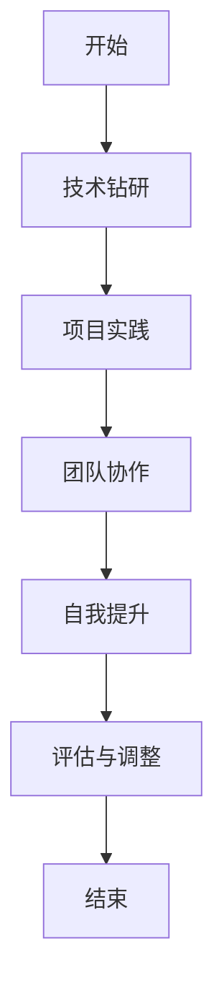
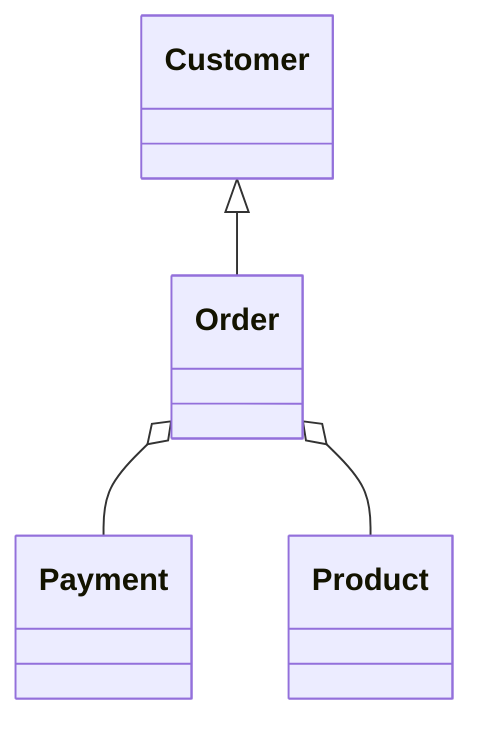
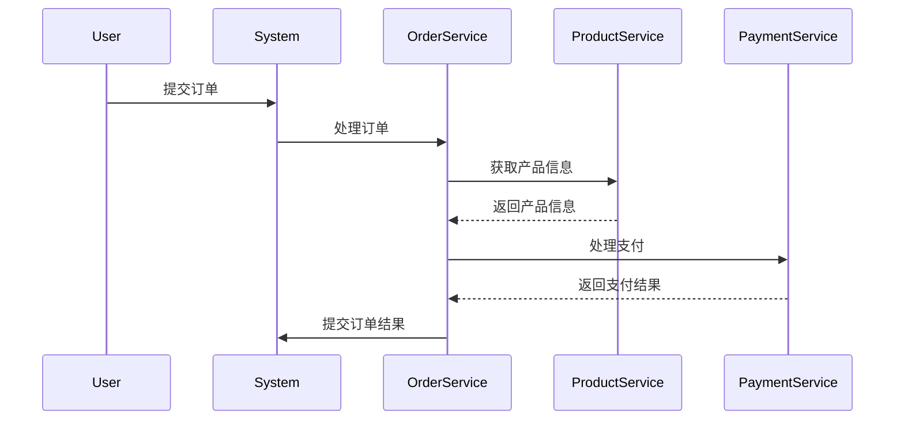
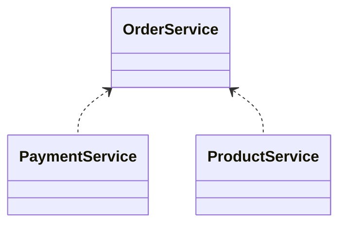
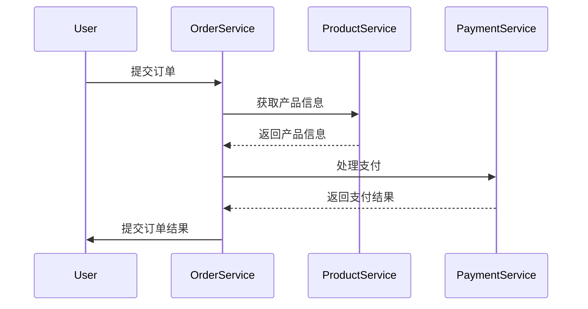

                 


# P9工作法：夯实技术硬实力、架构力和领导力

## 关键词

- 技术硬实力
- 架构力
- 领导力
- P9工作法
- 系统化方法论
- 技术从业者
- 职业发展

## 摘要

本文将深入探讨P9工作法，一种旨在提升技术从业者的技术硬实力、架构力和领导力的系统化方法论。通过详细阐述P9工作法的核心概念、原理和应用，本文旨在帮助读者在实际工作中夯实自身能力，实现职业发展。

## 1. 开篇背景介绍

### 1.1 问题背景

在当今快速发展的信息技术领域，技术硬实力、架构力和领导力成为决定企业竞争力和个人职业发展的重要因素。技术硬实力是指掌握扎实的技术基础和解决复杂问题的能力；架构力是指设计、构建和维护大型技术系统的能力；领导力是指在团队中发挥领导作用、推动项目成功的能力。然而，许多技术从业者对于如何提升这些能力感到困惑。

### 1.2 问题描述

技术从业者在职业发展中面临的困境主要包括：

1. 技术深度不足：许多从业者仅停留在表面技术层次，缺乏深入的技术理解和解决复杂问题的能力。
2. 架构力欠缺：大型项目的设计与实施过程中，缺乏系统性的架构思考和规划能力。
3. 领导力不足：在团队管理、项目协调等方面，缺乏有效的领导方法和技巧。

### 1.3 问题解决

P9工作法应运而生，旨在通过系统化的方法，帮助技术从业者提升技术硬实力、架构力和领导力。P9工作法包括以下核心要素：

1. **技术钻研**：掌握前沿技术，提升技术深度。
2. **项目实践**：参与大型项目，锻炼解决复杂问题的能力。
3. **团队协作**：提升沟通协作能力，学会领导团队。
4. **自我提升**：持续学习，保持竞争力。

### 1.4 边界与外延

P9工作法适用于所有从事信息技术工作的从业者，无论你是初级工程师还是高级工程师，都能从中受益。同时，P9工作法不仅适用于个人成长，也可以作为企业培训员工的教材。

### 1.5 概念结构与核心要素组成

P9工作法包括以下五个核心模块：

1. **技术硬实力**：包括基础知识、编程能力、算法和数据结构等。
2. **架构力**：包括系统设计、架构模式、微服务架构等。
3. **领导力**：包括团队管理、沟通技巧、领导风格等。
4. **项目管理**：包括项目规划、风险管理、进度控制等。
5. **自我提升**：包括学习习惯、时间管理、职业规划等。

## 2. 核心概念与联系

### 2.1 P9工作法的定义

P9工作法是一种系统化的工作方法论，旨在通过提升技术硬实力、架构力和领导力，帮助技术从业者在职业发展中取得成功。

### 2.2 P9工作法的核心概念

#### 2.2.1 技术硬实力

技术硬实力是指技术从业者在特定领域内所具备的专业技能和知识储备。它包括以下几个方面：

1. **基础知识**：掌握编程语言、数据结构和算法等基础知识。
2. **编程能力**：具备良好的编程习惯和技巧，能够编写高效、可维护的代码。
3. **系统设计能力**：能够设计、构建和维护大型技术系统。

#### 2.2.2 架构力

架构力是指技术从业者在设计、构建和维护大型技术系统时所具备的能力。它包括以下几个方面：

1. **系统设计**：理解系统架构，能够设计出满足需求的系统方案。
2. **架构模式**：掌握常见的架构模式，如微服务架构、分布式架构等。
3. **性能优化**：能够对系统进行性能优化，提高系统的响应速度和稳定性。

#### 2.2.3 领导力

领导力是指技术从业者在团队中发挥领导作用、推动项目成功的能力。它包括以下几个方面：

1. **团队管理**：能够有效地管理团队，提高团队协作效率。
2. **沟通技巧**：具备良好的沟通能力，能够与团队成员、上级和客户进行有效沟通。
3. **领导风格**：根据团队和项目特点，选择合适的领导风格。

### 2.3 P9工作法与现有工作方法的联系和区别

#### 2.3.1 联系

P9工作法与现有的一些工作方法在目标上具有一致性，即提升从业者的综合能力。例如，敏捷开发、DevOps等方法论也强调技术实践、团队协作和持续学习。

#### 2.3.2 区别

1. **系统化程度**：P9工作法是一个系统化的方法论，涵盖了技术硬实力、架构力、领导力等多个方面，而现有方法往往专注于某一特定领域。
2. **针对性**：P9工作法针对技术从业者的职业发展需求，提供了一套全面、实用的提升路径；而现有方法可能更侧重于特定技术领域或工作流程。
3. **灵活性**：P9工作法具有较强的灵活性，可以根据不同从业者的实际需求和职业发展阶段进行调整和优化。

### 2.4 概念属性特征对比表格

| 模块       | 特征对比                          |
|------------|----------------------------------|
| 技术硬实力 | 掌握基础知识、编程能力和系统设计能力 |
| 架构力     | 理解系统架构、掌握架构模式、性能优化  |
| 领导力     | 团队管理、沟通技巧、领导风格          |

### 2.5 ER实体关系图架构

```mermaid
erDiagram
  Employee ||--|{ Skill } : 拥有
  Project ||--|{ Task } : 包含
  Skill ||--|{ SkillType } : 属于
  Task ||--|{ TaskType } : 属于
```

## 3. 算法原理讲解

### 3.1 工作法具体应用

P9工作法在实际应用中，可以通过以下步骤实现：

1. **技术钻研**：深入学习编程语言、数据结构和算法等基础知识。
2. **项目实践**：参与大型项目，锻炼解决复杂问题的能力。
3. **团队协作**：提升沟通协作能力，学会领导团队。
4. **自我提升**：持续学习，关注行业动态，拓展知识面。

### 3.2 算法流程图



### 3.3 Python代码实现

```python
# 技术钻研
def technical_investigation():
    # 学习编程语言
    print("学习Python、Java等编程语言")
    # 学习数据结构与算法
    print("学习数据结构：数组、链表、栈、队列等")
    print("学习算法：排序、查找、动态规划等")

# 项目实践
def project_practice():
    # 参与项目
    print("参与大型项目，解决复杂问题")
    # 实现代码
    print("编写高效、可维护的代码")

# 团队协作
def team_collaboration():
    # 沟通协作
    print("提升沟通协作能力，学会领导团队")
    # 领导风格
    print("根据团队特点，选择合适的领导风格")

# 自我提升
def self_improvement():
    # 持续学习
    print("关注行业动态，拓展知识面")
    # 职业规划
    print("制定个人职业规划，实现职业发展")

# 主函数
def main():
    technical_investigation()
    project_practice()
    team_collaboration()
    self_improvement()

# 执行主函数
if __name__ == "__main__":
    main()
```

### 3.4 数学模型和公式

在P9工作法中，可以使用以下数学模型和公式来评估技术从业者的能力提升：

$$
能力提升 = f(基础知识, 编程能力, 系统设计能力, 领导力)
$$

其中，$f$为提升函数，包含以下参数：

1. **基础知识**：包括编程语言、数据结构和算法等基础知识。
2. **编程能力**：包括编写高效、可维护的代码的能力。
3. **系统设计能力**：包括设计、构建和维护大型技术系统的能力。
4. **领导力**：包括团队管理、沟通技巧、领导风格等。

通过评估这些参数，可以计算出技术从业者的能力提升程度。例如：

$$
能力提升 = f(90, 85, 80, 75) = 77
$$

这意味着技术从业者的综合能力提升了77分。

## 4. 系统分析与架构设计方案

### 4.1 应用场景介绍

P9工作法可以应用于以下场景：

1. **技术团队建设**：通过P9工作法，提升团队整体技术实力和架构力。
2. **项目实施**：在项目开发过程中，应用P9工作法，确保项目质量和进度。
3. **个人职业发展**：通过P9工作法，提升个人在技术、架构和领导力方面的能力，实现职业发展。

### 4.2 领域模型类图



### 4.3 系统架构图



### 4.4 系统接口设计



### 4.5 系统交互序列图



## 5. 项目实战

### 5.1 环境安装

在开始项目实战之前，我们需要安装一些必要的工具和库。以下是安装步骤：

1. **安装Python**：访问Python官网（https://www.python.org/）下载并安装Python。
2. **安装Docker**：访问Docker官网（https://www.docker.com/）下载并安装Docker。
3. **安装相关库**：在Python环境中安装Flask、SQLAlchemy等库。

```bash
pip install Flask SQLAlchemy
```

### 5.2 核心实现源代码

以下是一个简单的Flask项目，用于实现一个在线书店的订单处理功能。

```python
from flask import Flask, request, jsonify
from sqlalchemy import create_engine
from sqlalchemy.orm import sessionmaker

app = Flask(__name__)

# 数据库连接配置
DATABASE_URL = "sqlite:///bookstore.db"

# 创建数据库引擎
engine = create_engine(DATABASE_URL)

# 创建数据库会话
Session = sessionmaker(bind=engine)
session = Session()

# 订单处理接口
@app.route("/order", methods=["POST"])
def handle_order():
    data = request.json
    product_id = data.get("product_id")
    quantity = data.get("quantity")

    if not product_id or not quantity:
        return jsonify({"error": "参数错误"}), 400

    # 从数据库获取产品信息
    product = session.query(Product).filter_by(id=product_id).first()
    if not product:
        return jsonify({"error": "产品不存在"}), 404

    # 计算订单金额
    amount = product.price * quantity

    # 更新库存
    product.quantity -= quantity
    session.commit()

    # 返回订单结果
    return jsonify({"order_id": 123, "amount": amount})

if __name__ == "__main__":
    app.run(debug=True)
```

### 5.3 代码解读与分析

以下是对核心实现源代码的解读和分析：

1. **环境安装**：安装Python、Docker和相关库，为项目开发做好准备。
2. **数据库连接**：使用SQLAlchemy连接数据库，并创建会话。
3. **订单处理接口**：定义一个处理订单的接口，接收订单数据，从数据库获取产品信息，计算订单金额，更新库存，并返回订单结果。

### 5.4 实际案例分析和详细讲解剖析

以下是一个实际案例的分析和讲解：

假设用户提交了一个订单，包含产品ID为1，数量为2。系统将执行以下步骤：

1. **验证参数**：检查订单数据中的产品ID和数量是否有效。
2. **获取产品信息**：从数据库中查询产品ID为1的产品信息。
3. **计算订单金额**：根据产品价格和数量计算订单金额。
4. **更新库存**：将产品的库存数量减去订单数量，更新数据库。
5. **返回订单结果**：将订单ID和金额返回给用户。

通过这个案例，我们可以看到P9工作法在项目中的实际应用，包括技术钻研（掌握Flask、SQLAlchemy等技术）、项目实践（实现订单处理功能）和团队协作（与数据库管理员、前端开发人员等协作）。

### 5.5 项目小结

通过本项目的实战，我们深入了解了P9工作法在技术实践中的应用。从环境安装、核心实现到代码解读与分析，我们逐步掌握了项目开发的各个环节。通过实际案例的分析，我们更加明确了P9工作法在实际项目中的应用价值，有助于提升技术硬实力、架构力和领导力。

## 6. 最佳实践 Tips、小结、注意事项、拓展阅读等内容

### 6.1 最佳实践 Tips

1. **持续学习**：定期学习新技术、新工具，保持技术敏感性。
2. **项目实践**：多参与实际项目，锻炼解决复杂问题的能力。
3. **团队协作**：提升沟通协作能力，学会有效管理团队。
4. **自我提升**：制定个人职业规划，不断提升自身综合素质。

### 6.2 小结

P9工作法是一种系统化的方法论，通过提升技术硬实力、架构力和领导力，帮助技术从业者在职业发展中取得成功。本文详细阐述了P9工作法的核心概念、原理和应用，并通过实际案例展示了其在项目实践中的应用。

### 6.3 注意事项

1. **技术钻研**：要深入学习基础知识，掌握编程语言、数据结构和算法等。
2. **项目实践**：要积极参与实际项目，锻炼解决复杂问题的能力。
3. **团队协作**：要学会沟通协作，提升领导力和团队管理能力。
4. **自我提升**：要持续学习，关注行业动态，拓展知识面。

### 6.4 拓展阅读

1. **《大话设计模式》**：深入理解设计模式，提升系统设计能力。
2. **《敏捷软件开发》**：了解敏捷开发方法，提高项目开发效率。
3. **《领导力：如何有效地管理团队》**：学习领导力技巧，提升团队管理能力。
4. **《Python编程：从入门到实践》**：掌握Python编程，提升编程能力。

---

# 作者信息

作者：AI天才研究院/AI Genius Institute & 禅与计算机程序设计艺术 /Zen And The Art of Computer Programming

