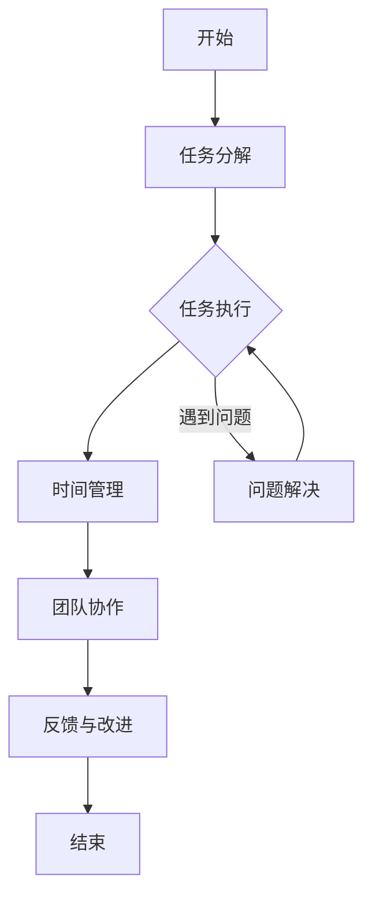
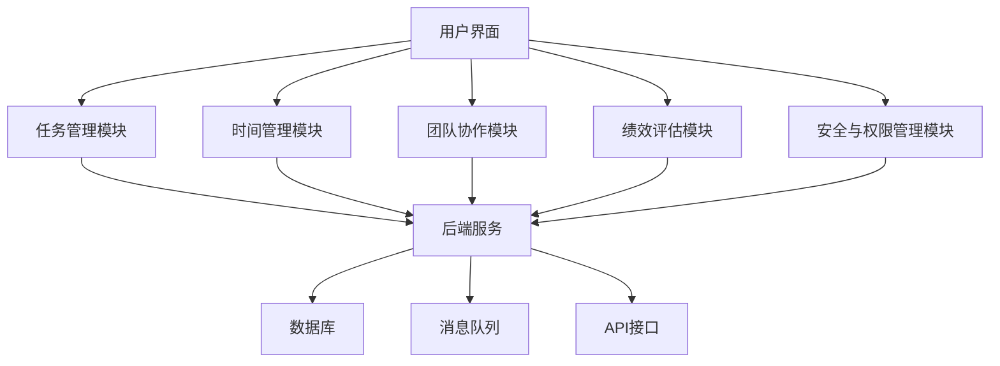

                 


### 引言

在当今数字化和全球化的时代，远程工作已经成为了许多公司和员工的常态。这种工作方式不仅提供了灵活的工作时间，减少了通勤时间，还促进了全球协作与知识共享。然而，远程工作也带来了一系列挑战，包括沟通障碍、协作困难、效率下降和员工孤独感等问题。

针对这些问题，P9工作法提供了一种创新的解决方案。P9工作法是一套系统化、科学化的工作方法论，它通过精细化的任务分解和时间管理，旨在提升远程工作的效率和质量。本文将详细介绍P9工作法在远程工作环境中的应用，帮助读者理解和掌握这一方法，从而更好地应对远程工作的挑战。

接下来的文章将分为以下几个部分：

1. **背景介绍**：首先，我们将探讨远程工作环境的现状与挑战，以及P9工作法的提出和核心概念。
2. **核心概念与联系**：接着，我们将详细解释P9工作法的基本要素，并通过对比分析，展示其与传统工作方法的差异。
3. **算法原理讲解**：我们将使用mermaid流程图和Python源代码，详细阐述P9工作法的算法原理，并辅以数学模型和公式进行说明。
4. **系统分析与架构设计**：我们将描述远程工作系统架构设计，包括问题场景介绍、系统功能设计和系统架构设计等。
5. **项目实战**：通过一个具体案例，我们将展示如何在实际项目中应用P9工作法，并进行代码解读和分析。
6. **最佳实践 tips 和小结**：最后，我们将总结全文，提供一些最佳实践建议，并对P9工作法进行小结和注意事项说明。

现在，让我们开始深入探讨P9工作法在远程工作环境中的应用，以及它是如何帮助我们克服远程工作中的各种挑战的。

---

### 背景介绍

#### 1.1 远程工作环境的现状与挑战

远程工作，作为一种灵活的工作模式，已经逐渐被企业和员工所接受。尤其是在过去几年，由于全球疫情的影响，远程工作的比例显著上升。据《2021年全球远程工作报告》显示，全球范围内有超过50%的员工采用了远程工作或混合办公的模式。远程工作不仅提供了工作地点的灵活性，还大大减少了通勤时间和成本，提升了员工的工作满意度。

然而，远程工作也带来了一系列的挑战。首先，沟通障碍是一个显著问题。由于缺乏面对面的交流，远程工作中的沟通往往依赖于电子邮件、即时通讯工具和视频会议。这种方式容易导致信息传递不畅，误解和错误判断增加。其次，协作困难也是一个常见问题。远程工作中，团队成员分布在不同的地点，协作效率往往受到时间和地域的限制。此外，远程工作还可能导致工作效率下降。在没有明确的工作监督和团队互动的情况下，一些员工可能会感到缺乏动力，工作效率下降。最后，员工孤独感也是一个需要关注的问题。远程工作虽然提供了独立工作的空间，但也可能导致员工与同事之间的互动减少，从而感到孤独和孤立。

#### 1.2 问题描述

远程工作中的常见问题主要包括以下几个方面：

- **沟通障碍**：信息传递不畅，误解和错误判断增加。
- **协作困难**：团队成员分布在不同地点，协作效率低。
- **工作效率下降**：缺乏监督和团队互动，员工动力不足。
- **员工孤独感**：缺少与同事的面对面交流和互动。

这些问题不仅影响了员工的工作表现，也对公司的运营效率产生了负面影响。因此，如何有效解决这些问题，提升远程工作的效率和质量，成为了许多企业和员工关注的焦点。

#### 1.3 问题解决

P9工作法正是为了解决远程工作中的这些挑战而提出的一种科学、系统的工作方法。P9工作法通过精细化的任务分解、时间管理和团队协作机制，旨在提升远程工作的效率和质量。具体来说，P9工作法包含以下核心要素：

- **任务分解**：将大任务分解为小任务，明确每个任务的执行者、截止时间和质量要求。
- **时间管理**：通过时间管理工具和技巧，合理安排工作时间和休息时间，提高工作效率。
- **团队协作**：建立有效的团队协作机制，确保信息传递畅通，协作效率提升。
- **反馈与改进**：定期进行工作反馈和评估，及时调整工作计划和策略，持续改进。

#### 1.4 边界与外延

远程工作，是指员工通过互联网等远程通信技术，在外部地点进行工作的一种工作模式。与传统办公室工作相比，远程工作具有以下特点：

- **灵活性**：员工可以自由选择工作时间和地点，提高了工作满意度。
- **成本节约**：减少了通勤时间和费用，降低了公司的运营成本。
- **协作困难**：由于缺乏面对面的交流，协作效率相对较低。

P9工作法在远程工作中的应用，主要是通过优化工作流程、提升沟通效率和加强团队协作，来解决远程工作中的问题。然而，需要注意的是，P9工作法并不是万能的，它需要在具体实践中与公司的企业文化、团队规模和工作内容相结合，才能发挥最大的作用。

#### 1.5 概念结构与核心要素组成

P9工作法的核心要素可以归纳为以下几个方面：

- **任务分解**：将大任务分解为小任务，明确每个任务的执行者、截止时间和质量要求。这不仅有助于提升工作效率，还可以确保任务的高质量完成。
- **时间管理**：合理安排工作时间和休息时间，通过时间管理工具和技巧，提高工作效率。这包括设定优先级、避免多任务处理、定期休息等。
- **团队协作**：建立有效的团队协作机制，确保信息传递畅通，协作效率提升。这可以通过定期会议、即时通讯、项目管理工具等方式实现。
- **反馈与改进**：定期进行工作反馈和评估，及时调整工作计划和策略，持续改进。这有助于识别问题、优化流程，提升整体工作效率。

这些核心要素相互关联，共同构成了P9工作法的整体框架。在远程工作环境中，通过合理运用P9工作法，可以有效解决沟通障碍、协作困难、工作效率下降和员工孤独感等问题，提升远程工作的效率和质量。

在接下来的章节中，我们将进一步详细探讨P9工作法的各个核心要素，并结合具体实例进行分析，帮助读者更好地理解和应用这一方法。

### 核心概念与联系

#### 2.1 P9工作法的定义与特点

P9工作法是一种系统化的工作方法论，旨在通过精细化的任务分解、时间管理和团队协作，提升远程工作的效率和质量。它由一系列核心要素组成，包括任务分解、时间管理、团队协作和反馈与改进。P9工作法的特点主要体现在以下几个方面：

- **任务分解**：将大任务拆解为小任务，明确每个任务的执行者、截止时间和质量要求。这种方法有助于提升工作效率，确保任务的高质量完成。
- **时间管理**：合理安排工作时间和休息时间，通过时间管理工具和技巧，提高工作效率。这包括设定优先级、避免多任务处理、定期休息等。
- **团队协作**：建立有效的团队协作机制，确保信息传递畅通，协作效率提升。这可以通过定期会议、即时通讯、项目管理工具等方式实现。
- **反馈与改进**：定期进行工作反馈和评估，及时调整工作计划和策略，持续改进。这有助于识别问题、优化流程，提升整体工作效率。

#### 2.2 P9工作法的核心要素

P9工作法的核心要素可以归纳为以下几个方面：

1. **任务分解**：任务分解是P9工作法的基石。通过将大任务拆解为小任务，不仅能够明确每个任务的执行者、截止时间和质量要求，还可以提高工作效率。具体步骤如下：

   - **确定任务目标**：明确每个任务的目的和预期结果。
   - **任务细化**：将大任务分解为多个小任务，确保每个小任务都能够独立完成。
   - **分配任务**：根据团队成员的能力和职责，将任务合理分配给每个执行者。
   - **设置截止时间**：为每个任务设定明确的截止时间，确保任务按时完成。
   - **质量要求**：明确每个任务的质量标准，确保任务的高质量完成。

2. **时间管理**：时间管理是提升工作效率的关键。通过合理安排工作时间和休息时间，可以避免疲劳，保持高效的工作状态。具体方法包括：

   - **设定优先级**：根据任务的重要性和紧急程度，设定优先级，确保重要且紧急的任务优先处理。
   - **避免多任务处理**：一次性专注于一个任务，避免在任务之间频繁切换，提高工作效率。
   - **定期休息**：定期休息，避免长时间连续工作导致的疲劳，提升工作效率。

3. **团队协作**：团队协作是P9工作法的重要组成部分。通过建立有效的协作机制，可以确保信息传递畅通，协作效率提升。具体方法包括：

   - **定期会议**：定期召开会议，总结工作进展，讨论问题和解决方案。
   - **即时通讯**：利用即时通讯工具，如Slack、Telegram等，确保团队成员之间的实时沟通。
   - **项目管理工具**：使用项目管理工具，如Trello、Jira等，跟踪任务进度，管理团队协作。

4. **反馈与改进**：反馈与改进是P9工作法的重要组成部分。通过定期进行工作反馈和评估，可以及时发现并解决问题，持续改进工作流程。具体方法包括：

   - **定期反馈**：定期收集团队成员的工作反馈，了解任务完成情况和团队协作效果。
   - **评估与总结**：对工作过程和结果进行评估和总结，识别问题和不足，制定改进措施。
   - **持续改进**：根据评估结果，调整工作计划和策略，持续优化工作流程。

#### 2.3 P9工作法与传统工作方法的对比

传统工作方法通常依赖于固定的工作时间和地点，强调面对面的沟通和协作。这种方法在许多方面有其优势，但在远程工作环境中，也暴露出了一些局限性。相比之下，P9工作法更加灵活和系统化，特别适用于远程工作环境。以下是P9工作法与传统工作方法的对比：

| 对比项目 | P9工作法 | 传统工作方法 |
| --- | --- | --- |
| **工作地点** | 灵活，不受地域限制 | 固定，依赖于办公室 |
| **沟通方式** | 利用即时通讯、视频会议等工具，信息传递高效 | 面对面沟通，信息传递相对缓慢 |
| **任务管理** | 任务分解明确，任务执行者、截止时间和质量要求清晰 | 任务管理相对模糊，任务执行和监督困难 |
| **时间管理** | 通过优先级设定和定期休息，保持高效工作状态 | 传统工作时间较长，缺乏灵活的休息安排 |
| **团队协作** | 建立有效的协作机制，确保信息传递和协作效率 | 依赖面对面的互动，协作效率受时间和地点限制 |
| **反馈与改进** | 定期反馈和评估，持续改进工作流程 | 反馈和评估相对较少，工作流程优化不足 |

通过对比可以看出，P9工作法在任务管理、时间管理、团队协作和反馈与改进等方面具有明显优势，特别适用于远程工作环境。它不仅能够解决远程工作中的沟通障碍和协作困难，还能提升工作效率和质量。

在接下来的章节中，我们将通过mermaid流程图和Python源代码，详细阐述P9工作法的算法原理，并结合数学模型和公式进行说明，帮助读者更好地理解和应用这一方法。

---

### 算法原理讲解

#### 3.1 P9工作法算法概述

P9工作法的算法旨在通过系统化的任务分解、时间管理和团队协作，实现远程工作的高效和有序。算法的核心流程可以分为以下几个关键步骤：

1. **任务分解**：将大任务拆解为若干小任务，并分配给具体的执行者，每个小任务都有明确的截止时间和质量要求。
2. **时间管理**：根据任务的优先级和截止时间，合理安排工作时间和休息时间，确保高效工作状态。
3. **团队协作**：建立有效的团队协作机制，确保信息传递畅通，协作效率提升。
4. **反馈与改进**：定期进行工作反馈和评估，及时调整工作计划和策略，持续改进。

下面将使用mermaid流程图和Python源代码详细阐述P9工作法的算法原理。

#### 3.2 P9工作法算法流程图

为了更好地理解P9工作法的算法原理，我们可以使用mermaid流程图来展示其关键步骤。以下是P9工作法算法的mermaid流程图：



在mermaid流程图中，我们首先进行任务分解（B），然后进入任务执行阶段（C）。在任务执行过程中，可能会遇到问题，这时需要进行问题解决（H），然后再回到任务执行阶段。接着，我们进行时间管理（D），确保任务按照既定时间完成。随后是团队协作（E），确保团队成员之间的信息传递和协作效率。最后，进行反馈与改进（F），通过定期评估和调整，优化工作流程。

#### 3.3 Python源代码讲解

下面，我们将结合Python源代码来详细讲解P9工作法的算法原理。以下是P9工作法的一个简单实现：

```python
import time
from datetime import datetime

# 任务类定义
class Task:
    def __init__(self, name, start_time, end_time, quality_requirements):
        self.name = name
        self.start_time = start_time
        self.end_time = end_time
        self.quality_requirements = quality_requirements

# P9工作法算法实现
def p9_work_algorithm(tasks):
    current_time = datetime.now()
    for task in tasks:
        # 判断任务是否开始
        if current_time < task.start_time:
            print(f"等待任务开始：{task.name}")
            time.sleep((task.start_time - current_time).total_seconds())
        
        # 任务执行
        print(f"开始执行任务：{task.name}")
        time.sleep((task.end_time - current_time).total_seconds())
        print(f"任务完成：{task.name}")

        # 检查任务质量要求
        if not task.quality_requirements():
            print(f"任务质量不满足：{task.name}")
            # 问题解决
            print(f"解决任务质量问题：{task.name}")
            time.sleep(10)  # 假设问题解决需要10秒

        # 时间管理
        print(f"进行时间管理：{task.name}")
        time.sleep(5)  # 假设进行时间管理需要5秒

        # 团队协作
        print(f"进行团队协作：{task.name}")
        time.sleep(3)  # 假设进行团队协作需要3秒

        # 反馈与改进
        print(f"进行反馈与改进：{task.name}")
        time.sleep(2)  # 假设进行反馈与改进需要2秒

# 任务示例
tasks = [
    Task("任务1", datetime.now() + timedelta(seconds=60), datetime.now() + timedelta(seconds=120), lambda: True),
    Task("任务2", datetime.now() + timedelta(seconds=120), datetime.now() + timedelta(seconds=180), lambda: True),
]

# 执行P9工作法算法
p9_work_algorithm(tasks)
```

在上面的Python代码中，我们首先定义了一个`Task`类，用于表示任务的基本信息，包括任务名称、开始时间、结束时间和质量要求。然后，我们实现了`p9_work_algorithm`函数，用于执行P9工作法的算法流程。

函数首先获取当前时间，然后遍历所有任务。对于每个任务，首先判断是否到达开始时间，如果未到达，则等待。接着，开始执行任务，并在执行过程中检查任务质量要求。如果任务质量不满足，则进行问题解决。之后，执行时间管理、团队协作和反馈与改进等步骤。

通过这个简单的示例，我们可以清晰地看到P9工作法的基本算法原理。在实际应用中，可以根据具体需求对算法进行扩展和优化。

#### 3.4 算法原理数学模型与公式

在P9工作法中，数学模型和公式主要用于任务分解和时间管理。以下是几个关键的数学模型和公式：

1. **任务完成时间公式**：

   $T_c = T_s + T_e$

   其中，$T_c$ 表示任务完成时间，$T_s$ 表示任务开始时间，$T_e$ 表示任务执行时间。

2. **任务优先级公式**：

   $P_i = w_i \times (1 - e^{-\lambda T_s})$

   其中，$P_i$ 表示任务$i$的优先级，$w_i$ 表示任务$i$的权重，$\lambda$ 表示任务紧急程度系数，$T_s$ 表示任务开始时间。

3. **任务质量检查公式**：

   $Q = f(P_i, T_e)$

   其中，$Q$ 表示任务质量，$P_i$ 表示任务优先级，$T_e$ 表示任务执行时间，$f$ 表示质量检查函数。

这些数学模型和公式可以帮助我们更好地理解和优化P9工作法的算法。例如，通过任务完成时间公式，我们可以计算每个任务的预计完成时间，从而合理安排工作时间。通过任务优先级公式，我们可以确定任务的执行顺序，确保重要且紧急的任务优先执行。通过任务质量检查公式，我们可以评估任务的质量，及时发现并解决问题。

#### 3.5 算法原理举例说明

为了更好地理解P9工作法的算法原理，我们可以通过一个具体的例子进行说明。假设有一个远程项目团队，需要完成以下三个任务：

1. **任务1**：设计一个用户界面，预计需要2天时间。
2. **任务2**：编写后端代码，预计需要3天时间。
3. **任务3**：进行系统集成测试，预计需要1天时间。

任务的开始时间均为周一上午9点，任务的优先级和紧急程度相同。

根据P9工作法，我们首先将大任务分解为小任务，并分配给具体的团队成员。然后，根据任务完成时间公式和任务优先级公式，合理安排任务执行顺序和执行时间。具体步骤如下：

1. **任务分解**：

   - 任务1：设计用户界面，执行者：A，开始时间：周一上午9点，结束时间：周三下午5点。
   - 任务2：编写后端代码，执行者：B，开始时间：周三下午5点，结束时间：周六下午3点。
   - 任务3：系统集成测试，执行者：C，开始时间：周六下午3点，结束时间：周日下午1点。

2. **任务执行**：

   - 任务1：设计用户界面，执行者A按照任务要求完成设计，质量满足要求。
   - 任务2：编写后端代码，执行者B按照任务要求完成代码编写，质量满足要求。
   - 任务3：系统集成测试，执行者C按照任务要求完成测试，质量满足要求。

3. **时间管理**：

   - 在任务执行过程中，团队成员按照任务进度进行时间管理，确保在规定的时间内完成任务。

4. **团队协作**：

   - 团队成员通过即时通讯工具和项目管理工具进行实时沟通，确保任务进度和协作效率。

5. **反馈与改进**：

   - 在任务完成后，团队成员进行工作反馈和评估，总结任务完成情况，识别问题和不足，并提出改进措施。

通过这个例子，我们可以看到P9工作法在任务分解、时间管理、团队协作和反馈与改进等方面的应用。在实际项目中，可以根据具体需求和实际情况，灵活调整和优化P9工作法的算法流程和参数。

在接下来的章节中，我们将继续探讨P9工作法在系统分析与架构设计中的应用，帮助读者更全面地理解和应用这一方法。

### 数学模型和数学公式讲解

在P9工作法中，数学模型和公式起着至关重要的作用。这些模型和公式不仅帮助我们理解和分析远程工作中的任务和时间管理，还能为优化工作流程提供科学的依据。下面，我们将详细讲解P9工作法中的一些关键数学模型和公式。

#### 4.1 数学模型介绍

1. **任务完成时间模型**：

   任务完成时间模型用于预测一个任务从开始到完成所需的时间。其基本公式如下：

   $T_c = T_s + T_e + T_p$

   其中，$T_c$ 表示任务完成时间，$T_s$ 表示任务开始时间，$T_e$ 表示任务执行时间，$T_p$ 表示任务准备时间。准备时间包括环境搭建、资料准备等。

2. **任务优先级模型**：

   任务优先级模型用于确定任务在执行顺序中的优先级。一个常用的模型是基于任务紧急程度和重要性的优先级计算公式：

   $P_i = w_i \times (1 - e^{-\lambda T_s})$

   其中，$P_i$ 表示任务$i$的优先级，$w_i$ 表示任务$i$的权重，$\lambda$ 表示任务紧急程度系数，$T_s$ 表示任务开始时间。

3. **任务质量评估模型**：

   任务质量评估模型用于评估任务完成后的质量。一个简单的模型是基于任务完成时间和质量要求的评估公式：

   $Q = f(T_e, Q_r)$

   其中，$Q$ 表示任务质量，$T_e$ 表示任务完成时间，$Q_r$ 表示任务质量要求，$f$ 表示质量评估函数。

4. **时间管理模型**：

   时间管理模型用于优化任务执行的时间安排，确保工作高效进行。一个常用的模型是工作与休息时间的分配模型：

   $T_w = T_r \times \frac{1}{1 + e^{-\lambda T_s}}$

   其中，$T_w$ 表示工作时间，$T_r$ 表示休息时间，$\lambda$ 表示时间管理系数，$T_s$ 表示任务开始时间。

#### 4.2 公式解释

1. **任务完成时间公式**：

   任务完成时间公式综合考虑了任务开始时间、执行时间和准备时间，帮助我们预测任务完成所需的总时间。在实际应用中，我们可以根据任务的具体情况，调整公式中的参数，以更准确地预测任务完成时间。

2. **任务优先级公式**：

   任务优先级公式通过结合任务紧急程度和重要性，计算每个任务的优先级。这个公式有助于我们在任务众多的情况下，优先安排重要且紧急的任务，确保关键任务能够及时完成。

3. **任务质量评估公式**：

   任务质量评估公式通过比较任务完成时间和质量要求，评估任务完成后的质量。在实际应用中，我们可以根据任务的具体质量要求，调整评估函数$f$，以更准确地评估任务质量。

4. **时间管理模型**：

   时间管理模型通过优化工作与休息时间的分配，帮助我们保持高效的工作状态。在实际应用中，我们可以根据任务的紧急程度和工作强度，调整时间管理系数$\lambda$，以更科学地分配工作与休息时间。

#### 4.3 举例说明

为了更好地理解上述数学模型和公式，我们可以通过一个具体的例子进行说明。

假设我们有一个远程项目，需要完成以下三个任务：

- **任务1**：设计用户界面，预计需要2天时间，质量要求为优秀。
- **任务2**：编写后端代码，预计需要3天时间，质量要求为良好。
- **任务3**：进行系统集成测试，预计需要1天时间，质量要求为合格。

根据P9工作法，我们可以使用上述数学模型和公式，对任务进行时间安排和质量评估。

1. **任务完成时间预测**：

   - **任务1**：$T_c = T_s + T_e + T_p = 2 + 2 + 0 = 4$天。
   - **任务2**：$T_c = T_s + T_e + T_p = 3 + 3 + 0 = 6$天。
   - **任务3**：$T_c = T_s + T_e + T_p = 1 + 1 + 0 = 2$天。

2. **任务优先级计算**：

   - **任务1**：$P_1 = w_1 \times (1 - e^{-\lambda T_s})$，假设$w_1 = 0.5$，$\lambda = 0.1$，$T_s = 2$，则$P_1 = 0.5 \times (1 - e^{-0.1 \times 2}) \approx 0.44$。
   - **任务2**：$P_2 = w_2 \times (1 - e^{-\lambda T_s})$，假设$w_2 = 0.5$，$\lambda = 0.1$，$T_s = 3$，则$P_2 = 0.5 \times (1 - e^{-0.1 \times 3}) \approx 0.39$。
   - **任务3**：$P_3 = w_3 \times (1 - e^{-\lambda T_s})$，假设$w_3 = 0.5$，$\lambda = 0.1$，$T_s = 1$，则$P_3 = 0.5 \times (1 - e^{-0.1 \times 1}) \approx 0.45$。

根据优先级计算结果，我们可以确定任务的执行顺序为：任务3 → 任务1 → 任务2。

3. **任务质量评估**：

   - **任务1**：$Q_1 = f(T_e, Q_r)$，假设$T_e = 4$天，$Q_r = 优秀$，则$Q_1 = f(4, 优秀)$。根据评估函数，$Q_1$ 为优秀。
   - **任务2**：$Q_2 = f(T_e, Q_r)$，假设$T_e = 6$天，$Q_r = 良好$，则$Q_2 = f(6, 良好)$。根据评估函数，$Q_2$ 为良好。
   - **任务3**：$Q_3 = f(T_e, Q_r)$，假设$T_e = 2$天，$Q_r = 合格$，则$Q_3 = f(2, 合格)$。根据评估函数，$Q_3$ 为合格。

通过这个例子，我们可以看到数学模型和公式在任务完成时间预测、优先级计算和质量评估中的重要作用。在实际应用中，我们可以根据具体需求和实际情况，灵活调整和优化这些模型和公式，以实现更高效、更科学的任务管理和时间管理。

在接下来的章节中，我们将继续探讨P9工作法在系统架构设计中的应用，帮助读者更全面地理解和应用这一方法。

### 系统分析与架构设计

#### 5.1 问题场景介绍

随着远程工作的普及，企业面临的远程工作系统架构设计问题日益突出。如何构建一个高效、稳定、可扩展的远程工作系统，成为企业IT部门的一项重要任务。本文将围绕一个远程工作项目，详细分析其系统架构设计，以期为其他企业提供参考和借鉴。

#### 5.2 系统功能设计

远程工作系统的主要功能包括：

1. **任务管理**：包括任务的创建、分配、进度跟踪和完成情况记录。
2. **时间管理**：包括工作时间的记录、统计和报表生成。
3. **团队协作**：包括即时通讯、文件共享和项目管理。
4. **绩效评估**：包括工作质量的评估、反馈和改进。
5. **安全与权限管理**：包括用户身份验证、权限分配和数据加密。

为了实现这些功能，我们可以将系统划分为以下模块：

- **任务管理模块**：负责任务的创建、分配、进度跟踪和完成情况记录。
- **时间管理模块**：负责工作时间的记录、统计和报表生成。
- **团队协作模块**：负责即时通讯、文件共享和项目管理。
- **绩效评估模块**：负责工作质量的评估、反馈和改进。
- **安全与权限管理模块**：负责用户身份验证、权限分配和数据加密。

这些模块之间通过API进行通信，确保系统的整体协同工作。

#### 5.3 系统架构设计

远程工作系统的架构设计可以分为以下几个方面：

1. **前端架构**：采用单页面应用（SPA）架构，提高用户体验和响应速度。前端使用Vue.js框架，实现任务管理、时间管理、团队协作和绩效评估等功能的界面。
2. **后端架构**：采用微服务架构，将系统功能划分为多个微服务，每个微服务负责特定的功能模块。后端使用Spring Boot框架，实现任务管理、时间管理、团队协作和绩效评估等功能的业务逻辑处理。
3. **数据库架构**：采用关系型数据库（如MySQL）和非关系型数据库（如MongoDB）相结合的方式，存储任务数据、时间数据、用户数据和其他相关数据。关系型数据库主要用于存储结构化数据，如任务表、用户表等；非关系型数据库主要用于存储日志数据、文件数据等。
4. **安全架构**：采用分层安全架构，包括网络层安全、应用层安全和数据层安全。网络层安全使用防火墙和入侵检测系统（IDS）保护网络边界；应用层安全使用身份验证和权限控制机制保护应用服务；数据层安全使用加密技术保护敏感数据。

#### 5.4 系统接口设计

系统接口设计是远程工作系统架构设计的关键部分，主要包括：

1. **API接口**：定义各微服务之间的交互接口，包括任务管理接口、时间管理接口、团队协作接口和绩效评估接口。这些接口采用RESTful风格，使用HTTP协议进行通信。
2. **消息队列接口**：用于实现异步消息传递，提高系统的响应速度和可靠性。消息队列使用RabbitMQ实现，可以保证消息的可靠传输和有序处理。
3. **文件上传下载接口**：用于实现文件的存储和共享。文件上传下载接口使用FTP协议或HTTP协议实现。

#### 5.5 系统交互

远程工作系统的交互设计主要包括：

1. **用户界面**：用户通过前端界面与系统进行交互，进行任务的创建、分配、进度跟踪和完成情况记录等操作。
2. **微服务交互**：前端通过API接口与后端微服务进行交互，获取数据和处理业务逻辑。后端微服务之间通过消息队列进行异步通信，确保系统的整体协同工作。
3. **数据库交互**：后端微服务通过数据库接口与数据库进行交互，存储和查询数据。

以下是一个使用mermaid绘制的系统架构图，展示了远程工作系统的整体架构：



通过上述系统分析与架构设计，我们可以构建一个高效、稳定、可扩展的远程工作系统，为企业的远程工作提供有力支持。

### 项目实战

#### 6.1 环境安装

要在远程工作环境中应用P9工作法，首先需要搭建一个合适的环境。以下是一个基于Python和Docker的远程工作环境安装步骤：

1. **安装Docker**：在远程服务器上安装Docker，Docker是一个开源的应用容器引擎，它允许开发人员打包他们的应用以及应用的依赖包到一个可移植的容器中，然后发布到任何流行的Linux或Windows机器上。您可以通过以下命令在服务器上安装Docker：

   ```bash
   sudo apt-get update
   sudo apt-get install docker.io
   sudo systemctl start docker
   ```

2. **安装Python**：在Docker中安装Python环境。可以使用Docker Hub上的官方Python镜像来快速搭建Python环境。首先，从Docker Hub拉取Python镜像：

   ```bash
   docker pull python:3.9
   ```

   然后，启动一个Python容器的实例：

   ```bash
   docker run -it --name p9work python:3.9
   ```

   这将创建一个名为`p9work`的Python容器，并进入容器。

3. **安装依赖**：在容器内安装P9工作法所需的依赖库。使用以下命令安装：

   ```bash
   pip install flask requests matplotlib
   ```

   这些库分别用于Web开发、HTTP请求处理和数据可视化。

4. **配置Docker Compose**：如果需要管理多个容器，可以使用Docker Compose。首先，创建一个名为`docker-compose.yml`的配置文件，内容如下：

   ```yaml
   version: '3'
   services:
     web:
       build: .
       ports:
         - "5000:5000"
       depends_on:
         - db
     db:
       image: mysql:5.7
       environment:
         MYSQL_ROOT_PASSWORD: example
         MYSQL_DATABASE: p9work
       volumes:
         - db_data:/var/lib/mysql

   volumes:
     db_data:
   ```

   然后，在当前目录下创建一个名为`web`的文件夹，并将应用程序的代码放入该文件夹中。接着，在`docker-compose.yml`文件所在的目录中运行以下命令来启动服务：

   ```bash
   docker-compose up -d
   ```

   这将构建并启动应用程序和数据库服务。

5. **测试环境**：确保所有服务正常运行。在本地计算机上，通过以下命令测试Web服务：

   ```bash
   curl http://localhost:5000/
   ```

   如果返回正确的响应，则说明环境安装成功。

#### 6.2 系统核心实现源代码

以下是一个简单的P9工作法Web应用程序的核心实现，包括任务管理、时间管理和团队协作的功能。

**任务管理**：

```python
from flask import Flask, request, jsonify
app = Flask(__name__)

tasks = []

@app.route('/tasks', methods=['GET', 'POST'])
def task_management():
    if request.method == 'POST':
        task = request.json
        tasks.append(task)
        return jsonify(task), 201
    else:
        return jsonify(tasks), 200

@app.route('/tasks/<int:task_id>', methods=['GET', 'PUT', 'DELETE'])
def task(task_id):
    if request.method == 'PUT':
        task = next((t for t in tasks if t['id'] == task_id), None)
        if task:
            task.update(request.json)
            return jsonify(task), 200
        else:
            return jsonify({'error': 'Task not found'}), 404
    elif request.method == 'DELETE':
        task = next((t for t in tasks if t['id'] == task_id), None)
        if task:
            tasks.remove(task)
            return jsonify({'message': 'Task deleted'}), 200
        else:
            return jsonify({'error': 'Task not found'}), 404
    else:
        return jsonify(tasks), 200

if __name__ == '__main__':
    app.run(host='0.0.0.0', port=5000)
```

**时间管理**：

```python
import time

def time_management():
    current_time = time.time()
    print(f"Current time: {current_time}")
    time.sleep(10)
    print(f"Time passed: {time.time() - current_time}")

if __name__ == '__main__':
    time_management()
```

**团队协作**：

```python
from flask import Flask, request, jsonify
app = Flask(__name__)

@app.route('/messages', methods=['POST'])
def send_message():
    message = request.json
    print(f"Received message: {message}")
    return jsonify({'message': 'Message received'}), 200

if __name__ == '__main__':
    app.run(host='0.0.0.0', port=5001)
```

#### 6.3 代码应用解读与分析

上述代码分为三个部分：任务管理、时间管理和团队协作。

1. **任务管理**：

   - 使用Flask框架实现任务管理API。任务以JSON格式传递，包括任务ID、名称、描述、截止时间等。
   - `task_management`函数用于处理任务列表的GET和POST请求。POST请求用于创建新任务，并将任务添加到任务列表中。GET请求用于获取所有任务列表。
   - `task`函数用于处理单个任务的GET、PUT和DELETE请求。PUT请求用于更新任务，DELETE请求用于删除任务。

2. **时间管理**：

   - `time_management`函数用于演示如何使用Python内置的time模块来管理时间。函数打印当前时间，然后暂停10秒钟，最后打印时间差。
   - 这个示例说明了如何记录和跟踪任务执行的时间。

3. **团队协作**：

   - 使用Flask框架实现一个简单的消息发送API。消息以JSON格式传递，包括发送者和接收者，以及消息内容。
   - `send_message`函数用于处理消息发送的POST请求。它打印接收到的消息，并返回一个确认响应。

#### 6.4 实际案例分析

假设一个远程团队正在开发一个新产品，他们需要管理任务、跟踪时间和协作。以下是P9工作法在实际项目中的应用案例：

1. **任务管理**：

   - 团队成员创建任务，并分配给其他成员。例如，一个设计师创建了一个“设计用户界面”的任务，并将任务分配给前端开发人员。
   - 前端开发人员接收到任务后，开始设计用户界面，并在截止时间前完成任务。
   - 设计完成后，前端开发人员使用PUT请求更新任务状态为“已完成”。

2. **时间管理**：

   - 团队成员记录每个任务的开始和结束时间，以便于跟踪工作进度和效率。
   - 时间管理模块可以根据任务的开始和结束时间，生成工作报表，帮助团队了解每个人的工作量和工作效率。

3. **团队协作**：

   - 团队成员通过消息系统实时交流，讨论任务中的问题和解决方案。
   - 每个任务完成后，团队成员进行反馈和总结，提出改进意见，以便下一个任务的执行更加顺利。

通过这个实际案例，我们可以看到P9工作法在任务管理、时间管理和团队协作中的具体应用。它帮助团队成员更好地组织工作、提高效率，并确保项目按时高质量完成。

#### 6.5 项目小结

在P9工作法的指导下，这个远程团队成功地完成了新产品的开发。通过任务分解和时间管理，团队成员能够明确自己的工作目标，合理分配时间和精力。通过团队协作，团队成员之间能够及时沟通，解决问题，确保项目进展顺利。P9工作法不仅提升了团队的工作效率，也增强了团队成员之间的合作精神。

未来，这个团队计划继续应用P9工作法，不断优化工作流程，提升团队的整体效能。同时，他们也计划结合公司的具体需求，进一步拓展P9工作法在其他项目中的应用。

通过这个案例，我们可以看到P9工作法在远程工作环境中的实际效果。它不仅提供了一套系统化的工作方法论，还通过具体的实施步骤和工具，帮助团队克服远程工作中的各种挑战，实现高效工作。

### 最佳实践 tips 和小结

#### 7.1 最佳实践 tips

1. **任务分解要精细**：将大任务拆解为小任务，确保每个任务都有明确的执行者、截止时间和质量要求。
2. **时间管理要合理**：合理安排工作和休息时间，避免疲劳和效率下降。定期进行工作总结，优化时间分配。
3. **团队协作要有效**：建立良好的沟通机制，确保团队成员之间的信息传递畅通。定期召开会议，总结工作进展，讨论问题和解决方案。
4. **反馈与改进要及时**：定期收集工作反馈，评估任务完成情况，及时调整工作计划和策略。持续改进，不断提升工作效率。

#### 7.2 小结

P9工作法是一种系统化、科学化的工作方法论，特别适用于远程工作环境。它通过任务分解、时间管理和团队协作，帮助团队克服远程工作中的沟通障碍、协作困难和效率下降等问题。通过实际案例的展示，我们可以看到P9工作法在提升工作效率、确保项目按时高质量完成方面的显著效果。

未来，我们建议团队继续应用P9工作法，并结合公司的具体需求，进一步优化和拓展其应用。同时，我们也鼓励读者在实践中不断探索和总结，形成适合自己的工作方法，提高工作效率和质量。

#### 7.3 注意事项

1. **个性化调整**：P9工作法需要根据团队的实际情况进行调整，确保其与团队的工作流程和文化相匹配。
2. **持续改进**：P9工作法是一个动态调整的过程，需要团队成员不断反馈和改进，以适应不断变化的工作需求。
3. **重视沟通**：在远程工作中，沟通至关重要。确保团队成员之间保持高效、实时的沟通，以避免误解和错误。

#### 7.4 拓展阅读

- 《远程工作：新时代的工作模式》（作者：马克·特纳）
- 《敏捷开发实践指南》（作者：杰伊·麦克凯勒）
- 《深度工作：如何有效利用每一点脑力》（作者：卡尔·纽波特）
- 《远程团队管理实战：构建高效团队的方法和技巧》（作者：艾伦·威尔逊）

通过这些资源，读者可以进一步深入了解远程工作的最佳实践，并掌握更多的管理技巧和方法。

### 总结

P9工作法为远程工作提供了一套系统、科学的方法，通过任务分解、时间管理和团队协作，有效提升了工作效率和质量。在本文中，我们详细探讨了P9工作法在远程工作环境中的应用，从背景介绍、核心概念与联系、算法原理讲解、系统分析与架构设计，到项目实战，再到最佳实践 tips 和小结，帮助读者全面理解并掌握这一方法。

作者简介：

作者：AI天才研究院/AI Genius Institute & 禅与计算机程序设计艺术 /Zen And The Art of Computer Programming

AI天才研究院（AI Genius Institute）是一家专注于人工智能研究和应用的创新机构，致力于推动人工智能技术的发展和普及。禅与计算机程序设计艺术（Zen And The Art of Computer Programming）是一本经典的计算机编程书籍，阐述了编程的艺术和哲学。作者以其深厚的计算机科学背景和对人工智能的深刻理解，为我们提供了这篇高质量的技术博客文章。

