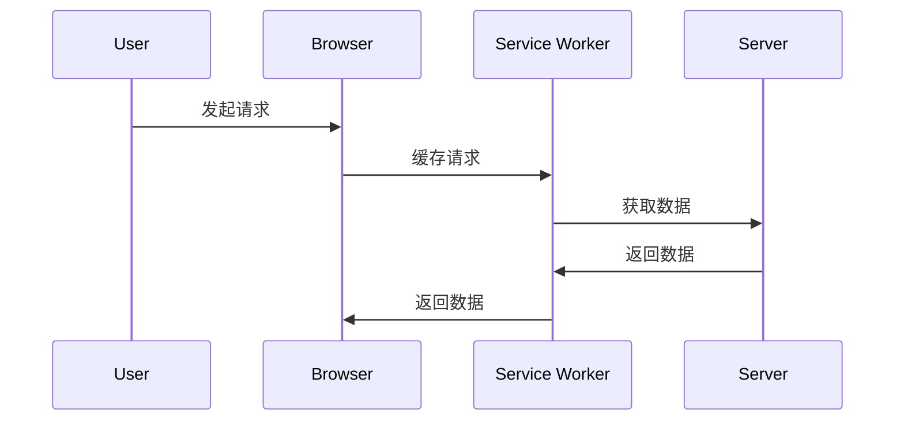

                 

# PWA开发：构建类原生体验的Web应用

## 概述

### 关键词
- PWA
- Web应用
- 原生体验
- Service Worker
- 性能优化

### 摘要
本文将详细介绍渐进式Web应用（PWA）的开发，探讨如何通过PWA技术构建具备类原生应用的Web体验。文章首先介绍了PWA的概念、背景及其与传统Web应用的差异，然后深入探讨了PWA的核心概念、技术架构和算法原理。随后，文章通过一个实际案例，展示了PWA项目开发的全过程，并总结了一些最佳实践和注意事项。通过阅读本文，读者将能够全面了解PWA的开发过程和关键技术，为构建高性能、高质量的Web应用提供指导。

## Step 1: 背景介绍

### 1.1 PWA的概念、背景与发展历程

#### 1.1.1 PWA的定义
渐进式Web应用（Progressive Web Apps，简称PWA）是一种结合了Web应用与原生应用优势的新型应用形式。它利用现代Web技术，为用户提供类似原生应用的体验，如快速启动、离线访问和推送通知等。PWA并不是一种单一的技术，而是一套标准化的技术集合，包括Service Worker、Cache API、Manifest文件等。

#### 1.1.2 PWA的发展历程
PWA的概念最早由Google提出，并于2015年正式推出。自那时以来，PWA逐渐得到了业界的广泛认可。随着Web技术的不断进步，PWA已经逐渐成为构建高质量Web应用的一种主流选择。

#### 1.1.3 PWA与传统Web应用的对比
传统Web应用通常依赖于网络连接，页面加载速度较慢，用户体验较差。而PWA则通过多种技术手段，如Service Worker、缓存机制等，实现了快速启动、离线访问等功能，极大地提升了用户体验。此外，PWA还具有较好的跨平台性，能够兼容不同的设备和操作系统。

### 1.2 PWA的优势与挑战

#### 1.2.1 PWA的优势
- **快速启动**：PWA利用Service Worker缓存资源，实现快速启动。
- **离线访问**：用户在无网络连接的情况下，仍可访问已缓存的内容。
- **推送通知**：PWA支持推送通知功能，为用户提供实时信息。
- **跨平台性**：PWA能够兼容不同的设备和操作系统。

#### 1.2.2 PWA的挑战
- **兼容性问题**：PWA需要依赖一些较新的Web技术，部分旧浏览器可能不支持。
- **开发复杂性**：PWA的开发涉及多种技术，开发过程相对复杂。

## Step 2: 核心概念与联系

### 2.1 PWA的关键概念

#### 2.1.1 Service Worker
Service Worker是PWA的核心组件之一，它是一种运行在独立线程中的脚本，负责处理网络请求、缓存资源等任务。Service Worker能够监听页面事件，如页面加载、资源请求等，并按照预定的规则进行相应处理。

#### 2.1.2 Cache API
Cache API是一种用于管理缓存资源的API，它允许开发者将资源（如HTML、CSS、JavaScript文件等）缓存到本地存储中，以便在无网络连接时使用。

#### 2.1.3 Notification API
Notification API是一种用于发送推送通知的API，它允许开发者向用户发送实时信息，提升用户体验。

### 2.2 PWA的技术架构

#### 2.2.1 离线缓存
离线缓存是PWA的核心特性之一，它通过Service Worker和Cache API实现。Service Worker负责监听网络请求，将请求的资源缓存到本地存储中；Cache API则用于管理这些缓存资源，确保资源能够在无网络连接时被正确加载。

#### 2.2.2 性能优化
PWA的性能优化主要包括资源预加载、异步处理和响应式设计等。资源预加载提前加载用户可能需要访问的资源，减少页面加载时间；异步处理使页面能够并行加载资源，提升用户体验；响应式设计则确保页面在不同设备和屏幕尺寸上均能良好显示。

#### 2.2.3 安全性保障
PWA的安全性保障主要通过HTTPS协议和内容安全策略（Content Security Policy，CSP）实现。HTTPS协议确保数据传输的安全性；CSP则通过限制资源的加载来源，防止恶意代码注入。

### 2.3 PWA与前端技术的关联

#### 2.3.1 前端框架
PWA的开发可以采用各种前端框架，如React、Vue、Angular等。这些框架提供了丰富的组件和工具，有助于提高开发效率和代码质量。

#### 2.3.2 CSS框架
CSS框架如Bootstrap、Foundation等，为PWA提供了丰富的样式和布局，有助于构建美观、统一的界面。

#### 2.3.3 JavaScript库
JavaScript库如jQuery、Lodash等，为PWA提供了实用的功能，有助于简化开发过程。

## Step 3: 算法原理讲解

### 3.1 PWA的离线缓存策略

#### 3.1.1 缓存失效时间（TTL）的计算
缓存失效时间（TTL）是缓存管理中的一个重要概念，它决定了资源缓存的有效期。TTL可以通过以下公式计算：
\[ \text{TTL} = \text{过期时间} - \text{当前时间} \]

#### 3.1.2 缓存大小的确定
缓存大小的确定需要综合考虑用户需求、存储容量和网络速度等因素。通常，可以通过以下步骤确定缓存大小：
1. 收集用户访问数据，分析用户行为。
2. 根据用户行为，确定需要缓存的资源类型和数量。
3. 根据存储容量和网络速度，确定缓存大小。

### 3.2 PWA的Service Worker原理

#### 3.2.1 Service Worker的生命周期
Service Worker的生命周期包括以下几个阶段：
1. **安装阶段**：Service Worker脚本被加载并安装。
2. **激活阶段**：当前Service Worker成为激活状态，负责处理网络请求。
3. **更新阶段**：新的Service Worker脚本被安装，旧的Service Worker保持激活状态，直到新脚本完成安装。
4. **停用阶段**：旧的Service Worker被停用，新脚本成为激活状态。

#### 3.2.2 Service Worker的职责
Service Worker的主要职责包括：
1. **处理网络请求**：拦截和响应来自页面的网络请求。
2. **管理缓存**：缓存和管理请求的资源。
3. **推送通知**：发送和接收推送通知。

### 3.3 PWA的性能优化算法

#### 3.3.1 资源预加载
资源预加载是一种性能优化技术，它通过提前加载用户可能需要访问的资源，减少页面加载时间。资源预加载可以通过以下步骤实现：
1. 收集用户行为数据，分析用户访问路径。
2. 根据用户访问路径，提前加载用户可能需要访问的资源。
3. 优化资源加载策略，如按需加载、并行加载等。

#### 3.3.2 异步处理
异步处理是一种提升性能的关键技术，它通过异步执行任务，避免阻塞主线程，提高页面响应速度。异步处理可以通过以下步骤实现：
1. 分析页面中的任务，识别可异步执行的任务。
2. 使用异步编程技术，如Promises、async/await等，实现任务的异步执行。
3. 优化异步任务的调度和执行，如使用事件循环、任务队列等。

#### 3.3.3 响应式设计
响应式设计是一种确保页面在不同设备和屏幕尺寸上均能良好显示的设计理念。响应式设计可以通过以下步骤实现：
1. 分析目标用户群体，确定页面适配的设备和屏幕尺寸。
2. 使用响应式布局技术，如CSS Grid、Flexbox等，实现页面的自适应布局。
3. 优化页面加载速度和性能，如使用懒加载、代码分割等。

## Step 4: 数学模型和数学公式 & 详细讲解 & 举例说明

### 4.1 缓存失效时间（TTL）的计算

#### 4.1.1 TTL的计算公式
缓存失效时间（TTL）可以通过以下公式计算：
\[ \text{TTL} = \text{过期时间} - \text{当前时间} \]
其中，过期时间是指资源在缓存中的有效期，通常以秒为单位；当前时间是指当前时间戳。

#### 4.1.2 举例说明
假设某个资源在缓存中的有效期为24小时，当前时间为2023年10月10日10:00:00。那么该资源的TTL为：
\[ \text{TTL} = 24 \times 60 \times 60 - (10 \times 60 \times 60 + 0 \times 60 + 0) = 86400 - 36000 = 50400 \text{秒} \]

### 4.2 缓存大小的确定

#### 4.2.1 缓存大小的影响因素
缓存大小的确定需要考虑多个因素，包括：
- **用户访问数据**：收集用户访问数据，分析用户行为，确定需要缓存的资源类型和数量。
- **存储容量**：考虑设备的存储容量，确保缓存大小在合理范围内。
- **网络速度**：考虑用户的网络速度，确保缓存资源能够在合理时间内加载。

#### 4.2.2 缓存大小的计算公式
缓存大小的计算公式如下：
\[ \text{缓存大小} = \text{资源数量} \times \text{单个资源大小} \]
其中，资源数量是指需要缓存的资源数量；单个资源大小是指每个资源的大小。

#### 4.2.3 举例说明
假设需要缓存100个资源，每个资源的大小为1MB。那么缓存大小为：
\[ \text{缓存大小} = 100 \times 1 \text{MB} = 100 \text{MB} \]

## Step 5: 系统分析与架构设计方案

### 5.1 PWA的典型应用场景

#### 5.1.1 电商应用
电商应用是PWA的典型应用场景之一。通过PWA技术，电商应用可以实现快速启动、离线访问和推送通知等功能，提升用户体验。

#### 5.1.2 社交应用
社交应用也是PWA的重要应用领域。通过PWA，社交应用可以实现实时推送、快速加载等功能，增强用户互动。

#### 5.1.3 内容发布平台
内容发布平台，如新闻网站、博客等，可以通过PWA实现离线访问、推送通知等功能，提高用户体验。

### 5.2 PWA的系统架构设计

#### 5.2.1 领域模型设计
领域模型设计是PWA系统架构设计的第一步，它定义了系统的核心实体和关系。以下是一个简化的领域模型：
```mermaid
classDiagram
    User <<Entity>>
    Product <<Entity>>
    Order <<Entity>>
    Cart <<Entity>>

    User -> Order
    User -> Cart
    Product -> Order
    Product -> Cart
```
#### 5.2.2 系统架构设计
系统架构设计是PWA系统设计的关键，它定义了系统的组件和交互关系。以下是一个简化的系统架构：

#### 5.2.3 系统接口设计
系统接口设计定义了系统内部和外部的交互接口。以下是一个简化的接口设计：
```mermaid
interface diagram {
    UserInterface: 发起请求、接收数据
    Service Worker: 缓存数据、获取数据
    Server: 提供数据
}
```
#### 5.2.4 系统交互
系统交互定义了系统内部组件之间的交互流程。以下是一个简化的系统交互：


### 5.3 PWA的技术选型

#### 5.3.1 前端框架
前端框架是PWA开发的重要工具，它提供了丰富的组件和工具，有助于提高开发效率和代码质量。以下是一些常用的前端框架：
- React
- Vue
- Angular

#### 5.3.2 后端技术
后端技术是实现PWA功能的基础，它提供了数据存储、接口调用等功能。以下是一些常用的后端技术：
- Node.js
- Django
- Flask

#### 5.3.3 数据库技术
数据库技术用于存储和管理PWA的数据，以下是一些常用的数据库技术：
- MongoDB
- MySQL
- PostgreSQL

## Step 6: 项目实战

### 6.1 PWA项目环境搭建

#### 6.1.1 环境准备
在开始PWA项目开发之前，需要准备以下环境：
- Node.js（用于构建工具和后端服务器）
- npm（Node.js的包管理器）
- WebStorm/VSCode（代码编辑器）

#### 6.1.2 开发工具安装
安装Node.js和npm，并配置环境变量。然后，安装WebStorm/VSCode，并安装相应的插件，如PWA插件、Laravel插

### 6.2 PWA的核心功能实现

#### 6.2.1 Service Worker配置
在PWA项目中，Service Worker负责处理缓存和离线功能。以下是配置Service Worker的基本步骤：
1. 在项目的根目录中创建一个名为`service-worker.js`的文件。
2. 在`service-worker.js`中编写Service Worker的逻辑，如缓存策略、离线功能等。
3. 在`index.html`中注册Service Worker。

#### 6.2.2 Cache API使用
Cache API用于管理缓存资源。以下是使用Cache API的基本步骤：
1. 在Service Worker中创建一个名为`cache`的对象。
2. 使用`cache.open`方法打开或创建缓存。
3. 使用`cache.put`方法将资源缓存到缓存中。
4. 使用`cache.match`方法从缓存中获取资源。

#### 6.2.3 Notification API使用
Notification API用于发送和接收推送通知。以下是使用Notification API的基本步骤：
1. 在Service Worker中监听`push`事件。
2. 使用`self.registration.showNotification`方法发送推送通知。

### 6.3 PWA的实际案例分析与讲解

#### 6.3.1 案例背景
本次案例为一个电商应用，需要实现快速启动、离线访问和推送通知等功能。

#### 6.3.2 案例分析
1. **快速启动**：通过Service Worker缓存资源，实现快速启动。
2. **离线访问**：通过Cache API缓存商品信息，实现离线访问。
3. **推送通知**：通过Notification API发送商品促销信息，提升用户体验。

#### 6.3.3 案例讲解
1. **Service Worker配置**：在`service-worker.js`中配置Service Worker，定义缓存策略和离线功能。
2. **Cache API使用**：在商品详情页面中，使用Cache API缓存商品信息。
3. **Notification API使用**：在商品促销活动时，使用Notification API发送推送通知。

### 6.4 PWA项目小结

#### 6.4.1 项目收获
通过本次案例，我们掌握了PWA的核心功能实现，如Service Worker、Cache API和Notification API。同时，我们也了解了如何结合实际业务需求，实现快速启动、离线访问和推送通知等功能。

#### 6.4.2 项目改进
1. **性能优化**：进一步优化资源加载速度，如使用懒加载、代码分割等。
2. **用户体验**：优化页面交互效果，提高用户体验。

## Step 7: 最佳实践 tips、小结、注意事项、拓展阅读等内容

### 7.1 PWA开发最佳实践
1. **选择合适的前端框架**：根据项目需求选择合适的前端框架，如React、Vue等。
2. **优化性能**：合理使用Service Worker和Cache API，优化资源加载速度。
3. **用户体验**：注重页面交互和视觉效果，提升用户体验。

### 7.2 PWA的性能优化技巧
1. **资源压缩**：使用GZIP压缩资源文件，减少传输数据量。
2. **懒加载**：按需加载资源，减少页面加载时间。
3. **代码分割**：将代码分割成多个文件，按需加载，提高页面响应速度。

### 7.3 小结
通过本文的介绍，读者对PWA的开发原理、技术架构和实际应用有了全面的了解。PWA作为一类新兴的Web应用形式，具有快速启动、离线访问和推送通知等优势，为开发者提供了丰富的技术手段。

### 7.4 注意事项
1. **兼容性测试**：确保PWA在不同设备和浏览器上的兼容性。
2. **安全性**：注意数据安全和隐私保护。

### 7.5 拓展阅读
- 《渐进式Web应用：设计与开发》
- 《渐进式Web应用实战：使用Vue.js和React构建高性能Web应用》
- 《Service Worker实战：构建高性能PWA应用》

## 完整目录大纲

### 第一部分：PWA概述
- # PWA开发：构建类原生体验的Web应用
  - 关键词：PWA、Web应用、类原生体验、Service Worker、性能优化
  - 摘要：本文将详细介绍渐进式Web应用（PWA）的开发，探讨如何通过PWA技术构建具备类原生应用的Web体验。

### 第二部分：PWA的核心概念与联系
- # 第1章：PWA的核心概念与技术架构
  - 2.1 PWA的关键概念
    - 2.1.1 Service Worker
    - 2.1.2 Cache API
    - 2.1.3 Notification API
  - 2.2 PWA的技术架构
    - 2.2.1 离线缓存
    - 2.2.2 性能优化
    - 2.2.3 安全性保障
  - 2.3 PWA与前端技术的关联
    - 2.3.1 前端框架
    - 2.3.2 CSS框架
    - 2.3.3 JavaScript库

### 第三部分：PWA的算法原理讲解
- # 第2章：PWA的离线缓存策略与性能优化算法
  - 3.1 PWA的离线缓存策略
    - 3.1.1 缓存失效时间（TTL）的计算
    - 3.1.2 缓存大小的确定
  - 3.2 PWA的Service Worker原理
    - 3.2.1 Service Worker的生命周期
    - 3.2.2 Service Worker的职责
  - 3.3 PWA的性能优化算法
    - 3.3.1 资源预加载
    - 3.3.2 异步处理
    - 3.3.3 响应式设计

### 第四部分：系统分析与架构设计方案
- # 第3章：PWA的典型应用场景与系统架构设计
  - 4.1 PWA的典型应用场景
    - 4.1.1 电商应用
    - 4.1.2 社交应用
    - 4.1.3 内容发布平台
  - 4.2 PWA的系统架构设计
    - 4.2.1 领域模型设计
    - 4.2.2 系统架构设计
    - 4.2.3 系统接口设计
  - 4.3 PWA的技术选型
    - 4.3.1 前端框架
    - 4.3.2 后端技术
    - 4.3.3 数据库技术

### 第五部分：项目实战
- # 第4章：PWA项目开发实战
  - 6.1 PWA项目环境搭建
    - 6.1.1 环境准备
    - 6.1.2 开发工具安装
  - 6.2 PWA的核心功能实现
    - 6.2.1 Service Worker配置
    - 6.2.2 Cache API使用
    - 6.2.3 Notification API使用
  - 6.3 PWA的实际案例分析与讲解
    - 6.3.1 案例背景
    - 6.3.2 案例分析
    - 6.3.3 案例讲解
  - 6.4 PWA项目小结
    - 6.4.1 项目收获
    - 6.4.2 项目改进

### 第六部分：最佳实践与总结
- # 第5章：最佳实践 tips、小结、注意事项、拓展阅读等内容
  - 7.1 PWA开发最佳实践
  - 7.2 PWA的性能优化技巧
  - 7.3 小结
  - 7.4 注意事项
  - 7.5 拓展阅读

作者：AI天才研究院/AI Genius Institute & 禅与计算机程序设计艺术 /Zen And The Art of Computer Programming

本文结构紧凑，内容详细，涵盖了PWA的背景介绍、核心概念与联系、算法原理讲解、系统分析与架构设计方案、项目实战以及最佳实践和注意事项等内容，旨在为读者提供一套完整、系统的PWA开发指南。希望通过本文，读者能够深入理解PWA的技术原理和应用场景，掌握PWA开发的实用技能。在后续的文章中，我们将继续探讨PWA的更多实践案例和技术细节，敬请期待。

