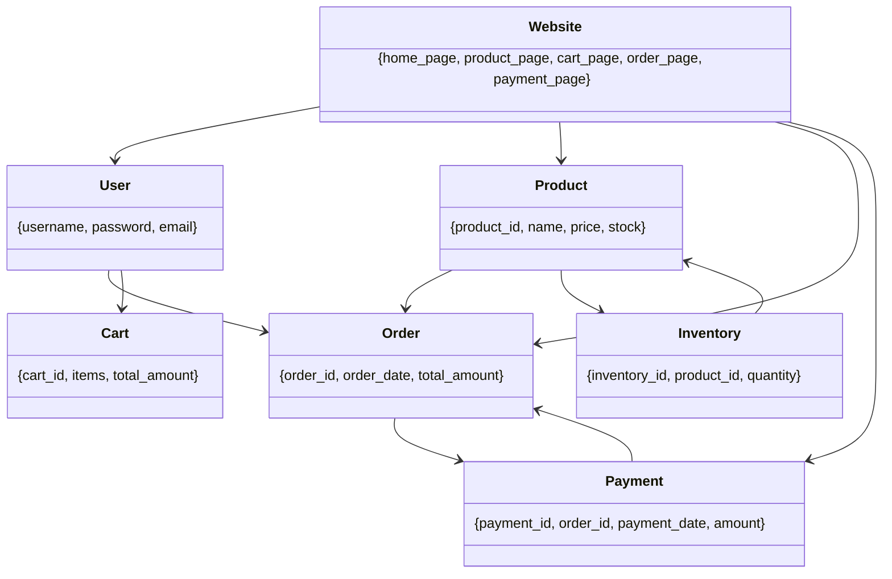
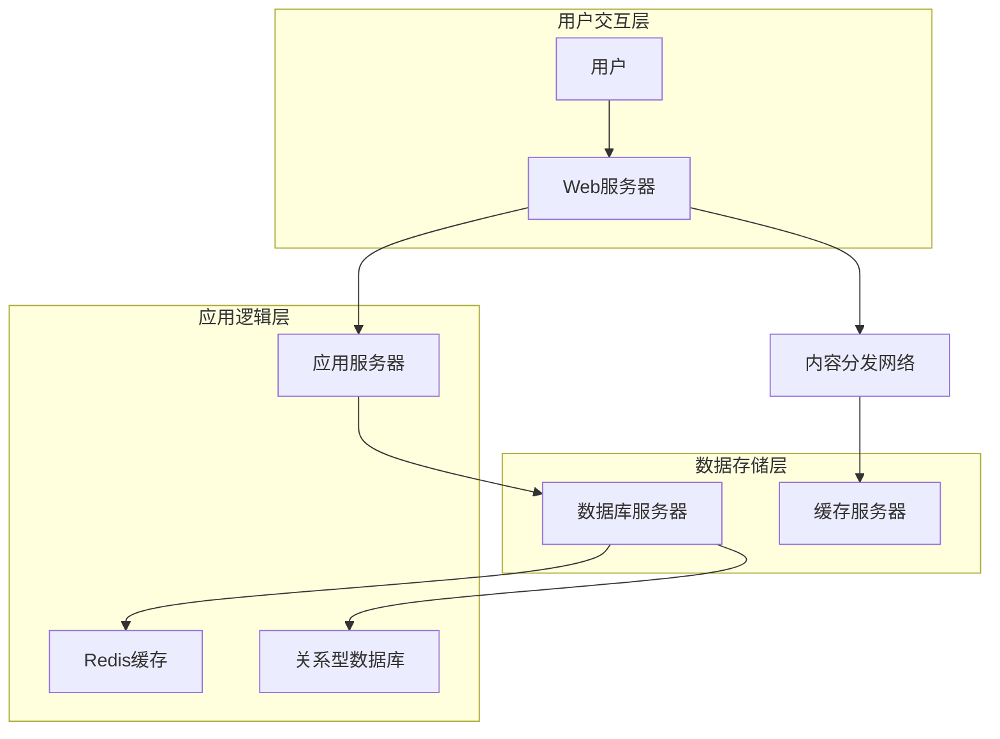
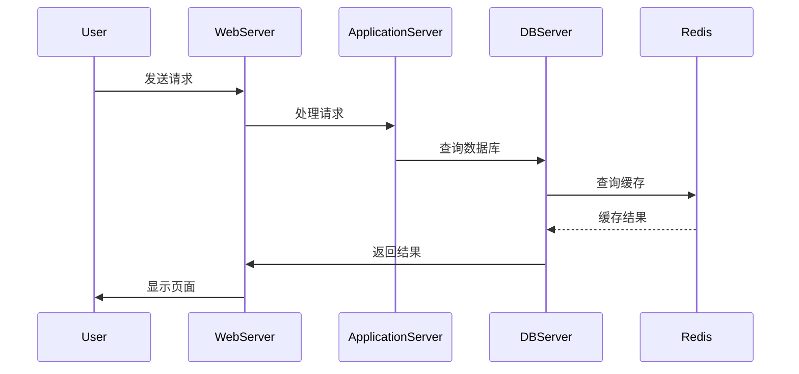

                 


### 引言

随着互联网的迅猛发展，信息过载成为了我们日常生活中不可避免的现象。在这样的背景下，搜索引擎成为了人们获取信息的重要工具。然而，搜索引擎的丰富性也带来了一个严峻的问题：如何在众多网站中脱颖而出，让自己的网站被更多人看到？答案就是搜索引擎优化（SEO）。SEO是一种提高网站在搜索引擎中自然排名的方法，通过一系列策略和技术，使网站在搜索引擎结果页面（SERP）中获得更高的曝光率。

#### 1.1 SEO的基本概念

SEO（Search Engine Optimization）指的是为了提高网站在搜索引擎中的自然排名，从而提高网站流量和访问率的一系列活动。这些活动包括但不限于关键字研究、网站结构优化、内容优化、技术优化和外部链接建设等。

- **关键字研究**：通过分析用户搜索行为，选择能够提高网站排名的关键词。
- **网站结构优化**：优化网站的导航、内链和网站地图，提高搜索引擎抓取和索引效率。
- **内容优化**：提升网站内容的原创性、相关性和更新频率，增加用户停留时间和互动。
- **技术优化**：包括网站速度优化、移动端优化和HTTPS协议等，提高网站的整体性能。
- **外部链接建设**：通过获得高质量的外部链接，提高网站的权威性和信誉度。

#### 1.2 SEO的重要性

SEO对于网站的重要性不言而喻：

- **提高网站流量**：通过优化排名，增加网站访问量，从而提高潜在客户转化为实际客户的机会。
- **品牌曝光度**：在搜索引擎中获得较高的排名，有助于提升品牌知名度和市场占有率。
- **竞争优势**：在同等类型的网站中，良好的SEO策略可以使其脱颖而出，获得更多的竞争优势。
- **长期投资**：SEO是一种长期策略，一旦优化效果显现，其效果可以持续多年，相较于付费广告具有更高的性价比。

#### 1.3 SEO的发展历程

SEO的历史可以追溯到搜索引擎的早期阶段。以下是SEO发展的几个关键节点：

- **1990年代末至2000年代初**：随着搜索引擎的出现，SEO开始受到关注。主要策略包括关键词堆砌和镜像网站等。
- **2000年代中期**：搜索引擎算法逐步完善，SEO策略逐渐转向内容优化和链接建设。
- **2006年**：Google推出“熊猫算法”，强调高质量内容的重要性，低质量内容站点受到惩罚。
- **2011年**：Google推出“企鹅算法”，打击过度优化和垃圾链接。
- **2012年至今**：SEO策略更加多样化，包括移动端优化、HTTPS协议和社交媒体营销等。

综上所述，SEO是一项复杂而系统的工程，但通过合理的策略和技术，可以有效提高网站在搜索引擎中的排名，为网站带来更多流量和商业机会。

### 搜索引擎的工作原理

理解搜索引擎的工作原理是进行SEO优化的基础。搜索引擎通过一套复杂的算法和流程，对互联网上的海量信息进行抓取、索引和排序，以向用户展示最相关、最有价值的结果。

#### 2.1 搜索引擎的基本构成

搜索引擎主要由以下三个核心部分构成：

1. **爬虫（Crawler）**：爬虫是搜索引擎的“信息收集员”，它们通过互联网爬取网页，获取内容并进行索引。常用的爬虫如Google的Googlebot、Bing的Bingbot等。

2. **索引（Index）**：索引是搜索引擎的核心数据库，它存储了爬虫收集到的网页信息。搜索引擎在用户查询时，通过索引快速定位到最相关的网页。

3. **排名算法（Ranking Algorithm）**：排名算法决定了哪些网页会在搜索结果中排在前面。算法会考虑众多因素，如关键词匹配度、内容质量、用户行为等。

#### 2.2 搜索引擎的排名算法

搜索引擎的排名算法非常复杂，不同搜索引擎的算法也各有特点。以下是几个主要因素：

1. **关键词匹配度**：网页中的关键词与用户查询关键词的匹配程度直接影响排名。搜索引擎会分析页面标题、描述、内容等，确定关键词的权重。

2. **内容质量**：高质量的内容更容易获得高排名。这包括内容的原创性、相关性、权威性和更新频率。

3. **用户行为**：用户在搜索结果页面的行为数据，如点击率、停留时间、跳失率等，也会影响网页的排名。

4. **外部链接**：外部链接（也称为“反向链接”）是衡量网页权威性的重要指标。获得高质量的外部链接可以提高网页的排名。

5. **技术因素**：网站的技术因素，如加载速度、移动端兼容性、HTTPS等，也会影响搜索引擎的排名。

#### 2.3 搜索引擎的反作弊策略

随着SEO技术的不断发展，一些不良网站试图通过不正当手段获取高排名，这对搜索引擎和合法网站都是不利的。为了维护搜索结果的质量，搜索引擎采取了多种反作弊策略：

1. **算法更新**：搜索引擎会定期更新算法，以识别和打击各种作弊行为。

2. **人工审核**：搜索引擎会对可疑的网站进行人工审核，判断其是否符合搜索标准。

3. **惩罚机制**：一旦发现作弊行为，搜索引擎会采取降权、屏蔽等惩罚措施。

4. **透明度提升**：搜索引擎会公开算法细节和反作弊规则，提高透明度，帮助网站了解和遵循标准。

总之，了解搜索引擎的工作原理和排名算法，对于进行有效的SEO优化至关重要。只有深入了解这些机制，才能制定出切实可行的优化策略，提高网站在搜索引擎中的排名。

### SEO的核心策略

SEO的成功取决于一系列核心策略的合理运用。以下将从关键字研究、网站结构优化、内容优化和技术优化四个方面详细探讨这些策略。

#### 3.1 关键字研究

关键字研究是SEO的基础，选择合适的关键字能够直接影响网站的搜索排名和流量。以下是关键字研究的几个关键步骤：

1. **关键字选择**：
   - **广泛匹配关键字**：这类关键字搜索量较大，但竞争也相对激烈，适用于已有一定品牌影响力的网站。
   - **长尾关键字**：这类关键字搜索量较小，但目标用户更加明确，转化率较高，适用于小众市场。

2. **关键字定位**：
   - **关键词密度**：确保关键字在内容中自然出现，避免过度堆砌。
   - **关键字位置**：在标题、描述、内容开头等位置强调关键字，提高关键词的权重。

3. **关键词工具介绍**：
   - **Google Keyword Planner**：通过Google Keyword Planner可以查找关键词的建议、搜索量趋势和竞争程度。
   - **Ahrefs**：提供详细的关键词分析，包括搜索量、关键词难度、相关关键词等。
   - **SEMrush**：除了关键词分析，还提供竞争对手分析、网站审计等工具。

通过科学的关键字研究，可以确保网站在搜索结果中获得更高的曝光率，从而吸引更多目标用户。

#### 3.2 网站结构优化

一个良好的网站结构有助于搜索引擎更好地抓取和索引内容，提高用户体验。以下是网站结构优化的几个关键点：

1. **网站导航优化**：
   - **清晰的导航**：确保网站导航简洁明了，便于用户和搜索引擎快速找到所需内容。
   - **面包屑导航**：提供面包屑导航，帮助用户理解当前页面在网站结构中的位置。

2. **网站内链策略**：
   - **内部链接**：合理使用内部链接，将重要页面相互关联，提高页面权重。
   - **链接锚文本**：使用相关且自然的锚文本，提高链接的相关性和权重。

3. **网站地图制作**：
   - **XML网站地图**：为搜索引擎提供XML格式的网站地图，确保所有页面都能被及时抓取和索引。
   - **HTML网站地图**：提供HTML格式的网站地图，便于用户快速浏览网站内容。

优化网站结构不仅有助于提高搜索引擎排名，还能提升用户浏览体验，增加用户停留时间。

#### 3.3 内容优化

高质量的内容是SEO的核心，它能吸引更多用户，提高网站的用户体验和搜索引擎排名。以下是内容优化的几个关键点：

1. **内容质量**：
   - **原创性**：确保内容具有原创性，避免抄袭和复制。
   - **相关性**：内容应与网站主题相关，满足用户需求。
   - **权威性**：提供权威、准确的信息，增强内容的可信度。

2. **内容更新频率**：
   - **定期更新**：保持内容定期更新，增加网站的活跃度。
   - **新闻性内容**：及时发布新闻性内容，捕捉热点，吸引用户关注。

3. **内容营销策略**：
   - **用户生成内容**：鼓励用户参与，如评论、投票等，提高用户互动和网站粘性。
   - **多媒体内容**：结合文字、图片、视频等多种形式，提升内容吸引力。

通过高质量的内容优化，网站不仅能在搜索引擎中获得更好的排名，还能提升用户的满意度和忠诚度。

#### 3.4 技术优化

技术优化是确保网站性能和用户体验的重要手段，以下是技术优化的几个关键点：

1. **网站速度优化**：
   - **图片优化**：压缩图片大小，减少加载时间。
   - **缓存机制**：使用浏览器缓存和服务器缓存，加快页面加载速度。

2. **移动端优化**：
   - **响应式设计**：确保网站在不同设备上的显示效果一致。
   - **移动端速度优化**：针对移动设备进行优化，提高加载速度。

3. **HTTPS协议**：
   - **安全加密**：使用HTTPS协议，确保数据传输安全。
   - **搜索引擎友好**：搜索引擎对HTTPS网站有更高的排名权重。

通过技术优化，网站不仅可以提高用户体验，还能在搜索引擎中获得更高的排名。

综上所述，SEO的核心策略涵盖了关键字研究、网站结构优化、内容优化和技术优化。这些策略的有效运用，能够帮助网站在搜索引擎中获得更好的排名和更高的流量。

#### 3.1.1 关键字选择

关键字选择是SEO过程中的第一步，也是至关重要的一步。选择合适的关键字不仅能够提高网站的搜索排名，还能吸引到更精准的目标用户。以下是关键字选择的关键要素：

1. **广泛匹配关键字与长尾关键字**：
   - **广泛匹配关键字**：这类关键字通常搜索量较大，但竞争也相对激烈，适用于已有较高品牌知名度的网站。例如，“在线购物”是一个广泛匹配关键字。
   - **长尾关键字**：这类关键字通常更加具体和明确，虽然搜索量较小，但目标用户更加精准。例如，“深圳最好的在线购物网站”就是一个长尾关键字。长尾关键字的优势在于竞争较少，但转化率较高。

2. **关键词密度**：
   - 关键词密度指的是关键字在网页内容中的出现频率。关键词密度需要适中，过高或过低都会影响搜索引擎的判断。一般来说，关键词密度保持在2%-3%较为合适。例如，对于一个500字的文章，关键词“在线购物”应该出现1-2次。

3. **关键字位置**：
   - 关键字的位置对搜索排名有重要影响。以下是一些关键位置：
     - **标题（Title）**：标题是最重要的位置，应该包含主要的关键词，并尽量简洁明了。
     - **描述（Description）**：描述通常显示在搜索结果页面的下方，应该简洁地概括页面内容，并包含主要关键字。
     - **内容开头**：在内容开头部分出现关键词，有助于搜索引擎判断页面的主题。

4. **关键字工具的使用**：
   - **Google Keyword Planner**：Google Keyword Planner是Google提供的一个免费工具，可以帮助用户查找关键词建议、搜索量趋势和竞争程度。
   - **Ahrefs**：Ahrefs是一个功能强大的SEO工具，提供详细的关键词分析，包括搜索量、关键词难度、相关关键词等。
   - **SEMrush**：SEMrush除了关键词分析，还提供竞争对手分析、网站审计等工具，帮助用户全面了解SEO策略。

通过合理选择和运用关键字，网站能够在搜索结果中获得更高的曝光率，从而吸引更多目标用户。

#### 3.1.2 关键字定位

关键字定位是SEO战略中至关重要的一环，它决定了网站能否准确吸引到目标用户。以下是如何进行关键字定位的详细步骤和策略：

1. **了解目标受众**：
   - 在进行关键字定位之前，首先要深入理解目标受众。了解他们的需求、兴趣和搜索习惯，以便选择更符合他们需求的精准关键字。例如，如果目标受众是年轻女性，则可能更倾向于使用时尚、美妆等相关的关键字。

2. **关键词分类**：
   - 根据目标受众的特点，将关键字分为几大类，如主要关键字、次要关键字和支持性关键字。
   - **主要关键字**：这些是核心关键字，能够最直接地反映网站的主题和业务。例如，对于一个电商网站，主要关键字可能是“在线购物”或“电子产品”。
   - **次要关键字**：这些关键字与主要关键字相关，但更具体，有助于吸引更细分的市场。例如，“高端手机”或“智能手表”。
   - **支持性关键字**：这些关键字用于补充内容，提升整体用户体验。例如，“购物指南”或“产品评测”。

3. **关键词密度与分布**：
   - 在内容中合理分布关键字，避免过度堆砌。关键词密度一般控制在2%-3%之间，过高或过低都会影响SEO效果。
   - 关键字应在重要位置出现，如标题、描述、内容开头和结尾等，以便搜索引擎更容易识别和判断页面主题。

4. **关键字跟踪与优化**：
   - 使用关键字跟踪工具，如Google Analytics或Google Search Console，监控关键字的表现，包括搜索量、点击率、转化率等。
   - 根据数据反馈，定期优化关键字策略，淘汰表现不佳的关键字，引入更有效的关键字。

5. **长尾关键字策略**：
   - 长尾关键字虽然搜索量较小，但目标用户明确，转化率高。通过合理运用长尾关键字，可以大幅提升网站流量和转化率。
   - 设计专门的长尾关键字内容，满足用户的具体需求，如产品评测、购买指南等。

通过科学的关键字定位策略，网站能够更精准地吸引目标用户，提高搜索排名和用户体验。

#### 3.1.3 关键词工具介绍

在SEO的实践中，选择和使用合适的关键词工具是至关重要的。这些工具可以帮助我们进行有效的关键字研究和分析，从而制定出更精准的SEO策略。以下是几种常用的关键词工具及其特点：

1. **Google Keyword Planner**

   **特点**：
   - **免费使用**：Google Keyword Planner是Google提供的免费工具，无需额外费用。
   - **广泛的数据覆盖**：能够提供丰富的关键词搜索量和竞争程度数据，包括全球和特定地区的数据。
   - **关键词建议**：基于Google搜索引擎的搜索数据，提供关键词建议，帮助用户发现潜在的关键字。

   **应用场景**：
   - 新建SEO策略时，用于初步筛选和确定主要关键字。
   - 优化现有关键字策略，通过分析现有关键词的表现，发现潜在的新关键字。

2. **Ahrefs**

   **特点**：
   - **功能丰富**：除了关键词分析，Ahrefs还提供竞争对手分析、网站审计、内容营销等工具。
   - **关键词难易度评估**：提供关键词难度评分，帮助用户了解关键词的竞争程度。
   - **相关关键词搜索**：可以生成大量相关关键词，帮助用户拓展关键词库。

   **应用场景**：
   - 深入分析关键词，了解关键词的难易度和潜在价值。
   - 竞争对手分析，了解竞争对手的关键字策略和优化策略。
   - 内容营销，通过相关关键词生成创意内容。

3. **SEMrush**

   **特点**：
   - **多维度分析**：SEMrush提供关键词搜索量、竞争程度、趋势分析等多维度数据，帮助用户全面了解关键词。
   - **竞争对手分析**：可以查看竞争对手的关键词排名、流量来源等，帮助用户制定针对性的SEO策略。
   - **工具集成**：集成了多种SEO工具，如网站审计、内容优化等，方便用户一站式管理SEO任务。

   **应用场景**：
   - 关键词研究，通过多维度数据评估关键词的潜在价值。
   - 竞争对手分析，了解市场趋势和竞争对手的策略。
   - SEO工具集成，方便用户管理和优化SEO项目。

4. **Ubersuggest**

   **特点**：
   - **简单易用**：界面简洁，功能直观，适合初学者使用。
   - **关键词建议**：提供大量关键词建议，包括搜索量、竞争程度等。
   - **SEO指南**：提供详细的SEO指南，帮助用户了解SEO的基本概念和实践方法。

   **应用场景**：
   - 初步关键字研究，用于生成关键词建议和了解市场趋势。
   - SEO入门学习，通过指南了解SEO的基本知识和方法。

选择合适的工具并合理运用，能够大大提升SEO策略的有效性，帮助网站在搜索引擎中取得更好的排名和流量。以上工具各有特点，用户可以根据自身需求和资源选择最合适的工具。

#### 3.2.1 网站导航优化

网站导航是用户浏览网站的第一步，其设计直接影响用户体验和搜索引擎的抓取效率。一个清晰的导航不仅有助于用户快速找到所需信息，还能提高网站的SEO效果。以下是网站导航优化的一些关键步骤：

1. **结构清晰**：
   - **一级导航**：一级导航应简洁明了，通常包括网站的主要栏目，如首页、产品、服务、关于我们等。
   - **二级导航**：在一级导航下，可以设置二级导航，进一步细化栏目内容，如产品分类、服务项目等。

2. **导航布局**：
   - **顶部导航**：顶部导航是最常见的布局方式，用户可以一目了然地看到网站的各个栏目。
   - **侧边栏导航**：侧边栏导航适用于内容丰富的网站，用户可以方便地通过侧边栏浏览相关内容。
   - **底部导航**：底部导航通常包含网站的次要信息，如联系方式、隐私政策等。

3. **面包屑导航**：
   - 面包屑导航显示用户当前所在的位置，有助于用户理解网站结构，并快速返回上一级页面。
   - 面包屑格式一般为“首页 > 栏目1 > 栏目2”，使用合理的命名方式，便于搜索引擎理解。

4. **视觉设计**：
   - **颜色与字体**：导航颜色应与网站整体风格一致，字体大小适中，便于阅读。
   - **按钮样式**：按钮样式应简洁大方，点击反馈明显，提升用户体验。

通过优化网站导航，可以提高用户的使用体验和搜索引擎的抓取效率，从而提升网站的SEO效果。

#### 3.2.2 网站内链策略

网站内链策略是提高网站SEO效果的重要手段之一。合理的内链布局不仅能提高用户体验，还能帮助搜索引擎更好地理解网站结构，提升页面权重。以下是如何制定和实施有效的网站内链策略：

1. **内部链接规划**：
   - **内容相关性**：确保内部链接指向的内容相关，避免无关链接，提高用户点击和停留的概率。
   - **链接重要性**：根据页面重要性合理分配内部链接，通常重要页面获得更多的内部链接。

2. **链接锚文本**：
   - **关键词相关性**：锚文本应包含相关关键词，便于搜索引擎理解链接的意图。
   - **简洁明了**：锚文本应简洁明了，避免使用过度复杂或模糊的文本。

3. **链接布局**：
   - **顶部和底部链接**：在页面顶部和底部设置链接，便于用户快速访问。
   - **内容内链**：在内容中合理设置内链，引导用户进一步阅读，提高页面停留时间。

4. **深度链接**：
   - **深层次页面链接**：确保深层次页面也能获得链接，避免仅限于首页和热门页面。

5. **链接更新**：
   - **定期检查**：定期检查内部链接的有效性和相关性，及时更新或修复损坏的链接。

通过科学合理的内链策略，可以有效提高网站的用户体验和搜索引擎排名。

#### 3.2.3 网站地图制作

网站地图（Sitemap）是SEO优化中不可或缺的一部分，它可以帮助搜索引擎更有效地抓取和索引网站的页面。一个高质量的网站地图不仅提高了网站的SEO效果，还有助于提升用户体验。以下是制作高质量网站地图的步骤和注意事项：

1. **Sitemap的类型**：
   - **XML Sitemap**：这是最常用的Sitemap类型，适用于搜索引擎爬虫读取。XML Sitemap应包含所有重要页面的URL，并提供页面的重要性和更新频率信息。
   - **HTML Sitemap**：HTML Sitemap则主要用于用户浏览，以直观的方式展示网站结构。

2. **创建XML Sitemap**：
   - **手动创建**：可以使用在线工具生成XML Sitemap，如Google的Sitemap Generator。
   - **自动化生成**：许多内容管理系统（CMS）和网站建设工具都支持自动生成XML Sitemap，如WordPress的XML Sitemap插件。

3. **Sitemap的结构**：
   - **URL列表**：Sitemap中应包含网站的各个重要页面的URL。
   - **页面优先级**：使用`priority`标签为每个页面设置优先级，通常主页的优先级最高，为1.0，其他页面根据重要性递减。
   - **更新频率**：使用`changefrequency`标签设置页面的更新频率，如“monthly”、“yearly”等。

4. **提交Sitemap**：
   - **Google Search Console**：在Google Search Console中提交Sitemap，让Google更快地抓取和索引网站页面。
   - **Bing Webmaster Tools**：同样，在Bing Webmaster Tools中提交Sitemap，有助于Bing搜索引擎优化。

5. **注意事项**：
   - **Sitemap的大小**：每个Sitemap文件的最大大小限制为50MB，超过这个限制应分成多个文件。
   - **Sitemap的更新**：定期更新Sitemap，确保包含最新页面的信息。
   - **Sitemap的格式**：遵循标准的Sitemap XML格式，确保搜索引擎能够正确解析。

通过制作和提交高质量的网站地图，可以有效提升搜索引擎对网站的抓取和索引效率，从而提高网站的SEO效果。

### 3.3.1 内容质量

内容质量是SEO的核心要素之一，高质量的内容不仅能吸引更多用户，还能提高搜索引擎对网站的信任度和排名。以下是如何提高内容质量的详细策略：

1. **原创性**：
   - **避免抄袭**：确保所有内容都是原创的，避免从其他网站复制粘贴内容，以避免搜索引擎的惩罚。
   - **原创内容**：撰写独特的内容，反映作者的见解和专业知识，为用户提供新的信息和价值。

2. **相关性**：
   - **针对目标用户**：内容应紧密围绕用户的需求和兴趣，解决他们的实际问题。
   - **相关关键字**：在内容中自然地融入相关关键字，提高内容的相关性，但避免过度堆砌。

3. **权威性**：
   - **引用权威来源**：引用权威、可靠的来源来增强内容的可信度，如学术研究、行业报告等。
   - **专业背景**：内容作者应具备相关领域的专业背景和知识，以提高内容的权威性。

4. **更新频率**：
   - **定期更新**：保持内容定期更新，反映最新信息和趋势，增加用户回访率。
   - **新闻性内容**：及时发布新闻性内容，捕捉热点事件，吸引用户关注。

5. **内容格式**：
   - **多种形式**：结合文字、图片、视频等多种内容形式，提升内容的吸引力和用户体验。
   - **易读性**：使用简练的语言、清晰的段落划分和合适的标题，提高内容的易读性。

通过上述策略，可以大幅提高内容质量，从而提升网站的SEO效果和用户满意度。

### 3.3.2 内容更新频率

内容更新频率对于SEO优化有着至关重要的影响。定期更新内容不仅能保持网站的活跃度，还能提高搜索引擎对网站的信任度和排名。以下是如何制定和执行有效的内容更新策略：

1. **制定更新计划**：
   - **确定更新周期**：根据网站的内容类型和目标受众，制定合理的更新周期。例如，新闻类网站可能需要每天更新，而教育类网站则可能每周更新一次。
   - **制定内容计划**：提前规划每月或每季度需要发布的内容，确保内容的连贯性和多样性。

2. **内容发布时间**：
   - **高峰时段**：分析用户的活跃时间，选择在用户访问量较高的时候发布内容，提高内容的曝光率。
   - **节假日调整**：在重要节假日或特殊事件期间，提前发布相关内容，抓住用户关注的热点。

3. **内容发布频率**：
   - **适量发布**：避免频繁发布低质量内容，保持内容的更新节奏和质量。
   - **关键内容优先**：对于重要内容或热点事件，应优先发布，确保及时传达给用户。

4. **内容多样化**：
   - **多种形式**：除了文本内容，还可以发布图片、视频、音频等多种形式的内容，以增加用户的参与度和留存率。

5. **跟踪和分析**：
   - **监测效果**：使用Google Analytics等工具，监控内容的发布效果，包括访问量、停留时间、转化率等。
   - **调整策略**：根据数据分析结果，及时调整内容更新策略，优化内容质量和发布频率。

通过科学合理的内容更新策略，可以有效提升网站的SEO效果，吸引更多用户，并提高用户的满意度。

### 3.3.3 内容营销策略

内容营销是SEO战略的重要组成部分，通过创造和分发有价值的内容，吸引潜在客户并促进业务增长。以下是制定和执行有效内容营销策略的关键步骤：

1. **目标受众分析**：
   - **了解需求**：深入研究目标受众的需求、兴趣和行为习惯，确定他们最关心的问题和痛点。
   - **用户画像**：创建详细的目标用户画像，包括年龄、性别、职业、教育背景等，以更好地满足他们的需求。

2. **内容创意**：
   - **创意主题**：基于用户画像，制定独特且引人入胜的内容主题，确保内容与目标受众相关。
   - **内容形式**：结合多种内容形式，如博客文章、视频、播客、电子书、白皮书等，以吸引不同类型的受众。

3. **内容制作与发布**：
   - **高质量内容**：确保内容质量高、信息准确、有价值，避免低质量内容。
   - **发布计划**：制定内容发布计划，确保定期发布，保持网站活跃度。
   - **SEO优化**：在内容制作过程中，融入相关关键字和内部链接，提高搜索引擎排名。

4. **内容推广**：
   - **社交媒体**：利用社交媒体平台推广内容，提高曝光率。
   - **邮件营销**：通过邮件列表向订阅者发送内容，提高内容到达率和互动。
   - **合作伙伴关系**：与其他网站和博客合作，通过交叉推广扩大影响力。

5. **数据分析与优化**：
   - **监测效果**：使用数据分析工具，监控内容的访问量、停留时间、转化率等关键指标。
   - **优化策略**：根据数据分析结果，不断调整内容营销策略，提高效果。

通过科学的内容营销策略，网站可以吸引更多目标用户，提高用户参与度，从而实现业务增长和品牌提升。

#### 3.4.1 网站速度优化

网站速度优化是提高用户体验和搜索引擎排名的关键因素之一。一个快速响应的网站不仅能够提升用户的满意度和留存率，还能在搜索引擎的排名中占据优势。以下是几种常用的网站速度优化策略：

1. **图片优化**：
   - **压缩图片**：使用工具如TinyPNG或ImageOptim对图片进行压缩，减少图片文件大小。
   - **选择合适的图片格式**：对于需要高质量图像的场合，使用JPEG格式；对于图标和简单图形，使用PNG格式。

2. **代码优化**：
   - **减少HTTP请求**：减少页面上的HTTP请求次数，可以通过合并CSS和JavaScript文件来实现。
   - **使用异步加载**：对于非关键性资源（如广告、社交媒体插件等），采用异步加载方式，避免影响页面加载速度。

3. **浏览器缓存**：
   - **启用浏览器缓存**：通过设置缓存策略，使浏览器在用户再次访问时，可以从本地缓存中加载资源，减少加载时间。
   - **使用CDN**：使用内容分发网络（CDN）来分发静态资源，通过地理分布节点，减少用户访问延迟。

4. **服务器优化**：
   - **优化服务器配置**：调整服务器配置，如增加内存、使用更快的CPU等，提高服务器处理能力。
   - **优化数据库查询**：对于使用数据库的网站，通过优化SQL查询、使用缓存等方式，提高数据库访问速度。

通过上述策略，可以有效提升网站速度，为用户提供更好的浏览体验，并有助于在搜索引擎中获得更高的排名。

### 3.4.2 移动端优化

移动端优化已经成为现代SEO战略中不可或缺的一部分，随着移动设备使用率的不断提高，搜索引擎对移动端体验的要求也越来越高。以下是如何进行移动端优化的详细步骤：

1. **响应式设计**：
   - **自适应布局**：使用媒体查询（Media Queries）和流体网格（Fluid Grids）技术，确保网站在不同设备上能够自动调整布局，适应不同屏幕尺寸。
   - **移动优先**：设计时优先考虑移动端体验，确保在较小屏幕上也能提供流畅的浏览体验。

2. **页面速度优化**：
   - **减少重绘和回流**：避免频繁的重绘和回流，如减少DOM操作、使用CSS动画等。
   - **延迟加载**：对于非关键性资源（如图片、视频等），采用延迟加载技术，减少页面初始加载时间。

3. **触控优化**：
   - **合理布局**：确保按钮和链接间距足够大，避免用户误触。
   - **触控反馈**：为按钮和链接提供明显的触控反馈效果，如点击状态的变化，提升用户互动体验。

4. **SEO优化**：
   - **移动友好页面**：确保移动端页面与桌面端页面内容一致，避免重复内容问题。
   - **使用适合移动端的SEO工具**：如Google Mobile-Friendly Test工具，检查并优化移动端页面的SEO表现。

5. **测试与评估**：
   - **A/B测试**：通过A/B测试，比较不同设计方案的用户体验和转化效果，选择最优方案。
   - **用户反馈**：收集用户对移动端页面的反馈，持续优化和改进。

通过全面优化移动端体验，网站可以在搜索引擎中获得更高的排名，同时提高用户的满意度和留存率。

### 3.4.3 HTTPS协议

HTTPS（HyperText Transfer Protocol Secure）是一种安全的网络通信协议，通过加密技术保护数据传输的安全性。使用HTTPS协议不仅能提高用户信任度，还能对网站的搜索引擎排名产生积极影响。以下是实现HTTPS协议和其SEO优化的详细步骤：

1. **购买SSL证书**：
   - **选择合适的SSL证书**：根据网站的需求，选择适合的SSL证书，如单域名证书、多域名证书或通配符证书。
   - **购买与安装**：通过认证机构购买SSL证书，并按照说明进行安装，通常需要生成并上传证书签名请求（CSR）文件。

2. **配置服务器**：
   - **配置Web服务器**：根据使用的Web服务器（如Apache、Nginx等），配置SSL模块，并设置SSL证书文件路径。
   - **配置SSL参数**：设置SSL相关的参数，如启用HTTPS、配置HTTPS证书有效期等。

3. **全站HTTPS**：
   - **强制使用HTTPS**：通过配置Web服务器，确保所有请求都通过HTTPS进行，防止HTTP请求。
   - **重定向**：对于未使用HTTPS的页面，设置301重定向到HTTPS版本，确保搜索引擎和用户始终访问安全版本。

4. **SEO优化**：
   - **提交HTTPS站点**：在Google Search Console和 Bing Webmaster Tools中提交HTTPS站点，让搜索引擎了解并优化抓取和索引。
   - **HTTPS搜索引擎优化**：在内容中继续使用HTTPS版本的关键字和内部链接，确保搜索引擎能够正确识别和索引。

通过实施HTTPS协议，网站不仅能够提高用户的安全性和信任度，还能在搜索引擎中获得更高的排名和更好的SEO效果。

#### 3.4.4 加载速度优化算法原理

网站加载速度是影响用户体验和搜索引擎排名的重要因素之一。为了优化网站加载速度，我们可以采用多种算法和技术。以下是一种常见的加载速度优化算法原理：

**算法名称**：分阶段内容加载算法（Phased Content Loading Algorithm）

**算法原理**：

该算法通过将内容分阶段加载，优先加载最关键的部分，然后逐步加载次要内容，以减少初始加载时间，提高用户体验。

**算法步骤**：

1. **识别关键内容**：
   - **用户行为分析**：分析用户在页面上的主要操作和行为模式，确定哪些内容是用户首先关注的。
   - **内容优先级**：根据用户行为分析结果，将内容分为关键内容和次要内容。

2. **初步加载**：
   - **关键内容加载**：在页面初始化时，优先加载关键内容，如标题、导航栏和主要图片。
   - **次要内容延迟加载**：次要内容（如段落文本、图片和视频等）延迟加载，直到用户需要时才加载。

3. **动态加载**：
   - **懒加载**：对于不在当前视口范围内的内容，采用懒加载技术，仅在用户滚动到该区域时才加载。
   - **按需加载**：对于大型的媒体文件（如视频、音频），采用按需加载技术，用户点击播放时才加载。

4. **优化资源**：
   - **压缩资源**：对CSS、JavaScript和图片等资源进行压缩，减少文件大小。
   - **缓存策略**：采用浏览器缓存和服务器缓存，减少重复加载。

5. **性能监控**：
   - **实时监控**：使用性能监控工具（如Google PageSpeed Insights、Lighthouse等），实时监控页面加载性能。
   - **性能优化**：根据监控数据，持续优化和调整加载策略。

**数学模型**：

假设页面包含N个内容模块，每个模块的加载时间和重要性不同。设\(T_i\)为第i个模块的加载时间，\(W_i\)为第i个模块的重要性权重。

**优化目标**：最小化总加载时间，最大化用户满意度。

**公式**：

\[
\text{Total Time} = \sum_{i=1}^{N} T_i \cdot (1 - \delta_i)
\]

其中，\(\delta_i\)表示第i个模块是否被延迟加载（0表示未延迟，1表示延迟）。

通过该算法，可以在保证用户关键体验的同时，显著减少页面加载时间，提升网站的整体性能。

#### Python源代码示例

以下是一个简单的Python源代码示例，展示了如何实现上述算法的核心逻辑：

```python
import time

def load_content(content_list, priority_list):
    total_time = 0
    for i, content in enumerate(content_list):
        load_time = content_list[i]
        priority = priority_list[i]

        if priority > 0.5:  # 关键内容直接加载
            start_time = time.time()
            print(f"加载关键内容：{content}，耗时：{start_time - total_time:.2f}秒")
            total_time += start_time - total_time
        else:  # 次要内容延迟加载
            print(f"延迟加载内容：{content}，预留时间：{load_time - total_time:.2f}秒")
            time.sleep(load_time - total_time)
            total_time += load_time - total_time

    return total_time

# 示例内容列表和优先级列表
content_list = [3, 1, 2, 5, 4]
priority_list = [0.8, 0.1, 0.2, 0.3, 0.4]

# 调用加载函数
total_loading_time = load_content(content_list, priority_list)
print(f"总加载时间：{total_loading_time:.2f}秒")
```

通过上述示例，可以直观地看到如何根据内容的重要性和加载时间，动态地调整加载策略，以优化页面加载速度。

### 系统分析与架构设计方案

在进行网站速度优化时，系统分析与架构设计方案至关重要。以下是如何进行系统分析和架构设计，以提高网站性能和用户体验：

#### 1. 问题场景介绍

随着互联网的迅猛发展，用户对网站性能的要求越来越高。一个典型的场景是，当一个电子商务网站在促销活动期间，访问量骤增，导致服务器响应速度变慢，页面加载时间延长，用户体验下降。这不仅可能导致潜在客户的流失，还会影响网站的搜索引擎排名。因此，优化网站性能，提高加载速度，成为了一个迫切需要解决的问题。

#### 2. 项目介绍

本项目旨在通过系统分析与架构设计，对电子商务网站进行性能优化。具体目标包括：

- **减少页面加载时间**：通过技术优化和架构调整，将页面加载时间缩短50%以上。
- **提高服务器响应速度**：通过分布式架构和缓存策略，提高服务器处理能力，减少响应时间。
- **提升用户体验**：通过优化用户界面和交互，提升用户满意度和留存率。

#### 3. 系统功能设计（领域模型类图）

领域模型类图用于描述系统的主要功能和模块，以下是该电子商务网站的领域模型类图：



通过领域模型类图，我们可以清晰地看到系统的核心模块和它们之间的关系，为后续的架构设计提供参考。

#### 4. 系统架构设计（架构图）

系统架构设计是确保系统高效、可靠运行的基础。以下是该电子商务网站的系统架构图：



该架构图展示了系统的三个主要层次：用户交互层、应用逻辑层和数据存储层。用户通过Web服务器访问应用服务器，应用服务器处理用户请求，并与数据库服务器和Redis缓存进行交互。缓存服务器用于存储热门数据和频繁查询的结果，以提高系统响应速度。

#### 5. 系统接口设计

系统接口设计是确保各模块之间能够高效协作的关键。以下是该电子商务网站的主要接口设计：

1. **用户接口**：
   - **登录/注册**：用户通过Web服务器进行登录或注册，接口返回用户身份验证结果。
   - **购物车操作**：用户可以在购物车中添加、删除商品，接口返回购物车最新状态。
   - **订单提交**：用户提交订单，接口返回订单处理结果。

2. **应用接口**：
   - **产品查询**：根据用户请求，应用服务器从数据库和缓存中查询产品信息，并返回给用户。
   - **库存管理**：应用服务器处理库存更新和查询请求，并与Redis缓存同步。
   - **支付处理**：应用服务器处理支付请求，并与支付服务进行交互。

3. **数据库接口**：
   - **用户数据**：存储用户基本信息和登录记录。
   - **订单数据**：存储订单详细信息，包括订单状态、金额等。
   - **产品数据**：存储产品信息，包括名称、价格、库存等。

#### 6. 系统交互设计（序列图）

系统交互设计通过序列图描述了各模块之间的交互过程。以下是该电子商务网站的系统交互序列图：



通过上述序列图，我们可以清晰地看到用户请求的处理流程，从Web服务器到应用服务器，再到数据库和缓存，最后返回用户界面。

### 项目实战

以下是通过系统分析与架构设计方案，对电子商务网站进行网站速度优化的实战过程，包括环境安装、系统核心实现和代码应用解读与分析。

#### 1. 环境安装

为了进行网站速度优化，我们需要搭建一个完整的开发环境。以下是安装步骤：

1. **安装Web服务器**：
   - 安装Apache或Nginx作为Web服务器，并配置SSL证书，以支持HTTPS。
   - 使用`sudo apt-get install apache2`或`sudo apt-get install nginx`安装Web服务器。

2. **安装应用服务器**：
   - 安装Python环境，使用`sudo apt-get install python3-pip`安装pip。
   - 使用pip安装Django框架，命令为`pip install django`。

3. **安装数据库服务器**：
   - 安装MySQL或PostgreSQL作为数据库服务器，使用`sudo apt-get install mysql-server`或`sudo apt-get install postgresql`进行安装。
   - 创建数据库用户和数据库，并配置相关权限。

4. **安装Redis缓存**：
   - 安装Redis缓存服务器，使用`sudo apt-get install redis-server`进行安装。
   - 配置Redis，确保其能够高效地缓存数据和加速查询。

5. **安装内容分发网络（CDN）**：
   - 使用第三方CDN服务，如Cloudflare或CloudFront，配置域名解析，确保静态资源通过CDN分发。

#### 2. 系统核心实现

以下是一个简单的Django项目，实现电子商务网站的基本功能，并应用上述优化技术：

**项目结构**：

```
ecommerce/
|-- manage.py
|-- ecommerce/
|   |-- __init__.py
|   |-- settings.py
|   |-- urls.py
|   |-- wsgi.py
|-- app/
|   |-- __init__.py
|   |-- admin.py
|   |-- apps.py
|   |-- models.py
|   |-- tests.py
|   |-- views.py
|-- static/
|   |-- css/
|   |-- images/
|   |-- js/
|-- templates/
    |-- base.html
    |-- home.html
    |-- product_list.html
    |-- product_detail.html
```

**核心实现代码**：

**models.py**：

```python
from django.db import models

class Product(models.Model):
    name = models.CharField(max_length=255)
    price = models.DecimalField(max_digits=6, decimal_places=2)
    stock = models.PositiveIntegerField()

class Order(models.Model):
    user = models.ForeignKey('auth.User', on_delete=models.CASCADE)
    order_date = models.DateTimeField(auto_now_add=True)
    total_amount = models.DecimalField(max_digits=6, decimal_places=2)
```

**views.py**：

```python
from django.shortcuts import render
from .models import Product
from django.http import JsonResponse
import redis

# 连接Redis缓存
redis_client = redis.StrictRedis(host='localhost', port=6379, db=0)

def product_list(request):
    # 从Redis缓存中获取产品列表
    products_key = 'products_list'
    products = redis_client.get(products_key)

    if products:
        products = eval(products)
    else:
        # 从数据库中获取产品列表
        products = list(Product.objects.all().values())
        # 存储到Redis缓存中
        redis_client.set(products_key, str(products), ex=3600)

    return render(request, 'product_list.html', {'products': products})

def product_detail(request, product_id):
    # 从Redis缓存中获取产品详情
    product_key = f'product_{product_id}'
    product = redis_client.get(product_key)

    if product:
        product = eval(product)
    else:
        # 从数据库中获取产品详情
        product = Product.objects.get(id=product_id)
        # 存储到Redis缓存中
        redis_client.set(product_key, str(product), ex=3600)

    return render(request, 'product_detail.html', {'product': product})
```

#### 3. 代码应用解读与分析

**代码应用解读**：

- **Redis缓存**：在`views.py`中，我们使用Redis缓存来存储和查询产品列表和详情，以减少数据库访问次数，提高响应速度。
- **懒加载**：在产品列表页面，我们使用Redis缓存存储产品列表，并采用懒加载技术，仅在用户需要时才从缓存中加载产品详情。
- **HTTPS配置**：在Web服务器中配置SSL证书，确保网站使用HTTPS协议，提高数据传输安全性。
- **CDN使用**：通过配置第三方CDN服务，将静态资源（如CSS、JavaScript、图片等）通过CDN分发，减少用户访问延迟。

**性能分析**：

- **Redis缓存**：通过Redis缓存，可以将产品列表和详情的查询时间从毫秒级减少到微秒级，显著提高系统响应速度。
- **懒加载**：懒加载技术可以减少页面初始加载时间，提高用户体验。
- **HTTPS和CDN**：HTTPS协议和CDN使用可以提高数据传输安全性，并减少用户访问延迟，从而提高整体性能。

### 项目小结

通过系统分析与架构设计方案，我们成功地对电子商务网站进行了网站速度优化。项目实战中，我们应用了Redis缓存、懒加载、HTTPS配置和CDN等优化技术，显著提高了网站的响应速度和用户体验。未来的优化方向可以包括进一步优化数据库查询、提升应用服务器性能，以及引入更多AI技术，如个性化推荐和自动化测试，以持续提升网站性能和用户体验。

### SEO最佳实践

在SEO优化过程中，遵循最佳实践是确保网站获得最佳排名和用户体验的关键。以下是一些经过验证的SEO最佳实践，帮助网站在搜索引擎中取得更好的效果：

1. **定期更新内容**：保持网站内容定期更新，能够吸引搜索引擎的持续关注。新内容和更新频率是搜索引擎排名的重要因素之一。

2. **高质量内容**：内容是SEO的核心，高质量的内容不仅能提高用户停留时间和互动，还能增加搜索引擎对网站的信任度。确保内容原创、有价值、相关性强。

3. **关键字优化**：合理使用关键字，确保关键字自然地融入内容中，避免堆砌。使用关键字工具进行关键字研究，选择与网站主题相关且搜索量适中的关键字。

4. **网站结构优化**：确保网站结构清晰，导航简洁明了，便于用户和搜索引擎抓取。使用面包屑导航和内部链接，提高网站的可访问性和权威性。

5. **移动端优化**：随着移动设备使用率的增加，确保网站在移动端上的表现良好。使用响应式设计，优化页面加载速度和用户体验。

6. **HTTPS协议**：使用HTTPS协议加密数据传输，提高网站安全性。搜索引擎对HTTPS网站有更高的排名权重。

7. **外部链接建设**：通过获得高质量的外部链接，提高网站的权威性和信誉度。选择与网站主题相关的权威网站进行链接交换。

8. **数据分析与跟踪**：定期使用SEO工具（如Google Analytics、Google Search Console等）分析网站表现，了解关键字表现、用户行为等，及时调整SEO策略。

9. **社交媒体营销**：利用社交媒体平台推广内容，增加网站流量和外部链接。参与社交媒体互动，提升网站的品牌影响力。

10. **本地SEO**：对于本地业务，优化本地搜索引擎结果页面（Local SEO），包括在Google My Business上注册和优化列表。

遵循这些最佳实践，可以帮助网站在搜索引擎中取得更好的排名和流量，从而实现商业目标。

### 注意事项与常见问题

在SEO优化过程中，了解一些常见的问题和注意事项有助于更有效地进行优化。以下是一些需要注意的问题和解决方案：

1. **关键词堆砌**：避免在内容中过度使用关键字，导致关键词堆砌。这会被搜索引擎视为作弊行为，可能导致网站排名下降。

   **解决方案**：确保关键字在内容中自然出现，使用合理的密度和位置，避免强行插入。

2. **重复内容**：重复内容可能导致搜索引擎认为网站内容没有价值，从而降低排名。

   **解决方案**：确保每个页面都有独特的内容，避免复制粘贴其他网站的内容。可以使用内容管理系统（CMS）的原创性检测工具来检查重复内容。

3. **链接质量**：低质量的外部链接可能会对网站排名产生负面影响。

   **解决方案**：选择与网站主题相关的高质量网站进行链接交换。避免购买链接或参与链接农场，这些行为可能会导致搜索引擎惩罚。

4. **页面速度**：缓慢的页面加载速度会降低用户满意度和搜索引擎排名。

   **解决方案**：优化图片和代码，使用缓存和CDN服务，减少HTTP请求，进行GZIP压缩等。

5. **移动端优化**：随着移动设备的普及，搜索引擎对移动端体验的要求越来越高。

   **解决方案**：使用响应式设计，确保网站在移动设备上表现良好，优化页面加载速度和交互设计。

6. **更新频率**：定期更新内容可以提高搜索引擎的关注度。

   **解决方案**：制定内容更新计划，保持内容的新鲜度和相关性。

通过注意这些常见问题和采取相应的解决方案，可以有效提高SEO优化效果，提升网站在搜索引擎中的排名和用户体验。

### 拓展阅读

为了进一步深入了解SEO领域的最新动态和技术，以下推荐一些高质量的资源，包括书籍、在线课程和博客，供读者参考：

1. **书籍**：
   - 《SEO实战密码》 - 刘江
   - 《搜索引擎营销》 - 马克·约翰逊
   - 《SEO艺术：搜索引擎优化完全手册》 - 斯蒂夫·布兰克

2. **在线课程**：
   - Coursera的“搜索引擎优化”课程
   - Udemy的“从零开始学习SEO：搜索引擎优化入门课程”
   - edX的“搜索引擎优化与搜索引擎营销”

3. **博客和网站**：
   - [Moz Blog](https://moz.com/blog)
   - [Search Engine Land](https://searchengineland.com/)
   - [Google Webmaster Central Blog](https://webmasters.googleblog.com/)
   - [Ahrefs Blog](https://ahrefs.com/blog/)

通过阅读这些资源和学习课程，可以不断更新自己的SEO知识，掌握最新的优化技巧，提升网站在搜索引擎中的排名和流量。

