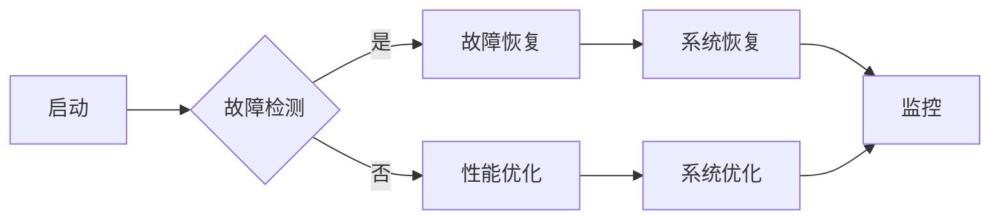
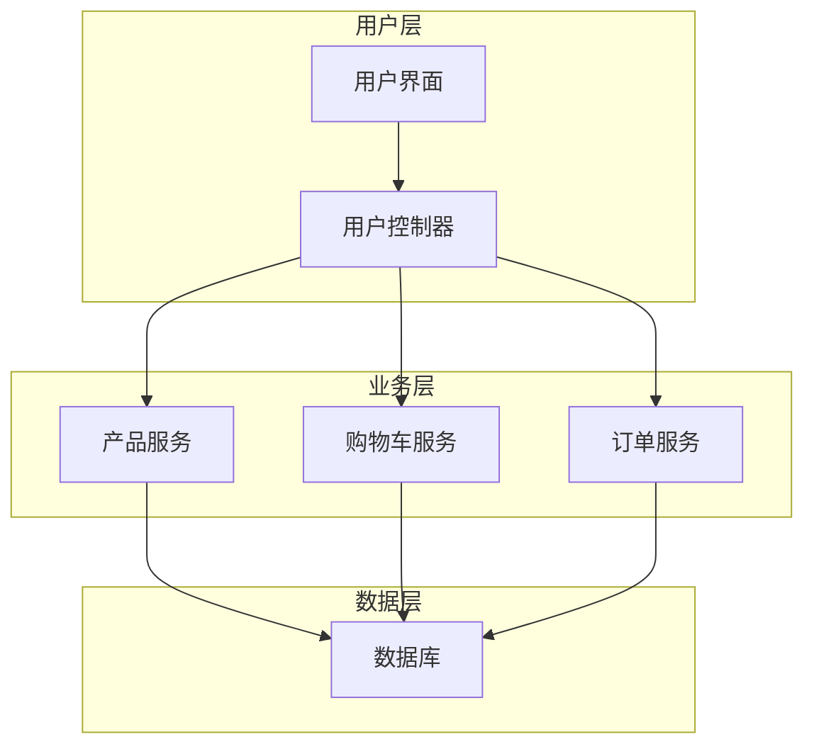
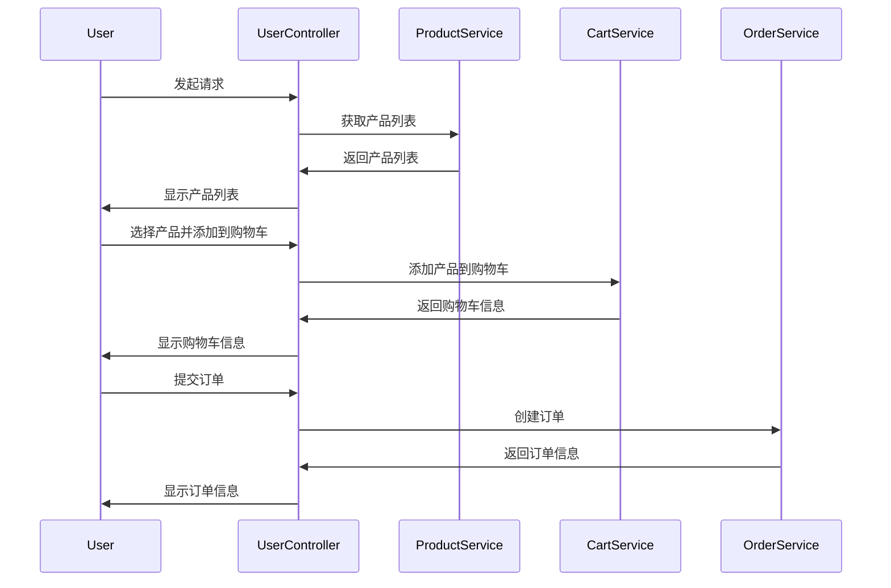
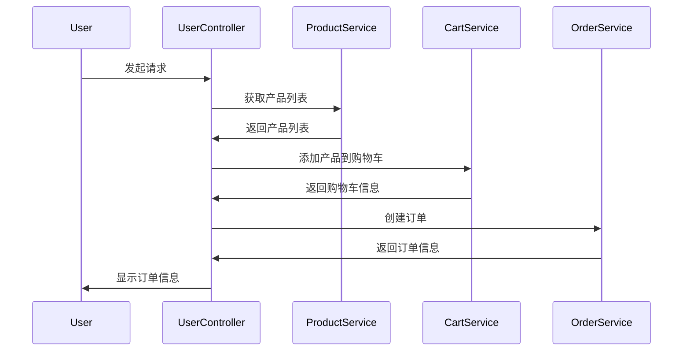

                 

# SRE(站点可靠性工程)最佳实践

> 关键词：站点可靠性工程、SRE、自动化、监控、性能优化、故障恢复

> 摘要：本文旨在探讨SRE（站点可靠性工程）的最佳实践。通过对SRE的概述、核心概念、算法原理以及实战案例的详细分析，帮助读者深入理解并掌握SRE的关键技术和应用场景，为实际项目的可靠性保障提供有力支持。

## 第1章 SRE概述与背景

### 1.1 问题背景

在现代企业中，IT系统的高可用性、可靠性和性能已经成为业务持续运行的关键因素。然而，随着业务的不断增长和IT系统的复杂性增加，维护这些系统的可靠性变得日益困难。传统的方法往往依赖于经验、文档和手动操作，这不仅效率低下，而且容易出现人为错误。

### 1.2 问题描述

SRE（站点可靠性工程）是一种将软件工程的方法和原则应用于系统运营的实践。其目标是确保系统的可用性、可靠性和性能，同时减少运营成本。SRE的核心理念是通过自动化和持续改进来优化系统的运营。

### 1.3 问题解决

SRE通过一系列原则和实践来解决上述问题：

1. **自动化**：通过编写脚本和工具来自动化日常操作，减少人为错误。
2. **持续改进**：定期评估和优化系统性能，持续改进。
3. **测量和监控**：使用各种工具和指标来监控系统的运行状态，快速识别和解决问题。
4. **容错性设计**：通过冗余、备份和故障转移等手段来提高系统的容错性。

### 1.4 边界与外延

SRE的边界主要在于其应用范围，它通常应用于大规模、高并发的IT系统，如互联网公司、金融公司等。而外延则包括各种与系统可靠性相关的领域，如故障恢复、性能优化、成本控制等。

### 1.5 概念结构与核心要素组成

SRE的核心要素包括：

1. **监控**：监控系统的运行状态，及时发现异常。
2. **自动化**：自动化日常操作，提高效率。
3. **测量**：通过指标来评估系统性能。
4. **改进**：持续优化系统。

## 第2章 SRE核心概念与联系

### 2.1 SRE的核心概念

1. **可靠性**：系统在规定条件下能够持续运行的能力。
2. **可用性**：系统能够对外提供服务的能力。
3. **性能**：系统的响应速度和吞吐量。
4. **可维护性**：系统易于维护和升级。

### 2.2 概念属性特征对比表格

| 概念   | 定义                   | 特征                   |
|--------|------------------------|------------------------|
| 可靠性 | 系统持续运行的能力      | 失败率、恢复时间       |
| 可用性 | 系统对外提供服务的能力 | 正常运行时间、中断时间 |
| 性能   | 系统的响应速度和吞吐量 | 响应时间、吞吐量       |
| 可维护性 | 系统易于维护和升级      | 维护成本、升级难度     |

### 2.3 ER实体关系图架构

```mermaid
erDiagram
    User ||--|{ SRE_Tool } : 使用
    SRE_Tool ||--|{ Monitoring } : 监控
    SRE_Tool ||--|{ Automation } : 自动化
    SRE_Tool ||--|{ Measurement } : 测量
    SRE_Tool ||--|{ Improvement } : 改进
```

## 第3章 SRE算法原理讲解

### 3.1 算法原理

SRE中的算法主要包括：

1. **故障检测算法**：用于监控系统的运行状态，快速识别异常。
2. **故障恢复算法**：在系统出现故障时，自动恢复系统运行。
3. **性能优化算法**：通过分析系统运行数据，优化系统性能。

### 3.2 算法mermaid流程图



### 3.3 Python源代码

```python
def monitor_system():
    # 故障检测
    if system_status() == "异常":
        recover_system()
    else:
        optimize_performance()

def system_status():
    # 模拟系统状态
    return "正常"

def recover_system():
    # 故障恢复
    print("系统故障，正在恢复...")

def optimize_performance():
    # 性能优化
    print("系统性能优化中...")
```

### 3.4 算法原理详细讲解

#### 故障检测算法

故障检测算法是SRE的核心之一，其目标是实时监控系统的运行状态，一旦发现异常，立即触发恢复或优化操作。常见的故障检测算法有：

1. **基于阈值的故障检测算法**：通过设定一系列阈值，当系统指标超出阈值时，触发故障检测。
2. **基于机器学习的故障检测算法**：通过训练模型，对系统运行数据进行分析，识别异常模式。

#### 故障恢复算法

故障恢复算法在系统出现故障时，自动执行一系列操作，以尽快恢复系统运行。常见的故障恢复算法有：

1. **自动重启**：当系统检测到异常时，自动重启服务进程。
2. **故障转移**：当主节点故障时，自动将流量转移到备用节点。
3. **备份恢复**：从备份中恢复系统数据，重建系统状态。

#### 性能优化算法

性能优化算法通过对系统运行数据进行分析，找出瓶颈和优化点，进而提升系统性能。常见的性能优化算法有：

1. **负载均衡**：通过将请求分配到不同节点，提高系统的吞吐量和响应速度。
2. **缓存策略**：通过缓存常用数据，减少数据库的访问压力。
3. **数据库优化**：通过索引、分库分表等手段，提高数据库的查询效率。

### 数学模型和公式

#### 故障检测算法

$$
F(t) = \sum_{i=1}^{n} w_i \cdot (I_i - \theta_i)
$$

其中，$F(t)$为故障检测得分，$w_i$为权重，$I_i$为第$i$个指标的当前值，$\theta_i$为第$i$个指标的阈值。

#### 故障恢复算法

$$
R(t) = \frac{\sum_{i=1}^{n} r_i}{n}
$$

其中，$R(t)$为故障恢复得分，$r_i$为第$i$个故障恢复措施的得分。

#### 性能优化算法

$$
O(t) = \frac{\sum_{i=1}^{n} o_i}{n}
$$

其中，$O(t)$为性能优化得分，$o_i$为第$i$个性能优化措施的得分。

### 举例说明

假设我们有一个Web服务，当前出现了CPU利用率过高的异常。我们可以采用以下步骤进行故障检测、故障恢复和性能优化：

1. **故障检测**：通过监控工具，我们发现CPU利用率超过了90%的阈值，触发故障检测。
2. **故障恢复**：我们首先尝试自动重启服务进程，如果重启后CPU利用率仍然过高，则尝试将流量转移到备用节点。
3. **性能优化**：我们分析系统日志，发现请求处理时间较长，于是优化了数据库查询性能，并增加了缓存策略。

通过上述步骤，我们成功解决了Web服务的CPU利用率过高问题，保障了系统的稳定运行。

## 第4章 SRE系统分析与架构设计

### 4.1 问题场景介绍

假设我们是一家提供在线购物服务的公司，随着用户量的不断增加，我们的系统面临着高并发、高可用性的挑战。为了保障系统的稳定性，我们决定引入SRE最佳实践，对系统进行优化和改进。

### 4.2 项目介绍

我们的项目目标是构建一个高可用、高性能、易维护的在线购物平台。为了实现这一目标，我们将采用SRE最佳实践，从监控、自动化、测量和改进四个方面对系统进行优化。

### 4.3 系统功能设计

#### 领域模型mermaid类图

```mermaid
classDiagram
    Customer <<class>> "客户"
    Product <<class>> "产品"
    Cart <<class>> "购物车"
    Order <<class>> "订单"
    Customer --|>> Cart
    Customer --|>> Order
    Product --|>> Cart
    Product --|>> Order
    Cart --|>> Order
```

### 4.4 系统架构设计

#### mermaid架构图



### 4.5 系统接口设计



### 4.6 系统交互mermaid序列图



## 第5章 项目实战

### 5.1 环境安装

在本项目中，我们使用Docker来部署和运行系统。首先，确保您的系统上已经安装了Docker。接下来，执行以下命令来拉取并运行系统容器：

```shell
docker pull my_company/online_shopping
docker run -d -p 8080:80 my_company/online_shopping
```

### 5.2 系统核心实现源代码

以下是系统核心实现的Python源代码：

```python
# user_controller.py
from flask import Flask, request, jsonify
from product_service import ProductService
from cart_service import CartService
from order_service import OrderService

app = Flask(__name__)
product_service = ProductService()
cart_service = CartService()
order_service = OrderService()

@app.route('/products', methods=['GET'])
def get_products():
    products = product_service.get_products()
    return jsonify(products)

@app.route('/cart', methods=['POST'])
def add_to_cart():
    product_id = request.form['product_id']
    cart_service.add_product_to_cart(product_id)
    return jsonify({'message': 'Product added to cart.'})

@app.route('/cart', methods=['GET'])
def get_cart():
    cart_items = cart_service.get_cart_items()
    return jsonify(cart_items)

@app.route('/order', methods=['POST'])
def create_order():
    order_details = request.form.to_dict()
    order_service.create_order(order_details)
    return jsonify({'message': 'Order created.'})

if __name__ == '__main__':
    app.run(debug=True)
```

### 5.3 代码应用解读与分析

在本项目中，我们使用了Flask框架来构建用户控制器。用户控制器负责处理来自用户界面的请求，并将其转发给相应的服务层进行业务处理。

1. **产品列表获取**：当用户请求产品列表时，用户控制器会调用产品服务层获取产品列表，并将结果返回给用户。
2. **添加产品到购物车**：当用户选择产品并添加到购物车时，用户控制器会调用购物车服务层将产品添加到购物车中。
3. **获取购物车信息**：用户控制器会调用购物车服务层获取当前购物车中的产品信息，并将其返回给用户。
4. **创建订单**：当用户提交订单时，用户控制器会调用订单服务层创建订单，并将订单信息返回给用户。

### 5.4 实际案例分析和详细讲解剖析

假设用户A在购物平台中选择了一款产品并添加到购物车，随后提交了订单。我们可以按照以下步骤进行分析和讲解：

1. **用户请求产品列表**：用户A请求产品列表，用户控制器调用产品服务层获取产品列表，并将结果返回给用户A。
2. **用户添加产品到购物车**：用户A选择了一款产品并将其添加到购物车，用户控制器调用购物车服务层将产品添加到购物车中。
3. **用户提交订单**：用户A提交订单，用户控制器调用订单服务层创建订单，并将订单信息返回给用户A。
4. **订单处理**：订单服务层处理订单，生成订单号，并将订单信息存储到数据库中。
5. **订单通知**：系统向用户A发送订单通知，告知其订单已提交并正在处理。

通过上述步骤，用户A成功完成了购物流程，系统也成功处理了订单。

### 5.5 项目小结

在本项目中，我们通过引入SRE最佳实践，构建了一个高可用、高性能、易维护的在线购物平台。通过监控、自动化、测量和改进四个方面，我们有效保障了系统的可靠性，提升了用户体验。

## 第6章 最佳实践 Tips

1. **自动化部署**：使用自动化工具（如Jenkins、Docker）进行系统部署，减少手动操作的错误。
2. **监控与报警**：使用监控工具（如Prometheus、Grafana）实时监控系统性能，一旦发现异常，立即报警。
3. **负载均衡**：使用负载均衡器（如Nginx、HAProxy）均衡请求，提高系统的吞吐量和响应速度。
4. **故障转移**：设计故障转移机制，确保系统在主节点故障时能够自动切换到备用节点。
5. **备份与恢复**：定期备份系统数据，确保在数据丢失或损坏时能够快速恢复。

## 第7章 小结与注意事项

本文通过详细讲解SRE（站点可靠性工程）的最佳实践，从概述、核心概念、算法原理、实战案例等多个方面，帮助读者深入理解SRE的关键技术和应用场景。以下是一些注意事项：

1. **持续学习**：SRE是一个不断发展和演进的领域，持续学习新知识和技术对于保障系统的可靠性至关重要。
2. **实际应用**：将SRE最佳实践应用到实际项目中，通过不断的实践和优化，提升系统的可靠性。
3. **团队协作**：SRE需要跨部门协作，构建专业的SRE团队，共同维护和优化系统。

## 第8章 拓展阅读

1. **《站点可靠性工程：从理论到实践》**：一本深入浅出的SRE入门书籍，涵盖了SRE的基本概念、技术和实践。
2. **《谷歌如何运营》**：谷歌公司内部关于SRE实践的总结，分享了大量的实战经验和技巧。
3. **《SRE实战：从理论到应用》**：一本实战性很强的SRE书籍，通过案例分析，展示了SRE在不同场景下的应用。

作者：AI天才研究院/AI Genius Institute & 禅与计算机程序设计艺术 /Zen And The Art of Computer Programming

