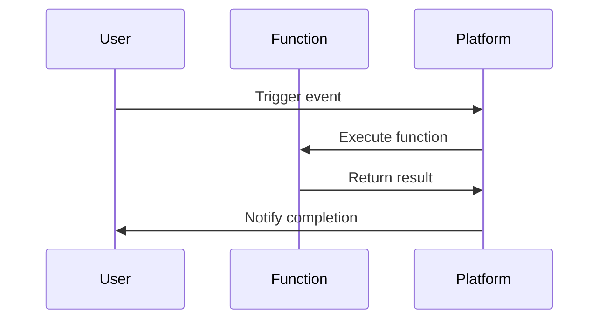
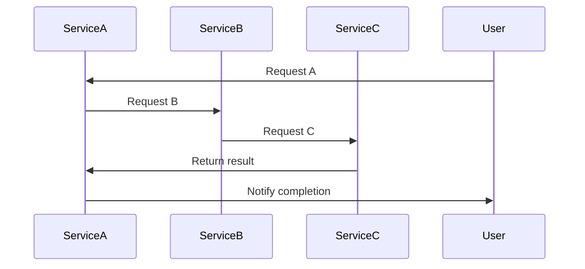

                 

# Serverless架构：无服务器计算的设计模式

关键词：无服务器架构、Serverless、函数即服务、容器即服务、设计模式

摘要：本文将深入探讨无服务器架构（Serverless Architecture）的核心概念和设计模式。通过逻辑清晰、结构紧凑的分析，我们将帮助读者理解无服务器架构的优势和实现方法，并探讨其在现代软件开发中的应用场景。

## Step 1: 背景介绍

### 问题背景

随着云计算技术的飞速发展，服务器管理变得越来越复杂和昂贵。传统服务器架构需要大量服务器资源来部署和维护应用，这不仅增加了成本，还降低了灵活性。为了解决这些问题，无服务器架构（Serverless Architecture）应运而生。

### 问题描述

无服务器架构是一种云服务模型，允许开发人员构建和运行应用程序而无需管理服务器。在这种架构中，云服务提供商负责管理基础设施，包括服务器、网络和存储。开发人员只需关注应用程序的编写、部署和扩展。

### 问题解决

无服务器架构通过抽象基础设施，使得应用程序的部署、运行和管理变得简单和高效。这种架构模式提高了开发效率、降低了成本，并提供了按需扩展的能力。

### 边界与外延

无服务器架构不仅适用于小规模的应用程序开发，还可以用于大规模的企业级应用。它不仅适用于Web应用程序，还适用于移动应用、物联网（IoT）解决方案、数据分析等。

### 概念结构与核心要素组成

无服务器架构的核心要素包括：
- **函数即服务（Functions as a Service, FaaS）：** 通过函数来构建和运行应用程序，无需管理服务器。
- **容器即服务（Containers as a Service, CaaS）：** 提供容器化的应用程序部署和管理。
- **无服务器平台（Serverless Platforms）：** 包括AWS Lambda、Azure Functions、Google Cloud Functions等，提供了无服务器架构的实现。

## Step 2: 无服务器架构的核心概念

### 核心概念

**无服务器架构：** 无需手动管理服务器，云服务提供商负责基础设施的管理。

**函数即服务（FaaS）：** 开发人员只需编写和上传函数，无需关心服务器管理。

**容器即服务（CaaS）：** 提供容器化的应用程序部署和管理。

**无服务器平台：** 提供无服务器架构的实现，如AWS Lambda、Azure Functions等。

### 概念属性特征对比表格

| 概念               | 特点                                                   | 应用场景                            |
|--------------------|--------------------------------------------------------|-----------------------------------|
| 无服务器架构       | 无需管理服务器，按需付费                               | Web应用程序、移动应用、IoT解决方案等 |
| 函数即服务（FaaS） | 编写、上传函数，无需关心服务器管理                     | 自动化任务、数据处理、实时处理等     |
| 容器即服务（CaaS） | 提供容器化的应用程序部署和管理                         | 微服务架构、持续集成和持续部署等     |
| 无服务器平台       | 提供无服务器架构的实现，如AWS Lambda、Azure Functions等 | 大规模企业级应用                   |

### ER实体关系图架构的Mermaid流程图

```mermaid
erDiagram
    User ||--|{ Function } : invokes
    Function ||--|{ Platform } : deployed_on
    Platform ||--|{ ServiceProvider } : provided_by
```

## Step 3: 无服务器架构的设计模式

### 设计模式介绍

无服务器架构的设计模式是一组用于构建无服务器应用程序的最佳实践和指导原则。这些模式可以帮助开发人员优化应用程序的性能、可伸缩性、可靠性和成本效益。

### 设计模式分类

- **事件驱动架构：** 应用程序通过事件触发器来响应外部事件。
- **微服务架构：** 将应用程序分解为独立的、可伸缩的服务。
- **无状态服务：** 服务不存储任何状态信息，每次请求都是独立的。
- **异步处理：** 通过消息队列和异步调用处理任务。

### 设计模式示例

#### 事件驱动架构

**Mermaid流程图：**



**示例说明：**
用户触发一个事件，事件驱动架构中的平台会自动执行相应的函数。函数执行完成后，将结果返回给平台，平台再通知用户。

#### 微服务架构

**Mermaid流程图：**



**示例说明：**
应用程序被分解为多个微服务，每个服务负责处理特定的功能。用户请求一个操作，该操作会触发多个微服务的协作，最终返回结果。

## Step 4: 无服务器架构的应用场景

### 应用场景介绍

无服务器架构适用于多种应用场景，以下是一些常见的应用场景：

- **Web应用程序：** 无服务器架构可以用于构建高性能、可扩展的Web应用程序。
- **移动应用：** 无服务器架构可以简化移动应用的部署和管理，提高开发效率。
- **物联网（IoT）解决方案：** 无服务器架构可以用于处理大量的物联网数据，实现高效的数据处理和实时响应。
- **数据分析：** 无服务器架构可以用于大规模的数据分析任务，提供高效的计算资源。

### 应用案例

- **AWS Lambda：** AWS Lambda 是一种无服务器平台，可以用于构建和运行无服务器应用程序。它可以自动扩展，按需付费，适用于各种应用场景。
- **Azure Functions：** Azure Functions 是一种无服务器平台，可以用于构建和部署无服务器应用程序。它支持多种编程语言，适用于企业级应用。
- **Google Cloud Functions：** Google Cloud Functions 是一种无服务器平台，可以用于构建和运行无服务器应用程序。它支持事件驱动架构，适用于实时数据处理。

## Step 5: 无服务器架构的优势与挑战

### 优势

- **低成本：** 无服务器架构按需付费，可以降低开发和运营成本。
- **高可伸缩性：** 无服务器架构可以自动扩展，适应不同的负载需求。
- **简化管理：** 无服务器架构无需管理服务器，减少了运维工作。
- **灵活性：** 无服务器架构支持多种编程语言和框架，适用于各种应用场景。

### 挑战

- **依赖性：** 无服务器架构依赖云服务提供商，可能面临锁定风险。
- **冷启动：** 无服务器函数在长时间未被调用后，可能会出现冷启动延迟。
- **性能限制：** 无服务器函数的性能可能受到限制，特别是对于计算密集型任务。
- **安全性：** 无服务器架构需要特别关注数据安全和隐私保护。

## Step 6: 无服务器架构的未来发展趋势

### 发展趋势

- **标准化：** 无服务器架构逐渐向标准化方向发展，提高互操作性和兼容性。
- **多云战略：** 企业开始采用多云战略，无服务器架构将更加普及。
- **开源解决方案：** 开源无服务器平台将不断发展，提供更多的选择和灵活性。
- **边缘计算：** 无服务器架构将与边缘计算相结合，提供更高效、低延迟的服务。

## 总结

无服务器架构是一种现代化的软件开发模型，它提供了简单、高效、灵活的解决方案。通过本文的深入分析，读者应该对无服务器架构有了更清晰的认识。无服务器架构不仅适用于小规模的应用程序开发，还可以用于大规模的企业级应用。随着技术的不断发展，无服务器架构将在未来的软件开发中发挥越来越重要的作用。

## 作者信息

作者：AI天才研究院/AI Genius Institute & 禅与计算机程序设计艺术 /Zen And The Art of Computer Programming

感谢您的阅读，希望本文对您理解无服务器架构有所帮助。在探索无服务器架构的道路上，我们期待与您一同前行。

## 拓展阅读

- [AWS Lambda 官方文档](https://aws.amazon.com/lambda/)
- [Azure Functions 官方文档](https://docs.microsoft.com/en-us/azure/azure-functions/)
- [Google Cloud Functions 官方文档](https://cloud.google.com/functions/)

