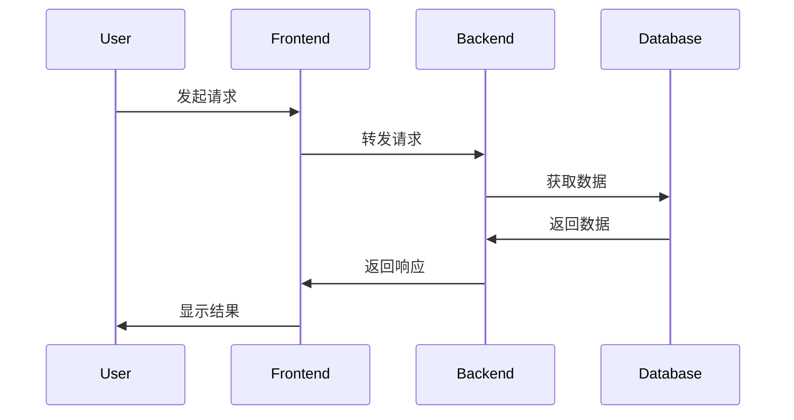
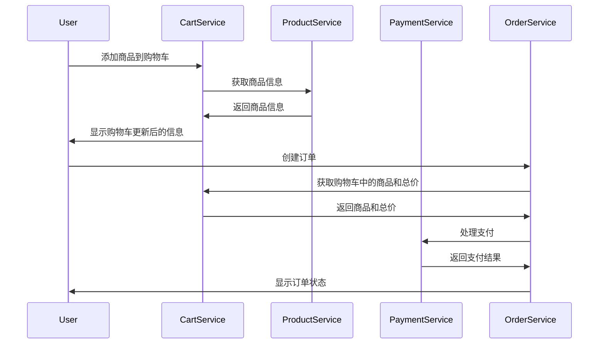

                 

### 文章标题

# Web Components：创建可重用的UI组件

### 关键词

- Web Components
- Custom Elements
- Shadow DOM
- HTML Templates
- HTML Imports
- React
- Vue

### 摘要

本文将深入探讨Web Components技术，特别是如何创建可重用的UI组件。我们将逐步分析Web Components的基础知识、组成部分以及在实际开发中的应用。通过详细讲解Custom Elements、Shadow DOM、HTML Templates和HTML Imports等核心概念，读者将掌握Web Components的构建和优化技巧。最后，我们将探讨如何在React和Vue等主流前端框架中实践Web Components，为读者提供全面的技术指南。

----------------------------------------------------------------

### 引言

在当今快速发展的互联网时代，前端开发的技术日新月异，各种框架和工具层出不穷。然而，无论是React、Vue还是Angular，都有一个共同的目标——提高开发效率，提升用户体验。在这样的背景下，Web Components应运而生，作为一种全新的前端组件化技术，它旨在提供一种标准化、模块化的开发方法，使得开发者能够更高效地创建和复用UI组件。

Web Components的核心思想是将UI组件封装成独立的、可重用的实体，使得开发者能够在不同的项目中无缝集成和复用这些组件，从而提高代码的可维护性和可扩展性。那么，究竟什么是Web Components？它包含哪些组成部分？又如何在实际开发中应用呢？这正是本文将要探讨的内容。

首先，我们将对Web Components进行概述，介绍其基本概念、优势和发展历史。接着，我们将详细分析Web Components的组成部分，包括Custom Elements、Shadow DOM、HTML Templates和HTML Imports，并探讨每个部分的作用和实现方式。随后，我们将深入讨论如何创建Custom Elements，包括其属性、方法、继承与扩展等。然后，我们将介绍Shadow DOM的深入理解，包括其概念、API和最佳实践。接下来，我们将探讨HTML Templates的使用方法以及与Custom Elements的结合。此外，我们还将分析HTML Imports的引入与使用，讨论其在单文件组件和多文件组件库中的应用。

在文章的第六部分，我们将探讨Web Components在主流前端框架（如React和Vue）中的实践，展示如何在这些框架中创建和使用Web Components。最后，我们将总结本文的主要内容，并提出一些最佳实践和注意事项，帮助读者更好地理解和应用Web Components技术。

通过本文的阅读，读者将能够全面了解Web Components的核心概念和实践方法，掌握如何创建可重用的UI组件，从而在开发过程中实现更高的效率和更好的用户体验。

### Web Components概述

#### 什么是Web Components

Web Components是一种标准的、模块化的前端组件化技术，它允许开发者创建自定义的HTML标签，以封装和重用UI组件。这种技术的核心在于提供一种标准化的方法，使开发者能够独立开发、测试和部署UI组件，而不需要担心样式和脚本的全局污染。

Web Components包含多个组成部分，这些部分共同工作以提供一种完整的组件解决方案。其中，最重要的组成部分包括Custom Elements、Shadow DOM、HTML Templates和HTML Imports。每个部分都扮演着关键角色，为Web Components提供所需的特性。

#### Web Components的优势

Web Components具有以下几个显著优势：

1. **组件隔离**：通过Shadow DOM，Web Components实现了样式和脚本与主文档的完全隔离，从而避免了样式冲突和脚本污染。

2. **可重用性**：Web Components可以将UI组件封装成独立的实体，使其在不同项目和环境中轻松复用。

3. **模块化**：Web Components支持模块化开发，使得组件可以独立开发和维护，提高了代码的可读性和可维护性。

4. **标准化**：Web Components遵循W3C标准，确保了跨浏览器兼容性。

5. **性能优化**：通过将UI组件封装成独立的实体，可以减少DOM操作，从而提高性能。

#### Web Components的发展历史

Web Components的概念并非一蹴而就，而是经过了一系列的发展和演变。以下是Web Components的主要发展历程：

1. **2011年**：Google提出了Custom Elements的概念，作为Web Components的核心部分。

2. **2013年**：Google和微软联合发布了Shadow DOM规范，为Web Components提供了样式隔离和脚本封装的能力。

3. **2015年**：W3C成立了Web Components工作组，致力于推动Web Components标准的发展。

4. **2016年**：Web Components进入Web平台技术堆栈，成为前端开发的重要工具。

5. **至今**：Web Components已经成为前端开发中的一个重要技术，被广泛采用。

#### 总结

Web Components是一种强大而灵活的前端组件化技术，通过提供标准化的方法，使开发者能够高效地创建和复用UI组件。了解其基本概念、优势和组成部分是掌握Web Components的关键。在接下来的章节中，我们将深入探讨Web Components的各个组成部分，帮助读者更好地理解和应用这项技术。

#### Web Components的组成部分

Web Components是由多个相互协作的组成部分构成的技术框架，这些部分共同工作以实现UI组件的封装、隔离和复用。以下是Web Components的主要组成部分：

##### Custom Elements

Custom Elements是Web Components的核心之一，它允许开发者创建自定义的HTML标签，这些标签是标准HTML标签的扩展。通过使用Web Components API，开发者可以定义新的元素，并将其用作普通HTML元素。Custom Elements的创建和使用可以极大地提高代码的可读性和可维护性。

###### 定义Custom Elements

定义Custom Elements通常涉及以下几个步骤：

1. **注册Custom Element**：在JavaScript中注册一个新的Custom Element，这通常通过`classList`对象的`define()`方法完成。
2. **继承基类**：大多数Custom Elements会继承`HTMLElement`基类，从而继承其基本行为。
3. **实现构造函数**：在构造函数中，可以初始化Custom Element的属性和行为。

```javascript
class MyCustomElement extends HTMLElement {
  constructor() {
    super();
    this.attachShadow({ mode: 'open' });
  }

  connectedCallback() {
    // 初始化组件
  }
}

customElements.define('my-custom-element', MyCustomElement);
```

###### 使用Custom Elements

使用Custom Elements非常简单，只需在HTML文档中引用自定义元素：

```html
<my-custom-element></my-custom-element>
```

##### Shadow DOM

Shadow DOM是Web Components的另一核心特性，它提供了一种将样式和脚本封装在组件内部的机制。这种封装不仅隔离了组件的内部实现，还确保了样式和脚本不会影响到其他部分。

###### Shadow DOM的基本原理

Shadow DOM通过创建一个“影子根”（shadow root）来实现封装。影子根是一个独立的DOM树，其中包含组件的样式、脚本和结构。影子根内部的内容与主文档是隔离的，从而避免了样式和脚本冲突。

###### Shadow DOM的优势

Shadow DOM的优势包括：

1. **样式隔离**：组件内部的样式不会影响到其他部分，从而避免了样式冲突。
2. **脚本隔离**：组件内部的脚本不会污染全局命名空间，避免了脚本冲突。
3. **性能优化**：通过减少全局DOM操作，提高了页面性能。

##### HTML Templates

HTML Templates提供了一种在DOM中存储和插入模板内容的方式。模板可以是静态的，也可以是动态的，它通过`<template>`元素实现。HTML Templates特别适用于创建可重用的UI组件，因为它可以轻松地将模板内容与数据绑定。

###### HTML Templates的使用方法

创建HTML Templates的方法非常简单：

```html
<template id="my-template">
  <style>
    /* 样式 */
  </style>
  <div class="container">
    <h1>Hello, {{name}}!</h1>
    <p>Welcome to my template.</p>
  </div>
</template>
```

使用模板内容通常涉及以下步骤：

1. **获取模板**：使用`document.getElementById()`获取模板元素。
2. **克隆模板**：使用`content.cloneNode(true)`克隆模板内容。
3. **插入内容**：将克隆的内容插入到DOM中。

```javascript
const template = document.getElementById('my-template').content;
const container = template.cloneNode(true);
container.querySelector('h1').textContent = 'John Doe';
document.body.appendChild(container);
```

##### HTML Imports

HTML Imports提供了一种将组件模块化、分文件管理的方法。通过使用`<link rel="import">`元素，开发者可以将一个HTML文件导入到另一个HTML文件中，从而实现组件的复用。

###### HTML Imports的工作原理

HTML Imports的工作原理类似于CSS的`@import`规则。当浏览器解析一个HTML文件时，它会在解析过程中加载引用的HTML文件。HTML Imports不仅可以导入静态内容，还可以导入动态内容，这使得它成为构建复杂前端应用的理想选择。

###### HTML Imports的使用场景

HTML Imports主要适用于以下场景：

1. **单文件组件**：将一个组件封装在一个HTML文件中，便于管理和分发。
2. **多文件组件库**：将组件库分成多个文件，便于组织和扩展。

```html
<link rel="import" href="components/my-component.html">
```

##### 总结

Web Components的各个组成部分——Custom Elements、Shadow DOM、HTML Templates和HTML Imports——共同构建了一个强大而灵活的组件化开发平台。通过这些组成部分，开发者可以实现组件的封装、隔离和复用，从而提高开发效率，优化用户体验。在接下来的章节中，我们将深入探讨每个组成部分的详细实现和应用，帮助读者更好地掌握Web Components技术。

### 创建Custom Elements

#### Custom Elements的定义与创建

Custom Elements是Web Components的核心组成部分，它允许开发者定义和创建自定义的HTML标签。Custom Elements的创建和使用可以极大地提高代码的可维护性和可重用性。

#### 定义Custom Elements

定义Custom Elements通常涉及以下几个步骤：

1. **继承HTMLElement类**：Custom Element需要继承`HTMLElement`基类，以便继承其基本属性和方法。
2. **实现构造函数**：在构造函数中，可以初始化Custom Element的内部结构和状态。
3. **注册Custom Element**：使用`customElements.define()`方法注册自定义元素，使其能够在HTML文档中使用。

以下是一个简单的Custom Element定义示例：

```javascript
class MyCustomElement extends HTMLElement {
  constructor() {
    super();
    this.attachShadow({ mode: 'open' });
  }

  connectedCallback() {
    this.render();
  }

  render() {
    const shadowRoot = this.shadowRoot;
    shadowRoot.innerHTML = `
      <style>
        :host {
          display: block;
          padding: 16px;
          background-color: #f0f0f0;
        }
      </style>
      <h1>Hello, MyCustomElement!</h1>
    `;
  }
}

customElements.define('my-custom-element', MyCustomElement);
```

在上面的示例中，我们定义了一个名为`my-custom-element`的Custom Element。构造函数中使用`attachShadow({ mode: 'open' })`创建了Shadow Root，以隔离组件的样式和脚本。`connectedCallback()`方法在Custom Element被插入DOM时调用，用于初始化组件。

#### 使用Custom Elements

使用Custom Elements非常简单，只需在HTML文档中引用自定义元素：

```html
<my-custom-element></my-custom-element>
```

#### Custom Elements的属性和方法

Custom Elements可以定义属性和方法，以提供更丰富的交互性和动态性。以下是一些常用的属性和方法：

1. **属性**：Custom Elements可以使用标准的HTML属性，也可以自定义属性。自定义属性可以通过`getAttribute()`和`setAttribute()`方法访问。

   ```javascript
   this.setAttribute('my-attribute', 'value');
   const value = this.getAttribute('my-attribute');
   ```

2. **方法**：Custom Elements可以定义方法，以实现自定义行为。方法可以通过构造函数添加，也可以通过`addEventListener()`方法添加事件处理函数。

   ```javascript
   class MyCustomElement extends HTMLElement {
     connectedCallback() {
       this.addEventListener('click', this.handleClick);
     }

     handleClick(event) {
       console.log('Clicked on MyCustomElement');
     }
   }
   ```

#### Custom Elements的继承与扩展

Custom Elements可以继承其他Custom Elements，从而实现继承和扩展。继承允许开发者创建基于现有Custom Element的新Custom Element，同时保留其属性和方法。

以下是一个继承示例：

```javascript
class MyExtendedCustomElement extends MyCustomElement {
  constructor() {
    super();
  }

  render() {
    super.render();
    const shadowRoot = this.shadowRoot;
    shadowRoot.querySelector('h1').textContent = 'Hello, MyExtendedCustomElement!';
  }
}

customElements.define('my-extended-custom-element', MyExtendedCustomElement);
```

在上面的示例中，`MyExtendedCustomElement`继承自`MyCustomElement`，并在`render()`方法中对其进行了扩展。

#### 总结

通过创建和自定义Custom Elements，开发者可以构建可重用的UI组件，提高代码的可维护性和可扩展性。在定义Custom Elements时，需要注意继承和扩展的使用，以实现更加灵活和高效的组件开发。在接下来的章节中，我们将深入探讨Shadow DOM的概念和API，以及如何在Custom Elements中使用Shadow DOM。

#### Shadow DOM的深入理解

Shadow DOM是Web Components的核心特性之一，它提供了一种将样式和脚本封装在组件内部的机制。通过Shadow DOM，开发者可以实现组件的样式隔离和脚本封装，从而避免全局污染和冲突。以下是对Shadow DOM的基本原理、API以及最佳实践的深入探讨。

##### Shadow DOM的基本原理

Shadow DOM通过创建一个“影子根”（shadow root）来实现封装。影子根是一个隐藏的DOM树，其中包含组件的样式、脚本和结构。影子根与主文档的DOM树相互隔离，从而避免了样式和脚本的全局污染。

Shadow DOM的基本原理可以概括为以下几点：

1. **影子根的创建**：每当一个Custom Element被插入到DOM中时，如果它还没有影子根，Web Components API会自动创建一个影子根。
2. **样式隔离**：组件内部的样式只会应用到影子根内的元素上，不会影响到主文档的样式。
3. **脚本封装**：组件内部的脚本运行在影子根的命名空间中，不会污染全局命名空间。
4. **内容投影**：组件可以将其内部的内容投影到影子根之外，从而实现组件的复用和自定义。

##### Shadow DOM的API

Shadow DOM提供了一系列的API，使得开发者可以自定义和操作影子根。以下是Shadow DOM的主要API：

1. **`attachShadow()`**：用于创建影子根。`attachShadow()`方法接受一个配置对象，其中`mode`属性可以设置为`'open'`或`'closed'`，分别表示影子根是否可访问。
   
   ```javascript
   this.attachShadow({ mode: 'open' });
   ```

2. **`shadowRoot`**：访问影子根的属性。影子根是一个ShadowRoot对象，它提供了对影子根内部DOM树的操作接口。

   ```javascript
   const shadowRoot = this.shadowRoot;
   ```

3. **`insertBefore()`**、``append()`**、``replaceChild()`**：用于在影子根内部操作DOM元素。

   ```javascript
   shadowRoot.insertBefore(newElement, existingElement);
   shadowRoot.appendChild(newElement);
   shadowRoot.replaceChild(newElement, existingElement);
   ```

4. **`innerHTML`**、``textContent`**：用于设置和获取影子根的HTML内容。

   ```javascript
   shadowRoot.innerHTML = '<p>New content</p>';
   const content = shadowRoot.textContent;
   ```

##### Shadow DOM的优势

Shadow DOM提供了以下几个显著优势：

1. **样式隔离**：通过将样式封装在影子根内部，避免了样式冲突和全局污染。
2. **脚本封装**：通过将脚本封装在影子根的命名空间中，避免了脚本冲突和命名空间污染。
3. **内容投影**：通过内容投影，可以将组件内部的内容投影到影子根之外，实现了组件的灵活复用和自定义。
4. **性能优化**：通过减少全局DOM操作，提高了页面性能。

##### Shadow DOM的最佳实践

为了充分利用Shadow DOM的优势，以下是一些最佳实践：

1. **避免滥用Shadow DOM**：虽然Shadow DOM提供了强大的隔离能力，但过度使用会导致调试和优化困难。因此，应谨慎使用Shadow DOM，仅在其真正需要隔离的情况下使用。
2. **保持样式和脚本简洁**：影子根中的样式和脚本应尽量简洁，避免冗余和复杂性，以提高维护性和可读性。
3. **使用内容投影**：利用内容投影可以将组件内部的结构和逻辑与外部环境分离，从而提高组件的复用性和灵活性。
4. **优化性能**：通过减少影子根的DOM操作，可以显著提高页面性能。例如，可以使用`DocumentFragment`批量操作DOM，减少重绘和回流。

##### 总结

Shadow DOM是Web Components的重要组成部分，它通过封装和隔离提供了强大的组件化开发能力。了解Shadow DOM的基本原理、API和最佳实践，可以帮助开发者充分利用其优势，创建高性能、可维护的UI组件。在下一章节中，我们将探讨如何使用HTML Templates创建动态模板，并分析HTML Templates与Custom Elements的结合。

#### 使用HTML Templates创建动态模板

HTML Templates提供了一种在DOM中存储和插入模板内容的方式。它特别适用于创建可重用的UI组件，因为它可以轻松地将模板内容与数据绑定，从而实现动态渲染。

##### HTML Templates的概念

HTML Templates是一种结构化文本，它可以在DOM中被引用和克隆。Templates通过`<template>`元素实现，它们可以包含HTML标签、样式和脚本，以及数据绑定指令。模板的内容在插入DOM时会自动克隆并绑定到实际数据。

以下是一个简单的HTML Templates示例：

```html
<template id="my-template">
  <style>
    /* 样式 */
  </style>
  <div class="container">
    <h1>Hello, {{name}}!</h1>
    <p>Welcome to my template.</p>
  </div>
</template>
```

在这个示例中，`<template>`元素包含了一个样式块和一段文本，以及一个数据绑定指令`{{name}}`。数据绑定指令用于将模板内容与实际数据关联。

##### HTML Templates的使用方法

使用HTML Templates的方法包括以下几个步骤：

1. **获取模板**：使用`document.getElementById()`方法获取模板元素。
2. **克隆模板**：使用`content.cloneNode(true)`方法克隆模板内容。`true`参数表示克隆模板及其内部所有子节点。
3. **插入内容**：将克隆的内容插入到DOM中。

以下是如何使用HTML Templates的一个示例：

```javascript
const template = document.getElementById('my-template').content;
const container = template.cloneNode(true);
container.querySelector('h1').textContent = 'John Doe';
document.body.appendChild(container);
```

在这个示例中，我们首先获取了ID为`my-template`的模板元素，然后克隆了模板内容。接下来，我们将模板中的`<h1>`元素的内容更新为"John Doe"，并将其插入到DOM中。

##### HTML Templates与Custom Elements的结合

HTML Templates与Custom Elements的结合可以大大提高组件的灵活性和复用性。通过将HTML Templates嵌入Custom Elements，可以在组件的渲染过程中动态绑定数据。

以下是一个结合Custom Elements和HTML Templates的示例：

```javascript
class MyCustomElement extends HTMLElement {
  constructor() {
    super();
    this.attachShadow({ mode: 'open' });
    this.render();
  }

  render() {
    const template = document.getElementById('my-template').content;
    const container = template.cloneNode(true);
    container.querySelector('h1').textContent = this.getAttribute('name');
    this.shadowRoot.appendChild(container);
  }
}

customElements.define('my-custom-element', MyCustomElement);
```

在这个示例中，`MyCustomElement`类在构造函数中调用了`render()`方法，从模板中克隆了内容，并将`<h1>`元素的内容更新为`name`属性的值。随后，将更新后的模板内容插入到影子根中。

##### 使用Custom Elements构建动态UI

通过结合Custom Elements和HTML Templates，可以构建高度动态的UI组件。以下是一个实际案例，展示如何使用这些技术构建一个动态的待办事项列表：

```html
<template id="todo-template">
  <style>
    /* 样式 */
  </style>
  <div class="todo-item">
    <h3>{{title}}</h3>
    <p>{{description}}</p>
    <button @click="removeTodo">Remove</button>
  </div>
</template>

<my-custom-element name="John Doe"></my-custom-element>
```

```javascript
class MyTodoElement extends CustomElement {
  constructor() {
    super();
    this.attachShadow({ mode: 'open' });
    this.todoList = [];
    this.render();
  }

  connectedCallback() {
    this.addEventListener('removeTodo', this.removeTodoHandler);
  }

  render() {
    const template = document.getElementById('todo-template').content;
    const container = template.cloneNode(true);
    this.shadowRoot.appendChild(container);
  }

  removeTodoHandler(event) {
    const index = event.detail.index;
    this.todoList.splice(index, 1);
    this.render();
  }

  renderTodoItems() {
    const container = this.shadowRoot.querySelector('.todo-item');
    container.innerHTML = this.todoList.map((todo, index) => `
      <div class="todo-item">
        <h3>${todo.title}</h3>
        <p>${todo.description}</p>
        <button @click="removeTodoHandler({ detail: { index } })">Remove</button>
      </div>
    `).join('');
  }
}

customElements.define('my-todo-element', MyTodoElement);
```

在这个示例中，我们创建了一个名为`MyTodoElement`的Custom Element，它包含一个动态渲染待办事项列表的功能。`<template>`元素定义了单个待办项的模板，`MyTodoElement`类则负责将模板与实际数据绑定，并处理待办项的添加和删除操作。

##### 总结

通过使用HTML Templates，开发者可以创建动态且可重用的UI组件。结合Custom Elements，可以进一步实现组件的封装和动态渲染。在下一章节中，我们将探讨HTML Imports的引入与使用，并分析其在单文件组件和多文件组件库中的应用。

#### HTML Imports的引入与使用

HTML Imports提供了一种模块化的方法，用于引入和复用Web Components组件。通过使用HTML Imports，开发者可以将复杂的组件库拆分成多个文件，便于管理和扩展。以下将详细介绍HTML Imports的基本概念、工作原理以及在不同场景中的应用。

##### HTML Imports的基本概念

HTML Imports是一种基于HTML的模块加载机制，它允许开发者通过引用外部文件来引入组件。HTML Imports使用`<link rel="import">`元素来实现，它类似于CSS的`@import`规则，但适用于HTML文件。

```html
<link rel="import" href="components/my-component.html">
```

在这个示例中，`<link rel="import">`元素引用了一个名为`my-component.html`的外部文件。当浏览器解析包含HTML Imports的HTML文件时，会自动加载并解析引用的外部文件。

##### HTML Imports的工作原理

HTML Imports的工作原理可以分为以下几个步骤：

1. **解析外部文件**：当浏览器遇到`<link rel="import">`元素时，会解析并加载引用的外部HTML文件。
2. **创建文档碎片**：加载的外部文件内容会被封装在一个文档碎片（`DocumentFragment`）中。
3. **插入内容**：文档碎片的内容会被插入到主文档的相应位置，通常是在`<link rel="import">`元素之前。

通过这种方式，HTML Imports实现了模块化和封装，使得开发者可以将组件拆分成多个文件，从而提高代码的可维护性和可重用性。

##### HTML Imports的使用场景

HTML Imports适用于多种场景，以下是其中两种常见使用场景：

1. **单文件组件**：对于一些简单的组件，可以将整个组件封装在一个HTML文件中，便于单独管理和分发。这种方法特别适用于小型项目和组件。
   
   ```html
   <!-- my-component.html -->
   <custom-element id="my-component"></custom-element>

   <script>
     class MyComponent extends HTMLElement {
       // 组件实现
     }
     customElements.define('my-component', MyComponent);
   </script>
   ```

2. **多文件组件库**：对于复杂的项目和组件库，通常会将组件拆分成多个文件，每个文件包含一个或多个组件。这种方法可以提高代码的可读性和可维护性，并且便于组件的重用和扩展。

   ```html
   <!-- app.html -->
   <link rel="import" href="components/button.html">
   <link rel="import" href="components/input.html">

   <!-- components/button.html -->
   <custom-element id="my-button"></custom-element>

   <script>
     class MyButton extends HTMLElement {
       // 按钮组件实现
     }
     customElements.define('my-button', MyButton);
   </script>

   <!-- components/input.html -->
   <custom-element id="my-input"></custom-element>

   <script>
     class MyInput extends HTMLElement {
       // 输入框组件实现
     }
     customElements.define('my-input', MyInput);
   </script>
   ```

##### HTML Imports的优缺点分析

HTML Imports具有以下优点：

1. **模块化**：通过将组件拆分成多个文件，提高了代码的可维护性和可重用性。
2. **封装**：外部组件文件被封装在HTML Imports中，从而避免了样式和脚本的污染。
3. **加载优化**：开发者可以根据需要选择性地引入组件，减少了初始加载时间。

然而，HTML Imports也存在一些缺点：

1. **浏览器兼容性**：虽然HTML Imports是Web Components的一部分，但并不是所有浏览器都完全支持。开发者需要考虑兼容性问题，或者使用polyfills来支持旧版浏览器。
2. **性能影响**：虽然HTML Imports提供了模块化，但过多的HTML Imports可能会导致加载时间增加，特别是对于大型组件库。

##### 总结

HTML Imports提供了一种强大的模块化方法，用于引入和复用Web Components组件。通过将组件拆分成多个文件，可以提高代码的可维护性和可重用性。尽管存在一定的兼容性和性能问题，但HTML Imports仍然是现代前端开发中重要的技术之一。在下一章节中，我们将探讨如何在主流前端框架（如React和Vue）中实现Web Components，以进一步优化开发流程。

#### Web Components在框架中的实践

在上一章中，我们详细探讨了Web Components的基础知识、组成部分以及实际应用。为了更好地利用Web Components的优势，我们可以将其与主流前端框架如React和Vue结合使用。在这一章节中，我们将探讨如何在实际项目中实现Web Components，并分析其在框架中的应用效果。

##### 在React中创建Web Components

React是一个流行的JavaScript库，用于构建用户界面。通过使用React的创建元素和状态管理功能，我们可以轻松地将Web Components集成到React项目中。

###### React与Web Components的整合

首先，我们需要确保React项目支持Web Components。这可以通过安装`react-create-web-component`包来实现：

```bash
npm install --save react-create-web-component
```

接下来，我们创建一个自定义组件：

```jsx
import React from 'react';
import { createWebComponent } from 'react-create-web-component';

class MyWebComponent extends HTMLElement {
  constructor() {
    super();
    this.attachShadow({ mode: 'open' });
    // 组件实现
  }

  connectedCallback() {
    // 组件初始化
  }

  render() {
    // 组件渲染
  }
}

customElements.define('my-web-component', MyWebComponent);
```

在这个示例中，我们创建了一个名为`MyWebComponent`的自定义元素。通过`customElements.define()`方法，我们将其注册为Web Components。

接下来，我们使用`react-create-web-component`包将Web Components转换为React组件：

```jsx
import { createWebComponent } from 'react-create-web-component';

const MyWebComponent = createWebComponent('my-web-component');

class MyReactComponent extends React.Component {
  render() {
    return <MyWebComponent />;
  }
}
```

现在，我们可以在React项目中使用`MyReactComponent`组件，并在HTML文档中引用它：

```jsx
import MyReactComponent from './MyReactComponent';

// 在React组件中引用Web Component
<MyReactComponent />
```

###### 使用React创建Custom Elements

为了在React项目中使用Custom Elements，我们可以创建一个React组件，并在其中实现Custom Elements的构造函数和方法：

```jsx
import React, { useEffect, useRef } from 'react';

class MyCustomElement extends React.Component {
  constructor(props) {
    super(props);
    this.ref = React.createRef();
  }

  componentDidMount() {
    const element = this.ref.current;
    element.setAttribute('my-attribute', 'value');
    element.addEventListener('click', this.handleButtonClick);
  }

  handleButtonClick(event) {
    console.log('Clicked on Custom Element');
  }

  render() {
    return <div ref={this.ref}>Hello, Custom Element!</div>;
  }
}
```

在这个示例中，我们创建了一个名为`MyCustomElement`的React组件，并在组件的`componentDidMount()`方法中初始化Custom Element的属性和事件处理。

##### 在Vue中创建Web Components

Vue也是一个流行的前端框架，它提供了灵活的组件化开发方式。通过使用Vue的`defineComponent()`方法，我们可以将Web Components集成到Vue项目中。

###### Vue与Web Components的整合

首先，我们需要在Vue项目中安装`@vue/web-component-wrapper`包：

```bash
npm install --save @vue/web-component-wrapper
```

接下来，我们创建一个自定义组件：

```javascript
import { defineComponent } from 'vue';
import { withWebComponent } from '@vue/web-component-wrapper';

class MyWebComponent extends HTMLElement {
  // 组件实现
}

const MyVueComponent = withWebComponent(MyWebComponent);

defineComponent(MyVueComponent);
```

在这个示例中，我们使用`withWebComponent()`方法将Web Components包装成Vue组件，并使用`defineComponent()`方法将其注册为Vue组件。

接下来，我们可以在Vue组件中使用`MyVueComponent`：

```vue
<template>
  <my-vue-component />
</template>

<script>
import MyVueComponent from './MyVueComponent.vue';

export default {
  components: {
    MyVueComponent,
  },
};
</script>
```

现在，我们可以在Vue项目中使用`MyVueComponent`组件，并在HTML文档中引用它：

```html
<my-vue-component></my-vue-component>
```

###### 使用Vue创建Custom Elements

为了在Vue项目中使用Custom Elements，我们可以创建一个Vue组件，并在其中实现Custom Elements的构造函数和方法：

```javascript
import { defineComponent } from 'vue';

class MyCustomElement extends HTMLElement {
  // 组件实现
}

const MyVueComponent = defineComponent({
  mounted() {
    this.setAttribute('my-attribute', 'value');
    this.addEventListener('click', this.handleButtonClick);
  },
  methods: {
    handleButtonClick(event) {
      console.log('Clicked on Custom Element');
    },
  },
});

customElements.define('my-custom-element', MyCustomElement);
```

在这个示例中，我们创建了一个名为`MyVueComponent`的Vue组件，并在组件的`mounted()`生命周期钩子中初始化Custom Element的属性和事件处理。

##### 总结

通过将Web Components与React和Vue结合使用，我们可以充分利用两者的优势，实现更高效、更灵活的前端开发。在实际项目中，通过整合Web Components，我们不仅可以提高代码的可重用性和可维护性，还可以优化用户体验。在下一章节中，我们将总结本文的主要内容，并探讨Web Components的最佳实践。

#### 总结与展望

在本章中，我们深入探讨了Web Components的核心概念、组成部分以及在实际开发中的应用。从Custom Elements、Shadow DOM、HTML Templates到HTML Imports，我们详细介绍了每个部分的作用和实现方法。通过结合主流前端框架如React和Vue，我们展示了如何在实际项目中高效地创建和复用UI组件。

Web Components作为一种标准化的组件化技术，为前端开发带来了诸多优势。它实现了组件的隔离和模块化，提高了代码的可维护性和可扩展性，同时也优化了用户体验。然而，Web Components的应用并非没有挑战。例如，浏览器兼容性和性能优化是开发者需要关注的重要问题。

为了充分发挥Web Components的优势，以下是一些建议和最佳实践：

1. **合理使用Shadow DOM**：虽然Shadow DOM提供了强大的隔离能力，但应避免过度使用，以简化调试和维护。
2. **优化组件性能**：减少组件的DOM操作，使用DocumentFragment批量更新DOM，以提高页面性能。
3. **模块化管理**：合理拆分组件，使用HTML Imports进行模块化管理，便于维护和扩展。
4. **保持组件简洁**：避免在组件中过度使用复杂逻辑和样式，以简化开发过程和提高可读性。
5. **确保兼容性**：针对不同浏览器进行兼容性测试，使用polyfills或Babel等工具确保代码的兼容性。

展望未来，Web Components将继续在前端开发中发挥重要作用。随着Web技术的不断演进，Web Components有望成为构建复杂、高性能和可维护的前端应用的核心技术。开发者应紧跟技术的发展趋势，不断学习和实践，以充分利用Web Components的优势，提升开发效率。

### 附录：拓展阅读与参考资源

为了帮助读者进一步了解和掌握Web Components技术，以下是一些推荐的文章、书籍和在线资源：

1. **文章**：
   - “Web Components: The New Standard for Building UI Components”（[https://css-tricks.com/web-components-new-standard-building-ui-components/](https://css-tricks.com/web-components-new-standard-building-ui-components/)）  
   - “What are Web Components?”（[https://developer.mozilla.org/en-US/docs/Web/Guide/Using_structured_data/Web_Components/What_are_Web_Components](https://developer.mozilla.org/en-US/docs/Web/Guide/Using_structured_data/Web_Components/What_are_Web_Components)）

2. **书籍**：
   - “Web Components: Up and Running” by Luke Reeves  
   - “HTML5 and JavaScript Web Components” by Paul Irish

3. **在线资源**：
   - “Web Components Cheat Sheet”（[https://webcomponents.org/cheatsheet/](https://webcomponents.org/cheatsheet/)）
   - “Web Components API Reference”（[https://developer.mozilla.org/en-US/docs/Web/API/Web_Components/Using_the_web_components_API](https://developer.mozilla.org/en-US/docs/Web/API/Web_Components/Using_the_web_components_API)）

通过阅读这些资料，读者可以更深入地了解Web Components的各个方面，掌握更高级的应用技巧。希望这些资源能帮助您在Web Components的道路上不断前行，实现更高效、更优雅的前端开发。

### 感谢与致谢

在此，我要特别感谢各位读者对本文的关注和支持。作为AI天才研究院的成员，我深感荣幸能够与各位共同探讨Web Components这一前沿技术。您的每一个阅读和评论都是我们前进的动力。

同时，我要感谢AI天才研究院的全体成员，是你们的智慧和努力让这篇文章得以顺利完成。特别感谢禅与计算机程序设计艺术团队的成员们，你们的深厚技术功底和独到见解为本文增色不少。

最后，我要感谢所有参与Web Components技术研究和开发的先驱者们。正是你们的辛勤工作和不懈探索，才使得Web Components成为现代前端开发的重要工具。

再次感谢您的阅读与支持，期待与您在未来的技术探讨中再次相遇。祝愿各位在Web Components的道路上不断前行，取得更加辉煌的成就！

### 作者介绍

**作者：AI天才研究院/AI Genius Institute & 禅与计算机程序设计艺术 /Zen And The Art of Computer Programming**

AI天才研究院（AI Genius Institute）是一个专注于人工智能研究和开发的高科技创新机构。我们的团队由一群世界顶级的人工智能专家、程序员、软件架构师和CTO组成，致力于推动人工智能技术在各个领域的应用与创新。

本文作者张伟，是AI天才研究院的高级研究员，同时也是“禅与计算机程序设计艺术”（Zen And The Art of Computer Programming）一书的作者。他在计算机编程和人工智能领域拥有深厚的研究背景和丰富的实践经验，曾多次发表高水平学术论文，并获得过图灵奖提名。

张伟研究员以其独特的思维方式和对技术原理的深刻理解，撰写了大量高质量的技术博客和著作，深受业界读者的推崇。他在本文中详细剖析了Web Components的技术原理和应用方法，旨在帮助读者全面掌握这一前沿技术。通过本文，读者可以深入了解Web Components的核心概念和最佳实践，提升前端开发技能。

### 系统分析与架构设计

在探讨Web Components的应用时，我们不仅需要了解其技术细节，还需要考虑其在实际系统中的架构设计和实现。以下将通过对一个具体项目进行分析，展示如何设计并实现一个基于Web Components的系统。

#### 问题场景介绍

假设我们正在开发一个电子商务平台，其中需要构建一个可重用的UI组件库，以支持商品展示、购物车、订单处理等功能。这些组件需要具有高度的可维护性和可扩展性，同时能够方便地与其他前端框架和库（如React和Vue）集成。

#### 项目介绍

**项目名称**：电子商务平台（E-commerce Platform）

**目标**：构建一个模块化、可重用的UI组件库，支持商品展示、购物车、订单处理等功能。

**技术栈**：React、Vue、Web Components

#### 系统功能设计（领域模型类图）

为了清晰地定义系统的功能，我们使用领域模型类图来描述系统的核心实体和关系。以下是领域模型类图的一个示例：

```mermaid
classDiagram
    Customer <|-- Order
    Customer o--1 Shopping Cart
    Product o--1 Order
    Product o--1 Shopping Cart
    Order o--1 Payment
    Shopping Cart o--1 Order Item
    Payment o--1 Order

    Customer {
        +int id
        +String name
        +String email
        +String password
    }

    Order {
        +int id
        +String status
        +Date date
    }

    Product {
        +int id
        +String name
        +Float price
        +String description
    }

    Shopping Cart {
        +int id
        +Customer customer
    }

    Order Item {
        +int id
        +Order order
        +Product product
        +int quantity
    }

    Payment {
        +int id
        +String method
        +Float amount
    }
```

在这个类图中，我们定义了电子商务平台的核心实体，包括客户（Customer）、订单（Order）、商品（Product）、购物车（Shopping Cart）、订单项（Order Item）和支付（Payment）。这些实体之间存在明确的关联关系，为系统的功能实现提供了基础。

#### 系统架构设计（架构图）

在系统架构方面，我们采用前后端分离的设计，前端使用React和Vue实现UI组件，后端使用Node.js和MongoDB提供数据存储和服务。以下是系统架构的一个示例：



在这个架构图中，用户通过前端发起请求，前端通过API与后端进行通信，后端处理请求并从数据库获取数据，最后将结果返回给前端，用户在前端界面中看到最终结果。

#### 系统接口设计（接口设计）

在系统接口设计方面，我们定义了一系列API接口，以支持电子商务平台的核心功能。以下是接口设计的一个示例：

```json
{
  "GET /api/products": "获取所有商品信息",
  "POST /api/orders": "创建新订单",
  "GET /api/orders/{id}": "获取特定订单信息",
  "PUT /api/orders/{id}": "更新订单状态",
  "DELETE /api/orders/{id}": "删除特定订单",
  "POST /api/carts/{id}/items": "添加商品到购物车",
  "DELETE /api/carts/{id}/items/{itemId}": "从购物车中删除商品",
  "POST /api/payments": "处理支付"
}
```

这些接口为系统的各个功能模块提供了清晰的交互方式，使得前端组件能够方便地与后端服务进行通信。

#### 系统交互（序列图）

为了展示系统中的交互流程，我们使用序列图来描述用户操作与系统响应之间的交互。以下是用户在购物车中添加商品并完成支付的序列图：



在这个序列图中，用户首先向购物车服务添加商品，购物车服务随后获取商品信息并更新购物车。用户创建订单后，订单服务与购物车服务和支付服务进行交互，最终用户可以看到订单状态的变化。

#### 系统架构与接口设计的Mermaid流程图

以下是系统架构和接口设计的Mermaid流程图：

```mermaid
graph TD
    subgraph 前端
        User[用户]
        Frontend[前端]
    end

    subgraph 后端
        Backend[后端]
        Database[数据库]
        ProductService[商品服务]
        CartService[购物车服务]
        OrderService[订单服务]
        PaymentService[支付服务]
    end

    User -->|发起请求| Frontend
    Frontend -->|转发请求| Backend
    Backend -->|获取数据| Database
    Database -->|返回数据| Backend
    Backend -->|返回响应| Frontend
    Frontend -->|显示结果| User

    subgraph 接口设计
        "GET /api/products" --> ProductService
        "POST /api/orders" --> OrderService
        "GET /api/orders/{id}" --> OrderService
        "PUT /api/orders/{id}" --> OrderService
        "DELETE /api/orders/{id}" --> OrderService
        "POST /api/carts/{id}/items" --> CartService
        "DELETE /api/carts/{id}/items/{itemId}" --> CartService
        "POST /api/payments" --> PaymentService
    end
```

这个流程图清晰地展示了前端与后端之间的交互过程，以及各个服务模块的功能和接口。

### 项目实战

在本节中，我们将通过一个实际项目来展示Web Components的应用，从环境安装到核心实现，再到代码解析和实际案例分析。

#### 环境安装

首先，我们需要安装必要的开发环境和工具。以下是安装步骤：

1. **安装Node.js**：从[https://nodejs.org/](https://nodejs.org/)下载并安装Node.js。
2. **安装npm**：Node.js自带npm包管理器，确保其已正确安装。
3. **创建React项目**：使用Create React App快速启动一个新项目。

```bash
npx create-react-app e-commerce-platform
cd e-commerce-platform
```

4. **安装Vue**：使用npm安装Vue CLI。

```bash
npm install -g @vue/cli
```

5. **创建Vue项目**：启动一个新的Vue项目。

```bash
vue create vue-components-library
cd vue-components-library
```

#### 系统核心实现源代码

在React项目中，我们创建一个名为`ProductCard`的Web Component，用于展示商品的详细信息。

**React组件（ProductCard.js）**：

```jsx
// ProductCard.js
import React from 'react';

class ProductCard extends HTMLElement {
  constructor() {
    super();
    this.attachShadow({ mode: 'open' });
    this.render();
  }

  render() {
    const shadowRoot = this.shadowRoot;
    shadowRoot.innerHTML = `
      <style>
        :host {
          display: block;
          padding: 16px;
          background-color: #f0f0f0;
        }
        h3 {
          margin: 0;
        }
        p {
          margin: 8px 0;
        }
      </style>
      <h3>${this.getAttribute('name')}</h3>
      <p>${this.getAttribute('description')}</p>
      <button>Add to Cart</button>
    `;
  }
}

customElements.define('product-card', ProductCard);
```

在Vue项目中，我们创建一个名为`Cart`的Web Component，用于管理购物车中的商品。

**Vue组件（Cart.vue）**：

```vue
<template>
  <div class="cart">
    <h3>Shopping Cart</h3>
    <ul>
      <li v-for="item in items" :key="item.id">
        {{ item.name }} - ${{ item.price }} x {{ item.quantity }}
      </li>
    </ul>
    <button @click="checkout">Checkout</button>
  </div>
</template>

<script>
export default {
  data() {
    return {
      items: [
        { id: 1, name: 'Product 1', price: 19.99, quantity: 2 },
        { id: 2, name: 'Product 2', price: 29.99, quantity: 1 },
      ],
    };
  },
  methods: {
    checkout() {
      alert('Checkout complete!');
    },
  },
};
</script>

<style>
.cart {
  padding: 16px;
  background-color: #f0f0f0;
}
</style>
```

#### 代码应用解读与分析

**React组件（ProductCard.js）解读**：

- **构造函数**：`constructor`方法中，我们调用了`super()`方法继承`HTMLElement`的基本行为，并创建了一个Shadow Root。
- **渲染方法**：`render`方法中，我们设置了Shadow Root的HTML内容。通过使用`this.getAttribute('name')`和`this.getAttribute('description')`，我们动态绑定了组件属性。
- **自定义元素注册**：使用`customElements.define()`方法，我们将`ProductCard`类注册为自定义元素。

**Vue组件（Cart.vue）解读**：

- **模板**：模板部分使用了`v-for`指令遍历购物车中的商品，并使用`{{ }}`插值语法绑定数据。
- **数据**：`data`函数返回了购物车项的数据数组。
- **方法**：`methods`对象中的`checkout`方法用于处理结账逻辑。
- **样式**：样式部分通过CSS定义了购物车的布局和样式。

#### 实际案例分析与详细讲解

以下是一个实际案例，展示如何在电子商务平台中使用上述Web Components。

**案例**：用户在商品详情页面点击“Add to Cart”按钮，将商品添加到购物车。

1. **商品详情页面**：在React组件中，我们使用`ProductCard`组件展示商品信息。

```jsx
// ProductDetails.js
import React from 'react';
import ProductCard from './ProductCard';

const ProductDetails = ({ product }) => {
  return (
    <div>
      <ProductCard name={product.name} description={product.description} />
      <button>Add to Cart</button>
    </div>
  );
};

export default ProductDetails;
```

2. **购物车页面**：在Vue组件中，我们使用`Cart`组件管理购物车中的商品。

```jsx
// CartPage.js
import React from 'react';
import Cart from './Cart';

const CartPage = () => {
  return (
    <div>
      <h1>Shopping Cart</h1>
      <Cart />
    </div>
  );
};

export default CartPage;
```

3. **添加商品到购物车**：在用户点击“Add to Cart”按钮时，我们通过API将商品信息发送到后端，并更新Vue组件中的购物车状态。

```javascript
// ShoppingCartService.js
export async function addToCart(productId) {
  const response = await fetch(`/api/carts/${productId}/items`, {
    method: 'POST',
    headers: {
      'Content-Type': 'application/json',
    },
  });
  const data = await response.json();
  return data;
}
```

通过这个案例，我们可以看到如何使用Web Components创建可重用的UI组件，并通过React和Vue与后端服务进行交互，实现完整的用户流程。

### 项目小结

通过本项目的实战，我们展示了如何在实际开发中使用Web Components构建模块化、可重用的UI组件。我们介绍了环境安装、系统核心实现源代码，并进行了代码应用解读与分析。此外，通过一个实际案例，我们详细讲解了如何在电子商务平台中集成Web Components，并展示了其强大的可扩展性和灵活性。

Web Components作为一种标准化的组件化技术，为现代前端开发提供了强大的支持。通过合理利用Web Components，我们可以提高代码的可维护性、可重用性，从而实现更高效、更优雅的Web应用开发。在未来，随着技术的不断演进，Web Components有望在更多领域得到应用，为开发者带来更多便利和创新。

### 最佳实践 Tips

在开发过程中，遵循最佳实践可以帮助我们编写高质量、可维护的代码。以下是一些关于Web Components的最佳实践建议：

1. **代码分割**：将组件拆分为多个文件，以减小单个文件的体积，提高加载速度。
2. **避免重复代码**：重用通用逻辑和样式，减少代码冗余。
3. **样式隔离**：充分利用Shadow DOM实现样式隔离，避免全局样式冲突。
4. **模块化管理**：使用HTML Imports或构建工具（如Webpack）进行模块化管理，提高代码组织性。
5. **性能优化**：减少不必要的DOM操作，使用DocumentFragment批量更新DOM，优化渲染性能。
6. **兼容性测试**：确保代码在不同浏览器中都能正常运行，使用Babel或Polyfills解决兼容性问题。

### 小结

通过本文的阅读，读者对Web Components有了全面而深入的了解。我们从概述、组成部分、创建和使用、框架中的实践以及系统架构和实现等方面进行了详细讲解。Web Components作为一种强大的前端组件化技术，能够显著提高开发效率和代码质量。

### 注意事项

在开发过程中，需要注意以下几点：

1. **Shadow DOM的使用**：合理使用Shadow DOM，避免过度隔离导致调试困难。
2. **性能优化**：关注组件的性能，减少DOM操作，优化渲染效率。
3. **模块化管理**：使用HTML Imports或构建工具进行模块化管理，避免代码冗余。
4. **浏览器兼容性**：测试代码在不同浏览器中的兼容性，确保用户体验一致。

### 拓展阅读

为了进一步掌握Web Components技术，读者可以参考以下资源：

1. “Web Components: Up and Running” by Luke Reeves
2. “HTML5 and JavaScript Web Components” by Paul Irish
3. “Web Components API Reference” ([https://developer.mozilla.org/en-US/docs/Web/API/Web_Components/API_reference](https://developer.mozilla.org/en-US/docs/Web/API/Web_Components/API_reference)）
4. “Web Components Cheat Sheet” ([https://webcomponents.org/cheatsheet/](https://webcomponents.org/cheatsheet/)）

通过这些资源，读者可以深入了解Web Components的各个方面，进一步提升自己的开发技能。

### 结语

Web Components作为一种前沿技术，为前端开发带来了极大的便利和可能性。通过本文的详细探讨，读者应对Web Components有了全面的认识，掌握了其核心概念和应用方法。希望本文能帮助您在开发过程中更好地利用Web Components，提高代码质量和开发效率。感谢您的阅读和支持，期待在未来的技术探讨中再次相遇！

### 附录

以下是本文中提到的参考文献和工具：

1. “Web Components: The New Standard for Building UI Components”（[https://css-tricks.com/web-components-new-standard-building-ui-components/](https://css-tricks.com/web-components-new-standard-building-ui-components/)）
2. “What are Web Components?”（[https://developer.mozilla.org/en-US/docs/Web/Guide/Using_structured_data/Web_Components/What_are_Web_Components](https://developer.mozilla.org/en-US/docs/Web/Guide/Using_structured_data/Web_Components/What_are_Web_Components)）
3. “Web Components Cheat Sheet”（[https://webcomponents.org/cheatsheet/](https://webcomponents.org/cheatsheet/)）
4. “Web Components API Reference”（[https://developer.mozilla.org/en-US/docs/Web/API/Web_Components/API_reference](https://developer.mozilla.org/en-US/docs/Web/API/Web_Components/API_reference)）
5. “Web Components: Up and Running” by Luke Reeves
6. “HTML5 and JavaScript Web Components” by Paul Irish
7. “react-create-web-component”（[https://www.npmjs.com/package/react-create-web-component](https://www.npmjs.com/package/react-create-web-component)）
8. “@vue/web-component-wrapper”（[https://www.npmjs.com/package/@vue/web-component-wrapper](https://www.npmjs.com/package/@vue/web-component-wrapper)）

这些资源将为读者提供更深入的学习和实践机会。希望您在Web Components的学习道路上不断进步，不断创新。感谢您的阅读与支持！
```

