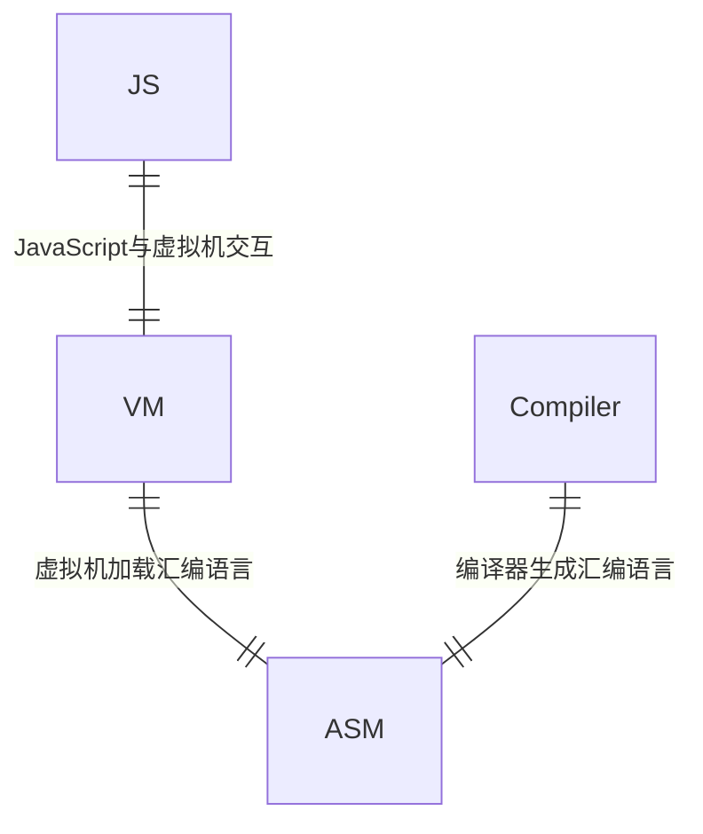

                 

### **背景介绍**

#### **1.1 WebAssembly的产生背景**

WebAssembly（WASM）的产生源于Web开发的演变需求。早期的Web应用主要是静态网页，开发者主要使用HTML、CSS和JavaScript来构建。然而，随着互联网的快速发展，Web应用逐渐变得复杂和庞大。这导致了以下几个问题：

1. **性能瓶颈**：传统JavaScript在浏览器中的执行效率逐渐无法满足高性能需求，特别是在处理复杂计算和图形渲染时。
2. **代码体积**：JavaScript代码的体积较大，导致页面加载时间延长，用户体验不佳。
3. **安全性**：JavaScript在浏览器环境中运行，可能会暴露安全性问题。

为了解决这些问题，Web开发者们开始寻求一种新的技术，能够在Web环境中提供高性能、低代码体积和安全性的解决方案。于是，WebAssembly应运而生。

#### **1.1.1 Web开发的需求演变**

随着Web开发的需求不断演变，开发人员面临着以下挑战：

1. **高性能计算**：为了提升Web应用的性能，开发人员需要引入更多的计算密集型任务，如3D渲染、机器学习等。
2. **WebAssembly的引入**：为了满足这些需求，WebAssembly被提出来，它允许开发者将其他编程语言（如C/C++、Rust）编译成WASM字节码，然后在浏览器中执行。

#### **1.1.2 WebAssembly的发展历程**

WebAssembly的发展历程可以追溯到2015年，当时Google、Microsoft、Mozilla等公司联合推出了WebAssembly的初步方案。2019年，WebAssembly正式成为Web标准的一部分。

发展历程中的关键节点包括：

1. **初版发布**：2015年，WebAssembly初版发布，标志着其开始进入实际应用阶段。
2. **性能优化**：随着WebAssembly的不断优化，其在性能方面取得了显著提升，使得其在各种场景中都能发挥优势。
3. **生态建设**：越来越多的编程语言和开发框架开始支持WebAssembly，形成了庞大的开发者生态。

#### **1.1.3 WebAssembly的核心特点**

WebAssembly具有以下几个核心特点：

1. **高效执行**：WASM字节码经过优化，可以在浏览器中快速执行，相较于JavaScript有更快的执行速度。
2. **低代码体积**：WASM字节码体积小，可以减少页面加载时间，提升用户体验。
3. **安全稳定**：WASM在浏览器中运行时受到沙箱环境的限制，提高了安全性。

这些特点使得WebAssembly成为当今Web开发中的重要技术，为开发者提供了更多可能性。

### **核心概念与联系**

#### **2.1 WebAssembly的核心概念**

WebAssembly涉及以下几个核心概念：

1. **虚拟机**：WebAssembly虚拟机（WAVM）是WASM字节码的执行环境。它与JavaScript引擎相互独立，但可以与JavaScript代码相互调用。
2. **汇编语言**：汇编语言是WASM的字节码，它通过编译器从其他编程语言（如C/C++）转换而来。汇编语言具有高效的执行性能。
3. **编译器**：编译器是将其他编程语言转换为WebAssembly汇编语言的工具。常见的编译器有Emscripten、WABT等。

#### **2.2 虚拟机与汇编语言**

虚拟机是WASM的执行环境，它提供了一个沙箱来限制WASM代码的运行。汇编语言是WASM的字节码，它经过编译器编译后生成。虚拟机可以加载和执行汇编语言代码，从而实现其他编程语言在Web中的运行。

#### **2.3 编译器与解释器**

编译器是将其他编程语言（如C/C++）转换为WebAssembly汇编语言的工具。编译器生成的是静态的WASM模块，可以直接在Web中进行执行。而解释器则是逐行解释JavaScript代码，执行效率相对较低。

#### **2.4 概念关系ER图**

以下是WebAssembly核心概念关系的ER图：

这个ER图展示了虚拟机、汇编语言和编译器之间的关系。虚拟机负责加载和执行汇编语言，编译器负责将其他编程语言转换为汇编语言，JavaScript与虚拟机通过API进行交互。

### **WASM技术原理**

#### **2.1 WebAssembly的编译过程**

WebAssembly的编译过程可以分为以下几个步骤：

1. **源代码编写**：开发者使用C/C++、Rust等编程语言编写源代码。
2. **编译器转换**：编译器将源代码编译成WebAssembly汇编语言（字节码）。
3. **打包**：将汇编语言打包成WASM模块，通常是一个`.wasm`文件。
4. **加载与执行**：Web浏览器加载WASM模块，并在WebAssembly虚拟机中执行。

#### **2.1.1 字节码编译**

字节码编译是WebAssembly编译过程的核心步骤。它将源代码转换为高效的汇编语言。字节码编译通常通过以下步骤完成：

1. **语法分析**：编译器对源代码进行语法分析，构建抽象语法树（AST）。
2. **语义分析**：编译器对AST进行语义分析，检查变量、函数等的定义和使用。
3. **代码生成**：编译器将AST转换为汇编语言指令序列。

#### **2.1.2 模块加载与解析**

WebAssembly模块加载与解析是浏览器处理WASM代码的关键步骤。它主要包括以下几个环节：

1. **模块加载**：浏览器通过网络请求WASM模块，并下载到本地。
2. **模块解析**：浏览器解析WASM模块的元数据，包括模块名称、导入和导出等。
3. **模块实例化**：浏览器创建WASM模块的实例，并为实例分配内存。

#### **2.1.3 实例化与执行**

实例化与执行是WebAssembly模块在浏览器中运行的最后步骤。它主要包括以下几个环节：

1. **实例化**：浏览器为WASM模块创建实例，并为实例分配内存。
2. **内存初始化**：WASM模块可以初始化内存中的数据，为后续操作做准备。
3. **函数调用**：浏览器通过实例调用WASM模块中的函数，执行具体的计算和操作。

#### **2.2 WebAssembly的执行方式**

WebAssembly的执行方式与传统JavaScript有所不同。它通过以下方式在浏览器中执行：

1. **即时编译**：WebAssembly模块在浏览器中通过即时编译器（JIT）编译为机器码，然后执行。
2. **解释执行**：在某些情况下，WebAssembly模块也可以通过解释器执行，但这种方式较少使用。
3. **并行执行**：WebAssembly支持并行执行，可以在多个线程中同时运行多个WASM模块。

#### **2.2.1 与JavaScript的对比**

WebAssembly与JavaScript在执行方式上有所不同。JavaScript是通过解释执行和即时编译的方式在浏览器中运行的，而WebAssembly则是通过即时编译的方式执行的。以下是两者的主要对比：

1. **执行速度**：WebAssembly的执行速度通常比JavaScript快，因为它经过优化，可以直接转换为机器码执行。
2. **代码体积**：WebAssembly的字节码体积较小，可以减少页面加载时间。
3. **安全性**：WebAssembly在浏览器中运行时受到沙箱环境的限制，提高了安全性。
4. **兼容性**：JavaScript是Web的标准语言，几乎所有的浏览器都支持。WebAssembly虽然支持多种编程语言，但部分浏览器可能不支持。

### **WASM应用场景**

WebAssembly在Web开发中有着广泛的应用场景，以下是其中几个主要的应用场景：

#### **3.1 前端加速**

WebAssembly可以显著提升前端应用的性能，尤其是在处理复杂计算和图形渲染时。例如，开发者可以使用WebAssembly来加速图像处理、视频编解码等任务，从而提升用户体验。

#### **3.2 后端服务**

WebAssembly也可以用于后端服务，特别是在Node.js环境中。开发者可以将C/C++、Rust等编程语言编译成WebAssembly模块，然后在Node.js中直接执行。这可以提升后端服务的性能，减少服务器负载。

#### **3.3 嵌入式系统**

WebAssembly在嵌入式系统中也有应用。由于WebAssembly的字节码体积较小，可以减少嵌入式系统的内存占用。开发者可以使用WebAssembly来实现嵌入式系统的功能，如智能家居、可穿戴设备等。

### **性能分析**

WebAssembly在性能方面具有显著优势，以下是对其性能优势的分析：

#### **4.1 WASM性能优势**

1. **执行速度**：WebAssembly经过优化，可以直接转换为机器码执行，执行速度比JavaScript更快。
2. **内存管理**：WebAssembly提供了更高效的内存管理机制，可以减少内存占用和垃圾回收的压力。
3. **并行执行**：WebAssembly支持并行执行，可以在多个线程中同时运行多个模块，提高整体性能。

#### **4.2 WASM性能验证**

为了验证WebAssembly的性能优势，我们可以通过以下方法进行测试：

1. **测试环境**：搭建一个统一的测试环境，包括浏览器、硬件配置等。
2. **测试工具**：选择合适的性能测试工具，如WebPageTest、Benchmark.js等。
3. **测试指标**：设定测试指标，如页面加载时间、计算性能等。

通过这些测试工具和方法，我们可以对不同编程语言和框架在WebAssembly环境下的性能进行对比分析。

### **开发实践**

#### **5.1 开发环境搭建**

搭建WebAssembly开发环境需要以下步骤：

1. **安装编译器**：选择一个合适的编译器，如Emscripten、WABT等。
2. **配置环境**：设置编译器的环境变量，确保编译器可以正常工作。
3. **安装开发工具**：安装WebAssembly编辑器和调试器，如VS Code、WebAssembly Studio等。

#### **5.2 开发流程与调试技巧**

1. **开发流程**：遵循MVC等开发模式，编写源代码、编译成WebAssembly模块、加载和执行。
2. **调试技巧**：使用调试器调试WebAssembly代码，监控内存和性能指标，优化代码。

### **最佳实践与展望**

#### **6.1 最佳实践建议**

1. **优化代码**：遵循WebAssembly代码优化的最佳实践，提高执行效率。
2. **资源管理**：合理管理WebAssembly模块的加载和卸载，减少内存占用。

#### **6.2 未来展望**

WebAssembly在未来将继续发展，有望在更多领域得到应用。例如：

1. **边缘计算**：WebAssembly可以用于边缘计算，提升边缘服务器的性能。
2. **区块链技术**：WebAssembly在区块链技术中具有潜在的应用价值。

### **拓展阅读与参考文献**

- **拓展阅读**：《WebAssembly：多语言编程的新纪元》、《深入理解WebAssembly》
- **参考文献**：WebAssembly官方文档、Emscripten文档、Node.js WebAssembly文档

### **作者信息**

作者：AI天才研究院/AI Genius Institute & 禅与计算机程序设计艺术 /Zen And The Art of Computer Programming

---

**总结**：

WebAssembly作为一种新型的Web技术，具有高效执行、低代码体积和安全稳定等优势。本文详细介绍了WebAssembly的核心概念、技术原理、应用场景和性能分析，同时分享了开发实践和最佳实践。未来，WebAssembly将在更多领域得到应用，为开发者提供更多可能性。希望本文能为读者提供有价值的参考和启示。

## **参考文献**

1. WebAssembly官方文档：https://webassembly.org/
2. Emscripten官方文档：https://emscripten.org/docs/getting_started/downloads.html
3. Node.js WebAssembly官方文档：https://nodejs.org/en/docs/inspire/node-webassembly/

## **结语**

感谢您的阅读，希望本文能帮助您更好地了解WebAssembly技术。如果您有任何问题或建议，欢迎在评论区留言。作者：AI天才研究院/AI Genius Institute & 禅与计算机程序设计艺术 /Zen And The Art of Computer Programming

