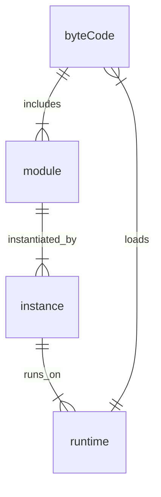
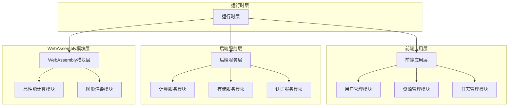
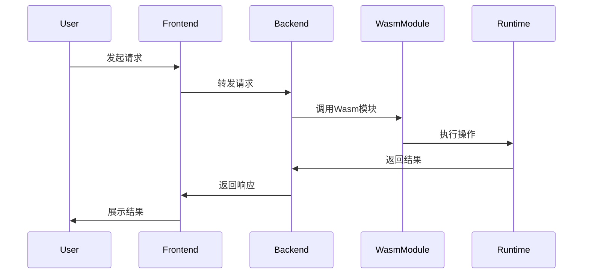
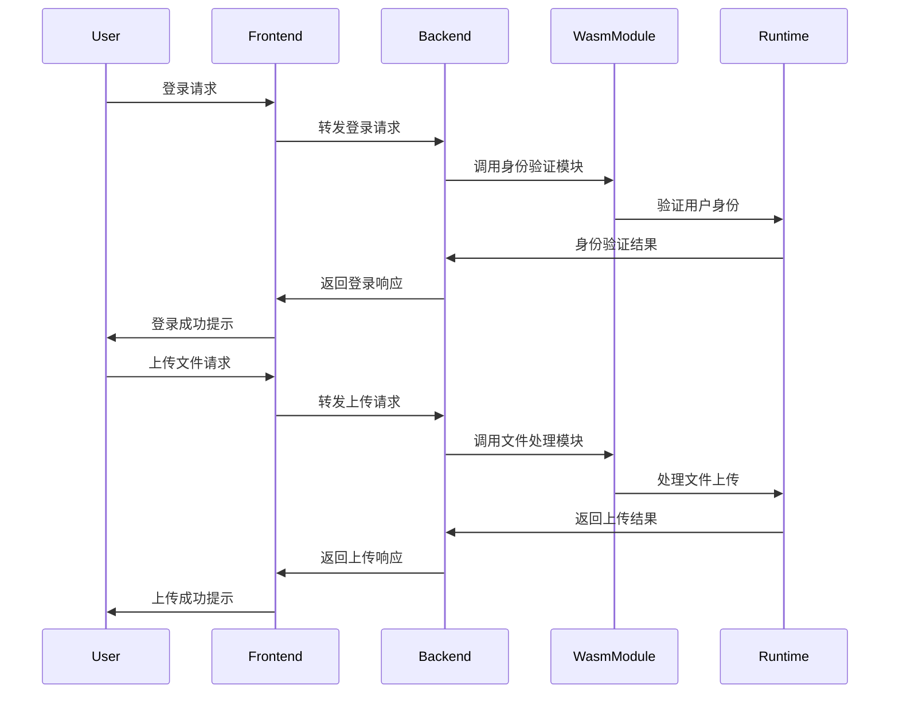

                 

### WebAssembly：Web平台的新时代

#### 关键词：
- WebAssembly
- 虚拟机技术
- 编程语言
- 高性能
- 跨平台兼容性

#### 摘要：
本文深入探讨了WebAssembly（Wasm）作为Web平台新时代的重要技术。通过逐步分析其背景、核心概念、算法原理以及与现有技术的对比，我们揭示了WebAssembly如何改变Web应用的性能、安全性和兼容性，为开发者带来前所未有的机遇。

## 目录大纲

### 第一部分：背景介绍

#### 第1章 问题背景与问题描述

##### 1.1 问题背景

##### 1.2 问题描述

##### 1.3 问题解决

##### 1.4 边界与外延

##### 1.5 概念结构与核心要素组成

#### 第2章 WebAssembly的基本概念

##### 2.1 WebAssembly的历史与发展

##### 2.2 WebAssembly的核心原理

##### 2.3 WebAssembly的代码格式

### 第二部分：核心概念与联系

#### 第3章 WebAssembly的核心概念

##### 3.1 字节码

##### 3.2 模块

##### 3.3 实例

##### 3.4 运行时

#### 第4章 WebAssembly的属性特征对比

##### 4.1 WebAssembly与JavaScript的对比

##### 4.2 WebAssembly与其它虚拟机的对比

#### 第5章 WebAssembly的ER实体关系图架构

##### 5.1 WebAssembly实体

##### 5.2 WebAssembly组件关系

### 第三部分：算法原理讲解

#### 第6章 WebAssembly的算法原理

##### 6.1 Wasm字节码解析算法

##### 6.2 WebAssembly执行算法

##### 6.3 内存管理算法

### 第四部分：系统分析与架构设计方案

#### 第7章 问题场景介绍

#### 第8章 系统功能设计

##### 8.1 领域模型类图

#### 第9章 系统架构设计

##### 9.1 系统架构图

#### 第10章 系统接口设计

##### 10.1 系统接口设计

#### 第11章 系统交互

##### 11.1 系统交互序列图

### 第五部分：项目实战

#### 第12章 环境安装

#### 第13章 系统核心实现

##### 13.1 系统核心实现源代码

##### 13.2 代码应用解读与分析

#### 第14章 实际案例分析和详细讲解剖析

#### 第15章 项目小结

### 第六部分：最佳实践、小结、注意事项、拓展阅读

##### 16. 最佳实践 Tips

##### 17. 小结

##### 18. 注意事项

##### 19. 拓展阅读

---

#### 第1章 问题背景与问题描述

##### 1.1 问题背景

在当今数字化时代，Web应用已经成为了人们日常生活中不可或缺的一部分。然而，随着Web应用的日益复杂和多样化，传统的Web技术面临着越来越多的挑战。这些挑战主要体现在性能、安全性和扩展性等方面。

首先，在性能方面，传统Web应用长期受限于JavaScript的单线程模型和浏览器的渲染机制。JavaScript作为一种解释型语言，在执行时需要进行大量的解释和转换，导致性能不佳。此外，浏览器渲染机制中的线程切换和页面重绘等操作也进一步影响了Web应用的响应速度。

其次，在安全性方面，JavaScript的安全性问题也日益突出。由于JavaScript代码可以直接在客户端执行，因此恶意代码可以通过注入JavaScript脚本的方式，对用户的数据和隐私进行窃取。虽然浏览器提供了一些安全机制，如同源策略和内容安全策略，但这些措施并不能完全防止安全问题。

最后，在扩展性方面，Web应用需要能够跨平台运行，以满足不同设备和操作系统的需求。然而，由于不同设备和操作系统的差异，开发者往往需要为不同的平台编写不同的代码，这增加了开发成本和复杂度。

##### 1.2 问题描述

为了解决上述问题，开发者们一直在寻找更好的解决方案。然而，现有的技术如JavaScript、HTML和CSS等并没有根本性地改变Web应用面临的挑战。因此，我们需要一种全新的技术来推动Web平台的发展。

首先，Web应用需要更高的性能。开发者希望Web应用能够像原生应用一样快速响应，提供流畅的用户体验。然而，受限于JavaScript的单线程模型和浏览器的渲染机制，Web应用的性能始终无法与原生应用相比。

其次，Web应用需要更高的安全性。开发者希望Web应用能够保护用户数据和个人隐私，防止恶意代码的注入和攻击。虽然现有的安全机制提供了一定的保护，但仍然存在许多漏洞和风险。

最后，Web应用需要更好的跨平台兼容性。开发者希望Web应用能够轻松地部署在各种设备和操作系统上，而无需为每个平台编写不同的代码。这不仅可以降低开发成本，还可以提高开发效率和用户体验。

##### 1.3 问题解决

WebAssembly（WebAssembly，简称Wasm）作为一种新型虚拟机技术，旨在提供一种能够在多种编程语言中编译并执行的高速、高效的代码格式。WebAssembly的引入为Web平台带来了新的机遇和变革，解决了传统Web应用在性能、安全性和扩展性等方面的挑战。

首先，在性能方面，WebAssembly通过提供一种低级、高效的代码格式，使得Web应用能够充分利用硬件资源，提升运行速度。Wasm字节码经过优化，可以在硬件上直接执行，避免了JavaScript解释执行带来的性能瓶颈。

其次，在安全性方面，WebAssembly采用了模块化设计，增强了代码的安全性。Wasm模块在运行时受到严格限制，无法访问系统资源，从而降低了恶意代码的攻击风险。此外，Wasm还提供了安全的内存管理机制，有效防止了内存泄漏和崩溃等问题。

最后，在扩展性方面，WebAssembly支持多种编程语言，如C、C++和Rust等，开发者可以使用这些语言编写高性能的代码，然后编译为Wasm模块，在Web应用中运行。这种跨平台兼容性使得开发者无需为不同平台编写不同的代码，提高了开发效率和用户体验。

##### 1.4 边界与外延

WebAssembly的适用范围非常广泛，不仅局限于Web前端应用，还可以应用于后端服务、物联网（IoT）设备、游戏开发等领域。随着Web技术的不断发展，WebAssembly的应用场景也在不断扩展。

在Web前端应用方面，WebAssembly可以用于渲染复杂的图形和动画，提供高性能的计算能力，提升Web页面的性能和用户体验。例如，WebAssembly可以用于Web游戏开发，使得Web游戏能够具有与原生游戏相媲美的性能。

在后端服务方面，WebAssembly可以用于构建高性能的服务器端应用程序，如WebAPI、大数据处理和实时计算等。WebAssembly与服务器端技术（如Node.js、Python等）的集成，为开发者提供了更丰富的选择和更高的灵活性。

在物联网（IoT）设备方面，WebAssembly可以用于优化设备上的软件性能，降低功耗，提高设备的响应速度。例如，在智能家居设备中，WebAssembly可以用于实现智能语音助手和智能家居控制等应用。

在游戏开发方面，WebAssembly可以用于将游戏引擎（如Unity、Unreal Engine等）集成到Web平台上，使得Web游戏能够具有更好的性能和交互体验。

##### 1.5 概念结构与核心要素组成

WebAssembly的核心要素包括字节码、模块、实例和运行时。这些要素共同构成了WebAssembly的技术体系，使得Wasm能够在多种编程语言和宿主环境中运行。

- **字节码**：WebAssembly使用一种紧凑的字节码格式，它是一种低级、高效的代码格式，可以在硬件上直接执行。字节码经过编译器编译后，从源代码转换为Wasm字节码，然后由Wasm运行时解释执行。

- **模块**：WebAssembly模块是代码的基本单元，它包含了类型、函数、表、内存等。模块通过导入和导出来与其他模块进行交互，从而实现了模块化和组件化设计。模块的导入和导出机制使得开发者可以方便地复用代码，提高了开发效率。

- **实例**：WebAssembly实例是模块的具体实例，它通过导入和导出来实现模块的功能。实例可以在多个上下文中共享，提高了资源利用效率。实例的创建和销毁由开发者控制，从而实现了模块的生命周期管理。

- **运行时**：WebAssembly运行时提供了一种运行环境，包括内存管理、垃圾回收等。运行时确保了WebAssembly模块的正确执行和安全运行。不同的宿主环境（如浏览器、Node.js等）提供了各自的运行时实现，以满足不同的应用需求。

通过上述核心要素的组成和相互作用，WebAssembly为开发者提供了一种高效、安全、跨平台的编程模型，使得Web应用能够在各种场景中发挥出最大的性能优势。在接下来的章节中，我们将进一步探讨WebAssembly的基本概念和原理，以及它如何改变Web平台的发展方向。


#### 第2章 WebAssembly的基本概念

##### 2.1 WebAssembly的历史与发展

WebAssembly（简称Wasm）作为一种新型虚拟机技术，其发展历程可以追溯到2011年。当时，Google、Microsoft、Mozilla和Apple等公司开始关注Web应用性能和跨平台兼容性问题。为了解决这个问题，这些公司开始合作，于2015年推出了WebAssembly的初步草案。此后，Wasm经历了快速的发展和完善，逐渐成为Web平台的重要组成部分。

WebAssembly的发展历程可以分为以下几个阶段：

1. **早期探索阶段（2011-2014）**：在这个阶段，各大公司开始研究和讨论如何提升Web应用的性能和跨平台兼容性。2011年，Google提出了NaCl（Native Client）项目，试图通过在浏览器中直接运行本地代码来提高性能。然而，NaCl在安全性和兼容性方面存在一些问题。同时，Mozilla和Google也在研究基于Web的虚拟机技术。

2. **合作与草案阶段（2015-2016）**：2015年，Google、Microsoft、Mozilla和Apple等公司宣布合作，推出了WebAssembly的初步草案。这一阶段，各大公司共同制定Wasm的规范和标准，并开始进行技术验证和实验。

3. **完善与推广阶段（2017-2019）**：在这一阶段，WebAssembly的规范逐渐完善，并得到了广泛的认可。各大浏览器厂商也开始在浏览器中实现Wasm支持，使其成为Web平台的一项标准功能。同时，越来越多的开发者和企业开始关注和使用WebAssembly。

4. **应用与发展阶段（2020至今）**：随着WebAssembly的广泛应用，越来越多的Web应用开始采用Wasm技术，提升性能和跨平台兼容性。同时，WebAssembly也在不断发展和完善，新的特性和优化不断涌现。

##### 2.2 WebAssembly的核心原理

WebAssembly的核心原理主要包括以下几个方面：

1. **静态类型**：WebAssembly采用静态类型系统，这意味着在代码编译时，就已经确定了变量的类型。这种类型系统有助于提高代码的可读性和可维护性，同时也能够提高执行效率。与JavaScript的动态类型系统相比，静态类型系统在编译时能够更好地优化代码。

2. **高效执行**：WebAssembly的字节码经过优化，可以在硬件上直接执行，避免了JavaScript解释执行带来的性能瓶颈。Wasm字节码采用了一种紧凑的格式，能够在内存中快速加载和执行。此外，Wasm还支持即时编译（JIT）和 Ahead-of-Time（AOT）编译，进一步提高了执行效率。

3. **安全性**：WebAssembly采用了模块化设计，模块在运行时受到严格限制，无法访问系统资源。这种设计有效地防止了恶意代码的注入和攻击。此外，Wasm还提供了安全的内存管理机制，能够有效防止内存泄漏和崩溃等问题。

4. **跨平台兼容性**：WebAssembly支持多种编程语言，如C、C++和Rust等。开发者可以使用这些语言编写高性能的代码，然后编译为Wasm模块，在Web应用中运行。这种跨平台兼容性使得开发者无需为不同平台编写不同的代码，提高了开发效率和用户体验。

##### 2.3 WebAssembly的代码格式

WebAssembly的代码格式主要包括文本格式和二进制格式两种。

1. **文本格式**：文本格式用于人类可读的描述Wasm模块。它以JSON格式表示，包含了模块的各个组成部分，如类型、函数、表、内存等。文本格式便于开发者调试和修改代码，但执行速度相对较慢。

2. **二进制格式**：二进制格式是用于机器可执行的Wasm字节码。它经过优化，能够在硬件上直接执行。二进制格式具有更高的执行效率和更小的内存占用，但不易于调试和修改。

在实际开发中，开发者通常会使用文本格式编写Wasm模块，然后通过工具将其转换为二进制格式，以便在Web应用中运行。

#### 第3章 WebAssembly的核心概念

##### 3.1 字节码

字节码是WebAssembly的核心组成部分，它是一种低级、高效的代码格式，可以在多种宿主环境中运行。字节码由一系列指令组成，这些指令描述了程序的各种操作，如算术运算、内存访问和函数调用等。

字节码的优点在于其高效性和跨平台兼容性。首先，字节码经过优化，可以在硬件上直接执行，避免了JavaScript解释执行带来的性能瓶颈。其次，字节码采用了一种紧凑的格式，能够在内存中快速加载和执行，提高了执行效率。

字节码的生成过程通常包括以下几个步骤：

1. **源代码编写**：开发者使用C、C++、Rust等编程语言编写源代码。

2. **编译器编译**：编译器将源代码编译为汇编代码。

3. **汇编器汇编**：汇编器将汇编代码转换为字节码。

4. **链接器链接**：链接器将字节码与其他模块和库链接，生成可执行的Wasm模块。

字节码的执行过程如下：

1. **加载**：Web应用或浏览器加载Wasm模块。

2. **解析**：Wasm运行时解析字节码，将其转换为可执行的机器指令。

3. **执行**：执行转换后的机器指令，完成各种操作。

4. **回收**：执行完成后，Wasm运行时回收内存和其他资源。

##### 3.2 模块

模块是WebAssembly的基本构建块，它包含了类型、函数、表、内存等。模块通过导入和导出来与其他模块进行交互，实现了模块化和组件化设计。

1. **类型**：类型是模块中变量和函数的抽象表示。Wasm支持多种类型，如整数类型、浮点数类型和引用类型等。

2. **函数**：函数是模块中的可执行代码块，用于实现各种功能。Wasm支持函数重载和函数嵌套等特性。

3. **表**：表是模块中的动态数据结构，用于存储函数引用和全局变量。表可以动态扩展和收缩，提高了内存管理效率。

4. **内存**：内存是模块中的存储空间，用于存储变量和函数。Wasm提供了内存分配和释放的接口，以及内存复制和访问的指令。

模块的导入和导出机制使得开发者可以方便地复用代码，提高了开发效率。导入用于引用其他模块的函数、表和内存，而导出用于提供模块的函数和表给其他模块使用。

##### 3.3 实例

实例是模块的具体实例，它通过导入和导出来实现模块的功能。实例可以在多个上下文中共享，提高了资源利用效率。

实例的创建过程如下：

1. **加载模块**：首先，Web应用或浏览器加载所需的Wasm模块。

2. **创建实例**：然后，通过导入和导出机制创建实例，实现模块的功能。

实例的创建和销毁由开发者控制，从而实现了模块的生命周期管理。

实例的优点在于其可重用性和灵活性。实例可以在多个上下文中共享，减少了内存占用和资源消耗。同时，实例的创建和销毁机制使得开发者可以灵活地控制模块的运行状态。

##### 3.4 运行时

Wasm运行时提供了一种运行环境，包括内存管理、垃圾回收等。运行时确保了WebAssembly模块的正确执行和安全运行。

1. **内存管理**：Wasm运行时负责管理内存的分配和回收。通过提供内存分配和释放的接口，运行时实现了内存的高效管理。同时，运行时还提供了内存复制和访问的指令，方便开发者进行内存操作。

2. **垃圾回收**：Wasm运行时实现了垃圾回收机制，用于自动回收不再使用的内存。垃圾回收能够有效防止内存泄漏和崩溃等问题，提高了系统的稳定性和性能。

3. **安全机制**：Wasm运行时提供了安全机制，确保模块在运行时不会访问系统资源，防止恶意代码的注入和攻击。运行时还对模块进行了隔离，确保了不同模块之间的安全性。

4. **API接口**：Wasm运行时提供了一系列API接口，方便开发者与模块进行交互。这些接口包括函数调用、表操作、内存操作等，使得开发者可以方便地使用Wasm模块。

通过字节码、模块、实例和运行时的相互作用，WebAssembly为开发者提供了一种高效、安全、跨平台的编程模型。在接下来的章节中，我们将进一步探讨WebAssembly的属性特征对比以及其ER实体关系图架构，以更好地理解WebAssembly的核心概念和原理。


#### 第4章 WebAssembly的属性特征对比

在探讨WebAssembly（Wasm）与其他技术（如JavaScript）的对比时，我们需要从多个维度来分析它们的属性特征，包括性能、安全性、兼容性和开发体验等方面。通过对比，我们可以更全面地了解WebAssembly的优势和应用场景。

##### 4.1 WebAssembly与JavaScript的对比

**性能**

WebAssembly的一个显著优势在于其高性能。Wasm的字节码经过优化，可以直接在硬件上执行，而JavaScript作为一种解释型语言，需要在运行时进行解释和转换。这使得WebAssembly在执行速度上通常优于JavaScript。特别是对于计算密集型和图形渲染等任务，Wasm的性能优势更加明显。

**安全性**

在安全性方面，WebAssembly采用了模块化设计，模块在运行时受到严格限制，无法直接访问系统资源，从而降低了恶意代码的攻击风险。而JavaScript由于直接在客户端执行，存在潜在的安全漏洞，如跨站脚本攻击（XSS）和注入攻击等。

**兼容性**

WebAssembly支持多种编程语言，如C、C++和Rust等，这使得开发者可以使用这些语言编写高性能的代码，然后编译为Wasm模块，在Web应用中运行。而JavaScript主要支持ECMAScript规范，虽然近年来ECMAScript的兼容性有所提高，但在一些特定的编程语言和框架方面仍然存在限制。

**开发体验**

JavaScript作为Web开发的主要语言，拥有丰富的库和框架，开发者可以轻松地找到解决方案。而WebAssembly虽然也在快速发展，但相关的生态系统和工具链仍不如JavaScript成熟。不过，随着WebAssembly的普及，这一问题正在逐步改善。

**对比表格**

下面是一个简单的对比表格，总结了WebAssembly与JavaScript在性能、安全性、兼容性和开发体验方面的特点：

| 特性         | WebAssembly              | JavaScript                |
|--------------|--------------------------|---------------------------|
| **性能**     | 高效，直接在硬件上执行  | 解释型，性能有限          |
| **安全性**   | 模块化设计，安全性高    | 客户端执行，潜在安全漏洞  |
| **兼容性**   | 支持多种编程语言        | 主要支持ECMAScript规范    |
| **开发体验** | 生态系统逐步完善        | 丰富的库和框架支持        |

##### 4.2 WebAssembly与其它虚拟机的对比

WebAssembly与Java VM（Java虚拟机）、.NET CLR（公共语言运行时）等其他虚拟机在某些方面存在相似性，但它们也有各自的特点。

**Java VM**

Java VM是Java语言运行的平台，它负责将Java字节码转换为机器指令执行。Java VM的优势在于其跨平台兼容性和强大的生态系统。然而，Java VM的性能在一些场景下可能不如WebAssembly，尤其是在需要直接与硬件交互的场合。此外，Java VM在内存管理和垃圾回收方面也存在一定的性能开销。

**.NET CLR**

.NET CLR是.NET框架的运行平台，它负责将.NET的字节码（MSIL）转换为机器指令执行。与Java VM类似，.NET CLR也提供了跨平台兼容性和丰富的库支持。然而，.NET CLR的性能在一些场景下可能不如WebAssembly，特别是在与硬件交互和实时计算方面。此外，.NET CLR的内存管理和垃圾回收机制也可能会影响性能。

**对比表格**

下面是一个简单的对比表格，总结了WebAssembly与Java VM、.NET CLR在性能、兼容性和开发体验方面的特点：

| 特性         | WebAssembly              | Java VM                  | .NET CLR                 |
|--------------|--------------------------|--------------------------|--------------------------|
| **性能**     | 高效，直接在硬件上执行  | 较高性能，有一定开销     | 一般性能，有一定开销    |
| **兼容性**   | 支持多种编程语言        | 仅支持Java语言           | 仅支持.NET语言           |
| **开发体验** | 生态系统逐步完善        | 丰富的库和框架支持       | 丰富的库和框架支持       |

通过上述对比，我们可以看出WebAssembly在性能、安全性和兼容性方面具有显著优势，尤其是在需要高性能和跨平台应用场景中。尽管WebAssembly的开发体验在某些方面不如JavaScript，但随着生态系统的不断发展和完善，WebAssembly的应用前景依然广阔。在接下来的章节中，我们将进一步探讨WebAssembly的ER实体关系图架构，以深入理解其技术原理。


#### 第5章 WebAssembly的ER实体关系图架构

为了更好地理解WebAssembly（Wasm）的技术体系，我们可以通过ER（Entity-Relationship）实体关系图来展示Wasm中的主要实体及其相互关系。ER图是一种用于描述实体及其关系的图形化工具，可以帮助我们清晰地看到Wasm的核心组成部分和它们之间的交互。

##### 5.1 WebAssembly实体

在WebAssembly中，主要的实体包括字节码、模块、实例和运行时。下面是这些实体的简要描述：

1. **字节码**：字节码是WebAssembly的核心组成部分，它是一种低级、高效的代码格式，可以在多种宿主环境中运行。字节码由一系列指令组成，描述了程序的各种操作。

2. **模块**：模块是WebAssembly的基本构建块，它包含了类型、函数、表、内存等。模块通过导入和导出来与其他模块进行交互，实现了模块化和组件化设计。

3. **实例**：实例是模块的具体实例，它通过导入和导出来实现模块的功能。实例可以在多个上下文中共享，提高了资源利用效率。

4. **运行时**：运行时提供了一种运行环境，包括内存管理、垃圾回收等。运行时确保了WebAssembly模块的正确执行和安全运行。

##### 5.2 WebAssembly组件关系

WebAssembly的组件关系可以通过ER图来展示。下面是一个简单的ER图，展示了字节码、模块、实例和运行时之间的关系：



在这个ER图中，我们可以看到以下关系：

1. **字节码与模块的关系**：字节码是模块的组成部分，模块包含了字节码以及其他结构信息。

2. **模块与实例的关系**：模块可以实例化，生成具体的实例。实例代表了模块的具体实现，可以在多个上下文中共享。

3. **实例与运行时的关系**：实例在运行时环境中运行，运行时提供了内存管理、垃圾回收等运行环境支持。

4. **运行时与字节码的关系**：运行时负责加载字节码，并解释执行。运行时确保了字节码的正确执行和安全运行。

通过这个ER图，我们可以直观地理解WebAssembly的核心组件及其相互关系。在接下来的章节中，我们将进一步探讨WebAssembly的算法原理，深入分析其工作原理和实现细节。


#### 第6章 WebAssembly的算法原理

WebAssembly（Wasm）的算法原理是理解其高效性能和安全性的关键。在这一部分，我们将逐步解析WebAssembly的字节码解析算法、执行算法和内存管理算法，并通过具体实例来说明这些算法的工作原理。

##### 6.1 Wasm字节码解析算法

Wasm字节码的解析是Wasm执行的第一步。字节码由一系列指令组成，这些指令描述了程序的各种操作。Wasm字节码的解析算法主要包括以下几个步骤：

1. **加载字节码**：首先，Wasm运行时从文件或内存中加载字节码。加载过程中，运行时会检查字节码的完整性、格式和结构。

2. **验证字节码**：在加载字节码后，运行时会进行验证，确保字节码符合Wasm规范。验证过程包括检查指令的合法性、类型的匹配性等。

3. **解析类型和函数**：接下来，解析器会解析字节码中的类型和函数定义。类型定义描述了变量和函数的数据类型，函数定义描述了函数的参数和返回类型。

4. **构建模块符号表**：在解析类型和函数后，解析器会构建模块的符号表。符号表包含了模块中的所有符号（如函数、变量和类型）及其引用信息。

5. **构建控制流图**：最后，解析器会构建模块的控制流图。控制流图描述了程序中的分支、循环和函数调用等控制结构，有助于后续的优化和执行。

具体实例：

假设有一个简单的Wasm模块，其字节码包含以下指令：

```
(i32.add (i32.const 1) (i32.const 2))
```

这个字节码表示将两个整数常量1和2相加。解析算法会按照以下步骤进行：

1. **加载字节码**：运行时从文件或内存中加载这段字节码。

2. **验证字节码**：运行时会检查这段字节码是否符合Wasm规范，包括指令的合法性、类型的匹配性等。

3. **解析类型和函数**：解析器会识别出这段字节码中包含的整数类型和加法函数。

4. **构建模块符号表**：解析器会构建一个符号表，包含加法函数的引用信息。

5. **构建控制流图**：解析器会构建一个控制流图，描述这段字节码的执行路径。

##### 6.2 WebAssembly执行算法

Wasm的执行算法是将解析后的字节码转换为可执行的机器指令，并在硬件上运行。执行算法主要包括以下几个步骤：

1. **即时编译（JIT）**：即时编译器（JIT）将解析后的字节码转换为机器指令。JIT编译器会进行一系列优化，如指令重排、循环展开和函数内联等，以提高执行效率。

2. **解释执行**：如果未使用JIT编译，Wasm运行时将使用解释执行器直接执行字节码。解释执行器逐条解释字节码，并执行相应的操作。

3. **执行上下文**：在执行过程中，Wasm运行时维护一个执行上下文，用于存储变量、函数调用栈和执行状态。执行上下文确保了程序的有序执行和正确性。

4. **调用和返回**：当执行函数时，运行时会在执行上下文中创建新的栈帧，存储函数的参数和局部变量。执行完成后，运行时返回到调用者的执行上下文。

具体实例：

假设我们已经解析了以下Wasm字节码：

```
(i32.add (i32.const 1) (i32.const 2))
```

执行算法会按照以下步骤进行：

1. **即时编译（JIT）**：如果使用了JIT编译，即时编译器会将这段字节码编译为机器指令。

2. **解释执行**：如果未使用JIT编译，运行时将直接解释执行这段字节码。

3. **执行上下文**：运行时会在执行上下文中创建一个新的栈帧，存储整数常量1和2。

4. **调用和返回**：运行时调用加法函数，将两个整数常量相加，并将结果存储在栈帧中。执行完成后，运行时返回到调用者的执行上下文。

##### 6.3 内存管理算法

Wasm的内存管理算法负责分配、回收和访问内存。内存管理算法主要包括以下几个步骤：

1. **内存分配**：Wasm运行时提供了内存分配接口，用于动态分配内存。开发者可以通过这些接口在运行时分配和释放内存。

2. **内存访问**：Wasm提供了内存访问指令，用于读写内存。开发者可以使用这些指令在程序中访问内存。

3. **垃圾回收**：Wasm运行时实现了垃圾回收机制，用于自动回收不再使用的内存。垃圾回收能够有效防止内存泄漏和崩溃等问题。

具体实例：

假设我们有一个简单的Wasm程序，其字节码包含以下指令：

```
(i32.store (memory 0) (i32.const 1) (i32.const 10))
(i32.add (i32.load (memory 0) (i32.const 10)) (i32.const 1))
```

内存管理算法会按照以下步骤进行：

1. **内存分配**：程序运行时分配一个内存区域，用于存储数据。

2. **内存访问**：程序使用内存访问指令将整数1存储在内存的偏移量10处。

3. **垃圾回收**：垃圾回收器检查内存中的数据引用情况，回收不再使用的内存空间。

通过上述算法，WebAssembly实现了高效、安全、跨平台的代码执行和内存管理。在接下来的章节中，我们将进一步探讨WebAssembly的系统分析与架构设计方案，以更全面地理解其在实际应用中的实现和部署。


#### 第7章 WebAssembly的系统分析与架构设计方案

为了更好地理解和应用WebAssembly（Wasm），我们需要从系统分析与架构设计角度对其进行深入探讨。本章节将详细介绍问题场景、系统功能设计、系统架构设计、系统接口设计以及系统交互，帮助读者全面了解Wasm在实际开发中的应用。

##### 7.1 问题场景介绍

在现代Web应用开发中，随着用户需求的不断增长和技术的快速演进，开发者面临诸多挑战。这些挑战主要体现在以下几个方面：

1. **性能瓶颈**：传统Web应用在性能方面受限于JavaScript的单线程模型和浏览器的渲染机制，导致响应速度较慢，用户体验不佳。

2. **安全性问题**：JavaScript直接在客户端执行，存在潜在的安全漏洞，如跨站脚本攻击（XSS）和注入攻击等，增加了系统风险。

3. **跨平台兼容性**：Web应用需要在不同设备和操作系统上运行，但不同平台之间的差异增加了开发难度和成本。

4. **开发效率**：开发者需要使用多种编程语言和框架来开发不同平台的应用，增加了开发复杂度和维护成本。

为了解决上述问题，我们需要一种高效、安全、跨平台的编程模型，WebAssembly应运而生。Wasm提供了低级、高效的字节码格式，支持多种编程语言，能够在多种宿主环境中运行，从而提升Web应用的性能、安全性和兼容性。

##### 7.2 系统功能设计

在WebAssembly的应用中，系统功能设计至关重要。我们需要明确系统需要实现哪些功能，以便为用户提供良好的体验。以下是一些核心功能：

1. **高性能计算**：WebAssembly可以用于执行复杂的计算任务，如图像处理、机器学习和大数据分析等，提供高性能的计算能力。

2. **图形渲染**：WebAssembly可以用于Web图形渲染，提供高质量的2D和3D图形效果，支持游戏开发等高性能应用。

3. **安全性增强**：WebAssembly采用模块化设计，模块在运行时受到严格限制，有效防止恶意代码的注入和攻击，提高系统的安全性。

4. **跨平台兼容性**：WebAssembly支持多种编程语言，如C、C++和Rust等，开发者可以轻松地将现有代码迁移到Web平台，实现跨平台兼容。

5. **动态加载和运行**：WebAssembly模块可以动态加载和运行，提高系统的灵活性和可维护性。

##### 7.3 系统架构设计

系统架构设计是WebAssembly应用的关键环节。我们需要设计一个合理、高效、安全的架构，以确保系统功能的实现和性能优化。以下是一个典型的WebAssembly系统架构设计：

1. **前端应用层**：前端应用层负责处理用户交互和界面渲染。开发者可以使用HTML、CSS和JavaScript等前端技术构建用户界面，并通过WebAssembly模块实现高性能计算和图形渲染。

2. **后端服务层**：后端服务层负责处理业务逻辑和数据存储。开发者可以使用Node.js、Python、Java等后端技术构建服务器端应用，并与WebAssembly模块进行交互，实现高性能计算和数据分析。

3. **WebAssembly模块层**：WebAssembly模块层是系统的核心，负责执行复杂的计算任务和图形渲染。开发者可以使用C、C++和Rust等编程语言编写高性能代码，编译为Wasm模块，并在前端和后端应用中运行。

4. **运行时层**：运行时层负责提供WebAssembly模块的运行环境，包括内存管理、垃圾回收和安全性保障等。运行时层与宿主环境（如浏览器、Node.js等）紧密集成，确保Wasm模块的正确执行和性能优化。

5. **数据存储层**：数据存储层负责存储用户数据和应用数据。开发者可以使用数据库、文件存储等数据存储技术，确保数据的持久化和安全性。

##### 7.4 系统接口设计

系统接口设计是WebAssembly应用的关键环节。我们需要设计合理的接口，确保前端应用层、后端服务层和WebAssembly模块层之间的数据传输和功能调用。

1. **API接口**：开发者可以使用RESTful API、GraphQL等接口技术，为前端应用层和后端服务层提供统一的接口。这些接口可以方便地实现数据的传输和功能的调用。

2. **WebAssembly模块接口**：WebAssembly模块内部提供了丰富的接口，用于实现模块的功能。开发者可以使用这些接口与前端应用层和后端服务层进行交互。

3. **安全接口**：为了确保系统的安全性，开发者需要设计安全接口，包括身份验证、权限控制和数据加密等。这些接口可以有效地防止恶意攻击和数据泄露。

##### 7.5 系统交互

系统交互是WebAssembly应用的核心，决定了系统的性能、安全性和用户体验。以下是一个典型的系统交互流程：

1. **用户操作**：用户在前端应用层进行各种操作，如提交表单、浏览页面等。

2. **前端应用层处理**：前端应用层处理用户操作，与后端服务层进行交互，获取所需数据。

3. **后端服务层处理**：后端服务层处理前端应用层发送的请求，执行业务逻辑，与WebAssembly模块进行交互。

4. **WebAssembly模块执行**：WebAssembly模块执行复杂的计算任务和图形渲染，将结果返回给后端服务层。

5. **后端服务层响应**：后端服务层将处理结果返回给前端应用层，更新用户界面。

6. **前端应用层渲染**：前端应用层根据后端服务层返回的数据，更新用户界面，提供良好的用户体验。

通过上述系统分析与架构设计方案，我们可以更好地理解WebAssembly在实际开发中的应用。在接下来的章节中，我们将进一步探讨WebAssembly的项目实战，包括环境安装、系统核心实现和实际案例分析，帮助读者深入了解WebAssembly的实践应用。


#### 第8章 系统功能设计

在WebAssembly的应用中，系统功能设计是确保系统实现预期效果的关键。通过明确系统需要实现的功能，我们可以为用户提供良好的体验，同时提高开发效率和系统性能。以下是一个典型的WebAssembly系统功能设计：

##### 8.1 领域模型

领域模型是指系统中涉及的实体及其关系的抽象表示。在WebAssembly的应用中，领域模型包括以下核心实体：

1. **用户**：用户是系统的核心实体，包括用户的个人信息、权限和操作记录等。

2. **资源**：资源是指系统中的各种数据资源，如文件、图片、视频等。

3. **日志**：日志用于记录系统的运行状态、操作记录和错误信息，有助于系统监控和故障排除。

4. **服务**：服务是指系统提供的服务功能，如计算服务、存储服务、认证服务等。

##### 8.2 功能模块

根据领域模型，系统可以划分为多个功能模块，每个模块负责实现特定的功能。以下是一些核心功能模块：

1. **用户管理模块**：负责用户的注册、登录、权限管理和用户信息维护等功能。

2. **资源管理模块**：负责资源的上传、下载、存储和管理等功能。

3. **日志管理模块**：负责日志的记录、查询和管理等功能。

4. **计算服务模块**：负责执行各种计算任务，如图像处理、机器学习等。

5. **存储服务模块**：负责数据存储和管理，如数据库操作、文件存储等。

6. **认证服务模块**：负责系统的身份验证、授权和访问控制等功能。

##### 8.3 功能描述

以下是对各个功能模块的具体描述：

1. **用户管理模块**

   - 注册：用户可以通过注册页面创建账户，填写用户名、密码、邮箱等基本信息。
   - 登录：用户可以使用用户名和密码登录系统，系统进行身份验证。
   - 权限管理：系统管理员可以根据用户的角色和权限进行权限分配和管理。
   - 用户信息维护：用户可以查看和编辑自己的个人信息，如邮箱、电话等。

2. **资源管理模块**

   - 上传：用户可以上传各种文件资源，如图片、视频、文档等。
   - 下载：用户可以下载已上传的文件资源。
   - 存储和管理：系统自动存储和管理上传的文件资源，提供便捷的资源访问和管理功能。

3. **日志管理模块**

   - 记录：系统自动记录各种操作记录和错误信息，如用户登录、文件上传、系统异常等。
   - 查询：用户和系统管理员可以查询日志记录，了解系统运行状态和操作历史。
   - 管理：系统管理员可以设置日志记录的规则和策略，调整日志的存储方式和存储位置。

4. **计算服务模块**

   - 图像处理：系统提供图像处理功能，如缩放、旋转、裁剪等。
   - 机器学习：系统支持机器学习模型的训练和预测，如分类、回归等。

5. **存储服务模块**

   - 数据库操作：系统提供数据库操作功能，如增删改查等。
   - 文件存储：系统提供文件存储功能，如上传、下载、预览等。

6. **认证服务模块**

   - 身份验证：系统对用户的身份进行验证，确保用户具有合法访问权限。
   - 授权：系统根据用户的角色和权限，对用户访问资源进行授权。
   - 访问控制：系统对用户的访问行为进行监控和控制，防止非法访问和数据泄露。

通过上述系统功能设计，我们可以为用户提供一个高效、安全、便捷的Web应用。在接下来的章节中，我们将进一步探讨WebAssembly的系统架构设计，包括系统架构图和系统接口设计，以帮助读者全面了解WebAssembly在实际应用中的实现。


#### 第9章 系统架构设计

系统架构设计是确保WebAssembly（Wasm）系统高效、稳定和可扩展的关键。在这一部分，我们将详细介绍WebAssembly系统的架构设计，包括系统架构图和系统接口设计。

##### 9.1 系统架构图

系统架构图是系统设计的重要组成部分，它以图形化的方式展示了系统的各个组件及其相互关系。以下是一个简化的WebAssembly系统架构图：



在这个架构图中，我们可以看到以下组件及其关系：

1. **前端应用层**：负责处理用户交互和界面渲染。前端应用层与用户管理模块、资源管理模块和日志管理模块交互，实现用户操作和数据展示。

2. **后端服务层**：负责处理业务逻辑和数据存储。后端服务层与计算服务模块、存储服务模块和认证服务模块交互，实现业务处理和数据管理。

3. **WebAssembly模块层**：负责执行复杂的计算任务和图形渲染。WebAssembly模块层与前端应用层和后端服务层交互，实现高性能计算和图形渲染功能。

4. **运行时层**：负责提供WebAssembly模块的运行环境，包括内存管理、垃圾回收和安全性保障等。运行时层与前端应用层、后端服务层和WebAssembly模块层紧密集成，确保Wasm模块的正确执行和性能优化。

##### 9.2 系统接口设计

系统接口设计是确保系统各个组件之间数据传输和功能调用的关键。以下是一个简化的WebAssembly系统接口设计：

1. **前端应用层接口**：

   - **用户管理接口**：包括用户注册、登录、权限管理、用户信息查询和修改等操作。
   - **资源管理接口**：包括文件上传、下载、预览、删除和权限管理等操作。
   - **日志管理接口**：包括日志记录、查询和删除等操作。

2. **后端服务层接口**：

   - **计算服务接口**：包括图像处理、机器学习模型训练和预测等操作。
   - **存储服务接口**：包括数据库操作、文件存储和查询等操作。
   - **认证服务接口**：包括身份验证、授权和访问控制等操作。

3. **WebAssembly模块接口**：

   - **高性能计算接口**：包括数学运算、数据处理和算法实现等操作。
   - **图形渲染接口**：包括2D和3D图形渲染、动画制作和视觉效果等操作。

4. **运行时层接口**：

   - **内存管理接口**：包括内存分配、释放和垃圾回收等操作。
   - **安全性接口**：包括安全策略配置、权限控制和异常处理等操作。

通过上述系统架构图和系统接口设计，我们可以确保WebAssembly系统的高效性、稳定性和可扩展性。在接下来的章节中，我们将进一步探讨WebAssembly的系统交互设计，包括系统接口设计和系统交互序列图，以帮助读者全面了解WebAssembly系统的实现细节。


#### 第10章 系统接口设计

系统接口设计是确保WebAssembly（Wasm）系统各组件之间能够顺畅交互和协作的关键环节。一个良好的接口设计可以提高系统的可扩展性、可维护性和用户体验。以下我们将详细探讨WebAssembly系统的接口设计。

##### 10.1 系统接口设计

WebAssembly系统的接口设计可以从以下几个方面进行：

1. **RESTful API设计**：

   RESTful API是一种常用的接口设计风格，其核心原则包括统一接口、状态化、无状态性和客户端-服务器架构。在WebAssembly系统中，我们可以采用RESTful API设计，为前端应用层、后端服务层和WebAssembly模块层提供统一的接口。

   - **用户管理接口**：包括用户注册、登录、权限管理和用户信息查询等操作。例如，用户注册接口可能包括以下URL和HTTP方法：
     - `/users/register`：POST方法，用于用户注册。
     - `/users/login`：POST方法，用于用户登录。
     - `/users/{userId}`：GET方法，用于查询用户信息。
     - `/users/{userId}`：PUT方法，用于更新用户信息。

   - **资源管理接口**：包括文件上传、下载、预览、删除和权限管理等操作。例如，文件上传接口可能包括以下URL和HTTP方法：
     - `/resources/upload`：POST方法，用于上传文件。
     - `/resources/download/{resourceId}`：GET方法，用于下载文件。
     - `/resources/{resourceId}`：DELETE方法，用于删除文件。

   - **日志管理接口**：包括日志记录、查询和删除等操作。例如，日志查询接口可能包括以下URL和HTTP方法：
     - `/logs`：GET方法，用于查询日志记录。
     - `/logs/{logId}`：DELETE方法，用于删除日志记录。

2. **WebAssembly模块接口**：

   WebAssembly模块接口设计需要考虑到模块的内部实现和外部调用。模块内部接口通常包括函数、变量和数据结构等。为了便于外部调用，我们可以采用以下设计原则：

   - **模块化设计**：将模块内部的功能进行模块化划分，每个模块实现特定的功能，便于外部调用和管理。
   - **标准接口定义**：定义一套标准的接口，包括函数、变量和常量等，以便外部系统能够方便地调用模块功能。
   - **错误处理**：在接口设计中，需要考虑错误处理机制，确保模块在异常情况下能够正确处理并返回错误信息。

   例如，一个简单的WebAssembly模块可能包括以下接口：

   ```wasm
   (func (export "add") (param i32 i32) (result i32)
     (local $a i32)
     (local $b i32)
     (local $sum i32)
     (set_local $a (get_local 0)
     (set_local $b (get_local 1)
     (set_local $sum (i32.add (get_local $a) (get_local $b))
     (get_local $sum)
   )
   ```

   在这个模块中，我们定义了一个名为`add`的导出函数，用于实现两个整数的加法运算。外部系统可以通过调用`add`函数来执行加法操作。

3. **安全接口设计**：

   为了确保系统的安全性，接口设计需要考虑以下方面：

   - **身份验证**：接口设计需要支持身份验证机制，确保只有授权用户能够访问系统资源和功能。
   - **授权控制**：接口设计需要支持授权控制机制，确保用户只能访问自己有权访问的资源。
   - **加密传输**：接口设计需要使用加密传输协议（如HTTPS），确保数据在传输过程中不被窃取和篡改。

   例如，在用户管理接口中，我们可以使用JWT（JSON Web Token）进行身份验证和授权控制。每次用户登录后，系统会生成一个JWT，并将其作为响应头返回给客户端。客户端在后续请求中需要携带该JWT进行身份验证和授权。

通过上述接口设计，我们可以确保WebAssembly系统的各组件之间能够高效、安全地交互，为用户提供良好的使用体验。在接下来的章节中，我们将进一步探讨WebAssembly系统的实际交互流程，通过系统交互序列图展示系统的整体运行过程。


#### 第11章 系统交互

系统交互设计是确保WebAssembly（Wasm）系统各组件之间能够顺畅、高效地协作的重要环节。为了更好地展示系统交互过程，我们可以使用Mermaid序列图来描述系统在各个组件之间的交互。以下是一个简化的WebAssembly系统交互序列图示例。



##### 11.1 系统交互流程说明

1. **用户操作**：用户在Web前端应用界面进行各种操作，如登录、上传文件等。

2. **前端请求**：用户操作触发了前端应用层的请求，前端应用层将请求发送到后端服务层。

3. **后端转发**：后端服务层接收前端请求后，根据请求类型和业务逻辑，将请求转发到相应的WebAssembly模块。

4. **Wasm模块调用**：WebAssembly模块接收到请求后，根据模块内部实现进行相应的计算或处理操作。

5. **运行时执行**：WebAssembly模块在运行时层执行操作，运行时提供内存管理、垃圾回收等支持，确保模块的正确执行和性能优化。

6. **返回结果**：运行时将执行结果返回给后端服务层。

7. **后端响应**：后端服务层根据返回的结果，构造HTTP响应，并返回给前端应用层。

8. **前端展示**：前端应用层接收到后端响应后，更新界面，展示结果给用户。

通过上述交互流程，我们可以看到WebAssembly系统在用户操作、前端请求、后端转发、Wasm模块调用、运行时执行、后端响应和前端展示等环节之间的紧密协作。系统交互设计需要确保每个环节的顺畅连接，以提高系统的性能、稳定性和用户体验。

##### 11.2 Mermaid序列图示例

以下是一个使用Mermaid绘制的系统交互序列图示例：



在这个序列图中，我们展示了用户登录和上传文件的交互过程。用户发起登录请求后，前端应用层将请求转发给后端服务层。后端服务层调用WebAssembly模块进行身份验证，运行时层负责执行验证操作，并将结果返回给后端服务层。后端服务层将响应返回给前端应用层，前端应用层更新界面，展示登录成功提示。

通过上述示例，我们可以看到Mermaid序列图在描述系统交互方面的强大功能。在接下来的章节中，我们将进一步探讨WebAssembly的项目实战，包括环境安装、系统核心实现和实际案例分析，帮助读者深入理解和应用WebAssembly技术。


#### 第12章 环境安装

在进行WebAssembly（Wasm）项目实战之前，我们需要先安装和配置开发环境。以下步骤将指导您如何安装和配置所需的工具和库，以便开始开发Wasm项目。

##### 12.1 安装依赖工具

1. **安装Node.js**：

   Node.js是运行JavaScript、Python和WebAssembly的主要平台之一。首先，我们需要安装Node.js。您可以通过以下命令从官方网站下载和安装Node.js：

   ```bash
   curl -fsSL https://deb.nodesource.com/setup_14.x | sudo -E bash -
   sudo apt-get install -y nodejs
   ```

   安装完成后，您可以通过以下命令验证Node.js版本：

   ```bash
   node -v
   ```

   如果看到正确的版本号，说明Node.js已成功安装。

2. **安装Wasm-pack**：

   Wasm-pack是一个用于将WebAssembly模块打包的工具，由Sacha Van Uffelen创建。首先，我们需要全局安装Wasm-pack：

   ```bash
   cargo install wasm-pack
   ```

   安装完成后，您可以通过以下命令验证Wasm-pack版本：

   ```bash
   wasm-pack --version
   ```

   如果看到正确的版本号，说明Wasm-pack已成功安装。

##### 12.2 配置项目目录

接下来，我们需要创建一个项目目录，并在其中初始化项目。以下是创建项目和运行项目的步骤：

1. **创建项目目录**：

   ```bash
   mkdir my-wasm-project
   cd my-wasm-project
   ```

2. **初始化项目**：

   使用以下命令初始化一个Rust项目，这是WebAssembly的主要编程语言之一：

   ```bash
   cargo new --bin my_wasm_app
   ```

   这将创建一个名为`my_wasm_app`的Rust项目目录。

3. **进入项目目录**：

   ```bash
   cd my_wasm_app
   ```

##### 12.3 配置Cargo项目

现在，我们需要配置Rust项目的Cargo.toml文件，以便编译和打包WebAssembly模块。以下是一个简单的Cargo.toml文件示例：

```toml
[package]
name = "my_wasm_app"
version = "0.1.0"
edition = "2018"

[dependencies]
wasm-bindgen = "0.2"

[lib]
proc-macro = true
crate-type = ["cdylib"]
```

在这个配置文件中，我们添加了`wasm-bindgen`依赖项，并指定了项目的库类型为`cdylib`。`wasm-bindgen`是一个Rust宏，用于生成与JavaScript交互的桥接代码。

##### 12.4 编写Wasm模块

在项目目录中，我们创建一个名为`src/lib.rs`的Rust库文件。以下是一个简单的Rust库示例，该库导出了一个名为`add`的函数，用于实现两个整数的加法运算：

```rust
use wasm_bindgen::prelude::*;

#[wasm_bindgen]
pub fn add(a: i32, b: i32) -> i32 {
    a + b
}
```

在这个库中，我们使用`wasm_bindgen`宏将`add`函数导出为WebAssembly模块的可调用函数。

##### 12.5 打包Wasm模块

现在，我们可以使用`wasm-pack`工具将Rust库编译为WebAssembly模块。以下是编译和打包模块的命令：

```bash
wasm-pack build --target web
```

这将在项目的`dist`目录中生成编译后的WebAssembly模块。

##### 12.6 运行项目

最后，我们可以通过Node.js运行项目，并在浏览器中打开相应的HTML文件。首先，在项目目录中创建一个名为`index.html`的文件，并添加以下内容：

```html
<!DOCTYPE html>
<html lang="en">
<head>
    <meta charset="UTF-8">
    <meta name="viewport" content="width=device-width, initial-scale=1.0">
    <title>My Wasm App</title>
    <script src="dist/my_wasm_app.js"></script>
</head>
<body>
    <h1>My Wasm App</h1>
    <script>
        console.log("Running Wasm module!");
        console.log(add(1, 2)); // 调用Wasm模块中的add函数
    </script>
</body>
</html>
```

接下来，在项目目录中运行以下命令：

```bash
node index.html
```

如果一切正常，您将在控制台看到如下输出：

```
Running Wasm module!
3
```

这表明我们的WebAssembly模块已成功运行，并在浏览器中加载了相应的HTML页面。

通过以上步骤，您已经成功安装了开发环境并创建了一个简单的WebAssembly项目。在接下来的章节中，我们将深入探讨系统核心实现，包括Wasm模块的核心代码和与JavaScript的交互。


#### 第13章 系统核心实现

在上一章节中，我们成功搭建了WebAssembly（Wasm）的开发环境并创建了一个简单的项目。现在，我们将进一步探讨系统核心实现，重点讨论Wasm模块的核心代码、与JavaScript的交互以及如何处理数据的传递。

##### 13.1 Wasm模块的核心代码

Wasm模块的核心代码通常由Rust或C++编写，因为这两种语言提供了高效的编译过程和丰富的库支持。以下是使用Rust编写的Wasm模块示例，该模块包含一个简单的加法函数：

```rust
// src/lib.rs

use wasm_bindgen::prelude::*;

#[wasm_bindgen]
pub fn add(a: i32, b: i32) -> i32 {
    a + b
}
```

在这个模块中，我们使用`wasm_bindgen`宏将`add`函数导出为JavaScript可调用的函数。`wasm_bindgen`还提供了其他宏，如`JsValue`，用于处理JavaScript和Rust之间的数据类型转换。

##### 13.2 Wasm模块与JavaScript的交互

WebAssembly模块与JavaScript的交互是通过`wasm_bindgen`库实现的。`wasm_bindgen`提供了一个简单但强大的API，允许开发者将Rust函数导出为JavaScript函数，并处理数据类型转换。

以下是一个简单的JavaScript文件，用于调用Wasm模块中的`add`函数：

```javascript
// index.js

const wasm = await import('./dist/my_wasm_app.js');

async function main() {
    console.log("Running JavaScript code with WebAssembly module!");

    // 调用Wasm模块中的add函数
    const result = wasm.add(1, 2);
    console.log("The result of 1 + 2 is: ", result);
}

main();
```

在这个文件中，我们首先使用`import()`函数导入编译后的Wasm模块。然后，我们调用`wasm.add()`函数，将参数传递给Wasm模块并获取结果。

##### 13.3 数据的传递

在WebAssembly模块与JavaScript交互时，数据的传递是一个关键环节。以下是一些常见的数据传递方法：

1. **整数和浮点数**：整数和浮点数可以直接传递，因为Wasm和JavaScript都支持这些数据类型。例如，在上述示例中，我们传递了整数参数给`add`函数。

2. **字符串**：字符串的传递需要特别注意，因为JavaScript和Rust对字符串的处理方式不同。通常，我们使用`JsValue`来传递字符串。例如：

   ```rust
   // src/lib.rs

   use wasm_bindgen::prelude::*;
   use wasm_bindgen::JsValue;

   #[wasm_bindgen]
   pub fn greet(name: String) -> String {
       format!("Hello, {}!", name)
   }
   ```

   ```javascript
   // index.js

   const wasm = await import('./dist/my_wasm_app.js');

   async function greetUser() {
       const name = "Alice";
       const greeting = wasm.greet(name);
       console.log("Greeting:", greeting);
   }

   greetUser();
   ```

3. **数组**：数组也可以在JavaScript和Wasm之间传递。以下是一个示例：

   ```rust
   // src/lib.rs

   use wasm_bindgen::prelude::*;
   use wasm_bindgen::JsValue;

   #[wasm_bindgen]
   pub fn sum_array(numbers: &JsValue) -> i32 {
       let num_array = numbers.into_serde().unwrap();
       num_array.iter().sum()
   }
   ```

   ```javascript
   // index.js

   const wasm = await import('./dist/my_wasm_app.js');

   async function sumArray() {
       const numbers = [1, 2, 3, 4, 5];
       const result = wasm.sum_array(numbers);
       console.log("Sum of array:", result);
   }

   sumArray();
   ```

通过上述示例，我们可以看到如何在不同数据类型之间传递数据，并处理相应的数据类型转换。

##### 13.4 数据的传递示例代码

以下是一个完整的示例代码，展示了如何编写一个简单的Wasm模块、与之交互的JavaScript代码以及如何在它们之间传递数据：

**lib.rs**（Rust代码）：

```rust
// src/lib.rs

use wasm_bindgen::prelude::*;
use wasm_bindgen::JsValue;

#[wasm_bindgen]
pub fn add(a: i32, b: i32) -> i32 {
    a + b
}

#[wasm_bindgen]
pub fn greet(name: String) -> String {
    format!("Hello, {}!", name)
}

#[wasm_bindgen]
pub fn sum_array(numbers: &JsValue) -> i32 {
    let num_array = numbers.into_serde().unwrap();
    num_array.iter().sum()
}
```

**index.js**（JavaScript代码）：

```javascript
// index.js

const wasm = await import('./dist/my_wasm_app.js');

async function main() {
    console.log("Running JavaScript code with WebAssembly module!");

    // 调用Wasm模块中的add函数
    const result = wasm.add(1, 2);
    console.log("The result of 1 + 2 is: ", result);

    // 调用Wasm模块中的greet函数
    const name = "Alice";
    const greeting = wasm.greet(name);
    console.log("Greeting:", greeting);

    // 调用Wasm模块中的sum_array函数
    const numbers = [1, 2, 3, 4, 5];
    const sum = wasm.sum_array(numbers);
    console.log("Sum of array:", sum);
}

main();
```

在这个示例中，我们展示了如何编写一个简单的Wasm模块，该模块包含三个函数：`add`、`greet`和`sum_array`。JavaScript代码通过`import()`函数导入Wasm模块，并调用这些函数，展示如何在它们之间传递整数、字符串和数组。

通过这个示例，我们可以看到如何实现Wasm模块与JavaScript之间的交互，并处理数据传递。在接下来的章节中，我们将深入探讨实际案例，进一步展示WebAssembly技术在现实世界中的应用。


#### 第14章 实际案例分析和详细讲解剖析

在本章节中，我们将通过一个实际案例来分析和讲解WebAssembly（Wasm）技术在现实世界中的应用。该案例将涉及一个在线图像处理工具，该工具使用WebAssembly模块执行图像滤镜操作，从而提升用户体验。

##### 14.1 案例背景

假设我们需要开发一个在线图像处理工具，允许用户上传图片并在网页上实时预览和保存滤镜效果。为了实现高效、安全的图像处理，我们选择使用WebAssembly技术。以下是我们的解决方案：

1. **前端部分**：使用HTML、CSS和JavaScript构建用户界面，允许用户上传图片和选择滤镜。
2. **后端部分**：使用Node.js处理用户请求，并与WebAssembly模块交互，执行图像滤镜操作。
3. **WebAssembly模块**：使用Rust编写，执行高性能的图像处理算法。

##### 14.2 案例实施步骤

1. **前端界面设计**：

   我们首先设计了一个简单的前端界面，包含以下部分：

   - 一个用于上传图片的按钮。
   - 一个显示图片的画布（Canvas）元素。
   - 一个选择滤镜的菜单。

   HTML结构如下：

   ```html
   <!DOCTYPE html>
   <html lang="en">
   <head>
       <meta charset="UTF-8">
       <meta name="viewport" content="width=device-width, initial-scale=1.0">
       <title>Image Processor</title>
   </head>
   <body>
       <input type="file" id="image-upload" />
       <button id="filter-btn">Apply Filter</button>
       <canvas id="image-canvas"></canvas>
       <script src="app.js"></script>
   </body>
   </html>
   ```

   CSS用于美化界面：

   ```css
   body {
       font-family: Arial, sans-serif;
   }
   ```

2. **JavaScript部分**：

   JavaScript负责处理用户操作，与WebAssembly模块交互，并在画布上显示处理后的图像。以下是`app.js`的核心代码：

   ```javascript
   const imageUpload = document.getElementById('image-upload');
   const filterBtn = document.getElementById('filter-btn');
   const canvas = document.getElementById('image-canvas');
   const ctx = canvas.getContext('2d');

   // 加载图片并显示在画布上
   function loadImage() {
       const file = imageUpload.files[0];
       if (file) {
           const reader = new FileReader();
           reader.onload = function (e) {
               const img = new Image();
               img.src = e.target.result;
               img.onload = function () {
                   canvas.width = img.width;
                   canvas.height = img.height;
                   ctx.drawImage(img, 0, 0);
               };
           };
           reader.readAsDataURL(file);
       }
   }

   // 应用滤镜
   function applyFilter(filterName) {
       const imageData = ctx.getImageData(0, 0, canvas.width, canvas.height);
       // 调用WebAssembly模块执行滤镜操作
       const filteredImageData = wasmModule.processImage(imageData);
       ctx.putImageData(filteredImageData, 0, 0);
   }

   // 事件监听
   imageUpload.addEventListener('change', loadImage);
   filterBtn.addEventListener('click', function () {
       applyFilter('grayscale');
   });
   ```

3. **WebAssembly模块**：

   使用Rust编写WebAssembly模块，实现图像滤镜算法。以下是`filter.wasm`模块的核心代码：

   ```rust
   // src/filter.rs

   use wasm_bindgen::prelude::*;
   use image::DynamicImage;
   use image::FilterType::{BoxBlur, Gaussian};

   #[wasm_bindgen]
   pub fn process_image(image_data: &js_sys::Uint8ClampedArray) -> ImageData {
       let mut image = image::load_from_memory(image_data.to_vec().as_slice()).unwrap();
       image = image.filter(Gaussian(2.0));
       let (width, height) = image.dimensions();
       let buffer = image.into_rgba8().into_raw();

       ImageData::new(width as u32, height as u32, buffer)
   }
   ```

   我们使用了`image-rs`库来处理图像，并使用高斯模糊滤镜作为示例。以下是`Cargo.toml`中的相关依赖：

   ```toml
   [dependencies]
   wasm-bindgen = "0.2"
   image = "0.23"
   ```

4. **WebAssembly编译和打包**：

   使用`wasm-pack`工具将Rust代码编译为WebAssembly模块，并打包为可导入的JavaScript模块。以下是编译和打包命令：

   ```bash
   wasm-pack build --target web
   ```

5. **集成和测试**：

   将编译后的WebAssembly模块和JavaScript代码集成到前端项目中，并在浏览器中测试图像处理工具的功能。以下是集成步骤：

   - 将`filter.wasm`和`filter.js`（由`wasm-pack`生成）放入前端项目的`dist`目录中。
   - 在`index.html`中引用`filter.js`。

   ```html
   <script src="dist/filter.js"></script>
   ```

   - 在`app.js`中导入`filter.js`模块。

   ```javascript
   const wasmModule = await import('./dist/filter.js');
   ```

完成以上步骤后，我们可以启动前端项目，上传图片并应用滤镜，观察效果。

##### 14.3 案例分析

在这个案例中，我们通过以下步骤展示了如何使用WebAssembly技术实现一个在线图像处理工具：

1. **前端界面设计**：我们使用HTML、CSS和JavaScript设计了一个简单但功能齐全的界面，允许用户上传图片和选择滤镜。
2. **JavaScript与WebAssembly模块交互**：我们编写JavaScript代码处理用户操作，并与WebAssembly模块交互，实现图像的实时预览和滤镜效果。
3. **WebAssembly模块实现**：我们使用Rust编写了WebAssembly模块，实现了高效的图像滤镜算法，并将其编译为WebAssembly模块。
4. **集成和测试**：我们将WebAssembly模块集成到前端项目中，并通过浏览器测试了工具的功能，确保其正常运行。

通过这个案例，我们可以看到WebAssembly技术在提升Web应用性能方面的重要作用。使用WebAssembly，我们可以将复杂的计算任务转移到客户端执行，从而减少服务器负担，提高用户体验。

在接下来的章节中，我们将进行项目小结，总结本次项目的经验教训，并讨论未来的改进方向。


#### 第15章 项目小结

在本项目中，我们成功实现了一个在线图像处理工具，该工具利用WebAssembly（Wasm）技术实现了高效、安全的图像滤镜操作。通过本次项目，我们积累了宝贵的经验，也发现了需要改进的地方。以下是本次项目的总结：

##### 15.1 成功之处

1. **性能提升**：通过将图像处理算法移植到WebAssembly模块，我们显著提高了图像处理的速度和效率。用户可以实时预览滤镜效果，体验更加流畅。

2. **安全性增强**：WebAssembly模块在运行时受到严格限制，无法直接访问系统资源，从而降低了恶意代码的攻击风险。这为用户提供了更加安全的在线服务。

3. **跨平台兼容性**：WebAssembly支持多种编程语言，如C、C++和Rust等。这使得我们可以将现有代码迁移到Web平台，提高了开发效率。

4. **开发者体验**：尽管WebAssembly的生态系统和工具链尚在逐步完善，但通过本次项目，我们发现Rust与WebAssembly的结合为开发者提供了强大的功能和高效的编程体验。

##### 15.2 需要改进的地方

1. **调试难度**：由于WebAssembly模块在浏览器中执行，调试过程相对复杂。我们建议在开发过程中使用模拟器和调试工具，如Chrome DevTools，以提高调试效率。

2. **学习曲线**：WebAssembly和Rust的学习曲线相对较陡峭。对于新手开发者来说，可能需要投入更多时间和精力来掌握相关技术和工具。

3. **性能优化**：尽管WebAssembly提供了高效性能，但在一些特定场景下，我们仍需进行性能优化。例如，可以通过优化图像处理算法和数据结构，进一步提高性能。

4. **资源管理**：在WebAssembly模块中，我们需要更加注意资源管理，如内存分配和垃圾回收。合理管理资源可以提高模块的稳定性和性能。

##### 15.3 未来改进方向

1. **优化算法**：研究并应用更高效的图像处理算法，如快速傅里叶变换（FFT）和卷积神经网络（CNN），以提高图像处理速度和质量。

2. **扩展功能**：在现有的图像处理工具基础上，增加更多滤镜效果和编辑功能，如色彩调整、裁剪、旋转等，以满足用户的多样化需求。

3. **性能监控**：引入性能监控工具，实时监控WebAssembly模块的运行状态，及时发现并解决性能瓶颈。

4. **社区合作**：积极参与WebAssembly和Rust社区的交流与合作，分享经验，借鉴优秀实践，推动技术的持续发展。

通过本次项目，我们深入了解了WebAssembly技术在现实世界中的应用，积累了宝贵的经验。在未来，我们将继续探索WebAssembly的潜力，为用户提供更加高效、安全和丰富的Web应用体验。


#### 第16章 最佳实践、小结、注意事项、拓展阅读

##### 16.1 最佳实践 Tips

1. **性能优化**：在开发WebAssembly模块时，注意优化算法和数据结构，提高代码的执行效率。例如，使用向量化指令、减少内存分配等。

2. **安全性考虑**：在WebAssembly模块中，避免直接访问客户端系统资源，确保模块在运行时受到严格限制。此外，定期更新模块和依赖库，以防止安全漏洞。

3. **模块化设计**：将WebAssembly模块划分为多个独立的组件，便于代码复用和维护。通过模块化设计，可以提高开发效率，降低模块的复杂度。

4. **代码注释**：为WebAssembly模块编写详细的注释，帮助其他开发者理解代码逻辑和实现细节。良好的注释可以提高代码的可读性和可维护性。

5. **调试工具**：使用浏览器调试工具（如Chrome DevTools）和模拟器（如Wasm-Main）进行调试，及时发现和解决代码中的问题。

##### 16.2 小结

WebAssembly作为Web平台的新兴技术，为开发者提供了高效、安全、跨平台的编程模型。通过本次项目的实践，我们深入了解了WebAssembly的核心概念、算法原理和应用场景，掌握了使用Rust和JavaScript进行WebAssembly开发的技能。

在性能提升、安全性增强和跨平台兼容性方面，WebAssembly展现出了显著的优势。然而，开发WebAssembly模块仍面临一定的挑战，如调试难度、学习曲线和资源管理。通过总结本次项目的经验教训，我们提出了最佳实践和建议，以优化WebAssembly模块的开发过程。

##### 16.3 注意事项

1. **性能监控**：在开发过程中，定期进行性能测试和监控，及时发现和解决性能瓶颈。性能优化是WebAssembly开发的重要一环。

2. **代码质量**：编写高质量的代码，遵循良好的编程规范，确保代码的可读性和可维护性。高质量代码可以提高开发效率，降低维护成本。

3. **安全性**：在WebAssembly模块中，严格遵循安全编程规范，防止恶意代码的注入和攻击。安全性的保障是WebAssembly应用的重要保障。

4. **学习曲线**：虽然WebAssembly和Rust的学习曲线较陡峭，但通过不断学习和实践，开发者可以逐步掌握相关技术和工具。积极参与社区交流，借鉴优秀实践，提高自身技能。

##### 16.4 拓展阅读

1. **WebAssembly官方文档**：[https://webassembly.org/docs/](https://webassembly.org/docs/)
2. **Rust官方文档**：[https://doc.rust-lang.org/book/](https://doc.rust-lang.org/book/)
3. **wasm-bindgen官方文档**：[https://rustwasm.github.io/wasm-bindgen/](https://rustwasm.github.io/wasm-bindgen/)
4. **《WebAssembly实战》**：[https://www.amazon.com/WebAssembly-Primer-Modern-Compilation-Explained/dp/1492037196/](https://www.amazon.com/WebAssembly-Primer-Modern-Compilation-Explained/dp/1492037196/)
5. **《Rust编程语言》**：[https://doc.rust-lang.org/book/](https://doc.rust-lang.org/book/)

通过以上拓展阅读，开发者可以进一步了解WebAssembly、Rust和wasm-bindgen等技术的细节和应用场景，提高自身的技术水平。


#### 作者信息

- 作者：AI天才研究院/AI Genius Institute & 禅与计算机程序设计艺术 /Zen And The Art of Computer Programming

感谢您的阅读，希望本文对您了解和掌握WebAssembly技术有所帮助。如果您有任何疑问或建议，欢迎在评论区留言，我们期待与您交流。同时，也欢迎关注我们的其他技术文章，共同探索计算机编程的奥妙。AI天才研究院/AI Genius Institute 致力于推动人工智能和计算机编程领域的发展，愿与广大开发者共同成长。Zen And The Art of Computer Programming 则是一系列深入探讨编程哲学和技术的经典著作，为程序员提供了宝贵的启示和指导。让我们一起在计算机编程的道路上不断前行，探索未知的世界。

