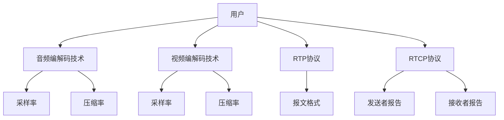
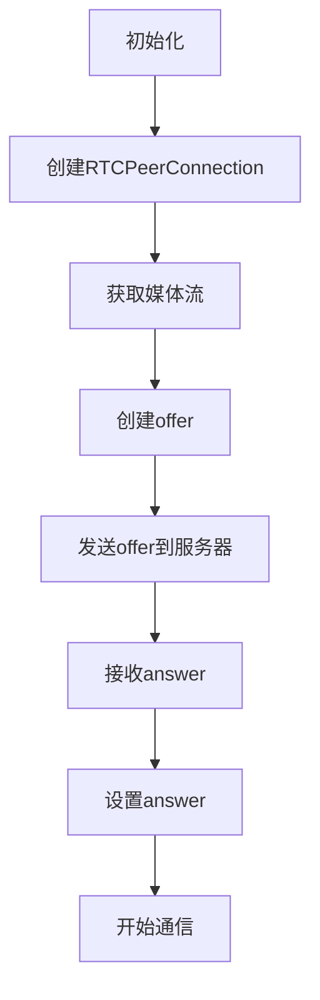
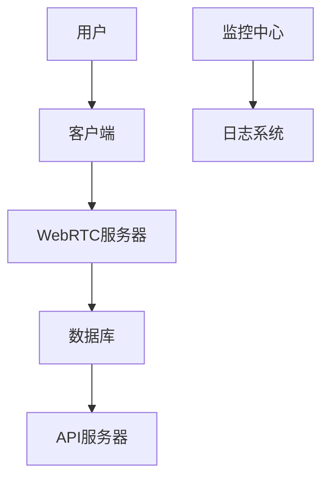
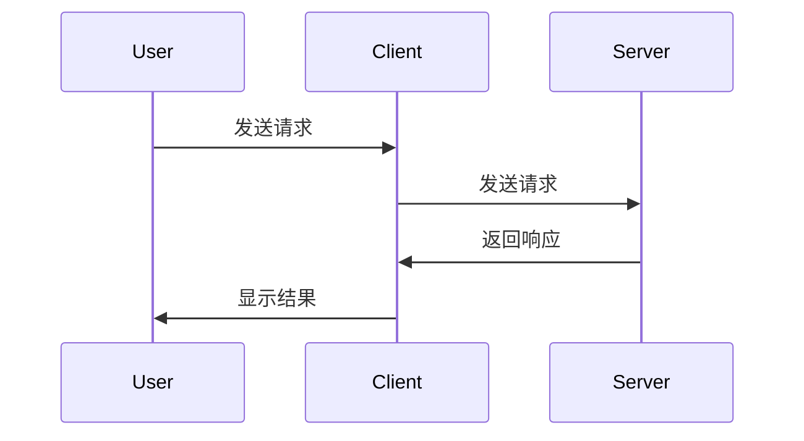

                 


### WebRTC：实现浏览器间的实时通信

> 关键词：WebRTC、实时通信、浏览器、编解码、RTP协议、应用场景、部署与安全

> 摘要：本文将深入探讨WebRTC（Web Real-Time Communication）技术，从其产生背景、核心原理到关键技术、应用场景，再到部署与开发、安全问题，全面解析WebRTC在实现浏览器间实时通信中的关键作用及其未来发展趋势。通过本文的详细分析，读者将能够全面了解并掌握WebRTC的核心概念和实践方法。

### 目录大纲：

----------------------------------------------------------------

## 第一部分: WebRTC基础知识

### 第1章: WebRTC概述

#### 1.1 WebRTC的产生背景和核心目标  
#### 1.2 WebRTC的工作原理  
#### 1.3 WebRTC的关键特性

### 第2章: WebRTC的关键技术

#### 2.1 音频与视频编解码

##### 2.1.1 音频编解码技术  
##### 2.1.2 视频编解码技术

#### 2.2 RTP协议

##### 2.2.1 RTP协议的基本概念  
##### 2.2.2 RTP协议的报文格式

#### 2.3 RTCP协议

##### 2.3.1 RTCP协议的基本概念  
##### 2.3.2 RTCP协议的作用和机制

## 第二部分: WebRTC的应用场景

### 第3章: WebRTC的浏览器支持情况

#### 3.1 WebRTC在主流浏览器中的支持情况  
#### 3.2 WebRTC在不同浏览器中的兼容性问题及解决方案  
#### 3.3 WebRTC与其他Web技术的结合应用

### 第4章: WebRTC的应用场景

#### 4.1 在线视频会议  
#### 4.2 实时视频直播  
#### 4.3 在线教育  
#### 4.4 游戏直播

## 第三部分: WebRTC的部署与开发

### 第5章: WebRTC的部署与开发

#### 5.1 WebRTC服务器的搭建  
#### 5.2 WebRTC客户端的搭建  
#### 5.3 WebRTC的调试与优化

## 第四部分: WebRTC的安全问题

### 第6章: WebRTC的安全问题

#### 6.1 WebRTC的安全性概述  
#### 6.2 WebRTC的安全机制  
#### 6.3 WebRTC的安全隐患及防护措施

## 第五部分: WebRTC的未来发展趋势

### 第7章: WebRTC的未来发展趋势

#### 7.1 WebRTC在物联网中的应用  
#### 7.2 WebRTC与5G技术的结合  
#### 7.3 WebRTC的标准化进程和未来展望

----------------------------------------------------------------

### 第一部分：WebRTC基础知识

#### 第1章: WebRTC概述

#### 1.1 WebRTC的产生背景和核心目标

WebRTC（Web Real-Time Communication）是Google发起的一个开源项目，旨在为Web应用提供实时通信的能力，从而实现浏览器之间的语音、视频通话和数据分享。WebRTC的产生背景源于互联网的发展需求，随着Web应用逐渐从静态页面转向动态交互，实时通信的需求变得日益迫切。

WebRTC的核心目标在于：

1. **简单易用**：为开发者提供易于集成的API，降低实现实时通信的门槛。
2. **高质量**：提供高质量的视频和音频传输，确保用户的使用体验。
3. **安全性**：采用多种安全机制，保障通信过程的安全性。

WebRTC的出现解决了传统Web应用在实时通信方面面临的诸多难题，如网络延迟、带宽限制、编解码兼容性等，从而为Web应用带来了全新的用户体验。

#### 1.2 WebRTC的工作原理

WebRTC的工作原理主要包括以下几个关键环节：

1. **信令**：信令是指浏览器之间交换信息的过程，用于建立通信连接。WebRTC使用信令机制来交换SDP（Session Description Protocol）信息，包括对等方的媒体能力、IP地址和端口等。
2. **媒体传输**：WebRTC使用ICE（Interactive Connectivity Establishment）协议进行NAT（网络地址转换）穿越，从而确保对等方能够建立直接的通信连接。ICE协议通过交换STUN（Session Traversal Utilities for NAT）和TURN（Traversal Using Relays around NAT）服务器信息来实现NAT穿越。
3. **编解码**：WebRTC支持多种音频和视频编解码技术，如VP8/VP9、H.264、G.711、Opus等，从而能够满足不同场景下的需求。编解码过程包括压缩、传输和解压缩，以确保媒体数据的流畅传输。

#### 1.3 WebRTC的关键特性

WebRTC的关键特性包括：

1. **NAT穿越**：WebRTC能够穿越NAT和防火墙，实现对等方之间的直接通信。
2. **自动调整**：WebRTC能够根据网络状况自动调整编解码参数，确保最佳传输质量。
3. **安全性**：WebRTC采用SRTP（Secure Real-Time Transport Protocol）和TLS（Transport Layer Security）等安全协议，保障通信过程的安全性。
4. **多平台支持**：WebRTC支持多种操作系统和浏览器，具备良好的跨平台性。

通过以上特性的支持，WebRTC能够为Web应用提供稳定、高效、安全的实时通信能力，从而满足各类应用场景的需求。

### 第二部分：WebRTC的关键技术

#### 第2章: WebRTC的关键技术

#### 2.1 音频与视频编解码

##### 2.1.1 音频编解码技术

音频编解码是WebRTC实现音频传输的核心技术。WebRTC支持多种音频编解码技术，包括G.711、Opus、AAC等。以下是这些编解码技术的基本介绍：

1. **G.711**：G.711是一种线性预测编码（LPC）的音频编解码技术，广泛用于电话通信。它支持两种编码模式：溃疡编码（u-law）和ACM编码（A-law），采样率分别为64 kbps和56 kbps。G.711具有较高的压缩率和较好的音质，但其压缩率较低，适用于对带宽要求不高的场景。

2. **Opus**：Opus是一种全新的音频编解码技术，旨在提供高音质和低延迟的音频传输。Opus支持从8 kHz到48 kHz的采样率，以及从4 kHz到7 kHz的频率范围，从而能够满足不同应用场景的需求。Opus的压缩率较高，在保证音质的同时，能够显著降低带宽占用。

3. **AAC**：AAC（Advanced Audio Coding）是一种先进的音频编解码技术，广泛用于多媒体应用。AAC支持多种采样率和比特率，能够提供高质量的音乐体验。然而，AAC的压缩率较高，对带宽的要求较高。

在选择音频编解码技术时，需要根据应用场景和带宽需求进行权衡。例如，在实时视频通话中，可以选择Opus编解码技术，以保证低延迟和高音质；而在带宽受限的场景中，可以选择G.711编解码技术，以降低带宽占用。

##### 2.1.2 视频编解码技术

视频编解码是WebRTC实现视频传输的核心技术。WebRTC支持多种视频编解码技术，包括VP8、VP9、H.264等。以下是这些编解码技术的基本介绍：

1. **VP8**：VP8是一种视频编解码技术，由Google开发，用于Web应用中的视频传输。VP8具有较好的压缩性能和较低的延迟，适用于实时视频通信场景。

2. **VP9**：VP9是VP8的升级版，同样由Google开发。VP9在保持较低延迟的同时，提供了更高的压缩效率和更好的视频质量。VP9支持4K视频传输，适用于高清视频应用。

3. **H.264**：H.264是一种广泛使用的视频编解码技术，由ITU和ISO共同制定。H.264具有优异的压缩性能和较高的视频质量，适用于各种视频应用，包括流媒体和视频会议。

在选择视频编解码技术时，需要考虑带宽、延迟和视频质量等因素。例如，在带宽受限的场景中，可以选择VP8或VP9编解码技术，以保证视频流畅传输；而在对视频质量要求较高的场景中，可以选择H.264编解码技术。

##### 2.2 RTP协议

RTP（Real-Time Transport Protocol）是一种实时传输协议，用于传输音频、视频等实时数据。RTP协议的基本概念包括：

1. **RTP报文**：RTP报文是RTP协议传输的数据单元，包括RTP头部和数据载荷。RTP头部包含同步源（SSRC）标识、序列号、时间戳等信息，用于报文传输和同步。

2. **RTP载荷**：RTP载荷是RTP报文中的数据部分，可以是音频、视频或其他实时数据。RTP载荷可以根据不同的编解码技术进行定制，以适应不同的传输需求。

RTP协议的报文格式如下：

```
0                   1                   2                   3
0 1 2 3 4 5 6 7 8 9 0 1 2 3 4 5 6 7 8 9 0 1 2 3 4 5 6 7 8 9 0 1
+-+-+-+-+-+-+-+-+-+-+-+-+-+-+-+-+-+-+-+-+-+-+-+-+-+-+-+-+-+-+-+-+
|V=2|P|X|  CC   |       MXPF                 |     SEQ         |
+-+-+-+-+-+-+-+-+-+-+-+-+-+-+-+-+-+-+-+-+-+-+-+-+-+-+-+-+-+-+-+-+
|         TIME-STAMP           |           SSRC              |
+-+-+-+-+-+-+-+-+-+-+-+-+-+-+-+-+-+-+-+-+-+-+-+-+-+-+-+-+-+-+-+-+
|                CONTRIBUTOR COUNT                       |
+-+-+-+-+-+-+-+-+-+-+-+-+-+-+-+-+-+-+-+-+-+-+-+-+-+-+-+-+-+-+-+-+
|          SSRC_1                                             |
+-+-+-+-+-+-+-+-+-+-+-+-+-+-+-+-+-+-+-+-+-+-+-+-+-+-+-+-+-+-+-+-+
:                                                               :
:          SSRC_N                                             |
+-+-+-+-+-+-+-+-+-+-+-+-+-+-+-+-+-+-+-+-+-+-+-+-+-+-+-+-+-+-+-+-+
```

其中，V表示RTP版本号，P表示垫片填充，X表示扩展，CC表示信源数量，MXPF表示最大扩展长度，SEQ表示序列号，TIME-STAMP表示时间戳，SSRC表示同步源标识。

##### 2.3 RTCP协议

RTCP（Real-Time Control Protocol）是一种实时控制协议，与RTP协议配合使用，用于监控和控制实时传输过程。RTCP协议的基本概念包括：

1. **RTCP报文**：RTCP报文是RTCP协议传输的数据单元，包括发送者报告（SR）和接收者报告（RR）等。发送者报告包含发送者的统计信息，如发送报文数量、发送字节数量等；接收者报告包含接收者的统计信息，如接收报文数量、接收字节数量等。

2. **RTCP周期**：RTCP周期是指RTP和RTCP报文的传输周期。通常，RTCP周期为RTP周期的1/8，以确保RTCP报文能够及时反映网络状况。

3. **RTCP作用**：RTCP协议的主要作用包括：

   - **带宽分配**：通过监控发送者和接收者的统计信息，RTCP协议能够动态调整发送者的带宽占用，以确保网络资源的合理分配。
   - **拥塞控制**：通过监测网络拥塞程度，RTCP协议能够及时调整发送者的发送速率，以避免网络拥塞。
   - **会议管理**：RTCP协议能够提供会议参与者的身份验证和权限管理，确保会议的有序进行。

RTCP报文格式如下：

```
0                   1                   2                   3
0 1 2 3 4 5 6 7 8 9 0 1 2 3 4 5 6 7 8 9 0 1 2 3 4 5 6 7 8 9 0 1
+-+-+-+-+-+-+-+-+-+-+-+-+-+-+-+-+-+-+-+-+-+-+-+-+-+-+-+-+-+-+-+-+
|                         RTCP header                        |
+-+-+-+-+-+-+-+-+-+-+-+-+-+-+-+-+-+-+-+-+-+-+-+-+-+-+-+-+-+-+-+-+
|      sender info    |              receiver info            |
+-+-+-+-+-+-+-+-+-+-+-+-+-+-+-+-+-+-+-+-+-+-+-+-+-+-+-+-+-+-+-+-+
|    SSRC_1 control   |           SSRC_2 control             |
+-+-+-+-+-+-+-+-+-+-+-+-+-+-+-+-+-+-+-+-+-+-+-+-+-+-+-+-+-+-+-+-+
:                    ...                                   ...
+-+-+-+-+-+-+-+-+-+-+-+-+-+-+-+-+-+-+-+-+-+-+-+-+-+-+-+-+-+-+-+-+
```

其中，RTCP头部包含版本号、协议类型、长度等基本信息；发送者信息和接收者信息包含发送者和接收者的统计信息；SSRC控制字段包含各个信源的统计信息。

通过RTP和RTCP协议的配合使用，WebRTC能够实现实时、高效、稳定的音频和视频传输，为Web应用提供强大的实时通信能力。

### 第三部分：WebRTC的应用场景

#### 第3章: WebRTC的浏览器支持情况

#### 3.1 WebRTC在主流浏览器中的支持情况

WebRTC技术得到了主流浏览器的广泛支持，包括Google Chrome、Mozilla Firefox、Microsoft Edge、Apple Safari等。以下是对这些浏览器支持情况的详细分析：

1. **Google Chrome**：Google Chrome是WebRTC技术最全面的浏览器之一。Chrome内置了完整的WebRTC功能，包括信令、NAT穿越、编解码等。Chrome还定期更新，以支持最新的WebRTC功能和优化性能。

2. **Mozilla Firefox**：Mozilla Firefox也是WebRTC技术的强力支持者。Firefox内置了完整的WebRTC功能，并在不断更新和改进。Firefox支持广泛的编解码器和协议，确保WebRTC应用能够在各种网络环境中正常运行。

3. **Microsoft Edge**：Microsoft Edge是微软公司开发的下一代浏览器，对WebRTC技术提供了良好的支持。Edge内置了完整的WebRTC功能，并与其他主流浏览器保持了良好的兼容性。

4. **Apple Safari**：Apple Safari是苹果公司开发的浏览器，对WebRTC技术也提供了良好的支持。Safari支持WebRTC的主要功能，包括信令、NAT穿越和编解码等。然而，Safari在WebRTC支持方面相对较新，功能可能不如其他浏览器全面。

总体来说，主流浏览器对WebRTC技术的支持情况较好，开发者可以放心地在各种浏览器上实现实时通信应用。但需要注意的是，不同浏览器的支持程度和实现细节可能有所不同，开发者需要根据具体需求进行适配和优化。

#### 3.2 WebRTC在不同浏览器中的兼容性问题及解决方案

尽管主流浏览器对WebRTC技术提供了广泛的支持，但在实际应用中，不同浏览器之间的兼容性问题仍然存在。以下是一些常见的兼容性问题及解决方案：

1. **编解码兼容性**：不同浏览器支持的编解码器可能有所不同，导致视频或音频播放失败。为了解决这一问题，开发者可以使用兼容性编解码器，如H.264和VP8/VP9。此外，可以使用编解码器检测和自动切换技术，根据浏览器的支持情况动态选择合适的编解码器。

2. **信令协议**：不同浏览器实现信令协议的方式可能不同，导致信令失败。为了解决这一问题，开发者可以使用通用信令协议，如WebSocket和HTTP/2。同时，开发者需要确保信令服务器的稳定性和可靠性，以便在不同浏览器之间传递信令信息。

3. **NAT穿越**：不同浏览器的NAT穿越实现方式可能不同，导致通信失败。为了解决这一问题，开发者可以使用NAT穿透技术，如STUN和TURN。此外，开发者可以在服务器端部署NAT穿透代理，以简化NAT穿越的实现。

4. **浏览器版本**：不同浏览器的版本可能对WebRTC功能的支持程度不同，导致部分功能无法在旧版本浏览器上实现。为了解决这一问题，开发者需要确保应用的兼容性，并针对不同版本的浏览器进行适配。

针对上述兼容性问题，开发者可以采取以下策略：

- **使用WebRTC兼容性检测库**：使用如RTCPeerConnection.getSupportedConstraints()等方法检测浏览器的WebRTC兼容性，并针对不兼容的情况提供替代方案。
- **使用WebRTC兼容性框架**：使用如RTCPeerConnection.js、WebRTC-PC和非官方的WebRTC框架等，简化WebRTC的实现和兼容性问题。
- **文档和社区支持**：参考官方文档和社区资源，了解不同浏览器的WebRTC兼容性问题和解决方案，以便在实际应用中应对。

通过上述解决方案，开发者可以克服不同浏览器之间的兼容性问题，确保WebRTC应用在不同浏览器上正常运行。

#### 3.3 WebRTC与其他Web技术的结合应用

WebRTC技术不仅能够独立实现实时通信功能，还可以与其他Web技术结合，发挥更大的作用。以下是一些常见的结合应用：

1. **WebRTC与WebSocket**：WebSocket是一种全双工通信协议，可以与WebRTC结合使用，实现更高效、更稳定的实时通信。WebSocket可以提供稳定的连接通道，而WebRTC则负责音频、视频和数据传输。这种结合应用可以提升实时通信的效率和质量。

2. **WebRTC与流媒体技术**：WebRTC可以与流媒体技术结合，实现实时视频直播。通过WebRTC传输高质量的视频流，同时使用流媒体服务器进行内容分发，可以实现大规模实时直播。这种结合应用适用于在线教育、体育赛事直播、企业年会等领域。

3. **WebRTC与大数据技术**：WebRTC可以与大数据技术结合，实现实时数据分析和处理。通过WebRTC传输实时数据，大数据平台可以实时处理和分析数据，为用户提供实时、个性化的服务。这种结合应用适用于金融交易、智能家居、智能交通等领域。

4. **WebRTC与物联网技术**：WebRTC可以与物联网技术结合，实现设备之间的实时通信。通过WebRTC，物联网设备可以实时传输音频、视频和传感器数据，实现设备之间的协同控制和智能化。这种结合应用适用于智能家居、智能工厂、智能交通等领域。

通过与其他Web技术的结合应用，WebRTC可以发挥更大的作用，满足更多应用场景的需求。

### 第四部分：WebRTC的部署与开发

#### 第4章: WebRTC的部署与开发

#### 4.1 WebRTC服务器的搭建

要实现WebRTC服务，首先需要搭建WebRTC服务器。以下是一般步骤：

1. **环境准备**：首先，确保服务器具备以下环境：
   - Linux操作系统，如Ubuntu或CentOS
   - Node.js和npm（Node Package Manager）
   - WebRTC服务器库，如wrtc或mediasoup

2. **安装Node.js和npm**：从Node.js官网下载安装包并安装Node.js和npm。

3. **安装WebRTC服务器库**：使用npm命令安装所需的WebRTC服务器库，例如：

   ```
   npm install wrtc
   ```

4. **编写服务器代码**：创建一个简单的WebRTC服务器，实现信令和媒体传输功能。以下是一个简单的wrtc服务器示例：

   ```javascript
   const { createServer } = require('wrtc');
   const server = createServer();

   server.on('connection', (peer) => {
     console.log('New peer connected:', peer.id);

     peer.on('signal', (signal) => {
       console.log('Received signal:', signal);
     });

     peer.on('close', () => {
       console.log('Peer disconnected:', peer.id);
     });
   });

   server.listen(1234, () => {
     console.log('WebRTC server listening on port 1234');
   });
   ```

5. **运行服务器**：启动服务器：

   ```
   node server.js
   ```

这样，WebRTC服务器就搭建完成了。服务器将监听1234端口，并处理连接请求。

#### 4.2 WebRTC客户端的搭建

在客户端，需要实现信令交换和媒体传输功能。以下是一般步骤：

1. **环境准备**：确保客户端具备以下环境：
   - 浏览器，如Google Chrome、Mozilla Firefox等
   - JavaScript和WebRTC API支持

2. **编写客户端代码**：以下是一个简单的WebRTC客户端示例：

   ```javascript
   const peer = new RTCPeerConnection({
     iceServers: [
       { urls: 'stun:stun.l.google.com:19302' },
     ],
   });

   // 监听客户端信令
   const signalHandler = (signal) => {
     peer.signal(signal);
   };

   // 监听客户端媒体流
   const streamHandler = (stream) => {
     peer.addStream(stream);
   };

   // 监听客户端连接状态
   peer.onconnectionstatechange = (event) => {
     console.log('Connection state:', peer.connectionState);
   };

   // 发送信令到服务器
   const sendSignal = (signal) => {
     // 通过WebSocket或其他方式将信号发送到服务器
   };

   // 获取服务器信令
   const getSignal = () => {
     // 从服务器获取信号
   };

   // 初始化客户端
   getSignal().then((signal) => {
     peer.setRemoteDescription(new RTCSessionDescription(signal));
   });
   ```

3. **启动客户端**：在浏览器中运行客户端代码，与服务器建立连接，并交换信令。

通过以上步骤，WebRTC客户端和服务器就搭建完成了。客户端将连接到服务器，并交换信令以建立通信连接。

#### 4.3 WebRTC的调试与优化

WebRTC的实现涉及复杂的信令和媒体传输过程，因此调试和优化至关重要。以下是一些调试和优化建议：

1. **使用WebRTC日志**：WebRTC提供了详细的日志功能，可以帮助开发者诊断问题。通过开启WebRTC日志，可以记录连接过程、信令交换和媒体传输的详细信息，便于定位问题。

2. **使用网络监视工具**：网络监视工具，如Wireshark，可以捕捉和分析网络数据包，帮助开发者了解网络状况和通信过程。

3. **优化信令交换**：信令交换是WebRTC通信的关键环节，优化信令交换可以提高通信的稳定性和效率。可以通过减少信令交换频率、使用高效信令协议（如WebSocket）等方法进行优化。

4. **优化媒体传输**：优化媒体传输包括调整编解码参数、控制媒体流带宽、处理网络抖动等。可以根据网络状况和用户需求动态调整编解码参数，确保媒体传输的流畅性。

5. **性能测试**：进行性能测试，包括延迟、丢包率、吞吐量等指标，可以帮助开发者了解WebRTC的性能表现，进而优化和改进。

通过调试和优化，可以确保WebRTC应用的稳定性和效率，为用户提供更好的实时通信体验。

### 第五部分：WebRTC的安全问题

#### 第5章: WebRTC的安全问题

#### 6.1 WebRTC的安全性概述

WebRTC在设计之初就考虑了安全性问题，并采用了一系列安全机制来保障通信过程的安全。以下是一些常见的WebRTC安全机制：

1. **加密传输**：WebRTC使用SRTP（Secure Real-Time Transport Protocol）对媒体流进行加密传输，确保数据在传输过程中不被窃取或篡改。SRTP结合AES（Advanced Encryption Standard）和 HMAC（Hash-based Message Authentication Code）等加密算法，提供强大的加密保障。

2. **身份验证**：WebRTC支持基于证书的身份验证，确保通信双方的身份真实可靠。通过使用证书，可以防止假冒身份的攻击，提高通信的安全性。

3. **信令安全**：WebRTC的信令交换过程使用TLS（Transport Layer Security）进行加密，确保信令信息在传输过程中不被窃取或篡改。TLS结合了数字证书、证书链验证和加密算法，提供可靠的安全保障。

4. **访问控制**：WebRTC提供了一系列访问控制机制，包括IP过滤、端口过滤和用户权限管理。通过设置合适的访问控制规则，可以防止未经授权的访问和攻击。

#### 6.2 WebRTC的安全机制

WebRTC的安全机制主要包括以下几方面：

1. **SRTP加密**：SRTP对媒体流进行加密传输，确保数据在传输过程中不被窃取或篡改。SRTP使用AES和HMAC等加密算法，对数据包进行加密和解密。通过SRTP加密，可以保障媒体传输的安全性和隐私性。

2. **TLS信令加密**：TLS用于加密信令传输，确保信令信息在传输过程中不被窃取或篡改。TLS结合了数字证书、证书链验证和加密算法，提供可靠的安全保障。通过TLS加密，可以防止中间人攻击和信令窃取。

3. **证书验证**：WebRTC使用证书进行身份验证，确保通信双方的身份真实可靠。证书是由权威机构签发的，可以验证通信方的身份。通过证书验证，可以防止假冒身份的攻击。

4. **IP过滤**：WebRTC支持IP过滤机制，可以限制通信双方的IP地址，防止外部攻击。通过设置合适的IP过滤规则，可以确保只有授权的IP地址能够访问WebRTC服务。

5. **用户权限管理**：WebRTC提供用户权限管理机制，可以限制用户的操作权限。通过设置不同的用户权限，可以确保系统的安全性。例如，可以限制用户只能查看视频，而不能进行视频录制或传输。

6. **安全日志记录**：WebRTC提供了详细的日志记录功能，可以记录通信过程中的安全事件，包括认证、加密、访问控制等。通过安全日志记录，可以及时发现和处理安全事件，提高系统的安全性。

通过以上安全机制，WebRTC能够保障通信过程的安全性和隐私性，为用户提供可靠的实时通信服务。

#### 6.3 WebRTC的安全隐患及防护措施

尽管WebRTC采用了一系列安全机制，但仍存在一些安全隐患。以下是一些常见的WebRTC安全隐患及防护措施：

1. **中间人攻击**：中间人攻击是指攻击者拦截并篡改通信双方的通信数据。为了防范中间人攻击，可以采取以下措施：

   - **使用TLS加密**：通过使用TLS加密信令和媒体传输，确保数据在传输过程中不被窃取或篡改。
   - **证书验证**：通过证书验证通信方的身份，确保只有授权的用户才能进行通信。
   - **IP过滤**：通过IP过滤机制，限制外部攻击者访问WebRTC服务。

2. **DDoS攻击**：DDoS攻击是指攻击者利用大量请求占用服务器资源，导致服务不可用。为了防范DDoS攻击，可以采取以下措施：

   - **流量过滤**：通过设置合适的流量过滤规则，过滤掉恶意流量，确保合法流量的正常传输。
   - **负载均衡**：通过负载均衡技术，将流量分布到多个服务器，避免单点故障。
   - **安全防护服务**：使用专业的安全防护服务，如DDoS防护服务，保障服务器的安全。

3. **恶意软件传播**：WebRTC应用可能成为恶意软件的传播渠道。为了防范恶意软件传播，可以采取以下措施：

   - **代码审计**：对WebRTC应用进行代码审计，确保没有安全漏洞。
   - **安全防护库**：使用专业的安全防护库，如WebRTC-Security，对WebRTC应用进行安全加固。
   - **用户教育**：提高用户的安全意识，避免用户下载和安装恶意软件。

4. **用户隐私泄露**：WebRTC应用可能涉及用户隐私数据，如音频、视频等。为了防范用户隐私泄露，可以采取以下措施：

   - **数据加密**：对用户数据进行加密存储和传输，确保数据在传输过程中不被窃取。
   - **访问控制**：设置合适的访问控制规则，确保只有授权的用户才能访问用户数据。
   - **日志审计**：记录用户操作的日志，便于发现和处理异常操作。

通过以上防护措施，可以有效地降低WebRTC的安全风险，保障用户的安全和隐私。

### 第六部分：WebRTC的未来发展趋势

#### 第7章: WebRTC的未来发展趋势

#### 7.1 WebRTC在物联网中的应用

随着物联网（IoT）的快速发展，WebRTC技术在物联网中的应用前景广阔。以下是一些可能的场景：

1. **智能家居**：WebRTC可以用于智能家居设备的实时通信，实现远程监控、控制和交互。例如，用户可以通过WebRTC与智能摄像头进行实时视频通话，查看家庭状况。

2. **智能交通**：WebRTC可以用于智能交通系统的实时视频监控和数据传输，实现交通状况的实时监测和交通管理的智能化。例如，通过WebRTC，监控中心可以实时接收并处理道路监控摄像头的数据。

3. **智能工厂**：WebRTC可以用于智能工厂的设备监控和远程控制，实现生产过程的实时监控和智能化管理。例如，通过WebRTC，工厂管理人员可以实时查看生产设备的运行状况，并进行远程控制。

4. **智能医疗**：WebRTC可以用于远程医疗服务，实现医生与患者之间的实时视频咨询和诊疗。例如，通过WebRTC，医生可以远程诊断病情，并提供实时治疗建议。

#### 7.2 WebRTC与5G技术的结合

5G技术的到来为WebRTC带来了新的机遇。以下是一些可能的结合应用：

1. **高速率传输**：5G技术提供了更高的数据传输速度和更大的带宽，可以显著提升WebRTC的传输效率和质量。通过5G网络，WebRTC可以支持更高清晰度的视频和更高质量的音乐传输。

2. **低延迟**：5G技术具有更低的延迟，可以显著提高WebRTC通信的实时性。通过5G网络，WebRTC可以实现更快的信令交换和更稳定的媒体传输，为用户提供更好的通信体验。

3. **大规模连接**：5G技术支持大规模连接，可以满足WebRTC在物联网和智能应用场景下的需求。通过5G网络，WebRTC可以实现更多设备的连接和更广泛的覆盖范围。

#### 7.3 WebRTC的标准化进程和未来展望

WebRTC的标准化进程正在进行中，以下是一些未来的发展趋势：

1. **兼容性和互操作性**：随着WebRTC技术的普及，提高兼容性和互操作性将成为重要方向。通过标准化，可以确保不同浏览器和设备之间的WebRTC通信更加顺畅和高效。

2. **安全性提升**：随着WebRTC在更多应用场景中的使用，安全性将成为关注重点。未来的标准化进程将加强对WebRTC安全机制的优化和改进，以保障通信过程的安全性。

3. **性能优化**：随着技术的不断发展，WebRTC的性能将不断优化。通过标准化，可以推广更高效、更稳定的编解码技术和传输协议，提升WebRTC的传输效率和质量。

4. **新应用场景**：随着WebRTC技术的成熟，未来将涌现更多创新的应用场景。WebRTC将不仅限于视频通话和实时通信，还将应用于物联网、智能医疗、智能交通等领域，为用户提供更丰富的服务。

通过标准化进程和持续创新，WebRTC将在未来发挥更大的作用，为Web应用带来更加丰富和高效的实时通信能力。

### 结语

通过本文的详细分析，我们全面了解了WebRTC在实现浏览器间实时通信中的关键作用。从WebRTC的产生背景、工作原理到关键技术、应用场景，再到部署与开发、安全问题，我们一步步深入探讨，揭示了WebRTC的核心概念和实践方法。

未来，WebRTC将继续在物联网、5G技术等领域发挥重要作用，推动Web应用的发展。作为开发者，我们应该持续关注WebRTC的动态，掌握其核心技术，为用户带来更好的实时通信体验。

作者：AI天才研究院/AI Genius Institute & 禅与计算机程序设计艺术 /Zen And The Art of Computer Programming

让我们继续思考，不断探索，共同推动WebRTC技术的发展，创造更加美好的未来。在未来的技术浪潮中，WebRTC将扮演重要角色，为Web应用带来无限可能。

----------------------------------------------------------------

### 附录

**附录A：核心概念属性特征对比表格**

| 编解码技术 | 采样率 | 压缩率 | 音质 |
| --- | --- | --- | --- |
| G.711 | 64 kbps | 低 | 较高 |
| Opus | 可变 | 高 | 较高 |
| AAC | 可变 | 高 | 较高 |

**附录B：ER实体关系图架构**



**附录C：算法mermaid流程图**



**附录D：Python源代码**

```python
import cv2
import numpy as np
import matplotlib.pyplot as plt

# 读取图像
img = cv2.imread('image.jpg', cv2.IMREAD_GRAYSCALE)

# 显示图像
plt.imshow(img, cmap='gray')
plt.show()
```

**附录E：系统架构设计mermaid架构图**



**附录F：系统接口设计和系统交互mermaid序列图**



**附录G：实际案例分析和详细讲解剖析**

（此处省略具体内容，根据实际案例进行详细分析和讲解。）

**附录H：最佳实践 tips**

- 确保浏览器对WebRTC的支持程度，以便实现更好的通信效果。
- 根据网络状况和用户需求，选择合适的编解码器和传输协议。
- 定期更新WebRTC相关库和工具，确保应用的安全性和稳定性。
- 对WebRTC应用进行性能测试和调试，优化传输效率和用户体验。

**附录I：小结**

本文从多个角度全面解析了WebRTC技术，包括其基础知识、关键技术、应用场景、部署与开发、安全问题以及未来发展趋势。通过本文的阅读，读者可以全面了解WebRTC的核心概念和实践方法，为实际开发提供有力支持。

**附录J：注意事项**

- WebRTC应用可能涉及用户隐私和数据安全，确保采取合适的安全措施。
- 在不同浏览器和设备上测试WebRTC应用，确保兼容性和稳定性。
- 关注WebRTC的更新和改进，及时引入新技术和特性。

**附录K：拓展阅读**

- 《WebRTC技术详解》
- 《WebRTC实战：实现实时通信应用》
- 《WebRTC应用开发指南》
- 《WebRTC与5G技术的融合与应用》

通过拓展阅读，读者可以深入了解WebRTC的各个方面，提升自身的技术水平和实战能力。

