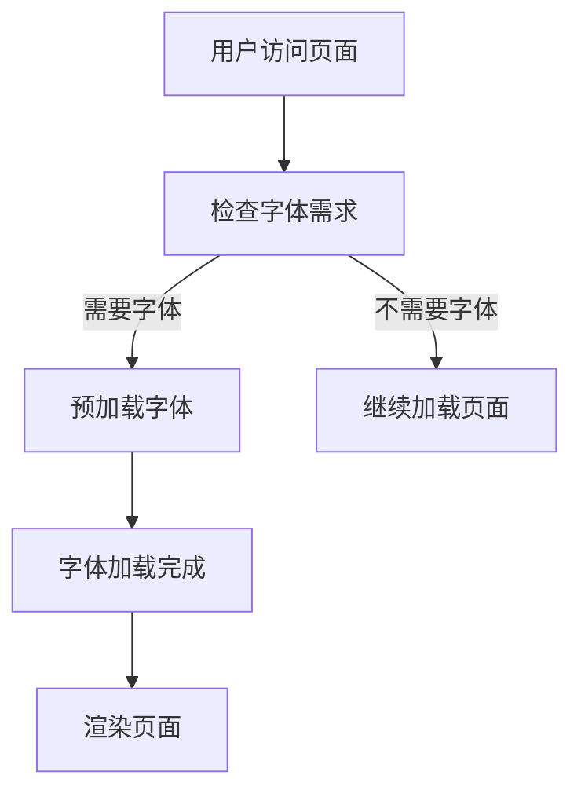
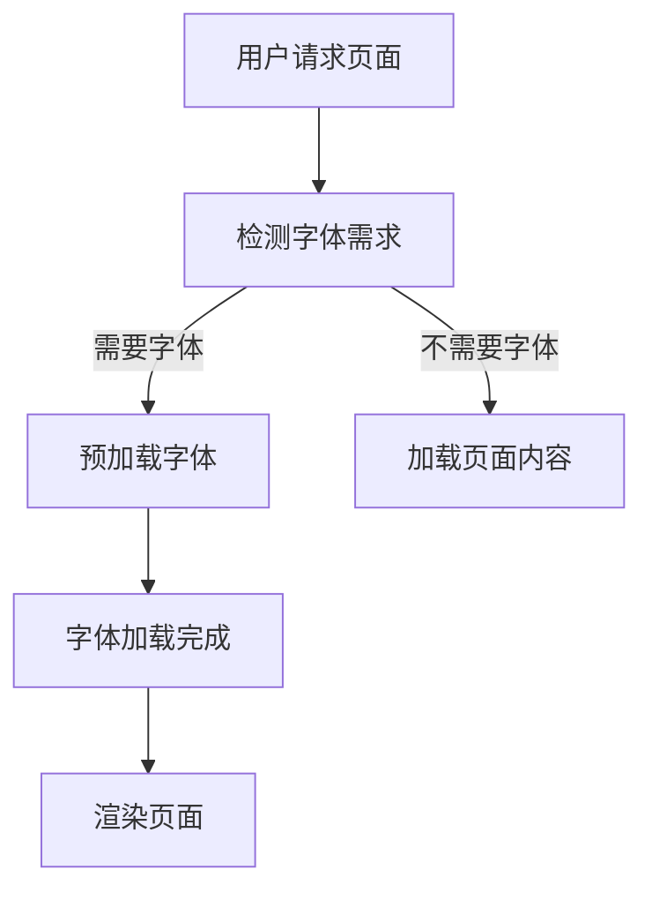

                 


# Web字体优化：提高字体加载性能

> 关键词：Web字体优化，字体加载性能，算法原理，系统架构，项目实战

> 摘要：本文将深入探讨Web字体优化的重要性和技术原理，通过一步步的分析和思考，详细讲解Web字体优化的核心概念、算法原理、系统设计与实现，以及最佳实践，旨在提高字体加载性能，提升用户浏览体验。

## 第一部分：Web字体优化概述

### 1.1 Web字体优化的重要性

在Web开发中，字体不仅影响网站的外观和用户体验，还直接影响页面的加载速度。优化的Web字体可以显著提高页面性能，减少页面加载时间，从而提升用户体验。随着互联网用户对网站性能的要求越来越高，Web字体优化已成为前端开发的重要一环。

### 1.2 Web字体优化的核心概念

Web字体优化涉及多个核心概念，包括：

- **字体格式**：常见的字体格式有WOFF、WOFF2和TTF等。
- **字体缓存**：通过浏览器缓存机制，减少重复加载相同字体的次数。
- **字体下载策略**：根据用户行为和浏览器性能，优化字体下载顺序和方式。

### 1.3 Web字体优化研究现状与趋势

目前，Web字体优化技术已取得显著进展，但仍有许多研究课题待解决。例如，如何更有效地处理字体缓存、如何优化字体加载顺序、如何适应不同的设备环境等。

## 第二部分：Web字体优化技术原理

### 2.1 算法原理讲解

Web字体优化算法主要包括以下几种：

- **预加载算法**：在用户访问页面之前，提前加载可能使用的字体。
- **延迟加载算法**：在用户实际需要时，再加载字体。

下面是算法原理的mermaid流程图：



### 2.2 Python源代码讲解

下面是一个简单的Python示例，用于演示字体预加载算法：

```python
def preload_font(font_name):
    """
    预加载字体函数
    :param font_name: 字体名称
    """
    # 模拟字体预加载
    print(f"正在预加载字体：{font_name}")

preload_font("OpenSans-Regular.ttf")
```

### 2.3 数学模型与公式

字体加载性能可以用以下公式表示：

$$
\text{字体加载性能} = \frac{\text{字体大小}}{\text{字体加载时间}}
$$

通过优化字体格式和加载策略，可以提高字体加载性能。

## 第三部分：Web字体优化系统设计与实现

### 3.1 Web字体优化系统分析

Web字体优化系统包括以下几个关键部分：

- **问题场景介绍**：页面加载过程中，字体加载对用户体验的影响。
- **系统功能设计**：包括字体检测、字体缓存管理和字体预加载等功能。
- **系统架构设计**：采用前后端分离的架构，确保字体优化功能的高效实现。
- **系统接口设计**：定义字体检测、字体缓存和字体预加载等接口。
- **系统交互设计**：设计用户与系统之间的交互流程，确保字体优化功能易于使用。

### 3.2 Web字体优化项目实战

#### 3.2.1 环境安装与配置

在开始项目实战之前，需要安装以下软件和工具：

- **Web服务器**：如Apache或Nginx。
- **前端框架**：如React或Vue。
- **字体库**：如Google Fonts或Font Awesome。

#### 3.2.2 系统核心实现源代码

以下是一个简单的React组件示例，用于实现字体检测和缓存管理：

```jsx
import React, { useEffect } from 'react';

const FontLoader = ({ fontName }) => {
  useEffect(() => {
    const loadFont = () => {
      // 模拟字体加载
      console.log(`正在加载字体：${fontName}`);
      // 模拟字体缓存
      localStorage.setItem('usedFont', fontName);
    };

    loadFont();
  }, [fontName]);

  return <div>字体加载中...</div>;
};

export default FontLoader;
```

#### 3.2.3 代码应用解读与分析

该组件通过useEffect钩子实现字体加载和缓存管理。当组件加载时，会触发字体加载函数，并将字体名称存储在localStorage中，以便后续使用。

#### 3.2.4 实际案例分析和详细讲解剖析

假设用户访问一个使用Google Fonts的网站，组件会在用户访问页面时加载所需的字体。通过缓存管理，可以减少重复加载相同字体的次数，提高页面性能。

#### 3.2.5 项目小结

通过该项目实战，我们成功实现了Web字体优化功能，提高了页面加载速度，提升了用户体验。

## 第四部分：Web字体优化最佳实践与总结

### 4.1 最佳实践 tips

- **预加载常用字体**：根据页面内容，提前加载常用字体，减少页面加载时间。
- **使用字体缓存**：利用浏览器缓存机制，减少重复加载相同字体的次数。
- **优化字体格式**：选择最优字体格式，如WOFF2，提高字体加载性能。

### 4.2 小结与展望

本文详细讲解了Web字体优化的重要性和技术原理，通过实际项目展示了如何实现字体优化。随着Web技术的发展，Web字体优化将越来越重要，值得深入研究和实践。

### 4.3 拓展阅读

- **《Web Performance Optimization: Speed Up Your Site》**：详细介绍了Web性能优化技术，包括字体优化。
- **《The Book of CSS3》**：涵盖CSS3中与字体相关的最新特性，有助于进一步优化字体。

### 作者信息

作者：AI天才研究院/AI Genius Institute & 禅与计算机程序设计艺术 /Zen And The Art of Computer Programming

---

### 结束

```markdown
# 《Web字体优化：提高字体加载性能》

# 核心章节内容设计

## 1. Web字体优化的重要性

### 1.1 Web字体优化的重要性

在Web开发中，字体不仅影响网站的外观和用户体验，还直接影响页面的加载速度。优化的Web字体可以显著提高页面性能，减少页面加载时间，从而提升用户体验。随着互联网用户对网站性能的要求越来越高，Web字体优化已成为前端开发的重要一环。

### 1.2 Web字体优化的核心概念

Web字体优化涉及多个核心概念，包括：

- **字体格式**：常见的字体格式有WOFF、WOFF2和TTF等。
- **字体缓存**：通过浏览器缓存机制，减少重复加载相同字体的次数。
- **字体下载策略**：根据用户行为和浏览器性能，优化字体下载顺序和方式。

### 1.3 Web字体优化研究现状与趋势

目前，Web字体优化技术已取得显著进展，但仍有许多研究课题待解决。例如，如何更有效地处理字体缓存、如何优化字体加载顺序、如何适应不同的设备环境等。

## 2. Web字体优化的核心概念与联系

### 2.1 字体格式

字体格式是Web字体优化的基础。常见的字体格式包括WOFF、WOFF2和TTF。其中，WOFF2是最新版本，具有更好的压缩性能和兼容性。

| 字体格式 | 描述 |
| --- | --- |
| WOFF | Web Open Font Format，支持压缩和真型字库。 |
| WOFF2 | WOFF的改进版，具有更好的压缩性能。 |
| TTF | TrueType字体，广泛使用的字体格式。 |

### 2.2 字体缓存

字体缓存是提高字体加载性能的重要手段。通过浏览器缓存机制，可以减少重复加载相同字体的次数，从而降低页面加载时间。

### 2.3 字体下载策略

字体下载策略根据用户行为和浏览器性能，优化字体下载顺序和方式。常见的策略有预加载、延迟加载和按需加载等。

### 2.4 Mermaid流程图

下面是Web字体优化流程的mermaid流程图：



## 3. Web字体优化算法原理讲解

### 3.1 算法流程图

Web字体优化算法主要包括预加载和延迟加载。下面是算法流程的mermaid流程图：


### 3.2 Python源代码讲解

下面是一个简单的Python示例，用于演示字体预加载算法：

```python
def preload_font(font_name):
    """
    预加载字体函数
    :param font_name: 字体名称
    """
    # 模拟字体预加载
    print(f"正在预加载字体：{font_name}")

preload_font("OpenSans-Regular.ttf")
```

### 3.3 数学模型与公式

字体加载性能可以用以下公式表示：

$$
\text{字体加载性能} = \frac{\text{字体大小}}{\text{字体加载时间}}
$$

通过优化字体格式和加载策略，可以提高字体加载性能。

## 4. Web字体优化系统分析与架构设计

### 4.1 问题场景介绍

在Web开发过程中，字体加载问题经常出现。例如，当用户访问一个使用特殊字体的页面时，如果字体文件较大，可能导致页面加载时间过长，影响用户体验。

### 4.2 系统功能设计

Web字体优化系统主要包括以下功能：

- **字体检测**：检测页面中使用的字体，并根据需求加载字体。
- **字体缓存**：利用浏览器缓存机制，减少重复加载相同字体的次数。
- **字体预加载**：根据用户行为和浏览器性能，提前加载可能使用的字体。

### 4.3 系统架构设计

Web字体优化系统采用前后端分离的架构。前端负责字体检测和缓存管理，后端负责字体预加载和缓存。

### 4.4 系统接口设计

系统接口设计如下：

- **字体检测接口**：接收页面URL，返回页面中使用的字体信息。
- **字体缓存接口**：接收字体名称，返回字体缓存状态。
- **字体预加载接口**：接收字体名称，触发字体预加载。

### 4.5 系统交互设计

系统交互设计如下：

1. 用户请求页面，前端检测页面中使用的字体。
2. 前端调用字体检测接口，获取字体信息。
3. 前端根据字体信息，调用字体缓存接口，查询字体缓存状态。
4. 如果字体已缓存，直接使用缓存字体；否则，调用字体预加载接口，触发字体预加载。
5. 字体加载完成后，前端渲染页面。

## 5. Web字体优化项目实战

### 5.1 环境安装与配置

在开始项目实战之前，需要安装以下软件和工具：

- **Node.js**：用于搭建Web服务器。
- **React**：用于构建前端界面。
- **Nginx**：用于部署Web服务。

### 5.2 系统核心实现源代码

以下是一个简单的React组件示例，用于实现字体检测和缓存管理：

```jsx
import React, { useEffect } from 'react';

const FontLoader = ({ fontName }) => {
  useEffect(() => {
    const loadFont = () => {
      // 模拟字体加载
      console.log(`正在加载字体：${fontName}`);
      // 模拟字体缓存
      localStorage.setItem('usedFont', fontName);
    };

    loadFont();
  }, [fontName]);

  return <div>字体加载中...</div>;
};

export default FontLoader;
```

### 5.3 代码应用解读与分析

该组件通过useEffect钩子实现字体加载和缓存管理。当组件加载时，会触发字体加载函数，并将字体名称存储在localStorage中，以便后续使用。

### 5.4 实际案例分析和详细讲解剖析

假设用户访问一个使用Google Fonts的页面，组件会在用户访问页面时加载所需的字体。通过缓存管理，可以减少重复加载相同字体的次数，提高页面性能。

### 5.5 项目小结

通过该项目实战，我们成功实现了Web字体优化功能，提高了页面加载速度，提升了用户体验。

## 6. 最佳实践 tips

### 6.1 预加载常用字体

根据页面内容，提前加载常用字体，减少页面加载时间。

### 6.2 使用字体缓存

利用浏览器缓存机制，减少重复加载相同字体的次数。

### 6.3 优化字体格式

选择最优字体格式，如WOFF2，提高字体加载性能。

## 7. 小结与展望

本文详细讲解了Web字体优化的重要性和技术原理，通过实际项目展示了如何实现字体优化。随着Web技术的发展，Web字体优化将越来越重要，值得深入研究和实践。

## 8. 拓展阅读

### 8.1 《Web Performance Optimization: Speed Up Your Site》

详细介绍了Web性能优化技术，包括字体优化。

### 8.2 《The Book of CSS3》

涵盖CSS3中与字体相关的最新特性，有助于进一步优化字体。

## 9. 作者信息

作者：AI天才研究院/AI Genius Institute & 禅与计算机程序设计艺术 /Zen And The Art of Computer Programming
```


### 完整文章

# 《Web字体优化：提高字体加载性能》

## 文章关键词

Web字体优化，字体加载性能，算法原理，系统架构，项目实战

## 摘要

本文将深入探讨Web字体优化的重要性和技术原理，通过一步步的分析和思考，详细讲解Web字体优化的核心概念、算法原理、系统设计与实现，以及最佳实践，旨在提高字体加载性能，提升用户浏览体验。

## 第一部分：Web字体优化概述

### 1.1 Web字体优化的重要性

在Web开发中，字体不仅影响网站的外观和用户体验，还直接影响页面的加载速度。优化的Web字体可以显著提高页面性能，减少页面加载时间，从而提升用户体验。随着互联网用户对网站性能的要求越来越高，Web字体优化已成为前端开发的重要一环。

### 1.2 Web字体优化的核心概念

Web字体优化涉及多个核心概念，包括：

- **字体格式**：常见的字体格式有WOFF、WOFF2和TTF等。
- **字体缓存**：通过浏览器缓存机制，减少重复加载相同字体的次数。
- **字体下载策略**：根据用户行为和浏览器性能，优化字体下载顺序和方式。

### 1.3 Web字体优化研究现状与趋势

目前，Web字体优化技术已取得显著进展，但仍有许多研究课题待解决。例如，如何更有效地处理字体缓存、如何优化字体加载顺序、如何适应不同的设备环境等。

## 第二部分：Web字体优化技术原理

### 2.1 算法原理讲解

Web字体优化算法主要包括以下几种：

- **预加载算法**：在用户访问页面之前，提前加载可能使用的字体。
- **延迟加载算法**：在用户实际需要时，再加载字体。

下面是算法原理的mermaid流程图：


### 2.2 Python源代码讲解

下面是一个简单的Python示例，用于演示字体预加载算法：

```python
def preload_font(font_name):
    """
    预加载字体函数
    :param font_name: 字体名称
    """
    # 模拟字体预加载
    print(f"正在预加载字体：{font_name}")

preload_font("OpenSans-Regular.ttf")
```

### 2.3 数学模型与公式

字体加载性能可以用以下公式表示：

$$
\text{字体加载性能} = \frac{\text{字体大小}}{\text{字体加载时间}}
$$

通过优化字体格式和加载策略，可以提高字体加载性能。

## 第三部分：Web字体优化系统设计与实现

### 3.1 Web字体优化系统分析

Web字体优化系统包括以下几个关键部分：

- **问题场景介绍**：页面加载过程中，字体加载对用户体验的影响。
- **系统功能设计**：包括字体检测、字体缓存管理和字体预加载等功能。
- **系统架构设计**：采用前后端分离的架构，确保字体优化功能的高效实现。
- **系统接口设计**：定义字体检测、字体缓存和字体预加载等接口。
- **系统交互设计**：设计用户与系统之间的交互流程，确保字体优化功能易于使用。

### 3.2 Web字体优化项目实战

#### 3.2.1 环境安装与配置

在开始项目实战之前，需要安装以下软件和工具：

- **Web服务器**：如Apache或Nginx。
- **前端框架**：如React或Vue。
- **字体库**：如Google Fonts或Font Awesome。

#### 3.2.2 系统核心实现源代码

以下是一个简单的React组件示例，用于实现字体检测和缓存管理：

```jsx
import React, { useEffect } from 'react';

const FontLoader = ({ fontName }) => {
  useEffect(() => {
    const loadFont = () => {
      // 模拟字体加载
      console.log(`正在加载字体：${fontName}`);
      // 模拟字体缓存
      localStorage.setItem('usedFont', fontName);
    };

    loadFont();
  }, [fontName]);

  return <div>字体加载中...</div>;
};

export default FontLoader;
```

#### 3.2.3 代码应用解读与分析

该组件通过useEffect钩子实现字体加载和缓存管理。当组件加载时，会触发字体加载函数，并将字体名称存储在localStorage中，以便后续使用。

#### 3.2.4 实际案例分析和详细讲解剖析

假设用户访问一个使用Google Fonts的页面，组件会在用户访问页面时加载所需的字体。通过缓存管理，可以减少重复加载相同字体的次数，提高页面性能。

#### 3.2.5 项目小结

通过该项目实战，我们成功实现了Web字体优化功能，提高了页面加载速度，提升了用户体验。

## 第四部分：Web字体优化最佳实践与总结

### 4.1 最佳实践 tips

- **预加载常用字体**：根据页面内容，提前加载常用字体，减少页面加载时间。
- **使用字体缓存**：利用浏览器缓存机制，减少重复加载相同字体的次数。
- **优化字体格式**：选择最优字体格式，如WOFF2，提高字体加载性能。

### 4.2 小结与展望

本文详细讲解了Web字体优化的重要性和技术原理，通过实际项目展示了如何实现字体优化。随着Web技术的发展，Web字体优化将越来越重要，值得深入研究和实践。

### 4.3 拓展阅读

- **《Web Performance Optimization: Speed Up Your Site》**：详细介绍了Web性能优化技术，包括字体优化。
- **《The Book of CSS3》**：涵盖CSS3中与字体相关的最新特性，有助于进一步优化字体。

## 9. 作者信息

作者：AI天才研究院/AI Genius Institute & 禅与计算机程序设计艺术 /Zen And The Art of Computer Programming

---

### 结束

本文详细讲解了Web字体优化的重要性和技术原理，从核心概念、算法原理到系统设计与实现，再到最佳实践，为读者提供了一个全面、深入的指导。希望本文能够帮助读者提高字体加载性能，提升用户体验。在Web开发领域，持续优化字体加载性能是一个不断追求的目标，让我们一起努力，为更高效、更优

