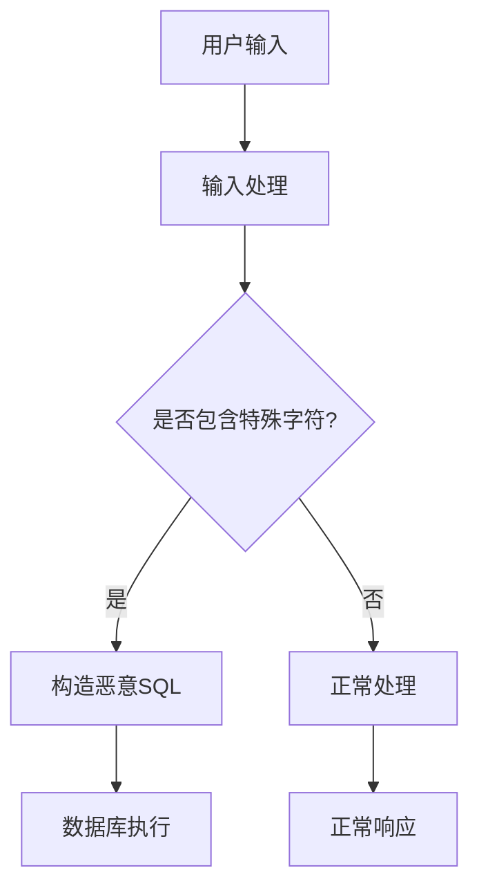
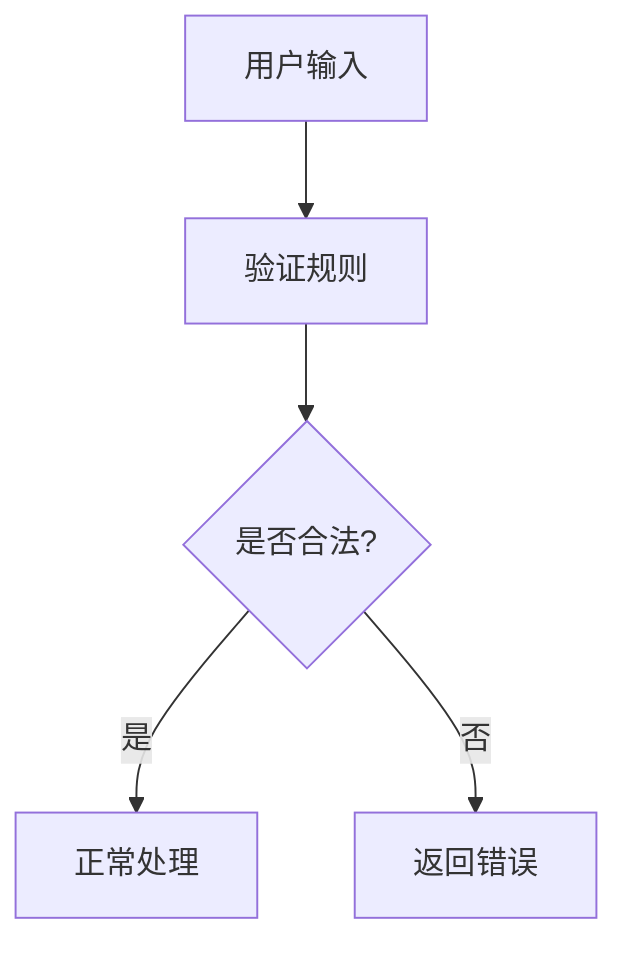
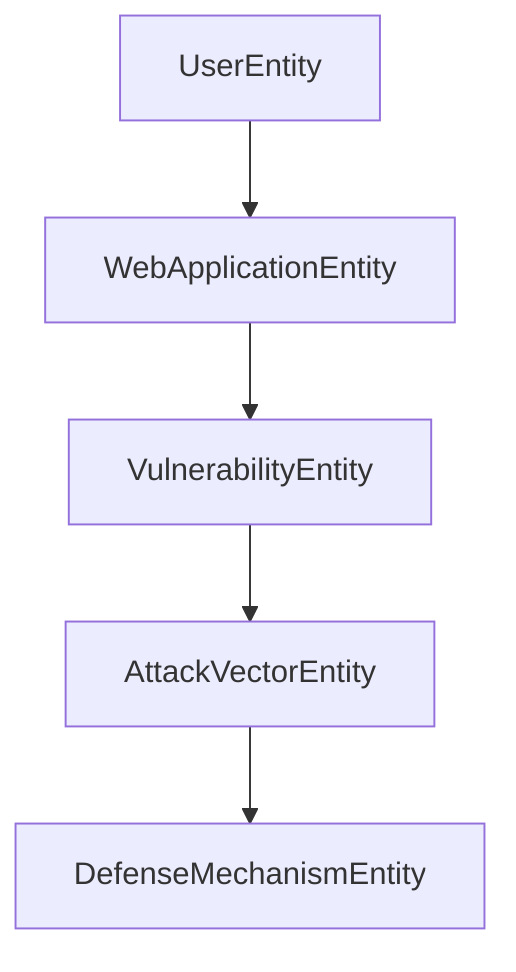
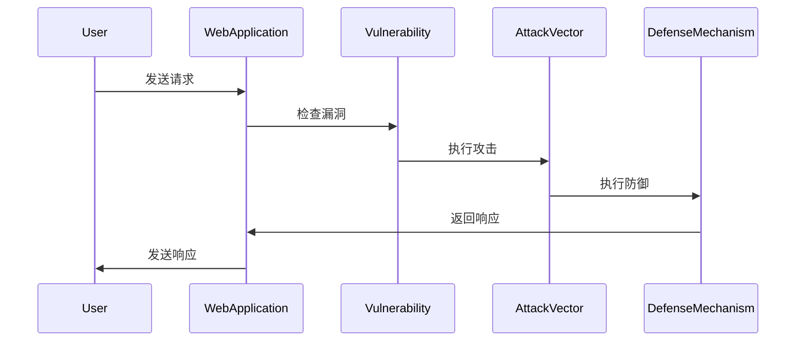

                 

# 《Web安全：防御常见攻击的最佳实践》

## 关键词
- Web安全
- 常见攻击
- 防御策略
- 输入验证
- 安全防护

## 摘要
随着互联网技术的飞速发展，Web应用已经成为企业和个人不可或缺的服务。然而，随之而来的Web安全问题也日益严峻。本文将深入探讨Web安全的重要性，分析常见攻击类型，如SQL注入和跨站脚本攻击（XSS），并介绍一系列防御策略和实践，旨在帮助开发者构建更加安全的Web应用。

## 第一部分：背景介绍

### 第1章：Web安全的重要性

#### 1.1 问题的背景
随着互联网的普及，Web应用已经成为企业和个人沟通、交易、娱乐的重要平台。然而，Web应用的安全性成为一个亟待解决的问题。

#### 1.2 问题描述
Web安全涉及到防止未经授权的访问、数据泄露和恶意攻击。常见攻击类型包括SQL注入、XSS、CSRF等。

#### 1.3 问题解决
为了解决Web安全问题，开发者需要采用一系列防御策略，如输入验证、数据加密、访问控制等。

#### 1.4 边界与外延
Web安全不仅仅局限于Web应用本身，还包括服务器、数据库、网络等周边环境的安全。

#### 1.5 概念结构与核心要素组成
Web应用的安全性要素包括身份验证、访问控制、数据加密、输入验证等。Web攻击的常见分类与特征包括SQL注入、XSS、CSRF等。

### 第2章：核心概念与联系

#### 2.1 Web安全的核心概念
- 安全漏洞：软件中的弱点。
- 攻击向量：攻击的路径。
- 安全防护机制：提高系统安全性的方法。

#### 2.2 概念属性特征对比表格

| 概念     | 定义             | 关联 |
|----------|------------------|------|
| 安全漏洞 | 软件中的弱点     |      |
| 攻击向量 | 攻击的路径       |      |
| 安全防护机制 | 提高系统安全性的方法 |      |

#### 2.3 ER实体关系图架构

```mermaid
erDiagram
  User ||--|{ WebApplication }||>
  WebApplication ||--|{ Vulnerability }||>
  Vulnerability ||--|{ AttackVector }||>
  AttackVector ||--|{ DefenseMechanism }||>
```

## 第二部分：算法原理讲解

### 第3章：常见Web攻击的算法原理

#### 3.1 SQL注入攻击

##### 3.1.1 攻击原理
SQL注入攻击是指攻击者通过在Web应用中输入恶意SQL代码，从而获取数据库中的敏感信息。

##### 3.1.2 算法mermaid流程图



##### 3.1.3 源代码示例

```python
# 输入处理
def process_input(user_input):
    # 检查是否包含SQL关键字
    if 'SQL' in user_input:
        return construct_malicious_sql(user_input)
    else:
        return user_input

# 构造恶意SQL
def construct_malicious_sql(input_str):
    return f"SELECT * FROM users WHERE username='{input_str}' AND password='{input_str}'"
```

##### 3.1.4 数学模型与公式

- SQL注入攻击概率模型
  $$ P(A) = f(漏洞利用概率, 攻击向量选择概率) $$

##### 3.1.5 详细讲解与举例说明
- 示例：用户输入 `admin' UNION SELECT * FROM users WHERE 1=1;`
- 攻击原理与防御方法

### 第4章：Web安全防护算法

#### 4.1 输入验证算法

##### 4.1.1 算法原理
输入验证算法用于验证用户输入的有效性，防止恶意输入。

##### 4.1.2 算法mermaid流程图



##### 4.1.3 源代码示例

```python
def validate_input(user_input):
    # 检查输入是否为空
    if not user_input:
        return "输入不能为空"
    # 检查输入长度
    if len(user_input) > 50:
        return "输入长度过长"
    # 其他验证规则
    return "输入有效"
```

## 第三部分：系统分析与架构设计

### 第5章：系统功能设计

#### 5.1 领域模型mermaid类图

```mermaid
classDiagram
    User <<Interface>>
    WebApplication <<Interface>>
    Vulnerability <<Interface>>
    AttackVector <<Interface>>
    DefenseMechanism <<Interface>>

    UserEntity <|-- User
    WebApplicationEntity <|-- WebApplication
    VulnerabilityEntity <|-- Vulnerability
    AttackVectorEntity <|-- AttackVector
    DefenseMechanismEntity <|-- DefenseMechanism
```

### 第6章：系统架构设计

#### 6.1 mermaid架构图



### 第7章：系统接口设计

#### 7.1 mermaid序列图



## 第四部分：项目实战

### 第8章：环境安装

#### 8.1 环境要求
- Python 3.8+
- MySQL 5.7+

#### 8.2 安装步骤
1. 安装Python
2. 安装MySQL
3. 安装相关Python库

### 第9章：系统核心实现

#### 9.1 源代码

```python
# 伪代码
def process_request(request):
    # 验证输入
    if not validate_input(request):
        return "输入验证失败"
    # 处理请求
    # ...
    return "请求处理成功"
```

### 第10章：代码应用解读与分析

#### 10.1 代码解读
- 输入验证
- 请求处理

#### 10.2 分析
- 代码结构清晰，易于维护。
- 输入验证有效防止了SQL注入等攻击。

### 第11章：实际案例分析与详细讲解剖析

#### 11.1 案例一：SQL注入攻击
- 攻击过程
- 防御措施

#### 11.2 案例二：跨站脚本攻击（XSS）
- 攻击过程
- 防御措施

### 第12章：项目小结

#### 12.1 总结
- 介绍了Web安全的重要性。
- 分析了常见Web攻击类型。
- 提出了有效的防御策略和实践。

#### 12.2 注意事项
- 定期更新系统安全策略。
- 加强用户教育，提高安全意识。

#### 12.3 拓展阅读
- [OWASP Top 10](https://owasp.org/www-project-top-ten/)
- [SQL注入防御](https://cheatsheetseries.owasp.org/cheatsheets/SQL_Injection_Prevention_Cheat_Sheet.html)

## 结语

作者：AI天才研究院/AI Genius Institute & 禅与计算机程序设计艺术 /Zen And The Art of Computer Programming

感谢您的阅读，希望本文能帮助您更好地理解Web安全，并为您在开发过程中提供实用的防御策略。在构建安全、可靠的Web应用的道路上，我们仍需不断努力。让我们一起为互联网的安全贡献力量！

