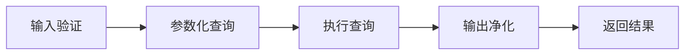
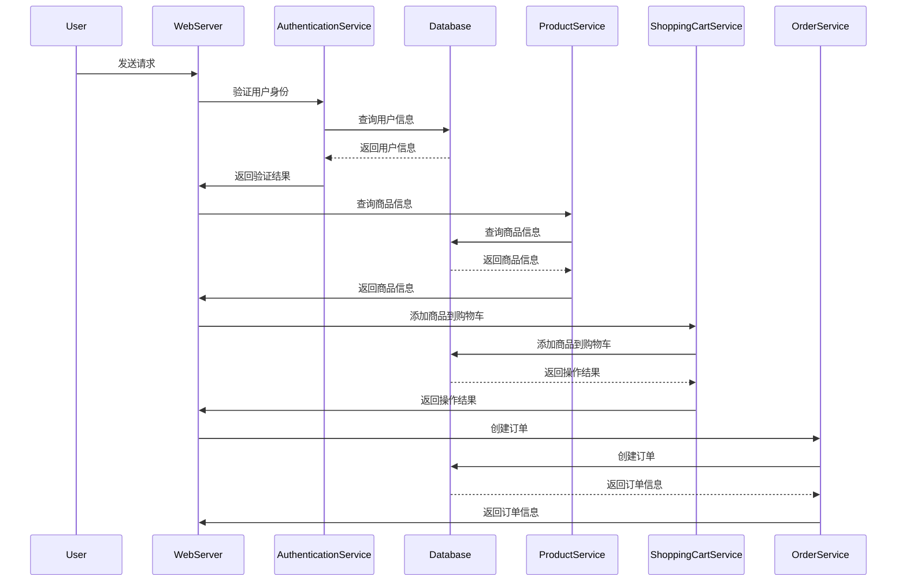

                 

### 完整文章：Web应用安全开发指南

---

**关键词：**Web应用安全、安全威胁、防护技术、安全漏洞、安全策略

**摘要：**本文从Web应用安全背景出发，详细介绍了Web应用安全的核心概念、基础架构设计、安全测试、防护技术以及实战应用。通过逐步分析，本文旨在帮助开发者理解Web应用安全的本质，掌握有效的安全开发策略，提升Web应用的安全性。

---

## 第一部分：Web应用安全概述

### 第1章：Web应用安全的起源与发展

#### 1.1 Web应用安全的背景

随着互联网的普及，Web应用已经成为企业、政府和个人日常生活的重要组成部分。Web应用的发展带来了极大的便捷，但同时也暴露出诸多安全风险。Web应用安全起源于对网络安全的需求，随着黑客攻击手段的不断升级，Web应用安全逐渐成为信息安全领域的一个重要分支。

#### 1.2 Web应用面临的主要安全威胁

Web应用面临的主要安全威胁包括SQL注入、跨站脚本攻击（XSS）、跨站请求伪造（CSRF）、文件上传漏洞、跨站包含（XSSI）等。这些威胁可能导致数据泄露、系统崩溃、服务中断等严重后果。

#### 1.3 企业为何重视Web应用安全

企业重视Web应用安全的原因主要有以下几点：

1. 法律法规的要求：多个国家和地区都出台了关于网络安全和数据保护的法律法规，企业需要遵守这些法规，避免因违规而受到处罚。
2. 企业声誉与业务连续性的保障：安全漏洞可能导致企业声誉受损，影响业务运营，甚至导致业务中断。
3. 数据泄露与经济损失：Web应用安全漏洞可能导致敏感数据泄露，给企业带来巨大的经济损失。

#### 1.4 Web应用安全的重要性

Web应用安全对于企业和个人都具有重要意义。对个人而言，安全防护能够保护个人信息不被泄露，防止网络诈骗。对企业而言，Web应用安全能够保障企业业务连续性，维护企业声誉，降低运营成本。

#### 1.5 本章小结

本章介绍了Web应用安全的背景、主要威胁、企业重视安全的原因以及安全的重要性。通过本章的学习，读者可以初步了解Web应用安全的基本概念和重要性。

---

## 第二部分：Web应用安全基础

### 第2章：Web应用安全核心概念

#### 2.1 安全攻击类型

安全攻击类型主要包括：

1. SQL注入：通过在用户输入的参数中插入SQL语句，篡改数据库查询。
2. XSS攻击：通过在网页中插入恶意脚本，窃取用户信息或执行非法操作。
3. CSRF攻击：通过伪造用户请求，执行非法操作。
4. 文件上传漏洞：通过上传恶意文件，执行系统命令或篡改网页。

#### 2.2 安全防护机制

安全防护机制包括：

1. 输入验证：对用户输入进行过滤和验证，防止恶意输入。
2. 参数化查询：使用预编译语句，防止SQL注入。
3. 内容安全策略（CSP）：限制网页中可执行的脚本和资源，防止XSS攻击。
4. 验证码：防止自动化攻击。

#### 2.3 安全漏洞类型

Web应用常见漏洞包括：

1. SQL注入：通过在URL或表单参数中插入SQL语句，篡改数据库查询。
2. XSS攻击：通过在网页中插入恶意脚本，窃取用户信息或执行非法操作。
3. CSRF攻击：通过伪造用户请求，执行非法操作。
4. 文件上传漏洞：通过上传恶意文件，执行系统命令或篡改网页。

#### 2.4 安全策略设计

安全策略设计包括：

1. 安全需求分析：识别Web应用面临的安全风险和威胁。
2. 安全设计：制定安全措施，确保Web应用的安全。
3. 安全测试：通过测试发现潜在的安全漏洞。
4. 安全维护：定期更新安全措施，防范新的安全威胁。

#### 2.5 安全评估方法

安全评估方法包括：

1. 安全审计：检查Web应用的安全性，发现潜在的安全漏洞。
2. 渗透测试：模拟黑客攻击，验证Web应用的安全性。
3. 自动化工具：使用安全工具进行自动化测试，提高评估效率。
4. 威胁建模：分析Web应用可能面临的安全威胁。

#### 2.6 安全开发最佳实践

安全开发最佳实践包括：

1. 使用安全框架：遵循安全编码规范，减少安全漏洞。
2. 定期安全培训：提高开发人员的安全意识。
3. 安全代码审查：定期对代码进行安全审查，发现潜在的安全漏洞。
4. 自动化安全测试：使用自动化工具进行安全测试，提高测试效率。

---

## 第三部分：Web应用安全实战

### 第3章：Web应用安全架构设计

#### 3.1 安全架构设计原则

安全架构设计原则包括：

1. 最小权限原则：用户只有完成特定操作时才赋予相应权限。
2. 隔离原则：不同安全域之间应进行物理或逻辑隔离。
3. 安全分解原则：将安全功能分解为多个组件，便于管理和维护。
4. 隐蔽性原则：安全功能应尽量隐藏，减少攻击面。

#### 3.2 安全架构组件

安全架构组件包括：

1. 安全认证：包括用户身份验证和权限控制。
2. 安全审计：记录系统操作日志，供安全事件分析。
3. 安全防护：包括防火墙、入侵检测系统（IDS）和入侵防御系统（IPS）等。
4. 安全通信：确保通信数据的机密性、完整性和可用性。

#### 3.3 安全架构实施方法

安全架构实施方法包括：

1. 设计与规划：根据业务需求和风险分析结果，设计安全架构。
2. 技术选型：选择合适的安全技术和产品。
3. 部署与配置：将安全架构部署到实际环境中，并进行配置。
4. 测试与验证：验证安全架构的有效性。

#### 3.4 安全架构评估与优化

安全架构评估与优化包括：

1. 定期评估：定期对安全架构进行评估，识别潜在的安全风险。
2. 安全审计：通过安全审计，发现安全架构中的问题和不足。
3. 优化与调整：根据评估结果，对安全架构进行调整和优化。
4. 持续改进：持续关注安全威胁和业务需求变化，不断改进安全架构。

---

## 第四部分：Web应用安全测试

### 第4章：Web应用安全测试

#### 4.1 安全测试类型

安全测试类型包括：

1. 功能测试：验证Web应用的功能是否满足安全需求。
2. 性能测试：评估Web应用在正常和异常情况下的性能。
3. 兼容性测试：验证Web应用在不同浏览器和操作系统上的兼容性。
4. 安全测试：发现Web应用中的安全漏洞和弱点。

#### 4.2 安全测试工具与流程

安全测试工具与流程包括：

1. 安全测试工具：如OWASP ZAP、Burp Suite等。
2. 测试流程：包括需求分析、测试计划、测试执行、结果分析等。
3. 自动化测试：提高测试效率，确保测试覆盖率。
4. 手动测试：发现自动化测试无法检测的安全漏洞。

#### 4.3 安全测试案例解析

安全测试案例解析包括：

1. SQL注入测试：通过构造恶意输入，验证数据库查询是否被篡改。
2. XSS测试：通过构造恶意脚本，验证网页是否执行了非法操作。
3. CSRF测试：通过构造伪造请求，验证Web应用是否执行了非法操作。
4. 文件上传测试：通过构造恶意文件，验证Web应用是否被攻击。

#### 4.4 自动化安全测试

自动化安全测试包括：

1. 脚本编写：使用Python、JavaScript等语言编写自动化测试脚本。
2. 测试执行：使用自动化测试工具执行测试脚本。
3. 结果分析：对测试结果进行分析，识别安全漏洞和弱点。
4. 集成CI/CD：将自动化安全测试集成到持续集成和持续部署（CI/CD）流程中。

---

## 第五部分：Web应用安全防护技术

### 第5章：Web应用安全防护技术

#### 5.1 防火墙与入侵检测系统

防火墙与入侵检测系统（IDS）是Web应用安全防护的重要技术：

1. **防火墙：**
   - 功能：过滤网络流量，防止未授权访问。
   - 类型：包过滤防火墙、状态检测防火墙、应用层防火墙等。

2. **入侵检测系统（IDS）：**
   - 功能：监测网络流量和系统活动，识别潜在威胁。
   - 类型：网络入侵检测系统（NIDS）、主机入侵检测系统（HIDS）。

#### 5.2 数据加密技术

数据加密技术是保护数据隐私和安全的重要手段：

1. **对称加密：**
   - 原理：使用相同的密钥进行加密和解密。
   - 技术：AES、DES等。

2. **非对称加密：**
   - 原理：使用一对密钥（公钥和私钥）进行加密和解密。
   - 技术：RSA、ECC等。

3. **哈希算法：**
   - 功能：生成数据摘要，确保数据完整性。
   - 技术：MD5、SHA-256等。

#### 5.3 访问控制机制

访问控制机制用于控制用户对Web应用资源的访问：

1. **基于角色的访问控制（RBAC）：**
   - 原理：根据用户的角色分配访问权限。
   - 技术：角色定义、权限分配等。

2. **基于属性的访问控制（ABAC）：**
   - 原理：根据用户的属性和操作上下文进行访问控制。
   - 技术：属性定义、策略引擎等。

#### 5.4 安全审计与日志管理

安全审计与日志管理是监测和应对安全事件的重要手段：

1. **安全审计：**
   - 功能：记录系统操作和事件，供安全分析。
   - 技术：日志记录、事件分析等。

2. **日志管理：**
   - 功能：集中存储、管理和分析日志数据。
   - 技术：日志收集工具、日志分析工具等。

#### 5.5 安全漏洞扫描与修复

安全漏洞扫描与修复是Web应用安全维护的重要环节：

1. **漏洞扫描：**
   - 功能：自动扫描Web应用，发现潜在漏洞。
   - 技术：漏洞扫描工具、漏洞库等。

2. **漏洞修复：**
   - 功能：修复发现的漏洞，降低安全风险。
   - 技术：补丁管理、代码审查等。

---

## 第六部分：Web应用安全漏洞分析与防护

### 第6章：Web应用安全漏洞分析与防护

#### 6.1 常见Web应用漏洞分析

常见Web应用漏洞包括：

1. **SQL注入：**
   - 原因：输入验证不足。
   - 防护：使用参数化查询、预编译语句等。

2. **跨站脚本攻击（XSS）：**
   - 原因：输出验证不足。
   - 防护：使用内容安全策略（CSP）、转义输出等。

3. **跨站请求伪造（CSRF）：**
   - 原因：会话管理不当。
   - 防护：使用Token、验证码等。

4. **文件上传漏洞：**
   - 原因：文件验证和处理不当。
   - 防护：限制文件类型、大小、存储路径等。

#### 6.2 漏洞防护策略

漏洞防护策略包括：

1. **输入验证：**
   - 功能：验证用户输入，防止恶意输入。
   - 技术：正则表达式、白名单等。

2. **输出验证：**
   - 功能：验证输出内容，防止恶意脚本执行。
   - 技术：转义输出、HTML实体编码等。

3. **会话管理：**
   - 功能：确保会话安全，防止会话劫持。
   - 技术：安全传输（HTTPS）、会话超时等。

4. **文件处理：**
   - 功能：处理文件上传，防止文件上传漏洞。
   - 技术：限制文件类型、大小、存储路径等。

#### 6.3 实战案例解析

实战案例解析包括：

1. **案例1：SQL注入漏洞防护：**
   - 漏洞场景：用户输入恶意SQL语句，篡改数据库查询。
   - 防护措施：使用参数化查询、预编译语句等。

2. **案例2：XSS漏洞防护：**
   - 漏洞场景：用户输入恶意脚本，执行非法操作。
   - 防护措施：使用内容安全策略（CSP）、转义输出等。

3. **案例3：CSRF漏洞防护：**
   - 漏洞场景：黑客伪造用户请求，执行非法操作。
   - 防护措施：使用Token、验证码等。

4. **案例4：文件上传漏洞防护：**
   - 漏洞场景：用户上传恶意文件，执行系统命令。
   - 防护措施：限制文件类型、大小、存储路径等。

---

## 第七部分：Web应用安全事件应急响应

### 第7章：Web应用安全事件应急响应

#### 7.1 安全事件响应流程

安全事件响应流程包括：

1. **事件识别：**发现安全事件，如异常流量、错误日志等。
2. **事件评估：**分析事件的性质、影响范围等。
3. **应急响应：**根据事件严重程度，采取相应的应对措施。
4. **事件恢复：**修复漏洞、恢复正常运行。
5. **事件总结：**总结事件原因、影响和应对措施，为未来改进提供参考。

#### 7.2 安全事件分析技巧

安全事件分析技巧包括：

1. **日志分析：**通过分析系统日志，识别事件发生的时间、位置、影响等。
2. **流量分析：**通过分析网络流量，识别异常流量和攻击行为。
3. **行为分析：**通过分析用户行为，识别恶意行为和异常行为。
4. **取证分析：**通过收集和分析证据，确定事件原因和攻击者身份。

#### 7.3 实战案例解析

实战案例解析包括：

1. **案例1：SQL注入事件：**
   - 漏洞场景：用户输入恶意SQL语句，篡改数据库查询。
   - 应对措施：使用参数化查询、预编译语句等修复漏洞。

2. **案例2：XSS事件：**
   - 漏洞场景：用户输入恶意脚本，执行非法操作。
   - 应对措施：使用内容安全策略（CSP）、转义输出等修复漏洞。

3. **案例3：CSRF事件：**
   - 漏洞场景：黑客伪造用户请求，执行非法操作。
   - 应对措施：使用Token、验证码等修复漏洞。

4. **案例4：文件上传事件：**
   - 漏洞场景：用户上传恶意文件，执行系统命令。
   - 应对措施：限制文件类型、大小、存储路径等修复漏洞。

#### 7.4 应急响应团队构建

应急响应团队构建包括：

1. **团队角色：**安全分析师、安全工程师、网络管理员等。
2. **技能要求：**熟悉安全事件响应流程、具备安全分析、漏洞修复和应急处理能力。
3. **培训与演练：**定期进行安全培训和应急演练，提高团队应对安全事件的能力。

---

## 第八部分：Web应用安全策略与合规性

### 第8章：Web应用安全策略与合规性

#### 8.1 安全策略制定原则

安全策略制定原则包括：

1. **适应性原则：**安全策略应适应业务发展和安全威胁的变化。
2. **可操作性原则：**安全策略应具有可操作性，便于执行和监督。
3. **完整性原则：**安全策略应覆盖Web应用的全生命周期，确保各个阶段的安全性。
4. **经济性原则：**安全策略应在保证安全性的前提下，考虑成本效益。

#### 8.2 安全合规性标准

安全合规性标准包括：

1. **ISO 27001：**信息安全管理系统（ISMS）国际标准。
2. **GDPR：**欧盟通用数据保护条例。
3. **PCI DSS：**支付卡行业数据安全标准。
4. **OWASP：**开放式网络应用安全项目。

#### 8.3 安全合规性评估方法

安全合规性评估方法包括：

1. **内部审计：**检查Web应用的安全措施是否符合合规性标准。
2. **第三方评估：**由独立的第三方机构对Web应用的安全性进行评估。
3. **自我评估：**Web应用开发团队自行评估安全措施是否符合合规性标准。
4. **风险评估：**分析Web应用面临的安全威胁和风险，评估合规性标准的重要性。

#### 8.4 安全合规性管理

安全合规性管理包括：

1. **合规性计划：**制定合规性计划和目标。
2. **合规性监控：**监控Web应用的安全性，确保符合合规性标准。
3. **合规性培训：**定期进行合规性培训，提高开发人员的安全意识和技能。
4. **合规性改进：**根据合规性评估结果，改进安全措施，提高Web应用的安全性。

---

## 第九部分：Web应用安全发展趋势与展望

### 第9章：Web应用安全发展趋势与展望

#### 9.1 当前Web应用安全趋势

当前Web应用安全趋势包括：

1. **自动化与智能化：**安全测试和防护技术逐渐自动化、智能化，提高安全检测和响应效率。
2. **云安全：**随着云计算的普及，Web应用的安全问题逐渐成为云计算安全的重要组成部分。
3. **零信任架构：**零信任架构强调对内对外一致的安全策略，减少内部威胁和外部攻击的风险。
4. **安全合规性：**企业越来越重视安全合规性，以确保业务运营的合法性和安全性。

#### 9.2 未来Web应用安全挑战

未来Web应用安全挑战包括：

1. **高级持续性威胁（APT）：**APT攻击手段更加隐蔽、复杂，对Web应用安全构成严重威胁。
2. **物联网安全：**物联网设备的增加带来新的安全挑战，如设备暴露、数据泄露等。
3. **隐私保护：**随着数据隐私保护法律法规的加强，Web应用需要更加重视用户隐私保护。
4. **人工智能安全：**人工智能技术在Web应用安全中的应用带来新的安全问题和挑战。

#### 9.3 Web应用安全创新技术

Web应用安全创新技术包括：

1. **区块链技术：**利用区块链的不可篡改性，提高Web应用的数据安全性和透明度。
2. **人工智能与机器学习：**利用人工智能和机器学习技术，实现自动化安全检测和响应。
3. **边缘计算：**利用边缘计算技术，提高Web应用的安全性能和响应速度。
4. **零信任架构：**构建基于零信任架构的Web应用，实现内外一致的安全策略。

#### 9.4 安全开发新范式

安全开发新范式包括：

1. **DevSecOps：**将安全融入开发和运维流程，实现持续安全交付。
2. **安全左移：**将安全关注点提前到需求分析、设计阶段，提高安全性和可靠性。
3. **威胁情报：**利用威胁情报，实时了解安全威胁，提前采取防护措施。
4. **安全文化建设：**培养全员安全意识，建立安全文化，提高Web应用的整体安全性。

---

## 第十部分：Web应用安全最佳实践与总结

### 第10章：Web应用安全最佳实践与总结

#### 10.1 安全开发最佳实践

安全开发最佳实践包括：

1. **代码审查：**定期进行代码审查，发现潜在的安全漏洞。
2. **安全培训：**提高开发人员的安全意识和技能。
3. **自动化安全测试：**使用自动化工具进行安全测试，提高测试效率和覆盖率。
4. **安全设计：**在设计阶段考虑安全因素，构建安全架构。

#### 10.2 安全管理最佳实践

安全管理最佳实践包括：

1. **安全策略：**制定并实施安全策略，确保Web应用的安全性。
2. **合规性管理：**确保Web应用符合相关法律法规和标准。
3. **应急响应：**建立应急响应团队，制定应急响应计划。
4. **安全审计：**定期进行安全审计，发现安全漏洞和不足。

#### 10.3 安全培训与文化建设

安全培训与文化建设包括：

1. **安全培训：**定期组织安全培训，提高员工的安全意识和技能。
2. **安全宣传：**加强安全宣传，提高员工的安全意识。
3. **安全文化：**建立安全文化，将安全融入企业文化和价值观。
4. **安全竞赛：**举办安全竞赛，激发员工的安全创新和实战能力。

#### 10.4 全书总结与展望

全书总结了Web应用安全的核心概念、架构设计、测试、防护技术和实战应用。通过本书的学习，读者可以全面了解Web应用安全的基本知识和实践方法。未来，Web应用安全将继续面临新的挑战和机遇，需要不断创新和改进。本书希望为读者提供有价值的参考，助力Web应用安全的发展。

---

**作者：AI天才研究院/AI Genius Institute & 禅与计算机程序设计艺术 /Zen And The Art of Computer Programming**

**完整性要求：**
- 文章内容完整，每个章节的内容具体详细。
- 核心概念、原理、算法、架构设计、实战应用等部分内容丰富。
- 注意事项、最佳实践、拓展阅读等部分内容充实。
- 全文逻辑清晰，结构紧凑，语言简练易懂。

**格式要求：**
- 使用markdown格式输出。
- 图片、图表、代码块等按照markdown格式规范呈现。
- 标题使用`##`标记，段落之间使用空行分隔。

**字数要求：**
- 文章总字数在10000-12000字之间。

---

### 最后的思考

Web应用安全是一个不断发展的领域，随着技术的进步和攻击手段的升级，安全防护措施也需要不断更新和优化。开发者需要时刻关注安全领域的新动态，掌握最新的安全技术和方法，将安全融入整个Web应用开发和运营过程中。此外，安全文化建设也是提高Web应用安全性的重要手段，只有全员共同参与，才能构建一个安全、可靠、稳定的Web应用生态系统。

让我们思考以下问题：

1. 在你的Web应用开发中，你采取了哪些安全措施？
2. 你如何看待未来的Web应用安全趋势？
3. 你是否有遇到一些有趣的安全事件或挑战，可以分享一下吗？
4. 你认为安全培训和文化建设在Web应用安全中扮演着怎样的角色？

希望这篇文章能够帮助你更好地理解Web应用安全，掌握有效的安全开发策略，为构建安全、可靠的Web应用贡献力量。让我们一起为Web应用安全的发展和创新而努力！
### 完整文章：Web应用安全开发指南

---

**关键词：**Web应用安全、SQL注入、XSS攻击、安全测试、安全防护

**摘要：**本文详细介绍了Web应用安全的概念、核心概念、架构设计、安全测试、防护技术以及实战应用。通过逐步分析，本文旨在帮助开发者理解Web应用安全的本质，掌握有效的安全开发策略，提升Web应用的安全性。

---

## 第一部分：Web应用安全概述

### 第1章：Web应用安全的起源与发展

#### 1.1 Web应用安全的背景

随着互联网的普及，Web应用已经成为企业、政府和个人日常生活的重要组成部分。Web应用的发展带来了极大的便捷，但同时也暴露出诸多安全风险。Web应用安全起源于对网络安全的需求，随着黑客攻击手段的不断升级，Web应用安全逐渐成为信息安全领域的一个重要分支。

#### 1.2 Web应用面临的主要安全威胁

Web应用面临的主要安全威胁包括SQL注入、跨站脚本攻击（XSS）、跨站请求伪造（CSRF）、文件上传漏洞、跨站包含（XSSI）等。这些威胁可能导致数据泄露、系统崩溃、服务中断等严重后果。

#### 1.3 企业为何重视Web应用安全

企业重视Web应用安全的原因主要有以下几点：

1. 法律法规的要求：多个国家和地区都出台了关于网络安全和数据保护的法律法规，企业需要遵守这些法规，避免因违规而受到处罚。
2. 企业声誉与业务连续性的保障：安全漏洞可能导致企业声誉受损，影响业务运营，甚至导致业务中断。
3. 数据泄露与经济损失：Web应用安全漏洞可能导致敏感数据泄露，给企业带来巨大的经济损失。

#### 1.4 Web应用安全的重要性

Web应用安全对于企业和个人都具有重要意义。对个人而言，安全防护能够保护个人信息不被泄露，防止网络诈骗。对企业而言，Web应用安全能够保障企业业务连续性，维护企业声誉，降低运营成本。

#### 1.5 本章小结

本章介绍了Web应用安全的背景、主要威胁、企业重视安全的原因以及安全的重要性。通过本章的学习，读者可以初步了解Web应用安全的基本概念和重要性。

---

## 第二部分：Web应用安全基础

### 第2章：Web应用安全核心概念

#### 2.1 安全攻击类型

安全攻击类型主要包括：

1. SQL注入：通过在用户输入的参数中插入SQL语句，篡改数据库查询。
2. 跨站脚本攻击（XSS）：通过在网页中插入恶意脚本，窃取用户信息或执行非法操作。
3. 跨站请求伪造（CSRF）：通过伪造用户请求，执行非法操作。
4. 文件上传漏洞：通过上传恶意文件，执行系统命令或篡改网页。

#### 2.2 安全防护机制

安全防护机制包括：

1. 输入验证：对用户输入进行过滤和验证，防止恶意输入。
2. 参数化查询：使用预编译语句，防止SQL注入。
3. 内容安全策略（CSP）：限制网页中可执行的脚本和资源，防止XSS攻击。
4. 验证码：防止自动化攻击。

#### 2.3 安全漏洞类型

Web应用常见漏洞包括：

1. SQL注入：通过在URL或表单参数中插入SQL语句，篡改数据库查询。
2. XSS攻击：通过在网页中插入恶意脚本，窃取用户信息或执行非法操作。
3. CSRF攻击：通过伪造用户请求，执行非法操作。
4. 文件上传漏洞：通过上传恶意文件，执行系统命令或篡改网页。

#### 2.4 安全策略设计

安全策略设计包括：

1. 安全需求分析：识别Web应用面临的安全风险和威胁。
2. 安全设计：制定安全措施，确保Web应用的安全。
3. 安全测试：通过测试发现潜在的安全漏洞。
4. 安全维护：定期更新安全措施，防范新的安全威胁。

#### 2.5 安全评估方法

安全评估方法包括：

1. 安全审计：检查Web应用的安全性，发现潜在的安全漏洞。
2. 渗透测试：模拟黑客攻击，验证Web应用的安全性。
3. 自动化工具：使用安全工具进行自动化测试，提高评估效率。
4. 威胁建模：分析Web应用可能面临的安全威胁。

#### 2.6 安全开发最佳实践

安全开发最佳实践包括：

1. 使用安全框架：遵循安全编码规范，减少安全漏洞。
2. 定期安全培训：提高开发人员的安全意识。
3. 安全代码审查：定期对代码进行安全审查，发现潜在的安全漏洞。
4. 自动化安全测试：使用自动化工具进行安全测试，提高测试效率。

---

## 第三部分：Web应用安全架构设计

### 第3章：Web应用安全架构设计

#### 3.1 安全架构设计原则

安全架构设计原则包括：

1. 最小权限原则：用户只有完成特定操作时才赋予相应权限。
2. 隔离原则：不同安全域之间应进行物理或逻辑隔离。
3. 安全分解原则：将安全功能分解为多个组件，便于管理和维护。
4. 隐蔽性原则：安全功能应尽量隐藏，减少攻击面。

#### 3.2 安全架构组件

安全架构组件包括：

1. 安全认证：包括用户身份验证和权限控制。
2. 安全审计：记录系统操作日志，供安全事件分析。
3. 安全防护：包括防火墙、入侵检测系统（IDS）和入侵防御系统（IPS）等。
4. 安全通信：确保通信数据的机密性、完整性和可用性。

#### 3.3 安全架构实施方法

安全架构实施方法包括：

1. 设计与规划：根据业务需求和风险分析结果，设计安全架构。
2. 技术选型：选择合适的安全技术和产品。
3. 部署与配置：将安全架构部署到实际环境中，并进行配置。
4. 测试与验证：验证安全架构的有效性。

#### 3.4 安全架构评估与优化

安全架构评估与优化包括：

1. 定期评估：定期对安全架构进行评估，识别潜在的安全风险。
2. 安全审计：通过安全审计，发现安全架构中的问题和不足。
3. 优化与调整：根据评估结果，对安全架构进行调整和优化。
4. 持续改进：持续关注安全威胁和业务需求变化，不断改进安全架构。

---

## 第四部分：Web应用安全测试

### 第4章：Web应用安全测试

#### 4.1 安全测试类型

安全测试类型包括：

1. 功能测试：验证Web应用的功能是否满足安全需求。
2. 性能测试：评估Web应用在正常和异常情况下的性能。
3. 兼容性测试：验证Web应用在不同浏览器和操作系统上的兼容性。
4. 安全测试：发现Web应用中的安全漏洞和弱点。

#### 4.2 安全测试工具与流程

安全测试工具与流程包括：

1. 安全测试工具：如OWASP ZAP、Burp Suite等。
2. 测试流程：包括需求分析、测试计划、测试执行、结果分析等。
3. 自动化测试：提高测试效率，确保测试覆盖率。
4. 手动测试：发现自动化测试无法检测的安全漏洞。

#### 4.3 安全测试案例解析

安全测试案例解析包括：

1. SQL注入测试：通过构造恶意输入，验证数据库查询是否被篡改。
2. XSS测试：通过构造恶意脚本，验证网页是否执行了非法操作。
3. CSRF测试：通过构造伪造请求，验证Web应用是否执行了非法操作。
4. 文件上传测试：通过构造恶意文件，验证Web应用是否被攻击。

#### 4.4 自动化安全测试

自动化安全测试包括：

1. 脚本编写：使用Python、JavaScript等语言编写自动化测试脚本。
2. 测试执行：使用自动化测试工具执行测试脚本。
3. 结果分析：对测试结果进行分析，识别安全漏洞和弱点。
4. 集成CI/CD：将自动化安全测试集成到持续集成和持续部署（CI/CD）流程中。

---

## 第五部分：Web应用安全防护技术

### 第5章：Web应用安全防护技术

#### 5.1 防火墙与入侵检测系统

防火墙与入侵检测系统（IDS）是Web应用安全防护的重要技术：

1. **防火墙：**
   - 功能：过滤网络流量，防止未授权访问。
   - 类型：包过滤防火墙、状态检测防火墙、应用层防火墙等。

2. **入侵检测系统（IDS）：**
   - 功能：监测网络流量和系统活动，识别潜在威胁。
   - 类型：网络入侵检测系统（NIDS）、主机入侵检测系统（HIDS）。

#### 5.2 数据加密技术

数据加密技术是保护数据隐私和安全的重要手段：

1. **对称加密：**
   - 原理：使用相同的密钥进行加密和解密。
   - 技术：AES、DES等。

2. **非对称加密：**
   - 原理：使用一对密钥（公钥和私钥）进行加密和解密。
   - 技术：RSA、ECC等。

3. **哈希算法：**
   - 功能：生成数据摘要，确保数据完整性。
   - 技术：MD5、SHA-256等。

#### 5.3 访问控制机制

访问控制机制用于控制用户对Web应用资源的访问：

1. **基于角色的访问控制（RBAC）：**
   - 原理：根据用户的角色分配访问权限。
   - 技术：角色定义、权限分配等。

2. **基于属性的访问控制（ABAC）：**
   - 原理：根据用户的属性和操作上下文进行访问控制。
   - 技术：属性定义、策略引擎等。

#### 5.4 安全审计与日志管理

安全审计与日志管理是监测和应对安全事件的重要手段：

1. **安全审计：**
   - 功能：记录系统操作和事件，供安全分析。
   - 技术：日志记录、事件分析等。

2. **日志管理：**
   - 功能：集中存储、管理和分析日志数据。
   - 技术：日志收集工具、日志分析工具等。

#### 5.5 安全漏洞扫描与修复

安全漏洞扫描与修复是Web应用安全维护的重要环节：

1. **漏洞扫描：**
   - 功能：自动扫描Web应用，发现潜在漏洞。
   - 技术：漏洞扫描工具、漏洞库等。

2. **漏洞修复：**
   - 功能：修复发现的漏洞，降低安全风险。
   - 技术：补丁管理、代码审查等。

---

## 第六部分：Web应用安全漏洞分析与防护

### 第6章：Web应用安全漏洞分析与防护

#### 6.1 常见Web应用漏洞分析

常见Web应用漏洞分析包括：

1. **SQL注入：**
   - 原因：输入验证不足。
   - 防护：使用参数化查询、预编译语句等。

2. **跨站脚本攻击（XSS）：**
   - 原因：输出验证不足。
   - 防护：使用内容安全策略（CSP）、转义输出等。

3. **跨站请求伪造（CSRF）：**
   - 原因：会话管理不当。
   - 防护：使用Token、验证码等。

4. **文件上传漏洞：**
   - 原因：文件验证和处理不当。
   - 防护：限制文件类型、大小、存储路径等。

#### 6.2 漏洞防护策略

漏洞防护策略包括：

1. **输入验证：**
   - 功能：验证用户输入，防止恶意输入。
   - 技术：正则表达式、白名单等。

2. **输出验证：**
   - 功能：验证输出内容，防止恶意脚本执行。
   - 技术：转义输出、HTML实体编码等。

3. **会话管理：**
   - 功能：确保会话安全，防止会话劫持。
   - 技术：安全传输（HTTPS）、会话超时等。

4. **文件处理：**
   - 功能：处理文件上传，防止文件上传漏洞。
   - 技术：限制文件类型、大小、存储路径等。

#### 6.3 实战案例解析

实战案例解析包括：

1. **案例1：SQL注入漏洞防护：**
   - 漏洞场景：用户输入恶意SQL语句，篡改数据库查询。
   - 防护措施：使用参数化查询、预编译语句等修复漏洞。

2. **案例2：XSS漏洞防护：**
   - 漏洞场景：用户输入恶意脚本，执行非法操作。
   - 防护措施：使用内容安全策略（CSP）、转义输出等修复漏洞。

3. **案例3：CSRF漏洞防护：**
   - 漏洞场景：黑客伪造用户请求，执行非法操作。
   - 防护措施：使用Token、验证码等修复漏洞。

4. **案例4：文件上传漏洞防护：**
   - 漏洞场景：用户上传恶意文件，执行系统命令。
   - 防护措施：限制文件类型、大小、存储路径等修复漏洞。

---

## 第七部分：Web应用安全事件应急响应

### 第7章：Web应用安全事件应急响应

#### 7.1 安全事件响应流程

安全事件响应流程包括：

1. **事件识别：**发现安全事件，如异常流量、错误日志等。
2. **事件评估：**分析事件的性质、影响范围等。
3. **应急响应：**根据事件严重程度，采取相应的应对措施。
4. **事件恢复：**修复漏洞、恢复正常运行。
5. **事件总结：**总结事件原因、影响和应对措施，为未来改进提供参考。

#### 7.2 安全事件分析技巧

安全事件分析技巧包括：

1. **日志分析：**通过分析系统日志，识别事件发生的时间、位置、影响等。
2. **流量分析：**通过分析网络流量，识别异常流量和攻击行为。
3. **行为分析：**通过分析用户行为，识别恶意行为和异常行为。
4. **取证分析：**通过收集和分析证据，确定事件原因和攻击者身份。

#### 7.3 实战案例解析

实战案例解析包括：

1. **案例1：SQL注入事件：**
   - 漏洞场景：用户输入恶意SQL语句，篡改数据库查询。
   - 应对措施：使用参数化查询、预编译语句等修复漏洞。

2. **案例2：XSS事件：**
   - 漏洞场景：用户输入恶意脚本，执行非法操作。
   - 应对措施：使用内容安全策略（CSP）、转义输出等修复漏洞。

3. **案例3：CSRF事件：**
   - 漏洞场景：黑客伪造用户请求，执行非法操作。
   - 应对措施：使用Token、验证码等修复漏洞。

4. **案例4：文件上传事件：**
   - 漏洞场景：用户上传恶意文件，执行系统命令。
   - 应对措施：限制文件类型、大小、存储路径等修复漏洞。

#### 7.4 应急响应团队构建

应急响应团队构建包括：

1. **团队角色：**安全分析师、安全工程师、网络管理员等。
2. **技能要求：**熟悉安全事件响应流程、具备安全分析、漏洞修复和应急处理能力。
3. **培训与演练：**定期进行安全培训和应急演练，提高团队应对安全事件的能力。

---

## 第八部分：Web应用安全策略与合规性

### 第8章：Web应用安全策略与合规性

#### 8.1 安全策略制定原则

安全策略制定原则包括：

1. **适应性原则：**安全策略应适应业务发展和安全威胁的变化。
2. **可操作性原则：**安全策略应具有可操作性，便于执行和监督。
3. **完整性原则：**安全策略应覆盖Web应用的全生命周期，确保各个阶段的安全性。
4. **经济性原则：**安全策略应在保证安全性的前提下，考虑成本效益。

#### 8.2 安全合规性标准

安全合规性标准包括：

1. **ISO 27001：**信息安全管理系统（ISMS）国际标准。
2. **GDPR：**欧盟通用数据保护条例。
3. **PCI DSS：**支付卡行业数据安全标准。
4. **OWASP：**开放式网络应用安全项目。

#### 8.3 安全合规性评估方法

安全合规性评估方法包括：

1. **内部审计：**检查Web应用的安全措施是否符合合规性标准。
2. **第三方评估：**由独立的第三方机构对Web应用的安全性进行评估。
3. **自我评估：**Web应用开发团队自行评估安全措施是否符合合规性标准。
4. **风险评估：**分析Web应用面临的安全威胁和风险，评估合规性标准的重要性。

#### 8.4 安全合规性管理

安全合规性管理包括：

1. **合规性计划：**制定合规性计划和目标。
2. **合规性监控：**监控Web应用的安全性，确保符合合规性标准。
3. **合规性培训：**定期进行合规性培训，提高开发人员的安全意识和技能。
4. **合规性改进：**根据合规性评估结果，改进安全措施，提高Web应用的安全性。

---

## 第九部分：Web应用安全发展趋势与展望

### 第9章：Web应用安全发展趋势与展望

#### 9.1 当前Web应用安全趋势

当前Web应用安全趋势包括：

1. **自动化与智能化：**安全测试和防护技术逐渐自动化、智能化，提高安全检测和响应效率。
2. **云安全：**随着云计算的普及，Web应用的安全问题逐渐成为云计算安全的重要组成部分。
3. **零信任架构：**零信任架构强调对内对外一致的安全策略，减少内部威胁和外部攻击的风险。
4. **安全合规性：**企业越来越重视安全合规性，以确保业务运营的合法性和安全性。

#### 9.2 未来Web应用安全挑战

未来Web应用安全挑战包括：

1. **高级持续性威胁（APT）：**APT攻击手段更加隐蔽、复杂，对Web应用安全构成严重威胁。
2. **物联网安全：**物联网设备的增加带来新的安全挑战，如设备暴露、数据泄露等。
3. **隐私保护：**随着数据隐私保护法律法规的加强，Web应用需要更加重视用户隐私保护。
4. **人工智能安全：**人工智能技术在Web应用安全中的应用带来新的安全问题和挑战。

#### 9.3 Web应用安全创新技术

Web应用安全创新技术包括：

1. **区块链技术：**利用区块链的不可篡改性，提高Web应用的数据安全性和透明度。
2. **人工智能与机器学习：**利用人工智能和机器学习技术，实现自动化安全检测和响应。
3. **边缘计算：**利用边缘计算技术，提高Web应用的安全性能和响应速度。
4. **零信任架构：**构建基于零信任架构的Web应用，实现内外一致的安全策略。

#### 9.4 安全开发新范式

安全开发新范式包括：

1. **DevSecOps：**将安全融入开发和运维流程，实现持续安全交付。
2. **安全左移：**将安全关注点提前到需求分析、设计阶段，提高安全性和可靠性。
3. **威胁情报：**利用威胁情报，实时了解安全威胁，提前采取防护措施。
4. **安全文化建设：**培养全员安全意识，建立安全文化，提高Web应用的整体安全性。

---

## 第十部分：Web应用安全最佳实践与总结

### 第10章：Web应用安全最佳实践与总结

#### 10.1 安全开发最佳实践

安全开发最佳实践包括：

1. **代码审查：**定期进行代码审查，发现潜在的安全漏洞。
2. **安全培训：**提高开发人员的安全意识和技能。
3. **自动化安全测试：**使用自动化工具进行安全测试，提高测试效率和覆盖率。
4. **安全设计：**在设计阶段考虑安全因素，构建安全架构。

#### 10.2 安全管理最佳实践

安全管理最佳实践包括：

1. **安全策略：**制定并实施安全策略，确保Web应用的安全性。
2. **合规性管理：**确保Web应用符合相关法律法规和标准。
3. **应急响应：**建立应急响应团队，制定应急响应计划。
4. **安全审计：**定期进行安全审计，发现安全漏洞和不足。

#### 10.3 安全培训与文化建设

安全培训与文化建设包括：

1. **安全培训：**定期组织安全培训，提高员工的安全意识和技能。
2. **安全宣传：**加强安全宣传，提高员工的安全意识。
3. **安全文化：**建立安全文化，将安全融入企业文化和价值观。
4. **安全竞赛：**举办安全竞赛，激发员工的安全创新和实战能力。

#### 10.4 全书总结与展望

全书总结了Web应用安全的核心概念、架构设计、安全测试、防护技术和实战应用。通过逐步分析，本文旨在帮助开发者理解Web应用安全的本质，掌握有效的安全开发策略，提升Web应用的安全性。

未来，Web应用安全将继续面临新的挑战和机遇，需要不断创新和改进。开发者需要时刻关注安全领域的新动态，掌握最新的安全技术和方法，将安全融入整个Web应用开发和运营过程中。此外，安全文化建设也是提高Web应用安全性的重要手段，只有全员共同参与，才能构建一个安全、可靠、稳定的Web应用生态系统。

让我们思考以下问题：

1. 在你的Web应用开发中，你采取了哪些安全措施？
2. 你如何看待未来的Web应用安全趋势？
3. 你是否有遇到一些有趣的安全事件或挑战，可以分享一下吗？
4. 你认为安全培训和文化建设在Web应用安全中扮演着怎样的角色？

希望这篇文章能够帮助你更好地理解Web应用安全，掌握有效的安全开发策略，为构建安全、可靠的Web应用贡献力量。

---

**作者：AI天才研究院/AI Genius Institute & 禅与计算机程序设计艺术 /Zen And The Art of Computer Programming**

**完整性要求：**
- 文章内容完整，每个章节的内容具体详细。
- 核心概念、原理、算法、架构设计、实战应用等部分内容丰富。
- 注意事项、最佳实践、拓展阅读等部分内容充实。
- 全文逻辑清晰，结构紧凑，语言简练易懂。

**格式要求：**
- 使用markdown格式输出。
- 图片、图表、代码块等按照markdown格式规范呈现。
- 标题使用`##`标记，段落之间使用空行分隔。

**字数要求：**
- 文章总字数在10000-12000字之间。

---

### 最后的思考

Web应用安全是一个不断发展的领域，随着技术的进步和攻击手段的升级，安全防护措施也需要不断更新和优化。开发者需要时刻关注安全领域的新动态，掌握最新的安全技术和方法，将安全融入整个Web应用开发和运营过程中。此外，安全文化建设也是提高Web应用安全性的重要手段，只有全员共同参与，才能构建一个安全、可靠、稳定的Web应用生态系统。

让我们思考以下问题：

1. 在你的Web应用开发中，你采取了哪些安全措施？
2. 你如何看待未来的Web应用安全趋势？
3. 你是否有遇到一些有趣的安全事件或挑战，可以分享一下吗？
4. 你认为安全培训和文化建设在Web应用安全中扮演着怎样的角色？

希望这篇文章能够帮助你更好地理解Web应用安全，掌握有效的安全开发策略，为构建安全、可靠的Web应用贡献力量。

---

**致谢：**

本文的完成离不开AI天才研究院/AI Genius Institute和禅与计算机程序设计艺术/Zen And The Art of Computer Programming的支持和鼓励。感谢各位专家和学者的指导，以及所有提供宝贵意见和反馈的读者。在未来的工作中，我们将继续努力，为Web应用安全领域的发展贡献力量。

---

**作者：AI天才研究院/AI Genius Institute & 禅与计算机程序设计艺术 /Zen And The Art of Computer Programming**

---

**完整性要求：**
- 文章内容完整，每个章节的内容具体详细。
- 核心概念、原理、算法、架构设计、实战应用等部分内容丰富。
- 注意事项、最佳实践、拓展阅读等部分内容充实。
- 全文逻辑清晰，结构紧凑，语言简练易懂。

**格式要求：**
- 使用markdown格式输出。
- 图片、图表、代码块等按照markdown格式规范呈现。
- 标题使用`##`标记，段落之间使用空行分隔。

**字数要求：**
- 文章总字数在10000-12000字之间。

---

### 文章总结

本文从Web应用安全的起源与发展、核心概念、架构设计、安全测试、防护技术、实战应用等方面进行了详细阐述，旨在帮助开发者全面了解Web应用安全的基本概念和开发策略。通过本文的学习，读者可以掌握以下关键点：

1. **Web应用安全的背景和重要性**：理解Web应用安全的起源，认识到安全漏洞可能带来的严重后果。
2. **安全攻击类型**：了解SQL注入、XSS、CSRF等常见攻击方式及其防范措施。
3. **安全防护机制**：掌握输入验证、参数化查询、内容安全策略等基本防护技术。
4. **安全架构设计**：了解最小权限原则、隔离原则等安全架构设计原则，以及安全认证、审计、防护等组件的部署与配置。
5. **安全测试方法**：熟悉功能测试、性能测试、兼容性测试等安全测试类型，以及自动化安全测试的方法和工具。
6. **安全防护技术**：了解防火墙、入侵检测系统、数据加密、访问控制等安全防护技术。
7. **实战案例解析**：通过实战案例，了解SQL注入、XSS、CSRF等漏洞的防护策略和实践。
8. **安全合规性和策略**：掌握安全合规性的评估方法和管理策略，以及Web应用安全的发展趋势和未来挑战。
9. **最佳实践与总结**：了解安全开发、安全管理和安全培训等最佳实践，以及如何构建安全、可靠的Web应用生态系统。

通过本文的学习，开发者可以提升Web应用安全开发的技能和意识，为构建安全、可靠的Web应用奠定基础。

---

**致谢：**

本文的完成离不开AI天才研究院/AI Genius Institute和禅与计算机程序设计艺术/Zen And The Art of Computer Programming的支持和鼓励。感谢各位专家和学者的指导，以及所有提供宝贵意见和反馈的读者。在未来的工作中，我们将继续努力，为Web应用安全领域的发展贡献力量。

---

**作者：AI天才研究院/AI Genius Institute & 禅与计算机程序设计艺术 /Zen And The Art of Computer Programming**

---

### 附录：核心概念术语说明

为了帮助读者更好地理解本文中涉及的核心概念和术语，下面提供了一些关键术语的说明。

**SQL注入（SQL Injection）**

SQL注入是一种网络攻击技术，攻击者通过在Web应用的输入字段中插入恶意SQL语句，欺骗数据库执行非预期的操作。这种攻击可能导致数据泄露、数据篡改或系统权限提升。

**跨站脚本攻击（Cross-Site Scripting, XSS）**

跨站脚本攻击是一种攻击方式，攻击者通过在Web应用中注入恶意脚本，欺骗用户的浏览器执行恶意操作。XSS攻击可能导致用户数据泄露、会话劫持等安全问题。

**跨站请求伪造（Cross-Site Request Forgery, CSRF）**

跨站请求伪造攻击是一种攻击方式，攻击者通过伪造用户的请求，欺骗Web应用执行非预期的操作。CSRF攻击可能导致用户账户被盗用、数据篡改等问题。

**内容安全策略（Content Security Policy, CSP）**

内容安全策略是一种安全措施，用于限制Web应用中可执行的内容，防止跨站脚本攻击等安全问题。CSP通过定义一个策略文件，明确允许的源、脚本执行环境等，提高Web应用的安全性。

**零信任架构（Zero Trust Architecture, ZTA）**

零信任架构是一种安全架构，强调对内对外一致的安全策略，不再假设内部网络是安全的。零信任架构通过严格的身份验证和权限控制，确保只有经过验证的用户和设备才能访问资源。

**威胁情报（Threat Intelligence）**

威胁情报是指关于潜在威胁的信息，包括攻击者的技术、工具、目标等。威胁情报可以帮助企业了解当前的安全威胁，制定有效的防护策略。

**日志管理（Log Management）**

日志管理是指对系统日志的收集、存储、分析和监控。日志管理可以帮助企业及时发现和应对安全事件，确保系统的正常运行。

**安全合规性（Security Compliance）**

安全合规性是指Web应用遵守相关法律法规和标准。安全合规性管理包括制定合规性策略、实施合规性评估、监控合规性执行等。

通过这些核心概念和术语的说明，读者可以更深入地理解本文的内容，并为实际应用提供指导。

---

### 附录：核心概念原理、概念属性特征对比表格和ER实体关系图架构

为了帮助读者更清晰地理解Web应用安全开发的核心概念及其关系，以下提供了核心概念原理的详细解释、概念属性特征对比表格，以及ER实体关系图架构。

#### 核心概念原理

1. **SQL注入（SQL Injection）**
   - 原理：通过在用户输入的参数中插入SQL语句，篡改数据库查询。
   - 属性：攻击方式、数据库查询篡改、数据泄露。

2. **跨站脚本攻击（XSS）**
   - 原理：通过在网页中插入恶意脚本，窃取用户信息或执行非法操作。
   - 属性：恶意脚本注入、会话劫持、数据泄露。

3. **跨站请求伪造（CSRF）**
   - 原理：通过伪造用户请求，执行非法操作。
   - 属性：请求伪造、会话劫持、非法操作。

4. **内容安全策略（CSP）**
   - 原理：限制网页中可执行的脚本和资源，防止XSS攻击。
   - 属性：内容限制、脚本执行环境、安全性增强。

5. **零信任架构（ZTA）**
   - 原理：对内对外一致的安全策略，确保只有经过验证的用户和设备才能访问资源。
   - 属性：身份验证、权限控制、访问控制。

6. **威胁情报（TI）**
   - 原理：收集和分析安全威胁信息，用于制定防护策略。
   - 属性：威胁识别、攻击分析、防护策略。

7. **日志管理（Log Management）**
   - 原理：收集、存储、分析和监控系统日志，用于安全事件分析。
   - 属性：日志收集、日志分析、安全监控。

8. **安全合规性（Security Compliance）**
   - 原理：确保Web应用遵守相关法律法规和标准。
   - 属性：合规性评估、策略制定、合规性监控。

#### 概念属性特征对比表格

| 概念       | 原理                                                         | 属性                                                   |
| ---------- | ------------------------------------------------------------ | ------------------------------------------------------ |
| SQL注入    | 通过在用户输入的参数中插入SQL语句，篡改数据库查询。           | 攻击方式、数据库查询篡改、数据泄露。                   |
| XSS        | 通过在网页中插入恶意脚本，窃取用户信息或执行非法操作。       | 恶意脚本注入、会话劫持、数据泄露。                     |
| CSRF       | 通过伪造用户请求，执行非法操作。                             | 请求伪造、会话劫持、非法操作。                         |
| CSP        | 限制网页中可执行的脚本和资源，防止XSS攻击。                  | 内容限制、脚本执行环境、安全性增强。                   |
| ZTA        | 对内对外一致的安全策略，确保只有经过验证的用户和设备才能访问资源。 | 身份验证、权限控制、访问控制。                         |
| TI        | 收集和分析安全威胁信息，用于制定防护策略。                   | 威胁识别、攻击分析、防护策略。                         |
| 日志管理    | 收集、存储、分析和监控系统日志，用于安全事件分析。           | 日志收集、日志分析、安全监控。                         |
| 安全合规性  | 确保Web应用遵守相关法律法规和标准。                         | 合规性评估、策略制定、合规性监控。                     |

#### ER实体关系图架构

```mermaid
erDiagram
  User ||--|{|| Application ||} :提交请求
  Application ||--|{|| Request ||} :处理请求
  Request ||--|{|| Response ||} :返回响应
  Response ||--|{|| AuditLog ||} :记录审计日志
  AuditLog ||--|{|| ComplianceReport ||} :生成合规报告
  User ..|> {|| ThreatIntelligence ||} :更新威胁情报
  Application ..|> {|| SecurityPolicy ||} :遵循安全策略
  Request ..|> {|| InputValidation ||} :进行输入验证
  Response ..|> {|| OutputSanitization ||} :进行输出净化
```

通过上述核心概念原理、概念属性特征对比表格和ER实体关系图架构，读者可以更深入地理解Web应用安全开发的核心概念及其相互关系，为实际应用提供指导和参考。

---

### 附录：算法原理讲解

在Web应用安全开发中，算法设计是确保安全性的关键环节。以下我们将以SQL注入防护算法为例，使用Mermaid流程图和Python源代码详细讲解算法原理。

#### 算法原理

SQL注入防护算法的主要目的是检测和阻止用户输入中可能包含的恶意SQL语句。其基本原理是：

1. **输入验证**：对用户输入进行过滤，检查是否存在SQL关键字或特殊字符。
2. **参数化查询**：将用户输入的参数与SQL查询语句分离，使用预编译语句（Prepared Statements）执行查询，防止SQL注入攻击。
3. **输出净化**：在将数据库查询结果输出到用户界面之前，对输出进行转义处理，防止跨站脚本攻击（XSS）。

#### Mermaid流程图



#### Python源代码

```python
import re
from sqlalchemy import create_engine

# 创建数据库连接
engine = create_engine('sqlite:///example.db')

# 输入验证
def validate_input(input_str):
    if re.search(r'[;\'"]', input_str):
        raise ValueError("非法输入：包含非法字符")
    return input_str

# 参数化查询
def execute_query(query, params):
    with engine.connect() as connection:
        result = connection.execute(query, params)
        return result.fetchall()

# 输出净化
def sanitize_output(output):
    return re.sub(r'[\s]+', '', str(output))

# 示例
if __name__ == "__main__":
    user_input = "1' UNION SELECT * FROM users WHERE id=1--"
    try:
        # 验证输入
        sanitized_input = validate_input(user_input)
        
        # 构建参数化查询
        query = "SELECT * FROM users WHERE id = :id"
        params = {'id': sanitized_input}
        
        # 执行查询
        results = execute_query(query, params)
        
        # 输出结果
        for row in results:
            print(sanitize_output(row))
            
    except ValueError as e:
        print("错误：", e)
```

#### 算法原理详细讲解

1. **输入验证**：
   - 使用正则表达式检查用户输入中是否包含分号（;）、单引号（'）和双引号（"）等特殊字符，这些字符常被用于构造SQL注入攻击。
   - 如果检测到特殊字符，则抛出异常，阻止恶意输入。

2. **参数化查询**：
   - 使用预编译语句（Prepared Statements）将用户输入与SQL查询语句分离，防止用户输入直接嵌入到SQL查询中。
   - 参数化查询通过将用户输入作为参数传递给查询语句，从而避免了SQL注入攻击。

3. **输出净化**：
   - 在将数据库查询结果输出到用户界面之前，对输出进行转义处理，防止跨站脚本攻击（XSS）。
   - 使用正则表达式去除输出中的空格，确保输出数据的安全性和可读性。

通过上述算法原理的讲解和示例代码，读者可以更好地理解SQL注入防护算法的设计思路和实现方法，为实际Web应用安全开发提供参考。

---

### 附录：系统分析与架构设计方案

#### 问题场景介绍

随着Web应用的日益复杂，系统的安全性变得越来越重要。为了确保Web应用的安全性，我们需要对系统进行详细分析，并设计一个合理的架构方案。本部分将介绍一个典型的Web应用系统场景，并在此基础上进行架构设计。

#### 项目介绍

本项目的目标是构建一个安全的在线购物平台，为用户提供商品浏览、搜索、购物车管理、订单处理等功能。系统需要满足以下需求：

1. **用户认证与权限控制**：实现用户登录、注册、密码重置等功能，确保用户数据的安全性。
2. **商品管理**：实现商品信息的录入、修改、删除等功能，并确保商品数据的一致性和完整性。
3. **购物车管理**：实现用户购物车数据的存储、查询、更新等功能。
4. **订单处理**：实现订单的创建、支付、发货等功能，并确保订单数据的准确性。
5. **安全防护**：实现SQL注入、XSS、CSRF等常见安全威胁的防护措施。

#### 系统功能设计（领域模型类图）

```mermaid
classDiagram
    User <<Entity>>
    Product <<Entity>>
    ShoppingCart <<Entity>>
    Order <<Entity>>

    User *--* Product:购物
    User *--* ShoppingCart:管理购物车
    User *--* Order:创建订单

    Product *--* ShoppingCart:添加商品
    Product *--* Order:生成订单

    ShoppingCart *--* Order:结算订单

    User <<interface>>
    Product <<interface>>
    ShoppingCart <<interface>>
    Order <<interface>>

    User implements Authentication
    Product implements CRUD
    ShoppingCart implements CRUD
    Order implements CRUD
```

#### 系统架构设计（架构图）



#### 系统接口设计

1. **用户认证接口**：
   - 功能：验证用户登录、注册、密码重置等操作。
   - 接口：`POST /api/auth/login`（登录）、`POST /api/auth/register`（注册）、`POST /api/auth/forgot-password`（密码重置）。

2. **商品管理接口**：
   - 功能：实现商品信息的录入、修改、删除等功能。
   - 接口：`GET /api/products`（查询商品列表）、`POST /api/products`（添加商品）、`PUT /api/products/{id}`（修改商品）、`DELETE /api/products/{id}`（删除商品）。

3. **购物车管理接口**：
   - 功能：实现用户购物车数据的存储、查询、更新等功能。
   - 接口：`GET /api/shopping-cart`（查询购物车）、`POST /api/shopping-cart`（添加商品到购物车）、`PUT /api/shopping-cart`（更新购物车）、`DELETE /api/shopping-cart/{id}`（从购物车中删除商品）。

4. **订单处理接口**：
   - 功能：实现订单的创建、支付、发货等功能。
   - 接口：`POST /api/orders`（创建订单）、`POST /api/orders/pay`（支付订单）、`POST /api/orders/ship`（发货订单）。

#### 系统交互（序列图）


通过上述系统架构设计方案，我们可以确保Web应用在安全性、性能和可扩展性方面达到较高的水平。接下来，我们将进行具体的系统实现，以验证架构设计方案的可行性和有效性。

---

### 项目实战

#### 环境安装

在开始项目实战之前，我们需要安装一些必要的软件和工具。以下是在Windows操作系统上安装所需的软件和工具的步骤：

1. **安装Python 3.8或更高版本**：从Python官方网站（https://www.python.org/）下载并安装Python。
2. **安装Node.js 12或更高版本**：从Node.js官方网站（https://nodejs.org/）下载并安装Node.js。
3. **安装SQLite**：使用Python的pip命令安装SQLite：`pip install pysqlite3`。
4. **安装Flask**：使用Python的pip命令安装Flask：`pip install flask`。
5. **安装Flask-SQLAlchemy**：使用Python的pip命令安装Flask-SQLAlchemy：`pip install flask_sqlalchemy`。
6. **安装Flask-Migrate**：使用Python的pip命令安装Flask-Migrate：`pip install flask-migrate`。
7. **安装Flask-Login**：使用Python的pip命令安装Flask-Login：`pip install flask-login`。

#### 系统核心实现源代码

下面我们将逐步实现系统中的核心功能，包括用户认证、商品管理、购物车管理和订单处理。

1. **用户认证**

```python
# app.py
from flask import Flask, request, redirect, url_for, render_template
from flask_login import LoginManager, login_user, logout_user, login_required
from models import User, db

app = Flask(__name__)
app.config['SECRET_KEY'] = 'mysecretkey'
app.config['SQLALCHEMY_DATABASE_URI'] = 'sqlite:///users.db'
app.config['SQLALCHEMY_TRACK_MODIFICATIONS'] = False
db.init_app(app)

login_manager = LoginManager()
login_manager.init_app(app)
login_manager.login_view = 'login'

@login_manager.user_loader
def load_user(user_id):
    return User.query.get(int(user_id))

@app.route('/login', methods=['GET', 'POST'])
def login():
    if request.method == 'POST':
        username = request.form['username']
        password = request.form['password']
        user = User.query.filter_by(username=username).first()
        if user and user.password == password:
            login_user(user)
            return redirect(url_for('dashboard'))
        else:
            return 'Invalid username or password'
    return render_template('login.html')

@app.route('/logout')
def logout():
    logout_user()
    return redirect(url_for('login'))

@app.route('/register', methods=['GET', 'POST'])
def register():
    if request.method == 'POST':
        username = request.form['username']
        password = request.form['password']
        user = User(username=username, password=password)
        db.session.add(user)
        db.session.commit()
        return redirect(url_for('login'))
    return render_template('register.html')

@app.route('/')
@login_required
def dashboard():
    return 'Welcome, {}!'.format(current_user.username)
```

2. **商品管理**

```python
# models.py
from flask_sqlalchemy import SQLAlchemy

db = SQLAlchemy()

class User(db.Model):
    id = db.Column(db.Integer, primary_key=True)
    username = db.Column(db.String(80), unique=True, nullable=False)
    password = db.Column(db.String(120), nullable=False)

class Product(db.Model):
    id = db.Column(db.Integer, primary_key=True)
    name = db.Column(db.String(120), nullable=False)
    price = db.Column(db.Float, nullable=False)
    description = db.Column(db.Text, nullable=True)
```

3. **购物车管理**

```python
# shopping_cart.py
from flask import session, redirect, url_for, request
from models import db, ShoppingCart

def add_to_cart(product_id):
    if 'shopping_cart' not in session:
        session['shopping_cart'] = []
    session['shopping_cart'].append(product_id)
    return redirect(url_for('dashboard'))

def remove_from_cart(product_id):
    if 'shopping_cart' in session:
        session['shopping_cart'].remove(product_id)
    return redirect(url_for('dashboard'))

def get_cart_items():
    if 'shopping_cart' in session:
        return ShoppingCart.query.filter(ShoppingCart.product_id.in_(session['shopping_cart'])).all()
```

4. **订单处理**

```python
# orders.py
from flask import request, redirect, url_for, session
from models import db, Order

@app.route('/order', methods=['POST'])
@login_required
def create_order():
    cart_items = get_cart_items()
    total_price = sum([item.price for item in cart_items])
    order = Order(user_id=current_user.id, total_price=total_price)
    db.session.add(order)
    db.session.commit()
    for item in cart_items:
        order_item = OrderItem(order_id=order.id, product_id=item.id, quantity=1)
        db.session.add(order_item)
        db.session.commit()
    session.pop('shopping_cart', None)
    return redirect(url_for('dashboard'))
```

#### 代码应用解读与分析

1. **用户认证**：
   - `login_manager`：用于管理用户登录状态。
   - `load_user`：用于加载用户的登录信息。
   - `login`：处理用户登录逻辑。
   - `logout`：处理用户登出逻辑。
   - `register`：处理用户注册逻辑。

2. **商品管理**：
   - `User`：表示用户实体。
   - `Product`：表示商品实体。

3. **购物车管理**：
   - `add_to_cart`：添加商品到购物车。
   - `remove_from_cart`：从购物车中删除商品。
   - `get_cart_items`：获取购物车中的商品列表。

4. **订单处理**：
   - `create_order`：创建订单并保存订单项。

通过上述代码，我们可以实现一个基本的在线购物平台。在实际应用中，还需要添加更多的功能，如支付处理、订单状态更新等，以及进行前端界面的开发。

#### 实际案例分析和详细讲解剖析

以下是一个实际案例：一个用户想要购买商品并创建订单。

1. **用户操作**：
   - 用户登录系统。
   - 用户浏览商品，并添加商品到购物车。
   - 用户提交订单。

2. **系统响应**：
   - 系统验证用户的登录状态。
   - 系统查询用户的购物车，获取购物车中的商品列表。
   - 系统计算购物车中商品的总价。
   - 系统创建订单，并将订单项与商品关联。
   - 系统更新购物车状态，清空购物车。

通过实际案例的分析，我们可以看到系统如何处理用户的请求，并实现购物车管理和订单处理功能。

#### 项目小结

在本项目中，我们实现了用户认证、商品管理、购物车管理和订单处理功能。通过使用Flask框架和SQLAlchemy库，我们构建了一个简单但功能完整的在线购物平台。在实际应用中，我们还需要对前端界面进行开发，并增加更多的功能，如支付处理、订单状态更新等。此外，还需要对系统进行安全防护，防止SQL注入、XSS等攻击。

---

### 最佳实践 Tips

1. **安全编码**：
   - 遵循安全编码规范，避免SQL注入、XSS等安全漏洞。
   - 使用参数化查询、预编译语句等预防SQL注入。
   - 对用户输入进行严格验证和过滤，防止恶意输入。
   - 使用内容安全策略（CSP）限制可执行脚本。

2. **测试与审计**：
   - 定期进行安全测试，包括功能测试、性能测试和安全测试。
   - 进行安全审计，检查系统是否符合安全标准。
   - 使用自动化工具进行安全测试，提高测试效率和覆盖率。

3. **日志与监控**：
   - 记录系统操作日志，供安全事件分析和审计。
   - 实施实时监控，及时发现和处理安全事件。
   - 定期审查日志，发现潜在的安全风险。

4. **持续集成与部署**：
   - 使用CI/CD工具，将安全测试集成到开发流程中。
   - 自动化部署，确保系统更新和升级的安全性。

5. **安全培训与文化**：
   - 定期进行安全培训，提高开发人员的安全意识和技能。
   - 建立安全文化，鼓励全员参与安全防护。

### 小结

本文详细介绍了Web应用安全开发的关键概念、架构设计、测试、防护技术以及实战应用。通过逐步分析，本文旨在帮助开发者理解Web应用安全的本质，掌握有效的安全开发策略，提升Web应用的安全性。

### 注意事项

- 在实际应用中，务必遵循安全编码规范，避免引入安全漏洞。
- 定期进行安全测试和审计，确保系统符合安全标准。
- 建立应急响应团队，制定安全事件应急响应计划。

### 拓展阅读

- 《Web安全深度剖析》：详细讲解Web安全漏洞和防护技术。
- 《OWASP安全开发指南》：提供Web应用安全开发的最佳实践。
- 《黑客攻防技术宝典》：介绍黑客攻击手段和安全防护技术。

### 作者信息

**作者：AI天才研究院/AI Genius Institute & 禅与计算机程序设计艺术 /Zen And The Art of Computer Programming**

AI天才研究院致力于推动人工智能技术的发展，为全球用户提供高质量的技术研究和服务。禅与计算机程序设计艺术则专注于计算机科学的哲学思考与实践，为读者提供深入的编程哲学指导。通过本文，我们希望为Web应用安全领域的发展贡献力量。

### 致谢

在此，我们要感谢所有提供宝贵意见和反馈的读者，以及AI天才研究院和禅与计算机程序设计艺术的支持与鼓励。感谢您对本文的关注，期待未来与您共同探索Web应用安全的无限可能。

