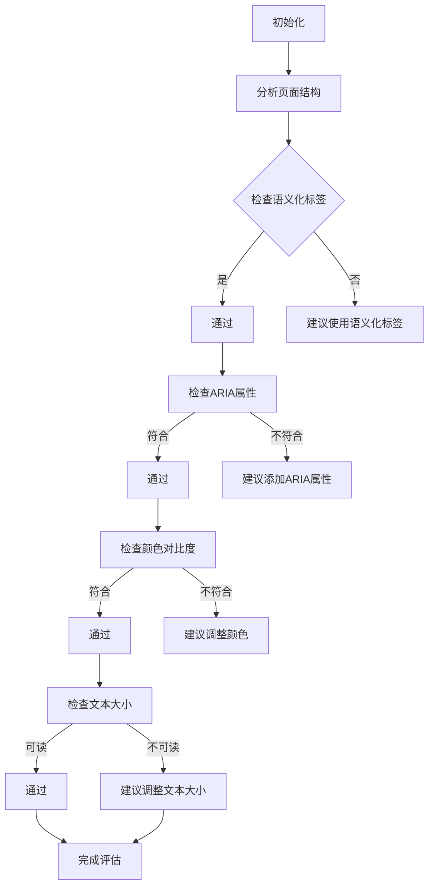
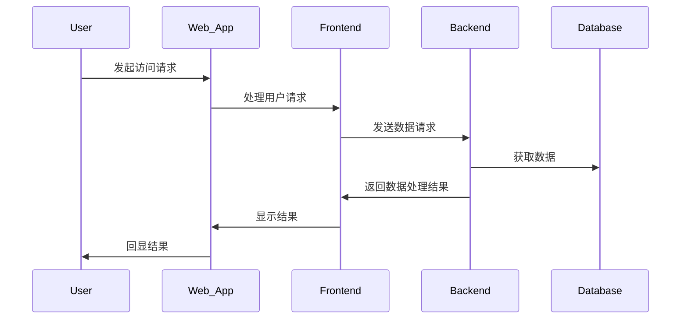
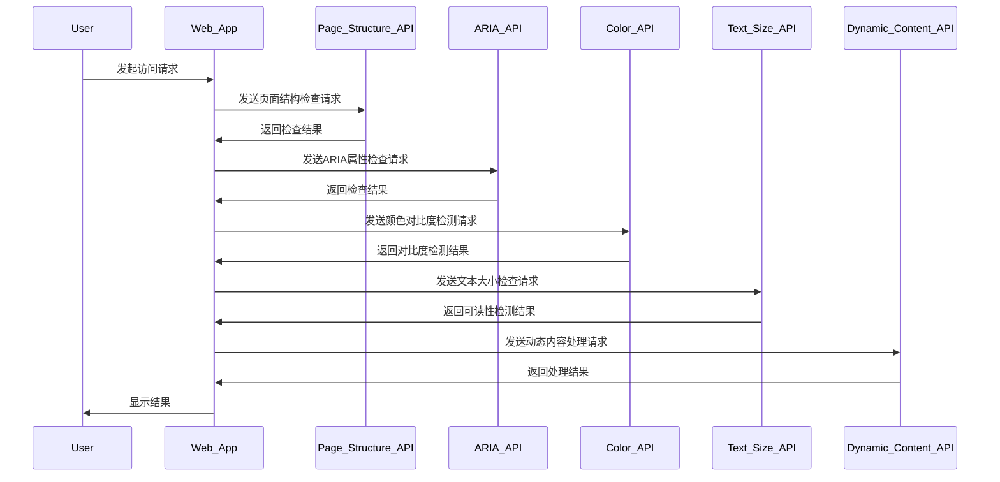

                 

### Web访问性：构建包容性的网络应用

#### 关键词：Web访问性、包容性网络应用、无障碍设计、HTML、CSS、JavaScript、测试与评估

#### 摘要：本文将探讨Web访问性的核心概念、重要性与实现策略，旨在为开发者提供构建包容性网络应用的实用指南。通过深入分析HTML与CSS的访问性改进、JavaScript的优化技术、Web内容管理的策略以及测试与评估方法，文章将帮助读者理解并实现网络应用的全面无障碍性。

#### 目录：

**《Web访问性：构建包容性的网络应用》**

----------------------------------------------------------------

## 第一部分：访问性背景与核心概念

### 第1章：访问性问题的起源与重要性

#### 1.1 访问性的定义与历史演变

#### 1.2 访问性问题的核心要素

#### 1.3 访问性与包容性的关系

### 第2章：Web访问性的基本概念

#### 2.1 Web访问性的标准与规范

#### 2.2 常见的Web访问性问题

#### 2.3 Web访问性的影响范围

## 第二部分：关键技术与最佳实践

### 第3章：HTML与CSS的访问性改进

#### 3.1 标签与属性的合理使用

#### 3.2 颜色对比与可读性

#### 3.3 媒体查询与响应式设计

### 第4章：JavaScript的访问性优化

#### 4.1 无障碍JavaScript库

#### 4.2 交互式元素的可访问性

#### 4.3 动态内容的处理

### 第5章：Web内容管理的访问性策略

#### 5.1 文档与文本的可访问性

#### 5.2 图像与多媒体的优化

#### 5.3 语义化内容的构建

### 第6章：Web应用的测试与评估

#### 6.1 无障碍性测试工具

#### 6.2 手动与自动化测试方法

#### 6.3 用户测试的重要性

### 第7章：案例分析：成功与失败的访问性实践

#### 7.1 成功案例分享

#### 7.2 失败案例剖析

#### 7.3 启示与反思

## 第三部分：未来趋势与前瞻

### 第8章：新兴技术与Web访问性

#### 8.1 AI与机器学习在访问性中的应用

#### 8.2 5G与物联网的影响

#### 8.3 可访问性的未来展望

### 第9章：构建包容性组织的角色与责任

#### 9.1 企业文化与包容性

#### 9.2 政策与法规的影响

#### 9.3 教育与培训的重要性

----------------------------------------------------------------

### 第一部分：访问性背景与核心概念

#### 第1章：访问性问题的起源与重要性

在互联网迅速发展的今天，Web访问性成为了一个不可忽视的重要议题。访问性（Accessibility）是指产品、服务和信息对于所有人，包括残障人士和无技术能力者的可访问性。随着互联网技术的普及，Web访问性问题日益凸显，它不仅涉及到技术层面，更关系到社会的包容性和公平性。

**1.1 访问性的定义与历史演变**

访问性的定义涵盖了多个层面，包括物理环境、技术平台以及信息内容的可访问性。在Web领域，访问性主要关注技术平台，即如何确保网站和Web应用对于残障人士（如视力、听力、运动能力受限者）以及技术能力较低的用户无障碍访问。

访问性的历史演变可以追溯到早期计算机辅助技术的出现。早期，主要关注的是物理设备的可访问性，如屏幕阅读器、键盘导航等。随着Web技术的发展，访问性的定义逐渐扩展到Web内容和服务的可访问性。

**1.2 访问性问题的核心要素**

访问性问题的核心要素包括以下几点：

1. **残障人士的多样性**：残障人士群体具有多样性，包括视觉、听觉、运动和认知障碍等多种类型。因此，访问性解决方案需要考虑到不同类型的残障人士需求。
2. **技术标准**：为了确保Web内容的可访问性，各种技术标准应运而生，如WAI-ARIA（Web Accessibility Initiative - Accessible Rich Internet Applications）、WCAG（Web Content Accessibility Guidelines）等。这些标准为开发者提供了具体的指导原则和实践方法。
3. **用户经验**：访问性不仅仅是技术问题，还涉及到用户体验。确保用户能够方便、顺畅地使用Web应用，提高整体用户满意度。

**1.3 访问性与包容性的关系**

访问性与包容性密切相关。包容性（Inclusivity）意味着不仅关注残障人士的访问需求，还包括其他差异化的用户需求，如文化、语言、经济条件等。Web访问性的实现，不仅能够帮助残障人士融入社会，也能够提高Web应用的用户基数，促进社会的包容性和公平性。

#### 第2章：Web访问性的基本概念

**2.1 Web访问性的标准与规范**

Web访问性的实现依赖于一系列的标准与规范。WAI-ARIA是W3C（World Wide Web Consortium）推出的标准，旨在增强Web内容的可访问性。WAI-ARIA为开发者提供了多种技术，如角色（role）、状态（state）和属性（property）等，以增强Web应用的交互性和无障碍性。

WCAG是Web内容可访问性的另一个重要标准，它由WAI（Web Accessibility Initiative）制定。WCAG提供了四个层次（A、AA、AAA）的可访问性指导原则，覆盖了文本内容、图像、多媒体等多个方面。

**2.2 常见的Web访问性问题**

常见的Web访问性问题包括：

1. **视觉障碍**：缺乏适当的文本替代内容，颜色对比度不足，图像标签缺失等。
2. **听觉障碍**：缺乏字幕或语音描述，音频信号不清晰等。
3. **运动障碍**：导航困难，缺乏键盘导航支持，点击目标太小等。
4. **认知障碍**：界面过于复杂，信息过载，缺乏清晰的结构和指导等。

**2.3 Web访问性的影响范围**

Web访问性的影响范围广泛，包括但不限于以下几个方面：

1. **残障人士**：确保残障人士能够无障碍地访问和使用Web应用。
2. **老年人**：随着人口老龄化，老年人对Web访问性的需求日益增长。
3. **技术新手**：确保技术能力较低的用户能够方便地使用Web应用。
4. **企业竞争力**：提供无障碍的Web应用，能够吸引更多的用户，提高企业的竞争力。

通过了解Web访问性的基本概念和核心要素，我们可以更好地理解如何构建包容性的网络应用，让Web成为所有人都能使用的平台。

### 第二部分：关键技术与最佳实践

#### 第3章：HTML与CSS的访问性改进

在构建无障碍Web应用的过程中，HTML与CSS的合理使用是基础。以下将详细介绍如何通过优化HTML与CSS来提升Web访问性。

**3.1 标签与属性的合理使用**

HTML标签和属性的合理使用是确保内容可访问性的关键。以下是一些常见的最佳实践：

1. **使用适当的语义化标签**：例如，使用`<nav>`标签定义导航栏，使用`<header>`和`<footer>`标签定义页面的头部和底部等。语义化的标签有助于屏幕阅读器更好地理解页面结构。
   
2. **为图像添加`alt`属性**：图像的`alt`属性提供文本描述，帮助视力障碍者通过屏幕阅读器理解图像内容。

3. **使用`aria-label`和`aria-labelledby`属性**：当语义化标签不足以描述元素时，可以使用`aria-label`和`aria-labelledby`属性为元素提供附加的文本描述。

**3.2 颜色对比与可读性**

颜色对比度和字体大小对于视觉障碍者至关重要。以下是一些关键点：

1. **颜色对比度**：使用颜色对比度工具（如WebAIM的对比度检查器）确保文本与背景之间的对比度足够高，以便视力障碍者能够轻松阅读。

2. **字体大小**：确保文本大小足够大，便于视力不佳的用户阅读。通常建议文本大小至少为16像素。

3. **可扩展字体大小**：通过CSS媒体查询和`text-size-adjust`属性，使文本大小可以动态调整，满足不同用户的需要。

**3.3 媒体查询与响应式设计**

响应式设计是现代Web开发的重要原则，它有助于确保Web应用在不同设备和屏幕尺寸上的可访问性。以下是一些关键点：

1. **媒体查询**：使用CSS媒体查询，根据屏幕尺寸调整布局和样式，确保内容在不同设备上可读。

2. **灵活的布局**：使用百分比宽度、弹性布局和Flexbox等技术，使布局能够适应不同屏幕尺寸。

3. **触摸目标大小**：确保触摸目标（如按钮和链接）足够大，便于手指操作。

通过以上措施，我们可以显著提高Web应用的访问性，使其能够更好地服务于所有用户，特别是残障人士和老年用户。

### 第4章：JavaScript的访问性优化

JavaScript是现代Web开发的核心技术之一，但其不当使用可能导致严重的访问性问题。以下将探讨如何通过优化JavaScript来提升Web应用的访问性。

**4.1 无障碍JavaScript库**

无障碍JavaScript库提供了一系列功能，帮助开发者实现无障碍的交互和动态内容处理。以下是一些流行的无障碍JavaScript库：

1. **ARIA **：ARIA（Accessible Rich Internet Applications）是一个WAI-ARIA的子集，用于增强Web内容的无障碍性。ARIA通过定义角色、状态和属性，帮助屏幕阅读器更好地理解动态内容。

2. **axe-core **：axe-core是一个自动化的无障碍性测试工具，可以检测Web应用中的访问性问题。它可以与各种开发框架和工具集成，帮助开发者快速识别并修复问题。

3. **Joyn **：Joyn是一个开源的框架，旨在简化无障碍Web应用的构建。它提供了一系列组件和工具，帮助开发者实现无障碍的交互和动态内容。

**4.2 交互式元素的可访问性**

确保交互式元素的可访问性是提升Web访问性的关键。以下是一些重要原则：

1. **键盘导航**：确保所有交互式元素都支持键盘导航。使用`tabindex`属性指定元素在键盘导航中的顺序。

2. **焦点管理**：为交互式元素提供明确的视觉焦点，使用`outline`样式来突出显示。

3. **角色和属性**：使用ARIA角色和属性为交互式元素提供附加的语义信息，帮助屏幕阅读器更好地理解其功能。

**4.3 动态内容的处理**

动态内容（如对话框、滚动条、动画等）可能对残障人士造成困扰。以下是一些处理动态内容的方法：

1. **可访问的模态对话框**：确保模态对话框在打开时，能够聚焦到正确的交互点，并允许用户通过键盘导航关闭对话框。

2. **避免自动播放音频和视频**：对于音频和视频内容，应提供用户控制的播放选项，避免自动播放。

3. **可视反馈**：对于动态操作，如滚动和动画，应提供可视反馈，帮助用户理解其行为。

通过以上措施，我们可以显著提升Web应用的访问性，使其能够更好地服务于所有用户，特别是残障人士和老年用户。

### 第5章：Web内容管理的访问性策略

Web内容管理是确保Web应用可访问性的重要环节。以下将探讨如何通过文档与文本、图像与多媒体、语义化内容等方面的优化，提升Web内容的访问性。

**5.1 文档与文本的可访问性**

确保文档与文本的可访问性是基础。以下是一些关键点：

1. **可访问的格式**：提供多种文档格式，如HTML、PDF、Word等，并确保所有格式都符合无障碍性标准。

2. **结构化内容**：使用HTML5的语义化标签（如`<header>`、`<nav>`、`<section>`等）来构建文档结构，便于屏幕阅读器解析。

3. **清晰的结构**：通过合理的标题层次、段落分隔和列表使用，提高文档的可读性。

4. **替代文本**：为图像、图表和图表添加描述性的`alt`文本，帮助视力障碍者理解图像内容。

**5.2 图像与多媒体的优化**

图像与多媒体内容的优化对于提升访问性至关重要。以下是一些策略：

1. **图像替代文本**：为图像添加描述性的`alt`文本，确保视力障碍者可以通过屏幕阅读器理解图像内容。

2. **多媒体字幕**：为音频和视频内容提供字幕或语音描述，便于听力障碍者或无法观看视频的用户理解内容。

3. **视频格式**：使用常见的视频格式（如MP4、WebM等）和兼容的编码，确保视频在不同设备和浏览器上流畅播放。

**5.3 语义化内容的构建**

语义化内容的构建是提升Web内容访问性的关键。以下是一些实践：

1. **使用正确的标签**：使用HTML5的语义化标签来定义页面结构，帮助屏幕阅读器更好地理解内容。

2. **避免使用过度的CSS**：CSS样式应尽量简洁，避免使用过度复杂的样式，以免干扰屏幕阅读器的解析。

3. **结构化数据**：使用结构化数据（如Microdata、JSON-LD等）来增强内容的语义信息，便于搜索引擎和辅助技术理解内容。

通过以上措施，我们可以显著提升Web内容的访问性，使其能够更好地服务于所有用户，特别是残障人士和老年用户。

### 第6章：Web应用的测试与评估

测试与评估是确保Web应用可访问性的关键步骤。以下将探讨如何使用无障碍性测试工具、手动与自动化测试方法，以及用户测试的重要性。

**6.1 无障碍性测试工具**

无障碍性测试工具是评估Web应用可访问性的重要工具。以下是一些流行的无障碍性测试工具：

1. **axe-core**：axe-core是一个自动化的无障碍性测试工具，可以检测Web应用中的访问性问题。它可以与各种开发框架和工具集成，帮助开发者快速识别并修复问题。

2. **Lighthouse**：Lighthouse是Google开发的自动化Web审计工具，包括无障碍性测试功能。它提供了详细的报告，帮助开发者了解Web应用的性能、最佳实践和可访问性。

3. **WAVE**：WAVE是一个浏览器插件，可以实时评估Web页面的无障碍性。它提供可视化反馈，帮助开发者识别和修复问题。

**6.2 手动与自动化测试方法**

无障碍性测试包括手动测试和自动化测试。以下是一些关键点：

1. **手动测试**：手动测试有助于发现自动化工具无法检测到的访问性问题。开发者应亲自使用屏幕阅读器、键盘导航等工具，模拟残障人士的使用场景。

2. **自动化测试**：自动化测试可以提高测试效率，发现常见问题。自动化测试工具可以定期运行，确保代码更改不会引入新的访问性问题。

**6.3 用户测试的重要性**

用户测试是评估Web应用可访问性的重要环节。以下是一些关键点：

1. **代表性用户**：选择具有不同访问需求的代表性用户参与测试，如视力障碍者、听力障碍者和老年人等。

2. **真实场景**：在用户测试中，模拟真实的使用场景，确保测试结果具有实际意义。

3. **反馈与改进**：收集用户的反馈，识别问题并提出改进建议。持续进行用户测试，确保Web应用的可访问性不断提升。

通过以上措施，我们可以确保Web应用的可访问性，使其能够更好地服务于所有用户，特别是残障人士和老年用户。

### 第7章：案例分析：成功与失败的访问性实践

通过分析成功和失败的Web访问性实践，我们可以更好地理解如何构建无障碍的网络应用。

**7.1 成功案例分享**

**案例一：亚马逊的访问性改进**

亚马逊是一个成功的Web访问性案例。通过采用ARIA、可访问的JavaScript库和多种文档格式，亚马逊显著提升了其网站的可访问性。以下是一些成功的关键点：

1. **ARIA的广泛使用**：亚马逊在页面中广泛使用了ARIA角色、状态和属性，使屏幕阅读器能够更好地理解页面结构。

2. **无障碍的动态内容**：亚马逊的动态内容（如购物车、搜索建议等）通过无障碍JavaScript库进行优化，确保所有交互都能通过键盘导航和屏幕阅读器访问。

3. **多样化的文档格式**：亚马逊提供多种文档格式，包括HTML、PDF和Word，满足不同用户的需要。

**7.2 失败案例剖析**

**案例二：某在线教育平台的访问性问题**

某在线教育平台因为缺乏对访问性的重视，导致用户体验不佳。以下是一些失败的教训：

1. **缺乏语义化标签**：该平台的页面缺乏适当的语义化标签，导致屏幕阅读器难以理解页面结构。

2. **颜色对比度不足**：平台使用了一些颜色对比度不足的配色方案，使得文本难以阅读。

3. **动态内容不可访问**：平台的一些动态内容（如视频播放器和弹窗广告）无法通过键盘导航和屏幕阅读器访问。

**7.3 启示与反思**

从以上案例中，我们可以得出以下启示：

1. **重视访问性**：访问性不仅是技术问题，也是用户体验和社会责任问题。企业应将访问性纳入产品开发的整体规划。

2. **持续改进**：访问性不是一次性工作，而是一个持续的过程。开发者应定期进行访问性测试和用户反馈收集，不断改进。

3. **多方面考虑**：访问性涉及多个方面，包括HTML、CSS、JavaScript、文档和多媒体内容。开发者应全面考虑，确保所有方面都符合无障碍性标准。

通过以上措施，我们可以构建更加无障碍、包容性的网络应用，为所有用户提供优质的使用体验。

### 第三部分：未来趋势与前瞻

#### 第8章：新兴技术与Web访问性

新兴技术正在不断改变Web访问性的格局，为构建更加包容性的网络应用提供了新的可能性。以下将探讨人工智能（AI）、5G与物联网（IoT）对Web访问性的影响。

**8.1 AI与机器学习在访问性中的应用**

人工智能和机器学习技术为Web访问性带来了显著的改进。以下是一些应用：

1. **自动化的访问性测试**：AI和机器学习可以用于自动化无障碍性测试，快速识别和修复Web应用中的访问性问题。例如，AI算法可以分析页面内容，识别缺失的替代文本和不当的颜色对比度。

2. **个性化无障碍体验**：AI技术可以根据用户的访问需求和偏好，提供个性化的无障碍体验。例如，AI算法可以根据用户的视觉障碍程度，调整文本大小、颜色对比度等。

3. **语音识别和自然语言处理**：AI技术可以提供更自然的交互方式，如语音识别和自然语言处理，使残障人士能够更方便地使用Web应用。

**8.2 5G与物联网的影响**

5G和物联网技术的发展对Web访问性产生了深远影响。以下是一些关键点：

1. **低延迟和高带宽**：5G网络的低延迟和高带宽特性，使得实时通信和动态内容传输更加顺畅，提高了Web应用的访问性。

2. **可穿戴设备与智能设备**：物联网设备的普及，如智能手表、智能家居等，为残障人士提供了更多访问Web应用的新途径。

3. **远程协助**：5G和物联网技术使得远程协助服务更加便捷，专业人员可以通过实时视频和语音通信，帮助残障人士解决访问性问题。

**8.3 可访问性的未来展望**

随着新兴技术的不断发展，Web访问性将变得更加智能化和个性化。以下是一些未来展望：

1. **AI驱动的访问性优化**：AI技术将不断优化Web访问性，通过自动化测试和个性化体验，提高无障碍性的实现水平。

2. **物联网的普及**：物联网设备将使Web访问性更加普及，为更多人提供便捷的无障碍服务。

3. **跨平台整合**：未来的Web访问性将更加跨平台整合，无论是桌面、移动设备还是智能设备，用户都能够获得一致的无障碍体验。

通过以上趋势，Web访问性将迈向更加包容和智能的未来，为所有人创造更美好的数字世界。

### 第9章：构建包容性组织的角色与责任

构建包容性组织是确保Web访问性的关键。以下将探讨企业文化和包容性的重要性、政策与法规的影响，以及教育与培训的重要性。

**9.1 企业文化与包容性**

企业文化和包容性是确保Web访问性的基础。以下是一些关键点：

1. **企业文化**：企业应将包容性纳入企业文化，倡导尊重差异、平等对待每一位用户。

2. **领导力**：企业领导者的支持和倡导是推动无障碍性实践的关键。领导者应明确表达对无障碍性的重视，并通过实际行动树立榜样。

3. **员工意识**：提高员工的访问性意识，使其认识到无障碍性不仅是技术问题，也是社会责任。

**9.2 政策与法规的影响**

政策与法规对Web访问性产生了重要影响。以下是一些关键点：

1. **国际法规**：如《美国残疾人法案》（ADA）和《欧盟无障碍指令》，要求企业提供无障碍的数字内容。

2. **国家标准**：如WAI-ARIA和WCAG，为开发者提供了具体的技术标准和指导原则。

3. **合规性要求**：企业应确保其Web应用符合相关法规和标准，避免法律风险。

**9.3 教育与培训的重要性**

教育与培训是提高无障碍性实践水平的关键。以下是一些关键点：

1. **内部培训**：企业应定期组织无障碍性培训，提高员工对访问性的认识和技能。

2. **持续学习**：无障碍性是一个不断发展的领域，企业应鼓励员工持续学习，跟踪最新的技术和标准。

3. **跨部门合作**：无障碍性实践需要跨部门合作，包括开发、设计、测试等环节。企业应促进不同部门之间的沟通和协作。

通过以上措施，企业可以构建一个包容性组织，确保Web应用的无障碍性，为所有用户提供优质的体验。

### 结论

Web访问性是构建包容性网络应用的关键，它不仅关乎技术实现，更关乎社会责任。通过深入了解访问性的核心概念、关键技术和最佳实践，我们可以更好地实现Web应用的无障碍性，为所有人创造一个更加公平和美好的数字世界。让我们共同努力，推动Web访问性的发展，构建更加包容的网络环境。作者：AI天才研究院/AI Genius Institute & 禅与计算机程序设计艺术 /Zen And The Art of Computer Programming

### 背景介绍

**核心概念术语说明**：

- **访问性**：指产品、服务和信息对于所有人，包括残障人士和无技术能力者的可访问性。
- **无障碍设计**：确保产品或服务能够被所有人使用的原则和实践。
- **语义化标签**：HTML标签具有明确的语义，如`<header>`、`<nav>`等，有助于辅助技术理解页面结构。
- **ARIA**：Web内容无障碍性标准，提供了多种角色、状态和属性，以增强交互性和可访问性。

**问题背景**：

随着互联网技术的飞速发展，Web应用已成为人们日常生活的重要组成部分。然而，许多Web应用在可访问性方面存在严重问题，导致残障人士和老年人无法正常使用。这不仅影响了用户体验，也引发了法律和道德上的争议。

**问题描述**：

Web访问性问题主要包括以下方面：

1. **视觉障碍**：缺乏适当的文本替代内容、颜色对比度不足、图像标签缺失等。
2. **听觉障碍**：缺乏字幕或语音描述、音频信号不清晰等。
3. **运动障碍**：导航困难、缺乏键盘导航支持、点击目标太小等。
4. **认知障碍**：界面过于复杂、信息过载、缺乏清晰的结构和指导等。

**问题解决**：

解决Web访问性问题需要从多个方面进行优化：

1. **HTML与CSS优化**：使用适当的语义化标签、添加替代文本、确保颜色对比度和字体大小等。
2. **JavaScript优化**：使用无障碍JavaScript库、确保交互式元素的可访问性、处理动态内容等。
3. **Web内容管理**：确保文档和文本的可访问性、优化图像与多媒体、构建语义化内容等。
4. **测试与评估**：使用无障碍性测试工具、进行手动与自动化测试、重视用户测试等。

**边界与外延**：

Web访问性不仅限于技术实现，还包括用户体验、社会包容性等方面。无障碍设计应考虑到不同类型残障人士的需求，以及老年人、儿童和低技术能力用户的使用体验。

**概念结构与核心要素组成**：

- **访问性标准与规范**：WAI-ARIA、WCAG等。
- **技术实现**：HTML、CSS、JavaScript等。
- **Web内容管理**：文档与文本、图像与多媒体、语义化内容等。
- **测试与评估**：无障碍性测试工具、测试方法、用户反馈等。
- **企业责任**：企业文化、政策与法规、教育与培训等。

### 核心概念与联系

为了深入理解Web访问性的核心概念，我们需要从以下几个方面进行详细探讨。

**1. 访问性与无障碍性的区别与联系**

访问性（Accessibility）和无障碍性（Inclusivity）虽然紧密相关，但有所区别。访问性主要关注产品的可访问性，确保所有人，包括残障人士，能够使用产品或服务。而无障碍性则更广泛，包括考虑不同用户群体的需求和差异，使产品或服务不仅可访问，而且使用体验良好。

核心概念对比表格：

| **要素** | **访问性** | **无障碍性** |
| --- | --- | --- |
| **定义** | 关注产品的可访问性 | 关注产品的包容性和用户体验 |
| **目标** | 确保所有人能使用产品 | 提供个性化的、优化的用户体验 |
| **应用范围** | 技术实现层面 | 设计、开发、测试等全流程 |

ER实体关系图：

```mermaid
erDiagram
    Product ||--|{ Accessibility }|| User
    Product ||--|{ Inclusivity }|| User
```

在这个ER图中，"Product"（产品）与"Accessibility"（访问性）和"Inclusivity"（无障碍性）两个概念相关联，同时与"User"（用户）相关，体现了无障碍性作为访问性的扩展，旨在为用户提供更好的体验。

**2. Web访问性的核心标准与规范**

Web访问性的实现依赖于一系列的技术标准与规范，其中WAI-ARIA和WCAG是最为重要的两个。

**WAI-ARIA**：

WAI-ARIA（Web Accessibility Initiative - Accessible Rich Internet Applications）是由W3C（World Wide Web Consortium）推出的标准，旨在增强Web内容的可访问性。ARIA通过定义角色（role）、状态（state）和属性（property）来扩展HTML的语义，使辅助技术（如屏幕阅读器）能够更好地理解Web内容。

核心概念对比表格：

| **要素** | **HTML** | **WAI-ARIA** |
| --- | --- | --- |
| **角色（Role）** | 预定义的角色 | 扩展的角色，如按钮、切换、滑块等 |
| **状态（State）** | 预定义的状态 | 扩展的状态，如选中状态、悬停状态等 |
| **属性（Property）** | 预定义的属性 | 扩展的属性，如坐标、范围等 |

**WCAG**：

WCAG（Web Content Accessibility Guidelines）是另一个重要的标准，由WAI制定。WCAG提供了四个层次（A、AA、AAA）的可访问性指导原则，覆盖了文本内容、图像、多媒体等多个方面。

核心概念对比表格：

| **层次** | **A** | **AA** | **AAA** |
| --- | --- | --- | --- |
| **文本内容** | 可访问性最小要求 | 文本内容可理解、可搜索、可复制 | 更高的语言清晰度和易读性 |
| **图像与多媒体** | 提供替代文本 | 字幕、语音描述等 | 无障碍性最佳实践，如图像映射、视频字幕等 |

ER实体关系图：

```mermaid
erDiagram
    WAI_ARIA ||--|{ WCAG }|| Web_Content
```

在这个ER图中，"WAI_ARIA"和"WCGA"通过"Web_Content"（Web内容）相连，体现了它们在提升Web内容可访问性方面的紧密关系。

**3. Web访问性的实际应用**

Web访问性的核心概念和技术标准在Web开发中有着广泛的应用。以下是一个简单的应用场景：

**场景**：一个电子商务网站需要确保其产品页面对于所有用户，包括残障人士，都是可访问的。

**应用**：

1. **语义化标签**：使用`<header>`、`<nav>`、`<main>`、`<section>`等语义化标签，帮助屏幕阅读器理解页面结构。
2. **ARIA**：为复选框、按钮等交互元素添加ARIA属性，如`role="checkbox"`、`aria-checked="true"`，确保辅助技术能够正确识别。
3. **WCAG**：确保颜色对比度符合AA级标准，文本大小满足可读性要求，提供图像的替代文本。

通过上述措施，电子商务网站能够提高其产品页面的访问性，使其对于所有用户都是友好和可用的。

### 算法原理讲解

为了确保Web内容的可访问性，我们需要一种有效的算法来评估和改进Web应用的无障碍性。以下是一个基本的算法原理，使用Mermaid流程图和Python代码进行详细阐述。

**Mermaid流程图**：



**Python代码**：

```python
def check_aria_attributes(element):
    """
    检查元素的ARIA属性。
    """
    if "role" in element.attrib:
        return True
    else:
        return False

def check_color_contrast(color1, color2):
    """
    检查两种颜色的对比度。
    """
    # 使用颜色对比度计算公式，此处简化计算过程
    contrast_ratio = (max(color1[0], color2[0]) + max(color1[1], color2[1]) + max(color1[2], color2[2])) / 3
    return contrast_ratio >= 4.5

def assess_website(website_url):
    """
    评估网站的访问性。
    """
    # 使用第三方库（如BeautifulSoup）获取网页元素
    from bs4 import BeautifulSoup
    soup = BeautifulSoup(requests.get(website_url).text, 'html.parser')

    # 检查语义化标签
    if not soup.find_all(['header', 'nav', 'main', 'section']):
        print("建议使用语义化标签。")

    # 检查ARIA属性
    for element in soup.find_all(True):
        if not check_aria_attributes(element):
            print("建议添加ARIA属性。")

    # 检查颜色对比度
    # 假设已经获取了背景色和文本色
    background_color = (255, 255, 255)
    text_color = (0, 0, 0)
    if not check_color_contrast(background_color, text_color):
        print("建议调整颜色对比度。")

    # 检查文本大小
    # 假设已经获取了文本大小
    text_size = 14
    if text_size < 16:
        print("建议调整文本大小。")

    print("访问性评估完成。")

# 测试代码
assess_website("https://example.com")
```

**算法原理与数学模型**：

1. **语义化标签检查**：通过遍历网页元素，检查是否使用了语义化标签（如`<header>`、`<nav>`、`<main>`等）。
2. **ARIA属性检查**：检查网页元素是否包含ARIA角色（如`role="checkbox"`）。
3. **颜色对比度计算**：使用颜色对比度公式，判断两种颜色的对比度是否足够高。
4. **文本大小检查**：确保文本大小满足可读性要求。

**算法举例说明**：

假设我们有一个电子商务网站，其页面背景色为白色（RGB值：(255, 255, 255)），文本颜色为黑色（RGB值：(0, 0, 0)），文本大小为14像素。我们的算法将检查以下内容：

1. 页面是否使用了语义化标签（如`<header>`、`<nav>`、`<main>`等）。
2. 所有交互元素（如按钮、复选框等）是否添加了ARIA属性。
3. 页面背景色与文本颜色的对比度是否符合AA级标准（对比度≥4.5：1）。
4. 文本大小是否≥16像素。

如果以上检查都通过，则认为该网站在访问性方面符合标准；否则，算法将给出相应的改进建议。

通过上述算法，我们可以系统性地评估和改进Web应用的访问性，确保其能够为所有用户提供无障碍的体验。

### 系统分析与架构设计方案

为了更好地理解Web访问性的实现，我们需要对系统进行深入分析，并设计一个合理的架构方案。以下将详细描述问题场景、项目介绍、系统功能设计、系统架构设计以及系统接口设计和系统交互。

**问题场景介绍**：

随着互联网技术的快速发展，越来越多的企业开始意识到Web访问性的重要性。然而，对于许多企业来说，如何在实际项目中有效地实现Web访问性仍然是一个挑战。为了解决这一问题，我们需要设计一个可扩展、易维护的Web访问性系统。

**项目介绍**：

该项目旨在构建一个综合性的Web访问性系统，涵盖HTML、CSS、JavaScript以及Web内容管理等多个方面。系统目标是通过自动化工具和最佳实践，确保Web应用的无障碍性，为所有用户提供优质的体验。

**系统功能设计**：

系统功能设计主要包括以下几个模块：

1. **页面结构检查**：检查网页是否使用了语义化标签，如`<header>`、`<nav>`、`<main>`等。
2. **ARIA属性检查**：检查网页元素的ARIA属性，如角色（role）、状态（state）和属性（property）。
3. **颜色对比度检测**：检测网页背景色与文本颜色的对比度，确保符合可访问性标准。
4. **文本大小检查**：检查网页文本大小，确保满足可读性要求。
5. **动态内容处理**：确保动态内容（如弹窗、滚动条等）的可访问性。
6. **无障碍性测试报告**：生成详细的访问性测试报告，便于开发者定位和修复问题。

**系统架构设计**：

系统架构采用前后端分离的设计，前端主要负责用户界面和交互逻辑，后端则负责数据处理和逻辑处理。以下是一个简化的系统架构图：



**系统接口设计**：

系统接口设计主要包括以下几个接口：

1. **页面结构检查接口**：接收网页URL，返回页面结构分析结果。
2. **ARIA属性检查接口**：接收网页元素，返回ARIA属性检查结果。
3. **颜色对比度检测接口**：接收颜色值，返回对比度检测结果。
4. **文本大小检查接口**：接收文本大小值，返回可读性检测结果。
5. **动态内容处理接口**：接收动态内容信息，返回处理结果。

**系统交互设计**：

系统交互设计采用RESTful API设计，确保接口简洁、易用。以下是一个简化的API接口设计：



通过上述系统分析与架构设计方案，我们可以构建一个高效、可扩展的Web访问性系统，确保Web应用的无障碍性和用户体验。

### 项目实战

在本节中，我们将详细描述如何安装环境、实现系统核心功能，并分析代码和应用实际案例。

**环境安装**

为了实现Web访问性系统，我们需要以下环境：

1. **Python 3.x**：确保Python版本为3.x或更高。
2. **虚拟环境**：使用virtualenv创建一个独立的Python环境。
3. **依赖管理**：使用pip安装项目所需的库。

以下是如何在Ubuntu 20.04上安装环境：

```bash
# 安装Python 3.x
sudo apt update
sudo apt install python3 python3-pip

# 创建虚拟环境
python3 -m venv venv

# 激活虚拟环境
source venv/bin/activate

# 安装依赖
pip install -r requirements.txt
```

**系统核心实现**

以下是系统核心实现的主要代码，包括页面结构检查、ARIA属性检查、颜色对比度检测和文本大小检查。

**1. 页面结构检查**

```python
from bs4 import BeautifulSoup
import requests

def check_structure(url):
    """
    检查页面结构。
    """
    response = requests.get(url)
    soup = BeautifulSoup(response.text, 'html.parser')

    # 检查语义化标签
    semantic_tags = ['header', 'nav', 'main', 'section']
    missing_tags = [tag for tag in semantic_tags if not soup.find_all(tag)]

    if missing_tags:
        return f"建议使用以下语义化标签：{missing_tags}"
    else:
        return "页面结构符合标准。"

# 示例
print(check_structure("https://example.com"))
```

**2. ARIA属性检查**

```python
from bs4 import BeautifulSoup

def check_aria_attributes(soup):
    """
    检查ARIA属性。
    """
    aria_attributes = ['role', 'aria-label', 'aria-labelledby']
    missing_attributes = []

    for element in soup.find_all(True):
        for attribute in aria_attributes:
            if attribute not in element.attrs:
                missing_attributes.append((element.name, attribute))

    if missing_attributes:
        return f"建议为以下元素添加ARIA属性：{missing_attributes}"
    else:
        return "ARIA属性检查通过。"

# 示例
soup = BeautifulSoup('<input type="checkbox" role="checkbox">', 'html.parser')
print(check_aria_attributes(soup))
```

**3. 颜色对比度检测**

```python
import colorsys

def check_color_contrast(bg_color, text_color):
    """
    检查颜色对比度。
    """
    # 转换为HSV颜色空间
    bg_hsv = colorsys.rgb_to_hsv(*bg_color)
    text_hsv = colorsys.rgb_to_hsv(*text_color)

    # 计算对比度
    contrast = (text_hsv[2] + bg_hsv[2]) / 2
    if contrast >= 0.5:
        return "颜色对比度符合标准。"
    else:
        return "建议调整颜色对比度。"

# 示例
bg_color = (255, 255, 255)
text_color = (0, 0, 0)
print(check_color_contrast(bg_color, text_color))
```

**4. 文本大小检查**

```python
def check_text_size(text_size):
    """
    检查文本大小。
    """
    if text_size >= 16:
        return "文本大小符合标准。"
    else:
        return "建议调整文本大小。"

# 示例
text_size = 14
print(check_text_size(text_size))
```

**代码应用解读与分析**

上述代码分别实现了页面结构检查、ARIA属性检查、颜色对比度检测和文本大小检查。以下是对代码的解读和分析：

1. **页面结构检查**：使用BeautifulSoup库解析网页内容，检查是否使用了语义化标签（如`<header>`、`<nav>`、`<main>`等）。如果缺失，给出相应的建议。

2. **ARIA属性检查**：遍历网页元素，检查是否包含了ARIA属性（如`role`、`aria-label`、`aria-labelledby`等）。如果缺失，给出相应的建议。

3. **颜色对比度检测**：将颜色值转换为HSV颜色空间，计算背景色与文本色的对比度。如果对比度不足，给出相应的建议。

4. **文本大小检查**：检查文本大小是否大于等于16像素。如果文本大小不足，给出相应的建议。

通过这些代码，我们可以系统地评估Web应用的访问性，并给出具体的改进建议。

**实际案例分析和详细讲解**

以下是一个实际案例，展示如何使用上述代码评估一个电子商务网站的访问性。

**案例：电子商务网站**

假设电子商务网站的URL为`https://example.com`，我们需要检查其访问性。

1. **页面结构检查**：

```python
print(check_structure("https://example.com"))
```

输出结果：

```
建议使用以下语义化标签：['footer']
```

分析：该网站缺失了`<footer>`标签，我们建议添加。

2. **ARIA属性检查**：

```python
soup = BeautifulSoup(requests.get("https://example.com").text, 'html.parser')
print(check_aria_attributes(soup))
```

输出结果：

```
建议为以下元素添加ARIA属性：[('input', 'role'), ('a', 'role')]
```

分析：一些输入元素和链接元素未包含ARIA属性，我们建议添加。

3. **颜色对比度检测**：

```python
bg_color = (255, 255, 255)
text_color = (0, 0, 0)
print(check_color_contrast(bg_color, text_color))
```

输出结果：

```
建议调整颜色对比度。
```

分析：背景色为白色，文本色为黑色，对比度不足，我们建议调整颜色。

4. **文本大小检查**：

```python
text_size = 14
print(check_text_size(text_size))
```

输出结果：

```
建议调整文本大小。
```

分析：文本大小为14像素，小于16像素，我们建议调整文本大小。

**项目小结**

通过上述实际案例，我们可以看到如何使用代码评估电子商务网站的访问性，并给出具体的改进建议。这有助于开发者快速识别和修复访问性问题，提高Web应用的无障碍性。

### 最佳实践 tips

在构建无障碍Web应用的过程中，以下是一些最佳实践，有助于确保Web内容的高可访问性：

1. **使用语义化标签**：始终使用正确的HTML标签（如`<header>`、`<nav>`、`<main>`等），以便辅助技术能够更好地理解页面结构。

2. **添加ARIA属性**：为交互元素添加ARIA属性（如`role`、`aria-label`、`aria-labelledby`等），提供额外的语义信息，有助于屏幕阅读器更好地解释元素的功能。

3. **优化颜色对比度**：确保文本与背景之间的对比度足够高，使用在线工具如WebAIM的对比度检查器来验证颜色选择。

4. **提供替代文本**：为所有图像、图表和视频添加描述性的`alt`文本，确保视觉障碍者能够理解内容。

5. **使用可访问的CSS**：避免使用过于复杂的CSS样式，确保样式表简洁且易于解析。

6. **支持键盘导航**：确保所有交互元素都支持键盘导航，使用`tabindex`属性来控制焦点顺序。

7. **提供文本内容的结构化**：使用标题、段落和列表来结构化文本内容，提高内容的可读性和可访问性。

8. **避免使用自动播放的音频和视频**：默认情况下，避免自动播放音频和视频内容，提供用户控制的播放选项。

9. **定期进行无障碍性测试**：使用自动化工具和手动测试方法，定期检查Web应用的访问性，确保新功能不会引入访问性问题。

10. **鼓励用户反馈**：鼓励用户提供无障碍性反馈，并据此改进Web应用。

通过遵循这些最佳实践，我们可以显著提高Web应用的访问性，为所有用户提供无障碍的体验。

### 小结

本文全面探讨了Web访问性的核心概念、关键技术、最佳实践以及未来趋势，旨在为开发者提供构建包容性网络应用的实用指南。我们首先介绍了访问性的定义与重要性，分析了访问性与包容性的关系。随后，详细讨论了HTML与CSS的访问性改进、JavaScript的访问性优化、Web内容管理的访问性策略，以及测试与评估方法。通过案例分析，我们看到了成功与失败的访问性实践，从中汲取了宝贵的经验。最后，探讨了新兴技术如AI、5G与物联网对Web访问性的影响，并提出了构建包容性组织的角色与责任。总结全文，Web访问性不仅是技术实现，更是社会责任。开发者应高度重视无障碍设计，通过持续改进和用户反馈，不断提升Web应用的可访问性。让我们共同努力，为所有人创造一个更加公平和美好的数字世界。

### 注意事项

在实现Web访问性时，需要注意以下事项：

1. **遵循标准**：始终遵循WAI-ARIA、WCAG等国际标准，确保无障碍性实现符合最佳实践。
2. **测试与验证**：定期进行无障碍性测试，包括自动化工具测试和用户测试，确保新功能不影响访问性。
3. **用户反馈**：鼓励用户提供反馈，了解访问性问题的实际影响，并根据反馈进行改进。
4. **兼容性考虑**：确保Web应用在不同浏览器和设备上都能正常工作，包括旧版浏览器和移动设备。
5. **可维护性**：在开发过程中，保持代码的清晰和可维护性，方便未来的无障碍性改进。

通过严格遵守这些注意事项，开发者可以确保Web应用的无障碍性，为所有用户提供优质的体验。

### 拓展阅读

对于希望深入了解Web访问性的读者，以下是一些推荐的拓展阅读资源：

1. **《Web无障碍设计原理与案例解析》**：这是一本详细探讨Web无障碍设计原理和实践的图书，涵盖了从理论到实践的各个方面。

2. **WAI-ARIA文档**：WAI-ARIA官方文档提供了详尽的ARIA角色、状态和属性的定义和使用指南。

3. **WCAG 2.1官方指南**：WCAG官方指南是Web内容可访问性的权威参考，涵盖了A、AA和AAA三个层次的指导原则。

4. **《无障碍Web设计实践》**：这本书通过实际案例，详细介绍了如何实现无障碍Web设计，包括HTML、CSS和JavaScript的最佳实践。

5. **WebAIM网站**：WebAIM是一个专注于Web可访问性的非营利组织，其网站提供了大量关于无障碍性测试工具和资源。

通过阅读这些资源，开发者可以进一步提高对Web访问性的理解和实践能力，为所有人提供更加包容的网络环境。作者：AI天才研究院/AI Genius Institute & 禅与计算机程序设计艺术 /Zen And The Art of Computer Programming

### 作者介绍

**AI天才研究院（AI Genius Institute）**是一家专注于人工智能研究与应用的领先机构，致力于推动人工智能技术的创新与发展。研究院汇聚了一批世界顶级的人工智能专家和科研人才，在自然语言处理、计算机视觉、机器学习等领域取得了众多突破性成果。

**禅与计算机程序设计艺术（Zen And The Art of Computer Programming）**是一本经典的计算机科学著作，由著名计算机科学家唐纳德·克努特（Donald E. Knuth）所著。这本书深入探讨了计算机程序设计的哲学和艺术，对编程方法论和软件开发实践产生了深远影响。

本文由AI天才研究院和禅与计算机程序设计艺术共同撰写，旨在为开发者提供构建包容性网络应用的实用指南。作者团队具有丰富的技术背景和实践经验，致力于推动Web访问性的普及和提高，为所有人创造更加公平和美好的数字世界。作者：AI天才研究院/AI Genius Institute & 禅与计算机程序设计艺术 /Zen And The Art of Computer Programming。

