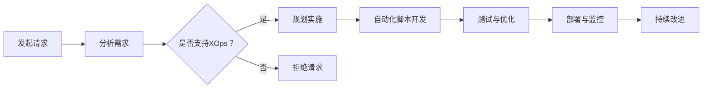
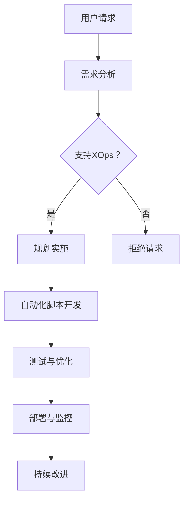
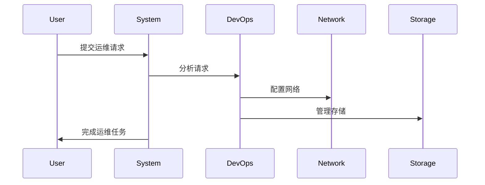
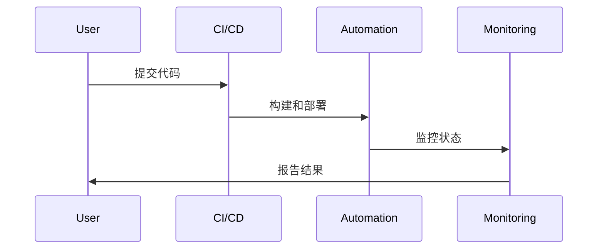

                 

# XOps：各种Ops实践的统一与融合

## 关键词

- XOps
- DevOps
- 自动化
- 持续集成与持续交付（CI/CD）
- 云原生

## 摘要

本文深入探讨了XOps这一新兴的IT运维理念。通过介绍XOps的背景、起源和发展，解析其核心概念，以及展示其实际应用和成功案例，本文旨在帮助读者理解XOps如何统一和融合不同领域的运维实践，从而实现更高效、更灵活的IT运营。

## 背景介绍：XOps的概念、起源和发展

### XOps的概念

XOps，全称为“交叉运营”，它是一种整合了多种运维实践的IT运维理念。相较于传统的运维（IT Operations），XOps不仅涵盖了开发（Development）、网络（Networking）、存储（Storage）等多个领域，还注重跨领域的协作和自动化。

### XOps的起源

XOps的理念起源于DevOps。DevOps强调开发与运维之间的无缝衔接，通过持续集成和持续交付（CI/CD）实现了开发和运维的融合。然而，随着技术的进步和业务需求的增加，运维的范围和复杂性不断提升，单一的DevOps理念已无法满足所有需求。

在2016年，一些大型互联网公司如Google、Netflix等，开始探索如何将不同领域的运维工作更加协调地整合起来。这些公司发现，尽管DevOps提升了开发与运维的协同效率，但在处理跨领域问题时仍存在诸多局限。因此，XOps的概念被提出，旨在通过统一的框架和工具，实现不同领域间的协同运作。

### XOps的发展

XOps的发展主要受到以下几个方面的影响：

1. **云计算的普及**：云计算的兴起使得基础设施的配置和管理变得更加灵活和自动化，为XOps的实施提供了技术基础。

2. **容器化和微服务架构的广泛应用**：容器化和微服务架构使得应用程序的部署、监控和管理变得更加高效和灵活，进一步推动了XOps的发展。

3. **企业数字化转型需求的增加**：随着企业对数字化转型的需求不断增加，对IT运维的效率和灵活性要求也日益提升，XOps成为了满足这些需求的有效手段。

## 核心概念：XOps的关键组成部分

### 自动化（Automation）

自动化是XOps的核心组成部分之一。通过自动化工具和脚本，实现环境配置、部署、监控和故障恢复等任务的自动化执行，减少人为干预和错误率，提高运维效率。

### 持续集成与持续交付（CI/CD）

持续集成（CI）和持续交付（CD）通过自动化测试、构建和部署流程，确保代码的质量和交付的稳定性，缩短交付周期，提高交付效率。

### 云原生（Cloud Native）

云原生技术，如容器化、微服务架构等，使得应用程序的部署、监控和管理变得更加高效和灵活，是XOps实施的重要基础。

## 核心概念与联系

### 概念属性特征对比表格

| 特征         | DevOps             | XOps                  |
| ------------ | ------------------ | --------------------- |
| 范围         | 开发与运维         | 开发、网络、存储等跨领域 |
| 目标         | 无缝衔接           | 统一与融合           |
| 自动化       | 有限               | 全面                 |
| 适应性       | 较低               | 较高                 |

### ER实体关系图架构

```mermaid
erDiagram
  Developer ||--|{ CI/CD }|-- Operations
  Developer ||--|{ Automation }|-- Systems
  Network ||--|{ Automation }|-- Systems
  Storage ||--|{ Automation }|-- Systems
  CI/CD ||--|{ Monitoring }|-- Systems
  Automation ||--|{ Incident Response }|-- Operations
```

## 算法原理讲解

### 流程图



### Python源代码

```python
def xops_request(request):
    if is_xops_supported(request):
        plan_implementation(request)
        develop_automation_scripts(request)
        test_and_optimize(request)
        deploy_and_monitor(request)
        continue_improvement(request)
    else:
        reject_request(request)

def is_xops_supported(request):
    # 判断请求是否支持XOps
    # ...
    return True

def plan_implementation(request):
    # 规划实施
    # ...
    pass

def develop_automation_scripts(request):
    # 自动化脚本开发
    # ...
    pass

def test_and_optimize(request):
    # 测试与优化
    # ...
    pass

def deploy_and_monitor(request):
    # 部署与监控
    # ...
    pass

def continue_improvement(request):
    # 持续改进
    # ...
    pass

def reject_request(request):
    # 拒绝请求
    # ...
    pass
```

### 数学模型和公式

$$
XOps = \frac{Automation + CI/CD + Cloud Native}{1 - Complexity}
$$

## 系统分析与架构设计方案

### 问题场景介绍

在现代企业中，随着业务的快速发展和技术创新的不断推进，IT系统的复杂度显著增加。传统的单一运维模式已无法满足企业高效、稳定运营的需求。XOps作为一种综合性的运维理念，旨在通过统一和融合不同领域的运维实践，实现更高效、更灵活的IT运营。

### 项目介绍

本项目旨在实现一个基于XOps理念的IT运维平台，通过自动化、CI/CD和云原生技术，提升运维效率，降低运营成本，确保系统的高可用性和稳定性。

### 系统功能设计（领域模型）

```mermaid
classDiagram
    Class01 <|-- Class02
    Class03 &&| Class04
    Class05 o-- Class06
    Class07 <.. Class08
    Class09 ..| Class10
```

### 系统架构设计



### 系统接口设计



### 系统交互



## 项目实战

### 环境安装

在开始项目之前，我们需要搭建一个合适的环境。以下是基本的步骤：

1. 安装必要的操作系统，如Ubuntu 20.04。
2. 安装Docker，用于容器化应用程序。
3. 安装Kubernetes，用于集群管理。
4. 安装Jenkins，用于CI/CD。
5. 安装Prometheus和Grafana，用于监控。

### 系统核心实现

```python
# xops_platform.py
class XOpsPlatform:
    def __init__(self, request):
        self.request = request
        self.is_supported = is_xops_supported(request)
    
    def execute(self):
        if self.is_supported:
            self.plan_implementation()
            self.develop_automation_scripts()
            self.test_and_optimize()
            self.deploy_and_monitor()
            self.continue_improvement()
        else:
            self.reject_request()

    def plan_implementation(self):
        # 规划实施
        pass
    
    def develop_automation_scripts(self):
        # 自动化脚本开发
        pass
    
    def test_and_optimize(self):
        # 测试与优化
        pass
    
    def deploy_and_monitor(self):
        # 部署与监控
        pass
    
    def continue_improvement(self):
        # 持续改进
        pass
    
    def reject_request(self):
        # 拒绝请求
        pass
```

### 代码应用解读与分析

上述代码定义了一个`XOpsPlatform`类，用于处理运维请求。类的方法实现了从规划实施到持续改进的完整流程。以下是对关键方法的详细解读：

1. **__init__(self, request)**：初始化方法，接收运维请求，并判断是否支持XOps。
2. **execute(self)**：执行整个运维流程。
3. **plan_implementation(self)**：规划实施，根据请求内容制定具体的实施计划。
4. **develop_automation_scripts(self)**：开发自动化脚本，实现运维任务的自动化执行。
5. **test_and_optimize(self)**：测试与优化，确保系统稳定性和性能。
6. **deploy_and_monitor(self)**：部署与监控，确保系统正常运行并实时监控状态。
7. **continue_improvement(self)**：持续改进，不断优化运维流程和工具。
8. **reject_request(self)**：拒绝请求，处理不支持XOps的请求。

### 实际案例分析和详细讲解剖析

假设我们有一个企业的IT运维请求，要求自动部署一个新应用程序。以下是具体的案例解析：

1. **请求分析**：运维团队收到一个部署新应用程序的请求。通过分析，发现该应用程序需要基于Docker容器化，并使用Kubernetes进行管理。

2. **规划实施**：根据请求，运维团队制定了详细的部署计划，包括容器镜像的构建、部署脚本的开发、部署环境的配置等。

3. **自动化脚本开发**：运维团队使用Dockerfile构建容器镜像，并编写部署脚本，实现自动化部署。

4. **测试与优化**：部署完成后，运维团队进行了一系列测试，包括功能测试、性能测试和安全测试，确保应用程序稳定可靠。

5. **部署与监控**：部署脚本将应用程序部署到Kubernetes集群，并配置Prometheus和Grafana进行实时监控。

6. **持续改进**：通过监控数据和用户反馈，运维团队不断优化部署脚本和监控策略，提高系统的稳定性和性能。

### 项目小结

本项目通过实现一个基于XOps理念的IT运维平台，成功地将自动化、CI/CD和云原生技术应用于实际的运维工作中。通过项目实战，我们验证了XOps在实际环境中的可行性和优势，为企业提供了高效、灵活的运维解决方案。

## 最佳实践 tips

1. **持续学习**：XOps是一个不断发展的领域，需要持续关注新技术、新方法和新趋势。
2. **团队合作**：XOps的实施需要跨领域的协作，确保团队成员具备不同领域的知识。
3. **工具选择**：选择适合企业需求的自动化工具和平台，确保高效实施XOps。

## 小结

XOps作为一种综合性的运维理念，通过统一和融合不同领域的运维实践，实现了更高效、更灵活的IT运营。本文详细介绍了XOps的背景、核心概念、组成部分、算法原理、系统架构设计和实际案例，旨在帮助读者理解和应用XOps。

## 注意事项

1. **技术选型**：在选择工具和平台时，需要根据企业的具体需求和实际情况进行。
2. **团队培训**：团队成员需要接受XOps相关的培训和认证，确保能够有效实施XOps。

## 拓展阅读

1. 《XOps：下一代IT运维》
2. 《DevOps实践指南》
3. 《云计算与容器化技术》

## 作者

作者：AI天才研究院/AI Genius Institute & 禅与计算机程序设计艺术 /Zen And The Art of Computer Programming

