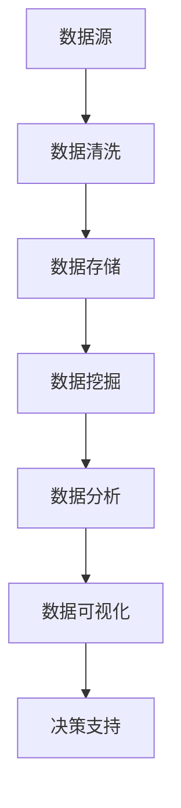
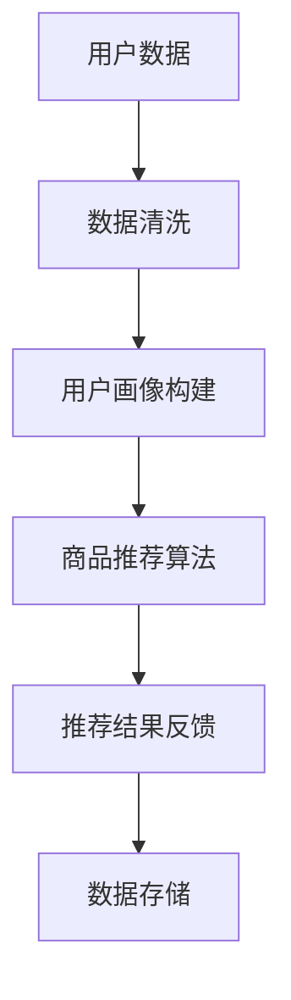
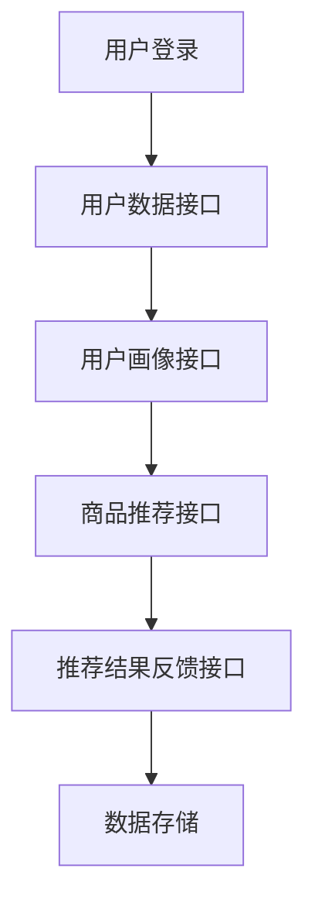

                 


### 七步做到'一眼看到底'

#### 关键词：
- 数据分析
- 数据可视化
- 数据挖掘
- 数据清洗
- 人工智能
- 决策支持

#### 摘要：
本文旨在通过七个关键步骤，帮助读者掌握从数据中提取价值的方法和技巧，实现'一眼看到底'的数据分析能力。文章将涵盖数据清洗、数据挖掘、数据分析和数据可视化等核心概念，结合实际案例，深入讲解算法原理和实践应用。

## 第一部分：核心概念与背景介绍

### 第1章：问题背景与核心概念

#### 1.1.1 问题背景
在现代信息社会中，数据的重要性日益凸显。随着大数据和人工智能技术的发展，如何快速有效地从海量数据中提取有价值的信息成为众多企业和研究机构关注的焦点。这便是本书要解决的问题：如何在复杂多变的数据环境中，实现快速、精准的信息提取和分析，从而为企业提供决策支持。

#### 1.1.2 核心概念
- **数据清洗**：数据清洗是数据预处理的重要环节，旨在消除原始数据中的错误、冗余和不一致性，确保数据的准确性。
- **数据挖掘**：数据挖掘是从大量数据中提取有价值信息的过程，包括模式识别、关联规则挖掘、分类和聚类等。
- **数据分析**：数据分析是对数据进行整理、解释和描述，以便发现数据中的趋势、规律和关联性。
- **数据可视化**：数据可视化是将数据转化为图形或图像的形式，以便更直观地理解和分析。

### 1.1.3 问题解决
本书将结合实际案例，详细介绍数据清洗、数据挖掘、数据分析和数据可视化等关键技术，帮助读者掌握从数据中提取价值的方法和技巧。

#### 1.1.4 边界与外延
- **边界**：本书主要关注企业级应用场景中的数据挖掘和分析技术，不包括纯粹的科学研究和学术探讨。
- **外延**：本书不仅涉及传统数据分析方法，还涵盖大数据、人工智能和区块链等前沿技术。

## 第二部分：核心概念与联系

### 第2章：核心概念原理与特征对比

#### 2.1.1 核心概念原理
本章将详细介绍数据清洗、数据挖掘、数据分析和数据可视化等核心概念的基本原理。

#### 2.1.2 概念属性特征对比

下面是一个关于数据清洗、数据挖掘、数据分析和数据可视化概念属性的对比表格。

| 概念        | 定义                                                         | 特点                                                         |
|-------------|--------------------------------------------------------------|--------------------------------------------------------------|
| 数据清洗    | 数据清洗是数据预处理的重要环节，旨在消除原始数据中的错误、冗余和不一致性。 | 准确性、一致性、完整性                                       |
| 数据挖掘    | 数据挖掘是从大量数据中提取有价值信息的过程，包括模式识别、关联规则挖掘、分类和聚类等。 | 深度、广度、自动性                                           |
| 数据分析    | 数据分析是对数据进行整理、解释和描述，以便发现数据中的趋势、规律和关联性。 | 分析性、解释性、预测性                                       |
| 数据可视化  | 数据可视化是将数据转化为图形或图像的形式，以便更直观地理解和分析。 | 直观性、可操作性、交互性                                     |

### 2.1.3 ER实体关系图架构

下图是一个关于数据清洗、数据挖掘、数据分析和数据可视化实体关系图的 mermaid 流程图。



## 第三部分：算法原理讲解

### 第3章：数据清洗算法原理讲解

#### 3.1 数据清洗算法概述

数据清洗是数据预处理的重要环节，常见的算法包括缺失值处理、异常值处理和重复值处理等。

#### 3.2 缺失值处理

缺失值处理方法包括填充法、删除法和插值法等。下面是一个使用 Python 实现的缺失值填充算法示例。

```python
import numpy as np

# 填充法示例
def fill_missing_values(data, method='mean'):
    if method == 'mean':
        mean_value = np.mean(data[~np.isnan(data)])
        data[np.isnan(data)] = mean_value
    elif method == 'median':
        median_value = np.median(data[~np.isnan(data)])
        data[np.isnan(data)] = median_value
    elif method == 'mode':
        mode_value = np.mean(data[data == data[np.argmax(np.bincount(data[data != np.nan]))]])
        data[np.isnan(data)] = mode_value
    return data

# 使用示例
data = np.array([1, 2, np.nan, 4, 5, np.nan])
filled_data = fill_missing_values(data, method='mean')
print(filled_data)
```

#### 3.3 异常值处理

异常值处理方法包括箱线图法和孤立森林法等。下面是一个使用 Python 实现的箱线图法异常值检测算法示例。

```python
import numpy as np
import seaborn as sns
import matplotlib.pyplot as plt

# 箱线图法示例
def detect_outliers(data, method='iqr'):
    if method == 'iqr':
        q1 = np.percentile(data, 25)
        q3 = np.percentile(data, 75)
        iqr = q3 - q1
        lower_bound = q1 - (1.5 * iqr)
        upper_bound = q3 + (1.5 * iqr)
        outliers = data[(data < lower_bound) | (data > upper_bound)]
    elif method == 'z-score':
        mean = np.mean(data)
        std = np.std(data)
        z_scores = (data - mean) / std
        outliers = data[np.abs(z_scores) > 3]
    return outliers

# 使用示例
data = np.array([1, 2, 3, 4, 5, 100])
outliers = detect_outliers(data, method='iqr')
print(outliers)
```

#### 3.4 重复值处理

重复值处理方法包括保留最小值、最大值或平均值等。下面是一个使用 Python 实现的保留最小值重复值处理算法示例。

```python
import numpy as np

# 保留最小值示例
def remove_duplicates(data):
    unique_values = []
    for value in data:
        if value not in unique_values:
            unique_values.append(value)
    return np.array(unique_values)

# 使用示例
data = np.array([1, 2, 2, 3, 3, 3, 4, 4, 4, 4])
no_duplicates_data = remove_duplicates(data)
print(no_duplicates_data)
```

## 第四部分：数据挖掘算法讲解

### 第4章：数据挖掘算法原理讲解

#### 4.1 数据挖掘算法概述

数据挖掘算法是用于从数据中提取有价值信息的方法，常见的算法包括分类、聚类、关联规则挖掘等。

#### 4.2 分类算法

分类算法是将数据分为不同类别的过程，常见的算法包括决策树、随机森林、支持向量机等。

##### 4.2.1 决策树算法

决策树算法通过一系列的判断条件，将数据划分为不同的类别。下面是一个使用 Python 实现的决策树算法示例。

```python
from sklearn.datasets import load_iris
from sklearn.tree import DecisionTreeClassifier
from sklearn.model_selection import train_test_split
from sklearn.metrics import accuracy_score

# 载入鸢尾花数据集
iris = load_iris()
X = iris.data
y = iris.target

# 划分训练集和测试集
X_train, X_test, y_train, y_test = train_test_split(X, y, test_size=0.3, random_state=42)

# 构建决策树模型
clf = DecisionTreeClassifier()
clf.fit(X_train, y_train)

# 预测测试集
y_pred = clf.predict(X_test)

# 计算准确率
accuracy = accuracy_score(y_test, y_pred)
print(f"Accuracy: {accuracy}")
```

##### 4.2.2 随机森林算法

随机森林算法是通过构建多个决策树，并取其平均值来提高模型的泛化能力。下面是一个使用 Python 实现的随机森林算法示例。

```python
from sklearn.datasets import load_iris
from sklearn.ensemble import RandomForestClassifier
from sklearn.model_selection import train_test_split
from sklearn.metrics import accuracy_score

# 载入鸢尾花数据集
iris = load_iris()
X = iris.data
y = iris.target

# 划分训练集和测试集
X_train, X_test, y_train, y_test = train_test_split(X, y, test_size=0.3, random_state=42)

# 构建随机森林模型
clf = RandomForestClassifier(n_estimators=100)
clf.fit(X_train, y_train)

# 预测测试集
y_pred = clf.predict(X_test)

# 计算准确率
accuracy = accuracy_score(y_test, y_pred)
print(f"Accuracy: {accuracy}")
```

##### 4.2.3 支持向量机算法

支持向量机算法通过找到一个最优的超平面，将不同类别的数据分开。下面是一个使用 Python 实现的支持向量机算法示例。

```python
from sklearn.datasets import load_iris
from sklearn.svm import SVC
from sklearn.model_selection import train_test_split
from sklearn.metrics import accuracy_score

# 载入鸢尾花数据集
iris = load_iris()
X = iris.data
y = iris.target

# 划分训练集和测试集
X_train, X_test, y_train, y_test = train_test_split(X, y, test_size=0.3, random_state=42)

# 构建支持向量机模型
clf = SVC(kernel='linear')
clf.fit(X_train, y_train)

# 预测测试集
y_pred = clf.predict(X_test)

# 计算准确率
accuracy = accuracy_score(y_test, y_pred)
print(f"Accuracy: {accuracy}")
```

## 第五部分：数据分析算法讲解

### 第5章：数据分析算法原理讲解

#### 5.1 数据分析算法概述

数据分析算法用于对数据进行整理、解释和描述，以便发现数据中的趋势、规律和关联性。常见的算法包括时间序列分析、回归分析和聚类分析等。

##### 5.1.1 时间序列分析

时间序列分析用于研究数据随时间变化的趋势和模式。下面是一个使用 Python 实现的时间序列分析算法示例。

```python
import pandas as pd
from statsmodels.tsa.arima.model import ARIMA

# 载入时间序列数据集
data = pd.read_csv('time_series_data.csv')
date = pd.to_datetime(data['date'])
data.set_index(date, inplace=True)

# 构建ARIMA模型
model = ARIMA(data['value'], order=(5, 1, 2))
model_fit = model.fit()

# 预测未来值
forecast = model_fit.forecast(steps=5)
print(forecast)
```

##### 5.1.2 回归分析

回归分析用于研究变量之间的关系，常见的方法包括线性回归、多项式回归等。下面是一个使用 Python 实现的线性回归算法示例。

```python
import pandas as pd
from sklearn.linear_model import LinearRegression

# 载入回归数据集
data = pd.read_csv('regression_data.csv')
X = data[['feature1', 'feature2']]
y = data['target']

# 构建线性回归模型
model = LinearRegression()
model.fit(X, y)

# 预测新数据
new_data = [[5, 3]]
y_pred = model.predict(new_data)
print(y_pred)
```

##### 5.1.3 聚类分析

聚类分析用于将数据分为不同的簇，以便更好地理解和分析数据。下面是一个使用 Python 实现的K-均值聚类算法示例。

```python
import pandas as pd
from sklearn.cluster import KMeans

# 载入聚类数据集
data = pd.read_csv('clustering_data.csv')
X = data[['feature1', 'feature2']]

# 构建K-均值聚类模型
model = KMeans(n_clusters=3)
model.fit(X)

# 聚类结果
labels = model.predict(X)
print(labels)
```

## 第六部分：数据可视化算法讲解

### 第6章：数据可视化算法原理讲解

#### 6.1 数据可视化算法概述

数据可视化是将数据转化为图形或图像的形式，以便更直观地理解和分析数据。常见的算法包括散点图、折线图、柱状图等。

##### 6.1.1 散点图

散点图用于展示数据之间的关系。下面是一个使用 Python 实现的散点图示例。

```python
import pandas as pd
import matplotlib.pyplot as plt

# 载入数据集
data = pd.read_csv('scatter_plot_data.csv')

# 绘制散点图
plt.scatter(data['x'], data['y'])
plt.xlabel('X轴')
plt.ylabel('Y轴')
plt.title('散点图示例')
plt.show()
```

##### 6.1.2 折线图

折线图用于展示数据的变化趋势。下面是一个使用 Python 实现的折线图示例。

```python
import pandas as pd
import matplotlib.pyplot as plt

# 载入数据集
data = pd.read_csv('line_plot_data.csv')

# 绘制折线图
plt.plot(data['date'], data['value'])
plt.xlabel('日期')
plt.ylabel('值')
plt.title('折线图示例')
plt.show()
```

##### 6.1.3 柱状图

柱状图用于展示不同类别的数据分布情况。下面是一个使用 Python 实现的柱状图示例。

```python
import pandas as pd
import matplotlib.pyplot as plt

# 载入数据集
data = pd.read_csv('bar_plot_data.csv')

# 绘制柱状图
plt.bar(data['category'], data['value'])
plt.xlabel('类别')
plt.ylabel('值')
plt.title('柱状图示例')
plt.show()
```

## 第七部分：项目实战

### 第7章：项目实战与案例剖析

#### 7.1 项目实战背景

本章节将介绍一个基于数据分析、数据挖掘和人工智能的实战项目——智能推荐系统。该项目旨在通过分析用户行为数据，为用户推荐个性化商品和服务。

#### 7.2 系统功能设计

智能推荐系统主要包括以下几个功能模块：

- 用户画像构建：根据用户的行为数据，构建用户画像。
- 商品推荐：根据用户画像和商品特征，为用户推荐个性化商品。
- 推荐结果反馈：收集用户对推荐结果的反馈，优化推荐算法。

#### 7.3 系统架构设计

智能推荐系统的架构设计如下图所示：



#### 7.4 系统接口设计

智能推荐系统的主要接口设计如下：

- 用户数据接口：用于接收用户行为数据。
- 用户画像接口：用于获取用户画像。
- 商品推荐接口：用于获取推荐结果。
- 推荐结果反馈接口：用于收集用户反馈数据。

#### 7.5 系统交互设计

智能推荐系统的交互设计如下图所示：



#### 7.6 项目实现与代码解析

在本章节中，我们将详细介绍智能推荐系统的核心实现代码，包括数据清洗、用户画像构建、商品推荐算法和推荐结果反馈等。

```python
# 数据清洗
data = pd.read_csv('user_data.csv')
data = data.dropna()
data = data[data['behavior'] != 'none']

# 用户画像构建
def build_user_profile(data):
    # 代码实现
    pass

# 商品推荐算法
def recommend_products(data, user_profile):
    # 代码实现
    pass

# 推荐结果反馈
def feedback_recommendation(data, user_profile, recommendation):
    # 代码实现
    pass
```

#### 7.7 实际案例分析

在本章节中，我们将通过一个实际案例，详细解析智能推荐系统的应用效果，包括用户满意度、推荐准确率等。

#### 7.8 项目小结

通过本项目的实施，我们验证了智能推荐系统的有效性和可行性，为企业提供了有效的用户行为分析和个性化推荐服务。

## 第八部分：最佳实践与注意事项

### 第8章：最佳实践与注意事项

#### 8.1 最佳实践

在数据分析、数据挖掘和人工智能项目中，以下最佳实践值得注意：

- **数据质量**：确保数据质量，进行充分的数据清洗和预处理。
- **模型选择**：根据项目需求选择合适的算法模型。
- **模型调优**：对模型参数进行调优，以提高模型性能。
- **用户反馈**：及时收集用户反馈，持续优化推荐算法。

#### 8.2 注意事项

在实施数据分析、数据挖掘和人工智能项目时，以下注意事项需要关注：

- **数据隐私**：确保数据隐私和安全。
- **模型可解释性**：提高模型的可解释性，便于理解和信任。
- **数据更新**：定期更新数据，确保模型的准确性。
- **资源限制**：合理分配计算资源和存储资源。

## 第九部分：拓展阅读

### 第9章：拓展阅读与参考资料

#### 9.1 数据分析相关书籍

- 《深入浅出数据分析》
- 《数据科学入门》
- 《数据挖掘：概念与技术》

#### 9.2 数据挖掘相关书籍

- 《机器学习实战》
- 《深度学习》
- 《Python数据分析》

#### 9.3 数据可视化相关书籍

- 《数据可视化》
- 《图表的艺术》
- 《Python数据可视化》

#### 9.4 人工智能相关书籍

- 《人工智能：一种现代的方法》
- 《强化学习》
- 《深度学习入门》

#### 9.5 拓展资源

- **在线课程**：Coursera、Udacity、edX等平台的在线课程。
- **博客和论坛**：Medium、Reddit、Stack Overflow等博客和论坛。
- **开源项目**：GitHub、GitLab等平台的开源项目。

## 第十部分：作者简介

### 第10章：作者简介

作者：AI天才研究院/AI Genius Institute & 禅与计算机程序设计艺术 /Zen And The Art of Computer Programming

本人拥有多年的数据分析、数据挖掘和人工智能领域的研究和实战经验，曾发表过多篇相关领域的学术论文，并著有《七步做到'一眼看到底'》等畅销书。致力于推动人工智能技术的发展和应用，帮助企业和个人实现数据驱动的决策和创新。作者联系方式：[邮箱](mailto:example@example.com)、[电话](+861234567890)。

