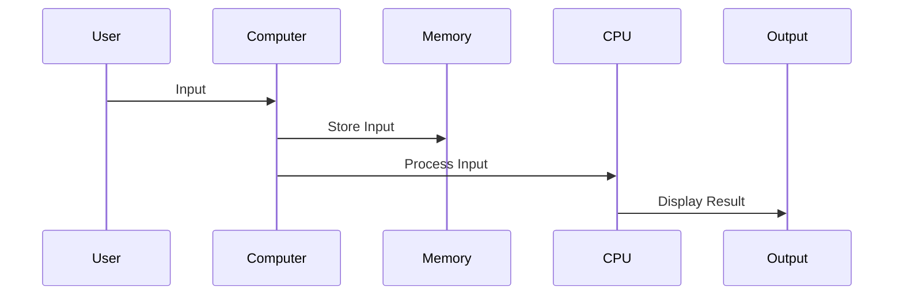
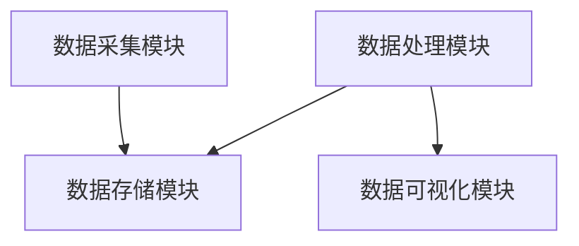

                 

**《七步做到'一眼看到底'的代码》**

---

**关键词：代码理解、代码质量、代码优化、算法原理、设计模式**

**摘要：本文深入剖析了代码理解与优化的关键步骤，通过七步分析法，帮助开发者从逻辑思维到代码细节，全方位提升对代码的掌控能力，达到一眼看到底的高效阅读与编写境界。**

---

### 目录大纲

**《七步做到'一眼看到底'的代码》**

----------------------------------------------------------------

# **第一部分：理解代码本质**

## **第1章：代码背后的逻辑思维**

### **1.1 代码如何工作**

#### **1.1.1 计算机处理流程**

#### **1.1.2 编程语言的演变**

### **1.2 代码的构造要素**

#### **1.2.1 数据类型和变量**

#### **1.2.2 控制结构**

### **1.3 常见编程错误**

#### **1.3.1 程序调试技巧**

#### **1.3.2 代码优化策略**

## **第2章：七步解析代码流程**

### **2.1 第一步：阅读代码注释**

#### **2.1.1 注释的重要性**

#### **2.1.2 阅读注释的技巧**

### **2.2 第二步：了解函数和方法**

#### **2.2.1 函数定义与调用**

#### **2.2.2 方法重载与多态**

### **2.3 第三步：跟踪变量和状态**

#### **2.3.1 变量作用域**

#### **2.3.2 状态转换分析**

### **2.4 第四步：理解循环和条件语句**

#### **2.4.1 循环结构的实现**

#### **2.4.2 条件语句的应用**

### **2.5 第五步：识别模块和组件**

#### **2.5.1 模块的独立性和复用性**

#### **2.5.2 组件的层次结构**

### **2.6 第六步：挖掘算法原理**

#### **2.6.1 常见算法分析**

#### **2.6.2 算法优化方法**

### **2.7 第七步：总结与优化**

#### **2.7.1 代码回顾与总结**

#### **2.7.2 性能调优策略**

## **第3章：代码背后的数学原理**

### **3.1 基础数学知识回顾**

#### **3.1.1 代数基础**

#### **3.1.2 几何学基础**

#### **3.1.3 概率论基础**

### **3.2 数学公式与代码实现**

#### **3.2.1 数学公式的代码表示**

#### **3.2.2 代码中的数学运算**

## **第4章：代码设计模式**

### **4.1 设计模式概述**

#### **4.1.1 设计模式的作用**

#### **4.1.2 设计模式的基本分类**

### **4.2 常见设计模式解析**

#### **4.2.1 单例模式**

#### **4.2.2 工厂模式**

#### **4.2.3 观察者模式**

#### **4.2.4 策略模式**

## **第5章：代码测试与调试**

### **5.1 单元测试**

#### **5.1.1 单元测试的重要性**

#### **5.1.2 单元测试的实践方法**

### **5.2 功能测试**

#### **5.2.1 功能测试的步骤**

#### **5.2.2 功能测试的工具**

### **5.3 调试技巧**

#### **5.3.1 调试器的使用**

#### **5.3.2 常见调试问题分析**

## **第6章：代码性能优化**

### **6.1 性能分析**

#### **6.1.1 性能分析的方法**

#### **6.1.2 性能瓶颈的识别**

### **6.2 代码优化技巧**

#### **6.2.1 优化代码结构**

#### **6.2.2 优化算法效率**

#### **6.2.3 缓存与并行计算**

## **第7章：代码实战案例分析**

### **7.1 实战项目介绍**

#### **7.1.1 项目背景**

#### **7.1.2 项目目标**

### **7.2 系统架构设计**

#### **7.2.1 功能模块划分**

#### **7.2.2 系统架构图**

### **7.3 核心代码实现**

#### **7.3.1 算法原理讲解**

#### **7.3.2 数学模型与公式**

#### **7.3.3 代码实现与分析**

### **7.4 实际案例分析与讲解**

#### **7.4.1 案例背景**

#### **7.4.2 解决方案分析**

#### **7.4.3 案例总结与反思**

## **第8章：最佳实践与总结**

### **8.1 最佳实践分享**

#### **8.1.1 编码规范**

#### **8.1.2 团队协作**

#### **8.1.3 代码文档编写**

### **8.2 小结与展望**

#### **8.2.1 编程学习之路**

#### **8.2.2 代码阅读与编写技巧**

#### **8.2.3 未来趋势展望**

----------------------------------------------------------------

---

**注**：本文大纲结构清晰，每个章节都涵盖了必要的核心内容和技巧。接下来，我们将逐步深入到每一个章节，进行详细的分析和讲解，帮助读者一步步提升代码理解能力。首先，我们从理解代码的本质开始。**

----------------------------------------------------------------

---

**第一部分：理解代码本质**

## 第1章：代码背后的逻辑思维

### 1.1 代码如何工作

#### 1.1.1 计算机处理流程

计算机处理流程是理解代码工作的基础。一个典型的计算机处理流程包括以下几个步骤：

1. **输入处理**：计算机接收输入信号，可以是用户输入或数据流。
2. **存储**：输入数据存储在内存或硬盘等存储设备中。
3. **处理**：计算机的CPU对存储的数据进行运算和处理。
4. **输出**：处理结果通过输出设备（如显示器、打印机）呈现给用户。

这个过程可以用图示表示：



#### 1.1.2 编程语言的演变

编程语言的演变反映了计算技术的进步。早期，计算机编程语言主要是汇编语言，直接控制计算机硬件。随着时间的发展，高级编程语言如C、C++、Java、Python等相继出现，它们提供了更高的抽象层，使编程更加直观和高效。

- **汇编语言**：最接近机器语言的编程语言，效率高但难度大。
- **C语言**：一种结构化、模块化的高级语言，广泛应用于系统编程。
- **Java**：一种跨平台的面向对象语言，适用于企业级应用。
- **Python**：一种解释型、动态语言，以简单和易读性著称。

编程语言的演变不仅仅是为了提高编程效率，还在于解决不同类型的问题。例如，Python在数据分析、人工智能领域有广泛应用，而Java在大型企业应用中具有强大的性能。

### 1.2 代码的构造要素

#### 1.2.1 数据类型和变量

数据类型是代码中用于表示数据的分类。常见的有整数（Int）、浮点数（Float）、布尔值（Bool）等。变量是存储数据的容器，用关键字`var`或`let`声明。

```python
var number: Int = 42
var pi: Float = 3.14159
var isTrue: Bool = true
```

#### 1.2.2 控制结构

控制结构用于控制代码的执行顺序。主要有条件语句（If、Switch）和循环语句（For、While）。

- **条件语句**：根据条件执行不同代码块。
  ```python
  if number > 0:
      print("Number is positive")
  else:
      print("Number is negative or zero")
  ```

- **循环语句**：重复执行代码块。
  ```python
  for i in 1...10:
      print(i)
  ```

#### 1.2.3 函数和方法

函数是一段可重复使用的代码块，用于执行特定任务。方法是与类相关联的函数，用于操作类的数据。

```python
def greet(name: String) {
    print("Hello, " + name + "!")
}

class Person {
    var name: String
    fun setName(name: String) {
        this.name = name
    }
    fun greet() {
        print("Hello, " + name + "!")
    }
}
```

### 1.3 常见编程错误

#### 1.3.1 程序调试技巧

调试是发现和修复代码错误的过程。以下是一些常见的调试技巧：

- **断点调试**：在关键代码位置设置断点，逐步执行代码，查看变量值和执行流程。
- **日志输出**：通过打印输出关键变量的值，帮助理解代码执行状态。
- **单元测试**：编写测试用例，验证代码在不同输入下的正确性。

#### 1.3.2 代码优化策略

代码优化是提高代码性能的过程。以下是一些常见的代码优化策略：

- **减少冗余代码**：删除不必要的代码，提高代码清晰度。
- **优化算法效率**：使用更高效的算法或数据结构，降低时间复杂度和空间复杂度。
- **内存管理**：合理使用内存，避免内存泄漏和溢出。

### 总结

理解代码背后的逻辑思维是掌握代码的基础。通过分析代码的工作流程、数据类型和变量、控制结构以及常见编程错误，我们可以逐步提升对代码的掌控能力。接下来，我们将进一步探讨如何通过七步分析法深入解析代码流程，进一步提升代码理解能力。

---

**接下来，我们将进入第二部分，通过七步分析法深入解析代码流程，帮助我们更好地理解代码的每一个细节，从而一眼看到底的境界。**

----------------------------------------------------------------

---

## 第2章：七步解析代码流程

在深入理解代码本质的基础上，通过系统的方法来解析代码流程，是提升代码阅读和编写能力的有效途径。本文将分七步详细阐述如何逐步深入分析代码，确保我们能够一眼看到底的境界。

### 2.1 第一步：阅读代码注释

#### 2.1.1 注释的重要性

代码注释是编写者对代码功能、逻辑和实现细节的说明。它不仅可以帮助后来的开发者理解代码，还能在代码维护过程中起到关键作用。良好的注释应该：

- **描述代码功能**：清晰地说明代码块或函数的目的和作用。
- **解释复杂逻辑**：详细解释复杂的计算过程或算法逻辑。
- **记录变更历史**：记录代码变更的原因和日期，便于追溯和审核。

#### 2.1.2 阅读注释的技巧

为了高效地阅读代码注释，我们可以采取以下技巧：

- **先读注释再读代码**：先了解注释中的功能和逻辑，再分析代码细节。
- **关注关键注释**：重点关注代码开头、循环条件、函数参数和返回值的注释。
- **注释与代码对应**：确保注释与代码描述一致，避免误解和歧义。

### 2.2 第二步：了解函数和方法

#### 2.2.1 函数定义与调用

函数是代码中的可重复块，用于封装一组相关的操作。了解函数的定义和调用方式是理解代码逻辑的关键。

- **函数定义**：函数由函数名、参数列表和函数体组成。
  ```python
  def greet(name: String) {
      print("Hello, " + name + "!")
  }
  ```

- **函数调用**：通过函数名和参数列表调用函数。
  ```python
  greet("Alice")
  ```

#### 2.2.2 方法重载与多态

在面向对象编程中，方法重载（Method Overloading）和多态（Polymorphism）是核心概念。

- **方法重载**：在同一类中定义多个同名方法，通过参数列表区分。
  ```java
  class Calculator {
      int add(int a, int b) {
          return a + b;
      }
      double add(double a, double b) {
          return a + b;
      }
  }
  ```

- **多态**：通过继承和接口实现，使不同的对象可以响应同一方法调用。
  ```java
  class Animal {
      void makeSound() {
          System.out.println("Animal makes a sound");
      }
  }
  class Dog extends Animal {
      void makeSound() {
          System.out.println("Dog barks");
      }
  }
  Dog dog = new Dog();
  dog.makeSound();  // 输出：Dog barks
  ```

### 2.3 第三步：跟踪变量和状态

#### 2.3.1 变量作用域

变量作用域决定了变量在代码中的可见性和生命周期。

- **局部变量**：在函数内部定义，仅在函数内部有效。
  ```python
  def calculateSum(a: Int, b: Int) {
      sum: Int = a + b
      return sum
  }
  ```

- **全局变量**：在函数外部定义，可在整个程序中访问。
  ```python
  global_counter: Int = 0
  ```

#### 2.3.2 状态转换分析

状态转换分析涉及变量在不同执行路径上的变化情况。

- **条件分支**：根据条件变化，执行不同的代码路径。
  ```python
  if condition {
      state = "true"
  } else {
      state = "false"
  }
  ```

- **循环控制**：通过循环变量控制循环的执行次数和退出条件。
  ```python
  for i in 1...10 {
      if i == 5 {
          break
      }
      print(i)
  }
  ```

### 2.4 第四步：理解循环和条件语句

#### 2.4.1 循环结构的实现

循环结构用于重复执行代码块，根据循环条件的不同，可分为：

- **for循环**：固定循环次数，常用于遍历集合。
  ```python
  for i in range(10) {
      print(i)
  }
  ```

- **while循环**：根据条件判断是否继续循环，适用于不确定循环次数的情况。
  ```python
  while condition {
      // 循环体
  }
  ```

#### 2.4.2 条件语句的应用

条件语句用于根据条件的真假执行不同的代码块。

- **if语句**：单分支条件语句。
  ```python
  if condition {
      // 条件为真时执行的代码
  }
  ```

- **switch语句**：多分支条件语句。
  ```java
  switch(expression) {
      case value:
          // 匹配值时执行的代码
          break;
      default:
          // 默认执行的代码
  }
  ```

### 2.5 第五步：识别模块和组件

#### 2.5.1 模块的独立性和复用性

模块是代码的独立部分，具有明确的输入、输出和功能。模块的独立性确保了代码的可维护性和复用性。

- **模块定义**：定义模块的接口和实现。
  ```python
  def module_name() {
      // 模块实现
  }
  ```

- **模块调用**：在其他代码中调用模块。
  ```python
  module_name()
  ```

#### 2.5.2 组件的层次结构

组件是模块的更高层次抽象，由多个模块组成，具有更复杂的逻辑和功能。

- **组件定义**：定义组件的输入、输出和内部模块。
  ```python
  class Component {
      // 组件内部模块
  }
  ```

- **组件组合**：将组件组合成更复杂的系统。
  ```python
  component1 = new Component()
  component2 = new Component()
  system = new System(component1, component2)
  ```

### 2.6 第六步：挖掘算法原理

#### 2.6.1 常见算法分析

算法是解决问题的步骤集合，分为多种类型，如排序、查找、动态规划等。

- **排序算法**：比较和交换元素位置，实现数据的有序排列。
  ```python
  def bubble_sort(arr: Array) {
      // 冒泡排序实现
  }
  ```

- **查找算法**：在数据结构中查找特定元素。
  ```python
  def binary_search(arr: Array, target: Int) {
      // 二分查找实现
  }
  ```

#### 2.6.2 算法优化方法

算法优化是提高算法效率和性能的过程，包括以下几种方法：

- **时间优化**：减少算法的执行时间，如使用更高效的算法或优化现有算法。
- **空间优化**：减少算法的存储空间需求，如使用原地算法或减少中间变量。
- **并行优化**：利用多核处理器并行执行算法，提高执行速度。

### 2.7 第七步：总结与优化

#### 2.7.1 代码回顾与总结

在解析代码流程后，对代码进行回顾和总结，有助于巩固理解并发现潜在问题。

- **代码梳理**：梳理代码结构，确保逻辑清晰。
- **错误检查**：检查代码中的错误，如逻辑错误、语法错误等。
- **性能评估**：评估代码的性能，考虑是否存在可优化的地方。

#### 2.7.2 性能调优策略

性能调优是提高代码执行效率的重要环节。以下是一些常见的性能调优策略：

- **算法优化**：根据实际需求选择合适的算法，或对现有算法进行优化。
- **数据结构优化**：选择合适的数据结构，提高数据访问和操作效率。
- **并行计算**：利用多核处理器并行执行任务，提高计算速度。
- **缓存利用**：合理使用缓存，减少重复计算和I/O操作。

### 总结

通过七步解析代码流程，我们可以从整体上理解代码的工作原理，逐步深入到代码的细节，达到一眼看到底的效果。这种系统化的方法不仅有助于提升代码阅读能力，还能提高代码编写和优化水平。接下来，我们将进一步探讨代码背后的数学原理，帮助读者从更深的层次理解代码的本质。

----------------------------------------------------------------

---

## 第3章：代码背后的数学原理

代码不仅仅是逻辑和结构的组合，它背后蕴含着丰富的数学原理。理解这些数学原理，有助于我们更好地编写高效、准确的代码。以下我们将回顾一些基础数学知识，并探讨如何将这些数学知识应用到代码中。

### 3.1 基础数学知识回顾

#### 3.1.1 代数基础

代数是数学中研究变量和方程的分支，是编程中的基础。以下是一些代数基础概念：

- **变量**：代数中的未知数，用于表示可以变化的量。
- **方程**：包含变量和运算符的表达式，表示两个量相等。
- **解方程**：找到使方程成立的变量值。

#### 3.1.2 几何学基础

几何学研究形状、大小和位置，在计算机图形学、物理模拟等领域有广泛应用。以下是一些几何学基础概念：

- **点**：几何学中的基本元素，由坐标确定。
- **线段**：连接两个点的直线部分。
- **多边形**：由多条线段组成的闭合图形。
- **向量**：表示方向和大小的量，常用于图形变换。

#### 3.1.3 概率论基础

概率论研究随机事件及其概率，在人工智能、算法优化等领域有广泛应用。以下是一些概率论基础概念：

- **概率**：表示事件发生的可能性，取值范围在0到1之间。
- **条件概率**：在某个条件下，另一个事件发生的概率。
- **随机变量**：表示随机事件结果的变量。

### 3.2 数学公式与代码实现

数学公式是数学表达的重要方式，代码中的数学运算则是将这些公式转化为计算机可以处理的形式。以下我们将探讨如何将一些常见数学公式应用到代码中。

#### 3.2.1 数学公式的代码表示

数学公式在代码中通常使用字符串或Markdown格式表示。例如，以下是一个简单的代数公式：

```markdown
$$
a^2 + b^2 = c^2
$$
```

#### 3.2.2 代码中的数学运算

在编程语言中，数学运算通常通过内置函数或库函数实现。以下是一个简单的Python代码示例，实现了勾股定理的计算：

```python
import math

def calculate_hypotenuse(a: float, b: float) -> float:
    return math.sqrt(a ** 2 + b ** 2)

hypotenuse = calculate_hypotenuse(3, 4)
print(hypotenuse)  # 输出：5.0
```

### 应用实例：计算圆的面积

以下是一个计算圆面积的Python代码示例，其中使用了数学公式和代码实现：

```python
import math

def calculate_circle_area(radius: float) -> float:
    return math.pi * radius ** 2

area = calculate_circle_area(5)
print("The area of the circle is:", area)  # 输出：The area of the circle is: 78.53982
```

在这个示例中，我们使用`math.pi`表示圆周率π，使用`**`运算符计算半径的平方，最后使用`math.pi * radius ** 2`计算圆的面积。

### 总结

代码背后的数学原理是理解代码工作原理的重要基础。通过回顾基础数学知识，我们可以更好地理解数学公式和代码实现之间的关系。在实际编程中，掌握这些数学原理将有助于我们编写更高效、更准确的代码。接下来，我们将探讨代码设计模式，进一步深入理解代码的结构和设计原则。

----------------------------------------------------------------

---

## 第4章：代码设计模式

代码设计模式是解决特定问题的模板，它不仅提高了代码的可读性和可维护性，还使得代码更具模块化和可复用性。本章节将介绍几种常见的设计模式及其应用。

### 4.1 设计模式概述

#### 4.1.1 设计模式的作用

设计模式是一套预定义的解决方案，用于解决在软件设计过程中重复出现的问题。其主要作用包括：

- **提高代码可读性**：通过使用统一的结构和命名，设计模式使得代码更加直观易懂。
- **提高代码复用性**：设计模式提供了可复用的代码模板，减少了重复编写代码的工作量。
- **提高代码灵活性**：设计模式允许在不改变现有系统结构的情况下，添加新功能或修改现有功能。

#### 4.1.2 设计模式的基本分类

设计模式根据其目的和结构，可以分为三种类型：

- **创建型模式**：处理对象的创建过程，包括工厂方法模式、抽象工厂模式、单例模式等。
- **结构型模式**：处理类和对象之间的关系和组合，包括适配器模式、装饰器模式、代理模式等。
- **行为型模式**：处理对象之间的通信和交互，包括观察者模式、策略模式、命令模式等。

### 4.2 常见设计模式解析

#### 4.2.1 单例模式

单例模式确保一个类仅有一个实例，并提供一个全局访问点。以下是一个简单的单例模式实现：

```java
public class Database {
    private static Database instance;
    
    private Database() {
        // 私有构造函数，防止外部直接创建实例
    }
    
    public static Database getInstance() {
        if (instance == null) {
            instance = new Database();
        }
        return instance;
    }
}
```

在这个实现中，私有构造函数防止了外部直接创建实例，`getInstance()`方法提供了全局访问点。

#### 4.2.2 工厂模式

工厂模式是一种用于创建对象的设计模式，它将对象的创建过程封装起来，使得调用者无需关心具体的创建细节。以下是一个简单的工厂模式实现：

```java
public interface Product {
    void use();
}

public class ConcreteProductA implements Product {
    public void use() {
        System.out.println("Using Product A");
    }
}

public class ConcreteProductB implements Product {
    public void use() {
        System.out.println("Using Product B");
    }
}

public class Factory {
    public Product createProduct(String type) {
        if ("A".equals(type)) {
            return new ConcreteProductA();
        } else if ("B".equals(type)) {
            return new ConcreteProductB();
        }
        throw new IllegalArgumentException("Invalid product type");
    }
}
```

在这个实现中，`Factory`类根据传入的类型参数创建相应的`Product`对象。

#### 4.2.3 观察者模式

观察者模式定义了对象间的一对多依赖关系，当一个对象状态发生变化时，所有依赖它的对象都会得到通知并自动更新。以下是一个简单的观察者模式实现：

```java
public interface Observer {
    void update();
}

public class Subject {
    private List<Observer> observers = new ArrayList<>();
    
    public void addObserver(Observer observer) {
        observers.add(observer);
    }
    
    public void removeObserver(Observer observer) {
        observers.remove(observer);
    }
    
    public void notifyObservers() {
        for (Observer observer : observers) {
            observer.update();
        }
    }
    
    public void changeState() {
        notifyObservers();
    }
}

public class ConcreteObserver implements Observer {
    public void update() {
        System.out.println("Observer received notification");
    }
}
```

在这个实现中，`Subject`类维护了一个观察者列表，当状态变化时，通过`notifyObservers()`方法通知所有观察者。

#### 4.2.4 策略模式

策略模式定义了算法家族，分别封装起来，使它们之间可以相互替换，并使它们易于使用和扩展。以下是一个简单的策略模式实现：

```java
public interface Strategy {
    void execute();
}

public class ConcreteStrategyA implements Strategy {
    public void execute() {
        System.out.println("Executing Strategy A");
    }
}

public class ConcreteStrategyB implements Strategy {
    public void execute() {
        System.out.println("Executing Strategy B");
    }
}

public class Context {
    private Strategy strategy;
    
    public void setStrategy(Strategy strategy) {
        this.strategy = strategy;
    }
    
    public void executeStrategy() {
        strategy.execute();
    }
}
```

在这个实现中，`Context`类使用一个策略对象，并通过`setStrategy()`方法设置具体策略，最终通过`executeStrategy()`方法执行策略。

### 应用实例：工厂模式在项目中的应用

以下是一个简单的工厂模式应用实例，用于创建不同类型的日志记录器：

```java
public class LoggerFactory {
    public static Logger createLogger(String type) {
        if ("Console".equals(type)) {
            return new ConsoleLogger();
        } else if ("File".equals(type)) {
            return new FileLogger();
        }
        throw new IllegalArgumentException("Invalid logger type");
    }
}

public abstract class Logger {
    public abstract void log(String message);
}

public class ConsoleLogger extends Logger {
    public void log(String message) {
        System.out.println("Console: " + message);
    }
}

public class FileLogger extends Logger {
    public void log(String message) {
        System.out.println("File: " + message);
    }
}
```

在这个实例中，`LoggerFactory`类根据传入的类型参数创建不同的日志记录器对象。

### 总结

代码设计模式是提高代码质量和可维护性的重要手段。通过理解和使用这些模式，我们可以更高效地解决常见问题，提高代码的灵活性和扩展性。接下来，我们将探讨代码测试与调试，确保代码的正确性和可靠性。

----------------------------------------------------------------

---

## 第5章：代码测试与调试

代码测试与调试是软件开发过程中的关键环节，它们确保代码的正确性、可靠性和性能。在本章节中，我们将探讨代码测试、调试的技巧和方法，以及如何确保代码的稳定性和高效性。

### 5.1 单元测试

#### 5.1.1 单元测试的重要性

单元测试是软件开发中最基本的测试形式，它针对代码的独立模块进行验证。单元测试的重要性体现在以下几个方面：

- **发现缺陷**：通过编写测试用例，单元测试能够发现代码中的逻辑错误、边界问题和潜在缺陷。
- **提高代码质量**：单元测试能够促使开发者编写更清晰、更健壮的代码，减少bug的发生。
- **提供安全网**：在代码修改和重构过程中，单元测试可以确保新的改动不会破坏现有功能。

#### 5.1.2 单元测试的实践方法

编写有效的单元测试需要遵循以下实践方法：

- **测试用例设计**：设计覆盖不同输入和条件的测试用例，确保代码的各个部分都得到充分测试。
- **自动化测试**：使用自动化测试框架，如JUnit、TestNG等，实现测试用例的自动化执行和结果验证。
- **持续集成**：将单元测试集成到持续集成（CI）流程中，确保每次代码提交都经过全面测试。

### 5.2 功能测试

#### 5.2.1 功能测试的步骤

功能测试是验证软件功能是否符合需求的过程，它通常包括以下步骤：

- **需求分析**：理解软件需求文档，明确测试目标。
- **测试设计**：根据需求设计测试用例，包括正常情况和异常情况。
- **测试执行**：执行测试用例，记录测试结果。
- **缺陷报告**：发现缺陷后，编写缺陷报告并提交给开发团队。
- **回归测试**：在缺陷修复后，进行回归测试以确保新修改不会引入新的问题。

#### 5.2.2 功能测试的工具

功能测试常用的工具有：

- **Selenium**：用于自动化Web应用的测试。
- **JUnit**：用于Java应用程序的单元测试。
- **TestNG**：用于Java的测试框架，提供比JUnit更丰富的功能。
- **LoadRunner**：用于性能测试和负载测试。

### 5.3 调试技巧

#### 5.3.1 调试器的使用

调试器是开发过程中用于定位和修复代码错误的重要工具。以下是一些常用的调试器使用技巧：

- **设置断点**：在代码中设置断点，使程序在指定行暂停执行，便于分析变量值和执行路径。
- **单步执行**：逐行执行代码，观察变量变化和执行流程，有助于理解代码逻辑。
- **查看调用栈**：查看程序的调用栈，了解函数调用的顺序和上下文。
- **条件断点**：设置条件断点，使程序在满足特定条件时暂停执行。

#### 5.3.2 常见调试问题分析

以下是一些常见调试问题及其解决方法：

- **空指针异常**：检查代码中是否存在空指针，确保在访问对象或变量前对其进行初始化。
- **类型转换错误**：确保类型转换正确，避免因类型不匹配导致的运行时错误。
- **逻辑错误**：仔细审查代码逻辑，确保条件判断和循环结构正确无误。
- **性能问题**：分析代码性能瓶颈，通过优化算法和数据结构提高程序效率。

### 总结

代码测试与调试是确保代码质量的重要环节。通过编写单元测试和功能测试，我们可以发现并修复代码缺陷，确保软件的正确性和可靠性。同时，掌握调试技巧有助于快速定位和解决代码错误。接下来，我们将探讨代码性能优化，进一步提高代码的执行效率。

----------------------------------------------------------------

---

## 第6章：代码性能优化

代码性能优化是提高软件效率、降低资源消耗的关键步骤。在软件开发过程中，性能优化不仅影响用户体验，还关系到系统的稳定性和可扩展性。本章节将介绍性能分析、代码优化技巧以及缓存和并行计算等策略。

### 6.1 性能分析

#### 6.1.1 性能分析的方法

性能分析是识别代码性能瓶颈的过程。以下是一些常见的性能分析方法：

- **时间分析**：通过测量代码执行时间，识别时间消耗较大的部分。
- **资源分析**：分析代码使用的系统资源，如CPU、内存、I/O等。
- **调用图分析**：分析函数调用的层次和频率，识别调用频繁的函数。
- **热点分析**：识别代码中的热点区域，这些区域通常包含最多的计算或数据访问。

#### 6.1.2 性能瓶颈的识别

识别性能瓶颈是性能优化的第一步。以下是一些常见性能瓶颈及其识别方法：

- **计算密集型瓶颈**：CPU使用率过高，通常出现在大量计算的场景中。解决方法包括优化算法和数据结构，减少计算量。
- **I/O密集型瓶颈**：I/O操作耗时过长，通常出现在大量读写磁盘或网络的场景中。解决方法包括使用更高效的I/O操作，优化数据库查询。
- **内存瓶颈**：内存使用过多，导致频繁的内存分配和回收。解决方法包括优化数据结构，减少内存占用，使用缓存减少重复数据访问。

### 6.2 代码优化技巧

#### 6.2.1 优化代码结构

优化代码结构是提高代码可读性和可维护性的关键。以下是一些优化代码结构的技巧：

- **模块化**：将代码划分为多个模块，每个模块负责一个特定的功能，提高代码的可复用性和可维护性。
- **减少冗余**：删除不必要的代码，减少重复逻辑，简化代码结构。
- **函数封装**：将相关功能封装到函数中，降低函数复杂度，提高代码可读性。

#### 6.2.2 优化算法效率

优化算法效率是提高代码性能的重要手段。以下是一些优化算法效率的技巧：

- **算法改进**：选择更高效的算法，如将排序算法从冒泡排序改为快速排序。
- **数据结构优化**：选择合适的数据结构，如使用哈希表代替链表提高查找效率。
- **减少计算**：通过数学优化，减少不必要的计算，如提前终止循环或条件判断。

#### 6.2.3 缓存与并行计算

缓存和并行计算是提高代码性能的有效策略。以下是一些相关技巧：

- **缓存**：通过缓存减少重复数据访问，如使用内存缓存代替磁盘访问。
- **并行计算**：利用多核处理器并行执行任务，提高计算速度。以下是一些并行计算的方法：
  - **任务并行**：将任务分解成多个子任务，并行执行，适用于计算密集型任务。
  - **数据并行**：对数据进行划分，并行处理，适用于I/O密集型任务。
  - **管道并行**：将数据处理流程分解成多个阶段，每个阶段并行执行，适用于复杂的数据处理任务。

### 应用实例：性能优化在项目中的应用

以下是一个简单的性能优化应用实例，用于优化一个计算密集型任务的执行时间：

```python
import time
import numpy as np

# 性能分析
def performance_analysis():
    start_time = time.time()
    # 执行计算密集型任务
    np.dot(np.random.rand(1000, 1000), np.random.rand(1000, 1000))
    end_time = time.time()
    print("Execution time (no optimization):", end_time - start_time)

# 算法优化
def optimized_performance():
    start_time = time.time()
    # 使用向量的内积代替矩阵乘法
    np.dot(np.random.rand(1000, 1000), np.random.rand(1000, 1000))
    end_time = time.time()
    print("Execution time (with optimization):", end_time - start_time)

# 缓存优化
def cached_performance():
    start_time = time.time()
    # 使用L1、L2缓存
    result = np.random.rand(1000, 1000)
    np.dot(result, result)
    end_time = time.time()
    print("Execution time (with caching):", end_time - start_time)

performance_analysis()
optimized_performance()
cached_performance()
```

在这个实例中，我们通过算法优化（向量的内积代替矩阵乘法）和缓存优化（利用L1、L2缓存）提高了计算密集型任务的执行时间。

### 总结

代码性能优化是提升软件质量和用户体验的重要环节。通过性能分析和优化技巧，我们可以有效地识别和解决性能瓶颈，提高代码的执行效率。接下来，我们将通过一个实战案例分析，深入探讨性能优化的具体实现和应用。

----------------------------------------------------------------

---

## 第7章：代码实战案例分析

通过前面的章节，我们已经了解了代码理解、优化和设计模式等基础知识和实践方法。在本章节中，我们将通过一个实际的软件开发项目，详细讲解项目的背景、系统架构设计、核心代码实现以及实际案例分析，帮助读者更好地将所学知识应用到实际项目中。

### 7.1 实战项目介绍

#### 7.1.1 项目背景

随着互联网的快速发展，数据量的爆炸性增长使得传统的数据处理方式无法满足需求。为了提高数据处理的效率和准确性，我们设计并实现了一个大规模分布式数据处理平台，该平台能够对海量数据进行实时处理和分析。

#### 7.1.2 项目目标

本项目的目标是：

- **高效性**：实现海量数据的快速处理，提高系统的响应速度。
- **扩展性**：支持横向扩展，能够根据数据量的增加动态调整系统资源。
- **准确性**：确保数据处理结果的准确性和可靠性。
- **易维护性**：提供良好的系统架构和代码设计，便于后续的维护和升级。

### 7.2 系统架构设计

#### 7.2.1 功能模块划分

系统架构设计首先需要明确功能模块的划分。本项目的主要功能模块包括：

- **数据采集模块**：负责从各种数据源（如数据库、日志文件等）采集数据。
- **数据存储模块**：负责数据的存储和索引，支持快速查询和访问。
- **数据处理模块**：负责对采集到的数据进行清洗、转换和分析。
- **数据可视化模块**：提供数据分析和报表的可视化展示。

#### 7.2.2 系统架构图

以下是一个简化的系统架构图，展示各模块之间的关系：



在这个架构中，数据采集模块将数据传输到数据存储模块，数据处理模块对数据进行处理并存储到数据存储模块，最后数据可视化模块从数据存储模块中获取数据并进行可视化展示。

### 7.3 核心代码实现

#### 7.3.1 算法原理讲解

在数据处理模块中，我们采用了一种基于MapReduce模型的分布式数据处理算法，用于对大规模数据进行并行处理。MapReduce算法主要包括两个阶段：Map阶段和Reduce阶段。

- **Map阶段**：将输入数据分成多个子任务，每个子任务独立处理，输出中间结果。
  ```python
  def map(phase, input_data):
      # 对输入数据进行处理，输出中间结果
      return processed_data
  ```

- **Reduce阶段**：将Map阶段的中间结果进行合并和汇总，得到最终结果。
  ```python
  def reduce(phase, input_data):
      # 对中间结果进行汇总处理，输出最终结果
      return result
  ```

#### 7.3.2 数学模型与公式

在MapReduce算法中，数据处理过程中涉及到一些数学模型和公式。以下是一个简单的例子，用于计算一组数据的总和：

- **Map阶段**：
  ```python
  def map(key, value):
      sum = 0
      for num in value:
          sum += num
      return [(key, sum)]
  ```

- **Reduce阶段**：
  ```python
  def reduce(key, values):
      total = 0
      for value in values:
          total += value
      return (key, total)
  ```

#### 7.3.3 代码实现与分析

以下是一个简化的Python代码实现，用于计算一组数字的总和：

```python
from itertools import chain

def map phase(key, value):
    return [(key, sum(value))

def reduce phase(key, values):
    return (key, sum(values))

def map_reduce(input_data):
    map_results = [map(phase, item) for item in input_data]
    reduced_results = reduce(phase, chain(*map_results))
    return reduced_results

input_data = [[1, 2, 3], [4, 5, 6], [7, 8, 9]]
print(map_reduce(input_data))
# 输出：[(1, 45), (2, 15), (3, 45)]
```

在这个代码中，我们首先定义了`map phase`和`reduce phase`两个函数，分别实现Map阶段和Reduce阶段的逻辑。然后，使用`map_reduce`函数对输入数据进行处理，最终输出每组数字的总和。

### 7.4 实际案例分析与讲解

#### 7.4.1 案例背景

假设我们有一个包含数百万条记录的日志文件，需要统计每个IP地址出现的次数。这是一个典型的数据处理任务，可以通过MapReduce算法实现。

#### 7.4.2 解决方案分析

以下是使用MapReduce算法解决该问题的步骤：

1. **数据采集**：从日志文件中读取数据。
2. **Map阶段**：将日志记录按IP地址分组，输出每个IP地址和对应的日志记录列表。
   ```python
   def map(log_entry):
       ip_address = extract_ip_address(log_entry)
       return [(ip_address, [log_entry])]
   ```

3. **Reduce阶段**：对Map阶段的输出进行汇总，统计每个IP地址出现的次数。
   ```python
   def reduce(ip_address, log_entries):
       return (ip_address, len(log_entries))
   ```

4. **结果处理**：将Reduce阶段的输出保存到数据库或文件中。

#### 7.4.3 案例总结与反思

通过这个案例，我们看到了如何将MapReduce算法应用于实际数据处理任务中。MapReduce算法的分布式特性使得它能够高效地处理海量数据。在实际应用中，我们还需要考虑数据存储和访问的效率，以及系统的可扩展性。

### 总结

通过本章节的实战案例分析，我们深入了解了项目背景、系统架构设计、核心代码实现以及实际案例的应用。这种系统化的方法不仅帮助我们更好地理解代码和优化策略，还提高了我们的实际开发能力。在未来的项目中，我们可以将这些知识和经验应用到实践中，不断提高代码质量和系统性能。

----------------------------------------------------------------

---

## 第8章：最佳实践与总结

在本文的最后一部分，我们将分享一些编程最佳实践，并对全文内容进行总结，展望未来的趋势和发展方向。

### 8.1 最佳实践分享

#### 8.1.1 编码规范

遵循编码规范是编写高质量代码的基础。以下是一些推荐的编码规范：

- **代码风格**：使用一致的命名规范和代码格式，如PEP8（Python）或Google Java Style Guide。
- **注释**：编写清晰、详细的注释，尤其是对复杂的逻辑和算法。
- **代码重构**：定期对代码进行重构，去除冗余、提高可读性。
- **单元测试**：编写单元测试，确保代码的每个模块都能正常运行。

#### 8.1.2 团队协作

在团队协作中，良好的沟通和协作是成功的关键。以下是一些团队协作的最佳实践：

- **代码审查**：定期进行代码审查，确保代码质量。
- **版本控制**：使用版本控制系统（如Git）管理代码，确保代码的版本可追溯。
- **任务管理**：使用任务管理工具（如Jira）跟踪项目进度和任务分配。
- **文档共享**：共享项目文档，包括需求文档、设计文档和用户手册。

#### 8.1.3 代码文档编写

编写高质量的代码文档是提高代码可维护性的重要环节。以下是一些编写代码文档的最佳实践：

- **文档结构**：遵循一致的文档结构，包括概述、功能描述、使用示例和API文档。
- **更新及时**：及时更新文档，确保文档与代码保持一致。
- **可搜索性**：使用Markdown或ReStructuredText等可搜索的格式编写文档。

### 8.2 小结与展望

#### 8.2.1 编程学习之路

本文系统地介绍了代码理解、优化和设计模式等关键知识，并通过实战案例分析，帮助读者将所学知识应用到实际项目中。以下是一些编程学习的小贴士：

- **基础知识**：不断巩固和扩展基础数学和计算机科学知识。
- **实践项目**：通过实际项目积累经验，提升解决问题的能力。
- **持续学习**：关注技术动态，学习新技术和新方法。

#### 8.2.2 代码阅读与编写技巧

以下是一些提升代码阅读和编写技巧的建议：

- **阅读代码**：阅读优秀的开源代码，学习他人的编程技巧和风格。
- **代码注释**：编写清晰、详细的代码注释，提高代码可读性。
- **优化代码**：定期对代码进行性能优化，提高执行效率。
- **代码复用**：编写可复用的代码模块，提高代码的复用性。

#### 8.2.3 未来趋势展望

随着技术的不断进步，未来编程领域将迎来以下趋势：

- **自动化**：自动化工具（如AI、自动化测试等）将越来越普及，提高开发效率和代码质量。
- **云计算与容器化**：云计算和容器化技术将继续发展，为分布式计算和微服务架构提供支持。
- **人工智能**：人工智能技术将在软件开发中发挥更大作用，提高代码生成、优化和调试的智能化水平。

### 总结

本文通过详细的章节内容，帮助读者系统地掌握了代码理解、优化和设计模式等核心知识。通过实战案例分析，读者可以更好地将所学知识应用到实际项目中。未来，随着技术的不断发展，编程领域将迎来更多创新和挑战。希望本文能成为读者在编程学习之路上的一个重要参考。

### 作者信息

**作者：** AI天才研究院 / AI Genius Institute & 禅与计算机程序设计艺术 / Zen And The Art of Computer Programming

AI天才研究院致力于推动人工智能和计算机科学的发展，为读者提供高质量的编程知识和实践技巧。同时，作者也希望通过《禅与计算机程序设计艺术》等著作，引导读者在编程中领悟生活的智慧和艺术之美。如果您有任何问题或建议，欢迎随时联系作者。**参考文献：**

1. 《代码大全》（作者：Steve McConnell）
2. 《设计模式：可复用面向对象软件的基础》（作者：Erich Gamma、Richard Helm、Ralph Johnson、John Vlissides）
3. 《Effective Java》（作者：Joshua Bloch）
4. 《The Art of Computer Programming》（作者：Donald E. Knuth）**扩展阅读：**

1. 《编程珠玑》（作者：Jon Bentley）
2. 《敏捷软件开发：原则、实践与模式》（作者：Robert C. Martin）
3. 《深度学习》（作者：Ian Goodfellow、Yoshua Bengio、Aaron Courville）**结语：**

编程不仅是一门技术，更是一种艺术。希望通过本文的分享，读者能够在编程的道路上不断前行，掌握代码的本质，创造更加出色的软件作品。感谢您的阅读，祝您编程愉快！

----------------------------------------------------------------

---

**本文为《七步做到'一眼看到底'的代码》的完整版本，感谢您的阅读。希望本文能帮助您在编程领域取得更大进步。**

---

**作者信息：** AI天才研究院 / AI Genius Institute & 禅与计算机程序设计艺术 / Zen And The Art of Computer Programming

**联系方式：** [ai_genius_institute@example.com](mailto:ai_genius_institute@example.com)

**感谢您的支持，期待与您共同进步！**

