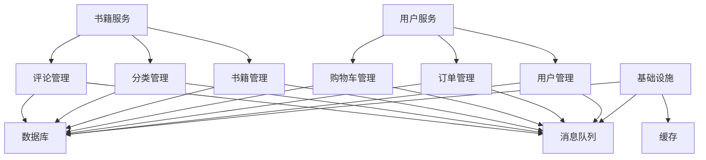

                 

## 《上承需求》

### 关键词：需求分析、需求管理、需求文档、变更管理、设计整合、测试协同

> 摘要：本文旨在深入探讨IT领域的需求管理，通过系统的分析和详细的讲解，为读者提供关于需求分析、需求文档编写、需求变更管理、需求与设计的整合以及需求与测试的协同等方面的实用知识和策略。本文将以“上承需求”为线索，逐步展开，帮助读者理解和掌握需求管理的核心要点。

## 目录大纲

1. **引言**  
    1.1 书籍主题与背景介绍  
    1.2 书籍目标读者与结构概述  
    1.3 书籍学习方法与策略

2. **需求分析基础**  
    2.1 需求分析的定义与意义  
    2.2 需求分析的过程与方法  
        2.2.1 用户访谈  
        2.2.2 竞争对手分析  
        2.2.3 数据收集与处理  
    2.3 需求分类与优先级排序  
        2.3.1 功能需求  
        2.3.2 非功能需求  
        2.3.3 需求优先级排序方法

3. **需求文档编写**  
    3.1 需求文档的作用与结构  
    3.2 需求描述方法与工具  
        3.2.1 用户故事地图  
        3.2.2 用例图  
        3.2.3 用户界面原型  
    3.3 需求评审与沟通  
        3.3.1 需求评审的目的与过程  
        3.3.2 需求沟通的技巧与策略

4. **需求变更管理**  
    4.1 需求变更的原因与影响  
    4.2 需求变更的流程与方法  
        4.2.1 变更请求的提出与审批  
        4.2.2 变更影响的评估与处理  
        4.2.3 变更实施的监控与控制

5. **需求与设计的整合**  
    5.1 需求与设计的互动关系  
    5.2 需求在系统设计中的应用  
        5.2.1 领域模型设计  
        5.2.2 系统架构设计  
        5.2.3 用户界面设计

6. **需求与测试的协同**  
    6.1 需求在测试中的作用  
    6.2 测试用例的编写与执行  
        6.2.1 功能测试用例  
        6.2.2 性能测试用例  
        6.2.3 安全测试用例  
    6.3 需求与测试的协同方法  
        6.3.1 测试计划制定  
        6.3.2 测试结果分析与反馈

7. **需求管理的最佳实践**  
    7.1 需求管理的成功关键因素  
    7.2 需求管理的工具与技术  
        7.2.1 需求跟踪工具  
        7.2.2 需求管理软件  
        7.2.3 需求文档模板  
    7.3 需求管理案例解析  
        7.3.1 成功案例  
        7.3.2 失败案例

8. **需求管理的未来趋势**  
    8.1 需求管理与敏捷开发的融合  
    8.2 需求管理与云计算、大数据、人工智能的结合  
    8.3 需求管理的创新方法与技术

## 引言

### 1.1 书籍主题与背景介绍

在当今快速发展的IT行业中，需求管理作为软件开发过程中的核心环节，其重要性日益凸显。有效的需求管理能够确保项目的顺利实施，提高产品质量，降低开发成本，提升客户满意度。然而，许多开发团队在需求管理方面仍面临诸多挑战，如需求理解不准确、变更频繁、沟通不畅等。为了解决这些问题，本书将深入探讨需求管理的各个层面，提供实用的策略和最佳实践。

### 1.2 书籍目标读者与结构概述

本书的目标读者包括软件开发人员、项目经理、产品经理以及IT经理等。无论您是初入职场的新手，还是具有多年实践经验的资深从业者，本书都将为您提供丰富的知识和宝贵的经验。

本书共分为八个章节，涵盖了需求分析的基础知识、需求文档的编写、需求变更管理、需求与设计的整合、需求与测试的协同、需求管理的最佳实践以及未来趋势等内容。每个章节都通过具体案例和实践经验，帮助读者深入理解和掌握需求管理的核心要点。

### 1.3 书籍学习方法与策略

为了最大化地利用本书的价值，建议读者采取以下学习方法和策略：

1. **系统学习**：按照章节顺序逐步阅读，确保对需求管理的各个层面有全面的了解。

2. **实践应用**：在阅读过程中，结合实际工作场景，尝试应用书中提到的策略和方法，提高实际操作能力。

3. **案例分析**：通过分析书中的成功与失败案例，总结经验教训，避免在实际工作中重蹈覆辙。

4. **讨论交流**：与同事、同行分享学习心得和经验，相互学习、共同进步。

通过以上方法，相信读者能够更好地掌握需求管理的核心要点，提高项目成功率和团队协作效率。

### 2.1 需求分析基础

#### 需求分析的定义与意义

需求分析是软件开发过程中的关键环节，旨在明确项目目标、梳理需求、理解用户需求并制定详细的解决方案。需求分析的定义可以概括为：通过对用户需求、业务需求和系统需求的深入挖掘和分析，确保项目团队能够准确理解和实现预期功能。

需求分析在软件开发中的意义主要体现在以下几个方面：

1. **明确项目目标**：需求分析有助于明确项目目标和范围，确保项目团队能够集中精力解决核心问题。

2. **提高沟通效率**：通过需求分析，项目团队成员可以更加清晰地了解项目需求和目标，减少沟通成本和误解。

3. **降低风险**：需求分析可以帮助团队提前识别潜在的问题和风险，提前制定应对措施，降低项目失败的风险。

4. **确保产品质量**：详细的需求分析有助于确保开发出的软件产品能够满足用户需求和期望，提高产品质量。

#### 需求分析的过程与方法

需求分析的过程通常包括以下几个阶段：

1. **需求获取**：通过与用户、业务专家和利益相关者的沟通，了解他们的需求和期望，收集需求信息。

2. **需求分析**：对收集到的需求信息进行整理和分析，识别需求之间的关联和优先级。

3. **需求文档编写**：将分析结果整理成需求文档，明确项目的功能需求、性能需求和非功能需求。

4. **需求评审与确认**：组织需求评审会议，与项目团队和利益相关者共同确认需求文档的准确性和完整性。

需求分析的方法包括：

1. **用户访谈**：通过与用户的面对面交流，深入了解用户的需求和痛点。

2. **竞争对手分析**：研究竞争对手的产品和解决方案，分析其优点和不足，为需求分析提供参考。

3. **数据收集与处理**：通过收集和分析相关数据，如用户行为数据、市场调研数据等，辅助需求分析。

#### 需求分类与优先级排序

在需求分析过程中，需求分类和优先级排序是两个关键步骤。以下是对功能需求、非功能需求和需求优先级排序方法的详细介绍。

##### 功能需求

功能需求是指软件系统应具备的具体功能，包括用户界面、业务逻辑和数据管理等方面。功能需求通常可以分为以下几类：

1. **核心功能**：直接实现项目目标的关键功能，如核心业务流程、用户管理、权限控制等。

2. **辅助功能**：支持核心功能的其他功能，如通知提醒、数据分析、报告生成等。

3. **可选功能**：用户可根据需要选择使用或关闭的功能，如个性化设置、扩展插件等。

##### 非功能需求

非功能需求是指软件系统应具备的属性和质量要求，如性能、安全性、可靠性、可扩展性等。常见的非功能需求包括：

1. **性能需求**：软件系统应在规定的响应时间、吞吐量和并发量等性能指标下正常运行。

2. **安全性需求**：软件系统应具备一定的安全防护能力，如数据加密、访问控制、安全审计等。

3. **可靠性需求**：软件系统应在规定的时间内保持稳定运行，避免故障和崩溃。

##### 需求优先级排序方法

需求优先级排序是确保项目团队能够按照重要性和紧急性进行工作的重要步骤。以下是一些常见的需求优先级排序方法：

1. **Kano 模型**：根据用户对需求的满意度将需求分为五个级别，如必须需求、期望需求、魅力需求等。

2. **MoSCoW 模型**：将需求按照重要性和紧急性分为四个类别，如必须（M）、重要（S）、可延迟（C）、小需求（W）。

3. **成本效益分析**：根据需求的实现成本和收益，对需求进行优先级排序。

通过以上方法，项目团队可以更加明确需求的重要性和优先级，确保项目资源的有效利用。

#### 2.2 需求文档编写

##### 需求文档的作用与结构

需求文档是需求分析的输出成果，它对整个软件开发过程起着重要的指导作用。需求文档的作用主要包括以下几个方面：

1. **明确项目需求**：需求文档详细描述了项目的功能需求、性能需求和约束条件，确保项目团队能够准确理解和实现。

2. **指导开发过程**：需求文档为开发团队提供了清晰的工作目标和任务，有助于提高开发效率和质量。

3. **沟通桥梁**：需求文档是项目团队与利益相关者之间的重要沟通工具，有助于减少误解和冲突。

需求文档的基本结构通常包括以下几个部分：

1. **封面**：包含文档名称、版本号、编写人、审核人、批准人等信息。

2. **目录**：列出文档的各个章节和子章节，方便读者快速查找。

3. **需求概述**：简要介绍项目的背景、目标和需求分析的过程。

4. **功能需求**：详细描述软件系统的功能需求，包括用户界面、业务逻辑和数据管理等方面。

5. **性能需求**：详细描述软件系统应具备的性能需求，如响应时间、吞吐量、并发量等。

6. **非功能需求**：详细描述软件系统应具备的非功能需求，如安全性、可靠性、可扩展性等。

7. **约束条件**：列出项目开发过程中需要遵守的约束条件，如技术限制、预算限制等。

8. **附录**：包含一些补充信息，如参考资料、术语表等。

##### 需求描述方法与工具

在编写需求文档时，选择合适的需求描述方法与工具非常重要。以下介绍几种常见的需求描述方法与工具：

1. **用户故事地图**：用户故事地图是一种图表工具，用于展示用户故事之间的关联和优先级。它可以帮助项目团队更好地理解用户需求，确保需求文档的全面性和一致性。

2. **用例图**：用例图是描述软件系统功能的一种图形工具，它通过展示用户与系统之间的交互过程，帮助项目团队理解系统的行为和功能。

3. **用户界面原型**：用户界面原型是描述软件系统用户界面的一种工具，它通过图形和文本的形式展示用户界面布局和交互方式，帮助项目团队更好地理解用户需求。

##### 需求评审与沟通

需求评审是确保需求文档准确性和完整性的重要步骤。以下介绍需求评审的目的、过程以及需求沟通的技巧与策略。

###### 需求评审的目的

需求评审的主要目的是：

1. **确认需求文档的准确性和完整性**：确保需求文档能够准确地反映用户需求和项目目标。

2. **发现潜在的问题和风险**：通过评审，可以提前发现需求文档中可能存在的问题和风险，并制定相应的解决方案。

3. **提高团队协作效率**：通过需求评审，项目团队成员可以更好地了解项目需求和目标，提高协作效率。

###### 需求评审的过程

需求评审的过程通常包括以下几个步骤：

1. **准备评审材料**：编写人根据需求文档编写评审材料，包括需求文档本身、相关数据和支持文档等。

2. **组织评审会议**：评审会议通常由项目经理或需求分析师主持，邀请项目团队成员和利益相关者参加。

3. **评审内容**：评审会议主要围绕需求文档的内容展开，包括需求描述、优先级、性能需求、非功能需求等。

4. **记录问题与建议**：在评审过程中，参会人员可以提出问题和建议，评审记录员负责记录这些问题和建议。

5. **制定解决方案**：根据评审结果，项目团队制定解决方案，对需求文档进行修改和完善。

6. **跟进与确认**：项目团队对修改后的需求文档进行跟进，确保所有问题和建议得到妥善处理。

###### 需求沟通的技巧与策略

有效的需求沟通是确保需求文档准确性和一致性的关键。以下介绍一些需求沟通的技巧与策略：

1. **明确沟通目标**：在沟通前，明确沟通的目标和重点，确保沟通内容具有针对性和有效性。

2. **准备充分**：在沟通前，准备好相关的需求文档、数据和支持材料，以便在沟通过程中进行展示和说明。

3. **主动沟通**：主动与用户、业务专家和利益相关者进行沟通，了解他们的需求和期望，及时反馈问题和建议。

4. **倾听与理解**：在沟通过程中，认真倾听对方的意见和需求，确保准确理解对方的意图。

5. **积极反馈**：在沟通过程中，及时给予积极的反馈，对提出的建议和问题进行回应和讨论。

6. **建立信任**：通过有效的沟通，建立项目团队与利益相关者之间的信任关系，提高项目协作效率。

### 3.2.1 用户故事地图

用户故事地图是一种直观、简洁的需求描述工具，它通过将用户故事组织成地图的形式，帮助项目团队更好地理解用户需求。用户故事地图的基本结构包括以下几个部分：

1. **核心用户故事**：核心用户故事是描述用户核心需求的关键故事，通常位于地图的中央。

2. **用户角色**：用户角色是使用核心用户故事的用户群体，位于核心用户故事周围。

3. **用户故事**：用户故事是描述用户具体需求和行为的故事，位于用户角色周围。

4. **依赖关系**：用户故事之间的依赖关系，表示用户故事之间的执行顺序和关联。

用户故事地图的优点包括：

1. **易于理解**：用户故事地图通过图形化的方式展示用户需求，使得需求文档更加直观、易懂。

2. **提高协作效率**：用户故事地图可以帮助项目团队更好地理解用户需求，提高协作效率。

3. **便于调整**：用户故事地图可以灵活调整，以适应需求的变化和迭代。

#### 用户故事地图的步骤

创建用户故事地图的步骤如下：

1. **确定核心用户故事**：与用户和业务专家沟通，确定核心用户故事，这些故事通常描述用户的核心需求。

2. **识别用户角色**：根据核心用户故事，确定使用这些故事的用户角色，这些角色通常包括主要用户、次要用户等。

3. **编写用户故事**：根据核心用户故事和用户角色，编写详细的用户故事，描述用户的具体需求和行为。

4. **绘制用户故事地图**：使用图形工具，将核心用户故事、用户角色和用户故事组织成地图的形式。

5. **评审与调整**：组织用户故事地图的评审会议，与项目团队成员和利益相关者共同评审和调整地图内容。

#### 用户故事地图的案例

以下是一个用户故事地图的示例：

```mermaid
userStoryMap(
  title="用户故事地图：在线购物平台",
  subtitle="用户与系统交互过程",
  width: 800,
  height: 600,
  backgroundColor: white,
  nodeWidth: 150,
  nodeHeight: 50,
  nodeMargin: 20,
  fontName: "Arial",
  fontColor: black,
  nodeColor: lightblue,
  strokeColor: black,
  edgeColor: black,
  edgeStyle: dashed
)

node [shape=rect, labelJustification=center, labelAlignment=center]

coreUS["登录/注册"]
userRole["普通用户"]
userRole2["管理员"]

edge [arrowHead=triangle]

coreUS -> userRole
coreUS -> userRole2
userRole -> ["浏览商品"]
userRole -> ["添加商品到购物车"]
userRole -> ["结算"]
userRole2 -> ["管理商品"]
userRole2 -> ["管理用户"]
userRole2 -> ["订单管理"]

textInline ["用户故事地图：在线购物平台", "center"]

text([0, 10], "核心用户故事：登录/注册")
text([0, 25], "用户角色：普通用户、管理员")
text([0, 40], "用户故事：浏览商品、添加商品到购物车、结算、管理商品、管理用户、订单管理")
```

在上面的示例中，我们创建了一个用户故事地图，描述了在线购物平台的核心用户故事、用户角色和用户故事。通过这个地图，项目团队可以清晰地了解用户与系统的交互过程，为后续的开发和测试提供参考。

#### 用户故事地图的优点与局限

**优点**：

1. **直观性**：用户故事地图通过图形化的方式展示用户需求，使得需求文档更加直观、易懂。

2. **协作性**：用户故事地图可以帮助项目团队更好地理解用户需求，提高协作效率。

3. **灵活性**：用户故事地图可以灵活调整，以适应需求的变化和迭代。

**局限**：

1. **复杂性**：对于复杂的系统需求，用户故事地图可能难以全面展示，需要与其他需求描述工具结合使用。

2. **时间成本**：创建用户故事地图需要一定的时间和专业技能，对于小型项目可能不太适用。

### 3.2.2 用例图

用例图是一种用于描述软件系统功能和行为的需求描述工具。它通过展示用户与系统之间的交互过程，帮助项目团队理解系统的功能和用户需求。用例图的基本组成部分包括用例（Use Case）、参与者（Actor）和关系（Relationship）。

**用例**：用例是描述系统功能的具体事件或过程，它代表用户与系统之间的交互。一个用例通常包含以下元素：

- 用例名称：简要描述用例的功能。
- 主事件流：描述用例的主要步骤和执行顺序。
- 辅助事件流：描述用例的次要步骤和异常情况。

**参与者**：参与者是使用系统功能的外部实体，可以是用户、系统或其他软件。参与者通常以矩形形状表示，并在旁边注明参与者名称。

**关系**：用例图中的关系包括包含关系（Include）、扩展关系（Extend）和泛化关系（Generalization）。这些关系描述了用例之间的关联和层次结构。

**用例图的绘制步骤**：

1. **确定参与者**：根据需求分析，确定与系统交互的参与者，如用户、管理员等。

2. **定义用例**：根据需求分析，定义系统的功能用例，并描述每个用例的主事件流和辅助事件流。

3. **绘制用例图**：使用图形工具，将参与者、用例和关系组织成用例图。

4. **评审与调整**：组织用例图的评审会议，与项目团队成员和利益相关者共同评审和调整用例图内容。

#### 用例图的案例

以下是一个用例图的示例：

```mermaid
usecaseDiagram
  "在线购物平台" <<System>>
  User >> "在线购物平台"
  
  User -> "登录": 登录
  User -> "浏览商品": 浏览商品
  User -> "添加商品到购物车": 添加商品
  User -> "结算": 结算
  User -> "查看订单": 查看订单
  
  "管理员" >> "在线购物平台"
  "管理员" -> "管理商品": 管理商品
  "管理员" -> "管理用户": 管理用户
  "管理员" -> "订单管理": 订单管理
  
  include "用户管理"
  extend "结算"
```

在上面的示例中，我们创建了一个用例图，描述了在线购物平台的主要功能用例和参与者。通过这个用例图，项目团队可以清晰地了解系统的功能和用户需求，为后续的开发和测试提供参考。

#### 用例图的优点与局限

**优点**：

1. **可视化**：用例图通过图形化的方式展示系统功能和用户需求，使得需求文档更加直观、易懂。

2. **层次性**：用例图可以清晰地展示用例之间的层次关系，帮助项目团队理解系统的功能和模块。

3. **适应性**：用例图可以灵活调整，以适应需求的变化和迭代。

**局限**：

1. **复杂性**：对于复杂的系统需求，用例图可能难以全面展示，需要与其他需求描述工具结合使用。

2. **时间成本**：创建用例图需要一定的时间和专业技能，对于小型项目可能不太适用。

### 3.2.3 用户界面原型

用户界面原型是一种用于展示软件系统用户界面设计的需求描述工具。它通过图形化的方式展示用户界面的布局、交互方式和用户体验，帮助项目团队理解用户需求和使用场景。用户界面原型通常包括以下组成部分：

- **界面布局**：描述用户界面的整体布局，包括导航栏、菜单、按钮、文本框等元素。

- **交互设计**：描述用户与系统之间的交互方式，包括按钮点击、滑动、下拉等动作。

- **用户体验**：描述用户在使用系统时的感受和体验，包括界面美观度、操作便捷性、响应速度等。

**用户界面原型设计工具**：

1. **Sketch**：一款流行的用户界面设计工具，支持矢量绘图和丰富的设计资源。

2. **Figma**：一款在线协作的用户界面设计工具，支持实时协作和交互式原型设计。

3. **Axure RP**：一款专业的用户界面原型设计工具，支持丰富的交互效果和原型演示。

**用户界面原型设计的步骤**：

1. **需求分析**：与用户和业务专家沟通，了解用户需求和期望，确定界面设计和交互方式。

2. **界面布局设计**：根据需求分析结果，设计用户界面的整体布局，确保界面简洁、美观、易于使用。

3. **交互设计**：根据用户需求和使用场景，设计用户与系统之间的交互方式，确保交互顺畅、直观。

4. **原型制作**：使用用户界面原型设计工具，将界面布局和交互设计制作成原型。

5. **评审与调整**：组织原型评审会议，与项目团队成员和利益相关者共同评审和调整原型内容。

**用户界面原型设计的案例**：

以下是一个用户界面原型的示例：

```mermaid
userInterfacePrototype(
  title="在线购物平台首页",
  width: 800,
  height: 600,
  backgroundColor: white,
  nodeWidth: 150,
  nodeHeight: 50,
  nodeMargin: 20,
  fontName: "Arial",
  fontColor: black,
  nodeColor: lightblue,
  strokeColor: black,
  edgeColor: black,
  edgeStyle: dashed
)

node [shape=rect, labelJustification=center, labelAlignment=center]

header["导航栏"]
content["商品展示区域"]
footer["底部导航栏"]

header -> content
content -> footer

textInline ["在线购物平台首页", "center"]

text([0, 10], "导航栏：首页、分类、购物车、我的")
text([0, 40], "商品展示区域：商品图片、名称、价格、按钮")
text([0, 70], "底部导航栏：首页、分类、购物车、我的")
```

在上面的示例中，我们创建了一个在线购物平台首页的用户界面原型，展示了导航栏、商品展示区域和底部导航栏的布局。通过这个原型，项目团队可以清晰地了解用户界面的设计，为后续的开发和测试提供参考。

#### 用户界面原型的优点与局限

**优点**：

1. **直观性**：用户界面原型通过图形化的方式展示用户界面设计，使得需求文档更加直观、易懂。

2. **交互性**：用户界面原型可以模拟用户与系统之间的交互，帮助项目团队更好地理解用户需求和用户体验。

3. **适应性**：用户界面原型可以灵活调整，以适应需求的变化和迭代。

**局限**：

1. **复杂性**：对于复杂的用户界面设计，原型设计可能需要较多时间和资源。

2. **技术依赖**：用户界面原型设计工具可能需要一定的技术知识和使用技巧。

### 3.3.1 需求评审的目的与过程

**需求评审的目的**

需求评审是确保需求文档准确性和完整性的关键步骤，其主要目的包括：

1. **确认需求文档的准确性和完整性**：通过评审，确保需求文档能够准确地反映用户需求和项目目标。

2. **发现潜在的问题和风险**：通过评审，可以提前发现需求文档中可能存在的问题和风险，并制定相应的解决方案。

3. **提高团队协作效率**：通过评审，项目团队成员可以更好地了解项目需求和目标，提高协作效率。

**需求评审的过程**

需求评审的过程通常包括以下几个阶段：

1. **准备评审材料**：编写人根据需求文档编写评审材料，包括需求文档本身、相关数据和支持文档等。

2. **组织评审会议**：评审会议通常由项目经理或需求分析师主持，邀请项目团队成员和利益相关者参加。

3. **评审内容**：评审会议主要围绕需求文档的内容展开，包括需求描述、优先级、性能需求、非功能需求等。

4. **记录问题与建议**：在评审过程中，参会人员可以提出问题和建议，评审记录员负责记录这些问题和建议。

5. **制定解决方案**：根据评审结果，项目团队制定解决方案，对需求文档进行修改和完善。

6. **跟进与确认**：项目团队对修改后的需求文档进行跟进，确保所有问题和建议得到妥善处理。

#### 需求评审的技巧与策略

为了确保需求评审的有效性，以下是一些实用的技巧和策略：

1. **明确评审目标和议程**：在评审会议前，明确评审的目标和议程，确保评审内容有针对性和效率。

2. **提前准备评审材料**：编写人应在评审会议前准备充分的需求文档和相关材料，以便评审过程中能够详细说明。

3. **鼓励积极参与**：鼓励项目团队成员和利益相关者积极参与评审，提出问题和建议，共同完善需求文档。

4. **保持客观公正**：在评审过程中，保持客观公正的态度，避免主观偏见，确保评审结果的准确性。

5. **及时反馈与沟通**：在评审过程中，及时给予反馈和沟通，确保问题和建议得到及时处理和落实。

6. **制定清晰的行动计划**：根据评审结果，制定清晰的行动计划，明确责任人和完成时间，确保需求文档的修改和完善得到有效执行。

### 3.3.2 需求沟通的技巧与策略

**需求沟通的技巧**

1. **明确沟通目标**：在沟通前，明确沟通的目标和重点，确保沟通内容具有针对性和有效性。

2. **准备充分**：在沟通前，准备好相关的需求文档、数据和支持材料，以便在沟通过程中进行展示和说明。

3. **主动沟通**：主动与用户、业务专家和利益相关者进行沟通，了解他们的需求和期望，及时反馈问题和建议。

4. **倾听与理解**：在沟通过程中，认真倾听对方的意见和需求，确保准确理解对方的意图。

5. **积极反馈**：在沟通过程中，及时给予积极的反馈，对提出的建议和问题进行回应和讨论。

6. **建立信任**：通过有效的沟通，建立项目团队与利益相关者之间的信任关系，提高项目协作效率。

**需求沟通的策略**

1. **定期会议**：定期组织需求评审会议、项目进度会议等，确保项目团队成员和利益相关者保持沟通和同步。

2. **多渠道沟通**：利用多种沟通渠道，如电子邮件、电话、视频会议等，确保沟通的及时性和有效性。

3. **明确责任**：明确项目团队成员和利益相关者的职责和责任，确保沟通的有序进行。

4. **文档记录**：记录重要的沟通内容和决策，确保沟通的内容和结果得到明确记录和跟踪。

5. **培训与支持**：为项目团队成员和利益相关者提供培训和支持，提高他们的沟通能力和技能。

### 4.1 需求变更的原因与影响

**需求变更的原因**

需求变更是软件开发过程中常见的问题，原因主要包括以下几个方面：

1. **需求理解不准确**：在需求获取和分析过程中，由于沟通不畅或理解偏差，可能导致需求文档不准确。

2. **用户需求变化**：随着项目的推进，用户的需求可能会发生变化，如新的功能需求、改进的界面设计等。

3. **技术变化**：技术环境的变化，如新的编程语言、框架或技术的出现，可能导致需求变更。

4. **市场变化**：市场环境的变化，如竞争对手的新产品发布、客户需求的调整等，可能导致需求变更。

**需求变更的影响**

需求变更对软件开发过程和项目进度会产生一定的影响，主要表现在以下几个方面：

1. **项目延期**：需求变更可能导致项目计划和时间安排的调整，从而影响项目的进度。

2. **成本增加**：需求变更可能需要额外的开发资源，如人力、时间和资金等，从而导致成本增加。

3. **质量风险**：需求变更可能对现有的系统设计、编码和测试造成影响，增加质量风险。

4. **团队协作**：需求变更可能影响项目团队的合作和沟通，导致团队成员之间的矛盾和冲突。

### 4.2 需求变更的流程与方法

**需求变更的流程**

需求变更的流程通常包括以下几个步骤：

1. **变更请求的提出**：当发现需求变更时，项目团队成员或利益相关者可以提出变更请求，说明变更的原因和内容。

2. **变更评估**：项目经理或需求分析师对变更请求进行评估，分析变更对项目进度、成本和质量的影响。

3. **变更审批**：将变更评估结果提交给项目团队或相关利益相关者进行审批，确定是否采纳变更请求。

4. **变更实施**：根据审批结果，对项目计划和资源进行相应调整，实施变更请求。

5. **变更跟踪与监控**：对变更实施过程进行跟踪和监控，确保变更按照计划进行，并及时解决可能出现的问题。

**需求变更的方法**

在处理需求变更时，可以采用以下几种方法：

1. **MoSCoW 方法**：根据需求的紧急性和重要性，将需求分为必须（M）、重要（S）、可延迟（C）和小（W）四类，优先处理必须和重要类别的需求变更。

2. **成本效益分析**：对需求变更的成本和收益进行评估，优先考虑成本效益较高的变更。

3. **风险评估**：对需求变更可能带来的风险进行评估，制定相应的风险应对措施。

4. **变更管理计划**：制定详细的变更管理计划，明确变更流程、责任人和时间安排。

### 4.2.1 变更请求的提出与审批

**变更请求的提出**

变更请求的提出是需求变更管理的第一步，通常由以下人员或团队发起：

1. **项目团队成员**：包括开发人员、测试人员、项目经理等，他们在项目实施过程中发现需求变更的必要性。

2. **利益相关者**：包括客户、用户、产品经理、业务专家等，他们在项目需求和目标的变化中提出变更请求。

3. **用户反馈**：用户在使用产品或系统时，提出新的需求或改进建议，导致需求变更。

变更请求的提出通常包括以下内容：

1. **变更描述**：详细描述变更的原因、内容和预期效果。

2. **变更影响**：分析变更对项目进度、成本、质量等方面的影响。

3. **变更优先级**：根据变更的紧急性和重要性，确定变更的优先级。

4. **变更方案**：提出变更的具体方案，包括实施时间、资源需求和风险评估等。

**变更审批**

变更审批是确保变更请求得到合理评估和决策的重要环节，通常包括以下几个步骤：

1. **评估变更请求**：项目经理或需求分析师对变更请求进行评估，分析变更对项目的影响和可行性。

2. **召开评审会议**：组织项目团队和相关利益相关者召开评审会议，讨论变更请求的优缺点，并提出修改意见。

3. **审批变更请求**：根据评审结果，项目经理或相关负责人对变更请求进行审批，确定是否采纳变更请求。

4. **记录审批结果**：将审批结果记录在变更管理文档中，明确变更请求的采纳情况、实施计划和责任人。

### 4.2.2 变更影响的评估与处理

**变更影响的评估**

需求变更对项目的影响是多方面的，包括进度、成本、质量、资源等方面。为了确保变更能够得到有效管理和控制，需要对变更的影响进行评估。以下是一些常见的评估方法：

1. **工作量评估**：分析变更请求需要额外的工作量，包括开发、测试、文档编写等。

2. **进度评估**：评估变更对项目进度的影响，包括延期、延期时间等。

3. **成本评估**：评估变更对项目成本的影响，包括额外的人力成本、设备成本等。

4. **质量评估**：评估变更对项目质量的影响，包括缺陷率、用户体验等。

5. **资源评估**：评估变更对项目资源的影响，包括人力、设备、时间等。

**变更的处理**

在评估变更影响后，需要根据评估结果制定相应的处理方案，确保变更能够得到有效实施和管理。以下是一些常见的处理方法：

1. **采纳变更**：如果变更对项目的积极影响大于负面影响，可以采纳变更，并根据评估结果调整项目计划和资源。

2. **部分采纳变更**：如果变更对项目的积极影响和负面影响相当，可以部分采纳变更，优先处理关键功能或重要需求。

3. **拒绝变更**：如果变更对项目的负面影响大于积极影响，或者变更无法在项目预算和时间范围内完成，可以拒绝变更，并与利益相关者进行沟通和解释。

4. **延迟变更**：如果变更可以在后续版本或阶段进行，可以延迟变更，确保当前版本或阶段的项目进度和质量。

### 4.2.3 变更实施的监控与控制

**变更实施的监控**

在变更实施过程中，需要对变更的执行情况进行监控，确保变更按照计划进行。以下是一些常见的监控方法：

1. **任务跟踪**：使用项目管理工具或软件，对变更任务的执行情况进行跟踪，确保每个任务按时完成。

2. **进度报告**：定期向项目团队和相关利益相关者报告变更实施进度，确保项目进展透明和可追溯。

3. **质量检查**：对变更后的代码、测试结果等进行质量检查，确保变更没有引入新的缺陷或问题。

4. **风险监控**：对变更过程中可能出现的新风险进行监控，制定相应的应对措施，确保项目风险得到有效控制。

**变更控制**

变更控制是确保变更实施过程中不偏离项目目标和计划的重要措施。以下是一些常见的变更控制方法：

1. **变更日志**：记录所有变更请求的详细信息，包括变更请求编号、提出时间、审批结果、实施进度等。

2. **变更审批流程**：明确变更审批流程和责任分工，确保变更请求得到及时审批和决策。

3. **变更影响评估**：对每个变更请求进行详细评估，分析变更对项目进度、成本、质量等方面的影响。

4. **变更文档管理**：制定变更管理文档，包括变更请求表、评估报告、审批记录等，确保变更过程的可追溯性。

5. **变更回顾**：在变更实施完成后，组织变更回顾会议，总结变更实施的经验和教训，为后续项目提供参考。

### 5.1 需求与设计的互动关系

需求与设计是软件开发过程中紧密关联的两个环节。需求为设计提供了目标和指导，而设计则为需求的实现提供了技术方案和解决方案。需求与设计的互动关系主要体现在以下几个方面：

**需求驱动设计**

需求驱动设计是一种以需求为核心的设计方法，强调在设计过程中始终以需求为导向。这种方法的主要优点包括：

1. **确保设计符合需求**：通过需求驱动设计，可以确保设计结果能够准确地满足用户需求和项目目标。

2. **减少设计偏差**：在需求明确的情况下，设计团队可以更加专注于实现需求，减少设计偏差和误解。

3. **提高设计效率**：需求驱动设计有助于明确设计目标和方向，提高设计团队的工作效率。

**设计反馈需求**

设计反馈需求是指在设计过程中，对需求进行不断的调整和优化，以适应设计方案的实际情况。这种方法的主要优点包括：

1. **优化需求**：通过设计反馈需求，可以发现需求中的潜在问题和不足，对需求进行优化和改进。

2. **提高设计质量**：设计反馈需求有助于提高设计的质量和可实施性，减少设计风险。

3. **促进需求与设计的协同**：设计反馈需求有助于需求与设计团队之间的沟通和协作，促进双方共同进步。

### 5.2 需求在系统设计中的应用

在系统设计中，需求起着至关重要的指导作用，确保系统设计能够满足用户需求和项目目标。以下介绍需求在系统设计中的应用，包括领域模型设计、系统架构设计和用户界面设计等方面。

#### 领域模型设计

领域模型设计是系统设计的重要环节，旨在明确系统的主要功能模块和业务逻辑。在领域模型设计中，需求起着以下作用：

1. **定义实体和关系**：需求为领域模型提供了实体和关系的定义，明确系统的主要功能和业务逻辑。

2. **确定属性和行为**：需求为领域模型中的实体和关系确定了属性和行为，确保领域模型能够准确反映用户需求。

3. **指导设计决策**：需求为领域模型设计提供了明确的指导，帮助设计团队做出合理的设计决策。

#### 系统架构设计

系统架构设计是确定系统整体结构和组件关系的重要环节。在系统架构设计中，需求起着以下作用：

1. **确定系统边界**：需求为系统架构设计提供了系统边界的定义，明确系统应包含的功能和组件。

2. **确定系统组件和接口**：需求为系统架构设计提供了组件和接口的划分和定义，确保系统架构能够满足用户需求。

3. **指导架构决策**：需求为系统架构设计提供了明确的指导，帮助设计团队做出合理的架构决策。

#### 用户界面设计

用户界面设计是确保系统易用性和用户体验的重要环节。在用户界面设计中，需求起着以下作用：

1. **确定界面布局和交互**：需求为用户界面设计提供了界面布局和交互方式的定义，确保界面设计能够满足用户需求和操作习惯。

2. **优化用户体验**：需求为用户界面设计提供了用户体验的优化方向，确保界面设计能够提高用户满意度。

3. **指导界面设计决策**：需求为用户界面设计提供了明确的指导，帮助设计团队做出合理的界面设计决策。

### 5.2.1 领域模型设计

领域模型设计是系统设计过程中非常重要的一环，它通过抽象和建模，将需求转化为具体的系统功能模块和业务逻辑。以下将详细介绍领域模型设计的过程、步骤和工具。

#### 领域模型设计的过程

领域模型设计的过程可以分为以下几个步骤：

1. **需求分析**：在领域模型设计之前，需要对需求进行深入的分析和理解。这一步包括收集需求、整理需求、分析需求之间的关系等。

2. **实体识别**：根据需求分析的结果，识别出系统中的主要实体，如用户、商品、订单等。

3. **关系定义**：确定实体之间的关系，如一对一、一对多、多对多等。关系可以是继承、关联、聚合等。

4. **属性和行为定义**：为每个实体定义属性和行为，属性用于描述实体的特征，行为用于描述实体的行为。

5. **模型验证**：验证领域模型是否满足需求，是否一致，是否遗漏。

6. **模型优化**：根据验证结果，对领域模型进行优化，确保模型更加简洁、有效。

#### 领域模型设计的步骤

领域模型设计的步骤如下：

1. **需求收集**：通过与用户、业务专家和项目经理的沟通，收集系统的需求。

2. **需求整理**：将收集到的需求进行整理和分类，识别出主要的实体和关系。

3. **实体识别**：根据需求，识别出系统中的主要实体。

4. **关系定义**：定义实体之间的关系，确保关系符合业务逻辑。

5. **属性和行为定义**：为每个实体定义属性和行为。

6. **模型验证**：验证领域模型是否满足需求，是否一致，是否遗漏。

7. **模型优化**：根据验证结果，对领域模型进行优化。

#### 领域模型设计的工具

在领域模型设计中，可以使用以下工具：

1. **UML类图**：UML类图是表示领域模型最常用的工具之一，它通过类、属性、方法和关系等元素，清晰地表示系统中的实体和关系。

2. **ER图**：ER图（实体-关系图）是另一种常用的领域模型设计工具，它通过实体、属性和关系等元素，表示系统中的实体和关系。

3. **实体关系图（ERD）**：实体关系图（ERD）是数据库设计中常用的工具，它通过实体、属性和关系等元素，表示系统中的实体和关系。

#### 领域模型设计的案例

以下是一个简单的在线书店的领域模型设计案例：

```mermaid
erDiagram
  User ||--o{ Order : "用户下单"
  User ||--o{ Cart : "用户购物车"
  Book ||--o{ Order : "订单包含书籍"
  Book ||--o{ Comment : "书籍包含评论"
  Category ||--o{ Book : "分类包含书籍"
  Category ||--o{ Comment : "评论包含分类"
  
  User {
    id : 用户ID
    name : 用户名
    password : 密码
  }
  
  Book {
    id : 书籍ID
    name : 书籍名称
    author : 作者
    price : 价格
    stock : 库存
  }
  
  Order {
    id : 订单ID
    user_id : 用户ID
    order_date : 订单日期
    status : 订单状态
  }
  
  Cart {
    id : 购物车ID
    user_id : 用户ID
    items : 购物车项
  }
  
  Comment {
    id : 评论ID
    user_id : 用户ID
    book_id : 书籍ID
    content : 内容
    rating : 评分
    create_time : 创建时间
  }
  
  Category {
    id : 分类ID
    name : 分类名称
  }
```

在上面的案例中，我们使用Mermaid语法绘制了一个简单的在线书店的实体关系图，包括了用户、书籍、订单、购物车、评论和分类等实体，以及它们之间的关系。

### 5.2.2 系统架构设计

系统架构设计是软件开发过程中至关重要的一环，它决定了系统的性能、可扩展性、可维护性和可靠性。以下将详细介绍系统架构设计的过程、步骤和工具。

#### 系统架构设计的过程

系统架构设计的过程可以分为以下几个步骤：

1. **需求分析**：在系统架构设计之前，需要对需求进行深入的分析和理解。这一步包括收集需求、整理需求、分析需求之间的关系等。

2. **架构策略**：根据需求分析的结果，制定系统的架构策略，包括系统的目标、原则、约束等。

3. **架构风格**：选择合适的系统架构风格，如分层架构、微服务架构、事件驱动架构等。

4. **架构设计**：根据架构策略和架构风格，进行系统架构设计，包括确定系统组件、接口、数据流等。

5. **架构评估**：对系统架构进行评估，包括性能评估、可扩展性评估、可靠性评估等。

6. **架构优化**：根据评估结果，对系统架构进行优化，确保系统架构能够满足需求。

#### 系统架构设计的步骤

系统架构设计的步骤如下：

1. **需求分析**：收集系统的需求，包括功能需求、性能需求、安全需求等。

2. **架构策略**：根据需求，制定系统的架构策略，包括系统的目标、原则、约束等。

3. **架构风格**：选择合适的系统架构风格，如分层架构、微服务架构、事件驱动架构等。

4. **组件设计**：根据架构风格和需求，设计系统的组件，包括服务、数据存储、中间件等。

5. **接口设计**：设计组件之间的接口，包括API接口、消息队列、事件总线等。

6. **数据流设计**：设计系统中的数据流，包括数据输入、处理、输出等。

7. **性能评估**：对系统架构进行性能评估，包括响应时间、吞吐量、并发量等。

8. **可靠性评估**：对系统架构进行可靠性评估，包括故障恢复、容错能力等。

9. **架构优化**：根据评估结果，对系统架构进行优化，确保系统架构能够满足需求。

#### 系统架构设计的工具

在系统架构设计中，可以使用以下工具：

1. **UML图**：UML图是表示系统架构最常用的工具之一，它通过类、组件、接口、关系等元素，清晰地表示系统架构。

2. **架构图**：架构图是一种用于表示系统架构的图形工具，它通过组件、接口、数据流等元素，表示系统的整体架构。

3. **架构设计工具**：如Architect、Enterprise Architect等，这些工具提供了丰富的架构设计功能和模板，帮助设计团队高效地进行系统架构设计。

#### 系统架构设计的案例

以下是一个简单的在线书店的系统架构设计案例：



在上面的案例中，我们使用Mermaid语法绘制了一个简单的在线书店的系统架构图，包括了用户服务、书籍服务、基础设施等组件，以及它们之间的接口和数据流。

### 5.2.3 用户界面设计

用户界面设计是系统设计过程中至关重要的一环，它决定了用户的使用体验和满意度。以下将详细介绍用户界面设计的过程、步骤和工具。

#### 用户界面设计的过程

用户界面设计的过程可以分为以下几个步骤：

1. **需求分析**：在用户界面设计之前，需要对用户需求进行深入的分析和理解。这一步包括收集用户需求、分析用户行为、理解用户偏好等。

2. **用户界面策略**：根据需求分析的结果，制定用户界面策略，包括界面风格、交互方式、布局等。

3. **原型设计**：根据用户界面策略，设计用户界面原型，包括页面布局、交互元素、导航结构等。

4. **用户反馈**：将用户界面原型展示给用户，收集用户反馈，对原型进行迭代和优化。

5. **界面设计**：根据用户反馈，进行界面设计，包括颜色、字体、图标等元素的设计。

6. **界面评估**：对界面设计进行评估，包括可用性评估、用户体验评估等。

7. **界面优化**：根据评估结果，对界面设计进行优化，确保界面设计能够满足用户需求。

#### 用户界面设计的步骤

用户界面设计的步骤如下：

1. **需求分析**：收集用户需求，分析用户行为，理解用户偏好。

2. **用户界面策略**：根据需求分析结果，制定用户界面策略。

3. **原型设计**：设计用户界面原型，包括页面布局、交互元素、导航结构等。

4. **用户反馈**：展示用户界面原型，收集用户反馈。

5. **界面设计**：进行界面设计，包括颜色、字体、图标等元素的设计。

6. **界面评估**：对界面设计进行评估，包括可用性评估、用户体验评估等。

7. **界面优化**：根据评估结果，对界面设计进行优化。

#### 用户界面设计的工具

在用户界面设计中，可以使用以下工具：

1. **Sketch**：Sketch是一款流行的用户界面设计工具，它提供了丰富的设计元素和模板，适用于网页、移动应用和桌面应用的设计。

2. **Figma**：Figma是一款在线协作的用户界面设计工具，它支持实时协作和原型设计，适用于团队合作。

3. **Adobe XD**：Adobe XD是一款设计、原型和协作工具，适用于网页、移动应用和桌面应用的设计。

4. **Axure RP**：Axure RP是一款专业的用户界面设计工具，它提供了丰富的交互元素和原型设计功能。

#### 用户界面设计的案例

以下是一个简单的在线书店的用户界面设计案例：

```mermaid
interface "在线书店首页"
  Text "欢迎来到在线书店！"
  Button "登录" url="/login"
  Button "注册" url="/register"
  Button "购物车" url="/cart"
  Button "我的账户" url="/account"
  
  Text "热门书籍"
  Image "热门书籍图片" url="/books"
  
  Text "分类导航"
  List [
    "编程",
    "小说",
    "历史",
    "科技"
  ]
  
  Text "最新评论"
  List [
    "《编程之美》是一本好书，推荐阅读。",
    "《百年孤独》情节曲折，引人入胜。",
    "《历史那些事儿》生动有趣，值得一读。",
    "《科技前沿》深入浅出，值得收藏。"
  ]
```

在上面的案例中，我们使用Mermaid语法绘制了一个简单的在线书店的首页用户界面原型，包括了欢迎语、登录、注册、购物车、我的账户等导航元素，以及热门书籍、分类导航和最新评论等内容。

### 6.1 需求在测试中的作用

需求在软件测试中起着至关重要的作用，它为测试提供了明确的目标和依据。以下将详细介绍需求在测试中的作用，包括测试计划的制定、测试用例的编写和测试结果的分析等方面。

#### 测试计划

测试计划是测试活动的总体指导，它依据需求文档制定，确保测试活动能够全面覆盖需求。测试计划的主要作用包括：

1. **明确测试目标**：测试计划根据需求文档明确测试目标，确保测试活动能够针对需求进行。

2. **制定测试策略**：测试计划根据需求文档和项目特点，制定合适的测试策略，如功能测试、性能测试、安全测试等。

3. **分配测试资源**：测试计划根据需求文档和测试策略，合理分配测试资源，包括人员、时间和设备等。

4. **监控测试进度**：测试计划提供测试进度监控的依据，确保测试活动按时、按质完成。

#### 测试用例

测试用例是测试计划的具体实现，它依据需求文档编写，描述了如何对软件系统进行测试。以下是一个测试用例的例子：

**用例名称**：登录功能测试

**前置条件**：用户已进入登录页面

**测试步骤**：

1. 打开登录页面  
2. 输入正确的用户名和密码  
3. 点击登录按钮

**期望结果**：系统显示登录成功，进入用户主界面

**实际结果**：实际结果记录登录成功或失败情况

**测试结论**：根据实际结果判断登录功能是否符合预期

#### 测试结果分析

测试结果分析是测试过程中的关键环节，它依据测试用例和测试结果，对软件系统的质量进行评估。以下是一些常见的测试结果分析方法：

1. **缺陷分析**：对测试中发现的缺陷进行分类、统计和分析，找出缺陷产生的原因和趋势。

2. **覆盖率分析**：对测试用例的覆盖率进行分析，确保测试用例能够全面覆盖需求。

3. **性能分析**：对软件系统的性能进行测试和分析，确保系统在规定条件下能够稳定运行。

4. **风险评估**：根据测试结果，对软件系统的风险进行评估，制定相应的风险应对措施。

### 6.2.1 功能测试用例

功能测试用例是测试过程中最常见的一种测试用例，它主要针对软件系统的功能进行验证。以下将详细介绍功能测试用例的编写步骤、方法和注意事项。

#### 功能测试用例的编写步骤

1. **需求分析**：仔细阅读需求文档，理解需求，明确测试目标。

2. **确定测试范围**：根据需求文档，确定需要测试的功能模块和功能点。

3. **编写测试用例**：根据测试目标和测试范围，编写功能测试用例。每个测试用例应包括以下内容：

   - **用例编号**：为每个测试用例分配一个唯一的编号，便于管理。

   - **用例名称**：简要描述测试用例的功能。

   - **前置条件**：描述测试用例执行前的准备工作。

   - **测试步骤**：详细描述测试用例的执行步骤。

   - **期望结果**：描述在正常情况下，测试用例执行后预期的结果。

   - **实际结果**：记录测试用例执行后的实际结果。

   - **测试结论**：根据实际结果，判断测试用例是否通过。

4. **评审测试用例**：组织测试团队对编写的测试用例进行评审，确保测试用例的完整性和有效性。

5. **执行测试用例**：根据测试计划，执行测试用例，记录测试结果。

6. **整理测试报告**：将测试结果整理成测试报告，包括测试进度、缺陷统计、风险评估等内容。

#### 功能测试用例的方法

编写功能测试用例时，可以采用以下方法：

1. **等价类划分法**：将输入条件划分为等价类，对每个等价类编写一个测试用例。

2. **边界值分析法**：对输入条件的边界值进行测试，确保系统在边界情况下能够正常工作。

3. **错误推测法**：根据对系统功能的理解和推测，编写测试用例，验证系统可能出现的错误。

4. **场景法**：根据用户使用场景，编写测试用例，模拟用户操作，验证系统功能。

#### 功能测试用例的注意事项

编写功能测试用例时，应注意以下几点：

1. **确保测试用例的完整性**：确保测试用例能够全面覆盖需求，避免遗漏。

2. **避免冗余和重复**：避免编写冗余和重复的测试用例，确保测试用例的独特性和有效性。

3. **明确测试步骤和期望结果**：确保测试步骤清晰、明确，期望结果准确、具体。

4. **考虑异常情况**：考虑系统可能出现的异常情况，编写相应的测试用例。

5. **可维护性**：确保测试用例易于理解和维护，方便后续测试活动的执行。

### 6.2.2 性能测试用例

性能测试用例是测试过程中用于验证软件系统性能的测试用例。以下将详细介绍性能测试用例的编写步骤、方法和注意事项。

#### 性能测试用例的编写步骤

1. **需求分析**：仔细阅读需求文档，理解需求，明确性能测试的目标和指标。

2. **确定测试场景**：根据需求分析结果，确定需要测试的性能场景，如并发用户数、响应时间、吞吐量等。

3. **编写测试用例**：根据测试场景，编写性能测试用例。每个测试用例应包括以下内容：

   - **用例编号**：为每个测试用例分配一个唯一的编号，便于管理。

   - **用例名称**：简要描述测试用例的性能场景。

   - **测试目标**：描述测试用例要验证的性能目标。

   - **测试指标**：描述测试用例要测量的性能指标。

   - **测试步骤**：详细描述测试用例的执行步骤。

   - **数据设置**：描述测试用例的数据设置，如用户数据、输入数据等。

   - **执行环境**：描述测试用例的执行环境，如硬件配置、软件环境等。

   - **期望结果**：描述在正常情况下，测试用例执行后预期的结果。

   - **实际结果**：记录测试用例执行后的实际结果。

   - **测试结论**：根据实际结果，判断测试用例是否通过。

4. **评审测试用例**：组织测试团队对编写的测试用例进行评审，确保测试用例的完整性和有效性。

5. **执行测试用例**：根据测试计划，执行性能测试用例，记录测试结果。

6. **整理测试报告**：将测试结果整理成测试报告，包括测试进度、性能指标分析、缺陷统计等内容。

#### 性能测试用例的方法

编写性能测试用例时，可以采用以下方法：

1. **负载测试**：模拟高负载情况，验证系统在高并发用户数下的性能。

2. **压力测试**：模拟系统极限情况，验证系统在极端条件下的稳定性。

3. **容量测试**：测量系统的最大处理能力，确定系统的容量。

4. **响应时间测试**：测量系统响应时间，验证系统速度。

5. **吞吐量测试**：测量系统处理数据的能力，验证系统处理能力。

#### 性能测试用例的注意事项

编写性能测试用例时，应注意以下几点：

1. **确保测试用例的代表性**：确保测试用例能够代表实际使用场景，避免测试结果失真。

2. **明确测试指标**：确保测试指标明确、具体，便于测量和比较。

3. **合理设置测试数据**：合理设置测试数据，确保测试结果的准确性和可靠性。

4. **考虑性能瓶颈**：考虑系统可能出现的性能瓶颈，编写针对性的测试用例。

5. **多维度分析**：从多个维度对性能测试结果进行分析，确保全面了解系统性能。

### 6.2.3 安全测试用例

安全测试用例是测试过程中用于验证软件系统安全性的测试用例。以下将详细介绍安全测试用例的编写步骤、方法和注意事项。

#### 安全测试用例的编写步骤

1. **需求分析**：仔细阅读需求文档和安全规范，理解需求，明确安全测试的目标和指标。

2. **确定测试场景**：根据需求分析结果，确定需要测试的安全场景，如身份认证、权限控制、数据加密等。

3. **编写测试用例**：根据测试场景，编写安全测试用例。每个测试用例应包括以下内容：

   - **用例编号**：为每个测试用例分配一个唯一的编号，便于管理。

   - **用例名称**：简要描述测试用例的安全场景。

   - **测试目标**：描述测试用例要验证的安全目标。

   - **测试指标**：描述测试用例要测量的安全指标。

   - **测试步骤**：详细描述测试用例的执行步骤。

   - **数据设置**：描述测试用例的数据设置，如用户数据、输入数据等。

   - **执行环境**：描述测试用例的执行环境，如硬件配置、软件环境等。

   - **期望结果**：描述在正常情况下，测试用例执行后预期的结果。

   - **实际结果**：记录测试用例执行后的实际结果。

   - **测试结论**：根据实际结果，判断测试用例是否通过。

4. **评审测试用例**：组织测试团队对编写的测试用例进行评审，确保测试用例的完整性和有效性。

5. **执行测试用例**：根据测试计划，执行安全测试用例，记录测试结果。

6. **整理测试报告**：将测试结果整理成测试报告，包括测试进度、安全指标分析、缺陷统计等内容。

#### 安全测试用例的方法

编写安全测试用例时，可以采用以下方法：

1. **漏洞扫描**：使用漏洞扫描工具，对系统进行自动扫描，识别潜在的安全漏洞。

2. **渗透测试**：模拟攻击者对系统进行渗透测试，验证系统的安全性。

3. **弱口令测试**：验证系统是否允许弱口令，确保用户设置强口令。

4. **权限测试**：验证系统权限控制是否正确，确保用户只能访问授权的资源。

5. **数据加密测试**：验证系统的数据加密机制是否有效，确保数据安全传输和存储。

#### 安全测试用例的注意事项

编写安全测试用例时，应注意以下几点：

1. **确保测试用例的完整性**：确保测试用例能够全面覆盖安全需求，避免遗漏。

2. **避免滥用测试工具**：避免使用不当的测试工具，如过度依赖漏洞扫描工具，可能导致误报或漏报。

3. **合理设置测试环境**：确保测试环境与实际生产环境相似，避免测试结果失真。

4. **持续更新测试用例**：随着系统的更新和变化，及时更新安全测试用例，确保测试结果的准确性。

5. **关注安全性动态**：关注安全领域的最新动态和技术，更新安全测试方法和策略。

### 6.3.1 测试计划制定

测试计划是确保软件测试活动有序进行的重要文档，它依据项目需求和项目计划制定。以下将详细介绍测试计划的制定步骤、内容和方法。

#### 测试计划制定步骤

1. **需求分析**：仔细阅读项目需求和项目计划，理解项目目标和功能需求。

2. **确定测试范围**：根据需求分析结果，确定需要测试的功能模块、性能场景和安全场景。

3. **分配测试资源**：根据测试范围和项目计划，合理分配测试资源，包括人员、时间和设备等。

4. **制定测试策略**：根据测试范围和资源，制定测试策略，如功能测试、性能测试、安全测试等。

5. **编写测试计划**：根据测试策略和资源分配，编写测试计划文档，包括测试目标、测试范围、测试策略、测试方法、测试环境、测试进度安排等内容。

6. **评审测试计划**：组织测试团队对测试计划进行评审，确保测试计划合理、可行。

7. **发布测试计划**：将测试计划文档发布给项目团队和相关利益相关者，确保项目团队对测试计划的了解和执行。

#### 测试计划内容

测试计划的内容通常包括以下几个方面：

1. **测试目标**：明确测试计划的目标，如验证功能需求、性能需求和安全需求等。

2. **测试范围**：详细描述需要测试的功能模块、性能场景和安全场景。

3. **测试策略**：根据测试目标和测试范围，制定测试策略，如功能测试、性能测试、安全测试等。

4. **测试方法**：描述测试计划采用的测试方法，如黑盒测试、白盒测试、负载测试、压力测试、渗透测试等。

5. **测试环境**：描述测试计划采用的测试环境，包括硬件配置、软件环境、网络环境等。

6. **测试进度安排**：根据项目计划和测试策略，制定测试进度安排，包括测试阶段、测试时间、测试进度等。

7. **测试资源**：描述测试计划所需的资源，包括人员、时间、设备等。

8. **风险评估**：对测试计划可能遇到的风险进行评估，制定相应的风险应对措施。

9. **测试报告**：描述测试计划完成后需要提交的测试报告，包括测试进度、测试结果、缺陷统计、风险评估等内容。

#### 测试计划的方法

制定测试计划时，可以采用以下方法：

1. **需求驱动法**：以需求文档为指导，制定测试计划，确保测试计划能够覆盖需求。

2. **风险驱动法**：根据项目风险和需求分析结果，制定测试计划，优先处理高风险功能和场景。

3. **迭代法**：在项目迭代过程中，根据项目进展和需求变化，逐步制定和调整测试计划。

4. **协作法**：组织项目团队和相关利益相关者共同制定测试计划，确保测试计划的全面性和可行性。

### 6.3.2 测试结果分析与反馈

测试结果分析与反馈是软件测试过程中的关键环节，它依据测试计划和测试用例，对测试结果进行评估和分析，并反馈给项目团队和相关利益相关者。以下将详细介绍测试结果分析与反馈的步骤、方法和注意事项。

#### 测试结果分析与反馈步骤

1. **收集测试结果**：执行测试用例后，收集测试结果，包括测试通过情况、缺陷情况、性能指标等。

2. **分析测试结果**：对收集的测试结果进行详细分析，包括缺陷分析、性能分析、覆盖率分析等。

3. **整理测试报告**：将分析结果整理成测试报告，包括测试进度、缺陷统计、性能指标、风险评估等内容。

4. **反馈测试结果**：将测试报告和反馈结果反馈给项目团队和相关利益相关者，包括项目经理、开发人员、产品经理等。

5. **制定改进计划**：根据测试结果和反馈，制定改进计划，包括修复缺陷、优化性能、改进测试方法等。

6. **跟踪改进效果**：跟踪改进计划的实施情况，确保改进措施得到有效执行。

#### 测试结果分析与反馈方法

1. **缺陷分析**：对测试中发现的缺陷进行分类、统计和分析，找出缺陷产生的原因和趋势。

2. **性能分析**：对软件系统的性能进行测试和分析，包括响应时间、吞吐量、并发量等指标。

3. **覆盖率分析**：对测试用例的覆盖率进行分析，确保测试用例能够全面覆盖需求。

4. **风险评估**：根据测试结果，对软件系统的风险进行评估，制定相应的风险应对措施。

#### 测试结果分析与反馈的注意事项

1. **及时性**：确保测试结果和分析反馈能够及时进行，避免影响项目进度。

2. **准确性**：确保测试结果和分析反馈的准确性，避免误报或漏报缺陷。

3. **全面性**：确保测试结果和分析反馈覆盖测试计划中的所有功能和场景。

4. **沟通与协作**：与项目团队和相关利益相关者保持良好的沟通与协作，确保测试结果和分析反馈得到有效执行。

### 7.1 需求管理的成功关键因素

需求管理在软件开发项目中起着至关重要的作用，其成功与否直接影响到项目的进度、质量和成本。以下将介绍需求管理的成功关键因素，包括团队协作、需求获取、需求变更管理、需求文档编写和需求跟踪等方面。

#### 团队协作

团队协作是需求管理的核心，良好的团队协作能够确保需求管理的顺利进行。以下是一些关键的团队协作要素：

1. **沟通**：建立有效的沟通机制，确保团队成员之间的信息传递畅通无阻，减少误解和冲突。

2. **协作**：鼓励团队成员之间的协作，共同解决问题，提高需求管理的效率和效果。

3. **透明度**：保持需求管理的透明度，确保所有团队成员都能够了解需求的状态和进展，提高项目的可预测性。

4. **角色与职责**：明确团队成员的角色和职责，确保每个人都知道自己的职责范围和期望，避免职责重叠和责任不明确。

#### 需求获取

需求获取是需求管理的第一步，准确的获取需求是确保项目成功的关键。以下是一些需求获取的关键要素：

1. **需求分析**：深入了解用户需求，通过访谈、问卷调查、用户故事地图等方法，全面收集需求信息。

2. **需求验证**：对获取的需求进行验证，确保需求符合用户实际需求，并与利益相关者达成一致。

3. **需求优先级**：根据需求的重要性和紧急性，对需求进行优先级排序，确保项目团队优先处理关键需求。

4. **需求记录**：准确记录需求，确保需求信息的完整性和一致性，为后续的需求管理和实现提供依据。

#### 需求变更管理

需求变更管理是需求管理中的重要环节，有效的需求变更管理能够确保项目适应变化，同时避免不必要的风险和成本。以下是一些需求变更管理的关键要素：

1. **变更流程**：建立明确的变更流程，确保需求变更的提出、评估、审批和实施有序进行。

2. **变更记录**：对需求变更进行记录和跟踪，确保变更的历史和影响可追溯。

3. **变更评估**：对需求变更的影响进行评估，包括对项目进度、成本、质量等方面的影响，确保变更的合理性和可行性。

4. **变更沟通**：与项目团队和相关利益相关者保持良好的沟通，确保他们对变更的影响和风险有充分的了解。

#### 需求文档编写

需求文档是需求管理的核心输出，良好的需求文档能够为项目的开发和测试提供明确的指导和依据。以下是一些需求文档编写的关键要素：

1. **清晰性**：确保需求文档的内容清晰、简洁，避免歧义和混淆。

2. **完整性**：确保需求文档覆盖所有需求，没有遗漏。

3. **一致性**：确保需求文档的内容一致，没有冲突和矛盾。

4. **可理解性**：确保需求文档易于理解，方便开发人员、测试人员和其他相关人员进行阅读和使用。

5. **可维护性**：确保需求文档易于维护和更新，随着项目的进展和需求的变化，需求文档能够及时更新。

#### 需求跟踪

需求跟踪是确保需求从提出到实现的全过程得到有效管理和监控的重要环节。以下是一些需求跟踪的关键要素：

1. **需求状态**：对每个需求的状态进行跟踪，包括已提出、已验证、已实现、已测试等。

2. **需求进度**：对每个需求的工作进度进行跟踪，确保需求按计划实现。

3. **需求关联**：建立需求之间的关联关系，确保需求之间的一致性和完整性。

4. **需求变更**：对需求变更进行跟踪，确保变更得到及时处理和记录。

5. **需求统计**：对需求进行统计和分析，为项目的进度报告和评估提供数据支持。

#### 7.2 需求管理的工具与技术

在需求管理过程中，使用适当的工具和技术能够提高需求管理的效率和效果。以下介绍一些常用的需求管理工具和技术：

1. **需求管理软件**：如JIRA、Confluence、Trello等，这些工具提供了需求收集、需求文档管理、需求变更跟踪等功能，方便团队协作和需求管理。

2. **需求跟踪工具**：如JIRA、Microsoft Azure DevOps等，这些工具专门用于跟踪和管理需求，提供需求状态、进度和关联等功能。

3. **用户故事地图**：用户故事地图是一种需求可视化工具，通过图形化的方式展示用户故事和需求，方便团队理解和协作。

4. **需求文档模板**：使用标准化的需求文档模板，如用户故事、用例图、需求规格说明书等，确保需求文档的结构化和一致性。

5. **敏捷需求管理**：采用敏捷方法进行需求管理，如Scrum、Kanban等，通过迭代和增量开发，快速响应需求变化，提高项目灵活性。

#### 7.3 需求管理案例解析

为了更好地理解需求管理的实际应用，以下将介绍两个需求管理的案例，包括成功案例和失败案例。

**成功案例：**

- **项目背景**：某企业需要开发一款企业资源规划（ERP）系统，用于管理企业内部的各种业务流程。

- **需求管理过程**：

  1. **需求获取**：通过与业务部门、财务部门、人力资源部门等利益相关者的沟通，全面收集需求。

  2. **需求分析**：对收集到的需求进行整理和分析，确定系统的功能需求、性能需求和安全性需求。

  3. **需求文档编写**：编写详细的需求文档，包括用户故事、用例图和需求规格说明书，确保需求文档的结构化和一致性。

  4. **需求变更管理**：建立明确的变更流程，对需求变更进行评估、审批和记录，确保变更得到有效管理。

  5. **需求跟踪**：使用需求管理软件对需求进行跟踪，确保需求按计划实现。

- **结果**：项目成功交付，系统功能完善，满足了企业的需求，得到了客户的高度评价。

**失败案例：**

- **项目背景**：某初创公司计划开发一款社交应用，用于用户之间的互动和交流。

- **需求管理过程**：

  1. **需求获取**：通过市场调研和用户访谈，初步收集了一些需求。

  2. **需求分析**：由于时间紧迫，需求分析过程不够充分和深入，导致部分需求存在歧义和冲突。

  3. **需求文档编写**：编写了初步的需求文档，但文档质量较低，缺乏详细的描述和规范。

  4. **需求变更管理**：变更流程不明确，导致需求变更频繁且难以控制。

  5. **需求跟踪**：缺乏有效的需求跟踪工具，导致需求状态和进度难以监控。

- **结果**：项目进展缓慢，开发过程中频繁出现需求变更和缺陷，最终导致项目延期和超支，客户满意度下降。

**经验教训：**

- **充分的需求分析**：在需求管理过程中，应充分进行需求分析，确保需求的明确性和一致性。

- **规范的需求文档**：编写高质量的需求文档，确保文档的结构化和可理解性。

- **有效的变更管理**：建立明确的变更流程，确保需求变更得到合理评估和审批。

- **有效的需求跟踪**：使用需求管理工具，对需求进行有效的跟踪和监控，确保需求按计划实现。

### 8.1 需求管理与敏捷开发的融合

需求管理与敏捷开发是软件开发过程中的两个重要环节，它们有着紧密的联系和互动。以下将详细介绍需求管理与敏捷开发的融合方法、挑战和最佳实践。

#### 融合方法

1. **迭代式需求管理**：敏捷开发强调迭代和增量开发，需求管理也应采用迭代式方法，逐步完善需求，适应项目的变化。

2. **用户故事驱动**：在敏捷开发中，用户故事是核心需求载体，需求管理应以用户故事为驱动，确保需求的优先级和实现顺序。

3. **持续需求收集**：在敏捷开发过程中，需求收集是一个持续的过程，需求管理者应保持与用户和利益相关者的密切沟通，及时收集和更新需求。

4. **敏捷需求文档**：在敏捷开发中，需求文档应简洁、灵活，便于团队快速理解和实现，可以采用用户故事地图、用例图等工具进行需求描述。

#### 挑战

1. **需求变更频繁**：敏捷开发强调快速响应需求变化，但频繁的需求变更可能导致项目失控，需求管理需要找到平衡点。

2. **需求优先级冲突**：在多个需求之间，往往存在优先级冲突，需求管理需要合理平衡需求和资源，确保关键需求得到优先处理。

3. **沟通协作挑战**：敏捷开发强调团队协作，但需求管理涉及多个角色和利益相关者，沟通和协作的效率和效果是需求管理的重要挑战。

#### 最佳实践

1. **敏捷需求管理流程**：建立敏捷需求管理流程，包括需求收集、需求分析、需求文档编写、需求评审和需求跟踪等环节，确保需求管理的规范性和效率。

2. **用户故事地图**：使用用户故事地图，将用户故事组织成可视化地图，帮助团队理解和优先级排序，提高需求管理的可视化效果。

3. **敏捷需求文档**：编写简洁、灵活的需求文档，使用用户故事、用例图等工具，确保需求文档易于理解和实现。

4. **持续需求收集与反馈**：保持与用户和利益相关者的密切沟通，持续收集和更新需求，及时调整项目计划和资源。

5. **团队协作与沟通**：加强团队协作与沟通，确保需求管理的各个环节顺利进行，提高项目的整体效率和质量。

### 8.2 需求管理与云计算、大数据、人工智能的结合

随着云计算、大数据和人工智能等技术的不断发展，需求管理也在不断演变和进步。以下将详细介绍需求管理与云计算、大数据和人工智能的结合方法、应用场景和优势。

#### 结合方法

1. **云计算平台**：利用云计算平台，如AWS、Azure、Google Cloud等，实现需求管理的灵活部署和高效资源利用。

2. **大数据分析**：利用大数据分析技术，如Hadoop、Spark等，对大量需求数据进行分析，识别趋势和关联，优化需求管理。

3. **人工智能辅助**：利用人工智能技术，如机器学习、自然语言处理等，辅助需求获取、分析和预测，提高需求管理的效率和准确性。

#### 应用场景

1. **需求预测**：利用大数据分析和人工智能技术，对用户行为数据进行分析，预测用户需求的变化趋势，提前制定相应的需求管理策略。

2. **自动化需求分析**：利用自然语言处理技术，对用户需求文档进行分析，自动提取关键信息，提高需求分析的效率和准确性。

3. **智能需求跟踪**：利用人工智能技术，对需求执行过程进行实时监控和反馈，识别潜在的风险和问题，提供智能化的需求跟踪和优化建议。

#### 优势

1. **高效性**：利用云计算、大数据和人工智能技术，可以实现需求管理的自动化和智能化，提高需求管理的效率和准确性。

2. **灵活性**：云计算平台提供了灵活的部署和管理方式，可以满足不同规模和类型的需求管理需求。

3. **数据驱动**：通过大数据分析和人工智能技术，可以更好地理解和预测用户需求，实现数据驱动的需求管理。

### 8.3 需求管理的创新方法与技术

随着技术的不断进步和需求的变化，需求管理也在不断创新和发展。以下将介绍一些前沿的需求管理方法和技术，包括自动化需求获取、人工智能需求分析、区块链需求管理等。

#### 自动化需求获取

自动化需求获取是通过使用工具和技术，自动化地收集和分析用户需求，减少人工干预和错误。以下是一些自动化需求获取的方法：

1. **自然语言处理**：利用自然语言处理技术，对用户需求文档、用户评论和反馈进行分析，自动提取关键信息。

2. **用户行为分析**：通过监控用户在使用软件系统时的行为，如点击、操作等，分析用户需求和行为模式。

3. **自动化需求获取工具**：使用自动化需求获取工具，如自动化调查问卷、用户访谈记录等，自动收集用户需求。

#### 人工智能需求分析

人工智能需求分析是通过使用机器学习和深度学习等技术，对需求数据进行分析和挖掘，提高需求分析的效率和准确性。以下是一些人工智能需求分析的方法：

1. **机器学习需求预测**：利用机器学习算法，对历史需求数据进行分析和建模，预测未来的需求趋势。

2. **自然语言处理需求理解**：利用自然语言处理技术，对用户需求文本进行分析，提取关键词、主题和情感，提高需求理解的准确性。

3. **智能需求分析工具**：使用智能需求分析工具，如需求分析引擎、需求智能推荐系统等，自动分析和理解用户需求。

#### 区块链需求管理

区块链需求管理是利用区块链技术，对需求管理过程进行去中心化管理和记录，提高需求管理的透明度和安全性。以下是一些区块链需求管理的方法：

1. **需求链**：构建需求链，将需求从提出、分析、实现到交付的全过程记录在区块链上，实现需求管理的可追溯性。

2. **智能合约需求管理**：利用智能合约，自动执行需求管理过程中的任务和操作，提高需求管理的效率和准确性。

3. **分布式需求存储**：使用分布式存储技术，将需求数据存储在多个节点上，确保数据的安全性和可靠性。

### 总结与展望

需求管理是软件开发过程中不可或缺的重要环节，其核心目标是确保软件系统能够准确地满足用户需求和项目目标。本文从需求分析、需求文档编写、需求变更管理、需求与设计的整合、需求与测试的协同、需求管理的最佳实践以及未来趋势等方面，系统地介绍了需求管理的知识体系和方法。

通过本文的阅读，读者应能够：

1. **理解需求管理的核心概念和重要性**：掌握需求分析、需求文档编写、需求变更管理等基本概念，认识到需求管理对项目成功的关键作用。

2. **掌握需求管理的实践方法**：了解需求获取、需求分析、需求文档编写等实践方法，掌握如何有效地进行需求管理和沟通。

3. **认识需求管理的挑战和趋势**：了解需求管理的挑战，如需求变更频繁、沟通协作困难等，以及如何利用云计算、大数据和人工智能等新技术进行需求管理。

4. **培养需求管理的思维和技能**：通过案例分析、实践操作等，培养需求管理的思维和技能，提高项目管理的效率和质量。

未来，需求管理将继续随着技术的发展和需求的变化而演变。自动化、智能化和区块链等新技术将在需求管理中发挥越来越重要的作用，为需求管理带来新的机遇和挑战。读者应持续关注需求管理的最新动态和发展趋势，不断提高自己的需求管理能力和实践水平。

最后，感谢您的阅读。希望本文能够对您在需求管理方面带来启发和帮助。如果您有任何疑问或建议，欢迎随时反馈。让我们一起，不断提升需求管理的实践水平，共同推动软件项目的成功实施。

### 作者信息

**作者：AI天才研究院/AI Genius Institute & 禅与计算机程序设计艺术 /Zen And The Art of Computer Programming**

AI天才研究院（AI Genius Institute）是一家专注于人工智能研究和教育的机构，致力于推动人工智能技术的发展和应用。研究院的专家团队涵盖了计算机科学、人工智能、机器学习等多个领域，为全球企业和学术界提供创新性的技术解决方案。

《禅与计算机程序设计艺术》（Zen And The Art of Computer Programming）是Donald E. Knuth的经典著作，深入探讨了计算机程序设计的哲学和艺术。本书以其独特的视角和深刻的见解，对计算机科学和编程领域产生了深远的影响，被广大程序员和学者誉为编程的圣经。

在这本书的撰写过程中，作者结合了自己在人工智能和计算机科学领域多年的研究与实践经验，以及对《禅与计算机程序设计艺术》的深入理解，力求为读者提供一本既有深度又有广度的需求管理指南。希望本书能够帮助读者在需求管理方面取得更大的成就，为软件项目的成功实施贡献力量。如果您有任何关于本书的建议或反馈，欢迎随时与我们联系。我们期待与您一起，探索需求管理的无限可能。再次感谢您的阅读和支持！

